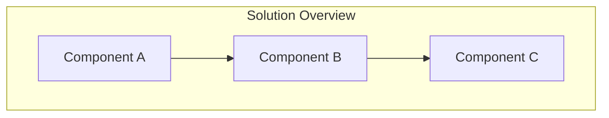
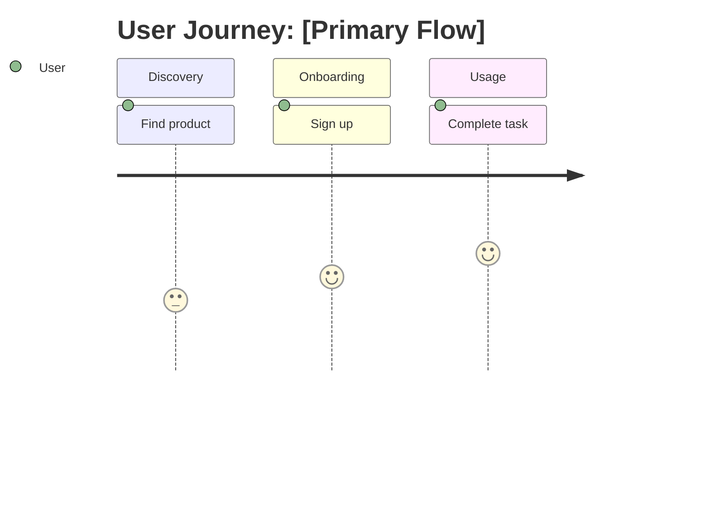

Create a comprehensive Product Requirements Document (PRD) from a product description
or feature idea. Delegates to @product-manager for user analysis, acceptance criteria
definition, and structured requirements documentation.

## User Input

```text
$ARGUMENTS
```

If no arguments provided, conduct a user interview to gather product description.

---

## Agent Delegation

This command delegates to **@product-manager** from the vendored `.claude/agents/` directory.
The product-manager specializes in PRD creation, user research, and requirements definition.

---

## What a PRD may contain

A PRD **records** what was asked for. Everything in it must trace to something real: the
user's own words, a source document (ticket, spec, design doc), a measurement you can cite,
or a named constraint in `stack.md` / `constitution.md`.

**A requirement that traces only to "products like this usually have one" does not belong
in the PRD.** Once it is written down, nothing downstream challenges it — `/create-trd`,
`spec-planner`, `/implement-trd` and `verify-app` all treat a written requirement as
legitimate by construction. So a fabricated one is *executed*, not examined, and it consumes
real implementation work before anyone notices it was never wanted.

The cost is asymmetric and worth holding onto: **a missing requirement surfaces as a
question; a fabricated one silently consumes a task.** Prefer omission to invention.

**Dropping a requirement is the commoner failure.** In this project's own corpus, silently
narrowing scope outnumbers inventing requirements. Everything the source asks for must
either appear in the PRD or be listed explicitly under Non-Goals. Never quietly rescope.

If a claim is believed but unverified, label it — **"Belief, not fact"** — and name what
would settle it. That marker is cheaper and always-on compared to any later review.

---

## PRD Document Structure

The generated PRD follows the structure below.

**Sections are containers, not quotas.** A heading is not an instruction to fill it. An
empty section is a **correct, expected outcome** when nobody raised that concern — and a
stronger signal than a plausible invention. Never populate a section to make the document
look complete.

### Document Header

```markdown
# PRD: [Product/Feature Name]

**Version**: 1.0.0
**Status**: Draft | In Review | Approved
**Created**: [Date]
**Last Updated**: [Date]
**Author**: @product-manager
**Stakeholders**: [List key stakeholders]

---
```

### Section 1: Changelog

Track all significant changes to this PRD. Add entries as refinements occur.

```markdown
## Changelog

| Version | Date | Changes | Author |
|---------|------|---------|--------|
| 1.0.0 | [Date] | Initial PRD creation | @product-manager |
```

### Section 2: Product Summary

```markdown
## 1. Product Summary

### 1.1 Problem Statement
[Clear description of the problem being solved]

### 1.2 Proposed Solution
[High-level description of the solution]

### 1.3 Value Proposition
[Why this matters - business value, user value]

### 1.4 Key Differentiators (optional)
[What makes this approach unique]

### 1.5 Solution Architecture

Include a Mermaid diagram here when the solution has parts whose relationship is not
obvious from the prose. Do NOT use ASCII art. Skip it for a self-contained change.


```

### Section 3: User Analysis

```markdown
## 2. User Analysis

### 2.1 Target Users
| User Type | Description | Primary Need |
|-----------|-------------|--------------|
| [Type 1] | [Description] | [Need] |

### 2.2 User Personas

For each primary user type, create a detailed persona:

**Persona: [Name]**
- **Role**: [Job title/role]
- **Goals**: [What they want to achieve]
- **Pain Points**: [Current frustrations]
- **Technical Proficiency**: [Low/Medium/High]

### 2.3 User Journey

Include a journey diagram when the flow spans several steps or actors. Skip it when the
journey is one screen.


```

### Section 4: Goals and Non-Goals

**IMPORTANT**: Non-goals are referenced by `/implement-trd` to prevent scope creep.
Be explicit and specific - vague non-goals are not actionable.

```markdown
## 3. Goals and Non-Goals

### 3.1 Goals

| ID | Goal | Success Metric | Priority |
|----|------|----------------|----------|
| G1 | [Goal description] | [Measurable metric] | P0 |
| G2 | [Goal description] | [Measurable metric] | P0 |
| G3 | [Goal description] | [Measurable metric] | P1 |

### 3.2 Non-Goals (Explicit Scope Exclusions)

These items are **explicitly out of scope** for this PRD. Implementation agents
will reference this list to reject scope creep.

| ID | Non-Goal | Rationale |
|----|----------|-----------|
| NG1 | [What we will NOT do] | [Why it's excluded] |
| NG2 | [What we will NOT do] | [Why it's excluded] |
```

### Section 5: Feature Requirements

Organize features by priority. Use P0/P1/P2 classification:
- **P0**: Must have for MVP / initial release
- **P1**: Should have for complete solution
- **P2**: Nice to have / future enhancement

```markdown
## 4. Feature Requirements

### 4.1 P0 - Core Features (Must Have)

#### F1: [Feature Name]
**Priority**: P0
**Description**: [What this feature does]

**User Stories**:
- As a [user], I want to [action] so that [benefit]

**Acceptance Criteria**:
- [ ] AC-F1.1: [Criterion 1]
- [ ] AC-F1.2: [Criterion 2]

**Dependencies**: [Other features or systems this depends on]

#### F2: [Feature Name]
...

### 4.2 P1 - Enhanced Features (Should Have)

#### F3: [Feature Name]
**Priority**: P1
...

### 4.3 P2 - Future Features (Nice to Have) (optional)

#### F4: [Feature Name]
**Priority**: P2
...
```

### Section 6: Non-Functional Requirements

**One section. No category scaffolding, and no example values.**

Five named subsections — Performance, Security, Accessibility, Scalability, Integration —
are five prompts to fill, and an author facing "Performance Requirements" above an empty
table will produce a latency figure. They are deliberately gone. So are example numbers:
an example value is an anchor, and anchors get adopted verbatim.

List non-functional requirements as they actually arise, each with its source.

```markdown
## 5. Non-Functional Requirements

| ID | Requirement | Source |
|----|-------------|--------|
| NFR-1 | [What must be true] | [PRD text / user's words / stack.md / constitution.md / a measurement] |
```

**Empty is a legitimate and expected outcome.** Most features have no non-functional
requirement anyone asked for. Do not read emptiness as incompleteness.

Rules for this section:

- **Never invent a number.** No latency, throughput, uptime, or coverage figure unless the
  user stated it, a source document states it, or you can cite a measurement.
- **Source the severity, not just the requirement.** "Must be fast" becoming "p95 < 200ms"
  is an invention even when "must be fast" was real. If a number is aspirational, say so:
  *"target, not an enforced threshold."*
- **Accessibility**: include a concrete requirement when the feature has a user interface
  and the project or a regulation names a standard. Do not paste a generic WCAG line into
  a PRD for a background worker.
- **Integration points** belong here only when they constrain the product. Otherwise they
  are technical design and belong in the TRD.

### Section 7: Acceptance Criteria Summary

Consolidate all acceptance criteria for easy reference during implementation.

```markdown
## 6. Acceptance Criteria Summary

### Feature Acceptance Criteria

| ID | Feature | Criterion | Verification Method |
|----|---------|-----------|---------------------|
| AC-F1.1 | F1 | [Criterion] | [Unit test / E2E / Manual] |
| AC-F1.2 | F1 | [Criterion] | [Unit test / E2E / Manual] |
| AC-F2.1 | F2 | [Criterion] | [Unit test / E2E / Manual] |

### Non-Functional Acceptance Criteria

One row per entry in Section 5 — no more. This table is a restatement for convenience,
**not a second place to introduce requirements.** If a row here has no matching NFR in
Section 5, it was invented at summary time; delete it.

| ID | Requirement | Criterion | Verification Method |
|----|-------------|-----------|---------------------|
| AC-N1 | [NFR-1 from Section 5] | [Criterion] | [How verified] |

Empty when Section 5 is empty.
```

### Section 8: Risk Assessment

**IMPORTANT**: Risks are referenced by `/implement-trd` for contingency planning.

```markdown
## 7. Risk Assessment

| ID | Risk | Likelihood | Impact | Mitigation Strategy |
|----|------|------------|--------|---------------------|
| R1 | [Risk description] | High/Med/Low | High/Med/Low | [How to mitigate] |

A risk earns a row when you can name what would trigger it in *this* product. Generic
hazards ("users might not adopt it", "the timeline might slip") apply to everything and
bury the one or two that are real. Empty is legitimate for a small, well-understood change.

### Contingency Plans

For high-impact risks, document specific contingency plans:

**R1 Contingency**: [What to do if this risk materializes]
```

### Section 9: Decisions and Rejected Alternatives

**REQUIRED whenever anything was considered and set aside.**

The single most emphatic complaint in this project's history is a decision being
re-litigated — including decisions taken minutes earlier, in context. A PRD that records
only what was chosen gives the next reader no way to know that the obvious alternative was
already considered and rejected, so they propose it again.

This standardises a convention the corpus already uses (roughly half of existing PRDs
record disagreements and rejections somewhere). Adopt this **format**, which is better than
recording the verdict alone:

```markdown
## N. Decisions and Rejected Alternatives

| Proposal / Challenge | Verdict | Rationale | Revisit when |
|----------------------|---------|-----------|--------------|
| Promote geofence triggers to P0 | Rejected | Adds significant scope; the LLM can infer from raw coordinates | v2, with eval data showing where the LLM struggles |
| Queue-based ingestion | Rejected | Cost, for a pre-beta system with one real user | Sustained load above [figure] |

### Confirmed grounding — do not re-litigate

- [Decision the user has already settled, stated once, plainly]
```

**The `Revisit when` column is what makes this work.** A rejection with no revisit condition
reads as permanent, and gets re-opened the moment circumstances change — which is the exact
failure this section exists to prevent. If a rejection is genuinely unconditional, write
"never" and say why.

The **do-not-re-litigate** list is for decisions the user has explicitly settled. Keep it
short and keep it verbatim; it is a record of what they said, not a summary of it.

### Section 10: Appendices (optional)

Use appendices for reference material that doesn't fit in main sections.

```markdown
## Appendices

### Appendix A: Glossary (optional)
| Term | Definition |
|------|------------|
| [Term] | [Definition] |

### Appendix B: Related Documents (optional)
- [Link to related PRD]
- [Link to technical spec]

### Appendix C: Open Questions (optional)
| Question | Status | Resolution |
|----------|--------|------------|
| [Question] | Open/Resolved | [Answer if resolved] |
```

---

## Diagram Requirements

**MANDATORY**: Use Mermaid syntax for all diagrams. Do NOT use ASCII art.

Acceptable diagram types:
- `graph TB/LR` - Flowcharts and architecture
- `sequenceDiagram` - Interaction flows
- `journey` - User journeys
- `erDiagram` - Data relationships
- `stateDiagram-v2` - State machines

There is **no diagram quota.** A quota is an instruction to manufacture, and a diagram
restating a table nobody was confused by is noise that hides the useful ones.

Include a diagram where it shows something a reader would otherwise reconstruct by hand —
a multi-actor flow, a non-obvious system boundary, a journey with real branching. A
single-screen feature with three acceptance criteria does not need one.

---

## Output Management

### File Location
Save to `docs/PRD/<feature-name>.md`

Use lowercase, hyphenated names:
- `docs/PRD/user-authentication.md`
- `docs/PRD/checkout-flow.md`

### State Update
Update `.trd-state/current.json`:
```json
{
  "prd": "docs/PRD/<feature-name>.md",
  "trd": null,
  "status": "prd-created",
  "branch": null
}
```

### Validation Checklist

Before completing, verify:
- [ ] Every requirement traces to the user's words, a source document, a measurement, or a named constraint
- [ ] Nothing the source asked for is missing — anything dropped is listed under Non-Goals
- [ ] No invented numbers; any number present carries its source, and aspirational ones say so
- [ ] All features have acceptance criteria
- [ ] Non-goals are specific and actionable
- [ ] Priority labels (P0/P1/P2) assigned to all features
- [ ] Decisions section records rejected alternatives with revisit conditions
- [ ] Unverified claims are labelled "Belief, not fact" with a named way to settle them

---

## Usage

```
/create-prd <product description or feature idea>
```

### Examples

```
/create-prd User authentication with OAuth2 support
/create-prd E-commerce checkout flow with payment integration
/create-prd Real-time notification system for mobile app
```

---

## Handoff

After PRD creation:
1. Review with stakeholders
2. Use `/refine-prd` for iterations
3. When approved, use `/create-trd` to generate technical requirements

The TRD will reference:
- Goals for success criteria
- Non-goals for scope boundaries
- Risks for contingency planning
- Acceptance criteria for test generation


---

## Execution: the workflow is the orchestrator

**The five stages below run as a saved workflow, not as prose you re-interpret.** Invoke it:

```
Workflow({ name: "create-prd", args: { source: "<verbatim doc path or empty>", brief: "<brief path or empty>", prd: "docs/PRD/<feature>.md", feature: "<feature>" } })
```

The script is `.claude/workflows/create-prd.js`. It owns sequencing, fan-out, and the schemas
that force structured findings. **Read it before changing any stage description here** — the
prompts live in the script; this file carries the content rules the script's agents are told
to read.

Three things the script gives you that this prose cannot:

- **`agent({schema})` enforces the findings contract** at the tool-call layer, and the model
  retries on mismatch. Stated as prose, the contract is a request.
- **Findings live in script variables**, never in the orchestrator's context. The
  `.trd-state/<feature>/findings/` mechanism described below is the *fallback* for running
  this command without the workflow; under the workflow it is unnecessary.
- **Sequence is `await`, not instruction.** The grounding stage cannot be skipped or
  reordered ahead of authoring.

**Fallback.** If the workflow is unavailable, run the stages below directly as described —
the content rules, mandates and readout format are identical either way. Say which path you
took in the COMMAND COMPLETE summary, so a surprising result can be attributed.

---

## Workflow: source, author, verify

### 0. Resolve the source

Establish what this PRD is accountable to, and record the path in the PRD header.

- A **source document** was given (ticket, spec, story, design doc) → that document is the
  source.
- The feature was **defined in this session** (discussion, decisions reached live) → the
  session transcript is the source. Record its path.
- **Both** — the common case: a ticket, then refined in conversation.

### 1. Build the source package

**Distillation is a lossy transform. Apply it only where nothing else can carry the
information.** Paraphrasing a faithful source manufactures drift.

| Case | What to pass to the author and every verifier |
|---|---|
| A source document exists | The document **verbatim and unaltered**. Do not summarise, restate, or clean it up. The document *is* the source package. |
| Defined in session only | A brief at `docs/PRD/<feature>.brief.md`, because nothing else can carry it. The brief is an authoring input and a *checkable claim about the transcript* — it is not the baseline. |
| Both | The verbatim document **plus** a brief covering only the in-session delta, clearly separated. The brief must not restate the document. |

The two classes carry different risk, and separating them makes that visible: a verbatim
document is low-risk (someone wrote it down deliberately, outside this session), while
session-distilled content is where requirements get invented and an aside becomes an
acceptance criterion.

### 2. Author

One `product-manager` subagent, fresh context, seeing the source package **verbatim** plus
the repository. A PRD is synthesis and needs one voice; merged reports produce a stitched
document.

### 3. Verify — parallel, read-only, findable-only

Run on **every** invocation. No complexity threshold: a threshold is itself an unsourced
requirement, and it would skip verification exactly when a one-line prompt got elaborated
into something large. Verifiers return empty quickly on a small draft.

| Verifier | Checks |
|---|---|
| `source-fidelity` | **Both directions, against the SOURCE — never against the brief.** source → PRD: which requirements, decisions and rejections are missing? PRD → source: which requirements trace to nothing? |
| `grounding` | Does this already exist, or contradict the codebase or existing docs? |
| `conformance` | Does anything violate `stack.md` or `constitution.md`? |

**Verify against source, never against the brief.** The brief is derived; checking the PRD
against it only proves the PRD is faithful to a summary, and *certifies* anything the brief
already dropped or invented. Where a source document exists, that document is what the check
runs against.

**No verifier may invent a requirement or strike one on judgment.** *"REQ-4 traces to nothing
in the source"* is checkable and permitted. *"I think REQ-4 is unnecessary"* is manufactured
and forbidden — a challenger fills the role it was handed exactly as an author does, and
striking a real requirement is harder to detect than adding a fake one.

**A verifier finding that asserts severity carries the same sourcing burden as a
requirement.** Reviewers inflating severity is the observed failure, not reviewers striking
valid requirements.

#### Verifier return contract — findings go to disk, not into the caller's context

**Each verifier writes its findings to a file and returns ONE line.**

```
.trd-state/<feature>/findings/<verifier-name>.json     (mkdir -p as needed)
```

Return exactly: `<n> findings → <path>` (or `0 findings` and write nothing).

Do **not** return the findings themselves as prose. Three verifiers returning full findings
lists is the single largest contribution to this command's context cost, and the orchestrator
does not read them — the reconcile stage does.

Findings are per-run scratch: overwrite them each invocation, and never treat a stale file
as current.

Each finding is an object with at minimum:

```json
{ "id": "REQ-7", "action": "delete|add-back|record|lower|check",
  "line": "REQ-7  Latency p95 <= 2000ms",
  "why": "traces to nothing in source",
  "where": "docs/PRD/<feature>.md §5" }
```

### 4. Reconcile — 1 subagent

One subagent reads the findings files plus the draft, applies them, and drafts the readout.
It spawns nothing.

Keeping this out of the main agent is deliberate: applying N findings means re-reading the
draft and editing it repeatedly, which is the other half of this command's context cost.
The main agent receives the finished readout, prints it, and emits COMMAND COMPLETE.

**Why findings go to disk rather than into a fork.** A fork inherits post-compaction
context, and this is a *review* stage — the evidence must stay inspectable. Findings on disk
can be re-read, diffed, and cited by ID after the fact; findings summarised through an
intermediate agent cannot. The whole purpose of this command is making manufactured
requirements visible, so the one thing not to do is bury the reasoning behind them.

**The source package stays in the main agent** and is not forked. Its input is already in
main context — a source document is one file read, and a session-derived brief has no tool
calls at all — so there is nothing to offload. Forking it would inherit post-compaction
context and silently drop the oldest decisions, which is precisely what the brief exists to
carry (P6, and §2.1's qualification of it).

---

## Readout

Emit at `COMMAND COMPLETE`, before the banner. One screen.

**Every line names the action, not the classification.** Readouts here have been rejected
repeatedly for being unreadable — *"I DO NOT UNDERSTAND what action you expect me to take on
these?"* A heading like "Unsourced requirements" tells the reader nothing to do.

```
PRD: docs/PRD/<feature>.md    SOURCE: <document path | transcript path>

  ADD BACK — in the source, missing from this PRD (1)
    Source records an LLM rewrite of descriptions; the PRD does not carry it

  RECORD THIS REJECTION — decided in the source, not written down (1)
    Source rejects a queue-based design on cost; the PRD does not say so

  DELETE — nothing in the source asks for these (2)
    NFR-3   99.9% uptime target        no source
    REQ-7   p95 latency <= 2000ms      no source

  NO ACTION — sourced, listed for completeness (5)
    NFR-2   Postgres for persistence   <- stack.md
    ...
```

Ordered by how expensive the failure is to find later — **missing requirements first**,
because dropping one is commoner than inventing one. Items with no action need no review;
if there are 40 of them, print the count as one line, not forty.

---

## Output discipline (see `.claude/rules/command-status.md`)

**End your final turn with the banner — last line of output, nothing after it:**

```
═══ COMMAND COMPLETE: /create-prd ═══
<one-line summary of what was produced>
```

On unrecoverable failure, use `═══ COMMAND STUCK: /create-prd ═══` followed by `Reason:` and `Next:` lines.

**Programmatic completion notify** — on the same final turn, invoke the user's `NOTIFY_ON_COMPLETE` shell command (if set) for webhook/queue/shell-pipeline integration:

```bash
.claude/hooks/notify-complete.sh "create-prd" "complete" "<one-line summary>"
```

For `COMMAND STUCK`, set `NOTIFY_STATUS="stuck"`. The bracket-guard makes this a no-op when not configured.


---

## Autonomous-execution discipline (see `.claude/rules/autonomy.md`)

This command runs **autonomously** from this invocation to the COMMAND COMPLETE banner.
**Do NOT pause mid-flow to ask the user to confirm decisions, review artifacts, verify
checkpoints, or defer to stakeholders.** The user already authorized the run by invoking
the command; do not ask them to authorize it again, in pieces.

`AskUserQuestion` is permitted ONLY in these four cases:

1. **Genuine requirement ambiguity** — the PRD/TRD/stack.md is silent on a decision
   that MUST be made, AND no reasonable default exists from documented constraints.
   *Try a default first; ask only if none fits.*
2. **Missing information that cannot be derived** — a value not in the codebase, env,
   config, or anywhere derivable (a user-specific URL, API key not in env, etc.).
3. **Truly irreversible destructive operations** — `--reset-state` with progress,
   `git push --force`, deleting user-authored files. Routine state mutations do NOT
   qualify.
4. **STUCK conditions** — retry exhaustion after the documented mitigations have run.

Outside these four cases: **decide based on documented constraints, document the
rationale in the artifact, and proceed.** The user iterates via `/refine-prd`,
`/refine-trd`, or `/implement-trd --resume` — not via mid-loop confirmation prompts.

Forbidden patterns:
- "Should I proceed to phase N+1?" → no — emit PHASE banner, proceed.
- "Please review this artifact before I continue." → no — finish the artifact, emit
  COMMAND COMPLETE.
- "Multiple approaches possible; which do you prefer?" → pick the best fit, document
  why, mention alternatives in the artifact if useful.
- "Should I check with product/legal/stakeholders?" → no — decide based on documented
  goals; the user can correct via /refine-*.
- "Checkpoint reached. Continue?" → continue. Always.
- "I'll continue unless you want me to pause." / "Want me to keep going, or pause for a look?" → **HEDGED OFFERS ARE STILL OFFERS.** Just proceed without announcing. If you draft a sentence offering to pause, delete it and continue.
- "Given the previous step went cleanly, do you want me to pause and review?" → self-defeating: you just acknowledged there's nothing to address. PROCEED.

### `--wiggum` and other autonomous-mode flags

When the user has passed `--wiggum` on this command, the autonomy contract is **doubly enforced**: every "should I continue?" question is already answered YES by the flag itself. The FOUR valid `AskUserQuestion` cases shrink to ONE — only STUCK conditions after retry exhaustion. All other questions, hedged offers, and "want me to pause?" framings are forbidden. The COMMAND COMPLETE banner is the FIRST and ONLY return of control to the user during a `--wiggum` run.
