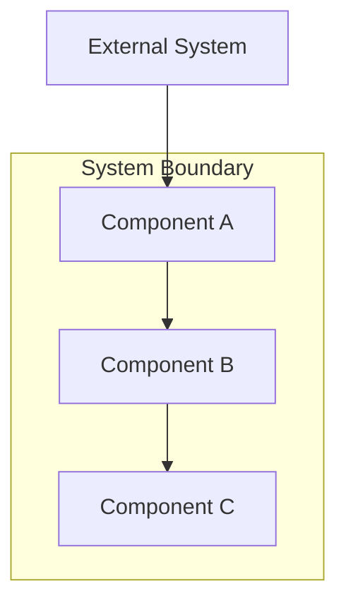
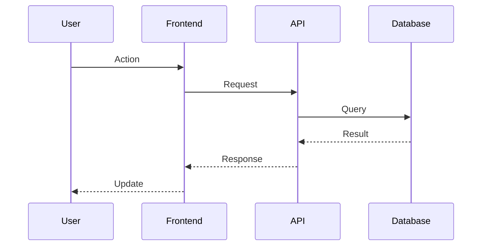
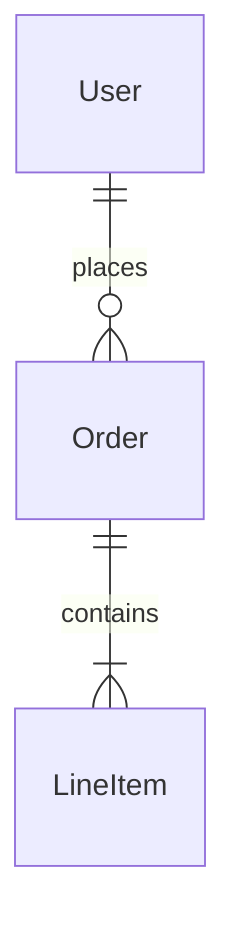

This command takes a comprehensive Product Requirements Document (PRD) and creates a
Technical Requirements Document (TRD) with architecture design, task breakdown, and
execution plan. Delegates to @technical-architect for technical planning.

## User Input

```text
$ARGUMENTS
```

If no path provided, resolve from `.trd-state/current.json` field `prd`.
Error if neither available.

---

## Agent Delegation

This command delegates to **@technical-architect** from the vendored `.claude/agents/` directory.
The technical-architect specializes in TRD creation, architecture design, and implementation planning.

---

## Plan Mode

The TRD operates in **plan mode** - it generates an execution plan but does NOT execute
implementation.

**IMPORTANT**: Execution plans contain NO timing estimates or duration predictions.
Plans organize work by logical dependencies, not calendar time.

---

## PRD Import Requirements

When creating the TRD, import and reference these PRD sections:

| PRD Section | TRD Usage |
|-------------|-----------|
| **Non-Goals** | Copy to TRD; implementation agents check against these for scope creep |
| **Risks** | Incorporate into Risk Assessment with technical mitigations |
| **Acceptance Criteria** | Map to test requirements and verification tasks |
| **Goals** | Define success criteria for implementation |

---

## The typing rule: invent the HOW, never the HOW WELL

**This is the most important rule in this command. Read it before writing anything.**

Every line you write into a TRD is one of three types. The type determines what it owes:

| Type | What it is | What it must satisfy |
|------|------------|----------------------|
| **Objective** | What must be true, and *how well* — acceptance criteria, non-functional requirements, thresholds, quality gates, coverage targets, latency budgets | **Provenance.** Must trace to the PRD, to `stack.md`/`constitution.md`, to a measurement you can cite, or to an explicit user instruction. **May NOT be invented.** |
| **Decision** | *How* it will be built — architecture, technology, structure, sequencing, module boundaries | **Derivation + buildability + consistency.** Must serve a named objective, be constructible as written, not contradict a sibling decision, and be recorded with its alternatives. **Free to be invented — that is your job.** |
| **Task** | The work to do | Must name the objective or decision it serves. |

You may freely decide Postgres, a queue, a three-phase rollout, a particular module
boundary. None of that needs user provenance — only an upward link to an objective and a
conformance check against `stack.md`.

What you may **NOT** do is decide that the thing must respond in under two seconds, sustain
99.9% uptime, or hit 80% test coverage — unless someone actually asked.

### Type by nature, never by section

**A measurable threshold is an objective wherever it appears.** A latency figure inside a
"Technical Specifications" section is still an objective. "Use Redis for caching" is a
decision; "cache hit rate must exceed 90%" is an objective wearing a decision's clothes.
Classify by what the line *is*, not by the heading it sits under.

### Delivery machinery is a decision and owes an objective

Feature flags, rollout phases, migration paths, guard infrastructure, eval gates, staged
enablement and rollback tooling are **decisions**. Each must name the objective it serves.

If the honest answer is *"no objective — this is just how we'd normally ship,"* **do not
include it.** This is the single largest source of wasted implementation work: machinery
nobody asked for, built and then deployed dark. A feature behind a flag nobody turns on is
worse than a feature that was never built, because it costs the build *and* hides the result.

### Domain-derived objectives are permitted, and must be labelled

Some objectives genuinely follow from the domain rather than from a document — *"must not
lose a payment"*, *"must not leak PII across tenants"*. These are legitimate. Label them
`domain-derived` and state the reasoning. They appear in the readout as their own class:
not blocked, but visible.

The distinction being enforced is between an objective someone can point at, and one that
appeared because a table looked empty.

### Thresholds: source the SEVERITY, not just the requirement

The commonest failure is not an invented requirement — it is a real requirement given an
invented strictness. "Zero tolerance" and "≤1 per run" are different requirements, and the
gap between them is where unexamined severity hides.

**An objective that exceeds a floor stated in `constitution.md` MUST state why, inline.**
No reason, no exceedance — use the constitution's number. This one rule catches roughly half
of all manufactured objectives measured in this project's own corpus.

If a number is a target rather than an enforced gate, say so in the line itself
("target, not an enforced threshold"). Declassifying severity by hand is correct and welcome.

### Omission is a failure too

Dropping a requirement is **commoner** than inventing one. Every objective in the source
must either appear in the TRD or be explicitly listed under Non-Goals. Silently narrowing
scope — reproducing seven of a PRD's eight metrics and dropping the eighth without comment —
is the failure that a per-line audit structurally cannot see. Check the source forwards, not
just the TRD backwards.

---

## TRD Document Structure

The generated TRD follows the structure below.

**Sections are containers, not quotas.** A heading is not an instruction to fill it. If a
feature has no non-functional requirements anyone asked for, that section is empty, and an
empty section is a **correct, expected outcome** — a stronger signal than a plausible
invention. Never populate a section to make the document look complete.

The same applies to diagrams: include a diagram where it clarifies something a reader would
otherwise have to reconstruct. There is no diagram quota.

### Document Header

```markdown
# TRD: [Product/Feature Name]

**Version**: 1.0.0
**Status**: Draft | In Review | Approved
**Created**: [Date]
**Last Updated**: [Date]
**Author**: @technical-architect
**Source PRD**: [Link to PRD file]
**Task ID Prefix**: [PREFIX] (e.g., AUTH, CHECKOUT, NOTIFY)

---
```

### Section 1: Changelog

```markdown
## Changelog

| Version | Date | Changes | Author |
|---------|------|---------|--------|
| 1.0.0 | [Date] | Initial TRD creation | @technical-architect |
```

### Section 2: Overview

```markdown
## 1. Overview

### 1.1 Technical Summary
[Brief description of the technical approach and key architectural decisions]

### 1.2 Key Technical Decisions

| ID | Decision | Choice | Serves Objective | Rationale | Alternatives Considered |
|----|----------|--------|------------------|-----------|------------------------|
| D1 | [Decision area] | [What was chosen] | [Objective ID this serves] | [Why] | [What else was considered] |

**`Serves Objective` is mandatory.** Every decision exists to satisfy something. If you
cannot name the objective, the decision is unmotivated — remove it, or surface the
objective it implies and give that objective provenance of its own.

**`Alternatives Considered` is mandatory too**, and a rejection is more useful with a
revisit condition: *"adds significant scope; the LLM can infer this from raw coordinates —
revisit in v2 with eval data showing where it struggles."* A rejection with no revisit
condition reads as permanent and gets re-litigated the moment conditions change.

### 1.3 Technology Stack

| Layer | Technology | Purpose | Notes |
|-------|------------|---------|-------|
| Frontend | [e.g., React] | [Purpose] | [Version, etc.] |
| Backend | [e.g., Node.js] | [Purpose] | |
| Database | [e.g., PostgreSQL] | [Purpose] | |

### 1.4 Integration Points

| System | Type | Direction | Notes |
|--------|------|-----------|-------|
| [External system] | [REST/GraphQL/Event] | [In/Out/Both] | [Notes] |
```

### Section 3: System Architecture

Use Mermaid for diagrams here. Do NOT use ASCII art. Include the diagrams that clarify
this system; there is no required count.

```markdown
## 2. System Architecture

### 2.1 Architecture Overview

Include a high-level architecture diagram when the component topology is not obvious from
the task list.



### 2.2 Component Architecture

#### 2.2.1 [Component Name]
**Responsibility**: [What this component does]
**Interfaces**: [APIs, events, etc.]
**Dependencies**: [What it depends on]

### 2.3 Data Flow

Include a data-flow diagram when a flow crosses more than one service or component.



### 2.4 State Management (if applicable)

[Description of state management approach]
```

### Section 4: Technical Specifications

Detail the technical implementation for each major component.

```markdown
## 3. Technical Specifications

### 3.1 [Component/Feature Name]

**Purpose**: [What this does]

**Interface**:
```typescript
// API contract or interface definition
interface Example {
  field: Type;
}
```

**Behavior**:
- [Behavior 1]
- [Behavior 2]

**Error Handling**:
- [Error case]: [How handled]

### 3.2 [Next Component]
...
```

### Section 5: Master Task List

**CRITICAL**: Task ID Convention for unique identification across project.

```markdown
## 4. Master Task List

### 4.1 Task ID Convention

Task IDs follow the format: `[PREFIX]-[CATEGORY][SEQ]`

- **PREFIX**: Unique identifier for this TRD (from header, e.g., AUTH, CHECKOUT)
- **CATEGORY**: Single letter indicating task type
  - `P` = Plugin/Infrastructure setup
  - `F` = Frontend implementation
  - `B` = Backend implementation
  - `T` = Testing
  - `D` = Documentation
  - `I` = Integration
- **SEQ**: Three-digit sequence number (001, 002, etc.)

Examples:
- `AUTH-B001` = Authentication TRD, Backend task 1
- `AUTH-F001` = Authentication TRD, Frontend task 1
- `CHECKOUT-T001` = Checkout TRD, Test task 1

### 4.1.1 Live Verification Marker

Tasks that require live/running service verification get a `[LIVE]` marker in their description:

```
- [ ] **AUTH-B001** [LIVE]: Implement JWT authentication endpoint
```

The `[LIVE]` marker tells verify-app to start the service and verify against a running instance,
regardless of the project's `verification_level` setting. Use `[LIVE]` for:
- API endpoint tasks (needs running server to verify HTTP responses)
- Database integration tasks (needs running database to verify queries)
- Service integration tasks (needs running services to verify communication)

Tasks WITHOUT `[LIVE]` use the project's default `verification_level` from constitution.md.

### 4.1.2 Skill Hints

Each task SHOULD include a `Skills` column listing ensemble skills the implementer
should invoke via the Skill tool. To populate this column:

1. **Determine the target agent** for the task based on category letter
   (B → backend-implementer, F → frontend-implementer, T → verify-app, etc.)
2. **Consult the project's skill assignment** — `skill-affinity.json`, plus the skills
   listed in the session's system prompt. **Do NOT read a `skills:` key from the agent
   frontmatter: no agent has one.** Hardcoded `skills:` preloads were removed from all
   13 agents in 4.1.1 (`c4962d0`) in favour of deterministic per-project assignment
3. **For each skill** the agent declares, read its description from the skill's
   SKILL.md (available skills are listed in the system prompt or discoverable
   via the plugin's skills directory)
4. **Match**: if the skill's "Use when..." description aligns with the task's
   domain and description, include it in the Skills column

If no clear match exists, leave the Skills column empty — implement-trd will
fall back to the agent's full skills list at delegation time.

**Example:** A backend task implementing a .NET API endpoint with Clerk auth:
- Target agent: backend-implementer
- Agent skills include: `developing-with-dotnet`, `using-clerk`, `building-integrations`, ...
- `developing-with-dotnet` description: "Use when writing C# code or working with .NET projects" → match
- `using-clerk` description: "Use when implementing auth with Clerk" → match
- Skills column: `developing-with-dotnet, using-clerk`

### 4.2 Phase 1: [Phase Name]

| Task ID | Description | Serves | Skills | Dependencies | Acceptance Criteria |
|---------|-------------|--------|--------|--------------|---------------------|
| [PREFIX]-P001 | [Task description] | [Objective or Decision ID] | | None | [Criteria] |
| [PREFIX]-P002 | [Task description] | [Objective or Decision ID] | | [PREFIX]-P001 | [Criteria] |

### 4.3 Phase 2: [Phase Name]

| Task ID | Description | Serves | Skills | Dependencies | Acceptance Criteria |
|---------|-------------|--------|--------|--------------|---------------------|
| [PREFIX]-B001 | [Task description] | AC-F1.1 | `developing-with-dotnet` | [PREFIX]-P002 | [Criteria] |
| [PREFIX]-F001 | [Task description] | D2 | `developing-with-react`, `jest` | [PREFIX]-B001 (API contract only) | [Criteria] |

**The `Serves` column is mandatory and machine-readable.** Every task names the objective
or decision ID it exists to satisfy. A task that serves nothing is work nobody asked for —
the commonest form being delivery machinery (flags, rollout stages, guard infrastructure)
added because it is how one normally ships. Remove it, or surface the objective it implies
and source that objective.

### 4.4 Phase 3: [Phase Name]
...
```

### Section 6: Execution Plan

**CRITICAL**: Phasing and parallelization are essential for efficient implementation.

```markdown
## 5. Execution Plan

### 5.1 Phase Overview

| Phase | Focus | Prerequisites | Parallelizable Sessions |
|-------|-------|---------------|------------------------|
| 1 | Foundation | None | 1A, 1B can run in parallel |
| 2 | Implementation | Phase 1 complete | 2A, 2B can run in parallel after API contract |
| 3 | Integration | Phase 2 complete | 3A, 3B can run in parallel |

### 5.2 Session Details

#### Phase 1: Foundation

**Session 1A: [Session Name]**
- Tasks: [PREFIX]-P001, [PREFIX]-P002
- Agent: @backend-implementer
- Can parallelize with: Session 1B

**Session 1B: [Session Name]**
- Tasks: [PREFIX]-P003, [PREFIX]-P004
- Agent: @frontend-implementer
- Can parallelize with: Session 1A

#### Phase 2: Implementation

**Session 2A: [Session Name]**
- Tasks: [PREFIX]-B001, [PREFIX]-B002
- Agent: @backend-implementer
- Blocked by: Session 1A

**Session 2B: [Session Name]**
- Tasks: [PREFIX]-F001, [PREFIX]-F002
- Agent: @frontend-implementer
- Blocked by: API contract from 2A (not full completion)
- Can parallelize with: Session 2A (after contract)

### 5.3 Parallelization Map

Include a dependency/parallelism diagram when there is real parallelism to show. Skip it
for a short sequential plan — the task table already says everything.



```mermaid
gantt
    title Execution Plan (No time scale - dependency order only)
    dateFormat X
    axisFormat %s

    section Phase 1
    Session 1A: p1a, 0, 1
    Session 1B: p1b, 0, 1

    section Phase 2
    Session 2A: p2a, after p1a, 1
    Session 2B: p2b, after p1a, 1

    section Phase 3
    Session 3A: p3a, after p2a p2b, 1
```

### 5.4 Critical Path

The critical path is: [List the blocking sequence of tasks]

### 5.5 Offload Recommendations (optional)

Tasks that could be delegated to specialized agents:

| Task | Recommended Agent | Rationale |
|------|-------------------|-----------|
| [Task ID] | @[agent] | [Why] |
```

### Section 7: Quality Requirements

```markdown
## 6. Quality Requirements

Every line in this section is an **objective**. Each one needs provenance, and any
number that exceeds a `constitution.md` floor needs its severity sourced inline.

### 6.1 Testing Requirements

**Read the coverage floors from `.claude/rules/constitution.md` and use those numbers.**
Do not carry a number in from anywhere else — not from this template, not from another
project, not from what a coverage target "usually" is.

| Type | Coverage Target | Source | Scope |
|------|-----------------|--------|-------|
| Unit Tests | [constitution.md floor] | `constitution.md` Quality Gates | [Scope] |
| Integration Tests | [constitution.md floor] | `constitution.md` Quality Gates | [Scope] |

**To exceed a constitution floor, state why in the Source column** — a PRD line, a user
instruction, a measured defect rate, or a named regulatory constraint. "This code is
critical" is not a source; every project believes that about its own code.

If nothing justifies exceeding the floor, use the floor. The floor is the project's
considered answer to this question and it does not need re-deriving per TRD.

### 6.2 Code Quality Standards (only if the PRD or constitution names any)

[Standards that trace to a named source. Empty is correct when none were stated.]

### 6.3 Security Requirements (only if the feature has any)

Include a security objective when the feature handles credentials, personal data,
payments, tenancy boundaries, or external input. Label these `domain-derived` with the
reasoning — they are legitimate without a PRD line, but they must be visible as derived.

For a feature that touches none of those, this section is empty. Do not add a generic
security checklist.

### 6.4 Performance Requirements (only if someone asked)

**Do not invent a latency, throughput, or uptime figure.** No example number appears
anywhere you are meant to FILL — no template stub, no table skeleton, no "e.g." — because an
example number is an anchor and anchors get adopted verbatim.

Concrete figures do appear in the *readout* examples further down. Those are illustrations of
requirements being **deleted for having no source**, not values to copy. If you find yourself
lifting a number out of a readout example into a TRD, that is the exact failure this rule
exists to stop.

Include a performance objective only when the PRD states one, the user asked for one, or
you can cite a measurement. Otherwise omit this section entirely. Most features have no
performance requirement anyone asked for, and a TRD with no performance section is
correct when performance was never raised.

Where you do include one, state whether it is an enforced gate or a target.
```

### Section 8: Risk Assessment

**IMPORTANT**: Import risks from PRD and add technical risks.
These are referenced by `/implement-trd` for contingency planning.

```markdown
## 7. Risk Assessment

### 7.1 Risks Imported from PRD

| PRD Risk ID | Risk | Technical Mitigation |
|-------------|------|---------------------|
| R1 | [From PRD] | [Technical approach to mitigate] |

### 7.2 Technical Risks (only real ones)

| ID | Risk | Likelihood | Impact | Mitigation |
|----|------|------------|--------|------------|
| TR1 | [Technical risk] | High/Med/Low | High/Med/Low | [Mitigation] |

A risk earns a row when you can name what would trigger it in *this* design. Generic
engineering hazards ("the third-party API might be slow", "the migration might fail")
are not risks specific to this TRD, and a risk table padded with them buries the one or
two that matter. Two real risks beat eight plausible ones.

Empty is legitimate for a small, well-understood change.

**Do not use a risk to smuggle in delivery machinery.** "Risk: the rollout might break
things → Mitigation: add a feature flag" is an invented decision wearing a risk's
clothes. If the flag serves a real objective, put it in the task list and name that
objective; if it does not, it does not belong in the TRD at all.

### 7.3 Contingency Plans

For high-impact risks, document specific responses:

**TR1 Contingency**: [What to do if risk materializes]
```

### Section 9: Non-Goals (Imported from PRD)

**IMPORTANT**: Copy from PRD. Implementation agents check against these.

```markdown
## 8. Non-Goals (Scope Boundaries)

The following are **explicitly out of scope** per the PRD. Implementation agents
MUST reject requests that fall into these categories.

| PRD ID | Non-Goal | Rationale |
|--------|----------|-----------|
| NG1 | [From PRD] | [From PRD] |
| NG2 | [From PRD] | [From PRD] |
```

### Section 10: Task Grounding

> **Not written by the authoring stage.** A dedicated grounding pass emits this section
> after the decisions exist, having actually read the code. An author that writes it
> while drafting is grounding decisions it has not finished making, and the work then
> gets done twice with two sources of truth. If you are authoring, skip this section.

**REQUIRED whenever the repository already contains code.** This is the section that stops
implementers reimplementing what exists, contradicting how the system already works, and
leaving dead code behind. Those are collectively the largest source of wasted work in this
framework — larger than invented requirements.

Before writing this section, actually read the code. Grep for the functions, modules and
patterns the plan touches. This section is worthless if it is written from assumption.

Reconcile the plan against the repository on four axes:

| | Requirement | Failure it prevents |
|---|---|---|
| **(a)** | **Consistent with the existing implementation** | A plan that contradicts how the thing already works, discovered at implement time |
| **(b)** | **Maximises reuse** | Reimplementing what exists — the most common silent waste |
| **(c)** | **Deprecates and removes what it refactors out** | Dead code that still *looks* live |
| **(d)** | **Documented per task** | Every implementer rediscovering the same context |

Emit one block per task, keyed by task ID:

```markdown
## 9. Task Grounding

### AUTH-B003
- **Touches:** `packages/api/auth/session.ts`, `packages/api/auth/session.test.ts`
- **Reuse:** `withRetry()` in `packages/api/lib/retry.ts` — do not reimplement backoff
- **Replaces:** `legacyTokenCheck()` in `session.ts:88` becomes unreachable; delete it and
  its three tests in `session.test.ts:120-190`
- **Follow:** the idempotency-key pattern in `packages/api/webhooks/stripe.ts`
- **Careful:** `session.ts` is imported by the mobile client — the signature is a public contract
```

**Only `Touches` is mandatory.** The others appear when they apply. An empty grounding block
is a legitimate result for genuinely greenfield work — state that rather than padding it.

**`Replaces` is the highest-value line and the one nobody writes.** For every task, ask:
*what does this make unreachable?* If the plan supersedes a function, a module, a config
path or a test, name it here and instruct its deletion. A superseded thing that still exists
still looks live, and the next reader — human or agent — will believe it.

This has a worked example in this repository: converting `subagent-discipline.js` to a
prompt-type hook orphaned `recordBlockInLedger` inside a `main()` that no longer executes.
The dispatch ledger silently lost its compensating row. Nothing asked "what does this
replace?", so nothing surfaced it, and it was found days later only because an agent noticed
a *documentation* claim had gone false.

Grounding is a **producer, not a checker** — `/implement-trd` passes a task's grounding block
into the implementer's prompt, so the implementer starts with what is already known instead
of rediscovering it. Findings that land only in a readout are wasted; the implementer never
reads the readout.

### Section 11: Appendices (optional)

```markdown
## Appendices

### Appendix A: File Structure (optional)
```
project/
├── src/
│   ├── components/
│   └── ...
```

### Appendix B: Database Schema (optional)



### Appendix C: API Contracts (optional)

[OpenAPI spec or interface definitions]

### Appendix D: Glossary (optional)

| Term | Definition |
|------|------------|
| [Term] | [Definition] |
```

---

## Diagram Requirements

**Use Mermaid syntax for all diagrams. Do NOT use ASCII art.**

There is **no diagram quota**. A quota is an instruction to manufacture, and a diagram that
restates a table nobody was confused by is noise that makes the real ones harder to find.

Include a diagram where it shows something a reader would otherwise have to reconstruct:
a component topology that isn't obvious from the task list, a data flow crossing several
services, a dependency graph with real parallelism in it. For a single-service change with
four sequential tasks, prose and the task table are clearer than a gantt chart.

---

## Output Management

### File Location
Save to `docs/TRD/<feature-name>.md`

### State Update
Update `.trd-state/current.json`:
```json
{
  "prd": "docs/PRD/<feature-name>.md",
  "trd": "docs/TRD/<feature-name>.md",
  "status": "trd-created",
  "branch": null
}
```

### Validation Checklist

Before completing, verify:
- [ ] Task ID prefix is unique within project
- [ ] All tasks have unique IDs following convention
- [ ] All tasks have dependencies documented
- [ ] Parallelization opportunities identified
- [ ] Non-goals imported from PRD
- [ ] Every objective carries provenance, or is labelled `domain-derived` with reasoning
- [ ] Every number exceeding a `constitution.md` floor states why, inline
- [ ] Every decision names the objective it serves
- [ ] Where the repo already contains code: every task has a grounding block, and anything
      superseded appears in a `Replaces` line (an empty block is legitimate for genuinely
      greenfield work — see §10)
- [ ] Skills column populated for implementation tasks (P, F, B categories)
- [ ] No timing estimates in execution plan

---

## Execution: the workflow is the orchestrator

**The stages below run as a saved workflow, not as prose you re-interpret.** Invoke it:

```
Workflow({ name: "create-trd", args: {
  prd: "<prd path>",                        // or omit and pass transcript
  trd: "docs/TRD/<feature>.md",
  feature: "<feature>",
  transcript: "<session transcript path>"   // REQUIRED when requirements were settled
                                            // in-session: it is the only channel that
                                            // carries them. The script hard-fails when
                                            // neither prd nor transcript is given.
} })
```

**The workflow does not own every stage.** Source resolution stays in the main agent
(it is the only thing holding the conversation), and the final readout is printed by the
main agent. The script owns corpus indexing, authoring and grounding — its `meta.phases` is
the authoritative count.

**The script does NOT verify.** Verification is `/audit-trd`, a separate command that runs
the wave against any TRD — this one, or one written by hand years ago. Create writes; audit
checks. See "Verification is a separate command" below.

The script is `.claude/workflows/create-trd.js`. It owns sequencing, fan-out, and the schemas
that force structured findings. **Read it before changing any stage description here** — the
prompts live in the script; this file carries the content rules the script's agents are told
to read.

Three things the script gives you that this prose cannot:

- **`agent({schema})` enforces the findings contract** at the tool-call layer, and the model
  retries on mismatch. Stated as prose, the contract is a request.
- **The corpus index is a cheap script variable**, not something the author reads. One
  `haiku` pass greps headings and decision tables; the author inherits the index.
- **Sequence is `await`, not instruction.** Grounding cannot be reordered ahead of authoring,
  where grounding a decision nobody has made yet is meaningless.

**Fallback.** If the workflow is unavailable, run the stages below directly as described —
the content rules, mandates and readout format are identical either way. Say which path you
took in the COMMAND COMPLETE summary, so a surprising result can be attributed.

---

## Workflow

```
0. RESOLVE SOURCE        main agent
     PRD (normal path) + stack.md + constitution.md + the codebase.
     Session-derived additions → record the transcript path in the TRD header.
     If the PRD carries a supersession marker, resolve what supersedes it and
     treat that as in-scope source — a TRD verified against a retired PRD
     certifies a retired design.

1. AUTHOR                1 subagent (technical-architect, fresh context)
     Sees the PRD + constraints + repo.
     Types every line it writes — objective | decision | task — and records
     decisions in the Key Technical Decisions table WITH alternatives.

2. GROUND                1 subagent, sequential, GENERATIVE
     Reconciles the decisions against the codebase: consistency, reuse, what
     becomes unreachable, per-task context. Emits Section 10, Task Grounding.

3. READOUT               main agent — prints the readout, COMMAND COMPLETE,
     and names /audit-trd as the next step. The TRD is NOT verified yet.

   ── /audit-trd runs the rest, as a separate command, whenever you choose ──

4. INDEX                 1 cheap subagent — re-derives objectives/decisions/tasks
     from the DOCUMENT, so audit works on any TRD, not just one create wrote.

5. VERIFY                5 subagents, parallel, read-only, none may invent.
     Findings live in script variables, never in an orchestrator context.

6. RECONCILE             1 subagent — applies what survives, REJECTS bad findings
     naming the file that refutes each, and rewrites ## Could Not Verify.
```

**Grounding runs sequentially and alone, not as part of the verify wave.** It is
*generative* — it writes task context rather than finding faults — and the rule that
fan-out is for verification only applies to it. Four grounding agents in parallel would
produce four opinions about which code to reuse. It runs *after* decisions exist, because
grounding a decision that has not been made is meaningless.

**Fan out for verification; never for generation.** Independent agents demonstrably
outperform a single one when challenging and checking, and manufacture when generating.

---

## Verification is a separate command

**This command does not verify. `/audit-trd` does**, and it carries the full wave —
provenance, severity, derivation, omission, buildability, consistency, citations,
conformance — with the findable-only mandate and the reject-bad-findings discipline. See
`.claude/commands/audit-trd.md` for what each verifier checks.

Create ends by writing two sections that make the handoff explicit:

| Section | Consumed by | Means |
|---|---|---|
| `## Open Questions` | `/refine-trd` | "I had to decide this without you" |
| `## Could Not Verify` | `/audit-trd` | "I asserted this but did not check it" |

Both are required output. They are how the artifact declares its own state, so anyone can
open a TRD and see what has been checked without running anything.

**Grounding still runs inside create**, sequentially and alone, because it is *generative* —
it writes task context rather than finding faults, and fan-out is for verification only. Four
grounding agents in parallel would produce four opinions about which code to reuse. The
findings grounding notices as a side effect are **reported, not applied**: a generative agent
applying its own findings blurs the line this pipeline depends on. `/audit-trd` applies them.

**Fan out for verification; never for generation.** Independent agents demonstrably
outperform a single one when challenging and checking, and manufacture when generating.


**Buildability is the cheapest check and the one never performed.** *"Can this be built as
written?"* costs one agent. In this project's own history, a specified mechanism was designed
around, built against, and deferred *around* before anyone asked whether it could exist —
it could not.

### Verifier return contract — FALLBACK PATH ONLY

> **This section applies only when running WITHOUT the workflow.** Under
> `.claude/workflows/create-trd.js` it is not merely unnecessary — it is impossible: the
> script's schema requires a full findings array and rejects a one-line receipt.
> Findings live in script variables there and never enter the orchestrator's context.


**Each verifier writes its findings to a file and returns ONE line.**

```
.trd-state/<feature>/findings/<verifier-name>.json     (mkdir -p as needed)
```

Return exactly: `<n> findings → <path>` (or `0 findings` and write nothing).

Do **not** return the findings themselves as prose. Six verifiers returning full findings
lists is the single largest contribution to this command's context cost, and the orchestrator
does not read them — the reconcile stage does. All the orchestrator needs is six one-line
receipts.

Findings are per-run scratch: overwrite them each invocation, and never treat a stale file
as current.

Each finding is an object with at minimum:

```json
{ "check":      "provenance|severity|omission|buildability|consistency|derivation|grounding|citation|conformance",
  "why":        "the source, contradiction, or mechanism failure — REQUIRED",
  "confidence": "high|medium|low — REQUIRED",
  "id":         "the TRD's own ID; OMIT for omission findings, which have none",
  "line":       "the text as written; OMIT for omission findings",
  "source_ref": "for omission findings: where in the SOURCE the missing objective is stated",
  "action":     "delete|lower-to-floor|add-back|unbuildable|pick-one|confirm-wanted|check-reasoning|fix-citation" }
```

### Reconcile — 1 subagent

One subagent reads the findings files plus the draft, applies them, and drafts the readout.
**It spawns nothing** — the verify wave has already run, and a reconcile agent that spawned
its own verifiers would be nesting, which `constitution.md` §1 forbids by default.

Keeping reconcile out of the main agent is deliberate: applying findings across six
verifiers means re-reading the draft and editing it repeatedly, which is the other half of
this command's context cost. The main agent receives the finished readout, prints it, and
emits COMMAND COMPLETE.

**Why findings go to disk rather than into a fork or a nested orchestrator.** A fork
inherits post-compaction context, and this is a *review* stage — the evidence must stay
inspectable. Findings on disk can be re-read, diffed, and cited by ID afterwards; findings
summarised through an intermediate agent cannot, and `constitution.md` §1 names exactly that
cost: *"a wrong conclusion several layers down arrives as a confident summary with its
reasoning discarded."* This command exists to make manufactured requirements visible, so
burying the reasoning behind them is the one trade not worth making.

**Stage 0 stays in the main agent** and is not forked. Its inputs are already there, so
there is nothing to offload, and a fork would inherit post-compaction context and lose the
oldest decisions.

---

## Readout

Emit at `COMMAND COMPLETE`, before the banner. One screen.

**Every line names the action, not the classification.** Readouts in this project have been
rejected repeatedly for being unreadable — *"I read your full response but come away not
knowing what ACTUAL action should I be taking next"*. A heading like "Unsourced severities"
tells the reader nothing to do. Write what to do.

```
TRD: docs/TRD/<feature>.md    SOURCE: docs/PRD/<feature>.md + stack.md + constitution.md

  DELETE — nothing in the source asks for these (2)
    A5     latency p95 <= 2000ms       no PRD line, no measurement, no user instruction
    NFR-9  99.9% uptime                no source

  LOWER TO THE CONSTITUTION FLOOR, or say why it's higher (1)
    Q-1    unit coverage above the floor   constitution.md sets the floor; no reason given

  ADD BACK — in the PRD, missing from this TRD (1)
    PRD 5.1 concurrent tool calls >=50 RPS — not in the TRD, not in Non-Goals

  CANNOT BE BUILT AS WRITTEN (1)
    D5     runtime kill switch         a prompt hook runs no code that can read an env var

  PICK ONE — these contradict (1)
    B009 deletes the code D5's rollback path depends on

  CONFIRM THESE ARE WANTED — invented machinery, no objective named (1)
    T-12   staged rollout behind a flag  serves no stated objective

  CHECK THE REASONING — derived from the domain, not from a document (1)
    SEC-2  no PII across tenants        reasoning: multi-tenant by design

  FIX THE CITATION — referenced ID does not resolve (1)
    cites PRD AC-F3.2; no such ID exists in docs/PRD/<feature>.md

  NO ACTION — sourced, listed for completeness (6)
    ...
```

Ordered by how expensive the failure is to find later. If a TRD produces 40 sourced
objectives, the *count* is the finding — print it as one line, not forty.

---

## Usage

```
/create-trd [path-to-prd]
```

Path is optional if `.trd-state/current.json` has PRD reference.

### Examples

```
/create-trd docs/PRD/user-authentication.md
/create-trd docs/PRD/checkout-flow.md
/create-trd   # Uses current.json
```

---

## Handoff

After TRD creation:
1. **`/refine-trd`** — answers the `## Open Questions` this command raised. Interactive by
   default; `--auto` has a product-manager answer from the corpus and code, marking each
   **answered** / **default** / **owner-only**.
2. **`/audit-trd`** — runs the verification wave and rewrites `## Could Not Verify`.
   **The TRD is not verified until this has run.**
3. **`/implement-trd`** — begins execution.

`create → refine → audit` is the full-quality path. Each command has exactly one job: create
designs, refine gets human judgment in, audit verifies.

The implementation phase:
- Uses execution plan for phasing and parallelization
- Checks non-goals to prevent scope creep
- References risks for contingency handling
- Tracks progress in `.trd-state/`


---

## Output discipline (see `.claude/rules/command-status.md`)

**End your final turn with the banner — last line of output, nothing after it:**

```
═══ COMMAND COMPLETE: /create-trd ═══
<one-line summary of what was produced>
```

On unrecoverable failure, use `═══ COMMAND STUCK: /create-trd ═══` followed by `Reason:` and `Next:` lines.

**Programmatic completion notify** — on the same final turn, invoke the user's `NOTIFY_ON_COMPLETE` shell command (if set) for webhook/queue/shell-pipeline integration:

```bash
.claude/hooks/notify-complete.sh "create-trd" "complete" "<one-line summary>"
```

For `COMMAND STUCK`, set `NOTIFY_STATUS="stuck"`. The bracket-guard makes this a no-op when not configured.


---

## Autonomous-execution discipline (see `.claude/rules/autonomy.md`)

This command runs **autonomously** from this invocation to the COMMAND COMPLETE banner.
**Do NOT pause mid-flow to ask the user to confirm decisions, review artifacts, verify
checkpoints, or defer to stakeholders.** The user already authorized the run by invoking
the command; do not ask them to authorize it again, in pieces.

`AskUserQuestion` is permitted ONLY in these four cases:

1. **Genuine requirement ambiguity** — the PRD/TRD/stack.md is silent on a decision
   that MUST be made, AND no reasonable default exists from documented constraints.
   *Try a default first; ask only if none fits.*
2. **Missing information that cannot be derived** — a value not in the codebase, env,
   config, or anywhere derivable (a user-specific URL, API key not in env, etc.).
3. **Truly irreversible destructive operations** — `--reset-state` with progress,
   `git push --force`, deleting user-authored files. Routine state mutations do NOT
   qualify.
4. **STUCK conditions** — retry exhaustion after the documented mitigations have run.

Outside these four cases: **decide based on documented constraints, document the
rationale in the artifact, and proceed.** The user iterates via `/refine-prd`,
`/refine-trd`, or `/implement-trd --resume` — not via mid-loop confirmation prompts.

Forbidden patterns:
- "Should I proceed to phase N+1?" → no — emit PHASE banner, proceed.
- "Please review this artifact before I continue." → no — finish the artifact, emit
  COMMAND COMPLETE.
- "Multiple approaches possible; which do you prefer?" → pick the best fit, document
  why, mention alternatives in the artifact if useful.
- "Should I check with product/legal/stakeholders?" → no — decide based on documented
  goals; the user can correct via /refine-*.
- "Checkpoint reached. Continue?" → continue. Always.
- "I'll continue unless you want me to pause." / "Want me to keep going, or pause for a look?" → **HEDGED OFFERS ARE STILL OFFERS.** Just proceed without announcing. If you draft a sentence offering to pause, delete it and continue.
- "Given the previous step went cleanly, do you want me to pause and review?" → self-defeating: you just acknowledged there's nothing to address. PROCEED.

### `--wiggum` and other autonomous-mode flags

When the user has passed `--wiggum` on this command, the autonomy contract is **doubly enforced**: every "should I continue?" question is already answered YES by the flag itself. The FOUR valid `AskUserQuestion` cases shrink to ONE — only STUCK conditions after retry exhaustion. All other questions, hedged offers, and "want me to pause?" framings are forbidden. The COMMAND COMPLETE banner is the FIRST and ONLY return of control to the user during a `--wiggum` run.
