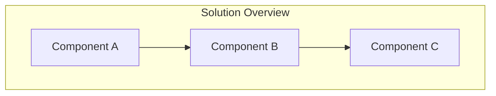
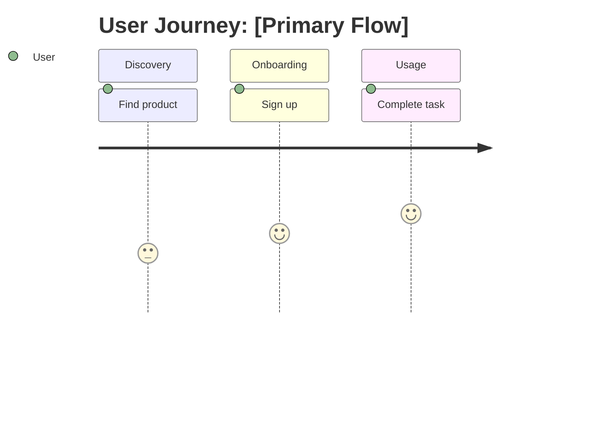

# PRD authoring contract

**This is the complete, binding instruction set for authoring a PRD.** It is deliberately
separate from `create-prd.md`: the authoring agent re-caches everything in its context on
every turn, and the command file also carries the verification-wave spec, the readout
format and the fallback path — none of which an author uses. Measured: that was ~10.5k
tokens re-cached ~17 times per run.

If you are authoring, read this file and nothing else from the command layer.

---

## What a PRD may contain

A PRD **records** what was asked for. Everything in it must trace to something real: the
user's own words, a source document (ticket, spec, design doc), a measurement you can cite,
or a named constraint in `stack.md` / `constitution.md`.

**A requirement that traces only to "products like this usually have one" does not belong
in the PRD.** Once it is written down, nothing downstream challenges it — `/create-trd`,
`spec-planner`, `/implement-trd` and `verify-app` all treat a written requirement as
legitimate by construction. So a fabricated one is *executed*, not examined, and it consumes
real implementation work before anyone notices it was never wanted.

The cost is asymmetric and worth holding onto: **a missing requirement surfaces as a
question; a fabricated one silently consumes a task.** Prefer omission to invention.

**Dropping a requirement is the commoner failure.** In this project's own corpus, silently
narrowing scope outnumbers inventing requirements. Everything the source asks for must
either appear in the PRD or be listed explicitly under Non-Goals. Never quietly rescope.

If a claim is believed but unverified, label it — **"Belief, not fact"** — and name what
would settle it. That marker is cheaper and always-on compared to any later review.

---

## PRD Document Structure

The generated PRD follows the structure below.

**Sections are containers, not quotas.** A heading is not an instruction to fill it. An
empty section is a **correct, expected outcome** when nobody raised that concern — and a
stronger signal than a plausible invention. Never populate a section to make the document
look complete.

### Document Header

```markdown
# PRD: [Product/Feature Name]

**Version**: 1.0.0
**Status**: Draft | In Review | Approved
**Created**: [Date]
**Last Updated**: [Date]
**Author**: @product-manager
**Stakeholders**: [List key stakeholders]

---
```

### Section 1: Changelog

Track all significant changes to this PRD. Add entries as refinements occur.

```markdown
## Changelog

| Version | Date | Changes | Author |
|---------|------|---------|--------|
| 1.0.0 | [Date] | Initial PRD creation | @product-manager |
```

### Section 2: Product Summary

```markdown
## 1. Product Summary

### 1.1 Problem Statement
[Clear description of the problem being solved]

### 1.2 Proposed Solution
[High-level description of the solution]

### 1.3 Value Proposition
[Why this matters - business value, user value]

### 1.4 Key Differentiators (optional)
[What makes this approach unique]

### 1.5 Solution Architecture

Include a Mermaid diagram here when the solution has parts whose relationship is not
obvious from the prose. Do NOT use ASCII art. Skip it for a self-contained change.


```

### Section 3: User Analysis

```markdown
## 2. User Analysis

### 2.1 Target Users
| User Type | Description | Primary Need |
|-----------|-------------|--------------|
| [Type 1] | [Description] | [Need] |

### 2.2 User Personas

For each primary user type, create a detailed persona:

**Persona: [Name]**
- **Role**: [Job title/role]
- **Goals**: [What they want to achieve]
- **Pain Points**: [Current frustrations]
- **Technical Proficiency**: [Low/Medium/High]

### 2.3 User Journey

Include a journey diagram when the flow spans several steps or actors. Skip it when the
journey is one screen.


```

### Section 4: Goals and Non-Goals

**IMPORTANT**: Non-goals are referenced by `/implement-trd` to prevent scope creep.
Be explicit and specific - vague non-goals are not actionable.

```markdown
## 3. Goals and Non-Goals

### 3.1 Goals

| ID | Goal | Success Metric | Priority |
|----|------|----------------|----------|
| G1 | [Goal description] | [Measurable metric] | P0 |
| G2 | [Goal description] | [Measurable metric] | P0 |
| G3 | [Goal description] | [Measurable metric] | P1 |

### 3.2 Non-Goals (Explicit Scope Exclusions)

These items are **explicitly out of scope** for this PRD. Implementation agents
will reference this list to reject scope creep.

| ID | Non-Goal | Rationale |
|----|----------|-----------|
| NG1 | [What we will NOT do] | [Why it's excluded] |
| NG2 | [What we will NOT do] | [Why it's excluded] |
```

### Section 5: Feature Requirements

Organize features by priority. Use P0/P1/P2 classification:
- **P0**: Must have for MVP / initial release
- **P1**: Should have for complete solution
- **P2**: Nice to have / future enhancement

```markdown
## 4. Feature Requirements

### 4.1 P0 - Core Features (Must Have)

#### F1: [Feature Name]
**Priority**: P0
**Description**: [What this feature does]

**User Stories**:
- As a [user], I want to [action] so that [benefit]

**Acceptance Criteria**:
- [ ] AC-F1.1: [Criterion 1]
- [ ] AC-F1.2: [Criterion 2]

**Dependencies**: [Other features or systems this depends on]

#### F2: [Feature Name]
...

### 4.2 P1 - Enhanced Features (Should Have)

#### F3: [Feature Name]
**Priority**: P1
...

### 4.3 P2 - Future Features (Nice to Have) (optional)

#### F4: [Feature Name]
**Priority**: P2
...
```

### Section 6: Non-Functional Requirements

**One section. No category scaffolding, and no example values.**

Five named subsections — Performance, Security, Accessibility, Scalability, Integration —
are five prompts to fill, and an author facing "Performance Requirements" above an empty
table will produce a latency figure. They are deliberately gone. So are example numbers:
an example value is an anchor, and anchors get adopted verbatim.

List non-functional requirements as they actually arise, each with its source.

```markdown
## 5. Non-Functional Requirements

| ID | Requirement | Source |
|----|-------------|--------|
| NFR-1 | [What must be true] | [PRD text / user's words / stack.md / constitution.md / a measurement] |
```

**Empty is a legitimate and expected outcome.** Most features have no non-functional
requirement anyone asked for. Do not read emptiness as incompleteness.

Rules for this section:

- **Never invent a number.** No latency, throughput, uptime, or coverage figure unless the
  user stated it, a source document states it, or you can cite a measurement.
- **Source the severity, not just the requirement.** "Must be fast" becoming "p95 < 200ms"
  is an invention even when "must be fast" was real. If a number is aspirational, say so:
  *"target, not an enforced threshold."*
- **Do not reintroduce the deleted categories as prompts.** Performance, Security,
  Accessibility, Scalability and Integration were removed as headings precisely because a
  named category is an instruction to fill it — naming them here as a checklist would put
  them straight back in front of you. Requirements of any of those kinds are welcome when
  someone asked for them, and are listed like any other row, with a source.
- **Integration points** belong here only when they constrain the *product*. Otherwise they
  are technical design and belong in the TRD.

### Section 7: Acceptance Criteria Summary

Consolidate all acceptance criteria for easy reference during implementation.

```markdown
## 6. Acceptance Criteria Summary

### Feature Acceptance Criteria

| ID | Feature | Criterion | Verification Method |
|----|---------|-----------|---------------------|
| AC-F1.1 | F1 | [Criterion] | [Unit test / E2E / Manual] |
| AC-F1.2 | F1 | [Criterion] | [Unit test / E2E / Manual] |
| AC-F2.1 | F2 | [Criterion] | [Unit test / E2E / Manual] |

### Non-Functional Acceptance Criteria

One row per entry in Section 5 — no more. This table is a restatement for convenience,
**not a second place to introduce requirements.** If a row here has no matching NFR in
Section 5, it was invented at summary time; delete it.

| ID | Requirement | Criterion | Verification Method |
|----|-------------|-----------|---------------------|
| AC-N1 | [NFR-1 from Section 5] | [Criterion] | [How verified] |

Empty when Section 5 is empty.
```

### Section 8: Risk Assessment

**IMPORTANT**: Risks are referenced by `/implement-trd` for contingency planning.

```markdown
## 7. Risk Assessment

| ID | Risk | Likelihood | Impact | Mitigation Strategy |
|----|------|------------|--------|---------------------|
| R1 | [Risk description] | High/Med/Low | High/Med/Low | [How to mitigate] |

A risk earns a row when you can name what would trigger it in *this* product. Generic
hazards ("users might not adopt it", "the timeline might slip") apply to everything and
bury the one or two that are real. Empty is legitimate for a small, well-understood change.

### Contingency Plans

For high-impact risks, document specific contingency plans:

**R1 Contingency**: [What to do if this risk materializes]
```

### Section 9: Decisions and Rejected Alternatives

**REQUIRED whenever anything was considered and set aside.**

The single most emphatic complaint in this project's history is a decision being
re-litigated — including decisions taken minutes earlier, in context. A PRD that records
only what was chosen gives the next reader no way to know that the obvious alternative was
already considered and rejected, so they propose it again.

This standardises a convention the corpus already uses (roughly half of existing PRDs
record disagreements and rejections somewhere). Adopt this **format**, which is better than
recording the verdict alone:

```markdown
## N. Decisions and Rejected Alternatives

| Proposal / Challenge | Verdict | Rationale | Revisit when |
|----------------------|---------|-----------|--------------|
| Promote geofence triggers to P0 | Rejected | Adds significant scope; the LLM can infer from raw coordinates | v2, with eval data showing where the LLM struggles |
| Queue-based ingestion | Rejected | Cost, for a pre-beta system with one real user | Sustained load above [figure] |

### Confirmed grounding — do not re-litigate

- [Decision the user has already settled, stated once, plainly]
```

**The `Revisit when` column is what makes this work.** A rejection with no revisit condition
reads as permanent, and gets re-opened the moment circumstances change — which is the exact
failure this section exists to prevent. If a rejection is genuinely unconditional, write
"never" and say why.

The **do-not-re-litigate** list is for decisions the user has explicitly settled. Keep it
short and keep it verbatim; it is a record of what they said, not a summary of it.

### Section 10: Appendices (optional)

Use appendices for reference material that doesn't fit in main sections.

```markdown
## Appendices

### Appendix A: Glossary (optional)
| Term | Definition |
|------|------------|
| [Term] | [Definition] |

### Appendix B: Related Documents (optional)
- [Link to related PRD]
- [Link to technical spec]

### Appendix C: Open Questions (optional)
| Question | Status | Resolution |
|----------|--------|------------|
| [Question] | Open/Resolved | [Answer if resolved] |
```

---

