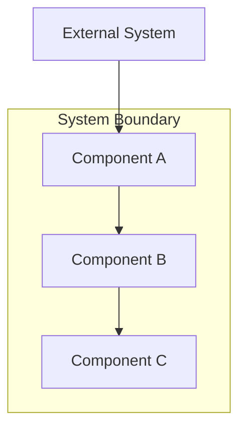
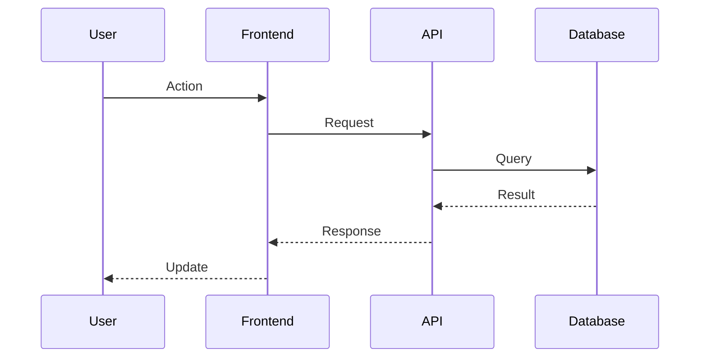
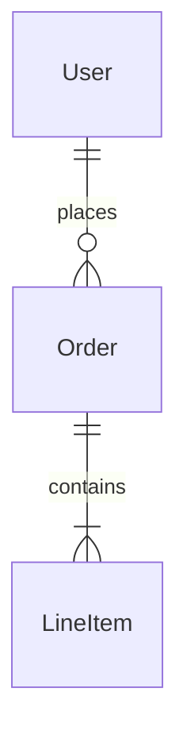

# TRD authoring contract

**This is the complete, binding instruction set for authoring a TRD.** It is deliberately
separate from `create-trd.md`: the authoring agent re-caches everything in its context on
every turn, and the command file also carries the verification-wave spec, the readout
format and the fallback path — none of which an author uses. Measured: that was ~10.5k
tokens re-cached ~17 times per run.

If you are authoring, read this file and nothing else from the command layer.

---

## The typing rule: invent the HOW, never the HOW WELL

**This is the most important rule in this command. Read it before writing anything.**

Every line you write into a TRD is one of three types. The type determines what it owes:

| Type | What it is | What it must satisfy |
|------|------------|----------------------|
| **Objective** | What must be true, and *how well* — acceptance criteria, non-functional requirements, thresholds, quality gates, coverage targets, latency budgets | **Provenance.** Must trace to the PRD, to `stack.md`/`constitution.md`, to a measurement you can cite, or to an explicit user instruction. **May NOT be invented.** |
| **Decision** | *How* it will be built — architecture, technology, structure, sequencing, module boundaries | **Derivation + buildability + consistency.** Must serve a named objective, be constructible as written, not contradict a sibling decision, and be recorded with its alternatives. **Free to be invented — that is your job.** |
| **Task** | The work to do | Must name the objective or decision it serves. |

You may freely decide Postgres, a queue, a three-phase rollout, a particular module
boundary. None of that needs user provenance — only an upward link to an objective and a
conformance check against `stack.md`.

What you may **NOT** do is decide that the thing must respond in under two seconds, sustain
99.9% uptime, or hit 80% test coverage — unless someone actually asked.

### Type by nature, never by section

**A measurable threshold is an objective wherever it appears.** A latency figure inside a
"Technical Specifications" section is still an objective. "Use Redis for caching" is a
decision; "cache hit rate must exceed 90%" is an objective wearing a decision's clothes.
Classify by what the line *is*, not by the heading it sits under.

### Delivery machinery is a decision and owes an objective

Feature flags, rollout phases, migration paths, guard infrastructure, eval gates, staged
enablement and rollback tooling are **decisions**. Each must name the objective it serves.

If the honest answer is *"no objective — this is just how we'd normally ship,"* **do not
include it.** This is the single largest source of wasted implementation work: machinery
nobody asked for, built and then deployed dark. A feature behind a flag nobody turns on is
worse than a feature that was never built, because it costs the build *and* hides the result.

### Domain-derived objectives are permitted, and must be labelled

Some objectives genuinely follow from the domain rather than from a document — *"must not
lose a payment"*, *"must not leak PII across tenants"*. These are legitimate. Label them
`domain-derived` and state the reasoning. They appear in the readout as their own class:
not blocked, but visible.

The distinction being enforced is between an objective someone can point at, and one that
appeared because a table looked empty.

### Thresholds: source the SEVERITY, not just the requirement

The commonest failure is not an invented requirement — it is a real requirement given an
invented strictness. "Zero tolerance" and "≤1 per run" are different requirements, and the
gap between them is where unexamined severity hides.

**An objective that exceeds a floor stated in `constitution.md` MUST state why, inline.**
No reason, no exceedance — use the constitution's number. This one rule catches roughly half
of all manufactured objectives measured in this project's own corpus.

If a number is a target rather than an enforced gate, say so in the line itself
("target, not an enforced threshold"). Declassifying severity by hand is correct and welcome.

### Omission is a failure too

Dropping a requirement is **commoner** than inventing one. Every objective in the source
must either appear in the TRD or be explicitly listed under Non-Goals. Silently narrowing
scope — reproducing seven of a PRD's eight metrics and dropping the eighth without comment —
is the failure that a per-line audit structurally cannot see. Check the source forwards, not
just the TRD backwards.

---
## TRD Document Structure

The generated TRD follows the structure below.

**Sections are containers, not quotas.** A heading is not an instruction to fill it. If a
feature has no non-functional requirements anyone asked for, that section is empty, and an
empty section is a **correct, expected outcome** — a stronger signal than a plausible
invention. Never populate a section to make the document look complete.

The same applies to diagrams: include a diagram where it clarifies something a reader would
otherwise have to reconstruct. There is no diagram quota.

### Document Header

```markdown
# TRD: [Product/Feature Name]

**Version**: 1.0.0
**Status**: Draft | In Review | Approved
**Created**: [Date]
**Last Updated**: [Date]
**Author**: @technical-architect
**Source PRD**: [Link to PRD file]
**Task ID Prefix**: [PREFIX] (e.g., AUTH, CHECKOUT, NOTIFY)

---
```

### Section 1: Changelog

```markdown
## Changelog

| Version | Date | Changes | Author |
|---------|------|---------|--------|
| 1.0.0 | [Date] | Initial TRD creation | @technical-architect |
```

### Section 2: Overview

```markdown
## 1. Overview

### 1.1 Technical Summary
[Brief description of the technical approach and key architectural decisions]

### 1.2 Key Technical Decisions

| ID | Decision | Choice | Serves Objective | Rationale | Alternatives Considered |
|----|----------|--------|------------------|-----------|------------------------|
| D1 | [Decision area] | [What was chosen] | [Objective ID this serves] | [Why] | [What else was considered] |

**`Serves Objective` is mandatory.** Every decision exists to satisfy something. If you
cannot name the objective, the decision is unmotivated — remove it, or surface the
objective it implies and give that objective provenance of its own.

**`Alternatives Considered` is mandatory too**, and a rejection is more useful with a
revisit condition: *"adds significant scope; the LLM can infer this from raw coordinates —
revisit in v2 with eval data showing where it struggles."* A rejection with no revisit
condition reads as permanent and gets re-litigated the moment conditions change.

### 1.3 Technology Stack

| Layer | Technology | Purpose | Notes |
|-------|------------|---------|-------|
| Frontend | [e.g., React] | [Purpose] | [Version, etc.] |
| Backend | [e.g., Node.js] | [Purpose] | |
| Database | [e.g., PostgreSQL] | [Purpose] | |

### 1.4 Integration Points

| System | Type | Direction | Notes |
|--------|------|-----------|-------|
| [External system] | [REST/GraphQL/Event] | [In/Out/Both] | [Notes] |
```

### Section 3: System Architecture

Use Mermaid for diagrams here. Do NOT use ASCII art. Include the diagrams that clarify
this system; there is no required count.

```markdown
## 2. System Architecture

### 2.1 Architecture Overview

Include a high-level architecture diagram when the component topology is not obvious from
the task list.



### 2.2 Component Architecture

#### 2.2.1 [Component Name]
**Responsibility**: [What this component does]
**Interfaces**: [APIs, events, etc.]
**Dependencies**: [What it depends on]

### 2.3 Data Flow

Include a data-flow diagram when a flow crosses more than one service or component.



### 2.4 State Management (if applicable)

[Description of state management approach]
```

### Section 4: Technical Specifications

Detail the technical implementation for each major component.

```markdown
## 3. Technical Specifications

### 3.1 [Component/Feature Name]

**Purpose**: [What this does]

**Interface**:
```typescript
// API contract or interface definition
interface Example {
  field: Type;
}
```

**Behavior**:
- [Behavior 1]
- [Behavior 2]

**Error Handling**:
- [Error case]: [How handled]

### 3.2 [Next Component]
...
```

### Section 5: Master Task List

**CRITICAL**: Task ID Convention for unique identification across project.

```markdown
## 4. Master Task List

### 4.1 Task ID Convention

Task IDs follow the format: `[PREFIX]-[CATEGORY][SEQ]`

- **PREFIX**: Unique identifier for this TRD (from header, e.g., AUTH, CHECKOUT)
- **CATEGORY**: Single letter indicating task type
  - `P` = Plugin/Infrastructure setup
  - `F` = Frontend implementation
  - `B` = Backend implementation
  - `T` = Testing
  - `D` = Documentation
  - `I` = Integration
- **SEQ**: Three-digit sequence number (001, 002, etc.)

Examples:
- `AUTH-B001` = Authentication TRD, Backend task 1
- `AUTH-F001` = Authentication TRD, Frontend task 1
- `CHECKOUT-T001` = Checkout TRD, Test task 1

### 4.1.1 Live Verification Marker

Tasks that require live/running service verification get a `[LIVE]` marker in their description:

```
- [ ] **AUTH-B001** [LIVE]: Implement JWT authentication endpoint
```

The `[LIVE]` marker tells verify-app to start the service and verify against a running instance,
regardless of the project's `verification_level` setting. Use `[LIVE]` for:
- API endpoint tasks (needs running server to verify HTTP responses)
- Database integration tasks (needs running database to verify queries)
- Service integration tasks (needs running services to verify communication)

Tasks WITHOUT `[LIVE]` use the project's default `verification_level` from constitution.md.

### 4.1.2 Skill Hints

Each task SHOULD include a `Skills` column listing ensemble skills the implementer
should invoke via the Skill tool. To populate this column:

1. **Determine the target agent** for the task based on category letter
   (B → backend-implementer, F → frontend-implementer, T → verify-app, etc.)
2. **Consult the project's skill assignment** — `skill-affinity.json`, plus the skills
   listed in the session's system prompt. **Do NOT read a `skills:` key from the agent
   frontmatter: no agent has one.** Hardcoded `skills:` preloads were removed from all
   13 agents in 4.1.1 (`c4962d0`) in favour of deterministic per-project assignment
3. **For each skill** the agent declares, read its description from the skill's
   SKILL.md (available skills are listed in the system prompt or discoverable
   via the plugin's skills directory)
4. **Match**: if the skill's "Use when..." description aligns with the task's
   domain and description, include it in the Skills column

If no clear match exists, leave the Skills column empty — implement-trd will
fall back to the agent's full skills list at delegation time.

**Example:** A backend task implementing a .NET API endpoint with Clerk auth:
- Target agent: backend-implementer
- Agent skills include: `developing-with-dotnet`, `using-clerk`, `building-integrations`, ...
- `developing-with-dotnet` description: "Use when writing C# code or working with .NET projects" → match
- `using-clerk` description: "Use when implementing auth with Clerk" → match
- Skills column: `developing-with-dotnet, using-clerk`

### 4.2 Phase 1: [Phase Name]

| Task ID | Description | Serves | Skills | Dependencies | Acceptance Criteria |
|---------|-------------|--------|--------|--------------|---------------------|
| [PREFIX]-P001 | [Task description] | [Objective or Decision ID] | | None | [Criteria] |
| [PREFIX]-P002 | [Task description] | [Objective or Decision ID] | | [PREFIX]-P001 | [Criteria] |

### 4.3 Phase 2: [Phase Name]

| Task ID | Description | Serves | Skills | Dependencies | Acceptance Criteria |
|---------|-------------|--------|--------|--------------|---------------------|
| [PREFIX]-B001 | [Task description] | AC-F1.1 | `developing-with-dotnet` | [PREFIX]-P002 | [Criteria] |
| [PREFIX]-F001 | [Task description] | D2 | `developing-with-react`, `jest` | [PREFIX]-B001 (API contract only) | [Criteria] |

**The `Serves` column is mandatory and machine-readable.** Every task names the objective
or decision ID it exists to satisfy. A task that serves nothing is work nobody asked for —
the commonest form being delivery machinery (flags, rollout stages, guard infrastructure)
added because it is how one normally ships. Remove it, or surface the objective it implies
and source that objective.

### 4.4 Phase 3: [Phase Name]
...
```

### Section 6: Execution Plan

**CRITICAL**: Phasing and parallelization are essential for efficient implementation.

```markdown
## 5. Execution Plan

### 5.1 Phase Overview

| Phase | Focus | Prerequisites | Parallelizable Sessions |
|-------|-------|---------------|------------------------|
| 1 | Foundation + its tests | None | 1A, 1B can run in parallel |
| 2 | Implementation + its tests | Phase 1 complete | 2A, 2B can run in parallel after API contract |
| 3 | Cross-cutting `[LIVE]` E2E only | Phase 2 complete | 3A, 3B can run in parallel |

**TEST TASKS BELONG IN THE PHASE THAT INTRODUCES THE CODE THEY TEST.**

Do NOT collect every `-T###` task into a terminal "Verification" phase. Two real TRDs
generated by this contract both did exactly that — one put all three test tasks in phase 3 of
3, the other all seven in phase 5 of 5 — and nothing in this contract asked for it. It is the
shape an author reaches for by default, and it is wrong for three concrete reasons:

- **Every phase but the last ends with nothing runnable.** Phase 1's code sits untested until
  phase 3 or 5, so the phase gate has nothing to check and a phase-boundary review is reading
  code rather than running it.
- **A defect in phase 1 is discovered after phases 2–4 were built on top of it.** That is the
  expensive failure this whole pipeline exists to move earlier.
- **`[LIVE]` loses its meaning.** When everything is terminal, the marker no longer
  distinguishes the tasks that genuinely need a running system.

So: a task that adds a behaviour and the task that tests that behaviour go in the SAME phase.
Each phase must end in a state where its own tests pass.

**A terminal phase is legitimate for exactly one thing:** `[LIVE]` end-to-end verification
that genuinely requires the whole system assembled — a Playwright run across a completed UI
flow, a full scaffold-and-refresh cycle. If a terminal phase contains a unit test, it is in
the wrong phase.

**End-to-end coverage is a TASK, never an assumed follow-on.** If the feature has an
exercisable path, there is a `-T###` task with the `[LIVE]` marker that walks it. If the
feature genuinely has no such path — a library, a hook, a CLI with no service — say so
explicitly in Quality Requirements rather than silently omitting it.

### 5.2 Session Details

#### Phase 1: Foundation

**Session 1A: [Session Name]**
- Tasks: [PREFIX]-P001, [PREFIX]-P002
- Agent: @backend-implementer
- Can parallelize with: Session 1B

**Session 1B: [Session Name]**
- Tasks: [PREFIX]-P003, [PREFIX]-P004
- Agent: @frontend-implementer
- Can parallelize with: Session 1A

#### Phase 2: Implementation

**Session 2A: [Session Name]**
- Tasks: [PREFIX]-B001, [PREFIX]-B002
- Agent: @backend-implementer
- Blocked by: Session 1A

**Session 2B: [Session Name]**
- Tasks: [PREFIX]-F001, [PREFIX]-F002
- Agent: @frontend-implementer
- Blocked by: API contract from 2A (not full completion)
- Can parallelize with: Session 2A (after contract)

### 5.3 Parallelization Map

Include a dependency/parallelism diagram when there is real parallelism to show. Skip it
for a short sequential plan — the task table already says everything.

```mermaid
gantt
    title Execution Plan (No time scale - dependency order only)
    dateFormat X
    axisFormat %s

    section Phase 1
    Session 1A: p1a, 0, 1
    Session 1B: p1b, 0, 1

    section Phase 2
    Session 2A: p2a, after p1a, 1
    Session 2B: p2b, after p1a, 1

    section Phase 3
    Session 3A: p3a, after p2a p2b, 1
```



### 5.4 Critical Path

The critical path is: [List the blocking sequence of tasks]

### 5.5 Offload Recommendations (optional)

Tasks that could be delegated to specialized agents:

| Task | Recommended Agent | Rationale |
|------|-------------------|-----------|
| [Task ID] | @[agent] | [Why] |
```

### Section 7: Quality Requirements

```markdown
## 6. Quality Requirements

Every line in this section is an **objective**. Each one needs provenance, and any
number that exceeds a `constitution.md` floor needs its severity sourced inline.

### 6.1 Testing Requirements

**Read the coverage floors from `.claude/rules/constitution.md` and use those numbers.**
Do not carry a number in from anywhere else — not from this template, not from another
project, not from what a coverage target "usually" is.

| Type | Coverage Target | Source | Scope |
|------|-----------------|--------|-------|
| Unit Tests | [constitution.md floor] | `constitution.md` Quality Gates | [Scope] |
| Integration Tests | [constitution.md floor] | `constitution.md` Quality Gates | [Scope] |

**To exceed a constitution floor, state why in the Source column** — a PRD line, a user
instruction, a measured defect rate, or a named regulatory constraint. "This code is
critical" is not a source; every project believes that about its own code.

If nothing justifies exceeding the floor, use the floor. The floor is the project's
considered answer to this question and it does not need re-deriving per TRD.

### 6.2 Code Quality Standards (only if the PRD or constitution names any)

[Standards that trace to a named source. Empty is correct when none were stated.]

### 6.3 Security Requirements (only if the feature has any)

Include a security objective when the feature handles credentials, personal data,
payments, tenancy boundaries, or external input. Label these `domain-derived` with the
reasoning — they are legitimate without a PRD line, but they must be visible as derived.

For a feature that touches none of those, this section is empty. Do not add a generic
security checklist.

### 6.4 Performance Requirements (only if someone asked)

**Do not invent a latency, throughput, or uptime figure.** No example number appears
anywhere you are meant to FILL — no template stub, no table skeleton, no "e.g." — because an
example number is an anchor and anchors get adopted verbatim.

Concrete figures do appear in the *readout* examples further down. Those are illustrations of
requirements being **deleted for having no source**, not values to copy. If you find yourself
lifting a number out of a readout example into a TRD, that is the exact failure this rule
exists to stop.

Include a performance objective only when the PRD states one, the user asked for one, or
you can cite a measurement. Otherwise omit this section entirely. Most features have no
performance requirement anyone asked for, and a TRD with no performance section is
correct when performance was never raised.

Where you do include one, state whether it is an enforced gate or a target.
```

### Section 8: Risk Assessment

**IMPORTANT**: Import risks from PRD and add technical risks.
These are referenced by `/implement-trd` for contingency planning.

```markdown
## 7. Risk Assessment

### 7.1 Risks Imported from PRD

| PRD Risk ID | Risk | Technical Mitigation |
|-------------|------|---------------------|
| R1 | [From PRD] | [Technical approach to mitigate] |

### 7.2 Technical Risks (only real ones)

| ID | Risk | Likelihood | Impact | Mitigation |
|----|------|------------|--------|------------|
| TR1 | [Technical risk] | High/Med/Low | High/Med/Low | [Mitigation] |

A risk earns a row when you can name what would trigger it in *this* design. Generic
engineering hazards ("the third-party API might be slow", "the migration might fail")
are not risks specific to this TRD, and a risk table padded with them buries the one or
two that matter. Two real risks beat eight plausible ones.

Empty is legitimate for a small, well-understood change.

**Do not use a risk to smuggle in delivery machinery.** "Risk: the rollout might break
things → Mitigation: add a feature flag" is an invented decision wearing a risk's
clothes. If the flag serves a real objective, put it in the task list and name that
objective; if it does not, it does not belong in the TRD at all.

### 7.3 Contingency Plans

For high-impact risks, document specific responses:

**TR1 Contingency**: [What to do if risk materializes]
```

### Section 9: Non-Goals (Imported from PRD)

**IMPORTANT**: Copy from PRD. Implementation agents check against these.

```markdown
## 8. Non-Goals (Scope Boundaries)

The following are **explicitly out of scope** per the PRD. Implementation agents
MUST reject requests that fall into these categories.

| PRD ID | Non-Goal | Rationale |
|--------|----------|-----------|
| NG1 | [From PRD] | [From PRD] |
| NG2 | [From PRD] | [From PRD] |
```

### Section 10: Task Grounding

> **Not written by the authoring stage.** A dedicated grounding pass emits this section
> after the decisions exist, having actually read the code. An author that writes it
> while drafting is grounding decisions it has not finished making, and the work then
> gets done twice with two sources of truth. If you are authoring, skip this section.

**REQUIRED whenever the repository already contains code.** This is the section that stops
implementers reimplementing what exists, contradicting how the system already works, and
leaving dead code behind. Those are collectively the largest source of wasted work in this
framework — larger than invented requirements.

Before writing this section, actually read the code. Grep for the functions, modules and
patterns the plan touches. This section is worthless if it is written from assumption.

Reconcile the plan against the repository on four axes:

| | Requirement | Failure it prevents |
|---|---|---|
| **(a)** | **Consistent with the existing implementation** | A plan that contradicts how the thing already works, discovered at implement time |
| **(b)** | **Maximises reuse** | Reimplementing what exists — the most common silent waste |
| **(c)** | **Deprecates and removes what it refactors out** | Dead code that still *looks* live |
| **(d)** | **Documented per task** | Every implementer rediscovering the same context |

Emit one block per task, keyed by task ID:

```markdown
## 9. Task Grounding

### AUTH-B003
- **Touches:** `packages/api/auth/session.ts`, `packages/api/auth/session.test.ts`
- **Reuse:** `withRetry()` in `packages/api/lib/retry.ts` — do not reimplement backoff
- **Replaces:** `legacyTokenCheck()` in `session.ts:88` becomes unreachable; delete it and
  its three tests in `session.test.ts:120-190`
- **Follow:** the idempotency-key pattern in `packages/api/webhooks/stripe.ts`
- **Careful:** `session.ts` is imported by the mobile client — the signature is a public contract
```

**Only `Touches` is mandatory.** The others appear when they apply. An empty grounding block
is a legitimate result for genuinely greenfield work — state that rather than padding it.

**`Replaces` is the highest-value line and the one nobody writes.** For every task, ask:
*what does this make unreachable?* If the plan supersedes a function, a module, a config
path or a test, name it here and instruct its deletion. A superseded thing that still exists
still looks live, and the next reader — human or agent — will believe it.

This has a worked example in this repository: converting `subagent-discipline.js` to a
prompt-type hook orphaned `recordBlockInLedger` inside a `main()` that no longer executes.
The dispatch ledger silently lost its compensating row. Nothing asked "what does this
replace?", so nothing surfaced it, and it was found days later only because an agent noticed
a *documentation* claim had gone false.

Grounding is a **producer, not a checker** — `/implement-trd` passes a task's grounding block
into the implementer's prompt, so the implementer starts with what is already known instead
of rediscovering it. Findings that land only in a readout are wasted; the implementer never
reads the readout.

### Section 11: Appendices (optional)

```markdown
## Appendices

### Appendix A: File Structure (optional)
```
project/
├── src/
│   ├── components/
│   └── ...
```

### Appendix B: Database Schema (optional)



### Appendix C: API Contracts (optional)

[OpenAPI spec or interface definitions]

### Appendix D: Glossary (optional)

| Term | Definition |
|------|------------|
| [Term] | [Definition] |
```

---

---

## Two sections you MUST emit, and who consumes them

These are the handoff contract. Each has a different consumer, and an artifact that omits
them silently claims a completeness it has not earned.

### `## Open Questions` — consumed by `/refine`

**Every decision you made that the source did not settle.** Not doubts — decisions. You had
to pick something to finish the document; this is where you say what you picked and that
nobody told you to.

| ID | Question | What I assumed | Why it matters | If I'm wrong |
|----|----------|----------------|----------------|--------------|
| OQ-1 | No latency requirement is stated anywhere. Is there one? | None. No performance objective written. | An invented budget consumes a whole task proving it | A real SLA is missing and gets discovered late |

This is where the manufactured-requirement failure goes to die. The measured instance: an
author needed a performance row, had no source, and wrote `p95 ≤ 2000 ms`. That consumed a
task, two wrong analyses, and a withdrawal. **The correct output was an Open Question, not a
number.** When you find yourself reaching for a plausible value, write the question instead.

Also belongs here: a tension the source names and does not resolve; two readings of a
requirement where you picked one; a convention you inherited from a sibling document that
may not apply.

**A question with no assumption is not finished.** Always state what you did, so the
document is usable if nobody ever answers.

### `## Could Not Verify` — consumed by `/audit`

**Every claim you made from inference rather than from reading or running.** Mirror of the
`[inferred]` markers in grounding, promoted to document level so a reader sees it without
hunting.

| Claim | How I'd check it |
|-------|------------------|
| `publish_log.error_category` carries the F016 CHECK constraint | read the migration that adds the column |

An empty section is a legitimate outcome and means you verified everything you asserted. It
is not a place to be generous with yourself: the measured cost of the opposite is an
implementer who stopped checking because the citations looked uniformly verified, and the one
claim asserting something was *safe* was the one that was wrong.
