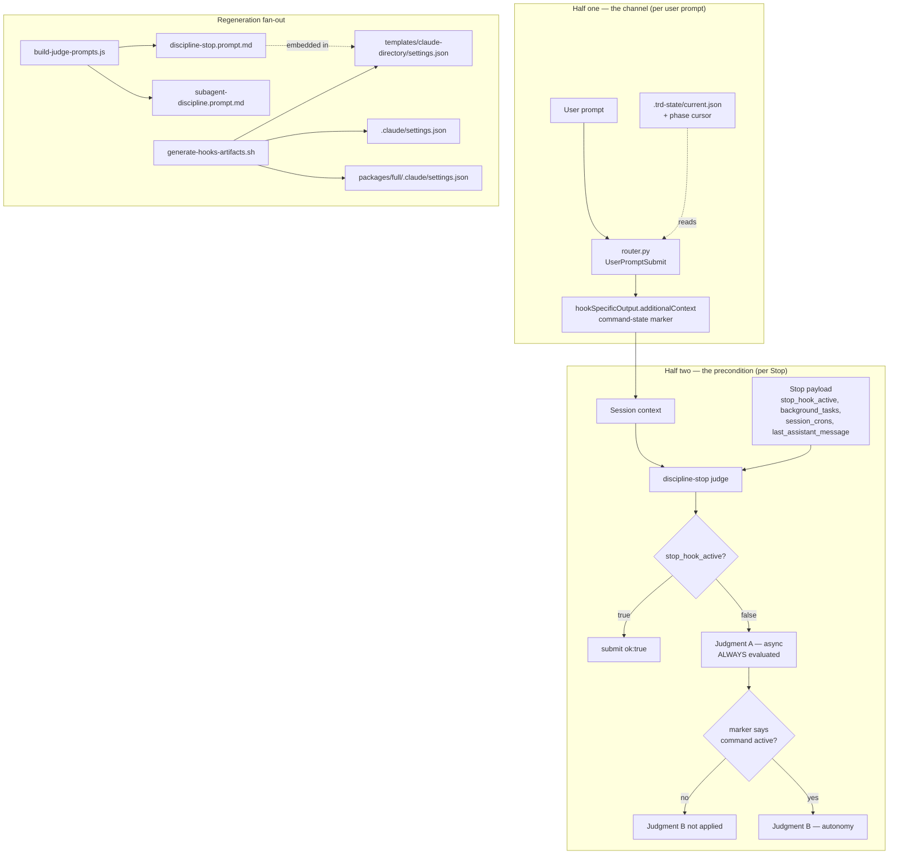

# PRD: Autonomy Judge Command Scope

**Version**: 1.0.0
**Status**: Draft
**Created**: 2026-08-26
**Last Updated**: 2026-08-26
**Author**: @product-manager
**Stakeholders**: Framework owner (james.simmons@highpointe.tech); every session on any machine
running a scaffolded `.claude/settings.json` — the Stop guard evaluates all of them.

---

## Changelog

| Version | Date | Changes | Author |
|---------|------|---------|--------|
| 1.0.0 | 2026-08-26 | Initial PRD creation | @product-manager |

---

## 1. Product Summary

### 1.1 Problem Statement

`.claude/rules/autonomy.md` opens with **"Status: active. Applies to every workflow command."**
That scope never reached the judge that enforces it.

Verified by reading the shipped artifact: `packages/core/hooks/prompts/discipline-stop.prompt.md`
(6,715 bytes on disk) contains zero occurrences of `workflow command`, `conversational`, or
`direct question` — `grep -in` over all three returns exit 1. The copy embedded in
`.claude/settings.json` under the `Stop` event is 6,708 characters and likewise returns zero for
`workflow command`. What the prompt *does* say, at lines 13–18, is:

> **Judgment B — autonomy-discipline** … does this turn's final message hand back a decision or
> action the agent could have taken itself? **Invoking the command was the authorization**;
> pausing mid-run to re-ask for it defeats an unattended run.

Judgment B presupposes a command is running and is given no way to check. So it evaluates every
`Stop` — including purely conversational turns, where no command was ever invoked and there is no
authorization to defeat.

**The measured consequence** (source document, not independently re-run — see §Could Not Verify):
`node packages/core/scripts/hook-verdict-rate.js --project -Users-james-dev-lightning-lane-prompt-fixes`
reported 957 evaluations, 100 blocks (10.4%), 3 anomalous allows (0.3%), and the tool's own verdict
*"block rate 10.4% exceeds 8% — the guards are interrupting correct work."* 87% of sampled blocks
were Judgment B. Of nine short conversational finals classified by hand, four were clear false
positives: a bare factual answer about `pwd`, the single word "Idle.", and **two direct answers to
the owner's own repeated question "What test account did you use??"** — which is why the owner had
to ask three times in one session. One block's own reason read *"This is a conversational assessment
in response to a direct question"* and it blocked anyway.

The 8% ceiling is real and recent. `packages/core/scripts/hook-verdict-rate.js` line 65 declares
`const BLOCK_RATE_CEILING = 8;`, added in commit `1c490e9` — *"the block rate had no ceiling, so
over-blocking was unreportable"* — whose body states: *"no block rate could ever register as a
problem, so none ever did."* 10.4% is the first reading from an instrument built to take it.

### 1.2 Proposed Solution

Give the judge the one thing it lacks — knowledge of whether a workflow command is running — and
then make Judgment B conditional on it. Two coupled halves; neither works alone.

**Half one — the channel.** `.claude/hooks/router.py` already runs on every user prompt and already
emits injected context. Verified: 195 lines, registered under `UserPromptSubmit` in
`.claude/settings.json`, and `build_output()` (line 124) returns
`{"hookSpecificOutput": {"hookEventName": "UserPromptSubmit", "additionalContext": …}}`. Today
`should_skip()` (line 134) **suppresses** that output on command turns — line 151–152 returns
`"slash command carries its own instructions"` when `prompt.lstrip().startswith("/")`. Correct
reasoning for an orientation reminder; exactly backwards for a command marker. The router emits
current command state on **every** prompt instead.

**Half two — the precondition.** `packages/core/hooks/prompts/build-judge-prompts.js` (395 lines)
gains a precondition block for Judgment B, structurally parallel to the loop guard already in the
prompt at line 34 (*"If `stop_hook_active` is true in the payload, call submit({ ok: true })
immediately and stop reading"*). If the most recent command-state marker says no command is active,
Judgment B does not apply. **Judgment A still runs unconditionally** — a false async claim is a
false async claim on a conversational turn too.

### 1.3 Value Proposition

The owner stops being interrupted while answering their own questions. Concretely: the measured
failure is a guard blocking a direct answer to a direct question, three times in one session. A
guard that interrupts correct work gets disabled, and — per the tool's own text at
`hook-verdict-rate.js` line 144 — *"a disabled guard protects nothing."* Scoping Judgment B to the
condition its own rule file already states preserves the guard by making it stop firing where it was
never meant to.

### 1.4 Key Differentiators

The precondition is not a new mechanism. The prompt already carries one working precondition of
exactly this shape — the `stop_hook_active` loop guard, which reads a fact, short-circuits, and
stops reading. This adds a second of the same kind rather than inventing an enforcement pattern.

### 1.5 Solution Architecture

---

## 2. User Analysis

### 2.1 Target Users

| User Type | Description | Primary Need |
|-----------|-------------|--------------|
| Framework owner | Runs conversational and command sessions on this machine; the person whose repeated question was blocked three times | Ask a question and get an answer without the guard interrupting |
| Consuming-project developer | Works in a project scaffolded from `packages/core/templates/claude-directory/settings.json` | The same guard behaviour, delivered — not left on an old prompt |
| Framework maintainer | Edits rule files, prompts and TRDs whose text is saturated with violation vocabulary | The guard must not block its own maintenance |

### 2.2 User Personas

**Persona: The owner, mid-session**
- **Role**: Framework owner, operating Claude Code interactively
- **Goals**: Ask a factual question; get one answer; move on
- **Pain Points**: Measured — asked "What test account did you use??" three times in one session
  because two direct answers were blocked by Judgment B. One block's own reason acknowledged it was
  answering a direct question and blocked regardless.
- **Technical Proficiency**: High

**Persona: The consuming-project developer**
- **Role**: Developer in a project scaffolded by this framework
- **Goals**: The guards behave as documented
- **Pain Points**: Structural, verified in `generate-hooks-artifacts.sh` line 57 — commit `35413ce`
  *("the prompt's exemplars were all questions, so declaratives passed")* fixed the autonomy judge
  prompt, regenerated the template, and left both live copies on the old prompt. Three settings.json
  copies can silently disagree.
- **Technical Proficiency**: Medium–High

---

## 3. Goals and Non-Goals

### 3.1 Goals

| ID | Goal | Success Metric | Priority |
|----|------|----------------|----------|
| G1 | Judgment B does not apply on turns where no workflow command is running | The precondition text is present in the regenerated `discipline-stop.prompt.md` and in all three settings.json copies; the four hand-classified false-positive shapes, extracted as real corpus cases, are allowed on majority verdict | P0 |
| G2 | Judgment A is unaffected | `compare-runs.js` PRE/POST shows no case in the async classes (`deferral-explicit`, `deferral-novel-phrasing`, `payload-escape-valve`) regressed on majority verdict | P0 |
| G3 | The change is proven not to have re-opened the historical under-blocking failure | `compare-runs.js` PRE/POST over the 72-case corpus (45 clean / 27 violation, verified in `corpus.jsonl`) shows zero regressions in the zero-tolerance classes `self-documentation` (A2) and `incidental-vocabulary` (A3), and precision at or above the script's `PRECISION_FLOOR = 0.90` | P0 |
| G4 | The block rate returns below the instrument's own ceiling | `hook-verdict-rate.js` reports `VERDICT: block rate … nominal` (its `BLOCK_RATE_CEILING = 8`) on a post-change session — see OQ-3 on what session qualifies | P1 |
| G5 | The regenerated prompt reaches every delivery target in one operation | `generate-hooks-artifacts.sh` run leaves all three settings.json copies carrying the same generated Stop prompt; no copy left behind as in `35413ce` | P0 |

### 3.2 Non-Goals (Explicit Scope Exclusions)

| ID | Non-Goal | Rationale |
|----|----------|-----------|
| NG1 | Scoping **Judgment A** by command state | Source is explicit: *"Judgment A must still run: a false async claim is a false async claim on a conversational turn too."* |
| NG2 | Changing what the rules **enforce** | Corpus convention: *"Non-goal: Not changing what guards ENFORCE — rules files are authority."* This change transmits `autonomy.md`'s existing stated scope; it does not add, remove or soften a rule. |
| NG3 | Modifying `packages/core/hooks/prompts/subagent-discipline.prompt.md` or the `SubagentStop` guard | Source addresses the lead-session `Stop` judge only. A subagent's command context is a separate question nobody has raised. |
| NG4 | Restoring keyword-based routing in `router.py` | The file's own docstring (lines 7–15) records that keyword matching was removed for misfiring on analysis turns. Emitting command state is not a return to keyword routing. |
| NG5 | Adding a runtime kill switch or env-var disable for the judge | `ENSEMBLE_DISCIPLINE_JUDGE_DISABLE` was rejected and deleted in 4.1.11 (corpus, discipline-judgment.md rejections). Not re-proposed. |
| NG6 | Narrowing the change to fit the `/fix` AUTO 5-file ceiling | Source: fix-sizing returned ESCALATE at 9 files. Six of the nine are generated, so any judge-prompt change is structurally over the ceiling. Narrowing would mean shipping a prompt to some copies and not others — exactly the `35413ce` defect. |
| NG7 | Changing `BLOCK_RATE_CEILING`, `PRECISION_FLOOR`, or the A2/A3 zero-tolerance classes | These are the instruments this change is measured by. Moving a gate to pass a change invalidates the measurement. |
| NG8 | Removing the router's orientation reminder (`FRAMEWORK_HINT`) or its remaining suppression conditions beyond what the marker requires | Source asks for the marker to be emitted on every prompt; it does not ask for the reminder's behaviour to change. See OQ-7. |
| NG9 | Building on the single 2026-08-26 `SEES_MARKER` observation without re-running the probe | Source: *"Evidence base for (4) is ONE clean observation; the Stop hook fired inconsistently under `claude --print`, so the probe should be re-run before building."* |

---

## 4. Feature Requirements

### 4.1 P0 — Core Features (Must Have)

#### F1: Router emits command state on every prompt

**Priority**: P0
**Description**: `router.py` emits a command-state marker in `additionalContext` on every user
prompt, including slash-command prompts where it currently emits nothing. The state is derived from
files the router can read — `.trd-state/current.json` and the phase cursor — not from prompt text
alone, because a command spans many assistant turns after one user prompt and because the user
interjects mid-run.

**User Stories**:
- As the owner, I want the judge to know a command is running so that it applies the autonomy rule
  where the rule says it applies.
- As the owner, I want the judge to know a command is **not** running so that my direct answers are
  not blocked.

**Acceptance Criteria**:
- [ ] AC-F1.1: `should_skip()` no longer suppresses output on a prompt beginning with `/`; the
  marker is emitted on command turns. (Today: line 151–152 returns
  `"slash command carries its own instructions"`.)
- [ ] AC-F1.2: A marker line is present in `additionalContext` on every prompt where the router
  emits at all, whether or not a command is active — the marker states the state, including the
  "no command" state.
- [ ] AC-F1.3: Command state is derived from `.trd-state/current.json` and the phase cursor, not
  solely from whether the prompt text starts with `/`.
- [ ] AC-F1.4: The marker is emitted on **every** prompt, so a stale marker from an earlier command
  is superseded rather than remaining the most recent one the judge sees.
- [ ] AC-F1.5: `.claude/hooks/router.py` and `packages/router/hooks/router.py` remain byte-identical
  (`diff` reports no difference — they are identical today). `packages/full/hooks/router.py` is a
  symlink to `../../router/hooks/router.py` and is not edited.
- [ ] AC-F1.6: The router still exits 0 on every path and emits empty context on any exception, so
  no user prompt is ever blocked (`main()` lines 187–191; constitution.md prohibited pattern 4).
- [ ] AC-F1.7: `packages/router/tests/test_router.py` is extended to cover the new behaviour and
  passes.

**Dependencies**: F6 (probe re-run) must complete first — F1's channel is only useful if the judge
actually sees injected context.

#### F2: Judgment B precondition in the generated prompt

**Priority**: P0
**Description**: `build-judge-prompts.js` gains a precondition block that scopes Judgment B to
sessions where the marker says a command is active. Structurally parallel to `LOOP_GUARD_BLOCK`
(line 68), which is already assembled into both the single and combined prompts (block-order arrays
at lines 248–258 and 344–354).

**User Stories**:
- As the owner, I want a conversational turn to be evaluated for async claims only, so that answering
  a question is not treated as abandoning a command mid-run.

**Acceptance Criteria**:
- [ ] AC-F2.1: The generated `discipline-stop.prompt.md` contains a precondition instructing the
  judge that Judgment B does not apply when the most recent command-state marker reports no active
  command.
- [ ] AC-F2.2: The precondition explicitly does **not** gate Judgment A; Judgment A is evaluated on
  every `Stop` regardless of marker state. (NG1)
- [ ] AC-F2.3: The `stop_hook_active` loop guard retains its existing precedence — checked before
  anything else, per the prompt's own line 35 (*"is checked before anything else"*).
- [ ] AC-F2.4: When no marker is present at all (a session where the router never emitted one), the
  judge's behaviour is stated explicitly in the prompt rather than left to inference. Which
  direction it fails is an open decision — see OQ-7.
- [ ] AC-F2.5: The prompt continues to instruct *"when uncertain, allow"* and *"judge from the
  payload only"* — the precondition adds a condition, it does not license the judge to open files.
- [ ] AC-F2.6: `subagent-discipline.prompt.md` is byte-unchanged apart from any shared-block edit
  that is itself unchanged in content. (NG3)

**Dependencies**: F1 (there must be a marker to read).

#### F3: Regeneration reaches every delivery target

**Priority**: P0
**Description**: Running `generate-hooks-artifacts.sh` updates both generated prompt files and all
three settings.json copies it names at lines 61–63.

**Acceptance Criteria**:
- [ ] AC-F3.1: After regeneration, `packages/core/templates/claude-directory/settings.json`,
  `.claude/settings.json` and `packages/full/.claude/settings.json` all carry the same generated
  Stop prompt text.
- [ ] AC-F3.2: The embedded Stop prompt in each settings.json matches the generated
  `discipline-stop.prompt.md` (allowing for the `$ARGUMENTS` substitution that accounts for today's
  6,715-byte file vs. 6,708-character embedded copy).
- [ ] AC-F3.3: No file listed in AC-F3.1 is edited by hand; all three are produced by the generator.

**Dependencies**: F2.

#### F4: Corpus gains a conversational / no-command class

**Priority**: P0
**Description**: The corpus (`test/discipline-corpus/corpus.jsonl`, verified at 72 cases —
`clean-completion` 19, `self-documentation` 11, `incidental-vocabulary` 10, `deferral-explicit` 8,
`deferral-novel-phrasing` 8, `payload-escape-valve` 8, `autonomy-hedge` 6, `payload-dependent` 1,
`no-result-returned` 1) has **no class for the conversational / no-command-running shape**, so it
structurally cannot detect a regression in either direction on this change. Real extracted cases are
added.

**Acceptance Criteria**:
- [ ] AC-F4.1: A new class covering conversational turns with no command running exists in
  `corpus.jsonl`.
- [ ] AC-F4.2: Every added case is real transcript text, per `test/discipline-corpus/README.md`
  line 19 (*"Critical constraint (TRD D3): corpus text comes from real transcripts, not authored…"*).
  No authored examples.
- [ ] AC-F4.3: The four hand-classified false positives named in the source are among the extracted
  cases: the bare `pwd` factual answer, the single word "Idle.", and both direct answers to "What
  test account did you use??".
- [ ] AC-F4.4: The four correct blocks from the same nine-block sample are extracted too, so the new
  class contains both labels and cannot be passed by allowing everything.
- [ ] AC-F4.5: `score.js` and `score.test.js` handle the new class without modification, or their
  change is included and tested.

**Dependencies**: none.

#### F5: PRE/POST paired scoring gate

**Priority**: P0
**Description**: The change is scored PRE and POST through `test/discipline-corpus/compare-runs.js`,
on majority verdict across runs — never a single run. The script's own header states why: *"The
obvious gate — 'recall >= baseline on every run' — is not falsifiable, it is a variance detector…
in practice it means 're-run until green' — a rubber stamp."*

**Acceptance Criteria**:
- [ ] AC-F5.1: `compare-runs.js --pre … --post …` is run with multiple run files on each side and
  its per-case majority comparison is the reported result.
- [ ] AC-F5.2: Zero regressions in `self-documentation` (A2) and `incidental-vocabulary` (A3) — the
  script's zero-tolerance classes.
- [ ] AC-F5.3: Precision at or above `PRECISION_FLOOR = 0.90`.
- [ ] AC-F5.4: No case in the async classes regressed on majority verdict (G2).
- [ ] AC-F5.5: Aggregate totals are not reported as the headline; per-case comparison is, per the
  script header's warning that totals can be preserved exactly while cases swap sides.
- [ ] AC-F5.6: The report notes that per `RESULTS.md` lines 332–333, *"on precedence- and
  payload-sensitive cases the offline corpus **understates** the real judge. A2/A3 passing here is
  conservative, not optimistic."*

**Dependencies**: F2, F4.

#### F6: Re-run the injected-context probe before building

**Priority**: P0
**Description**: The `SEES_MARKER` result — that the judge's context includes context injected by a
`UserPromptSubmit` hook earlier in the session — rests on one clean observation, taken while the
Stop hook fired inconsistently under `claude --print`. The whole design depends on it. That
observation is committed — `docs/TRD/discipline-rules-accuracy.md` lines 130–147 (commit
`600c91c`) carries the four-channel probe table — and that record is itself what instructs
re-running the probe before building on it, so F6 confirms a written result rather than
recovering a lost one.

**Acceptance Criteria**:
- [ ] AC-F6.1: The probe is re-run and its result recorded before F1/F2 are implemented.
- [ ] AC-F6.2: The re-run addresses the inconsistent-firing condition observed under
  `claude --print`, or records that it could not be addressed and why.
- [ ] AC-F6.3: If the re-run does not reproduce `SEES_MARKER`, F1 and F2 do not proceed — the design
  has no other channel, the other three (flag file, env var, custom payload field) having been
  probed and rejected.

**Dependencies**: none. This is the gate for everything else.

### 4.2 P1 — Enhanced Features (Should Have)

#### F7: Smoke scenario pinning the injected-context mechanism

**Priority**: P1
**Description**: `SEES_MARKER` is undocumented platform behaviour that could change. A smoke
scenario pins it so a platform change surfaces as a failing scenario rather than as silent
under-blocking nobody notices.

**User Stories**:
- As the maintainer, I want a failing scenario the day the platform stops delivering injected context
  to the judge, so that Judgment B does not silently stop working entirely.

**Acceptance Criteria**:
- [ ] AC-F7.1: A scenario is added under `test/smoke/scenarios/` (alongside the nine existing `.sh`
  scenarios) that fails if the judge no longer sees `UserPromptSubmit`-injected context.
- [ ] AC-F7.2: The scenario is runnable through `test/smoke/run-smoke.sh`.
- [ ] AC-F7.3: The scenario's failure message names the mechanism and points at the probe, so the
  reader is not left to re-derive it.

**Dependencies**: F1, F6.

#### F8: Post-change block-rate reading

**Priority**: P1
**Description**: Take a `hook-verdict-rate.js` reading on a post-change session and record it, so
the 10.4% figure has a counterpart rather than standing alone.

**Acceptance Criteria**:
- [ ] AC-F8.1: `hook-verdict-rate.js` is run against a post-change session and its full output
  (evaluations, blocks, anomalous allows, both verdicts) recorded.
- [ ] AC-F8.2: The reading records what session it was taken on and how it compares in shape to the
  957-evaluation session that produced 10.4% — see OQ-3.
- [ ] AC-F8.3: The anomalous-allow rate is reported alongside the block rate; the tool grades both
  independently and a change that trades one for the other is not an improvement.

**Dependencies**: F1, F2, F3.

---

## 5. Non-Functional Requirements

| ID | Requirement | Source |
|----|-------------|--------|
| NFR-1 | The router must never block a user prompt: every path exits 0, and any exception emits empty context. | `constitution.md` Prohibited Pattern 4 ("No blocking hooks"); existing behaviour verified at `router.py` lines 187–191 (`except Exception` → `write_output(build_output(""))`, `sys.exit(0)`). |
| NFR-2 | A judge call that errors or times out must continue to resolve to **allow**. The precondition must not introduce a path where absence of a marker wedges a session. | `.claude/rules/async-discipline.md`, "How the guard works": *"A judge call that errors or times out resolves to allow — the hook never wedges a session on evaluator unavailability."* |
| NFR-3 | The `stop_hook_active` loop guard keeps first precedence; at most one corrective round-trip. | `discipline-stop.prompt.md` line 34–35: *"checked before anything else"*; `constitution.md` / `async-discipline.md` loop-guard bound. |
| NFR-4 | `.claude/hooks/router.py` and `packages/router/hooks/router.py` must remain byte-identical. | Source document: *"Real copies to keep in sync"*; verified identical today by `diff`. |
| NFR-5 | The Stop prompt must be identical across `packages/core/templates/claude-directory/settings.json`, `.claude/settings.json` and `packages/full/.claude/settings.json` after regeneration. | `generate-hooks-artifacts.sh` lines 57, 61–63 — the header records `35413ce` shipping a prompt fix to the template while leaving both live copies on the old prompt. |
| NFR-6 | The judge must not be instructed to read files or the transcript. | `discipline-stop.prompt.md` §"Judge from the payload only" (line 101–104); probe result that a prompt-type hook self-reports `NO_TOOL_ACCESS`. |

No latency, throughput, uptime or coverage requirement is stated in the source and none is invented
here. The two numeric gates that appear above and in §3 — `BLOCK_RATE_CEILING = 8` and
`PRECISION_FLOOR = 0.90` — are constants read out of committed tooling, not targets set by this PRD.

---

## 6. Acceptance Criteria Summary

### Feature Acceptance Criteria

| ID | Feature | Criterion | Verification Method |
|----|---------|-----------|---------------------|
| AC-F1.1 | F1 | Slash-command prompts no longer suppress output | pytest (`test_router.py`) |
| AC-F1.2 | F1 | Marker present on every emitting prompt, both states | pytest |
| AC-F1.3 | F1 | State derived from `current.json` + phase cursor, not prompt text alone | pytest |
| AC-F1.4 | F1 | Marker re-emitted every prompt so stale markers are superseded | pytest |
| AC-F1.5 | F1 | Two real router copies byte-identical | `diff` in CI / BATS |
| AC-F1.6 | F1 | Exits 0 on every path; exception → empty context | pytest |
| AC-F1.7 | F1 | `test_router.py` extended and passing | pytest |
| AC-F2.1 | F2 | Precondition present in generated prompt | Unit test on `build-judge-prompts.js` output |
| AC-F2.2 | F2 | Judgment A not gated by marker | Unit test + corpus (F5) |
| AC-F2.3 | F2 | Loop guard retains first precedence | Unit test on block order |
| AC-F2.4 | F2 | Marker-absent behaviour stated explicitly in prompt | Unit test (string presence) |
| AC-F2.5 | F2 | "When uncertain, allow" and "payload only" retained | Unit test |
| AC-F2.6 | F2 | Subagent prompt content unchanged | Byte comparison |
| AC-F3.1 | F3 | Three settings.json copies carry the same Stop prompt | BATS / script assertion |
| AC-F3.2 | F3 | Embedded prompt matches generated file | BATS |
| AC-F3.3 | F3 | No hand edits to generated targets | Regenerate-and-diff |
| AC-F4.1 | F4 | New conversational / no-command class exists | Corpus inspection |
| AC-F4.2 | F4 | All added cases are real transcript text | Manual review against README D3 |
| AC-F4.3 | F4 | Four named false positives extracted | Corpus inspection |
| AC-F4.4 | F4 | Four correct blocks extracted; class carries both labels | Corpus inspection |
| AC-F4.5 | F4 | `score.js` / `score.test.js` handle the class | Jest |
| AC-F5.1 | F5 | Multi-run PRE/POST majority comparison reported | `compare-runs.js` |
| AC-F5.2 | F5 | Zero A2/A3 regressions | `compare-runs.js` |
| AC-F5.3 | F5 | Precision ≥ 0.90 | `compare-runs.js` |
| AC-F5.4 | F5 | No async-class regression | `compare-runs.js` |
| AC-F5.5 | F5 | Per-case, not aggregate, reported as headline | Report review |
| AC-F5.6 | F5 | RESULTS.md understatement caveat carried in the report | Report review |
| AC-F6.1 | F6 | Probe re-run and recorded before building | Probe document |
| AC-F6.2 | F6 | Inconsistent-firing condition addressed or recorded | Probe document |
| AC-F6.3 | F6 | Non-reproduction halts F1/F2 | Gate decision recorded |
| AC-F7.1 | F7 | Smoke scenario fails if injected context stops reaching the judge | `run-smoke.sh` |
| AC-F7.2 | F7 | Runnable via `run-smoke.sh` | `run-smoke.sh` |
| AC-F7.3 | F7 | Failure message names mechanism and probe | Manual |
| AC-F8.1 | F8 | Post-change verdict-rate output recorded | `hook-verdict-rate.js` |
| AC-F8.2 | F8 | Session comparability recorded | Manual |
| AC-F8.3 | F8 | Both rates reported | `hook-verdict-rate.js` |

### Non-Functional Acceptance Criteria

| ID | Requirement | Criterion | Verification Method |
|----|-------------|-----------|---------------------|
| AC-N1 | NFR-1 | Router exits 0 and emits empty context on every failure path | pytest |
| AC-N2 | NFR-2 | Judge error/timeout still resolves to allow | Manual / probe record |
| AC-N3 | NFR-3 | `stop_hook_active` checked before the new precondition | Unit test on block order |
| AC-N4 | NFR-4 | `diff` of the two router copies is empty | `diff` in CI / BATS |
| AC-N5 | NFR-5 | Stop prompt identical across three settings.json | BATS |
| AC-N6 | NFR-6 | Prompt retains "do not open files or read the transcript" | Unit test |

---

## 7. Risk Assessment

| ID | Risk | Likelihood | Impact | Mitigation Strategy |
|----|------|------------|--------|---------------------|
| R1 | `SEES_MARKER` is undocumented platform behaviour. If the platform stops delivering injected context to the judge, the marker vanishes and Judgment B's behaviour flips silently — to always-on or always-off depending on AC-F2.4's answer. | Med | High | F7's smoke scenario pins the mechanism; AC-F2.4 forces the marker-absent direction to be a stated decision rather than an accident. |
| R2 | The change **reduces** blocking in a system whose historical failure mode was **missing** violations — the 4.1.8 regex miss on *"waiting on the monitor event for completion"* is the founding case. | Med | High | F5's PRE/POST majority-verdict gate over 27 violation cases, with zero tolerance in A2/A3. This is the primary control and is why F5 is P0. |
| R3 | The corpus has no class for the shape being changed, so it cannot detect this regression **today**. Scoring against it unchanged would be a null gate that reads as a pass. | High (certain today) | High | F4 is P0 and blocks F5. The 72 existing cases across nine classes were verified; none covers conversational / no-command. |
| R4 | The offline harness understates the real judge on payload- and precedence-sensitive cases. This change adds a precedence-sensitive block, so it lands in exactly the class RESULTS.md warns about. | Med | Med | AC-F5.6 requires the caveat be carried in the report. F8's live reading is the counterweight — an offline pass is not treated as proof of live behaviour. |
| R5 | The three settings.json copies drift: the generated prompt reaches the template and not the live copies. Precedent is committed — `35413ce`. | Med | High | F3 with AC-F3.1–3.3; the generator already names all three targets, so the risk is skipping the generator, not the generator missing a copy. |
| R6 | A marker derived from `.trd-state/current.json` reports "command active" long after the command finished. `current.json` is a persistent pointer, verified: it currently names `docs/TRD/discipline-rules-accuracy.md` on a branch whose work is committed. `implement.json`'s `phase_cursor` is likewise persistent. | High | Med | AC-F1.3/F1.4 require a state that means *running*, not *most recently worked on*. The mechanism is OQ-2. A marker that over-reports "active" restores today's over-blocking; one that under-reports disables Judgment B during real runs. |
| R7 | `router.py` has two real copies. An edit to one only leaves the plugin and the live project disagreeing about a security-adjacent guard. | Med | Med | NFR-4 / AC-F1.5: `diff` assertion in CI. They are identical today, so the assertion starts green. |
| R8 | The router's remaining suppression paths (`ROUTER_DISABLE=1`; no `.claude/rules` or `.trd-state` in the project) emit empty context, so no marker. In those sessions Judgment B's behaviour is whatever AC-F2.4 decided, for a reason unrelated to whether a command is running. | Med | Med | Forced into the open by AC-F2.4 and OQ-7 rather than left implicit. |

### Contingency Plans

**R1 Contingency**: If the smoke scenario fails, the marker channel is gone and no probed
alternative exists (flag file, env var and custom payload field were all rejected). Fall back to the
AC-F2.4 marker-absent behaviour — which is why that decision must be the conservative one — and
re-open the channel question with a fresh probe before shipping anything else.

**R2 Contingency**: If PRE/POST shows a violation-class regression on majority verdict, do not ship
and do not re-run for a greener draw (the script's header names "re-run until green" as the failure
it exists to prevent). Narrow the precondition — e.g. scope it to a subset of Judgment B's shapes —
and re-score.

**R3 Contingency**: If real transcript text cannot be extracted for the new class, the change cannot
be gated as designed. Do not substitute authored cases (README D3). Report the blocker and stop —
F4 is P0 precisely so this surfaces before implementation rather than after.

**R5 Contingency**: If any settings.json copy is found on a different prompt after regeneration,
treat it as the `35413ce` defect recurring and add the three-way identity assertion to the
regeneration script itself, not just to the test suite.

**R6 Contingency**: If no reliable "is a command running now" signal can be derived from the files
the router can read, the design does not hold and the change should not ship on a
most-recently-worked-on proxy — that proxy over-reports "active" in exactly the conversational
sessions this PRD exists to fix.

---

## 8. Decisions and Rejected Alternatives

| Proposal / Challenge | Verdict | Rationale | Revisit when |
|----------------------|---------|-----------|--------------|
| Flag file on disk, read by the judge | Rejected | Probe 2026-08-26: the judge self-reported `NO_TOOL_ACCESS` when instructed to read one. Settles the live contradiction between `docs/modernization/probes/U2-prompt-payload.md` line 78 (*"the agent gets actual tool access"*) and `U5-kill-switch-mechanism.md` line 112 (*"no tool access"*) in U5's favour for prompt-type hooks; U2's line applies to agent-type hooks. | A probe shows prompt-type hooks have gained tool access |
| Environment variable carrying command state | Rejected | Already established in U5: a prompt-type hook is evaluated entirely by the platform with no environment in its payload. | The platform documents environment reaching prompt-hook evaluation |
| Custom field added to the Stop payload | Rejected | The Stop payload field set is fixed: `session_id`, `transcript_path`, `cwd`, `prompt_id`, `permission_mode`, `effort`, `hook_event_name`, `stop_hook_active`, `last_assistant_message`, `background_tasks`, `session_crons`. No field names the active command. | The platform adds an extensible payload field |
| Inject the marker only at command start | Rejected | The judge sees the whole conversation, so a start-only marker goes stale and stays visible long after the run ended — it would keep Judgment B on for the rest of the session. | A probe shows the judge sees only a bounded recent window |
| Keep suppressing router output on `/` prompts (the current behaviour) | Rejected | Correct for the orientation reminder, exactly backwards for a command marker: it emits nothing on precisely the turns where Judgment B should apply. | Never — the two purposes are opposite and the reminder's own suppression can be preserved independently (NG8) |
| Derive command state from prompt text alone (`startswith("/")`) | Rejected | A command spans many assistant turns after one user prompt, and the user interjects mid-run. The router has file access; use it. | A per-turn command-state signal appears in the payload |
| Route this through `/fix` | Rejected | `fix-sizing` returned ESCALATE at 9 files (*"9 files touched exceeds the 5-file ceiling"*, remedy *"narrow the change, or use /create-prd"*). Six of the nine are generated, so any judge-prompt change is structurally over the AUTO ceiling — arguably correct, since it changes the guard on every session on the machine. | Never, for judge-prompt changes; the generated fan-out is structural |
| Gate on a single corpus run | Rejected | `compare-runs.js` header: single-run gating *"is not falsifiable, it is a variance detector"* and in practice means *"re-run until green — a rubber stamp."* The unchanged prompt scored 100%, 96.0%, 100% across three runs. | Never |
| Report aggregate TP/FP/TN/FN totals as the headline | Rejected | Same header: totals can be preserved exactly while cases swap sides. Measured on the merge change — the baseline matched byte for byte on totals while the false positive relocated into the A2 zero-tolerance class. | Never |
| Author corpus cases for the new class | Rejected | `README.md` line 19 / TRD D3: corpus text comes from real transcripts. | Never |
| Scope Judgment A by command state as well | Rejected | Source is explicit; a false async claim is a false async claim on a conversational turn too. | Never on this rationale; a separate measurement of async false positives on conversational turns would be its own change |
| Disable Judgment B outright | Rejected | The 87%-of-blocks figure includes four correct blocks in the nine-case hand sample. The guard catches real violations; it is mis-scoped, not useless. | A measurement shows Judgment B's true-positive rate under command scope is effectively zero |
| Return to regex detection | Rejected | Settled 2026-08-13 (`discipline-judgment.md`); regex missed a real violation on a one-word paraphrase and the files were deleted in 4.1.11. | Never |
| Ship a runtime kill switch alongside | Rejected | `ENSEMBLE_DISCIPLINE_JUDGE_DISABLE` never worked in scaffolded projects and was deleted in 4.1.11 — it would have shipped a safety net with no detection behind it. | Never on this mechanism |
| Raise `BLOCK_RATE_CEILING` above 8 | Rejected | Moving the gate to pass the change invalidates the instrument. `1c490e9` exists because the metric was previously unfalsifiable. | Evidence that 8% is wrong for this codebase, argued on its own merits and not while a change is pending |

### Confirmed grounding — do not re-litigate

- *"Judgment A must still run: a false async claim is a false async claim on a conversational turn
  too."*
- *"Change it to emit current command state on EVERY prompt rather than nothing on command turns,
  because the judge sees the whole conversation and a marker injected only at command start would go
  stale and remain visible long after that run ended."*
- *"The router has file access, so it can consult .trd-state/current.json and the phase cursor rather
  than trusting prompt text alone."*
- *"it must be scored PRE/POST through test/discipline-corpus/compare-runs.js (72 cases, 45 clean /
  27 violation) using majority verdict across runs, not a single run, per that script's own header."*
- *"real extracted cases must be added, and test/discipline-corpus/README.md's constraint D3 requires
  real transcript text rather than authored examples."*
- *"the SEES_MARKER mechanism is undocumented platform behaviour that could change, so it wants a
  smoke scenario pinning it."*

---

## Open Questions

| ID | Question | What I assumed | Why it matters | If I'm wrong |
|----|----------|----------------|----------------|--------------|
| OQ-1 | What exactly is the marker's format and token? The source names an `ENSEMBLE_COMMAND` line; nothing specifies its fields. | A single line beginning with a literal `ENSEMBLE_COMMAND` token, carrying an explicit state including the no-command state, so the judge matches on the token rather than on prose. | The judge matches text it is shown. A format that reads as prose is a format the judge can confuse with conversation about the marker — this project's own self-documentation failure class. | The prompt and the router disagree about what to look for and the precondition never fires |
| OQ-2 | How does the router distinguish "a command is running **now**" from "this feature is current"? Verified: `.trd-state/current.json` is a persistent pointer (currently naming a completed feature's TRD) and `implement.json` carries a persistent `phase_cursor`. | That a liveness signal beyond these two is needed, and that choosing it is TRD work. The PRD requires the marker mean *running* (AC-F1.3/F1.4) without naming the mechanism. | A most-recently-worked-on proxy over-reports "active" in exactly the conversational sessions this change exists to fix — it would ship the defect back under a new name (R6). | The change measures as a pass offline and does nothing for the owner's actual session |
| OQ-3 | What is a "comparable session" for the post-change block-rate reading? The 10.4% came from 957 evaluations on one project. | That G4 is P1 and F8 records session shape alongside the number rather than claiming a like-for-like delta. | A block rate compared across sessions of different composition is not a measurement of this change. | G4 reads as achieved or missed for reasons unrelated to the change |
| OQ-4 | How many cases in the new corpus class, and extracted from which transcripts? | The eight named in the source (four false positives, four correct blocks) as the floor; more if extraction yields them. | Too few cases and the class cannot carry a majority verdict; the source only names nine turns total. | The gate is thinner than it appears |
| OQ-5 | How many runs per side for `compare-runs.js`? The header mandates majority across runs but the portion I read does not fix N. | Three per side, matching the three-run distribution check RESULTS.md records for the unchanged prompt. | An even N has no majority; too few runs reintroduces the variance the script exists to defeat. | The comparison is under-powered or ties |
| OQ-6 | Should the `SubagentStop` guard receive the same scoping? | No — NG3. The source addresses the lead `Stop` judge only. | Subagents run under a command by construction, so the question may not arise; but it has not been measured. | A parallel defect stays open on `SubagentStop` |
| OQ-7 | When **no** marker is present — `ROUTER_DISABLE=1`, a project with no `.claude/rules` or `.trd-state`, or a platform change that drops injected context — does Judgment B apply or not? | That AC-F2.4 forces this to be a stated decision in the prompt, and that the conservative direction (apply Judgment B, i.e. today's behaviour) is the safer default given R2. | Absent-marker is the failure mode for three independent causes at once. Defaulting to "do not apply" turns any of them into a silent total disabling of Judgment B. | Either the guard silently stops working, or the fix does not reach sessions where the router is off |

---

## Could Not Verify

Rewritten by `/audit-prd` on 2026-08-25. Coverage of that audit: **3 of 3 verifiers reported**,
against the verbatim source at `docs/PRD/autonomy-judge-command-scope.source.md`.

### Still unverified

| Claim | Why it is still open | How to settle it |
|-------|---------------------|------------------|
| `hook-verdict-rate.js --project -Users-james-dev-lightning-lane-prompt-fixes` reports 957 evaluations, 100 blocks (10.4%), 3 anomalous allows (0.3%) | Out of scope for this audit: the figures come from another project's transcript store (`~/.claude/projects/-Users-james-dev-lightning-lane-prompt-fixes/`), outside this repository. The tool itself and its `BLOCK_RATE_CEILING = 8` were verified; the run was not made | `node packages/core/scripts/hook-verdict-rate.js --project -Users-james-dev-lightning-lane-prompt-fixes` |
| 87% of sampled blocks are Judgment B | Same out-of-repo transcript store | Same run, then classify the block reasons |
| The nine short conversational finals, their hand classification, and the four named false positives (`pwd` answer, "Idle.", two answers to "What test account did you use??") | Same out-of-repo transcript store | Read the transcripts under `~/.claude/projects/-Users-james-dev-lightning-lane-prompt-fixes/` and extract the `hookErrors` entries |
| One block's reason read *"This is a conversational assessment in response to a direct question"* | Same out-of-repo transcript store | Same transcript grep |
| Probe result: `SEES_MARKER` — the judge's context includes `UserPromptSubmit`-injected context — is **reproducible** | A committed record of the probe **does** exist: `docs/TRD/discipline-rules-accuracy.md` lines 130–147 (commit `600c91c`) carries the full four-channel table. What that record cannot supply is independent reproduction — it states its own evidence base is **ONE clean observation**, taken while the Stop hook fired inconsistently under `claude --print`, and instructs re-running before building on it. This remains the single load-bearing platform fact and is still **Belief, not fact** | Re-run the probe — F6 is exactly that gate, and AC-F6.3 halts F1/F2 if it does not reproduce |
| `fix-sizing` returned ESCALATE at 9 files with the quoted remedy | Not re-run by this audit | Re-run the fix-sizing step against this change |

### Resolved by this audit

| Claim | Outcome |
|-------|---------|
| Probe result: the judge self-reports `NO_TOOL_ACCESS` when instructed to read a flag file | **Confirmed.** `docs/TRD/discipline-rules-accuracy.md` lines 133–136 (commit `600c91c`, *"probed — UserPromptSubmit additionalContext DOES reach the Stop judge"*) records it, confirming `U5-kill-switch-mechanism.md` and scoping `U2-prompt-payload.md`'s "actual tool access" line to `agent`-type hooks. The earlier entry here claimed no committed artifact for the 2026-08-26 probe existed; that was wrong |
| The Stop payload field set is fixed and contains no field naming the active command | **Confirmed.** `docs/modernization/probes/U2-prompt-payload.md` line 93 enumerates the set (`session_id, transcript_path, cwd, prompt_id, permission_mode, effort, hook_event_name, …`); `U5-kill-switch-mechanism.md` lines 110–114 confirms `tools:[]` and a fixed payload JSON. No field names the active command — which is why F1's injected marker is the only channel |
| That `.trd-state/current.json`'s value corresponds to *completed* work (evidence for R6) | **Confirmed.** `.trd-state/discipline-rules-accuracy/implement.json` shows FIX-001, FIX-002 and FIX-003 all `success` / `complete`, with `phase_cursor: 2` — past the TRD's single phase. R6's evidence holds |
| `RESULTS.md`'s figures are current for the 72-case corpus | **Found false.** `test/discipline-corpus/RESULTS.md` line 167 describes a **61-case** corpus; `corpus.jsonl` now has **72** lines. Its aggregate figures are stale and must not be quoted as current. The understatement caveat at lines 332–333 is what AC-F5.6 carries forward — the caveat, not the numbers |

---

## Appendices

### Appendix A: Glossary

| Term | Definition |
|------|------------|
| Judgment A | The async-discipline half of the merged `Stop` prompt — does the final message claim async work nothing backs up? |
| Judgment B | The autonomy-discipline half — does the final message hand back a decision the command was already authorized to make? |
| Marker | The command-state line the router injects via `additionalContext` |
| A2 / A3 | `compare-runs.js`'s zero-tolerance classes: `self-documentation` and `incidental-vocabulary` |
| `SEES_MARKER` | Probe verdict that the judge's context includes context injected earlier by a `UserPromptSubmit` hook |

### Appendix B: Related Documents

- `.claude/rules/autonomy.md` — the rule whose stated scope this change transmits
- `.claude/rules/async-discipline.md` — Judgment A's rule; loop guard, escape valves, fail-open
- `docs/TRD/judge-prompt-generative-rule.md` — the merge that produced today's single Stop prompt
- `docs/TRD/discipline-judgment.md` — the regex→model-judge conversion; D3 (real transcript text), U1–U4
- `docs/TRD/discipline-rules-accuracy.md` — commits `1f2d70f`, `1c9a834`, `600c91c`; records the probe results
- `docs/modernization/probes/U2-prompt-payload.md` line 78 and `U5-kill-switch-mechanism.md` line 112 — the tool-access contradiction the flag-file probe settles
- `test/discipline-corpus/README.md`, `RESULTS.md`, `compare-runs.js` — the measurement apparatus
