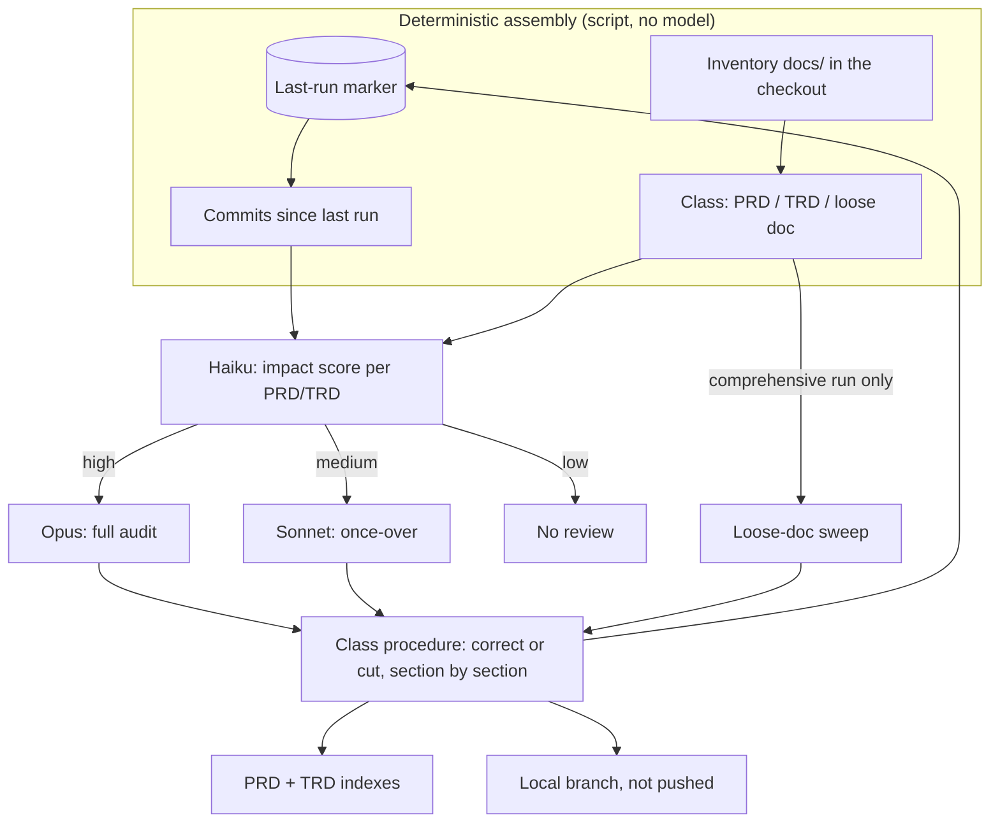

# PRD: Docs As-Built Audit (`/audit-docs`)

**Version**: 1.2.3
**Status**: Draft
**Created**: 2026-09-25
**Last Updated**: 2026-10-03
**Author**: @product-manager
**Stakeholders**: Owner (James Simmons)

**Source**: `docs/PRD/docs-as-built.brief.md`, an in-session brief (session
`be117aff-b3d2-4f82-88cc-81317cf111b7`, 2026-09-25) with no ticket or spec behind it. All owner
quotes below are verbatim from it. **The brief's final section, "Second round — owner's typed
answers after an independent review", overrides every earlier multiple-choice ruling on the same
subject.** Evidence items E1–E6 are the brief's and are not restated here.

**Verification**: Session-fidelity checked 1.0.1; audited 1.1.2; rewritten 1.2.0 after
independent review; 1.2.0 audited 2026-09-25 (3 of 3 verifiers reported) → 1.2.1. What that
audit did not check is listed under Could Not Verify.

---

## Changelog

| Version | Date | Changes | Author |
|---------|------|---------|--------|
| 1.0.0 | 2026-09-25 | Initial PRD from the docs-as-built brief | @product-manager |
| 1.0.1 | 2026-09-25 | Session-fidelity fixes: cross-repo ownership, remote-vs-local ref and first-run moved from Non-Goals to Open Questions; overlapping-TRD convergence restored to P0; invented `completed/` allowance and "separate branch" clause removed; wrong repo-path claim corrected | main agent |
| 1.1.0 | 2026-09-25 | Owner's multiple-choice answers to OQ-1–OQ-16 applied: light vs comprehensive by scope, first run batched, never-reviewed = maximally stale, tunable depth, code-map section in each doc, audit-verifier reuse, state folders, remote-branch review (F13), archive-rule correction (F14), cross-repo flagging (F15), no per-deletion ask | main agent |
| 1.1.1 | 2026-09-25 | OQ-17 → optional sibling-repo paths for cross-repo duplicate reporting | main agent |
| 1.1.2 | 2026-09-25 | `/audit-prd` findings applied (ordering, citations, audit-verifier separability) | main agent |
| 1.2.0 | 2026-09-25 | **Rewritten after an independent review** found 1.1.x had grown features the owner never asked for, mostly through multiple-choice answers, and after the owner's four typed answers (brief, second round). **Removed:** convergence of overlapping TRDs (old F12) — overlap is fine (answer 1); fetching and branching from the remote (old F13) and its risks R2/R9 — review the checkout (answer 2); correcting the framework's own archive rules (old F14) and risk R8 — done outside this feature on 2026-09-25 (answer 4); sibling-repo duplicate scanning (old AC-F15.2–F15.3, OQ-17) — never asked for in the owner's words; per-file review log, deterministic depth, and "never reviewed = maximally stale" (old F2) — replaced by answer 3, and the last one contradicted the owner's own example; carrying decisions into a replacing doc before removal (old AC-F4.4, AC-F7.2) — no "finding a home" (answer 1); fixed state-folder set (old AC-F10.2) and audit-verifier module notes (old AC-F4.6, AC-F5.5) — TRD decisions; personas; restated evidence; defaults OQ-4/5/8. **Added:** the goal restated as an accurate as-built library for agents (answer 1); the correct-or-cut test with deletion only when nothing valid remains (F7, answer 1); the light run as a Haiku impact score routing each doc to Opus / Sonnet / no review (F2, answer 3); the last-run marker; a default definition of the comprehensive run awaiting owner confirmation (F3, OQ-1); code map extended to loose docs that describe the system (F8). **Changed:** rulings table cut to rulings still in force, each labelled owner's own words or multiple-choice; "do not re-litigate" list holds only owner quotes; old F15 → F12; all NG, risk and AC IDs renumbered — 1.1.2 IDs do not carry over | main agent |
| 1.2.3 | 2026-10-03 | Owner rulings: the command is named `/audit-docs` (it completes the `/audit-prd` → `/audit-trd` → `/audit-build` family, checking docs against code); a TRD is skipped only when it has no implementation work or its work is clearly in flight, replacing the 1.2.2 skip rule (§8). OQ-1 ruled: a comprehensive run reviews everything, as the PRD assumed. No requirement added or removed | main agent |
| 1.2.2 | 2026-09-27 | Owner rulings: default thresholds 70/40 (AC-F2.3); a TRD whose implementation is unfinished is skipped | main agent |
| 1.2.1 | 2026-09-25 | `/audit-prd` of 1.2.0 (3 of 3 verifiers, source: the brief): noted that the code-checking verifiers AC-F4.4 and AC-F5.3 leave to the TRD already exist (`audit-prd.js`, `audit-trd.js`), and that TRDs already carry per-task `Touches:` blocks a code map (F8) can draw on. No requirement added, removed or changed. Could Not Verify rewritten | main agent |

---

## 1. Product Summary

### 1.1 Goal

In the owner's words (answer 1): *"My goal isn't a clean document set for human developers. My
goal is an accurate as-built library for agents doing fan-out searches of the doc/ folder."* And:
*"Duplication is not my concern, bad data is."* An agent that retrieves any chunk of `docs/`
should get a statement true of the code; history removed from the tree stays in git (owner
challenge, point 1).

### 1.2 Problem

*"as a codebase grows, PRDs, TRDs, and other design documents grow stale. In some cases they're
never implemented; in others, they're refactored, superseded."* (owner, turn 1). An agent
searching `docs/` cannot tell a stale passage from a current one: a "SUPERSEDED" banner is not
returned with the matching excerpt (E1), so whatever is in the tree is read as current. The
surveyed docs are wrong, not merely old — wrong values, wrong status fields, components described
that were deleted (E3, E4) — and `docs/` sprawls (E5). Nothing today selects which docs need
checking; `/audit-prd` and `/audit-trd` check one doc at a time (E6).

### 1.3 Solution

Skills/workflows that leave every passage under `docs/` true of the code or gone. A
deterministic step lists the commits since the last run and the docs (F1); Haiku scores each
PRD/TRD's likely impact and routes it to an Opus audit, a Sonnet once-over, or no review (F2); a
workflow fans out with one procedure per class (F4–F6); unsupported content is corrected or cut,
section by section, and a doc is deleted only when nothing valid remains (F7). The run keeps PRD
and TRD indexes (F9) and coarse code maps (F8), records where it got to (AC-F2.5), and commits to
a local branch for the owner (F11).

When or how often it runs is out of scope (NG1); it is assumed to run as a scheduled job
against a clean checkout (answer 2).

### 1.4 Solution Architecture

---

## 2. Users

| User | Need |
|------|------|
| Agents doing fan-out searches of `docs/` (implementers, `/create-prd`/`/create-trd` corpus indexing) | Every passage they retrieve is true of the code as built — the primary user (answer 1) |
| The owner | Reviews the change set each run produces, without reading every doc |

---

## 3. Goals and Non-Goals

### 3.1 Goals

| ID | Goal | Success Metric | Priority |
|----|------|----------------|----------|
| G1 | Every passage a run reviews ends that run true of the code, or cut | Reviewed passages the code contradicts after the run = 0 | P0 |
| G2 | Review effort follows the likely impact of recent commits on each doc | Every design doc in a light run has a score and a resulting depth (Opus / Sonnet / none) | P0 |
| G3 | PRDs, TRDs and loose docs are each reviewed by a procedure that fits their structure | Each class has its own procedure (F4, F5, F6) | P0 |
| G4 | A PRD index and a TRD index match the tree after every run | Every PRD/TRD in the tree is indexed; nothing absent is | P0 |
| G5 | Docs are tied to the code they describe by a coarse map | Reviewed docs carry a map with no line numbers | P0 |
| G6 | Nothing is removed that cannot be recovered | Every removal has a recovery record; no untracked or ignored file is deleted | P0 |

### 3.2 Non-Goals

Each non-goal that was proposed and rejected carries its revisit condition here rather than in §8.

| ID | Non-Goal | Rationale | Revisit when |
|----|----------|-----------|--------------|
| NG1 | Scheduling: weekly/monthly runs, cron, cloud routines | Owner, final: *"the scheduling is out of scope for this; just creating the skills/workflows to do it"* | The owner asks for scheduling |
| NG2 | Consolidating or merging overlapping docs, or moving surviving content into another doc | Answer 1: *"I don't care that they overlap"*; no *"find a home"* for surviving content. Replaces 1.1.x F12 | The owner reports overlap, not bad data, as what misleads agents |
| NG3 | Keeping stale docs as frozen history behind a status or "superseded by" banner, or adding any in-content signpost | Owner challenge, points 1–2; banners are not retrieved with the chunk (E1) | Every search path agents use returns a doc's status with each matched excerpt |
| NG4 | An in-tree archive folder (`docs/archive/`, `docs/completed/`, `docs/cancelled/`) | Still searched by `grep` and `git grep` (E1) | Every search tool agents use honours an ignore file excluding it |
| NG5 | Producing "living docs" (architecture or per-area overviews) | Owner challenge, point 3 | The framework starts producing living docs |
| NG6 | Preventing drift at authoring time, or `/implement-trd` closing out TRD status on completion | Owner challenge, point 4; status close-out on completion is routed to a separate `/plan` | Status close-out: when that `/plan` is taken up |
| NG7 | Fetching from, or reviewing, the remote instead of the checked-out tree | Answer 2: *"review checked out"*. Replaces 1.1.x F13 | The review must run where the checkout cannot be kept current |
| NG8 | Correcting a doc's claims about another repository's code; scanning sibling repositories for duplicates; a cross-repo ownership manifest | Not asked for in the owner's words (brief, second round). Replaces 1.1.1 AC-F15.2. Such claims are flagged only (F12) | The owner asks for cross-repo work |
| NG9 | Scanning docs for secrets or personal data | Raised as a one-off finding; not discussed | The owner asks for it |
| NG10 | Changing how `/create-trd`'s corpus phase detects supersession | Observed in session, not proposed as in scope; see R5 | Removal is shown to break that phase |
| NG11 | Line-number-precise grounding | Owner, turn 1: line numbers go *"instantly stale"* | — |

---

## 4. Feature Requirements

All features are P0.

#### F1: Deterministic assembly
**Description**: A script, no model call, that builds the inputs for the rest of the run: the
commits landed since the last run, and every file under `docs/` with its class. Owner, final:
*"assembles the file list […] deterministically, then does a fan out as a workflow"*; turn 1:
*"Ensuring we check other artifacts under the docs/ directory, as this tends to sprawl"*. The
owner's "and how deep it needs to go on each" is superseded for the depth decision by F2 (§8).

**Acceptance Criteria**:
- [ ] AC-F1.1: The file list covers every file under `docs/` in the checked-out tree, of any type.
- [ ] AC-F1.2: Every file carries exactly one class: PRD, TRD or loose doc. The folder proposes the
  class and the file's structure confirms it; a disagreement is reported and the file is handled
  as a loose doc (multiple-choice answer — confirm; see §8).
- [ ] AC-F1.3: The commit list is every commit on the checked-out branch after the last-run
  marker (F2). With no marker, there is no commit window and the run is comprehensive (F3).
- [ ] AC-F1.4: Each file is marked tracked, untracked or git-ignored (needed by AC-F7.4).
- [ ] AC-F1.5: The step makes no model call; identical inputs give identical output.

#### F2: Impact scoring decides depth (the light run)
**Description**: The owner's light-run design, answer 3 (quoted in §8). "Design doc" is read as
PRDs and TRDs; loose docs are covered by the comprehensive run's sweep (F3, F6). That reading is
the main agent's, following the owner's separate handling of loose docs (owner, final).

**Acceptance Criteria**:
- [ ] AC-F2.1: For each PRD and TRD, Haiku produces an impact score from the F1 commit list and
  the doc. The doc's code map (F8) may be an input to the scorer; this is derived, not required —
  scoring must work for a doc with no map.
- [ ] AC-F2.2: Score above the high threshold → full audit with Opus. Medium → moderate
  once-over with Sonnet. Low → no review.
- [ ] AC-F2.3: Both thresholds are tunable settings. Defaults, set by the owner 2026-09-27:
  high ≥ 70, medium ≥ 40 on a 0–100 scale (originally *"a certain threshold"*).
- [ ] AC-F2.4: The change set shows each doc's score and the depth it received, so the owner can
  see why a doc was or was not reviewed (derived from F11's owner review).
- [ ] AC-F2.5: The run records where it got to — the **last-run marker** — so the next run knows
  which commits are new. The marker must survive into a clean checkout (answer 2), so it cannot
  be local-only state; where it lives is the TRD's decision.

#### F3: Two runs — light and comprehensive
**Description**: *"a light review weekly, and a comprehensive review monthly"* (owner, turn 1).
The light run is defined by answer 3 (F2). The comprehensive run below was confirmed by the owner on 2026-10-03 (OQ-1).

| | Light run | Comprehensive run |
|---|---|---|
| Commit window and impact gating | Yes — commits since last run; low score → no review | No — every PRD and TRD reviewed |
| Depth per PRD/TRD | Opus / Sonnet / none by score | At least a Sonnet once-over; Opus audit where the scorer rates the doc high |
| Loose-doc sweep (F6) | No | Yes |
| Index refresh (F9), last-run marker (AC-F2.5) | Yes | Yes |

**Acceptance Criteria**:
- [ ] AC-F3.1: A light run and a comprehensive run can each be started by an explicit invocation.
- [ ] AC-F3.2: The fan-out workflow consumes F1's output and F2's scores; it does not re-decide
  class or depth.
- [ ] AC-F3.3: Each run behaves as its column in the table (comprehensive column confirmed
  2026-10-03, OQ-1).
- [ ] AC-F3.4: A run in a repository with no last-run marker is a comprehensive run, and its
  change set is delivered as several reviewable batches (multiple-choice answer to the old OQ-9 —
  confirm). The split key is the TRD's decision.

#### F4: PRD procedure
**Description**: Owner, final: *"PRDs vs TRDs vs loose docs should be handled differently -- since
PRDs and TRDs have very specific structures."* The unit of review is the PRD's structure —
requirements, acceptance criteria, decisions (`.claude/contracts/prd-authoring.md`) — not its prose.

**Acceptance Criteria**:
- [ ] AC-F4.1: Reports per requirement: built as stated, built differently, or not built.
- [ ] AC-F4.2: A requirement built differently is corrected to as-built (F7).
- [ ] AC-F4.3: A requirement not built is surfaced to the owner in the change set rather than cut
  (multiple-choice answer to the old OQ-6 — confirm; see §8).
- [ ] AC-F4.4: How the claims are checked against the code — including whether to reuse
  `/audit-prd`'s code-checking verifier — is the TRD's decision.
  *Already built:* that verifier is the `grounding` verifier in `packages/core/workflows/audit-prd.js`
  ("Does what … asks for ALREADY EXIST, or contradict the code?"), which already reports
  `already-exists` (with file and line) and `stale-doc` findings — the two outcomes AC-F4.1 needs.
  Reuse is available as-is; whether the Opus tier (AC-F2.2) runs only that verifier or the whole
  audit stays open (§8, "Reuse of `/audit-prd`/`/audit-trd`").

#### F5: TRD procedure
**Description**: Same owner line as F4. The unit of review is the TRD's structure — tasks,
`Touches` blocks, key technical decisions (`.claude/contracts/trd-authoring.md`).

**Acceptance Criteria**:
- [ ] AC-F5.1: Tasks and decisions are identified by structure and checked against the code.
- [ ] AC-F5.2: A status that does not match what was delivered is corrected (owner challenge,
  point 4: *"Fixing the status to close them out properly is [an option]"*; E4).
- [ ] AC-F5.3: How the claims are checked against the code — including whether to reuse
  `/audit-trd`'s code-checking verifier — is the TRD's decision.
  *Already built:* `packages/core/workflows/audit-trd.js` carries the equivalent — its
  `GROUNDING_RULE`, a `stale-doc` check, and reuse of `/create-trd`'s grounding findings file
  (`.trd-state/<feature>/findings/grounding.json`). Same open point as AC-F4.4.

#### F6: Loose-doc procedure
**Description**: Everything else under `docs/`; runs in the comprehensive run. Owner, turn 1:
*"Not being afraid to archive things (screenshots, test data files, etc.) that are no longer
helpful (or worse, flat out wrong)"* — "archive" now meaning remove from the tree (NG4).

**Acceptance Criteria**:
- [ ] AC-F6.1: Prose loose docs that describe the system (runbooks, guides) are checked for claims
  the code does not support and handled by F7 (E3: a runbook calls a deleted component
  "unchanged").
- [ ] AC-F6.2: Non-text files (images, data) are kept or removed, never corrected. One is removed
  only when no longer helpful and AC-F7.3's reference check finds nothing using it.

#### F7: Correct or cut, section by section
**Description**: The core rule, from answer 1: *"I don't care if we're left with a TRD in which
95% is deleted as superseded, and only 5% remains."*

**Acceptance Criteria**:
- [ ] AC-F7.1: For each section of a reviewed doc: content the code shows to be different is
  **corrected** to what the code shows; content describing something that does not exist is
  **cut**; valid content is left as it is.
- [ ] AC-F7.2: A doc stays with whatever valid content remains, however little. It is deleted
  only when nothing valid remains. *(Derived from answer 1 — "if the 5% is valid" it stays.)*
  Surviving content is never merged into, or moved to, another doc (NG2).
- [ ] AC-F7.3: A file is removed only after a reference check across the **whole repository**,
  including CI configuration and tests, finds nothing that uses it (E5: a data directory that
  looked dead is read by `ci.yml` and four tests).
- [ ] AC-F7.4: Only git-tracked files are deleted. Untracked and ignored files are reported,
  never deleted — "recoverable from git" is false for them.
- [ ] AC-F7.5: Every removal writes a recovery record: path, last commit that contained it, why.
- [ ] AC-F7.6: No banner, header or note marking content superseded or archived is added in place
  of a correction or a cut (NG3).
- [ ] AC-F7.7: A path a doc names that no longer exists is checked against git history before it
  is called drift (E2: of 291 missing paths, 49 ever existed).

#### F8: Coarse code map
**Description**: Owner, turn 1: *"Grounding things - IE helping tie documentation to where it's
implemented. Doesn't have to be line number specific, that goes instantly stale, but something to
help serve as a map into the code."*

**Acceptance Criteria**:
- [ ] AC-F8.1: Each reviewed PRD, TRD and system-describing loose doc (runbooks, guides) carries
  a short "Where this lives in the code" section — directories, modules, symbols, no line
  numbers. In-doc placement: multiple-choice answer to the old OQ-7 — confirm. Loose docs are
  included because the owner's turn-1 line names documentation generally.
- [ ] AC-F8.2: A review corrects the map along with the rest of the doc (F7).

*Already built, for TRDs only:* every task in a TRD written to `.claude/contracts/trd-authoring.md`
carries a mandatory `Touches:` block listing the files it changes. That is per task and
file-level, so it does not satisfy AC-F8.1 by itself, but it is an existing source a TRD's
doc-level map can be derived from. PRDs and loose docs have no equivalent.

#### F9: PRD index and TRD index
**Description**: *"Maintaining a TRD and PRD index"* (owner, turn 1).

**Acceptance Criteria**:
- [ ] AC-F9.1: After every run, light or comprehensive, a PRD index and a TRD index each list
  every doc of its class in the tree and nothing absent from it.
- [ ] AC-F9.2: Each entry lists at least the doc's path and the top-level code directories from its
  map (multiple-choice answer to the old OQ-7 — confirm). Location and further contents are the
  TRD's decision.

#### F10: State in the path, never in the content
**Description**: State that must survive retrieval goes in the file path — the one thing every
search hit carries (revised concept, not contested; owner challenge, point 2).

**Acceptance Criteria**:
- [ ] AC-F10.1: Where a doc's state must be visible to a reader, the review expresses it by where
  the file lives, not by text inside it. The folder names are the TRD's decision.

#### F11: Changes delivered to a local branch for owner review
**Description**: Changes go to the owner as *"a PR or equivalent"* (revised concept, not
contested): a local branch, not pushed (multiple-choice answer to the old OQ-10 — confirm; a push
also needs its own authorization under `autonomy.md`).

**Acceptance Criteria**:
- [ ] AC-F11.1: The run commits to a new local branch from the checked-out commit, prints the
  exact command to push it and open a PR, and does not push, open a PR or merge.
- [ ] AC-F11.2: The change set lists corrections, cuts, removals with recovery records, each doc's
  score and depth (AC-F2.4), and every item surfaced for the owner (AC-F1.2, AC-F4.3, AC-F7.4,
  AC-F12.1).
- [ ] AC-F11.3: The run does not ask for confirmation of individual deletions; the owner's review
  of the branch is the checkpoint (multiple-choice answer to the old OQ-13 — confirm; also
  `autonomy.md`).

#### F12: Claims about other repositories are flagged, not corrected
**Description**: A doc's claims about another repository's code would otherwise read as drift and
be cut (E4: 46 of 84 frontend docs in one repo cite other repos' paths). Flagging stays after the
second round (brief, second-round Superseded table).

**Acceptance Criteria**:
- [ ] AC-F12.1: Claims about another repository's code are reported in the change set. They are
  not corrected, not cut, and not counted as drift.

---

## 5. Non-Functional Requirements

| ID | Requirement | Source |
|----|-------------|--------|
| NFR-1 | The assembly step (F1) makes no model call and is deterministic | Owner, final |
| NFR-2 | Deterministic scripts are unit-tested | `constitution.md`, Testing Philosophy item 3; `stack.md` |
| NFR-3 | The review command emits the standard status banners and four-section readout | `constitution.md`, Prohibited Pattern 7; `command-status.md` |
| NFR-4 | No mid-run confirmation prompts, including none per deletion | `constitution.md`, Prohibited Pattern 8; `autonomy.md` |

No performance, latency or cost requirement was stated, and none is written here.

---

## 6. Acceptance Criteria Summary

Every AC is stated in §4. How each feature's ACs are verified:

| Feature | ACs | Verification |
|---------|-----|--------------|
| F1 Assembly | AC-F1.1–F1.5 | Unit tests on a fixture tree (including a non-PRD file in a PRD folder) and fixture git history; run twice and compare (F1.5) |
| F2 Impact scoring | AC-F2.1–F2.5 | Workflow test harness (F2.1–F2.2); code review (F2.3); manual run, including in a fresh clone for the marker (F2.4–F2.5) |
| F3 Runs | AC-F3.1–F3.4 | Workflow test harness per the F3 table; manual run on a repo with no marker (F3.4) |
| F4 PRD procedure | AC-F4.1–F4.4 | Manual run on a PRD with known drift |
| F5 TRD procedure | AC-F5.1–F5.3 | Manual run on a TRD with known drift and a wrong status |
| F6 Loose docs | AC-F6.1–F6.2 | Manual run |
| F7 Correct or cut | AC-F7.1–F7.7 | Manual run on a part-stale doc — one valid section must survive alone (F7.2); unit tests for the CI-only reference (F7.3), untracked/ignored files (F7.4) and history check (F7.7); grep the change set for banners (F7.6) |
| F8 Code map | AC-F8.1–F8.2 | grep reviewed docs for the section and for line references |
| F9 Indexes | AC-F9.1–F9.2 | Unit test: index matches the tree |
| F10 State in path | AC-F10.1 | Manual review |
| F11 Delivery | AC-F11.1–F11.3 | Manual run; `git ls-remote` shows no new branch; session log shows no per-deletion ask |
| F12 Cross-repo claims | AC-F12.1 | Fixture doc citing another repo's path |
| NFRs | NFR-1–4 | Unit test (NFR-1, NFR-2); manual run (NFR-3); session log (NFR-4) |

---

## 7. Assumptions and Risks

**Assumption (answer 2):** the review runs as a scheduled job against a clean checkout that is
current. It reads the checked-out tree and does not fetch. If the checkout is stale, the review
corrects docs to stale code; keeping the checkout current belongs to scheduling (NG1).

| ID | Risk | Likelihood | Impact | Mitigation |
|----|------|------------|--------|------------|
| R1 | A file that looks dead is used by CI or tests, and removing it breaks the build | Med — seen once in two surveyed repos (E5) | High | AC-F7.3 whole-repo reference check; owner reviews the branch |
| R2 | Other repos' PRDs/TRDs do not follow this framework's templates, so F4/F5 misread them | Unknown — Belief, not fact | Med | AC-F1.2 handles them as loose docs. Settle by sampling target repos for the template headings |
| R3 | A correction is itself wrong, writing a false as-built claim | Med — E3 | High | Corrections are diffs on a branch the owner reviews (F11) |
| R4 | A valid section is cut as unsupported | Med | High | AC-F7.7 history check; recovery from git via the recovery record; owner review |
| R5 | `/create-trd`'s corpus phase greps for supersession banners (`packages/core/workflows/create-trd.js`), which removed docs no longer carry | Low | Low | Removal makes the banner unnecessary; changing the consumer is NG10 |
| R6 | A real PRD/TRD with an unusual shape is classed as a loose doc | Med | Med | AC-F1.2 reports every disagreement |
| R7 | A stale loose doc (e.g. a runbook, E3) survives light runs, which do not review loose docs | High — by design of F3 | Med | The comprehensive run sweeps loose docs; how often it runs is NG1 |
| R8 | Haiku rates a doc low that the commits in fact made stale, so it gets no review until a comprehensive run | Unknown — Belief, not fact | Med | Settle by running the scorer and an Opus audit over the same sample and comparing |
| R9 | The last-run marker advances while the review branch is unmerged or discarded, so the next run skips commits whose effect was never applied | Unknown — Belief, not fact; depends on where the TRD puts the marker | Med | TRD states when the marker advances; settle by running two light runs with the first branch left unmerged |
| R10 | In a scheduled job, the local branch lives in the job's checkout, where the owner may not see it | Unknown — depends on the scheduler | Med | Reaching the branch is part of scheduling (NG1); the run prints the push/PR command (AC-F11.1) |

---

## 8. Decisions and Rejected Alternatives

Alternatives that became non-goals (NG1–NG8) carry their revisit conditions in §3.2.

| Proposal | Verdict | Rationale | Revisit when |
|----------|---------|-----------|--------------|
| Carry decisions from a removed doc into the doc that replaced it (1.1.x AC-F7.2) | Rejected | Answer 1: no *"find a home"*. A decision still in force is valid content, so its doc is not deleted (AC-F7.2) | — (moot while deletion requires nothing valid to remain) |
| Depth decided deterministically from a review log and code-map overlap; never-reviewed docs maximally stale (1.1.x F2) | Superseded by F2 | Answer 3 replaces the owner's earlier *"how deep it needs to go on each deterministically"* for the depth decision. Deterministic assembly still covers the commit and doc lists. "Maximally stale" contradicted the owner's turn-1 example (a TRD delivered two days ago is *"likely reasonably current"*) | Haiku scores prove unreliable (R8) |
| Triage by doc age / last git edit | Rejected | Age and churn correlate ~0.5 with drift; bulk edits reset git dates (E2) | A measurement shows age predicts drift better than commit impact |
| Correct `process.md`, its template and `ensemble-vnext.md` in this feature (1.1.x F14) | Done outside this feature | Answer 4: *"just fix it so we don't forget"* | — |
| One review procedure for all docs | Rejected | Owner, final | PRDs and TRDs stop having distinct templates |

### Rulings still in force

**Owner's own words** can be relied on. **Multiple-choice answer — confirm** was chosen from
options the owner may not have fully weighed; it stands until the owner says otherwise.

| Subject | Ruling | Source | Applied in |
|---------|--------|--------|------------|
| Goal | Accurate as-built library for agents; overlap is fine | Owner's own words (answer 1) | §1, NG2 |
| Delete vs correct | Correct or cut section by section; keep whatever valid content remains | Owner's own words (answer 1); "delete only when nothing valid remains" derived | F7 |
| What is reviewed | The checked-out tree; assume a scheduled job on a clean checkout | Owner's own words (answer 2) | NG7, §7 |
| Light run | Commits since last run → Haiku score → Opus / Sonnet / none | Owner's own words (answer 3) | F2, F3 |
| Old archive rules | Fixed outside this feature | Owner's own words (answer 4) | §8 |
| Comprehensive run | See F3 | Owner's choice, 2026-10-03 (OQ-1: the stated default) | F3 |
| How a file is classed | Folder proposes, structure confirms; disagreement → loose doc | Multiple-choice answer — confirm | AC-F1.2 |
| First run | Comprehensive, delivered in batches | Multiple-choice answer — confirm | AC-F3.4 |
| Unbuilt PRD requirement | Surfaced, not cut | Multiple-choice answer — confirm. Note: F7's rule would otherwise cut it | AC-F4.3 |
| TRD for work not yet built, or not finished | Skipped only when it has no implementation work, or its work is clearly in flight — not reviewed, not cut. A TRD whose development tasks are all done is reviewed even if test, doc or infrastructure tasks remain open. How the run tells these apart is the TRD's (D19) | Owner ruling 2026-09-27, revised 2026-10-03: *"Skip a TRD that has NO implementation work or that clearly is in flight. If all development tasks are done and only test, doc, infra tasks (etc) are open, include"*. The 2026-09-27 rule skipped every TRD not finished, which would leave most TRDs unreviewed | AC-F7.1 |
| Default thresholds | High ≥ 70, medium ≥ 40, overridable per project | Owner ruling 2026-09-27 | AC-F2.3 |
| Where the code map lives | In the doc, "Where this lives in the code"; index lists top-level directories | Multiple-choice answer — confirm | AC-F8.1, AC-F9.2 |
| Delivery | Local branch only; push/PR command printed | Multiple-choice answer — confirm | F11 |
| Per-deletion confirmation | None; branch review is the checkpoint | Multiple-choice answer — confirm; also `autonomy.md` | AC-F11.3 |
| Reuse of `/audit-prd`/`/audit-trd` | Code-checking part only, not the full audits | Multiple-choice answer — confirm. The owner's later *"full audit with opus"* may mean otherwise; the TRD decides (AC-F4.4, AC-F5.3) | F4, F5 |
| Cross-repo claims | Flag only | Multiple-choice answer — confirm; flagging kept by the second round | F12 |

### Confirmed grounding — the owner's own words

- *"What real value is an old TRD that's no longer accurate? What does it actually tell us, other
  than obscure archaelogy about the system which, by looking at the changelog, we could retrieve
  from git if we really want to?"*
- *"labelling a file "ARCHIEVED -- NO LONGER RELEVANT" at the top, or even a section "SUPERSEDED
  BY TRD-XXX" isn't necessarily helpful, because whether or not that language gets retrieved with
  your matched chunk is a crap shoot."*
- *"'living docs' are a side effect of our framework, not a product of it."*
- *"fixing stale documentation at the source isn't an option. Fixing the status to close them out
  properly is, but they start getting stale the moment the next feature starts."*
- *"the scheduling is out of scope for this; just creating the skills/workflows to do it"*
- *"PRDs vs TRDs vs loose docs should be handled differently -- since PRDs and TRDs have very
  specific structures"*
- *"Keep them correct; I don't care that they overlap. Duplication is not my concern, bad data is.
  […] My goal isn't a clean document set for human developers. My goal is an accurate as-built
  library for agents doing fan-out searches of the doc/ folder"* (answer 1)
- *"review checked out. Let's ASSSUME though that this will be run as a scheduled job against a
  clean checkout."* (answer 2)
- *"a light run should do this: -- review the commits that have landed since the last run -- for
  each design doc, use a light/fast model (Haiku) to assess the likely impact to that document
  based on the commits (give it an impact score) -- if the impact score is over a certain
  threshold, it gets a full audit with opus -- if it's a medium impact, a moderate once-over with
  sonnet -- if a light impact, no review at all"* (answer 3)
- *"just fix it so we don't forget"* (answer 4)

### Documented decisions this PRD overrides

| Document | What it decided | Status |
|----------|-----------------|--------|
| `docs/PRD/ensemble-vnext.md` §F5.2 "Future Expansion" and directory layout | Archive old PRDs/TRDs to `docs/completed/` or `docs/cancelled/` | **Corrected on 2026-09-25, outside this feature** (answer 4) |
| `.claude/rules/process.md` Artifact Flow, and `packages/core/templates/process.md.template` | A completed TRD becomes `docs/TRD/completed/<feature>.md (archived)` | **Corrected on 2026-09-25, outside this feature** (answer 4); the scaffolder no longer creates `docs/TRD/completed/` or `cancelled/`. These edits were in the working tree, uncommitted, when 1.2.0 was written |

---

## Open Questions

None. OQ-1 (what a comprehensive run does) was ruled 2026-10-03 by the owner, who chose the stated assumption: a comprehensive run ignores the since-last-run window and reviews every PRD and TRD — at least a Sonnet once-over each, an Opus audit for those Haiku rates high — and sweeps the loose docs; a repo's first run is comprehensive and delivered in batches.

---

## Could Not Verify

The 1.2.0 audit checked this PRD against its brief and against this repository's code. It did not
re-run the surveys or open the surveyed repositories, so the rows below remain unverified —
out of that audit's scope, not checked and found true.

| Claim | Why unchecked | How to check |
|-------|---------------|--------------|
| All E1–E5 figures | Measured in other repositories (`lightning-lane`, `tbd`); out of scope for an audit of this repo, and the survey working files and E1's test repo were not preserved | Re-run the surveys in `/Users/james/dev/lightning-lane` and `/Users/james/dev/fortium/tbd/`; for E1, two TRDs with a banner on line 3 and the symbol on line 65, then `grep -rn` and `git grep` |
| Other repos' PRDs/TRDs follow this framework's templates (R2) — Belief, not fact | Lives in other repositories; out of scope | `grep -l "Master Task List" <repo>/docs/TRD/*.md \| wc -l` and `grep -l "Non-Goals" <repo>/docs/PRD/*.md \| wc -l` against the totals |
| A Haiku score from commits predicts which docs went stale (R8) — Belief, not fact | Nothing is built to measure yet | Score a sample, audit the same sample with Opus, compare |
