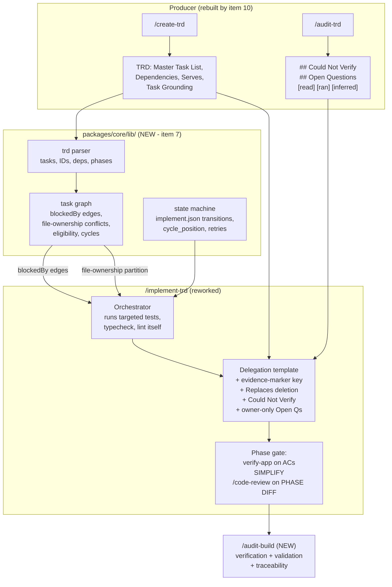
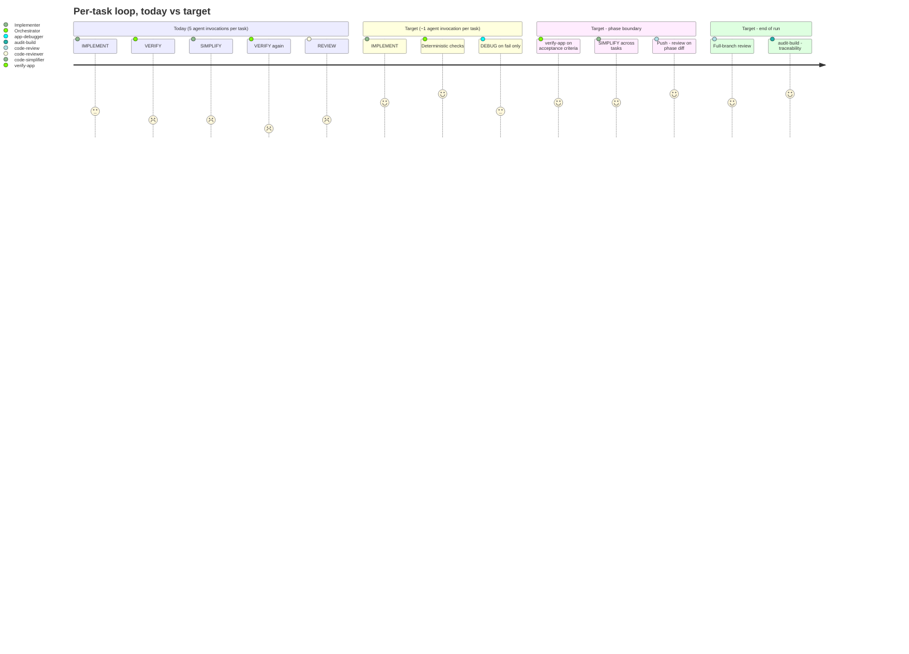

# PRD: Rework `/implement-trd` and Build the Deterministic Task Graph

**Version**: 1.0.0
**Status**: Draft
**Created**: 2026-08-15
**Last Updated**: 2026-08-15
**Author**: @product-manager
**Stakeholders**: Project owner (James Simmons); maintainers of `/create-trd`, `/audit-trd`, `harden-trd-team`, `verify-trd-team`, `fix-issue`, `init-project`

---

## Changelog

| Version | Date | Changes | Author |
|---------|------|---------|--------|
| 1.0.0 | 2026-08-15 | Initial PRD creation from `docs/modernization/runs/item8/SPEC.md` (improvement-plan items 7 + 8, verbatim) | @product-manager |

---

## 1. Product Summary

### 1.1 Problem Statement

`/implement-trd` is the consumer half of a producer/consumer pair, and the producer was
rebuilt without it. Item 10 rebuilt `/create-prd` and `/create-trd` into staged workflows
(`create-prd.js` 2 stages, `create-trd.js` 3 stages, verification in `audit-prd.js` /
`audit-trd.js`) and left `/implement-trd` shaped for TRDs that no longer exist.

Five things the producer now emits reach the consumer as nothing at all. Measured
2026-08-15 in the source spec, and re-measured by this PRD against
`packages/core/commands/implement-trd.md` (1466 lines, 53,685 bytes):

| Producer artifact | Occurrences in `implement-trd.md` | How measured |
|---|---|---|
| `[read]` / `[ran]` / `[inferred]` evidence markers | 0 | `grep -c` on each literal, 2026-08-15 |
| `Replaces` (the producer's capitalised term) | 0 | `grep -c "Replaces"` |
| `## Could Not Verify` | 0 | `grep -c "Could Not Verify"` |
| `## Open Questions` | 0 | `grep -c "Open Questions"` |
| `Serves` columns | 0 | `grep -c "Serves"` |

The producer contract mandates all of them: `packages/core/contracts/trd-authoring.md`
carries `## Open Questions` (line 659), `## Could Not Verify` (line 681), a reference to
`[inferred]` markers in grounding (line 684), and five occurrences of `Serves`.

Three further defects, each verified against source files rather than inherited from a
document:

1. **The `<design_references>` extraction targets a phantom section.**
   `packages/core/commands/implement-trd.md:1056` reads *"Extract from TRD Section 10
   'Reference Documents'"*, repeated at line 1118. A real generated TRD
   (`docs/TRD/discipline-judgment.md`) runs `## 1. Overview` through `## 8. Non-Goals`.
   There is no Section 10.
2. **`packages/core/lib/` does not exist.** `packages/core/` contains `agents commands
   contracts hooks scripts templates workflows` and no `lib`. Dependencies, eligibility,
   parallel sets and file-ownership conflicts are re-derived from TRD prose by the model on
   every invocation.
3. **The state model is single-tenant by construction.** `.trd-state/current.json` is one
   git-tracked pointer (currently `{"prd": null, "trd": "docs/TRD/discipline-judgment.md",
   ...}`), and `active_sessions` is `{}` in all three `implement.json` files on disk
   (`testing-phase`, `discipline-judgment`, `ensemble-vnext`) — the multi-session mechanism
   was designed and never used.

And the economics have inverted. Source-stated measurements: TRD authoring costs $39.45,
while the implement loop runs **~5 agent invocations per task** — 215 invocations for a
43-task feature, 60 for a 12-task one. Every per-task overhead multiplies by task count, so
the loop, not the planner, now dominates total cost.

### 1.2 Proposed Solution

One combined change, because the source merges item 7 into item 8 ("Build item 7's `lib/`
as part of this item, not after"):

- **Build the deterministic `lib/`** — TRD parser, task graph, state machine — under
  `packages/core/lib/`, and have `implement-trd.md` call them instead of describing them.
- **Wire the consumer to the producer** — evidence markers explained, `Replaces` surfaced as
  a deletion instruction, `## Could Not Verify` and owner-only `## Open Questions` routed to
  the tasks they touch, `<design_references>` pointed at a section that exists.
- **Collapse the per-task loop** from five agent invocations to roughly one, moving
  deterministic verification into the orchestrator and demoting `SIMPLIFY` to the phase
  boundary.
- **Move code review out of the loop** to per-phase and end-of-run `/code-review`.
- **Derive active TRD state from the branch** instead of a repo-wide pointer.
- **Add `/audit-build`** for post-implementation verification, validation, and
  requirement→implementation→test traceability.
- **Replace `harden-trd-team` / `verify-trd-team`** (1607 lines measured: 765 + 842) with a
  verifier fan-out and a deterministic E2E gate.

### 1.3 Value Proposition

- **Cost.** Source-stated target: ~215 agent invocations → ~50 on a 43-task feature.
- **Correctness of grounding.** Evidence markers exist so an implementer can tell a claim
  someone ran from a claim someone guessed. Passing them unexplained returns the document to
  uniform-looking precision — *"precision that isn't uniformly earned is worse than vagueness,
  because it stops the implementer checking."*
- **Earlier defect discovery.** The item-10 profile measured `sanitize_error_detail()`
  surviving two review passes into delivered code. A flaw found in phase 1 and built on
  through phase 5 is the expensive case; end-only review guarantees it.
- **Determinism.** A graph module emits `blockedBy` edges and a file-ownership partition that
  are today inferred from TRD text on every run.

### 1.4 Key Differentiators

The parallel-execution capability derives from task-graph *properties* rather than from a
separate command — inherited settled ground (ITEM-2-D1: `implement-trd-team` deleted, not
ported).

### 1.5 Solution Architecture

---

## 2. User Analysis

### 2.1 Target Users

| User Type | Description | Primary Need |
|-----------|-------------|--------------|
| Framework owner | Invokes `/implement-trd` on a real TRD and pays the token bill | Loop cost proportional to work done, not to task count |
| Implementer subagent | Consumes the delegation template per task | Know which grounding claims were run vs guessed, and what to delete |
| Concurrent developers | Two people, two TRDs, two worktrees off one repo | State that does not conflict by construction |
| Framework maintainer | Edits `implement-trd.md` | Deterministic operations in tested code, not in re-interpreted prose |

### 2.2 User Personas

**Persona: The framework owner**
- **Role**: Sole owner and primary operator of this framework
- **Goals**: Run `/implement-trd` unattended from one invocation to one final result
- **Pain Points**: ~5 agent invocations per task; `implement-trd.md` at ~13.4k tokens
  re-cached every turn (source-stated); review arriving once, at the very end, when findings
  cost the most to act on
- **Technical Proficiency**: High

**Persona: The implementer subagent**
- **Role**: `backend-implementer` / `frontend-implementer` / `agent-implementer` receiving one task
- **Goals**: Implement exactly the task, using grounding it can trust
- **Pain Points**: Receives evidence markers with no key (the delegation template passes the
  Task Grounding block verbatim at `implement-trd.md:921` but never explains the markers);
  no signal that a claim it is resting on was never verified
- **Technical Proficiency**: N/A (agent)

### 2.3 User Journey

---

## 3. Goals and Non-Goals

### 3.1 Goals

| ID | Goal | Success Metric | Priority |
|----|------|----------------|----------|
| G1 | `/implement-trd` consumes every artifact the rebuilt producer emits | All five artifacts in §1.1's table have non-zero, purposeful occurrence in the reworked command | P0 |
| G2 | Deterministic operations move from prose into tested code | Three modules under `packages/core/lib/`; Jest coverage above 80% (source-stated bar, item 7 "Done when") | P0 |
| G3 | Per-task agent invocations fall from ~5 toward ~1 | Source-stated target: ~215 → ~50 invocations on a 43-task feature | P0 |
| G4 | Code review happens per phase rather than once at the end | A five-phase feature receives roughly six reviews (source-stated: ~6 reviews, ~25–45 min) | P0 |
| G5 | Active-TRD state is derived from the branch, not a repo-wide pointer | `current.json`'s single-pointer role removed; explicit-argument fallback exists for unresolvable branches | P0 |
| G6 | `implement-trd.md` shrinks materially | Source-stated expectation: 400–600 lines lost | P1 |
| G7 | Every requirement has both an implementation and a test proving it | `/audit-build` reports traceability gaps | P1 |

### 3.2 Non-Goals (Explicit Scope Exclusions)

| ID | Non-Goal | Rationale |
|----|----------|-----------|
| NG1 | Porting Sunstone's whole `trd-parser.js` / `trd-graph.js` / `phase-tracker.js` / `cross-trd-deps.js` surface (76 test files) | Source: *"You don't need that whole surface"* — adopt three pieces, *"selectively and with evidence, not wholesale"* |
| NG2 | Sunstone's multi-runtime adapters and per-package marketplace split | Already on the improvement plan's "deliberately not doing" list, for reasons the source declines to re-open |
| NG3 | Recreating an `/implement-trd-team` command for parallelism | ITEM-2-D1: deleted, not ported. Parallelism derives from task-graph properties |
| NG4 | Paid `/code-review ultra` anywhere in the design | Owner ruled it out 2026-08-16; the whole design runs on the plan-billed local review |
| NG5 | Opening a **draft** PR at the start of implementation | Corrected in source: Claude skips draft PRs, so the earlier draft-PR instruction would have produced zero reviews |
| NG6 | Keeping `code-reviewer` in the per-task implement loop | Owner judgment: *"a poor substitute for the built in one — not nearly as effective."* ITEM-8-R3 |
| NG7 | Deleting `SIMPLIFY` outright | Demoted to the phase boundary, not deleted — *"there is no measurement either way, which is itself the reason not to delete it outright"* |
| NG8 | Reviewing the whole branch diff at each phase | Source: re-reviews settled code and produces churn; scope each phase review to the PHASE DIFF |
| NG9 | Reintroducing unit tests as standalone TRD tasks | Already fixed in `packages/core/contracts/trd-authoring.md` (verified, lines 344–382): unit tests are acceptance criteria on the task that adds the behaviour |
| NG10 | Solving concurrent-TRD coordination before the task graph exists | Source: *"Sketching a solution before the graph exists would be guesswork"* — the design lands with item 7's graph work, inside this item |
| NG11 | Installing the managed Code Review app (route a) or the `claude-code-action` workflow as part of this work | Source marks route choice and the `ANTHROPIC_API_KEY` / `CLAUDE_CODE_OAUTH_TOKEN` secret as **still owner-only**, needing repo-admin access |
| NG12 | Changing any model-invocation rule to enable CI review | Source, resolved against live docs: *"the CI path involves no model invocation at all"* — the GitHub runner executes the action |

---

## 4. Feature Requirements

### 4.1 P0 — Core Features (Must Have)

#### F1: Deterministic `lib/` — parser, graph, state machine

**Priority**: P0
**Description**: Build three modules under `packages/core/lib/` and have `implement-trd.md`
call them rather than describe them. Build incrementally: parser first, verify with the smoke
harness, then the graph, then state.

- **TRD parser** — Master Task List → structured tasks with IDs, dependencies, phase assignment
- **Task graph** — edges from declared dependencies *and* inferred file-ownership conflicts;
  eligibility, parallel sets, critical path, cycle detection
- **State machine** — `implement.json` transitions, `cycle_position` advancement, retry
  counting, checkpoints

**User Stories**:
- As a framework maintainer, I want dependency resolution in tested code so that it does not
  vary between runs of the same TRD.
- As the owner, I want `blockedBy` edges emitted rather than inferred so that parallel sets
  are deterministic.

**Acceptance Criteria**:
- [ ] AC-F1.1: Three modules exist under `packages/core/lib/` (parser, graph, state machine)
- [ ] AC-F1.2: Jest coverage above 80% across the three modules (source-stated bar)
- [ ] AC-F1.3: `implement-trd.md` calls the modules instead of describing their behaviour in prose
- [ ] AC-F1.4: The graph module emits `blockedBy` edges consumed directly by the team commands
- [ ] AC-F1.5: The graph module emits a file-ownership partition
- [ ] AC-F1.6: Graph detects cycles and reports them rather than looping
- [ ] AC-F1.7: The smoke harness is still green after each of the three increments
- [ ] AC-F1.8: The Sunstone fork (`Sunstone-Partners/ensemble`) is cloned fresh and read before
      any of this is written, against the source's three named questions; adoption decisions
      are recorded with evidence

**Dependencies**: `Sunstone-Partners/ensemble` clone (baseline is no longer on disk — the
`~/dev/ensemble` checkout named in CLAUDE.md does not exist as of 2026-08-12, and its `main`
has moved since the original survey).

---

#### F2: Evidence markers explained in the delegation template

**Priority**: P0
**Description**: The delegation template must explain what `[read]`, `[ran]` and `[inferred]`
mean, instruct the implementer to **verify any `[inferred]` claim before relying on it**, and
to trust `[ran]` most.

**User Stories**:
- As an implementer subagent, I want to know which grounding claims were run so that I check
  the ones that were only guessed.

**Acceptance Criteria**:
- [ ] AC-F2.1: The delegation template defines all three markers
- [ ] AC-F2.2: The template instructs the implementer to verify any `[inferred]` claim before relying on it
- [ ] AC-F2.3: The template states that `[ran]` claims are the most trustworthy
- [ ] AC-F2.4: `grep -c "\[inferred\]" packages/core/commands/implement-trd.md` returns > 0
      (baseline measured 2026-08-15: 0)

**Dependencies**: `/create-trd` and `/audit-trd` emitting the markers (already contracted in
`packages/core/contracts/trd-authoring.md`).

---

#### F3: `Replaces` surfaced as an explicit deletion instruction

**Priority**: P0
**Description**: The line naming what becomes unreachable must reach the implementer as a
deletion instruction, not as prose inside a passed block. This is the line that stops
superseded code accumulating — the `poi/reconcile/` problem.

**Verified partial state (2026-08-15):** the current template already carries
`<replaces>{what this makes unreachable, and the instruction to delete it}</replaces>` at
`packages/core/commands/implement-trd.md:926`, and an instruction at line 936: *"If
`<replaces>` names something, DELETE it and its tests in the same change."* The spec's
"0 mentions" measurement was of the producer's capitalised `Replaces`, which is genuinely
absent. **This requirement is therefore narrower than the spec's framing implies** — the
remaining work is confirming the producer's `Replaces` line reaches this element and that the
deletion instruction survives the rework, not authoring it from nothing.

**Acceptance Criteria**:
- [ ] AC-F3.1: The producer's `Replaces` line maps onto the delegation template's deletion instruction
- [ ] AC-F3.2: The deletion instruction survives the rework (present at or after the line-count reduction in G6)
- [ ] AC-F3.3: An implementer receiving a `Replaces` line deletes the named code and its tests in the same change

---

#### F4: `## Could Not Verify` reaches the implementer

**Priority**: P0
**Description**: `## Could Not Verify` — written by `/audit-*` — must reach the implementer
for the tasks it touches. *"A task resting on an unverified claim must be treated differently
from one resting on a checked fact."*

**Acceptance Criteria**:
- [ ] AC-F4.1: For each task, `## Could Not Verify` entries touching that task are included in its delegation
- [ ] AC-F4.2: The delegation states that the task rests on an unverified claim and names the claim
- [ ] AC-F4.3: A task with no relevant entries receives no section (absence is meaningful)

**Dependencies**: `/audit-trd` having run on the TRD.

---

#### F5: Owner-only unresolved `## Open Questions` surfaced before the task runs

**Priority**: P0
**Description**: An unresolved **owner-only** `## Open Question` covering a task is surfaced
before that task runs, not discovered mid-implementation.

**Acceptance Criteria**:
- [ ] AC-F5.1: Owner-only unresolved Open Questions are matched to the tasks they cover
- [ ] AC-F5.2: A covered task's Open Question is surfaced before the task is dispatched
- [ ] AC-F5.3: Surfacing does not itself violate `.claude/rules/autonomy.md` — see NFR-2

---

#### F6: `<design_references>` points at a section that exists

**Priority**: P0
**Description**: Fix the phantom extraction target.

**Verified defect (2026-08-15):** `packages/core/commands/implement-trd.md:1056` and `:1118`
both extract from *"TRD Section 10 'Reference Documents'"*. `docs/TRD/discipline-judgment.md`
runs `## 1. Overview` through `## 8. Non-Goals`.

**Acceptance Criteria**:
- [ ] AC-F6.1: Both extraction sites name a section that exists in a generated TRD
- [ ] AC-F6.2: `grep -n "Section 10" packages/core/commands/implement-trd.md` returns nothing
- [ ] AC-F6.3: When the named section is absent from a given TRD, the element is omitted rather than filled with a guess

---

#### F7: Per-task loop collapsed to ~1 agent invocation

**Priority**: P0
**Description**: Re-examine the 5-invocations-per-task loop against measured cost and move to
the decided target.

| | today | target |
|---|---|---|
| per task | IMPLEMENT → VERIFY → SIMPLIFY → VERIFY → REVIEW | IMPLEMENT → deterministic checks → [DEBUG on fail] |
| agents / task | 5 | ~1 |
| per phase | — | `verify-app` on acceptance criteria; push → review |
| at end | PR created, one review | `/audit-build` |

The orchestrator runs targeted tests, typecheck and lint **itself**. A `verify-app` agent is
warranted only where acceptance criteria need judgment — at the phase boundary. `SIMPLIFY`
drops out of the per-task loop and is **demoted to the phase boundary, not deleted**;
duplication *between* tasks is the real target and is only visible there.

**Acceptance Criteria**:
- [ ] AC-F7.1: The per-task cycle is IMPLEMENT → deterministic checks → [DEBUG on fail]
- [ ] AC-F7.2: The orchestrator runs targeted tests, typecheck and lint without spawning an agent
- [ ] AC-F7.3: `verify-app` runs at the phase boundary against acceptance criteria, not per task
- [ ] AC-F7.4: `code-simplifier` runs at the phase boundary, not per task
- [ ] AC-F7.5: `code-reviewer` no longer appears in the per-task loop
- [ ] AC-F7.6: Agent invocations per task measured on a real run and reported against the ~1 target

---

#### F8: Code review moves to per-phase and end-of-run

**Priority**: P0
**Description**: Two review points, both on the plan-billed local `/code-review`:

- **Per phase** — local `/code-review` started by `/implement-trd` itself, **scoped to the
  PHASE DIFF**, run as a background subagent so it costs no orchestrator context.
- **End of run** — one `/code-review high` over the FULL branch diff, covering cross-phase
  integration, which phase-scoped reviews are structurally blind to.

The PR is opened early and is **not a draft** (Claude skips draft PRs); `ready_for_review` is
also a valid trigger. `/implement-trd` currently creates the PR at `implement-trd.md:719`, at
the END of the run.

**Acceptance Criteria**:
- [ ] AC-F8.1: A non-draft PR is opened at the start of implementation
- [ ] AC-F8.2: Each phase checkpoint pushes to the PR branch
- [ ] AC-F8.3: Per-phase review is scoped to the phase diff, not the branch
- [ ] AC-F8.4: Per-phase review runs as a background subagent
- [ ] AC-F8.5: One `/code-review high` runs over the full branch diff at end of run
- [ ] AC-F8.6: The in-loop non-ultra `/code-review` path is verified **empirically** before the
      design relies on it (source: *"this claim has already been wrong once in the other direction"*)
- [ ] AC-F8.7: No `ultra` tier is invoked anywhere

---

#### F9: `code-reviewer` leaves the implement loop, everywhere it is referenced

**Priority**: P0
**Description**: The agent leaves the per-task loop. The source names four referencing
commands, *"each needs the same treatment"*.

**Verified reference set (2026-08-15, `grep -rln "code-reviewer"`):**
`packages/core/commands/fix-issue.md`, `init-project.md`, `harden-trd-team.md`,
`implement-trd.md`, plus `packages/core/agents/agent-validation.test.js` and
`packages/core/agents/skill-affinity.json` — **two references the source does not name.**

`code-reviewer`'s one distinctive job is not code review: acceptance-criteria verification is
traceability and belongs in `/audit-build` (F10).

**Acceptance Criteria**:
- [ ] AC-F9.1: All six referencing files are addressed, including the two the source does not name
- [ ] AC-F9.2: Acceptance-criteria verification is relocated to `/audit-build`, not dropped
- [ ] AC-F9.3: The vendored `.claude/` copies are updated in step with `packages/core/`

---

#### F10: `/audit-build` — post-implementation verification, validation, traceability

**Priority**: P0
**Description**: New command. Same proven shape as `audit-prd` / `audit-trd` — index →
parallel verifiers → reconcile — except the artifact is the delivered code and the source is
TRD + PRD.

- (a) delivered code matches TRD tasks — *verification* (built it right)
- (b) delivered code matches PRD requirements — *validation* (built the right thing)
- (c) **every requirement has both an implementation and a test proving it** — traceability

(c) is *"the highest-value check and the one with no current owner. A requirement with code and
no test is exactly how `sanitize_error_detail()` survived two review passes."*

**Verified (2026-08-15):** no `audit-build` exists in `.claude/commands/` or
`packages/core/workflows/` (which contains `audit-prd.js`, `audit-trd.js`, `create-prd.js`,
`create-trd.js`).

**Acceptance Criteria**:
- [ ] AC-F10.1: `/audit-build` exists and follows index → parallel verifiers → reconcile
- [ ] AC-F10.2: It checks delivered code against TRD tasks
- [ ] AC-F10.3: It checks delivered code against PRD requirements
- [ ] AC-F10.4: It reports, per requirement, whether an implementation exists and whether a test proving it exists
- [ ] AC-F10.5: A requirement with code and no test is reported as a gap, not passed

---

#### F11: Branch-derived state; retire the global pointer

**Priority**: P0
**Description**: Derive the active TRD from the branch and stop storing a global pointer.
Branch names already encode the workstream (`<issue-id>-<session>`,
`feature/<trd-name>/<session>`) and git already isolates them per worktree, so a file that
must be hand-synced with the branch will drift by construction — *"that is the reported
symptom."* Fall back to an explicit argument when the branch does not resolve.

**Verified (2026-08-15):** `.trd-state/current.json` is a single pointer; `active_sessions` is
`{}` in `testing-phase`, `discipline-judgment` and `ensemble-vnext` `implement.json`.

**Acceptance Criteria**:
- [ ] AC-F11.1: The active TRD is derived from the current branch
- [ ] AC-F11.2: An explicit path argument overrides / covers the unresolvable-branch case
- [ ] AC-F11.3: `current.json` no longer acts as the single repo-wide source of the active TRD
- [ ] AC-F11.4: The unused `active_sessions` mechanism is resolved (removed or given a purpose), not left as dead `{}`

---

#### F12: Concurrent TRDs, sessions, worktrees and developers — designed here

**Priority**: P0
**Description**: The source carries this as an open design question into items 7 and 8 and
states plainly: *"It is not solved today and neither item works without an answer."* Five
named breakages:

- `.trd-state/current.json` is a single git-tracked pointer — *"a merge conflict by construction"*
- `implement.lock` is per-TRD, so it prevents two sessions racing the *same* TRD but says
  nothing about two TRDs racing the same *files*
- the shared task list is session-scoped (`~/.claude/tasks/session-<id>/`) and never uploaded
- workflows cannot resume across sessions
- worktrees: whether `.trd-state/` is shared per repo or per tree, with different answers for
  the state file (per-branch) and a cross-TRD lock (repo-wide to be useful)

Item 7 is where this gets designed, *"because the task graph is where file ownership becomes
explicit — and cross-TRD conflict detection is the same computation as intra-TRD, just over a
wider set."* One precedent to reuse the reasoning of, not the mechanism: RUNTIME-D4's
monotonic refresh gate.

**Acceptance Criteria**:
- [ ] AC-F12.1: A written decision covers all five named breakages
- [ ] AC-F12.2: The decision is made after the graph exists, not before (NG10)
- [ ] AC-F12.3: `cross-trd-deps.js` in the Sunstone fork is read before ours is designed
- [ ] AC-F12.4: The worktree question (`.trd-state/` shared vs per-tree) is answered separately for the state file and for any cross-TRD lock

**Dependencies**: F1 (the graph).

---

### 4.2 P1 — Enhanced Features (Should Have)

#### F13: Split the authoring contract out of `implement-trd.md`

**Priority**: P1
**Description**: `implement-trd.md` is ~13.4k tokens (source-stated) and re-caches every turn.
The `create-trd` fix — splitting the authoring contract out from orchestration detail — cut
author cost materially and *"applies here unchanged."* The precedent is measurable:
`.claude/contracts/prd-authoring.md` records the equivalent saving as ~10.5k tokens re-cached
~17 times per run.

Measured baseline 2026-08-15: `packages/core/commands/implement-trd.md` is 1466 lines /
53,685 bytes. (The source's figure of 1,372 lines was measured earlier; the file has grown.)

**Acceptance Criteria**:
- [ ] AC-F13.1: The per-task implementer instruction set lives in its own contract file under `packages/core/contracts/`
- [ ] AC-F13.2: `implement-trd.md` retains orchestration detail only
- [ ] AC-F13.3: Combined with F1, `implement-trd.md` loses 400–600 lines (source-stated expectation)

---

#### F14: Replace `harden-trd-team` and `verify-trd-team`

**Priority**: P1
**Description**: 1607 lines (verified: 765 + 842) doing two unrelated jobs — adversarial
edge-case review, and forcing an end-to-end test path. *"Neither needs a team."* Replace with:

- a **verifier fan-out** for the adversarial pass — the shape that found real defects on both
  codebases in the item-10 profile
- a **plain deterministic E2E gate** — *"run the tests; do not convene agents to discuss them"*

**Acceptance Criteria**:
- [ ] AC-F14.1: The adversarial pass runs as a verifier fan-out, not a team
- [ ] AC-F14.2: The E2E gate runs tests deterministically with no agent convened to interpret them
- [ ] AC-F14.3: The two jobs are separated rather than collapsed into one replacement
- [ ] AC-F14.4: Both original commands are removed or reduced once their replacements exist

---

#### F15: Confirm the test-task placement rule takes effect

**Priority**: P1
**Description**: The contract change is already applied — verified:
`packages/core/contracts/trd-authoring.md` lines 344–382 state that a task shipping a
behaviour ships that behaviour's unit tests, that unit tests belong in acceptance criteria, and
*"Do not collect unit tests into a terminal 'Verification' phase."* What earns a task is (a) an
integration test crossing a seam no single implementation task owns, and (b) `[LIVE]`
end-to-end verification of the assembled feature.

The source flags what remains: *"Unmeasured: whether the instruction takes… this session twice
measured that a stated rule does not by itself produce the behaviour."* Expected effect on the
profile TRDs: ensemble 12 → 11 tasks, herald 27 → 24.

**Acceptance Criteria**:
- [ ] AC-F15.1: The next real `/create-trd` run is checked for standalone `Unit:`-prefixed tasks
- [ ] AC-F15.2: Every phase but a terminal E2E phase ends with something runnable
- [ ] AC-F15.3: A feature with no exercisable path says so in Quality Requirements rather than silently omitting E2E

---

## 5. Non-Functional Requirements

| ID | Requirement | Source |
|----|-------------|--------|
| NFR-1 | Jest coverage above 80% on the three `lib/` modules | SPEC.md item 7 "Done when": *"Three modules exist under `packages/core/lib/` with Jest coverage above 80%"* |
| NFR-2 | The reworked command obeys `.claude/rules/autonomy.md` — surfacing an owner-only Open Question (F5) must not become a mid-loop checkpoint prompt outside the four valid `AskUserQuestion` cases | `.claude/rules/autonomy.md`, named constraint; AUTO-D1/D2 |
| NFR-3 | The reworked command emits DISPATCHED / RESUMED / COMMAND COMPLETE banners; a command that ends silently is a bug | `.claude/rules/command-status.md`; constitution.md prohibited pattern 7 |
| NFR-4 | Per-phase review runs as a background subagent so it costs no orchestrator context | SPEC.md: *"background subagent so it costs no orchestrator context"* |
| NFR-5 | The orchestrator owns the task list; `lib/`-emitted `blockedBy` edges are applied by the command, never by a subagent | `.claude/rules/constitution.md` CONST-D1; background subagents have task tools removed and *"the removal reports no error"* |
| NFR-6 | No new subagent nesting; implementers hitting out-of-scope work report the conflict rather than delegating | `.claude/rules/constitution.md` CONST-D2 / CONST-D3 |
| NFR-7 | `lib/` modules are JavaScript/Node 18+ tested with Jest ^29 | `.claude/rules/stack.md` |
| NFR-8 | The smoke harness stays green after each of the three `lib/` increments | SPEC.md item 7 "Done when": *"smoke harness still green"* |

**No latency, throughput or uptime requirement is stated anywhere in the source.** The cost
figures that do appear (5 → ~1 agents per task; ~215 → ~50 invocations; 400–600 lines; ~25–45
min of review on a five-phase feature) are the source's own **targets and expectations**, not
enforced thresholds, and are recorded as goal metrics in §3.1 rather than as NFRs.

---

## 6. Acceptance Criteria Summary

### Feature Acceptance Criteria

| ID | Feature | Criterion | Verification Method |
|----|---------|-----------|---------------------|
| AC-F1.1 | F1 | Three modules under `packages/core/lib/` | Manual (`ls`) |
| AC-F1.2 | F1 | Jest coverage above 80% | Unit test (coverage report) |
| AC-F1.3 | F1 | `implement-trd.md` calls the modules, not describes them | Manual review |
| AC-F1.4 | F1 | Graph emits `blockedBy` edges consumed by team commands | Unit test + manual |
| AC-F1.5 | F1 | Graph emits file-ownership partition | Unit test |
| AC-F1.6 | F1 | Cycles detected and reported | Unit test |
| AC-F1.7 | F1 | Smoke harness green after each increment | Integration (BATS) |
| AC-F1.8 | F1 | Sunstone fork cloned fresh and read; adoption decisions evidenced | Manual |
| AC-F2.1 | F2 | Template defines `[read]` / `[ran]` / `[inferred]` | Manual review |
| AC-F2.2 | F2 | Template instructs verification of `[inferred]` before reliance | Manual review |
| AC-F2.3 | F2 | Template states `[ran]` is most trustworthy | Manual review |
| AC-F2.4 | F2 | `grep -c "\[inferred\]"` > 0 | Unit test (structure test) |
| AC-F3.1 | F3 | Producer `Replaces` maps onto the deletion instruction | Manual review |
| AC-F3.2 | F3 | Deletion instruction survives the rework | Manual review |
| AC-F3.3 | F3 | Implementer deletes named code and its tests in the same change | Manual (session log review) |
| AC-F4.1 | F4 | Relevant `## Could Not Verify` entries reach each task | Manual review |
| AC-F4.2 | F4 | Delegation names the unverified claim | Manual review |
| AC-F4.3 | F4 | No section when no entries apply | Manual review |
| AC-F5.1 | F5 | Owner-only Open Questions matched to covering tasks | Manual review |
| AC-F5.2 | F5 | Surfaced before dispatch | Manual (session log review) |
| AC-F5.3 | F5 | Does not violate autonomy rules | Manual review |
| AC-F6.1 | F6 | Extraction sites name an existing TRD section | Manual review |
| AC-F6.2 | F6 | `grep -n "Section 10"` returns nothing | Unit test (structure test) |
| AC-F6.3 | F6 | Element omitted when section absent | Manual review |
| AC-F7.1 | F7 | Per-task cycle is IMPLEMENT → checks → [DEBUG] | Manual review |
| AC-F7.2 | F7 | Orchestrator runs tests/typecheck/lint without an agent | Manual (session log review) |
| AC-F7.3 | F7 | `verify-app` at phase boundary only | Manual (session log review) |
| AC-F7.4 | F7 | `code-simplifier` at phase boundary only | Manual (session log review) |
| AC-F7.5 | F7 | `code-reviewer` absent from per-task loop | Unit test (structure test) |
| AC-F7.6 | F7 | Invocations per task measured on a real run | Manual (dispatch ledger) |
| AC-F8.1 | F8 | Non-draft PR opened at start | Manual (session log review) |
| AC-F8.2 | F8 | Push at each phase checkpoint | Manual (git log) |
| AC-F8.3 | F8 | Review scoped to phase diff | Manual review |
| AC-F8.4 | F8 | Review runs as background subagent | Manual (dispatch ledger) |
| AC-F8.5 | F8 | Full-branch `/code-review high` at end | Manual (session log review) |
| AC-F8.6 | F8 | In-loop non-ultra path verified empirically | Manual (live experiment) |
| AC-F8.7 | F8 | No `ultra` tier invoked | Manual review |
| AC-F9.1 | F9 | All six referencing files addressed | Unit test (grep-based structure test) |
| AC-F9.2 | F9 | AC verification relocated to `/audit-build` | Manual review |
| AC-F9.3 | F9 | Vendored `.claude/` copies in step | Unit test (vendoring.test.sh) |
| AC-F10.1 | F10 | `/audit-build` follows index → verifiers → reconcile | Manual review |
| AC-F10.2 | F10 | Checks code against TRD tasks | Manual (live run) |
| AC-F10.3 | F10 | Checks code against PRD requirements | Manual (live run) |
| AC-F10.4 | F10 | Reports implementation + test per requirement | Manual (live run) |
| AC-F10.5 | F10 | Code-without-test reported as a gap | Manual (live run) |
| AC-F11.1 | F11 | Active TRD derived from branch | Unit test |
| AC-F11.2 | F11 | Explicit-argument fallback exists | Unit test |
| AC-F11.3 | F11 | `current.json` no longer the single source | Manual review |
| AC-F11.4 | F11 | `active_sessions` resolved, not left dead | Manual review |
| AC-F12.1 | F12 | Decision covers all five named breakages | Manual review |
| AC-F12.2 | F12 | Decision made after the graph exists | Manual review |
| AC-F12.3 | F12 | `cross-trd-deps.js` read first | Manual |
| AC-F12.4 | F12 | Worktree question answered separately for state file and lock | Manual review |
| AC-F13.1 | F13 | Implementer contract in its own file | Manual (`ls`) |
| AC-F13.2 | F13 | `implement-trd.md` retains orchestration only | Manual review |
| AC-F13.3 | F13 | 400–600 lines lost | Manual (`wc -l`) |
| AC-F14.1 | F14 | Adversarial pass is a verifier fan-out | Manual review |
| AC-F14.2 | F14 | E2E gate deterministic, no agents convened | Manual review |
| AC-F14.3 | F14 | Two jobs separated | Manual review |
| AC-F14.4 | F14 | Original commands removed/reduced | Manual (`ls`) |
| AC-F15.1 | F15 | Next `/create-trd` run has no standalone `Unit:` tasks | Manual review |
| AC-F15.2 | F15 | Every non-terminal phase ends runnable | Manual review |
| AC-F15.3 | F15 | No-exercisable-path stated in Quality Requirements | Manual review |

### Non-Functional Acceptance Criteria

| ID | Requirement | Criterion | Verification Method |
|----|-------------|-----------|---------------------|
| AC-N1 | NFR-1 | Jest coverage above 80% on the three `lib/` modules | Unit test (coverage report) |
| AC-N2 | NFR-2 | No `AskUserQuestion` outside the four valid cases in a full run | Manual (session log review) |
| AC-N3 | NFR-3 | DISPATCHED / RESUMED / COMMAND COMPLETE banners present; COMMAND COMPLETE is the last line | Integration (BATS) |
| AC-N4 | NFR-4 | Per-phase review appears as a background subagent in the dispatch ledger | Manual (dispatch ledger) |
| AC-N5 | NFR-5 | No task-tool call originates from a subagent | Manual (session log review) |
| AC-N6 | NFR-6 | No `Agent` invocation from within an implementer | Manual (dispatch ledger) |
| AC-N7 | NFR-7 | `lib/` modules run on Node 18+ under Jest ^29 | Unit test |
| AC-N8 | NFR-8 | Smoke harness green after each `lib/` increment | Integration (BATS) |

---

## 7. Risk Assessment

| ID | Risk | Likelihood | Impact | Mitigation Strategy |
|----|------|------------|--------|---------------------|
| R1 | The in-loop `/code-review` path turns out not to be model-startable in this environment, and F8's per-phase design has no mechanism | Med | High | AC-F8.6 requires empirical verification **before** designing on it. The source itself flags: *"this claim has already been wrong once in the other direction."* Fall back to the CI route (F8 contingency) |
| R2 | A stated prompt rule does not produce the behaviour — the source measured this twice in one session, and F2/F3/F4/F5 are all prompt changes | High | High | Verify each against a real run, not against the file's text. AC-F7.6 and AC-F15.1 are the observation points |
| R3 | The parser demands a TRD format `/create-trd` does not produce, turning a parser change into a producer change | Med | High | Source flags it directly: *"a graph is only as deterministic as its input. If it requires structured task declarations, that is a change to `/create-trd`, not just to the parser."* Read Sunstone's parser first (AC-F1.8) and decide the format question before writing the graph |
| R4 | Concurrent-TRD design is attempted before the graph exists and produces guesswork | Med | High | NG10 and AC-F12.2 sequence it explicitly after F1 |
| R5 | Phases grow to 8+ tasks, the phase diff becomes unbounded, and the churn argument against per-phase review returns | Low | Med | Source-stated answer: *"smaller phases, not less review."* Measured on the profile TRDs, phases sit at ~4 (ensemble) and ~5.4 (herald) tasks. Watch on the first real run |
| R6 | Removing `code-reviewer` from the loop drops acceptance-criteria verification, which nothing else owns until `/audit-build` exists | Med | High | AC-F9.2 makes relocation to `/audit-build` a condition of removal; F10 is P0 for this reason |
| R7 | Item 6 (`REVIEW.md`) is declared a hard dependency — *"Do item 6 first"* — but `REVIEW.md`'s value is tied to route (a), which the billing table then argues against | Med | Med | Recorded as OQ-2. Do not treat "do item 6 first" as settled until the route decision is made |
| R8 | The vendored `.claude/` copies drift from `packages/core/` during a change this wide | Med | Med | AC-F9.3; the existing `vendoring.test.sh` structure test covers this class |

### Contingency Plans

**R1 Contingency**: If `/implement-trd` cannot start `/code-review` itself, fall back to route
(b) — `anthropics/claude-code-action@v1` in `ci.yml` — using the `synchronize` trigger, which
fires on every push to the PR branch and therefore produces a review per phase checkpoint with
no orchestration. Two inputs are load-bearing and easy to omit: `--comment` in the prompt
(without it findings go only to the workflow run log) and the `claude_args --allowedTools`
line naming the inline-comment MCP server. This requires the owner-only route and secret
decisions (NG11, OQ-1).

**R2 Contingency**: If a real run shows the delegation-template changes are not being acted
on, the failure is observable in the implementer's deliverables (a task resting on an
`[inferred]` claim that was never checked; a `Replaces` target still present in the tree). Add
a structure check to `/audit-build` (c) rather than adding more prompt text.

**R3 Contingency**: If the parser needs structured task declarations, scope a matching change
to `packages/core/contracts/trd-authoring.md` and `/create-trd` in the same item rather than
weakening the parser to accept prose.

**R6 Contingency**: If `/audit-build` slips, keep `code-reviewer`'s acceptance-criteria check
running end-of-run only (not per task) until `/audit-build` lands. This does not reinstate
NG6 — per-task review stays removed.

---

## 8. Decisions and Rejected Alternatives

| Proposal / Challenge | Verdict | Rationale | Revisit when |
|----------------------|---------|-----------|--------------|
| Keep `code-reviewer` in the per-task loop | Rejected (ITEM-8-R3) | Owner: *"a poor substitute for the built in one — not nearly as effective."* Re-scoping it (item 6's earlier proposal) is not enough | The built-in review tiers become unavailable to this project, or a measured comparison shows the agent finding a class the built-in review misses |
| Review only at the end of the run | Rejected | Today review runs per TASK; end-only swings from most frequent to least. The failure being optimised against is the late find, and end-only guarantees it. `--fix` degrades with age | Phases reach 8+ tasks and the phase diff becomes unbounded — and even then the answer is smaller phases, not less review |
| Paid `/code-review ultra` in the design | Rejected | Owner ruled it out 2026-08-16. The free local tier already fans out (measured: parent + 6 children in `dispatch.jsonl`, 2026-08-16 04:08–04:11) and found 14 real defects in 1,495 lines | A pre-merge confidence gate is wanted and the credit cost is accepted — ultra adds independent reproduction and verification of every finding, and a cloud sandbox |
| Route (a), the managed Code Review app | Deprioritised in favour of route (b) | Billing: ~$15–25 per review, so per-phase review on a five-phase feature is $75–125 on top of the plan; route (b) with an OAuth token is subscription-covered. *"That inverts the earlier recommendation."* Route (a) is also Team/Enterprise only | `REVIEW.md` governance is judged worth per-review credits — it is the only channel through which this project's Quality Gates and prohibited-pattern table reach the reviewer, and the local `/code-review` explicitly does not read it |
| Open a **draft** PR at the start of implementation | Rejected (corrected in source) | Claude skips draft PRs, closed PRs, PRs it judges trivial, and any already carrying a Claude comment. The draft instruction would have produced zero reviews | Never, unless the documented skip behaviour changes |
| Review the whole branch diff at each phase | Rejected | Re-reviews settled code and produces churn. Anthropic's own managed-service guidance concedes this by suggesting nit suppression after the first review; a phase-scoped diff solves it structurally | Never — the end-of-run full-branch review covers the cross-phase class instead |
| Delete `SIMPLIFY` outright | Rejected | Demoted to the phase boundary. *"There is no measurement either way, which is itself the reason not to delete it outright."* Duplication *between* tasks is the real target and is only visible at a phase boundary | A phase-boundary `SIMPLIFY` is measured and found to produce no change worth its invocation |
| Relocate unit-test tasks to earlier phases | Rejected (revised within the hour) | *"The first fix moved the wrong thing."* The tasks should not exist — unit tests were in the plan twice: implicitly inside the implementation task where TDD puts them, and again as standalone `Unit:` tasks (herald `CPUB-T004/T005/T006`, ensemble `DRIFT-T001`) | Never for unit tests. Integration tests crossing a seam no single task owns, and `[LIVE]` E2E of the assembled feature, still earn tasks |
| Port Sunstone's whole module surface | Rejected | *"You don't need that whole surface"* — three pieces carry the prose weight. *"Adopt selectively and with evidence, not wholesale"* | A specific Sunstone module is read and shown to solve a problem this design does not |
| Port group-naming to `blockedBy` (ITEM-2-R1) | Rejected (inherited) | Wrong construct for team semantics | Team semantics change in the platform |
| Recreate `/implement-trd-team` (ITEM-2-D1) | Rejected (inherited) | Parallelism derives from task-graph properties, not a separate command | Never — this is the architecture principle the graph work exists to establish |
| Permit subagent nesting by default (CONST-R1) | Rejected (inherited) | Observed `backend-implementer → backend-implementer → backend-implementer` with an identical task at the last two levels, ~567k tokens | An agent's work genuinely fans out, with a named rationale in its own definition |

### Confirmed grounding — do not re-litigate

- *"Our `code-reviewer` agent leaves the implement loop."* Owner judgment, stated directly: it is
  *"a poor substitute for the built in one — not nearly as effective."*
- **DECIDED 2026-08-16 — review per phase, not only at the end.** Owner ruled out the paid
  `ultra` step, so the whole design runs on the plan-billed 7-agent local review.
- *"Scope the review to the PHASE DIFF, not the branch."*
- **Owner's model on tests:** *"unit tests as you go, feature-level verification at the end."*
  The standalone unit-test tasks should not exist.
- **Item 7 merges into item 8:** *"Build item 7's `lib/` as part of this item, not after."*
- *"Derive the active TRD from the branch; stop storing a global pointer."*
- *"Verification does not need an agent when it is deterministic."* This repo's full suite runs
  in 3.15 s; a verify agent costs $5–15. *"The expensive thing is not running tests, it is
  spawning an agent to decide whether they passed."*

---

## 9. Open Questions

| ID | Question | What I assumed | Why it matters | If I'm wrong |
|----|----------|----------------|----------------|--------------|
| OQ-1 | Which review route, and which secret (`ANTHROPIC_API_KEY` vs `CLAUDE_CODE_OAUTH_TOKEN`)? The source marks both **still owner-only**, needing repo-admin access | Neither is decided. NG11 puts installation out of scope; F8 designs against the local model-startable path with route (b) as the R1 contingency | Route determines billing ($75–125 per five-phase feature on route (a) vs subscription-covered on route (b)) and whether `REVIEW.md` applies at all | The design is built against a path the owner does not choose, and F8's per-phase cadence has no mechanism |
| OQ-2 | Is item 6 (`REVIEW.md`) really a hard dependency? The source says *"Do item 6 first"*, then its own billing table argues for route (b), where `REVIEW.md` is *"not documented"* | I recorded the tension as R7 rather than resolving it, and did not make item 6 a stated dependency of any P0 feature | If item 6 is genuinely blocking, this whole item is sequenced behind it. If it is tied to route (a) only, it is not blocking under route (b) | Either the work starts blocked on something that does not block it, or review ships without this project's Quality Gates reaching the reviewer |
| OQ-3 | Are the seven "Done conditions" all equally P0, and are `/audit-build` and the team-command replacement in the same release? | I made done conditions 1–7 P0 except the contract split (F13, P1, because it is a cost optimisation rather than a correctness gap), made `/audit-build` P0 because AC-F9.2 depends on it, and made the team-command replacement P1 | Priority drives phase assignment in the TRD and what a partial delivery contains | A P1 turns out to be blocking, or a P0 inflates the first phase past what one run can carry |
| OQ-4 | What exactly are the "deterministic checks" the orchestrator runs per task? The source names *"targeted tests, typecheck and lint"* but not the commands | I left them as the three named categories, to be resolved against `stack.md` (Jest, pytest, BATS, ESLint, ShellCheck, Prettier) during TRD authoring | A vague instruction here is exactly the prose the `lib/` work exists to remove | Per-task checks are under- or over-scoped, and the ~1-invocation target is measured against the wrong baseline |
| OQ-5 | Are `harden-trd-team` and `verify-trd-team` deleted, or rewritten in place? The source says *"replaced"* | I wrote AC-F14.4 as "removed or reduced", covering both | ITEM-2-D2 notes teams cannot restore via `/resume` or `/rewind`; a rewrite that keeps teammates inherits that | Existing invocations break, or the team incompatibility survives the replacement |
| OQ-6 | Does the >80% Jest coverage bar apply only to the new `lib/`, or to `implement-trd`'s wider surface? | Applied it to the three `lib/` modules only — that is what the "Done when" sentence scopes it to | An over-broad reading turns a module bar into a repo-wide gate that nothing in the source asked for | A coverage expectation is missed or an invented one is enforced |
| OQ-7 | The source's line-count figure for `implement-trd.md` (1,372) does not match today's file (1466, measured 2026-08-15). Is the 400–600 line reduction measured from the old figure or the current one? | Measured from the current file (F13/AC-F13.3) | A reduction target measured against a stale baseline is not a target | The reduction is over- or under-claimed by ~94 lines |
| OQ-8 | Two `code-reviewer` references the source does not name — `packages/core/agents/agent-validation.test.js` and `packages/core/agents/skill-affinity.json` — need the same treatment? | Included them in AC-F9.1, since the source's instruction is *"each needs the same treatment"* and its list of four was not exhaustive | A test asserting `code-reviewer`'s presence will fail; a routing table will keep routing to it | Either a test breaks unexpectedly, or the agent keeps getting routed work after leaving the loop |

---

## 10. Could Not Verify

| Claim | How I'd check it |
|-------|------------------|
| `/code-review` at default effort fans out to 7 agents (parent + 6 children), measured in `dispatch.jsonl` 2026-08-16 04:08–04:11 | Inherited from SPEC.md, not re-measured. `grep -c '"event":"start"' .trd-state/*/dispatch.jsonl` scoped to that window, or re-run `/code-review` and read the ledger |
| `/code-review` found 14 real defects in 1,495 lines of this project's workflow code | Inherited from SPEC.md. Locate the review output or the commits that applied the findings |
| This repo's full test suite runs in 3.15 s | Inherited from SPEC.md. `time npm test` |
| A `verify-app` agent costs $5–15 and TRD authoring cost $39.45 | Inherited from SPEC.md. Check the run-cost records the item-10 profile produced |
| `/implement-trd` runs ~5 agent invocations per task today | Inherited from SPEC.md. Count `start` events per task id in `.trd-state/<feature>/dispatch.jsonl` for a completed run |
| `implement-trd.md` is ~13.4k tokens | Inherited from SPEC.md. I measured 53,685 bytes / 1466 lines; token count not independently computed |
| Managed Code Review bills ~$15–25 per review and is Team/Enterprise only; `ultra` gives 3 free then $5–25; route (b) is subscription-covered with an OAuth token | Inherited from SPEC.md's reading of `code.claude.com/docs`. Re-fetch `docs/en/code-review`, `docs/en/ultrareview`, `docs/en/github-actions` |
| Claude skips draft PRs, closed PRs, trivially-judged PRs, and PRs already carrying a Claude comment | Inherited from SPEC.md's reading of the live docs. Re-fetch `docs/en/code-review` |
| `/code-review` is model-startable by default (`skillOverrides: {"code-review": "user-invocable-only"}` implies the default permits it) | Inherited from SPEC.md. **AC-F8.6 makes empirical verification a requirement** — the source itself says this claim *"has already been wrong once in the other direction"* |
| The Sunstone fork contains `trd-parser.js`, `trd-graph.js`, `phase-tracker.js`, `cross-trd-deps.js` with 76 test files | Inherited from SPEC.md and CLAUDE.md. The checkout is not on this machine (verified: `~/dev/ensemble` gone as of 2026-08-12). `git clone Sunstone-Partners/ensemble && ls lib/ && find . -name '*.test.js' \| wc -l` |
| Review cost of 3.5 min for 413 lines and 8.5 min for 1,495 lines | Inherited from SPEC.md. Time a `/code-review` run against a diff of known size |
| Profile TRD shapes: ensemble 12 tasks / 3 phases, herald 27 / 5; herald's `CPUB-T007` is a `[LIVE]` Playwright E2E assigned to `@verify-app` | Inherited from SPEC.md. Herald is a separate repository not present here. For ensemble: `grep -c "^| ENS" docs/TRD/ensemble-vnext.md` and read its Execution Plan |
| The `poi/reconcile/` problem — superseded code accumulating because `Replaces` was not acted on | Inherited from SPEC.md as a named precedent. No such path exists in this repo; it is from another codebase. Ask the owner which repo, or treat it as illustrative only |
| The concurrent-TRD breakages: the shared task list is session-scoped at `~/.claude/tasks/session-<id>/` and never uploaded; workflows cannot resume across sessions | Inherited from SPEC.md. `ls ~/.claude/tasks/` and a live two-session experiment. I verified only the two file-based claims (`current.json` single pointer, `active_sessions: {}`) |
| The item-10 measurement that `sanitize_error_detail()` survived two review passes into delivered code | Inherited from SPEC.md and the PRD-authoring contract. It is cited here as a cautionary precedent, not as a fact about this repo's code |

---

## Appendices

### Appendix A: Glossary

| Term | Definition |
|------|------------|
| Producer / consumer | `/create-trd` + `/audit-trd` produce the TRD; `/implement-trd` consumes it |
| Evidence marker | `[read]`, `[ran]`, `[inferred]` — how a grounding claim was established |
| `Replaces` | The producer's line naming what a task makes unreachable, so it can be deleted |
| `Serves` | The column naming the objective a task derives from |
| Phase diff | The diff of one phase's checkpoint commits, as opposed to the whole branch diff |
| Route (a) / route (b) | Managed Code Review app / `anthropics/claude-code-action@v1` in `ci.yml` |
| Traceability | Requirement → implementation → test-proving-it, the `/audit-build` (c) check |

### Appendix B: Related Documents

- Source: `docs/modernization/runs/item8/SPEC.md` (improvement-plan items 7 and 8, verbatim)
- `docs/modernization/2026-08-improvement-plan.md`
- `packages/core/contracts/trd-authoring.md` — the producer contract
- `.claude/contracts/prd-authoring.md` — the split-contract precedent for F13
- `.claude/rules/constitution.md`, `.claude/rules/autonomy.md`, `.claude/rules/command-status.md`
- `packages/core/commands/implement-trd.md` — the artifact under rework
