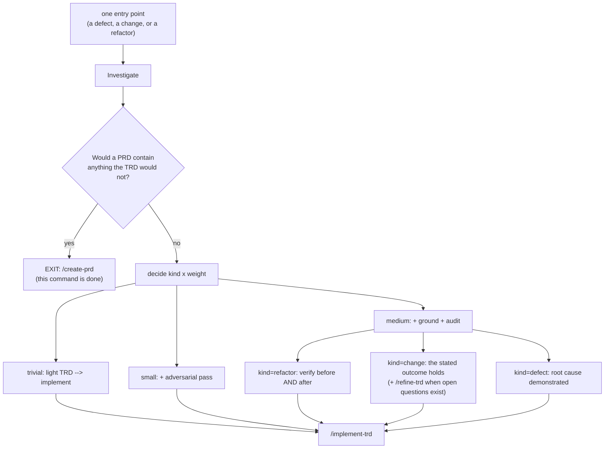

# PRD: One entry point that picks the weight (plan-weight-router)

**Version**: 1.1.1
**Status**: Draft
**Created**: 2026-09-22
**Last Updated**: 2026-09-22
**Author**: @product-manager
**Stakeholders**: Framework owner (sole user and sole decision-maker)

> **Deliberately lean.** The owner's instruction on invoking `/create-prd` was *"on item 21 --
> but keep it lean"*. Sections 2 and 5 are short or empty because nobody asked for what would
> fill them, not because they were overlooked. Section 5 (non-functional requirements) is
> empty; that is the correct outcome here.

---

## Changelog

| Version | Date | Changes | Author |
|---------|------|---------|--------|
| 1.0.0 | 2026-09-22 | Initial PRD from improvement-plan item 21 plus the 2026-09-22 session brief | @product-manager |
| 1.1.0 | 2026-09-22 | All six open questions answered by the owner interactively. Three went against this PRD's recorded assumptions: a new `/plan` command rather than extending `/investigate` (D3), `trivial` and `small` genuinely carry no audit (D4), and the rename is in scope for this release (D7). A fourth, `ESCALATE` routing to `/create-prd` (D6), was answered outside the options offered. Added NG11, NG12, AC-F2.5, AC-F6.3, AC-F7.3–F7.5. No requirement removed; the two-axis model unchanged. | @product-manager, owner decisions |
| 1.1.1 | 2026-09-22 | `/audit-prd` pass. Corrected the owner-decision count in section 9: three decisions (D3, D4, D7) went against a recorded assumption, not four — D6 was answered outside the options offered. Rewrote Could Not Verify to state what this audit did and did not check. Seventeen citation findings were rejected: none of the ids they name (DS1–DS3, D9-Refactor, R1.1–R8.1) exists in this document, and this document carries no self-citations of its own line numbers. | @product-manager |

---

## 1. Product Summary

### 1.1 Problem Statement

There are two ways into this framework and nothing between them.

`/investigate` is the light path. It refuses work above six tasks or ten touched files
(`MAX_TASKS = 6`, `DEFAULT_MAX_FILES = 10` in `packages/core/lib/fix-sizing.js`, lines 37 and
47), and on refusal it points at `/create-prd`. The full path is
`/create-prd → /audit-prd → /create-trd → /audit-trd`, which item 21 describes as a 56-minute
pipeline (source-stated figure; not independently measured here).

**Work with settled intent and ten tasks has no home.** Item 21 names its own design as an
instance: 12–18 tasks, no product decision anywhere in it, and the light path would refuse it
on task count alone.

Two further defects sit underneath that gap, and both were named by the owner:

- **The size ceiling is the wrong ruler.** `fix-sizing.js`'s own module header states that
  "the thing that keeps that safe is not the size of the diff — it is whether the change can
  be VERIFIED", and then makes task count its first `ESCALATE` rule (line 127). Both numbers
  were already raised once for firing on work that was plainly fine (3→6 and 5→10, recorded
  in the constants' own comments, dated 2026-08-29). They are honest numbers for a defect
  command and the wrong instrument for design work.
- **`REVIEW` is a fiction.** Owner, verbatim: *"Never once have I actually read a 'REVIEW'
  TRD."* Every TRD this framework has built was built by a machine running unattended. So a
  tier cannot mean permission — permission is always granted — and a tier that stops for a
  human buys a stall rather than safety.

A third conflation: `fix-sizing.js` escalates when the correct behaviour is not settled
(line 135), which treats "there is an open question" as "nobody has decided what we are
building". The owner's example is *"Should we use a slider or a text input box"* — open, and
nowhere near PRD-worthy.

### 1.2 Proposed Solution

One entry point that decides, after investigating, on **two axes** and routes to **one exit**.

- **`kind`** — `defect | change | refactor`. Already exists in `fix-sizing.js` (documented at
  line 65, defaulting to `defect`) and already changes what is scored.
- **`weight`** — `trivial | small | medium`. Decides which stages run.
- **`feature` is not a member of either list — it is the exit.** A PRD with real content in it
  means `/create-prd`, and this command is done.

Nine cells, none individually named:

| | trivial | small | medium |
|---|---|---|---|
| **defect** | light TRD → implement | + adversarial pass | + ground + audit |
| **change** | light TRD → implement | + adversarial pass | + ground + audit (+ `/refine-trd` when open questions exist) |
| **refactor** | light TRD → implement | + adversarial pass | + ground + audit, verified before **and** after |

`weight` selects the pipeline shape — how many review layers run, how much reasoning, which
models, how much output the owner reads. It never selects a permission.

`kind` changes the **stage list**, not only the scoring: a medium refactor's proof is "the
named tests pass before and after and the public surface has not moved"; a medium change's is
"the stated outcome holds". Same weight, different verification.

The test for reaching the exit is **content, not size**: would the PRD contain anything the TRD
would not — personas, user value, trade-offs about *what* to build? If it would restate the
TRD's intent, it is ceremony.

### 1.3 Value Proposition

Twelve-to-eighteen tasks with no product decision in them currently either get refused onto a
56-minute pipeline that writes a PRD restating the TRD, or get forced through a light TRD
format that cannot carry them. Item 21's own design is that work. The value is that this class
of work gets a proportionate path — and that two mechanisms now known to be wrong (a size
ceiling used as a product-decision gate, and a tier that waits for a human who never comes)
stop deciding it.

### 1.4 Solution Architecture

---

## 2. User Analysis

### 2.1 Target Users

| User Type | Description | Primary Need |
|-----------|-------------|--------------|
| Framework owner | Sole user of this framework and the only decision-maker in it. Invokes a command, leaves, returns to an artifact. | A proportionate path for work that is bigger than a fix and carries no product decision |

**Persona: the owner.** An engineer who reads agent output rather than authoring plans, and
who has never once read a `REVIEW` TRD (his own words). Every decision he makes is a review of
something a machine produced unattended. Technical proficiency: high. Pain point on the
record: work with settled intent and ten tasks gets refused by the light path and sent to a
pipeline that writes a document restating its own TRD.

No other persona is invented here, and no journey diagram is drawn: the journey is one command
invocation.

---

## 3. Goals and Non-Goals

### 3.1 Goals

| ID | Goal | Success Metric | Priority |
|----|------|----------------|----------|
| G1 | Work with settled intent that exceeds the light path's ceiling has a path that is neither `/investigate` nor the full four-command pipeline | Item 21's own design (12–18 tasks, no product decision) routes to medium without reaching `/create-prd` | P0 |
| G2 | Weight selects a pipeline shape, never a permission | No stage of the new path stops and waits for a human decision that was not asked for | P0 |
| G3 | The PRD decision is made on content, not on task or file count | The size ceiling no longer appears in the path that decides whether a PRD is needed | P0 |
| G4 | An open question no longer forces the exit to `/create-prd` | A medium change with open questions proceeds, carrying them in the existing channel | P0 |
| G5 | `kind` changes the stage list, so a refactor and a change of equal weight are verified differently | A medium refactor runs verification before and after; a medium change does not | P0 |
| G6 | The weight model is proved before anyone pays to refactor the workflows | Step 1 ships as a command that chains existing commands; no new workflow script | P0 |

### 3.2 Non-Goals (Explicit Scope Exclusions)

| ID | Non-Goal | Rationale |
|----|----------|-----------|
| NG1 | Exposing `/create-trd`'s `transcript` argument as the middle path | Never used: no command in the tree passes it (`grep -rn "transcript:"` over `.claude/commands/` and `packages/core/commands/` returns only `create-trd.md`'s own invocation block, line 731). A session transcript is also not a requirements document, and feeding one to `/audit-trd`'s omission audit turns every abandoned idea in a conversation into a missing requirement. Untested code path, not a capability. |
| NG2 | A `--transcript` flag on `/create-trd` | No such flag exists (`argument-hint: "[path-to-prd]"`), and the omission-audit semantics would need designing first. |
| NG3 | Raising the 6-task / 10-file ceiling | The ceiling is calibrated to the shape real fixes take. Raising it would make the light TRD format carry work it cannot: that format has **no phases**, and `trd-parser.js` assigns a phase-less task list to phase 1 as a structural default (stated at `.claude/commands/investigate.md:512-513`), so `/implement-trd` would get one phase and one gate. |
| NG4 | Using `REVIEW`, or a phased TRD at `REVIEW`, as the safeguard for medium work | A `REVIEW` TRD is never read, so it buys a stall rather than safety. Review **depth** is the dial instead. |
| NG5 | A five-name tier list (defect / minor / sweep / medium / escalate) | Mixed size and kind on one axis. |
| NG6 | A six-label list (defect / trivial change / small change / medium refactor / medium change / feature) | Gave `change` three sizes, `refactor` one, and `defect` and `feature` none — leaving a large defect and a trivial refactor real but unnamed. |
| NG7 | `MINOR` as a tier distinct from trivial | `kind` already changes what is scored; a trivial-vs-small distinction decides nothing new. |
| NG8 | `/sweep` as a weight or tier of this command | Sweep is answered from the *shape* of the input before any investigation. Making it a tier means investigating a list before discovering it is a list — the 22.7-minute failure that created `/sweep` (figure from the session brief; not re-measured here). |
| NG9 | Refactoring the two workflows into shared callable stages **as step one** | It is the end state, not the first step. No workflow script can `require` anything, so stages cannot be shared between workflows; the route is contracts plus a dumb dispatcher, reached after chaining proves the weights. |
| NG11 | Preserving `/investigate`'s unconditional audit at `trivial` and `small` | **Owner decision 2026-09-22 (OQ-4):** the grid rows mean what they say. The lightest two weights carry no audit. This is a deliberate reduction against today's behaviour, chosen for speed on small work; see D4. |
| NG12 | Collapsing `/create-trd` and `/create-prd` into the new command | **Owner decision 2026-09-22 (OQ-3):** they keep separate identities for this release. The end state in F8 remains compatible with collapsing later. |
| NG10 | Naming any of the nine cells | Nine cells, none needing its own name — that was the whole objection to NG5 and NG6. |

---

## 4. Feature Requirements

### 4.1 P0 — Core Features (Must Have)

#### F1: Two axes and one exit

**Priority**: P0
**Description**: One entry point decides, after investigating, a `kind` (`defect | change |
refactor`) and a `weight` (`trivial | small | medium`). `feature` is not a value of either
axis — it is the exit to `/create-prd`.

**User Stories**:
- As the owner, I want work sized on two axes so a large defect and a trivial refactor are
  both expressible, instead of being real but unnamed.

**Acceptance Criteria**:
- [ ] AC-F1.1: `kind` takes exactly `defect`, `change`, `refactor`; `weight` takes exactly
  `trivial`, `small`, `medium`.
- [ ] AC-F1.2: `feature` is not accepted as a `kind` or a `weight`; it is a routing outcome
  that ends this command.
- [ ] AC-F1.3: No cell of the nine-cell grid is given its own name in code, prose or output.

**Dependencies**: `kind` already exists in `fix-sizing.js` (line 65).

#### F2: Weight selects the stage list

**Priority**: P0
**Description**: `weight` decides which stages run, as increments: `trivial` is light TRD →
implement; `small` adds an adversarial pass; `medium` adds grounding and an audit.

**User Stories**:
- As the owner, I want a ten-task change with settled intent to get grounding and an audit
  without also getting a PRD that restates its own TRD.

**Acceptance Criteria**:
- [ ] AC-F2.1: `trivial` runs light TRD → implement.
- [ ] AC-F2.2: `small` runs everything `trivial` runs, plus an adversarial pass.
- [ ] AC-F2.3: `medium` runs everything `small` runs, plus grounding and an audit.
- [ ] AC-F2.4: No stage of any weight stops to ask the owner to authorise continuing
  (`.claude/rules/autonomy.md`).

- [ ] AC-F2.5: `trivial` and `small` run NO audit. This is a deliberate reduction from what
  `/investigate` does today, not an oversight — see D4.

**Dependencies**: F1. **Settled by the owner 2026-09-22 (OQ-4): the rows mean what they say.**
`trivial` and `small` genuinely carry no audit, which is a capability reduction against
`/investigate`'s current unconditional audit. Recorded as D4 and NG5 rather than left implicit.

#### F3: Kind changes the verification, not only the scoring

**Priority**: P0
**Description**: At the same weight, a refactor and a change are verified differently. A
medium refactor's proof is "the named tests pass before **and** after, and the public surface
has not moved". A medium change's proof is "the stated outcome holds". A defect is asked for a
demonstrated root cause; a refactor is not asked for a root cause it cannot have.

**User Stories**:
- As the owner, I want a refactor's claim that behaviour is unchanged to be witnessed by tests
  that existed before it, not by tests it wrote itself.

**Acceptance Criteria**:
- [ ] AC-F3.1: A medium `refactor` runs its named tests before and after the change, and both
  runs are recorded.
- [ ] AC-F3.2: A medium `refactor` checks that the public surface has not moved.
- [ ] AC-F3.3: A medium `change` is verified against the stated outcome, and is **not** asked
  for a before-run.
- [ ] AC-F3.4: A `refactor` is never asked for a root cause.

**Dependencies**: F2. `fix-sizing.js` already applies a stricter coverage rule to `kind ===
'refactor'` (line 184 onward) for this reason.

#### F4: The exit test is content, not size

**Priority**: P0
**Description**: The decision to route to `/create-prd` is made by asking whether the PRD
would contain anything the TRD would not — personas, user value, trade-offs about *what* to
build. Task count and touched-file count stop gating that decision.

**User Stories**:
- As the owner, I want twelve tasks with no product decision in them to go to the medium path,
  not to `/create-prd`.

**Acceptance Criteria**:
- [ ] AC-F4.1: The routing decision to `/create-prd` is stated in terms of PRD content, not
  task or file count.
- [ ] AC-F4.2: Neither `MAX_TASKS` nor the touched-file ceiling participates in the decision
  of whether a PRD is needed.
- [ ] AC-F4.3: Work of 12–18 tasks carrying no product decision routes to `medium`.

**Dependencies**: F1, F2. Supersedes S2 — see Section 8.

#### F5: A tier is a pipeline shape, never a permission

**Priority**: P0
**Description**: The new path grants permission unconditionally and varies only shape: how
many review layers run, how much reasoning, which models, how much of the output the owner
reads. No outcome of this path is "stop and let a human decide".

**User Stories**:
- As the owner, I do not want a path that stops for my approval, because I have never once
  read the artifact such a stop produces.

**Acceptance Criteria**:
- [ ] AC-F5.1: No `weight` produces an outcome whose action is "stop and wait for a human
  decision".
- [ ] AC-F5.2: The differences between weights are stage counts and review depth only.

**Dependencies**: F2. Supersedes S1 — see Section 8.

#### F6: An open question does not force the exit

**Priority**: P0
**Description**: An open question is not a product decision and must not route to
`/create-prd`. Open questions travel in the channel that already exists: an `## Open
Questions` section with an owner-only marker, carried into implementation.

**User Stories**:
- As the owner, I want "slider or text box?" to be carried as a question, not to be treated as
  "nobody has decided what we are building".

**Acceptance Criteria**:
- [ ] AC-F6.1: The presence of an open question does not by itself route work to
  `/create-prd`.
- [ ] AC-F6.2: Open questions written by this path are parsed by `trd-parser.js`'s
  `openQuestions` (with `ownerOnly`, `trd-parser.js:613-614`) and reach task prompts as
  `<open_question>` (consumed in `.claude/commands/implement-trd.md`).

- [ ] AC-F6.3: At `medium` with open questions, `/refine-trd` is **named in the readout and
  not invoked**. No stage of this command stops to wait for it.

**Dependencies**: F4. **Settled by the owner 2026-09-22 (OQ-1): recommended only.** The run
stays unattended end to end; the owner invokes `/refine-trd` if they want it. The known risk
that a recommendation is never acted on is accepted — see D5.

#### F7: Build by chaining existing commands first

**Priority**: P0
**Description**: Step one is a **new `/plan` command** that chains the existing commands, with
the weight decision added. It writes no new workflow script. Accept that chaining re-reads three
large prose files; this step is deliberately temporary.

**Settled by the owner 2026-09-22 (OQ-5, OQ-6): a new command, and the rename is in scope for
this release.** `/investigate` is replaced rather than extended. That is a larger first release
than the source assumed — 18 command files, the router hint, three governance docs, the
templates and every consuming project's vendored copy — and the owner chose it deliberately
over shipping under a name the source already calls wrong.

**User Stories**:
- As the owner, I want the weight model proved before anyone pays for a refactor, so that a
  wrong weight model costs a command file rather than a rewrite of two workflows.

**Acceptance Criteria**:
- [ ] AC-F7.1: Step one adds no new workflow script under `packages/core/workflows/`.
- [ ] AC-F7.2: The run emits one `COMMAND COMPLETE` banner per run, not one per chained
  command (`.claude/rules/command-status.md`'s chaining exception; `/investigate --implement`
  already does this).
- [ ] AC-F7.3: `/plan` exists as its own command file; `/investigate` no longer appears as a
  separate entry point.
- [ ] AC-F7.4: Every surface naming `/investigate` is updated in the same release — the 18
  command files, the router hint in `router.py`, `CLAUDE.md`, `process.md`, the templates under
  `packages/core/templates/`, and the vendored `.claude/` copies.
- [ ] AC-F7.5: At feature weight, `/plan` **invokes `/create-prd`** rather than printing a
  pointer to it, then stops. See D6 for the reading taken.

**Dependencies**: None.

### 4.2 P1 — Enhanced Features (Should Have)

#### F8: Extract each stage prompt to a contract when it is next edited

**Priority**: P1
**Description**: Not a big bang. As each stage prompt is next edited, move it into a contract.
This retires F7's cost of re-reading large prose files. End state: stage prompts in contracts,
the command composes, one generic staged-dispatch workflow executes — and `/create-trd`
becomes the same thing with the weight pinned to full.

**User Stories**:
- As the owner, I want the duplication this repo keeps getting hurt by avoided without a
  rewrite paid for up front.

**Acceptance Criteria**:
- [ ] AC-F8.1: No stage prompt is extracted to a contract except as part of an edit that stage
  was already receiving.
- [ ] AC-F8.2: No stage logic is shared between workflow scripts by `require` — the pattern is
  a contract plus a dumb dispatcher receiving assembled prompts in `args`, as
  `implement-phase.js` does.

**Dependencies**: F7 shipped and the weight model held up in use.

---

## 5. Non-Functional Requirements

| ID | Requirement | Source |
|----|-------------|--------|
| — | None. | Nobody raised a non-functional requirement for this feature. The one performance-adjacent fact in the source — that chaining re-reads three large prose files — is recorded as an accepted, deliberately temporary cost in F7, not as a requirement with a threshold. |

---

## 6. Acceptance Criteria Summary

### Feature Acceptance Criteria

| ID | Feature | Criterion | Verification Method |
|----|---------|-----------|---------------------|
| AC-F1.1 | F1 | `kind` and `weight` take exactly their listed values | Unit test |
| AC-F1.2 | F1 | `feature` is a routing outcome, not an axis value | Unit test |
| AC-F1.3 | F1 | No cell of the grid is individually named | Manual (review of command text and output) |
| AC-F2.1 | F2 | `trivial` = light TRD → implement | Unit test on the stage list |
| AC-F2.2 | F2 | `small` adds an adversarial pass | Unit test on the stage list |
| AC-F2.3 | F2 | `medium` adds grounding and an audit | Unit test on the stage list |
| AC-F2.4 | F2 | No stage pauses for authorisation | Manual (session log review) |
| AC-F3.1 | F3 | Medium refactor: named tests run before and after, both recorded | Integration test |
| AC-F3.2 | F3 | Medium refactor: public surface checked unmoved | Integration test |
| AC-F3.3 | F3 | Medium change: outcome verified, no before-run demanded | Unit test on the stage list |
| AC-F3.4 | F3 | A refactor is never asked for a root cause | Unit test |
| AC-F4.1 | F4 | PRD routing is stated in content terms | Manual (review of command text) |
| AC-F4.2 | F4 | Size ceilings do not participate in the PRD decision | Unit test |
| AC-F4.3 | F4 | 12–18 tasks with no product decision route to `medium` | Manual (run on item 21's own design) |
| AC-F5.1 | F5 | No weight yields "stop and wait for a human" | Unit test on outcomes |
| AC-F5.2 | F5 | Weights differ only in stage count and review depth | Manual (review of command text) |
| AC-F6.1 | F6 | An open question alone does not route to `/create-prd` | Unit test |
| AC-F6.2 | F6 | Open questions parse as `openQuestions`/`ownerOnly` and reach `<open_question>` | Integration test |
| AC-F7.1 | F7 | Step one adds no new workflow script | Manual (file listing) |
| AC-F7.2 | F7 | One `COMMAND COMPLETE` banner per run | Manual (session log review) |
| AC-F8.1 | F8 | Contract extraction only rides an edit the stage was already getting | Manual (diff review) |
| AC-F8.2 | F8 | No `require` sharing between workflow scripts | Unit test (grep assertion) |

### Non-Functional Acceptance Criteria

Empty — Section 5 is empty.

---

## 7. Risk Assessment

| ID | Risk | Likelihood | Impact | Mitigation Strategy |
|----|------|------------|--------|---------------------|
| R1 | The weight model is wrong — three weights turn out not to be the right cut, or the increments are — and the discovery comes after the refactor is paid for | Medium | High | Chaining first (F7). A wrong weight model then costs one command file, not a rewrite of two workflows. Do not start F8 until the weights have held up in real use. |
| R2 | Removing the size ceiling from the PRD decision lets genuinely feature-shaped work through the medium path, where the light TRD format cannot carry it | Medium | Medium | The content test (F4) replaces the size test rather than deleting it: routing to `/create-prd` still happens, on "would the PRD have content". Whether the ceiling remains for any *other* purpose is deliberately untouched by this PRD. |
| R3 | `trivial` and `small` carry no audit, so the lightest work loses the audit `/investigate` performs unconditionally today (tier table, `.claude/commands/investigate.md:380-384`). **Accepted by the owner 2026-09-22 (D4), not mitigated away.** | Realised by choice | Medium | Cannot ship silently: recorded as NG11 and asserted by AC-F2.5. The exposure is that a small change with a subtle design fault now reaches implementation unaudited where today it would not. Watch for it in `/audit-build` findings on `trivial`- and `small`-weight work; if defects start surfacing there that an audit would have caught, that is the signal to revisit. |

### Contingency Plans

**R1 Contingency**: if a weight proves wrong after F7 ships, change the weight decision in the
chaining command and re-run; no workflow script exists yet to unpick. If the whole axis proves
wrong, F7 is one file to delete.

**R3 Contingency**: the owner chose the reduction deliberately (D4), so there is no contingency
to hold in reserve — the audit is not coming back by default. If `/audit-build` starts finding
defects on `trivial`- and `small`-weight work that an audit would have caught, the cheapest
correction is to move the adversarial pass down from `small` to `trivial` before reinstating a
full audit at either weight.

---

## 8. Supersedes — where the source overrides the corpus and the code

Recorded here rather than resolved silently. In all three rows the source (item 21, owner-agreed
2026-09-22) governs the existing documents and code.

| ID | Document | What it decided | What the source says instead | Why the source governs |
|----|----------|-----------------|------------------------------|------------------------|
| S1 | `.claude/commands/investigate.md` (line 20; tier table 380-384) and `packages/core/lib/fix-sizing.js` (module header) | A tier **is** a permission: *"the tier is a permission and this flag is only an intent"*. `fix-sizing.js` exists to *"decide whether a `/fix` may run unattended"* — `AUTO` means no human in the loop, `REVIEW` means stop and let a human decide, `ESCALATE` means not light-path work at all. | `REVIEW` is a fiction (*"Never once have I actually read a 'REVIEW' TRD"*). Every TRD this framework built was built by a machine unattended, so tiers cannot mean permission — permission is always granted. A tier must select a **pipeline shape**. | Later, and the owner speaking about his own behaviour. The documents describe a mechanism that works; the owner reports it has never been used for its purpose. |
| S2 | `packages/core/lib/fix-sizing.js` (`MAX_TASKS = 6` line 37, `DEFAULT_MAX_FILES = 10` line 47, `ESCALATE` drops lines 127 and 139) and `.claude/commands/investigate.md`'s `ESCALATE` row | Task count and touched-file count decide whether work leaves the light path; above six tasks or ten files the verdict is `ESCALATE`, which points at `/create-prd`. | Both numbers are honest for a defect command and the wrong ruler for design work. The ceiling stops gating the PRD decision; the replacement test is content — would the PRD contain anything the TRD would not. 12–18 tasks with no product decision belongs on `medium`. | Later, and narrower in the code's favour only on a different question (unattended safety). Whether the `ESCALATE` **label** survives is left open — OQ-2. |
| S3 | `.claude/commands/investigate.md` (tier table 380-384; description line 3) | Every tier writes the light TRD **and audits it** — the audit is unconditional, and the command's own description is *"write a light TRD and audit it"*. | The grid runs the audit at `medium` only (*"+ ground + audit"*); `trivial` is light TRD → implement and `small` adds only an adversarial pass. | Later. **But this is the weakest of the three**: the grid states stages as increments, so it may assume a baseline rather than exclude the audit. Carried to OQ-4 for the owner to confirm before it becomes a task. |

### Confirmed grounding — do not re-litigate

- *"Never once have I actually read a 'REVIEW' TRD."*
- Two axes and one exit: *"yes - this is the correct answer."*
- *"Should we use a slider or a text input box"* is open and nowhere near PRD-worthy.
- Chain the existing commands first; extract contracts second.
- Nine cells, none needing its own name.

---

## 9. Decisions and Rejected Alternatives

| Proposal / Challenge | Verdict | Rationale | Revisit when |
|----------------------|---------|-----------|--------------|
| Expose `/create-trd`'s existing `transcript` argument as the middle path | Rejected | No command passes it; untested code path. A session transcript is not a requirements document, and `/audit-trd`'s omission audit would turn every abandoned idea in a conversation into a missing requirement. | Never as-is. Only if someone first designs omission-audit semantics for a transcript input — at which point it is a different feature. |
| A `--transcript` flag on `/create-trd` | Rejected | No such flag exists; `/create-trd` takes `[path-to-prd]`. Same omission-audit problem as above. | Same condition as the row above. |
| Raise `/investigate`'s 6-task / 10-file ceiling | Rejected | Would make the light TRD format carry work it cannot: no phases, so `/implement-trd` gets one phase and one gate. | If the light TRD format gains phases, the ceiling becomes a size question again rather than a format question. |
| "Phased TRD at `REVIEW` rather than `AUTO`" as the safeguard for medium work | Rejected | `REVIEW` is never read, so it buys a stall rather than safety. Review **depth** is the dial. | If the owner starts reading `REVIEW` TRDs — which is the same as saying: if the premise in S1 stops being true. |
| A five-name tier list (defect / minor / sweep / medium / escalate) | Rejected | Mixed size and kind on one axis. | Never. The two-axis grid is the correction to exactly this. |
| A six-label list (defect / trivial change / small change / medium refactor / medium change / feature) | Rejected | Gave `change` three sizes, `refactor` one, and `defect` and `feature` none — a large defect and a trivial refactor were real but unnamed. | Never, for the same reason. |
| `MINOR` as a tier distinct from `trivial` | Rejected | `kind` already changes what is scored; the distinction decides nothing new. | If a stage is ever found that a `small` needs and a `trivial` must not have, beyond the adversarial pass. |
| `/sweep` as a weight or tier of this command | Rejected | Sweep is answered from the *shape* of the input before any investigation; making it a tier means investigating a list before discovering it is a list. | Never, unless input shape can be classified before investigation runs. |
| Refactor the two workflows into shared callable stages as step one | Rejected as step one; adopted as the end state | No workflow script can `require` anything (verified: zero `require(` calls in the eight non-test scripts under `packages/core/workflows/`; the eleven hits in that directory are all in `*.test.js` and `test-harness.js`, which run under Node). So stages cannot be shared; the route is contracts plus a dumb dispatcher. | After F7 ships and the weights hold up in real use — that is F8. |
| Name the nine cells | Rejected | Nine cells, none needing its own name; naming them is what broke the five- and six-label proposals. | Never. |

### Owner decisions taken 2026-09-22 in `/refine-prd`

All six open questions were answered by the owner directly, interactively. **Three went against
an assumption this PRD had recorded** — D3, D4 and D7, each marked as such in its own row. A
fourth, D6, was answered outside the three options this PRD offered, so it changed the design
without contradicting a recorded assumption. That is why these five are listed separately
rather than folded into the table above.

| ID | Question | Decision | What it changes, and what I had assumed |
|----|----------|----------|------------------------------------------|
| D3 | Is the entry point a new command, or `/investigate` gaining the axes? (OQ-6) | **A new `/plan` command.** | Against the recorded assumption. The deliverable is a new command file, not an edit; `/investigate` is replaced rather than extended. |
| D4 | Does `trivial` genuinely drop the audit `/investigate` runs today? (OQ-4) | **Yes — the rows mean what they say.** | Against the recorded assumption of "increments over a baseline". `trivial` and `small` carry no audit. A deliberate capability reduction, recorded as NG11 and as a new acceptance criterion AC-F2.5 so it cannot ship as an accident. |
| D5 | Does `/refine-trd` run at medium-with-open-questions, or is it recommended? (OQ-1) | **Recommended only.** | The run stays unattended end to end. The owner accepted the stated risk that, by his own account of never reading a `REVIEW` TRD, a recommendation may be a stage that never executes. |
| D6 | Does `ESCALATE` survive? (OQ-2) | **It routes to `/create-prd`.** | The owner's own wording, not one of the three options offered (rename / keep / remove). Read as: at feature weight the command **invokes** `/create-prd` rather than printing a pointer, then stops. **Belief, not fact** on the reading: "route" is directional, and the owner has consistently rejected being the thing that moves work forward — but he did not say "invoke". The alternative reading is that it names the command in the readout. Settled by one sentence in `/refine-trd`, or by the first run. |
| D7 | Is the rename in scope for this release? (OQ-5) | **Yes.** | Against the recorded assumption. Adds the 18 command files, the router hint, three governance docs, the templates and every consuming project's vendored copy to the first release. Chosen over shipping under a name the source itself calls wrong. |

**The scope of the first release is materially larger than this PRD assumed at v1.0.0.** Three
of the four assumptions it recorded for bounding scope — extend rather than replace, rename
later, audit preserved everywhere — were overturned. Nothing about the two-axis model changed.

---

## Open Questions

**All six are answered.** Resolved interactively by the owner on 2026-09-22 via `/refine-prd`;
the decisions and what each overturned are recorded as D3–D7 in section 9.

| ID | Question | Answer | Recorded as |
|----|----------|--------|-------------|
| OQ-1 | Does `/refine-trd` run at medium-with-open-questions, or is it only recommended? | Recommended only | D5, AC-F6.3 |
| OQ-2 | Does `ESCALATE` survive? | It routes to `/create-prd` | D6, AC-F7.5 |
| OQ-3 | Do `/create-trd` and `/create-prd` collapse into the new command? | No — separate for this release | NG12 |
| OQ-4 | Does `trivial` genuinely drop the audit? | Yes, the rows mean what they say | D4, NG11, AC-F2.5 |
| OQ-5 | Is the rename in scope for the first release? | Yes | D7, AC-F7.4 |
| OQ-6 | New command, or `/investigate` gaining the axes? | A new `/plan` command | D3, AC-F7.3 |

One thing is deliberately left as a stated belief rather than a settled fact: the reading of
"route it to `/create-prd`" as *invoke* rather than *name in the readout*. See D6.

## Could Not Verify

**State after the 2026-09-22 audit** (source of truth: `docs/modernization/2026-08-improvement-plan.md`;
all three verifiers reported). That audit checked two things: whether every requirement id and
cross-reference in this document resolves, and whether the document's internal counts agree with
its own tables. It found one real defect — the claim that four owner decisions overturned a
recorded assumption, where the table marks three — and that is now fixed, so it is a change, not
an entry here. It re-measured **none** of the six claims below, which is why all six survive
unchanged: each needs a timing run, a session search, or a filesystem count that a
citation-and-consistency audit does not perform.

| Claim | Why it is still unverified | How I'd check it |
|-------|----------------------------|------------------|
| The full `/create-prd → /audit-prd → /create-trd → /audit-trd` pipeline takes 56 minutes | Source-stated in item 21. Out of scope for this audit: settling it needs a timed run, not a document read. | Time an actual run end to end, or find the session the figure came from. |
| `/sweep` exists because of a 22.7-minute failure in which a list was investigated before being recognised as a list | Session-brief-stated. Out of scope: the evidence is in a past session, not in this tree. | Locate the session or the `/sweep` design note that records the measurement. |
| `/create-trd`'s `transcript` argument has **never** been used | Partly settled: there is no *caller* in the current tree (`grep -rn "transcript:" .claude/commands/ packages/core/commands/` returns only `create-trd.md:731`, its own invocation block). The word "never" is a claim about history, which the tree cannot answer. | `grep -rln transcript .trd-state/` plus a search of the session transcripts. |
| All six PRD-less TRDs on disk came through `/investigate`'s light path | Session-brief-stated; still not counted. Out of scope: needs a filesystem cross-reference this audit did not run. | `grep -L "PRD" docs/TRD/*.md` cross-referenced against each TRD's header source line. |
| Item 21's own design is 12–18 tasks | Source-stated estimate, not a task list anyone has written. Unverifiable until the work is planned — this is the figure AC-F4.3 rests on. | Write the TRD and count its tasks. |
| `weight` and the nine-cell stage lists are not implemented anywhere today | Partly settled: no `/plan` command exists (`.claude/commands/` holds 18 `.md` files, none named `plan`) and `fix-sizing.js` has no `weight` axis (its two `weight` hits, lines 5 and 68, are ordinary prose). The plugin layer was not searched. | `grep -rn "weight" packages/full/ packages/core/` for a partial implementation. |

**Nothing in this document was found false and left standing.** The one falsified claim was
corrected in place; no requirement was removed by this audit.
