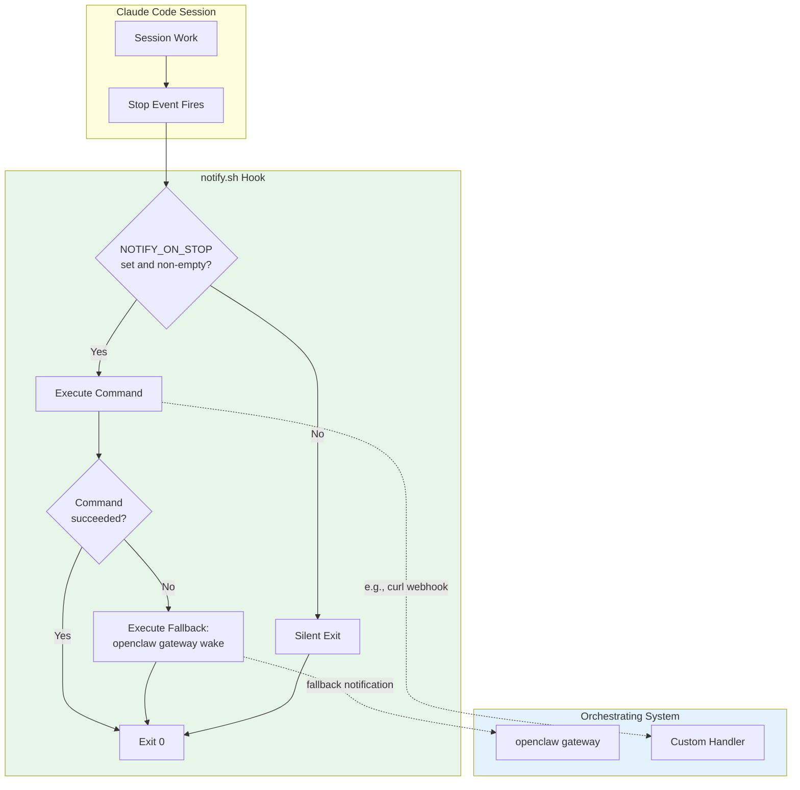
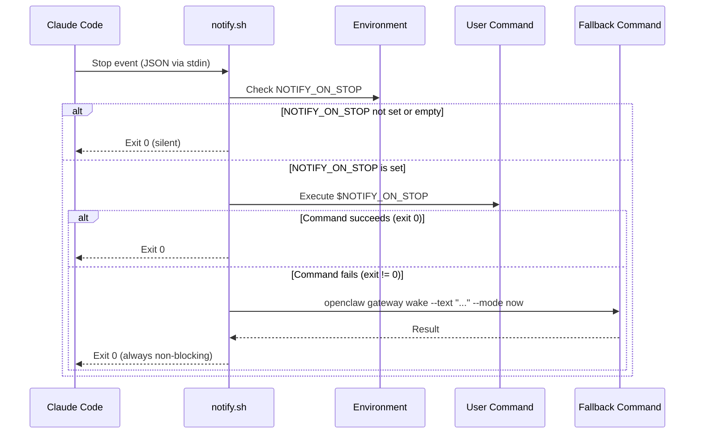
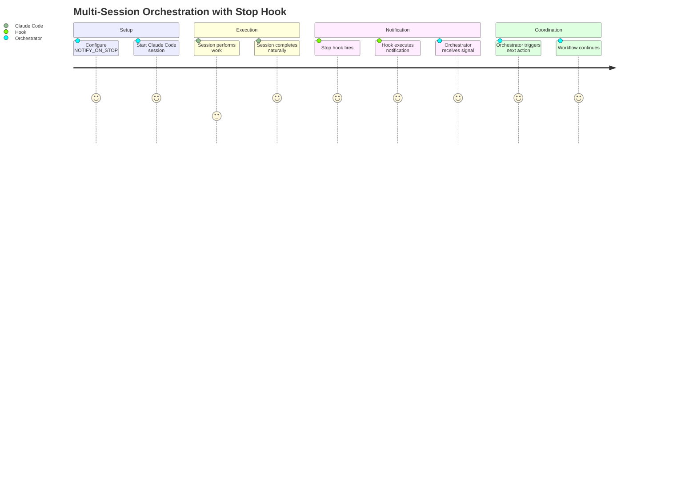

# Product Requirements Document: Stop Hook Notification

**Document Version**: 1.0.0
**Status**: Draft
**Created**: 2026-02-03
**Updated**: 2026-02-03
**Author**: Product Management

**Stakeholders**:
- Engineering Team (implementation)
- DevOps Team (orchestration patterns)
- Platform Team (Claude Code integration)

---

## Changelog

| Version | Date | Changes |
|---------|------|---------|
| 1.0.0 | 2026-02-03 | Initial PRD creation |

---

## Table of Contents

1. [Product Summary](#1-product-summary)
2. [User Analysis](#2-user-analysis)
3. [Goals and Non-Goals](#3-goals-and-non-goals)
4. [Feature Requirements](#4-feature-requirements)
5. [Technical Requirements](#5-technical-requirements)
6. [Acceptance Criteria Summary](#6-acceptance-criteria-summary)
7. [Risk Assessment](#7-risk-assessment)
8. [Appendices](#appendices)

---

## 1. Product Summary

### 1.1 Problem Statement

When orchestrating agents spawn Claude Code sessions (either locally or in remote/cloud environments), there is no reliable mechanism to be notified when those sessions complete. Currently, orchestrating systems must:

1. **Poll session logs periodically** - Resource-intensive and introduces latency between completion and detection
2. **Rely on instructions like "run command X when done"** - These are suggestions to the LLM, not guarantees, and may be ignored or forgotten
3. **Implement complex watchdog patterns** - Custom solutions that are brittle and difficult to maintain

This creates friction in multi-session orchestration patterns where an outer agent or system needs to coordinate work across multiple Claude Code sessions running in parallel (e.g., in tmux, background processes, or cloud VMs).

### 1.2 Solution Overview

Add a **Stop hook** that fires when a Claude Code session ends and optionally executes a user-configured notification command. The hook:

1. Checks for `NOTIFY_ON_STOP` environment variable
2. If set, executes the value as a shell command
3. Provides fallback behavior if the command fails
4. Remains silent when no notification is configured

This enables reliable session completion signaling without requiring changes to prompts or relying on LLM behavior.

### 1.3 Value Proposition

**For orchestration systems**: Reliable, deterministic notification when Claude Code sessions complete, enabling robust multi-session coordination patterns.

**For power users**: Simple configuration via environment variable enables sophisticated orchestration workflows without custom tooling.

**For DevOps teams**: Standard hook pattern integrates with existing infrastructure (tmux, message queues, webhooks, etc.).

### 1.4 Solution Architecture



### 1.5 Hook Event Flow



---

## 2. User Analysis

### 2.1 Target Users

1. **Orchestration System Developers** - Building systems that coordinate multiple Claude Code sessions
2. **Power Users** - Running parallel sessions that need coordination
3. **DevOps Engineers** - Integrating Claude Code into CI/CD or automation pipelines

### 2.2 User Personas

#### Persona 1: The Multi-Session Orchestrator

**Profile**: Senior engineer or platform developer building systems that spawn and coordinate multiple Claude Code sessions.

**Current Behavior**:
- Spawns Claude Code sessions in tmux panes, background processes, or cloud VMs
- Implements polling loops to detect session completion
- Uses log file watchers or process monitors
- Maintains custom orchestration scripts

**Pain Points**:
- Polling introduces latency and wastes resources
- Process monitoring misses Claude Code's internal stop events
- Instructions to LLM ("run X when done") are unreliable
- Complex watchdog patterns are brittle

**Ensemble vNext Value**: Deterministic hook-based notification eliminates polling and enables event-driven orchestration.

#### Persona 2: The Parallel Workflow Power User

**Profile**: Developer running multiple parallel Claude Code sessions for complex features.

**Current Behavior**:
- Starts multiple sessions with different tasks
- Manually monitors sessions for completion
- Coordinates manually when sessions finish

**Pain Points**:
- Context switching to monitor multiple sessions
- Missing session completions leads to idle time
- No automated way to trigger follow-up actions

**Ensemble vNext Value**: Automatic notification when sessions complete enables hands-off parallel workflows.

#### Persona 3: The CI/CD Integrator

**Profile**: DevOps engineer integrating Claude Code into automated pipelines.

**Current Behavior**:
- Wraps Claude Code in scripts with timeout-based completion detection
- Uses process exit codes for basic status
- Cannot reliably detect graceful session completion vs timeout

**Pain Points**:
- Timeout-based detection is imprecise
- No clean integration point for downstream systems
- Difficult to distinguish success vs failure completion

**Ensemble vNext Value**: Clean hook integration point enables proper CI/CD event handling.

### 2.3 User Journey



---

## 3. Goals and Non-Goals

### 3.1 Goals

#### G1: Reliable Session Completion Notification
- Provide deterministic notification when Claude Code sessions end
- Success metric: 100% of Stop events with NOTIFY_ON_STOP set trigger command execution

#### G2: Zero Configuration Overhead for Non-Users
- Silent no-op when notification is not configured
- Success metric: Zero log output, zero side effects when NOTIFY_ON_STOP is unset

#### G3: Graceful Failure Handling
- Provide fallback notification when configured command fails
- Success metric: Fallback executes within 5 seconds of primary command failure

#### G4: Integration with Existing Orchestration Patterns
- Support common orchestration tools (tmux, webhooks, message queues)
- Success metric: Successfully integrates with at least 3 common patterns (tmux, curl webhook, file-based signal)

### 3.2 Non-Goals

#### NG1: Complex Notification Routing
**What this means**: The hook will NOT support:
- Multiple notification targets in a single configuration
- Conditional notification based on session outcome
- Notification filtering or transformation

**Rationale**: Keep the hook simple. Complex routing belongs in the command being executed.

#### NG2: Session Outcome Reporting
**What this means**: The hook will NOT:
- Parse or report on session success vs failure
- Include session logs or output in notifications
- Provide structured completion status

**Rationale**: The Stop hook fires on session end, not on success. Outcome analysis is out of scope.

#### NG3: Built-in Retry Logic for Notifications
**What this means**: The hook will NOT:
- Implement exponential backoff for failed notifications
- Queue notifications for later delivery
- Persist failed notifications

**Rationale**: Single fallback is sufficient. Complex retry logic belongs in external systems.

#### NG4: Bi-directional Communication
**What this means**: The hook will NOT:
- Wait for acknowledgment from notification target
- Support request-response patterns
- Allow notification target to influence session

**Rationale**: This is a fire-and-forget notification, not a control channel.

#### NG5: Session Metadata Injection
**What this means**: The hook will NOT:
- Inject session ID into notification command
- Provide working directory or other context to command
- Template variables in NOTIFY_ON_STOP value

**Rationale**: Simplicity. Commands can read environment variables if needed (CLAUDE_SESSION_ID, etc. are available).

---

## 4. Feature Requirements

### 4.1 P0 - Core Features (Must Have)

#### F1: Environment Variable Detection

**Description**: Hook checks for `NOTIFY_ON_STOP` environment variable and determines whether to execute notification.

**User Story**: As an orchestrating system, I want to configure notification behavior via environment variable so that I can easily enable/disable notifications per session.

**Acceptance Criteria**:
- AC-F1.1: When NOTIFY_ON_STOP is not set, hook exits silently with code 0
- AC-F1.2: When NOTIFY_ON_STOP is set to empty string "", hook treats as unset (silent exit)
- AC-F1.3: When NOTIFY_ON_STOP is set to whitespace-only string, hook treats as unset (silent exit)
- AC-F1.4: When NOTIFY_ON_STOP is set to non-empty value, hook proceeds to execute it

#### F2: Command Execution

**Description**: Hook executes the value of `NOTIFY_ON_STOP` as a shell command.

**User Story**: As a power user, I want my configured command executed when Claude Code stops so that I can trigger downstream actions.

**Acceptance Criteria**:
- AC-F2.1: Command is executed via `/bin/sh -c "$NOTIFY_ON_STOP"`
- AC-F2.2: Command execution timeout is 30 seconds
- AC-F2.3: Command stdout/stderr is logged to hook stderr (for debugging)
- AC-F2.4: Hook captures command exit code for success/failure determination

#### F3: Fallback Execution

**Description**: When configured command fails, hook executes fallback notification.

**User Story**: As an orchestrating system, I want a fallback notification when my primary command fails so that I am still notified of session completion.

**Acceptance Criteria**:
- AC-F3.1: Fallback triggers when primary command exits with non-zero code
- AC-F3.2: Fallback triggers when primary command times out
- AC-F3.3: Fallback command is: `openclaw gateway wake --text "Session stopped (notify failed)" --mode now`
- AC-F3.4: Fallback failure does not cause hook to fail (always exit 0)

#### F4: Hook Registration

**Description**: Hook is registered in settings.json for the Stop event.

**User Story**: As a developer, I want the hook automatically active when Ensemble is installed so that I can use it without manual configuration.

**Acceptance Criteria**:
- AC-F4.1: Hook is registered in .claude/settings.json under hooks.Stop
- AC-F4.2: Hook command is `.claude/hooks/notify.sh`
- AC-F4.3: Hook timeout is 60 seconds (allows for 30s command + 30s fallback)
- AC-F4.4: Hook has empty matcher (fires on all Stop events)

### 4.2 P1 - Enhanced Features (Should Have)

#### F5: Debug Logging

**Description**: Hook supports debug logging via environment variable for troubleshooting.

**User Story**: As a developer debugging orchestration issues, I want to see detailed hook execution logs so that I can diagnose problems.

**Acceptance Criteria**:
- AC-F5.1: When NOTIFY_HOOK_DEBUG=1, hook logs detailed execution info to stderr
- AC-F5.2: Debug logs include: env var value (masked), command execution start/end, exit codes
- AC-F5.3: Debug logging does not affect hook behavior or output

#### F6: Idempotency Safeguards

**Description**: Hook is designed to be safely re-executed without side effects.

**User Story**: As an orchestrating system, I want the hook to be idempotent so that duplicate Stop events don't cause issues.

**Acceptance Criteria**:
- AC-F6.1: Hook does not maintain state between invocations
- AC-F6.2: Hook does not modify any files
- AC-F6.3: Multiple rapid invocations execute commands in sequence (no deduplication needed at hook level)

### 4.3 P2 - Future Enhancements (Nice to Have)

#### F7: Session Context Variables

**Description**: Provide common session context as environment variables to the executed command.

**User Story**: As a power user, I want session context available to my notification command so that I can include session details in notifications.

**Acceptance Criteria**:
- AC-F7.1: NOTIFY_SESSION_ID contains the session ID
- AC-F7.2: NOTIFY_WORKING_DIR contains the session's working directory
- AC-F7.3: Variables are only set when executing the notification command

#### F8: Custom Fallback Configuration

**Description**: Allow users to configure their own fallback command.

**User Story**: As an orchestrating system, I want to configure my own fallback so that I can use my preferred notification method.

**Acceptance Criteria**:
- AC-F8.1: NOTIFY_ON_STOP_FALLBACK environment variable overrides default fallback
- AC-F8.2: Empty fallback disables fallback behavior entirely
- AC-F8.3: Fallback failure still does not fail the hook

---

## 5. Technical Requirements

### 5.1 Performance Requirements

| Requirement | Target | Rationale |
|-------------|--------|-----------|
| Hook startup time | < 100ms | Must not delay session termination |
| Silent exit time | < 50ms | When NOTIFY_ON_STOP unset, hook should be imperceptible |
| Command execution timeout | 30 seconds | Reasonable time for network operations |
| Total hook timeout | 60 seconds | Allows command + fallback execution |

### 5.2 Security Requirements

| Requirement | Description |
|-------------|-------------|
| SEC-1 | Command executed via /bin/sh -c, inheriting session security context |
| SEC-2 | No elevation of privileges in hook execution |
| SEC-3 | Environment variable values not logged in production mode (only debug) |
| SEC-4 | Fallback command hardcoded to prevent injection via misconfiguration |

### 5.3 Reliability Requirements

| Requirement | Description |
|-------------|-------------|
| REL-1 | Hook always exits with code 0 (non-blocking) |
| REL-2 | Hook gracefully handles: missing commands, network failures, timeouts |
| REL-3 | Hook does not depend on external services being available |
| REL-4 | Hook works in both local CLI and remote/cloud Claude Code sessions |

### 5.4 Compatibility Requirements

| Requirement | Description |
|-------------|-------------|
| COMPAT-1 | Shell script (bash) for consistency with existing hooks |
| COMPAT-2 | Works on macOS, Linux (Ubuntu 20.04+) |
| COMPAT-3 | No dependencies beyond standard POSIX utilities + bash |
| COMPAT-4 | Compatible with tmux, screen, nohup, and background execution patterns |

### 5.5 Hook Input/Output Contract

**Input** (JSON via stdin):
```json
{
  "cwd": "/path/to/working/directory",
  "transcript_path": "/path/to/session/transcript.jsonl",
  "session_id": "abc123..."
}
```

**Output** (JSON to stdout):
```json
{"continue": true}
```

The hook always returns `{"continue": true}` as Stop hooks should not block session termination.

---

## 6. Acceptance Criteria Summary

| ID | Feature | Criteria | Priority |
|----|---------|----------|----------|
| AC-F1.1 | F1 | NOTIFY_ON_STOP unset -> silent exit | P0 |
| AC-F1.2 | F1 | NOTIFY_ON_STOP="" -> silent exit | P0 |
| AC-F1.3 | F1 | NOTIFY_ON_STOP="   " -> silent exit | P0 |
| AC-F1.4 | F1 | NOTIFY_ON_STOP=value -> execute | P0 |
| AC-F2.1 | F2 | Execute via /bin/sh -c | P0 |
| AC-F2.2 | F2 | 30 second timeout | P0 |
| AC-F2.3 | F2 | Log stdout/stderr to hook stderr | P0 |
| AC-F2.4 | F2 | Capture exit code | P0 |
| AC-F3.1 | F3 | Fallback on non-zero exit | P0 |
| AC-F3.2 | F3 | Fallback on timeout | P0 |
| AC-F3.3 | F3 | Fallback command correct | P0 |
| AC-F3.4 | F3 | Fallback failure -> exit 0 | P0 |
| AC-F4.1 | F4 | Registered in settings.json | P0 |
| AC-F4.2 | F4 | Correct command path | P0 |
| AC-F4.3 | F4 | 60 second hook timeout | P0 |
| AC-F4.4 | F4 | Empty matcher | P0 |
| AC-F5.1 | F5 | Debug mode via env var | P1 |
| AC-F5.2 | F5 | Debug logs content | P1 |
| AC-F5.3 | F5 | Debug doesn't affect behavior | P1 |
| AC-F6.1 | F6 | No state between invocations | P1 |
| AC-F6.2 | F6 | No file modifications | P1 |
| AC-F6.3 | F6 | Sequential execution OK | P1 |
| AC-F7.1 | F7 | NOTIFY_SESSION_ID | P2 |
| AC-F7.2 | F7 | NOTIFY_WORKING_DIR | P2 |
| AC-F7.3 | F7 | Context vars scoped to command | P2 |
| AC-F8.1 | F8 | Custom fallback via env var | P2 |
| AC-F8.2 | F8 | Empty fallback disables | P2 |
| AC-F8.3 | F8 | Custom fallback failure OK | P2 |

---

## 7. Risk Assessment

### Risk 1: Hook Execution Delays Session Termination

**Description**: If the notification command hangs or takes too long, it could delay Claude Code session termination.

**Likelihood**: Medium
**Impact**: Medium

**Mitigation**:
- Command timeout of 30 seconds prevents indefinite hangs
- Total hook timeout of 60 seconds provides upper bound
- Hook always returns `{"continue": true}` (non-blocking)

**Contingency**: If timeout proves problematic, reduce to 10 seconds with async notification recommendation.

### Risk 2: Fallback Command Not Available

**Description**: The fallback command (`openclaw gateway wake`) may not be installed in all environments.

**Likelihood**: High
**Impact**: Low

**Mitigation**:
- Fallback is best-effort; failure does not fail the hook
- Document that fallback requires openclaw CLI
- Silent failure when fallback unavailable

**Contingency**: Add NOTIFY_ON_STOP_FALLBACK configuration (P2 feature) to allow custom fallback.

### Risk 3: Environment Variable Injection

**Description**: Malicious NOTIFY_ON_STOP value could execute harmful commands.

**Likelihood**: Low
**Impact**: High

**Mitigation**:
- Environment variable is controlled by the session launcher (trusted context)
- Commands execute with session user's permissions (no privilege escalation)
- Document security implications in README

**Contingency**: Add command allowlist if security concerns arise.

### Risk 4: Debug Logging Exposes Sensitive Data

**Description**: Debug logging might expose sensitive information in notification commands (tokens, keys).

**Likelihood**: Medium
**Impact**: Medium

**Mitigation**:
- Debug mode requires explicit opt-in (NOTIFY_HOOK_DEBUG=1)
- Mask or truncate command values in debug output
- Document that debug mode should not be used in production

**Contingency**: Remove debug logging from distributed hook.

### Risk 5: Race Condition with Other Stop Hooks

**Description**: Multiple Stop hooks might execute concurrently, causing unexpected interactions.

**Likelihood**: Low
**Impact**: Low

**Mitigation**:
- Hook is stateless and idempotent
- No shared resources with other hooks
- Order of hook execution defined by settings.json array order

**Contingency**: Document hook ordering best practices.

---

## Appendices

### Appendix A: Glossary

| Term | Definition |
|------|------------|
| Stop Event | Claude Code lifecycle event fired when a session ends |
| Stop Hook | Script registered to execute on Stop events |
| NOTIFY_ON_STOP | Environment variable containing the notification command |
| Fallback | Backup notification mechanism when primary command fails |
| openclaw | CLI tool that provides the gateway wake command |
| Orchestrating Agent | External system that spawns and coordinates Claude Code sessions |

### Appendix B: Related Documents

| Document | Description |
|----------|-------------|
| `.claude/settings.json` | Hook registration configuration |
| `.claude/hooks/wiggum.js` | Existing Stop hook for autonomous mode |
| `.claude/hooks/learning.sh` | Existing SessionEnd hook pattern |
| `docs/TRD/ensemble-vnext.md` | Overall technical architecture |

### Appendix C: Example Usage Patterns

#### Pattern 1: tmux Notification
```bash
export NOTIFY_ON_STOP="tmux send-keys -t orchestrator 'echo Session complete' Enter"
claude --remote "Implement feature X"
```

#### Pattern 2: Webhook Notification
```bash
export NOTIFY_ON_STOP="curl -X POST https://webhook.example.com/session-complete"
claude --remote "Run tests"
```

#### Pattern 3: File-based Signal
```bash
export NOTIFY_ON_STOP="touch /tmp/session-complete-signal"
claude --remote "Build project"
```

#### Pattern 4: Message Queue
```bash
export NOTIFY_ON_STOP="aws sqs send-message --queue-url https://sqs... --message-body 'done'"
claude --remote "Deploy to staging"
```

### Appendix D: Open Questions

| Question | Status | Resolution |
|----------|--------|------------|
| Should we support SessionEnd in addition to Stop? | Open | Evaluate whether SessionEnd provides better timing |
| Should notification include session exit status? | Deferred | Out of scope for v1.0; revisit based on user feedback |
| Is 60 second total timeout appropriate? | Open | May need adjustment based on real-world usage |

---

*Document generated by product-manager agent*
*Last updated: 2026-02-03*
