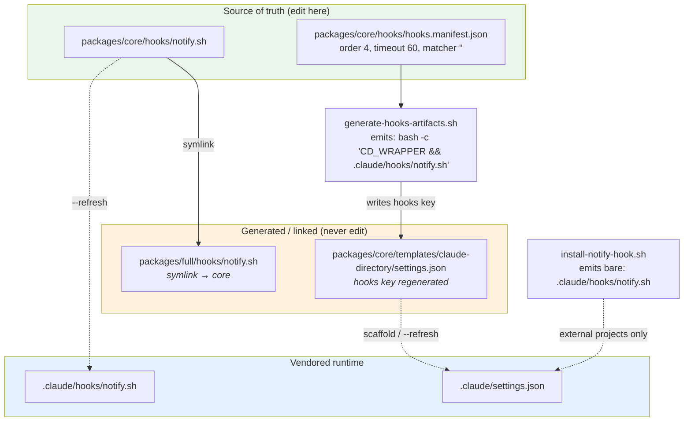

# TRD: Stop Hook Notification (`notify.sh`)

**Version**: 1.0.0
**Status**: Draft
**Created**: 2026-08-14
**Last Updated**: 2026-08-14
**Author**: @technical-architect
**Source PRD**: [`docs/PRD/stop-hook-notification.md`](../PRD/stop-hook-notification.md) (v1.0.0, no supersession marker present)
**Task ID Prefix**: `WTSH`

> **Prefix note.** The PRD's original TRD (`docs/TRD/stop-hook-notification.md`) already
> owns the `NOTIFY-*` ID space (`NOTIFY-P001`…`NOTIFY-T011`). This TRD therefore uses
> `WTSH` to keep task IDs unique within the project, per the `/create-trd` validation
> checklist.

---

## Changelog

| Version | Date | Changes | Author |
|---------|------|---------|--------|
| 1.0.0 | 2026-08-14 | Initial TRD creation | @technical-architect |

---

## 1. Overview

### 1.1 Technical Summary

This is a **brownfield delta**, not a greenfield build. `notify.sh` already exists, is
registered on `Stop`, and is covered by 71 passing BATS unit tests
(`packages/core/hooks/notify.test.sh`) and 30 BATS integration tests
(`test/integration/hooks/notify-hook.test.sh`).

Reading the code against the PRD's 28 acceptance criteria produced three classes of
residual work, all measured rather than assumed:

1. **Two P2 features are entirely unbuilt.** `NOTIFY_ON_STOP_FALLBACK` (F8) and
   `NOTIFY_WORKING_DIR` (AC-F7.2) appear nowhere outside the PRD — confirmed by
   `grep -rn` across the repository, which returns only PRD lines for both identifiers.
2. **Four of the 30 integration tests currently fail.** Measured by
   `npx bats test/integration/hooks/notify-hook.test.sh` on 2026-08-14: tests 19, 20, 22
   and 23. Two assert a `learning.sh` Stop entry that `constitution.md` records as retired
   in 4.1.0; two assert a bare `.claude/hooks/notify.sh` command string that the hook
   generator no longer emits.
3. **One acceptance criterion is unmet behind a test that cannot fail.** AC-F2.3 requires
   command stdout/stderr to reach hook stderr. On the success path `execute_command`
   (`packages/core/hooks/notify.sh:343`) discards `$output` entirely. Both tests nominally
   covering it (`notify.test.sh:330`, `notify-hook.test.sh:296`) end in
   `|| [[ "$output" == *"succeeded"* ]]`, so they pass via the alternative branch regardless
   of the assertion under test.

The approach is to close (1) and (3) inside the single existing hook script, repair (2) at
the test layer rather than the configuration layer, and leave every already-satisfied
criterion alone.

### 1.2 Key Technical Decisions

| ID | Decision | Choice | Serves Objective | Rationale | Alternatives Considered |
|----|----------|--------|------------------|-----------|------------------------|
| D1 | Where the new behaviour lives | Extend `packages/core/hooks/notify.sh` in place; it is the single source of truth. `packages/full/hooks/notify.sh` is a **symlink** to it (`-> ../../core/hooks/notify.sh`, maintained by `generate-hooks-artifacts.sh`); `.claude/hooks/notify.sh` is a vendored copy refreshed through the `--refresh` channel | AC-F8.1, AC-F7.2, AC-F2.3 | The three paths are already identical and the symlink means one edit propagates to `packages/full` for free. A second hook file would need its own manifest entry, its own registration and its own 60s budget inside the same `Stop` array | (a) New `notify-fallback.sh` hook — rejected: doubles the Stop-array cost and splits one env-var contract across two files; revisit if the fallback ever needs to fire independently of `NOTIFY_ON_STOP`. (b) Edit all three copies by hand — rejected: writing to the `packages/full` symlink silently writes through to core, so "three edits" is really one edit plus two chances to diverge |
| D2 | `NOTIFY_WORKING_DIR` vs the shipped `NOTIFY_CWD` | Export **both**; `NOTIFY_WORKING_DIR` is added as an alias, `NOTIFY_CWD` is retained unchanged | AC-F7.2 | `NOTIFY_CWD` is a published contract: it appears in `CLAUDE.md`'s output-variable table, in `.claude/rules/command-status.md`'s Path-B table, in the `notify.sh` header block, and in seven passing unit tests. Renaming it would satisfy AC-F7.2 by breaking a documented interface | (a) Rename `NOTIFY_CWD` → `NOTIFY_WORKING_DIR` — rejected: breaks documented consumers for a cosmetic match. (b) Treat AC-F7.2 as satisfied by `NOTIFY_CWD` and change nothing — rejected: the PRD names the identifier explicitly, and silently reinterpreting an AC is the omission failure. Revisit the alias if a future PRD deprecates one of the two names |
| D3 | Fallback command resolution | Replace the parse-time `readonly FALLBACK_COMMAND` with a `resolve_fallback_command()` function implementing a three-way test on `${NOTIFY_ON_STOP_FALLBACK+set}`: **unset** → hardcoded default; **set, non-empty** → use it; **set, empty** → no fallback at all | AC-F8.1, AC-F8.2 | AC-F8.2 requires "empty fallback disables fallback behavior entirely", which is only expressible if unset and empty are distinguishable. Under `set -u` the idiomatic `${VAR:-default}` collapses both into the default and makes AC-F8.2 unimplementable | (a) Keep `readonly` and add a separate disable flag — rejected: two variables to express one three-state setting, and the PRD names only one. (b) `${VAR:-default}` — rejected as unbuildable against AC-F8.2, see rationale. Revisit if a future requirement needs a fallback *chain* rather than a single override |
| D4 | Narrowing of SEC-4 under F8 | The **default** fallback stays hardcoded in the script. Only an explicit `NOTIFY_ON_STOP_FALLBACK` overrides it | SEC-4, AC-F8.1 | PRD §5.2 SEC-4 ("fallback command hardcoded to prevent injection via misconfiguration") and PRD §4.3 F8 ("allow users to configure their own fallback") directly contradict. Resolved by reading SEC-4's stated threat — *misconfiguration*, i.e. a malformed `NOTIFY_ON_STOP` reaching the fallback path. Under D4 no value of `NOTIFY_ON_STOP` can influence the fallback, so SEC-4's threat remains closed while F8 is delivered. PRD Risk 3 already places both variables inside the same trust boundary ("controlled by the session launcher (trusted context)"), so the override introduces no new one | (a) Drop F8 and keep SEC-4 literal — rejected: F8 is a stated P2 requirement and PRD Risk 2's own contingency prescribes exactly this variable. (b) Allowlist permitted fallback commands — rejected: PRD Risk 3's contingency defers an allowlist until "security concerns arise"; revisit if `NOTIFY_ON_STOP` ever becomes settable from an untrusted source |
| D5 | Where the failing registration assertions get fixed | Fix the **tests**, not `settings.json` | AC-F4.1, AC-F4.2, AC-F4.3 | The `hooks` key of `packages/core/templates/claude-directory/settings.json` is generated: `generate-hooks-artifacts.sh:178` emits `bash -c '<CD_WRAPPER> && .claude/hooks/<file>'` for every command-type manifest entry, and `--check` fails the build on drift there. **Precision, because it changes what an implementer can get away with:** the generator writes exactly one settings file — `SETTINGS_TEMPLATE` at `:54`, the only path in the drift check at `:216–219`. It never opens `.claude/settings.json`. The failing tests 19/20 read the *vendored* copy (`notify-hook.test.sh:46`), and a hand edit there would be neither reverted by the generator nor caught by `--check` (verified: `--check` exits 0 today). The decision still stands, on the downstream mechanism instead: the vendored copy is refreshed **from** the template through the `--refresh` channel, so a hand edit to `.claude/settings.json` survives only until the next refresh and silently reintroduces drift against the generated shape | (a) Change `CD_WRAPPER` so the emitted command is the bare path — rejected: the wrapper exists so the hook resolves the project root from `CLAUDE_PROJECT_DIR`, and removing it would break every command-type hook, not just this one. (b) Leave the tests red — rejected: a permanently-red suite stops signalling. Revisit if the generator's command shape changes again |
| D6 | Disposition of the two `learning.sh` assertions | Delete both tests outright rather than retarget them | AC-F4.1 | `constitution.md` Architecture Invariants records `learning.sh` as retired in 4.1.0 and states there is no `SessionEnd` hook anywhere in the framework. There is no successor hook whose ordering these tests could assert instead — `wiggum.js` ordering is already fixed by the manifest's `order` field and covered by the generator's own `--check` | (a) Retarget to assert notify.sh runs after `wiggum.js` — rejected: duplicates a constraint the generator already enforces deterministically from `order`. Revisit if a new Stop hook is added whose ordering relative to notify.sh is behaviourally significant |
| D7 | `install-notify-hook.sh` duplicate detection | Fix **both** the jq *path* and the comparison: query `.hooks.${hook_type}[]?.hooks[]?` (not `.hooks.${hook_type}[]?`) and match `notify.sh` by containment rather than exact equality | Defect repair, no PRD AC — see below | `hook_already_registered` (`install-notify-hook.sh:122`) queries `.hooks.Stop[]?`, which yields the **matcher** objects (`{matcher, hooks:[…]}`). Those have no `.command` key at all; every hook entry lives one level deeper at `.hooks.Stop[0].hooks[]` — exactly where the installer's own `add_hook_to_settings` writes them (`:157`). Verified empirically: current predicate → jq exit 4; containment-only swap → **also exit 4**; nested path + containment → exit 0. So the operator was never the bug. Consequence: the installer double-registers against **any** project whose settings use the matcher format — including one it installed into itself — not only against the Ensemble `bash -c` wrapper. **Provenance:** this fixes a defect that the PRD does not mention (`grep` for `install-notify-hook`/`installer`/`duplicate`/`register` over `docs/PRD/stop-hook-notification.md` returns nothing). It is not traceable to AC-F4.2: the installer already emits exactly `.claude/hooks/notify.sh` (`:62`) and this task deliberately leaves that string alone, so AC-F4.2 holds identically before and after. §1.5's AC-F6.3 row already classes duplicate registration as a configuration defect, not a correctness violation — **confirm this repair is wanted before building it; it is the one task in this TRD with no PRD objective behind it** | (a) Retire the installer entirely — rejected: it targets external projects that have no Ensemble generator, and `docs/guides/stop-hook-notification.md` documents it as the supported install route. Revisit if the guide stops recommending it. (b) Make the installer emit the wrapper too — rejected: the wrapper depends on `CLAUDE_PROJECT_DIR`/git-root resolution that a non-Ensemble project may not provide. (c) Drop the task — viable if the user declines the repair; nothing else in this TRD depends on it |

### 1.3 Technology Stack

| Layer | Technology | Purpose | Notes |
|-------|------------|---------|-------|
| Hook implementation | Bash | `notify.sh` — the Stop hook itself | `stack.md` "Integration tests / Shell/BATS"; PRD COMPAT-1 requires bash for consistency with existing hooks |
| Unit tests | BATS ^1.9.0 | `packages/core/hooks/notify.test.sh` | `stack.md` Testing table |
| Integration tests | BATS ^1.9.0 | `test/integration/hooks/notify-hook.test.sh` | `stack.md` Testing table |
| Registration generator | Python 3.x embedded in shell | `generate-hooks-artifacts.sh` — regenerates the `hooks` key of the template `settings.json` from `hooks.manifest.json` | `stack.md` Runtime Dependencies; not modified by this TRD |
| Optional runtime deps | `jq`, `timeout`/`gtimeout`/`perl` | JSON field extraction and command timeout, each with a documented fallback path | `stack.md` Optional; PRD COMPAT-3 forbids hard dependencies beyond POSIX + bash |

### 1.4 Integration Points

| System | Type | Direction | Notes |
|--------|------|-----------|-------|
| Claude Code `Stop` event | JSON over stdin | In | Contract fixed by PRD §5.5: `cwd`, `transcript_path`, `session_id` |
| Claude Code hook runner | JSON over stdout | Out | `{"continue": true}`, always (PRD §5.5, REL-1) |
| User `NOTIFY_ON_STOP` command | `/bin/sh -c` subprocess | Out | Fire-and-forget (NG4); receives the exported `NOTIFY_*` context |
| `openclaw gateway wake` | CLI subprocess | Out | Default fallback only; absence is tolerated (PRD Risk 2) |
| `hooks.manifest.json` → `generate-hooks-artifacts.sh` | Build-time codegen | In | Sole authority for the `Stop` registration entry (D5) |

### 1.5 Objective Register

Every objective in the PRD, enumerated forwards from the source so nothing is silently
narrowed. **No objective here is invented**; each cites its PRD location, and the two
non-PRD rows cite `constitution.md`. Objectives already satisfied by shipped code are listed
with the evidence that satisfies them and generate no task — re-planning delivered work is
as wasteful as omitting undelivered work.

| ID | Objective | Source | Status |
|----|-----------|--------|--------|
| G1 | 100% of Stop events with `NOTIFY_ON_STOP` set trigger command execution | PRD §3.1 | **Satisfied** — `main` step 5; `NOTIFY-T006: main executes command when NOTIFY_ON_STOP is set` |
| G2 | Zero log output, zero side effects when `NOTIFY_ON_STOP` is unset | PRD §3.1 | **Satisfied** — `NOTIFY-T006`/`NOTIFY-T008` silent-exit tests; `notify hook does not expose command in non-debug output` |
| G3 | Fallback executes within 5 seconds of primary command failure | PRD §3.1 | **Satisfied structurally, not gated.** `execute_fallback` is invoked synchronously on the next line after `execute_command` returns, so no delay is introduced. No test measures the interval, and this TRD adds none — no measurement exists that would justify asserting a specific figure |
| G4 | Integrates with at least 3 common orchestration patterns | PRD §3.1 | **Satisfied** — integration tests cover curl webhook, tmux, and file-based signal |
| AC-F1.1 | `NOTIFY_ON_STOP` unset → silent exit 0 | PRD §4.1 F1 | **Satisfied** — `check_notify_env`; `NOTIFY-T003`, `NOTIFY-T006` |
| AC-F1.2 | `NOTIFY_ON_STOP=""` → treated as unset | PRD §4.1 F1 | **Satisfied** — `NOTIFY-T003` empty-string test |
| AC-F1.3 | Whitespace-only → treated as unset | PRD §4.1 F1 | **Satisfied** — `NOTIFY-T003` whitespace, tabs and newlines tests |
| AC-F1.4 | Non-empty → proceed to execute | PRD §4.1 F1 | **Satisfied** — `NOTIFY-T003` valid-value tests |
| AC-F2.1 | Executed via `/bin/sh -c` | PRD §4.1 F2 | **Satisfied** — `execute_with_timeout`; `NOTIFY-T011` integration test |
| AC-F2.2 | 30-second command timeout | PRD §4.1 F2 | **Satisfied** — `COMMAND_TIMEOUT=30` |
| AC-F2.3 | Command stdout/stderr logged to hook stderr | PRD §4.1 F2 | **GAP → WTSH-B003.** Discarded on the success path; both covering tests are tautological (TR1) |
| AC-F2.4 | Exit code captured for success/failure determination | PRD §4.1 F2 | **Satisfied** — `execute_command`'s `exit_code` capture |
| AC-F3.1 | Fallback on non-zero exit | PRD §4.1 F3 | **Satisfied** — `NOTIFY-T012` |
| AC-F3.2 | Fallback on timeout | PRD §4.1 F3 | **Satisfied** — exit 124 is non-zero and reaches the same branch |
| AC-F3.3 | Fallback command is `openclaw gateway wake …` | PRD §4.1 F3 | **Satisfied; must be preserved** by WTSH-B002's unset branch (D3) |
| AC-F3.4 | Fallback failure still exits 0 | PRD §4.1 F3 | **Satisfied** — `NOTIFY-T008`; extended to the disabled state by WTSH-B002 |
| AC-F4.1 | Registered in `.claude/settings.json` under `hooks.Stop` | PRD §4.1 F4 | **Satisfied in config, assertion stale → WTSH-T001, WTSH-T002** |
| AC-F4.2 | Hook command is `.claude/hooks/notify.sh` | PRD §4.1 F4 | **Diverged, deliberately → WTSH-T002.** Realized as the generated `bash -c` wrapper ending in that path (D5). Note WTSH-B004 does **not** serve this criterion: the installer already emits the bare string literally (`install-notify-hook.sh:62`) and B004 leaves it untouched, so AC-F4.2 holds on that path before and after (D7) |
| AC-F4.3 | Hook timeout is 60 seconds | PRD §4.1 F4 | **Satisfied in config, assertion stale → WTSH-T002** |
| AC-F4.4 | Empty matcher (fires on all Stop events) | PRD §4.1 F4 | **Satisfied** — manifest `matcher: ""`; its test passes today |
| AC-F5.1 | `NOTIFY_HOOK_DEBUG=1` enables detailed stderr logging | PRD §4.2 F5 | **Satisfied** — `debug_log`; `debug mode outputs to stderr when enabled` |
| AC-F5.2 | Debug logs include masked value, execution start/end, exit codes | PRD §4.2 F5 | **Satisfied** — `debug mode masks command value for security` |
| AC-F5.3 | Debug logging does not affect behavior or output | PRD §4.2 F5 | **Satisfied** — `debug mode is silent when disabled`; constrains WTSH-B003 via SEC-3 |
| AC-F6.1 | No state maintained between invocations | PRD §4.2 F6 | **Satisfied** — no persistence anywhere in the script |
| AC-F6.2 | Hook modifies no files | PRD §4.2 F6 | **Satisfied** — no write operations in the script |
| AC-F6.3 | Multiple rapid invocations execute in sequence; no hook-level dedup | PRD §4.2 F6 | **Satisfied by design.** Note this is why the duplicate registration D7 addresses is a configuration defect rather than a correctness violation |
| AC-F7.1 | `NOTIFY_SESSION_ID` available to the command | PRD §4.3 F7 | **Satisfied** — `NOTIFY-T010`, `NOTIFY-T011` |
| AC-F7.2 | `NOTIFY_WORKING_DIR` available to the command | PRD §4.3 F7 | **GAP → WTSH-B001.** Zero occurrences outside the PRD; shipped as `NOTIFY_CWD` (D2) |
| AC-F7.3 | Context variables set only when executing the command | PRD §4.3 F7 | **GAP → WTSH-B001.** Currently exported before the `NOTIFY_ON_STOP` gate |
| AC-F8.1 | `NOTIFY_ON_STOP_FALLBACK` overrides the default fallback | PRD §4.3 F8 | **GAP → WTSH-B002.** Zero occurrences outside the PRD |
| AC-F8.2 | Empty fallback disables fallback behavior entirely | PRD §4.3 F8 | **GAP → WTSH-B002.** Drives D3's `${VAR+set}` requirement |
| AC-F8.3 | Custom fallback failure still does not fail the hook | PRD §4.3 F8 | **GAP → WTSH-B002** (existing `execute_fallback` contract, extended) |
| PERF-1…4 | Startup <100ms, silent exit <50ms, 30s command timeout, 60s total | PRD §5.1 | **Targets, not gates** — see §6.6, including the recorded 50ms-vs-1s discrepancy |
| SEC-1…4 | Security requirements | PRD §5.2 | See §6.3; SEC-4 narrowed by D4 |
| REL-1…4 | Reliability requirements | PRD §5.3 | See §6.4 |
| COMPAT-1…4 | Compatibility requirements | PRD §5.4 | See §6.5 |
| IO-1 | stdin `{cwd, transcript_path, session_id}`; stdout `{"continue": true}` | PRD §5.5 | **Satisfied** — `parse_input`, `output_result`; `hook outputs valid JSON`, `hook output contains only continue field` |
| QG-1 | Unit test coverage >= 60% | `constitution.md` Quality Gates | See §6.1 — floor used unchanged |
| QG-2 | Integration test coverage >= 50% (when applicable) | `constitution.md` Quality Gates | See §6.1 — floor used unchanged |
| QG-3 | No secrets in code | `constitution.md` Quality Gates | **In force, no task needed.** The cited block has four checkboxes; this TRD previously reproduced only the coverage one. Nothing added here introduces a credential — the two new variables are read from the environment, never written to a file (AC-F6.2) — and SEC-3 already forbids logging their values outside debug mode |
| QG-4 | Input validation present | `constitution.md` Quality Gates | **In force, and it binds WTSH-B002.** `NOTIFY_ON_STOP_FALLBACK` is new external input. Its validation is the D3 three-way state test plus the unchanged `execute_with_timeout` bound; per D4 no value of `NOTIFY_ON_STOP` can reach it, and PRD Risk 3 places it inside the existing trust boundary. No sanitization of the string itself is added — it is passed to `/bin/sh -c` verbatim, exactly as `NOTIFY_ON_STOP` already is |
| QG-5 | Documentation updated | `constitution.md` Quality Gates | **Discharged by WTSH-D001** — eight locations across four documents |

Non-goals NG1–NG5 are carried in §8. NG5's first two clauses are superseded by F7 — resolved
with evidence in §8.2 rather than dropped.

---

## 2. System Architecture

### 2.1 Artifact Propagation

The runtime behaviour is a single shell script, so no component topology diagram is
warranted. What a reader *would* otherwise have to reconstruct — and what determines where
every edit in this TRD belongs — is how one source file reaches a running session through
three different mechanisms.



Three consequences bind the task list:

- Editing `packages/full/hooks/notify.sh` writes **through the symlink** into core. It
  appears to succeed and produces no second file. Only core should ever be opened.
- Editing `settings.json`'s `hooks` key by hand is reverted by the next generator run and
  fails `generate-hooks-artifacts.sh --check` in the meantime. This is D5's whole basis.
- `install-notify-hook.sh` is a second writer to the same array with a different command
  string, which is the defect D7 addresses.

### 2.2 Component Architecture

#### 2.2.1 `notify.sh` — main flow

**Responsibility**: On `Stop`, optionally execute `NOTIFY_ON_STOP`, fall back on failure,
and never block session termination.

**Interfaces**: stdin JSON (PRD §5.5) in; `{"continue": true}` on stdout; exported
`NOTIFY_*` variables to the child command.

**Dependencies**: bash; optionally `jq`, and one of `timeout`/`gtimeout`/`perl`, each with
an in-script fallback (COMPAT-3).

**Change surface in this TRD** — four of eight existing functions:

| Function | Line (current) | Change | Task |
|---|---|---|---|
| `export_context_vars` | 237 | Add `NOTIFY_WORKING_DIR`; move the call site after the `check_notify_env` gate | WTSH-B001 |
| `execute_command` | 334 | Emit `$output` to stderr on the success path too | WTSH-B003 |
| `execute_fallback` | 369 | Read the resolved command instead of the `readonly` constant | WTSH-B002 |
| `main` | 404 | Reorder step 3 after step 4; skip the fallback when resolution yields empty | WTSH-B001, WTSH-B002 |

Unchanged: `debug_log`, `output_result`, `parse_input`, `extract_json_field`,
`check_notify_env`, `execute_with_timeout`.

### 2.3 Fallback Resolution (D3)

A decision table is clearer here than a diagram.

| `NOTIFY_ON_STOP_FALLBACK` state | Shell test | Resolved fallback | Objective |
|---|---|---|---|
| Unset | `${VAR+set}` is empty | `openclaw gateway wake --text "Session stopped (notify failed)" --mode now` | AC-F3.3 preserved |
| Set, non-empty | `${VAR+set}` non-empty, `$VAR` non-empty | The variable's value | AC-F8.1 |
| Set, empty (`export VAR=`) | `${VAR+set}` non-empty, `$VAR` empty | None — skip the fallback step, still exit 0 | AC-F8.2 |

In all three rows the hook exits 0 and prints `{"continue": true}` (REL-1, AC-F8.3).

---

## 3. Technical Specifications

### 3.1 Context variable export (WTSH-B001)

**Purpose**: Satisfy AC-F7.2 and AC-F7.3 without breaking the shipped `NOTIFY_CWD`
contract.

**Interface** (the exported environment seen by the `NOTIFY_ON_STOP` child):

```sh
NOTIFY_SESSION_ID=<session_id | "unknown">       # unchanged, AC-F7.1
NOTIFY_CWD=<cwd | "unknown">                     # unchanged, retained per D2
NOTIFY_WORKING_DIR=<cwd | "unknown">             # NEW, AC-F7.2 — same value as NOTIFY_CWD
NOTIFY_TRANSCRIPT_PATH=<transcript_path | "unknown">  # unchanged, pre-existing extra
```

**Behavior**:
- `NOTIFY_WORKING_DIR` and `NOTIFY_CWD` are always equal, both derived from the single
  `extract_json_field "$json" "cwd" "unknown"` call — extracted once, assigned twice.
- `export_context_vars` is invoked **after** `check_notify_env` succeeds, so the variables
  are set only on the path that executes a command (AC-F7.3).

**Error Handling**:
- Missing or malformed `cwd` in the stdin JSON: both variables receive `"unknown"`, the
  existing default. Unchanged from today's behaviour.
- No stdin at all (tty): `parse_input` yields empty, `extract_json_field` short-circuits to
  the default. Already covered by `NOTIFY-T010: export_context_vars sets unknown for empty input`.

### 3.2 Configurable fallback (WTSH-B002)

**Purpose**: Deliver F8 (AC-F8.1–AC-F8.3) under D3 and D4.

**Interface**:

```sh
# Input (user-set)
NOTIFY_ON_STOP_FALLBACK   # unset → default; non-empty → override; empty → disabled

# Internal
resolve_fallback_command()   # echoes the command to run, or nothing when disabled
```

**Behavior**:
- The default string is retained verbatim so AC-F3.3 continues to hold when the variable is
  unset.
- `execute_fallback` calls `resolve_fallback_command`; an empty result means return 0
  without invoking `execute_with_timeout`.
- The resolved fallback runs through the same `execute_with_timeout "$cmd" "$COMMAND_TIMEOUT"`
  path as the primary, inheriting the 30s bound (AC-F2.2's mechanism, reused).

**Error Handling**:
- Fallback exits non-zero, times out, or its binary is absent: logged under debug, hook
  still exits 0 (AC-F3.4, AC-F8.3, REL-1). This is the existing `execute_fallback` contract
  and must not change.
- `readonly FALLBACK_COMMAND` at line 139 must be removed, not merely shadowed —
  reassigning a `readonly` under `set -e` aborts the script and would breach REL-1.

### 3.3 Command output logging (WTSH-B003)

**Purpose**: Make AC-F2.3 actually true.

**Behavior**:
- `execute_command` currently captures `$output` and emits it only on the non-zero,
  non-timeout branch (line 349). The success branch logs `"Notification command succeeded"`
  and drops the output.
- After this task, `$output` is emitted to stderr on every branch when it is non-empty,
  keeping the existing 200-character truncation on all of them for consistency with the
  current failure branch.

**Error Handling**:
- Output remains routed through `debug_log`, so SEC-3 ("environment variable values not
  logged in production mode") is preserved: nothing new reaches stderr unless
  `NOTIFY_HOOK_DEBUG=1`.

### 3.4 Registration assertions (WTSH-T002)

**Purpose**: Make the three surviving `NOTIFY-I001` assertions match the shape the
generator actually emits.

**Interface** — the current generated entry, read from `.claude/settings.json`:

```json
{
  "type": "command",
  "command": "bash -c 'cd \"${CLAUDE_PROJECT_DIR:-$(git rev-parse --show-toplevel 2>/dev/null || pwd)}\" && .claude/hooks/notify.sh'",
  "timeout": 60
}
```

**Behavior**: selectors change from `select(.command == ".claude/hooks/notify.sh")` to a
containment test on `notify.sh`, which is stable across future `CD_WRAPPER` changes.

**Error Handling**: the existing `skip` when `settings.json` is absent and the existing
non-`jq` grep fallback both remain — COMPAT-3 applies to the tests as much as the hook.

---

## 4. Master Task List

### 4.1 Task ID Convention

`WTSH-[CATEGORY][SEQ]` — `P` infrastructure, `B` backend/hook, `T` testing, `D`
documentation, `I` integration, `F` frontend (unused here; this feature has no UI).

#### 4.1.1 Live Verification Marker

**No task in this TRD carries `[LIVE]`.** `constitution.md` sets
`verification_level: unit-only`, and every deliverable is a bash script or BATS file
exercised by `npx bats` with no server, database or external service to stand up. Adding
`[LIVE]` would impose a verification mode nothing here needs.

#### 4.1.2 Skill Hints

**The `Skills` column is empty for every task, deliberately.** Target agents are
`backend-implementer` (B), `verify-app` (T) and `technical-architect`/docs (D). Their pools
in `packages/core/agents/skill-affinity.json` contain no bash or BATS skill — the closest
entries (`jest`, `pytest`, `test-detector`) target frameworks this feature does not use, and
the framework here is already known. Per §4.1.2 of `/create-trd`, no clear match means the
column is left empty and `implement-trd` falls back to the agent's full list.

### 4.2 Phase 1: Restore a trustworthy baseline

Nothing downstream can be measured while four integration tests fail for reasons unrelated
to the code under test.

| Task ID | Description | Serves | Skills | Dependencies | Acceptance Criteria |
|---------|-------------|--------|--------|--------------|---------------------|
| WTSH-T001 | Delete the two integration tests asserting a `learning.sh` Stop entry (`notify-hook.test.sh:440` ordering, `:467` coexistence) | D6, AC-F4.1 | | None | Both tests removed; `npx bats test/integration/hooks/notify-hook.test.sh` reports 28 tests with no `learning.sh` reference remaining in the file |
| WTSH-T002 | Retarget the two failing `NOTIFY-I001` registration assertions (`:394` presence, `:410` timeout) to match the generated `bash -c` wrapper | D5, AC-F4.1, AC-F4.2, AC-F4.3 | | WTSH-T001 (same file) | Both pass against the current `.claude/settings.json`; the 60s timeout assertion still reads the real value rather than being weakened to a presence check |

### 4.3 Phase 2: Close the acceptance-criteria gaps

| Task ID | Description | Serves | Skills | Dependencies | Acceptance Criteria |
|---------|-------------|--------|--------|--------------|---------------------|
| WTSH-B001 | Export `NOTIFY_WORKING_DIR` alongside `NOTIFY_CWD`, and move the `export_context_vars` call after the `check_notify_env` gate | D2, AC-F7.2, AC-F7.3 | | None | A command run via `NOTIFY_ON_STOP` observes `NOTIFY_WORKING_DIR` equal to `NOTIFY_CWD`; all seven existing `NOTIFY_CWD` unit tests still pass |
| WTSH-B002 | Add `resolve_fallback_command()` implementing the D3 three-way resolution; remove `readonly FALLBACK_COMMAND`; route `execute_fallback` through it | D3, D4, AC-F8.1, AC-F8.2, AC-F8.3 | | WTSH-B001 (same file) | Unset → default fires; set non-empty → that command fires; set empty → no fallback process is spawned. Hook exits 0 and prints `{"continue": true}` in all three cases |
| WTSH-B003 | Emit captured command output to stderr on the success path of `execute_command`, keeping the 200-char truncation and the `debug_log` gate | AC-F2.3, SEC-3 | | WTSH-B002 (same file) | With `NOTIFY_HOOK_DEBUG=1` and a succeeding command that writes to stdout, that text appears on hook stderr; with debug off, stderr stays empty |
| WTSH-B004 | Fix `install-notify-hook.sh`'s duplicate detection: correct the jq path to `.hooks.${hook_type}[]?.hooks[]?` **and** change exact equality to a `notify.sh` containment match. The path is the actual bug; the operator alone does not fix it | D7 (defect repair — **no PRD objective; confirm wanted**) | | None | Running the installer against this repository detects the existing wrapped entry and adds no second registration; running it against a project with no notify entry still installs one |

### 4.4 Phase 3: Test and document the delta

| Task ID | Description | Serves | Skills | Dependencies | Acceptance Criteria |
|---------|-------------|--------|--------|--------------|---------------------|
| WTSH-T003 | Add unit tests for `NOTIFY_WORKING_DIR`, `NOTIFY_ON_STOP_FALLBACK`'s three states, and AC-F7.3 scoping; **rewrite** the two tautological AC-F2.3 tests to assert stderr content directly, with no disjunctive escape branch | TR1, AC-F2.3, AC-F7.2, AC-F7.3, AC-F8.1, AC-F8.2, AC-F8.3 | | WTSH-B001, WTSH-B002, WTSH-B003 | New tests fail against the pre-change `notify.sh` and pass after; full unit suite green; no assertion in the added or rewritten tests contains a disjunction that can pass without exercising the criterion |
| WTSH-P001 | Regenerate hook artifacts and propagate the updated `notify.sh` to the vendored runtime: run `generate-hooks-artifacts.sh --check`, then refresh `.claude/hooks/notify.sh` | D1, REL-4, AC-F4.1 | | WTSH-B003, WTSH-T003 | `--check` exits 0 (no manifest drift); `.claude/hooks/notify.sh` matches `packages/core/hooks/notify.sh`; `packages/full/hooks/notify.sh` is still a symlink, not a regular file |
| WTSH-D001 | Update the three documents that publish the variable contract: `docs/guides/stop-hook-notification.md`, the `notify.sh` header block, and `CLAUDE.md`'s output-variable table — adding `NOTIFY_WORKING_DIR` and `NOTIFY_ON_STOP_FALLBACK`, and recording D4's narrowing of SEC-4 | AC-F8.1, AC-F7.2, SEC-4 | | WTSH-P001 | All three list both new variables; the guide states that an empty `NOTIFY_ON_STOP_FALLBACK` disables the fallback; no document still claims the fallback is unconditionally hardcoded |

---

## 5. Execution Plan

### 5.1 Phase Overview

| Phase | Focus | Prerequisites | Parallelizable Sessions |
|-------|-------|---------------|------------------------|
| 1 | Restore a trustworthy baseline | None | 1A only (single file) — but runs in parallel with Phase 2's 2B |
| 2 | Close the AC gaps | None for 2B; 2A is independent of Phase 1 | 2A and 2B run in parallel |
| 3 | Test, propagate, document | Phases 1 and 2 complete | Sequential |

Phase 1 and Phase 2 have no dependency between them — they touch disjoint files. Phase 1 is
listed first because its output is the signal Phase 3 is measured against.

### 5.2 Session Details

#### Phase 1

**Session 1A: Integration-test repair**
- Tasks: WTSH-T001, WTSH-T002
- Agent: @verify-app
- Single file (`test/integration/hooks/notify-hook.test.sh`) — tasks are sequential within
  the session
- Can parallelize with: Sessions 2A, 2B

#### Phase 2

**Session 2A: Hook behaviour**
- Tasks: WTSH-B001, WTSH-B002, WTSH-B003
- Agent: @backend-implementer
- All three edit `packages/core/hooks/notify.sh`; **strictly sequential within the session**
  to avoid conflicting edits to the same functions
- Can parallelize with: Sessions 1A, 2B

**Session 2B: Installer reconcile**
- Tasks: WTSH-B004
- Agent: @backend-implementer
- Touches only `packages/core/scripts/install-notify-hook.sh`
- Can parallelize with: Sessions 1A, 2A

#### Phase 3

**Session 3A: Verification and delivery**
- Tasks: WTSH-T003, WTSH-P001, WTSH-D001
- Agent: @verify-app (T003), @backend-implementer (P001, D001)
- Blocked by: Sessions 1A, 2A, 2B
- Sequential: tests must be green before artifacts are propagated, and the docs describe
  what was propagated

### 5.3 Parallelization Map

```mermaid
gantt
    title Execution Plan (No time scale - dependency order only)
    dateFormat X
    axisFormat %s

    section Phase 1
    1A integration-test repair (T001, T002) :p1a, 0, 1

    section Phase 2
    2A hook behaviour (B001, B002, B003)    :p2a, 0, 1
    2B installer reconcile (B004)           :p2b, 0, 1

    section Phase 3
    3A verify, propagate, document          :p3a, after p1a p2a p2b, 1
```



### 5.4 Critical Path

`WTSH-B001 → WTSH-B002 → WTSH-B003 → WTSH-T003 → WTSH-P001 → WTSH-D001`

Session 2A is the critical path: its three tasks serialize on a single file and every
Phase-3 task depends on their combined result. Sessions 1A and 2B are strictly shorter and
fully absorbed by it.

### 5.5 Offload Recommendations

| Task | Recommended Agent | Rationale |
|------|-------------------|-----------|
| WTSH-T001, WTSH-T002, WTSH-T003 | @verify-app | Pure BATS authoring and execution; no production-code change |
| WTSH-B001–WTSH-B004 | @backend-implementer | Shell script logic in the hook and installer layers |
| WTSH-P001 | @backend-implementer | Runs the generator and the refresh channel; deterministic, script-driven |

---

## 6. Quality Requirements

### 6.1 Testing Requirements

| Type | Coverage Target | Source | Scope |
|------|-----------------|--------|-------|
| Unit Tests | >= 60% | `constitution.md` Quality Gates | `packages/core/hooks/notify.sh` via `packages/core/hooks/notify.test.sh` |
| Integration Tests | >= 50% | `constitution.md` Quality Gates | `notify.sh` as a registered Stop hook via `test/integration/hooks/notify-hook.test.sh` |

**No target exceeds the constitution floor, and none is raised.** The existing suite
already sits well above both, but this TRD does not convert an observed level into a new
gate — nothing in the PRD, `constitution.md`, or the user's instruction asks for a higher
floor, and promoting an incidental measurement to a threshold is exactly the manufactured
severity `/create-trd` §"Thresholds" forbids.

Two additional gates apply, both traced rather than invented:

| Gate | Source |
|------|--------|
| `npx bats test/integration/hooks/notify-hook.test.sh` reports zero failures on completion of Phase 3 | Measured baseline: 4 of 30 failing on 2026-08-14 (tests 19, 20, 22, 23). This TRD exists partly to close them, so their closure is its own completion criterion |
| `generate-hooks-artifacts.sh --check` exits 0 | The script's own drift contract; D5 depends on it |

### 6.2 Code Quality Standards

| Standard | Source |
|----------|--------|
| ShellCheck-clean | `stack.md` Code Quality — ShellCheck is the named shell linter |
| Prettier-clean Markdown on the documents WTSH-D001 edits | `stack.md` Code Quality — Prettier is the named formatter for Markdown. Carried because WTSH-D001 edits Markdown; the table's third entry, ESLint, does not bind — this TRD adds no JavaScript |
| `set -euo pipefail` retained in `notify.sh` and used in added BATS files | `CLAUDE.md` Security Considerations, "Shell Script Safety" |
| All variables quoted in shell scripts | `CLAUDE.md` Security Considerations, "Shell Script Safety" |

### 6.3 Security Requirements

Every item below is PRD-sourced; none is `domain-derived`.

| ID | Requirement | Source | Effect of this TRD |
|----|-------------|--------|-------------------|
| SEC-1 | Command executed via `/bin/sh -c`, inheriting the session security context | PRD §5.2 | Unchanged; the resolved fallback uses the same path |
| SEC-2 | No elevation of privileges in hook execution | PRD §5.2 | Unchanged; covered by the existing "executes command in user context" integration test |
| SEC-3 | Environment variable values not logged in production mode (only debug) | PRD §5.2 | **Directly constrains WTSH-B003.** The new output logging stays behind `debug_log`, so production stderr remains empty |
| SEC-4 | Fallback command hardcoded to prevent injection via misconfiguration | PRD §5.2 | **Narrowed by D4**: the default stays hardcoded and no value of `NOTIFY_ON_STOP` can influence the fallback; only an explicit `NOTIFY_ON_STOP_FALLBACK` overrides it. Recorded in WTSH-D001 |

### 6.4 Reliability Requirements

| ID | Requirement | Source | Effect of this TRD |
|----|-------------|--------|-------------------|
| REL-1 | Hook always exits with code 0 (non-blocking) | PRD §5.3 | Constrains WTSH-B002: removing `readonly` matters precisely because reassigning one under `set -e` would abort and breach REL-1 |
| REL-2 | Gracefully handles missing commands, network failures, timeouts | PRD §5.3 | Extended to the disabled-fallback state (AC-F8.2) |
| REL-3 | Does not depend on external services being available | PRD §5.3 | Preserved; `openclaw` absence is already tolerated |
| REL-4 | Works in both local CLI and remote/cloud Claude Code sessions | PRD §5.3 | Serves WTSH-P001: the vendored `.claude/` copy is what a remote session executes |

### 6.5 Compatibility Requirements

| ID | Requirement | Source |
|----|-------------|--------|
| COMPAT-1 | Shell script (bash), for consistency with existing hooks | PRD §5.4 |
| COMPAT-2 | Works on macOS and Linux (Ubuntu 20.04+) | PRD §5.4 |
| COMPAT-3 | No dependencies beyond standard POSIX utilities + bash | PRD §5.4 — governs both the `jq`→grep/sed and `timeout`→`gtimeout`→`perl`→none fallback ladders, and the tests' non-`jq` paths |
| COMPAT-4 | Compatible with tmux, screen, nohup and background execution patterns | PRD §5.4 |

### 6.6 Performance Requirements

**These are targets, not enforced gates.** PRD §5.1 titles its own column "Target"; they are
reproduced here at that severity and are not tightened.

| Requirement | Target | Source |
|-------------|--------|--------|
| Hook startup time | < 100ms | PRD §5.1 |
| Silent exit time (`NOTIFY_ON_STOP` unset) | < 50ms | PRD §5.1 |
| Command execution timeout | 30 seconds | PRD §5.1; implemented as `COMMAND_TIMEOUT=30` |
| Total hook timeout | 60 seconds | PRD §5.1; implemented in the manifest's `timeout` field |

The two timeout rows *are* enforced — by the script constant and the manifest respectively —
and are asserted by existing tests. The two latency rows are not: the nearest existing
assertion (`notify hook silent exit completes quickly (< 1s)`) uses a 1s threshold, twenty
times looser than the PRD target. **This TRD does not change that threshold.** No
measurement was taken that would justify a number, and inventing one to close the visible
gap between 50ms and 1s would be manufacturing severity. The discrepancy is recorded here so
it is visible rather than silently reconciled.

---

## 7. Risk Assessment

### 7.1 Risks Imported from PRD

| PRD Risk | Risk | Technical Mitigation |
|----------|------|---------------------|
| Risk 1 | Hook execution delays session termination | Already mitigated in code: `COMMAND_TIMEOUT=30`, manifest `timeout: 60`, unconditional `{"continue": true}`. WTSH-B002 routes the resolved fallback through the same `execute_with_timeout`, so a custom fallback inherits the 30s bound rather than escaping it |
| Risk 2 | Fallback command (`openclaw gateway wake`) not available | Already mitigated: fallback failure never fails the hook. **WTSH-B002 delivers this risk's own stated contingency** — the PRD names `NOTIFY_ON_STOP_FALLBACK` as the response, and AC-F8.2 additionally lets an environment without `openclaw` disable the fallback outright rather than failing silently every time |
| Risk 3 | Environment variable injection | Unchanged trust boundary: `NOTIFY_ON_STOP_FALLBACK` is set by the same session launcher as `NOTIFY_ON_STOP`, so D4 introduces no new source of untrusted input. WTSH-D001 records the implication |
| Risk 4 | Debug logging exposes sensitive data | Constrains WTSH-B003: the added success-path output is gated on `NOTIFY_HOOK_DEBUG=1` and truncated to 200 characters, matching the existing failure-path treatment. The command *value* is still never logged — only its output |
| Risk 5 | Race condition with other Stop hooks | Unchanged: the hook remains stateless and writes no files (AC-F6.1, AC-F6.2). Ordering stays deterministic through the manifest's `order` field |

### 7.2 Technical Risks

| ID | Risk | Likelihood | Impact | Mitigation |
|----|------|------------|--------|------------|
| TR1 | Tests that cannot fail. Both existing AC-F2.3 tests end in a disjunction whose second branch merely matches the word `succeeded`, so they pass via that branch regardless of the criterion under test. The pattern appears in both the unit and integration suites, so a new test written in the house style would inherit it | High | High | WTSH-T003 rewrites both and forbids disjunctive assertions in added tests. The new tests must be demonstrated failing against the pre-change `notify.sh` before being accepted |
| TR2 | Silent write-through on the wrong file. `packages/full/hooks/notify.sh` is a symlink into core, so editing it appears to work and produces no diff at that path; `.claude/hooks/notify.sh` is a real copy that the refresh channel later overwrites, discarding edits made there | Medium | Medium | D1 names core as the only edit target; every Phase-2 grounding block repeats it; WTSH-P001 asserts the symlink is still a symlink, which the generator's own drift check also enforces |
| TR3 | `set -u` collapsing AC-F8.1 and AC-F8.2. The idiomatic `${VAR:-default}` treats unset and empty identically, which would make "empty disables the fallback" silently behave as "empty uses the default" — a passing-looking implementation that does the opposite of the criterion | Medium | Medium | D3 mandates `${VAR+set}` for state detection; WTSH-T003 tests the unset and set-empty cases separately so a collapse fails a test rather than passing quietly |

### 7.3 Contingency Plans

**TR1 Contingency**: If a rewritten AC-F2.3 test cannot be made to fail against the
pre-change script, the criterion is not actually testable at that layer. Escalate rather
than weaken the assertion: record it against AC-F2.3 in the readout and leave the test out
instead of shipping a second tautology. A criterion with no failing case is worse than an
acknowledged gap.

---

## 8. Non-Goals (Scope Boundaries)

The following are explicitly out of scope. Implementation agents MUST reject requests
falling into these categories.

### 8.1 Imported from PRD

| PRD ID | Non-Goal | Rationale |
|--------|----------|-----------|
| NG1 | Complex notification routing — multiple targets in one configuration, outcome-conditional notification, filtering or transformation | Keep the hook simple; complex routing belongs in the executed command. *Note: `NOTIFY_ON_STOP_FALLBACK` is not a second target — it fires only on primary failure, sequentially, which is the existing fallback made configurable* |
| NG2 | Session outcome reporting — parsing success vs failure, including logs, structured completion status | The Stop hook fires on session end, not on success. Also resolves PRD Appendix D's deferred question on exit status |
| NG3 | Built-in retry logic — exponential backoff, queueing, persistence of failed notifications | A single fallback is sufficient; retry belongs in external systems. WTSH-B002 adds no retry |
| NG4 | Bi-directional communication — acknowledgment, request-response, target influencing the session | Fire-and-forget notification, not a control channel |
| NG5 | Session metadata injection — **templating variables into the `NOTIFY_ON_STOP` value** | Simplicity. **See §8.2: NG5's first two clauses are superseded by F7 and are not in force** |

### 8.2 Resolved contradiction: NG5 vs F7

The PRD contradicts itself. NG5 states the hook will not "inject session ID into
notification command" or "provide working directory or other context to command", while F7
(P2, AC-F7.1–AC-F7.3) requires exactly `NOTIFY_SESSION_ID` and `NOTIFY_WORKING_DIR`.

**Resolved in favour of F7**, on evidence rather than preference: the context-variable
export is already built, shipped and published — `export_context_vars` exists at
`notify.sh:237`, is covered by twelve passing tests (six `NOTIFY-T010` tests exercising
`export_context_vars` directly at `notify.test.sh` 744, 753, 762, 771, 782, 793, and six
`NOTIFY-T011` tests asserting the child command can read the variables at 807, 817, 827,
837, 847, 857; the `NOTIFY-T009` block covers `extract_json_field`, not this function),
and is documented in `CLAUDE.md` and `.claude/rules/command-status.md`.
Enforcing NG5 literally would mean deleting a delivered, documented feature.

NG5's **surviving clause** is its third: no templating of variables into the
`NOTIFY_ON_STOP` string itself. The value is passed to `/bin/sh -c` verbatim and the shell
performs any expansion. That remains in force and is unaffected by this TRD.

### 8.3 PRD open questions resolved as out of scope

| PRD Appendix D question | Resolution | Source |
|---|---|---|
| Should we support `SessionEnd` in addition to `Stop`? | **No.** `constitution.md` Architecture Invariants states there is no `SessionEnd` hook anywhere in the framework as of 4.1.0, and records the deliberate retirement of both prior ones. Adding one would contradict a documented invariant | `constitution.md`, Architecture Invariants |
| Should notification include session exit status? | Out of scope, per NG2 | PRD NG2 |
| Is the 60-second total timeout appropriate? | **Left open.** No measurement exists that would justify a different number, and inventing one is precisely what §6.6 forbids. AC-F4.3's 60s stands unchanged | PRD §5.1, PRD Appendix D |

---

## 9. Task Grounding

Written after reading `packages/core/hooks/notify.sh`, `packages/core/hooks/notify.test.sh`,
`test/integration/hooks/notify-hook.test.sh`, `packages/core/hooks/hooks.manifest.json`,
`packages/core/scripts/generate-hooks-artifacts.sh`,
`packages/core/scripts/install-notify-hook.sh`, `.claude/settings.json`,
`packages/core/templates/claude-directory/settings.json`,
`docs/guides/stop-hook-notification.md` and `CLAUDE.md`. Every line number below was read
from the file, not inferred.

**Applies to every task below**: `packages/core/hooks/notify.sh` is the only copy to open.
`packages/full/hooks/notify.sh` is a symlink into it (`ls -l` confirms
`-> ../../core/hooks/notify.sh`); `.claude/hooks/notify.sh` is a real file, currently
byte-identical to core (`cmp` clean), that WTSH-P001 refreshes.

Line numbers were re-verified against the files on 2026-08-14 after an audit found five
stale citations (`execute_fallback`'s extent and its two variable reads, `set -euo pipefail`,
`execute_command`'s extent, `check_notify_env`'s masked-value log, and the `cwd` extraction
line). The figures below and in each task block are the corrected ones.

**Verified ground truth for the whole TRD** (2026-08-14):

| Fact | Evidence |
|---|---|
| `NOTIFY_WORKING_DIR` / `NOTIFY_ON_STOP_FALLBACK` exist nowhere but the PRD and this TRD | `grep -rn` — only `docs/PRD/stop-hook-notification.md` and this file |
| `.claude/settings.json` has **zero** `learning.sh` occurrences | `grep -c learning.sh .claude/settings.json` → 0 |
| `hooks.Stop[0].hooks` is 4 entries: 2 prompt-type (no `.command`), `wiggum.js` (timeout 10), `notify.sh` (timeout 60) | `jq` over `.claude/settings.json` |
| The notify command string is `bash -c 'cd "${CLAUDE_PROJECT_DIR:-$(git rev-parse --show-toplevel 2>/dev/null \|\| pwd)}" && .claude/hooks/notify.sh'` | same |
| Generator emits that shape at `generate-hooks-artifacts.sh:178`, `CD_WRAPPER` defined at `:122` | read |

### WTSH-T001
- **Touches:** `test/integration/hooks/notify-hook.test.sh`
- **Replaces:** two tests become permanently unsatisfiable and must be **deleted, not
  retargeted** (D6):
  - `@test "NOTIFY-I001: notify hook runs after learning.sh in Stop array"` — **lines
    440–461**. Its `learning_pos=$(... grep -n "learning.sh" ...)` then `[[ -n
    "$learning_pos" ]]` can never hold: `.claude/settings.json` contains no `learning.sh`.
  - `@test "NOTIFY-I001: notify hook does not interfere with learning hook"` — **lines
    467–484**. Fails at `grep -q "learning.sh" "$SETTINGS_FILE"` (line 474) for the same
    reason.
  - Delete the now-orphaned banner **lines 463–465** (`# ===` / `# Coexistence Tests` /
    `# ===`) — it heads nothing once the second test is gone.
  - Delete the trailing summary line **`# 5. Coexistence with learning.sh hook`** in the
    footer comment block (line ~606) and renumber the items after it. A footer advertising a
    section the file no longer has is the same stale-signal problem in prose form.
- **Careful:** both tests currently fail, so the suite goes from 4 failures to **2**, not 0.
  A drop to 0 means WTSH-T002 was folded in early and the two tasks' results can no longer
  be told apart.
- **Careful:** `learning.sh` was retired in 4.1.0 (`constitution.md` Architecture
  Invariants) and there is no successor Stop hook whose ordering these could assert
  instead — `wiggum.js`-vs-`notify.sh` ordering is already fixed deterministically by the
  manifest's `order` field and enforced by `generate-hooks-artifacts.sh --check`.
- **Follow:** the `if [[ ! -f "$SETTINGS_FILE" ]]; then skip ...; fi` guard used by every
  settings-reading test in this file — keep it on the tests that survive.

### WTSH-T002
- **Touches:** `test/integration/hooks/notify-hook.test.sh` — the predicate **inside** two
  tests: **line 402** (in the test at 394) and **line 417** (in the test at 410). The `@test`
  lines themselves need no change.
- **Reuse:** `SETTINGS_FILE` (line 46) and the file's established
  `if command -v jq &>/dev/null; then ... else <grep fallback> ... fi` shape. Do not add a
  new settings-path resolution and do not drop the non-`jq` branch (COMPAT-3).
- **Replaces:** the exact-equality selector
  `select(.command == ".claude/hooks/notify.sh")` — present at **402** and **417** — is
  unmatchable against the generated wrapper and is dead as written. Replace both with a
  containment test, e.g. `select(.command // "" | contains("notify.sh"))`.
- **Careful:** the `// ""` default is not optional. Two of the four `Stop[0].hooks` entries
  are `hookType: "prompt"` and have **no `command` key at all**; `contains` on `null` is a
  jq type error that will abort the filter rather than skip the entry.
- **Careful:** the timeout test (410) must keep reading the real `.timeout` value and
  asserting `60` — do not weaken it to a presence check. AC-F4.3 is the criterion, not
  "an entry exists".
- **Careful:** the third settings test, `@test "NOTIFY-I001: notify hook uses empty matcher"`
  (line 425), reads `.hooks.Stop[0].matcher` and **passes today**. Leave it untouched.
- **Careful:** do not "fix" this by editing `.claude/settings.json` or
  `packages/core/templates/claude-directory/settings.json`. The **template**'s `hooks` key is
  written by `generate-hooks-artifacts.sh:178`; a hand edit there is reverted on the next run
  and fails `--check` in between. The **vendored** `.claude/settings.json` is *not* a
  generator target (the generator's only settings path is `SETTINGS_TEMPLATE`, `:54`), so an
  edit there fails silently instead — no revert, no `--check` failure — and is then
  overwritten at the next `--refresh` from the template. Either way the tests are the correct
  place to change (D5).

### WTSH-B001
- **Touches:** `packages/core/hooks/notify.sh` — `export_context_vars` (body **237–248**,
  docstring **228–236**) and `main`'s call site at **line 423**.
- **Reuse:** `extract_json_field` (line 194). Call it **once** for `cwd` (line 245 today) and
  assign the single result to both `NOTIFY_CWD` and `NOTIFY_WORKING_DIR`. Do not add a second
  extraction or a second `jq` invocation — `extract_json_field` shells out per call.
- **Replaces:** nothing is made unreachable. `NOTIFY_CWD` is explicitly **retained** (D2) —
  this task adds an alias, it is not a rename. Seven unit tests read `NOTIFY_CWD`
  (seven distinct `@test` blocks at `notify.test.sh` 753, 771, 782, 793, 817, 837, 847;
  assertions at 759, 778, 789, 799, 818, 838, 848), and it is published in `CLAUDE.md` line 150,
  `docs/guides/stop-hook-notification.md` lines 153 and 476, and the `notify.sh` header at
  line 47.
- **Careful:** the AC-F7.3 reordering moves `export_context_vars "$input"` from **before**
  the `check_notify_env` gate (currently 423, gate at 426) to **after** it — i.e. inside or
  below the `if ! check_notify_env; then ... exit 0; fi` block ending at 430. The
  `NOTIFY-T009`/`NOTIFY-T010` unit tests call `export_context_vars` directly via
  `source_hook_functions` rather than through `main`, so they should be unaffected — **run
  them and confirm** rather than assuming.
- **Careful:** update the function's own docstring `Exports:` list (lines 233–235), which
  enumerates the three current variables. A docstring that under-reports the exports is the
  same defect WTSH-D001 fixes at the file-header level.
- **Careful:** the reorder invalidates `main`'s **own** ordered step-list, which no other task
  covers. `main`'s docstring at **lines 392–397** reads "3. Export session context as
  environment variables / 4. Check if `NOTIFY_ON_STOP` is set", and the in-body comments at
  **line 422** (`# 3. Export session context…`) and **line 425** (`# 4. Check if
  NOTIFY_ON_STOP is set…`) repeat it. Moving the call leaves step 3 physically below step 4.
  Swap and renumber both the docstring list and the body comments in the same edit — the
  prose is a complete enumeration of the flow, so it becomes wrong rather than merely stale.
  (The parallel prose in `docs/guides/stop-hook-notification.md` lines 37–41 is covered by
  WTSH-D001.)
- **Follow:** the existing `export VAR` on its own line, then `VAR=$(...)` on a later line
  (240–245). This split exists because `export X=$(...)` masks the command substitution's
  exit status under `set -e`. Do not collapse it.

### WTSH-B002
- **Touches:** `packages/core/hooks/notify.sh` — **line 139** (`readonly FALLBACK_COMMAND`)
  and `execute_fallback` (**369–387**, with the variable read at **373** and **375**).
- **Reuse:** `execute_with_timeout` (line 292) and the `COMMAND_TIMEOUT` constant (line 136).
  The resolved fallback goes through the same timeout ladder (`timeout` → `gtimeout` →
  `perl` → none) as the primary. Do not add a second timeout mechanism.
- **Replaces:** `readonly FALLBACK_COMMAND=...` at **line 139** becomes actively wrong, not
  merely redundant — a `readonly` cannot be reassigned, and attempting it under
  `set -euo pipefail` (line 133) aborts the script and breaches REL-1. **Delete the
  declaration** and move its literal string inside the new `resolve_fallback_command()`, so
  the default lives in exactly one place. Leaving the `readonly` beside the new resolver
  leaves a second, silently-ignored definition of the fallback.
- **Careful:** `${NOTIFY_ON_STOP_FALLBACK+set}` is required to tell unset from set-empty.
  `${NOTIFY_ON_STOP_FALLBACK:-}` collapses the two and makes AC-F8.2 unimplementable while
  looking correct (D3, TR3).
- **Careful:** `execute_fallback`'s contract is that failure never propagates. When
  resolution yields empty, `return 0` without spawning anything — a non-zero return sends
  `main` (line 442, `if ! execute_fallback; then`) down the failure-logging path for a
  fallback the user deliberately disabled.
- **Careful:** the debug line at 373 currently interpolates the fallback command
  (`debug_log "Executing fallback notification: $FALLBACK_COMMAND"`). Once the value can come
  from the environment it is user-supplied; keep it inside `debug_log` (already gated on
  `NOTIFY_HOOK_DEBUG=1`, line 151) so SEC-3 still holds.
- **Follow:** the `debug_log` phrasing style already in `execute_fallback` for the new
  "fallback disabled" branch.

### WTSH-B003
- **Touches:** `packages/core/hooks/notify.sh` — `execute_command` (**334–356**), success
  branch at **342–344**.
- **Reuse:** the truncation form already on the failure branch,
  `debug_log "Output: ${output:0:200}"` (**line 351**), and its `if [[ -n "$output" ]]` guard
  (line 349). Match both exactly rather than picking a new limit or emitting empty output.
- **Replaces:** nothing is removed. `debug_log "Notification command succeeded"` (line 343)
  stays; the output emission is added beside it.
- **Careful:** SEC-3. Route the new emission through `debug_log` so production stderr stays
  empty. Note the distinction the file already maintains and must keep: the command's
  *output* may be logged under debug; the command's *value* never is —
  `check_notify_env` line 277 logs only `"NOTIFY_ON_STOP is set (value masked for security)"`.
- **Careful:** the timeout branch (exit 124, **lines 345–346**) also logs no output. AC-F2.3
  does not specify it. Treat the success branch as the required change and the timeout branch
  as optional consistency — do not let scope drift into a third behaviour nothing asked for.

### WTSH-B004
- **Touches:** `packages/core/scripts/install-notify-hook.sh` — `hook_already_registered()`
  (**111–124**) and its single call site at **line 337**.
- **Reuse:** the function's existing `command -v jq` guard (line 116) and the
  `log_info`/`log_error`/`log_success` helpers (70–80). The jq-absent failure path is already
  written.
- **The bug is the jq PATH, not the operator — verified empirically, do not skip this.**
  Line 122 reads `jq -e ".hooks.${hook_type}[]? | select(.command == \"${command}\")"`.
  `.hooks.Stop[]?` iterates the **matcher** objects (`{matcher, hooks:[…]}`), which carry no
  `.command` key whatsoever. Hook entries live at `.hooks.Stop[].hooks[]` — where this
  script's own `add_hook_to_settings` writes them (`.hooks.Stop[0].hooks = (.hooks.Stop[0].hooks + [$hook])`,
  **line 157**). Against the real `.claude/settings.json`:
  `jq -e '.hooks.Stop[]? | select(.command // "" | contains("notify.sh"))'` → **exit 4**
  (containment alone still misses); `jq -e '.hooks.Stop[]?.hooks[]? | select(.command // "" | contains("notify.sh"))'`
  → **exit 0**. Same outcome against a scratch settings file holding the installer's own bare
  entry. **Change the path to `.hooks.${hook_type}[]?.hooks[]?` as well as the operator, or
  the acceptance criterion is unreachable.** This also means the double-registration is not
  specific to Ensemble's wrapper — it happens against any matcher-format settings file,
  including one the installer itself produced.
- **Replaces:** **both** halves of the predicate must change or the fix is half-done:
  - the `jq` path, **line 122**: `select(.command == \"${command}\")` — and its `.hooks.${hook_type}[]?`
    prefix, per the paragraph above
  - the **non-`jq` grep fallback, line 118**:
    `grep -q "\"command\"[[:space:]]*:[[:space:]]*\"${command}\""` — an exact-equality match
    in regex clothing, which misses the wrapper on any machine without `jq`. This is the
    line the TRD body did not name; changing only line 122 leaves the duplicate-registration
    bug live on jq-less systems.
- **Careful:** changing the predicate to containment changes the **meaning of the third
  parameter** from "the exact command string" to "a substring to look for". Update the call
  site at line 337 accordingly (`hook_already_registered "$settings_file" "Stop"
  "notify.sh"`) and the function's docstring, or the parameter name lies about what it holds.
- **Careful:** the installer's **emitted** entry — `"command": ".claude/hooks/notify.sh"` at
  **line 62**, inside `HOOK_ENTRY` (60–64) — is **correct for its audience**: external
  projects with no Ensemble generator and possibly no `CLAUDE_PROJECT_DIR`. Change the
  *detection* predicate only, never the emitted string (D7).
- **Careful:** this file is covered by **no** BATS suite (no `install-notify-hook.test.sh`
  exists anywhere). Verify by running it against a scratch `.claude/` directory in both
  states — one with the generated wrapper entry present, one with no notify entry at all.
  Inspection alone is not verification here.
- **Careful:** the script is a documented delivery path
  (`docs/guides/stop-hook-notification.md` lines 66, 69, 490). If behaviour changes
  observably, WTSH-D001 must cover the guide.

### WTSH-T003
- **Touches:** `packages/core/hooks/notify.test.sh` (additions and one rewrite);
  `test/integration/hooks/notify-hook.test.sh` (one rewrite, line 296).
- **Reuse:** `source_hook_functions` (defined **line 68**, used at 142, 152, 164, 174, 331 …)
  to exercise `resolve_fallback_command` and `export_context_vars` directly; and the
  `NOTIFY-T011` "command can access …" pattern (**817–855**), which writes the variable to a
  file from inside `NOTIFY_ON_STOP` and asserts on the file — the correct shape for the
  end-to-end `NOTIFY_WORKING_DIR` assertion.
- **Replaces:** two tautologies must be **rewritten in place, not supplemented** — leaving
  them beside a correct test leaves a permanent false green (TR1):
  - `@test "NOTIFY-T004: execute_command logs stderr from command"`
    (`notify.test.sh` **330–342**). Its final assertion, **line 341**, is
    `[[ "$output" == *"error message"* ]] || [[ "$output" == *"succeeded"* ]]` — the right
    branch matches `debug_log "Notification command succeeded"` (notify.sh:343)
    unconditionally, so the test passes no matter what the left branch does.
  - `@test "NOTIFY-T011: notify hook captures command stdout/stderr"`
    (`notify-hook.test.sh` **296–309**) — same disjunctive escape.
- **Careful:** every added assertion must be **demonstrated failing against the pre-change
  `notify.sh`** before it is accepted. A test authored after the fix that has never been red
  proves nothing. Practical method: `git stash` the hook change, run the new tests, confirm
  red, restore.
- **Careful:** cover `NOTIFY_ON_STOP_FALLBACK` **unset** and **set-empty** as two separate
  tests. One combined test is precisely what a `${VAR:-}` collapse would still pass (TR3).
- **Careful:** the AC-F7.3 scoping test must go through `main` (the hook invoked as a
  script), not through `source_hook_functions` — the criterion is about *when the call site
  runs*, and calling `export_context_vars` directly bypasses the gate the test exists to
  check.
- **Follow:** the file's `@test "NOTIFY-Txxx: <description>"` naming. Continue the sequence
  from `NOTIFY-T011` (the highest in use) rather than reusing an existing number; the numbers
  are the only mapping back to the original TRD's task IDs.

### WTSH-P001
- **Touches:** `.claude/hooks/notify.sh` (refreshed from core, never hand-edited).
  `packages/core/hooks/hooks.manifest.json` is **read-only verification** in this task.
- **Reuse:** `packages/core/scripts/generate-hooks-artifacts.sh --check`. It already
  verifies the settings `hooks`-block drift (`:218`), the hook-table drift (`:328`), and that
  `packages/full/hooks/<file>` is a symlink to the expected target rather than a regular file
  or a dangling link (`:409–416`). Do **not** write a bespoke sync check.
- **Replaces:** nothing. No manifest edit is required: the `notify.sh` entry already carries
  `event: Stop`, `order: 4`, `timeout: 60`, `matcher: ""`, `registration: command`, which is
  what AC-F4.1/F4.3/F4.4 need. Adding a manifest change here would be re-planning delivered
  work.
- **Careful:** `.claude/hooks/notify.sh` and `packages/core/hooks/notify.sh` are byte-identical
  today (`cmp` clean). After Phase 2 they will diverge, and only the vendored copy is what a
  running session — including a remote/cloud session (REL-4) — actually executes. An
  unrefreshed vendored copy means the whole TRD ships with no observable effect.
- **Careful:** if `--check` reports drift, run the generator **without** `--check`. Never
  hand-edit `settings.json` or the template to make `--check` pass (D5).

### WTSH-D001
- **Touches:** four documents, **eight** distinct locations:
  - `packages/core/hooks/notify.sh` header — INPUT block **lines 31–42** (currently lists
    `NOTIFY_ON_STOP`, `NOTIFY_HOOK_DEBUG`, `NOTIFY_HOOK_DISABLE`) and OUTPUT block **lines
    44–48** (currently lists exactly `NOTIFY_SESSION_ID`, `NOTIFY_CWD`,
    `NOTIFY_TRANSCRIPT_PATH`).
  - `packages/core/hooks/notify.sh` **lines 108–111** — the "Pattern 6" usage comment, whose
    line 111 reads `# The command receives: NOTIFY_SESSION_ID, NOTIFY_CWD, NOTIFY_TRANSCRIPT_PATH`.
    A third stale list in the same file if missed.
  - `docs/guides/stop-hook-notification.md` — **two OUTPUT** variable tables, at
    **lines 150–154** ("Context Variables") and again at **lines 473–477** ("Output Variables
    (Exported to Command)"). Updating only the first leaves the reference section
    contradicting the body. `NOTIFY_WORKING_DIR` goes in both.
  - `docs/guides/stop-hook-notification.md` — the **INPUT** table,
    `### Input Variables (Set by User)` at **lines 463–467** (currently `NOTIFY_ON_STOP`,
    `NOTIFY_HOOK_DEBUG`, `NOTIFY_HOOK_DISABLE`). This is the only correct home for
    `NOTIFY_ON_STOP_FALLBACK` in this guide — it is user-set, not exported, so putting it in
    either output table above would be wrong. The equivalent input tables in the other two
    documents (`CLAUDE.md` 139–143, `notify.sh` header 31–42) are already named here; without
    this row the guide would be the one document covered on the output side only, and the
    task's own acceptance criterion ("all three list both new variables") would be unmet.
  - `CLAUDE.md` — input table **lines 139–143** (add `NOTIFY_ON_STOP_FALLBACK`) and output
    table **lines 147–151** (add `NOTIFY_WORKING_DIR`).
  - `docs/guides/stop-hook-notification.md` **lines 37–41** — the "How It Works" numbered
    flow, whose step 2 ("Exports session context…") precedes step 3 ("Checks whether
    `NOTIFY_ON_STOP` is set"). WTSH-B001 inverts that order, so this prose becomes false the
    moment B001 lands. Swap the two steps and renumber.
- **Reuse:** the existing table shape in each document. Do not introduce a new format for two
  new rows.
- **Replaces:** each of those lists is a **complete enumeration** of the contract, so after
  B001 and B002 land each one is not merely incomplete but wrong — a reader who trusts
  `notify.sh:46–48` will conclude `NOTIFY_WORKING_DIR` does not exist. All eight locations must
  change in the same commit as the behaviour, or the file documents a contract it no longer
  has.
- **Careful:** `.claude/rules/command-status.md`'s Path-B table also lists `NOTIFY_CWD` — but
  it documents **`notify-complete.sh` / `NOTIFY_ON_COMPLETE`**, a different hook with its own
  (larger) variable set including `NOTIFY_PROJECT`, `NOTIFY_BRANCH`, `NOTIFY_FEATURE`. **Do
  not edit it.** Confirm which script a table describes before touching it; the shared
  `NOTIFY_` prefix makes these two contracts easy to conflate.
- **Careful:** `CLAUDE.md`'s illustrative `"Stop": [...]` JSON snippet (in the "Integration
  with Other Hooks" subsection) shows a bare `.claude/hooks/notify.sh` command string, not
  the generated `bash -c` wrapper. It is a simplification, not a variable-contract statement;
  correcting it is optional and out of this task's stated scope — but do not "fix" it in the
  wrong direction by editing `settings.json` to match.
- **Careful:** no document may still assert the fallback is unconditionally hardcoded. D4's
  narrowing must be stated wherever SEC-4 is described, and the guide must say explicitly
  that an **empty** `NOTIFY_ON_STOP_FALLBACK` disables the fallback rather than restoring the
  default.

---

## Appendices

### Appendix A: Measured Baseline (2026-08-14)

Recorded so later readers can tell what was true when this TRD was written.

| Measurement | Value | Command |
|---|---|---|
| Unit tests | 71 / 71 passing | `npx bats packages/core/hooks/notify.test.sh` |
| Integration tests | 26 / 30 passing | `npx bats test/integration/hooks/notify-hook.test.sh` |
| Failing integration tests | 19, 20 (stale command string), 22, 23 (retired `learning.sh`) | as above |
| `NOTIFY_ON_STOP_FALLBACK` occurrences outside the PRD | 0 | `grep -rn NOTIFY_ON_STOP_FALLBACK .` |
| `NOTIFY_WORKING_DIR` occurrences outside the PRD | 0 | `grep -rn NOTIFY_WORKING_DIR .` |

### Appendix B: Glossary

| Term | Definition |
|------|------------|
| CD_WRAPPER | The `cd "${CLAUDE_PROJECT_DIR:-...}"` prefix `generate-hooks-artifacts.sh` prepends to every command-type hook registration |
| Vendored runtime | The committed `.claude/` directory that a session actually executes, refreshed from `packages/core` |
| Tautological test | An assertion whose disjunctive form allows it to pass without exercising the criterion it names (TR1) |
| Registration path | Either of the two writers to `hooks.Stop`: the generator (Ensemble projects) or `install-notify-hook.sh` (external projects) |
