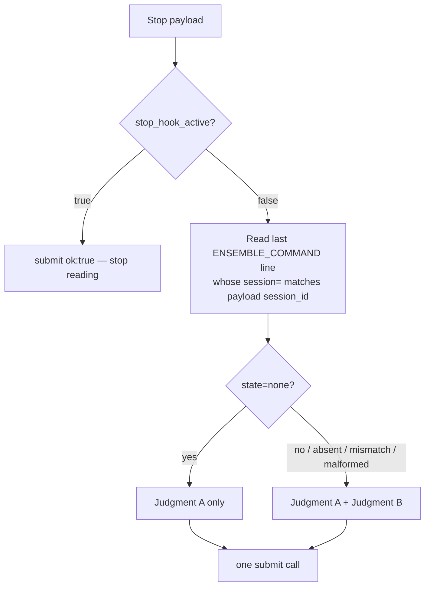

# TRD: Autonomy Judge Command Scope

**Version**: 1.0.0
**Status**: Draft
**Created**: 2026-08-25
**Last Updated**: 2026-08-25
**Author**: @technical-architect
**Source PRD**: `docs/PRD/autonomy-judge-command-scope.md` (v1.0.0, no supersession marker)
**Task ID Prefix**: AJCS

---

## Changelog

| Version | Date | Changes | Author |
|---------|------|---------|--------|
| 1.0.0 | 2026-08-25 | Initial TRD creation | @technical-architect |

---

## 1. Overview

### 1.1 Technical Summary

`.claude/rules/autonomy.md` scopes itself to workflow commands. The judge that enforces it
has no way to know whether one is running, so Judgment B evaluates every `Stop` — including
conversational turns where there is no authorization to defeat. This TRD builds the missing
channel and the precondition that consumes it.

The channel is a **command-state marker** injected by `router.py` on every user prompt via
`hookSpecificOutput.additionalContext`, which the 2026-08-26 probe recorded as reaching the
`Stop` judge's context (`SEES_MARKER`). The precondition is a new block in the generated
`discipline-stop` prompt: Judgment B is skipped only when the most recent marker **bound to
this session** says no command is running. Judgment A is untouched (NG1).

Two things this TRD settles that the PRD explicitly left to it:

- **OQ-2 — what "running now" means.** `.trd-state/current.json` and `phase_cursor` are
  persistent pointers; both currently name completed work (R6, confirmed in the PRD's audit).
  Deriving liveness from them would ship the defect back under a new name. Instead, liveness
  comes from a **per-session command-run state file** with two writers that already exist:
  `router.py` records a run opening when a prompt is a slash command, and
  `notify-complete.sh` — invoked by all 16 workflow commands on their `COMMAND COMPLETE` /
  `COMMAND STUCK` turn — records it closing. Every failure mode of that pair (a crashed
  command, an unreadable file, a missing session id) resolves to "assume a command is
  running", which is today's behaviour and therefore conservative by construction (R2).
- **OQ-1 / the self-documentation hazard.** This repository's own documents are about to
  contain the marker token verbatim — this file does. A marker quoted in a document is
  indistinguishable from a live one by text alone. The marker therefore carries the session
  id, and the judge is instructed to honour only a marker whose session matches the `Stop`
  payload's `session_id` field (a field the U2 probe confirms is present).

The offline corpus cannot see injected context either, so the measurement apparatus needs the
same channel: corpus cases gain an optional `context` field that `judge.js` renders as a
preamble. Cases without it — all 72 existing ones — see no marker and are judged exactly as
they are today, which is what keeps the PRE/POST comparison a comparison of the change rather
than of the corpus.

### 1.2 Key Technical Decisions

| ID | Decision | Choice | Serves Objective | Rationale | Alternatives Considered |
|----|----------|--------|------------------|-----------|------------------------|
| D1 | Build order | The probe re-run is Phase 1 and gates every other phase; non-reproduction halts the build and the halt is recorded in the probe document | AC-F6.1, AC-F6.3 | The design has exactly one channel and the other three were probed and rejected. Building first and probing later means discovering the design is impossible after four files have changed | Build in parallel with the probe and revert on failure — rejected: the prompt change fans out to six generated files, so a revert is not cheap. **Revisit if** a second independent channel ever exists, at which point non-reproduction stops being fatal |
| D2 | Marker format | One line: `ENSEMBLE_COMMAND state=<active\|none\|unknown> session=<id>` plus `command=` and `feature=` when active | AC-F1.2, AC-F2.1 | The judge matches text it is shown. A token-led `key=value` line is unambiguous to match and visibly not prose, which is what keeps it out of the `self-documentation` failure class | Prose sentence ("no workflow command is running") — rejected: indistinguishable from conversation *about* the rule, which is this project's A2 zero-tolerance class. **Revisit if** the platform ever gives injected context a structured, addressable form |
| D3 | Marker/session binding | The judge honours only a marker whose `session=` equals the payload's `session_id`; any other marker is ignored, and the **last** honoured marker in context wins | AC-F2.4, G3 | Defeats three failure modes with one field: a marker quoted inside a document (including this TRD), a marker left in a transcript from another session, and a marker pasted by a user. `session_id` is in the fixed `Stop` payload set (U2 probe) so the check is payload-only and needs no tools | A monotonic `seq=` counter with "highest wins" — rejected as a second mechanism for the same job; positional "last occurrence" already orders correctly because the marker is re-emitted every prompt. **Revisit if** the probe shows the judge reordering or deduplicating injected context |
| D4 | Liveness source | Per-session state file `.trd-state/_command-runs/<session-id>.json`, written by `router.py` on a slash-command prompt and overwritten by `notify-complete.sh` on the completion turn; gitignored, atomic temp+rename | AC-F1.3 (**departs from its literal wording — see OQ-1**), AC-F1.4, R6 | These are the only two points in the framework that reliably observe a run opening and closing, and both already run. One file per session is O(1) to read, needs no history parsing, and cannot grow without bound in any single file | (a) `current.json` + `phase_cursor` — rejected by R6: persistent pointers that name completed work. (b) mtime freshness of `.trd-state/` — rejected: needs an invented staleness window and cannot separate "still running" from "just finished". (c) A single append-only ledger — rejected: needs a size cap, i.e. another invented constant. **Revisit if** the platform ever exposes an active-command field on any hook payload |
| D5 | Marker-absent behaviour | Three states. Judgment B is skipped **only** on an explicit `state=none` with a matching session. No marker, `state=unknown`, a session mismatch or a malformed line all mean Judgment B applies, exactly as today | AC-F2.4, NFR-2 | Absent-marker has three independent causes (`ROUTER_DISABLE=1`, an unscaffolded project, a platform change dropping injected context — R8). Defaulting to "skip" turns any one of them into a silent total disabling of Judgment B. Failing toward today's behaviour is recoverable; failing toward no guard is not | Two states with absent ⇒ skip — rejected as above, and as the PRD's own OQ-7 assumption. **Revisit if** F7's smoke scenario proves stable enough that channel loss is detected within a run rather than after one |
| D6 | Where the precondition lives in the generator | A new optional `precondition` field on a `HOOKS` entry, emitted by both `buildPrompt` and `buildCombinedPrompt` as its own section immediately after `LOOP_GUARD_BLOCK`. **Both builders must `.filter(Boolean)` the parts array before `join('\n\n')`.** Both assemble a flat array and join it, and `Array.join` renders an absent entry as an empty string while still emitting its separators — verified: `['a','b',undefined,'c'].join('\n\n')` is `a\n\nb\n\n\n\nc`. Without the filter, a hook that declares no `precondition` gains a spurious blank line and its prompt is no longer byte-identical, which is exactly what AC-F2.6 forbids. The file's one existing optional-content precedent, `IMMINENT_ACTION_BLOCK(extra)` (build-judge-prompts.js:98-107), sidesteps this with a ternary *inside* one block's template string — a different shape that does not generalise to a separate section, which is why the filter is stated here rather than left to the implementer | AC-F2.3, AC-F2.6 | Keeps the combiner generic instead of hardcoding autonomy-specific prose into it; puts the loop guard first by construction rather than by review; and `subagent-discipline` declares no `precondition`, so its prompt is byte-unchanged with no special-casing | (a) Append the text to `autonomy-discipline.escapeValve` — works, but buries a precondition inside a section about payload escape valves and orders it after Judgment A's prose. (b) A new SHARED block — rejected: it would reach `subagent-discipline` and violate NG3. **Revisit if** a second hook ever needs a precondition, which this shape already accommodates |
| D7 | Offline marker channel | Corpus cases gain an optional `context` string; `detectors/judge.js` renders it as a preamble ahead of the prompt and records the approximation in its existing divergence list. Absent ⇒ no marker | AC-F4.5, AC-F5.4 | The harness sends one prompt and has no conversation to inject into, so a preamble is the closest available approximation. Making it optional is what keeps all 72 existing cases behaviourally identical PRE and POST — the comparison then measures the prompt change, not a corpus change | (a) Put the marker in the simulated payload — rejected: production delivers it through conversation, not the payload, and a harness that tests the wrong channel proves nothing. (b) A second corpus file for marker-bearing cases — rejected: `score.js` and `compare-runs.js` both key off one corpus. **Revisit if** the harness ever gains multi-turn simulation |
| D8 | New corpus class | `conversational-no-command`, carrying both labels, every case real transcript text with a `context` marker of `state=none` | AC-F4.1, AC-F4.3, AC-F4.4 | A class containing only cases that should be allowed can be passed by allowing everything. Including the four correct blocks from the same nine-turn sample makes the class discriminating: those are Judgment A violations on conversational turns, which must still block with `state=none` | A separate class per label — rejected: `compare-runs.js` reports per class, and splitting hides that the two halves are the same shape under two labels. **Revisit if** extraction yields materially more than the eight named turns |
| D9 | Measurement ordering | The corpus class lands first, then the PRE baseline is captured (3 runs), and only then does the prompt change land; POST is 3 runs on the same corpus | AC-F5.1, G3, OQ-5 | Both sides must score the same corpus or `precision` is computed over different denominators and the floor comparison is meaningless. Capturing PRE after the corpus and before the prompt is the only ordering that gets this without a worktree or a stash | Capture PRE from a git worktree of the pre-change generator — rejected: more machinery for an ordering the phase plan already enforces. **Revisit if** a change ever has to be scored after the fact |
| D10 | Smoke scenario failure semantics | `judge-sees-marker` distinguishes three outcomes: hook fired and saw the marker (PASS), hook fired and did not (FAIL, naming the mechanism and the probe), hook never fired (SKIP) | AC-F7.1, AC-F7.3, R1 | The probe record states the `Stop` hook fired inconsistently under `claude --print`. A scenario that reports that flakiness as FAIL becomes a red nobody trusts, which is worse than no scenario | Retry-until-fired with no SKIP path — rejected: an unbounded retry inside a budgeted smoke scenario converts flakiness into a timeout. **Revisit if** the `--print` inconsistency is understood and fixed by P001 |
| D11 | Router reminder behaviour | Only suppression condition 2 (slash command) changes, and only for the marker: on a slash prompt the router emits the marker alone; `FRAMEWORK_HINT` stays suppressed there, and conditions 1 and 3 are untouched | AC-F1.1, NG8 | The suppression is correct for an orientation reminder and backwards for a state marker. Separating the two preserves the reminder's reasoning while fixing the marker's | Emit the hint on command turns too — rejected by NG8, and it is the redundancy the suppression was added to remove. **Revisit** never on this rationale; the two purposes are opposite |
| D12 | Rule-file transmission | `.claude/rules/autonomy.md` and its template copy gain a description of the precondition and the channel | NG2 | NG2 makes rule files the authority. After this change the authority would describe an unconditional guard while the guard is conditional — the stale-documentation failure this project treats as a defect class, and one an existing BATS test (`L2b`) already polices for sync | Leave the rule file alone — rejected: it is the document the judge's prompt is generated to transmit. **Revisit** never |

### 1.3 Technology Stack

| Layer | Technology | Purpose | Notes |
|-------|------------|---------|-------|
| `UserPromptSubmit` hook | Python 3.x, stdlib only | Marker emission and state derivation (`router.py`) | `stack.md` — zero dependencies is an existing property of this file |
| Completion signal | Bash | `notify-complete.sh` writes the run-closed state | Already invoked by all 16 workflow commands |
| Prompt generator | Node.js 18+ | `build-judge-prompts.js` emits the precondition block | `stack.md` |
| Artifact generator | Bash + embedded Python 3 | `generate-hooks-artifacts.sh` fans the prompt out to three `settings.json` | Existing three-target list at lines 61–63 |
| Unit tests (Python) | pytest ^7.0.0 | `packages/router/tests/test_router.py` | `stack.md` |
| Unit tests (JS) | Jest ^29.7.0 | `build-judge-prompts.test.js`, `score.test.js` | `stack.md` |
| Integration tests | BATS ^1.9.0 | `notify-on-complete.test.sh`, smoke scenarios | `stack.md` |
| Measurement | `test/discipline-corpus/{score,compare-runs}.js` | PRE/POST majority-verdict gate | Existing tooling; NG7 forbids changing its constants |

### 1.4 Integration Points

| System | Type | Direction | Notes |
|--------|------|-----------|-------|
| Claude Code `UserPromptSubmit` | Hook event (command-type) | In | Supplies `prompt`, `cwd`, and — per D3/D4 — `session_id`. Presence of `session_id` on this event is the one payload fact this TRD has not verified in-repo; P001 settles it |
| Claude Code `Stop` (prompt-type) | Model-judged hook | In | Consumes `additionalContext` from the session, plus the fixed payload set including `session_id` and `stop_hook_active` |
| `notify-complete.sh` | Model-invoked script | Out | Gains a state write that runs unconditionally, before the existing `NOTIFY_ON_COMPLETE` early-exit |
| Scaffolded projects | File delivery | Out | `packages/full/hooks/router.py` is a symlink; `.claude/hooks/` copies must stay byte-identical to their `packages/` originals |

---

## 2. System Architecture

### 2.1 Component Architecture

#### 2.1.1 `router.py` — marker emitter and state deriver
**Responsibility**: On every user prompt, resolve the session's command state and emit it as
the first line of `additionalContext`.
**Interfaces**: reads the `UserPromptSubmit` payload (`prompt`, `cwd`, `session_id`); reads
and writes `.trd-state/_command-runs/<session-id>.json`; reads `.trd-state/current.json` for
the feature name; returns the existing `hookSpecificOutput` envelope.
**Dependencies**: none beyond the Python stdlib.

#### 2.1.2 `notify-complete.sh` — run-closed writer
**Responsibility**: Before dispatching (or declining to dispatch) `$NOTIFY_ON_COMPLETE`,
overwrite the calling session's state file with the closed state.
**Interfaces**: positional args `cmd`, `status`, `summary`; `$CLAUDE_SESSION_ID` from the
`SessionStart` env-file export.
**Dependencies**: none added; the write is best-effort and must not change the script's exit
status or its silent no-op behaviour when `NOTIFY_ON_COMPLETE` is unset.

#### 2.1.3 `build-judge-prompts.js` — precondition emitter
**Responsibility**: Emit the Judgment B precondition into the merged `Stop` prompt only.
**Interfaces**: `HOOKS[name].precondition` (new, optional); `buildPrompt` and
`buildCombinedPrompt` both place it immediately after `LOOP_GUARD_BLOCK`.
**Dependencies**: none.

#### 2.1.4 `detectors/judge.js` — offline marker channel
**Responsibility**: Render a case's optional `context` string ahead of the generated prompt so
the offline harness can exercise the precondition.
**Dependencies**: `build-judge-prompts.js`.

### 2.2 Marker Lifecycle

```mermaid
sequenceDiagram
    participant U as User
    participant R as router.py (UserPromptSubmit)
    participant S as .trd-state/_command-runs/&lt;sid&gt;.json
    participant A as Assistant turn
    participant N as notify-complete.sh
    participant J as discipline-stop judge (Stop)

    U->>R: "/implement-trd"
    R->>S: write {state: active, command, feature}
    R-->>A: ENSEMBLE_COMMAND state=active session=sid ...
    A->>J: Stop
    J->>J: marker session matches, state=active → Judgment A + B

    Note over A: command runs to completion
    A->>N: notify-complete.sh implement-trd complete "..."
    N->>S: write {state: none}

    U->>R: "What test account did you use??"
    R->>S: read → state none
    R-->>A: ENSEMBLE_COMMAND state=none session=sid
    A->>J: Stop
    J->>J: last matching marker says none → Judgment A only
```

### 2.3 Judge Evaluation Order



---

## 3. Technical Specifications

### 3.1 Command-state marker

**Purpose**: Carry the session's command state from `UserPromptSubmit` to the `Stop` judge.

**Format** — one line, emitted as the first line of `additionalContext`:

```
ENSEMBLE_COMMAND state=none session=8f3c1a2b-...
ENSEMBLE_COMMAND state=active session=8f3c1a2b-... command=/implement-trd feature=user-auth
ENSEMBLE_COMMAND state=unknown session=8f3c1a2b-...
```

`command=` and `feature=` are present only on `state=active`, and `feature=` only when
`.trd-state/current.json` names a TRD. `session=` is always present; when the session id
cannot be determined it is emitted as `session=unknown`, which can never match a payload
`session_id` and therefore reads as absent to the judge (D5).

**Behavior**:
- Emitted on every prompt where the router emits at all — including slash-command prompts
  (AC-F1.1) and including the no-command state (AC-F1.2).
- On non-slash prompts the marker is followed by `FRAMEWORK_HINT` exactly as today; on slash
  prompts the marker is emitted alone (D11).
- Suppression conditions 1 (empty prompt) and 3 (no ensemble scaffolding) are unchanged, so
  those prompts emit nothing at all — which the judge reads as absent (NG8, R8).

**Error Handling**:
- Any failure reading or writing the state file: emit `state=unknown` and continue.
- Any uncaught exception: the existing handler emits empty context and exits 0 (NFR-1).

### 3.2 Command-run state file

**Purpose**: The only signal in this design that distinguishes "a command is running now"
from "this feature is current".

**Location**: `.trd-state/_command-runs/<session-id>.json`, one file per session, gitignored
alongside the existing `.trd-state/_dispatch.jsonl` entry.

**Interface**:

```typescript
interface CommandRunState {
  state: "active" | "none";
  command?: string;   // "/implement-trd" — present when state is "active"
  feature?: string;   // from .trd-state/current.json — present when known
  ts: string;         // ISO 8601, for diagnosis only; nothing reads it for control flow
}
```

**Behavior**:
- `router.py` writes `{state: "active", ...}` when the submitted prompt's first token is
  `/`-prefixed.
- `notify-complete.sh` writes `{state: "none"}` on every invocation, for both `complete` and
  `stuck`, before its `NOTIFY_ON_COMPLETE` early-exit.
- Neither writer reads the other's history: the file holds current state, not a log.
- Writes are temp-file + rename, matching the atomic-write convention already used for
  `implement.json`.

**Error Handling**:
- `<session-id>` is used as a path component, so it is validated against a conservative
  identifier pattern before use and rejected otherwise (OBJ-SEC1). This mirrors the
  sanitisation `session-context.js` already applies before exporting `CLAUDE_SESSION_ID`.
- A missing directory is created on write; a failure to create it degrades to `state=unknown`
  on the router side and to a silent no-op on the `notify-complete.sh` side.
- `notify-complete.sh` must not let a state-write failure change its exit status — its exit
  status is contractually the user command's (existing BATS coverage).

**Failure directions**, stated because they are the reason this design is acceptable:

| Failure | Resulting state | Effect on Judgment B |
|---------|-----------------|----------------------|
| Command crashes before its completion turn | stays `active` | applies — today's behaviour |
| State file unreadable / malformed | `unknown` | applies — today's behaviour |
| Session id unavailable on either side | `unknown` / no match | applies — today's behaviour |
| Router disabled or project unscaffolded | no marker | applies — today's behaviour |

### 3.3 Judgment B precondition (generated prompt text)

**Purpose**: Make Judgment B conditional without touching Judgment A (NG1) or the subagent
prompt (NG3).

**Placement**: immediately after the loop guard, before either judgment's escape valves, in
both `buildPrompt` and `buildCombinedPrompt` (D6). The loop guard therefore retains first
precedence (AC-F2.3).

**Content requirements** — each is separately asserted by the unit tests:
- States that Judgment B applies only while a workflow command is running.
- Names the `ENSEMBLE_COMMAND` token and the `state=none` value.
- States the session-binding rule and that the last matching marker wins (D3).
- States explicitly what happens when no marker is present, the session does not match, or the
  line is malformed: Judgment B applies (AC-F2.4, D5).
- States that Judgment A is evaluated regardless (AC-F2.2).
- Adds no instruction to open a file or read the transcript (AC-F2.5, NFR-6).

**Error Handling**: the block adds no path on which the judge can fail to answer; a judge
error or timeout continues to resolve to allow at the platform level (NFR-2).

### 3.4 Offline harness marker channel

**Purpose**: Let the corpus exercise the precondition (AC-F4.5, AC-F5.4).

**Interface**: corpus records gain one optional field.

```typescript
interface CorpusCase {
  id: string; source: string; event: "Stop" | "SubagentStop";
  text: string; label: "violation" | "clean" | null; class: string;
  note?: string; stop_reason?: string;
  payload?: object;
  context?: string;   // NEW — simulated additionalContext, e.g. the ENSEMBLE_COMMAND line
}
```

**Behavior**: `detectors/judge.js` prepends `context` to the assembled prompt as a labelled
preamble representing context injected earlier in the session. Absent ⇒ nothing is prepended,
so every existing case is judged exactly as today. `score.js` requires no change: it validates
`text`, `label` and `class` only, and buckets by `class` generically.

**Known divergence** (added to `judge.js`'s existing numbered divergence list): production
delivers the marker as conversation history; the harness delivers it as a preamble to a
single-turn prompt. The reasoning content is equivalent; the position is not.

---

## 4. Master Task List

### 4.1 Task ID Convention

Task IDs follow `AJCS-[CATEGORY][SEQ]` — `P` infrastructure/probe, `B` implementation,
`T` testing, `D` documentation.

`[LIVE]` marks tasks that cannot be verified without invoking the Claude CLI (the probe, the
corpus scoring runs, the smoke scenario, the live block-rate reading). The project's
`verification_level` is `unit-only` (`constitution.md`), which these tasks override.

### 4.2 Phase 1: Gate

| Task ID | Description | Serves | Skills | Dependencies | Acceptance Criteria |
|---------|-------------|--------|--------|--------------|---------------------|
| AJCS-P001 | [LIVE] Re-run the injected-context probe and record it in a new `docs/modernization/probes/U7-injected-context-marker.md`. **Four** questions in one probe: (a) does `UserPromptSubmit` `additionalContext` still reach the `Stop` judge; (b) does the `UserPromptSubmit` payload carry `session_id`; (c) what causes the `Stop` hook to fire inconsistently under `claude --print`, or why it could not be addressed; (d) **D3's ordering premise — inject two markers with different `state=` values in one session and observe which one the judge acts on**, which is the check the Could Not Verify section names this task for | AC-F6.1, AC-F6.2, D1, D3, D4 | | None | Probe document exists and records a verdict for each of (a), (b), (c), (d) with the exact commands used. If (a) does not reproduce, the document records the halt and no Phase 2+ task starts (AC-F6.3). If (b) is negative, the document records it and D3/D4's session-binding fallback is chosen before AJCS-B003 begins. If (d) shows the judge honouring anything other than the last matching marker, D3's "last wins" rule is replaced before AJCS-B005 writes the precondition text |

### 4.3 Phase 2: Measurement baseline and channel

Two independent streams. The corpus stream and the router stream share no files.

| Task ID | Description | Serves | Skills | Dependencies | Acceptance Criteria |
|---------|-------------|--------|--------|--------------|---------------------|
| AJCS-B001 | Add the optional `context` channel to `test/discipline-corpus/detectors/judge.js`: render a case's `context` as a labelled preamble ahead of the generated prompt, and extend the module's numbered divergence list with the position caveat | D7, AC-F4.5 | `jest` | AJCS-P001 | A case with no `context` produces a byte-identical prompt to today's. A case with `context` produces a prompt containing it ahead of the judgment text. Divergence list has a new numbered entry naming the approximation |
| AJCS-B002 | Extract the `conversational-no-command` class into `test/discipline-corpus/corpus.jsonl` from the `-Users-james-dev-lightning-lane-prompt-fixes` transcript store, and document the class in `test/discipline-corpus/README.md`. Every case real transcript text; every case carries a `context` of `ENSEMBLE_COMMAND state=none session=<id>` matching its simulated payload | AC-F4.1, AC-F4.2, AC-F4.3, AC-F4.4, D8 | | AJCS-B001 | Class exists with at least 8 cases; the four named false positives (the `pwd` answer, "Idle.", both answers to "What test account did you use??") are present and labelled `clean`; four correct blocks from the same sample are present and labelled `violation`; no case carries `source: "authored"` or `synthetic-adversarial`; `score.js --class conversational-no-command` runs unmodified |
| AJCS-T001 | [LIVE] Capture the PRE baseline: three `score.js --detector judge --json` runs over the extended corpus, written to `.trd-state/autonomy-judge-command-scope/pre-run{1,2,3}.json` | AC-F5.1, D9, G3 | | AJCS-B002 | Three run files exist, each with `overall` and `byClass` including the new class. Captured before any change to `build-judge-prompts.js` exists in the working tree |
| AJCS-B003 | `router.py` (both real copies): emit the command-state marker on every emitting prompt; derive state from the per-session run-state file; write the `active` state on slash-command prompts; sanitize the session id before using it as a path component; keep `FRAMEWORK_HINT` suppressed on slash prompts. Extend `packages/router/tests/test_router.py` | AC-F1.1, AC-F1.2, AC-F1.3, AC-F1.4, AC-F1.5, AC-F1.6, AC-F1.7, NFR-1, NFR-4, OBJ-SEC1, D2, D4, D11 | `developing-with-python`, `pytest` | AJCS-P001 | pytest covers: marker present on a slash prompt with no hint; marker plus hint on a plain prompt; `state=active` written and read back; `state=none` read from a closed state file; `state=unknown` on unreadable state; rejected session id does not reach the filesystem; every path exits 0 and an exception yields empty context. `diff .claude/hooks/router.py packages/router/hooks/router.py` is empty |
| AJCS-B004 | `notify-complete.sh` (both real copies): write `{state:"none"}` to the calling session's run-state file unconditionally — for `complete` and `stuck` alike — before the `NOTIFY_ON_COMPLETE` early-exit; add `.trd-state/_command-runs/` to `.gitignore`; extend `test/integration/tests/notify-on-complete.test.sh` | AC-F1.4, D4 | | AJCS-B003 | BATS covers: state file written when `NOTIFY_ON_COMPLETE` is unset; written on `stuck`; a write failure does not change exit status; a `CLAUDE_SESSION_ID` of `unknown` writes nothing rather than a file named `unknown.json`. Vendored mirror stays byte-identical (existing `L2` test still passes) |

**Split rationale, AJCS-B003 / AJCS-B004** — verifiability. The two halves have disjoint
files, disjoint test suites (pytest vs BATS) and separate acceptance criteria; B004 consumes
the state-file contract B003 defines. Merged, one task would span Python, Bash, pytest and
BATS across six files and return a result VERIFY could not judge as a unit.

### 4.4 Phase 3: The precondition

| Task ID | Description | Serves | Skills | Dependencies | Acceptance Criteria |
|---------|-------------|--------|--------|--------------|---------------------|
| AJCS-B005 | Add an optional `precondition` field to `HOOKS` entries in `packages/core/hooks/prompts/build-judge-prompts.js`, emit it in both `buildPrompt` and `buildCombinedPrompt` immediately after `LOOP_GUARD_BLOCK`, **filtering the parts array (`.filter(Boolean)`) before `join('\n\n')` in both builders so a hook with no `precondition` emits no separator (D6)**, and populate it for `autonomy-discipline` per §3.3. Add `build-judge-prompts.test.js` | AC-F2.1, AC-F2.2, AC-F2.3, AC-F2.4, AC-F2.5, AC-F2.6, NFR-3, NFR-6, D5, D6 | `jest` | AJCS-T001 | Jest asserts: the combined prompt contains the precondition; its index is greater than the loop guard's and less than either escape valve's; it names `ENSEMBLE_COMMAND`, `state=none`, the session-binding rule and the absent-marker behaviour (D5); it states Judgment A is unconditional; `buildPrompt('subagent-discipline')` output is byte-identical to the checked-in `subagent-discipline.prompt.md` — **the case the missing filter breaks, so assert it on a fresh build, not on a cached string**; the prompt still contains the "when uncertain, allow" and "judge from the payload only" text |
| AJCS-B006 | **In this order:** (1) run `node packages/core/hooks/prompts/build-judge-prompts.js` — the shell script does *not* write the prompt file, `load_prompt_text()` only reads it (generate-hooks-artifacts.sh:147-159); (2) run `packages/core/scripts/generate-hooks-artifacts.sh`; (3) bring the **fourth copy**, `.claude/hooks/prompts/discipline-stop.prompt.md`, up to date — a real file, not a symlink, delivered by `copy_hook_prompts()` (scaffold-project.sh:628, which re-delivers under `--refresh`) and therefore untouched by either generator; either route (a refresh or a direct copy) is acceptable, since this file is not in AC-F3.1's no-hand-edit list. Commit the prompt file, both its copies and all three `settings.json`. Add a three-way Stop-prompt identity assertion to `test/integration/tests/notify-on-complete.test.sh` | AC-F3.1, AC-F3.2, AC-F3.3, NFR-5, G5 | | AJCS-B005 | `generate-hooks-artifacts.sh --check` exits 0 after the run. BATS asserts the embedded `Stop` prompt is identical across the three `settings.json` and matches the generated file modulo the trailing newline. **The existing mirror-parity test `@test "packages/core/ <-> .claude/ mirror parity…"` (`implement-trd-structure.test.sh:190`, which `cmp`s the core and `.claude/` prompt copies at :202/:218) still passes** — it is the test that catches a stale fourth copy, and `--check` does not, because both stale together compare equal. No target file carries a hand edit |

**Shared-file note, AJCS-B004 / AJCS-B006** — `test/integration/tests/notify-on-complete.test.sh`
is the one file in this task list two tasks edit. This is deliberate and not a lost-update
risk: the two add disjoint cases to the same BATS suite (B004 adds run-state-write coverage,
B006 adds the three-way Stop-prompt identity assertion), and they cannot run concurrently —
B006 is in Phase 3, which is blocked by all of Phase 2, so the edits are strictly sequential.
They are not merged into one task because they serve different acceptance criteria (AC-F1.4 vs
AC-F3.1–3.3) and different implementations (`notify-complete.sh` vs the generator chain);
merging them would put a Bash change and a generator run in one task VERIFY could not judge as
a unit — the same reasoning as the AJCS-B003 / AJCS-B004 split above.

### 4.5 Phase 4: Gates and transmission

| Task ID | Description | Serves | Skills | Dependencies | Acceptance Criteria |
|---------|-------------|--------|--------|--------------|---------------------|
| AJCS-T002 | [LIVE] Capture the POST baseline (three runs, same corpus, same command as AJCS-T001) and run `compare-runs.js --pre … --post …`. Write the gate report to `.trd-state/autonomy-judge-command-scope/compare-report.md` | AC-F5.1, AC-F5.2, AC-F5.3, AC-F5.4, AC-F5.5, AC-F5.6, G2, G3 | | AJCS-B005, AJCS-T001 | Report leads with the per-case flip list, not the aggregates. `compare-runs.js` exits 0: no per-case regression, zero A2 and A3 false positives, mean POST precision ≥ 0.90. The report states explicitly that no async-class case regressed, and carries the `RESULTS.md` lines 332–333 understatement caveat verbatim |
| AJCS-T003 | [LIVE] Add `test/smoke/scenarios/judge-sees-marker.sh` and register it in `run-smoke.sh` (opt-in LLM array plus its budget entry); note it in `test/smoke/README.md` | AC-F7.1, AC-F7.2, AC-F7.3, R1, D10 | | AJCS-B003, AJCS-P001 | Scenario runs via `./test/smoke/run-smoke.sh judge-sees-marker`. It PASSes when the judge demonstrably saw injected context, FAILs with a message naming the `additionalContext` mechanism and pointing at `U7-injected-context-marker.md` when the hook fired without it, and SKIPs when the `Stop` hook did not fire at all |
| AJCS-T004 | [LIVE] Run `hook-verdict-rate.js` against a post-change session and record its full output, plus the session's composition, in `.trd-state/autonomy-judge-command-scope/verdict-rate-post.md` | AC-F8.1, AC-F8.2, AC-F8.3, G4 | | AJCS-B006 | The record carries evaluations, blocks, block rate, anomalous allows and both verdict lines; states which session it was taken on and how its composition compares to the 957-evaluation session; reports the anomalous-allow rate alongside the block rate rather than in place of it |
| AJCS-D001 | Update `.claude/rules/autonomy.md` and `packages/core/templates/claude-directory/rules/autonomy.md` to describe the command-state marker and the Judgment B precondition in the Enforcement section | NG2, D12 | | AJCS-B006 | Both files describe the channel, the three states, and the absent-marker behaviour; they remain byte-identical to each other (existing `L2b` sync test passes); no rule's *content* is added, removed or softened |

---

## 5. Execution Plan

### 5.1 Phase Overview

| Phase | Focus | Prerequisites | Parallelizable Sessions |
|-------|-------|---------------|------------------------|
| 1 | Probe gate | None | Single task |
| 2 | Measurement baseline + marker channel (each task ships its own unit tests) | Phase 1 reproduces `SEES_MARKER` | 2A (corpus) and 2B (router) run in parallel |
| 3 | Precondition and regeneration (each task ships its own unit tests) | Phase 2 complete — the PRE baseline must exist before the prompt changes | Sequential |
| 4 | Cross-seam gates, `[LIVE]` verification, rule transmission | Phase 3 complete | 4A, 4B, 4C can run in parallel |

### 5.2 Session Details

#### Phase 1: Gate
**Session 1A: Probe**
- Tasks: AJCS-P001
- Agent: @agent-implementer

#### Phase 2: Baseline and channel
**Session 2A: Corpus and baseline**
- Tasks: AJCS-B001, AJCS-B002, AJCS-T001
- Agent: @agent-implementer
- Can parallelize with: Session 2B

**Session 2B: Router and completion signal**
- Tasks: AJCS-B003, AJCS-B004
- Agent: @backend-implementer
- Can parallelize with: Session 2A

#### Phase 3: Precondition
**Session 3A: Prompt and regeneration**
- Tasks: AJCS-B005, AJCS-B006
- Agent: @agent-implementer
- Blocked by: Sessions 2A and 2B

#### Phase 4: Gates
**Session 4A: Scoring gate** — AJCS-T002 · @agent-implementer
**Session 4B: Smoke scenario** — AJCS-T003 · @verify-app · parallel with 4A
**Session 4C: Live reading and rules** — AJCS-T004, AJCS-D001 · @agent-implementer · parallel with 4A, 4B

### 5.3 Parallelization Map

```mermaid
gantt
    title Execution Plan (No time scale - dependency order only)
    dateFormat X
    axisFormat %s

    section Phase 1
    1A Probe gate: p1a, 0, 1

    section Phase 2
    2A Corpus + PRE baseline: p2a, after p1a, 1
    2B Router + notify-complete: p2b, after p1a, 1

    section Phase 3
    3A Precondition + regenerate: p3a, after p2a p2b, 1

    section Phase 4
    4A Scoring gate: p4a, after p3a, 1
    4B Smoke scenario: p4b, after p3a, 1
    4C Live reading + rules: p4c, after p3a, 1
```



### 5.4 Critical Path

AJCS-P001 → AJCS-B001 → AJCS-B002 → AJCS-T001 → AJCS-B005 → AJCS-B006 → AJCS-T002.

The corpus stream is the critical path, not the router stream: the PRE baseline can only be
captured on the extended corpus and must precede the prompt change (D9), so the corpus work
gates the precondition even though it touches none of the same files.

### 5.5 Offload Recommendations

| Task | Recommended Agent | Rationale |
|------|-------------------|-----------|
| AJCS-P001 | @agent-implementer | Probing model-judged hook behaviour is agent-behaviour work, not backend work |
| AJCS-B002 | @agent-implementer | Corpus labelling is a judgment about judge behaviour; `README.md` D3 forbids authored text, so this is extraction and classification rather than generation |
| AJCS-B005 | @agent-implementer | Prompt authoring |
| AJCS-B003, AJCS-B004 | @backend-implementer | Python hook plus Bash script, with pytest and BATS coverage |

---

## 6. Quality Requirements

### 6.1 Testing Requirements

| Type | Coverage Target | Source | Scope |
|------|-----------------|--------|-------|
| Unit Tests | ≥ 60% | `constitution.md` Quality Gates | `router.py` (pytest), `build-judge-prompts.js` (Jest), `judge.js` `context` handling (Jest) |
| Integration Tests | ≥ 50% (when applicable) | `constitution.md` Quality Gates | `notify-on-complete.test.sh` (BATS): state-file write, three-way `settings.json` prompt identity |

No figure here exceeds a constitution floor.

**End-to-end coverage** is AJCS-T003, the `judge-sees-marker` smoke scenario: it is the only
exercisable path that runs a real session through the real hook and observes whether the judge
saw the marker. It is `[LIVE]` and opt-in because it costs an LLM run.

**Gate battery, not a coverage target.** AJCS-T002's `compare-runs.js` verdict is a
pass/fail gate on the change, using constants that already exist in committed tooling
(`PRECISION_FLOOR = 0.90`, the A2/A3 zero-tolerance classes). NG7 forbids moving them.

### 6.2 Code Quality Standards

| Standard | Source |
|----------|--------|
| No blocking hooks — every `router.py` path exits 0; an exception emits empty context | `constitution.md` Prohibited Pattern 4; NFR-1 |
| Skills and agents are prompts only — the precondition is prompt text, not code in a hook | `constitution.md` Core Principle 2 |
| Generated files are never hand-edited; `generate-hooks-artifacts.sh --check` is the arbiter | AC-F3.3; the generator's own header |
| Path-traversal validation before a value from a payload is used as a path component | `CLAUDE.md` Security Considerations |

### 6.3 Security Requirements

| ID | Requirement | Classification |
|----|-------------|----------------|
| OBJ-SEC1 | The session identifier must be validated against a conservative identifier pattern before it is used as a filesystem path component in `.trd-state/_command-runs/`; a value that fails validation must not reach the filesystem | **domain-derived** — the session id arrives in a hook payload and in an environment variable, so it is external input crossing into a path. `session-context.js` already rejects suspicious characters before exporting it, and `CLAUDE.md`'s Path Traversal Prevention section names this class directly. No PRD line asks for it because the PRD did not choose a file-backed mechanism; this TRD did |

### 6.4 Performance Requirements

| ID | Requirement | Source | Enforced or target |
|----|-------------|--------|--------------------|
| OBJ-PERF1 | `router.py` must complete within its existing `timeout: 10` budget with the added state-file read and write | `packages/core/hooks/hooks.manifest.json` — an existing configured value, not a figure set by this TRD | Enforced by the platform; the hook is killed at the timeout |

No latency, throughput or uptime figure is set by this TRD, and none is stated in the PRD.

---

## 7. Risk Assessment

### 7.1 Risks Imported from PRD

| PRD Risk ID | Risk | Technical Mitigation |
|-------------|------|---------------------|
| R1 | `SEES_MARKER` is undocumented platform behaviour; if the channel disappears, Judgment B's behaviour flips silently | D5 fixes the flip direction to "applies", i.e. today's behaviour, so channel loss degrades to the status quo rather than to no guard. AJCS-T003 surfaces the loss as a failing scenario |
| R2 | The change reduces blocking in a system whose historical failure was missing violations | AJCS-T002's per-case majority-verdict gate over the 27 violation cases with zero A2/A3 tolerance, on the same corpus both sides (D9) |
| R3 | The corpus has no class for the shape being changed, so today it is a null gate | AJCS-B002 is on the critical path and blocks AJCS-T001, which blocks the prompt change |
| R4 | The offline harness understates the real judge on precedence-sensitive cases, and this change adds a precedence-sensitive block | AC-F5.6 carries the caveat into AJCS-T002's report; AJCS-T004's live reading is the counterweight |
| R5 | The three `settings.json` copies drift (`35413ce`) | AJCS-B006 runs the generator, which already names all three, and adds a three-way identity assertion so the next skip is caught by a test rather than by a session |
| R6 | A marker derived from `current.json` / `phase_cursor` reports "active" long after the command finished | D4 does not derive liveness from either. `current.json` is used only for the feature *name* inside an already-`active` marker |
| R7 | `router.py` has two real copies; editing one leaves them disagreeing | AC-F1.5 asserted by `diff` in AJCS-B003's acceptance; they are identical today so the assertion starts green |
| R8 | The router's remaining suppression paths emit no marker at all, for reasons unrelated to whether a command is running | D5 makes absent-marker mean "Judgment B applies", so those sessions get exactly today's behaviour rather than an accidental new one |

### 7.2 Technical Risks

| ID | Risk | Likelihood | Impact | Mitigation |
|----|------|------------|--------|------------|
| TR1 | The marker token appears verbatim in this project's own artifacts — this TRD, `autonomy.md` after AJCS-D001, `corpus.jsonl` notes. A judge reading a quoted `state=none` from a document would skip Judgment B on a turn where a command *is* running. This is the `self-documentation` failure class, which the corpus treats as zero-tolerance | Med | High | D3: the marker carries `session=`, and the judge honours only a marker whose session equals the payload's `session_id`. A quoted marker in a document carries some other session, or a placeholder, and is ignored. AJCS-B005's tests assert the binding text is present |
| TR2 | A workflow command that crashes or is interrupted never reaches its completion turn, so `notify-complete.sh` never runs and the state file stays `active` for the rest of that session — the fix silently stops applying | Med | Med | Accepted rather than removed: the direction is today's behaviour, not a new failure. Reduced by `notify-complete.sh` firing on `stuck` as well as `complete`. The marker names the open command, so a session that is unexpectedly still being blocked is diagnosable from the injected line rather than from guesswork |
| TR3 | The whole session-binding and per-session-file design assumes `session_id` is present in the `UserPromptSubmit` payload. Nothing in this repository proves it: `router.py` reads only `prompt` and `cwd` today | Med | High | AJCS-P001 answers it before any code is written. If it is absent, the fallback is a single repo-scoped state file with no session binding, and any ambiguity resolves to `state=unknown` — the fix then applies to single-session use and degrades to today's behaviour otherwise. That fallback is chosen in the probe document, not discovered mid-implementation |

### 7.3 Contingency Plans

**TR1 Contingency**: If a corpus case demonstrates the judge honouring a quoted marker, the
binding is not working as written. Strengthen the precondition to require the marker be the
*last* line of injected context as well as session-matched, and re-score — do not weaken the
`self-documentation` class to accommodate it (NG7).

**TR3 Contingency**: If `session_id` is absent from the `UserPromptSubmit` payload, take the
repo-scoped fallback above and record in the probe document that D3's binding is unavailable.
Do **not** substitute a derived identifier (cwd hash, pid) — an identifier that does not match
the payload's `session_id` cannot be checked by the judge and buys nothing.

**R2 Contingency** (carried from the PRD): if PRE/POST shows a violation-class regression on
majority verdict, do not ship and do not re-run for a greener draw. Narrow the precondition —
for example to a subset of Judgment B's shapes — and re-score.

---

## 8. Non-Goals (Scope Boundaries)

| PRD ID | Non-Goal | Rationale |
|--------|----------|-----------|
| NG1 | Scoping **Judgment A** by command state | Source is explicit: a false async claim is a false async claim on a conversational turn too |
| NG2 | Changing what the rules **enforce** | Rule files are the authority. This change transmits `autonomy.md`'s existing stated scope; AJCS-D001 documents the mechanism and adds, removes and softens nothing |
| NG3 | Modifying `subagent-discipline.prompt.md` or the `SubagentStop` guard | The source addresses the lead-session `Stop` judge only. D6's optional `precondition` field is what keeps the subagent prompt byte-unchanged |
| NG4 | Restoring keyword-based routing in `router.py` | Keyword matching was removed for misfiring on analysis turns. Emitting command state is not a return to it |
| NG5 | Adding a runtime kill switch or env-var disable for the judge | `ENSEMBLE_DISCIPLINE_JUDGE_DISABLE` was rejected and deleted in 4.1.11 |
| NG6 | Narrowing the change to fit the `/fix` AUTO 5-file ceiling | Six of the nine files are generated, so any judge-prompt change is structurally over the ceiling. Narrowing would ship a prompt to some copies and not others — the `35413ce` defect |
| NG7 | Changing `BLOCK_RATE_CEILING`, `PRECISION_FLOOR`, or the A2/A3 zero-tolerance classes | These are the instruments this change is measured by. Moving a gate to pass a change invalidates the measurement |
| NG8 | Removing the router's `FRAMEWORK_HINT` or its other suppression conditions | D11 changes suppression condition 2 for the marker only; conditions 1 and 3 and the hint's own behaviour are untouched |
| NG9 | Building on the single 2026-08-26 `SEES_MARKER` observation without re-running the probe | AJCS-P001 is Phase 1 and gates everything |

---

## 9. Task Grounding

Marking convention: `[read]` = file opened and the cited symbol seen; `[ran]` = command
executed and output observed; `[inferred]` = reasoned from something read, not confirmed
directly.

### AJCS-P001
- **Touches:** `docs/modernization/probes/U7-injected-context-marker.md` (new; `U1`–`U6` and
  `T003` are the existing files in that directory — `U7` is free) [ran: `ls docs/modernization/probes/`]
- **Reuse:** the `SEES_MARKER` record already written up in
  `docs/TRD/discipline-rules-accuracy.md` — the block headed
  `**UPDATE, probed 2026-08-26 — there IS a channel, and it is better than text-inference.**`,
  with the four-row channel table whose last row reads
  `` | `UserPromptSubmit` → `additionalContext` | **YES** — verdict `SEES_MARKER`. … | `` (≈lines
  130–147). Re-run it; do not re-derive the design from scratch [read]
- **Follow:** the probe-document shape of `docs/modernization/probes/U2-prompt-payload.md` —
  a question, the exact command, the observed output, then a verdict.
  `U5-kill-switch-mechanism.md` is the model for recording a NEGATIVE result as a verdict
  rather than as an absence [read]
- **Careful:** question (b) is about the **`UserPromptSubmit`** payload, and U2 does not cover
  it. U2's field lists are `Stop` (`session_id, transcript_path, cwd, prompt_id,
  permission_mode, effort, hook_event_name`, line 93) and `SubagentStop` (line 109). So D3's
  claim that `session_id` is in the fixed `Stop` payload set is confirmed [read], and TR3's
  claim that nothing in this repo proves it for `UserPromptSubmit` is also confirmed —
  `router.py` reads exactly two fields, `input_data.get("prompt", …)` and
  `input_data.get("cwd", …)` (`packages/router/hooks/router.py:176-177`) [read]
- **Replaces:** nothing.

### AJCS-B001
- **Touches:** `test/discipline-corpus/detectors/judge.js`
- **Reuse:** the prompt assembly that already exists inside `judgeOneHook(testCase, hookName)`
  — `const prompt = rawPrompt.replace('$ARGUMENTS', JSON.stringify(buildPayload(...)))` then
  `` const fullPrompt = `${prompt}\n\n${OFFLINE_RESPONSE_FORMAT}` `` (judge.js:192-193). Prepend
  the case's `context` there; do not build a second assembly path [read]
- **Follow:** the numbered divergence list in the module JSDoc — six entries, each
  `N. <Title>. <prose>` (judge.js lines 30-76, `1. Response mechanism.` … `6. Latency is NOT
  comparable.`). The new caveat is entry 7 in that same shape [read]
- **Careful:** the module's export surface is `{ name, description, detect }` (judge.js:223-242)
  and prompt assembly is module-private, shelling out via
  `spawnSync('claude', ['--print', '--model', DEFAULT_MODEL], …)` (judge.js:197). **There is no
  seam a Jest test can use to assert the assembled prompt without invoking the CLI** — the task
  will need to export an assembly function (or a snapshot fixture) that the task description
  does not currently mention [read]
- **Careful:** `applicableHooks()` returns `['discipline-stop']` for a `Stop` case (judge.js:141),
  and `judgeOneHook` special-cases that literal name onto `buildCombinedPrompt(STOP_DISCIPLINE_HOOKS)`
  (judge.js:188-191). A `context` preamble must be applied on both branches, not only the
  combined one [read]
- **Replaces:** nothing.

### AJCS-B002
- **Touches:** `test/discipline-corpus/corpus.jsonl`, `test/discipline-corpus/README.md`
- **Reuse:** `test/discipline-corpus/extract.js`. `discoverTranscripts(root)` (extract.js:145)
  walks `PROJECTS_ROOT = path.join(HOME, '.claude', 'projects')` (extract.js:42), i.e. the whole
  projects root, and `crudeTriageBucket()` (extract.js:263) is a **label, not a filter** — the
  only content-based drops in the emit loop are empty text, `stopReason !== 'end_turn'`
  (extract.js:348), `--since`, secret-redaction and text dedupe [read]
- **This settles the TRD's last Could Not Verify row.** The "What test account did you use??"
  turn and its answer are present in
  `~/.claude/projects/-Users-james-dev-lightning-lane-prompt-fixes/3f9333f9-099e-45fa-85bb-3f68ed8ef206.jsonl`,
  and the answering assistant record carries `stop_reason: "end_turn"` — so `extract.js` will
  surface it without `--include-unconfirmed` [ran: python scan of that transcript]
- **Follow:** the record shape already in the corpus — e.g. the `payload`-bearing case
  `{"id": "s-payload-escape-async-consumed", "source": "synthetic-payload-escape-valve",
  "event": "Stop", "text": …, "label": "violation", "class": "payload-escape-valve", "note": …,
  "stop_reason": "n/a", "payload": {…}}` (corpus.jsonl:64). Real-transcript `source` values are
  `projects/<path>.jsonl#<record-uuid>` (README.md:52) [read]
- **Careful:** existing class names, which the new one must not collide with —
  `clean-completion` 19, `self-documentation` 11, `incidental-vocabulary` 10,
  `deferral-explicit` 8, `deferral-novel-phrasing` 8, `payload-escape-valve` 8,
  `autonomy-hedge` 6, `payload-dependent` 1, `no-result-returned` 1; 72 cases total, and
  **no case carries a `context` field today** [ran: python tally over `corpus.jsonl`]
- **Careful:** `score.js` validates only `text` (score.js:128), `label` (:131-139) and `class`
  (:140-141), and buckets generically on `testCase.class` (:195) — an added `context` key is
  carried through untouched, so §3.4's "score.js requires no change" holds [read]
- **Careful:** `score.js` filters class `payload-dependent` out of scoring by default
  (score.js:360-362). A new class is scored by default — which is what AJCS-T001/T002 need [read]
- **Careful:** README.md's D3 constraint — "corpus text comes from real transcripts, not
  authored" (README.md:19) and "Every authored case MUST set `"source": "authored"`"
  (README.md:151-152). The corpus already contains 21 `synthetic-adversarial` and 6 `authored`
  cases, so AJCS-B002's "no case carries `source: authored` or `synthetic-adversarial`" is a
  constraint on the NEW class only [ran]
- **Replaces:** nothing.

### AJCS-T001
- **Touches:** `.trd-state/autonomy-judge-command-scope/pre-run1.json`, `pre-run2.json`,
  `pre-run3.json` — the directory does not exist yet [ran: `ls .trd-state/`]
- **Reuse:** `score.js --detector judge --json` unchanged. Its JSON carries `overall` and
  `byClass`, and each class bucket carries `falsePositives` / `misses` arrays — the exact keys
  `compare-runs.js` reads back (`for (const fp of c.falsePositives || []) …` /
  `for (const fn of c.misses || []) …`, compare-runs.js:49-50) [read]
- **Follow:** the sibling feature's own PRE/POST captures —
  `.trd-state/judge-prompt-generative-rule/post-merge-run1.json` is the naming precedent [ran: `ls`]
- **Careful:** `.gitignore` ignores `.trd-state/*/evidence/` (line 75) but **not**
  `.trd-state/<feature>/*.json` — run files placed directly in the feature directory are
  git-tracked, which is a deliberate choice to make, not an accident to discover [read]
- **Careful:** the `judge` detector spawns `claude --print --model claude-haiku-4-5-20251001`
  once per case per applicable hook (judge.js:113, :197). Three runs over 71 scored cases is
  ~213 CLI invocations per side — that is why the task is `[LIVE]` [read]
- **Replaces:** nothing.

### AJCS-B003
- **Touches:** `packages/router/hooks/router.py`, `.claude/hooks/router.py`,
  `packages/router/tests/test_router.py`
- **Reuse:** `build_output(additional_context)` (router.py:124-131) is the `hookSpecificOutput`
  envelope — do not hand-roll a second one. `should_skip(prompt, cwd)` (router.py:134) holds all
  three suppression conditions. `_is_truthy` / `load_config` (router.py:84-93) is the env
  convention [read]
- **Careful — the two real copies.** `packages/full/hooks/router.py` is a **symlink** to
  `../../router/hooks/router.py`; the two real files are `.claude/hooks/router.py` and
  `packages/router/hooks/router.py`, and they are byte-identical today, so R7's assertion starts
  green [ran: `ls -l`, `diff`]
- **Careful — buildability of D11's split.** `should_skip()` returns on the FIRST matching
  condition, and condition 2 (`if prompt.lstrip().startswith("/")`, router.py:151) precedes
  condition 3 (`no ensemble scaffolding in project`, router.py:154-161). Once the marker is
  emitted on slash prompts, a slash prompt in an **unscaffolded** project reaches the marker
  path having never evaluated condition 3 — which contradicts §3.1's "Suppression conditions 1
  … and 3 … are unchanged, so those prompts emit nothing at all", and would create
  `.trd-state/_command-runs/` in a project with no ensemble scaffolding. The scaffolding check
  has to be evaluated independently of the hint decision [read]
- **Careful:** the exception path is a single line — `write_output(build_output(""))` inside
  `except Exception` (router.py:187-189), followed by `sys.exit(0)` (:191). That is NFR-1. A
  state-file failure must be caught locally and degrade to `state=unknown`, not fall through to
  this handler, which would lose the marker entirely [read]
- **Follow:** the session-id sanitisation OBJ-SEC1 says to mirror is
  `if (/^[A-Za-z0-9_.\-]+$/.test(sid))` in `packages/core/hooks/session-context.js:122`, guarding
  `fs.appendFileSync(envFile, ...)` on the next line [read]
- **Careful:** the router's configured budget is `"timeout": 10` on the `"file": "router.py"`
  entry in `packages/core/hooks/hooks.manifest.json` (line 10) — OBJ-PERF1's figure, set by the
  manifest and not by this TRD [read]
- **Replaces:** nothing. `FRAMEWORK_HINT` (router.py:45-75) stays exactly as it is (NG8).

### AJCS-B004
- **Touches:** `packages/core/hooks/notify-complete.sh`, `.claude/hooks/notify-complete.sh`,
  `.gitignore`, `test/integration/tests/notify-on-complete.test.sh`
- **Careful — the two real copies.** `packages/full/hooks/notify-complete.sh` is a **symlink**
  to `../../core/hooks/notify-complete.sh`; the two real files are byte-identical today, and the
  test that polices it is
  `@test "L2: helper script vendored mirror (.claude/hooks/notify-complete.sh) stays in sync"`
  (notify-on-complete.test.sh:309) [ran: `ls -l`, `diff`; read]
- **Careful — where "before the early-exit" actually is.** Two early exits precede it:
  `if [[ $# -lt 3 ]] … exit 64  # EX_USAGE` (notify-complete.sh:58-61), then
  `if [[ -z "${NOTIFY_ON_COMPLETE:-}" ]] … exit 0` (:68-71). The state write belongs between
  them — after the arg check (so `$1`/`$2` exist), before the unset check [read]
- **Careful — the exit-status contract.** The script ends `/bin/sh -c "$NOTIFY_ON_COMPLETE"` /
  `exit $?` (:125-126), asserted by
  `@test "L1: helper exits with status of user command (success)"` (:172),
  `"… (failure)"` (:178) and
  `@test "L1: helper requires 3 args (rejects fewer with EX_USAGE 64)"` (:184). The header is
  `set -uo pipefail` (:51) — **no `-e`**, so a failing write does not abort, but an unset
  variable still does [read]
- **Reuse:** `export NOTIFY_SESSION_ID="${CLAUDE_SESSION_ID:-unknown}"` already exists at
  notify-complete.sh:107 — the same `unknown` fallback string this task's "writes nothing rather
  than `unknown.json`" criterion keys on. `.trd-state/current.json` already has a jq / jq-less
  reader at :91-103 if a feature name is ever wanted here [read]
- **Follow:** `.gitignore` already carries `.trd-state/*/dispatch.jsonl` (line 85) and
  `.trd-state/_dispatch.jsonl` (line 86) — put `.trd-state/_command-runs/` beside them. Note the
  standing prohibition at `.gitignore:7-8`: "Do NOT add `.trd-state/` to gitignore" [read]
- **Replaces:** nothing.

### AJCS-B005
- **Touches:** `packages/core/hooks/prompts/build-judge-prompts.js`, new
  `packages/core/hooks/prompts/build-judge-prompts.test.js` (**no such file exists today** —
  the only Jest file under `test/discipline-corpus/` is `score.test.js`) [ran: `find … -name '*.test.js'`]
- **Reuse:** the two `parts` arrays are the whole insertion point — `buildPrompt`'s at
  build-judge-prompts.js:246-259 and `buildCombinedPrompt`'s at :341-355, both `parts.join('\n\n')`.
  The block constants (`LOOP_GUARD_BLOCK` :68, `UNCERTAINTY_BLOCK` :109, `NO_TOOLS_BLOCK` :116,
  `RESPONSE_CONTRACT_BLOCK` :236) are the shape a new `precondition` string should match [read]
- **Careful — NG3 holds by construction, and it is worth knowing why.** `main()` calls
  `buildPrompt` only for hooks NOT in `STOP_DISCIPLINE_HOOKS`
  (`Object.keys(HOOKS).filter((n) => !STOP_DISCIPLINE_HOOKS.includes(n))`, :371) — today that is
  `subagent-discipline` alone, which will declare no `precondition`. Emitting the field in
  `buildPrompt` is therefore a no-op in production and needs no special-casing [read]
- **Careful — placement.** In `buildCombinedPrompt` the order is
  `header, introSection, PAYLOAD_BLOCK, LOOP_GUARD_BLOCK, escapeValveSection, …` (:341-347). So
  "immediately after the loop guard" still lands **after** both judgments' intro prose, and the
  escape valves are ONE joined string (`hs.map((h) => h.escapeValve).join('\n\n')`, :307), not
  two — "less than either escape valve's index" resolves to the single `escapeValveSection`
  start [read]
- **Careful — the byte-identity criterion is false as literally written.** `main()` writes
  `text + '\n'` (:374), so `buildPrompt('subagent-discipline') !== ` the checked-in file; only
  `buildPrompt('subagent-discipline') + '\n'` matches [ran: `node -e` comparing both]. The
  existing guard does it correctly — `const generated = buildPrompt("subagent-discipline") + "\n";`
  in `@test "discipline prompt files match what build-judge-prompts.js generates"`
  (test/integration/tests/implement-trd-structure.test.sh:277-306). Write the new Jest assertion
  the same way [read]
- **Careful:** `test/integration/tests/implement-trd-structure.test.sh:611-619` greps the
  generated `discipline-stop.prompt.md` for `say the word` and
  `grammar is irrelevant|not the grammar|same move`, and greps the generator for
  `autonomy-discipline`. Those anchors must survive [read]
- **Follow:** `test/discipline-corpus/score.test.js` for this repo's Jest conventions; Jest
  config lives inline in `package.json` under `"jest"` with `testPathIgnorePatterns` for
  `.claude/worktrees/` [read]
- **Replaces:** nothing.

### AJCS-B006
- **Touches:** `packages/core/hooks/prompts/discipline-stop.prompt.md`,
  **`.claude/hooks/prompts/discipline-stop.prompt.md`**,
  `packages/core/templates/claude-directory/settings.json`, `.claude/settings.json`,
  `packages/full/.claude/settings.json`, `test/integration/tests/notify-on-complete.test.sh`
- **Careful — `generate-hooks-artifacts.sh` does NOT regenerate the prompt file.**
  `load_prompt_text(h)` (generate-hooks-artifacts.sh:147-159) **reads**
  `packages/core/hooks/prompts/<promptFile>` and embeds the result as
  `entry = {"type": "prompt", "prompt": load_prompt_text(h), "timeout": …}` (:204-208). The file
  itself is written by `node packages/core/hooks/prompts/build-judge-prompts.js` —
  `fs.writeFileSync(combinedPath, combinedText + '\n', 'utf-8')` in `main()`
  (build-judge-prompts.js:379-382). **Run the Node generator first, then the shell generator.**
  No task in this TRD currently names the Node step [read]
- **Careful — `--check` will not catch a stale prompt file.** It compares each settings.json's
  `hooks` block against the block rebuilt from the on-disk prompt file
  (`if settings.get("hooks") == new_hooks_block: continue` / `if CHECK: … sys.exit(1)`,
  generate-hooks-artifacts.sh:224-234). Both stale together compares equal. The test that
  actually catches it is `implement-trd-structure.test.sh:277` (above) [read]
- **Careful — the fourth copy of the prompt.** `.claude/hooks/prompts/discipline-stop.prompt.md`
  is a **real file, not a symlink**, delivered by `copy_hook_prompts()`
  (packages/core/scripts/scaffold-project.sh:628) rather than by the artifacts generator — and
  `@test "packages/core/ <-> .claude/ mirror parity for every file this TRD adds or edits"`
  (implement-trd-structure.test.sh:190) `cmp`s it against the core copy (list entries
  `"packages/core/hooks/prompts/discipline-stop.prompt.md"` :202 and
  `".claude/hooks/prompts/discipline-stop.prompt.md"` :218). Miss it and that test fails
  [ran: `ls -l`, `diff -q`; read]
- **Reuse:** the three-settings target list already exists and does not need extending —
  `SETTINGS_TEMPLATE="$REPO_ROOT/packages/core/templates/claude-directory/settings.json"` then
  two `SETTINGS_TEMPLATE="$SETTINGS_TEMPLATE:…/.claude/settings.json"` /
  `…packages/full/.claude/settings.json` appends (generate-hooks-artifacts.sh:61-63) [read].
  `packages/full/hooks/prompts/discipline-stop.prompt.md` is a symlink the generator maintains
  (:515-545) — nothing to edit there [ran: `ls -l`]
- **Follow:** for the three-way assertion, `@test "L2c: settings.json ships publishArtifacts in
  all three copies"` (notify-on-complete.test.sh, Layer-2c) is the existing three-path loop
  shape. Note that the current Stop-chain test
  `@test "L4: both settings.json Stop chains are [discipline-stop.js, notify.sh]"` (:508)
  iterates only **two** — `.claude/settings.json` and `packages/full/.claude/settings.json`. The
  template is the one it omits, and the template is what `35413ce` drifted [read]
- **Careful:** the embedded prompt is the file content with only the trailing newline stripped
  (`return fh.read().rstrip("\n")`, generate-hooks-artifacts.sh:159) — the literal `$ARGUMENTS`
  token is embedded verbatim and expanded by the platform, not by the generator. The correct
  "modulo" in a file-vs-settings comparison is the trailing newline, not `$ARGUMENTS` [read]
- **Replaces:** nothing.

### AJCS-T002
- **Touches:** `.trd-state/autonomy-judge-command-scope/post-run{1,2,3}.json`,
  `.trd-state/autonomy-judge-command-scope/compare-report.md`
- **Reuse:** `test/discipline-corpus/compare-runs.js` unchanged. CLI is
  `--pre <json...> --post <json...>` (compare-runs.js:84-89); majority verdict is
  `if (e.n * 2 > runs.length)` in `majorityWrong()` (:66); the four gates print at :121-125 and
  the process exits `pass ? 0 : 1` (:127-129) [read]
- **Careful — the constants NG7 protects, and where they are.**
  `const KNOWN_HARNESS_DEFECTS = new Set(['s-payload-escape-loop-guard'])` (:33),
  `const A2_CLASS = 'self-documentation'` (:35), `const A3_CLASS = 'incidental-vocabulary'` (:36),
  `const PRECISION_FLOOR = 0.90` (:37). **`BLOCK_RATE_CEILING` is not in this file** — it is
  `const BLOCK_RATE_CEILING = 8;` at `packages/core/scripts/hook-verdict-rate.js:65`, which is
  AJCS-T004's instrument, not this one [read]
- **Careful:** unequal run counts abort before comparing —
  `ASYMMETRIC SAMPLING … process.exit(65)` (:90-94). Three PRE and three POST, per D9/OQ-5 [read]
- **Careful:** the caveat AC-F5.6 wants carried verbatim is at `test/discipline-corpus/RESULTS.md`
  lines 332-333: *"**Consequence worth carrying:** on precedence- and payload-sensitive cases the
  offline corpus **understates** the real judge. A2/A3 passing here is conservative, not
  optimistic."* [read]
- **Replaces:** nothing.

### AJCS-T003
- **Touches:** `test/smoke/scenarios/judge-sees-marker.sh` (new), `test/smoke/run-smoke.sh`,
  `test/smoke/README.md`
- **Reuse:** `test/smoke/lib/assert.sh`, `test/smoke/lib/hookcheck.sh`,
  `test/smoke/lib/project.sh` [ran: `ls test/smoke/lib`]
- **Follow:** `test/smoke/scenarios/hooks-health.sh` — the banner-comment header stating what the
  scenario asserts and why, `set -uo pipefail`, and cwd isolation in a throwaway temp directory
  with no `.claude/`, `.trd-state/` or `.git/` marker (hooks-health.sh:1-40) [read]
- **Careful — registration is two places, not one.** `LLM_OPT_IN_SCENARIOS=(prd-run trd-run
  debug-path verify-functional rebase-old-tree)` at run-smoke.sh:120, and the budget entry in
  `declare -A SCENARIO_TIMEOUT=(…)` at :57 (unlisted scenarios fall back to
  `"${SCENARIO_TIMEOUT[$name]:-300}"`, :162) [read]
- **Careful — D10's three outcomes are already the harness's contract.** `case` on the scenario's
  exit code: `0) status="PASS"`, `2) status="SKIP"`, `124) status="FAIL (timeout …)"`,
  `*) status="FAIL"` (run-smoke.sh:180-183); and SKIP does not fail the run
  (`[[ "$status" == PASS || "$status" == SKIP ]] || OVERALL_RC=1`, :230). So "hook never fired ⇒
  SKIP" is `exit 2` and needs no new machinery [read]
- **Careful:** `./test/smoke/run-smoke.sh judge-sees-marker` works via the explicit-name path
  (`RUN_SCENARIOS=("${EXPLICIT_NAMES[@]}")`, :133), independent of the opt-in array — but the
  opt-in array is what `--with-llm` picks up [read]
- **Careful:** `test/smoke/baseline.json` records per-scenario assertion counts and an
  `opt_in_llm_scenarios` list, with an explicit `$comment` warning never to auto-overwrite it.
  Adding a scenario leaves that list stale until deliberately recaptured [read]
- **Replaces:** nothing.

### AJCS-T004
- **Touches:** `.trd-state/autonomy-judge-command-scope/verdict-rate-post.md`
- **Reuse:** `packages/core/scripts/hook-verdict-rate.js` unchanged — `BLOCK_RATE_CEILING = 8`
  (:65) and the verdict line `if (blockPct >= BLOCK_RATE_CEILING) { console.log(\`  VERDICT: block
  rate …\`) }` (:153-154). NG7 forbids moving that constant [read]
- **Careful:** `.claude/rules/async-discipline.md` line ~153 already documents this tool's usage
  (`node packages/core/scripts/hook-verdict-rate.js --project <slug>`) and states that a high
  BLOCK count is the guards working, not a regression — the framing this record should keep [read]
- **Replaces:** nothing.

### AJCS-D001
- **Touches:** `.claude/rules/autonomy.md`,
  `packages/core/templates/claude-directory/rules/autonomy.md`
- **Careful — the sync test is a `diff -q`, not a grep.**
  `@test "L2b: autonomy.md rule file exists in dogfood + framework template"` runs
  `diff -q "${REPO_ROOT}/.claude/rules/autonomy.md"
  "${REPO_ROOT}/packages/core/templates/claude-directory/rules/autonomy.md"`
  (notify-on-complete.test.sh:321-325). The two are byte-identical today [ran: `diff -q`] — both
  must be edited identically [read]
- **Careful — the insertion point.** `## Enforcement` is at `.claude/rules/autonomy.md:147` and
  opens "Two layers, doing different jobs:" [read]
- **Careful — the greps that must survive the edit.** Other L2b tests assert specific strings in
  this file: the four valid `AskUserQuestion` cases (:327), the interactive-only scoping of the
  refine exemption (:376), the hedged "I'll continue unless…" prohibition (:384), and
  "narrows the four ask-cases to STUCK, with no flag to enable it" (:389). Adding the marker
  description must not disturb those anchors — which is also NG2 mechanically enforced [read]
- **Careful:** D12 scopes transmission to `autonomy.md` only. `.claude/rules/async-discipline.md`
  carries its own "How the guard works (at a glance)" flow, but that describes Judgment A, which
  NG1 leaves untouched — so it does not go stale from this change [read]
- **Replaces:** nothing. No rule content is added, removed or softened; the section documents a
  mechanism, not a new rule.

---

## Open Questions

| ID | Question | What I assumed | Why it matters | If I'm wrong |
|----|----------|----------------|----------------|--------------|
| OQ-1 | AC-F1.3 says command state is derived from `.trd-state/current.json` **and the phase cursor**. D4 derives *liveness* from neither — it uses a per-session run-state file — because R6 says a most-recently-worked-on proxy must not ship, and R6's contingency instructs finding a real signal or not shipping | That AC-F1.3's binding intent is "not solely from prompt text", which D4 satisfies, and that `current.json` still supplies the `feature=` value inside an active marker. This is a deliberate, stated departure, not an omission | If the literal reading was intended, the marker would over-report `active` in exactly the conversational sessions this change exists to fix — the defect back under a new name | The PRD's AC-F1.3 needs amending to name the run-state file, or D4 needs replacing with a mechanism nobody has yet identified |
| OQ-2 | Nothing reaps `.trd-state/_command-runs/<session-id>.json` files | That accumulation is acceptable: each file is a few hundred bytes, the directory is gitignored, and a reaper would need an invented staleness window — the exact class of constant this TRD avoided in D4 | An unbounded directory in a state tree that is otherwise git-tracked | A cleanup pass is needed; it belongs in `/cleanup-project`, not in the router's hot path |
| OQ-3 | The new `conversational-no-command` class is **not** added to `compare-runs.js`'s zero-tolerance set | That NG7 forbids touching the gate constants, and that the per-case regression gate already protects the class: any case that flips from correct to incorrect fails the run regardless of class | A reader may expect the class this change exists to fix to be gated most strictly. It is gated per-case, not per-class | The class needs its own tolerance rule, which is a change to the instrument and must be argued on its own merits, not while this change is pending |
| OQ-4 | How many cases in the new class, and from which transcripts | The eight turns named in the source as the floor (four false positives, four correct blocks), more if extraction yields them. `compare-runs.js` decides per case on majority verdict, so eight cases is a usable class | Too few cases and the class cannot distinguish a real improvement from variance | The gate is thinner than it appears and AJCS-T002's verdict is under-powered for the class it was built for |
| OQ-5 | Three runs per side for `compare-runs.js` | Three, matching the three-run distribution check `RESULTS.md` records for the unchanged prompt, and giving an odd N so majority is defined | An even N has no majority; too few reintroduces the variance the script exists to defeat | The comparison ties, or costs more than it needed to |
| OQ-6 | Should the `SubagentStop` guard receive the same scoping? | No — NG3, carried unchanged from the PRD. Subagents run under a command by construction, so the question may not arise | A parallel defect could stay open on `SubagentStop` | A separate measurement is needed; it is its own change |
| OQ-7 | The marker adds a line to `additionalContext` on every prompt, including slash-command prompts that previously received nothing | That the cost is negligible against the ~23 KB Stop prompt and the existing `FRAMEWORK_HINT`, and that nobody stated a token budget | The framework has measured prompt cost before (the judge-prompt merge was justified on a 30%-per-turn saving), so cost is a live concern here | A budget exists that this quietly spends against |

---

## Could Not Verify

**State after the 2026-08-25 audit** (5 of 5 verifiers reported; source of truth
`docs/PRD/autonomy-judge-command-scope.md`). Everything below is still unverified. Nothing was
removed from this list by that audit, because every entry needs a live session or a corpus run
and the audit was a static read of this TRD against the PRD and the code it cites.

What the audit *did* check statically, so it is no longer open and appears nowhere below: the
generator's assembly mechanism (`buildPrompt` / `buildCombinedPrompt` build a flat array and
`join('\n\n')`, build-judge-prompts.js:242-261 and :341-357), the four on-disk copies of
`discipline-stop.prompt.md` and which of them are symlinks (`ls -l`), the mirror-parity `cmp`
list in `implement-trd-structure.test.sh:190-218`, and this TRD's own ID traceability against
the PRD's AC-F1.x / AC-F2.x / AC-F5.x blocks. Two defects came out of those checks and were
fixed in place rather than logged here (D6's missing `.filter(Boolean)`, AJCS-B006's missing
fourth copy and Node-generator step).

| Claim | How I'd check it |
|-------|------------------|
| The `UserPromptSubmit` hook payload carries `session_id`. D3's session binding and D4's per-session file both depend on it; `router.py` reads only `prompt` and `cwd` today and nothing in this repository records the event's full field set | AJCS-P001 (b): register a temporary `UserPromptSubmit` hook that dumps its stdin payload, submit one prompt, read the captured JSON |
| `SEES_MARKER` — that `UserPromptSubmit` `additionalContext` reaches the `Stop` judge — is reproducible. The committed record (`docs/TRD/discipline-rules-accuracy.md` lines 130–147) states its own evidence base is one clean observation taken while the `Stop` hook fired inconsistently under `claude --print` | AJCS-P001 (a) — the gate this whole plan hangs on |
| The judge reads the **last** matching marker rather than an arbitrary one, and injected context survives the transcript truncation U2 records for long sessions | AJCS-P001 **(d)** — inject two markers with different states in one session and observe which the judge acts on. The audit found this row naming a check AJCS-P001's own task row did not contain; (d) was added to that row so the task now actually gates D3's ordering premise |
| The 957 evaluations / 100 blocks / 10.4% / 3 anomalous allows figures, the 87%-Judgment-B share, the nine hand-classified turns and the four named false positives | `node packages/core/scripts/hook-verdict-rate.js --project -Users-james-dev-lightning-lane-prompt-fixes`, then read the `hookErrors` entries in that store. Inherited from the PRD, which lists them as still-unverified; not re-run here |
| `fix-sizing` returned ESCALATE at 9 files with the quoted remedy | Re-run the fix-sizing step against this change. Inherited from the PRD as unverified; it is the basis for NG6 |
| `$CLAUDE_SESSION_ID` is populated when `notify-complete.sh` runs in a real session (it is exported to the Bash tool environment by `session-context.js` via `CLAUDE_ENV_FILE`; the existing BATS suite covers only the `unknown` fallback) | Run any workflow command to completion with `ENSEMBLE_NOTIFY_COMPLETE_DEBUG=1` and read the emitted `session=` value |
| That `test/discipline-corpus/extract.js` can surface the specific blocked final messages behind the four named false positives — it discovers transcripts across the whole projects root, but its selection logic was not read | Run `node test/discipline-corpus/extract.js --limit 0` and check whether the four turns appear in `candidates.jsonl`; if not, extract them directly from the transcript store during AJCS-B002 |
| **Added by the audit.** That `.filter(Boolean)` is sufficient to keep `buildPrompt('subagent-discipline')` byte-identical. The failure mode was proved by reading the builders and running `node -e '["a","b",undefined,"c"].join("\n\n")'`; the *fix* was reasoned, not executed — no regenerated prompt was diffed | During AJCS-B005: apply the change, run `node packages/core/hooks/prompts/build-judge-prompts.js`, then `git diff --stat packages/core/hooks/prompts/subagent-discipline.prompt.md` — it must be empty |
| **Added by the audit.** Whether `.claude/hooks/prompts/discipline-stop.prompt.md` is the *only* generator-untouched copy. Three paths were checked with `ls -l`; `manifest_shippable_prompts()`'s full output was not enumerated, so another shipped prompt could have the same shape | Before AJCS-B006: `bash -c 'manifest_shippable_prompts packages/core/hooks/hooks.manifest.json'`, then `ls -l` each resulting path under `.claude/hooks/prompts/` and `packages/full/hooks/prompts/` |
| **Added by the audit.** Whether the audit's own reading of the PRD is complete. It read `docs/PRD/autonomy-judge-command-scope.md` in full for the AC blocks it was given findings about (F1, F2, F4, F5, F6, F7); the PRD's Non-Goals, Risks and Open Questions were read only where this TRD cites them | Re-read PRD §Non-Goals and §Open Questions against this TRD's NG and OQ tables as a separate pass |
