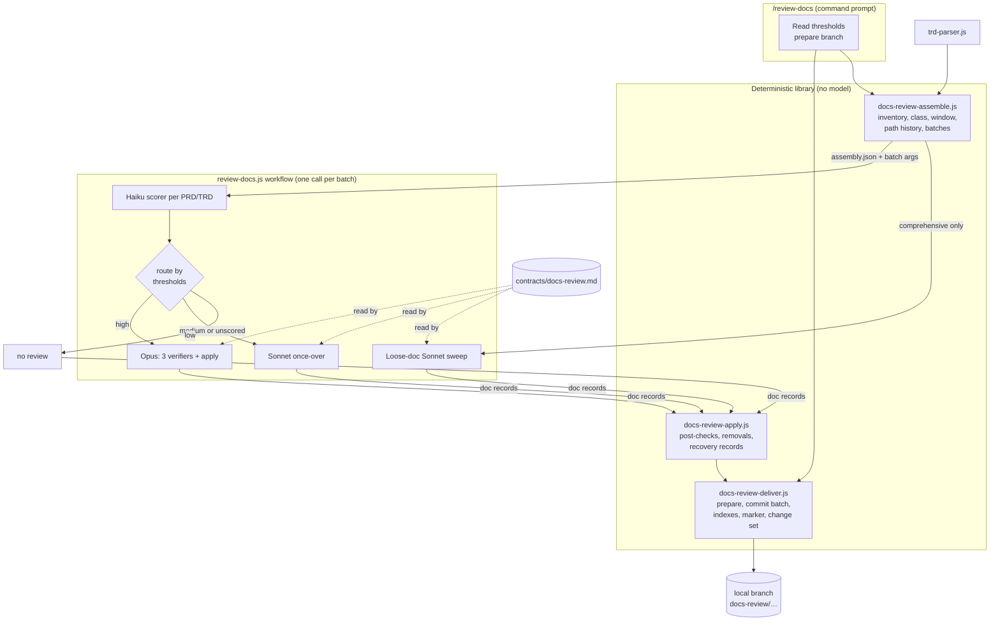
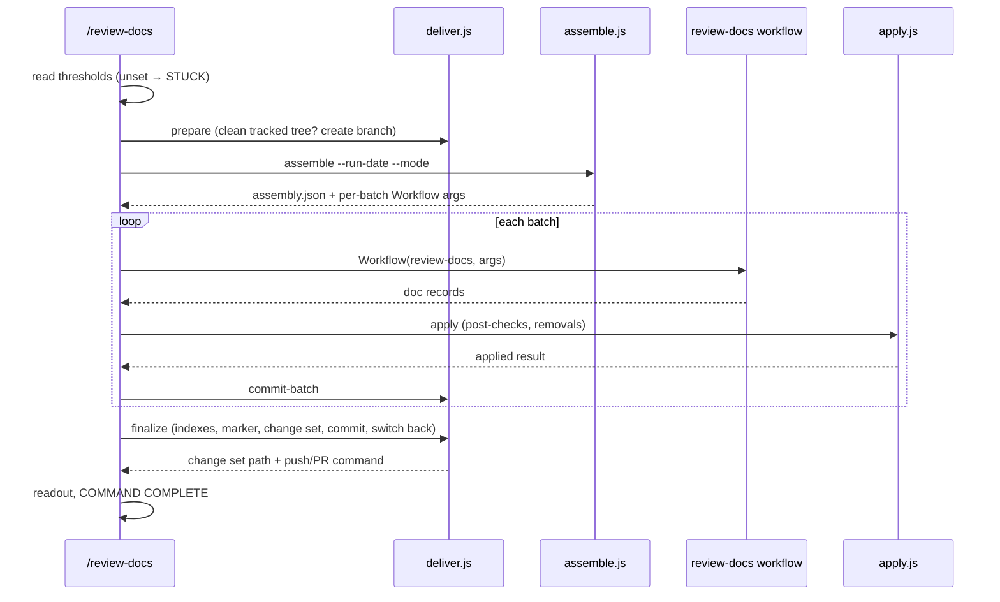

# TRD: Docs As-Built Review

**Version**: 1.1.0
**Status**: Draft
**Created**: 2026-09-26
**Last Updated**: 2026-09-27
**Author**: @technical-architect
**Source PRD**: `docs/PRD/docs-as-built.md` (v1.2.1; no supersession marker)
**Task ID Prefix**: DABS

---

## Changelog

| Version | Date | Changes | Author |
|---------|------|---------|--------|
| 1.1.0 | 2026-09-27 | Owner rulings on two open questions. OQ-2: default thresholds ship — high ≥ 70, medium ≥ 40, overridable per project (D5). OQ-3: a TRD whose implementation is not finished is skipped, not cut (D19). Design only — building this feature is not scheduled | main agent |
| 1.0.0 | 2026-09-26 | Initial TRD from PRD 1.2.1. Replaces an earlier, unaudited and never-committed draft at this path; the decisions it held are either inherited or departed from explicitly in §1.2 (see D6, D8, D14) | @technical-architect |

---

## 1. Overview

### 1.1 Technical Summary

A new command, `/review-docs [--comprehensive]`, leaves every passage it reviews under `docs/`
true of the code or gone. It is built from three layers:

1. **A deterministic library** (Node, no model call) that inventories and classifies `docs/`,
   computes the commit window from a committed last-run marker, precomputes the git history of
   every missing path a doc names, splits the work into batches, and — after the model work —
   post-checks the edits, applies removals behind a whole-repository reference check, writes the
   PRD and TRD indexes, the marker and the change set, and commits it all to a local branch.
2. **One workflow script** (`review-docs.js`), dispatched once per batch, that scores each PRD
   and TRD with Haiku, routes it by two owner-set thresholds to an Opus review, a Sonnet
   once-over or nothing, and runs the class procedure (PRD / TRD / loose doc).
3. **A contract file** (`docs-review.md`) that every reviewing agent reads: the correct-or-cut
   rule, the three class procedures, the code-map format and the no-banner rule.

The run works in the checked-out tree on a new local branch, never pushes, and asks nothing
mid-run. Nothing here reuses the `/audit-prd` or `/audit-trd` verifiers; D8 says why.

### 1.2 Key Technical Decisions

| ID | Decision | Choice | Serves Objective | Rationale | Alternatives Considered |
|----|----------|--------|------------------|-----------|------------------------|
| D1 | Split between code and model | The command runs the library for everything deterministic, then makes one `Workflow(review-docs)` call per batch, then runs the library again. No model call happens before assembly finishes | NFR-1, AC-F1.5, AC-F3.2 | Workflow scripts have no filesystem or shell access (`packages/core/workflows/test-harness.js` header; `implement-phase.js` "opens no file and runs no shell"), so assembly cannot live in the workflow; `/implement-trd` already uses this shape with `task-graph.js` | All in one agent: violates NFR-1. Revisit never — NFR-1 is the owner's own words |
| D2 | Where the deterministic code lives | Three modules in `packages/core/lib/` with their own CLI entry points — `docs-review-assemble.js`, `docs-review-apply.js`, `docs-review-deliver.js` — each symlinked into `packages/full/lib/` so scaffolding delivers them | NFR-2 | `packages/core/lib/functional-verification.js` is the precedent for a lib module with a CLI; `packages/full/lib/*.js` symlinks are what `copy_libs` in `scaffold-project.sh` ships. Three modules because they have three different inputs (the tree before, a workflow result, the finished branch) and can be built in parallel | One module: forces every lib task to serialize on one file. `packages/core/scripts/`: not copied into `.claude/lib/`. Revisit if the modules turn out to share enough code that a fourth "common" module is needed |
| D3 | How a file is classed | Folder proposes: `docs/PRD/**` → PRD, `docs/TRD/**` → TRD, anything else → loose. Structure confirms: TRD iff a heading contains "Master Task List"; PRD iff a heading contains "Feature Requirements" or "Acceptance Criteria" and none contains "Master Task List". Disagreement → loose doc, reported | AC-F1.2, R6 | Measured on this repo (grep over `docs/PRD/*.md`, `docs/TRD/**/*.md`, 2026-09-26): 10 of 15 PRD-folder files confirm, 18 of 20 TRD-folder files confirm; every disagreement is a brief, a feedback file or a `.source.md` — the PRD's own fixture case | `trd-parser.js` task count: misclasses TRDs whose task list is not a table. A model classifier: violates NFR-1. Revisit when R2's sampling of other repos shows different heading conventions |
| D4 | Where the last-run marker lives and when it advances | A committed file, `.trd-state/_docs-review/last-run.json`, holding the HEAD commit the run reviewed. It is written **only on the review branch**, so it advances when the owner merges that branch and not before. A discarded branch leaves the old marker, so the next run re-covers the same commits. A marker whose commit is not an ancestor of HEAD is treated as absent, with the reason reported | AC-F2.5, R9, AC-F1.3 | Must survive a clean checkout (AC-F2.5), so it must be in git; tying it to the branch closes R9 by construction rather than by a rule. `.trd-state/` is git-tracked by design (`.gitignore` lines 7–13); the `_` prefix follows `_command-runs`/`_dispatch.jsonl` and cannot collide with a feature folder. **Departs from the earlier draft**, which named `.trd-state/docs-as-built/` (this feature's own implementation-state folder) and said loop state was not committed | A git note: not fetched by default into a clean clone. A tag: advances whether or not the owner merges. Marker committed straight to the checked-out branch: advances before review — exactly R9. Revisit if owners squash-merge in a way that drops the marker file |
| D5 | Scoring and routing | One Haiku agent per PRD/TRD returns an integer 0–100 against worded anchors, plus a one-line reason. Thresholds come from `.claude/settings.json` → `ensemble.docsReview.thresholds.high` / `.medium`. Score ≥ high → Opus; ≥ medium → Sonnet; else none. **Defaults ship: high = 70, medium = 40** (owner ruling 2026-09-27, OQ-2); a project overrides either in settings. A value that is set but invalid (non-integer, outside 0–100, `medium > high`) stops the command before any model call (COMMAND STUCK naming the setting). A scorer that returns nothing routes the doc to Sonnet — an unscored doc is never skipped. A light run whose window holds zero commits scores nothing and reviews nothing | AC-F2.1, AC-F2.2, AC-F2.3, G1, G2 | The PRD states no values (AC-F2.3); the owner supplied the defaults on 2026-09-27 (OQ-2), so they are sourced, not invented. 0–100 gives the owner room to tune; `ensemble.*` in settings follows `ensemble.publishArtifacts`. The null-score route follows G1: skipping an unreviewed doc is the failure that leaves a false passage in the tree | 1–5 scale: too coarse to tune two thresholds. Categorical high/medium/low output: leaves nothing to tune, contradicting AC-F2.3. Deterministic path-overlap depth: superseded by the owner's answer 3 (PRD §8). Revisit when R8's comparison shows where Haiku misjudges |
| D6 | What the scorer sees | Light run: the whole window (`marker..HEAD`: sha, subject, changed paths), read by the agent from the assembly file. Comprehensive run: a per-doc window, `<doc's last commit>..HEAD`, since the PRD's default gives the comprehensive run no marker window but still wants an Opus/Sonnet split. The doc's code map (if any) is an optional input. No truncation: an agent that fails on size returns nothing and D5 routes the doc to Sonnet | AC-F2.1, AC-F1.3, AC-F3.3 | AC-F2.1 requires scoring to work with or without a map. A per-doc window gives the comprehensive scorer something real to judge. Not truncating avoids a silent cap; the failure mode is a costlier review, not a skipped one | Pass the window inline in workflow args: the command would have to transcribe a large JSON blob by hand. Revisit if scorer failures on size appear in change sets |
| D7 | What each depth does | **Opus** (the "full audit"): three read-only Opus verifiers in parallel, then one Opus apply agent that is the doc's only writer. PRD verifiers: `requirements`, `sections`, `paths`. TRD verifiers: `tasks` (each task and the Status field), `sections`, `paths`. **Sonnet**: one agent reads the doc, checks it against the code and applies the contract itself. **None**: recorded, untouched | AC-F2.2, AC-F4.1, AC-F5.1, AC-F7.1 | Mirrors the shape of an audit (independent verifiers, then one reconcile) so "full audit" means independent checking, not a longer single pass. A fixed three verifiers per doc bounds the agent count (D16). One writer per doc means no lost updates | One verifier per section: unbounded agent count against the platform's 1000-agents-per-workflow cap. Running the existing `/audit-prd`/`/audit-trd` workflows: see D8. Revisit per OQ-4 |
| D8 | Reuse of `/audit-prd` and `/audit-trd` | **Not reused.** Reused instead: `trd-parser.js` (`parseTrd`: tasks and per-task `Touches`) for TRD structure and map seeding, and the audits' "absence claims must exhibit the search" rule, restated in the contract | AC-F4.4, AC-F5.3 | Those verifiers ask a pre-build question. `audit-prd.js`'s `grounding` verifier treats `already-exists` as a defect and has no "not built" outcome; `audit-trd.js`'s code-reading verifier (`design-audit`) checks *buildability* of decisions. Both run `source-fidelity`/`omission` against a source document and a reconcile that writes a proceed/do-not-proceed verdict. None of that is the as-built question, and adding an as-built mode would put two opposite questions behind a switch in two files of 488 and 575 lines. **Departs from the earlier draft**, which planned to reuse them | Call the audit workflows per doc (with a model override); add an `as-built` mode to both. Revisit if the owner confirms "full audit with opus" meant the existing `/audit-prd`/`/audit-trd` runs (OQ-4) |
| D9 | Where the procedures live | `packages/core/contracts/docs-review.md`, read by every reviewing agent; workflow prompts name its sections. It carries: the correct-or-cut rule, the PRD/TRD/loose-doc procedures, the code-map format, the no-banner rule, the cross-repo rule, and "agents never delete files or run git write commands" | G3, AC-F7.1, AC-F7.2, AC-F7.6, AC-F8.1 | Same pattern as `trd-authoring.md`/`prd-authoring.md`; one copy of the rules for three tiers and three classes. `packages/full/contracts` is a symlink to `packages/core/contracts`, so it ships with no scaffold change | Inline in the workflow's prompt strings: duplicated per tier, unreadable from the command. Revisit never |
| D10 | Removals | Agents only **propose** a removal, with a reason. `docs-review-apply.js` then: drops anything not git-tracked (reported); runs a whole-repository reference check (`git grep -F` for the repo-relative path and for the basename, excluding the generated indexes and run records); iterates to a fixed point so a file referenced only by other removal candidates can still go; writes a recovery record (path, last commit that contained it, reason); runs `git rm`. A candidate with any hit stays, and the hits are listed | AC-F7.3, AC-F7.4, AC-F7.5, AC-F6.2, R1 | E5's CI-only data directory is exactly a file a reading agent would call dead. Basename matching over-blocks (a relative link, a shared name) — the conservative direction, and every block is shown to the owner | Let agents delete: nothing deterministic would stand between a model judgement and R1. Path-only matching: misses relative links. Revisit if blocked removals turn out to be mostly false hits |
| D11 | Missing-path history (AC-F7.7) | Precomputed by `docs-review-assemble.js`: extract path-shaped tokens from each doc; for each that does not exist at HEAD, record whether it ever existed (and its last commit) or never did. Verifiers receive the table | AC-F7.7, AC-F12.1 | Deterministic and unit-testable, where an agent's own `git log` would be neither. "Never existed here" is also the signal F12 needs (a path from another repo) | Agents run their own history checks: not testable, repeated per verifier. Revisit never |
| D12 | Post-checks on each batch's edits | `docs-review-apply.js` inspects the diff of every edited doc. An added line that marks content superseded/archived/deprecated (banner, header or note) → that doc's edits are reverted and the doc is reported. A code map that is missing on a reviewed PRD/TRD, or that carries line references → reported | AC-F7.6, AC-F8.1, NG3, NG11 | NG3 is a hard rule and a banner is precisely the owner's rejected fix, so the whole doc reverts rather than shipping one. A map defect is cheap for the owner to see and fix, so it is reported, not reverted | Prompt-only enforcement: unverifiable. Revisit if reverts are frequent enough to warrant a corrective re-dispatch |
| D13 | Code-map format | A section `## Where this lives in the code`, bullets each starting with a backticked directory, module or symbol, then a short gloss; no line numbers. TRD maps are seeded from the union of the TRD's `Touches` blocks (via `parseTrd`) and then checked against the code like any other claim | AC-F8.1, AC-F8.2, AC-F9.2 | A fixed format makes the index (D14) derivable without a model, and `Touches` is the existing source the PRD names | Free-form prose: the index would need a model. Revisit never |
| D14 | Index location and content | `docs/PRD/INDEX.md` and `docs/TRD/INDEX.md`, regenerated every run by `docs-review-deliver.js`. Each entry: the doc's path and the directories its map lists, reduced to at most two leading segments and de-duplicated; "no map yet" when absent. F1 classes the two files as loose docs with a `generated` flag: excluded from disagreement reports, the loose-doc sweep and the reference check | AC-F9.1, AC-F9.2, G4 | Co-located with the docs an agent is already searching. Two-segment reduction because one segment (`packages`) says nothing in a monorepo | `.trd-state/` (agents searching `docs/` would not find it); docs root. Revisit if agents are observed not finding them |
| D15 | Where the run writes | **In place**, on a new local branch `docs-review/<YYYY-MM-DD>-<short-sha>` cut from HEAD. Precondition: no uncommitted changes to tracked files (`git status --porcelain --untracked-files=no` empty), else COMMAND STUCK. One commit per batch, then a final commit (indexes, marker, change set). Before switching back: tracked edits outside the reviewed docs are reverted (the tree was clean at start, so they can only be the run's), untracked files that appeared during the run are reported, never deleted. Then switch back to the original branch and print the push-and-PR command. Never push, open a PR or merge | AC-F11.1, AC-F11.3, NG7, AC-F7.4 | A separate worktree was rejected on a measurement: `audit-trd.js`'s `SCOPE` comment records 6 of 9 findings wrong because verifiers resolved paths against the wrong tree. In place, every agent's relative path is the reviewed tree | A `git worktree`: the path-scoping failure above, plus edits outside the project directory needing permission. Revisit if owners run it interactively in a checkout they are working in (OQ-7) |
| D16 | Batching | Batch key: PRD, TRD, then one batch per top-level folder under `docs/` for loose docs (the `docs/` root is its own batch). Each batch is capped at `floor(1000 / 5) = 200` docs — 1000 being the platform's per-workflow agent cap (workflow-authoring reference) and 5 the most agents one doc can use (scorer + three verifiers + apply) — and split into chunks beyond that. One `Workflow` call and one commit per batch. Applies to every run, so a first run is batched by construction | AC-F3.4 | AC-F3.4 leaves the split key to the TRD; class/folder batches are what an owner reviews as a unit. The cap is derived, not chosen | One branch per batch: N branches to merge, and no single place for the marker. Revisit if the owner wants one PR per batch |
| D17 | The change set | `.trd-state/_docs-review/runs/<run-id>.md`, committed in the final commit and printed in the readout. Per doc: class, score and reason, depth, outcome, sections corrected and cut (one line each), Status corrections. Then: removals with recovery records; removals blocked, with the reference hits; and every surfaced item — class disagreements, unbuilt PRD requirements, untracked/ignored files, cross-repo claims, post-check reverts and map defects, failed agents | AC-F11.2, AC-F2.4, AC-F7.5, AC-F1.2, AC-F4.3, AC-F12.1 | One reviewable file in the branch diff, outside `docs/` so agents searching `docs/` never retrieve it. Published as an artifact per `command-status.md` unless `ensemble.publishArtifacts` is false | Commit messages only: hard to scan. Revisit never |
| D18 | Loose docs | Comprehensive runs only. Every loose doc gets a Sonnet once-over; loose docs are not scored. Prose docs that describe the system get the correct-or-cut procedure and a code map; other prose (reports, logs of past runs) is checked only for claims about the current system. Non-text files are judged keep-or-remove by the Sonnet agent (the Read tool renders images) and removals go through D10 | F6, AC-F6.1, AC-F6.2, AC-F8.1, AC-F3.3 | The PRD gives loose docs no depth rule and scores only PRDs and TRDs (F2). Sonnet is the PRD's own minimum depth for a comprehensive run | Score loose docs too: not asked for. Revisit per OQ-5 |
| D19 | Unbuilt content | A PRD requirement not built stays in the doc and is surfaced (AC-F4.3). **A TRD whose implementation is not finished is skipped entirely** — not reviewed, not cut, not proposed for removal — and listed in the change set as skipped (owner ruling 2026-09-27, OQ-3). "Finished" means a committed `.trd-state/*/implement.json` whose `trd_file` names the TRD and whose tasks are all `success`; no such file, or any task not `success`, counts as unfinished. For a finished TRD, content describing something not built is cut, per F7, and a TRD with nothing valid left is proposed for removal. A TRD `Status` field that disagrees with what was delivered is corrected in place — correcting an existing field, not adding a banner | AC-F4.3, AC-F5.2, AC-F7.1, AC-F7.2 | The PRD carves out unbuilt PRD requirements only; F7 governs everything else | Review unfinished TRDs but never cut: the owner chose skipping (OQ-3). Revisit if TRDs written before `implement.json` existed need review — they count as unfinished today |
| D20 | Cross-repo claims | A claim naming a path that never existed in this repository's history (D11) **and** that the verifier reads as belonging to another repository is reported and left as written; it is not corrected, cut or counted as drift | AC-F12.1 | The history table makes the flag checkable rather than a guess | Treat every never-existed path as cross-repo: would also shield unbuilt claims. Revisit never |
| D21 | State in the path | The review creates no state folders. A doc's state is its presence: under `docs/` means reviewed-true or not yet reviewed; removed means gone, with its recovery record. Existing folders (e.g. this repo's `docs/TRD/completed/`) are reviewed in place; the review never moves a file between folders | AC-F10.1, NG3, NG4 | NG4 rules out archive folders, and the review has no other state a reader needs | A `docs/…/unbuilt/` folder for surfaced PRDs: would re-create an archive folder in all but name. Revisit per OQ-8 |
| D22 | Run working files | `.trd-state/_docs-review/work/<run-id>/` holds the assembly, each batch's workflow result and each apply result. Agents read the assembly from there. Deleted on COMMAND COMPLETE, kept on COMMAND STUCK for diagnosis; added to this repo's `.gitignore`; never staged, because every commit names its paths explicitly | D1, D6 | Keeps workflow args small enough to transcribe; inside the project so agents can read it without extra-directory permission | OS temp dir: agents' reads outside the project may prompt. Revisit never |
| D23 | The command | `/review-docs` runs a light run; `/review-docs --comprehensive` a comprehensive one; with no valid marker the run is comprehensive whatever the flag. Standard banners and four-section readout, `notify-complete.sh`, and a `PushNotification` on the final turn (it is a long-running command). No `AskUserQuestion` except the STUCK cases in D5 and D15 | AC-F3.1, NFR-3, NFR-4, AC-F11.3 | Every command here is discovered and contract-tested by `notify-on-complete.test.sh` | A `--light` flag: light is the default and needs no flag. Revisit never |

### 1.3 Technology Stack

| Layer | Technology | Purpose | Notes |
|-------|------------|---------|-------|
| Deterministic library | Node.js 18+ (CommonJS, `spawnSync` with array args) | Assembly, post-checks, removals, indexes, delivery | `stack.md`; `packages/core/lib/` conventions |
| Model orchestration | Claude Code `Workflow` tool, `agent()` with `model: 'haiku' \| 'sonnet' \| 'opus'` and `schema` | Scoring, review tiers | `model: 'opus'` is unexercised in this repo — Could Not Verify |
| Procedures | Markdown contract | Read by every reviewing agent | `packages/core/contracts/` |
| Version control | Git 2.x | Window, history, reference check, branch, commits | `stack.md` |
| Tests | Jest ^29 (lib, workflow via `test-harness.js`), BATS ^1.9 (end-to-end) | NFR-2, PRD §6 | `stack.md` |

### 1.4 Integration Points

| System | Type | Direction | Notes |
|--------|------|-----------|-------|
| `packages/core/lib/trd-parser.js` (`parseTrd`) | Module call | In | TRD tasks and `Touches` for the TRD procedure and map seeding (D8, D13) |
| `.claude/settings.json` | Config read | In | `ensemble.docsReview.thresholds`, `ensemble.publishArtifacts` |
| `.claude/hooks/notify-complete.sh` | Shell call | Out | Standard completion signal |
| `scaffold-project.sh` `copy_libs` / `copy_workflows` | Distribution | Out | New lib modules need `packages/full/lib/` symlinks; workflows and contracts ship through existing directory symlinks |
| `packages/core/workflows/create-trd.js` corpus phase | None (unchanged) | — | NG10; removed docs no longer need a supersession banner (PRD R5) |

### 1.5 Objectives this TRD answers to

Every objective is the PRD's, cited by its ID, or the constitution's. None is added here.

| ID | Objective (abridged) | Source |
|----|---------------------|--------|
| G1–G6 | Goals: reviewed passages true or cut; effort follows impact; per-class procedures; indexes match the tree; coarse maps; nothing unrecoverable removed | PRD §3.1 |
| AC-F1.1 – AC-F12.1 | All 39 acceptance criteria of F1–F12 | PRD §4 |
| NFR-1 – NFR-4 | Deterministic assembly; deterministic scripts unit-tested; banners and readout; no mid-run confirmation | PRD §5 |
| C-COV | Unit coverage ≥ 60%; integration ≥ 50% when applicable | `constitution.md` Quality Gates |
| C-GATE | No secrets in code; input validation present; documentation updated | `constitution.md` Quality Gates |
| SEC-1 | Paths taken from model output reach git only after validation, as array arguments | domain-derived: the run deletes and commits files named by agents; also CLAUDE.md "Security Considerations" (command injection, path traversal) |

---

## 2. System Architecture

### 2.1 Architecture Overview



### 2.2 Component Architecture

#### 2.2.1 `docs-review-assemble.js`
**Responsibility**: Everything F1 asks for, plus the inputs the model stages need and cannot compute deterministically themselves: marker validation (D4), per-doc windows (D6), missing-path history (D11), TRD parse (D8), batches (D16), threshold read (D5).
**Interfaces**: CLI `assemble`; pure functions exported for tests.
**Dependencies**: `trd-parser.js`, git.

#### 2.2.2 `review-docs.js` (workflow)
**Responsibility**: Score, route, review one batch; return one record per doc. It never re-decides class or depth inputs (AC-F3.2) — class comes from args, depth is a pure function of score, thresholds and mode.
**Interfaces**: `Workflow({ name: "review-docs", args })` → `{ batch, records, dead }`.
**Dependencies**: the assembly file (read by agents), the contract.

#### 2.2.3 `docs-review-apply.js`
**Responsibility**: Validate a batch result against the batch's doc list; post-checks (D12); removals (D10).
**Interfaces**: CLI `apply`.
**Dependencies**: git.

#### 2.2.4 `docs-review-deliver.js`
**Responsibility**: Branch lifecycle (D15), per-batch commits, indexes (D14), marker (D4), change set (D17), push/PR command.
**Interfaces**: CLI `prepare`, `commit-batch`, `finalize`.
**Dependencies**: git; the assembly and apply results.

#### 2.2.5 `docs-review.md` (contract)
**Responsibility**: The rules every reviewing agent applies (D9).

### 2.3 Data Flow



### 2.4 State Management

| State | Where | Committed? | Lifetime |
|-------|-------|-----------|----------|
| Last-run marker | `.trd-state/_docs-review/last-run.json` | Yes, on the review branch only | Advances on merge (D4) |
| Change set | `.trd-state/_docs-review/runs/<run-id>.md` | Yes, final commit | Permanent |
| Indexes | `docs/PRD/INDEX.md`, `docs/TRD/INDEX.md` | Yes, final commit | Regenerated every run |
| Working files | `.trd-state/_docs-review/work/<run-id>/` | Never | Deleted on COMPLETE, kept on STUCK |

---

## 3. Technical Specifications

### 3.1 Assembly (`docs-review-assemble.js`)

**Purpose**: AC-F1.1–F1.5, plus D4, D5 (read), D6, D11, D16.

**Interface**:
```
node .claude/lib/docs-review-assemble.js assemble \
  --repo <dir> --run-date <YYYY-MM-DD> [--comprehensive] --out <work>/assembly.json
```
```javascript
// assembly.json
{
  runId: "2026-09-26-2dd2523",          // <run-date>-<short HEAD sha>
  head: "<sha>", branch: "<checked-out branch>",
  mode: "light" | "comprehensive",
  modeReason: "flag" | "no-marker" | "marker-not-ancestor" | "light",
  marker: { sha: "<sha>" | null, status: "ok" | "absent" | "not-ancestor" },
  thresholds: { high: <int>, medium: <int> },
  window: { from: "<sha>", to: "<sha>", commits: [{ sha, subject, paths: [] }] } | null, // light only
  files: [{
    path, class: "prd" | "trd" | "loose",
    folderClass, structureClass, disagreement: bool, generated: bool,
    git: "tracked" | "untracked" | "ignored", text: bool, lastCommit: "<sha>" | null,
    docWindow: { from, to, commits: [...] } | null,            // comprehensive, PRD/TRD only
    trd: { tasks: [{ id, status, touches: [] }], warnings: [] } | null,
    missingPaths: [{ path, history: "removed" | "never", lastCommit: "<sha>" | null }],
    map: { present: bool, dirs: [] }
  }],
  batches: [{ key: "prd" | "trd" | "loose:<folder>", chunk: <n>, docs: ["<path>"] }],
  workflowArgs: [ /* one object per batch, ready to pass verbatim — see 3.2 */ ]
}
```

**Behavior**:
- AC-F1.1: every file under `docs/` in the working tree, any type, including untracked and ignored ones (`git ls-files` for tracked, `--others --exclude-standard` for untracked, `--others --ignored --exclude-standard` for ignored).
- AC-F1.2: D3's rule; `generated: true` for the two index paths (D14).
- AC-F1.3: light-run commits are `git rev-list <marker>..HEAD` on the checked-out branch.
- AC-F1.4: `git` field per file.
- AC-F1.5: output depends only on the tree, git state, flags and `--run-date`; files, commits and batches are sorted; no clock read, no model call. Tested by running twice and comparing bytes.
- Only tracked PRD/TRD/loose docs enter `batches`; untracked and ignored files are inventoried and reported, not reviewed (OQ-6).
- Loose docs enter `batches` only in a comprehensive run.
- Thresholds: read from `.claude/settings.json`, defaulting to high 70 / medium 40 when absent; a set value that is non-integer, outside 0–100, or `medium > high` → exit 2 with a message naming the setting.
- TRD finish state (D19): each TRD is marked `finished: true|false` from the committed `implement.json` whose `trd_file` names it; unfinished TRDs leave `batches` and are listed as skipped. The command turns that into COMMAND STUCK.

**Error Handling**:
- Not a git repo, or detached HEAD → exit 2 with the reason.
- A TRD that `parseTrd` rejects → `trd: null`, the parser's message recorded as a warning; the doc is still reviewed.

### 3.2 Workflow (`review-docs.js`)

**Purpose**: AC-F2.1–F2.2, AC-F3.2–F3.3, F4, F5, F6, AC-F7.1–F7.2, F8, AC-F12.1.

**Interface**:
```javascript
// args (one batch)
{ runId, mode, repo: "<absolute>", assemblyPath: "<absolute>",
  contractPath: ".claude/contracts/docs-review.md",
  thresholds: { high, medium },
  batch: { key, chunk, docs: [{ path, class, text }] } }

// return
{ batch: { key, chunk },
  records: [DocRecord],
  dead: ["<path>"] }          // docs whose review agent returned nothing

// DocRecord
{ path, class, depth: "opus" | "sonnet" | "none",
  score: <int> | null, scoreReason: "<string>" | null,
  outcome: "unchanged" | "edited" | "remove-proposed" | "kept" | "not-reviewed" | "failed",
  corrections: [{ section, what }], cuts: [{ section, why }],
  unbuilt: [{ id, statement }],                 // PRD only (AC-F4.3)
  statusCorrection: { from, to } | null,        // TRD only (AC-F5.2)
  crossRepo: [{ claim, path }],                 // AC-F12.1
  removeReason: "<string>" | null,
  mapWritten: bool }
```

**Behavior**:
- Phase **Score** (PRD/TRD only; skipped for loose batches and for a light run with an empty window): one `agent(..., { model: 'haiku', effort: 'low', schema })` per doc. The prompt gives the 0–100 anchors, the doc path, and where in the assembly file its window is.
- **Route** (plain JS, no agent): `score === null → 'sonnet'`; `score >= high → 'opus'`; `score >= medium → 'sonnet'`; else `'none'`; in a comprehensive run, `'none'` is raised to `'sonnet'` (PRD F3 table).
- **Review**: `pipeline()` over the batch's docs so no doc waits on another. Opus: three verifiers via `parallel()` (the apply agent needs all three), then the apply agent. Sonnet: one agent. Loose: one Sonnet agent per file; non-text files may only return `kept` or `remove-proposed`.
- Every review prompt: read `contractPath` and the doc's section of the assembly; edit only the one doc named; never delete a file; never run a git write command.
- Log every doc that returns nothing (it goes in `dead`), so no cap or failure is silent.

**Error Handling**:
- Scorer returns nothing → routed to Sonnet (D5).
- A verifier returns nothing → the apply agent is told which one is missing and must leave that verifier's ground unchanged; the record notes it.
- Review agent returns nothing → `outcome: 'failed'`, listed in `dead`; the doc's edits (if any) are reverted by `apply` (3.4).

### 3.3 Contract (`packages/core/contracts/docs-review.md`)

**Sections** (workflow prompts cite these headings):
1. **Correct or cut** — AC-F7.1: per section, content the code shows to be different → rewritten to what the code shows; content describing something that does not exist → removed; valid content → left alone. AC-F7.2: keep what remains however little; report "nothing valid remains" instead of deleting; never move content into another doc (NG2).
2. **No banners** — AC-F7.6/NG3: never add a superseded/archived/deprecated banner, header or note.
3. **Absence must exhibit its search** — restated from the audits' reconcile rule: a "does not exist" verdict carries the literal searches run; an apply agent rejects one that does not, or whose search is too narrow.
4. **Missing paths** — use the assembly's history table before calling a path drift (AC-F7.7).
5. **Other repositories** — D20.
6. **PRD procedure** — AC-F4.1–F4.3: per requirement and acceptance criterion, one of built-as-stated / built-differently (correct it) / not-built (leave it, report it).
7. **TRD procedure** — AC-F5.1–F5.2: tasks (from the assembly's parse), decisions and specifications checked against the code; Status field corrected to match delivery; unbuilt content cut (D19).
8. **Loose-doc procedure** — AC-F6.1–F6.2 and D18.
9. **Where this lives in the code** — D13's format; AC-F8.2: correct the map with the rest.
10. **What you return** — the DocRecord fields, in words.

### 3.4 Apply (`docs-review-apply.js`)

**Purpose**: AC-F7.3–F7.6, AC-F6.2, AC-F8.1 (check), SEC-1.

**Interface**:
```
node .claude/lib/docs-review-apply.js apply --repo <dir> \
  --assembly <work>/assembly.json --result <work>/batch-<key>-<chunk>.json \
  --out <work>/applied-<key>-<chunk>.json
```
```javascript
{ edited: ["<path>"],                              // survives post-checks; to be committed
  removed: [{ path, lastCommit, reason }],        // recovery records (AC-F7.5)
  blocked: [{ path, reason, hits: ["<file>:<text>"] }],
  reverted: [{ path, why: "banner" | "agent-failed" | "outside-batch" }],
  mapDefects: [{ path, why: "missing" | "line-reference" }],
  notTracked: ["<path>"] }
```

**Behavior**:
- Validate: every record path is in the batch's doc list and inside `docs/`; anything else is rejected and reported. All git calls use `spawnSync` with array args (SEC-1).
- Changed files in the tree that no record claims → reverted with `git checkout --` (tracked) and listed; untracked newcomers listed only.
- Post-checks (D12) on `git diff` of each edited doc.
- Removals (D10): candidates = `remove-proposed` records; drop untracked/ignored (AC-F7.4); fixed-point reference check; recovery record from `git log -1 --format=%H -- <path>`; `git rm`.

### 3.5 Deliver (`docs-review-deliver.js`)

**Purpose**: AC-F11.1–F11.2, AC-F9.1–F9.2, AC-F2.4–F2.5.

**Interface**:
```
node .claude/lib/docs-review-deliver.js prepare      --repo <dir> --run-id <id> --work <work>
node .claude/lib/docs-review-deliver.js commit-batch --repo <dir> --applied <file> --batch <key>
node .claude/lib/docs-review-deliver.js finalize     --repo <dir> --work <work>
```

**Behavior**:
- `prepare`: tracked tree clean (else exit 2 → STUCK); record the original branch in `<work>/branch.json`; `git switch -c docs-review/<run-id>`.
- `commit-batch`: `git add --` exactly the applied result's edited and removed paths; commit `docs-review(<batch>): <n> corrected, <n> cut, <n> removed`. No commit when nothing changed.
- `finalize`: write both indexes from the tree as it now stands (AC-F9.1); write the marker with the assembly's `head` (AC-F2.5); render the change set (D17); commit those three; revert stray tracked edits; switch back to the original branch; print
  `git push -u origin docs-review/<run-id> && gh pr create --head docs-review/<run-id> --fill`.
  Never runs it.

**Error Handling**: any git failure → exit 2 with the failing command; the command reports COMMAND STUCK with `<work>/branch.json` naming the branch to switch back to.

### 3.6 Command (`packages/core/commands/review-docs.md`)

Steps, in order: parse `--comprehensive`; `prepare`; `assemble` (exit 2 → STUCK); for each entry in `workflowArgs`, one `Workflow({ name: "review-docs", args })`, write its return to the work dir, run `apply`, run `commit-batch`, emit a PHASE banner; `finalize`; publish the change set as an artifact unless `ensemble.publishArtifacts` is false (failure is one line, never fatal); readout (STATE / DECISIONS / ISSUES / NEXT, with NEXT = the printed push command); `PushNotification`; `notify-complete.sh "review-docs" ...`; delete the work dir; COMMAND COMPLETE as the last line.

---

## 4. Master Task List

### 4.1 Task ID Convention

`DABS-[CATEGORY][SEQ]`: B = backend/plugin code, D = documentation, T = testing. Unit tests are part of each implementation task, not separate tasks.

### 4.2 Phase 1: Components

| Task ID | Description | Serves | Skills | Dependencies | Acceptance Criteria |
|---------|-------------|--------|--------|--------------|---------------------|
| DABS-B001 | Build `packages/core/lib/docs-review-assemble.js` per §3.1 (inventory, D3 classification, git status, window, marker validation, per-doc windows, missing-path history, TRD parse via `parseTrd`, map detection, batching, threshold read, per-batch workflow args) with its Jest tests on fixture trees and fixture git repos; add the `packages/full/lib/` symlink | D1, D3, D4, D5, D6, D11, D16, AC-F1.1–F1.5, NFR-1, NFR-2 | `jest` | None | Tests cover: a non-PRD file in `docs/PRD/` reported and classed loose; untracked and ignored files marked; window = commits after the marker; no marker and a non-ancestor marker both give comprehensive with the right reason; a missing path that once existed vs one that never did; batches split at 200; absent thresholds default to 70/40; inverted thresholds exit 2; a TRD with an unfinished or missing `implement.json` is skipped and listed; two runs on the same input produce identical bytes. Coverage ≥ 60% |
| DABS-B002 | Build `packages/core/lib/docs-review-apply.js` per §3.4 (record validation, stray-edit revert, banner and map post-checks, fixed-point reference check, tracked-only removal, recovery records) with Jest tests on fixture git repos; add the `packages/full/lib/` symlink | D10, D12, SEC-1, AC-F7.3–F7.6, AC-F6.2, AC-F8.1 | `jest` | None | Tests cover: a data file referenced only from a CI YAML and a test is not removed and its hits are listed; an untracked candidate is reported, not removed; two candidates referencing only each other are both removed; a recovery record carries path, last commit, reason; an added "SUPERSEDED" line reverts the doc; a map with a `:42` reference is reported; a record path outside the batch or outside `docs/` is rejected. Coverage ≥ 60% |
| DABS-B003 | Build `packages/core/lib/docs-review-deliver.js` per §3.5 (prepare, commit-batch, finalize: indexes, marker, change set, stray-edit revert, switch back, push/PR command) with Jest tests on fixture git repos; add the `packages/full/lib/` symlink | D4, D14, D15, D17, AC-F9.1–F9.2, AC-F11.1–F11.2, AC-F2.4–F2.5 | `jest` | None | Tests cover: a dirty tracked tree exits 2 and changes nothing; the branch is created from HEAD and the original branch is restored; each index lists exactly the PRDs/TRDs in the tree with two-segment map dirs or "no map yet"; the marker holds the reviewed HEAD and exists only on the review branch; the change set lists score and depth for every doc; nothing is pushed (`git ls-remote` on a fixture remote unchanged). Coverage ≥ 60% |
| DABS-B004 | Build `packages/core/workflows/review-docs.js` per §3.2 (Score, Route, Review with the Opus three-verifier + apply shape, Sonnet once-over and loose sweep; schemas; `dead` list) with `review-docs.test.js` on `test-harness.js` | D5, D7, D18, AC-F2.1–F2.2, AC-F3.2–F3.3 | `jest` | None | Harness tests: routing by score for high/medium/low and at each threshold boundary; a null score routes to Sonnet; comprehensive raises none to Sonnet; an empty light window dispatches no agent; Opus docs get exactly three verifiers then one apply agent on `opus`; loose batches dispatch no scorer; a dead review agent appears in `dead`. No agent receives a doc outside its batch |
| DABS-B005 | Write `packages/core/contracts/docs-review.md` with the ten sections in §3.3 | D9, D13, D19, D20, D21, G3, AC-F4.1–F4.3, AC-F5.1–F5.2, AC-F6.1–F6.2, AC-F7.1–F7.2, AC-F7.6–F7.7, AC-F8.1–F8.2, AC-F12.1 | | None | Every section heading in §3.3 exists verbatim (the workflow cites them); each rule names the AC it implements; `lint-command-structure.js` passes on it |

### 4.3 Phase 2: Command, seam test, documentation

| Task ID | Description | Serves | Skills | Dependencies | Acceptance Criteria |
|---------|-------------|--------|--------|--------------|---------------------|
| DABS-B006 | Write `packages/core/commands/review-docs.md` per §3.6, its dogfood mirror `.claude/commands/review-docs.md`, and dogfood copies of the three lib modules, the workflow and the contract under `.claude/`; add `.trd-state/_docs-review/work/` to `.gitignore` | D23, D22, D15, AC-F3.1, AC-F11.3, NFR-3, NFR-4 | | DABS-B001, DABS-B002, DABS-B003, DABS-B004, DABS-B005 | `notify-on-complete.test.sh` passes (the command is discovered, calls `notify-complete.sh "review-docs"`, its mirror matches); the command contains no `AskUserQuestion`; its only early exits are the COMMAND STUCK cases in D5 and D15; `lint-command-structure.js` passes |
| DABS-T001 | Seam test `packages/core/workflows/review-docs.seam.test.js`: run the workflow through `test-harness.js` with stubbed agents, feed its return into `docs-review-apply.js` and `docs-review-deliver.js` against a fixture git repo, and assert the change set and commits | AC-F3.2, AC-F11.2 | `jest` | DABS-B002, DABS-B003, DABS-B004 | The workflow's record shape is accepted by apply without adaptation; a stubbed remove proposal ends as a recovery record in the change set; a stubbed edit ends in a batch commit |
| DABS-D001 | Add `/review-docs` to the command reference and workflow overview in `packages/core/templates/process.md.template` and `.claude/rules/process.md`, including the `ensemble.docsReview.thresholds` setting and its defaults (high 70, medium 40) | C-GATE | | DABS-B006 | Both files describe the same flags and setting; the two files stay in sync |

### 4.4 Phase 3: End-to-end

| Task ID | Description | Serves | Skills | Dependencies | Acceptance Criteria |
|---------|-------------|--------|--------|--------------|---------------------|
| DABS-T002 | [LIVE] `test/integration/tests/review-docs.test.sh`: build a fixture repo (PRD with one requirement built differently and one not built; TRD with a wrong Status and an unbuilt task; a part-stale doc where one valid section must survive; a data file read only by a CI config and a test; an untracked doc; a doc citing another repo's path; a non-PRD file in `docs/PRD/`; a runbook naming a deleted component), scaffold it, set thresholds, run `/review-docs --comprehensive` headless via `run-headless.sh`, then a light run with the first branch left unmerged, then a light run in a fresh clone after merging | G1–G6, PRD §6, R9 | | DABS-B006, DABS-T001 | Asserted deterministically on the result: local branch exists and is absent from the fixture remote; no added banner lines; the valid section survives alone; the CI-read file is present and listed as blocked; the untracked doc is untouched and reported; recovery records exist for every removal; indexes match the tree; the marker is on the branch only; the second run re-covers the first run's window; the fresh-clone run sees the merged marker; the cross-repo path is unchanged and reported; the session log shows no `AskUserQuestion` |

---

## 5. Execution Plan

### 5.1 Phase Overview

| Phase | Focus | Prerequisites | Parallelizable Sessions |
|-------|-------|---------------|------------------------|
| 1 | Five independent components, each with its own unit tests | None | 1A, 1B, 1C, 1D all in parallel |
| 2 | Command that wires them; seam test; process docs | Phase 1 | 2A and 2B in parallel; 2C after 2A |
| 3 | `[LIVE]` end-to-end on a fixture repo | Phase 2 | — |

### 5.2 Session Details

**Session 1A — Assembly**: DABS-B001, @backend-implementer. Parallel with 1B–1D.
**Session 1B — Apply**: DABS-B002, @backend-implementer.
**Session 1C — Deliver**: DABS-B003, @backend-implementer.
**Session 1D — Workflow and contract**: DABS-B004, DABS-B005, @agent-implementer (different files; run in parallel within the session).
**Session 2A — Command**: DABS-B006, @agent-implementer. Blocked by all of Phase 1.
**Session 2B — Seam test**: DABS-T001, @verify-app. Blocked by B002, B003, B004 only.
**Session 2C — Docs**: DABS-D001, @agent-implementer. Blocked by 2A.
**Session 3A — End-to-end**: DABS-T002, @verify-app. Blocked by 2A, 2B.

### 5.3 Parallelization Map

```mermaid
gantt
    title Execution Plan (dependency order only, no time scale)
    dateFormat X
    axisFormat %s
    section Phase 1
    B001 assemble : b1, 0, 1
    B002 apply    : b2, 0, 1
    B003 deliver  : b3, 0, 1
    B004 workflow : b4, 0, 1
    B005 contract : b5, 0, 1
    section Phase 2
    B006 command  : b6, after b1 b2 b3 b4 b5, 1
    T001 seam     : t1, after b2 b3 b4, 1
    D001 docs     : d1, after b6, 1
    section Phase 3
    T002 e2e LIVE : t2, after b6 t1, 1
```



### 5.4 Critical Path

DABS-B001 (or whichever Phase 1 task finishes last) → DABS-B006 → DABS-T002. Depth three: the command cannot be written until the interfaces it calls exist, and the end-to-end run needs the command.

---

## Task Grounding

### DABS-B001
- **Touches:** `packages/core/lib/docs-review-assemble.js` (new); `packages/core/lib/docs-review-assemble.test.js` (new); `packages/full/lib/docs-review-assemble.js` (new symlink, matching every other entry in that directory)
- **Reuse:**
  - `parseTrd()` from `packages/core/lib/trd-parser.js` [read: `module.exports` at trd-parser.js:896-905] for TRD task/decision/grounding extraction — do not write a second TRD-table parser.
  - `findSection()`, `normalizeLineEndings()`, `maskFencedLines()` and `headingContains()`, all exported from trd-parser.js [read: trd-parser.js:896-905 for the export list; :110-112 for `headingContains`'s body]. D3's structural classifier ("TRD iff a heading contains 'Master Task List'; PRD iff a heading contains 'Feature Requirements' or 'Acceptance Criteria'") is exactly what `findSection(lines, phrase)` already does — reuse it (`findSection(normalizeLineEndings(text).split('\n'), 'Master Task List')` truthy/falsy) instead of writing a second heading scanner. Use the masked-lines convention (`maskFencedLines`) the same way `parseTrd` does, so a heading-shaped line inside a fenced code block in a loose doc doesn't falsely confirm structure.
  - No git-wrapper of any kind exists yet in `packages/core/lib/` — confirmed by grepping every non-test `.js` file there for `spawnSync`/`execSync`/`require('child_process')` [ran: zero hits outside test files]. `docs-review-assemble.js` is the first module in this directory to shell out to git; there is nothing here to reuse for that half of the work, and CLAUDE.md's `spawnSync` array-argument convention applies fresh.
- **Replaces:** none. Grepped the whole repo (excluding stale `.claude/worktrees/` copies) for `docs-review`/`docs-review-assemble` and found no prior implementation of any kind [ran]. This is genuinely greenfield.
- **Follow:** `functional-verification.js`'s shape [read: functional-verification.js:1-20, 364-463] — pure, individually-exported functions, a `module.exports`, and a `require.main === module` CLI block at the bottom with a `--file`/`-`/inline-JSON payload convention. `trd-parser.js`'s manual smoke-check CLI entry (`node packages/core/lib/trd-parser.js <file.md>`, trd-parser.js:907+) is the other precedent for a lib module's CLI surface. Also follow `scaffold-project.sh`'s existing `copy_libs()` behavior [read: scaffold-project.sh:290-327] — it globs `$PLUGIN_DIR/lib/*.js`, skips `*.test.js`, and needs no code change for a new module; only the file and its `packages/full/lib/` symlink need to exist (confirmed the pattern with `ls -la packages/full/lib` [ran] — twelve existing `.js` entries there are all one-line symlinks to `../../core/lib/<name>.js`).
- **Careful:**
  - See finding (buildability, DABS-B001): the documented `trd: { tasks: [{ id, status, touches: [] }], warnings: [] }` shape in §3.1 cannot be populated directly from `parseTrd()`'s task objects — neither `status` nor `touches` is a field on them (see the findings list for the full citation). This task has to add its own document-level `**Status**:` line parse and join `tasks` against the separate `grounding` map for `touches`.
  - The per-doc `git: "tracked"|"untracked"|"ignored"` classification this task computes (AC-F1.4) is what DABS-B002's removal safety check (AC-F7.4, "drop untracked/ignored") is specified to consume — do not let that classification logic drift out of sync with what `docs-review-apply.js` expects to read from the assembly file.
  - The exact JSON key names and `--out <work>/assembly.json` path convention this task defines are read directly by DABS-B002, DABS-B003, and the `review-docs.js` workflow (DABS-B004) — this is the one schema all three others build against; changing a key name here is a four-task break, not a local one.

### DABS-B002
- **Touches:** `packages/core/lib/docs-review-apply.js` (new); `packages/core/lib/docs-review-apply.test.js` (new); `packages/full/lib/docs-review-apply.js` (new symlink)
- **Reuse:** the assembly file's already-computed per-doc `git` classification and path list (DABS-B001, AC-F1.4) instead of re-running `git ls-files`/`git status --porcelain` a second time — that duplication is exactly what D2's three-module split is meant to avoid (each module has a distinct input; re-deriving assembly's own output inside apply.js reintroduces the coupling D2 argues against).
- **Replaces:** none — greenfield; no prior apply/removal logic exists anywhere in the repo [ran, same grep as DABS-B001's Replaces].
- **Follow:** `functional-verification.js`'s pure-function/CLI split [read, as above]. CLAUDE.md's `spawnSync` array-argument convention (no existing git-wrapper precedent to follow instead — see DABS-B001's Reuse note); whatever helper this task writes for shelling out to git should be the one DABS-B003 also follows, since both tasks invoke git constantly and a second, differently-shaped wrapper in the sibling module would be the kind of duplication D2 is trying to prevent.
- **Careful:**
  - See finding (buildability, DABS-B003, and its mirror from this side): this task's own spec has it run `git rm` on every removal candidate (§3.4, "...; `git rm`."), and DABS-B003's `commit-batch` spec then re-`git add`s that same path — a sequence I confirmed fails with exit 128 in a real repo [ran]. Whichever of these two tasks lands its implementation should make sure the other one doesn't also try to stage an already-`git rm`'d path.
  - See finding (buildability, DABS-B002, medium confidence): the reference check's exclusion of "generated indexes and run records" (D10) is only half-derivable from this task's documented inputs — the run-record path has to be hardcoded to the `.trd-state/_docs-review/` prefix rather than read from anywhere, since nothing in §3.4's interface carries it.
  - The `DocRecord`/`removed`/`blocked`/`reverted`/`mapDefects` shape this task validates against is produced by DABS-B004 (the workflow) and is also what DABS-T001's seam test constructs by hand to exercise this module — this task's record-validation logic is the enforced contract the other two conform to, not something to loosen unilaterally later.

### DABS-B003
- **Touches:** `packages/core/lib/docs-review-deliver.js` (new); `packages/core/lib/docs-review-deliver.test.js` (new); `packages/full/lib/docs-review-deliver.js` (new symlink)
- **Reuse:** none beyond the git/CLI conventions DABS-B002 establishes (see DABS-B002's Follow) — `prepare`'s clean-tracked-tree check (`git status --porcelain --untracked-files=no`) and DABS-B002's own tree-state handling are close enough in shape that the two should share one small git-porcelain-parsing convention rather than each hand-rolling it, if the two land close together.
- **Replaces:** none — greenfield. `implement-state.js`/`implement.json` is the closest existing analog for durable JSON state under `.trd-state/` [read: packages/core/lib/implement-state.js], but it is fully committed rather than transient working state, so it is a loose precedent for shape, not something this task's `<work>/branch.json`/marker/change-set files replace or extend.
- **Follow:** `functional-verification.js`'s pure-function/CLI split [read, as above].
- **Careful:**
  - See finding (buildability, DABS-B003, high confidence): `commit-batch`'s spec text — "`git add --` exactly the applied result's edited and removed paths" — is unbuildable as written whenever `removed` is non-empty, because DABS-B002's `apply.js` already ran `git rm` on those exact paths. Verified empirically in a throwaway repo: `git rm <path>` then `git add -- <path>` (also tried `git add -A -- <path>`) both fail, exit 128, `fatal: pathspec '<path>' did not match any files` [ran]. `commit-batch` must stage only the `edited` list; the `removed` list needs no `git add` call at all.
  - `finalize`'s index-writing (D14, AC-F9.1) must read each doc's code map from the tree "as it now stands" — i.e., after the model's edits — not from DABS-B001's assembly file, which was computed BEFORE review and holds the pre-edit `map.dirs`. Reusing the assembly's map data here would write indexes describing the state the run just corrected away from.
  - The push/PR command this task prints names the branch `prepare` created (`docs-review/<run-id>`); the `run-id` format (`<run-date>-<short-sha>`) is minted once by DABS-B001's `assemble` step and must be threaded through unchanged, not re-derived or reformatted here.

### DABS-B004
- **Touches:** `packages/core/workflows/review-docs.js`, `packages/core/workflows/review-docs.test.js`
- **Reuse:**
  - `packages/core/workflows/test-harness.js`'s `readScript` / `runWorkflow` / `makeAgentStub` / `makeParallelStub` [read: `test-harness.js`, `module.exports` at file end] — this is the only harness in the repo for testing a `Workflow` script; do not build a second one.
  - The parallel-verifiers-then-one-apply-agent dispatch shape, including its dead-agent accounting (`waves.filter(Boolean)`, `deadKeys`), already built in `audit-trd.js` [read: `audit-trd.js:123-132` `dispatchVerifier`, `:349-360` `alive`/`deadKeys`/`dead` accounting] — the Opus tier here is explicitly modelled on an audit's shape (TRD D7), so the dispatch-and-count-survivors code shape should match, not be reinvented.
  - `implement-phase.js`'s pattern of `parallel()` over **per-item thunks**, each thunk internally sequencing that item's own (possibly multi-stage) work via ordinary `await` [read: `implement-phase.js:12-17` header comment] — this is the mechanism the Review stage actually needs (see Careful, below).
- **Replaces:** nothing — greenfield file, no prior `/review-docs` workflow exists.
- **Follow:**
  - `audit-trd.js`'s verifier-array-plus-`dispatchVerifier`-helper style (`INDEX_FREE_VERIFIERS`/`INDEX_BOUND_VERIFIERS` arrays of `{key, effort, prompt}` reduced through one dispatch function) [read: `audit-trd.js:87-167`] for the Opus three-verifier shape.
  - `audit-trd.test.js`'s harness-test style: `readScript` once at module scope, a `plan(overrides)` function keyed by `opts.label`, assertions on `agent.calls` / `parallel.waves` rather than on internal state [read: `audit-trd.test.js:1-90`] — this is the established shape for `review-docs.test.js`.
- **Careful:**
  - §3.2 as written calls for `pipeline()` over the batch's docs. Per `docs/TRD/completed/implement-trd-rework.md` D7 (settled against the `Workflow` tool's own contract, not inferred from this repo) `pipeline(items, stage1, stage2, …)` runs every item through the **same** ordered stages, which cannot express a batch where docs need 4, 1, or 0 model calls depending on depth. Reported as a buildability finding above; build the Review stage as `parallel()` over per-doc thunks instead, matching `implement-phase.js`.
  - Workflow scripts have no filesystem or Node API access (confirmed in `docs/TRD/completed/implement-trd-rework.md`: "No filesystem or Node.js API access"; `test-harness.js`'s `runWorkflow` injects no `fs`) — `review-docs.js` cannot itself open `assemblyPath` or the contract file. Every dispatched agent must be handed the *path* and read it itself with its own Read tool, which is already how §3.2 is phrased ("the prompt gives ... where in the assembly file its window is"); do not add a `fs.readFileSync` inside the workflow body.
  - `test-harness.js`'s default `pipeline` stub throws with the comment "no script under test uses it" [read: `test-harness.js:91` doc-comment, `:103-106` implementation] — if `pipeline()` is used after all, `review-docs.test.js` must supply its own `opts.pipeline` stub; the harness will not do it for you.
  - `model: 'opus'` is dispatched nowhere else in this repo (`grep "model: '"` across `packages/core/workflows/*.js` finds only `'haiku'`/`'sonnet'`) — this is already the TRD's own Could Not Verify item (TR1); DABS-B004 is the first live use, with TR1's stated contingency (pin to session model) if it is rejected.

### DABS-B005
- **Touches:** `packages/core/contracts/docs-review.md`
- **Reuse:**
  - `packages/core/contracts/trd-authoring.md`'s framing conventions — a leading "why this file is separate from the command" note, a typing/classification table, imperative section headers [read: `trd-authoring.md:1-20`].
  - `packages/core/scripts/lint-command-structure.js`'s four structural checks (frontmatter position, contiguous ordered lists, no orphaned table rows, balanced fences) [read: `lint-command-structure.js:1-24` header comment] — DABS-B005's own acceptance criterion requires this script to pass on the finished file, so the ten sections in §3.3 must be written as the shapes this linter actually checks (a real ordered list for the ten sections, balanced fences around any example).
  - `audit-trd.js`'s "absence claims must exhibit the search" language, which §3.3 item 3 explicitly restates rather than invents [read: `audit-trd.js:368-387`, the `CNV` block].
- **Replaces:** nothing — greenfield contract file.
- **Follow:** the one-committed-contract-file-per-role pattern already established by `prd-authoring.md` / `trd-authoring.md` / `functional-verification.md` (a single file every relevant agent reads instead of the full command, to avoid re-caching the command's orchestration prose every turn) [read: `trd-authoring.md:1-9`, stating the ~10.5k-vs-~5.9k token measurement this pattern is built on].
- **Careful:**
  - The contract's "no banners" rule (§3.3 item 2 / NG3) sits next to `create-trd.js`'s own, unrelated supersession-banner detection in its corpus phase [read: `create-trd.js:98`, "If the PRD carries a supersession marker, resolve..."]. The TRD already rules this out of scope (D9/NG10/R5: create-trd's corpus phase is unchanged) — DABS-B005 must not touch `create-trd.js`, and the contract's no-banner rule governs only what `docs-review` agents may *add*, not what `create-trd` already detects.
  - Section 3 ("absence must exhibit its search") should stay wording-consistent with `audit-trd.js`'s existing `CNV` block rather than being redrafted independently, since it is explicitly described in the TRD as "restated from the audits' reconcile rule."

### DABS-B006
- **Touches:** `packages/core/commands/review-docs.md`, `.claude/commands/review-docs.md` (dogfood mirror), `.claude/workflows/review-docs.js` (dogfood copy of DABS-B004's output), `.claude/contracts/docs-review.md` (dogfood copy of DABS-B005's output), `.claude/lib/docs-review-assemble.js` / `docs-review-apply.js` / `docs-review-deliver.js` (dogfood copies of DABS-B001–B003's output), `.gitignore`
- **Reuse:**
  - The `.claude/hooks/notify-complete.sh "<cmd>" "<complete|stuck>" "<summary>"` invocation, copied verbatim in shape from an existing command [read: `packages/core/commands/audit-trd.md:165`].
  - The `Workflow({ name: "...", args: {...} })` dispatch-line convention [read: `packages/core/commands/audit-trd.md:96`].
  - The "publish the FILE, never render it" `Artifact({ file_path: ..., favicon: ... })` convention [read: `packages/core/commands/create-trd.md:1057`, `verify-build.md:201`].
  - The standard four-section readout / autonomy-block boilerplate already present in every other command file [read: `audit-trd.md:175-210`].
- **Replaces:** nothing — new command, no prior `/review-docs`.
- **Follow:** `audit-trd.md` is the closest sibling shape overall — `disable-model-invocation: true` frontmatter (an expensive, description-matchable command), one `Workflow()` call, `notify-complete.sh` + a final-turn `PushNotification` (per `command-status.md`, this is a long-running command), COMMAND STUCK/COMPLETE banners, and the four-case autonomy allowance block, all copied in shape rather than reinvented [read: `audit-trd.md` throughout].
- **Careful:**
  - `test/integration/tests/notify-on-complete.test.sh` auto-discovers every command by globbing `packages/core/commands/*.md` (`CANON_COMMANDS`) [read: `notify-on-complete.test.sh:44`, `:316-380`] and asserts, per command: it calls `notify-complete.sh`, its `.claude/commands/` mirror is byte-identical, and (Layer 2b/2c) it carries the autonomy block and an artifact-link pointer. `review-docs.md` is picked up by this suite automatically the moment it exists — the dogfood mirror must be an exact copy, not a paraphrase, or the mirror-parity test fails.
  - `.claude/settings.json` today has no `ensemble.docsReview` key at all [read: `.claude/settings.json:153-163` — only `agents_dir`…`version`/`refreshed_at` under `ensemble`]. D5 requires the command to read `ensemble.docsReview.thresholds.high`/`.medium` and exit COMMAND STUCK naming the setting when either is absent. This repo's own first run will hit that STUCK path until the key is added — expected per D5/OQ-2, not a defect, but DABS-B006 must not silently invent a default value.
  - `packages/full/workflows` and `packages/full/contracts` are whole-directory symlinks to `packages/core/{workflows,contracts}` [read: `ls -la packages/full` — `workflows -> ../core/workflows`, `contracts -> ../core/contracts`], so DABS-B004/B005's files reach a freshly scaffolded project automatically. `packages/full/lib/` is **per-file** symlinks instead [read: `ls -la packages/full/lib`] — the three new lib modules (DABS-B001–B003, outside this task's set) each need their own new symlink added there, or `scaffold-project.sh`'s `copy_libs` will not deliver them to a project that isn't this dogfood checkout, even though `/review-docs` works fine here via `cp -L` into `.claude/lib/`. Not DABS-B006's own file to add, but the command is unusable elsewhere without it.
  - The printed hand-off command is `git push -u origin docs-review/<run-id> && gh pr create --head docs-review/<run-id> --fill` (D15/§3.5). The only prior `gh pr create` in a command file uses a different shape (`gh pr create --title "<title>"`, `implement-trd.md:1410`) — there is no existing convention to copy verbatim for this exact invocation; it is new.

### DABS-T001
- **Touches:** `packages/core/workflows/review-docs.seam.test.js` (new file)
- **Reuse:**
  - `packages/core/workflows/test-harness.js`'s `readScript`, `runWorkflow`, `makeAgentStub`, `makeParallelStub` [read] — the established harness for driving a `packages/core/workflows/*.js` prompt-DSL script under Jest with stubbed agents (as `audit-trd.test.js` and `implement-phase.test.js` already do [read: `packages/core/workflows/audit-trd.test.js`, `packages/core/workflows/implement-phase.test.js`]). `review-docs.js` (DABS-B004) is loaded and run the same way; do not write a second harness.
  - The `review-docs.js` return shape as specified in TRD §3.2 — `{ batch: {key, chunk}, records: [DocRecord], dead: [...] }` — is exactly what `docs-review-apply.js`'s `apply --result <file>` (§3.4) expects as its batch-result JSON. Write the harness's `result` straight to a temp file and pass it; this is the "without adaptation" acceptance criterion (DABS-T001's own AC), not something to massage.
  - `docs-review-assemble.js`'s `assembly.json` shape (§3.1) for constructing the fixture `--assembly` input `apply` and `deliver` both need — build the fixture assembly file to that documented shape rather than inventing a different one, since `apply`/`deliver`'s own Jest tests (DABS-B002, DABS-B003) will already be exercising exactly that shape and any divergence here is a second, drifting fixture format.
  - The fixture-git-repo-in-a-tmpdir pattern from `test/integration/tests/scaffold-delivery.test.sh` [read] (`mktemp -d`, `git init -q`, `git config user.email/user.name`, `git commit --allow-empty`) — no existing Jest test in this repo builds a real git fixture repo yet (`packages/core/lib/*.test.js` [read: directory listing] has none that shell out to git), so this task and DABS-B002/B003 are jointly establishing that pattern for Jest; follow the BATS version's shape rather than inventing a third.
- **Replaces:** Nothing existing — greenfield seam test for a greenfield feature.
- **Follow:** The "does a thing one stage produces reach the stage that consumes it" wiring-test style stated explicitly in `audit-trd.test.js`'s own header comment [read] — this seam test is that same house style applied across three modules instead of one workflow.
- **Careful:**
  - `docs-review-apply.js`'s and `docs-review-deliver.js`'s **CLI interfaces live at `packages/core/lib/`** (DABS-B002, DABS-B003) — the `.claude/lib/` dogfood mirror named in §3.4/§3.5's `node .claude/lib/docs-review-apply.js ...` example is created by **DABS-B006**, which this task does not depend on and which the Phase 2 plan (§5.2) runs in parallel with this one (session 2A vs 2B, both gated only on Phase 1). The mirror will not exist when this test runs — invoke the `packages/core/lib/...` source directly (via `require()` of exported functions, or `spawnSync(process.execPath, [path.join(__dirname, '..', 'lib', 'docs-review-apply.js'), 'apply', ...])`), not the `.claude/` path.
  - `docs-review-apply.js`'s `apply` validates every record path is inside the batch's doc list and under `docs/` (§3.4) — the fixture git repo this seam test builds must therefore actually contain `docs/` paths matching whatever doc paths the stubbed workflow return names, or `apply` will reject them as out-of-batch and the seam will falsely appear broken.
  - This task's own acceptance criteria name three scenarios apply/deliver must round-trip untouched: a stubbed remove proposal ending as a recovery record, a stubbed edit ending in a batch commit, and the record shape being accepted "without adaptation" — all three depend on DABS-B002 and DABS-B003 matching §3.4/§3.5 exactly; if either module's actual field names drift from the TRD's documented JSON shapes, this is the test that will (correctly) fail first.

### DABS-D001
- **Touches:** `packages/core/templates/process.md.template`, `.claude/rules/process.md`
- **Reuse:** The existing per-command doc shape already used for every other command in both files — `### /command-name`, then **Purpose**, **Usage**, **Output** (where applicable), **Process** as a numbered list [read: `.claude/rules/process.md` lines 49–199, e.g. the `/create-trd` and `/implement-trd` entries] — write `/review-docs`'s entry in the same shape rather than a new one. Also add it to the ASCII "Workflow Overview" diagram at the top of both files [read: `.claude/rules/process.md` lines 7–47], which is a second place both files currently enumerate every command and would go stale if only the per-command section were updated.
- **Replaces:** Nothing existing.
- **Follow:** The `/implement-trd` and `/plan` entries' **Options** table style [read: `.claude/rules/process.md` "### /implement-trd", Options table with `--phase N`, `--resume`, etc.] is the right model for documenting `--comprehensive`, since `/review-docs` is exactly a default-plus-one-flag command like `/plan`'s `--implement`.
- **Careful:**
  - **No automated check enforces "the two files stay in sync."** Searched for a parity test between `.claude/rules/process.md` and `packages/core/templates/process.md.template` — none exists; the only test touching either file is `packages/core/scripts/scaffold-project.test.sh`'s `RUNTIME-T003` [read], which asserts a *locally-modified* `process.md` survives `--refresh` byte-identical (i.e., that `process.md` is treated as owner-authored and never overwritten) — it says nothing about content parity with the template. The AC "Both files describe the same flags and setting; the two files stay in sync" is verified only by the implementer editing both files in the same task, and by human/audit review after — there is no lint that would catch drift between them.
  - `packages/core/scripts/scaffold-project.sh` [read, lines 1216–1442] treats `process.md` (along with `constitution.md`, `stack.md`) as `AUTHORED_RULES` — generated once at `/init-project` from the template and then **never overwritten by `--refresh`**. This means editing `process.md.template` alone has no effect on any already-scaffolded project (including this one) until a fresh `/init-project` run; both files genuinely need independent, matching edits, which is exactly why this task names both rather than the template alone.
  - Both files currently carry unrelated pending changes on this branch (`git status`: `M .claude/rules/process.md`, `M packages/core/templates/process.md.template`) from other in-flight work — the implementer should diff against the working tree at task time, not assume either file matches the copy quoted in this TRD's grounding pass.
  - The exact setting path is `ensemble.docsReview.thresholds.high` / `.medium` in `.claude/settings.json` (TRD D5) with **no shipped default** — the doc entry must say this explicitly (mirroring how D5/OQ-2 phrase it: the command goes COMMAND STUCK until the owner sets both), not imply a default exists.

### DABS-T002
- **Touches:** `test/integration/tests/review-docs.test.sh` (new file)
- **Reuse:**
  - `test/integration/tests/helpers/setup.sh` [read, full file] — specifically `run_headless_session <prompt> <work_dir> [timeout]`, which already `cd`s into the target work dir before invoking `run-headless.sh` (so the fixture repo becomes the CLI's cwd) and already exposes an overridable timeout (`DEFAULT_TIMEOUT=600` env var, or a third positional arg) — this is the correct call site, not a hand-rolled `run-headless.sh` invocation. Also reuse `cleanup_temp_dir`, `check_file_exists`, `check_file_contains`, `validate_session_id`, `get_session_file` from the same helper rather than re-implementing session-log plumbing.
  - `test/integration/tests/scaffold-delivery.test.sh`'s pattern [read] for building a real git repo in a `mktemp -d` tree (`git init -q`, `git config user.email/user.name`, an initial commit) as the base of the fixture repo, then `bash packages/core/scripts/scaffold-project.sh "$TREE" --plugin-dir "$PLUGIN_DIR"` to scaffold the `.claude/` runtime into it — the same two calls this task needs, already proven to work together.
- **Replaces:** Nothing existing.
- **Follow:** `test/smoke/scenarios/trd-run.sh`'s shape [read] for a real-model, fixture-driven, single-command scenario (assert exit 0, assert the COMMAND COMPLETE/STUCK banner via tail-match, assert specific artifacts on disk, assert a named agent appears in the session log) — this task is the BATS-suite equivalent of that scenario, scoped to `/review-docs`.
- **Careful:**
  - **`test/integration/tests/helpers/setup.sh`'s `setup_from_fixture()` reads from an external sibling checkout, `../../../ensemble-vnext-test-fixtures/fixtures`, which does not exist on this machine** [ran: `find / -maxdepth 4 -iname ensemble-vnext-test-fixtures` — no output]. This task's fixture repo — PRD with a requirement built differently and one not built, a TRD with a wrong Status and an unbuilt task, a part-stale doc, a CI-only-referenced data file, an untracked doc, a cross-repo path claim, a misclassified `docs/PRD/` file, a runbook naming a deleted component — is bespoke to this test and does not belong in that external fixtures repo (per the exclusion-list precedent in `test/integration/tests/plan-command.test.sh` [read], which already treats `ensemble-vnext-test-fixtures/` as "frozen fixture trees for OTHER tests"). Build it inline in `setup_file()` with heredocs and `git add`/`git commit`, the way `scaffold-delivery.test.sh` builds its tree, rather than calling `setup_from_fixture`.
  - **Timeout risk for the comprehensive run.** `run_headless_session`'s default is 600s; `run-headless.sh` called directly defaults to 300s. A comprehensive `/review-docs` run over this fixture's PRD + TRD + loose-doc batches dispatches a Haiku scorer per PRD/TRD plus, per document routed to the high tier, three parallel Opus verifiers and one Opus apply agent (D7) — more model calls than a single `/create-trd` invocation, which this repo's own `CLAUDE.md` "Current Status" section [read] records at a **1,384-second median** for one document. Pass an explicit higher timeout as `run_headless_session`'s third argument; do not rely on the 600s default.
  - The TRD's own R9/D4 risk this task is built to close (the marker must not advance until the branch merges) requires the test to run **three** headless invocations against the **same** fixture directory state in sequence (comprehensive run → light run with the first branch unmerged → light run in a fresh clone after merge) — `run_headless_session` runs one command per call and returns a session id; the test must chain three calls and, for the third, actually `git clone` the fixture's local remote into a second temp dir rather than reusing the first checkout, since "fresh clone" is precisely the scenario R9 is guarding against.
  - Per D15/§3.6, a successful run deletes its own working directory (`.trd-state/_docs-review/work/<run-id>/`) on COMMAND COMPLETE — assertions that need to inspect intermediate per-batch results (e.g., "the CI-read file is present and listed as blocked") must read them from the **change set** (`.trd-state/_docs-review/runs/<run-id>.md`, D17) or the final branch diff, not from the work directory, which will already be gone by the time the BATS test's own assertions run.

### Could Not Verify (from this grounding pass)

| Claim | How I'd check it |
|-------|------------------|
| `git grep -F` searches the full working tree (including a batch's own not-yet-committed edits) rather than only `HEAD`, which D10's reference check depends on | Ran only the `git rm`/`git add` sequence above; did not construct a full fixture repo with an uncommitted edit plus a `git grep -F` call to confirm this directly |
| Whether `git merge-base --is-ancestor <marker> HEAD` (needed for D4's "marker not an ancestor of HEAD" case) behaves as expected on a marker sha from a squash-merged, now-unreachable commit | Not run; would need a fixture repo with a squash-merge history |

---

## 6. Quality Requirements

### 6.1 Testing Requirements

| Type | Coverage Target | Source | Scope |
|------|-----------------|--------|-------|
| Unit Tests | ≥ 60% | `constitution.md` Quality Gates | The three lib modules (Jest); the workflow's routing and dispatch shape (Jest via `test-harness.js`) |
| Integration Tests | ≥ 50% when applicable | `constitution.md` Quality Gates | The seam test (DABS-T001) is Jest and measured. The `[LIVE]` BATS run (DABS-T002) is pass/fail: `stack.md` names no coverage tool for BATS |

`verification_level: unit-only` applies to every task except DABS-T002, which carries `[LIVE]` because only a real run exercises model judgement (PRD §6: "manual run").

### 6.2 Code Quality Standards

- Deterministic modules are unit-tested (NFR-2).
- ESLint for JavaScript, ShellCheck for the BATS test, Prettier for Markdown (`stack.md`).

### 6.3 Security Requirements

- **SEC-1** (domain-derived: the run deletes and commits files named by model output; CLAUDE.md "Security Considerations"): every path from a workflow record is checked to be in the batch's doc list and under `docs/` before any git call; git is invoked through `spawnSync` with array arguments; commits name their paths explicitly.
- Only git-tracked files are removed (AC-F7.4).
- The run never pushes (AC-F11.1), and `autonomy.md` requires separate authorization for a push.
- No secrets in code (`constitution.md`). Scanning docs for secrets is NG9.

### 6.4 Performance Requirements

None. The PRD states no performance, latency or cost requirement (PRD §5), and none is written here.

---

## 7. Risk Assessment

### 7.1 Risks Imported from PRD

| PRD Risk ID | Risk | Technical Mitigation |
|-------------|------|---------------------|
| R1 | A file that looks dead is used by CI or tests | D10: whole-repo reference check including CI config and tests, basename as well as path; blocked removals listed with their hits; owner reviews the branch |
| R2 | Other repos' PRDs/TRDs do not follow the templates | D3 classes them as loose docs and reports each disagreement. Settling it needs the sampling in Could Not Verify |
| R3 | A correction is itself wrong | Opus tier separates verifying from applying (D7); every correction is a diff on an unpushed branch (D15) |
| R4 | A valid section is cut | Absence verdicts must exhibit their search (contract §3); missing paths checked against history first (D11); recovery via git and the change set |
| R5 | `/create-trd`'s corpus phase greps for supersession banners | No change (NG10) |
| R6 | A real PRD/TRD with an unusual shape is classed loose | D3 reports every disagreement in the change set |
| R7 | Stale loose docs survive light runs | By design (F3); comprehensive runs sweep them (D18); how often is NG1 |
| R8 | Haiku rates low a doc the commits made stale | D5's reasons are stored per doc in every change set, so the PRD's settling comparison (score a sample, Opus-audit the same sample) can be run from run records. The comparison itself needs a real repo after delivery and is not a task here |
| R9 | The marker advances while the branch is unmerged | Closed by D4: the marker is written only on the review branch. DABS-T002 runs two light runs with the first branch unmerged |
| R10 | In a scheduled job the branch lives in the job's checkout | Out of scope (NG1); the run prints the push/PR command (AC-F11.1) |

### 7.2 Technical Risks

| ID | Risk | Likelihood | Impact | Mitigation |
|----|------|------------|--------|------------|
| TR1 | `agent({ model: 'opus' })` is not accepted — no workflow in this repo pins Opus today (`grep "model: '"` finds only `haiku`, and `sonnet` via constants) | Low | High | Checked by DABS-B004's first live dispatch in DABS-T002 |
| TR2 | A run dies between `prepare` and `finalize`, leaving the checkout on the review branch with partial commits | Med | Med | `<work>/branch.json` names the original branch and is kept on STUCK; the STUCK banner prints the switch-back command |
| TR3 | Two review agents in one batch edit the same file | Low | Med | Each agent is told to edit only its doc; `apply` reverts changes no record claims (3.4) |

### 7.3 Contingency Plans

**TR1 Contingency**: pin the Opus tier to the session model by omitting `model` on those calls, and record in the change set that depth "opus" ran on the session model.

---

## 8. Non-Goals (Scope Boundaries)

Imported from PRD §3.2. Implementation agents must reject work in these categories.

| PRD ID | Non-Goal | Rationale |
|--------|----------|-----------|
| NG1 | Scheduling: weekly/monthly runs, cron, cloud routines | Owner: "the scheduling is out of scope for this; just creating the skills/workflows to do it" |
| NG2 | Consolidating or merging overlapping docs, or moving surviving content into another doc | Answer 1: overlap is fine; no "find a home" |
| NG3 | Keeping stale docs behind a status or "superseded by" banner, or any in-content signpost | Banners are not retrieved with the chunk (E1) |
| NG4 | An in-tree archive folder (`docs/archive/`, `docs/completed/`, `docs/cancelled/`) | Still searched by `grep` and `git grep` (E1) |
| NG5 | Producing "living docs" | Owner challenge, point 3 |
| NG6 | Preventing drift at authoring time, or `/implement-trd` closing out TRD status on completion | Owner challenge, point 4; status close-out routed to a separate `/plan` |
| NG7 | Fetching from, or reviewing, the remote | Answer 2: review the checkout |
| NG8 | Correcting claims about another repository's code; scanning sibling repos; a cross-repo manifest | Not asked for; such claims are flagged only (F12) |
| NG9 | Scanning docs for secrets or personal data | Not discussed |
| NG10 | Changing how `/create-trd`'s corpus phase detects supersession | Observed, not proposed; see R5 |
| NG11 | Line-number-precise grounding | Owner: line numbers go "instantly stale" |

---

## Open Questions

| ID | Question | What I assumed | Why it matters | If I'm wrong |
|----|----------|----------------|----------------|--------------|
| OQ-1 | (Carried from the PRD.) What should a comprehensive run do? | The PRD's default: no commit window; every PRD/TRD gets at least a Sonnet once-over, Opus where the scorer rates high against a per-doc window (D6); loose docs swept; a first run is comprehensive and batched | The comprehensive column of PRD F3 is a default awaiting the owner | Routing in DABS-B004 and D6's per-doc window change |
| OQ-2 | What are the high and medium thresholds? | **Ruled 2026-09-27 by the owner:** defaults high ≥ 70, medium ≥ 40, overridable per project; revisit after the first real runs | — | — |
| OQ-3 | What happens to a TRD for work not yet built — a plan committed before implementation? | **Ruled 2026-09-27 by the owner:** skip it. A TRD whose committed `implement.json` is missing or not all `success` is not reviewed until its work ships (D19) | — | — |
| OQ-4 | Did "full audit with opus" mean the existing `/audit-prd`/`/audit-trd`? | No: an as-built audit of the same shape — independent Opus verifiers then one Opus apply agent (D7, D8) | PRD §8 leaves this to the TRD and notes the owner's words may mean otherwise | The Opus tier would call those workflows, which check a different question (D8) |
| OQ-5 | How deep should loose docs be reviewed? | Every loose doc gets a Sonnet once-over in comprehensive runs; none is scored or sent to Opus (D18) | The PRD gives loose docs no depth rule | Add loose docs to scoring |
| OQ-6 | Should untracked or ignored docs be reviewed? | No: inventoried and reported, never reviewed or edited, because a correction to them cannot be delivered on the branch | AC-F7.4 covers deletion only | The review would have to edit files outside the branch |
| OQ-7 | May the run take over the checkout? | Yes, per the PRD's assumption of a clean scheduled checkout: it needs no uncommitted tracked changes, creates a branch, and switches back at the end (D15) | An owner running it locally mid-work hits COMMAND STUCK until they commit or stash | Switch to a worktree and solve its path-scoping risk |
| OQ-8 | What about an archive folder that already exists, like this repo's `docs/TRD/completed/`? | Its files are reviewed in place like any other TRD; the review never moves files between folders (D21) | NG4 forbids creating one but says nothing about existing ones | Add a step that flattens existing archive folders |
| OQ-9 | Should references from state files (e.g. an `implement.json` naming a TRD) block removal? | Yes. Every reference found anywhere blocks removal and is listed (D10) | Conservative: may keep TRDs whose only reference is tracking state | Exclude `.trd-state/**` from the reference check |

---

## Could Not Verify

| Claim | How I'd check it |
|-------|------------------|
| `agent()` accepts `model: 'opus'` (TR1) | Dispatch one agent with it in a throwaway workflow; nothing in this repo does today |
| The platform caps a workflow at 1000 agents and ~16 concurrent (D16's 200-doc chunk is derived from it) | Read from the workflow-authoring reference, not measured |
| Workflow agents can read `.trd-state/_docs-review/work/` and edit docs in the checkout without extra permission prompts in a headless run | DABS-T002's headless run; `audit-prd.js`'s reconcile agent already edits docs, but from the session's own checkout |
| A nested `ensemble.docsReview` key in `.claude/settings.json` is tolerated by Claude Code | The `ensemble` key already exists with `publishArtifacts`; a nested object under it is not yet exercised |
| All E1–E5 figures (carried from the PRD) | Re-run the surveys in the repositories named in the PRD's Could Not Verify |
| Other repos' PRDs/TRDs carry the headings D3 relies on (R2) | `grep -l "Master Task List"` and `grep -lE "Feature Requirements\|Acceptance Criteria"` against each target repo's `docs/` |
| A Haiku score from commits predicts which docs went stale (R8) | Score a sample, Opus-audit the same sample, compare, using the scores recorded in change sets |
