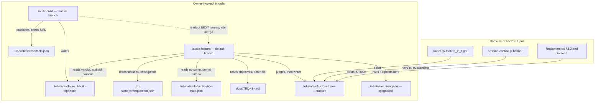

# TRD: Feature Close-Out — durable audit report and an explicit, judged close

**Version**: 2.0.3
**Status**: Draft
**Created**: 2026-09-28
**Last Updated**: 2026-09-28
**Author**: @technical-architect
**Source PRD**: `docs/plan/feature-close-out.investigation.md` (a `/plan` investigation, kind `change`, weight `medium`; no supersession marker), amended by owner decisions dated 2026-09-28 that came out of an adversarial review of v1.0.0 (each cited where it applies in §1.2 and §1.3)
**Task ID Prefix**: CLOSE

---

## Changelog

| Version | Date | Changes | Author |
|---------|------|---------|--------|
| 1.0.0 | 2026-09-28 | Initial TRD creation | @technical-architect |
| 2.0.0 | 2026-09-28 | adversarial review applied; trimmed to ~6 tasks. Then three further owner decisions the same day took it to 4: both planned libraries (`audit-report.js`, `feature-close.js`) dropped; whether a feature is done became a judgement against its TRD's objectives instead of a status count; owner evidence added as an input separate from the `--accept` override. Also: `/close-feature` runs only on the default branch and does not commit; `/implement-trd` and `/amend` refuse a closed feature; a never-implemented feature closes only as `abandoned`; the merge-message search replaced by checkpoint ancestry; `/implement-trd` Step 9 left unchanged; the release task removed (the orchestrator releases); OQ-3, OQ-5 resolved and OQ-6 removed; v1.0.0's grounding findings resolved or made moot | @technical-architect |
| 2.0.3 | 2026-09-28 | Build corrections: the audit report's first line is its VERDICT line (investigation O1 says the report begins with it; 2.0.2 put a title first); `/audit-build` commits its report on a feature branch so it reaches the default branch with the PR (end-of-run review) | main agent |
| 2.0.2 | 2026-09-28 | Audit advisory: `abandoned` is checked before `acceptedReason` in the banner and readout; B001 tests it | main agent |
| 2.0.1 | 2026-09-28 | `/audit-trd`: §3.1's Purpose line now lists O6 and D12, matching CLOSE-B002's Serves column; Could Not Verify states why each row was out of this audit's scope | @technical-architect |

---

## 1. Overview

### 1.1 Technical Summary

Two gaps have sat in `CLAUDE.md`'s known-open list since 4.7.1: `/audit-build` prints its verdict
and leaves nothing on disk, and nothing marks a feature as finished, so a shipped feature keeps
presenting as "in flight" to the router's hint and the SessionStart banner indefinitely.

This TRD closes both, and adds no library:

1. **`/audit-build` writes `.trd-state/<feature>/audit-build-report.md` itself**, right after its
   workflow returns: a short header (date, audited commit, the counts it already holds) and the
   readout verbatim. It publishes the file as an artifact the way `/implement-trd` publishes the
   verification report.
2. **A new owner-invoked command, `/close-feature [trd-path] ["<what you know>"] [--accept "<reason>"]`**,
   run on the default branch after the PR merges. It gathers facts with plain file reads and git,
   then **judges** the feature against its TRD's objectives: `done`, `done-with-gaps` or
   `not-done`. On `not-done` it ends `COMMAND STUCK` unless the owner overrides with `--accept`.
   It writes `.trd-state/<feature>/closed.json`, nulls `current.json` when it points at the
   feature, and does **not** commit. Its NEXT line tells the owner to commit and push the record.
3. **The two readers that decide "in flight"**, `router.py`'s `feature_in_flight` and the
   SessionStart banner in `session-context.js`, treat a `closed.json` as terminal.
4. **`/implement-trd` (every mode) and `/amend` refuse a closed feature** and say how to reopen it.
5. **`/audit-build`'s readout names `/close-feature`** as the step after the PR merges. No
   command closes a feature on its own.

Nothing moves on disk: TRDs stay where they are (`process.md`: nothing is archived by folder).

### 1.2 Objectives

Every objective is carried from the source investigation, from `constitution.md`, or from an
owner decision dated 2026-09-28. None is invented here.

| ID | Objective | Source |
|----|-----------|--------|
| O1 | `/audit-build` leaves a durable report at `.trd-state/<feature>/audit-build-report.md`: the date, the commit it audited, the counts (findings, applied, rejected, still unverified, verifiers reporting) and the readout verbatim, VERDICT line included | investigation O1; `CLAUDE.md` 4.7.1 known-open; owner decision 2026-09-28 (the command writes it; audited commit is `git rev-parse --short HEAD`) |
| O2 | The audit report is published as an artifact like the verification report; its URL is stored under `audit-build-report` in `.trd-state/<feature>/artifacts.json` and reused on the next run; publishing switched off or failing is one line, never fatal | investigation O2; `.claude/rules/command-status.md` "Artifact links" |
| O3 | A finished feature can be closed: `.trd-state/<feature>/closed.json` records when; the feature and TRD; the default branch; the last checkpoint commit and whether it is on the default branch; task status counts and every unfinished task with its status; the verification outcome and report; the audit verdict, report and audited commit; the done-ness verdict with each outstanding item; and the owner's evidence and override when given | investigation O3; owner decisions 2026-09-28 (record shape, commit recording, unfinished tasks listed) |
| O4 | Closing refuses a feature judged `not-done` against its TRD's objectives unless the owner passes `--accept "<reason>"`; the judgement and the reason are both recorded | investigation O4, amended by owner decision 2026-09-28: whether a feature is done is a judgement, not a status count |
| O5 | A closed feature stops presenting as in flight: the router's IN FLIGHT hint, the SessionStart banner, and `.trd-state/current.json` (fields nulled, file kept — `validate-init.sh` requires it) | investigation O5; `CLAUDE.md` 4.7.1 ("stale `in_progress` rows") |
| O6 | Closing is an explicit owner act after the merge, named as that step by `/audit-build`'s readout; no command closes a feature on its own | investigation O6, narrowed by owner decision 2026-09-28 (named only by `/audit-build`, not by `/implement-trd` Step 9); `.claude/rules/autonomy.md` "The authorization is scoped to ONE command" |
| O7 | A `deferred` task no longer keeps the router's IN FLIGHT hint alive once the feature is closed, and the router's `TRD/completed/` terminator is joined, not replaced, by the close record | investigation O7 |
| O8 | Ships as a patch release | investigation header ("Owner: ship it as a patch release"); owner decision 2026-09-28 |
| O9 | Tests pass at unit ≥ 60%, integration ≥ 50% where applicable | `constitution.md` Quality Gates |
| O10 | A closed feature is not reopened by accident: `/implement-trd` in every mode and `/amend` refuse it and say how to reopen | owner decision 2026-09-28 |
| O11 | The close record lands on the default branch, where every checkout will see it | owner decision 2026-09-28 |
| O12 | The owner can supply evidence the repository does not hold (for example "deployed live and I tested it"); the judgement weighs it, and the record keeps it verbatim, marked owner-attested, separate from the `--accept` override | owner decision 2026-09-28 |

### 1.3 Key Technical Decisions

| ID | Decision | Choice | Serves Objective | Rationale | Alternatives Considered |
|----|----------|--------|------------------|-----------|------------------------|
| D1 | Who writes the audit report | The `/audit-build` **command** writes the file itself, immediately after the workflow returns and before any chained `/implement-trd --reconcile`: the §3.1 header, then the readout verbatim. On `--report-only` runs too. Overwritten each run | O1 | `audit-build.js` has no filesystem access (investigation grounding A); the command already holds the returned readout and counts. Owner decision 2026-09-28: a library to render text the command already holds was ceremony | (a) The workflow writes it: impossible without fs access. (b) A renderer lib `audit-report.js` with a CLI (v1.0.0 D1): rejected by the owner; its one downstream reader, `/close-feature`, needs two lines of it. (c) Add a renderer to `functional-verification.js`: couples two commands' report formats to one module |
| D2 | Where the audit report is published and remembered | Same pattern as `/implement-trd` §9.0a: `Artifact({ file_path: ".trd-state/<feature>/audit-build-report.md", url: <artifacts.json["audit-build-report"]> })`, URL stored back under `audit-build-report`; honours `ensemble.publishArtifacts: false`; a failed publish is one line | O2 | Reuses a pattern already specified and consumed; one key per artifact kind is what `command-status.md` prescribes | (a) A separate `audit-artifacts.json`: `command-status.md` names one `artifacts.json` per feature. (b) Append the audit result to the TRD's Could Not Verify section: that section has its own owner and rewrite rule |
| D3 | How a feature is closed, and who names the step | A **new command**, `/close-feature`, not a flag. Only `/audit-build`'s readout names it, as the step after the PR merges. `/implement-trd` Step 9 is unchanged. `router.py`'s FLOW hint and the workflow lists in `CLAUDE.md`, the `CLAUDE.md` template, `process.md` and `/init-project`'s command list include it so the command is discoverable | O3, O6 | Closing follows the merge; `/audit-build` precedes it. Folding close into `/audit-build` would either close unmerged work or make the audit wait on an outward-facing act. `autonomy.md` scopes each command's authorization to itself. Owner decision 2026-09-28: Step 9 names ONE next step, and closing is two steps away from the end of an implementation run | (a) `--close` on `/audit-build`: rejected above. (b) Auto-close at the end of `/implement-trd`: violates O6. (c) Also name it in `/implement-trd` Step 9 NEXT (v1.0.0 CLOSE-B007): dropped by the owner |
| D4 | Where `/close-feature` runs, and whether it commits | Only on the default branch, resolved from `git symbolic-ref --quiet refs/remotes/origin/HEAD` (prefix `refs/remotes/origin/` stripped), falling back to `main`. On any other branch it ends `COMMAND STUCK` with "switch to <default>" and writes nothing. On the default branch it writes `closed.json` and does **not** commit; NEXT says to commit and push it | O11 | `.trd-state/` is git-tracked (`.gitignore:7-8`). A record committed on a feature branch that has already merged never reaches the default branch, so every other checkout keeps seeing the feature in flight. Committing to the default branch and pushing are outward-facing acts, which `autonomy.md` reserves to the owner | (a) Run on any branch and commit there: the record never reaches the default branch. (b) Commit on the default branch automatically: an outward-facing act the command is not authorized to take. (c) Close before merging, on the feature branch: the record would then describe a merge that has not happened |
| D5 | Representation of "closed" | A file, `.trd-state/<feature>/closed.json`, beside `implement.json`. **Presence** is the signal for the router and the two guards; the banner reads `verdict`, `outstanding`, `acceptedReason`, `unfinished`, `tasks`, `abandoned` and `closedAt` for display only. No script validates its shape | O3, O5, O7, O10 | Written once, read by several consumers; tracked, so it travels with the default branch. Because no consumer makes a decision from its contents, a malformed file still means "closed". Owner decision 2026-09-28: no script is needed to enforce the shape | (a) A `status` field inside `implement.json`: every writer of that file would have to preserve it. (b) Move the TRD to `docs/TRD/completed/`: contradicts `process.md`. (c) A schema-checking library (v1.0.0 `feature-close.js`): dropped by the owner; nothing downstream depends on the fields being exact |
| D6 | How "done" is decided | The model **judges** the gathered facts (§3.2) against the TRD's objectives and returns `done`, `done-with-gaps` (each gap named, with why it does not undermine an objective) or `not-done` (what is missing, and which objective it leaves unproven). A task status is evidence, never the verdict | O4 | Owner decision 2026-09-28, with the owner's example: a deferred verification task that did not run is "done with a gap" when its criteria were met another way, and "not done" when it was the only evidence the core behaviour works. The statuses are identical and the answers differ | (a) A deterministic done-rule over task statuses (v1.0.0 D5, `evaluateClose`): it either waves through the second case or blocks the first. (b) Close unconditionally and list what is unfinished: makes the refusal meaningless. (c) Rewrite unfinished statuses to `success`: falsifies the record |
| D7 | Owner evidence and the override are separate inputs | A quoted free-text argument is **owner evidence**: weighed by the judgement like any other fact, recorded verbatim as `ownerEvidence` marked owner-attested and not checked by tooling. `--accept "<reason>"` is the **override** ("close although not done"), recorded as `acceptedReason` only when the verdict is `not-done`. Every task not `success` is recorded with its status either way | O4, O12 | "I tested it live" can make a feature done; "close it anyway" cannot. The record and the readout must tell them apart, or a later reader cannot know whether a gap was covered or waived | (a) One argument for both: conflates covered with waived. (b) Record `--accept` even when the verdict did not need it: the banner would then report an override that did not happen. (c) Per-task reasons (`--accept ID=reason`): see OQ-4 |
| D8 | A feature with no `implement.json` | Closable only with `--accept "<reason>"`, recorded as `abandoned: true`, verdict `not-done`. Without `--accept` the command ends `COMMAND STUCK` and writes nothing | O3, O4 | Owner decision 2026-09-28. An abandoned design must be closable, or it stays in flight forever, and it must never read as done | (a) Refuse outright: abandoned designs cannot be closed. (b) Close without a reason: indistinguishable from a finished feature |
| D9 | What happens to `current.json` | When its `trd` names the feature being closed (same basename rule as `router.py`'s `derive_feature()`), all four keys (`prd`, `trd`, `status`, `branch`) are set to `null` and the file is kept. Otherwise it is untouched. Because `notify-complete.sh` derives `NOTIFY_FEATURE` from this file, `/close-feature`'s notify summary carries the feature name itself | O5 | `validate-init.sh` fails only when the file is missing. Every reader tolerates null fields: `precompact.js` falls back to `.trd-state/_session-log.md` (`precompact.js:57-63`), `dispatch-ledger.js` to `.trd-state/_dispatch.jsonl` (`implement-trd.md` §1.3a), the banner emits nothing. Owner decision 2026-09-28 on the notify summary | (a) Delete the file: breaks `validate-init.sh`. (b) Leave it: the stale hint this TRD exists to end. (c) Point it at "the next" feature: no reliable way to know which |
| D10 | How the in-flight readers learn a feature is closed | `router.py`'s `feature_in_flight` and `session-context.js` each test for `.trd-state/<feature>/closed.json` directly. The router's `TRD/completed/` and all-`success` terminators stay | O5, O7 | `current.json` is **gitignored** (`.gitignore:21`) and `closed.json` is **tracked**, so any other checkout can still point at a feature closed elsewhere. Nulling `current.json` alone holds only in the working tree the close ran in | (a) Rely on nulling `current.json`: fails across checkouts. (b) A shared helper both readers call: they are Python and Node, and a one-line existence check needs neither |
| D11 | How the close records the feature's commit | Walk `implement.json`'s `checkpoints[]` from last to first; the first `commit` value that matches `^[0-9a-f]{7,40}$` and resolves with `git rev-parse --verify --quiet <value>^{commit}` is `checkpointCommit`. `merged` is the exit status of `git merge-base --is-ancestor <checkpointCommit> <default>` (0 true, 1 false). When none resolves, both are `null` and the readout says plainly that no checkpoint commit was recorded, naming any non-commit values found. No commit-message search | O3 | Owner decision 2026-09-28. Live `implement.json` files hold `pending`, `PENDING`, `phase3_complete`, `phase-5-complete`, `null`, short and full SHAs as checkpoint values, and the last checkpoint can differ from `recovery.last_healthy_checkpoint` (functional-verification: `62b12af` against `46447d0`). The regex keeps non-commit strings away from git | (a) Search merge messages for the branch name (v1.0.0 D8): squash merges leave none, and a name can match an unrelated merge. (b) Record `HEAD`: describes the checkout, not the feature. (c) Read `recovery.last_healthy_checkpoint`: it can lag the last checkpoint |
| D12 | The audit report's role in closing | Recorded, never gated, and its absence never blocks. The record keeps its verdict, path and the commit it names. The readout's ISSUES says "never audited" when there is no report, and "audit is of <sha>; <n> touched file(s) changed since" only when a file in this TRD's grounding `Touches` changed between the audited commit and the default branch (`git diff --name-only`) — see OQ-7 | O1, O3 | Owner decision 2026-09-28; investigation OQ-2 (recorded, not gated) | (a) Require a "safe to proceed" verdict: see OQ-2. (b) Refuse to close without a report: the three stale features the investigation found have none |
| D13 | A closed feature is closed to further implementation | `/implement-trd` §1.2 step 3 ("single in-progress") skips state directories holding `closed.json`. Whichever route resolves the TRD, and in every mode (`--resume`, `--reconcile`, `--reset-state`, `--chained`), a closed feature stops at the end of §1.2 with "closed on <date>; delete .trd-state/<feature>/closed.json to reopen". `/amend` stops the same way | O10 | Owner decision 2026-09-28. v1.0.0 let a resumed run proceed and repopulate `current.json`, which reopens the feature while its close record still says closed: the two would disagree silently. Step 1 runs before Step 2 in every mode, so the end of §1.2 precedes branch switching (§1.3), the pointer write (§1.3a) and `--reset-state` (§2.1) | (a) Allow the silent re-run (v1.0.0 TR1): the disagreement above. (b) Delete `closed.json` automatically on resume: reopening is a decision, not a side effect |
| D14 | `/audit-build` with no path and a nulled `current.json` | Ends `COMMAND STUCK`, asking for a TRD path; the workflow is not called | O1, O5 | Owner decision 2026-09-28. After a close, `current.json` names nothing, and the command's current fallback would pass an empty path to the workflow | (a) Fall back to the most recently modified TRD: a guess, and wrong exactly when the owner has moved on |
| D15 | Authorization and release vehicle | The owner's instruction of 2026-09-28 ("Let's address the audit and close out work") covers adding a new command and a new state file, which `constitution.md` lists under changes needing approval. It ships as a patch release at the owner's request. The release (version bump, `CHANGELOG.md`, `CLAUDE.md` Current Status) is performed by the orchestrator after these tasks and is not a task in this TRD | O8 | Owner instruction; `CHANGELOG.md`'s versioning note already records capability changes shipping as patches | (a) Minor bump: conventional for a new command, but the owner specified patch. (b) A release task inside this TRD (v1.0.0 CLOSE-P001): removed; the orchestrator releases |

### 1.4 Technology Stack

| Layer | Technology | Purpose | Notes |
|-------|------------|---------|-------|
| Router hook | Python 3.x | `feature_in_flight` terminator, FLOW hint | `stack.md` |
| SessionStart hook | Node.js 18+ | closed-state banner line | existing `session-context.js` |
| Commands | Markdown prompts | `/close-feature` (new); `/audit-build`, `/implement-trd`, `/amend` (edited) | constitution Principles 2–3 |
| Tests | Jest ^29, pytest ^7, BATS ^1.9; the smoke harness in `test/smoke/` | unit tests for the two readers; one opt-in live smoke scenario for `/close-feature` and the guards | `stack.md`; `test/smoke/README.md` |

### 1.5 Integration Points

| System | Type | Direction | Notes |
|--------|------|-----------|-------|
| git | CLI | In | default branch, current branch, checkpoint resolution and ancestry (D4, D11); audited commit (D1). Only fixed arguments and regex-checked SHAs reach it |
| Artifact tool | Tool call | Out | audit report publish (D2); honours `ensemble.publishArtifacts` |
| `.trd-state/current.json` | File | Both | read to resolve a TRD; nulled on close (D9) |
| `notify-complete.sh` | Script | Out | `/close-feature`'s summary names the feature (D9) |

---

## 2. System Architecture

### 2.1 Architecture Overview

The non-obvious part is who reads the close record and why the readers need it even though
`current.json` is nulled.



### 2.2 Component Architecture

#### 2.2.1 `/audit-build` (existing, extended)
Writes and publishes the report (§3.1); ends STUCK when it has no TRD (D14); names
`/close-feature` in its readout.

#### 2.2.2 `/close-feature` (new, `packages/core/commands/close-feature.md` + `.claude/commands/` mirror)
**Responsibility**: resolve the feature; apply the three deterministic stops; gather facts; judge;
write `closed.json`; null `current.json`; emit the four-section readout and one banner (§3.2).

#### 2.2.3 In-flight readers (existing, extended)
`router.py` `feature_in_flight` and `session-context.js` (§3.4).

#### 2.2.4 Guards (existing commands, extended)
`/implement-trd` §1.2 and `/amend` (§3.5).

### 2.3 Data Flow

```mermaid
sequenceDiagram
    participant Owner
    participant CF as /close-feature
    participant Git
    participant Disk as .trd-state/

    Owner->>CF: /close-feature [trd] ["evidence"] [--accept "reason"]
    CF->>Disk: closed.json present? → "already closed on <date>", write nothing
    CF->>Git: on the default branch? no → STUCK "switch to <default>"
    CF->>Disk: implement.json present? no, and no --accept → STUCK
    CF->>Disk: read statuses, deferrals, verification, audit report
    CF->>Git: resolve checkpoint commit, test ancestry
    Note over CF: judge against the TRD's objectives
    alt not-done and no --accept
        CF-->>Owner: COMMAND STUCK — what is missing, which objective; nothing written
    else done, done-with-gaps, or --accept given
        CF->>Disk: write closed.json, null current.json if it points here
        CF-->>Owner: readout (NEXT: commit and push) + COMMAND COMPLETE
    end
```

### 2.4 State Management

`closed.json` is write-once; deleting it is how a feature is reopened. `implement.json` is read,
never written, by the close.

---

## 3. Technical Specifications

### 3.1 Audit report (`/audit-build`)

**Purpose**: O1, O2, O6, D1, D2, D12, D14. (O6: the NEXT line below is where `/audit-build` names `/close-feature` as the post-merge step. D12: the `- Audited commit:` and `VERDICT:` header lines are the inputs `/close-feature` records and checks staleness against.)

**File** — `.trd-state/<feature>/audit-build-report.md`, where `<feature>` is the TRD's basename
without its extension. Header lines exactly as below; `/close-feature` reads the
`- Audited commit:` line and the first line beginning `VERDICT:`. The report's first line is that VERDICT line (investigation O1: the report "begins with the VERDICT line"); the readout below repeats it.

```markdown
<the readout's VERDICT: line, copied — the report's first line>

# Audit report: <feature>

- Date: <YYYY-MM-DD>
- Audited commit: <output of `git rev-parse --short HEAD`, or "unknown" if it fails>
- TRD: <trd path>
- PRD: <prd path, or "none">
- Findings: <n> · applied: <n> · rejected: <n> · still unverified: <n> · verifiers reporting: <as returned>

<the readout, verbatim as printed — it opens with the AUDIT-BUILD: header and its VERDICT: line>
```

**Behavior**:
- Written right after the Workflow call returns, before any chained `/implement-trd --reconcile`,
  on `--report-only` runs too; overwrites the previous report (the artifact URL gives continuity,
  git keeps prior versions).
- Published per D2; STATE names the report path, and the link when one was made.
- NEXT: when the VERDICT is `safe to proceed` or `proceed with these caveats`, NEXT names
  `/close-feature <trd>` on the default branch after the PR merges. On `do not proceed`, NEXT is
  the reconcile work, as today.
- **No TRD** (D14): no path argument and `current.json` absent, or its `trd` null or empty →
  `═══ COMMAND STUCK: /audit-build ═══`, `Reason: no TRD path given and .trd-state/current.json
  names none (closing a feature clears it)`, `Next: /audit-build docs/TRD/<feature>.md`. The
  workflow is not called.

**Error Handling**: a failed write is one line in STATE and the command still completes; a
failed publish or `publishArtifacts: false` is one line, never STUCK (O2).

### 3.2 `/close-feature`

**Purpose**: O3, O4, O5, O6, O11, O12; D3–D9, D11, D12.

**Arguments**:
- `[trd-path]` — the argument ending `.md` that names an existing file; otherwise `current.trd`.
  Neither → STUCK: `Reason: no TRD named and .trd-state/current.json names none`,
  `Next: /close-feature docs/TRD/<feature>.md`.
- `["<what you know>"]` — any other quoted free text is **owner evidence** (D7).
- `--accept "<reason>"` — the **override** (D7).

`<feature>` is the TRD's basename without its extension, the rule `router.py`'s
`derive_feature()`, `notify-complete.sh` and `precompact.js:218` already share.

**Deterministic stops, in this order, before any judgement:**
1. `.trd-state/<feature>/closed.json` exists → STATE says "already closed on <closedAt>";
   write nothing; `COMMAND COMPLETE`.
2. Current branch (`git branch --show-current`) is not the default branch (D4) → STUCK:
   `Reason: closing records onto <default>, and this checkout is on <current>`,
   `Next: switch to <default> after the PR merges, then re-run`. Nothing written.
3. No `.trd-state/<feature>/implement.json` (D8): without `--accept` → STUCK:
   `Reason: <feature> was never implemented`,
   `Next: /close-feature <trd> --accept "<reason>" to record it as abandoned`. With `--accept`,
   skip to **Write** with `abandoned: true`, `verdict: "not-done"`.

**Facts** (file reads and git, no judgement):
- Task statuses: `load()` from `.claude/lib/implement-state` → counts by status, and every task
  whose status is not `success`, with that status.
- Deferral reasons: `parseTrd(text).deferred` from `.claude/lib/trd-parser` → `{id, why}` per
  task in the TRD's deferred-by-design table.
- Verification: `.trd-state/<feature>/verification-state.json` → `outcome`, and every criterion
  whose `status` is not `met` (`not_met`, `not_verifiable`, `unbuilt`) with its `reason`;
  `verification-report.md`'s path if it exists. Absent → nulls.
- Audit: `.trd-state/<feature>/audit-build-report.md` → first `VERDICT:` line and the
  `- Audited commit:` value. Absent → `audit: null`.
- Commit: `checkpointCommit`, `merged` (D11), `defaultBranch` (D4).
- Objectives: the TRD's Objectives table; where the TRD has none, its Master Task List
  acceptance criteria stand in for them.
- Owner evidence, verbatim.

**Judgement** (D6). For each objective, decide whether it is proven, and by what: a met criterion,
a delivered task, or owner evidence. Then:
- `done` — every objective proven; nothing outstanding.
- `done-with-gaps` — every objective proven; each remaining item (a task not `success`, a
  criterion not met, a missing audit) is in `outstanding` with why it does not undermine an
  objective.
- `not-done` — at least one objective unproven; `outstanding` names what is missing and which
  objective it leaves unproven.

A `deferred` task is a gap only if what it would have proven is proven nowhere else. Owner
evidence may prove an objective; the readout names each item it covered as "covered by owner
evidence". An audit VERDICT of `do not proceed` names blockers, and the judgement must address
each one; it is weighed, not gated (D12, OQ-2).

**Outcomes**:
- `not-done` without `--accept` → STUCK. `Reason:` is the judgement's core in one line (which
  objective, what is missing); the full list goes in ISSUES. Nothing written.
- `--accept` given and the verdict is not `not-done` → `acceptedReason` stays `null`; DECISIONS
  says the override was not needed.

**Write** — `closed.json` (§3.3) with the Write tool, then a parse check:
`node -e 'JSON.parse(require("fs").readFileSync(process.argv[1], "utf8"))' .trd-state/<feature>/closed.json`.
A file that fails the check is rewritten, never left.

**`current.json`** (D9) — nulled when it points at `<feature>`, else untouched.

**Readout** (four sections, `command-status.md`):
- STATE — the record's path, the verdict, the task tally.
- DECISIONS — how each task not `success` was settled; owner evidence, quoted and labelled
  owner-attested; whether the override was used or not needed.
- ISSUES — "abandoned, never implemented: <reason>" when `abandoned` is true (checked first — an
  abandoned record always has `acceptedReason` too); otherwise "closed with N of M tasks accepted
  unfinished: <reason>" when `acceptedReason` is set;
  "never audited" or "audit is of <sha>; <n> touched file(s) changed since" (D12, OQ-7); "checkpoint <sha> is not on
  <default> (a squash or rebase merge leaves this false)" when `merged` is false; "no checkpoint
  commit recorded" (naming any non-commit values found) when `checkpointCommit` is null.
- NEXT — `git add .trd-state/<feature>/closed.json && git commit -m "chore(<feature>): close feature" && git push`.

**Banner and notify** — `═══ COMMAND COMPLETE: /close-feature ═══` or `COMMAND STUCK`; then
`.claude/hooks/notify-complete.sh "close-feature" "<complete or stuck>" "<feature>: <verdict or reason>"`.
The summary names the feature because `current.json` has just been nulled (D9). No
`PushNotification`: a one-shot command the owner is watching.

### 3.3 `closed.json`

```typescript
interface CloseRecord {
  feature: string;                 // TRD basename without extension
  trd: string;
  closedAt: string;                // ISO 8601 timestamp
  defaultBranch: string;
  checkpointCommit: string | null; // D11
  merged: boolean | null;          // null only when checkpointCommit is null
  abandoned: boolean;              // true only for a feature with no implement.json (D8)
  verdict: "done" | "done-with-gaps" | "not-done";
  outstanding: Array<{ item: string; why: string }>;   // empty for "done"
  ownerEvidence: { text: string; attestedBy: "owner"; checkedByTooling: false } | null;
  acceptedReason: string | null;   // set only when verdict is "not-done" and --accept was given
  tasks: Record<string, number>;   // counts by status as found, e.g. { success: 7, deferred: 1 }
  unfinished: Array<{ id: string; status: string }>;  // every task whose status is not "success"
  verification: { outcome: string | null; report: string | null };
  audit: { verdict: string | null; report: string; auditedCommit: string | null } | null;
}
```

Owner text (`ownerEvidence.text`, `acceptedReason`) is stored verbatim.

### 3.4 In-flight readers

- **`feature_in_flight(cwd)`** returns `""` when `.trd-state/<feature>/closed.json` exists,
  checked before the "no `implement.json`" branch, because an abandoned feature has a close
  record and no `implement.json`. Its two existing terminators stay. Unreadable state still
  returns the feature. `FRAMEWORK_HINT`'s FLOW bullet names `/close-feature` after
  `/audit-build` as the owner's post-merge step.
- **`session-context.js`**: when `current.json` resolves to a feature with `closed.json`, the
  banner replaces the task tally with one `Closed:` line, rules checked in this order:
  - `abandoned` (checked first; an abandoned record always also has `acceptedReason`):
    `Closed: <date> — abandoned, never implemented: <acceptedReason>`
  - `acceptedReason` set: `Closed: <date> — not done; closed with N of M tasks accepted unfinished: <acceptedReason>`
    (N = `unfinished.length`, M = the sum of `tasks`)
  - otherwise: `Closed: <date> — <verdict>`, plus the gap count for `done-with-gaps`
  - unparseable or missing fields: `Closed: record unreadable (.trd-state/<feature>/closed.json)` —
    presence alone means closed.
  A nulled `current.json` already emits nothing (existing early return).

### 3.5 Closed-feature guards

- **`/implement-trd` §1.2**: step 3 reads "exactly one `.trd-state/*/implement.json` exists with
  uncompleted tasks **and no `closed.json` beside it**". After the priority list, before §1.3:
  whichever route resolved the TRD, if `.trd-state/<feature>/closed.json` exists, end
  `═══ COMMAND STUCK: /implement-trd ═══` with `Reason: <feature> was closed on <date>` and
  `Next: delete .trd-state/<feature>/closed.json to reopen`. Under `--chained` no banner is
  emitted (§3.7 of that command); the RETURN line carries the same reason. The header's
  `<trd-path>` note and Step 6's restatement of the single-in-progress rule say "unclosed" too.
- **`/amend`**: right after its feature-in-flight check and before Step 1, the same stop, with
  `═══ COMMAND STUCK: /amend ═══` and `notify-complete.sh "amend" "stuck" …`.

### 3.6 Security

- Owner text (the TRD path, the evidence, the `--accept` reason) never enters a shell string it
  could break out of: `closed.json` is written with the Write tool; the TRD path is used only after
  it is confirmed to exist; checkpoint values reach git only after matching `^[0-9a-f]{7,40}$`
  (`CLAUDE.md` Security Considerations).
- The published audit report carries only its header and the readout already printed
  (`command-status.md`: never publish a document containing a credential).

### 3.7 Live verification fixtures (`test/smoke/scenarios/close-feature.sh`)

An opt-in LLM smoke scenario, registered in `run-smoke.sh`'s `LLM_OPT_IN_SCENARIOS`. Each run uses
a throwaway project from `smoke_scaffold_project`, a git repository initialised on `main` with no
`origin` remote (so the `main` fallback is exercised), a TRD with an Objectives table, and a
`NOTIFY_ON_COMPLETE` that appends `$NOTIFY_SUMMARY` to a file. Every assertion reads a file, the
final banner, or git; none judges prose quality.

| Run | Fixture and arguments | Asserts |
|-----|-----------------------|---------|
| 1 | **Covered deferral**: build tasks `success`; one `[LIVE]` verification task `deferred` with a deferred-by-design row; `verification-state.json` outcome `satisfied`, every criterion `met`; no audit report; `current.json` points at the feature; checkpoint commit on `main` | `closed.json` verdict `done-with-gaps`, `outstanding` names the `[LIVE]` task; `merged` true; `audit` null; `current.json` present with all four keys null; ISSUES contains "never audited"; notify summary contains the feature name |
| 2 | **Sole evidence**: task map identical to run 1; the criterion proving the core behaviour is `not_verifiable` ("needs the live environment") and no other criterion covers that objective | `COMMAND STUCK`; no `closed.json`; `current.json` byte-unchanged |
| 3 | Run 2's fixture + owner evidence "deployed to staging on 2026-09-27 and I ran the live check myself; it passed"; an audit report whose `- Audited commit:` is a different commit from the checkpoint; `current.json` points at another feature | verdict `done`; `ownerEvidence.text` equals the evidence verbatim, `attestedBy` `owner`; `acceptedReason` null; the readout names the `[LIVE]` task as covered by owner evidence; ISSUES contains "audit is of"; `current.json` byte-unchanged |
| 4 | **Unbuilt core, zero success**: two tasks, both `pending`; the only checkpoint value is `pending` | `COMMAND STUCK`; no `closed.json` |
| 5 | Run 4's fixture + `--accept "superseded by another design"` | verdict `not-done`; `acceptedReason` verbatim; `unfinished` lists both tasks as `pending`; ISSUES contains "2 of 2 tasks accepted unfinished"; `checkpointCommit` and `merged` null; readout says no checkpoint commit was recorded |
| 6 | **Never implemented**: no `implement.json`, no `--accept` | `COMMAND STUCK`; no `closed.json` |
| 7 | Run 6's fixture + `--accept "design abandoned"` | `abandoned` true; verdict `not-done` |
| 8 | Run 1's fixture on branch `feature/x` | `COMMAND STUCK` naming `main`; no `closed.json` |
| 9 | Run 1's project, re-run | readout says "already closed"; `closed.json` byte-unchanged |
| 10 | Run 1's project, `/implement-trd --resume` | `COMMAND STUCK` containing "delete .trd-state/<feature>/closed.json to reopen"; `implement.json` byte-unchanged |
| 11 | Run 1's project, `current.json` restored to point at the feature, `/amend <any change>` | `COMMAND STUCK` with the same text; no tracked file changed |

Across all runs, `git rev-list --count HEAD` is unchanged: the command never commits.

---

## 4. Master Task List

### 4.1 Task ID Convention

`CLOSE-[CATEGORY][SEQ]`, with `B` for hook, command and prompt work. Tests ship inside each task
as acceptance criteria. Every edit to a file with a `.claude/` mirror includes the mirror in the
same task. Test files get no `.claude/` copy.

### 4.2 Phase 1: Readers, audit report, guards

| Task ID | Description | Serves | Skills | Dependencies | Acceptance Criteria |
|---------|-------------|--------|--------|--------------|---------------------|
| CLOSE-B001 | In-flight readers treat `closed.json` as terminal (§3.4): `router.py` `feature_in_flight` gains the third terminator ahead of the no-`implement.json` branch, its docstrings are corrected, and `FRAMEWORK_HINT`'s FLOW names `/close-feature` after `/audit-build`; `session-context.js` prints the `Closed:` line instead of the tally. One new shared fixture, `test/integration/fixtures/closed-feature.json`, drives both readers' tests (the cross-seam test from v1.0.0, folded in). Mirrors in `.claude/hooks/` | D5, D10, D3, O5, O7, O6 | `pytest`, `jest` | None | pytest (`TestFeatureInFlightTerminator`, built from the shared fixture): closed feature with `in_progress` and `deferred` tasks returns `""`; closed feature with no `implement.json` returns `""`; the same trees without `closed.json` return the feature name; the `TRD/completed/` terminator still returns `""`; `FRAMEWORK_HINT` contains `/close-feature`. Jest (new `packages/core/hooks/session-context.test.js`, same fixture, calling the exported `main`): an accepted record with 2 unfinished of 2 tasks prints "closed with 2 of 2 tasks accepted unfinished" and no `Impl:` line; a `done-with-gaps` record prints the verdict and its gap count; an unparseable `closed.json` prints the unreadable-record line and `main` does not throw; a nulled `current.json` emits empty context; a feature without `closed.json` still prints its `Impl:` tally. Both test files read the one fixture path. `.claude/hooks/router.py` and `.claude/hooks/session-context.js` byte-identical to their sources (`cmp`); no test file under `.claude/` An `abandoned: true` record (which also carries `acceptedReason`) renders the "abandoned, never implemented" line, not the "accepted unfinished" one. |
| CLOSE-B002 | `/audit-build` writes `.trd-state/<feature>/audit-build-report.md` itself (§3.1 header, then the readout verbatim) right after the workflow returns and before any reconcile chain, on `--report-only` too; publishes it per D2 and stores the URL under `audit-build-report`; STATE names the report; NEXT names `/close-feature <trd>` on the default branch after the PR merges; no path plus a nulled `current.json` ends STUCK without calling the workflow (D14). Mirror in `.claude/commands/` | D1, D2, D12, D14, O1, O2, O6 | | None | `packages/core/commands/audit-build.md` contains: the report path; the five §3.1 header lines exactly, including `git rev-parse --short HEAD`; the instruction to write before the reconcile chain and on `--report-only`; `artifacts.json` key `audit-build-report` with the one-line off/failure rule; `/close-feature` in the NEXT guidance; a `COMMAND STUCK: /audit-build` path whose Reason names the empty `current.json` and whose Next asks for a TRD path. Each is absent from the file today (grep). `.claude/commands/audit-build.md` byte-identical; `runtime-integrity.test.sh` and `notify-on-complete.test.sh` pass |
| CLOSE-B003 | Closed-feature guards (§3.5): `/implement-trd` §1.2 step 3 skips state directories holding `closed.json`; a stop after §1.2's list, before §1.3, ends STUCK for a closed feature whichever route resolved it and in every mode (under `--chained`, the RETURN line carries the reason); the header note and Step 6's restatement say "unclosed"; `/amend` gets the same stop before Step 1. Mirrors in `.claude/commands/` | D13, O10 | | None | `packages/core/commands/implement-trd.md`: §1.2 step 3 names `closed.json`; a stop between §1.2's list and `### 1.3` names `--resume`, `--reconcile`, `--reset-state` and `--chained` and contains "delete .trd-state/<feature>/closed.json to reopen"; the header's `<trd-path>` note and the Step 6 sentence say "unclosed". `packages/core/commands/amend.md`: the same text before `## Step 1`, with a `COMMAND STUCK: /amend` banner and `notify-complete.sh "amend" "stuck"`. None of these strings exists in either file today (grep). Both `.claude/commands/` mirrors byte-identical; `verify-command-surface.test.js`, `runtime-integrity.test.sh` and `notify-on-complete.test.sh` pass. Live behaviour is asserted by CLOSE-B004's runs 10 and 11 |

### 4.3 Phase 2: The close command

| Task ID | Description | Serves | Skills | Dependencies | Acceptance Criteria |
|---------|-------------|--------|--------|--------------|---------------------|
| CLOSE-B004 | New `/close-feature` command (§3.2, §3.3) in `packages/core/commands/` and `.claude/commands/`: argument parsing (TRD path, owner evidence, `--accept`), the three deterministic stops, fact gathering, the judgement, the `closed.json` write and parse check, `current.json` nulling, the four-section readout with NEXT to commit and push, one banner, a notify summary naming the feature, the autonomy block. Documentation in the same task: `/close-feature` added after `/audit-build` as the post-merge step in `process.md` (template and vendored copy), `CLAUDE.md`'s Development Workflow block, the `CLAUDE.md` template and `/init-project`'s command list (all three copies); `CLAUDE.md`'s command count 18 → 19; a one-line note under `docs/TRD/docs-as-built.md` D19 that `closed.json` is the better "finished" signal (not built, NG2). The live scenario of §3.7, registered and documented in the smoke harness | D3, D4, D5, D6, D7, D8, D9, D11, D12, O3, O4, O5, O6, O11, O12 | | CLOSE-B003 | `./test/smoke/run-smoke.sh close-feature` passes all eleven runs in §3.7, each asserting a file, banner or git fact that would be absent if the behaviour were not built. `close-feature.md` contains `notify-complete.sh "close-feature"` and its `.claude/commands/` mirror is byte-identical (`notify-on-complete.test.sh` passes). `process.md.template` and `.claude/rules/process.md` list `/close-feature` in the same place and still differ only in their three placeholder lines (`diff`). `CLAUDE.md` lists it in the Development Workflow block and reads "19 commands". `CLAUDE.md.template` and all three `init-project.md` copies list it, and `generate-hooks-artifacts.sh --check` exits 0. `docs-as-built.md` D19 carries the note. `smoke-registration.test.sh` passes with the new scenario registered in exactly one roster |

---

## 5. Execution Plan

### 5.1 Phase Overview

| Phase | Focus | Prerequisites | Parallelizable Sessions |
|-------|-------|---------------|------------------------|
| 1 | Readers, audit report, guards | None | CLOSE-B001, CLOSE-B002, CLOSE-B003 in parallel — disjoint files |
| 2 | The close command, its docs and its live scenario | CLOSE-B003 (scenario runs 10 and 11 assert the guards) | CLOSE-B004 alone |

### 5.2 Parallelization Map

```mermaid
gantt
    title Execution Plan (No time scale - dependency order only)
    dateFormat X
    axisFormat %s

    section Phase 1
    B001 in-flight readers: b1, 0, 1
    B002 audit-build report: b2, 0, 1
    B003 closed-feature guards: b3, 0, 1

    section Phase 2
    B004 close-feature command: b4, after b3, 1
```



### 5.3 Critical Path

CLOSE-B003 → CLOSE-B004. The dependency exists only because B004's live scenario asserts the
guards; B004 consumes nothing else from Phase 1. Its fixture audit report follows §3.1, the
contract, not CLOSE-B002's output.

---

## 6. Quality Requirements

### 6.1 Testing Requirements

| Type | Coverage Target | Source | Scope |
|------|-----------------|--------|-------|
| Unit Tests | ≥ 60% | `constitution.md` Quality Gates | `feature_in_flight`, `session-context.js` |
| Integration Tests | ≥ 50% where applicable | `constitution.md` Quality Gates | the shared-fixture seam between the two readers (CLOSE-B001) |

The three command changes and the new command are prompts with no unit-testable code
(constitution Principles 2 and 4). Their behaviour is asserted by the opt-in live smoke scenario
in §3.7, because the owner required the judgement's acceptance criteria to be checkable against
fixtures. The command-text criteria in CLOSE-B002 and CLOSE-B003 are presence checks that fail
until the text exists. No `[LIVE]` task: no running service is involved.

### 6.2 Code Quality Standards

None beyond `stack.md`'s existing tooling.

### 6.3 Security Requirements

| ID | Requirement | Source |
|----|-------------|--------|
| S1 | Owner-supplied text never reaches a shell string; `closed.json` is written with the Write tool; checkpoint values reach git only after matching `^[0-9a-f]{7,40}$` | `CLAUDE.md` Security Considerations ("Command Injection Prevention"); domain-derived: the evidence and the reason are free text the owner types |
| S2 | The published audit report carries nothing the printed readout did not | `command-status.md` "Never publish a document that contains a credential" |

### 6.4 Performance Requirements

None — performance was not raised.

---

## 7. Risk Assessment

### 7.1 Risks Imported from PRD

The investigation lists no risks section.

### 7.2 Technical Risks

| ID | Risk | Likelihood | Impact | Mitigation |
|----|------|------------|--------|------------|
| TR1 | `implement-trd.md` §1.3a says "Preserve any key you cannot determine rather than nulling it", and a later run on a closed feature could repopulate `current.json` | Med | Low | The guard (D13) stops every `/implement-trd` mode at the end of §1.2, before §1.3a writes the pointer; reopening is deleting `closed.json`, an explicit act. Replaces v1.0.0's "silent re-run is correct" mitigation |
| TR2 | Squash and rebase merges rewrite commits, so `merged` reads `false` for a feature that did merge | Med | Low | Recorded plainly; ISSUES says why it can be false; it never blocks (D11) |
| TR3 | The judgement varies between runs on a borderline feature | Med | Med | The verdict and its reasoning are recorded, so a wrong call is visible and reversible (delete `closed.json`, re-run). The §3.7 fixtures are built to be unambiguous; a flip on one of them is a prompt defect to fix, not noise (constitution Principle 4) |
| TR4 | The model writes a malformed `closed.json` | Low | Low | The command parse-checks and rewrites (§3.2); consumers treat presence as closed and tolerate missing display fields (§3.4) |
| TR5 | The audit report's header is model-written, so its `- Audited commit:` line can drift from §3.1 | Low | Low | `/close-feature` treats a missing or unreadable line as `auditedCommit: null` and says so; the header is fixed text in `audit-build.md` |
| TR6 | `/audit-build` on a closed feature chains `/implement-trd --reconcile`, which now stops | Low | Low | Correct behaviour: the report is still written, and reopening stays the owner's decision (D13) |

---

## 8. Non-Goals (Scope Boundaries)

NG1–NG5 are imported from the investigation; NG6–NG8 are boundaries set by the owner decisions of
2026-09-28.

| ID | Non-Goal | Rationale |
|----|----------|-----------|
| NG1 | Normalising `testing-phase`'s legacy `completed` status value | Closing it records it honestly; enum normalisation is separate work (investigation) |
| NG2 | Building docs-as-built's "finished" definition (D19) on top of `closed.json` | Parked design; only a note is added (CLOSE-B004) (investigation) |
| NG3 | Settling a closed feature's rows in the discovery ledger | Separate; the ledger already supersedes by ref (investigation) |
| NG4 | Closing any real feature as part of this implementation, including the three stale ones | O6: closing is the owner's act. This TRD makes it possible; the owner runs it |
| NG5 | Gating close on the audit verdict | Investigation OQ-2: the verdict is recorded and weighed, not gated (D12) |
| NG6 | A script or library that validates `closed.json`'s shape | Owner decision: consumers test presence or read display fields only (D5) |
| NG7 | Guarding commands other than `/implement-trd` and `/amend` | `/verify-build` and `/audit-build` read and report; their chained implementation runs reach the `/implement-trd` guard |
| NG8 | The release itself: version bump, `CHANGELOG.md`, `CLAUDE.md` Current Status narrative | Performed by the orchestrator after these tasks (D15). CLOSE-B004 changes only the command count in that line |

## Verification Artifacts

None apply — this change has no UI design, no interaction diagram and renders no data from an API or store; its surfaces are CLI commands, hook output and JSON/markdown files.

---

## Open Questions

| ID | Question | What I assumed | Why it matters | If I'm wrong |
|----|----------|----------------|----------------|--------------|
| OQ-1 | Command name | `/close-feature` (inherited from the investigation's OQ-1) | Appears in four commands' text, the router hint and five docs | A rename touches CLOSE-B001, CLOSE-B002, CLOSE-B004 |
| OQ-2 | Must the audit verdict be "safe to proceed" to close? | No — recorded and weighed, not gated (investigation OQ-2) | A feature closed with caveats says so in its record | Add a gate to §3.2's deterministic stops |
| OQ-4 | One `--accept` reason for the whole feature, or one per task? | One reason, recorded once as `acceptedReason`, beside every unfinished task's id and status | discipline-judgment has one unfinished task; testing-phase has 82 | Add an `--accept ID=reason` form and a per-item reason field |
| OQ-7 | When is the audit stale? | **Decided (orchestrator, 2026-09-28):** only when a file this TRD touches changed after the audited commit — `git diff --name-only <auditedCommit> <default>` intersected with the TRD's grounding `Touches` paths. Then ISSUES reads "audit is of <sha>; <n> touched file(s) changed since". A later commit that touches nothing of this feature is not staleness | Comparing against the checkpoint commit or HEAD would flag almost every audit | — |

## Could Not Verify

State after `/audit-trd` on 2026-09-28 (5 of 5 verifiers reported; source `docs/plan/feature-close-out.investigation.md`). That audit raised only document-consistency findings; none of the three claims below was checked by it, because each needs a live run or a code read that happens at implementation time, not a document read.

| Claim | How I'd check it | Why this audit did not check it |
|-------|------------------|---------------------------------|
| `smoke_claude` can drive `/close-feature` in a scaffolded project that has no `origin` remote, with the `main` fallback taking effect | the first run of `./test/smoke/run-smoke.sh close-feature` | needs a live smoke run; audit reads documents only |
| The judgement returns the same verdict on repeated runs of the §3.7 fixtures | run the scenario three times; any flip on runs 1–5 is a prompt defect | needs the command built and run three times |
| `session-context.js`'s `emit()` output can be captured by Jest when `main` is called in-process | read `emit()` in `packages/core/hooks/session-context.js` before writing the test | out of the audit's scope (a test-mechanics question for CLOSE-B001's implementer, not a TRD claim against the source) |

## Task Grounding

### CLOSE-B001

- **Touches:** `packages/router/hooks/router.py`, `.claude/hooks/router.py`, `packages/router/tests/test_router.py`, `packages/core/hooks/session-context.js`, `.claude/hooks/session-context.js`, `packages/core/hooks/session-context.test.js` (new), `test/integration/fixtures/closed-feature.json` (new)
- **Reuse:**
  - `derive_feature()` (`router.py:360-379` [read]) already computes `<feature>` for `feature_in_flight`; the terminator reuses that value rather than re-deriving it.
  - The existing `_tree()` helper in `TestFeatureInFlightTerminator` (`test_router.py:765-774` [read]); give it a `closed=` argument that writes the shared fixture's record, instead of a second fixture builder.
  - In `session-context.js`: `resolveProjectRoot(hookData)` and `safeReadJson()` (both already used in `main()`, `session-context.js:140-150` [read]) for the root and a read that returns null on bad JSON; the exported `main` for in-process tests (`:222-227`, per v1.0.0 grounding). Compute `<feature>` from `current.trd` the same way `precompact.js:218` does: `path.basename(trd, path.extname(trd))` [read].
- **Replaces:** the `feature_in_flight` docstring's "Two terminators" list and its statement that "nothing in the framework clears `current.json` when a feature ships" (`router.py:382-400` [read]), and the same statement in `TestFeatureInFlightTerminator`'s class docstring (`test_router.py:757-763` [read]). Both become false; rewrite them, don't append.
- **Follow:** the two existing terminators' shape at `router.py:405-417` [read]: a plain condition inside the `try`, returning `""`. For the Jest side, `packages/core/hooks/precompact.test.js`'s `mkdtempSync` fixtures, asserting output shape rather than exact wording.
- **Careful:**
  - The `closed.json` check must come **before** `if not os.path.exists(impl): return feature` (`router.py:410-411` [read]): an abandoned feature has a close record and no `implement.json`, and would otherwise stay in flight.
  - The FLOW addition goes in `FRAMEWORK_HINT` (`router.py:68` [read]), not `IN_FLIGHT_HINT` (`:54`); `test_router.py:482` [read] pins `ctx.endswith(FRAMEWORK_HINT)`.
  - The closed branch in `session-context.js` replaces the `if (current.status) {…}` tally block (`:163-186` [read]) for a closed feature; it is not printed alongside it.
  - Field names are exactly §3.3's camelCase (`closedAt`, `verdict`, `outstanding`, `acceptedReason`, `unfinished`, `tasks`, `abandoned`). CLOSE-B004's command writes them; this fixture is where the two sides meet.
  - `packages/full/hooks/router.py` and `packages/full/hooks/session-context.js` are symlinks into the sources (`generate-hooks-artifacts.sh:395-440` [read]; `cmp` identical [ran]), so nothing to edit there. Test files get no `.claude/` copy (owner decision 2026-09-28).
- **Decision:** the shared fixture is a new JSON file rather than an extension of `_tree()` alone because the Jest side cannot call a Python helper; both tests read it and materialise it into a temp directory.

### CLOSE-B002

- **Touches:** `packages/core/commands/audit-build.md`, `.claude/commands/audit-build.md`
- **Reuse:**
  - The workflow's return already carries `findings`, `applied`, `rejected`, `still_unverified`, `verifiers_reporting`, `incomplete_coverage` and `readout`, with `applied`/`rejected` already counts (`packages/core/workflows/audit-build.js:582-591`, per v1.0.0 grounding). The command adds only the date and `git rev-parse --short HEAD`.
  - The publish-and-remember shape at `implement-trd.md` §9.0a (`:1855-1887`, per v1.0.0 grounding) and `command-status.md` "Artifact links" [read]; this is the second consumer of that pattern.
- **Replaces:** the unconditional fallback at `audit-build.md:20-21` [read] ("If no path is given, use `current.trd`…"). It keeps the fallback and gains the STUCK path for a null or absent `trd`.
- **Follow:** the existing "The workflow returns a readout. Print it." step (`audit-build.md:165` [read]): the file holds what was printed. The STUCK form already documented at `:235` [read].
- **Careful:**
  - Write the report **before** the `/implement-trd --reconcile` chain, so a reconcile run that ends STUCK (for example on a closed feature, TR6) still leaves the report.
  - The `- Audited commit:` and `VERDICT:` lines are read by `/close-feature` (CLOSE-B004); keep §3.1's text exact.
  - `/close-feature` is named here and nowhere else in a readout; do not add it to `/implement-trd` Step 9 (owner decision 2026-09-28).
  - Mirror parity is already in `runtime-integrity.test.sh`'s explicit list (`:59`, `:67` [read]).
- **Decision:** no renderer library (D1).

### CLOSE-B003

- **Touches:** `packages/core/commands/implement-trd.md`, `.claude/commands/implement-trd.md`, `packages/core/commands/amend.md`, `.claude/commands/amend.md`
- **Reuse:** the `<feature>` rule of §3.2; §1.2 step 4's STUCK form (`implement-trd.md:157-161` [read]); the `--chained` RETURN line (`implement-trd.md:36-41` [read], §3.7).
- **Replaces:** v1.0.0's TR1 mitigation ("a resumed run on a closed feature is an owner act and repopulating the pointer is then correct"), which was design text, not code.
- **Follow:** §1.2's numbered priority list (`implement-trd.md:139-161` [read]); `/amend`'s "It requires a feature in flight… Say so and stop." paragraph (`amend.md:48-49` [read]) is where its stop goes.
- **Careful:**
  - The stop sits at the end of §1.2: Step 1 runs before Step 2 in every mode, so that one place precedes branch switching (§1.3), the pointer write (§1.3a, `:173-197` [read]) and `--reset-state` (§2.1, `:242-247` [read]), which deletes state.
  - Two more places restate the single-in-progress rule and must say "unclosed" too, or they contradict step 3: the header's `<trd-path>` note (`implement-trd.md:12` [read]) and Step 6 (`:1308-1310` [read]).
  - `/amend` seeds a missing `implement.json` in its Step 5 (`amend.md:140-148` [read]); its stop must come before Step 1 so an abandoned closed feature is not re-seeded.
  - No existing test pins §1.2 or `/amend`'s text (`verify-command-surface.test.js` grep for `in-progress`, `1.2`, `amend` [ran]); nothing breaks, and nothing protects the new text except CLOSE-B004's runs 10 and 11.

### CLOSE-B004

- **Touches:** `packages/core/commands/close-feature.md` (new), `.claude/commands/close-feature.md` (new), `packages/core/templates/process.md.template`, `.claude/rules/process.md`, `CLAUDE.md`, `packages/core/templates/CLAUDE.md.template`, `packages/core/commands/init-project.md`, `.claude/commands/init-project.md`, `packages/full/commands/plugin-only/init-project.md`, `docs/TRD/docs-as-built.md`, `test/smoke/scenarios/close-feature.sh` (new), `test/smoke/run-smoke.sh`, `test/smoke/README.md`
- **Reuse:**
  - `load()` from `implement-state.js` (exported at `:417-425`, per v1.0.0 grounding) for statuses and `checkpoints[]`; `parseTrd(text).deferred`, `{id, why}` from the deferred-by-design table (`trd-parser.js:700-727` [read]). Call both through `node -e` with the path as an argument; don't re-parse either file by hand.
  - `audit-build.md` as the command skeleton: frontmatter, User Input, Output discipline, the notify call, the autonomy block [read].
  - The smoke library: `smoke_scaffold_project`, `smoke_claude`, `smoke_final_text`, `smoke_write_trd` (`test/smoke/lib/project.sh:44,108,142,165` [read]). `verify-fix.sh` is the precedent for scenarios that hand-write state files.
- **Replaces:** nothing in code. v1.0.0's planned `feature-close.js` was never built.
- **Follow:**
  - `notify-on-complete.test.sh`'s L2 tests discover commands by listing `packages/core/commands/*.md` (`:313-334` [read]). The new file must contain `notify-complete.sh "close-feature"` and have a byte-identical `.claude/commands/` mirror.
  - Register the scenario in `LLM_OPT_IN_SCENARIOS` (`run-smoke.sh:174` [read]) and add a README table row; `smoke-registration.test.sh` enforces exactly one roster.
- **Careful:**
  - Checkpoint values in live `implement.json` files include `pending`, `PENDING`, `phase3_complete`, `phase-5-complete`, `null`, short and full SHAs, and the last checkpoint can differ from `recovery.last_healthy_checkpoint` [ran over all 18 files]. Read `checkpoints[]`, walk backwards, and apply D11's regex before any git call.
  - No live `implement.json` holds a `deferred` status yet (status counts: `success` 260, `completed` 80, `in_progress` 3, `pending` 2, `blocked` 1 [ran]). The fixtures are the only exercise of the deferred path, which `implement-trd.md` §4.1a writes (`:963-978` [read]).
  - Verification criterion statuses are `met`, `not_met`, `not_verifiable`, `unbuilt` (`functional-verification.js:547,577` [read]); use those values in fixtures.
  - Runs 1 and 2 must have identical `implement.json` task maps; the difference must be in `verification-state.json` only, or the scenario does not test the owner's example.
  - `closed.json` is not gitignored (`git check-ignore` exit 1 [ran]); `.trd-state/` is tracked (`.gitignore:7-8` [read]).
  - `init-project.md` has three copies; the plugin-only one is synced by `generate-hooks-artifacts.sh` (`:375-393` [read]), which `--check` enforces. Run the generator after editing.
  - `process.md.template` and `.claude/rules/process.md` differ only in three placeholder lines today (`diff` [ran]); keep it that way.
  - The command count is `ls packages/core/commands/*.md` → 18 [ran], so 19 after this task; it appears in `CLAUDE.md:541` [read]. Leave that line's release narrative, and `CHANGELOG.md`, to the orchestrator (NG8).
- **Decision:** a new command (D3) with no library (D5, D6). The nearest existing owners, `/audit-build` and `/implement-trd`, precede the merge that closing must follow, so neither can absorb it.
