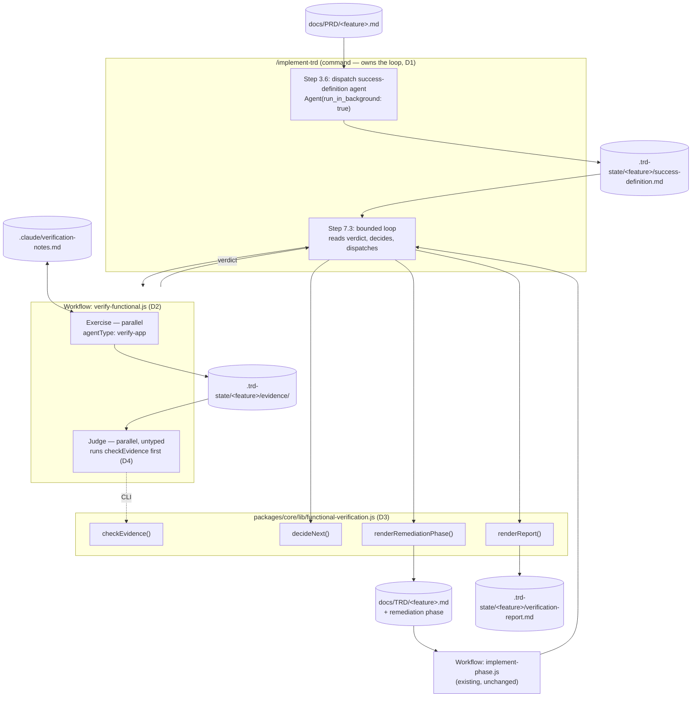
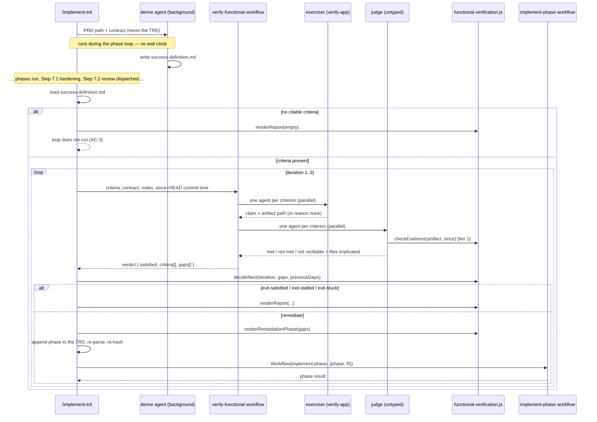

# TRD: Functional Verification of Delivered Software

**Version**: 1.0.0
**Status**: Draft
**Created**: 2026-08-17
**Last Updated**: 2026-08-17
**Author**: @technical-architect
**Source PRD**: `docs/PRD/functional-verification.md`
**Task ID Prefix**: FV

---

## Changelog

| Version | Date | Changes | Author |
|---------|------|---------|--------|
| 1.0.0 | 2026-08-17 | Initial TRD creation | @technical-architect |

---

## 1. Overview

### 1.1 Technical Summary

This feature adds one thing the implement chain does not have: a pass that asks whether a
user can do what the **PRD** says they can do, answered with artifacts rather than
assertions, and iterated on until it is satisfied or provably stalled.

It is built from parts that already exist. A background agent dispatched before the phase
loop derives a functional success definition from the PRD alone. At the tail of the run —
after Step 7's hardening and full-branch review — the command drives a bounded loop whose
two halves are already-proven mechanisms: a **workflow** (`verify-functional.js`) that fans
out one fresh-context agent per criterion to exercise the system and a second per criterion
to judge the evidence, and the **existing phase workflow** (`implement-phase.js`) to
dispatch remediation for whatever came back unmet.

Three properties drive every decision below:

- **The judgment is delegated; the control flow is not.** Loop bounds, evidence gating and
  remediation-phase generation are pure functions in one unit-tested module
  (`packages/core/lib/functional-verification.js`). An agent decides only whether a criterion
  is met.
- **Evidence outranks assertion.** A criterion is gated first by a deterministic check
  (the artifact exists, is non-empty, and is newer than HEAD) before any agent is asked what
  the artifact shows.
- **Fresh context, state on disk.** The success definition, the verifier's notes, the
  evidence and the loop state all live on disk, so a re-trigger resumes rather than
  re-derives.

The framework supplies *hints* about how to exercise a system, never a harness. A project
whose stack matches nothing in the hint table gets `not verifiable here` in the report,
which is the honest answer and the one that would have caught the 4.1.16 defects.

### 1.2 Key Technical Decisions

| ID | Decision | Choice | Serves Objective | Rationale | Alternatives Considered |
|----|----------|--------|------------------|-----------|------------------------|
| D1 | Where the loop lives | The outer loop is **command-driven** — a new Step 7.3 in `/implement-trd` — not a workflow script | FR-4, AC-5, AC-7 | Each iteration must (a) read the success definition from disk, (b) append a remediation phase to the TRD, (c) dispatch `Workflow(implement-phase, …)`. A workflow script has **no filesystem, no shell**, and no attested primitive for invoking another `Workflow` (`docs/TRD/completed/implement-trd-rework.md` §1.3). All three are things only the command can do. **This is a deliberate departure** from improvement-plan item 9a's *"the loop is a WORKFLOW, not a Stop hook"*: the half of that statement this design keeps is *not a Stop hook* — the reason (`stop_hook_active` is bypassable, wiggum's unit is a phase) is untouched. The determinism the plan wanted from a script is preserved by moving the loop's arithmetic into a pure module the command calls (D3), rather than by moving the loop itself | **Workflow-driven loop** as sketched in item 9a — rejected: it cannot dispatch a phase, which D-9a-1 requires, and would force remediation back to the loose agent D-9a-1 rejected. **Revisit** if workflow-from-workflow invocation becomes attested, at which point the loop body moves wholesale with no change to the module boundaries below. **A `Stop` hook / wiggum gate** — rejected, inherited from item 9a: wiggum's finest correction is a phase re-run, a granularity mismatch for a single failing criterion |
| D2 | Where the verification pass lives | One workflow script, `packages/core/workflows/verify-functional.js`, two stages: Exercise (parallel, one agent per criterion) then Judge (parallel, one agent per criterion) | FR-2, FR-3 | Fan-out of fresh-context agents whose per-agent output does **not** reach the orchestrator is exactly what `implement-phase.js` established (AC-F16.7 there). Each iteration then costs the command one structured verdict, not N transcripts | **Direct `Agent` fan-out from the command** — rejected: per-criterion transcripts land in orchestrator context, and the loop runs up to three times. **Revisit** if the workflow's per-call overhead is ever measured to dominate the agent cost |
| D3 | Deterministic half | One module, `packages/core/lib/functional-verification.js`, exporting `checkEvidence()`, `decideNext()`, `renderRemediationPhase()`, `renderReport()`, plus a CLI entry point | FR-3, FR-4, AC-4, AC-5 | Every loop-control question — is this artifact real, has a gap closed, is the cap hit, what does the remediation phase look like — is arithmetic over data, and arithmetic belongs in a unit-tested pure module rather than in prose an LLM re-derives per run. Same shape as `trd-parser.js` / `task-graph.js` | **Four separate modules** — rejected: they share one verdict shape, and splitting it invites drift between the renderer and the checker. **Prose in the command** — rejected: AC-5 would then be unverifiable except by running the whole loop three times |
| D4 | Tier-1 evidence gate placement | The **judge** agent's first action is to run the checker CLI over its criterion's artifact; it short-circuits to `not met` without reading content when tier 1 fails | FR-3, AC-4 | Keeps the whole pass to one workflow call per iteration. The exerciser and the judge are different agents, so the assertion is still not self-certified — which is what FR-3 is defending | **Tier 1 in the command between two workflow calls** (exercise → check → judge) — rejected: three dispatches per iteration for a saving that only applies to already-failing criteria. **Revisit** if judge dispatches on tier-1 failures show up as measurable waste in the first costed run |
| D5 | How the success definition is produced | A **background, untyped** agent dispatched by the command before the phase loop, whose entire instruction set is `packages/core/contracts/functional-verification.md`, handed the PRD path and never the TRD path or any TRD text | FR-1, AC-1, AC-2, AC-3 | `Agent({run_in_background: true})` is the primitive that makes "parallel, no wall clock" real rather than claimed. Independence is enforced structurally: the prompt names one file. PRD path is resolved by the command from the TRD's `**Source PRD**:` header, falling back to `.trd-state/current.json`'s `prd` | **A new `prd-verifier` agent type** — rejected: `constitution.md`'s 13-agent roster is owner-governed and adding to it is an architecture change requiring approval (`agent-validation.test.js` enforces the list). **Revisit** if the contract proves too large to carry as a prompt. **Adding `sourcePrd` to `trd-parser.js`** — rejected: that module's contract is Master Task List → records, and three commands depend on it; a header grep in the command is the smaller blast radius |
| D6 | `verify-app`'s role | **Repointed, not replaced**: a second mode that takes a success-definition criterion instead of a TRD acceptance criterion, plus the stack-keyed harness hint table and the notes discipline. Dispatched by the workflow as `agentType: 'verify-app'` for the Exercise stage | FR-2, FR-5, G1 | It already carries Verification Level Enforcement and a live-evidence format; this is the same move one level out, per item 9a. `agentType` from a workflow is attested (ITR-P003, cited in `implement-phase.js`) | **A sibling agent** — same roster objection as D5. **A plain untyped exerciser** — rejected: it would duplicate the verification-level and evidence-format text that already exists |
| D7 | Judge independence | The Judge stage uses an **untyped** agent, not `verify-app` | FR-3 | The exerciser has an interest in its own artifacts. A judge that is a different agent, reading only the artifact and the checker's output, is what makes "evidence, not assertion" structural rather than aspirational | **Same agent judges its own evidence** — rejected outright; it re-creates the failure FR-3 names |
| D8 | Remediation dispatch | Each unmet criterion becomes one task in a **remediation phase INSERTED into the TRD at two points — inside `## 4. Master Task List` and inside `## 9. Task Grounding`** (never appended: `findSection` bounds a section at the next heading of equal-or-lower level, so anything after `## Could Not Verify` is invisible to `parseTrd`, and the dispatch that follows is a silent no-op that reads as success), rendered deterministically by `renderRemediationPhase()`, then dispatched via the existing `Workflow(implement-phase, …)` | FR-4, AC-7, R2 | Inherited from D-9a-1. It buys wave partitioning, file-conflict serialization, `agentType` resolution, the phase gate and per-task accounting for free. **Added here:** when the judge implicates no files for a gap, the renderer emits that phase's tasks as a serial chain rather than a parallel wave, because an empty `Touches` conflicts with nothing and would let two blind fixes race | **A loose remediation agent** — rejected by D-9a-1: unscoped fixes inside a 3-iteration loop are how a fix for criterion 3 breaks criterion 1 |
| D9 | Persistent state layout | `success-definition.md`, `verification.json`, `verification-report.md` and `evidence/` all under `.trd-state/<feature>/`; the verifier's learned mechanics at `.claude/verification-notes.md` | FR-1, FR-4, FR-5, FR-6, AC-8 | Definition path is D-9a-3, verbatim. Notes path and its "not in `.claude/rules/`" placement are the owner's 2026-08-17 correction. Loop state is a **separate file from `implement.json`** because that file already has two writers (the command and `status.js` on `SubagentStop`) | **Extend `implement.json`** — rejected on the write-contention ground above. **Revisit** if a consumer ever needs the two atomically consistent |
| D10 | Evidence artifacts are not committed | `.trd-state/*/evidence/` is added to `.gitignore`; the definition, the report and the notes stay tracked | FR-3, FR-6 | `.trd-state/` is deliberately tracked, and screenshots/transcripts are binary working state with a per-run lifetime. Freshness is unaffected — the tier-1 check compares mtime to HEAD's commit time, not to git status | **Commit everything** — rejected: repository bloat with no consumer. **Revisit** if a reviewer ever needs to re-read an artifact after the branch merges |
| D11 | Opt-in flag | `/implement-trd --verify-functional`, default off | AC-6, R3 | AC-6 names this outright; D-9a-2 gives the reason (unpriced cost on a 1.0-agents-per-task loop) and the condition for flipping it | **On by default** — rejected until a real run yields a cost figure. **Revisit** is explicit: the first costed run |
| D12 | Harness knowledge | A stack-keyed **hint table** in the contract and in `verify-app`'s prompt (web UI → browser driving; HTTP API → request/response transcript diffed against the declared interface; CLI → invoke and assert on output; mobile → simulator harness), plus a mandate to read `CLAUDE.md` / `stack.md` / the existing suites. No harness is implemented | FR-2, FR-6, NG2 | The PRD's non-goal is explicit: this ships hints, not capability. A stack the table does not cover resolves to `not verifiable here` rather than to an invented harness | **Implement a generic harness** — rejected by NG2. **Require the PRD to declare a harness** — rejected: that is the upstream blocker item 9a's design removed |

### 1.3 Technology Stack

| Layer | Technology | Purpose | Notes |
|-------|------------|---------|-------|
| Deterministic core | JavaScript / Node.js 18+ | `packages/core/lib/functional-verification.js` — evidence gate, loop decision, remediation-phase and report renderers | `stack.md` Languages table; same shape as `trd-parser.js` / `task-graph.js` |
| Orchestration (per pass) | `Workflow` prompt-DSL script | `packages/core/workflows/verify-functional.js` — Exercise then Judge fan-out | No filesystem, no shell, no `Date.now()`; every input arrives in `args` |
| Orchestration (loop) | Command prompt (Markdown) | `/implement-trd` Step 7.3 | Commands are prompts with optional shell — `constitution.md` Principle 3 |
| Agent prompts | Markdown | `verify-app` second mode; `packages/core/contracts/functional-verification.md` | `constitution.md` Principle 2 — prompts only, no executable code |
| Unit tests | Jest ^29.7.0 | Lib module and workflow script | `stack.md` Testing table; workflow scripts are exercised through `packages/core/workflows/test-harness.js` |
| End-to-end | BATS ^1.9.0 + `test/smoke/` | `[LIVE]` scenario driving the real command | `stack.md`; `run-smoke.sh` scenario registry |

No new runtime dependency is introduced.

### 1.4 Integration Points

| System | Type | Direction | Notes |
|--------|------|-----------|-------|
| `packages/core/workflows/implement-phase.js` | Workflow invocation | Out | Remediation phases are dispatched through it unchanged (D8) |
| `packages/core/lib/trd-parser.js`, `task-graph.js` | Node modules | In | Re-parsed after the remediation phase is appended, to produce that phase's waves |
| `packages/core/lib/implement-state.js` | Node module | In | `save()` is filepath-generic; reused for `verification.json`'s atomic write |
| `docs/PRD/<feature>.md` | Markdown artifact | In | Sole input to the success-definition pass (D5) |
| `docs/TRD/<feature>.md` | Markdown artifact | Both | Read for task/phase structure; **appended to** with remediation phases (D8) |
| `.claude/rules/stack.md`, `CLAUDE.md`, project memory | Markdown | In | How to exercise this project (D12); what is safe to exercise (S-2) |
| `git` | CLI | In | HEAD commit time supplies the tier-1 freshness baseline |
| `packages/core/scripts/scaffold-project.sh` | Shell | Out | Delivers the new contract, lib and workflow by directory glob — **no change required**; `copy_libs`/`copy_workflows`/`copy_contracts` add missing files on `--refresh` as of the 2026-08-16 fix |

---

## 2. System Architecture

### 2.1 Architecture Overview



### 2.2 Component Architecture

#### 2.2.1 `packages/core/contracts/functional-verification.md`

**Responsibility**: The binding instruction set for every agent in this feature — how to
derive a success definition with mandatory PRD-line citation, how to exercise a system
(the D12 hint table), what an evidence artifact is, the notes discipline, and the report's
shape. Mirrors the `task-delegation.md` / `trd-authoring.md` pattern: a command reads it and
passes the text in `args`; the agents read the text, not the file.

**Interfaces**: consumed as prompt text by the success-definition agent (via the command)
and by both workflow stages (via `args.contract`).
**Dependencies**: none.

#### 2.2.2 `packages/core/lib/functional-verification.js`

**Responsibility**: every deterministic decision in the loop.
**Interfaces**: `checkEvidence()`, `decideNext()`, `renderRemediationPhase()`,
`renderReport()`; plus a `require.main === module` CLI so the judge agent can invoke the
evidence gate without a `node -e` one-liner.
**Dependencies**: `fs` only (for `statSync` in `checkEvidence`). No git, no network.

#### 2.2.3 `packages/core/workflows/verify-functional.js`

**Responsibility**: one verification pass. Stage 1 exercises each criterion in parallel and
produces artifacts; stage 2 judges each in parallel, tier-1 gate first.
**Interfaces**: `args` in, one structured verdict out (§3.3).
**Dependencies**: the platform's `agent()` / `parallel()` / `phase()` / `log()`; nothing on
disk.

#### 2.2.4 `verify-app` (second mode)

**Responsibility**: exercising the built system against one functional criterion and
maintaining `.claude/verification-notes.md`.
**Interfaces**: dispatched with `agentType: 'verify-app'`; returns a claim, not a verdict.
**Dependencies**: `constitution.md` (verification level, already read), `stack.md`,
`CLAUDE.md`, the project's own suites.

#### 2.2.5 `/implement-trd` Step 7.3

**Responsibility**: the loop. Resolve the PRD, dispatch the derive pass early, read the
definition late, call the workflow, apply `decideNext()`, append and dispatch remediation
phases, write the report and the banner line.
**Dependencies**: everything above, plus `implement-phase.js` unchanged.

### 2.3 Data Flow



### 2.4 State Management

Four durable artifacts, three lifetimes:

| Artifact | Lifetime | Writer | Tracked |
|----------|----------|--------|---------|
| `.trd-state/<feature>/success-definition.md` | per feature | derive agent | yes |
| `.trd-state/<feature>/verification.json` | per feature | command, via `implement-state.save()` | yes |
| `.trd-state/<feature>/verification-report.md` | per feature, rewritten per run | command | yes |
| `.trd-state/<feature>/evidence/` | per run | exerciser agents | **no** (D10) |
| `.claude/verification-notes.md` | per project, cumulative | `verify-app` | yes |

A re-trigger reads all of these and resumes: the definition is not re-derived, prior gaps
and prior iteration count are already on disk, and the notes carry what was learned about
how to start the app.

---

## 3. Technical Specifications

### 3.1 Success definition — `.trd-state/<feature>/success-definition.md`

**Purpose**: the promise the verifier checks against. Derived from the PRD alone (D5).

**Format** — a header block plus one table, one criterion per row (D-9a-3):

```markdown
# Functional Success Definition: <feature>

**Source PRD**: docs/PRD/<feature>.md
**Derived**: <ISO8601>
**Criteria**: <n>

| ID | Functional statement | Cites | Evidence that would prove it | Derivation |
|----|----------------------|-------|------------------------------|------------|
| FS-1 | A user can sign in with a valid password and reach the dashboard | FR-2, §4 line 51 | HTTP transcript: POST /auth/login → 200 with a session cookie; screenshot of the dashboard | [read] |
| FS-2 | A repeated submit does not create two orders | domain-derived: payment flows must not double-charge | Two POSTs with one idempotency key → one row in `orders` | domain-derived |
```

**Behavior**:
- Every row's `Cites` names a PRD line, or the row is labelled `domain-derived` with its
  reasoning inline. A row that can do neither is **dropped, not invented** (FR-1, AC-2).
- Zero rows is a legitimate outcome. The file is still written, with `**Criteria**: 0` and a
  one-paragraph statement of why the PRD yielded none (AC-3).
- `Evidence that would prove it` is what the exerciser aims to produce. It is a target, not
  a contract — an exerciser that produces a *different* artifact that proves the same thing
  records why in the notes.

**Error handling**:
- PRD path does not resolve → the file is not written; the command reports
  `not run: no PRD resolved` in the report and the banner. This is **distinct** from AC-3's
  empty definition and must not be reported as one.
- The background agent has not finished when Step 7.3 begins → the command waits on the
  outstanding background task before reading; if it never produced the file, that is the
  `not run` path above.

### 3.2 Evidence gate — `checkEvidence()`

**Purpose**: tier 1 of FR-3. Deterministic, cheap, and not settable by an agent.

**Interface**:

```typescript
interface EvidenceClaim {
  criterion: string;       // "FS-1"
  artifact: string | null; // repo-relative path, or null when the exerciser produced none
  reason?: string;         // why no artifact exists
}

interface EvidenceVerdict {
  criterion: string;
  tier1: 'pass' | 'fail';
  artifact: string | null;
  bytes: number | null;
  mtimeSec: number | null;
  failure?: 'missing' | 'empty' | 'stale' | 'no-artifact';
}

function checkEvidence(claims: EvidenceClaim[], sinceSec: number): EvidenceVerdict[];
```

**Behavior**:
- `missing` — the path does not exist.
- `empty` — it exists with zero bytes.
- `stale` — its mtime is not strictly greater than `sinceSec` (the HEAD commit time,
  supplied by the command from `git log -1 --format=%ct`). An artifact older than the code
  it claims to prove is not evidence.
- `no-artifact` — the claim carried none. Tier 1 fails; the criterion can still resolve to
  `not verifiable here` on the judge's reading of the stated reason.
- Pure apart from `fs.statSync`. No git, no clock: `sinceSec` is a parameter so the function
  is testable without a repository.

**CLI**: `node .claude/lib/functional-verification.js check-evidence '<claims-json>' <sinceSec>`
prints the verdict array as JSON. This is what the judge agent invokes (D4).

### 3.3 Verification pass — `verify-functional.js`

**Purpose**: one iteration's exercise-and-judge, as a workflow (D2).

**Interface**:

```typescript
// args
interface VerifyFunctionalArgs {
  criteria: Array<{ id: string; statement: string; cites: string; evidence: string; derivation: string }>;
  contract: string;      // functional-verification.md text — the workflow cannot read files
  notes: string;         // .claude/verification-notes.md text, or "" when it does not exist
  stackHints: string;    // stack.md + CLAUDE.md excerpts the command resolved
  evidenceDir: string;   // ".trd-state/<feature>/evidence"
  checker: string;       // ".claude/lib/functional-verification.js"
  since: number;         // HEAD commit time, seconds
  priorGaps: string[];   // criterion ids unmet at the end of the previous iteration
  iteration: number;
  project: string;       // "" when the target is the repo the workflow runs in
}

// return
interface VerifyFunctionalResult {
  satisfied: boolean;
  criteria: Array<{
    id: string;
    status: 'met' | 'not_met' | 'not_verifiable';
    tier1: 'pass' | 'fail' | 'skipped';
    artifact: string | null;
    reason: string | null;   // required when status is not 'met'
    files: string[];         // implicated source files, for the remediation phase's Touches
  }>;
  gaps: string[];
  exercised: string;         // "5/6" — dead agents are visible, not laundered
  notesUpdated: boolean;
}
```

**Behavior**:
- **Exercise stage**: `parallel()` over criteria, `agentType: 'verify-app'`, one thunk per
  criterion. Each agent receives the contract text, the notes text, the stack hints, its own
  criterion, and the evidence directory to write into.
- **Judge stage**: `parallel()` over criteria, untyped (D7). Each judge runs the checker CLI
  over its criterion's claim **first** and skips content analysis when tier 1 fails,
  recording `tier1: 'fail'` and `status: 'not_met'`.
- `not_verifiable` is returned when the project has no way to exercise the criterion — an
  absent harness, an unmatched stack, or a target `stack.md` does not authorize. It is never
  a substitute for `not_met`.
- `files` is populated on `not_met` so the remediation phase gets real `Touches` entries.

**Error handling**:
- A dead `agent()` call returns `null`. Following `implement-phase.js` verbatim: record the
  criterion as `not_met` with `reason: "agent returned nothing"` rather than dereferencing
  it, and reflect the loss in `exercised`. A dead reviewer must never read as a clean one.
- `readArgs` / `required` guards are copied from `implement-phase.js`, which copied them from
  `audit-trd.js`. Missing `criteria` is a thrown error (nothing downstream can run); an
  **empty** `criteria` array is not — it returns `satisfied: true, gaps: []` with
  `exercised: "0/0"`, because the command should not have called it at all and a throw here
  would turn AC-3's correct outcome into a crash.

### 3.4 Loop decision — `decideNext()`

**Purpose**: FR-4's three exits, as arithmetic (AC-5).

**Interface**:

```typescript
type LoopAction = 'exit-satisfied' | 'exit-stalled' | 'exit-stuck' | 'remediate';

function decideNext(input: {
  iteration: number;        // 1-based, the iteration whose verdict this is
  gaps: string[];
  previousGaps: string[] | null;   // null on iteration 1
  cap?: number;             // default 3
}): { action: LoopAction; reason: string; closed: string[] };
```

**Behavior**, evaluated in this order:
1. `gaps.length === 0` → `exit-satisfied`.
2. `previousGaps` is non-null and `closed.length === 0` → `exit-stalled`. `closed` is
   `previousGaps \ gaps`. An iteration that closes nothing is repeating itself.
3. `iteration >= cap` → `exit-stuck`.
4. otherwise → `remediate`.

The cap is **3**, matching `implement-trd.md`'s existing retry convention (`:599`) —
inherited, not chosen here.

### 3.5 Remediation phase — `renderRemediationPhase()`

**Purpose**: turn gaps into a phase the existing workflow can dispatch (D8, AC-7).

**Interface**:

```typescript
function renderRemediationPhase(input: {
  gaps: Array<{ id: string; statement: string; reason: string; files: string[] }>;
  prefix: string;          // the TRD's task-ID prefix, e.g. "FV"
  phaseNumber: number;     // max existing phase + 1
  existingIds: string[];   // to guarantee ID uniqueness
  iteration: number;
}): { markdown: string; grounding: string; taskIds: string[] };
```

**Behavior**:
- One task per gap: `### Phase <n>: Functional remediation (iteration <i>)` followed by a
  Master-Task-List-shaped table whose rows carry `Serves` = the criterion id, and a matching
  Task Grounding block per task with `Touches` = the judge's `files`.
- **Serialization fallback**: any gap whose `files` is empty makes the whole phase a serial
  chain — each task lists the previous task in `Dependencies`. An empty `Touches` conflicts
  with nothing in `task-graph.js` by design, so without this two blind fixes could run
  concurrently against the same file. This is the mechanical half of R2's mitigation.
- The markdown it emits is parseable by `trd-parser.js` as written — same heading shape,
  same column set, same grounding bullet fields.

### 3.6 Report — `renderReport()`

**Purpose**: FR-6, AC-9.

**Interface**:

```typescript
function renderReport(input: {
  feature: string;
  prd: string;
  definitionPath: string;
  outcome: 'satisfied' | 'stalled' | 'stuck' | 'not-run';
  reason: string;
  criteria: Array<{
    id: string; statement: string; cites: string;
    status: 'met' | 'not_met' | 'not_verifiable';
    artifact: string | null; reason: string | null;
    attempts: Array<{ iteration: number; tasks: string[]; result: string }>;
    blocker: string | null;
  }>;
}): string;   // markdown
```

**Behavior**: every criterion in the definition appears in the report, including
`not_verifiable` ones and including criteria that were met on iteration 1 and never
re-examined (AC-9). `not_verifiable` renders in its own section with the stated reason, not
folded into failures.

### 3.7 Command surface — `/implement-trd`

**Flag**: `--verify-functional`. Absent → nothing in this TRD executes, including the
background derive pass (AC-6). The usage block, the `Parse:` line and the Execution Model
diagram all name it.

**Step 3.6 (new)** — after the graph is built and before the phase loop, when the flag is
set: resolve the PRD path, then

```
Agent({ subagent_type: "general-purpose", run_in_background: true, name: "success-definition",
        prompt: <contract text> + <PRD path> + <output path> })
```

The prompt names the PRD path and the output path and **nothing else** — no TRD path, no TRD
excerpt, no task list (FR-1, AC-1).

**Step 7.3 (new)** — after Step 7.2, the loop of §2.3. It writes `verification.json` before
each dispatch (state-write-before-delegate, matching Step 4.1), appends to the TRD and
re-parses the mutated TRD (does NOT touch `trd_hash` — it has no producer anywhere in the live tree and no consumer that would notice; re-parsing is what actually picks up the inserted tasks), and ends by writing the report.

**Step 8** — the completion banner gains a FUNCTIONAL VERIFICATION block naming the outcome,
the met/unmet/unverifiable counts and the report path. When the flag was not passed, the
block reads `not run (--verify-functional not set)` rather than being omitted, so its absence
is never mistaken for a pass.

---

## 4. Master Task List

### 4.1 Task ID Convention

Task IDs follow `[PREFIX]-[CATEGORY][SEQ]` with PREFIX `FV`.

- `P` = Plugin/Infrastructure setup, `B` = Backend implementation, `T` = Testing,
  `D` = Documentation, `I` = Integration.
- `[LIVE]` marks tasks that require verification against a running instance, overriding
  `constitution.md`'s project-level `verification_level: unit-only`.

### 4.2 Phase 1: Contract and deterministic core

| Task ID | Description | Serves | Skills | Dependencies | Acceptance Criteria |
|---------|-------------|--------|--------|--------------|---------------------|
| FV-P001 | Write `packages/core/contracts/functional-verification.md`: the derive discipline (mandatory PRD citation, `domain-derived` labelling, empty-is-correct), the D12 stack-keyed harness hint table, what counts as an evidence artifact, the `[read]`/`[ran]`/`[inferred]` notes discipline and correct-don't-work-around rule, the credential rule (S-1), the authorization rule (S-2), and the report shape. Mirror to `.claude/contracts/` | FR-1, FR-3, FR-5, FR-6, AC-2, AC-3, S-1, S-2, D12 | | None | The file exists in both trees and is byte-identical; it states the citation rule, the empty-definition rule, the four stack hint rows, the three derivation markers, and that credentials are recorded by location only; it contains no instruction to invent a criterion or a harness |
| FV-B001 | Build `packages/core/lib/functional-verification.js` per §3.2–§3.6 — `checkEvidence`, `decideNext`, `renderRemediationPhase`, `renderReport`, plus the `check-evidence` CLI — with its Jest suite. Mirror to `.claude/lib/` | FR-3, FR-4, FR-6, AC-4, AC-5, AC-9, D3, D8, R2 | `jest` | None | Unit tests cover all four `checkEvidence` failure modes, all four `decideNext` branches including `previousGaps === null`, the empty-`files` serial-chain fallback in `renderRemediationPhase`, and a `renderReport` case containing one criterion of each status; the rendered remediation markdown round-trips through `trd-parser.js` to the expected task and grounding records; the module uses no clock and no git; coverage of the module meets the Q-1 floor |

### 4.3 Phase 2: Verification pass

| Task ID | Description | Serves | Skills | Dependencies | Acceptance Criteria |
|---------|-------------|--------|--------|--------------|---------------------|
| FV-B002 | Build `packages/core/workflows/verify-functional.js` per §3.3 — Exercise stage (`parallel`, `agentType: 'verify-app'`, thunks) then Judge stage (`parallel`, untyped, checker-first) — with its Jest suite via `workflows/test-harness.js`. Mirror to `.claude/workflows/` | FR-2, FR-3, AC-4, D2, D4, D7 | `jest` | FV-P001, FV-B001 | The script opens no file, runs no shell, and uses no `Date.now()`/`Math.random()`/argless `new Date()`; tests assert Exercise completes before Judge dispatches, that `agentType: 'verify-app'` is passed on Exercise and absent on Judge, that a `null` agent result yields `not_met` with a stated reason and is reflected in `exercised`, that an empty `criteria` array returns `satisfied: true` without dispatching, and that the judge prompt instructs the checker CLI call before any content reading; coverage meets the Q-1 floor |
| FV-B003 | Repoint `packages/full/agents/verify-app.md`: add a Functional Success Definition mode (input is one criterion, output is a claim plus an artifact path or a stated reason, never a verdict on its own evidence), the D12 hint table, the `stack.md`/`CLAUDE.md` read mandate, S-2's authorization rule, and the `.claude/verification-notes.md` read/write discipline. Mirror to `.claude/agents/` | FR-2, FR-5, AC-8, D6, D12, S-2 | | FV-P001 | The existing TRD-acceptance-criteria mode and Verification Level Enforcement are unchanged and still first in the file; the new mode states that the agent does not decide `met`/`not met`; the notes section names the three derivation markers and the correct-on-failure rule; `agent-validation.test.js` still passes with 13 agents |
| FV-B004 | Add `--verify-functional` to `/implement-trd` (`packages/core/commands/implement-trd.md`): usage block, `Parse:` line, Execution Model diagram, and Step 3.6's background derive dispatch with PRD-path resolution (TRD `**Source PRD**:` header → `.trd-state/current.json`). Mirror to `.claude/commands/` | FR-1, AC-1, AC-6, D5, D11 | | FV-P001 | Without the flag no derive agent is dispatched and no `.trd-state/*/success-definition.md` appears; with it the dispatch is `run_in_background: true` and its prompt contains the PRD path and the contract text and **no** TRD path or TRD excerpt; an unresolvable PRD path is reported as `not run: no PRD resolved`, distinct from an empty definition |

### 4.4 Phase 3: The loop

| Task ID | Description | Serves | Skills | Dependencies | Acceptance Criteria |
|---------|-------------|--------|--------|--------------|---------------------|
| FV-B005 | Add Step 7.3 to `/implement-trd`: read the definition from disk (generate it inline if absent — never wait on the background task; no primitive exists for a lead to block on a specific `Agent({run_in_background})`, and Step 7.3 runs at the tail so the dispatch has long finished), skip on zero criteria, per iteration call `Workflow(verify-functional, …)`, apply `decideNext()`, on `remediate` append the rendered remediation phase to the TRD + recompute `trd_hash` + re-parse + `Workflow(implement-phase, …)`, persist `verification.json` before each dispatch, write the report, extend Step 6's state-file documentation and Step 8's banner, and add `.trd-state/*/evidence/` to `.gitignore`. Mirror to `.claude/commands/`. **Split from FV-B004 despite sharing `implement-trd.md`** on both permitted grounds: size (a whole new step with loop semantics, TRD mutation and report emission would return a partial result VERIFY could not judge alongside the flag work) and verifiability (AC-1/AC-6 and AC-5/AC-7/AC-9 are separately checkable) | FR-2, FR-4, FR-6, AC-3, AC-5, AC-7, AC-9, D1, D8, D9, D10 | | FV-B001, FV-B002, FV-B003, FV-B004 | Step 7.3 sits after Step 7.2 and before Step 8; all three exits are taken from `decideNext()` rather than re-derived in prose; remediation is dispatched **only** through `Workflow(implement-phase, …)` — no `Agent(` call appears in the remediation path; a zero-criteria definition produces a report and no workflow dispatch; `verification.json` is written before each dispatch; `.gitignore` excludes evidence while the definition, report and notes stay tracked |

### 4.5 Phase 4: End-to-end

| Task ID | Description | Serves | Skills | Dependencies | Acceptance Criteria |
|---------|-------------|--------|--------|--------------|---------------------|
| FV-T001 | `[LIVE]`: add `test/smoke/scenarios/verify-functional.sh` and register it in `run-smoke.sh`'s `SCENARIO_TIMEOUT` and `LLM_OPT_IN_SCENARIOS`. It scaffolds a throwaway project with a one-requirement PRD and a matching one-task TRD, runs `/implement-trd` **without** the flag and asserts no success definition appears, then runs it **with** the flag and asserts the definition, the report and a COMMAND COMPLETE banner | AC-1, AC-6, AC-9, G3 | | FV-B005 | Both runs terminate with a banner; the no-flag run leaves no `success-definition.md`; the flag run produces a definition whose every row carries a `Cites` value or a `domain-derived` label, and a report naming every criterion in the definition; the scenario is opt-in (absent from `ALL_SCENARIOS`) and skips rather than fails when `claude` or `jq` is unavailable |

---

## 5. Execution Plan

### 5.1 Phase Overview

| Phase | Focus | Prerequisites | Parallelizable Sessions |
|-------|-------|---------------|------------------------|
| 1 | Contract and deterministic core (each task ships its own unit tests) | None | 1A, 1B in parallel |
| 2 | Verification pass — workflow, agent mode, command flag | Phase 1 complete | 2A, 2B, 2C in parallel |
| 3 | The loop | Phase 2 complete | Single session |
| 4 | `[LIVE]` end-to-end | Phase 3 complete | Single session |

Unit tests ship inside FV-B001 and FV-B002; there is no separate unit-test task. FV-T001 is
the one thing that legitimately needs the whole system assembled.

### 5.2 Session Details

#### Phase 1

**Session 1A: Contract**
- Tasks: FV-P001
- Agent: @agent-implementer
- Can parallelize with: Session 1B

**Session 1B: Deterministic core**
- Tasks: FV-B001
- Agent: @backend-implementer
- Can parallelize with: Session 1A

#### Phase 2

**Session 2A: Verification workflow**
- Tasks: FV-B002
- Agent: @backend-implementer
- Blocked by: Sessions 1A, 1B

**Session 2B: verify-app repointing**
- Tasks: FV-B003
- Agent: @agent-implementer
- Blocked by: Session 1A
- Can parallelize with: 2A, 2C

**Session 2C: Command flag and derive dispatch**
- Tasks: FV-B004
- Agent: @agent-implementer
- Blocked by: Session 1A
- Can parallelize with: 2A, 2B

#### Phase 3

**Session 3A: Loop**
- Tasks: FV-B005
- Agent: @agent-implementer
- Blocked by: 2A, 2B, 2C

#### Phase 4

**Session 4A: End-to-end**
- Tasks: FV-T001
- Agent: @backend-implementer
- Blocked by: 3A

### 5.3 Parallelization Map

```mermaid
gantt
    title Execution Plan (No time scale - dependency order only)
    dateFormat X
    axisFormat %s

    section Phase 1
    Session 1A (FV-P001): p1a, 0, 1
    Session 1B (FV-B001): p1b, 0, 1

    section Phase 2
    Session 2A (FV-B002): p2a, after p1a p1b, 1
    Session 2B (FV-B003): p2b, after p1a, 1
    Session 2C (FV-B004): p2c, after p1a, 1

    section Phase 3
    Session 3A (FV-B005): p3a, after p2a p2b p2c, 1

    section Phase 4
    Session 4A (FV-T001): p4a, after p3a, 1
```



### 5.4 Critical Path

`FV-P001 → FV-B002 → FV-B005 → FV-T001`, with `FV-B001 → FV-B002` joining at the same
point. FV-B003 and FV-B004 are off the critical path and can absorb slack.

FV-B004 and FV-B005 both touch `packages/core/commands/implement-trd.md` and therefore
serialize under `task-graph.js`'s file-conflict edge regardless of the phase boundary. That
serialization is intended, and the split is justified in FV-B005's row.

### 5.5 Offload Recommendations

| Task | Recommended Agent | Rationale |
|------|-------------------|-----------|
| FV-P001, FV-B003, FV-B004, FV-B005 | @agent-implementer | Contract text, agent prompts and command prompts are prompt engineering, which is that agent's stated domain |
| FV-B001, FV-B002 | @backend-implementer | JavaScript modules with Jest suites |
| FV-T001 | @backend-implementer | BATS scenario plus shell fixture plumbing |

---

## 6. Quality Requirements

### 6.1 Testing Requirements

| Type | Coverage Target | Source | Scope |
|------|-----------------|--------|-------|
| Unit Tests | >= 60% | `constitution.md` Quality Gates | `packages/core/lib/functional-verification.js`, `packages/core/workflows/verify-functional.js` |
| Integration Tests | >= 50% **when applicable — not applicable here** | `constitution.md` Quality Gates ("when applicable") | This feature's integration surface is `test/smoke/scenarios/verify-functional.sh`, a BATS-driven live scenario. No coverage instrumentation exists for shell in this repository (`package.json`'s test script is `jest`; no kcov configuration exists anywhere outside design documents), so no percentage is measurable. The integration objective is discharged by FV-T001's named assertions instead |

No figure here exceeds a `constitution.md` floor.

### 6.2 Code Quality Standards

`constitution.md`'s Quality Gates also require, before completing any implementation: no
secrets in code, input validation present, documentation updated. The first is sharpened by
S-1 below; the third is satisfied inside FV-B005 (Step 6 and Step 8 documentation) rather
than as a separate documentation task.

`stack.md` names Prettier, ESLint and ShellCheck under Code Quality. Neither Prettier nor
ESLint is installed in this repository (`package.json` devDependencies are `bats`, `jest`,
`js-yaml`, `mock-fs`), so no lint gate is asserted for the JavaScript here — the same
finding `implement-trd-rework.md` v1.1.0 recorded and acted on.

### 6.3 Security Requirements

| ID | Objective | Source |
|----|-----------|--------|
| S-1 | `.claude/verification-notes.md`, the report and the success definition record **where** a credential comes from, never its value. The notes file is committed | `docs/modernization/2026-08-improvement-plan.md` item 9a: *"Security is unchanged: the file is committed. It records WHERE credentials come from, never their values"* |
| S-2 | The verifier exercises only a target the project authorizes — `stack.md`, `CLAUDE.md` or an explicitly local/ephemeral instance. Where nothing authorizes a target, the criterion resolves to `not verifiable here` rather than to a guessed endpoint | **domain-derived.** This feature hands an autonomous loop a browser, a shell and up to three remediation rounds. An unauthorized target is not a quality problem but a production-impact one, and the PRD's own non-goal ("how to exercise a given system is the project's responsibility") leaves target selection undefined — silence there is exactly where an agent would improvise |

### 6.4 Performance Requirements

None. No latency, throughput or uptime figure is stated in the PRD, in `stack.md`, in
`constitution.md`, or by the user. The one cost question anyone raised — what a verification
cycle costs — is an explicit PRD Open Question with no measurement behind it yet, and it is
the reason AC-6 makes the loop opt-in. Inventing a budget here would consume a task proving a
number nobody asked for; see OQ-1.

---

## 7. Risk Assessment

### 7.1 Risks Imported from PRD

| PRD Risk ID | Risk | Technical Mitigation |
|-------------|------|---------------------|
| R1 | The success definition manufactures criteria the PRD does not support | The citation rule is in the contract (FV-P001) and the definition's table has a mandatory `Cites` column (§3.1). A row with neither a citation nor a `domain-derived` label is dropped by the deriving agent, and its absence is visible because the report names every row that survived |
| R2 | Remediation for one criterion breaks another | Dispatch as a phase (D8), inheriting `task-graph.js`'s file-conflict serialization. Sharpened here: the judge returns implicated `files` per gap so the remediation tasks have real `Touches`, and `renderRemediationPhase()` falls back to a serial chain when it does not — an empty `Touches` conflicts with nothing by design and would otherwise defeat the very mechanism this mitigation relies on |
| R3 | Cost per cycle makes it unaffordable | Opt-in behind `--verify-functional` (D11). The E2E scenario is registered opt-in rather than in `ALL_SCENARIOS`, so it does not add cost to the default smoke run either |
| R4 | Notes accumulate wrong beliefs with no reviewer | Derivation markers and correct-on-failure are in the contract (FV-P001) and in `verify-app`'s prompt (FV-B003). The file is committed, so it is at least diff-reviewable |
| R5 | The verifier reports green for checks that never ran | `not verifiable here` is a distinct status all the way through the type: the workflow's return schema, `renderReport()`'s sections, and the completion banner's counts. The `exercised: "n/m"` field makes a dead agent visible rather than laundering it into a pass — the same defect `implement-phase.js` fixed with its `*Reported` flags |

### 7.2 Technical Risks

| ID | Risk | Likelihood | Impact | Mitigation |
|----|------|------------|--------|------------|
| TR1 | **FR-2's ordering is not fully achievable as written.** Step 7.2 dispatches `/code-review` and deliberately does **not** block on it (it forks to background subagents). Verification at Step 7.3 therefore runs after Step 7.1's *applied* hardening fixes, but possibly before Step 7.2's review fixes land | High | Med | Do not paper over it: Step 7.3 records in `verification.json` and in the report which review passes had completed when the loop started. Step 7.1's fan-out **is** blocking and is where fixes are applied inline, so the majority of "code after review" is real. See OQ-2 |
| TR2 | Appending a remediation phase mutates the TRD mid-run, invalidating `trd_hash` and the parse the command has in hand | Med | Med | FV-B005 recomputes `trd_hash` and re-parses through `trd-parser.js`/`task-graph.js` before dispatching the remediation phase, so Step 2.3's state validation and the wave partition both see the mutated document. FV-B001's round-trip test (rendered markdown → parser → expected records) is what keeps the renderer and the parser from drifting |
| TR3 | The background derive agent is dispatched at Step 3.6 and read at Step 7.3, hundreds of tool calls later. If it died, the loop sees an absent file | Med | Low | Two outcomes are kept distinct by construction: an absent file is `not run: no definition produced`, a present file with zero rows is AC-3's correct empty outcome. Conflating them would report a crashed agent as "the PRD had nothing to verify" |

### 7.3 Contingency Plans

**TR1 Contingency**: if a costed run shows review fixes routinely landing after verification
started, the fix is to make Step 7.2 blocking for the `--verify-functional` path only, not to
move verification earlier. Verification must stay last; that is FR-2's substance.

**TR2 Contingency**: if re-parsing after mutation proves unreliable, the fallback is to write
the remediation phase to the TRD and exit `stuck` with the phase staged but undispatched, so
the operator re-enters via `/implement-trd --resume`. A wrong wave partition is worse than a
manual re-entry.

---

## 8. Non-Goals (Scope Boundaries)

The following are **explicitly out of scope** per the PRD. Implementation agents MUST reject
requests that fall into these categories.

| PRD ID | Non-Goal | Rationale |
|--------|----------|-----------|
| NG1 | Replacing any existing verification | Per-task unit tests, the phase gate and `/audit-build` all stay. This adds the functional layer none of them cover |
| NG2 | A universal verification harness | How to exercise a given system is the project's responsibility (`CLAUDE.md`, `stack.md`, project memory, its existing suites). This ships hints, not capability |
| NG3 | Verifying acceptance criteria | Already covered three ways |
| NG4 | Running by default | Cost is unmeasured; see AC-6 |

---

## 9. Task Grounding

Written after reading `packages/core/lib/trd-parser.js`, `packages/core/lib/task-graph.js`,
`packages/core/lib/implement-state.js`, `packages/core/workflows/implement-phase.js`,
`packages/core/workflows/test-harness.js`, `packages/core/commands/implement-trd.md`,
`packages/full/agents/verify-app.md`, `.claude/agents/agent-validation.test.js`,
`packages/core/agents/agent-validation.test.js`, `packages/core/scripts/scaffold-project.sh`,
`.claude/contracts/trd-authoring.md`, `test/smoke/run-smoke.sh`, `test/smoke/lib/project.sh`,
`test/smoke/lib/assert.sh`, `test/smoke/scenarios/implement-one-task.sh`, `.gitignore`,
`package.json`, and the TRDs under `docs/TRD/`. Every claim carries `[read]`, `[ran]` or
`[inferred]`. Anchors are symbols and literal strings; line numbers sit beside them as a
convenience and rot on the first edit.

### Ground truth verified for the whole TRD

| Fact | Evidence |
|---|---|
| `packages/core/lib/` exists and holds `implement-state.js`, `task-graph.js`, `trd-parser.js` plus their `.test.js` siblings. `.claude/lib/` holds the same three modules, no tests | [ran] `ls packages/core/lib .claude/lib` |
| `packages/core/contracts/` holds exactly `prd-authoring.md`, `task-delegation.md`, `trd-authoring.md`. There is **no** `functional-verification.md` in either tree | [ran] `ls packages/core/contracts .claude/contracts` |
| `packages/core/workflows/` holds `audit-build.js`, `audit-prd.js`, `audit-trd.js`, `create-prd.js`, `create-trd.js`, `implement-phase.js`, two `*.test.js` and `test-harness.js`. `.claude/workflows/` holds the six non-test scripts only | [ran] `ls packages/core/workflows .claude/workflows` |
| `.claude/verification-notes.md` does not exist anywhere; the string appears only in `docs/modernization/2026-08-improvement-plan.md:1533` and in this TRD | [ran] `grep -rn verification-notes .` (excluding `node_modules`, `.git`, worktrees) |
| `copy_contracts()`, `copy_libs()` and `copy_workflows()` each glob their source directory and, under `--refresh`, copy files absent from the destination, logging `Added contract:` / `Added lib:` / `Added workflow:`. §1.4's "no change required" claim is correct | [read] `scaffold-project.sh`, `copy_contracts() {` (:195) with `info "Added contract: $c"` (:211); `copy_libs() {` (:262) with `info "Added lib: $l"` (:283); `copy_workflows() {` (:298) with `info "Added workflow: $wf"` (:339) |
| `copy_agents()` is the exception: under `--refresh` it **never creates** a file — *"Refresh: replace only if this agent already exists in the target. Never create — that stays /rebase-project's job."* | [read] `scaffold-project.sh`, `copy_agents() {` (:141) and that comment (:162) |
| `copy_libs()` skips `*.test.js`; `copy_workflows()` skips `*.test.js` **and** `test-harness.js` | [read] `[[ "$l" == *.test.js ]] && continue` (:281); `[[ "$wf" == *.test.js \|\| "$wf" == test-harness.js ]] && continue` (:331) |
| `.claude/` mirrors of `implement-trd.md`, `verify-app.md` and `trd-authoring.md` are byte-identical to their `packages/` originals today, and are plain files, not symlinks | [ran] `diff -q` on all three (no output); `ls -la .claude/contracts .claude/lib .claude/workflows` |
| The `Workflow` runtime gives a script no filesystem, no shell, and no `Date.now()`/`Math.random()`/argless `new Date()` | [read] `implement-phase.js` header comment, verbatim *"No filesystem or Node.js API access."* |
| `trd_hash` has **no producer**. It appears only in Step 2.3's required-field list and Step 6's schema; nothing computes it, and live state files carry non-hash values | [ran] `grep -rn trd_hash` → `implement-trd.md:224`, `:679`; `.trd-state/ensemble-vnext/implement.json:4` = `"phase3_complete"`, `.trd-state/testing-phase/implement.json:4` = `"phase-5-added"` |
| No agent file declares `disallowedTools` any more (constitution v1.3.0 removed them). `implement-phase.js:190`'s comment still asserts `verify-app` declares `disallowedTools: Agent` | [ran] `grep -n disallowedTools packages/full/agents/*.md .claude/agents/*.md` → no hits; [read] `implement-phase.js:190` |
| `**Source PRD**:` is a **documented convention with no parser behind it**: `trd-authoring.md:103` shows `**Source PRD**: [Link to PRD file]`, and no module reads it | [read] `.claude/contracts/trd-authoring.md:103`; [ran] `grep -rn "Source PRD" packages/` → no hits in code |
| The header's on-disk format is not uniform: markdown link (`docs/TRD/ensemble-vnext.md:8`), backticked link (`docs/TRD/completed/implement-trd-rework.md:8`), bare backticked path (this TRD, `:8`), and the literal `**Source PRD**: None — derived from …` (`docs/TRD/runtime-refresh.md:8`). Three TRDs carry no header at all — `discipline-judgment.md`, `testing-phase-telemetry-patterns.md`, `TRD-feedback.md` | [ran] `grep -rn "Source PRD" docs/TRD/` plus a per-file absence loop |
| An empty or absent `Touches` contributes **zero** file-conflict edges — the fact §3.5's serial-chain fallback rests on | [read] `task-graph.js`, `function computeFilePartition(tasks, grounding)` (:66), `const touches = (block && block.touches) \|\| []` (:71), and the comment *"An empty (or absent) `Touches` list is a deliberate choice … it just contributes zero file-conflict edges"* (:53–59) |
| `findSection()` bounds a section at *"the next heading whose level is <= the found heading's level"* — this governs both `Master Task List` and `Task Grounding` | [read] `trd-parser.js`, `function findSection(lines, phrase, …)` (:120) and its docblock (:106–110) |
| A task table is recognised only when a column header is exactly `ID` or `Task ID`; phase spans are found by heading **text** | [read] `trd-parser.js`, `function isIdHeader(header)` → `/^(task\s+)?id$/i` (:179), `if (roles.id === undefined) continue` (:331), `const PHASE_TEXT_RE = /Phase\s+(\d+)/i` (:21) |
| Grounding bullets are matched by `const BULLET_FIELD_RE = /^\s*-\s+\*\*(Touches\|Reuse\|Replaces\|Follow\|Careful)[^*]*?:\*\*\s*(.*)$/i` and a block missing `Touches` yields the warning `Grounding block for … is missing the mandatory Touches field` | [read] `trd-parser.js:30`, `:513` |
| `packages/core/agents/agent-validation.test.js` passes — 132 tests, 13 required agents including `verify-app`. The mirrored `.claude/agents/agent-validation.test.js` **fails to run**: its `AGENTS_DIR` resolves to `<repo>/full/agents`, which does not exist, so `describe.each` is handed an empty array | [ran] `npx jest packages/core/agents/agent-validation.test.js` → 132 passed; `npx jest .claude/agents/agent-validation.test.js` → *"`.each` called with an empty Array of table data"*; [read] `.claude/agents/agent-validation.test.js:43` `const AGENTS_DIR = path.join(__dirname, '../../full/agents')` |
| `constitution.md`'s floors are unit >= 60% / integration >= 50%; `/implement-trd`'s own completion banner prints `target: 80%` and `target: 70%` | [read] `.claude/rules/constitution.md:197`; `implement-trd.md:800–801` |
| There is no attested "wait on a named background `Agent`" primitive. The repository's documented mechanism for re-checking dispatched background work is `ScheduleWakeup` plus `node .claude/hooks/dispatch-ledger.js --open` | [read] `.claude/rules/async-discipline.md`, *"Orchestration pattern: the scheduled nudge"*; `packages/core/hooks/dispatch-ledger.js:17` usage line and `if (process.argv.includes('--open'))` (:183) |

---

### FV-P001

- **Touches:** `packages/core/contracts/functional-verification.md` (new),
  `.claude/contracts/functional-verification.md` (new mirror)
- **Reuse:** the contract genre already established by
  `packages/core/contracts/task-delegation.md` and `trd-authoring.md` — a command reads the
  file and passes its text; the agent reads the text, not the path [read] `trd-authoring.md`
  opening sections. Do not invent a new contract format.
- **Follow:** `trd-authoring.md`'s `### Section 10: Task Grounding` block for how a contract
  states a *discipline* (mandatory field, worked example, the failure it prevents) rather
  than a schema [read] `.claude/contracts/trd-authoring.md:603–660`.
- **Replaces:** nothing. Greenfield file; no existing contract carries verification
  discipline [ran] `ls packages/core/contracts` → three files, none of them this.
- **Careful:** delivery needs no scaffold change — `copy_contracts()` globs `"$src"/*.md` and
  adds absent files on `--refresh` [read] `scaffold-project.sh:195, :211`. But the mirror is a
  plain `cp`, not a symlink [ran] `ls -la .claude/contracts` — the two copies must be written
  in the same commit or they drift silently.
- **Careful:** the `[read]`/`[ran]`/`[inferred]` markers this task must state are the
  grounding pass's own convention, carried in the create-trd tooling rather than in
  `trd-authoring.md`'s Section 10 text [inferred] — Section 10 mandates the four axes but does
  not itself enumerate the three markers; write them out in full rather than cross-referencing.

### FV-B001

- **Touches:** `packages/core/lib/functional-verification.js` (new),
  `packages/core/lib/functional-verification.test.js` (new),
  `.claude/lib/functional-verification.js` (new mirror)
- **Reuse:** `parseTrd()` (`trd-parser.js`, exported in `module.exports`) and `buildGraph()`
  (`task-graph.js`) for the round-trip test — do not hand-roll a markdown parser to check
  `renderRemediationPhase()`'s output [read] both `module.exports` blocks.
- **Reuse:** `save(filePath, state)` in `implement-state.js:69` — it is filepath-generic and
  already does per-writer temp + `renameSync`, with the temp path keyed on `process.pid` and
  `Date.now()` so a second concurrent writer cannot consume it
  [read]. `verification.json` must use it rather than a second atomic-write implementation.
- **Follow:** the manual CLI entry point at `trd-parser.js:741` —
  `if (require.main === module) {` with a usage line on stderr and `process.exit(1)` [read].
  That is the shape §3.2's `check-evidence` CLI should match.
- **Follow:** `computeFilePartition`'s empty-`Touches` semantics (see ground-truth table) —
  the serial-chain fallback exists precisely because an empty `Touches` conflicts with
  nothing [read] `task-graph.js:53–71`.
- **Replaces:** nothing.
- **Careful:** `renderRemediationPhase()`'s markdown is only parseable in the right
  *position*. `findSection()` ends `Master Task List` at the next `##` heading [read]
  `trd-parser.js:120` — the phase table belongs inside `## 4. Master Task List` and the
  grounding blocks inside `## 9. Task Grounding`. The renderer returning `{ markdown,
  grounding }` as two strings is correct; the consumer must place them separately.
- **Careful:** the emitted header row must use `Task ID` or `ID` verbatim — `isIdHeader` is
  `/^(task\s+)?id$/i` and a table whose id column is missing is skipped silently
  (`if (roles.id === undefined) continue`) [read] `trd-parser.js:179, :331`.
- **Careful:** duplicate ids are dropped with a warning, first occurrence winning
  (`Duplicate task id: ${id}`) [read] `trd-parser.js:350–354`. `existingIds` uniqueness is what
  keeps a remediation task from vanishing into that branch.
- **Careful:** the id column is taken verbatim via `stripMarkup(rawId)` [read]
  `trd-parser.js:348`; `ID_TOKEN_RE` (:25) governs only the Dependencies cell through
  `parseDependencies` (:253). `FV-R001` satisfies both, so OQ-6's conclusion holds — its
  stated mechanism does not (see findings).

### FV-B002

- **Touches:** `packages/core/workflows/verify-functional.js` (new),
  `packages/core/workflows/verify-functional.test.js` (new),
  `.claude/workflows/verify-functional.js` (new mirror)
- **Reuse:** `function readArgs(raw)` (`implement-phase.js:37`) and
  `function required(value, stage)` (`:57`) **verbatim** — both were already copied from
  `audit-trd.js`; §3.3 says to copy them and that is right [read].
- **Reuse:** `packages/core/workflows/test-harness.js` — `readScript(filename)` reads from
  `WORKFLOWS_DIR = __dirname`, and `makeAgentStub(plan)` records every call as
  `{ prompt, opts, at }` on `calls`, resolving an omitted/undefined plan entry to `null`
  [read] `test-harness.js:31, :50–60`. That `calls` array is the mechanism for FV-B002's
  three ordering/passthrough assertions; do not build a bespoke stub.
- **Follow:** `implement-phase.js`'s parallel-thunk form
  `await parallel(wave.map((id) => () => …))` (:127) and its null handling —
  `if (!result) { taskResults[id] = { … error: 'agent returned nothing (the agent died or was skipped)' } }` (:158)
  [read].
- **Follow:** `implement-phase.js`'s empty-input early return `if (WAVES.length === 0)` (:78),
  which returns a completed-shaped object with `skipped: true` rather than throwing — the
  same move §3.3 requires for an empty `criteria` array [read].
- **Follow:** the `simplifyReported` / `reviewReported` flags (:305–311) and the comment
  explaining why (*"a dead reviewer's `findings: 0` is byte-identical to a clean review"*)
  [read] — `exercised: "n/m"` is this TRD's version of the same defence.
- **Replaces:** nothing.
- **Careful:** the test file must not reach `.claude/workflows/` — `copy_workflows()` skips
  `*.test.js` and `test-harness.js` [read] `scaffold-project.sh:331`, and `.claude/workflows/`
  holds six scripts and no tests today [ran] `ls .claude/workflows`.
- **Careful:** `agentType: 'verify-app'` on the Exercise stage matches
  `implement-phase.js`'s attested usage (`agentType: 'verify-app'`, `:186`) [read].
  `verify-app.md`'s frontmatter declares `background: true` (`:14`) and, contrary to
  `implement-phase.js:190`'s comment, declares no `disallowedTools` [ran] — do not write a
  new comment repeating that claim.

### FV-B003

- **Touches:** `packages/full/agents/verify-app.md`, `.claude/agents/verify-app.md`
- **Reuse:** the existing `## Verification Level Enforcement` section (`:29`), its four-level
  table and the `Live Verification Evidence:` block (`:47–53`) [read] — the functional mode
  inherits them; restating the levels would create two sources of truth.
- **Follow:** the file's own section shape — `## Role Statement` (:18),
  `## Primary Responsibilities` (:56) containing `### Acceptance Criteria Verification` (:58)
  and `### Functional Verification` (:86), then `## Verification Process` (:114) and
  `## Deliverables` (:186) [read]. A new `###` under Primary Responsibilities keeps the
  existing mode first, as the acceptance criterion requires.
- **Replaces:** nothing. The existing acceptance-criteria mode stays.
- **Careful:** `copy_agents()` under `--refresh` replaces only files that already exist and
  **never creates** [read] `scaffold-project.sh:162`. `verify-app.md` exists in every
  scaffolded tree, so a refresh does deliver this edit — but the `.claude/agents/` mirror in
  *this* repo must be updated by hand in the same commit; it is byte-identical today [ran]
  `diff -q`.
- **Careful:** the acceptance criterion's `agent-validation.test.js` is ambiguous — two copies
  exist and only `packages/core/agents/agent-validation.test.js` runs (132 passed). The
  `.claude/agents/` copy is already broken before this task starts [ran] (see findings).
- **Careful:** do not re-add a `disallowedTools:` line while editing; constitution v1.3.0
  removed it from all eight worker agents and none carries one now [ran]
  `grep -n disallowedTools .claude/agents/*.md packages/full/agents/*.md` → no hits.

### FV-B004

- **Touches:** `packages/core/commands/implement-trd.md`, `.claude/commands/implement-trd.md`
- **Reuse:** the flag surface already has exactly three declaration sites plus a diagram —
  frontmatter `argument-hint:` (`:4`), the `> **Arguments:**` usage list (`:11–17`), and the
  `Parse: TRD path, --phase N, …` line (`:29`); the Execution Model fence is `:33–47` [read].
  Add to those four; do not introduce a fifth listing.
- **Follow:** Step 7.1's literal dispatch form —
  `Agent(subagent_type="code-reviewer", prompt="…")` (`:756–758`) [read] — for how this
  command writes an `Agent(...)` call in prose.
- **Follow:** the placement convention: a new `### 3.6` goes after
  `### 3.5 Assemble each task's delegation prompt` (`:373`) and before `## Step 4` (`:433`)
  [read].
- **Replaces:** nothing; the flag is additive and the no-flag path is the current behaviour.
- **Careful:** PRD-path resolution must handle four header shapes and a literal `None` — see
  the ground-truth table. `runtime-refresh.md:8` reads `**Source PRD**: None — derived from
  the Claude Code / Sunstone comparison review (2026-08-10/11)` [read]; that must resolve to
  `not run: no PRD resolved`, not to a file called `None`.
- **Careful:** the `.trd-state/current.json` fallback is **gitignored** (`.gitignore:26`) and
  written by Step 1.3a (`### 1.3a Write the feature pointer`, `:108`), which runs before
  Step 3 [read] — present in-session, absent on a fresh clone.
- **Careful:** no code reads `**Source PRD**:` today [ran] `grep -rn "Source PRD" packages/`
  → no hits. Cite `trd-authoring.md:103` as the *convention's* source, not as evidence a
  resolver exists.

### FV-B005

- **Touches:** `packages/core/commands/implement-trd.md`, `.claude/commands/implement-trd.md`,
  `.gitignore`
- **Reuse:** Step 4.2's `Workflow({ name: "implement-phase", args: { trd, phase, tasks: {
  waves, records }, gate: { verifyPrompt, simplifyPrompt, reviewPrompt }, project } })` call
  verbatim (`:462`) [read]. `implement-phase.js` dereferences `GATE.verifyPrompt`,
  `GATE.simplifyPrompt` and `GATE.reviewPrompt` unconditionally (`:186`, `:203`, `:265`), so a
  remediation dispatch that omits the gate block dispatches agents with `undefined` prompts.
- **Reuse:** Step 4.2's wave filter
  (`graph.waves.map(wave => wave.filter(id => phaseTaskIds.includes(id))).filter(w => w.length > 0)`,
  `:450–455`) [read] — the remediation phase's waves come from re-running that, not from a new
  partitioner.
- **Reuse:** `implement-state.save()` for `verification.json` (D9) [read]
  `implement-state.js:69`.
- **Follow:** Step 4.1's state-write-before-dispatch paragraph (`### 4.1 Mark phase tasks in
  progress (state-write-before-dispatch)`, `:435`) and Step 5.1's `node -e` +
  `require("./.claude/lib/implement-state")` invocation form (`:608`) [read].
- **Follow:** `.gitignore`'s existing per-run-scratch precedent —
  `# Verifier findings are per-run scratch (create-prd / create-trd verify wave)` /
  `.trd-state/*/findings/` (`:68–69`) and `.trd-state/*/implement.lock` (`:65`) [read]. Put
  `.trd-state/*/evidence/` beside them and leave the *"`.trd-state/` IS tracked"* comment
  block (`:7–13`) intact.
- **Replaces:** nothing becomes unreachable. Step 7.1's hardening fan-out, Step 7.2's
  full-branch review and `/audit-build` all stay (NG1) [read] `implement-trd.md:742, :764,
  :823`.
- **Careful (load-bearing):** "append the remediation phase to the TRD" does not work as an
  end-of-file append. `findSection()` ends `## 4. Master Task List` at `## 5. Execution Plan`
  and `## 9. Task Grounding` at `## Open Questions` [read] `trd-parser.js:120–140`, `:447`.
  Two insertion points are required, matching `renderRemediationPhase()`'s two return strings.
  See findings.
- **Careful:** "recompute `trd_hash`" has no existing site to follow — nothing in the live
  command or in `packages/core/lib/` computes it [ran] (ground-truth table). Whatever this
  task does becomes the first producer.
- **Careful:** Step 7.3 must sit between `### 7.2 End-of-run full-branch code review` (`:764`)
  and `## Step 8: Completion` (`:779`) [read].
- **Careful:** Step 8's banner is one fenced ASCII block (`:781–825`) whose last content
  section is `NEXT STEPS`; `For Wiggum mode, signal: <promise>COMPLETE</promise>` (`:829`)
  sits outside the fence and must stay after whatever is added [read].
- **Careful:** the banner already prints `Unit Coverage: {X}% (target: 80%)` /
  `Integration Coverage: {Y}% (target: 70%)` (`:800–801`) while `constitution.md:197` sets the
  floors at 60% / 50% [read] — this task edits that block, so the mismatch is now in reach
  (see findings).
- **Careful:** §3.1's "the command waits on the outstanding background task before reading"
  has no attested primitive. The repository's documented mechanism is `ScheduleWakeup` plus
  `node .claude/hooks/dispatch-ledger.js --open` [read] `.claude/rules/async-discipline.md`
  *"Orchestration pattern: the scheduled nudge"*; `dispatch-ledger.js:17, :183`.

### FV-T001

- **Touches:** `test/smoke/scenarios/verify-functional.sh` (new), `test/smoke/run-smoke.sh`
- **Reuse:** `test/smoke/lib/project.sh` — `smoke_scaffold_project()` (`:44`),
  `smoke_claude()` (`:108`), `smoke_final_text()` (`:142`), `smoke_write_trd()` (`:165`),
  `smoke_agent_invoked()` (`:233`); `test/smoke/lib/assert.sh` — `assert_file_exists` (`:63`),
  `assert_file_nonempty` (`:73`), `assert_last_line_matches` (`:105`), `assert_json_field`
  (`:166`), `smoke_timeout` (`:201`), `smoke_finish` (`:228`), `smoke_skip` (`:238`) [ran]
  `grep -n "^[a-z_]*()" test/smoke/lib/*.sh`.
- **Follow:** `test/smoke/scenarios/implement-one-task.sh` end to end — the
  `SCENARIO_DIR`/`SMOKE_DIR`/`REPO_ROOT` preamble, the `command -v claude` and `command -v jq`
  skip guards (`:33–38`), `mktemp -d "${TMPDIR:-/tmp}/ensemble-smoke-…"` with
  `trap cleanup EXIT INT TERM`, and the commit-the-fixture step [read]. It is the closest
  sibling and already asserts a COMMAND COMPLETE banner and `implement.json` fields.
- **Replaces:** nothing.
- **Careful:** there is **no** `smoke_write_prd` helper, and `smoke_write_trd()`'s heredoc
  emits no `**Source PRD**:` header — it goes from
  `# ${feature_name} — Technical Requirements Document` straight to `## 1. Overview`
  [read] `project.sh:165–207`. This task must supply both the PRD fixture and a resolvable
  header, or the flag run legitimately reports `not run: no PRD resolved` and the scenario
  fails for a reason that is not the one under test.
- **Careful:** registration is two literals, and a third that must **not** change:
  `declare -A SCENARIO_TIMEOUT=(` (`run-smoke.sh:57`, existing LLM scenarios budget `900`),
  `LLM_OPT_IN_SCENARIOS=(prd-run trd-run debug-path)` (`:110`), and
  `ALL_SCENARIOS=(hooks-health scaffold-integrity artifact-contracts implement-one-task)`
  (`:103`), which must not gain this scenario [read].
- **Careful:** `run-smoke.sh` exports `ENSEMBLE_RUNTIME_REFRESH_DISABLE=1` (`:93`) so the
  refresh hook cannot rewrite a fixture runtime mid-scenario [read] — the scenario's
  `.claude/lib/functional-verification.js` must arrive via `smoke_scaffold_project`, not via a
  refresh.
- **Careful:** the harness sets **no** model override by explicit policy — *"NO MODEL
  OVERRIDE. Deliberately."* (`:76–89`) [read]. Do not add one to make this scenario cheaper.

---

## Open Questions

| ID | Question | What I assumed | Why it matters | If I'm wrong |
|----|----------|----------------|----------------|--------------|
| OQ-1 | The PRD's own Open Question — what a verification cycle costs, and whether each iteration should re-verify everything or only failed criteria plus a regression subset | Full re-verify every iteration. `verify-functional.js` receives all criteria each time; `priorGaps` is passed but used only for `decideNext()`'s stall test, not to narrow the exercise set | A full re-verify at three iterations is 6N agent dispatches for N criteria. If that is the affordability problem, the change is one line in Step 7.3's args assembly | The first costed run is expensive and the narrowing lands as a follow-up; nothing in the module boundaries has to move |
| OQ-2 | FR-2 says verification runs after the full-branch review, but Step 7.2 does not block on `/code-review`. Should the `--verify-functional` path make it blocking? | Left non-blocking; the loop records which passes had completed. TR1 documents the gap | An unblocked review means "the code after review fixes land" is aspirational for Step 7.2's half | Some verification failures are review findings already in flight, and a remediation phase fixes something twice |
| OQ-3 | Are evidence artifacts wanted in git? | No — `.trd-state/*/evidence/` is gitignored (D10); definition, report and notes stay tracked | Screenshots and transcripts are binary and per-run; committing them bloats a tracked directory that exists for coordination | A reviewer cannot re-read an artifact after the branch merges, and the `.gitignore` line has to come back out |
| OQ-4 | Should the derive pass be a registered agent type rather than an untyped background agent with a contract? | Untyped, contract-driven (D5) — adding a 14th agent is a `constitution.md` change requiring owner approval | The roster is owner-governed, and `agent-validation.test.js` enforces it | The contract is unwieldy as an inline prompt and a roster change is needed anyway |
| OQ-5 | Where does `.claude/verification-notes.md` come from in a freshly scaffolded project? | Nowhere — the agent creates it on first write. No scaffold template, no seeded stub | A stub with example content is exactly the sort of thing that gets trusted as observed fact, which FR-5's stale-note rule exists to prevent | Projects want a documented starting shape and `scaffold-project.sh` needs a template |
| OQ-6 | The remediation phase's task-ID category letter — the convention names `P/F/B/T/D/I` and none of them means "remediation" | `renderRemediationPhase()` emits `<PREFIX>-R###`. `trd-parser.js`'s ID token regex is generic, so `R` parses, but it is outside the documented set | A category letter nobody documented will confuse a later reader of the TRD | The letter changes to `B` and the contract's category list stays as it is |

---

## Could Not Verify

| Claim | How I'd check it |
|-------|------------------|
| A workflow script cannot invoke another `Workflow` (load-bearing for D1) | Read from `docs/TRD/completed/implement-trd-rework.md` §1.3's runtime table, which enumerates the injected globals as `agent`/`parallel`/`pipeline`/`phase`/`log` and states "No filesystem or Node.js API access." That table records an **absence**, and the same document warns that inferring an API's absence from this repository's usage was already wrong once (`pipeline()`). Confirm against the `Workflow` tool's own contract before treating D1's rationale as settled |
| `Agent({run_in_background: true})` from a command reliably produces a file on disk that a much later step can read (D5, TR3) | Dispatch one against a trivial prompt in a scratch project and read the file after an unrelated long-running step; confirm the background task also appears in the `Stop` payload's `background_tasks` while in flight |
| A workflow-dispatched agent can invoke a Node CLI (the judge's tier-1 call, D4) | ITR-P003 attested that a workflow-started agent can invoke the `/code-review` skill and that `agent()` accepts `agentType`; a plain `Bash` call from such an agent is the same class of capability but is not separately attested. Run one in a scratch workflow |
| `scaffold-project.sh` delivers a *new* file in `contracts/`, `lib/` and `workflows/` on `--refresh` without any change to the script | Read: `copy_libs`/`copy_workflows`/`copy_contracts` glob their source directory and, since the 2026-08-16 refresh-semantics fix, copy files absent from the destination as "Added". Confirm by running `scaffold-project.sh --refresh` against a project scaffolded before these files existed and checking all three arrive |
| No coverage instrumentation exists for BATS in this repository (§6.1) | Ran `grep -rn kcov` across `*.json`/`*.sh`/`*.yml` excluding `docs/` and `node_modules` — no hits; `package.json`'s `test` script is `jest`. A CI workflow exists (`.github/workflows/ci.yml`) that I did not read in full |
