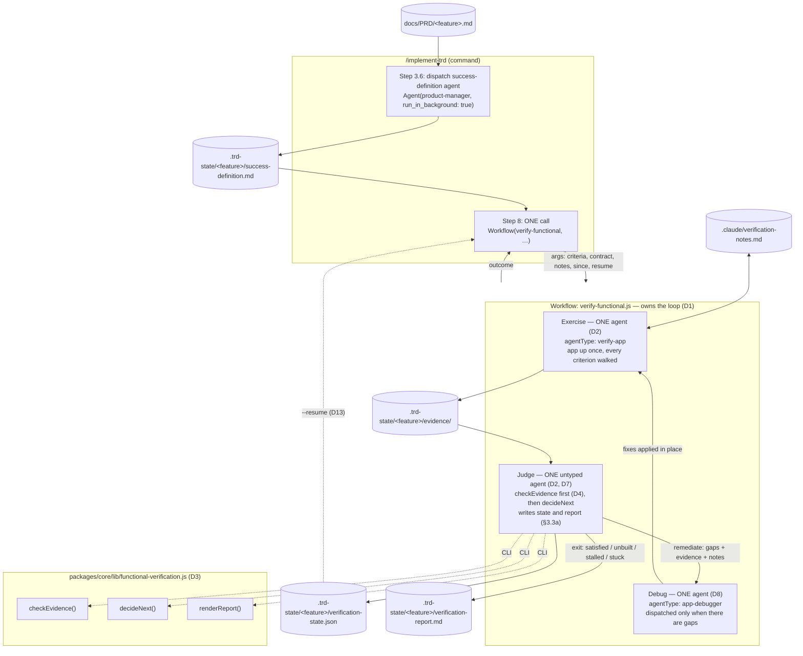

# TRD: Functional Verification of Delivered Software

**Version**: 2.0.2
**Status**: Draft
**Created**: 2026-08-17
**Last Updated**: 2026-08-18
**Author**: @technical-architect
**Source PRD**: `docs/PRD/functional-verification.md`
**Task ID Prefix**: FV

---

## Changelog

| Version | Date | Changes | Author |
|---------|------|---------|--------|
| 2.1.0 | 2026-08-19 | **Cross-phase hardening pass — the state file gains a terminality marker, and §3.3's interface catches up with the code.** (1) **`outcome` added to `verification-state.json`** (§3.3a step 3): the run's outcome string on any exit action, `null` on `remediate`. §3.7's `--resume` composition gate was written as "resumable iff the state file records a non-terminal outcome", but the judge wrote only `iteration` / `criteria` / `gapsClosed`, so *every* state file read as non-terminal and `--verify-functional --resume` skipped the derive pass, the whole phase loop and Step 7 even after a run that exited `satisfied`. Terminality cannot be derived from the other keys — `exit-unbuilt` and `exit-stalled` both leave `not_met` criteria at a sub-cap iteration, so any "has open gaps → resumable" rule misreads both. (2) **§3.3's `VerifyFunctionalArgs` synced with the workflow's actual reads**: `feature`, `prd` and `definitionPath` were threaded through in phase 3 (Finding A — `renderReport()` was destructuring them from nowhere and every report headed `undefined`) but never declared here; `prd`'s comment now names its real source (`implement.json`'s `functional_verification.prd_path`) rather than implying it is derived from the feature name. The interface now matches the workflow's `a.*` reads in both directions — 15 fields, no drift. (3) **`gapsClosed` documented as an audit record, not a loop input**, and its shape corrected from `number[]` to `string[][]`: the loop reconstructs `previousGaps` from `resume.criteria`, nothing reads `gapsClosed`, and no writer ever produced counts. Retained deliberately (D13 — the per-iteration history is not recoverable from the current status set), but a field nobody reads is how the next reader concludes the history is driving the loop. Also states plainly that `resume` is NOT the state file: the file has four keys, only three reach the workflow. (4) **Freshness-floor limit recorded in `## Could Not Verify`** rather than half-fixed — see that row for the owner decision of 2026-08-19 and why the per-iteration remedy is `/refine-trd` work. No change to `checkEvidence()`, `decideNext()`, `renderReport()` or the loop's control flow | `/code-review` cross-phase regression pass |
| 2.0.2 | 2026-08-18 | **PRD conflict resolved by amending the PRD, not reversing the design.** The audit correctly refused to settle it: PRD AC-7/FR-4 mandated a TRD remediation phase and FR-3 one judge per artifact, both of which the owner rejected during TRD review. The PRD was recording a superseded design, so PRD v1.1.0 amends FR-3, FR-4 and AC-7 with inline *Amended* notes stating what changed and why. `/audit-build` will now find AC-7 met. | @technical-architect |
| 2.0.1 | 2026-08-18 | `/audit-trd` pass (5/5 verifiers; source `docs/PRD/functional-verification.md`). **Fixed a stale ground-truth row**: §9's `workflow(` row still described D1 as depending on the nested-workflow primitive, which the same-day D8 correction had already removed — it now states plainly that no decision here depends on it. **Fixed FV-B005's insertion-point citation**: it named `### 7.2` at `:764` and a `## Step 9: Completion` at `:779`, neither of which exists — the real file has `### 7.2` at `:750` and `## Step 8: Completion` at `:765` (the heading this task renumbers), and `## Step 9` is Pause Conditions at `:825`; the adjacent `:742, :764, :823` triple was corrected to `:728, :750, :801` at the same time. **Completed R1's mitigation** with the empty-definition rule (§3.1/AC-3), which the citation rule alone does not supply. **Added S-2's authorization rule to FV-B003's acceptance criteria** — the task body carried it, the acceptance column did not. **Scoped D9's AC-8 claim** to persistence, pointing at FV-P001/FV-B003 for the marker discipline. Rewrote Could Not Verify: added the unresolved AC-7/FR-3 PRD conflict as an owner decision this audit cannot make, and marked the four live-run rows as still out of a document audit's reach. Added a §9 note that the three absent `functional-verification.*` files are this TRD's build targets, after a verifier reported them as broken citations | `/audit-trd` |
| 1.0.0 | 2026-08-17 | Initial TRD creation | @technical-architect |
| 2.0.0 | 2026-08-18 | **The loop is three agents per iteration; the graph, the fan-out and the remediation phase are all gone.** An iteration is now: one `verify-app` exerciser that brings the app up **once** and walks every criterion, one untyped judge that reads the evidence and does the iteration's disk work, and — only when there are gaps — one `app-debugger` that fixes them in place. Deleted outright: D8's `buildGraph()`/wave partitioning (one sequential debugger cannot collide with itself, so the problem the graph solved no longer exists), the whole remediation-phase mechanism (no `FV-R###` ids, no rendered phase, no TRD mutation, no re-parse, no `trd_hash` discussion, no two-insertion-point parser constraint), `renderRemediationPhase()`, the Persist stage (folded into the judge), TR2 (its cause is gone), and OQ-1's narrowed re-verify (an optimisation for the N-agent design; with one exerciser on a running app, re-walking everything is nearly free). Added: **resumability** — `verification-state.json` carries the iteration, per-criterion status, evidence paths and the gaps-closed-per-iteration history, and `--verify-functional --resume` re-enters at the next iteration with no implementation work (D13); and the **unbuilt/misbehaving boundary** — a criterion the judge reports as absent rather than misbehaving is never handed to the debugger, the loop exits, and the report says implementation did not deliver (D14). Knock-on: §1.1, §1.2 (D1–D4, D7–D9, plus new D13/D14), §1.3, §1.4, §2.1–§2.4, §3.3, §3.3a, §3.4, §3.5 (replaced), §3.6, §3.7, §4.1, all seven task rows and all seven grounding blocks, §5.5, R2, §7.2/§7.3, OQ-1, OQ-6, and Could Not Verify. **Diverges from the PRD in two places — recorded, not hidden**: see the PRD-conflict note under §1.2. Task count unchanged at 7; grounding blocks unchanged at 7 | `/refine-trd` |
| 1.3.0 | 2026-08-18 | **Functional verification is Step 8, not Step 7.3.** Step 7 is titled "End-of-Run Hardening and Review"; this is neither — it verifies delivered software against the PRD, with its own loop, its own remediation and its own report artifact. Filing it as a sub-step of review misdescribed it. `/implement-trd`'s existing Step 8 (Completion) becomes 9 and Step 9 (Pause Conditions) becomes 10 — a renumbering the TRD describes as the target state; the live command still reads 7/8/9 until `FV-B005` implements it. | @technical-architect |
| 1.2.0 | 2026-08-18 | **D8 correction propagated.** Remediation no longer dispatches a nested `implement-phase` workflow: the Persist agent partitions the gap set with `buildGraph()` (`task-graph.js`) and the loop dispatches `parallel()` per wave, one `agent()` per gap scoped to its own files — no nested workflow, no phase gate. Reasons: the gate is redundant (the loop's own Exercise/Judge re-runs the same class of check seconds later), it costs 4 fixed agents per iteration on top of one per gap (18 agents vs 6 over three iterations on two gaps), `buildGraph()` supplies the serialization that was the only reason `implement-phase` was chosen, and it removes the `workflow()`-invokes-`workflow()` dependency entirely. Knock-on: D1's rationale, §1.1, §1.3, §2.1, §2.2.3, §2.3, §3.3 (the `gate` arg is dropped — it existed only to feed `implement-phase`), §3.3a, §3.5, §3.7, FV-B002/FV-B005 and their grounding, R2, TR2, TR4 (**removed** — the risk existed only because of the nested call), FV-T001's grounding, and the Could Not Verify row on nested workflows. Task count unchanged at 7; grounding blocks unchanged at 7 | `/refine-trd` |
| 1.1.0 | 2026-08-17 | `/refine-trd` — six owner decisions applied. **D1 inverted**: the loop moves out of `/implement-trd` Step 8 and into `verify-functional.js`, which now owns iteration, judgment, remediation dispatch (`workflow('implement-phase', …)`, one level of nesting) and the report; Step 8 becomes a single `Workflow(verify-functional, …)` call. v1.0.1's rationale rested on a misread of `implement-trd-rework.md:79` ("unavailable inside subagents", not inside workflow scripts) and on treating the script's lack of a filesystem as the loop's lack of one — the agents it dispatches supply it, via the new Persist stage (§3.3a). Knock-on: D2, D3, D5, D8, D9, §1.1, §1.3, §1.4, §2.1–§2.4, §3.1, §3.3, §3.4, §3.6, §3.7, FV-B001/B002/B004/B005 and their grounding, §5's phase names, TR1/TR2, and a new TR4 for the unexercised nesting primitive. **OQ-1 decided**: iterations after the first exercise `priorGaps` plus the criteria whose `files` intersect the remediation's `Touches`, not the full set. **OQ-4 decided**: the derive pass uses the existing `product-manager` agent, not an untyped one and not a fourteenth agent type. **OQ-2/3/5/6 confirmed**; OQ-6 adds `R = Remediation` to `trd-authoring.md`'s category list via FV-P001. Task count unchanged at 7 | `/refine-trd` |
| 1.0.1 | 2026-08-17 | `/audit-trd` pass. Resolved two self-contradictions (`trd_hash` recomputation: §3.7 wins, TR2/FV-B005/§2.3 corrected; the absent-definition path: no wait, no inline derivation, `not run: no definition produced` per TR3). Removed FV-B005's undisciplined inline-derivation fallback. Replaced the undefined `Q-1` coverage identifier with §6.1's floor. Corrected §8's `PRD ID` column header (NG1–NG4 are TRD-local). Corrected OQ-6's stated parser mechanism. Added the missing `G2` citation to D1 and FV-B005. Rewrote Could Not Verify | `/audit-trd` |

---

## 1. Overview

### 1.1 Technical Summary

This feature adds one thing the implement chain does not have: a pass that asks whether a
user can do what the **PRD** says they can do, answered with artifacts rather than
assertions, and iterated on until it is satisfied or provably stalled.

It is built from parts that already exist. A background `product-manager` agent dispatched
before the phase loop derives a functional success definition from the PRD alone. At the tail
of the run — after Step 7's hardening and full-branch review — `/implement-trd` makes **one**
call, `Workflow(verify-functional, …)`, and that workflow owns the whole bounded loop.

**One iteration is three agents.** One `verify-app` exerciser brings the system up **once** and
walks every criterion, capturing evidence as it goes. One untyped judge reads that evidence
against the success definition and returns, per criterion, met / not met / not verifiable here /
unbuilt. When there are gaps, one `app-debugger` receives them together with the evidence and the
verifier's notes, and fixes them in place. Then the loop goes round again. There is no task graph,
no generated remediation task, no phase to insert, and nothing in this feature writes to the TRD.

One workflow, one command invocation. The script has no filesystem, so every disk touch —
reading the definition, writing evidence, writing loop state, writing the report — is an
`agent()` call the script makes, not an operation the script performs.

**The loop assumes the requirements are fundamentally implemented.** What it looks for is the
divergence that survives a green test suite — the button nobody wired to the action, the screen
that drifted from the supplied design — not a wholly absent capability. A wholly absent capability
is an implementation failure, caught upstream by the phase loop and `/audit-build`, and it is the
one thing this loop refuses to iterate on: it exits and says so (D14).

Three properties drive every decision below:

- **The judgment is delegated; the control flow is not.** Loop bounds and evidence gating are
  pure functions in one unit-tested module (`packages/core/lib/functional-verification.js`),
  reached from the script through that module's CLI. An agent decides only whether a criterion
  is met.
- **Evidence outranks assertion.** A criterion is gated first by a deterministic check
  (the artifact exists, is non-empty, and is newer than HEAD) before any agent is asked what
  the artifact shows.
- **Fresh context, state on disk.** The success definition, the verifier's notes, the
  evidence and the loop state all live on disk, so a re-trigger resumes rather than
  re-derives. `--verify-functional --resume` reads `verification-state.json` and re-enters at
  the next iteration, running no implementation work at all (D13). Fresh context still holds
  where it counts: each *iteration* is fresh, and the judge is a different agent from the
  exerciser, so nothing certifies its own output.

The framework supplies *hints* about how to exercise a system, never a harness. A project
whose stack matches nothing in the hint table gets `not verifiable here` in the report,
which is the honest answer and the one that would have caught the 4.1.16 defects.

### 1.2 Key Technical Decisions

| ID | Decision | Choice | Serves Objective | Rationale | Alternatives Considered |
|----|----------|--------|------------------|-----------|------------------------|
| D1 | Where the loop lives | The outer loop lives **inside the workflow**. `packages/core/workflows/verify-functional.js` owns iteration, the three per-iteration agent dispatches, the loop-exit decision and the report. `/implement-trd`'s Step 8 is a **single** `Workflow(verify-functional, …)` call that hands over every input and receives one outcome | G2, FR-4, AC-5 | The three capabilities v1.0.1 claimed only a command has are all reachable from a script: the script has no filesystem, but **the agents it dispatches via `agent()` do** — so reading the definition, writing loop state and writing the report are `agent()` calls (the judge's disk work, §3.3a), not script operations. Remediation needs no second workflow either: one `app-debugger` agent fixes the gaps in place (D8), so the loop is built entirely from `agent()` and the lib CLI. v1.0.1's rationale rested on a misread of `docs/TRD/completed/implement-trd-rework.md` §1.3, whose line 79 says *"`Workflow` is unavailable inside subagents"* — subagents, not workflow scripts. This restores improvement-plan item 9a's *"the loop is a WORKFLOW, not a Stop hook"* in full, rather than keeping only its second half | **Command-driven loop (v1.0.1's D1)** — rejected on re-reading: its premise was that a script cannot dispatch remediation, which `agent()` contradicts. It also put the loop's control flow in prose an LLM re-derives per run, which is what AC-5 is trying to make checkable. **A `Stop` hook / wiggum gate** — rejected, inherited from item 9a: wiggum's finest correction is a phase re-run, a granularity mismatch for a single failing criterion |
| D2 | Shape of one iteration | **Three agents, not 2N.** **Exercise** — one `agent()` with `agentType: 'verify-app'`, which brings the system up once and walks every criterion. **Judge** — one untyped agent that reads all the evidence and also performs the iteration's disk work (§3.3a). **Debug** — one `agent()` with `agentType: 'app-debugger'`, dispatched only when the judge reports gaps (D8) | FR-2, FR-3, FR-4 | A human verifies a build by starting it once and walking the list. N parallel exercisers means N startups of the same application competing for the same port, each paying the boot cost, to parallelise a walk that one boot already affords. The isolation that actually matters survives: each **iteration** is fresh context, and the judge is a different agent from the exerciser, so nothing certifies its own evidence (D7). One debugger fixing gaps sequentially also cannot collide with itself, which is what makes D8's graph unnecessary rather than merely cheaper | **Per-criterion `parallel()` fan-out for Exercise and Judge (v1.3.0's D2)** — rejected 2026-08-18: 2N agents and N application startups per iteration, plus a task graph to keep the N remediators off each other's files — a whole mechanism whose only job was to contain a concurrency the design did not need. **Direct `Agent` fan-out from the command** — rejected: per-criterion transcripts land in orchestrator context, and the loop runs up to three times |
| D3 | Deterministic half | One module, `packages/core/lib/functional-verification.js`, exporting `checkEvidence()`, `decideNext()` and `renderReport()`, plus a CLI entry point exposing all three as subcommands | FR-3, FR-4, AC-4, AC-5 | Every loop-control question — is this artifact real, has a gap closed, is the cap hit, is anything unbuilt — is arithmetic over data, and arithmetic belongs in a unit-tested pure module rather than in prose an LLM re-derives per run. Same shape as `trd-parser.js` / `task-graph.js`. A workflow script has no `require` (it is a prompt-DSL body, not a module — `test-harness.js`'s header), so the loop reaches this module the same way the judge reaches `checkEvidence`: through the CLI. The module, not the script, stays the single source of the arithmetic | **Reimplement `decideNext()` inline in the workflow script** — rejected: two copies of the loop-exit rule is exactly the drift AC-5 is guarding against, and the script is testable through `test-harness.js` either way. **Three separate modules** — rejected: they share one verdict shape, and splitting it invites drift between the renderer and the checker |
| D4 | Tier-1 evidence gate placement | The **judge** agent's first action, for each criterion, is to run the checker CLI over that criterion's artifact; it short-circuits to `not met` without reading content when tier 1 fails | FR-3, AC-4 | Keeps the whole pass to one workflow call per iteration. The exerciser and the judge are different agents, so the assertion is still not self-certified — which is what FR-3 is defending | **Tier 1 in the command between two workflow calls** (exercise → check → judge) — rejected: three dispatches per iteration for a saving that only applies to already-failing criteria. **Revisit** if judge time spent on tier-1 failures shows up as measurable waste in the first costed run |
| D5 | How the success definition is produced | A **background `product-manager` agent** dispatched by the command before the phase loop, whose entire instruction set is `packages/core/contracts/functional-verification.md`, handed the PRD path and never the TRD path or any TRD text | FR-1, AC-1, AC-2, AC-3 | Owner decision, 2026-08-17: *"I'd assumed a product manager would write up 'what constitutes success from the users perspective'."* `product-manager` is already on `constitution.md`'s 13-agent roster, so no roster change and no `agent-validation.test.js` change is needed, and its declared mandate — *"Analyze user needs and define acceptance criteria"* — is this task exactly. Its frontmatter already carries `background: true` [read] `packages/full/agents/product-manager.md:14`. `Agent({run_in_background: true})` is the primitive that makes "parallel, no wall clock" real rather than claimed. Independence is enforced structurally: the prompt names one file. PRD path is resolved by the command from the TRD's `**Source PRD**:` header, falling back to `.trd-state/current.json`'s `prd` | **An untyped `general-purpose` agent carrying the contract** (v1.0.1's choice) — rejected by the owner: the roster already holds the agent whose job this is, and an untyped agent discards its accumulated requirements discipline for no gain. **A new `prd-verifier` agent type** — rejected: `constitution.md`'s 13-agent roster is owner-governed and adding to it is an architecture change requiring approval (`agent-validation.test.js` enforces the list). **Adding `sourcePrd` to `trd-parser.js`** — rejected: that module's contract is Master Task List → records, and three commands depend on it; a header grep in the command is the smaller blast radius |
| D6 | `verify-app`'s role | **Repointed, not replaced**: a second mode that takes a success-definition criterion instead of a TRD acceptance criterion, plus the stack-keyed harness hint table and the notes discipline. Dispatched by the workflow as `agentType: 'verify-app'` for the Exercise stage | FR-2, FR-5, G1 | It already carries Verification Level Enforcement and a live-evidence format; this is the same move one level out, per item 9a. `agentType` from a workflow is attested (ITR-P003, cited in `implement-phase.js`) | **A sibling agent** — same roster objection as D5. **A plain untyped exerciser** — rejected: it would duplicate the verification-level and evidence-format text that already exists |
| D7 | Judge independence | The Judge stage uses an **untyped** agent, not `verify-app` | FR-3 | The exerciser has an interest in its own artifacts. A judge that is a different agent, reading only the artifact and the checker's output, is what makes "evidence, not assertion" structural rather than aspirational. The judge is also the iteration's hands (§3.3a) — it runs the lib CLI and writes the state file and the report. That is bookkeeping, not self-certification: it never produces the evidence it reads, and every decision it records comes from the CLI | **Same agent judges its own evidence** — rejected outright; it re-creates the failure FR-3 names. **A fourth agent purely for persistence (v1.3.0's Persist stage)** — rejected 2026-08-18: it added an agent per iteration to run three CLI calls the judge is already running one of |
| D8 | How gaps are fixed | **One `app-debugger` agent per iteration**, handed every gap with its evidence, the judge's stated reason, the implicated files and the verifier's notes. It fixes the code directly. There is no remediation task, no generated phase, no TRD mutation and no task graph | FR-4 | The graph existed for exactly one reason: to stop two parallel remediation agents writing the same file. One agent fixing gaps sequentially cannot have a file conflict, so the problem is gone by construction and the mechanism that solved it goes with it. `app-debugger` is the roster agent whose declared job this is — root-cause investigation of software that is built but misbehaving — and its own stated exclusion (*"anything that's really a missing feature"*) is what D14 turns into a loop exit. The check on its work is the next iteration's Exercise/Judge, seconds later, which is also why no phase gate is needed | **`buildGraph()` waves with one `agent()` per gap (v1.2.0's D8)** — rejected 2026-08-18: correct machinery for a concurrency this design no longer has. **Nested `workflow('implement-phase')` (v1.1.0's D8)** — already rejected 2026-08-18: a redundant 4-agent gate plus a load-bearing dependency on an unexercised nesting primitive. **Revisit** only if a single debugger is measured to be the loop's bottleneck |
| D9 | Persistent state layout | `success-definition.md`, `verification-state.json`, `verification-report.md` and `evidence/` all under `.trd-state/<feature>/`; the verifier's learned mechanics at `.claude/verification-notes.md` | FR-1, FR-4, FR-5, FR-6, AC-8 | Definition path is D-9a-3, verbatim. Notes path and its "not in `.claude/rules/`" placement are the owner's 2026-08-17 correction. This row covers AC-8's *persistence* half only; the `[read]`/`[ran]`/`[inferred]` marker discipline AC-8 also requires is stated in the contract (FV-P001) and in `verify-app`'s prompt (FV-B003), not here. `verification-state.json` carries the iteration number, every criterion's status and evidence path, and the gaps-closed-per-iteration history — the last of these because the stall test and `--resume` both need history, not just the current status set (D13). All of them are written by the judge agent (§3.3a), which is the only participant in this feature with a filesystem. Loop state is a **separate file from `implement.json`** because that file already has two writers (the command and `status.js` on `SubagentStop`) | **Extend `implement.json`** — rejected on the write-contention ground above. **Name it `verification.json` (v1.3.0)** — renamed for what it holds: loop state, not a verification result. **Revisit** if a consumer ever needs it and `implement.json` atomically consistent |
| D10 | Evidence artifacts are not committed | `.trd-state/*/evidence/` is added to `.gitignore`; the definition, the report and the notes stay tracked | FR-3, FR-6 | `.trd-state/` is deliberately tracked, and screenshots/transcripts are binary working state with a per-run lifetime. Freshness is unaffected — the tier-1 check compares mtime to HEAD's commit time, not to git status | **Commit everything** — rejected: repository bloat with no consumer. **Revisit** if a reviewer ever needs to re-read an artifact after the branch merges |
| D11 | Opt-in flag | `/implement-trd --verify-functional`, default off | AC-6, R3 | AC-6 names this outright; D-9a-2 gives the reason (unpriced cost on a 1.0-agents-per-task loop) and the condition for flipping it | **On by default** — rejected until a real run yields a cost figure. **Revisit** is explicit: the first costed run |
| D12 | Harness knowledge | A stack-keyed **hint table** in the contract and in `verify-app`'s prompt (web UI → browser driving; HTTP API → request/response transcript diffed against the declared interface; CLI → invoke and assert on output; mobile → simulator harness), plus a mandate to read `CLAUDE.md` / `stack.md` / the existing suites. No harness is implemented | FR-2, FR-6, NG2 | The PRD's non-goal is explicit: this ships hints, not capability. A stack the table does not cover resolves to `not verifiable here` rather than to an invented harness | **Implement a generic harness** — rejected by NG2. **Require the PRD to declare a harness** — rejected: that is the upstream blocker item 9a's design removed |
| D13 | Resumability | The loop is re-enterable. `verification-state.json` records the iteration number, every criterion's status and evidence path, and the gaps closed on each iteration. `/implement-trd --verify-functional --resume` reads it and re-enters at the next iteration, running **no** implementation work — no derive pass, no phase loop, straight to Step 8 | FR-4, AC-5; owner requirement 2026-08-18: *"completely resumable; if we need to resume it, totally skips over implement steps and straight into the next iteration of verify/debug"* | Everything else a re-entry needs was already durable — the success definition, the evidence directory and the verifier's notes are all on disk (D9). The only missing piece was where the loop had got to and what it had closed. The gaps-closed **history** was intended to make the stall rule behave identically on a resumed run and a continuous one. **Corrected 2026-08-19:** as built it does not — the loop reconstructs `previousGaps` by filtering the resumed `criteria` for `not_met`, and nothing reads `gapsClosed` back. It is retained as an **audit record** (a human reading the state file can see how many gaps each iteration closed) and is documented as such in the judge prompt, not as a loop input. Wiring it into the stall rule, or dropping it, is a change this document has not made | **Recompute from evidence mtimes** — rejected: closed-gap history is not recoverable from artifacts, so a resumed run could never reach `exit-stalled`. **Re-run from iteration 1** — rejected: it discards the cap's meaning and re-pays for iterations already spent |
| D14 | The unbuilt / misbehaving boundary | A criterion the judge reports as **unbuilt** — the capability is absent, not misbehaving — is never handed to the debugger. The loop exits immediately with outcome `unbuilt`, and the report names those criteria and says implementation did not deliver | FR-4, R5; `app-debugger`'s own frontmatter | `app-debugger` excludes *"anything that's really a missing feature — that's implementation work, not debugging"* [read] `packages/full/agents/app-debugger.md`. Honouring that boundary is also the honest reading of §1.1's operating assumption: this loop exists for software that is built and diverging, and where that assumption fails, saying so beats spending three debug rounds discovering that code is absent. The exit fires even when ordinary gaps are present too — a report that withholds "this was never built" while iterating on the rest is the more misleading of the two outputs | **Treat unbuilt as a gap and debug it** — rejected: it violates the debugger's stated boundary and burns the whole cap on absent code. **Treat unbuilt as `not verifiable here`** — rejected: `not verifiable here` means the project cannot exercise the criterion at all; unbuilt is a delivery failure, and collapsing them re-creates exactly the green-for-a-check-that-never-ran defect R5 names |

**PRD conflict of record (2026-08-18).** Two of this TRD's decisions no longer implement the
PRD as literally written. Recording them here rather than quietly satisfying the letter:

- **FR-4's closing paragraph and AC-7** require remediation to be *"dispatched as a **TRD
  remediation phase** through the existing phase workflow, not as a loose agent, so it inherits
  wave partitioning, file-conflict serialization, agent selection, and the phase gate."* D8 is
  now a direct `app-debugger` call. Every property that paragraph asks the phase workflow to
  supply is either unnecessary (wave partitioning and file-conflict serialization guard against a
  concurrency this design does not create), already made (agent selection — `app-debugger` is the
  named agent), or duplicated seconds later (the phase gate re-runs the check the next iteration
  performs anyway). The divergence began in v1.2.0, which dropped the phase workflow while still
  claiming AC-7; v2.0.0 stops claiming it. **The PRD needs amending, or this decision reversing —
  it should not stay ambiguous.**
- **FR-3's second paragraph** says tier-2 content judgement is *"one agent per artifact"*. D2
  makes it one agent for all artifacts. FR-3's *substance* — evidence over assertion, deterministic
  tier 1 gating tier 2, and the judge never being the agent that produced the evidence — is
  preserved exactly; only the fan-out cardinality changed.

### 1.3 Technology Stack

| Layer | Technology | Purpose | Notes |
|-------|------------|---------|-------|
| Deterministic core | JavaScript / Node.js 18+ | `packages/core/lib/functional-verification.js` — evidence gate, loop decision, report renderer | `stack.md` Languages table; same shape as `trd-parser.js` / `task-graph.js` |
| Orchestration (loop and pass) | `Workflow` prompt-DSL script | `packages/core/workflows/verify-functional.js` — the bounded loop and its three sequential `agent()` dispatches per iteration: Exercise, Judge, Debug (D1, D2, D8) | No filesystem, no shell, no `require`, no `Date.now()`; every input arrives in `args`, every disk touch is an `agent()` call |
| Command surface | Command prompt (Markdown) | `/implement-trd` Step 8 — resolve inputs, one `Workflow(verify-functional, …)` call, banner | Commands are prompts with optional shell — `constitution.md` Principle 3 |
| Agent prompts | Markdown | `verify-app` second mode; `packages/core/contracts/functional-verification.md` | `constitution.md` Principle 2 — prompts only, no executable code |
| Unit tests | Jest ^29.7.0 | Lib module and workflow script | `stack.md` Testing table; workflow scripts are exercised through `packages/core/workflows/test-harness.js` |
| End-to-end | BATS ^1.9.0 + `test/smoke/` | `[LIVE]` scenario driving the real command | `stack.md`; `run-smoke.sh` scenario registry |

No new runtime dependency is introduced.

### 1.4 Integration Points

| System | Type | Direction | Notes |
|--------|------|-----------|-------|
| `packages/core/lib/implement-state.js` | Node module | In | `save()` is filepath-generic; reused by the judge agent for `verification-state.json`'s atomic write |
| `docs/PRD/<feature>.md` | Markdown artifact | In | Sole input to the success-definition pass (D5) |
| `.claude/rules/stack.md`, `CLAUDE.md`, project memory | Markdown | In | How to exercise this project (D12); what is safe to exercise (S-2) |
| `git` | CLI | In | HEAD commit time supplies the tier-1 freshness baseline |
| `packages/core/scripts/scaffold-project.sh` | Shell | Out | Delivers the new contract, lib and workflow by directory glob — **no change required**; `copy_libs`/`copy_workflows`/`copy_contracts` add missing files on `--refresh` as of the 2026-08-16 fix |

---

## 2. System Architecture

### 2.1 Architecture Overview



### 2.2 Component Architecture

#### 2.2.1 `packages/core/contracts/functional-verification.md`

**Responsibility**: The binding instruction set for every agent in this feature — how to
derive a success definition with mandatory PRD-line citation, how to exercise a system
(the D12 hint table), what an evidence artifact is, the notes discipline, and the report's
shape. Mirrors the `task-delegation.md` / `trd-authoring.md` pattern: a command reads it and
passes the text in `args`; the agents read the text, not the file.

**Interfaces**: consumed as prompt text by the success-definition `product-manager` agent (via
the command) and by the workflow's Exercise and Judge stages (via `args.contract`).
**Dependencies**: none.

#### 2.2.2 `packages/core/lib/functional-verification.js`

**Responsibility**: every deterministic decision in the loop.
**Interfaces**: `checkEvidence()`, `decideNext()`, `renderReport()`; plus a
`require.main === module` CLI exposing all three as subcommands, so the judge agent can invoke
them without a `node -e` one-liner. The workflow script has no `require` (D3), so the CLI is the
only path from the loop to this module.
**Dependencies**: `fs` only (for `statSync` in `checkEvidence`). No git, no network.

#### 2.2.3 `packages/core/workflows/verify-functional.js`

**Responsibility**: the whole bounded loop (D1). Per iteration, three sequential `agent()`
calls: **Exercise** (`agentType: 'verify-app'`) walks every criterion against a system it brings
up once; **Judge** (untyped) runs the tier-1 checker, decides each criterion, runs `decideNext`
and writes state and — on any exit — the report; **Debug** (`agentType: 'app-debugger'`) fixes
the gaps, and is dispatched only when the judge returns `remediate`.
**Interfaces**: `args` in (§3.3), one structured outcome out (§3.3).
**Dependencies**: the platform's `agent()` / `phase()` / `log()`; nothing on disk, no `require`,
no `workflow()`, and no `parallel()` — there is nothing left to fan out.

#### 2.2.4 `verify-app` (second mode)

**Responsibility**: bringing the system up once and exercising it against **every** criterion
in the success definition, capturing one evidence artifact per criterion, and maintaining
`.claude/verification-notes.md`.
**Interfaces**: dispatched with `agentType: 'verify-app'`; returns a claim, not a verdict.
**Dependencies**: `constitution.md` (verification level, already read), `stack.md`,
`CLAUDE.md`, the project's own suites.

#### 2.2.5 `/implement-trd` Step 8

**Responsibility**: input resolution and one dispatch. Resolve the PRD and dispatch the derive
pass early (Step 3.6); at Step 8 read the definition, the notes, the stack hints and any prior
`verification-state.json` from disk, resolve HEAD's commit time, make **one**
`Workflow(verify-functional, …)` call, and render the outcome into Step 9's banner. It does not
iterate, does not judge, and does not dispatch remediation — those live in the workflow (D1).
The two pre-loop outcomes it still owns alone are `not run: no PRD resolved` and
`not run: no definition produced`, because both are conditions it detects before there is
anything to hand the workflow.
**Dependencies**: `verify-functional.js`, plus the lib CLI for the two `not run` reports.

### 2.3 Data Flow

```mermaid
sequenceDiagram
    participant C as /implement-trd
    participant D as derive agent (product-manager, background)
    participant W as verify-functional workflow
    participant E as exerciser (verify-app)
    participant J as judge (untyped)
    participant B as debugger (app-debugger)

    C->>D: PRD path + contract (never the TRD)
    Note over C,D: runs during the phase loop — no wall clock
    D->>D: write success-definition.md
    Note over C: ... phases run, Step 7.1 hardening, Step 7.2 review dispatched ...
    C->>C: read success-definition.md, notes, stack hints, HEAD commit time,<br/>verification-state.json if resuming (D13)
    alt file absent / PRD unresolved
        C->>C: renderReport(not-run) via the lib CLI
        C-->>C: workflow is not called (TR3 / §3.1)
    else definition present
        C->>W: ONE call — Workflow(verify-functional, {criteria, contract, notes, since, resume, …})
        Note over W: zero criteria → judge writes the empty report, no Exercise (AC-3)
        loop iteration 1..3 (owned by the workflow)
            W->>E: ONE agent — bring the system up once, walk every criterion
            E-->>W: per-criterion claim + artifact path (or reason none)
            W->>J: ONE agent — all claims, all artifacts
            J->>J: check-evidence CLI (tier 1), then content for what passed
            J->>J: decide-next CLI; write verification-state.json
            alt exit-satisfied / exit-unbuilt / exit-stalled / exit-stuck
                J->>J: render-report CLI → verification-report.md
                J-->>W: outcome
            else remediate
                J-->>W: gaps + evidence paths + reasons + implicated files
                W->>B: ONE agent — fix these gaps in place (D8)
                B-->>W: per-gap result (fixed / could not / unbuilt)
                Note over W: next iteration re-walks every criterion (§3.3)
            end
        end
        W-->>C: { outcome, criteria[], reportPath, iterations }
    end
```

### 2.4 State Management

Four durable artifacts, three lifetimes:

| Artifact | Lifetime | Writer | Tracked |
|----------|----------|--------|---------|
| `.trd-state/<feature>/success-definition.md` | per feature | derive agent (`product-manager`) | yes |
| `.trd-state/<feature>/verification-state.json` | per feature | judge agent, via `implement-state.save()` | yes |
| `.trd-state/<feature>/verification-report.md` | per feature, rewritten per run | judge agent (command, on the two `not run` paths) | yes |
| `.trd-state/<feature>/evidence/` | per run | exerciser agents | **no** (D10) |
| `.claude/verification-notes.md` | per project, cumulative | `verify-app` | yes |

A re-trigger reads all of these and resumes (D13): the definition is not re-derived, the
iteration number, per-criterion statuses and the gaps-closed-per-iteration history are already on
disk, and the notes carry what was learned about how to start the app. `--verify-functional
--resume` therefore skips the derive pass and the phase loop entirely and re-enters at the next
iteration — the only thing v1.3.0's design was missing to make that possible was a record of
where the loop had got to.

---

## 3. Technical Specifications

### 3.1 Success definition — `.trd-state/<feature>/success-definition.md`

**Purpose**: the promise the verifier checks against. Derived from the PRD alone (D5).

**Format** — a header block plus one table, one criterion per row (D-9a-3):

```markdown
# Functional Success Definition: <feature>

**Source PRD**: docs/PRD/<feature>.md
**Derived**: <ISO8601>
**Criteria**: <n>

| ID | Functional statement | Cites | Evidence that would prove it | Derivation |
|----|----------------------|-------|------------------------------|------------|
| FS-1 | A user can sign in with a valid password and reach the dashboard | FR-2, §4 line 51 | HTTP transcript: POST /auth/login → 200 with a session cookie; screenshot of the dashboard | [read] |
| FS-2 | A repeated submit does not create two orders | domain-derived: payment flows must not double-charge | Two POSTs with one idempotency key → one row in `orders` | domain-derived |
```

**Behavior**:
- Every row's `Cites` names a PRD line, or the row is labelled `domain-derived` with its
  reasoning inline. A row that can do neither is **dropped, not invented** (FR-1, AC-2).
- Zero rows is a legitimate outcome. The file is still written, with `**Criteria**: 0` and a
  one-paragraph statement of why the PRD yielded none (AC-3).
- `Evidence that would prove it` is what the exerciser aims to produce. It is a target, not
  a contract — an exerciser that produces a *different* artifact that proves the same thing
  records why in the notes.

**Error handling**:
- PRD path does not resolve → the file is not written; the command reports
  `not run: no PRD resolved` in the report and the banner. This is **distinct** from AC-3's
  empty definition and must not be reported as one.
- The file is absent when Step 8 begins → `not run: no definition produced` (TR3), which is
  again **distinct** from AC-3's empty definition. Step 8 reports it and does not call the
  workflow at all — there are no criteria to pass in `args`. The command does **not** wait on the
  background task and does **not** derive a definition inline: there is no attested primitive
  for a lead to block on a specific `Agent({run_in_background: true})`
  (`.claude/rules/async-discipline.md`, "Orchestration pattern: the scheduled nudge" — the
  documented mechanism is `ScheduleWakeup` plus `dispatch-ledger.js --open`, neither of which
  is a blocking wait), and an inline derivation would be a second production path for
  `success-definition.md` outside FV-P001's contract, without the mandatory-citation
  discipline R1 and AC-2 depend on. Step 8 runs at the tail of the run, hundreds of tool
  calls after the Step 3.6 dispatch, so an absent file means the agent died — which is
  information the report must carry, not a gap to paper over.

### 3.2 Evidence gate — `checkEvidence()`

**Purpose**: tier 1 of FR-3. Deterministic, cheap, and not settable by an agent.

**Interface**:

```typescript
interface EvidenceClaim {
  criterion: string;       // "FS-1"
  artifact: string | null; // repo-relative path, or null when the exerciser produced none
  reason?: string;         // why no artifact exists
}

interface EvidenceVerdict {
  criterion: string;
  tier1: 'pass' | 'fail';
  artifact: string | null;
  bytes: number | null;
  mtimeSec: number | null;
  failure?: 'missing' | 'empty' | 'stale' | 'no-artifact';
}

function checkEvidence(claims: EvidenceClaim[], sinceSec: number): EvidenceVerdict[];
```

**Behavior**:
- `missing` — the path does not exist.
- `empty` — it exists with zero bytes.
- `stale` — its mtime is not strictly greater than `sinceSec` (the HEAD commit time,
  supplied by the command from `git log -1 --format=%ct`). An artifact older than the code
  it claims to prove is not evidence. **This check is weaker than it looks — see the
  freshness-floor row in `## Could Not Verify`.**
- `no-artifact` — the claim carried none. Tier 1 fails; the criterion can still resolve to
  `not verifiable here` on the judge's reading of the stated reason.
- Pure apart from `fs.statSync`. No git, no clock: `sinceSec` is a parameter so the function
  is testable without a repository.

**CLI**: `node .claude/lib/functional-verification.js check-evidence '<claims-json>' <sinceSec>`
prints the verdict array as JSON. This is what the judge agent invokes (D4).

### 3.3 The loop — `verify-functional.js`

**Purpose**: the whole bounded loop, as a workflow (D1). One call in, one outcome out.

**Interface**:

```typescript
// args
interface VerifyFunctionalArgs {
  criteria: Array<{ id: string; statement: string; cites: string; evidence: string; derivation: string }>;
  contract: string;      // functional-verification.md text — the workflow cannot read files
  notes: string;         // .claude/verification-notes.md text, or "" when it does not exist
  stackHints: string;    // stack.md + CLAUDE.md excerpts the command resolved
  evidenceDir: string;   // ".trd-state/<feature>/evidence"
  checker: string;       // ".claude/lib/functional-verification.js"
  since: number;         // HEAD commit time, seconds
  cap: number;           // iteration cap, 3 (§3.4)
  statePath: string;     // ".trd-state/<feature>/verification-state.json"
  reportPath: string;    // ".trd-state/<feature>/verification-report.md"
  feature: string;       // feature slug — the report's header, threaded to render-report
  prd: string;           // "docs/PRD/<feature>.md" — the report's header
  definitionPath: string; // ".trd-state/<feature>/success-definition.md" — the report's header
  resume: {              // from a prior run's state file (D13); null on a fresh run
    iteration: number;                 // the last COMPLETED iteration
    criteria: Array<{ id: string; status: string; artifact: string | null; reason: string | null }>;
    gapsClosed: string[][];            // AUDIT RECORD, not a loop input — see below
  } | null;                            // NB: the state FILE has a fourth key, `outcome`; the
                                       //   command consumes it at the gate and does not
                                       //   forward it here — see below
  project: string;       // "" when the target is the repo the workflow runs in
}

// return
interface VerifyFunctionalResult {
  outcome: 'satisfied' | 'unbuilt' | 'stalled' | 'stuck';
  reason: string;
  iterations: number;      // total across resumes, not just this invocation
  reportPath: string;
  criteria: Array<{
    id: string;
    status: 'met' | 'not_met' | 'not_verifiable' | 'unbuilt';
    tier1: 'pass' | 'fail' | 'skipped';
    artifact: string | null;
    reason: string | null;   // required when status is not 'met'
    files: string[];         // implicated source files, handed to the debugger
  }>;
  gaps: string[];
  unbuilt: string[];
  exercised: string;         // "5/6" for the final iteration — a dead agent is visible, not laundered
  debugAttempts: Array<{ iteration: number; gaps: string[]; result: string }>;
  notesUpdated: boolean;
}
```

**On `resume.gapsClosed`** — it is an **audit record, not a loop input.** The loop reconstructs
`previousGaps` by filtering `resume.criteria` for `not_met`; nothing anywhere reads `gapsClosed`,
and changing it changes no behaviour. It is retained because the per-iteration history is not
recoverable from the current status set (D13), so a reader reconstructing what a multi-iteration
run actually did needs it — but no control flow depends on it. Shape: one entry per completed
iteration, in order, each the array of criterion ids that iteration closed (the judge's own
`closed` value, appended). It is **not** `number[]`; an earlier version of this interface said so
and no writer ever produced counts.

**`resume` is not the state file.** The state file `verification-state.json` has FOUR top-level
keys (§3.3a step 3): `iteration`, `criteria`, `gapsClosed` and `outcome`. Only the first three
reach the workflow. `outcome` is the terminality marker, consumed by the command at §3.7's
`--resume` composition gate to decide whether to re-enter this loop at all; by the time the
workflow runs, that decision is already made and the workflow derives its own outcome afresh. The
asymmetry is deliberate — do not "fix" it by forwarding `outcome` into `resume`, where nothing
would read it.

**Behavior** — the script's top level is a bounded `for` loop over `iteration`, starting at
`(args.resume?.iteration ?? 0) + 1` and running while `iteration <= args.cap`. Each iteration is
three sequential `agent()` calls (D2):

- **Exercise stage**: one `agent()`, `agentType: 'verify-app'`, given the contract text, the notes
  text, the stack hints, the evidence directory and **every** criterion. It brings the system up
  once and walks the list, returning one claim per criterion — an artifact path, or a stated
  reason none exists.
- **Judge stage**: one `agent()`, untyped (D7). It runs the checker CLI over the whole claim set
  **first** and reads content only for the criteria that passed tier 1 (D4), then runs
  `decide-next` and writes state. It is also the loop's hands (§3.3a).
- **Debug stage**: one `agent()`, `agentType: 'app-debugger'`, dispatched **only** when the judge
  returns `remediate`. It receives every gap with its evidence path, the judge's stated reason and
  the implicated files, plus the notes and stack hints, and fixes the code (§3.5). The script then
  continues the loop; there is no phase gate, because Exercise and Judge re-run seconds later and
  are the gate. The one exception is a gap the debugger reports as `unbuilt`: the next Exercise is
  skipped and a final judge call renders `exit-unbuilt` (D14, §3.5).

**Which criteria are in scope**: all of them, on every iteration. With one exerciser walking a
system that is already running, re-walking the full list costs one more pass through a live app,
not another N dispatches — so the narrowing OQ-1 decided on 2026-08-17 (`priorGaps` plus a
regression subset computed from the previous remediation's `Touches`) is **superseded**: it was an
optimisation for a design that paid per criterion, and it traded away the only cheap defence
against R2's "remediation for one criterion breaks another". Every criterion therefore carries a
status produced by the current iteration, and the report never has to explain a carried-forward
pass.

Other behavior:
- `not_verifiable` is returned when the project has no way to exercise the criterion — an
  absent harness, an unmatched stack, or a target `stack.md` does not authorize. It is never
  a substitute for `not_met`. A `not_verifiable` criterion is **not** a gap and is never
  handed to the debugger.
- `unbuilt` is returned when the capability the criterion names is absent rather than
  misbehaving. It is not a gap either: it ends the loop (D14, §3.4).
- `files` is populated on `not_met` so the debugger is pointed at real code rather than made to
  rediscover it.

**Error handling**:
- A dead **Exercise** `agent()` returns `null`. Following `implement-phase.js` verbatim: record
  every criterion as `not_met` with `reason: "exerciser returned nothing"` rather than
  dereferencing it, set `exercised: "0/N"`, and still dispatch the Judge — it is the only
  participant with a filesystem, so state and the report must still be written. Every criterion
  fails tier 1 as `no-artifact`, the iteration closes nothing, and the stall rule (§3.4) ends the
  loop on the next pass rather than the design needing a fourth exit.
- A dead **Judge** agent is the one case that cannot be recorded and continued: nothing was
  written to disk and the loop has no decision. Following `audit-trd.js`'s Index stage, it is a
  thrown error via `required()` — the command sees the throw and reports `stuck`, which is
  honest, where continuing would silently drop an iteration's state.
- A dead **Debug** agent returns `null` like any other. The iteration records
  `debugAttempts[].result = "agent returned nothing"`, the gaps stay open, and no new exit is
  introduced: an iteration in which nothing was actually fixed closes no gap, so `decideNext`
  reaches `exit-stalled` by its existing rule (§3.4).
- `readArgs` / `required` guards are copied from `implement-phase.js`, which copied them from
  `audit-trd.js`. Missing `criteria` is a thrown error (nothing downstream can run); an
  **empty** `criteria` array is not — it skips Exercise and Debug entirely, runs one judge agent
  to write the empty report, and returns `outcome: 'satisfied', gaps: []` with `exercised: "0/0"`
  and `iterations: 0`. That is AC-3's correct outcome, not a crash.

### 3.3a The judge's disk work — the loop's hands

**Purpose**: the workflow script has no filesystem, no shell and no `require` (D3). Everything in
this feature that touches disk or the lib module is done by the judge agent, dispatched by the
script with a fully-specified instruction set. v1.3.0 gave this to a fourth agent per iteration
("Persist"); that agent is **deleted** — it existed to run three CLI calls, one of which the judge
was already running (D7).

**What it is given**: the iteration number, every claim from the Exercise stage, `args.criteria`,
`args.checker`, `args.statePath`, `args.reportPath`, `args.cap`, `args.since` and the previous
iteration's gaps and gaps-closed history (from `args.resume` on the first iteration of a resumed
run, from its own previous return otherwise).

**What it does, in order**:
1. `node .claude/lib/functional-verification.js check-evidence '<claims-json>' <sinceSec>` over the
   whole claim set, then reads content only for criteria whose tier 1 passed (D4), and decides each
   one: `met` / `not_met` / `not_verifiable` / `unbuilt`, with a reason and implicated `files` for
   anything not met.
2. `node .claude/lib/functional-verification.js decide-next '<json>'` — the loop-exit decision
   comes from the module (§3.4), never from the agent's own reading.
3. Writes `verification-state.json` through `implement-state.save()` (D9) — iteration, per-criterion
   status and evidence path, the gaps-closed history with this iteration appended, and
   **`outcome`: the terminality marker** (`null` on a `remediate` iteration; the run's outcome
   string — `satisfied`, `unbuilt`, `stalled`, `stuck` — on any exit action) — **before**
   anything else is dispatched (state-write-before-delegate, matching Step 4.1).
4. On any exit action: `render-report` over the full criterion set, written to `args.reportPath`.
   Returns the outcome.
5. On `remediate`: returns the gap set — id, statement, judge reason, evidence path, implicated
   files — for the script to hand the debugger. It writes nothing to the TRD and renders no task:
   there is no remediation phase under D8.

**Why an agent and not the script**: this is the mechanism the `Workflow` contract leaves open —
the script cannot open a file, but the agents it dispatches have `Read`, `Write` and `Bash`. Every
*decision* still comes from the CLI; the agent supplies hands, not arithmetic.

### 3.4 Loop decision — `decideNext()`

**Purpose**: FR-4's exits plus D14's, as arithmetic (AC-5).

**Interface**:

```typescript
type LoopAction = 'exit-satisfied' | 'exit-unbuilt' | 'exit-stalled' | 'exit-stuck' | 'remediate';

function decideNext(input: {
  iteration: number;        // 1-based, the iteration whose verdict this is
  gaps: string[];
  unbuilt: string[];
  previousGaps: string[] | null;   // null on the first iteration of a fresh run
  cap?: number;             // default 3
}): { action: LoopAction; reason: string; closed: string[] };
```

**Behavior**, evaluated in this order:
1. `unbuilt.length > 0` → `exit-unbuilt`. This wins even when there are ordinary gaps as well:
   a report that iterates on the fixable half while withholding "this was never built" is the more
   misleading of the two outputs, and the debugger's own boundary forbids the other half anyway
   (D14).
2. `gaps.length === 0` → `exit-satisfied`.
3. `previousGaps` is non-null and `closed.length === 0` → `exit-stalled`. `closed` is
   `previousGaps \ gaps`. An iteration that closes nothing is repeating itself.
4. `iteration >= cap` → `exit-stuck`.
5. otherwise → `remediate`.

The cap is **3**, matching `implement-trd.md`'s existing retry convention (`:599`) —
inherited, not chosen here. It reaches the function as `args.cap` (§3.3) so the workflow and the
module cannot disagree about it; the `cap = 3` default exists for the module's own unit tests.

`gaps` counts `not_met` only. Neither `not_verifiable` nor `unbuilt` is a gap — neither can be
closed by the debugger, and counting them would make every unverifiable project exit `stuck` after
three empty debug rounds. `previousGaps` is seeded from `args.resume` on the first iteration of a
resumed run, so the stall rule behaves identically across a resume (D13).

### 3.5 Gap remediation — the Debug stage

**Purpose**: close the gaps the judge found, with one agent and no machinery (D8).

**Not an interface**: there is no renderer here. v1.3.0 had `renderRemediationPhase()` turn gaps
into a TRD phase table that `buildGraph()` then partitioned into file-conflict-safe waves. Both
are **deleted**: with one agent fixing gaps sequentially there is no concurrency to serialize, so
the phase, the `FV-R###` task ids, the TRD mutation, the re-parse and the wave partition all exist
only to feed each other.

**What the debugger receives**, assembled by the script from the judge's return:

- every gap: criterion id, its functional statement, the judge's stated reason, the evidence
  artifact path, and the implicated `files`;
- `args.notes` — what the verifier has already learned about running this project;
- `args.stackHints` and `args.contract`.

**What it does**: fixes the code in place, one gap at a time. It does **not** re-verify — the next
iteration's Exercise and Judge are the check, seconds later, which is also why no phase gate is
needed. It returns, per gap, what it changed or why it could not.

**The boundary it must respect** (D14): a gap that turns out to be absent capability rather than
broken behaviour is reported back as `unbuilt`, not implemented. That is `app-debugger`'s own
stated exclusion. When any gap comes back `unbuilt`, the script **skips the next Exercise stage
entirely** and dispatches one final judge call carrying the debugger's report, which reaches
`exit-unbuilt` and writes the report. Re-exercising a system to rediscover that code is missing is
the waste D14 exists to avoid.

### 3.6 Report — `renderReport()`

**Purpose**: FR-6, AC-9.

**Interface**:

```typescript
function renderReport(input: {
  feature: string;
  prd: string;
  definitionPath: string;
  outcome: 'satisfied' | 'unbuilt' | 'stalled' | 'stuck' | 'not-run';
  reason: string;
  criteria: Array<{
    id: string; statement: string; cites: string;
    status: 'met' | 'not_met' | 'not_verifiable' | 'unbuilt';
    artifact: string | null; reason: string | null;
    attempts: Array<{ iteration: number; result: string }>;   // what the debugger tried, per iteration
    blocker: string | null;
  }>;
}): string;   // markdown
```

**Behavior**: every criterion in the definition appears in the report (AC-9), and every one of
them carries a status the final iteration produced — the loop re-walks the full list each time
(§3.3), so there is no carried-forward pass to disambiguate. `not_verifiable` renders in its own
section with the stated reason, not folded into failures. `unbuilt` renders in its own section
too, under an outcome line that says plainly that implementation did not deliver these criteria
and that the loop stopped rather than debugging absent code (D14).

### 3.7 Command surface — `/implement-trd`

**Flag**: `--verify-functional`. Absent → nothing in this TRD executes, including the
background derive pass (AC-6). The usage block, the `Parse:` line and the Execution Model
diagram all name it.

**`--verify-functional --resume`** (D13): when both are passed and
`.trd-state/<feature>/verification-state.json` exists with a non-terminal outcome — read from
its top-level `outcome` key (§3.3a step 3): `null` means the run stopped mid-loop and is
resumable, any of the four outcome strings means it finished and is not — the run skips
the derive pass **and the whole phase loop** and goes straight to Step 8, which re-enters the
verification loop at the iteration after the last completed one. `--resume` without
`--verify-functional` keeps its existing meaning (resume the implementation checkpoint) and
`--verify-functional` without a state file starts at iteration 1, so the two flags compose rather
than overloading each other.

**Step 3.6 (new)** — after the graph is built and before the phase loop, when the flag is
set: resolve the PRD path, then

```
Agent({ subagent_type: "product-manager", run_in_background: true, name: "success-definition",
        prompt: <contract text> + <PRD path> + <output path> })
```

The prompt names the PRD path and the output path and **nothing else** — no TRD path, no TRD
excerpt, no task list (FR-1, AC-1). `product-manager` is the roster agent whose declared mandate
is *"Analyze user needs and define acceptance criteria"* (D5); its frontmatter already carries
`background: true`.

**Step 8 (new)** — after Step 7.2, and it is **one dispatch**, not a loop (D1):

1. Read `.trd-state/<feature>/success-definition.md`. Absent → report
   `not run: no definition produced` (TR3) and stop. An unresolvable PRD at Step 3.6 → report
   `not run: no PRD resolved` and stop. Both reports are rendered through the lib CLI's
   `render-report` so there is one renderer, and both are distinct from AC-3's empty definition.
2. Read `.claude/verification-notes.md` (or `""`), the `stack.md` / `CLAUDE.md` excerpts, and
   the contract text. Resolve `since` from `git log -1 --format=%ct`. Read
   `verification-state.json` if a prior run left one, and pass it as `resume` (D13). Nothing
   about the TRD is read or needed: this feature generates no tasks and mutates no document.
3. `Workflow({ name: "verify-functional", args: { … §3.3 … } })` — once.
4. Render the returned outcome into Step 9's banner. Nothing else.

`verification-state.json` and the report are both written inside the workflow, by the judge agent
(§3.3a). **Nothing in this feature writes to the TRD** — there is no remediation phase to insert,
no re-parse, and therefore no insertion-point constraint and no `trd_hash` question at all.

**Step 9** — the completion banner gains a FUNCTIONAL VERIFICATION block naming the outcome
(`satisfied` / `unbuilt` / `stalled` / `stuck`), the met/unmet/unverifiable/unbuilt counts and the
report path. When the flag was not passed, the
block reads `not run (--verify-functional not set)` rather than being omitted, so its absence
is never mistaken for a pass.

---

## 4. Master Task List

### 4.1 Task ID Convention

Task IDs follow `[PREFIX]-[CATEGORY][SEQ]` with PREFIX `FV`.

- `P` = Plugin/Infrastructure setup, `B` = Backend implementation, `T` = Testing,
  `D` = Documentation, `I` = Integration. The `R = Remediation` letter v1.3.0 was going to add is
  **not needed**: no task is generated at run time under D8, so nothing emits an id this
  convention does not already cover (OQ-6, superseded).
- `[LIVE]` marks tasks that require verification against a running instance, overriding
  `constitution.md`'s project-level `verification_level: unit-only`.

### 4.2 Phase 1: Contract and deterministic core

| Task ID | Description | Serves | Skills | Dependencies | Acceptance Criteria |
|---------|-------------|--------|--------|--------------|---------------------|
| FV-P001 | Write `packages/core/contracts/functional-verification.md`: the derive discipline (mandatory PRD citation, `domain-derived` labelling, empty-is-correct), the D12 stack-keyed harness hint table, what counts as an evidence artifact, the exercise discipline (bring the system up **once**, walk every criterion, one artifact per criterion), the four judge statuses and the unbuilt/misbehaving boundary (D14), the debugger's brief (fix in place, do not re-verify, do not implement absent capability), the `[read]`/`[ran]`/`[inferred]` notes discipline and correct-don't-work-around rule, the credential rule (S-1), the authorization rule (S-2), and the report shape. Mirror to `.claude/contracts/` | FR-1, FR-3, FR-5, FR-6, AC-2, AC-3, S-1, S-2, D12, D14 | | None | The contract exists in both trees and is byte-identical; it states the citation rule, the empty-definition rule, the four stack hint rows, the three derivation markers, the four judge statuses with `unbuilt` distinguished from `not verifiable here`, and that credentials are recorded by location only; it contains no instruction to invent a criterion or a harness |
| FV-B001 | Build `packages/core/lib/functional-verification.js` per §3.2, §3.4 and §3.6 — `checkEvidence`, `decideNext`, `renderReport`, plus a CLI exposing all three as subcommands (`check-evidence`, `decide-next`, `render-report`; D3 — the workflow has no `require` and reaches the module only this way) — with its Jest suite. Mirror to `.claude/lib/` | FR-3, FR-4, FR-6, AC-4, AC-5, AC-9, D3, D13, D14 | `jest` | None | Unit tests cover all four `checkEvidence` failure modes, all five `decideNext` branches in their evaluation order — including `unbuilt` winning over a non-empty `gaps` set, and `previousGaps === null` — and a `renderReport` case containing one criterion of each of the four statuses; each of the three CLI subcommands is covered, including its JSON in / JSON-or-markdown out shape; `decideNext` honours `args.cap` rather than only its default, and neither `not_verifiable` nor `unbuilt` criteria count as gaps; the module uses no clock and no git; coverage of the module meets §6.1's unit-test floor (>= 60%, `constitution.md` Quality Gates) |

### 4.3 Phase 2: The loop workflow

| Task ID | Description | Serves | Skills | Dependencies | Acceptance Criteria |
|---------|-------------|--------|--------|--------------|---------------------|
| FV-B002 | Build `packages/core/workflows/verify-functional.js` per §3.3/§3.3a/§3.5 — **the whole bounded loop** (D1) as three sequential `agent()` calls per iteration: Exercise (one agent, `agentType: 'verify-app'`, every criterion), Judge (one untyped agent, checker-first, runs the lib CLI and touches disk), and Debug (one agent, `agentType: 'app-debugger'`, only when the judge returns `remediate`). Includes resume entry from `args.resume` (D13) and the `exit-unbuilt` path (D14). With its Jest suite via `workflows/test-harness.js`. Mirror to `.claude/workflows/` | G2, FR-2, FR-3, FR-4, AC-4, AC-5, D1, D2, D4, D7, D8, D13, D14 | `jest` | FV-P001, FV-B001 | The script opens no file, runs no shell, uses no `require`, and uses no `Date.now()`/`Math.random()`/argless `new Date()`; it contains **no** `workflow(` call, **no** `parallel(` call, and no reference to `buildGraph`, waves, remediation tasks or the TRD; tests assert Exercise completes before Judge dispatches and Judge before Debug, that `agentType` is `'verify-app'` on Exercise, absent on Judge and `'app-debugger'` on Debug, that Debug is not dispatched when the judge returns an exit action, that a `null` Exercise result yields `not_met` for every criterion with a stated reason and `exercised: "0/N"` while the Judge still runs, that a `null` Judge result throws and a `null` Debug result leaves the gaps open, that a Debug result carrying `unbuilt` skips the next Exercise and dispatches one final judge call, that an empty `criteria` array runs one judge agent and no Exercise/Debug dispatch and returns `outcome: 'satisfied'` with `iterations: 0`, that the judge prompt instructs the checker CLI call before any content reading, that every criterion is passed to Exercise on every iteration, that `args.resume` starts the loop at the next iteration and seeds `previousGaps`, and that the loop stops at `args.cap`; coverage meets §6.1's unit-test floor (>= 60%, `constitution.md` Quality Gates) |
| FV-B003 | Repoint `packages/full/agents/verify-app.md`: add a Functional Success Definition mode — input is the **whole** criterion set, the agent brings the system up once and walks it, output is one claim plus an artifact path or a stated reason per criterion, never a verdict on its own evidence — plus the D12 hint table, the `stack.md`/`CLAUDE.md` read mandate, S-2's authorization rule, and the `.claude/verification-notes.md` read/write discipline. Mirror to `.claude/agents/` | FR-2, FR-5, AC-8, D2, D6, D12, S-2 | | FV-P001 | The existing TRD-acceptance-criteria mode and Verification Level Enforcement are unchanged and still first in the file; the new mode states that the agent starts the system once for the whole walk and does not decide `met`/`not met`; the notes section names the three derivation markers and the correct-on-failure rule; the authorization section states S-2's rule — the agent exercises only a target `stack.md`, `CLAUDE.md` or an explicitly local/ephemeral instance authorizes, and an unauthorized target resolves the criterion to `not verifiable here` rather than to a guessed endpoint; `agent-validation.test.js` still passes with 13 agents |
| FV-B004 | Add `--verify-functional` to `/implement-trd` (`packages/core/commands/implement-trd.md`): usage block, `Parse:` line, Execution Model diagram, its composition with the existing `--resume` (§3.7, D13), and Step 3.6's background derive dispatch with PRD-path resolution (TRD `**Source PRD**:` header → `.trd-state/current.json`). Mirror to `.claude/commands/` | FR-1, AC-1, AC-6, D5, D11, D13 | | FV-P001 | Without the flag no derive agent is dispatched and no `.trd-state/*/success-definition.md` appears; with it the dispatch is `subagent_type: "product-manager"` with `run_in_background: true`, and its prompt contains the PRD path and the contract text and **no** TRD path or TRD excerpt; `--verify-functional --resume` with an existing non-terminal `verification-state.json` dispatches no derive agent and enters no phase, while `--resume` alone keeps its current meaning; an unresolvable PRD path is reported as `not run: no PRD resolved`, distinct from an empty definition; `constitution.md`'s agent roster is unchanged and `agent-validation.test.js` still passes with 13 agents |

### 4.4 Phase 3: Command surface

| Task ID | Description | Serves | Skills | Dependencies | Acceptance Criteria |
|---------|-------------|--------|--------|--------------|---------------------|
| FV-B005 | Add Step 8 to `/implement-trd` per §3.7 — **one dispatch, not a loop** (D1): read the definition from disk (absent → `not run: no definition produced` per §3.1/TR3; never wait on the background task and never derive one inline — no primitive exists for a lead to block on a specific `Agent({run_in_background})`, and an inline derivation would bypass FV-P001's citation discipline), read the notes / stack hints / contract and any prior `verification-state.json` for `resume`, resolve `since` from `git log -1 --format=%ct`, then make a single `Workflow(verify-functional, …)` call and render its outcome. Also extend Step 6's state-file documentation and Step 9's banner, and add `.trd-state/*/evidence/` to `.gitignore`. Mirror to `.claude/commands/`. **Split from FV-B004 despite sharing `implement-trd.md`** on both permitted grounds: size (a whole new step with input resolution, banner and `.gitignore` work would return a partial result VERIFY could not judge alongside the flag work) and verifiability (AC-1/AC-6 and AC-3/AC-9 are separately checkable) | G2, FR-2, FR-6, AC-3, AC-9, D1, D9, D10, D11, D13 | | FV-B001, FV-B002, FV-B003, FV-B004 | Step 8 sits after Step 7.2 and before Step 9; it contains exactly one `Workflow(` call and **no** iteration, no `decideNext` reasoning in prose, no TRD read or mutation and no `Agent(` call — all of those live in FV-B002's workflow or nowhere; an absent definition file is reported as `not run: no definition produced` and no definition is derived inside Step 8; both `not run` reports are rendered through the lib CLI's `render-report`; the args it assembles carry every field §3.3 names — including `resume` — and no `gate`, `prefix`, `phaseNumber` or `existingIds` block; the Step 9 banner names all four outcomes including `unbuilt`; `.gitignore` excludes evidence while the definition, report and notes stay tracked |

### 4.5 Phase 4: End-to-end

| Task ID | Description | Serves | Skills | Dependencies | Acceptance Criteria |
|---------|-------------|--------|--------|--------------|---------------------|
| FV-T001 | `[LIVE]`: add `test/smoke/scenarios/verify-functional.sh` and register it in `run-smoke.sh`'s `SCENARIO_TIMEOUT` and `LLM_OPT_IN_SCENARIOS`. It scaffolds a throwaway project with a one-requirement PRD and a matching one-task TRD, runs `/implement-trd` **without** the flag and asserts no success definition appears, then runs it **with** the flag and asserts the definition, the state file, the report and a COMMAND COMPLETE banner | AC-1, AC-6, AC-9, D13, G3 | | FV-B005 | Both runs terminate with a banner; the no-flag run leaves no `success-definition.md`; the flag run produces a definition whose every row carries a `Cites` value or a `domain-derived` label, a `verification-state.json` carrying an iteration number and a per-criterion status, and a report naming every criterion in the definition; the scenario is opt-in (absent from `ALL_SCENARIOS`) and skips rather than fails when `claude` or `jq` is unavailable |

---

## 5. Execution Plan

### 5.1 Phase Overview

| Phase | Focus | Prerequisites | Parallelizable Sessions |
|-------|-------|---------------|------------------------|
| 1 | Contract and deterministic core (each task ships its own unit tests) | None | 1A, 1B in parallel |
| 2 | The loop workflow, `verify-app`'s second mode, the command flag | Phase 1 complete | 2A, 2B, 2C in parallel |
| 3 | Command surface — Step 8's single dispatch | Phase 2 complete | Single session |
| 4 | `[LIVE]` end-to-end | Phase 3 complete | Single session |

Unit tests ship inside FV-B001 and FV-B002; there is no separate unit-test task. FV-T001 is
the one thing that legitimately needs the whole system assembled.

### 5.2 Session Details

#### Phase 1

**Session 1A: Contract**
- Tasks: FV-P001
- Agent: @agent-implementer
- Can parallelize with: Session 1B

**Session 1B: Deterministic core**
- Tasks: FV-B001
- Agent: @backend-implementer
- Can parallelize with: Session 1A

#### Phase 2

**Session 2A: The loop workflow**
- Tasks: FV-B002
- Agent: @backend-implementer
- Blocked by: Sessions 1A, 1B

**Session 2B: verify-app repointing**
- Tasks: FV-B003
- Agent: @agent-implementer
- Blocked by: Session 1A
- Can parallelize with: 2A, 2C

**Session 2C: Command flag and derive dispatch**
- Tasks: FV-B004
- Agent: @agent-implementer
- Blocked by: Session 1A
- Can parallelize with: 2A, 2B

#### Phase 3

**Session 3A: Step 8**
- Tasks: FV-B005
- Agent: @agent-implementer
- Blocked by: 2A, 2B, 2C

#### Phase 4

**Session 4A: End-to-end**
- Tasks: FV-T001
- Agent: @backend-implementer
- Blocked by: 3A

### 5.3 Parallelization Map

```mermaid
gantt
    title Execution Plan (No time scale - dependency order only)
    dateFormat X
    axisFormat %s

    section Phase 1
    Session 1A (FV-P001): p1a, 0, 1
    Session 1B (FV-B001): p1b, 0, 1

    section Phase 2
    Session 2A (FV-B002): p2a, after p1a p1b, 1
    Session 2B (FV-B003): p2b, after p1a, 1
    Session 2C (FV-B004): p2c, after p1a, 1

    section Phase 3
    Session 3A (FV-B005): p3a, after p2a p2b p2c, 1

    section Phase 4
    Session 4A (FV-T001): p4a, after p3a, 1
```



### 5.4 Critical Path

`FV-P001 → FV-B002 → FV-B005 → FV-T001`, with `FV-B001 → FV-B002` joining at the same
point. FV-B003 and FV-B004 are off the critical path and can absorb slack.

FV-B004 and FV-B005 both touch `packages/core/commands/implement-trd.md` and therefore
serialize under `task-graph.js`'s file-conflict edge regardless of the phase boundary. That
serialization is intended, and the split is justified in FV-B005's row.

### 5.5 Offload Recommendations

| Task | Recommended Agent | Rationale |
|------|-------------------|-----------|
| FV-P001, FV-B003, FV-B004, FV-B005 | @agent-implementer | Contract text, agent prompts and command prompts are prompt engineering, which is that agent's stated domain |
| FV-B001, FV-B002 | @backend-implementer | JavaScript modules with Jest suites. FV-B002 carries the loop (D1), which is control flow in JavaScript, not prompt text — the three stage *instruction* texts are the one prompt-shaped part of it |
| FV-T001 | @backend-implementer | BATS scenario plus shell fixture plumbing |

---

## 6. Quality Requirements

### 6.1 Testing Requirements

| Type | Coverage Target | Source | Scope |
|------|-----------------|--------|-------|
| Unit Tests | >= 60% | `constitution.md` Quality Gates | `packages/core/lib/functional-verification.js`, `packages/core/workflows/verify-functional.js` |
| Integration Tests | >= 50% **when applicable — not applicable here** | `constitution.md` Quality Gates ("when applicable") | This feature's integration surface is `test/smoke/scenarios/verify-functional.sh`, a BATS-driven live scenario. No coverage instrumentation exists for shell in this repository (`package.json`'s test script is `jest`; no kcov configuration exists anywhere outside design documents; `.github/workflows/ci.yml`'s `bats` job installs and invokes `bats` directly with no coverage step — read in full during the 2026-08-17 audit), so no percentage is measurable. The integration objective is discharged by FV-T001's named assertions instead |

No figure here exceeds a `constitution.md` floor.

### 6.2 Code Quality Standards

`constitution.md`'s Quality Gates also require, before completing any implementation: no
secrets in code, input validation present, documentation updated. The first is sharpened by
S-1 below; the third is satisfied inside FV-B005 (Step 6 and Step 9 documentation) rather
than as a separate documentation task.

`stack.md` names Prettier, ESLint and ShellCheck under Code Quality. Neither Prettier nor
ESLint is installed in this repository (`package.json` devDependencies are `bats`, `jest`,
`js-yaml`, `mock-fs`), so no lint gate is asserted for the JavaScript here — the same
finding `implement-trd-rework.md` v1.1.0 recorded and acted on.

### 6.3 Security Requirements

| ID | Objective | Source |
|----|-----------|--------|
| S-1 | `.claude/verification-notes.md`, the report and the success definition record **where** a credential comes from, never its value. The notes file is committed | `docs/modernization/2026-08-improvement-plan.md` item 9a: *"Security is unchanged: the file is committed. It records WHERE credentials come from, never their values"* |
| S-2 | The verifier exercises only a target the project authorizes — `stack.md`, `CLAUDE.md` or an explicitly local/ephemeral instance. Where nothing authorizes a target, the criterion resolves to `not verifiable here` rather than to a guessed endpoint | **domain-derived.** This feature hands an autonomous loop a browser, a shell and up to three remediation rounds. An unauthorized target is not a quality problem but a production-impact one, and the PRD's own non-goal ("how to exercise a given system is the project's responsibility") leaves target selection undefined — silence there is exactly where an agent would improvise |

### 6.4 Performance Requirements

None. No latency, throughput or uptime figure is stated in the PRD, in `stack.md`, in
`constitution.md`, or by the user. The one cost question anyone raised — what a verification
cycle costs — is an explicit PRD Open Question with no measurement behind it yet, and it is
the reason AC-6 makes the loop opt-in. Inventing a budget here would consume a task proving a
number nobody asked for; see OQ-1.

---

## 7. Risk Assessment

### 7.1 Risks Imported from PRD

| PRD Risk ID | Risk | Technical Mitigation |
|-------------|------|---------------------|
| R1 | The success definition manufactures criteria the PRD does not support | The citation rule is in the contract (FV-P001) and the definition's table has a mandatory `Cites` column (§3.1). A row with neither a citation nor a `domain-derived` label is dropped by the deriving agent, and its absence is visible because the report names every row that survived. The second half of the mitigation is the **empty-definition rule** (§3.1, AC-3): a definition with zero surviving rows is a correct outcome that stops the loop, not a failure the deriving agent is under pressure to avoid — without it, the citation rule alone would push a barren PRD toward invention |
| R2 | Remediation for one criterion breaks another | Two mechanisms, neither of them a graph (D8). **Prevention**: one debugger fixes the gaps sequentially, so two concurrent writers to one file — the thing wave partitioning existed to prevent — cannot occur. **Detection**: every iteration re-walks **every** criterion (§3.3), so a fix that breaks a previously-met criterion surfaces on the very next judge pass. v1.3.0 had the opposite trade: parallel remediators needing a graph, plus a narrowed re-verify that could only catch a regression through a file the judge had implicated |
| R3 | Cost per cycle makes it unaffordable | Opt-in behind `--verify-functional` (D11). The E2E scenario is registered opt-in rather than in `ALL_SCENARIOS`, so it does not add cost to the default smoke run either |
| R4 | Notes accumulate wrong beliefs with no reviewer | Derivation markers and correct-on-failure are in the contract (FV-P001) and in `verify-app`'s prompt (FV-B003). The file is committed, so it is at least diff-reviewable |
| R5 | The verifier reports green for checks that never ran | `not verifiable here` is a distinct status all the way through the type: the workflow's return schema, `renderReport()`'s sections, and the completion banner's counts. The `exercised: "n/m"` field makes a dead agent visible rather than laundering it into a pass — the same defect `implement-phase.js` fixed with its `*Reported` flags |

### 7.2 Technical Risks

| ID | Risk | Likelihood | Impact | Mitigation |
|----|------|------------|--------|------------|
| TR1 | **FR-2's ordering is not fully achievable as written.** Step 7.2 dispatches `/code-review` and deliberately does **not** block on it (it forks to background subagents). Verification at Step 8 therefore runs after Step 7.1's *applied* hardening fixes, but possibly before Step 7.2's review fixes land | High | Med | Do not paper over it: Step 8 records in `verification-state.json` and in the report which review passes had completed when the loop started. Step 7.1's fan-out **is** blocking and is where fixes are applied inline, so the majority of "code after review" is real. **Owner-confirmed 2026-08-17 (OQ-2)**: the gap is resolved by sequencing, not by making Step 7.2 blocking — verification stays last and records what had landed |
| TR3 | The background derive agent is dispatched at Step 3.6 and read at Step 8, hundreds of tool calls later. If it died, the loop sees an absent file | Med | Low | Two outcomes are kept distinct by construction: an absent file is `not run: no definition produced`, a present file with zero rows is AC-3's correct empty outcome. Conflating them would report a crashed agent as "the PRD had nothing to verify" |

### 7.3 Contingency Plans

**TR1 Contingency**: if a costed run shows review fixes routinely landing after verification
started, the fix is to make Step 7.2 blocking for the `--verify-functional` path only, not to
move verification earlier. Verification must stay last; that is FR-2's substance.

**TR2 was removed in v2.0.0.** It read *"inserting a remediation phase mutates the TRD mid-run,
invalidating the parse the command has in hand."* Nothing inserts a remediation phase any more
(D8), so the risk has no cause left to mitigate. It is deleted rather than downgraded.

---

## 8. Non-Goals (Scope Boundaries)

The following are **explicitly out of scope** per the PRD. Implementation agents MUST reject
requests that fall into these categories.

The PRD states these as four unlabelled bullets (`docs/PRD/functional-verification.md` §3).
The `NG1`–`NG4` identifiers below are **this TRD's**, assigned so the decisions and tasks above
can reference them; they are not PRD-assigned IDs.

| ID (TRD-local) | Non-Goal (PRD §3) | Rationale |
|--------|----------|-----------|
| NG1 | Replacing any existing verification | Per-task unit tests, the phase gate and `/audit-build` all stay. This adds the functional layer none of them cover |
| NG2 | A universal verification harness | How to exercise a given system is the project's responsibility (`CLAUDE.md`, `stack.md`, project memory, its existing suites). This ships hints, not capability |
| NG3 | Verifying acceptance criteria | Already covered three ways |
| NG4 | Running by default | Cost is unmeasured; see AC-6 |

---

## 9. Task Grounding

Written after reading `packages/core/lib/trd-parser.js`, `packages/core/lib/task-graph.js`,
`packages/core/lib/implement-state.js`, `packages/core/workflows/implement-phase.js`,
`packages/core/workflows/test-harness.js`, `packages/core/commands/implement-trd.md`,
`packages/full/agents/verify-app.md`, `.claude/agents/agent-validation.test.js`,
`packages/core/agents/agent-validation.test.js`, `packages/core/scripts/scaffold-project.sh`,
`.claude/contracts/trd-authoring.md`, `test/smoke/run-smoke.sh`, `test/smoke/lib/project.sh`,
`test/smoke/lib/assert.sh`, `test/smoke/scenarios/implement-one-task.sh`, `.gitignore`,
`package.json`, and the TRDs under `docs/TRD/`. Every claim carries `[read]`, `[ran]` or
`[inferred]`. Anchors are symbols and literal strings; line numbers sit beside them as a
convenience and rot on the first edit.

### Ground truth verified for the whole TRD

**Read the absence rows below as build targets, not as broken citations.**
`packages/core/contracts/functional-verification.md` (FV-P001),
`packages/core/lib/functional-verification.js` (FV-B001) and
`packages/core/workflows/verify-functional.js` (FV-B002) are the three files this TRD exists to
create. Every reference to them in §1.3, §2.2 and §1.2's decisions is forward-looking by
construction; their absence on disk today is the expected state and is recorded here deliberately.
A 2026-08-18 verifier reported all three as unresolvable citations — that finding was rejected.

| Fact | Evidence |
|---|---|
| `packages/core/lib/` exists and holds `implement-state.js`, `task-graph.js`, `trd-parser.js` plus their `.test.js` siblings. `.claude/lib/` holds the same three modules, no tests | [ran] `ls packages/core/lib .claude/lib` |
| `packages/core/contracts/` holds exactly `prd-authoring.md`, `task-delegation.md`, `trd-authoring.md`. There is **no** `functional-verification.md` in either tree | [ran] `ls packages/core/contracts .claude/contracts` |
| `packages/core/workflows/` holds `audit-build.js`, `audit-prd.js`, `audit-trd.js`, `create-prd.js`, `create-trd.js`, `implement-phase.js`, two `*.test.js` and `test-harness.js`. `.claude/workflows/` holds the six non-test scripts only | [ran] `ls packages/core/workflows .claude/workflows` |
| `.claude/verification-notes.md` does not exist anywhere; the string appears only in `docs/modernization/2026-08-improvement-plan.md:1533` and in this TRD | [ran] `grep -rn verification-notes .` (excluding `node_modules`, `.git`, worktrees) |
| `copy_contracts()`, `copy_libs()` and `copy_workflows()` each glob their source directory and, under `--refresh`, copy files absent from the destination, logging `Added contract:` / `Added lib:` / `Added workflow:`. §1.4's "no change required" claim is correct | [read] `scaffold-project.sh`, `copy_contracts() {` (:195) with `info "Added contract: $c"` (:211); `copy_libs() {` (:262) with `info "Added lib: $l"` (:283); `copy_workflows() {` (:298) with `info "Added workflow: $wf"` (:339) |
| `copy_agents()` is the exception: under `--refresh` it **never creates** a file — *"Refresh: replace only if this agent already exists in the target. Never create — that stays /rebase-project's job."* | [read] `scaffold-project.sh`, `copy_agents() {` (:141) and that comment (:162) |
| `copy_libs()` skips `*.test.js`; `copy_workflows()` skips `*.test.js` **and** `test-harness.js` | [read] `[[ "$l" == *.test.js ]] && continue` (:281); `[[ "$wf" == *.test.js \|\| "$wf" == test-harness.js ]] && continue` (:331) |
| `.claude/` mirrors of `implement-trd.md`, `verify-app.md` and `trd-authoring.md` are byte-identical to their `packages/` originals today, and are plain files, not symlinks | [ran] `diff -q` on all three (no output); `ls -la .claude/contracts .claude/lib .claude/workflows` |
| The `Workflow` runtime gives a script no filesystem, no shell, and no `Date.now()`/`Math.random()`/argless `new Date()` | [read] `implement-phase.js` header comment, verbatim *"No filesystem or Node.js API access."* |
| No agent file declares `disallowedTools` any more (constitution v1.3.0 removed them). `implement-phase.js:190`'s comment still asserts `verify-app` declares `disallowedTools: Agent` | [ran] `grep -n disallowedTools packages/full/agents/*.md .claude/agents/*.md` → no hits; [read] `implement-phase.js:190` |
| `**Source PRD**:` is a **documented convention with no parser behind it**: `trd-authoring.md:103` shows `**Source PRD**: [Link to PRD file]`, and no module reads it | [read] `.claude/contracts/trd-authoring.md:103`; [ran] `grep -rn "Source PRD" packages/` → no hits in code |
| The header's on-disk format is not uniform: markdown link (`docs/TRD/ensemble-vnext.md:8`), backticked link (`docs/TRD/completed/implement-trd-rework.md:8`), bare backticked path (this TRD, `:8`), and the literal `**Source PRD**: None — derived from …` (`docs/TRD/runtime-refresh.md:8`). Three TRDs carry no header at all — `discipline-judgment.md`, `testing-phase-telemetry-patterns.md`, `TRD-feedback.md` | [ran] `grep -rn "Source PRD" docs/TRD/` plus a per-file absence loop |
| `packages/core/agents/agent-validation.test.js` passes — 132 tests, 13 required agents including `verify-app`. The mirrored `.claude/agents/agent-validation.test.js` **fails to run**: its `AGENTS_DIR` resolves to `<repo>/full/agents`, which does not exist, so `describe.each` is handed an empty array | [ran] `npx jest packages/core/agents/agent-validation.test.js` → 132 passed; `npx jest .claude/agents/agent-validation.test.js` → *"`.each` called with an empty Array of table data"*; [read] `.claude/agents/agent-validation.test.js:43` `const AGENTS_DIR = path.join(__dirname, '../../full/agents')` |
| `constitution.md`'s floors are unit >= 60% / integration >= 50%; `/implement-trd`'s own completion banner prints `target: 80%` and `target: 70%` | [read] `.claude/rules/constitution.md:197`; `implement-trd.md:800–801` |
| `packages/core/workflows/` contains **zero** calls to `workflow(` — the nested-workflow primitive is documented in the `Workflow` tool's own contract but unexercised in this repository. **No decision in this TRD depends on it.** D1 did through v1.1.0–v1.2.0 (`Workflow(implement-phase, …)` inside the loop); the 2026-08-18 D8 correction removed that dependency entirely, §2.2.3 states the workflow script's dependencies as "nothing on disk, no `require`, no `workflow()`, and no `parallel()`", and FV-B002's acceptance criteria require the built script to contain **no** `workflow(` call at all | [ran] `grep -rn "workflow(" packages/core/workflows/*.js` → no hits; row re-read and its D1 framing corrected in the 2026-08-18 audit |
| **Workflow-dispatched agents DO have `Bash`** — *"The earlier statement that 'a workflow script has no shell' is true of the SCRIPT and false of its AGENTS."* This is the attested basis for the judge's disk work (§3.3a) and its checker CLI call (D4) | [read] `docs/TRD/completed/implement-trd-rework.md:76–78` |
| `implement-trd-rework.md:79` reads *"`Workflow` is unavailable inside subagents"* — it constrains subagents, not workflow scripts. v1.0.1's D1 read it as the latter | [read] `docs/TRD/completed/implement-trd-rework.md:79` |
| `product-manager` is on `constitution.md`'s 13-agent roster, is dispatchable in the background (`background: true`), and its description names *"Analyze user needs and define acceptance criteria"* | [read] `packages/full/agents/product-manager.md:1–16`; `.claude/rules/constitution.md`'s roster table |
| Workflow scripts have **no `require`**: they are prompt-DSL bodies with a leading `export const meta` and a bare top-level `return`, *"not valid as a real Node module"* — `test-harness.js` loads them as source text and wraps them | [read] `packages/core/workflows/test-harness.js:1–19` |
| `app-debugger` is on `constitution.md`'s 13-agent roster, declares `background: true`, and its own description excludes *"anything that's really a missing feature — that's implementation work, not debugging"* — the sentence D14 turns into a loop exit | [read] `packages/full/agents/app-debugger.md:1–30` |
| There is no attested "wait on a named background `Agent`" primitive. The repository's documented mechanism for re-checking dispatched background work is `ScheduleWakeup` plus `node .claude/hooks/dispatch-ledger.js --open` | [read] `.claude/rules/async-discipline.md`, *"Orchestration pattern: the scheduled nudge"*; `packages/core/hooks/dispatch-ledger.js:17` usage line and `if (process.argv.includes('--open'))` (:183) |

---

### FV-P001

- **Touches:** `packages/core/contracts/functional-verification.md` (new),
  `.claude/contracts/functional-verification.md` (new mirror)
- **Reuse:** the contract genre already established by
  `packages/core/contracts/task-delegation.md` and `trd-authoring.md` — a command reads the
  file and passes its text; the agent reads the text, not the path [read] `trd-authoring.md`
  opening sections. Do not invent a new contract format.
- **Follow:** `trd-authoring.md`'s `### Section 10: Task Grounding` block for how a contract
  states a *discipline* (mandatory field, worked example, the failure it prevents) rather
  than a schema [read] `.claude/contracts/trd-authoring.md:603–660`.
- **Replaces:** nothing. Greenfield file; no existing contract carries verification
  discipline [ran] `ls packages/core/contracts` → three files, none of them this.
- **Replaces (deleted scope):** v1.3.0 had this task also add `` `R` = Remediation `` to
  `trd-authoring.md` §4.1. **Do not make that edit** — under D8 nothing generates a task id at
  run time, so the letter has no emitter (OQ-6, superseded). `trd-authoring.md` is untouched by
  this feature.
- **Careful:** delivery needs no scaffold change — `copy_contracts()` globs `"$src"/*.md` and
  adds absent files on `--refresh` [read] `scaffold-project.sh:195, :211`. But the mirror is a
  plain `cp`, not a symlink [ran] `ls -la .claude/contracts` — the two copies must be written
  in the same commit or they drift silently.
- **Careful:** the `[read]`/`[ran]`/`[inferred]` markers this task must state are the
  grounding pass's own convention, carried in the create-trd tooling rather than in
  `trd-authoring.md`'s Section 10 text [inferred] — Section 10 mandates the four axes but does
  not itself enumerate the three markers; write them out in full rather than cross-referencing.

### FV-B001

- **Touches:** `packages/core/lib/functional-verification.js` (new),
  `packages/core/lib/functional-verification.test.js` (new),
  `.claude/lib/functional-verification.js` (new mirror)
- **Reuse:** `save(filePath, state)` in `implement-state.js:69` — it is filepath-generic and
  already does per-writer temp + `renameSync`, with the temp path keyed on `process.pid` and
  `Date.now()` so a second concurrent writer cannot consume it
  [read]. `verification-state.json` must use it rather than a second atomic-write implementation.
- **Follow:** the manual CLI entry point at `trd-parser.js:741` —
  `if (require.main === module) {` with a usage line on stderr and `process.exit(1)` [read].
  That is the shape all three CLI subcommands should match.
- **Careful (load-bearing):** the CLI is not a convenience. Workflow scripts have no `require`
  — they are prompt-DSL source text wrapped by `test-harness.js`, *"not valid as a real Node
  module"* [read] `test-harness.js:1–19` — so `decide-next` and `render-report` are the **only**
  way the loop reaches this module (D3). A subcommand that exists as an export but not on the CLI
  is unreachable from the feature that needs it.
- **Careful:** `decideNext`'s branch **order** is the specification, not an implementation
  detail: `unbuilt` is checked before `gaps.length === 0`, so a run with one unbuilt criterion and
  no other gaps exits `unbuilt` rather than `satisfied` (§3.4, D14). Test the order, not just the
  branches.
- **Replaces (load-bearing):** v1.3.0's fourth export, `renderRemediationPhase()`, and its
  `render-remediation` subcommand are **not built**. Nothing generates a remediation task under
  D8, so a renderer for one has no caller. If it appears in the module it is dead code on arrival —
  and it drags a `trd-parser.js` round-trip test in with it that has nothing left to prove.

### FV-B002

- **Touches:** `packages/core/workflows/verify-functional.js` (new),
  `packages/core/workflows/verify-functional.test.js` (new),
  `.claude/workflows/verify-functional.js` (new mirror)
- **Reuse:** `function readArgs(raw)` (`implement-phase.js:37`) and
  `function required(value, stage)` (`:57`) **verbatim** — both were already copied from
  `audit-trd.js`; §3.3 says to copy them and that is right [read].
- **Reuse:** `packages/core/workflows/test-harness.js` — `readScript(filename)` reads from
  `WORKFLOWS_DIR = __dirname`, and `makeAgentStub(plan)` records every call as
  `{ prompt, opts, at }` on `calls`, resolving an omitted/undefined plan entry to `null`
  [read] `test-harness.js:31, :50–60`. That `calls` array is the mechanism for this task's
  ordering, `agentType` and not-dispatched assertions; do not build a bespoke stub.
- **Follow:** `implement-phase.js`'s null handling —
  `if (!result) { taskResults[id] = { … error: 'agent returned nothing (the agent died or was skipped)' } }` (:158)
  [read] — for Exercise and Debug. The Judge is the exception (`required()`, below).
- **Follow:** `implement-phase.js`'s empty-input early return `if (WAVES.length === 0)` (:78),
  which returns a completed-shaped object with `skipped: true` rather than throwing — the
  same move §3.3 requires for an empty `criteria` array [read].
- **Follow:** the `simplifyReported` / `reviewReported` flags (:305–311) and the comment
  explaining why (*"a dead reviewer's `findings: 0` is byte-identical to a clean review"*)
  [read] — `exercised: "n/m"` is this TRD's version of the same defence.
- **Careful (load-bearing):** this script contains **no** `workflow(` call and **no**
  `parallel(` call. `packages/core/workflows/` holds zero `workflow(` calls today [ran]
  `grep -rn "workflow(" packages/core/workflows/*.js`, and this task must not become the first.
  `parallel()` is absent for a different reason: under D2 each stage is a single agent, so there
  is nothing to fan out — if `parallel()` appears here, the simplification has been half-applied.
- **Replaces (load-bearing):** three mechanisms v1.3.0 put in this file are **removed, not
  relocated** — the per-criterion `parallel()` fan-out for Exercise and Judge (D2), the Persist
  stage (folded into the judge, D7/§3.3a), and the `buildGraph()` wave dispatch for remediation
  (one `app-debugger`, D8). Nothing in this script may import, mention or reconstruct
  `task-graph.js`, waves, `Touches`, remediation task ids or the TRD path.
- **Careful:** the Judge is dispatched by this script but is not a stage that can fail softly —
  §3.3's error handling makes it the one `required()` call, following `audit-trd.js`'s Index
  stage [read] `implement-phase.js:57` and the comment above it explaining why the task and gate
  agents deliberately do NOT take that path. It is also dispatched even when Exercise returned
  `null`, because it is the only participant that can write state.
- **Careful:** the test file must not reach `.claude/workflows/` — `copy_workflows()` skips
  `*.test.js` and `test-harness.js` [read] `scaffold-project.sh:331`, and `.claude/workflows/`
  holds six scripts and no tests today [ran] `ls .claude/workflows`.
- **Careful:** `agentType: 'verify-app'` on the Exercise stage matches `implement-phase.js`'s
  attested usage (`agentType: 'verify-app'`, `:186`) [read]; `agentType: 'app-debugger'` on the
  Debug stage is the same mechanism with a different roster agent, and `app-debugger.md` likewise
  declares `background: true` [read] `:29`. Contrary to `implement-phase.js:190`'s comment,
  neither agent declares `disallowedTools` [ran] — do not write a new comment repeating that claim.

### FV-B003

- **Touches:** `packages/full/agents/verify-app.md`, `.claude/agents/verify-app.md`
- **Reuse:** the existing `## Verification Level Enforcement` section (`:29`), its four-level
  table and the `Live Verification Evidence:` block (`:47–53`) [read] — the functional mode
  inherits them; restating the levels would create two sources of truth.
- **Follow:** the file's own section shape — `## Role Statement` (:18),
  `## Primary Responsibilities` (:56) containing `### Acceptance Criteria Verification` (:58)
  and `### Functional Verification` (:86), then `## Verification Process` (:114) and
  `## Deliverables` (:186) [read]. A new `###` under Primary Responsibilities keeps the
  existing mode first, as the acceptance criterion requires.
- **Replaces:** nothing. The existing acceptance-criteria mode stays. The new mode's input is
  the **whole** criterion set in one dispatch, not one criterion per dispatch (D2) — the prompt
  must say so explicitly, because "exercise this criterion" and "exercise these criteria against
  one running instance" produce very different agent behaviour.
- **Careful:** `copy_agents()` under `--refresh` replaces only files that already exist and
  **never creates** [read] `scaffold-project.sh:162`. `verify-app.md` exists in every
  scaffolded tree, so a refresh does deliver this edit — but the `.claude/agents/` mirror in
  *this* repo must be updated by hand in the same commit; it is byte-identical today [ran]
  `diff -q`.
- **Careful:** the acceptance criterion's `agent-validation.test.js` is ambiguous — two copies
  exist and only `packages/core/agents/agent-validation.test.js` runs (132 passed). The
  `.claude/agents/` copy is already broken before this task starts [ran] (see findings).
- **Careful:** do not re-add a `disallowedTools:` line while editing; constitution v1.3.0
  removed it from all eight worker agents and none carries one now [ran]
  `grep -n disallowedTools .claude/agents/*.md packages/full/agents/*.md` → no hits.

### FV-B004

- **Touches:** `packages/core/commands/implement-trd.md`, `.claude/commands/implement-trd.md`
- **Reuse:** the flag surface already has exactly three declaration sites plus a diagram —
  frontmatter `argument-hint:` (`:4`), the `> **Arguments:**` usage list (`:11–17`), and the
  `Parse: TRD path, --phase N, …` line (`:29`); the Execution Model fence is `:33–47` [read].
  Add to those four; do not introduce a fifth listing.
- **Follow:** Step 7.1's literal dispatch form —
  `Agent(subagent_type="code-reviewer", prompt="…")` (`:756–758`) [read] — for how this
  command writes an `Agent(...)` call in prose. Step 3.6's dispatch is the same shape with
  `subagent_type="product-manager"` and `run_in_background: true` (D5, owner decision).
- **Reuse:** the `product-manager` agent as it stands. Do **not** add a fourteenth agent, do not
  edit `constitution.md`'s roster, and do not edit `product-manager.md` — the contract text this
  step passes in the prompt is the entire instruction set (D5), and the agent already declares
  `background: true` [read] `packages/full/agents/product-manager.md:14`.
- **Follow:** the placement convention: a new `### 3.6` goes after
  `### 3.5 Assemble each task's delegation prompt` (`:373`) and before `## Step 4` (`:433`)
  [read].
- **Replaces:** nothing; the flag is additive and the no-flag path is the current behaviour.
- **Careful:** `--resume` already exists on this command and means "resume the implementation
  checkpoint". Do not redefine it. `--verify-functional --resume` is a *composition* (D13): with a
  non-terminal `verification-state.json` present it skips the derive pass and the phase loop and
  enters at Step 8; every other combination keeps each flag's existing meaning.
- **Careful:** PRD-path resolution must handle four header shapes and a literal `None` — see
  the ground-truth table. `runtime-refresh.md:8` reads `**Source PRD**: None — derived from
  the Claude Code / Sunstone comparison review (2026-08-10/11)` [read]; that must resolve to
  `not run: no PRD resolved`, not to a file called `None`.
- **Careful:** the `.trd-state/current.json` fallback is **gitignored** (`.gitignore:26`) and
  written by Step 1.3a (`### 1.3a Write the feature pointer`, `:108`), which runs before
  Step 3 [read] — present in-session, absent on a fresh clone.
- **Careful:** no code reads `**Source PRD**:` today [ran] `grep -rn "Source PRD" packages/`
  → no hits. Cite `trd-authoring.md:103` as the *convention's* source, not as evidence a
  resolver exists.

### FV-B005

- **Touches:** `packages/core/commands/implement-trd.md`, `.claude/commands/implement-trd.md`,
  `.gitignore`
- **Reuse:** Step 4.2's `Workflow({ name: "implement-phase", args: { … } })` call form
  verbatim (`:462`) [read] — Step 8's single `Workflow({ name: "verify-functional", args: … })`
  call is the same shape with a different name and arg set. Do not invent a second dispatch idiom.
- **Reuse:** the lib CLI's `render-report` for the two `not run` outcomes rather than writing
  report markdown in prose — one renderer, per D3.
- **Follow:** Step 5.1's `node -e` + `require("./.claude/lib/implement-state")` invocation form
  (`:608`) [read] for how this command shells into a lib module.
- **Replaces (load-bearing):** this row **replaces v1.0.1's FV-B005**, which put the whole loop
  in this step, and it also drops everything v1.1.0–v1.3.0 accreted around remediation. Under D1
  the iteration, `decideNext()` application, state write and report emission live in FV-B002's
  workflow; under D8 the gate-prompt assembly, the TRD read for prefix/phase/task-ids, the TRD
  mutation and the re-parse **do not exist anywhere**. If any of that prose survives in
  `implement-trd.md` after this task, the command is assembling args nothing reads and mutating a
  document nothing re-parses — delete it rather than leaving it as documentation.
- **Replaces:** nothing else becomes unreachable. Step 7.1's hardening fan-out, Step 7.2's
  full-branch review and `/audit-build` all stay (NG1) [read] `implement-trd.md:728`
  (`### 7.1 Feature-scale hardening pass`), `:750` (`### 7.2`), `:801` (the `/audit-build`
  invocation inside Step 8) — re-read 2026-08-18; the previous `:742, :764, :823` had drifted.
- **Careful:** the new Step 8 must sit between `### 7.2 End-of-run full-branch code review`
  (`:750`) and the heading that reads `## Step 8: Completion` (`:765`) **in the file as it exists
  today** — that existing heading is what this task renumbers to `## Step 9: Completion`. Do not
  search for `## Step 9: Completion` before making the edit: it does not exist yet, and `## Step 9`
  currently reads `## Step 9: Pause Conditions (NOT phase boundaries)` (`:825`) [read] 2026-08-18.
- **Careful:** `since` is `git log -1 --format=%ct`, resolved **here**. `checkEvidence` takes it
  as a parameter precisely so nothing downstream needs a clock or a repository [read] §3.2.
- **Careful:** §3.1's no-wait rule stands unchanged. There is no attested primitive for a lead to
  block on a specific `Agent({run_in_background: true})`; the repository's documented mechanism is
  `ScheduleWakeup` plus `node .claude/hooks/dispatch-ledger.js --open` [read]
  `.claude/rules/async-discipline.md` *"Orchestration pattern: the scheduled nudge"*;
  `dispatch-ledger.js:17, :183`. An absent definition is `not run: no definition produced` and the
  workflow is not called.
- **Follow:** `.gitignore`'s existing per-run-scratch precedent —
  `# Verifier findings are per-run scratch (create-prd / create-trd verify wave)` /
  `.trd-state/*/findings/` (`:68–69`) and `.trd-state/*/implement.lock` (`:65`) [read]. Put
  `.trd-state/*/evidence/` beside them and leave the *"`.trd-state/` IS tracked"* comment
  block (`:7–13`) intact. `verification-state.json` and the report are **not** ignored (D10).
- **Careful:** Step 9's banner is one fenced ASCII block (`:781–825`) whose last content
  section is `NEXT STEPS`; `For Wiggum mode, signal: <promise>COMPLETE</promise>` (`:829`)
  sits outside the fence and must stay after whatever is added [read].
- **Careful:** the banner already prints `Unit Coverage: {X}% (target: 80%)` /
  `Integration Coverage: {Y}% (target: 70%)` (`:800–801`) while `constitution.md:197` sets the
  floors at 60% / 50% [read] — this task edits that block, so the mismatch is now in reach
  (see findings).

### FV-T001

- **Touches:** `test/smoke/scenarios/verify-functional.sh` (new), `test/smoke/run-smoke.sh`
- **Reuse:** `test/smoke/lib/project.sh` — `smoke_scaffold_project()` (`:44`),
  `smoke_claude()` (`:108`), `smoke_final_text()` (`:142`), `smoke_write_trd()` (`:165`),
  `smoke_agent_invoked()` (`:233`); `test/smoke/lib/assert.sh` — `assert_file_exists` (`:63`),
  `assert_file_nonempty` (`:73`), `assert_last_line_matches` (`:105`), `assert_json_field`
  (`:166`), `smoke_timeout` (`:201`), `smoke_finish` (`:228`), `smoke_skip` (`:238`) [ran]
  `grep -n "^[a-z_]*()" test/smoke/lib/*.sh`.
- **Follow:** `test/smoke/scenarios/implement-one-task.sh` end to end — the
  `SCENARIO_DIR`/`SMOKE_DIR`/`REPO_ROOT` preamble, the `command -v claude` and `command -v jq`
  skip guards (`:33–38`), `mktemp -d "${TMPDIR:-/tmp}/ensemble-smoke-…"` with
  `trap cleanup EXIT INT TERM`, and the commit-the-fixture step [read]. It is the closest
  sibling and already asserts a COMMAND COMPLETE banner and `implement.json` fields.
- **Replaces:** nothing.
- **Careful:** this scenario is the first place a workflow-dispatched agent actually writes files
  and shells into the lib CLI on the real platform (see Could Not Verify). A failure there is a
  platform finding, not a scenario bug: report it as such rather than working around it. Under D8
  nothing here invokes a nested workflow — [ran] `grep -rn "workflow(" packages/core/workflows/*.js`
  confirms no script in this directory does.
- **Careful:** there is **no** `smoke_write_prd` helper, and `smoke_write_trd()`'s heredoc
  emits no `**Source PRD**:` header — it goes from
  `# ${feature_name} — Technical Requirements Document` straight to `## 1. Overview`
  [read] `project.sh:165–207`. This task must supply both the PRD fixture and a resolvable
  header, or the flag run legitimately reports `not run: no PRD resolved` and the scenario
  fails for a reason that is not the one under test.
- **Careful:** registration is two literals, and a third that must **not** change:
  `declare -A SCENARIO_TIMEOUT=(` (`run-smoke.sh:57`, existing LLM scenarios budget `900`),
  `LLM_OPT_IN_SCENARIOS=(prd-run trd-run debug-path)` (`:110`), and
  `ALL_SCENARIOS=(hooks-health scaffold-integrity artifact-contracts implement-one-task)`
  (`:103`), which must not gain this scenario [read].
- **Careful:** `run-smoke.sh` exports `ENSEMBLE_RUNTIME_REFRESH_DISABLE=1` (`:93`) so the
  refresh hook cannot rewrite a fixture runtime mid-scenario [read] — the scenario's
  `.claude/lib/functional-verification.js` must arrive via `smoke_scaffold_project`, not via a
  refresh.
- **Careful:** the harness sets **no** model override by explicit policy — *"NO MODEL
  OVERRIDE. Deliberately."* (`:76–89`) [read]. Do not add one to make this scenario cheaper.

---

## Open Questions

All six were settled on 2026-08-17 (`/refine-trd`, owner decisions). Two of those decisions —
OQ-1 and OQ-6 — were **superseded on 2026-08-18** when the loop was simplified to three agents per
iteration; both rows record what replaced them and why. The questions are kept rather than deleted
so the reasoning stays reviewable and countermandable.

| ID | Question | Decision (2026-08-17) | Why it matters | If the decision is wrong |
|----|----------|-----------------------|----------------|--------------------------|
| OQ-1 | The PRD's own Open Question — what a verification cycle costs, and whether each iteration should re-verify everything or only failed criteria plus a regression subset | **Superseded 2026-08-18 by D2: every iteration re-walks every criterion.** The 2026-08-17 decision (`priorGaps` ∪ a regression subset derived from the previous remediation's `Touches`) was an optimisation for a design that spent one exerciser and one judge *per criterion*; narrowing then saved real dispatches. With one exerciser walking a system that is already running, the marginal cost of re-walking a criterion is one more interaction with a live app, and the narrowing's cost — a regression can only be caught through a file the judge happened to implicate — is no longer worth paying. The cost question itself stays open and unmeasured; AC-6's opt-in default is still the answer to it | The affordability lever moved: it is now the agent count per iteration (2–3, flat in N), not the criterion count per iteration | If re-walking every criterion is measured to dominate a long definition's cost, the narrowing comes back as a scope rule in §3.3 — but it should come back with the measurement that justifies it, which is what was missing in 2026-08-17 |
| OQ-2 | FR-2 says verification runs after the full-branch review, but Step 7.2 does not block on `/code-review`. Should the `--verify-functional` path make it blocking? | **Owner-confirmed: leave it non-blocking.** The ordering gap is resolved by sequencing — verification stays last — not by blocking on `/code-review`. The loop records which passes had completed when it started (TR1) | An unblocked review means "the code after review fixes land" is aspirational for Step 7.2's half | Some verification failures are review findings already in flight, and a remediation phase fixes something twice. TR1's contingency (make Step 7.2 blocking for this path only) is still the fix |
| OQ-3 | Are evidence artifacts wanted in git? | **Owner-confirmed: no.** `.trd-state/*/evidence/` is gitignored (D10); the definition, the report and the notes stay tracked | Screenshots and transcripts are binary and per-run; committing them bloats a tracked directory that exists for coordination | A reviewer cannot re-read an artifact after the branch merges, and the `.gitignore` line has to come back out |
| OQ-4 | Should the derive pass be a registered agent type rather than an untyped background agent with a contract? | **Owner-decided: use the existing `product-manager` agent** (`agentType: 'product-manager'`) — not an untyped agent, and not a fourteenth agent type. Owner: *"I'd assumed a product manager would write up 'what constitutes success from the users perspective'."* Its declared mandate, *"Analyze user needs and define acceptance criteria"*, is this task exactly; it is already on the roster, so `constitution.md` and `agent-validation.test.js` are untouched; and it already declares `background: true` (D5) | The roster is owner-governed, and `agent-validation.test.js` enforces it. Reaching for an untyped agent discarded a roster agent whose stated job this is | The contract's discipline conflicts with `product-manager`'s own PRD-authoring instructions and the derived definition drifts toward PRD prose. The fix is to sharpen the contract text, not to change agent type |
| OQ-5 | Where does `.claude/verification-notes.md` come from in a freshly scaffolded project? | **Owner-confirmed: nowhere.** The agent creates it on first write. No scaffold template, no seeded stub — a stub gets trusted as observed fact, which is exactly what FR-5's stale-note rule exists to prevent | A seeded example is the sort of content that gets read as something someone verified | Projects want a documented starting shape and `scaffold-project.sh` needs a template |
| OQ-6 | The remediation phase's task-ID category letter — the convention names `P/F/B/T/D/I` and none of them means "remediation" | **Superseded 2026-08-18 by D8: there is no remediation task.** Gaps are fixed by one `app-debugger` agent, so nothing generates an id at run time and no letter is needed. FV-P001's `trd-authoring.md` edit is withdrawn; the `[CATEGORY]` list stays `P/F/B/T/D/I` in both trees | A category letter with no emitter would have been documentation of a mechanism that does not exist | The remediation phase comes back (reversing D8), and with it the question of what to call its tasks |

## Could Not Verify

**State after the 2026-08-18 audit** (5/5 verifiers reporting; source of truth
`docs/PRD/functional-verification.md`). That audit was a document audit: it re-read this TRD, the
PRD, `.claude/commands/implement-trd.md`, `packages/core/{lib,contracts,workflows}/` and
`packages/full/agents/`. It ran no workflow, dispatched no agent and scaffolded no project, so
every row below that needs a live run survives unchanged and is marked as such. What it did settle
is recorded in §9's ground-truth table and in the corrections logged in the changelog.

| Claim | How I'd check it |
|-------|------------------|
| `Agent({subagent_type: "product-manager", run_in_background: true})` from a command reliably produces a file on disk that a much later step can read (D5, TR3) | Dispatch one against a trivial prompt in a scratch project and read the file after an unrelated long-running step; confirm the background task also appears in the `Stop` payload's `background_tasks` while in flight. **Still open after the 2026-08-17 and 2026-08-18 audits** — both were document audits and neither dispatched a background agent — **and now more load-bearing**: §3.1 was corrected to never wait on the task and never derive a definition inline, so a background agent that silently fails to write the file costs the whole pass (`not run: no definition produced`) rather than degrading |
| A workflow-dispatched agent can **write** files (the judge's state and report writes, §3.3a — load-bearing for D1) | Mostly settled: `implement-trd-rework.md:76–78` attests that workflow agents have `Bash` (*"true of the SCRIPT and false of its AGENTS"*), which is sufficient for every disk operation §3.3a needs. What remains unattested is only that such an agent returns a structured verdict object of this size to the script. Settle it on FV-T001's live run. **Narrowed by v2.0.0**: the harder half of this row — that the agent can `require()` `trd-parser.js`/`task-graph.js` and mutate the TRD — is gone with the remediation phase |
| A workflow-dispatched agent can invoke a Node CLI (the judge's tier-1 call, D4) | ITR-P003 attested that a workflow-started agent can invoke the `/code-review` skill and that `agent()` accepts `agentType`; a plain `Bash` call from such an agent is the same class of capability but is not separately attested. Run one in a scratch workflow. **Still open after the 2026-08-17 and 2026-08-18 audits** — a live workflow run is outside a document audit's reach |
| `scaffold-project.sh` delivers a *new* file in `contracts/`, `lib/` and `workflows/` on `--refresh` without any change to the script | Read: `copy_libs`/`copy_workflows`/`copy_contracts` glob their source directory and, since the 2026-08-16 refresh-semantics fix, copy files absent from the destination as "Added". Confirm by running `scaffold-project.sh --refresh` against a project scaffolded before these files existed and checking all three arrive. **Still open after the 2026-08-17 and 2026-08-18 audits** — the static read is done (and §9's ground-truth row re-attests it); only a run against a stale project settles it, and no such project was in reach |
| Whether Step 7.2's `/code-review` fixes routinely land before Step 8 starts (TR1, OQ-2 — FR-2's ordering guarantee) | Unresolvable without a costed run: `/code-review` forks to background subagents and Step 7.2 does not block, so the answer is a timing distribution, not a fact about the source. The audit confirmed the TRD states the gap rather than hiding it (TR1, TR1 Contingency, OQ-2 all present); it cannot confirm the PRD's FR-2 ordering is delivered. Measure on the first `--verify-functional` run by diffing the review's applied fixes against the loop's start time, which Step 8 already records. **Re-confirmed 2026-08-18**: TR1, its Contingency and OQ-2 all still state the gap plainly, and TR1's mitigation is a *record* of which review passes had completed — not evidence that their fixes landed. Any downstream summary claiming FR-2 delivers "verification against the code after review fixes land" overstates this document |
| **Whether AC-7 and FR-3's literal wording still stand, or D8 and D2 supersede them** — the PRD conflict of record recorded under §1.2 | **Unresolvable by an audit; it needs an owner decision.** AC-7 ("remediation is dispatched as a phase through the existing phase workflow, not as a direct agent call") and FR-3's *"one agent per artifact"* are live PRD acceptance criteria that v2.0.0 does not satisfy, and neither is a PRD Non-Goal, so §8's NG1–NG4 do not cover them. This TRD argues both divergences are improvements and states the reasoning in full, but an artifact cannot retire its own source's acceptance criteria. Settle it by either amending `docs/PRD/functional-verification.md` (AC-7, FR-4's closing paragraph, FR-3's second paragraph) or reversing D8/D2 — then delete this row and the §1.2 conflict-of-record block together. Until then, an `/audit-build` run against this feature will correctly report AC-7 as unmet |
| **The evidence gate proves only that an artifact postdates the last phase-loop commit — not that it postdates the iteration that claims it, nor an uncommitted Debug fix** | §3.2's floor is HEAD's commit time, and HEAD does not advance during a run: the Debug stage never commits. So the gate cannot distinguish iteration 1's artifact from iteration 3's when both sit at the same path, and it can never establish that an artifact postdates an uncommitted debug fix — which is the thing the loop most needs it to prove. **Widest on `--verify-functional --resume`**: that path skips the phase loop, so HEAD dates from the PRIOR run and every leftover artifact under `.trd-state/<feature>/evidence/` clears the floor unconditionally, having proved nothing about the current run. A criterion whose new Exercise produces nothing can be scored against the prior run's artifact. Pinned as a characterization test (`functional-verification.test.js`, "KNOWN GAP: a prior run's artifact passes because HEAD predates it") so it stays visible. **Known remedy**: a per-iteration floor — each iteration's judge writes a marker file and the next iteration passes `max(sinceSec, marker mtime)` to `check-evidence`. **Deliberately not applied in this hardening pass** (owner decision, 2026-08-19): raising the floor to the loop start would close the `--resume` half while leaving the within-run half silently broken — a partial fix dressed as a complete one, which is worse than a stated gap. The real fix rewrites §3.2's binding contract, the judge prompt's STEP 1, and `checkEvidence()`'s documented parameter meaning, so it is `/refine-trd` work |
| The wall-clock and token cost of a verification cycle (OQ-1; inherited from the PRD's own Could Not Verify) | No implementation exists to measure. Out of scope for a document audit; AC-6's opt-in default exists precisely because this is unmeasured. v2.0.0 makes the dispatch count flat in the criterion count — 2 agents on a clean iteration, 3 when there are gaps, at most 9 across the cap, against v1.3.0's 3N+ — but a flat count is not a measured cost |

**Removed from this table by the 2026-08-18 simplifications — no longer load-bearing, not resolved:**

- *"A workflow script CAN invoke another workflow, one level deep"* — removed by the D8 correction
  earlier that day: remediation is a direct `agent()` call, so nothing here invokes a nested
  workflow. The `Workflow` contract's one-level nesting claim remains undemonstrated in this
  repository and is now also unused by it.
- *"A workflow-dispatched agent can `require()` `trd-parser.js` / `task-graph.js`, mutate the TRD
  in place and return a wave partition"* — removed by v2.0.0. There is no remediation phase, no
  insertion point and no re-parse, so no participant in this feature reads or writes the TRD at
  all. The claim is neither settled nor needed.

**Verified by the 2026-08-17 audit and therefore removed from this table:**

- *"No coverage instrumentation exists for BATS in this repository"* (§6.1) — confirmed:
  `.github/workflows/ci.yml` was read; its `bats` job (`:62`) installs `bats` (`:71`) and
  invokes it directly (`:102`) with no `kcov` or coverage step anywhere in the file, and
  `package.json`'s `test` script is `jest`. §6.1's "not applicable here" for integration
  coverage stands.
Two further entries — the `trd_hash` producer question and whether `trd-parser.js` accepts an
`FV-R###` id — were verified by the 2026-08-17 audit and have since become **moot**: v2.0.0
neither writes state into the TRD nor emits a generated task id, so neither fact is load-bearing
anywhere in this document.
