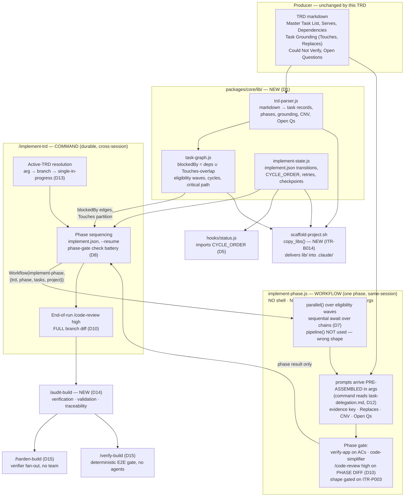
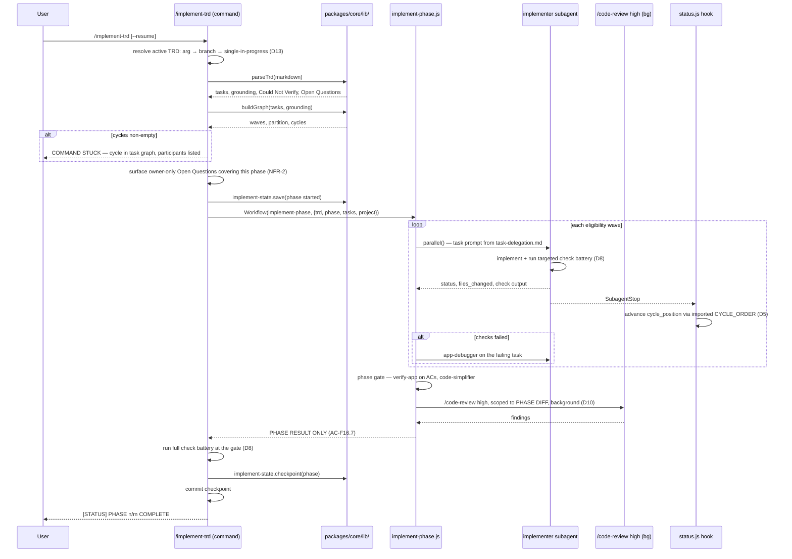

# TRD: Rework `/implement-trd` and Build the Deterministic Task Graph

**Version**: 1.3.0
**Status**: Draft
**Created**: 2026-08-16
**Last Updated**: 2026-08-16
**Author**: @technical-architect
**Source PRD**: [`docs/PRD/implement-trd-rework.md`](../PRD/implement-trd-rework.md) (v1.2.1)
**Task ID Prefix**: `ITR`

---

## Changelog

| Version | Date | Changes | Author |
|---------|------|---------|--------|
| 1.0.0 | 2026-08-16 | Initial TRD creation from PRD v1.2.1 (items 7 + 8 of the improvement plan) | @technical-architect |
| 1.1.0 | 2026-08-16 | `/refine-trd --auto` pass. **Open questions:** OQ-2, OQ-3, OQ-4, OQ-7 **answered** from the `Workflow` tool contract and from code; OQ-6 recorded as a **default**; OQ-1 and OQ-5 confirmed **owner-only** and left open. **Removed:** ESLint and Prettier from D9's check battery, §1.3's stack table, §6.2's Code Quality row and ITR-B005's acceptance criteria — neither is installed or configured in this repo (`package.json` devDependencies are `bats`, `jest`, `js-yaml`, `mock-fs`; no `.eslintrc*` / `.prettierrc*` / `eslint.config.*` anywhere); the claim traced to `stack.md`'s Code Quality table, a design document, not to the code. **Removed:** D8's "have `implement-phase.js` shell out per task" alternative and TR1's shell half — a workflow script has no shell and no filesystem access, so the alternative was never available. **Corrected:** D7 (`pipeline()` exists but applies uniform stages to items and cannot express heterogeneous dependency chains — sequential `await` is now the decision, not a fallback); §3.4 (the workflow cannot read `task-delegation.md` from disk — the command assembles the prompt and passes it in `args`); §3.1's phase-heading rule (real TRDs use `### 4.2 Phase 1:`, `### 4.1 Phase 1 —` and `### 5.1 Phase 1 —`); ITR-B001's acceptance criterion (its own grounding shows `discipline-judgment.md`'s five-column schema would warn on every row); §7.1 R8 and ITR-T001's `vendoring.test.sh` premise (that file contains zero occurrences of `packages/core`, performs no `diff`/`cmp`, and is skipped by default); the `notify-on-complete.test.sh` hard-coded command array count (**seven** loops, not five). **Added:** ITR-B014 (`copy_libs()` in `scaffold-project.sh` — `packages/core/lib/` had no delivery path into a scaffolded `.claude/`), ITR-B015 (smoke-fixture rework in Phase 2 — the fixture's bullet-list Master Task List parses to zero tasks and its hard `verify-app` assertion goes red at ITR-B005), AC-N2 to ITR-T002, G1's five-artifact metric to ITR-T001, and `G4` / `G5` / `AC-N1` / `AC-N8` / `AC-N9` references that had no `Serves` entry. **STUCK:** none. | @technical-architect |
| 1.2.0 | 2026-08-16 | OQ-1 and OQ-5 closed as **OWNER-CALL** decisions under the revised `--auto` contract: `--auto` now closes every question rather than leaving owner-territory ones open, and records the decision plus its reasoning so the owner can review and countermand. `<design_references>` points at `## 9. Task Grounding`; the team-command replacements are `/harden-build` and `/verify-build`. **No open questions remain.** | @technical-architect |
| 1.3.0 | 2026-08-16 | ITR-B013 retired and D15 narrowed: `/verify-build` is not command-shaped. `/harden-build` survives as the whole-feature adversarial pass, distinct from the per-phase hardening agent inside `implement-phase.js`. Task count 22 -> 21. | @technical-architect |

---

## 1. Overview

### 1.1 Technical Summary

This is a consumer-side rework of a producer/consumer pair whose producer was rebuilt without
it. Three things change, and they are separable only in the sense that they land in
dependency order:

1. **Deterministic operations move out of prose and into `packages/core/lib/`** — a TRD
   parser, a task graph, and an `implement.json` state machine, unit-tested with Jest. Today
   `packages/core/lib/` does not exist (verified: `packages/core/` contains `agents commands
   contracts hooks scripts templates workflows`), and dependency resolution, eligibility,
   parallel sets and file-ownership conflicts are re-derived from TRD prose by the model on
   every invocation.
2. **The execution model splits along the durability line.** `/implement-trd` stays a command
   and keeps everything that must survive a session boundary — TRD parsing, phase sequencing,
   `implement.json`, `--resume`. A single parameterized workflow, `implement-phase.js`, runs
   **one phase** and writes no durable state. This is the F16 decision, and its constraint is
   that workflows cannot resume across sessions.
3. **The per-task loop collapses.** `IMPLEMENT → VERIFY → SIMPLIFY → VERIFY → REVIEW` becomes
   `IMPLEMENT → deterministic checks → [DEBUG on fail]`. `verify-app`, `code-simplifier` and
   `/code-review high` move to the phase boundary. `code-reviewer` leaves the loop entirely
   and its one distinctive job — acceptance-criteria verification — relocates to a new
   `/audit-build`.

Four smaller wiring fixes ride along because they are all edits to the same delegation
template: the evidence-marker key (`[read]` / `[ran]` / `[inferred]`), the `Replaces` deletion
instruction, `## Could Not Verify` routing, and owner-only `## Open Questions` surfacing. The
`<design_references>` extraction target — which today names a TRD "Section 10 'Reference
Documents'" that no generated TRD has — is corrected in the same file.

The shape is deliberately conservative about scope: this TRD builds three library modules, one
new workflow, one new command, two command replacements, one contract file, and edits an
existing command, one hook, the scaffolder and the smoke fixture. It does not touch the producer
(`/create-trd`) unless the Sunstone read (ITR-P001) shows the parser cannot consume what the
producer emits — a risk the PRD names as R3 and which has its own contingency.

**Two consequences the runtime forces on this design (established v1.1.0 from the `Workflow`
tool contract).** A workflow script has *"No filesystem or Node.js API access"* and cannot
execute shell. So (a) `implement-phase.js` cannot run the deterministic check battery — the
implementer runs it inside its own task and the command runs it at the phase gate (D8), which is
what AC-F7.2's "without spawning an agent" was asking for anyway; and (b) the workflow reads
nothing off disk, so the command assembles every prompt and passes it in `args` (§3.4). Both
were written the other way round in v1.0.0 and probed rather than decided. See §1.3's runtime
table for the full constraint set.

**One delivery gap the design has to close.** `packages/core/lib/` is a new top-level directory,
and `scaffold-project.sh` has no copy function for one — the three modules would exist in this
checkout and in no scaffolded project. ITR-B014 adds `copy_libs()`. This is the same failure
shape `async-discipline.md` records for `ENSEMBLE_DISCIPLINE_JUDGE_DISABLE`: a mechanism that
reports as present with nothing behind it.

### 1.2 Key Technical Decisions

| ID | Decision | Choice | Serves Objective | Rationale | Alternatives Considered |
|----|----------|--------|------------------|-----------|------------------------|
| D1 | `lib/` module boundary | Three CommonJS modules under `packages/core/lib/`: `trd-parser.js`, `task-graph.js`, `implement-state.js` | AC-F1.1, G2 | The three names the source itself uses; each has a distinct input (markdown / task records / state file) and can be unit-tested in isolation, which is what the >80% bar requires. **Delivery, added v1.1.0:** `packages/core/lib/` has **no** path into a scaffolded `.claude/` tree — `scaffold-project.sh` has nine `copy_*` functions (`copy_template`, `copy_agents`, `copy_contracts`, `copy_workflows`, `copy_commands`, `copy_hook_prompts`, `copy_hook_libs`, `copy_hooks`, `copy_skills`) and none globs a top-level `lib/`. AC-F1.1 names `packages/core/lib/` explicitly, so the path is kept and the delivery gap is closed by a new task (ITR-B014) rather than by relocating the modules | (a) One `lib/implement.js` — rejected, couples parser failures to state-machine tests and makes the coverage bar meaningless per-concern. (b) Port Sunstone's whole surface (parser, graph, phase-tracker, cross-trd-deps, 76 test files) — rejected by NG1. (c) Put the three modules under `packages/core/hooks/lib/`, which `copy_hook_libs()` already delivers and which `status.js`'s `require('./lib/…')` already resolves — rejected: AC-F1.1 names `packages/core/lib/` and moving them to dodge a scaffolder change would satisfy the letter of "three modules exist" in the wrong directory. **Revisit** if a fourth concern appears that fits none of the three |
| D2 | Parser input contract | Parse the TRD's Master Task List tables, `Dependencies`, `Serves`, phase headings, and the `## 9. Task Grounding` blocks (incl. `Touches`, `Replaces`), plus `## Could Not Verify` and `## Open Questions`, exactly as `packages/core/contracts/trd-authoring.md` specifies them today. **No producer format change in this TRD.** | AC-F1.3, AC-F4.1, AC-F5.1, R3 | The producer contract already puts every field the graph needs in structured, parser-consumable position. Changing the producer to suit the parser would make this a two-sided change with a much larger blast radius | Demand structured task declarations (YAML front-matter per task, or a machine block) — rejected for now; it converts a parser change into a `/create-trd` + contract change. **Revisit** when ITR-P001's Sunstone read shows a specific field the markdown form cannot express unambiguously — R3's contingency covers this |
| D3 | Graph edge model | `blockedBy` edges are the **union** of (a) declared `Dependencies` and (b) `Touches`-overlap conflicts. Conflict edges are oriented by task-ID lexical order so the same TRD always yields the same graph | AC-F1.4, AC-F1.5, AC-F1.9 | AC-F1.9 requires overlapping `Touches` to serialize even when the dependency graph would permit parallelism. Making both edge kinds the same edge type means eligibility, parallel sets and cycle detection each have one code path | Keep the two edge kinds separate and intersect the parallel sets afterwards — rejected: two representations of "cannot run yet" is where the current prose-derived version already goes wrong. **Revisit** if a conflict edge ever needs a different retry semantics from a dependency edge |
| D4 | Cycle handling | Kahn's algorithm; nodes remaining after the queue drains are reported as a cycle finding with the participating task IDs, and the run stops | AC-F1.6 | AC-F1.6 asks for detection and reporting *rather than looping*. A topological sort that reports its residue gives both properties from one pass | DFS colouring to name the exact back-edge — rejected as more code for a strictly better error message; the residue set is enough to act on. **Revisit** if residue sets in practice are large enough to be unhelpful |
| D5 | Reduced cycle order, single source | `implement-state.js` exports `CYCLE_ORDER = ['implement', 'checks', 'debug', 'complete']`. `packages/core/hooks/status.js` **imports** it rather than declaring its own | AC-F7.7, AC-F7.1, R9 | `status.js:210` today hard-codes `['verify_red','implement','verify','simplify','verify_post_simplify','review','complete']` and advances `cycle_position` along it on every `SubagentStop` (manifest order 1). F7 deletes three of those stages, so the hook would advance in-progress tasks through stages that no longer exist. One exported constant makes divergence impossible | (a) Retire `status.js` outright — rejected: `cycle_position` is the durable marker `--resume` reads, and nothing else writes it on subagent completion. (b) Duplicate the constant in the hook — rejected, this is exactly R9. **Revisit** if the hook ever needs a cycle order that differs from the command's |
| D6 | Execution-model split | `/implement-trd` (command) owns TRD parsing, the graph, phase sequencing, `implement.json`, `--resume`. `implement-phase.js` (workflow) owns one phase and writes no durable state | AC-F16.1, AC-F16.2, AC-F16.5, NFR-9, G8 | Inherited verbatim from the source's 2026-08-16 execution-model decision. `resumeFromRunId` is same-session only; an implement run spans sessions | A whole-run workflow, or one workflow generated per phase — both rejected in the PRD's §8 table. **Revisit** if workflows gain cross-session resume |
| D7 | Chain composition inside a phase | `parallel()` over each eligibility wave from the graph; **sequential `await` composition** over dependency chains within the workflow script | AC-F16.3 | **Settled 2026-08-16 against the `Workflow` tool contract, not by inference from this repo.** `pipeline(items, stage1, stage2, …)` *does* exist — but it runs every **item** through the **same** ordered stages with no barrier between them. A phase's dependency chains are heterogeneous (different lengths, different per-task prompts), which `pipeline()` cannot express; only a degenerate phase where every task runs the identical stage sequence would fit. Sequential `await` between waves is semantically what AC-F16.3 asks for and is the shape all four existing scripts already use. **AC-F16.3's literal wording ("`pipeline()` over dependency chains") is therefore not met, and the deviation is recorded rather than papered over** | Use `pipeline()` literally, one call per chain — rejected: a chain is one item through N distinct stages, so each chain needs its own `pipeline()` call and the composition between chains is still sequential `await`. It buys nothing over `await` and adds a primitive whose no-barrier semantics have no test here. **Revisit** if a phase's tasks ever become homogeneous enough that one `pipeline()` covers the whole wave |
| D8 | Where deterministic checks run | Per task: the implementer runs the targeted check battery inside its own task and returns the verbatim result — **no additional agent is spawned**. Per phase: the command runs the full battery itself at the phase gate | AC-F7.1, AC-F7.2, AC-F16.7 | **Forced, not chosen, as of 2026-08-16.** The `Workflow` tool contract states verbatim *"No filesystem or Node.js API access"* — a workflow script cannot run a test command, so the battery cannot live in `implement-phase.js` at all. Of the three remaining places it could go, the command-only option makes checks per-phase and breaks AC-F7.1's per-task cycle, and a dedicated check agent reintroduces the invocation AC-F7.2 exists to remove. The implementer is the agent already doing the task and it has `Bash`, so it costs zero extra invocations — and putting the checks in its acceptance criteria is the same move `trd-authoring.md:344–382` already makes for unit tests. PRD §8's confirmed grounding is the objective this serves: *"The expensive thing is not running tests, it is spawning an agent to decide whether they passed"* | (a) Command runs the battery per task — rejected: per-task results re-enter orchestrator context, contradicting AC-F16.7. (b) A dedicated cheap check agent per task — rejected by AC-F7.2's "without spawning an agent". (c) ~~`implement-phase.js` shells out per task~~ — **removed 2026-08-16; the runtime has no shell.** **Revisit** if workflow scripts gain a shell primitive |
| D9 | Per-task check battery, resolved per project | From `package.json` and what is **executable in this checkout**, not from `stack.md`'s aspiration. For **this** repo: `npx jest <paths touched>` for targeted unit tests, `npm run smoke` at the phase gate, `shellcheck` on changed shell. **Typecheck: empty — no TypeScript here. JS lint: empty — no linter is installed** | AC-F7.2, OQ-4 (PRD §8, resolved) | AC-F7.2's three slots are "targeted tests, typecheck and lint". Tests and shell lint resolve to real commands. The other two resolve to **nothing in this repo**, and are recorded as empty rather than filled with a tool that is not there. **Corrected in v1.1.0:** ESLint and Prettier were named here from `stack.md`'s Code Quality table; `package.json`'s devDependencies are `bats`, `jest`, `js-yaml`, `mock-fs`, and no `.eslintrc*`, `.prettierrc*` or `eslint.config.*` exists anywhere in the tree. A design document is evidence of intent, never of installation | A fixed cross-project battery — rejected; `stack.md` is per-project by design. Install ESLint + Prettier so the battery can run as originally written — rejected as outside this TRD's scope and unsourced: no PRD line asks for a linting toolchain. **Revisit** when a linter is actually added, or when a project using this framework has a typecheck step |
| D10 | Review routing | `/code-review high` scoped to the phase diff, started **inside** `implement-phase.js` as a background subagent; one further `/code-review high` over the full branch diff started by the command at end of run | AC-F8.3, AC-F8.4, AC-F8.5, AC-F16.4, NFR-4 | Inherited from PRD F8. Phase-scoped reviews are structurally blind to cross-phase integration, which is what the end-of-run pass covers | The R1 contingency route (`claude-code-action@v1` on `synchronize`) — held in reserve, not built. Its route and secret are owner-only (NG11). **Revisit** if ITR-P002 shows `/code-review` is not model-startable here |
| D11 | `<design_references>` extraction target | Match the TRD heading **by text, loosely** — any heading containing "Design References" or "Reference Documents", anywhere in the document, including inside Appendices. Emit the element only when the match succeeds | AC-F6.1, AC-F6.2, AC-F6.3 | `trd-authoring.md` defines no "Reference Documents" section, and section numbers shift as authors renumber. A loose text match survives renumbering; the absent case is explicitly an omission, not a guess | Add a "Reference Documents" section to `trd-authoring.md` so the number is real — rejected here as a producer change outside this TRD's scope, and one that would put a section in every TRD to serve UI tasks only. **Revisit** if a project's TRDs routinely carry design references and the loose match proves unreliable — see OQ-1 |
| D12 | Contract split | The per-task implementer instruction set moves to `packages/core/contracts/task-delegation.md`; `implement-trd.md` keeps orchestration only | AC-F13.1, AC-F13.2, AC-F13.3, G6 | Direct precedent: `packages/core/contracts/{prd,trd}-authoring.md` already carry the authoring halves of `/create-prd` and `/create-trd`, and `trd-authoring.md:1–9` records the measured saving (~10.5k tokens re-cached ~17 times per run) | Leave it inline and cut length elsewhere — rejected; the re-cache cost is per-turn and the delegation template is the largest re-cached block. **Revisit** never for this file; the precedent is settled |
| D13 | Active-TRD resolution order | (1) explicit path argument, (2) branch-derived, (3) single in-progress TRD, (4) STUCK. `current.json` is removed from the chain. `active_sessions` is removed from the template and from all writes | AC-F11.1, AC-F11.2, AC-F11.3, AC-F11.4 | `cb9fcda` already untracked `current.json` and `wiggum-state.json`, and the `.gitignore` comment states this exact fallback order. `active_sessions` is `{}` in all three `implement.json` files on disk — the mechanism was designed and never used, and NG13 descopes the coordination it existed for | Keep `active_sessions` and give it a purpose — rejected under NG13. **Revisit** if cross-implementation coordination comes back into scope |
| D14 | `/audit-build` shape | Command + `packages/core/workflows/audit-build.js`, mirroring `audit-trd.js`: index → `parallel()` verifiers → reconcile. Three verifiers: verification (code ↔ TRD tasks), validation (code ↔ PRD requirements), traceability (requirement → implementation → test) | AC-F10.1, AC-F10.2, AC-F10.3, AC-F10.4, AC-F10.5, AC-F9.2, G7 | The PRD asks for "the same proven shape as `audit-prd`/`audit-trd`". Reusing that shape means reusing its `required()` guard, its dead-verifier accounting, and its Could Not Verify rewrite, all of which already exist | One monolithic verifier agent — rejected: `audit-trd.js` explicitly reports partial coverage when a verifier dies, which a single agent cannot. **Revisit** never; this is a deliberate copy of a working shape |
| D15 | Team-command replacements | Two separate artifacts: `/harden-build` (verifier fan-out workflow, no teammates) and `/verify-build` (deterministic E2E gate, no agents at all) | AC-F14.1, AC-F14.2, AC-F14.3, AC-F14.5 | AC-F14.3 forbids collapsing the two jobs into one replacement. The E2E gate convenes nothing — it runs the tests | Fold the E2E gate into `/audit-build` — rejected by AC-F14.3. **Revisit** if the two are measured to always run together with no independent value |
| D16 | `code-reviewer` disposition | The agent file **stays on disk** and stays in the scaffolded agent set. Only its per-task-loop references are removed; its acceptance-criteria job relocates to `/audit-build`'s traceability verifier | AC-F9.1, AC-F9.2 | PRD F9: "The agent is **not deleted**." `validate-init.sh:125` and `validate-init.test.sh:66` both assert `code-reviewer.md` is present in a scaffolded project; keeping the file means those assertions need no change, and `agent-validation.test.js:58,498` keeps its leaf-agent entry valid | Delete the agent — rejected by F9. **Revisit** if `/audit-build` fully subsumes it and nothing invokes it for two releases |
| D17 | Vendoring | Every `packages/core/` change in this TRD is mirrored to `.claude/` in the **same task**, not in a sweep at the end | AC-F9.3, R8 | `.claude/` carries its own copies of commands, contracts, agents, hooks and workflows. A change this wide, mirrored at the end, is where drift enters; `vendoring.test.sh` catches it but only after the fact | A single terminal sync task — rejected: it makes every intermediate phase gate fail its own vendoring check. **Revisit** never |
| D18 | `lib/` build order | Parser → graph → state machine, in that order, each landing with its own unit tests and with `npm run smoke` green before the next starts | AC-F1.7, NFR-8 | The source's own instruction: "Build incrementally: parser first, verify with the smoke harness, then the graph, then state." The graph consumes parser output, so the order is also the dependency order | Build all three then verify — rejected; NFR-8 requires green *after each increment* |

### 1.3 Technology Stack

| Layer | Technology | Purpose | Notes |
|-------|------------|---------|-------|
| Deterministic library | JavaScript / Node.js 18+ | `packages/core/lib/` parser, graph, state machine | Per `stack.md`; NFR-7 |
| Unit tests | Jest ^29.7.0 | `packages/core/lib/*.test.js`, `status.test.js` | Already the project's runner (`package.json` `"test": "jest"`) |
| Workflow scripts | JavaScript (ESM, `Workflow` runtime) | `implement-phase.js`, `audit-build.js`, `harden-build.js` | Same shape as the four existing scripts in `packages/core/workflows/` |
| Commands / contracts | Markdown | `implement-trd.md`, `task-delegation.md`, `/audit-build`, `/harden-build`, `/verify-build` | Prompts only, per constitution principle 2/3 |
| Hooks | JavaScript / Node.js | `status.js` rewrite | `hookType: "command"`, `SubagentStop` order 1 |
| Structure / integration tests | BATS ^1.9.0 | banner assertions, vendoring, structure greps | `test/integration/tests/` |
| Behavioural smoke | Bash | `npm run smoke` → `test/smoke/run-smoke.sh` | Seven scenarios incl. `implement-one-task.sh` |
| Shell lint | ShellCheck | changed shell in the check battery | `/opt/homebrew/bin/shellcheck` — present and executable [ran] |
| ~~JS lint / format~~ | ~~ESLint, Prettier~~ | — | **Removed v1.1.0. Neither is installed.** `package.json` devDependencies are `bats`, `jest`, `js-yaml`, `mock-fs`; no `.eslintrc*`, `.prettierrc*` or `eslint.config.*` exists in the tree; `command -v eslint` and `command -v prettier` both fail. `stack.md`'s Code Quality table names them, and a design document is not evidence that a tool exists. D9's lint slot is empty for JS in this repo |

No new runtime dependency is introduced, and this TRD does not add one — installing a linter
would be an unsourced scope addition. No database, no service, no network call on the primary
path.

**Workflow runtime constraints (established 2026-08-16 from the `Workflow` tool contract, and
binding on every workflow-script decision in this document):**

| Fact | Consequence in this TRD |
|---|---|
| `pipeline(items, stage1, stage2, …)` exists — each item runs through all stages, no barrier between stages | D7: usable only for homogeneous item×stage work, not for heterogeneous dependency chains. AC-F16.3's literal wording is not met |
| **A workflow script cannot execute shell and has no filesystem access** — verbatim: *"No filesystem or Node.js API access."* Standard JS built-ins only; `Date.now()`, `Math.random()` and argless `new Date()` throw | D8: the check battery cannot live in `implement-phase.js`. §3.4: the workflow cannot read the TRD or `task-delegation.md` — the command reads them and passes content in `args`. NFR-9 / AC-F16.5 / AC-N9 ("writes no durable state") are satisfied **by construction**, not by discipline |
| A script's `agent()` calls **are** subagents; there is no separate background-spawn primitive inside a script | AC-F8.4 / NFR-4 / AC-N4 ("per-phase review runs as a **background** subagent") is not attested for a workflow-started agent. Narrowed probe ITR-P003 |
| `agent(prompt, opts)` — observed `opts` in all four existing scripts are `label`, `phase`, `effort`, `model`, `schema`. **No script names a `subagent_type`** | Whether `implement-phase.js` can dispatch the *typed* agents `verify-app` and `code-simplifier` (AC-F7.3, AC-F7.4) is unattested. Narrowed probe ITR-P003; OQ-6's answer turns on it |
| Concurrency capped at `min(16, cores-2)` per workflow; 1000 agents per workflow total | Not binding — this TRD's largest phase is 7 tasks |

### 1.4 Integration Points

| System | Type | Direction | Notes |
|--------|------|-----------|-------|
| `/create-trd` + `/audit-trd` (producer) | Markdown artifact | In | Supplies Master Task List, `Serves`, `Dependencies`, Task Grounding (`Touches`, `Replaces`), `## Could Not Verify`, `## Open Questions`. **Read-only in this TRD** — D2 changes nothing on the producer side |
| `implement.json` | JSON state file | Both | Written by the command (D6) and by `status.js` (D5); read by `--resume` |
| `packages/core/hooks/status.js` | Hook, `SubagentStop` order 1 | Both | Imports `CYCLE_ORDER` from `implement-state.js` after D5 |
| `dispatch-ledger.js` | Hook, `SubagentStart`/`SubagentStop` | Out | Supplies the evidence for AC-F7.6, AC-F8.4, AC-F14.5, AC-N4, AC-N6 |
| `/code-review` (built-in skill) | Slash command / subagent | Out | Local, plan-billed tier only; `high` effort; never `ultra` (AC-F8.7) |
| `git` | CLI | Both | Branch derivation (D13), phase-diff scoping (D10), checkpoint commits |
| `.claude/` vendored tree | File mirror | Out | D17; asserted by `vendoring.test.sh` |
| `Sunstone-Partners/ensemble` | Git clone, read-only | In | Evidence source for ITR-P001 only. Not on this machine; must be cloned fresh |

---

## 2. System Architecture

### 2.1 Architecture Overview



### 2.2 Component Architecture

#### 2.2.1 `packages/core/lib/trd-parser.js`

**Responsibility**: Turn a TRD markdown file into structured records. Task rows (ID,
description, `Serves`, `Skills`, `Dependencies`, acceptance criteria, `[LIVE]` marker), phase
assignment from the `### 4.N Phase N:` headings, per-task grounding blocks from `## 9. Task
Grounding` (including `Touches` and `Replaces`), and the two document-level sections
`## Could Not Verify` and `## Open Questions` — both matched by loose heading text, because
authors number them into the document's own scheme.

**Interfaces**: `parseTrd(markdown, { path }) → { tasks, phases, grounding, couldNotVerify, openQuestions, warnings }`

**Dependencies**: none (pure function over a string).

#### 2.2.2 `packages/core/lib/task-graph.js`

**Responsibility**: Build the `blockedBy` graph, compute eligibility waves and the critical
path, detect cycles, and emit the file-ownership partition.

**Interfaces**: `buildGraph(tasks, grounding) → { nodes, edges, waves, criticalPath, cycles, partition }`

**Dependencies**: `trd-parser.js` output shape only — it takes records, not markdown, so it is
testable without a TRD fixture.

#### 2.2.3 `packages/core/lib/implement-state.js`

**Responsibility**: Own `implement.json`. Legal transitions, `cycle_position` advancement along
the exported `CYCLE_ORDER`, retry counting, checkpoint records, and atomic write
(temp file + rename, matching the pattern `status.js` already uses).

**Interfaces**: `CYCLE_ORDER`, `advance(state, taskId)`, `recordResult(state, taskId, result)`,
`checkpoint(state, phase)`, `load(path)`, `save(path, state)`

**Dependencies**: none. **Consumers**: `/implement-trd`, `packages/core/hooks/status.js` (D5).

#### 2.2.4 `packages/core/workflows/implement-phase.js`

**Responsibility**: Execute exactly one phase. Fan out over the eligibility waves supplied in
`args.tasks`, compose chains sequentially, then run the phase gate. **Writes no durable state**
(NFR-9) — it returns a phase result and nothing else.

**Interfaces**: `Workflow({ name: "implement-phase", args: { trd, phase, tasks, project } })`

**Dependencies**: `task-graph.js` output (via the command, as `args.tasks`).

**Corrected v1.1.0 — the workflow cannot read `task-delegation.md`.** The original text listed
that contract as a dependency of the script. A workflow script has *"No filesystem or Node.js
API access"*, so it cannot open the contract, cannot open the TRD, and cannot read a grounding
block off disk. **The command reads both and passes the assembled per-task prompt text in
`args`.** This changes the arg shape: `args.tasks.records[].prompt` carries the fully assembled
delegation (contract body + that task's grounding block + any `<unverified_claims>` /
`<open_question>` elements), rather than the workflow composing it. See §3.4's Interface.

#### 2.2.5 `packages/core/contracts/task-delegation.md`

**Responsibility**: The complete per-task instruction set handed to an implementer. Carries the
evidence-marker key, the `Replaces` deletion instruction, the `Could Not Verify` element, the
owner-only `Open Questions` element, scope discipline, and the deliverables list.

**Dependencies**: none — it is a prompt. **Consumers**: `implement-phase.js` only.

#### 2.2.6 `packages/core/hooks/status.js` (rewritten)

**Responsibility**: Unchanged in kind — advance `cycle_position` for the single in-progress task
on `SubagentStop`. Changed in substance: `CYCLE_ORDER` is imported from `implement-state.js`
rather than declared locally, so it cannot advance a task through a stage the command deleted.

### 2.3 Data Flow — one phase



### 2.4 State Management

`implement.json` remains the single durable coordination point, owned by the command (NFR-9).
Three changes:

- `cycle_position` moves onto the reduced `CYCLE_ORDER` (D5). The `simplify`,
  `verify_post_simplify` and `review` positions cease to exist per task; the work they named
  now happens once per phase and is recorded in the phase checkpoint, not the task record.
- `active_sessions` is removed from `packages/core/templates/trd-state/implement.json.template`
  and from every write path (D13). It is `{}` in all three on-disk state files and NG13
  descopes the coordination it existed for.
- `current.json` leaves the active-TRD resolution chain entirely (D13). It is already
  gitignored (`cb9fcda`), so a fresh clone or a new worktree has none, and the command must
  tolerate its absence.

Phase-level retry is whole-phase (AC-F16.6): the checkpoint records the phase boundary, and a
retried phase re-runs its whole task set. Per-task retry counting stays in the task record and
is unchanged in kind.

---

## 3. Technical Specifications

### 3.1 `trd-parser.js`

**Purpose**: Deterministic markdown → records, with no interpretation.

**Interface**:

```javascript
/**
 * @param {string} markdown  full TRD text
 * @param {{path?: string}} opts
 * @returns {ParseResult}
 */
function parseTrd(markdown, opts = {}) {}

/**
 * @typedef {Object} Task
 * @property {string}   id            e.g. "ITR-B002"
 * @property {string}   description
 * @property {string[]} serves        objective / decision IDs
 * @property {string[]} skills
 * @property {string[]} dependencies  task IDs, [] when the cell reads "None"
 * @property {string}   acceptance
 * @property {number}   phase
 * @property {boolean}  live          true when the description carries [LIVE]
 *
 * @typedef {Object} Grounding
 * @property {string[]} touches       MANDATORY per trd-authoring.md
 * @property {string[]} reuse
 * @property {string[]} replaces
 * @property {string[]} follow
 * @property {string[]} careful
 *
 * @typedef {Object} ParseResult
 * @property {Task[]}                    tasks
 * @property {Object<number,string>}     phases          phase number → phase name
 * @property {Object<string,Grounding>}  grounding       task id → block
 * @property {{claim:string, check:string}[]}  couldNotVerify
 * @property {{id:string, question:string, assumed:string, ownerOnly:boolean}[]} openQuestions
 * @property {string[]}                  warnings
 */
```

**Behavior**:
- Heading matching for `## Could Not Verify` and `## Open Questions` is **loose**: any heading
  whose text contains the phrase, at any level, with or without a leading number. `audit-trd.js`
  already documents why (authors number these into the document's own scheme).
- **Phase headings are matched by text, not by section number, and the separator is not fixed**
  (corrected v1.1.0 — the original "`### 4.N Phase N:`" rule matches none of the three real
  formats on disk). Match any heading whose text contains `Phase <n>`; take `<n>` from that text.
  Attested formats: `### 4.2 Phase 1: Evidence and the deterministic library` (this TRD, and
  `docs/TRD/_workflow-test-stop-hook.md:356`), `### 4.1 Phase 1 — Resolve the mechanics`
  (`docs/TRD/discipline-judgment.md:351`, em-dash) and `### 5.1 Phase 1 — Single task`
  (`test/smoke/lib/project.sh`'s fixture, under `## 5. Execution Plan` rather than `## 4.`).
  The section number is not a reliable anchor and the phase's own number does not track it.
- **The Master Task List is a table, per `trd-authoring.md` Section 5.** A bullet-list Master
  Task List is not parsed and yields zero tasks — which is what the smoke fixture writes today
  (`test/smoke/lib/project.sh`, `smoke_write_trd()`). ITR-B015 converts the fixture rather than
  widening the parser: `trd-authoring.md` is the format authority (D2), and teaching the parser
  a second input shape to accommodate a test fixture inverts producer and consumer.
- A task with no grounding block yields no `grounding[id]` entry — absence is meaningful and is
  not filled with an empty object.
- `ownerOnly` is set when the Open Question row's text marks it as such (the PRD's own
  convention: an explicit "owner-only" / "owner ruling" marker). A question with no such marker
  is not owner-only and is not surfaced by F5.

**Error Handling**:
- No Master Task List section → throw with the file path and the heading it looked for. This is
  the existing validation `implement-trd.md` performs in prose; it moves here.
- A `Dependencies` cell naming a task ID that does not exist → recorded in `warnings`, not
  thrown. The graph decides whether it is fatal.
- Malformed table row (wrong column count) → recorded in `warnings` with the line number; the
  row is skipped rather than half-parsed.

### 3.2 `task-graph.js`

**Purpose**: One graph, two edge sources, deterministic output.

**Interface**:

```javascript
/**
 * @param {Task[]} tasks
 * @param {Object<string,Grounding>} grounding
 * @returns {GraphResult}
 */
function buildGraph(tasks, grounding) {}

/**
 * @typedef {Object} Edge
 * @property {string} from        blocking task id
 * @property {string} to          blocked task id
 * @property {'dependency'|'file-conflict'} kind
 * @property {string} [file]      the overlapping path, for kind === 'file-conflict'
 *
 * @typedef {Object} GraphResult
 * @property {string[]}   nodes
 * @property {Edge[]}     edges
 * @property {string[][]} waves          eligibility waves; waves[0] runs first
 * @property {string[]}   criticalPath
 * @property {string[][]} cycles         empty when acyclic
 * @property {Object<string,string[]>} partition   file path → task ids that touch it
 */
```

**Behavior**:
- `blockedBy(t)` = declared `Dependencies` ∪ `{ u : Touches(u) ∩ Touches(t) ≠ ∅ ∧ u <ᴵᴰ t }`.
  Orienting the conflict edge by lexical task ID (D3) is what makes the graph identical across
  runs of the same TRD.
- A task with **no** grounding block, and therefore no `Touches`, contributes no conflict edges
  and is emitted in `warnings` by the caller's own check — `Touches` is the one mandatory
  grounding field, so its absence is a producer defect worth surfacing, not something to
  silently tolerate.
- `waves` is the Kahn levelisation: every task in `waves[i]` has all blockers in
  `waves[0..i-1]`. `implement-phase.js` maps one wave to one `parallel()` call (D7).

**Error Handling**:
- Cycles: `cycles` is non-empty and `waves` covers only the acyclic prefix. The command treats
  a non-empty `cycles` as STUCK (AC-F1.6) and names the participating task IDs.
- A dependency on an unknown task ID is dropped from the graph and reported; it must not make
  a task permanently ineligible and silently stall the run.

### 3.3 `implement-state.js`

**Purpose**: The only writer of `implement.json` semantics.

**Interface**:

```javascript
const CYCLE_ORDER = ['implement', 'checks', 'debug', 'complete'];

function load(path) {}
function save(path, state) {}          // atomic: temp file + rename
function advance(state, taskId) {}     // returns {state, from, to} or null when not advanceable
function recordResult(state, taskId, {status, filesChanged, error}) {}
function checkpoint(state, phase, {commit, review}) {}
```

**Behavior**:
- `advance()` preserves the existing safety property in `status.js`: it advances only when
  **exactly one** task is `in_progress`, and skips when a task signals active debugging.
- `debug` is a position on the path, not a branch off it: a task that fails its checks moves
  `checks → debug`, and a successful debug moves `debug → complete`. This keeps `CYCLE_ORDER`
  a total order, which is what makes `status.js`'s index-plus-one advance correct.
- `save()` is atomic. Two writers exist by construction — the command and the `SubagentStop`
  hook — and this is already the pattern `status.js` uses.

**Error Handling**:
- Unknown `cycle_position` (e.g. a state file written before this change, carrying `simplify`)
  → `advance()` returns null and records a migration warning rather than throwing. A
  half-migrated state file must not wedge `--resume`.

### 3.4 `implement-phase.js`

**Purpose**: One phase, no durable state.

**Interface**:

```javascript
// args — every value is passed IN. The script reads nothing from disk (v1.1.0).
{
  trd:     string,   // path to the TRD, for the agent prompts to cite. NOT opened by the script.
  phase:   number,   // 1-based phase number
  tasks:   {
    waves:   string[][],           // task ids, in eligibility order
    records: (Task & { prompt: string })[]
                                   // `prompt` is the FULLY ASSEMBLED delegation for that task:
                                   // task-delegation.md's body + this task's grounding block +
                                   // its <unverified_claims> / <open_question> elements when
                                   // they apply. Assembled by the COMMAND, which has a
                                   // filesystem; the workflow only dispatches it.
  },
  gate:    { verifyPrompt: string, simplifyPrompt: string, reviewPrompt: string },
                                   // likewise pre-assembled by the command
  project: string    // project root; '' means the repo the workflow runs in
}

// return
{
  phase:        number,
  tasks:        { id: string, status: 'success'|'failed', filesChanged: string[], error?: string }[],
  gate:         { verifyApp: 'pass'|'fail', simplify: 'changed'|'no-change', review: {findings: number} },
  status:       'complete'|'failed'
}
```

**Behavior**:
- For each wave: `await parallel(wave.map(rec => () => agent(rec.prompt, {label, phase, model})))`
  — thunks, not promises, matching `audit-trd.js:288–297`. Chains between waves are the
  sequential `await` (D7); `pipeline()` is not used, see D7.
- **The delegation prompt arrives pre-assembled in `args`** (v1.1.0). The command does the
  assembly — contract body, grounding block verbatim, the `Could Not Verify` rows whose text
  names a file or task this task touches (AC-F4.1), and the owner-only Open Question covering it
  when present — because only the command can read files.
- The phase gate runs `verify-app` against the phase's acceptance criteria, then
  `code-simplifier` across the phase's changed files, then starts `/code-review high` scoped to
  the phase diff. **Two properties here are unattested and gated on ITR-P003**: (i) whether
  `agent()` can name a `subagent_type` at all — no existing script does, so dispatching
  `verify-app` and `code-simplifier` *as those agents* from inside the workflow is unproven; and
  (ii) whether a workflow-started agent can be a *background* subagent, which AC-F8.4 / NFR-4 /
  AC-N4 require. If (i) fails, OQ-6 resolves to the command by force and the gate splits across
  two layers. If (ii) fails, the review is a foreground `agent()` inside the phase and NFR-4's
  "costs no orchestrator context" is satisfied a different way — the workflow return is still
  one phase result (AC-F16.7), so the context property holds even though the mechanism differs.
- The workflow computes no diff and runs no `git` command; the phase-diff range is text the
  command puts in `gate.reviewPrompt`, and the review agent runs `git` with its own tools.
- **The return value is the phase result.** Per-task agent output is consumed inside the
  workflow and does not appear in the return (AC-F16.7).

**Error Handling**:
- A task agent that dies returns null (documented `agent()` behaviour, and the reason
  `create-trd.js` carries a `required()` guard). The workflow records it as `failed` with an
  explicit "agent returned nothing" error rather than dereferencing it.
- A failed phase returns `status: 'failed'` with per-task detail; the command decides whether to
  retry the phase whole (AC-F16.6). The workflow never retries itself — retry policy is durable
  state and belongs to the command.

### 3.5 `task-delegation.md` — the elements this TRD adds

**Purpose**: What an implementer reads. Four new elements, one corrected one.

```xml
<grounding>
  <evidence_key>
    <!-- F2. NEW. -->
    [ran]      Someone executed this and read the output. Trust it most.
    [read]     Someone opened the file and verified the claim. Trust it.
    [inferred] Deduced, not checked. VERIFY IT BEFORE YOU RELY ON IT.
               If it turns out to be wrong, say so in your deliverables —
               the next task's grounding is probably wrong the same way.
  </evidence_key>
  <touches>...</touches>
  <reuse>...</reuse>
  <replaces>
    <!-- F3. Present today at implement-trd.md:926; must survive the split. -->
    {what this makes unreachable} — DELETE it and its tests in the same change.
  </replaces>
  <follow>...</follow>
  <careful>...</careful>
</grounding>

<unverified_claims>
  <!-- F4. NEW. Emitted ONLY when the TRD's Could Not Verify names something
       this task touches. Absence is meaningful — no empty element. -->
  <claim check="{how the author would have checked it}">{claim verbatim}</claim>
  <instruction>
    This task rests on a claim nobody verified. Check it first. If it is false,
    stop and report — do not build on it.
  </instruction>
</unverified_claims>

<open_question>
  <!-- F5. NEW. Owner-only, unresolved, and covering this task. Informational:
       state the assumption and proceed. Do NOT ask (autonomy.md, NFR-2). -->
  <id>{OQ id}</id>
  <question>{verbatim}</question>
  <assumed>{what the TRD assumed}</assumed>
</open_question>

<ui_context>
  <!-- F6. CORRECTED. Heading matched by TEXT ("Design References" /
       "Reference Documents"), not by section number. Omit the whole
       element when no such heading exists (AC-F6.3). -->
  <design_references>{paths from the matched section}</design_references>
</ui_context>
```

**Behavior**:
- `<unverified_claims>` and `<open_question>` are both omitted entirely when nothing applies.
  AC-F4.3 makes this explicit: absence carries information.
- The owner-only Open Question is **surfaced, not asked**. It is written into the delegation and
  into the DISPATCHED banner. Turning it into an `AskUserQuestion` would be exactly the
  defensive-checkpoint anti-pattern `autonomy.md` forbids (NFR-2, AC-F5.3), unless it
  independently meets one of that rule's four cases.

**Error Handling**:
- A TRD with no Task Grounding section at all → `<grounding>` is omitted wholly, as today. The
  evidence key is not emitted on its own; a key with nothing to key is noise.

### 3.6 Active-TRD resolution (D13)

**Behavior**, in order, stopping at the first hit:

1. **Explicit path argument** — `$ARGUMENTS` names a TRD path that exists.
2. **Branch-derived** — parse the current branch against the two documented patterns
   (`<issue-id>-<session>`, `feature/<trd-name>/<session>`) and match the derived slug against
   `docs/TRD/*.md` and `.trd-state/*/`.
3. **Single in-progress** — exactly one `.trd-state/*/implement.json` with uncompleted tasks.
4. **STUCK** — emit `COMMAND STUCK` naming the branch and the candidates found. This is a
   legitimate `AskUserQuestion` case under `autonomy.md` case 2 (information that cannot be
   derived), but STUCK with the candidates listed is the cheaper answer and is preferred.

`current.json` appears nowhere in this chain, and its absence is never an error.

**On the order (added v1.1.0).** `.gitignore:15–17`'s comment states it the other way round —
*"If absent, derive from the branch name; fall back to an explicit path argument"* — branch
first. That comment is not the source for this ordering and does not contradict it: the source
is **AC-F11.2**, which says the explicit path argument *"**overrides** / covers the
unresolvable-branch case"*. "Overrides" is what puts step 1 ahead of step 2. The `.gitignore`
comment describes the absent-`current.json` fallback, not the precedence of an argument the user
typed on purpose.

---

## 4. Master Task List

### 4.1 Task ID Convention

`ITR-[CATEGORY][SEQ]` — `P` infrastructure/probe, `B` backend (library, workflow, command,
hook), `T` testing, `D` documentation/contract. `ITR` is unused elsewhere in `docs/TRD/`
(existing prefixes: `DISC`, `NOTIFY`, `RUNTIME`, `TRD`, `WTSH`).

### 4.2 Phase 1: Evidence and the deterministic library

| Task ID | Description | Serves | Skills | Dependencies | Acceptance Criteria |
|---------|-------------|--------|--------|--------------|---------------------|
| ITR-P001 | Clone `Sunstone-Partners/ensemble` fresh (read-only) and read `trd-parser.js`, `trd-graph.js`, `cross-trd-deps.js` against the source's three named questions. Record adoption decisions with per-decision evidence into `docs/modernization/runs/item8/sunstone-read.md` | AC-F1.8, D2, R3 | | None | A written record naming, per module, what is adopted and what is not, each with a file:line citation from the clone; an explicit verdict on R3 — whether the parser needs a TRD format `/create-trd` does not produce; the clone is never modified |
| ITR-P002 | Empirically verify the in-loop local `/code-review` path: that a model can start `/code-review high`, that it fans out as background subagents, and that no `ultra` tier is reachable by accident. Record the dispatch-ledger evidence | AC-F8.6, AC-F8.7, D10, R1 | | None | A recorded run showing `/code-review high` started from within a session, with the resulting agents visible in `.trd-state/*/dispatch.jsonl`; a stated verdict; if it fails, R1's contingency is escalated before ITR-B009 starts |
| ITR-P003 | **Narrowed v1.1.0.** Two of the original three questions are settled by the `Workflow` tool contract (`pipeline()` exists; a script has no shell and no filesystem access) and are no longer probed. Probe only what remains unattested: (a) can a workflow script's `agent()` name a `subagent_type`, so that `verify-app` / `code-simplifier` can be dispatched *as those agents* from inside the phase gate; (b) can a workflow-started agent be a **background** subagent, as AC-F8.4 / NFR-4 require; (c) can an agent started from a workflow invoke the `/code-review` skill. Record findings alongside ITR-P001's | AC-F7.3, AC-F7.4, AC-F8.4, NFR-4, AC-N4, D10, OQ-6, TR1 | | None | A written finding per question with the probe that established it; OQ-6's resolution and §3.4's phase-gate branch are fixed by this result and recorded before ITR-B008 begins; a negative on (a) is escalated as an OQ-6 answer, not worked around silently |
| ITR-B001 | Build `packages/core/lib/trd-parser.js` per §3.1 — tasks, phases (matched by heading **text**, all three attested separators), grounding (incl. `Touches`, `Replaces`), and loose-matched `## Could Not Verify` / `## Open Questions` | AC-F1.1, AC-F4.1, AC-F5.1, AC-N7, AC-N8, NFR-7, NFR-8, D2, D18 | `jest` | ITR-P001 | Parses this TRD with no warnings other than genuine defects; parses `docs/TRD/discipline-judgment.md`'s **five-column** Master Task List (`\| ID \| Task \| Description \| Dependencies \| Assignee \|`) and its em-dash phase headings **without warning on every row** — the column-count rule keys on the header row of the table it is reading, not on a fixed width; runs on Node 18+ under Jest ^29 with no new runtime dependency; ships its own Jest unit tests incl. malformed-table, missing-section, five-column and all three phase-heading formats; `npm run smoke` green; module + tests mirrored to `.claude/` |
| ITR-B002 | Build `packages/core/lib/task-graph.js` per §3.2 — union edge model, eligibility waves, critical path, Kahn cycle detection, `Touches` partition | AC-F1.4, AC-F1.5, AC-F1.6, AC-F1.9, D3, D4, D18 | `jest` | ITR-B001 | Two tasks with overlapping `Touches` are serialized even with no declared dependency; a cyclic fixture yields non-empty `cycles` and terminates; identical input yields identical `waves` across runs; ships its own Jest unit tests; `npm run smoke` green; mirrored to `.claude/` |
| ITR-B003 | Build `packages/core/lib/implement-state.js` per §3.3 — exported `CYCLE_ORDER`, transitions, retry counting, checkpoints, atomic save | AC-F1.1, AC-N1, AC-N8, NFR-1, NFR-8, D5, D18 | `jest` | ITR-B001 | `CYCLE_ORDER` is `['implement','checks','debug','complete']` and is the module's only declaration of it; a state file carrying a retired position (`simplify`) does not throw; concurrent-write safety by temp-file+rename; ships its own Jest unit tests; `npm run smoke` green; mirrored to `.claude/` |
| ITR-B014 | **NEW v1.1.0.** Add `copy_libs()` to `packages/core/scripts/scaffold-project.sh` so `packages/core/lib/*.js` reaches a scaffolded project's `.claude/lib/`, and extend `scaffold-project.test.sh` / `validate-init.sh` to assert it. Without this the three modules exist only in this checkout and `status.js`'s `require('../lib/implement-state')` fails from `.claude/hooks/` in every scaffolded project | AC-F1.1, AC-F7.7, AC-F9.3, D1, D5, D17, R8 | | ITR-B001 | A `copy_libs()` exists beside `copy_contracts()` and follows its shape, including the `REFRESH != true` / `FORCE` branches; it resolves its source as `$PLUGIN_DIR/../core/lib` and **not** `$PLUGIN_DIR/lib` — `packages/full/lib/` is a real directory holding only `plugin-config.sh` and must not be mistaken for it; a headless `/init-project` into a fixture produces `.claude/lib/{trd-parser,task-graph,implement-state}.js`; `require('../lib/implement-state')` resolves from `.claude/hooks/status.js` in that fixture; `npm run smoke` green |

### 4.3 Phase 2: Consumer rework

| Task ID | Description | Serves | Skills | Dependencies | Acceptance Criteria |
|---------|-------------|--------|--------|--------------|---------------------|
| ITR-B004 | Rewrite `packages/core/hooks/status.js` to import `CYCLE_ORDER` from `implement-state.js`; delete the local declaration at line 210 and the `simplify` / `verify_post_simplify` / `review` positions; update `status.test.js` to assert the import rather than restate the order. **Note `status.js` already re-exports `CYCLE_ORDER` (:411) — that export stays, now re-exporting the imported constant** | AC-F7.7, D5, R9 | `jest` | ITR-B003, ITR-B014 | `grep -c "verify_post_simplify" packages/core/hooks/status.js` returns 0; a `SubagentStop` against a state file at `checks` advances to `debug` or `complete`, never to a deleted stage; existing `status.test.js` cases for the single-in-progress and active-debugging guards still pass; mirrored to `.claude/` |
| ITR-D001 | Create `packages/core/contracts/task-delegation.md` carrying the per-task implementer instruction set moved out of `implement-trd.md` Appendix A, with the four new elements and one correction from §3.5 | AC-F2.1, AC-F2.2, AC-F2.3, AC-F2.4, AC-F3.1, AC-F3.2, AC-F4.2, AC-F4.3, AC-F5.3, AC-F6.1, AC-F6.3, AC-F13.1, D11, D12 | | None | All three evidence markers defined; `[inferred]` carries a verify-before-relying instruction; `[ran]` named most trustworthy; the `<replaces>` deletion instruction present verbatim; `<unverified_claims>` and `<open_question>` documented as omitted-when-empty; `<design_references>` matched by heading text with no section number anywhere in the file; mirrored to `.claude/` |
| ITR-B005 | Rework `packages/core/commands/implement-trd.md`: per-task cycle becomes IMPLEMENT → checks → [DEBUG]; call the `lib/` modules instead of describing them; **assemble each task's delegation prompt and the gate prompts, and pass them in `args`** (§3.4 — the workflow cannot read files); delegate one phase per `Workflow` call; run the phase-gate check battery (D9) in the command itself; move the delegation template out to `task-delegation.md`; retain orchestration only; keep DISPATCHED / RESUMED / COMMAND COMPLETE banners | AC-F1.3, AC-F7.1, AC-F7.2, AC-F7.3, AC-F7.4, AC-F7.5, AC-F13.2, AC-F13.3, AC-F16.1, G6, NFR-3, D6, D8, D9, D12 | | ITR-B002, ITR-B003, ITR-B004, ITR-D001 | `verify-app`, `code-simplifier` and `code-reviewer` appear nowhere in the per-task loop; the phase-gate battery — **targeted `npx jest`, `npm run smoke`, `shellcheck` on changed shell; no ESLint, no Prettier, no typecheck, because none is installed here (D9)** — runs without spawning an agent; the `Workflow(…)` call passes assembled prompt text, and no `args` field is a path the workflow would have to open; the file remains a command (YAML frontmatter, not a `.js` workflow); `wc -l` shows 400–600 lines lost from the 1466-line baseline; all **seven** `notify-on-complete.test.sh` assertions against this file still pass — `implement-trd` is in every one of the seven hard-coded arrays (`notify-complete.sh` call with `implement-trd` as first arg, absence of the legacy inline form, `.claude/` mirror in sync, `Autonomous-execution discipline` block, `HEDGED OFFERS ARE STILL OFFERS`, `doubly enforced`); banners present and COMMAND COMPLETE is the last line; mirrored to `.claude/` |
| ITR-B015 | **NEW v1.1.0.** Rework the smoke fixture in the **same phase** as ITR-B005: convert `smoke_write_trd()`'s bullet-list Master Task List to the table form `trd-authoring.md` mandates, and replace `implement-one-task.sh`'s hard `verify-app` assertion with one that matches the reworked loop | AC-F1.7, AC-F7.3, AC-F7.5, AC-N8, NFR-8, D2 | | ITR-B001, ITR-B005 | `smoke_write_trd()` emits a Master Task List table that `trd-parser.js` parses to exactly one task; `implement-one-task.sh:96–99`'s `smoke_agent_invoked "$SESSION_FILE" "verify-app"` / `assert_fail_raw` pair no longer asserts a per-task `verify-app` invocation; `npm run smoke` is green **on the same commit as ITR-B005**, not a phase later; the scenario still asserts an implementer agent, the banner tail, the artifact, `implement.json` fields and the branch |
| ITR-B006 | Implement branch-derived active-TRD resolution per §3.6 in `implement-trd.md`; remove all three `current.json` reads; remove `active_sessions` from `packages/core/templates/trd-state/implement.json.template` and from **all nine** sites under `packages/core/` | AC-F11.1, AC-F11.2, AC-F11.3, AC-F11.4, G5, D13 | | ITR-B003 | `grep -c "current.json" packages/core/commands/implement-trd.md` returns 0 (baseline exactly 3 [ran]); `grep -rc active_sessions packages/core/` returns 0 across all nine baseline sites — `implement-trd.md` ×4, `harden-trd-team.md` ×2, `verify-trd-team.md` ×2, template ×1; a run on a branch matching either documented pattern resolves without `current.json` present; an explicit path argument overrides (AC-F11.2); removal tolerates both on-disk shapes — three `implement.json` files carry `active_sessions: {}` and `runtime-refresh/implement.json` has no such key; `notify-complete.sh`'s own `current.json` read is **left intact** (notification metadata, not TRD resolution — `notify-on-complete.test.sh:127` tests it); mirrored to `.claude/` |
| ITR-B007 | Route the parsed `## Could Not Verify` rows and owner-only unresolved `## Open Questions` to the tasks they touch, and surface a covered task's Open Question in the DISPATCHED banner before dispatch — informationally, without an `AskUserQuestion` | AC-F4.1, AC-F5.1, AC-F5.2, NFR-2 | | ITR-B001, ITR-B005, ITR-D001 | A task whose grounding names a file cited in a Could Not Verify row receives that row; a task with no relevant rows receives no `<unverified_claims>` element; the Open Question appears in the banner before the dispatch that covers it; no `AskUserQuestion` outside `autonomy.md`'s four cases |
| ITR-B008 | Build `packages/core/workflows/implement-phase.js` per §3.4 — parameterized by `{trd, phase, tasks, gate, project}`, `parallel()` over waves with **thunks**, sequential `await` between waves (D7), phase gate per ITR-P003's verdict, returning a phase result | AC-F7.3, AC-F7.4, AC-F8.3, AC-F8.4, AC-F16.2, AC-F16.3, AC-F16.4, AC-F16.5, AC-F16.7, AC-N4, AC-N9, NFR-4, NFR-9, D6, D7, D10 | | ITR-P002, ITR-P003, ITR-B002, ITR-D001 | Exactly one such script exists and is never generated per phase; **the script opens no file, runs no shell, calls no `git`, and uses no `Date.now()` / `Math.random()` / argless `new Date()`** — every input arrives in `args` and the runtime forbids the rest; `pipeline()` is not used and D7's reason is stated in a comment; the review agent's prompt names the phase diff range, not the branch; the return value contains no per-task agent output (AC-F16.7); it carries `audit-trd.js`'s `readArgs`/`required` guards and its dead-agent accounting; where ITR-P003 returned a negative, the code takes the recorded branch and says so in a comment; mirrored to `.claude/` |
| ITR-B009 | Add the end-of-run full-branch `/code-review high` to `implement-trd.md`, after the last phase and before PR creation (today at `implement-trd.md:719`); assert no `ultra` tier is invoked anywhere in the reworked surface | AC-F8.5, AC-F8.7, D10 | | ITR-B005, ITR-P002 | One `/code-review high` over `main...<branch>` at end of run; `grep -rn "ultra" ` over the reworked command, contract and workflow returns nothing invoking that tier; mirrored to `.claude/` |
| ITR-B010 | Remove `code-reviewer` from the per-task loop across all ten referencing files under `packages/core/`, keeping the agent itself on disk; reconcile `scripts/validate-init.sh` and `scripts/validate-init.test.sh` so scaffolding neither asserts a stale expectation nor drops the agent | AC-F9.1, AC-F9.3, D16, D17, R8 | | ITR-B005 | All ten files assessed with a per-file verdict; `code-reviewer.md` still ships and `validate-init.sh:125` still passes; `harden-trd-team.md` and `fix-issue.md` no longer place it in a per-task loop; `vendoring.test.sh` green |

### 4.4 Phase 3: `/audit-build` and the team-command replacements

| Task ID | Description | Serves | Skills | Dependencies | Acceptance Criteria |
|---------|-------------|--------|--------|--------------|---------------------|
| ITR-B011 | Build `/audit-build` — `packages/core/commands/audit-build.md` plus `packages/core/workflows/audit-build.js` on the `audit-trd.js` shape (index → `parallel()` verifiers → reconcile), with verification, validation and traceability verifiers | AC-F10.1, AC-F10.2, AC-F10.3, AC-F10.4, AC-F10.5, AC-F9.2, G7, D14 | | ITR-B005 | Follows index → verifiers → reconcile; reports per requirement whether an implementation exists and whether a test proving it exists; a requirement with code and no test is reported as a **gap**, not a pass; a dead verifier is reported as incomplete coverage, matching `audit-trd.js`; **`audit-build` is added to all seven hard-coded command arrays in `test/integration/tests/notify-on-complete.test.sh` (:210, :227, :246, :263, :314, :365, :382 — the last two carry the 15-command non-refine list) and the command file carries both the `notify-complete.sh "audit-build" …` call and the `Autonomous-execution discipline` block, or L2/L2b fail**; mirrored to `.claude/` |
| ITR-B012 | Replace `harden-trd-team.md` (765 lines) with `/harden-build` — the adversarial pass as a verifier fan-out workflow, convening no teammate | AC-F14.1, AC-F14.3, AC-F14.4, AC-F14.5, D15 | | ITR-B011 | No `Agent({name:...})` teammate spawn anywhere in the replacement; the adversarial pass runs as `parallel()` verifiers; the original command is removed or reduced to a pointer — **and either way the seven `notify-on-complete.test.sh` arrays are reconciled: outright deletion of `harden-trd-team.md` fails all seven, and a pointer passes only if it retains the `notify-complete.sh "harden-trd-team" …` call, the `Autonomous-execution discipline` heading, the `HEDGED OFFERS ARE STILL OFFERS` string and the `doubly enforced` clause**; `/harden-build` is added to those arrays on the same terms as ITR-B011; mirrored to `.claude/` |
| ~~ITR-B013~~ | ~~Replace `verify-trd-team.md` with `/verify-build`~~ | — | | — | **RETIRED v1.3.0 (OWNER-CALL).** Its own acceptance criterion — invoke `run-smoke.sh`, report exit status, no `Agent` in the gate path — describes `npm run smoke`, not a command. The E2E job is discharged by ITR-T002 (`[LIVE]`) and the phase gate. `verify-trd-team.md` is still removed-or-reduced under ITR-B012's seven-array terms, but nothing replaces it as a command. |

### 4.5 Phase 4: Cross-seam verification and measurement

| Task ID | Description | Serves | Skills | Dependencies | Acceptance Criteria |
|---------|-------------|--------|--------|--------------|---------------------|
| ITR-T001 | Structure-test battery over the reworked surface, as BATS in `test/integration/tests/` — the grep-shaped assertions that no single implementation task owns because they span the command, the contract and the workflow. Includes the **`packages/core/` ↔ `.claude/` drift check that does not exist today** | AC-F2.4, AC-F6.2, AC-F7.5, AC-F9.1, AC-F9.3, AC-N3, G1, D17, R8 | | ITR-B005, ITR-D001, ITR-B008, ITR-B010, ITR-B014 | `grep -c "\[inferred\]"` over the delegation contract > 0; `grep -n "Section 10"` over `implement-trd.md` clears **both** sites (:1056 and :1118 in the baseline), not one; `code-reviewer` absent from the per-task loop; DISPATCHED / RESUMED / COMMAND COMPLETE banners asserted, COMMAND COMPLETE last; **G1's metric asserted directly — each of the five producer artifacts (`[read]`/`[ran]`/`[inferred]`, `Replaces`, `Could Not Verify`, `Open Questions`, `Serves`) has non-zero occurrence across the reworked command + contract, against the measured 2026-08-15 baseline of 0 for all five**; a `cmp`-based mirror check covers every `packages/core/` file this TRD adds or edits against its `.claude/` counterpart, modelled on `notify-on-complete.test.sh:262` and **not** on `vendoring.test.sh` (see grounding) |
| ITR-T002 | `[LIVE]` end-to-end run of the reworked `/implement-trd` against the `implement-one-task` smoke fixture extended (by ITR-B015) to a multi-task, multi-phase TRD; measure agent invocations per task from `dispatch.jsonl` against the ~1 target, confirm only phase results reach orchestrator context, and confirm a task carrying a `Replaces` line has the named code and its tests deleted in the same change | AC-F3.3, AC-F7.6, AC-F16.6, AC-F16.7, AC-N2, AC-N4, AC-N5, AC-N6, G3, G4, G8, R2, R5 | | ITR-B008, ITR-B009, ITR-B010, ITR-B015 | A real run completes with a COMMAND COMPLETE banner; invocations per task counted from the ledger and reported against ~1, **with the ledger's known `blocked`-row gap stated as a caveat on the count**; per-phase review present in the ledger, and its foreground/background status reported as measured rather than asserted; **no `AskUserQuestion` outside `autonomy.md`'s four cases anywhere in the session log (AC-N2)**; no task-tool call from a subagent; no `Agent` invocation from an implementer; a deliberately failed phase is retried whole from `implement.json`; the fixture's `Replaces` target is absent from the tree after the run; the phase-diff size reviewed is reported (R5's first real data point) |
| ITR-T003 | Observe the next real `/create-trd` run for standalone `Unit:`-prefixed tasks and for the runnable-phase property; report whether the already-applied contract rule takes effect | AC-F15.1, AC-F15.2, AC-F15.3, R2 | | None | The next generated TRD is checked and the finding recorded; if standalone unit-test tasks reappear, the failure is reported as a prompt-rule failure (R2) rather than patched with more prompt text |

**Note on unit tests.** They are acceptance criteria on ITR-B001 through ITR-B015, never tasks
of their own. ITR-T001 and ITR-T002 earn tasks because they cross seams no single
implementation task owns: ITR-T001 asserts properties spanning three files written by three
tasks, and ITR-T002 needs the whole assembled command. **ITR-B015 is not an exception** — it is
a fixture rework required for the phase gate to be green at all, not a test task.

---

## 5. Execution Plan

### 5.1 Phase Overview

| Phase | Focus | Prerequisites | Parallelizable Sessions |
|-------|-------|---------------|------------------------|
| 1 | Evidence probes + the deterministic `lib/` + its delivery path (each module ships its own unit tests) | None | 1A, 1B, 1C run in parallel; 1D is blocked by 1A; 1E is blocked by ITR-B001 |
| 2 | Consumer rework — hook, contract, command, workflow, smoke fixture (each ships its own unit tests) | Phase 1 complete | 2A, 2B, 2C parallel after their named blockers |
| 3 | `/audit-build` and the two team-command replacements | Phase 2 complete | 3A, then 3B and 3C in parallel |
| 4 | Cross-seam structure tests + `[LIVE]` end-to-end measurement | Phase 3 complete **for 4A and 4B; 4C has no prerequisite** (corrected v1.1.0 — v1.0.0's blanket "Phase 3 complete" contradicted §5.2's *"Independent of everything"* and ITR-T003's `Dependencies: None`) | 4A, 4B parallel; 4C independent |

### 5.2 Session Details

#### Phase 1: Evidence and library

**Session 1A: Sunstone read**
- Tasks: ITR-P001
- Agent: @backend-implementer
- Can parallelize with: 1B, 1C

**Session 1B: Review-path probe**
- Tasks: ITR-P002
- Agent: @agent-implementer
- Can parallelize with: 1A, 1C

**Session 1C: Workflow-runtime probe**
- Tasks: ITR-P003
- Agent: @agent-implementer
- Can parallelize with: 1A, 1B

**Session 1D: The three modules**
- Tasks: ITR-B001 → ITR-B002, ITR-B003
- Agent: @backend-implementer
- Blocked by: 1A. ITR-B002 and ITR-B003 both depend only on ITR-B001 and can split once the
  parser's output shape is fixed — but they touch no common file, so the `Touches` partition
  permits it.

**Session 1E: `lib/` delivery path**
- Tasks: ITR-B014
- Agent: @devops-engineer
- Blocked by: ITR-B001. Touches `scaffold-project.sh` and its tests only, so it overlaps no
  file in 1D and can run alongside ITR-B002 / ITR-B003. It must land **before** ITR-B004, which
  makes `status.js` `require` a module that has no delivery path until this task exists.

#### Phase 2: Consumer rework

**Session 2A: Hook and state resolution**
- Tasks: ITR-B004, ITR-B006
- Agent: @backend-implementer
- Blocked by: ITR-B003

**Session 2B: The delegation contract**
- Tasks: ITR-D001
- Agent: @agent-implementer
- Can parallelize with: 2A (touches no file 2A touches)

**Session 2C: Command and workflow**
- Tasks: ITR-B005 → ITR-B007, ITR-B008, ITR-B009, ITR-B010, ITR-B015
- Agent: @agent-implementer
- Blocked by: 2A, 2B, and ITR-P002 / ITR-P003. ITR-B005, ITR-B007 and ITR-B009 all edit
  `implement-trd.md`, so the `Touches` partition serializes them regardless of the dependency
  graph — this is the D3 conflict edge doing its job.
- **ITR-B015 must land on the same commit as ITR-B005.** `implement-one-task.sh` is in
  `run-smoke.sh:103`'s default scenario set and hard-asserts a per-task `verify-app`
  invocation, so the moment ITR-B005 removes `verify-app` from the loop, `npm run smoke` goes
  red — and `npm run smoke` green is a phase-gate condition on every later task. Scheduling the
  fixture fix in Phase 4 (v1.0.0's plan) would have left the gate red for two phases.

#### Phase 3: New commands

**Session 3A: `/audit-build`**
- Tasks: ITR-B011
- Agent: @agent-implementer
- Blocked by: 2C

**Session 3B: `/harden-build`**
- Tasks: ITR-B012
- Agent: @agent-implementer
- Blocked by: 3A; can parallelize with 3C

**Session 3C: `/verify-build`**
- Tasks: ITR-B013
- Agent: @agent-implementer
- Blocked by: 3A; can parallelize with 3B

#### Phase 4: Verification

**Session 4A: Structure battery**
- Tasks: ITR-T001
- Agent: @verify-app
- Can parallelize with: 4B

**Session 4B: Live end-to-end measurement**
- Tasks: ITR-T002
- Agent: @verify-app
- Blocked by: Phase 3 complete

**Session 4C: Producer observation**
- Tasks: ITR-T003
- Agent: @verify-app
- Independent of everything; runs whenever the next `/create-trd` run happens

### 5.3 Parallelization Map

```mermaid
gantt
    title Execution Plan (no time scale — dependency order only)
    dateFormat X
    axisFormat %s

    section Phase 1
    1A Sunstone read      : p1a, 0, 1
    1B Review probe       : p1b, 0, 1
    1C Runtime probe      : p1c, 0, 1
    1D lib modules        : p1d, after p1a, 1
    1E lib delivery path  : p1e, after p1d, 1

    section Phase 2
    2A Hook + state       : p2a, after p1e, 1
    2B Delegation contract: p2b, after p1e, 1
    2C Command + workflow : p2c, after p2a p2b p1b p1c, 1

    section Phase 3
    3A audit-build        : p3a, after p2c, 1
    3B harden-build       : p3b, after p3a, 1
    3C verify-build       : p3c, after p3a, 1

    section Phase 4
    4A Structure battery  : p4a, after p3b p3c, 1
    4B Live measurement   : p4b, after p3b p3c, 1
    4C Producer check     : p4c, 0, 1
```



### 5.4 Critical Path

`ITR-P001 → ITR-B001 → ITR-B002 → ITR-B005 → ITR-B008 → ITR-B011 → ITR-B012/ITR-B013 → ITR-T002`

The Sunstone read gates the parser because R3 — whether the parser needs a TRD format the
producer does not emit — is answerable only from that read, and answering it late converts a
parser task into a producer change mid-flight.

ITR-B014 sits just off the critical path (`ITR-B001 → ITR-B014 → ITR-B004`) but is a hard gate
on ITR-B004: without it, `status.js`'s `require` of `implement-state.js` resolves in this
checkout and nowhere else.

ITR-P002 and ITR-P003 are not on the critical path but they gate ITR-B008. ITR-P003 is now
narrower than in v1.0.0 — the `Workflow` tool contract already settled `pipeline()`'s existence
and the absence of shell/filesystem access, and D7 and D8 are decided on that basis rather than
awaiting a probe. What remains unattested (typed-agent dispatch, background spawn, skill
invocation from a workflow-started agent) still changes ITR-B008's phase-gate shape and OQ-6's
answer, which is why the probe stays in Phase 1 rather than "figure it out when we get there".

### 5.5 Offload Recommendations

| Task | Recommended Agent | Rationale |
|------|-------------------|-----------|
| ITR-P002, ITR-P003 | @agent-implementer | Both are probes of agent/workflow runtime behaviour, which is that agent's declared domain |
| ITR-D001, ITR-B005, ITR-B008, ITR-B011–ITR-B013 | @agent-implementer | Prompts, contracts, commands and workflow scripts are agent-behaviour artifacts, not application backend code |
| ITR-B001–ITR-B004, ITR-B006 | @backend-implementer | Plain Node modules and a hook, with Jest tests |
| ITR-B014 | @devops-engineer | A scaffolder/delivery change in shell, with BATS assertions — packaging, not application logic |
| ITR-B015 | @backend-implementer | Bash fixture and assertion rework in `test/smoke/` |
| ITR-T001, ITR-T002 | @verify-app | Test execution and measurement against a running command |

---

## 6. Quality Requirements

### 6.1 Testing Requirements

| Type | Coverage Target | Source | Scope |
|------|-----------------|--------|-------|
| Unit Tests | ≥ 60% | `constitution.md` Quality Gates | All JavaScript changed by this TRD **outside** `packages/core/lib/` — `status.js` and any helper it grows |
| Unit Tests (`packages/core/lib/` only) | > 80% | PRD NFR-1 / AC-F1.2, quoting SPEC.md item 7 *"Done when"*: *"Three modules exist under `packages/core/lib/` with Jest coverage above 80%"*. **This exceeds the constitution's 60% floor because the source states this specific bar for these three modules**, and because they are the only place in this change where a wrong answer is silent — a mis-derived graph produces a plausible execution order rather than an error | `trd-parser.js`, `task-graph.js`, `implement-state.js` |
| Integration Tests | ≥ 50% when applicable | `constitution.md` Quality Gates | BATS structure battery (ITR-T001), the scaffolder assertions (ITR-B014) and the smoke scenarios |
| Behavioural smoke | Green after **each** of the three `lib/` increments, and at every phase gate | PRD NFR-8, quoting SPEC.md item 7 *"Done when"*: *"smoke harness still green"* | `npm run smoke` → `test/smoke/run-smoke.sh` |

**End-to-end coverage.** This feature has an exercisable path — `/implement-trd` run headlessly
against a fixture TRD — and it is a task: **ITR-T002, marked `[LIVE]`**. It extends the existing
`test/smoke/scenarios/implement-one-task.sh` canary from one task to a multi-task, multi-phase
TRD, which is the smallest fixture that can exercise a phase boundary at all. The fixture's own
rework is ITR-B015, in **Phase 2**, because the canary breaks the moment ITR-B005 lands and
`npm run smoke` green is a gate on everything after it.

**On "green after each increment" (AC-F1.7 / AC-N8 / NFR-8).** This is achievable in Phase 1
because none of ITR-B001–ITR-B003 changes the loop the canary exercises — they add modules
nothing calls yet. It stops being automatic at ITR-B005, which is what ITR-B015 exists to
handle.

### 6.2 Code Quality Standards

| Standard | Source |
|----------|--------|
| ShellCheck for changed shell | `stack.md` Code Quality table, **and** verified installed (`/opt/homebrew/bin/shellcheck`) [ran] |
| ~~Prettier for Markdown/JSON/YAML; ESLint for JavaScript~~ | **Removed v1.1.0.** `stack.md`'s Code Quality table names both, but neither is installed or configured: `package.json` devDependencies are `bats`, `jest`, `js-yaml`, `mock-fs`, and no `.eslintrc*`, `.prettierrc*` or `eslint.config.*` exists in the tree [ran]. Keeping the row would have made the D9 battery and ITR-B005's acceptance criterion unrunnable. Adding the toolchain is not in this TRD's scope — no PRD line asks for it |
| `set -euo pipefail` in BATS tests; quote all variables in shell scripts | `CLAUDE.md` Shell Script Safety |
| Atomic writes (temp file + rename) for `implement.json` | Existing pattern in `status.js`; two concurrent writers exist by construction |
| No executable code in skills or agents; commands are prompts with optional shell | `constitution.md` principles 2 and 3 |
| Subagents do not mutate the task list; no subagent nesting | `constitution.md` principle 1 (NFR-5, NFR-6) |
| DISPATCHED / RESUMED / COMMAND COMPLETE banners; COMMAND COMPLETE is the last line | `command-status.md`; `constitution.md` prohibited pattern 7 (NFR-3) |
| `AskUserQuestion` only in `autonomy.md`'s four cases | `autonomy.md`; `constitution.md` prohibited pattern 8 (NFR-2) |

### 6.3 Security Requirements

None. This feature handles no credentials, no personal data, no payments, no tenancy boundary,
and no external input — it reads markdown from the repository and writes JSON and source files
into it. The only secret anywhere near this design (`ANTHROPIC_API_KEY` /
`CLAUDE_CODE_OAUTH_TOKEN`) belongs to the R1 CI contingency, which NG11 places out of scope; if
that contingency fires, the secret decision returns to the owner and a security objective would
be authored then.

### 6.4 Performance Requirements

**No enforced latency, throughput or uptime threshold exists.** The PRD states this explicitly
(§5, closing paragraph). Three cost figures do appear in the source and are recorded here as
**targets, not enforced gates**:

| Target | Value | Source | Measured by |
|--------|-------|--------|-------------|
| Agent invocations per task | ~5 → ~1 | PRD G3, source-stated | ITR-T002, from `dispatch.jsonl` |
| Total invocations on a 43-task feature | ~215 → ~50 | PRD G3, source-stated | Not measured by this TRD — no 43-task feature exists here to run it against |
| `implement-trd.md` line reduction | 400–600 lines from the 1466-line baseline | PRD G6 / AC-F13.3, source-stated, baseline re-measured 2026-08-15 | ITR-B005, `wc -l` |

The first is a target the run reports against; the third is an acceptance criterion on ITR-B005
and therefore an enforced gate on that task. The second is unmeasurable in this repository and
is recorded so its absence is visible rather than silent.

---

## 7. Risk Assessment

### 7.1 Risks Imported from PRD

| PRD Risk ID | Risk | Technical Mitigation |
|-------------|------|---------------------|
| R1 | The in-loop `/code-review` path is not model-startable here, and F8's per-phase design has no mechanism | **ITR-P002 is a Phase 1 task and gates ITR-B008.** The design is not written against this claim until the probe returns. D10 names the fallback (route (b), `claude-code-action@v1` on `synchronize`), which is owner-gated by NG11 and therefore an escalation, not a silent substitution |
| R2 | A stated prompt rule does not produce the behaviour — F2/F3/F4/F5 are all prompt changes | Every prompt-change task is verified against a **run**, not against the file's text: ITR-T002 (dispatch ledger + session log) and ITR-T003 (next real `/create-trd`). Where a structure grep is the only available check (ITR-T001), it is labelled as checking presence, not effect |
| R3 | The parser demands a TRD format `/create-trd` does not produce, turning a parser change into a producer change | **ITR-P001 gates ITR-B001** and must return an explicit R3 verdict. D2 fixes the answer as "no producer change" *provisionally*; the read is what confirms or overturns it. The contingency — scope a matching `trd-authoring.md` + `/create-trd` change in the same item rather than weakening the parser — is inherited unchanged |
| R5 | Phases grow to 8+ tasks, the phase diff becomes unbounded, and the churn argument against per-phase review returns | This TRD's own phases are 6, 7, 3 and 3 tasks. ITR-T002 reports the phase-diff size it reviewed, so the first real data point is produced by this work rather than awaited |
| R6 | Removing `code-reviewer` from the loop drops acceptance-criteria verification, which nothing else owns until `/audit-build` exists | ITR-B010 (removal) is Phase 2 and ITR-B011 (`/audit-build`) is Phase 3 — the removal lands **before** the replacement, which is the exposed window R6 names. D16 narrows it: the agent stays on disk and can still be invoked end-of-run under the PRD's R6 contingency until ITR-B011 lands |
| R8 | The vendored `.claude/` copies drift from `packages/core/` during a change this wide | D17 makes mirroring part of each task rather than a terminal sweep, and every task's acceptance criteria name it. **Corrected v1.1.0:** v1.0.0 said *"`vendoring.test.sh` catches it but only after the fact"*. It does not catch it at all — that file contains **zero** occurrences of `packages/core`, makes no `diff`/`cmp` call, asserts the *scaffolded project's* structure rather than mirror parity, and its headless block is gated on `if [[ "${SKIP_HEADLESS:-true}" != "true" ]]`, i.e. **skipped by default** [ran + read]. There is no drift check in this repo today. ITR-T001 builds one, on `notify-on-complete.test.sh:262`'s `cmp`-based pattern |
| R9 | `status.js` keeps advancing `cycle_position` through stages F7 deletes | D5 removes the possibility rather than mitigating it: the hook imports `CYCLE_ORDER` and has no local declaration to drift. ITR-B004 depends on ITR-B003 so the constant exists before the hook is rewritten |

R4 and R7 are retired in the PRD (concurrent-TRD design descoped to NG13; `REVIEW.md`
dependency answered) and are not carried forward.

### 7.2 Technical Risks

| ID | Risk | Likelihood | Impact | Mitigation |
|----|------|------------|--------|------------|
| TR1 | ~~The `Workflow` runtime exposes neither `pipeline()` nor a shell primitive~~ — **rewritten v1.1.0.** The risk as stated is resolved: `pipeline()` **does** exist and shell **does not**, both settled from the `Workflow` tool contract rather than inferred from this repo's four scripts. What remains is narrower: the phase gate needs `agent()` to name a `subagent_type` (for `verify-app` / `code-simplifier`) and to start a **background** subagent (AC-F8.4 / NFR-4), and neither is attested anywhere | Med | Med | ITR-P003, narrowed to exactly those questions, settles it in Phase 1 before ITR-B008. Both negatives have a stated landing: a typed-dispatch negative resolves OQ-6 to the command by force; a background negative leaves the review foreground inside the phase, where AC-F16.7 still holds because the workflow's return is one phase result either way. **Neither negative changes the D8 answer** — the check battery is already out of the workflow, permanently |
| TR2 | R6's exposure window is real in this plan's own ordering — acceptance-criteria verification has no owner between ITR-B010 and ITR-B011 | Med | Med | Deliberate and bounded: the two tasks are one phase apart and `code-reviewer` remains on disk (D16), so the PRD's R6 contingency (end-of-run AC check only, never per-task) is executable during the window without reinstating NG6 |
| TR3 | **NEW v1.1.0.** `packages/core/lib/` ships nowhere. `scaffold-project.sh`'s nine `copy_*` functions include none for a top-level `lib/`, so hand-mirroring into `.claude/lib/` satisfies D17 in this checkout and delivers nothing to any scaffolded project — the exact failure `async-discipline.md`'s Override section records for `ENSEMBLE_DISCIPLINE_JUDGE_DISABLE`: a mechanism that reports as present with nothing behind it | High | High | ITR-B014 builds `copy_libs()` and asserts it against a headless `/init-project` fixture, and is a hard dependency of ITR-B004 (the first task whose runtime code `require`s a `lib/` module). Verified as a real gap, not inferred: `ls packages/core/lib` → *No such file or directory*; `grep "^copy_[a-z_]*()" scaffold-project.sh` → nine functions, none for `lib` [ran] |
| TR4 | **NEW v1.1.0.** `test/integration/tests/notify-on-complete.test.sh` hard-codes the command list in **seven** array literals (:210, :227, :246, :263, :314 carry 17 names including the refine pair; :365 and :382 carry the 15-name non-refine list). Three new commands and two replaced ones all cross it, and v1.0.0's grounding said five arrays, not seven | High | Low | Named in the acceptance criteria of ITR-B011, ITR-B012 and ITR-B013, each of which must reconcile all seven. Deleting `harden-trd-team.md` or `verify-trd-team.md` outright fails all seven; a pointer file passes only if it retains the `notify-complete.sh` call, the `Autonomous-execution discipline` heading, the `HEDGED OFFERS ARE STILL OFFERS` string and the `doubly enforced` clause [read] |

### 7.3 Contingency Plans

**TR1 Contingency**: Sequential `await` composition and the out-of-workflow check battery are no
longer contingencies — they are D7's and D8's decisions, taken on the runtime contract. The
remaining contingency covers only the phase gate: if `agent()` cannot name a `subagent_type`,
`verify-app` and `code-simplifier` move to the command (OQ-6 resolves to the command), the
workflow keeps only the task waves and the review, and the command's phase-gate output is
summarised to one line before it enters context so G8's saving is preserved by discipline where
it was going to be preserved by construction. If a workflow-started agent cannot be
*background*, the review runs foreground inside the phase; AC-F16.7 is unaffected. Record the
runtime's actual surface in ITR-P003's file so the next author does not re-probe it.

**TR3 Contingency**: If a `copy_libs()` change to `scaffold-project.sh` is judged too invasive,
the fallback is to place the three modules under `packages/core/hooks/lib/`, which
`copy_hook_libs()` already delivers and which `status.js`'s existing `require('./lib/…')`
already resolves. **This contradicts AC-F1.1's named path and D1**, so it is an escalation to
the owner, not a silent substitution — the acceptance criterion says `packages/core/lib/`.

**TR2 Contingency**: If Phase 3 slips, run `code-reviewer` once at end of run against the
acceptance criteria only — not per task — until ITR-B011 lands. This is the PRD's R6
contingency verbatim and does not reinstate NG6.

---

## 8. Non-Goals (Scope Boundaries)

The following are **explicitly out of scope** per the PRD. Implementation agents MUST reject
requests that fall into these categories.

| PRD ID | Non-Goal | Rationale |
|--------|----------|-----------|
| NG1 | Porting Sunstone's whole `trd-parser.js` / `trd-graph.js` / `phase-tracker.js` / `cross-trd-deps.js` surface (76 test files) | *"You don't need that whole surface"* — adopt three pieces, *"selectively and with evidence, not wholesale"* |
| NG2 | Sunstone's multi-runtime adapters and per-package marketplace split | Already on the improvement plan's "deliberately not doing" list |
| NG3 | Recreating an `/implement-trd-team` command for parallelism | ITEM-2-D1: deleted, not ported. Parallelism derives from task-graph properties |
| NG4 | Paid `/code-review ultra` anywhere in the design | Owner ruled it out 2026-08-16; the whole design runs on the plan-billed local review |
| NG5 | Opening a **draft** PR at the start of implementation | Claude skips draft PRs, so a draft-PR instruction would produce zero reviews. Moot on the primary path (no PR event is involved) but still governs the R1 contingency |
| NG6 | Keeping `code-reviewer` in the per-task implement loop | Owner judgment: *"a poor substitute for the built in one — not nearly as effective."* ITEM-8-R3 |
| NG7 | Deleting `SIMPLIFY` outright | Demoted to the phase boundary, not deleted — *"there is no measurement either way, which is itself the reason not to delete it outright"* |
| NG8 | Reviewing the whole branch diff at each phase | Re-reviews settled code and produces churn; each phase review is scoped to the phase diff |
| NG9 | Reintroducing unit tests as standalone TRD tasks | Already fixed in `packages/core/contracts/trd-authoring.md:344–382` |
| NG10 | Solving concurrent-TRD coordination before the task graph exists | *"Sketching a solution before the graph exists would be guesswork"* |
| NG11 | Installing the managed Code Review app (route a) or the `claude-code-action` workflow | Route choice and the `ANTHROPIC_API_KEY` / `CLAUDE_CODE_OAUTH_TOKEN` secret are owner-only, needing repo-admin access |
| NG12 | Changing any model-invocation rule to enable CI review | *"The CI path involves no model invocation at all"* — the GitHub runner executes the action |
| NG13 | Cross-implementation parallel guards — coordinating two TRDs, sessions or developers against each other | Owner ruling 2026-08-16: out of scope; each session manages merging into its own branch. The worktree-pointer half already shipped (`cb9fcda`) |

**Scope note on NG13 and D13.** Removing `active_sessions` (ITR-B006) is the *consequence* of
NG13, not a violation of it: the field existed to coordinate concurrent sessions, that
coordination is now out of scope, and leaving a dead `{}` in the template would imply a
mechanism this design does not have. AC-F11.4 explicitly requires it be resolved rather than
left dead.

---

## 9. Task Grounding

Written after reading `packages/core/hooks/status.js`, `packages/core/hooks/hooks.manifest.json`,
`packages/core/commands/implement-trd.md`, `packages/core/commands/create-trd.md`,
`packages/core/contracts/trd-authoring.md`, all four `packages/core/workflows/*.js`,
`packages/core/scripts/scaffold-project.sh`, `packages/core/scripts/validate-init.sh`,
`packages/core/templates/trd-state/implement.json.template`,
`test/smoke/run-smoke.sh`, `test/smoke/lib/project.sh`,
`test/smoke/scenarios/implement-one-task.sh`, `test/integration/tests/vendoring.test.sh`,
`test/integration/tests/notify-on-complete.test.sh`, `package.json`, `.gitignore`, and the
TRDs under `docs/TRD/`. Every claim below carries `[read]`, `[ran]` or `[inferred]`.

**Applies to every task.** Anchors are symbols and literal strings; line numbers are a
convenience beside them and rot on the first edit.

### Ground truth verified for the whole TRD

| Fact | Evidence |
|---|---|
| `packages/core/lib/` and `.claude/lib/` do not exist. `packages/core/` holds `agents commands contracts hooks scripts templates workflows` | [ran] `ls packages/core/lib` → *No such file or directory*; `ls packages/core/` |
| The only JS-library delivery path into a vendored tree is `copy_hook_libs()`, which globs `hooks/lib/*.js`. There is **no** copy function for a top-level `lib/` | [read] `scaffold-project.sh`, `copy_hook_libs() {` (:563), beside `copy_contracts()` (:195) and `copy_workflows()` (:225) |
| `.claude/hooks/lib/` contains exactly `dispatch-ledger.js`, `resolve-project-root.js` | [ran] `ls .claude/hooks/lib/` |
| ESLint and Prettier are **not installed and not configured** in this repo | [ran] `package.json` devDependencies = `bats`, `jest`, `js-yaml`, `mock-fs`; `find` for `.eslintrc* .prettierrc* eslint.config.*` returns nothing; `command -v eslint` and `command -v prettier` both fail. ShellCheck **is** present (`/opt/homebrew/bin/shellcheck`) |
| Workflow scripts use only `agent()`, `parallel()`, `log()`, `phase()`. `pipeline(` appears nowhere in `packages/` or `.claude/workflows/` | [ran] `grep -rn "pipeline(" packages/ .claude/workflows/` → one hit, in `packages/skills/using-langfuse/SKILL.md` prose. **The measurement is correct; v1.0.0's inference from it was not.** `pipeline()` exists in the `Workflow` runtime — this grep established only that this repo does not use it. Corrected v1.1.0; see §1.3's runtime table. Treat "absent from this repo" as evidence about the repo, never about the API |
| A workflow script has no shell and no filesystem access | [read] `Workflow` tool contract, verbatim: *"No filesystem or Node.js API access."* Standard JS built-ins only; `Date.now()`, `Math.random()` and argless `new Date()` throw. This is why D8's check battery lives outside the workflow and §3.4's prompts arrive in `args` |
| `notify-on-complete.test.sh` hard-codes the command list in **seven** array literals | [ran] `grep -n "cmds=(" test/integration/tests/notify-on-complete.test.sh` → :210, :227, :246, :263, :314 (17 names, incl. `refine-prd`/`refine-trd`) and :365, :382 (15 names, the L2b non-refine list). v1.0.0 said five |
| `packages/full/lib/` is a **real** directory holding only `plugin-config.sh` — it is not a symlink and holds no `.js` | [ran] `ls -l packages/full/`. Relevant to ITR-B014: a `copy_libs()` that resolves `$PLUGIN_DIR/lib` finds this and copies nothing, silently |
| `.claude/` mirrors of `implement-trd.md`, `trd-authoring.md`, `audit-trd.js`, `status.js` are byte-identical to `packages/core/` today | [ran] `cmp` on each |
| The 13 agent `.md` files live in `.claude/agents/` and `packages/full/agents/`. `packages/core/agents/` holds only `agent-validation.test.js` and `skill-affinity.json` | [ran] `ls packages/core/agents/ .claude/agents/ packages/full/agents/` |
| All eight worker agents already declare `disallowedTools: Agent` | [ran] `grep -l disallowedTools .claude/agents/*.md` → agent/backend/frontend/mobile-implementer, app-debugger, code-reviewer, code-simplifier, verify-app |
| `packages/full/` reaches core by symlink for `contracts`, `workflows`, `templates`, `scripts`. `packages/full/lib/` is a **real** directory holding only `plugin-config.sh` (shell) | [ran] `ls -l packages/full/` |
| Exactly one `/create-trd`-produced TRD on disk carries a grounding section: `docs/TRD/_workflow-test-stop-hook.md:626` `## 9. Task Grounding`, with 9 `- **Touches:**` lines. Every other TRD has zero | [ran] `grep -rn "^#\+ .*Task Grounding" docs/TRD/*.md`; `grep -c "^- \*\*Touches:\*\*"` per file — **this settles the Could Not Verify row about `Touches` being populated in practice: it is, in the one TRD authored after the grounding pass existed** |

---

### ITR-P001 — Sunstone read

- **Touches:** `docs/modernization/runs/item8/sunstone-read.md` (new; `docs/modernization/runs/item8/` exists and currently holds only `SPEC.md`) [ran]
- **Reuse:** nothing in this repo. The clone is external and read-only.
- **Replaces:** nothing.
- **Follow:** the evidence-table shape already used in `docs/TRD/_workflow-test-stop-hook.md`'s
  "Verified ground truth for the whole TRD" (`### 9. Task Grounding` preamble, :634-648) — fact
  in one column, `file:line` evidence in the other [read].
- **Careful:** `CLAUDE.md`'s Baseline Reference section states the `~/dev/ensemble` checkout no
  longer exists as of 2026-08-12 and that `main` has moved [read]. Clone fresh; the
  approval rule "Any modification to `~/dev/ensemble`" (CLAUDE.md, Approval Requirements)
  applies to the fresh clone too.

### ITR-P002 — `/code-review` in-loop probe

- **Touches:** `docs/modernization/runs/item8/` (probe record; file name unfixed by this TRD)
- **Reuse:** `packages/core/hooks/dispatch-ledger.js` and the ledger it writes. Ledger files
  exist and are being written today: `.trd-state/_dispatch.jsonl`,
  `.trd-state/discipline-judgment/dispatch.jsonl`, `.trd-state/runtime-refresh/dispatch.jsonl` [ran].
  Do not build a second invocation counter — read `dispatch.jsonl`.
- **Replaces:** nothing.
- **Follow:** `async-discipline.md`'s "The dispatch ledger" section documents the ledger's
  state model (`start` → running, `stop` → finished) and the CLI `node .claude/hooks/dispatch-ledger.js --open` [read].
- **Careful:** that same section records a **known open gap** — no `blocked` row is written any
  more, so `--open` cannot distinguish "finished" from "blocked and resumed" [read]. A probe
  that counts agents from the ledger inherits that imprecision; say so in the record.
  `/code-review` is a **Skill**, not a subagent type, so `smoke_agent_invoked`-style
  `subagent_type` matching will not find it [inferred from `test/smoke/lib/project.sh:236-241`,
  which matches `select(.input.subagent_type==$a)`].

### ITR-P003 — Workflow-runtime primitive probe

- **Touches:** `docs/modernization/runs/item8/` (probe record)
- **Reuse:** the four existing scripts as the control surface —
  `packages/core/workflows/{audit-prd,audit-trd,create-prd,create-trd}.js`. `audit-trd.js`
  demonstrates the whole observed vocabulary in one file: `readArgs()` (:25), `required()`
  (:34), `await agent(` (:83), `await parallel(VERIFIERS.map((v) => () => agent(...)))` (:288),
  `log(` (:304), `phase('Reconcile')` (:307) [read].
- **Replaces:** nothing.
- **Follow:** `packages/core/commands/create-trd.md`, "Execution: the workflow is the
  orchestrator" (:706) and the literal `Workflow({ name: "create-trd", args: {` (:711) — this
  is how a command hands off to a workflow here, and the shape ITR-B005 must copy [read].
- **Careful:** `create-trd.md:753` carries a **Fallback** clause ("If the workflow is
  unavailable, run the stages below directly") [read]. Whatever ITR-P003 concludes, the
  command-side fallback path is an established convention here, not an invention.
- **Careful (scope narrowed v1.1.0):** two of the three original questions are **already
  answered** and must not be re-probed. `pipeline(items, stage1, …)` exists, and a workflow
  script has *"No filesystem or Node.js API access"* and cannot execute shell — both from the
  `Workflow` tool's own contract, which is authority in a way that `grep`ping this repo's four
  scripts never was. v1.0.0's finding *"`pipeline()` appears nowhere"* was an inference from
  absence and was **wrong**; record that in the probe file so the next reader does not repeat it.
  What remains genuinely unattested: `subagent_type` on `agent()`, background spawn from a
  workflow, and skill invocation from a workflow-started agent.
- **Careful:** the observed `agent()` options across all four scripts are exactly `label`,
  `phase`, `effort`, `model`, `schema` (`audit-trd.js:288–297`) [read]. Absence of
  `subagent_type` there is evidence about *this repo's usage*, not about the API — which is the
  same inference error the `pipeline()` finding made. Probe it; do not conclude it.

### ITR-B001 — `packages/core/lib/trd-parser.js`

- **Touches:** `packages/core/lib/trd-parser.js` (new), `packages/core/lib/trd-parser.test.js`
  (new), and their `.claude/lib/` mirrors (D17). **`.claude/lib/` does not exist and nothing
  creates it** [ran] — see Careful.
- **Reuse:** `packages/core/contracts/trd-authoring.md` is the format authority, not a
  guess: Section 5 Master Task List (:240), `### 4.1.1 Live Verification Marker` (:266),
  `### 4.1.2 Skill Hints` (:282), Section 10 Task Grounding (:561) with the worked block at
  :590-597 and *"**Only `Touches` is mandatory.**"* at :599 [read]. `.claude/contracts/trd-authoring.md`
  is byte-identical [ran `cmp`].
- **Replaces:** the prose parsing instruction in `packages/core/commands/implement-trd.md`
  `### 3.1 Parse TRD Tasks` (:266) becomes unreachable once ITR-B005 calls this module —
  delete that subsection there, do not leave it as documentation.
- **Follow:** CommonJS with a `module.exports = {...}` tail, as `packages/core/hooks/status.js:401-412`
  does [read]; `jest` picks up `*.test.js` anywhere outside the four ignore globs in
  `package.json`'s `jest.testPathIgnorePatterns` [read].
- **Careful (three format facts — all three now resolved into §3.1 and this task's ACs, v1.1.0):**
  1. Phase headings are matched by **text**, not section number, and the separator varies.
     Three attested formats: `### 4.2 Phase 1: Evidence…` (this TRD :561,
     `_workflow-test-stop-hook.md:356`), `### 4.1 Phase 1 — Resolve the mechanics`
     (`discipline-judgment.md:351`, em-dash), `### 5.1 Phase 1 — Single task`
     (`test/smoke/lib/project.sh`, under `## 5. Execution Plan`) [ran + read]. Test all three.
  2. `docs/TRD/discipline-judgment.md:353` uses a **five**-column schema
     `| ID | Task | Description | Dependencies | Assignee |` [read]. v1.0.0's "wrong column
     count → warning" rule would warn on every row of that file, contradicting this task's own
     acceptance criterion. **Resolved:** the column-count check keys on the header row of the
     table being read, not on a fixed width. The AC now says so explicitly.
  3. `smoke_write_trd()` (`test/smoke/lib/project.sh:157`) writes `## 4. Master Task List` as a
     **bullet list** (`- [ ] **${task_id}**: Create src/greet.js exporting greet()`), so a
     table parser returns zero tasks for the default smoke canary [read]. **Resolved by
     ITR-B015, not by widening the parser** — `trd-authoring.md` is the format authority (D2),
     and teaching the parser a second input shape to suit a fixture inverts producer and
     consumer.
- **Careful (delivery — now owned by ITR-B014, v1.1.0):** a new top-level `packages/core/lib/`
  has **no** vendoring path. `scaffold-project.sh`'s nine `copy_*` functions are
  `copy_template, copy_agents, copy_contracts, copy_workflows, copy_commands, copy_hook_prompts,
  copy_hook_libs, copy_hooks, copy_skills` — none globs a top-level `lib/` [ran]. Mirroring by
  hand into `.claude/lib/` satisfies D17 in *this* checkout and delivers nothing to a scaffolded
  project — the exact failure mode `async-discipline.md`'s Override section records for
  `ENSEMBLE_DISCIPLINE_JUDGE_DISABLE` [read]. v1.0.0 recorded this and gave it no owner; ITR-B014
  is that owner.

### ITR-B002 — `packages/core/lib/task-graph.js`

- **Touches:** `packages/core/lib/task-graph.js` (new), `packages/core/lib/task-graph.test.js`
  (new), `.claude/lib/` mirrors.
- **Reuse:** `trd-parser.js`'s records only — the module takes records, not markdown (§3.2).
  Do not re-parse.
- **Replaces:** `packages/core/commands/implement-trd.md` `## Concurrency and File Conflict
  Detection` (:804) and `### 3.3 Cross-Task Dependencies` (:297) describe in prose exactly what
  this module computes [read]. Both become unreachable at ITR-B005 — name them for deletion
  there, and do not implement a second conflict-detection rule.
- **Follow:** pure-function module, no `fs`, no `process.env` — the shape that makes the >80%
  bar reachable without fixtures.
- **Careful:** the `Touches` values in the one real grounding section are markdown-inline-code
  paths inside a `- **Touches:**` bullet, sometimes several per line
  (`docs/TRD/_workflow-test-stop-hook.md`, `### WTSH-T001` block at :655) [read]. Normalise
  (strip backticks, split on commas, trim) before intersecting, or D3's conflict edges will be
  computed over strings that never compare equal.

### ITR-B003 — `packages/core/lib/implement-state.js`

- **Touches:** `packages/core/lib/implement-state.js` (new), its `.test.js`, `.claude/lib/` mirrors.
- **Reuse:** the atomic-write body inside `advanceCyclePosition()` —
  `const tmpPath = filePath + '.tmp'` … `fs.renameSync(tmpPath, filePath)`
  (`packages/core/hooks/status.js:265-267`), including its `unlinkSync` cleanup on throw (:274) [read].
  Also reuse the two safety guards verbatim in behaviour: the single-`in_progress` check
  (`if (inProgressEntries.length !== 1)`, :233) and the active-debugging skip
  (`retry_count > 0 || current_problem`, :244) [read].
- **Replaces:** `status.js`'s local `const CYCLE_ORDER = [...]` (:210) — deleted by ITR-B004,
  not by this task. The `implement.json` schema prose in
  `packages/core/commands/implement-trd.md` `### State File Schema` (:590), specifically the
  `"cycle_position": "implement|verify|verify_red|debug|simplify|verify_post_simplify|review|complete"`
  line (:608), is superseded — name it for correction at ITR-B005 [read].
- **Follow:** `module.exports` tail as in `status.js:401-412` [read].
- **Careful:** `status.js` is **not** uniformly atomic today, contrary to §3.3's "this is
  already the pattern": `clearSessionId()` writes with a bare
  `fs.writeFileSync(filePath, JSON.stringify(data, null, 2), 'utf-8')` (:198) and runs in the
  same `main()` loop as the atomic advance (:331-339) [read]. If `save()` becomes the only
  writer, that call site has to move onto it too.

### ITR-B014 — `copy_libs()` in `scaffold-project.sh` (NEW v1.1.0)

- **Touches:** `packages/core/scripts/scaffold-project.sh`,
  `packages/core/scripts/scaffold-project.test.sh`, `packages/core/scripts/validate-init.sh`,
  `packages/core/scripts/validate-init.test.sh`. **No overlap with any Phase 1 `lib/` task**, so
  D3's conflict edges leave it free to run alongside ITR-B002 / ITR-B003.
- **Reuse:** `copy_contracts()` (`scaffold-project.sh:195`) is the closest template — it resolves
  its source with the same `$PLUGIN_DIR/<dir>` → `$PLUGIN_DIR/../core/<dir>` fallback, handles
  the `REFRESH == true` branch (refresh only what already exists, never create the destination)
  and the `FORCE` overwrite branch, and maintains a `REFRESH_*_COUNT` [read]. `copy_hook_libs()`
  (:563) is the closest for the `*.js` glob and `cp -L` symlink dereferencing [read].
- **Replaces:** nothing. This is a gap, not a supersession.
- **Follow:** the `copy_*` naming and the ordering of the call sites in `main()`.
- **Careful:**
  - **Do not resolve the source as `$PLUGIN_DIR/lib`.** `PLUGIN_DIR` is `packages/full`, and
    `packages/full/lib/` is a **real** directory containing exactly `plugin-config.sh` — a shell
    file, not a hook lib [ran `ls -l packages/full/`]. `copy_contracts`'s pattern would find it
    first and copy nothing (no `.js`), silently. Resolve `$PLUGIN_DIR/../core/lib` explicitly, or
    symlink `packages/full/lib` the way `contracts`, `workflows`, `templates` and `scripts` are
    symlinked — but note that would displace `plugin-config.sh`.
  - The destination must be `.claude/lib/`, because ITR-B004's `require('../lib/implement-state')`
    is issued from `.claude/hooks/status.js`. `copy_hook_libs()` writes to `<dest>/lib` where
    `dest` is the **hooks** directory, i.e. `.claude/hooks/lib/` — a different path. Do not reuse
    that function.
  - `validate-init.sh` currently asserts required agents and files; adding a `lib/` assertion
    there is what makes the delivery gap fail loudly next time rather than silently.

### ITR-B015 — smoke-fixture rework (NEW v1.1.0)

- **Touches:** `test/smoke/lib/project.sh` (`smoke_write_trd()` at :157),
  `test/smoke/scenarios/implement-one-task.sh` (:96–99). Overlaps ITR-T002's `Touches`, so D3
  serializes the two — correct, since ITR-T002 extends the same fixture ITR-B015 repairs.
- **Reuse:** `trd-authoring.md` Section 5's Master Task List table schema (:240) — the fixture
  must be written in the format the parser is built against, not a third format [read].
  `smoke_agent_invoked`, `assert_pass_raw`, `assert_fail_raw` all stay.
- **Replaces:** `smoke_write_trd()`'s bullet-list Master Task List body (:170–178) and
  `implement-one-task.sh`'s `verify-app` assertion pair (:96–99) — the assertion becomes
  unreachable-as-written once F7 removes `verify-app` from the per-task loop. Delete it; do not
  leave it commented out.
- **Follow:** `implement-one-task.sh`'s existing assertion order — exit code (:67), banner tail
  (:72), artifact (:75), `implement.json` fields (:79, :81), agent invocation (:87), branch
  (:102) [read].
- **Careful:**
  - `implement-one-task` is in `run-smoke.sh:103`'s `ALL_SCENARIOS` **default** set, not the
    `LLM_OPT_IN_SCENARIOS` set (:110) [read]. It runs on every `npm run smoke`, which is the
    phase gate for every task after ITR-B005. That is the whole reason this task is Phase 2.
  - The scenario's header comment (:13) also states *"an implementer agent + verify-app appear in
    the session log"* [read] — it goes stale in the same edit.
  - `smoke_agent_invoked` matches `select(.input.subagent_type==$a)` in the **lead** session's
    stream-json (`project.sh:236–241`) [read]. Whether agents spawned inside a `Workflow` script
    surface as lead-session `tool_use` records is **unverified** — if they do not, the
    implementer-agent assertion at :87 silently stops observing anything too, not just the
    `verify-app` one. Check that before trusting a green run.

### ITR-B004 — rewrite `packages/core/hooks/status.js`

- **Dependency added v1.1.0:** ITR-B014, for the reason in Careful below.
- **Touches:** `packages/core/hooks/status.js`, `packages/core/hooks/status.test.js`,
  `.claude/hooks/status.js` (byte-identical mirror today [ran `cmp`]).
- **Reuse:** everything except the constant. `resolveProjectRoot` is already imported from
  `./lib/resolve-project-root` (:52); `findTrdStateDir` (:74), `findImplementFiles` (:94),
  `advanceCyclePosition` (:223) all stay.
- **Replaces:** the literal line
  `const CYCLE_ORDER = ['verify_red', 'implement', 'verify', 'simplify', 'verify_post_simplify', 'review', 'complete'];`
  (`status.js:210`) [read]. Delete it, and delete any `status.test.js` case that restates the
  order rather than asserting the import. The header comment block at :17-25 names
  `'verify_red'` and `'verify_post_simplify'` explicitly — it goes stale in the same edit.
- **Follow:** the manifest entry is unchanged — `SubagentStop` order 1, command-type, no
  `hookType` key [ran, over `hooks.manifest.json`].
- **Careful — this is the task's real constraint.** `status.js` runs from **two** locations:
  `packages/core/hooks/` (canonical) and `.claude/hooks/` (vendored, and the one the platform
  actually executes). A `require` of `implement-state.js` must resolve in **both**. From
  `.claude/hooks/status.js`, `require('../lib/implement-state')` targets `.claude/lib/`, which
  does not exist and which `scaffold-project.sh` never creates [ran + read]. The only
  directory the scaffolder already delivers JS into, beside the hooks themselves, is
  `hooks/lib/` via `copy_hook_libs()` (:563) [read]. **Resolved v1.1.0: ITR-B014 adds
  `copy_libs()` and is a hard dependency of this task** — v1.0.0 named the gap and gave it no
  owner. Do not resolve it instead by leaving the constant duplicated (that is R9), and do not
  relocate the module to `hooks/lib/` without escalating, since AC-F1.1 names
  `packages/core/lib/` (TR3 contingency).

### ITR-D001 — `packages/core/contracts/task-delegation.md`

- **Touches:** `packages/core/contracts/task-delegation.md` (new), `.claude/contracts/task-delegation.md`
  (new). `packages/full/contracts` is a symlink to `../core/contracts`, so `packages/full` needs
  no separate edit [ran `ls -l packages/full/`].
- **Reuse:** `packages/core/contracts/trd-authoring.md:1-9` is the direct precedent and states
  the measured saving verbatim (*"~10.5k tokens re-cached ~17 times per run"*) and the framing
  *"If you are authoring, read this file and nothing else from the command layer."* [read].
  Copy that opening move. `copy_contracts()` (`scaffold-project.sh:195`) globs the directory,
  so a new contract file is delivered with no scaffolder change [read].
- **Replaces:** `packages/core/commands/implement-trd.md` Appendix A in whole —
  `# Appendix A: Delegation Prompt Templates` (:867) through `## A.8 Template: REJECTION-FIX`
  (:1308), ending at the Output-discipline heading (:1355) [read]. Once this contract exists,
  those 488 lines are unreachable duplication; ITR-B005 deletes them.
- **Follow:** the existing `<grounding>` element is already written and must be carried across,
  not re-invented: `<touches>` (:924), `<reuse>` (:925), `<replaces>` (:926), `<follow>` (:927),
  `<careful>` (:928), and the `<instruction>` block (:929-944) whose `<replaces>` sentence is
  already *"If `<replaces>` names something, DELETE it and its tests in the same change."* (:936) [read].
  Also carry `<scope_discipline>` (:947), `<scope_boundaries>` (:971), `<skills>` (:987),
  `<deliverables>` (:1040).
- **Careful:** the stale `Section 10 "Reference Documents"` string occurs **twice** in
  `implement-trd.md`, not once — `:1056` (A.2 IMPLEMENT `<ui_context>`) and `:1118` (A.3
  VERIFY's `<visual_verification_request>`, `{extracted from TRD Section 10 or "Design
  References" section}`) [ran `grep -n "Section 10"`]. Both must land corrected in the new
  contract, or ITR-T001's grep will still find one.

### ITR-B005 — rework `packages/core/commands/implement-trd.md`

- **Touches:** `packages/core/commands/implement-trd.md` (1466 lines [ran `wc -l`]),
  `.claude/commands/implement-trd.md` (byte-identical today [ran `cmp`]).
- **Reuse:** the YAML frontmatter block (:1-7, `version: 3.2.0`) — bump it, do not rewrite the
  shape [read]. Keep `### 5.4 Context Management at Phase Boundary — DO NOT PAUSE` (:553) and
  `## Step 8: Pause Conditions (NOT phase boundaries)` (:729): both already encode `autonomy.md`
  and are the NFR-2/NFR-3 surface [read]. Keep the `## Output discipline` (:1355) and
  `## Autonomous-execution discipline` (:1429) blocks — `notify-on-complete.test.sh:314` greps
  for the literal string `Autonomous-execution discipline` in this file [read].
- **Replaces (name each for deletion):**
  - `### 4.4 Stage Execution`'s `**Stage: VERIFY**` (:469), `**Stage: SIMPLIFY**` (:495) and
    `**Stage: REVIEW**` (:500-508) — the three stages F7 deletes [read].
  - `### 3.2 Stage Expansion` (:276) and the stage map `review: "code-reviewer"` (:195),
    `AUTH-F001:review [owner: code-reviewer, blockedBy: :simplify]` (:287),
    `metadata: { ... stage: "review", intended_agent: "code-reviewer" }` (:353) [read].
  - `### 3.1 Parse TRD Tasks` (:266), `### 3.3 Cross-Task Dependencies` (:297) and
    `## Concurrency and File Conflict Detection` (:804) — superseded by `lib/` (ITR-B001/B002).
  - The whole of Appendix A (:867-1354) — moved to `task-delegation.md` by ITR-D001.
  - `### 5.1 Quality Gate Verification` (:523), which today delegates the phase gate to
    `verify-app` from the command; under D6/OQ-6 that moves into the workflow.
- **Follow:** `packages/core/commands/create-trd.md`, `## Execution: the workflow is the
  orchestrator` (:706) and its literal `Workflow({ name: "create-trd", args: { ... } })` (:711),
  plus the "the workflow does not own every stage" carve-out (:730) and the Fallback (:753) [read].
- **Careful:**
  - The line budget is real and measurable: baseline **1466** [ran]; Appendix A alone is 488
    lines, so the 400-600 target is met roughly by the ITR-D001 split plus the stage-expansion
    deletions.
  - The check battery this task must run is **not** available as v1.0.0 specified it: no ESLint,
    no Prettier, no config for either [ran]. `stack.md`'s Code Quality table names them, but a
    design document is not evidence that a tool is installed. Only `npx jest`, `npm run smoke`
    and `shellcheck` are executable here today. **Resolved v1.1.0** — D9, §1.3, §6.2 and this
    task's acceptance criteria all name only those three; the typecheck and JS-lint slots are
    recorded as empty rather than filled. Do **not** add ESLint or Prettier to make the original
    wording true: no PRD line asks for a linting toolchain, and installing one to satisfy a
    stale acceptance criterion is exactly the unsourced scope addition this pass removes.
  - `.claude/rules/stack.md` still lists ESLint and Prettier under Code Quality. That file is
    owner-governed (`constitution.md` Governance Split — changes require confirmation), so this
    task does **not** edit it. The divergence between `stack.md`'s intent and the tree's contents
    is real and is reported, not silently reconciled in either direction.
  - `notify-on-complete.test.sh` greps this file for the `notify-complete.sh` call with
    `implement-trd` as its first arg (:210, :227), for absence of the legacy inline form (:246),
    for the `.claude/` mirror being in sync (:263), and for the autonomy block (:314) [read].
    All five survive a rewrite only if those elements are preserved verbatim.

### ITR-B006 — branch-derived active-TRD resolution

- **Touches:** `packages/core/commands/implement-trd.md`,
  `packages/core/templates/trd-state/implement.json.template`, and both `.claude/` mirrors.
- **Reuse:** the branch patterns are already documented in `.claude/rules/process.md`
  (`## Branch Naming`: `<issue-id>-<session>`, `feature/<trd-name>/<session>`, `hotfix/<issue-id>`) [read].
- **Replaces:** the three `current.json` sites in `implement-trd.md` — the usage note
  *"optional if `.trd-state/current.json` exists"* (:12), resolution step
  *"3. Active TRD from `.trd-state/current.json` (field: `trd`)"* (:65), and
  *"4. Update `.trd-state/current.json` with branch name"* (:78) [ran `grep -n current.json`,
  exactly 3 hits — matches the task's acceptance criterion]. Plus `"active_sessions": {},`
  in the template (:15) [read].
- **Follow:** `.gitignore:15-17`'s comment block, which is the recorded rationale [read].
- **Careful:**
  - `active_sessions` has **more sites than OQ-4 lists**: `implement-trd.md` :123, :125, :600,
    :649; `harden-trd-team.md` :166, :388; `verify-trd-team.md` :233, :586; template :15
    [ran `grep -rn active_sessions packages/core/`]. "Every write path" is nine references, not three.
  - There are **four** `implement.json` files under `.trd-state/`, not three:
    `discipline-judgment`, `ensemble-vnext`, `testing-phase` carry `active_sessions: {}`;
    `runtime-refresh/implement.json` has no such key at all [ran]. Removal must tolerate both.
  - `.gitignore`'s comment states the fallback as *"If absent, derive from the branch name;
    fall back to an explicit path argument"* — branch first [read]. §3.6 orders it
    explicit-path first. The comment is not evidence for §3.6's order; the order is this TRD's
    own choice.
  - `notify-on-complete.test.sh:127` has a live test *"L1: feature discovery from
    `.trd-state/current.json` (jq path)"* against `notify-complete.sh` [read]. That helper's
    `current.json` read is **out of scope** for D13 (it is notification metadata, not TRD
    resolution) — do not delete it while removing the command's reads.

### ITR-B007 — route Could Not Verify + owner-only Open Questions to tasks

- **Touches:** `packages/core/commands/implement-trd.md` (dispatch/banner path),
  `packages/core/contracts/task-delegation.md` (the elements), `.claude/` mirrors.
- **Reuse:** `trd-parser.js`'s `couldNotVerify` / `openQuestions` output (ITR-B001). Do not
  re-grep the TRD from the command.
- **Replaces:** nothing — these elements do not exist today (`grep` for `unverified_claims` /
  `open_question` in `packages/core/` returns nothing) [ran].
- **Follow:** the loose-heading rationale is already written and cited in `audit-trd.js`'s CNV
  stage — *"grep ${TRD} for `## Could Not Verify` and read what is actually there. Do NOT rely
  on the index"* (:311-330), including the recorded failure where an index returned an empty
  list for a section with four populated rows [read]. Same hazard applies to routing.
- **Careful:** this TRD's own `## Could Not Verify` and `## Open Questions` headings carry **no
  section number** (:873, :887) while `## 8. Non-Goals` (:844) does [read] — which is exactly
  why §3.1 mandates loose matching. `_workflow-test-stop-hook.md` places its open-questions
  content in a table *inside* the grounding preamble, not under a `## Open Questions` heading
  [read]; absence must be handled, not assumed.

### ITR-B008 — `packages/core/workflows/implement-phase.js`

- **Touches:** `packages/core/workflows/implement-phase.js` (new), `.claude/workflows/implement-phase.js`
  (new). `packages/full/workflows` is a symlink to `../core/workflows` [ran], and
  `copy_workflows()` (`scaffold-project.sh:225`) globs the directory — no scaffolder change needed [read].
- **Reuse:** copy the structural helpers from `audit-trd.js` rather than rewriting them:
  `export const meta = {name, description, whenToUse, phases}` (:1-10), `readArgs(raw)` (:25)
  with its "args arrived as a string" error, and `required(value, stage)` (:34) whose message is
  *"stage returned no result (the agent died or was skipped)"* [read]. The dead-agent accounting
  §3.4 asks for already exists at :300-305 (`alive = waves.filter(Boolean)`, `deadKeys`,
  `log('WARNING: … coverage is incomplete for this run')`) [read].
- **Replaces:** nothing yet — the per-task loop it supersedes lives in `implement-trd.md` and
  is deleted by ITR-B005.
- **Follow:** the wave idiom is literally
  `await parallel(VERIFIERS.map((v) => () => agent(prompt, {label, phase, effort, model, schema}).then(...)))`
  (`audit-trd.js:288-297`) [read] — thunks, not promises, into `parallel()`.
- **Careful (rewritten v1.1.0 against the `Workflow` tool contract):**
  - **`pipeline()` exists** — v1.0.0 inferred its absence from `grep` returning nothing in this
    repo, which showed only that this repo does not *use* it. It is nonetheless not used here
    (D7): it runs each **item** through the same ordered **stages**, which cannot express
    heterogeneous per-chain dependency ordering.
  - **The script has no shell and no filesystem access** — verbatim *"No filesystem or Node.js
    API access."* It cannot open the TRD, cannot open `task-delegation.md`, cannot run `git` to
    compute a phase diff, and cannot run the check battery. Everything arrives in `args`
    (§3.4). `Date.now()`, `Math.random()` and argless `new Date()` **throw** — do not reach for
    them for a run id or a timestamp.
  - AC-F16.5 / NFR-9 / AC-N9 ("writes no durable state") are satisfied **by construction** here.
    The acceptance criterion is still worth asserting, because it also catches an attempt to
    smuggle state out through a return value.
  - Still unattested, and what ITR-P003 now probes: whether `agent()` accepts a `subagent_type`
    (no existing script passes one — observed `opts` are `label`, `phase`, `effort`, `model`,
    `schema` [read `audit-trd.js:288–297`]), and whether a workflow-started agent can be
    **background**. The ACs here ("the review call names the phase diff", "background") were
    written as though settled; they are now conditioned on ITR-P003.
  - `verify-app` declares `background: true` and `disallowedTools: Agent` in its frontmatter
    [read `.claude/agents/verify-app.md`], so it cannot fan out further from inside the gate.

### ITR-B009 — end-of-run full-branch review

- **Touches:** `packages/core/commands/implement-trd.md`, `.claude/commands/implement-trd.md`.
- **Reuse:** the existing completion block already prints the exact diff range —
  `1. Review changes: git diff main...{branch_name}` (:718), immediately above
  `2. Create PR: gh pr create --title "{TRD title}"` (:719) [read]. That is the insertion point
  the task names, and it is accurate.
- **Replaces:** nothing; this is an addition inside `## Step 7: Completion` (:677).
- **Follow:** `## Step 7`'s fenced report block ends with `<promise>COMPLETE</promise>` for
  Wiggum mode (:725) [read] — the review must run before that, not after.
- **Careful:** `grep -rn "ultra"` over `packages/core/` currently returns nothing in the command,
  contract or workflow surface [ran], so AC-F8.7's assertion starts satisfied; the risk is
  reintroduction, not removal.

### ITR-B010 — remove `code-reviewer` from the per-task loop

- **Touches:** the ten files under `packages/core/` that name it — verified count [ran
  `grep -rln "code-reviewer" packages/core/ | wc -l` → 10]:
  `commands/implement-trd.md` (:195, :287, :353, :502, :1304, :1314, :1344),
  `commands/harden-trd-team.md` (:149, :255-256, :657, :669),
  `commands/fix-issue.md` (:113, :408, :419),
  `commands/init-project.md` (:411),
  `scripts/validate-init.sh` (:125), `scripts/validate-init.test.sh` (:66),
  `agents/agent-validation.test.js` (:58, :498), `agents/skill-affinity.json` (:88),
  `templates/constitution.md.template` (:110), `templates/process.md.template` (:127, :250) [ran].
- **Reuse:** nothing to build.
- **Replaces:** the per-task REVIEW stage only. `## A.7 Template: REVIEW` (`implement-trd.md:1260`)
  and its `**Invoke:** Agent(subagent_type="code-reviewer", …)` (:1304), plus
  `## A.8 Template: REJECTION-FIX` (:1308) which exists solely to consume a REVIEW rejection —
  both become unreachable; delete rather than relocate. Same for
  `harden-trd-team.md:657` and `fix-issue.md:408` if those loops are reworked.
- **Follow:** D16's "stays on disk" is satisfied by leaving `validate-init.sh:125`
  `"code-reviewer.md"` inside `REQUIRED_AGENTS` and `agent-validation.test.js:498`'s
  `const LEAF_AGENTS = ['code-reviewer', 'code-simplifier', 'verify-app'];` untouched [read].
- **Careful:** the agent **file** is not under `packages/core/` at all — it is
  `.claude/agents/code-reviewer.md` and `packages/full/agents/code-reviewer.md` [ran]. The
  scaffolder ships agents from `packages/full/agents/`; neither of the two `validate-init`
  assertions reads `packages/core/`. `vendoring.test.sh` also asserts
  `code-reviewer.md agent exists` in a scaffolded project (`@test "TRD-TEST-034: code-reviewer.md
  agent exists"`, :269) [read].

### ITR-B011 — `/audit-build`

- **Touches:** `packages/core/commands/audit-build.md` (new),
  `packages/core/workflows/audit-build.js` (new), `.claude/` mirrors of both.
- **Reuse:** `audit-trd.js` end to end, not as inspiration but as the template: `meta` (:1),
  `readArgs` (:25), `required` (:34), the `SCOPE` / `CORPUS_RULE` / `FINDABLE_ONLY` / `BATCH`
  prompt constants (:50, :59, :66, :75), the `VERIFIERS` array (:199), `FINDING_SCHEMA` (:177),
  the `parallel()` fan-out (:288), dead-verifier accounting (:302-304), the CNV rewrite (:311)
  and the readout agent (:385) [read]. `packages/core/commands/audit-trd.md` is 186 lines [ran]
  and is the command-side size to match.
- **Replaces:** the per-task acceptance-criteria job removed by ITR-B010 — say so in the command
  header so the relocation is traceable (D16/R6).
- **Follow:** `copy_contracts`/`copy_workflows` glob directories, so no scaffolder edit is needed
  for the workflow; the command file is delivered through the commands copy path [read].
- **Careful (count corrected v1.1.0 — seven arrays, not five):**
  `test/integration/tests/notify-on-complete.test.sh` hard-codes the command list in **seven**
  array literals, not five [ran `grep -n "cmds=("`]: `:210`, `:227`, `:246`, `:263`, `:314` carry
  the **17**-name list including `refine-prd` / `refine-trd`; `:365` and `:382` (the two L2b
  hedged-offer / `--wiggum` tests) carry a **15**-name list that excludes the refine pair. A new
  command must be added to whichever of the seven apply to it **and** must carry the
  `notify-complete.sh` call with its own name, the `Autonomous-execution discipline` block, the
  `HEDGED OFFERS ARE STILL OFFERS` string and the `doubly enforced` clause, or L2/L2b fail.
  v1.0.0 recorded this and gave it no owner; ITR-B011, ITR-B012 and ITR-B013 now each name it in
  their acceptance criteria.

### ITR-B012 — `/harden-build`

- **Touches:** `packages/core/commands/harden-trd-team.md` (765 lines [ran]),
  `packages/core/commands/harden-build.md` (new),
  `packages/core/workflows/harden-build.js` (new), `.claude/` mirrors.
- **Reuse:** `audit-build.js` from ITR-B011 (same fan-out shape) and the adversarial prompt
  content already in `harden-trd-team.md` — extract it, do not re-author it.
- **Replaces:** `harden-trd-team.md`'s teammate machinery: the stage table row
  `| REVIEW | code-reviewer | decision, issues[], recommendations[] | UPDATE or HARDEN |` (:669),
  `**Invoke:** Agent(subagent_type="code-reviewer", …)` (:657), the per-task stage line
  `AUTH-F001:review [owner: code-reviewer, blockedBy: :verify]` (:149), and
  `active_sessions` at :166 and :388 [read].
- **Follow:** `/audit-build`'s command+workflow split from ITR-B011.
- **Careful (corrected v1.1.0):** `harden-trd-team` appears in **all seven** hard-coded arrays in
  `notify-on-complete.test.sh` — :210, :227, :246, :263, :314 (17-name list) and :365, :382
  (15-name non-refine list) — each of which greps `${CANON_COMMANDS}/harden-trd-team.md` [ran].
  **Deleting the file fails seven tests, not five.** Reducing it to a pointer passes only if the
  pointer retains the `notify-complete.sh "harden-trd-team" …` call, the `Autonomous-execution
  discipline` heading, the `HEDGED OFFERS ARE STILL OFFERS` string and the `doubly enforced`
  clause. The AC's "removed or reduced to a pointer" is not free in either direction.

### ITR-B013 — `/verify-build`

- **Touches:** `packages/core/commands/verify-trd-team.md` (842 lines [ran]),
  `packages/core/commands/verify-build.md` (new), `.claude/` mirrors.
- **Reuse:** `test/smoke/run-smoke.sh` is the existing deterministic gate in this repo —
  `ALL_SCENARIOS=(hooks-health scaffold-integrity artifact-contracts implement-one-task)` (:103),
  `LLM_OPT_IN_SCENARIOS=(prd-run trd-run debug-path)` (:110), per-scenario budgets via
  `declare -A SCENARIO_TIMEOUT=(` (:57) and `SMOKE_TOTAL_BUDGET` (:71) [read]. A "deterministic
  E2E gate that convenes no agent" should invoke this, not reimplement a runner.
- **Replaces:** `verify-trd-team.md`'s `active_sessions` sites (:233, :586) and its teammate
  convening path [read].
- **Follow:** ITR-B012's replacement shape, for family consistency (OQ-5).
- **Careful:** identical to ITR-B012 — `verify-trd-team` is in the same **seven** hard-coded
  arrays in `notify-on-complete.test.sh` [ran]. Also `.claude/rules/command-status.md` uses
  `/verify-trd-team` as its worked example in four places [read]; a rename leaves that rule file
  documenting a command that no longer exists.

### ITR-T001 — BATS structure battery

- **Touches:** `test/integration/tests/` (new `.test.sh`), and `test/integration/tests/vendoring.test.sh`
  (extension named by the AC).
- **Reuse:** `test/integration/tests/notify-on-complete.test.sh` is the working model for exactly
  this kind of grep-shaped, cross-file assertion — `CANON_COMMANDS="${REPO_ROOT}/packages/core/commands"`
  (:32), the L1/L2/L2b layering, and the mirror-sync test *"L2: dogfood .claude/commands mirrors
  stay in sync with canonical"* (:262) [read]. Its `cmp`-style mirror check is the pattern D17/R8
  actually needs.
- **Replaces:** nothing.
- **Follow:** `test/integration/tests/run-all.sh` is the runner; `helpers/setup.sh` is sourced by
  the existing suites [ran `ls test/integration/tests/`].
- **Careful (v1.0.0's AC rested on a false premise; corrected v1.1.0):** `vendoring.test.sh` does
  **not** check `packages/core/` ↔ `.claude/` drift. It contains zero occurrences of
  `packages/core` and makes no `diff`/`cmp` call [ran]; it runs `/init-project` headlessly into a
  fixture and asserts the *scaffolded project's* structure (`@test "TRD-TEST-034: Vendoring
  creates 13 agent files"`, :193), and its headless block is gated on
  `if [[ "${SKIP_HEADLESS:-true}" != "true" ]]` in `setup_file` — **skipped by default** [read].
  §7.1's R8 mitigation has been rewritten accordingly, and this task's AC now says **build** a
  drift check rather than **extend** one. Model it on `notify-on-complete.test.sh:262`'s
  `cmp`-based mirror test. Extending `vendoring.test.sh` is still worthwhile for ITR-B014's
  delivery assertion (that file's whole job is scaffolded-project structure) — but it is a
  different assertion from mirror parity, and the two must not be conflated again.
- **Careful:** `grep -n "Section 10"` over `implement-trd.md` must clear **two** sites (:1056,
  :1118), not one [ran].
- **Careful (G1, added v1.1.0):** G1's success metric — *"all five artifacts in §1.1's table have
  non-zero, purposeful occurrence"* — had no assertion anywhere in v1.0.0. The fifth artifact,
  `Serves`, is the one at risk: `trd-parser.js` parses it into `Task.serves` (§3.1), but nothing
  downstream consumes it, so a parser that populates the field and a consumer that ignores it
  would satisfy every other AC while leaving G1 unmet. Assert occurrence across the reworked
  command **and** contract, against the measured 2026-08-15 baseline of 0 for all five.

### ITR-T002 — `[LIVE]` end-to-end measurement

- **Touches:** `test/smoke/scenarios/implement-one-task.sh`, `test/smoke/lib/project.sh`
  (`smoke_write_trd()` at :157), possibly `test/smoke/run-smoke.sh`'s `SCENARIO_TIMEOUT` map (:57).
- **Reuse:** `smoke_scaffold_project`, `smoke_write_trd`, `smoke_agent_invoked` (:227),
  `assert_json_field`, `assert_tail_matches`, `smoke_skip` — all already in
  `test/smoke/lib/{assert,project}.sh` [read]. `dispatch.jsonl` is the invocation ledger; do not
  add a counter.
- **Replaces:** the single-task fixture body inside `smoke_write_trd()` — if it becomes
  multi-phase, the one-task variant is superseded rather than retained (OQ-7's stated choice).
- **Follow:** `implement-one-task.sh`'s existing assertion order — exit code (:67), banner tail
  (:72), artifact (:75), `implement.json` fields (:79, :81), agent invocation (:87, :96), branch (:102) [read].
- **Careful (three blocking facts; 1 and 3 are now owned by ITR-B015, v1.1.0):**
  1. `implement-one-task.sh:96-99` **hard-asserts** `smoke_agent_invoked "$SESSION_FILE" "verify-app"`
     and calls `assert_fail_raw "verify-app agent invoked"` otherwise [read]. F7 removes
     `verify-app` from the per-task loop and D6 moves the phase gate inside the workflow. This
     scenario is in `run-smoke.sh:103`'s default set, so `npm run smoke` goes red at ITR-B005 —
     **two phases before v1.0.0 scheduled this task to fix it**, while `npm run smoke` green is a
     phase gate the whole time. **Resolved: ITR-B015 moves the fix into Phase 2, onto ITR-B005's
     own commit.**
  2. `smoke_agent_invoked` matches `select(.type=="tool_use") | select(.name=="Agent" or
     .name=="Task") | select(.input.subagent_type==$a)` in the **lead** session's stream-json
     (`project.sh:236-241`) [read]. Whether agents spawned inside a `Workflow` script surface as
     lead-session `tool_use` records is **unverified** — if they do not, every agent-invocation
     assertion in this scenario silently stops observing anything. This is a Could Not Verify
     row, not something to design around; check it on the first run before trusting a green.
  3. The fixture TRD written by `smoke_write_trd()` uses a **bullet-list** Master Task List, not
     a table (:170-178) [read]; §3.1's parser will not read it. **Resolved by ITR-B015**, which
     converts the fixture rather than widening the parser (D2 keeps `trd-authoring.md` as the
     format authority).
- **Careful (AC-N2, added v1.1.0):** AC-N2 (*"No `AskUserQuestion` outside the four valid cases in
  a full run"*) had no verification owner in v1.0.0 — §6.2 carried the `autonomy.md` standard but
  nothing checked it against a run. It is now an acceptance criterion here, because this is the
  only task that produces a full session log.

### ITR-T003 — observe the next real `/create-trd` run

- **Touches:** nothing in the tree; the deliverable is a recorded finding.
- **Reuse:** the rule is already in place and its citation checks out —
  `packages/core/contracts/trd-authoring.md:348` *"**UNIT TESTS ARE NOT TASKS. They are part of
  the implementation task.**"*, with the runnable-phase clause *"Do not collect unit tests into
  a terminal 'Verification' phase"* at :380 [read]. NG9's cited range (:344-382) is accurate.
- **Replaces:** nothing.
- **Follow:** `docs/TRD/_workflow-test-stop-hook.md` is the newest `/create-trd` output on disk
  and the natural before/after comparison — it already carries `## 9. Task Grounding` (:626) and
  9 `Touches` lines [ran].
- **Careful:** §5.1 listed Phase 4's prerequisite as "Phase 3 complete" while §5.2 Session 4C
  said this task is "Independent of everything" and its Dependencies cell reads `None` [read
  this TRD]. **Resolved v1.1.0** — §5.1 now scopes the prerequisite to 4A and 4B. It is not
  gated by Phase 3; scheduling it there delays a purely observational task.

---

## Open Questions

**Status after the `/refine-trd --auto` pass of 2026-08-16.** Four of the seven are **answered**
from evidence, one is a stated **default**, and two are **owner-only** and remain open. The two
open ones lead this section. Neither blocks implementation: each has a shipped default that the
owner can overturn cheaply.

### Still open — owner-only

| ID | Question | Why only the owner can settle it | The default that ships meanwhile |
|----|----------|----------------------------------|----------------------------------|
| OQ-1 | `trd-authoring.md` defines no "Reference Documents" or "Design References" section, so AC-F6.1's "a section that exists in a generated TRD" has no canonical target. Should the **producer contract** gain one? | **OWNER-CALL — decided: point `<design_references>` at `## 9. Task Grounding`.** | Weighed: no `Reference Documents` or `Design References` section exists in `trd-authoring.md`, so AC-F6.1 cannot point at one. The three candidates were (a) add a new section to the contract, (b) delete `<design_references>` from the delegation template, (c) repoint it at an existing section. Chose (c): `## 9. Task Grounding` already carries per-task file context and is the only section whose content matches what `<design_references>` was reaching for. (a) adds a section nothing populates; (b) loses a real delegation input. **Countermand if** you want the contract to gain a genuine references section — then AC-F6.1 changes to creating it.  D11: loose heading-text matching anywhere in the TRD, element omitted when no match. No producer change. If the matcher finds nothing across the first few real TRDs, that is the evidence that reopens this |
| OQ-5 | What should the two team-command replacements be called? | **OWNER-CALL — decided: `/harden-build` and `/verify-build`.** | Weighed: the PRD specifies behaviour (verifier fan-out; deterministic E2E gate) and leaves naming open. `-build` matches `/audit-build`, already named in the PRD, and the three then read as one post-implementation family acting on delivered code — against `-trd`, which names the artifact rather than the target. Rejected keeping `-team` names: no teammate is convened, so the name would describe a mechanism that no longer exists. **Countermand if** you would rather these stay `/harden-trd` and `/verify-trd` for continuity with muscle memory; the behaviour is identical either way.  `/harden-build` and `/verify-build`, to sit alongside `/audit-build` and read as a family |

### Answered this pass

| ID | Verdict | Answer and evidence |
|----|---------|---------------------|
| OQ-2 | **answered** | *Does the `Workflow` runtime expose `pipeline()`, shell execution, and background-subagent spawning?* Partly, and the parts are settled from the `Workflow` tool's own contract rather than from this repo's usage. **`pipeline(items, stage1, stage2, …)` exists** — v1.0.0's *"appears nowhere in this repository"* was an inference from absence and was wrong about the API. **Shell execution and filesystem access do not exist**, verbatim: *"No filesystem or Node.js API access"*; `Date.now()`, `Math.random()` and argless `new Date()` throw. **`agent()` calls inside a script are subagents.** Background spawn remains unattested and is the residue ITR-P003 probes, alongside `subagent_type` and skill invocation. Recorded in §1.3's runtime table; D7 and D8 rewritten on it |
| OQ-3 | **answered** | *Where does "orchestrator" end for AC-F7.2?* It ends wherever a shell can run, and that is not the workflow. Given OQ-2, the battery has exactly three possible homes: the command between phase dispatches (breaks AC-F7.1's per-task cycle — checks become per-phase), a dedicated check agent per task (excluded by AC-F7.2's own words, *"without spawning an agent"*), or the implementer inside its own task. Only the third preserves the per-task cycle at zero extra invocations, and it is the same move `trd-authoring.md:344–382` already makes for unit tests. **AC-F7.2 and AC-F16.7 are therefore not in tension** — the reading that put them in tension required a per-task check in the command, which the runtime never permitted. The phase-level battery runs in the command, which does have a shell. This is D8, now forced rather than chosen. AC-F7.3, AC-F16.4 and OQ-6 are unaffected: they concern the phase gate's *agents*, not its checks |
| OQ-4 | **answered** | *`active_sessions` — remove or repurpose?* Remove. AC-F11.4 permits either; NG13 (owner ruling, 2026-08-16) descopes the coordination the field existed for, so "give it a purpose" has no purpose to give it. **Two corrections to v1.0.0's framing:** the field has **nine** sites under `packages/core/`, not three (`implement-trd.md` ×4, `harden-trd-team.md` ×2, `verify-trd-team.md` ×2, template ×1 [ran]), and there are **four** `implement.json` files on disk, of which three carry `active_sessions: {}` and `runtime-refresh/implement.json` has no such key — removal must tolerate both shapes. ITR-B006's acceptance criteria now say nine |
| OQ-7 | **answered** | *Which `[LIVE]` fixture?* Extend the existing one — and the choice is forced, not preferential. `implement-one-task.sh` is in `run-smoke.sh:103`'s **default** scenario set and hard-asserts a per-task `verify-app` invocation (`:96–99`) [read]. F7 removes `verify-app` from that loop, so the fixture must change the moment ITR-B005 lands whether or not ITR-T002 wants a multi-phase version. Authoring a *second* scenario would leave the first one red. **Consequence applied:** the fixture rework is ITR-B015, in **Phase 2**, not Phase 4 |

### Answered as a default

| ID | Verdict | Answer |
|----|---------|--------|
| OQ-6 | **default** | *Does `verify-app` at the phase boundary belong to the workflow or the command?* No document decides it: AC-F7.3 says only "at the phase boundary" and AC-F16.4 places only the *review* inside the workflow. The conventional answer here is **the workflow** (D6/§3.4) — the phase gate is what the workflow returns, so keeping the gate inside it is what makes AC-F16.7's "only a phase result reaches orchestrator context" hold without relying on a prompt rule. **But this default is now conditional on evidence that does not yet exist:** no existing workflow script passes a `subagent_type` to `agent()`, so whether `verify-app` and `code-simplifier` can be dispatched *as those agents* from inside a script is unattested. ITR-P003 probes it. A negative resolves OQ-6 to the command by force, and the TR1 contingency records what that costs |

---

## Could Not Verify

**Rewritten v1.1.0.** Three rows are **resolved** and removed: `pipeline()`'s existence and the
absence of shell/filesystem access were settled from the `Workflow` tool's own contract, and the
`Touches`-populated-in-practice row was settled by grep. Two rows are **new**, both about
workflow-runtime behaviour that this repo attests nothing about. Every remaining row is field
work — a clone, a run, a live-docs fetch — not reading.

| Claim | How I'd check it |
|-------|------------------|
| ~~The `Workflow` runtime exposes `pipeline()`~~ | **Resolved 2026-08-16.** It does. The v1.0.0 row inferred absence from `grep -rn "pipeline(" packages/core/workflows/ .claude/workflows/` returning nothing — which showed only that this repo does not *use* it. The `Workflow` tool's contract names `pipeline(items, stage1, stage2, …)` directly. D7 nonetheless does not use it, for a semantic reason rather than an availability one |
| ~~A workflow script can execute shell (`Bash`)~~ | **Resolved 2026-08-16: it cannot.** Verbatim from the tool contract: *"No filesystem or Node.js API access."* D8's alternative was removed and the check battery is permanently out of the workflow |
| A workflow script can start a **background** subagent (required by AC-F8.4 / NFR-4 / AC-N4 for the phase review) | Still unattested. The contract states `agent()` calls are subagents and names no background variant inside a script; `audit-trd.js` uses `parallel()` over foreground `agent()` calls. **ITR-P003 probes it.** Note the fallback costs little: AC-F16.7 holds either way, because the workflow's return is one phase result regardless of how the review ran |
| **NEW —** `agent(prompt, opts)` accepts a `subagent_type`, so `verify-app` and `code-simplifier` can be dispatched *as those agents* from inside `implement-phase.js` (AC-F7.3, AC-F7.4, and OQ-6's answer) | Not attested. The observed `opts` across all four existing scripts are exactly `label`, `phase`, `effort`, `model`, `schema` (`audit-trd.js:288–297`) [read] — which is evidence about this repo's usage, not about the API, and is the same inference shape that got `pipeline()` wrong. **ITR-P003 probes it.** Read the `Workflow` tool's parameter documentation, or dispatch one and read `dispatch.jsonl`'s `agent_type` field |
| **NEW —** An agent started from inside a workflow script can invoke the `/code-review` **skill** (AC-F16.4) | Not attested. `/code-review` is a Skill, not a subagent type, so `dispatch.jsonl`'s `subagent_type`-shaped matching will not find it either (`test/smoke/lib/project.sh:236–241`) [read]. **ITR-P003 probes it**, and ITR-P002 probes the model-startability half separately |
| **NEW —** Agents spawned inside a `Workflow` script surface as `tool_use` records in the **lead** session's stream-json | Not attested, and it silently invalidates every `smoke_agent_invoked` assertion in `implement-one-task.sh` if false — including the ones ITR-B015 keeps. `smoke_agent_invoked` matches `select(.type=="tool_use") \| select(.name=="Agent" or .name=="Task") \| select(.input.subagent_type==$a)` in the lead stream (`project.sh:236–241`) [read]. Run the reworked canary once and inspect the raw stream before trusting a green |
| `/code-review high` is model-startable in this environment and fans out to ~7 agents | Inherited from the PRD's own Could Not Verify, which inherits it from SPEC.md. AC-F8.6 makes empirical verification a requirement; ITR-P002 is that verification |
| `Sunstone-Partners/ensemble` contains `trd-parser.js`, `trd-graph.js`, `cross-trd-deps.js` with 76 test files | The checkout is not on this machine (`~/dev/ensemble` gone as of 2026-08-12). `git clone` and read — that is ITR-P001 |
| `/implement-trd` runs ~5 agent invocations per task today, which is the baseline G3's ~1 target is measured against | Inherited from SPEC.md via the PRD. Count `start` events per task ID in a completed run's `.trd-state/<feature>/dispatch.jsonl`. I read the *stage list* in `implement-trd.md` (5 stages) but did not count a real run |
| `implement-trd.md` is ~13.4k tokens, the figure D12's saving is argued from | Inherited. I verified 1466 lines / 53,685 bytes by `wc`; the token count is not independently computed |
| `resumeFromRunId` is same-session only — the constraint D6 turns on | Inherited from SPEC:465–468 via the PRD. Check the live workflow docs, or run a workflow, end the session, and attempt resume |
| Phase sizes of 4–5.4 tasks on the profile TRDs, which R5's assessment rests on | Inherited from SPEC.md. This TRD's own phases (6/7/3/3) are measured; the profile TRDs' are not |
| ~~The `Touches` field is populated in practice by real `/create-trd` output~~ | **Resolved 2026-08-16 by grep.** Exactly two TRDs on disk carry a `## 9. Task Grounding` section, and both populate `Touches`: `docs/TRD/_workflow-test-stop-hook.md` (9 `- **Touches:**` lines) and this TRD (20) [ran]. Every other TRD predates the grounding pass and has zero. D3's conflict edges are not inert — but they *are* inert against any TRD authored before item 10, which is a real operational caveat for `/implement-trd` runs against older TRDs and is not a defect in this design |
| Extending `implement-one-task.sh` to multiple phases is feasible within the smoke harness's per-scenario budget | Read the scenario's header and the harness's budget mechanism (`declare -A` per-scenario budgets) but did not measure a multi-phase run's elapsed time. Run it |
