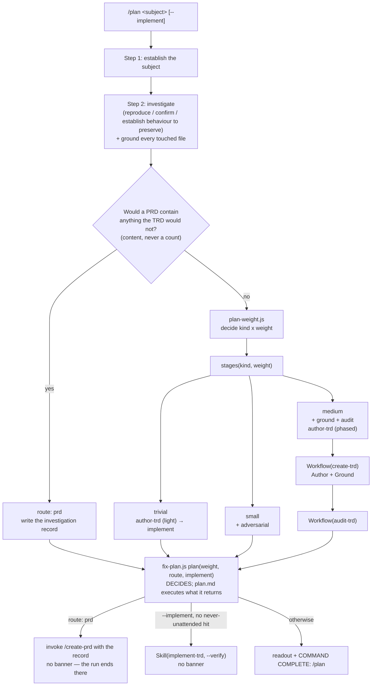
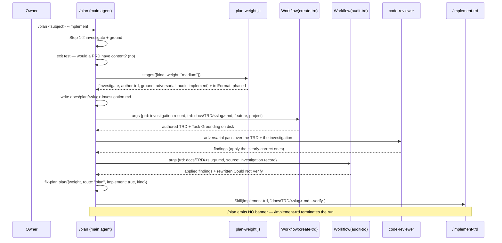

# TRD: One entry point that picks the weight (plan-weight-router)

**Version**: 1.3.0
**Status**: Draft
**Created**: 2026-09-23
**Last Updated**: 2026-09-23
**Author**: @technical-architect
**Source PRD**: `docs/PRD/plan-weight-router.md` (v1.1.1, no supersession marker — this is the in-scope source)
**Task ID Prefix**: PLAN

---

## Changelog

| Version | Date | Changes | Author |
|---------|------|---------|--------|
| 1.0.0 | 2026-09-23 | Initial TRD from PRD v1.1.1. Carries all 27 acceptance criteria and all six goals. Two figures the PRD states were re-measured and one of them is wrong: the rename surface is 4 canonical command files plus ~20 other live surfaces, not "18 command files" (OQ-T4). F8's two criteria are carried as objectives with no task, deferred by their own stated dependency. | @technical-architect |
| 1.1.0 | 2026-09-23 | Interactive `/refine-trd`. All eight open questions closed: six answered by the owner, two struck as already settled. Five of six confirmed this TRD's assumptions; OQ-T3 went against it — a `refactor` at `trivial`/`small` gets no behaviour-preservation check, added as AC-F3.5 and accepted as risk TR4. Challenge pass dropped `PLAN-B002`'s unjustified dependency on `PLAN-B001` (D13: on the critical path, 7 waves → 6) and rejected the `PLAN-D001`/`PLAN-B002` lost-update finding (D14: a file-conflict edge already serializes them). No objective removed; no requirement added without a source. | @technical-architect, owner decisions |
| 1.2.0 | 2026-09-23 | `/audit-trd` against PRD v1.1.1, five of five verifiers reporting. Nine findings: eight applied, one (F6) left open for the owner. Two tasks could not have passed their own acceptance criteria: `PLAN-P002` (`--refresh` never deletes, so the retired command file survives) and the `## Open Questions` template (`trd-parser.js` reads the row's text, not the column header, so `yes` parsed to `ownerOnly: false` and shut AC-F6.2's channel) — both fixed. `PLAN-D002` named four `docs/guides` files that carry a different dead command, not this one — dropped. The `route: 'prd'` exit was reported as duplicate logic by two verifiers and is not: `fix-plan.js` decides, the command executes; §2.1's diagram was the wrong half and is corrected. **Open: D8's `Skill({skill: "create-prd"})` cannot run — `create-prd.md` is marked `disable-model-invocation: true`.** Nothing in the PRD was dropped or narrowed. | @technical-architect, `/audit-trd` |
| 1.3.0 | 2026-09-23 | F6 settled by the owner: the feature exit invokes the **create-prd workflow**, not `Skill({skill: "create-prd"})`. `create-prd.md` carries `disable-model-invocation: true`, which the PRD defines as manual-invocation-only, so the original mechanism was exactly what that flag refuses; the workflow carries no such flag. D8 is now consistent with D5, which had already ruled workflows-not-Skill. D8 and PLAN-B004 unblocked; `/plan` additionally owns the three stages the workflow does not (source resolution, readout, session-fidelity). No objective changed — AC-F7.5 (invoke, do not print a pointer) stands and is now buildable. | @technical-architect, owner decision |

---

## 1. Overview

### 1.1 Technical Summary

`/plan` replaces `/investigate` as the framework's single non-feature entry point. It keeps
everything `/investigate` does well — establish the subject, reproduce or confirm current
behaviour, ground every touched file, write a TRD that `trd-parser.js` can read — and replaces
the one thing it does wrong: the `AUTO | REVIEW | ESCALATE` tier, which decides *permission*
and refuses work above six tasks or ten files.

In its place, two axes. `kind` (`defect | change | refactor`) already exists in
`packages/core/lib/fix-sizing.js` and already changes what gets scored; it now also changes the
stage list. `weight` (`trivial | small | medium`) is new and selects **which stages run** and
nothing else. `feature` is neither — it is the exit, and at feature weight `/plan` invokes
`/create-prd` and the run ends there.

Three structural choices carry the design:

- **The weight-to-stage mapping is a deterministic JavaScript module, not prose.** Twelve of
  the PRD's acceptance criteria name "unit test" as their verification method, and prose cannot
  be unit-tested. This repository has measured the cost of the alternative: `fix-plan.js`'s own
  header records that ~16 of ~16 defects found in `/fix` across three test rounds were in its
  prose and none in its libs, the largest cluster being one decision written inconsistently in
  five places.
- **Nothing new is built where something existing can be pointed at.** At `medium`, `/plan`
  hands authoring to the existing `create-trd` workflow (which already grounds) and the audit to
  the existing `audit-trd` workflow. `fix-plan.js` keeps its five-way banner/notify/pointer
  invariant and has only its `tier` input replaced. No workflow script is added, which is
  AC-F7.1 satisfied structurally rather than by promise.
- **`/plan` invokes the workflow SCRIPTS, not the slash commands.** A workflow emits no
  `COMMAND COMPLETE` banner — its command does — so "one banner per run" falls out of the
  mechanism instead of depending on an instruction nobody can check. Chaining
  `Skill({skill: "create-trd"})` then `Skill({skill: "audit-trd"})` would produce three
  banners in a medium run, and `command-status.md` forbids anything following one.

The rename is in scope for this release (PRD D7), and its real surface is larger and
differently shaped than the PRD's estimate — see decision D11 and OQ-T4.

### 1.2 Key Technical Decisions

| ID | Decision | Choice | Serves Objective | Rationale | Alternatives Considered |
|----|----------|--------|------------------|-----------|------------------------|
| D1 | Entry point | A new command file `packages/core/commands/plan.md`; `investigate.md` is **deleted**, not aliased | AC-F7.3, G1 | AC-F7.3 requires that `/investigate` no longer appear as a separate entry point. An alias is a second entry point with the same body — exactly the thing the criterion names | A deprecation shim that forwards `/investigate` to `/plan`. **Rejected:** it is a separate entry point, and a shim nobody removes becomes permanent. *Revisit if* a consuming project reports that its vendored `.claude/` cannot be refreshed in step with the plugin, which would leave users with a command that no longer exists |
| D2 | Where the weight model lives | A new deterministic module `packages/core/lib/plan-weight.js` with Jest tests, exporting the two axes, the stage list and the route outcome | AC-F1.1, AC-F1.2, AC-F1.3, AC-F2.1, AC-F2.2, AC-F2.3, AC-F2.5, AC-F3.3, AC-F3.4, AC-F4.2, AC-F5.1, AC-F5.2, AC-F6.1 | Twelve criteria are verified by unit test; a prose table cannot be. The precedent and the measurement are in this repo: `fix-plan.js`'s header (`~16 of ~16 defects were in the prose, none in the libs`) | (a) Add a `weight` axis to `fix-sizing.js`. **Rejected:** that module's stated core invariant is *"every rule can only LOWER a tier"* and its tiers are permissions, which S1 retires — bolting a non-permission axis onto a permission gate keeps the retired concept alive in the same file. (b) A prose table in `plan.md`. **Rejected:** unverifiable by the PRD's own stated method. *Revisit when* F8 lands and stage prompts move into contracts, at which point the stage LIST may want to live beside them |
| D3 | `fix-sizing.js` | Retire `size()`, both ceilings and the whole tier ladder. Keep and keep exporting `matchNeverUnattended()` | AC-F4.2, AC-F5.1, O-NU | The ceilings and the `specCertain → ESCALATE` rule are exactly what S1 and S2 retire, and after `/investigate` is deleted nothing else calls `size()` (verified: the only non-test references in the tree are `investigate.md` and the module's own tests). `matchNeverUnattended` is a different thing — owner policy from `verification.md` that no PRD line asked to remove | (a) Keep `size()` and ignore its tier. **Rejected:** a function whose verdict nothing reads still looks live, and the next reader will believe it. (b) Delete the module entirely. **Rejected:** it would silently drop the owner's never-unattended path control (O-NU). *Revisit if* `verification.md` ever loses its never-unattended concept, at which point the module has nothing left |
| D4 | TRD format per weight | `trivial` and `small` write the **light** TRD (no phases). `medium` writes a **phased** TRD, authored by the existing `create-trd` workflow | AC-F4.3, AC-F2.3, NG3 | NG3's own stated reason for not raising the six-task ceiling is that the light format has no phases and `trd-parser.js` assigns a phase-less task list to phase 1, so `/implement-trd` gets one phase and one gate. Routing 12–18 tasks to `medium` while keeping the light format reproduces precisely that failure under a new name | (a) Light TRD at `medium` too. **Rejected** for NG3's reason above. (b) A third "medium" format. **Rejected:** a format to maintain, and `/audit-trd`'s omission audit is written against the full structure. *Revisit when* the light TRD format gains phases — NG3's own revisit condition |
| D5 | How stages are reached | `Workflow({ name: "create-trd" \| "audit-trd", args: {...} })` — the workflow scripts, never `Skill({skill: "create-trd"})` | AC-F7.1, AC-F7.2 | Workflows emit no banner; commands do. Invoking the scripts means `/plan` owns the single banner by construction. It also adds no workflow script, which is AC-F7.1 verbatim | (a) `Skill()` chaining of the commands. **Rejected:** each chained command emits its own `COMMAND COMPLETE`, three in a medium run, against AC-F7.2 and `command-status.md`. (b) Duplicate the Author/Ground stages into a new workflow. **Rejected:** AC-F7.1, and it is the duplication F8 exists to end. *Revisit when* F8 replaces both with one generic staged-dispatch workflow |
| D6 | The medium source hand-off | `/plan` writes an **investigation record** to `docs/plan/<slug>.investigation.md` and passes it as `args.prd` to the `create-trd` workflow | AC-F2.3, AC-F4.3 | `create-trd.js` requires a source (`args.prd` or `args.transcript`) and hard-fails without one. The investigation record is a requirements document: an `## Objectives` table with a source per row, the kind's verification section, and grounding. **This is not NG1.** NG1 rejects feeding a raw session transcript, because a transcript is not a requirements document and `/audit-trd`'s omission audit would treat every abandoned idea in a conversation as a missing requirement. A record with an enumerable Objectives table is what that audit is built to read | (a) Pass `args.transcript`. **Rejected:** that is NG1 and NG2 verbatim. (b) Have `/plan` author the phased TRD itself. **Rejected:** duplicates `create-trd.js`'s Author and Ground stages and would need a new workflow script (AC-F7.1). *Revisit if* `create-trd.js` grows a first-class `investigation` source argument, which would make the `args.prd` reuse unnecessary |
| D7 | What starts implementation | `--implement` survives as the only thing that starts work, and is now honoured at **every** weight | AC-F5.1, AC-F5.2, O-AUTONOMY | Today the flag is *"honoured only at tier AUTO"* — the tier gates it, which is the permission semantics S1 retires. Detaching it from the weight is what makes weight a shape rather than a permission. `autonomy.md` is explicit that one command's invocation does not authorize the next, and that when a promised thing is a command invocation *"the correction is never to run it"* | (a) Chain `/implement-trd` unconditionally, reading the grid's `→ implement` literally. **Rejected:** against `autonomy.md`'s one-command scope, which is governance, not preference. (b) Drop the flag and always stop. **Rejected:** the grid's rows all end in implement, so the path must be reachable in one invocation when asked for. *Revisit if* the owner states he wants unattended end-to-end as the default — see OQ-T1 |
| D8 | The feature exit | At `route: 'prd'`, `/plan` invokes the **create-prd workflow** with the investigation record as `source`, then emits the run's single banner itself. **`/plan` therefore owns the three stages the workflow does not** — source resolution (trivial here: the record is a file `/plan` just wrote), the readout, and the session-fidelity pass — and states in its readout that the PRD is unverified until `/audit-prd` runs. **RESOLVED 2026-09-23 (owner, F6): the mechanism is `Workflow({ name: "create-prd", args: { source: <record path>, brief: '', prd: <prd path>, feature, project } })`, not `Skill()`.** `create-prd.md` carries `disable-model-invocation: true` — the PRD's own definition of that flag is *"skill can only be invoked manually via /skill-name"* (`docs/PRD/ensemble-vnext.md:1919`) — so the `Skill()` call this decision originally specified is exactly what the flag exists to refuse. The workflow carries no such flag. This also makes D8 consistent with **D5**, which already ruled "the workflow scripts, never `Skill({skill: "create-trd"})`"; D8 was the anomaly, not D5. Arg shape confirmed `[read]` at `packages/core/workflows/create-prd.js:13-16,37-38` (`{ source, brief, prd, feature }`, both `source` and `brief` defaulting to `''`) | AC-F7.5, AC-F7.2 | AC-F7.5 requires invocation rather than a pointer. `command-status.md`'s chaining exception covers exactly this: one banner per RUN, emitted by the command the run ends in. Passing the investigation record avoids paying for the investigation twice — the same reasoning `fix-plan.js` records for why ESCALATE stopped deleting its TRD | (a) Print a pointer to `/create-prd`. **Rejected:** AC-F7.5 and PRD D6. (b) Invoke the `create-prd` **workflow** instead, for banner symmetry with D5. **Rejected:** `/create-prd` the command owns source resolution and the readout, and the run genuinely ends there, so the chaining exception is the right instrument. *Revisit if* the owner confirms the weaker reading of PRD D6 ("name it in the readout") |
| D9 | Where the exit test lives | Prose judgment in `plan.md`, with the answer recorded in the artifact. `plan-weight.js`'s `route()` takes one boolean and **no** count of any kind | AC-F4.1, AC-F4.2 | *"Would the PRD contain anything the TRD would not"* is a judgment about content, and this repository already draws that line: `fix-sizing.js`'s header keeps judgment in prose and mechanical mappings in libs. What the lib contributes is the negative assertion — its input shape has no task or file count, so AC-F4.2 is true structurally and testable by the absence | A keyword or size heuristic in the lib. **Rejected:** it manufactures a new ruler to replace the ruler the PRD just retired. *Revisit* never on those terms; only if the owner asks for a mechanical pre-filter, which would be a different feature |
| D10 | `fix-plan.js` | Repointed, not replaced: `plan()` keeps its `workBegins` / banner / notify / pointer contract, with `tier` replaced by `weight` + `route` | AC-F7.2, AC-F5.1, AC-F7.5 | The five-way consistency invariant its header documents is untouched by this feature and has 15 tests behind it. Rewriting it re-litigates a solved problem. Only the tier input and the REVIEW branch are retired | A new `plan-route.js` with `fix-plan.js` deleted. **Rejected:** the invariant and its tests are the asset. *Revisit when* F8 makes the run plan a property of the composed stage list |
| D11 | How the rename is executed | One release-wide sweep against a **discovered** surface list, pinned by a negative grep assertion over both mirrored trees | AC-F7.4 | The PRD's list is wrong in both directions (see OQ-T4), and this repository has already measured the failure mode: `smoke-registration.test.sh` records *"Rosters are DISCOVERED, never hardcoded... its command roster was a hand-maintained list and broke the moment item 12 deleted two commands"* | Update the files the PRD's AC-F7.4 names. **Rejected on measurement:** only 4 canonical command files name `/investigate`, and ~20 other live surfaces do that the list omits — including `router.py`'s `FRAMEWORK_HINT` and `IN_FLIGHT_HINT`, `packages/router/tests/test_router.py` (7 hits), `packages/core/lib/fix-template.test.js`'s hard-coded command path, two smoke scenarios, `test/smoke/run-smoke.sh`'s roster and `test/smoke/baseline.json`. *Revisit* never — a discovered list is strictly safer |
| D12 | Library file names | `fix-sizing.js`, `fix-plan.js`, `fix-audit.js` and `fix-template.test.js` keep their names | AC-F7.4 (scope) | AC-F7.4's objective is every surface naming `/investigate`. These four are named after `/fix`, a command renamed to `/investigate` in 2.0.0 whose libs were deliberately not renamed then either. Renaming them now ripples into `scaffold-delivery.test.sh`'s module roster and `implement-trd-structure.test.sh`'s greps for no objective | Rename to `plan-*.js`. **Rejected:** no objective, and it enlarges a release the PRD already records as materially larger than assumed. *Revisit when* F8 rewrites the run plan, at which point the file is being edited anyway |

### 1.3 Technology Stack

| Layer | Technology | Purpose | Notes |
|-------|------------|---------|-------|
| Command prompt | Markdown + YAML frontmatter | `/plan` itself | `constitution.md` Principle 3: commands are prompts with optional shell scripts |
| Deterministic core | JavaScript / Node.js 18+ | `plan-weight.js`, `fix-plan.js`, `fix-sizing.js` | `stack.md` — hook and lib development |
| Unit tests (JS) | Jest ^29.7.0 | `packages/core/lib/*.test.js` | `stack.md` Frameworks |
| Router hint | Python 3.x | `FRAMEWORK_HINT` / `IN_FLIGHT_HINT` in `router.py` | `stack.md` — router hook |
| Unit tests (Python) | pytest ^7.0.0 | `packages/router/tests/test_router.py` | `stack.md` Frameworks |
| Integration tests | BATS ^1.9.0 | `test/integration/tests/*.test.sh` | `stack.md` Frameworks |
| End-to-end | `test/smoke/` harness (shell + real `claude` sessions) | The one live surface for `/plan` | The only mechanism in this repo that exercises a command end to end |
| Orchestration | Existing workflow scripts (`create-trd.js`, `audit-trd.js`) | Authoring + grounding at medium; the audit at medium | **No new workflow script** — AC-F7.1 |

### 1.4 Integration Points

| System | Type | Direction | Notes |
|--------|------|-----------|-------|
| `create-trd` workflow | `Workflow({name, args})` | Out | At `medium` only. Requires `args.trd` and one of `args.prd` / `args.transcript`; `/plan` passes the investigation record as `args.prd` (D6) |
| `audit-trd` workflow | `Workflow({name, args})` | Out | At `medium` only. Requires `args.trd`; `args.source` is optional and takes the investigation record |
| `/create-prd` | `Skill({skill, args})` **— blocked, see F6** | Out | At `route: 'prd'` only. The run ends there and that command emits the banner (D8). `create-prd.md:6` sets `disable-model-invocation: true`; the mechanism is unresolved |
| `/implement-trd` | `Skill({skill, args})` | Out | Only with `--implement`. `chainArgs` carries `--verify`, unchanged from today |
| `trd-parser.js` | In-process `require` | Out | Parses the TRD `/plan` writes: `tasks`, `grounding`, `decision`, `openQuestions` with `ownerOnly` (lines 613–614) |
| `/implement-trd` `<open_question>` placeholder | Prompt placeholder | Out | Already built. `/plan`'s open questions reach task prompts through it (AC-F6.2) |
| `router.py` `FRAMEWORK_HINT` / `IN_FLIGHT_HINT` | Injected prompt context | Out | Names `/investigate` in 7 places; the hint is how a raw request finds this command at all |
| `.trd-state/current.json` | JSON file | Out | Written only when work actually begins (`fix-plan.js`'s `workBegins`) |
| `.trd-state/<feature>/artifacts.json` | JSON file | Both | Stores the published artifact URL under key `trd`, reused on re-publish |
| `notify-complete.sh` | Shell | Out | Fires on every terminating path, never on a chained run |
| `.claude/rules/verification.md` | Owner-governed file | In | Read-only: the never-unattended path list (O-NU) |
| `scaffold-project.sh` | Shell | Both | Copies commands, libs, contracts and workflows into a project's `.claude/`; the dogfood tree is a committed copy, not a symlink |

### 1.5 Objectives and their provenance

Every objective this TRD is accountable to, with where it comes from. IDs are the PRD's own
where the PRD states one, so `Serves` columns below resolve directly into the source.

| ID | Objective | Source |
|----|-----------|--------|
| G1 | Work with settled intent above the light path's ceiling has a path that is neither `/investigate` nor the four-command pipeline; item 21's own design (12–18 tasks, no product decision) routes to `medium` | PRD §3.1 G1 |
| G2 | Weight selects a pipeline shape, never a permission; no stage stops for a human decision nobody asked for | PRD §3.1 G2 |
| G3 | The PRD decision is made on content; the size ceiling no longer appears in it | PRD §3.1 G3 |
| G4 | An open question no longer forces the exit to `/create-prd` | PRD §3.1 G4 |
| G5 | `kind` changes the stage list, so a refactor and a change of equal weight are verified differently | PRD §3.1 G5 |
| G6 | The weight model is proved before anyone pays to refactor the workflows: step one chains existing commands and adds no workflow script | PRD §3.1 G6 |
| AC-F1.1 | `kind` takes exactly `defect`, `change`, `refactor`; `weight` takes exactly `trivial`, `small`, `medium` | PRD AC-F1.1 |
| AC-F1.2 | `feature` is not accepted as a `kind` or a `weight`; it is a routing outcome that ends the command | PRD AC-F1.2 |
| AC-F1.3 | No cell of the nine-cell grid is given its own name in code, prose or output | PRD AC-F1.3 |
| AC-F2.1 | `trivial` runs light TRD → implement | PRD AC-F2.1 |
| AC-F2.2 | `small` runs everything `trivial` runs, plus an adversarial pass | PRD AC-F2.2 |
| AC-F2.3 | `medium` runs everything `small` runs, plus grounding and an audit | PRD AC-F2.3 |
| AC-F2.4 | No stage of any weight stops to ask the owner to authorise continuing | PRD AC-F2.4; `.claude/rules/autonomy.md` |
| AC-F2.5 | `trivial` and `small` run **no** audit — a deliberate reduction from `/investigate`'s unconditional audit, not an oversight | PRD AC-F2.5, owner decision D4, NG11 |
| AC-F3.1 | A medium `refactor` runs its named tests before **and** after the change, and both runs are recorded | PRD AC-F3.1 |
| AC-F3.2 | A medium `refactor` checks that the public surface has not moved | PRD AC-F3.2 |
| AC-F3.3 | A medium `change` is verified against the stated outcome and is **not** asked for a before-run | PRD AC-F3.3 |
| AC-F3.4 | A `refactor` is never asked for a root cause | PRD AC-F3.4 |
| AC-F3.5 | A `refactor` at `trivial` or `small` is **not** asked for a before-run, an after-run, or a public-surface check. `## Behaviour Preserved` is required only at `medium` | Owner decision 2026-09-23 (OQ-T3) |
| AC-F4.1 | The routing decision to `/create-prd` is stated in terms of PRD content, not task or file count | PRD AC-F4.1 |
| AC-F4.2 | Neither `MAX_TASKS` nor the touched-file ceiling participates in the decision of whether a PRD is needed | PRD AC-F4.2 |
| AC-F4.3 | Work of 12–18 tasks carrying no product decision routes to `medium` | PRD AC-F4.3 |
| AC-F5.1 | No `weight` produces an outcome whose action is "stop and wait for a human decision" | PRD AC-F5.1 |
| AC-F5.2 | The differences between weights are stage counts and review depth only | PRD AC-F5.2 |
| AC-F6.1 | The presence of an open question does not by itself route work to `/create-prd` | PRD AC-F6.1 |
| AC-F6.2 | Open questions written by this path parse as `openQuestions` with `ownerOnly` and reach task prompts as `<open_question>` | PRD AC-F6.2 |
| AC-F6.3 | At `medium` with open questions, `/refine-trd` is **named in the readout and not invoked**; no stage waits for it | PRD AC-F6.3, owner decision D5 |
| AC-F7.1 | Step one adds no new workflow script under `packages/core/workflows/` | PRD AC-F7.1 |
| AC-F7.2 | One `COMMAND COMPLETE` banner per run, not one per chained command | PRD AC-F7.2; `.claude/rules/command-status.md` chaining exception |
| AC-F7.3 | `/plan` exists as its own command file; `/investigate` no longer appears as a separate entry point | PRD AC-F7.3, owner decision D3 |
| AC-F7.4 | Every surface naming `/investigate` is updated in the same release | PRD AC-F7.4, owner decision D7. **The PRD's enumeration of that surface is wrong — see OQ-T4. The objective is "every surface"; the list is not load-bearing** |
| AC-F7.5 | At feature weight, `/plan` **invokes** `/create-prd` rather than printing a pointer, then stops | PRD AC-F7.5, owner decision D6 |
| AC-F8.1 | No stage prompt is extracted to a contract except as part of an edit that stage was already receiving | PRD AC-F8.1. **P1, and deferred — no task in this release; see §4.6** |
| AC-F8.2 | No stage logic is shared between workflow scripts by `require` | PRD AC-F8.2. **P1, and deferred — no task in this release; see §4.6** |
| O-UNIT | Unit test coverage ≥ 60% | `.claude/rules/constitution.md` Quality Gates |
| O-INT | Integration test coverage ≥ 50% when applicable | `.claude/rules/constitution.md` Quality Gates |
| O-VERIF | `verification_level: unit-only`; a task marked `[LIVE]` overrides it | `.claude/rules/constitution.md` Verification Requirements |
| O-AUTONOMY | `AskUserQuestion` is restricted to the four stated cases; no mid-loop checkpoint, no hedged pause offer | `.claude/rules/constitution.md` Prohibited Pattern 8; `.claude/rules/autonomy.md` |
| O-STATUS | `DISPATCHED` / `RESUMED` / `COMMAND COMPLETE` banners and the four-section readout | `.claude/rules/constitution.md` Prohibited Pattern 7; `.claude/rules/command-status.md` |
| O-PROMPT | No executable code in skills or agents; the command is a prompt | `.claude/rules/constitution.md` Principle 2 and 3 |
| O-LINT | `plan.md` passes `lint-command-structure.js`: frontmatter at byte 0, contiguous ordered lists, no orphan table rows, balanced fences | The linter exists and gates command markdown; its header (`lint-command-structure.js:6-17`) records a 2026-08-21 session that broke **three** of these four — a content block above the frontmatter, three ordered lists gapped, three orphaned table rows — in files that passed grep. The fence check is the fourth check the linter performs, not a fourth thing that session broke (corrected by audit, F1) |
| O-NU | The owner's never-unattended path list in `verification.md` keeps a consumer: a matched path suppresses the `--implement` chain regardless of weight | **domain-derived.** `fix-sizing.js` is the only reader of that list today, and D3 retires the function that reads it. No PRD line asks for the control to be removed, and F5 is about weights, not about an orthogonal owner policy. Deleting the last consumer would silently delete an owner safety control — invisible in this repo, whose `verification.md` lists no paths, and live in any consuming project that filled the section |
| O-INJECT | The free-text subject must not reach a shell interpreter in a position where it can be executed | **domain-derived.** `/plan` inherits `/investigate`'s pattern of calling `node -e` with a JSON heredoc interpolated into a shell argument, and the subject is arbitrary user text. `CLAUDE.md`'s Security Considerations names this class directly (`spawnSync` with array arguments, never `execSync` with string interpolation) |
| O-CRED | No credential value reaches the published artifact | `.claude/rules/command-status.md`: *"Never publish a document that contains a credential"*, and `verification.md`'s rule to record where a credential lives rather than its value |

**No performance, latency, throughput or uptime objective appears in this document.** PRD §5 is
empty and states that nobody raised one. The single performance-adjacent fact in the source —
that chaining re-reads three large prose files — is carried as an accepted, deliberately
temporary cost of F7 (the thing F8 retires), not as a threshold. See OQ-T8.

---

## 2. System Architecture

### 2.1 Routing Overview



### 2.2 Component Architecture

#### 2.2.1 `packages/core/lib/plan-weight.js` (new)

**Responsibility**: the two axes, the nine-cell stage list, the kind-specific verification
shape, and the route outcome. It is the only place that mapping exists.

**Interfaces**: `KINDS`, `WEIGHTS`, `ROUTES`, `stages({kind, weight})`,
`verification({kind, weight, openQuestionCount})`, `route({prdWouldHaveContent})`.

**Dependencies**: `fix-plan.js`'s `VERIFICATION_SECTION` (reused, not reimplemented). Nothing
else — no filesystem, no shell.

#### 2.2.2 `packages/core/lib/fix-plan.js` (repointed)

**Responsibility**: unchanged — the one mechanical question *"does work actually BEGIN?"*, and
the banner / notify / pointer / chain contract that follows from it.

**Interfaces**: `plan({weight, route, implement, kind, slug, neverUnattendedHit})`,
`VERIFICATION_SECTION`.

**Replaces**: the `tier` parameter, the `AUTO | REVIEW | ESCALATE` validation, the
`workBegins = tier === 'AUTO' && implement` conjunction, and the
`'tier REVIEW — a human approves before implementing'` branch.

#### 2.2.3 `packages/core/lib/fix-sizing.js` (reduced)

**Responsibility**: after this change, only `matchNeverUnattended(touches, patterns)`.

**Replaces**: `size()`, `TIERS`, `lower()`, `MAX_TASKS`, `DEFAULT_MAX_FILES`,
`DEFAULT_MAX_CALLERS`, and the absorbed-scope advisory. Everything that produced a tier goes.

#### 2.2.4 `packages/core/commands/plan.md` (new; replaces `investigate.md`)

**Responsibility**: the judgment half. Subject, investigation, grounding, the content-based
exit test, the weight call, TRD authoring (light) or the workflow hand-off (phased), the
adversarial pass, the readout and the banner.

**Dependencies**: `plan-weight.js`, `fix-plan.js`, `fix-audit.js`, `trd-parser.js`, the
`create-trd` and `audit-trd` workflows, `notify-complete.sh`.

#### 2.2.5 The investigation record (new artifact)

**Responsibility**: at `medium` and at `route: 'prd'`, the durable source the next stage reads.
`docs/plan/<slug>.investigation.md`.

**Why it exists rather than a transcript**: `create-trd.js` hard-fails without a source, and
NG1 rules out a session transcript. The record is a requirements document — see D6.

### 2.3 Data Flow — a medium run



### 2.4 State Management

No new state store. Three existing files carry everything:

- `.trd-state/current.json` — written only when work begins, unchanged from today.
- `.trd-state/<feature>/artifacts.json` — the published artifact URL, key `trd`.
- The TRD on disk, and at medium the investigation record beside it. Both are durable and both
  are inputs to a later `/audit-trd` or `/audit-build`.

---

## 3. Technical Specifications

### 3.1 `plan-weight.js`

**Purpose**: turn the two axes into a stage list, a verification shape and a route. No
permission, no count, no cell name.

**Interface**:

```typescript
type Kind   = 'defect' | 'change' | 'refactor';
type Weight = 'trivial' | 'small' | 'medium';
type Route  = 'plan' | 'prd';

type Stage = 'investigate' | 'author-trd' | 'ground' | 'adversarial' | 'audit' | 'implement';

interface StageList {
  stages: Stage[];
  /** Which TRD format `author-trd` writes. The format is an INPUT to the stage,
   *  not a different stage — that is what keeps medium a strict superset of small. */
  trdFormat: 'light' | 'phased';
}

/** The whole nine-cell grid, computed from two axes. No cell is named. */
function stages(input: { kind: Kind; weight: Weight }): StageList;

interface VerificationShape {
  /** '## Reproduction' | '## Intended Change' | '## Behaviour Preserved' —
   *  reused from fix-plan.js's VERIFICATION_SECTION, not redefined here. */
  section: string;
  rootCauseRequired: boolean;   // defect only
  beforeRun: boolean;           // refactor, every weight
  afterRun: boolean;            // refactor at medium
  surfaceCheck: boolean;        // refactor at medium
  beforeRunForbidden: boolean;  // change — never asked for one
  /** Named in the readout. NEVER invoked, and nothing waits for it. */
  refineTrdRecommended: boolean;
}

function verification(input: {
  kind: Kind; weight: Weight; openQuestionCount: number;
}): VerificationShape;

/** The exit test's ONLY input. No taskCount. No touched-file count. No tier. */
function route(input: { prdWouldHaveContent: boolean }): Route;
```

**Behavior**:

- `stages({kind, weight: 'trivial'})` → `['investigate', 'author-trd', 'implement']`,
  `trdFormat: 'light'` (AC-F2.1).
- `'small'` → the same plus `'adversarial'` before `'implement'`, `trdFormat: 'light'`
  (AC-F2.2).
- `'medium'` → the same plus `'ground'` and `'audit'`, `trdFormat: 'phased'` (AC-F2.3, D4).
- The superset relation is the invariant that matters and is asserted as a set relation
  independent of order: `set(trivial) ⊂ set(small) ⊂ set(medium)`.
- `'audit'` appears in **no** stage list except `medium`'s (AC-F2.5).
- `verification`: `rootCauseRequired` is true only for `defect` (AC-F3.4);
  `beforeRunForbidden` is true only for `change` (AC-F3.3); `afterRun` and `surfaceCheck` are
  true only for `refactor` at `medium` (AC-F3.1, AC-F3.2); `beforeRun` is true for `refactor`
  at every weight (see OQ-T3); `refineTrdRecommended` is true only for
  `change` at `medium` with `openQuestionCount > 0` (AC-F6.3).
- `route` returns `'prd'` when and only when `prdWouldHaveContent` is true. `openQuestionCount`
  is not a parameter of `route` at all, which is how AC-F6.1 becomes structural rather than
  aspirational.

**Error Handling**:

- `kind` or `weight` outside its list: throw, naming the accepted values (AC-F1.1).
- `kind: 'feature'` or `weight: 'feature'`: throw with the specific message that `feature` is a
  routing outcome, and point at `route({prdWouldHaveContent: true})` (AC-F1.2). A generic
  "unknown value" error would leave a caller guessing at the one mistake the PRD predicts.
- Omitted `kind` defaults to `defect`, as `fix-sizing.js` does today. **Omitted `weight` does
  NOT default** — a silent default would pick a pipeline shape nobody chose, and the command
  always has an answer by the time it calls this.

### 3.2 `fix-plan.js`, repointed

**Purpose**: unchanged. The one question that decides banner, notify, pointer and chain.

**Interface**:

```typescript
function plan(input: {
  weight: Weight;
  route: Route;
  implement?: boolean;              // default false — stopping stays the norm
  kind?: Kind;
  slug?: string;
  /** Path fragments matched by matchNeverUnattended() against this run's touches. */
  neverUnattendedHit?: string[];
}): RunPlan;
```

**Behavior**:

- `route === 'prd'` → chain `create-prd` with the investigation record, `banner: null`,
  `notify: false`, `writePointer: false` (AC-F7.5, AC-F7.2, D8).
  **`plan()` DECIDES the chain; `plan.md` performs it** — the same split the module already
  uses today, where `plan()` returns `chain: true, chainSkill: 'implement-trd'`
  (`fix-plan.js:93-111`) and the command makes the call (`investigate.md:650`). PLAN-B002 and
  PLAN-B004 are therefore two halves of one path, not two competing implementations of it
  (audit finding F5).
- `workBegins = implement === true && neverUnattendedHit.length === 0`. **The weight is not in
  that expression** — that is AC-F5.1 expressed as code, and a unit test asserts `workBegins`
  is identical across all three weights for identical other inputs (AC-F5.2).
- `neverUnattendedHit` non-empty → work does not begin, and the reason names the matched paths
  and points at the owner's own `verification.md` policy (O-NU). This is not a weight outcome
  and is not a review tier; it is an owner-authored path rule, and the remedy is the same one
  the module gives today: *run `/implement-trd` yourself when you are satisfied*.
- Every terminating path emits `═══ COMMAND COMPLETE: /plan ═══`.

**Error Handling**: an unknown `weight` or `route` throws, as an unknown `tier` does today.

**Defect found while reading, fixed by this change**: the module's banner and handoff strings
say `/fix` — `'═══ COMMAND COMPLETE: /fix ═══'` and `'[STATUS: /fix] HANDOFF'`. `/fix` was
renamed to `/investigate` in 2.0.0 and these were not updated, so `/investigate` currently
emits a terminator naming a command that does not exist, against `command-status.md`'s
`/<command-name>` form. PLAN-B002 fixes it as part of repointing.

### 3.3 The light TRD template, in `plan.md`

Unchanged from `investigate.md`'s Step 4 except for two additions:

```markdown
## Open Questions

| ID | Question | What I assumed | Owner-only |
|----|----------|----------------|------------|
| OQ-1 | <the open decision> | <what I did> | owner-only |
```

**The cell value must be the literal string `owner-only`, not `yes`.** `trd-parser.js` has no
`ownerOnly` column role at all: `mapOpenQuestionColumns` (lines 259–275) maps only
`id`/`question`/`assumed`, and `parseOpenQuestions` computes
`ownerOnly = OWNER_ONLY_RE.test(rawRowText) || OWNER_ONLY_RE.test(headingForTable)` (lines
613–614) with `OWNER_ONLY_RE = /owner-only|owner ruling/i` (line 29) over the DATA row's own
joined cell text. A cell reading `yes` parses to `ownerOnly: false` and AC-F6.2's channel stays
shut. Corrected by audit, finding F4 — the earlier draft of this template said `yes`.

`trd-parser.js` parses this into `openQuestions` with `ownerOnly` (lines 613–614), and
`/implement-trd` emits each as `<open_question>` into task prompts. Both halves already exist;
what is new is that the template has the section at all, so the channel AC-F6.2 names is
actually populated by this path (AC-F6.1, AC-F6.2).

For `kind: refactor`, `## Behaviour Preserved` gains a named public surface alongside the test
command, because `--verify` derives its criterion from that section's text and AC-F3.2 needs a
criterion that can fail:

```markdown
## Behaviour Preserved

Tests that pass BEFORE this change and must still pass after:
  <command>            [ran <date>]

Public surface that must not move:
  <exported symbol / signature / observable output>
```

**The field names in `## Task Grounding` must stay bold.** `trd-parser.js` matches
`/^\s*-\s+\*\*(Touches|Reuse|...)[^*]*?:\*\*/`; an unbolded `- Touches:` parses as nothing and
the task ships with empty grounding. This is the highest-value output of the command and the
worst available silent failure.

### 3.4 The investigation record

**Purpose**: the durable source for `medium` and for `route: 'prd'`. Written before the stage
that consumes it, so a run that dies mid-stage has not lost the investigation.

```markdown
# Investigation: <slug>

**Kind**: defect | change | refactor
**Weight**: medium            <!-- omitted at route: prd -->
**Route**: plan | prd

## Objectives
| ID | Objective | Source |
|----|-----------|--------|
| O1 | <what must be true> | the reproduction below / your instruction, <date> |

## Reproduction | ## Intended Change | ## Behaviour Preserved
<whichever the kind calls for — load-bearing, not documentation>

## Decision
<the approach chosen; and why an alternative was rejected>

## Grounding
<per file: what it does now, what to reuse, what this replaces, conventions, hazards>
<each claim marked [ran] / [read] / [inferred]>

## Open Questions
<the table from §3.3, or "none">
```

**Why an Objectives table with a source per row is the load-bearing part**: it is what makes
this a requirements document rather than a transcript, and therefore what `/audit-trd`'s
omission audit can enumerate. Without it, D6 would be NG1 wearing a new filename.

### 3.5 The exit test, in `plan.md`

One question, asked in prose, answered in the record:

> Would the PRD contain anything the TRD would not — personas, user value, trade-offs about
> *what* to build? If it would restate the TRD's intent, it is ceremony.

**Behavior**:

- The answer is recorded in the investigation record as a sentence, not a score (AC-F4.1).
- Task count and touched-file count are not consulted, and after D3 there is no ceiling left to
  consult (AC-F4.2).
- An open question is explicitly **not** an answer of yes. The command states this, and
  `route()` cannot see the open questions to be tempted by them (AC-F6.1, G4).
- `specCertain` disappears as a routing input. The conflation it caused — *"there is an open
  question"* read as *"nobody has decided what we are building"* — is exactly what G4 retires.

### 3.6 Banners and the readout

One banner per run (AC-F7.2, O-STATUS):

| Path | Banner |
|------|--------|
| `route: 'prd'` | none — `/create-prd` emits the run's terminator |
| `--implement`, work begins | none — `/implement-trd` emits it |
| every other path | `═══ COMMAND COMPLETE: /plan ═══` as the last line |
| unrecoverable | `═══ COMMAND STUCK: /plan ═══` with `Reason:` and `Next:` |

The four-section readout (STATE, DECISIONS, ISSUES, NEXT) precedes the banner, with the
artifact link above it. At `medium` with open questions, NEXT names `/refine-trd` — and the
command does not invoke it and does not wait for it (AC-F6.3).

---

## 4. Master Task List

### 4.1 Task ID Convention

`PLAN-[CATEGORY][SEQ]` — `P` infrastructure, `B` backend/lib, `T` testing, `D` documentation,
`I` integration. `[LIVE]` on a task marks it as needing a running instance, overriding
`constitution.md`'s `verification_level: unit-only` for that task alone.

Agent mapping: `B` → @backend-implementer, `P`/`D` on prompt and prose files →
@agent-implementer (these files *are* prompts, which is that agent's domain), `T` →
@verify-app.

### 4.2 Phase 1: The deterministic core

| Task ID | Description | Serves | Skills | Dependencies | Acceptance Criteria |
|---------|-------------|--------|--------|--------------|---------------------|
| PLAN-B001 | Write `packages/core/lib/plan-weight.js` and `plan-weight.test.js` per §3.1: the two axes, `stages()`, `verification()`, `route()` | AC-F1.1, AC-F1.2, AC-F1.3, AC-F2.1, AC-F2.2, AC-F2.3, AC-F2.5, AC-F3.1, AC-F3.2, AC-F3.3, AC-F3.4, AC-F4.2, AC-F5.2, AC-F6.1, AC-F6.3, D2 | `jest` | None | Tests written before the module (constitution test-first). `set(trivial) ⊂ set(small) ⊂ set(medium)` asserted as a set relation. `'audit'` absent from every list but `medium`'s. `kind: 'feature'` and `weight: 'feature'` each throw a message naming `route()`. A test asserts the `route()` input object has exactly one key and that the module `require`s nothing from `fix-sizing` (AC-F4.2 structurally). A test asserts no exported map enumerates nine cells: every exported object's keys are a subset of `KINDS ∪ WEIGHTS` (AC-F1.3). `verification()` truth table pinned for all nine cells × the open-question flag. `VERIFICATION_SECTION` is imported from `fix-plan.js`, not redefined |
| PLAN-B002 | Repoint `packages/core/lib/fix-plan.js` per §3.2: `tier` → `weight` + `route`, add `neverUnattendedHit`, add the `route: 'prd'` branch, and correct the two `/fix` strings to `/plan` | AC-F5.1, AC-F5.2, AC-F7.2, AC-F7.5, O-NU, D10 | `jest` | None (dropped 2026-09-23 — see D13) | A test asserts `workBegins` is identical across all three weights for otherwise identical input (AC-F5.1/F5.2). A test asserts `route: 'prd'` returns `banner: null`, `notify: false`, `chainSkill: 'create-prd'`. A test asserts a non-empty `neverUnattendedHit` suppresses the chain and the reason names the matched paths. The existing 15 tests for the banner/notify/pointer invariant still pass, with `tier` inputs replaced. No test and no branch mentions `REVIEW`, `AUTO` or `ESCALATE`. Both `/fix` strings are gone |
| PLAN-B003 | Reduce `packages/core/lib/fix-sizing.js` to `matchNeverUnattended()` alone: delete `size()`, `TIERS`, `lower()`, `MAX_TASKS`, `DEFAULT_MAX_FILES`, `DEFAULT_MAX_CALLERS` and the absorbed-scope advisory, and delete the tests that pin them | AC-F4.2, AC-F5.1, O-NU, D3 | `jest` | None | `grep -rn "MAX_TASKS\|DEFAULT_MAX_FILES" packages/ .claude/` returns nothing outside `docs/`. `matchNeverUnattended` stays exported and keeps its substring-match tests. The module header is rewritten: it currently opens *"decide whether a `/fix` may run unattended"*, which is the retired premise. No other module in the tree `require`s the deleted exports |

### 4.3 Phase 2: The command

| Task ID | Description | Serves | Skills | Dependencies | Acceptance Criteria |
|---------|-------------|--------|--------|--------------|---------------------|
| PLAN-P001 | Create `packages/core/commands/plan.md` carrying the investigation machinery inherited from `investigate.md` (Steps 1, 2a–2f, 2e grounding), the content-based exit test (§3.5), the `plan-weight.js` and `fix-plan.js` calls, the light-TRD template with `## Open Questions` and the refactor surface block (§3.3), the adversarial pass, the readout, the banners, the autonomy block and the notify call. **Delete `packages/core/commands/investigate.md`** | AC-F7.3, AC-F4.1, AC-F2.1, AC-F2.2, AC-F2.4, AC-F2.5, AC-F1.3, AC-F3.4, AC-F6.1, AC-F6.3, O-AUTONOMY, O-STATUS, O-PROMPT, O-LINT, O-INJECT, D1 | | PLAN-B001, PLAN-B002, PLAN-B003 | `investigate.md` no longer exists. Frontmatter `name: plan`, `argument-hint` documents `[--implement]`. `lint-command-structure.js` exits 0. The command text contains no cell name and no nine-way enumeration (AC-F1.3). The autonomy block is present verbatim, as `notify-on-complete.test.sh`'s discovered roster requires. The tier tables and the `--implement`-only-at-AUTO sentence are gone; `--implement` is described exactly once, in Arguments, and once in the run-plan table. Every `node -e` invocation passes the subject through a heredoc or an argv slot, never interpolated into the command string (O-INJECT). The light TRD template still parses — pinned by PLAN-T003 |
| PLAN-B004 | Add the `medium` path to `plan.md`: write the investigation record (§3.4), `Workflow({name: "create-trd", args: {prd: record, trd, feature, project}})`, the adversarial pass over the phased TRD, `Workflow({name: "audit-trd", args: {trd, source: record}})`, the kind-specific verification sections, and the `/refine-trd` recommendation line. Also add the `route: 'prd'` branch, which performs whatever chain `fix-plan.js`'s `plan()` returns for that route (F5) — unblocked 2026-09-23 (F6): the branch invokes `Workflow({name: "create-prd", args: {source: record, brief: '', prd, feature, project}})` and `/plan` emits the run's banner | AC-F2.3, AC-F4.3, AC-F3.1, AC-F3.2, AC-F3.3, AC-F6.2, AC-F6.3, AC-F7.1, AC-F7.2, AC-F7.5, D4, D5, D6, D8 | | PLAN-P001 | **Same file as PLAN-P001, so these serialize — split on size and verifiability, stated:** `plan.md` is ~40 KB of prose and the medium path is a separately checkable stage list; one pass would return a partial result VERIFY cannot judge. `find packages/core/workflows -newer <release base>` shows no added script (AC-F7.1). The medium branch emits no banner of its own. The record is written **before** either workflow is invoked. `/refine-trd` appears only in the readout, never as an invocation (AC-F6.3). At `route: 'prd'` the record path is passed to `/create-prd` (AC-F7.5) |
| PLAN-P002 | Vendor the change into the dogfood `.claude/` tree: run `scaffold-project.sh --refresh` (not a hand copy) to add `plan.md` and refresh the three libs, **then explicitly `rm .claude/commands/investigate.md`**. The refresh cannot do that second step — `copy_commands()` iterates only files present in the source tree (`scaffold-project.sh:424`) and the `--refresh` contract states it "never deletes one the plugin no longer carries … Adding or removing components stays `/rebase-project`'s job" (`scaffold-project.sh:1259-1264`), so a refresh alone leaves the deleted command behind and the file count at 19. Added by audit, finding F2. Confirm `scaffold-delivery.test.sh` and `vendoring.test.sh` still pass | AC-F7.3, AC-F7.4, D11 | | PLAN-B004 | `.claude/commands/plan.md` exists and is byte-identical to the canonical copy. `.claude/commands/investigate.md` does not exist. `.claude/lib/{plan-weight,fix-plan,fix-sizing}.js` match `packages/core/lib/`. `.claude/commands/` holds 18 `.md` files — one replaced, none added or lost. The existing delivery suites pass unchanged |

### 4.4 Phase 3: The rename sweep and verification

| Task ID | Description | Serves | Skills | Dependencies | Acceptance Criteria |
|---------|-------------|--------|--------|--------------|---------------------|
| PLAN-B005 | Rename `/investigate` to `/plan` in `packages/router/hooks/router.py`'s `FRAMEWORK_HINT` (lines 71, 73, 81) and `IN_FLIGHT_HINT` (lines 57, 65), and in the two explanatory comments (lines 527, 539). Update `packages/router/tests/test_router.py`'s 7 assertions. Vendor to `.claude/hooks/router.py` | AC-F7.4, D11 | `pytest` | None | `grep -c investigate packages/router/hooks/router.py` returns 0. pytest passes; the in-flight carve-out assertion (`test_carve_out_says_amendment_not_investigate`) is renamed and asserts against `/plan`. The hint still distinguishes `/plan`, `/sweep` and `/amend` by the same three questions — the hint is how a raw request reaches this command at all, so a broken hint is a silently unreachable command |
| PLAN-D001 | Rename across the command, rule, template and lib-comment surfaces: `packages/core/commands/{amend,sweep,init-project}.md`, `packages/full/commands/plugin-only/init-project.md`, `.claude/rules/{process,command-status,async-discipline}.md` and their three copies under `packages/core/templates/`, `packages/core/templates/process.md.template`, and the `/investigate` references in `packages/core/lib/{discovered,fix-plan}.js` and `packages/core/workflows/{create-trd,sweep}.js` comments. Mirror each into `.claude/` | AC-F7.4, D11 | | None | Every listed file names `/plan`. `notify-on-complete.test.sh`'s `diff -q` between `.claude/rules/autonomy.md` and its template copy still passes — and the same must hold for the three rule files this task edits, in both trees. `create-trd.js`'s comment about the six-task ceiling is rewritten rather than repointed: after PLAN-B003 that ceiling does not exist, so a repointed sentence would cite a deleted constant |
| PLAN-D002 | Rename in the reader-facing docs: `CLAUDE.md` (3 hits, including the workflow map's `/investigate` vs `/amend` paragraph). **`docs/guides/{ARCHITECTURE,CONCEPTS,INSTALL,PROCESS}.md` are NOT targets** — corrected by audit, finding F3: their hits are `/investigate-issue` and `/fix-issue`, a different, already-dead command pair, and `CONCEPTS.md`'s only hit is the verb "investigates". None names `/investigate`. See this task's grounding | AC-F7.4, D11 | | None | No live doc names `/investigate` as a current command. `CLAUDE.md`'s "`/investigate` vs `/amend`" paragraph reads as `/plan` vs `/amend` and keeps its point — the question is whose plan the work belongs to, not its size. `CHANGELOG.md` and `docs/TRD/`, `docs/PRD/`, `docs/modernization/` are **not** edited: they are history, and rewriting history to match a rename destroys the record of the rename |
| PLAN-T001 | Add `test/integration/tests/plan-command.test.sh`: a negative grep assertion that no live surface names `/investigate`, with the exclusion set written down (`CHANGELOG.md`, `docs/PRD/`, `docs/TRD/`, `docs/modernization/`, `test/evals/analysis-archive/`, `ensemble-vnext-test-fixtures/`, `.trd-state/`, `.claude.backup.*`), plus assertions that `/plan` is registered in both trees | AC-F7.4, AC-F7.3, D11 | | PLAN-P002, PLAN-B005, PLAN-D001, PLAN-D002 | The test runs a non-zero count of tests (`check-test-suites.sh` passes it). The exclusion set is a visible array in the test, not a `grep -v` chain, so a future addition is an edit to a list rather than to a pipeline. The test fails if either tree is half-swept — it scans `packages/` and `.claude/` separately, because a sweep applied to one mirror and not the other passes a single-tree grep |
| PLAN-T003 | Repoint `packages/core/lib/fix-template.test.js` from `investigate.md` to `plan.md`, update its placeholder `.replace()` filler to the new template, and add assertions that the filled template's `## Open Questions` parses into `openQuestions` with `ownerOnly: true` and that `## Behaviour Preserved` carries a public-surface line | AC-F7.4, AC-F6.2, AC-F3.2 | `jest` | PLAN-B004 | The test extracts and parses the shipped template, as today. **A new assertion that the fill actually substituted** — no `<` remains in the filled text — because every `.replace()` in the filler is a hard-coded literal and a reworded placeholder would otherwise leave the parse assertions passing vacuously (TR2). `parseTrd` reports no fatal warning and the grounding block is non-empty |
| PLAN-T004 | Repoint the existing BATS assertions: `implement-trd-structure.test.sh` (6 hits — the `$FIX` path, the `fix-sizing` and `lib/fix-plan` greps, the `banner: null` invariant) and `notify-on-complete.test.sh` (5 hits). Add an assertion that a `/plan`-written `## Open Questions` row reaches a task prompt as `<open_question>` | AC-F7.4, AC-F6.2, AC-F7.2 | | PLAN-P002 | Both suites pass with a non-zero gathered count. The `fix-sizing` grep is replaced by a `plan-weight` grep — after PLAN-B003 the command no longer calls `size()`, so a repointed grep would assert a call that should not exist. The `<open_question>` assertion traces the full path: template → `trd-parser.js` `openQuestions` → `/implement-trd`'s placeholder |
| PLAN-T002 | **[LIVE]** Rename `test/smoke/scenarios/investigate-{light-fix,decoy-root-cause}.sh` to `plan-*`, update `test/smoke/run-smoke.sh`'s `ALL_SCENARIOS` / `LLM_OPT_IN_SCENARIOS` rosters and `test/smoke/baseline.json`, and add `test/smoke/scenarios/plan-medium-weight.sh`: a real `/plan` run on a 12–18-task subject that asserts `medium`, a phased TRD, that `audit-trd` ran, and exactly one `COMMAND COMPLETE` banner | AC-F4.3, AC-F2.3, AC-F7.2, AC-F2.4, O-VERIF | | PLAN-T001, PLAN-T004 | `smoke-registration.test.sh` passes: every scenario file registered in exactly one roster. The new scenario asserts on the artifact, not on the transcript: `docs/TRD/<slug>.md` parses with more than one phase, and the run's output contains exactly one `COMMAND COMPLETE` line. `[LIVE]` because it starts a real `claude` session — this is the only end-to-end surface a command has in this repository, and `verification_level: unit-only` would otherwise skip it |

### 4.5 Two tasks that touch the same file, and why they stay split

`PLAN-P001` and `PLAN-B004` both write `packages/core/commands/plan.md`. They will serialize on
the `Touches` partition regardless of the dependency graph, and that is correct. They stay
split on **size** (the file is ~40 KB of prose; one pass would return a partial result the phase
gate cannot judge as pass or fail) and on **verifiability** (P001's acceptance is the
trivial/small path and the structural gates; B004's is the medium stage list and the two
workflow hand-offs — neither can stand in for the other).

No other pair in this plan shares a file.

### 4.6 F8 — carried as objectives, with no task in this release

AC-F8.1 and AC-F8.2 are P1 and their stated dependency is *"F7 shipped and the weight model
held up in use"*. Building either now would contradict the criterion it implements: AC-F8.1
forbids extracting a stage prompt except as part of an edit that stage was already receiving,
and no stage in this release is receiving one.

So they appear in §1.5 with provenance and in the objective set, and they have no task. This is
a deliberate deferral recorded in the plan, not an omission. The invariant AC-F8.2 asserts is
true today — zero `require(` calls across the eight non-test workflow scripts — and this release
adds no workflow script, so nothing in it can make the invariant false.

---

## 5. Execution Plan

### 5.1 Phase Overview

| Phase | Focus | Prerequisites | Parallelizable Sessions |
|-------|-------|---------------|------------------------|
| 1 | The deterministic core — the weight model and the two libs it retires or repoints (each task ships its own unit tests) | None | 1A and 1B run in parallel |
| 2 | The command: `plan.md` created and `investigate.md` deleted, then vendored | Phase 1 complete | Sequential — one file |
| 3 | The rename sweep, then the assertions that pin it, then the `[LIVE]` end-to-end run | Phase 2 complete | 3A, 3B, 3C in parallel; then 3D; then 3E |

Unit tests are not tasks here. Every `B` task's acceptance criteria name the tests it ships, and
`constitution.md` is test-first, so they are written inside the task before the code. The only
tasks in a terminal position are the ones that genuinely need the assembled feature: the
cross-tree grep assertion (PLAN-T001), the repointed integration suites (PLAN-T004) and the
`[LIVE]` smoke run (PLAN-T002).

### 5.2 Session Details

#### Phase 1: The deterministic core

**Session 1A: The weight model**
- Tasks: PLAN-B001, PLAN-B002
- Agent: @backend-implementer
- Can parallelize with: Session 1B
- B002 does **not** depend on B001 (D13, 2026-09-23: these two modules have never shared a symbol — `fix-plan.js:50` hardcodes its enum, `fix-sizing.js` exports no `TIERS`). They are grouped in one session because they are the same agent on two sibling libs, and they may be built in either order

**Session 1B: Retire the tier machinery**
- Tasks: PLAN-B003
- Agent: @backend-implementer
- Can parallelize with: Session 1A (different file, no shared symbol)

#### Phase 2: The command

**Session 2A: `/plan` itself**
- Tasks: PLAN-P001, PLAN-B004, PLAN-P002
- Agent: @agent-implementer (the deliverable is a prompt)
- Blocked by: Sessions 1A and 1B — the command calls all three libs
- Strictly sequential: P001 and B004 share a file, and P002 vendors what they produced

#### Phase 3: The sweep and verification

**Session 3A: Router**
- Tasks: PLAN-B005
- Agent: @backend-implementer
- Can parallelize with: 3B, 3C

**Session 3B: Commands, rules, templates**
- Tasks: PLAN-D001
- Agent: @agent-implementer
- Can parallelize with: 3A, 3C

**Session 3C: Reader-facing docs**
- Tasks: PLAN-D002
- Agent: @agent-implementer
- Can parallelize with: 3A, 3B

**Session 3D: Pin the sweep**
- Tasks: PLAN-T001, PLAN-T003, PLAN-T004
- Agent: @verify-app
- Blocked by: 3A, 3B, 3C (T001 scans what they swept) and Session 2A (T003 reads `plan.md`)

**Session 3E: End to end**
- Tasks: PLAN-T002 `[LIVE]`
- Agent: @verify-app
- Blocked by: Session 3D

### 5.3 Parallelization Map

```mermaid
gantt
    title Execution Plan (no time scale — dependency order only)
    dateFormat X
    axisFormat %s

    section Phase 1
    1A weight model         : p1a, 0, 1
    1B retire tiers         : p1b, 0, 1

    section Phase 2
    2A the command          : p2a, after p1a p1b, 1

    section Phase 3
    3A router               : p3a, after p2a, 1
    3B commands+rules       : p3b, after p2a, 1
    3C docs                 : p3c, after p2a, 1
    3D pin the sweep        : p3d, after p3a p3b p3c, 1
    3E live end-to-end      : p3e, after p3d, 1
```



### 5.4 Critical Path

`PLAN-B001 → PLAN-B002 → PLAN-P001 → PLAN-B004 → PLAN-P002 → PLAN-T001 → PLAN-T002`

The long pole is Phase 2, and it is a single file three tasks must pass through in order. The
three sweep sessions (3A–3C) genuinely run in parallel and none of them is on the path.

### 5.5 Offload Recommendations

| Task | Recommended Agent | Rationale |
|------|-------------------|-----------|
| PLAN-P001, PLAN-B004 | @agent-implementer | The deliverable is a prompt, not code — prompts, agent loops and command behaviour are that agent's stated domain |
| PLAN-D001, PLAN-D002 | @agent-implementer | Same: rule files, templates and the router hint are prompt surfaces |
| PLAN-T002 | @verify-app | The only task that starts a real session; `verify-app` owns `[LIVE]` |

---

## Task Grounding

### PLAN-B001

- **Touches:** `packages/core/lib/plan-weight.js` (new), `packages/core/lib/plan-weight.test.js` (new)
- **Reuse:** `VERIFICATION_SECTION` exported from `packages/core/lib/fix-plan.js:27-31,138` — `{defect: '## Reproduction', change: '## Intended Change', refactor: '## Behaviour Preserved'}`. `verification()`'s `section` field must import this object (`require('./fix-plan').VERIFICATION_SECTION`), not redefine it — the TRD's own acceptance criterion for this task says so explicitly, and duplicating the map is exactly the five-places-disagreeing failure `fix-plan.js`'s own header (lines 4-19) documents from the `/fix` era. [read]
- **Replaces:** nothing directly — this is a new module. It does, however, take over the *decision* role `fix-sizing.js`'s `TIERS`/`lower()`/`size()` played (deciding "what happens" from evidence) — those exports are deleted by the sibling task PLAN-B003, not by this one; do not delete them here.
- **Follow:** the existing sibling libs' shape — pure functions, no filesystem, no shell, `module.exports = {...}` at the bottom, JSDoc `@param`/`@returns` blocks per function, and a file-header comment stating WHY the module is a lib and not prose (`packages/core/lib/fix-sizing.js:1-22`, `packages/core/lib/fix-plan.js:1-24`). [read] Follow `fix-sizing.test.js`'s and `fix-plan.test.js`'s `describe`/`test.each` structure for the truth-table and error-handling tests (`packages/core/lib/fix-plan.test.js:83-95` is the closest precedent for a `test.each` truth table).
- **Careful:** `require`s **nothing** from `fix-sizing.js` — confirmed today: `fix-sizing.js` exports `{ size, matchNeverUnattended, MAX_TASKS, DEFAULT_MAX_FILES, DEFAULT_MAX_CALLERS }` [read `packages/core/lib/fix-sizing.js:270`] and nothing in this task's interface (`stages`, `verification`, `route`) needs any of them — the TRD's own test requirement ("require()s nothing from fix-sizing") is satisfiable trivially, not aspirationally. PLAN-B002 (`fix-plan.js`) is listed as a *dependent* of this task, but per the grounding of that task, it does not actually need to `require()` this module either (the edge was dropped 2026-09-23 by refinement decision D13) — do not let a dependency edge imply this module must export anything for `fix-plan.js` to import; none of `plan()`'s interface fields in §3.2 reference a call into `plan-weight.js`.

### PLAN-B002

- **Touches:** `packages/core/lib/fix-plan.js`, `packages/core/lib/fix-plan.test.js`
- **Reuse:** the `finish()` helper (`packages/core/lib/fix-plan.js:114-136`) for every path that still ends the command with a real banner (the non-`prd`, non-chained stop paths) — keep its `writePointer:false, chain:false, notify:true` shape and only change what it reads (`weight`/`route` instead of `tier`) and its two literal strings. Keep `VERIFICATION_SECTION` (lines 27-31) and the `module.exports` shape (line 138) exactly as they are; nothing about them changes. [read]
- **Replaces:** the `tier` parameter and its `['AUTO','REVIEW','ESCALATE'].includes(tier)` validation (`fix-plan.js:49-52`) [read]; the `if (tier === 'ESCALATE') { ... }` branch (`fix-plan.js:66-74`) — its *behaviour* (write TRD, stop, point at `/create-prd`) is retired in favour of the new `route:'prd'` branch's direct chain (D8/AC-F7.5), not ported like-for-like [read]; the `workBegins = tier === 'AUTO' && implement` line (`fix-plan.js:78`) [read]; the `'tier REVIEW — a human approves before implementing'` string (`fix-plan.js:88`) [read]; and the two literal `/fix` strings — `'═══ COMMAND COMPLETE: /fix ═══'` (`fix-plan.js:123`) and `` `[STATUS: /fix] HANDOFF → TRD authored, tier AUTO, chaining to /implement-trd` `` (`fix-plan.js:101`) [read] — both become `/plan`. In the test file, every test built on the `P = (over) => plan({ tier: 'AUTO', ... })` helper (`fix-plan.test.js:4`) and every `for (const tier of ['AUTO','REVIEW','ESCALATE'])` loop (lines 22-28, 45-47) is replaced, not added beside — there must be no surviving branch or test mentioning `REVIEW`/`AUTO`/`ESCALATE` (the task's own acceptance criterion).
- **Follow:** the existing five-way banner/notify/pointer invariant tests (`fix-plan.test.js:6-81`) — same `describe` grouping, same one-property-at-a-time assertions. The new `route:'prd'` branch should follow the shape of the existing `workBegins` chain branch (`fix-plan.js:93-111`), i.e. return `banner: null, bannerBody: null, notify: false` directly rather than going through `finish()` — `finish()` is for paths that DO show a banner, and `route:'prd'` is not one of them (D8).
- **Careful:** the `chainArgs` for the `route:'prd'` branch has no dedicated input field in `plan()`'s own interface (§3.2 lists only `weight, route, implement, kind, slug, neverUnattendedHit`) — it must be derived from `slug` the same way the existing chain branch derives `docs/TRD/${slug}.md` (`fix-plan.js:100`), i.e. `docs/plan/${slug}.investigation.md` per §2.2.5's stated path. **Resolved:** this task's declared dependency on PLAN-B001 corresponded to no `require()` this module needs, and was dropped 2026-09-23 by refinement decision D13. The Dependencies cell now reads "None".

### PLAN-B003

- **Touches:** `packages/core/lib/fix-sizing.js`, `packages/core/lib/fix-sizing.test.js`
- **Reuse:** `matchNeverUnattended(touches, patterns)` (`fix-sizing.js:259-268`) is kept verbatim — substring match over `touches`, `Set`-deduped, returns matched files. [read]
- **Replaces:** `size()` (`fix-sizing.js:92-250`), `TIERS` (`fix-sizing.js:56`), `lower()` (`fix-sizing.js:58-61`), `MAX_TASKS` (`fix-sizing.js:37`), `DEFAULT_MAX_FILES` (`fix-sizing.js:47`), `DEFAULT_MAX_CALLERS` (`fix-sizing.js:54`), and the absorbed-scope advisory block inside `size()` (`fix-sizing.js:202-229`, the `notBlocking`/`remedies.push` logic). In the test file, delete every `describe` block that exercises `size()`: *"the clean case"* (`fix-sizing.test.js:17-23`), *"hard rules that block AUTO"* (25-61), *"ESCALATE — not light-path work"* (63-80), *"rules only ever LOWER a tier"* (83-101), *"defaults fail safe"* (103-111), *"coverage is about the state AFTER the change"* (129-163), *"work kind — defect / change / refactor"* (165-211), *"every gate says what would change its answer"* (215-267), and *"absorbed scope is advisory"* (269-307). **Keep only** the *"matchNeverUnattended"* `describe` block (114-127). [read, exact line ranges from the file as it stands today]
- **Follow:** the file's own JSDoc header-comment convention (a top-of-file block explaining WHY, as in `fix-plan.js:1-24`) — the task's acceptance criterion requires this file's header be rewritten away from its current opening line *"decide whether a `/fix` may run unattended"* (`fix-sizing.js:3`), which is the retired premise; the new header should state, in the same style, that the module is now owner-policy matching only.
- **Careful:** confirmed no other module in the tree `require()`s any of the exports being deleted — the only non-test, non-comment hits for `size(`, `MAX_TASKS`, `DEFAULT_MAX_FILES` outside this file and its test are a **prose comment** in `packages/core/workflows/create-trd.js:651` (*"`/investigate` refuses above MAX_TASKS = 6 (fix-sizing.js:37)"*) and its mirrored comment in `.claude/workflows/create-trd.js:651` [read, via repo-wide grep] — both are comments, not `require()`s, and updating them is PLAN-D001's job (named there), not this task's; do not edit `create-trd.js` from this task. The final export list becomes `{ matchNeverUnattended }` only — remove `size`, `MAX_TASKS`, `DEFAULT_MAX_FILES`, `DEFAULT_MAX_CALLERS` from `module.exports` (`fix-sizing.js:270`) as well as their definitions. Do NOT hand-edit `.claude/lib/fix-sizing.js` — that mirror is refreshed by PLAN-P002 via `scaffold-project.sh --refresh`, a separate task.

### PLAN-B004

- **Touches:** `packages/core/commands/plan.md` (same file as PLAN-P001 — already declared and justified as a deliberate split in TRD §4.5; no new collision finding needed there).
- **Reuse:**
  - `Workflow({ name: "create-trd", args: { prd, trd, feature, project } })` and `Workflow({ name: "audit-trd", args: { trd, source, project } })` — exact argument shapes confirmed `[read]` at `packages/core/workflows/create-trd.js:14-72` (`args: { prd, trd, feature, project, transcript }`, hard-fails without `trd` and without one of `prd`/`transcript`) and `packages/core/workflows/audit-trd.js:19-45` (`args: { trd, source, project }`, hard-fails without `trd`). `args.prd` is treated generically as "the source path" in a prompt string (`SOURCES` template, `create-trd.js:91-99`) — it does **not** require the file to literally be a PRD, so passing the investigation record there is directly compatible, no special-casing needed.
  - The `Workflow({...})` invocation syntax itself: follow `packages/core/commands/create-trd.md:727-744` and `packages/core/commands/audit-trd.md:93` `[read]` verbatim — both already show the exact call shape this task needs.
  - The adversarial-pass pattern (`Agent(subagent_type="code-reviewer", prompt=...)`, judge-N-things-report-findings-only) from `investigate.md:597-627` `[read]` — reuse the shape for "the adversarial pass over the phased TRD," including its rule that the pass runs **once** and never re-triggers itself.
  - The `Skill({ skill: "implement-trd", args: chainArgs })` chaining convention from `investigate.md:650` `[read]` — the same syntax convention applies to the new `Skill({ skill: "create-prd", args: ... })` call this task adds.
- **Replaces:** `fix-plan.js`'s current `tier === 'ESCALATE'` hand-off (`finish({ escalated: true, reason: 'not light-path work ... use /create-prd' })`, `packages/core/lib/fix-plan.js:63-75` `[read]`) is the OLD mechanism for reaching `/create-prd`; PLAN-B004's direct `route: 'prd'` → `Skill(create-prd)` exit supersedes it as the way `/plan` reaches `/create-prd`. The old ESCALATE tier itself is already being retired by PLAN-B002/B003, not by this task, but the *reachability path* to `/create-prd` is what B004 replaces.
- **Follow:** `create-trd.md`'s "Execution: the workflow is the orchestrator" section and `audit-trd.md`'s equivalent — both already establish the "invoke the script, not the command" convention this TRD's D5 depends on.
- **Careful:**
  - **Not duplicate logic — resolved by audit, finding F5.** `fix-plan.js` DECIDES and `plan.md` EXECUTES, which is how the module already works: `plan()` returns `chain: true, chainSkill: 'implement-trd'` (`fix-plan.js:93-111` [read]) and the command makes the call (`investigate.md:650` [read]). So B002's `route:'prd'` branch returns `chainSkill: 'create-prd'` and B004's `plan.md` performs that chain from the returned run plan — one path, two halves. **Do not** hard-code the `create-prd` call independently of `plan()`'s return; read `chainSkill` from it, exactly as the implement chain does. §2.1's diagram was corrected to route the `prd` exit through `plan()` rather than around it.
  - **Blocked on a mechanism decision — audit finding F6, open.** `packages/core/commands/create-prd.md:6` carries `disable-model-invocation: true`, which this project's own PRD defines as *"skill can only be invoked manually via `/skill-name`"* (`docs/PRD/ensemble-vnext.md:1919` [read]) and which `CHANGELOG.md:2756` records as deliberate ("user-only commands"). No command in this tree invokes a flagged command through `Skill()` — the only three `Skill({...})` call sites target `implement-trd` and `code-review`, neither of which carries the flag [grepped `Skill({` across `packages/core/commands/*.md` and `packages/core/workflows/*.js`]. Do not build this task's `route:'prd'` half until F6 is picked.
  - `create-trd` workflow hard-fails with no `args.trd` or neither `args.prd`/`args.transcript` (`create-trd.js:61-70` `[read]`) — the investigation record must exist on disk **before** the `Workflow(create-trd)` call, exactly per §2.3's sequence diagram (record written, then `CT` invoked).
  - `audit-trd`'s workflow derives its own feature slug via `TRD.match(/([^/]+)\.[^./]+$/)` (`audit-trd.js:39` `[read]`) to locate `.trd-state/<feature>/findings/grounding.json` — pass the *same* `feature` value to both `Workflow(create-trd)` and `Workflow(audit-trd)` so their `.trd-state/<feature>/` paths agree; a mismatched slug silently splits grounding-findings state across two directories.
  - `/refine-trd` must appear **only** in the readout text (AC-F6.3) — do not add a call or a wait for it anywhere in this branch.

### PLAN-D001

- **Touches:** confirmed `[read]` at every cited location:
  - `packages/core/commands/amend.md` — 6 hits, lines 21, 22, 28, 49, 62, 64.
  - `packages/core/commands/sweep.md` — 1 hit, line 31.
  - `packages/core/commands/init-project.md` — 1 hit, line 888 (`"/investigate     - Defect / small change / refactor: investigate, light TRD, audit"`).
  - `packages/full/commands/plugin-only/init-project.md` — same text, same line 888, byte-identical to the core copy `[read, diff-confirmed]`.
  - `.claude/rules/process.md` — 4 hits, lines 23, 37, 39, 42.
  - `.claude/rules/command-status.md` — 3 hits, lines 182, 199, 448.
  - `.claude/rules/async-discipline.md` — 1 hit, line 109.
  - `packages/core/templates/process.md.template` — 4 hits, same line numbers (23, 37, 39, 42) as `process.md`, differing only by the `{{PROJECT_NAME}}` title placeholder `[read]`.
  - `packages/core/templates/claude-directory/rules/command-status.md` and `.../async-discipline.md` — confirmed present `[read]`, carrying the same hit lines as their `.claude/rules/` counterparts.
  - `packages/core/lib/discovered.js` — 1 hit, line 225, comment only (`"same rule governs /investigate section 2f"`).
  - `packages/core/lib/fix-plan.js` — 1 hit, line 37, inside the `plan()` JSDoc (`"/investigate investigates and stops"`).
  - `packages/core/workflows/create-trd.js` — 1 hit, line 651, comment (`"/investigate refuses above MAX_TASKS = 6"`).
  - `packages/core/workflows/sweep.js` — 1 hit, line 136, string literal in an emitted message.
  - "Mirror each into `.claude/`" resolves to: `.claude/commands/{amend,sweep,init-project}.md` and the three `.claude/rules/*.md` files already listed above (these ARE the `.claude/` mirrors — not additional distinct targets).
- **Reuse:** none — mechanical rename across prose/comments.
- **Replaces:** nothing structurally deleted; textual references to a retired command name only.
- **Follow:** the byte-identity contract already enforced by `test/integration/tests/notify-on-complete.test.sh`'s `diff -q` pairs — e.g. `L2b: autonomy.md rule file exists in dogfood + framework template` (lines 436-439 `[read]`) diffs `.claude/rules/autonomy.md` against `packages/core/templates/claude-directory/rules/autonomy.md`. This task's own acceptance criteria correctly extend that same pairing to `process.md`/`command-status.md`/`async-discipline.md` — edit each `.claude/rules/*` file and its `packages/core/templates/...` counterpart identically in the same pass, not sequentially, to avoid a transient diff failure.
- **Careful:**
  - **File collision with PLAN-B002 — RESOLVED, see refinement decision D14.** Both edit `packages/core/lib/fix-plan.js` (this task's target is the JSDoc line at :37, which PLAN-B002's description does not mention). There is no *declared* edge, but the task graph carries an inferred `PLAN-B002 → PLAN-D001` edge of kind `file-conflict` on that path, so the two are already serialized and B002 runs first. Nothing to add. This bullet asserted the opposite until the audit corrected it (finding F7).
  - **File collision with PLAN-P002 — resolved by phase order, audit finding F8.** `.claude/commands/amend.md` and `.claude/commands/sweep.md` are written directly by this task's "mirror each into `.claude/`" AND rewritten wholesale by PLAN-P002's `scaffold-project.sh --refresh` (which refreshes every command file present in both trees, confirmed `[read]`/`[ran]` under PLAN-P002's own grounding above). No edge orders them, and the graph infers none because PLAN-P002's `Touches` names neither file. But PLAN-P002 sits in **Phase 2** and this task in **Phase 3**, and phases run strictly in order (§5.1: Phase 3's prerequisite is "Phase 2 complete") — so the refresh runs FIRST and this task's edits land on top of it, which is the safe order. PLAN-T001's cross-tree negative grep (Phase 3, after this task) is the backstop if that ever inverts. Do not add a declared edge; it would only re-state the phase boundary.
  - **Content-accuracy risk — audit finding F9.** After a literal rename, `process.md`/`process.md.template`'s "SHORTER PATHS" line and `init-project.md`'s "Commands Available" text both read "...investigate, write a light TRD, audit it" — same unconditional-audit inaccuracy as `router.py`'s hint (PLAN-B005's finding): AC-F2.5 makes the audit stage medium-only.
  - `create-trd.js:651`'s comment cites `MAX_TASKS = 6 (fix-sizing.js:37)` — this task's own acceptance criteria correctly call for **rewriting**, not repointing, this comment, since PLAN-B003 deletes `MAX_TASKS` entirely; a mechanical `/investigate`→`/plan` substitution alone would leave a comment citing a constant that no longer exists.

### PLAN-D002

- **Touches:** `CLAUDE.md`. **Not** `docs/guides/{ARCHITECTURE,CONCEPTS,INSTALL,PROCESS}.md` — see Careful; grounding shows these four files need no edit under this task's own acceptance criterion.
- **Reuse:** n/a — pure prose edit, no code.
- **Replaces:** CLAUDE.md's `/investigate` vs `/amend` paragraph (the current text spans lines 67, 72–74: the pipeline-diagram row `/investigate <what> --> ...`, and the two-sentence paragraph beginning `**\`/investigate\` vs \`/amend\` is about whose plan...**`) becomes the `/plan` vs `/amend` paragraph, keeping its point (whose plan the work belongs to, not size) [read, CLAUDE.md:67,72-74]. `grep -c "/investigate\b" CLAUDE.md` returns exactly `3` [ran] — all three are this one paragraph plus the pipeline row; there is no fourth hit to find.
- **Follow:** none specific to this file type — it's the same string substitution PLAN-D001 performs on the rule/template surfaces, just applied to a reader-facing doc instead of a machine-read rule.
- **Careful:**
  - **`docs/guides/{ARCHITECTURE,CONCEPTS,INSTALL,PROCESS}.md` are NOT rename targets, despite being named in this task's own description.** Read all four directly. `docs/guides/CONCEPTS.md` has zero hits of "investigate" as a command name at all (its one hit is the unrelated verb "investigates", describing `app-debugger`). `ARCHITECTURE.md:294`, `INSTALL.md:192`, `PROCESS.md:430` each reference `/investigate-issue` and `/fix-issue` — a *different*, already-dead command pair (an "Issue Triage" flow) that has no `.md` file anywhere in the live `packages/core/commands/` tree today; confirmed `git ls-files | grep -c 'investigate-issue\|fix-issue'` returns `0` across the whole repo (the only copies on disk are inside `.claude/worktrees/`, which is gitignored and untracked — stale parallel-agent checkouts, not the canonical tree) [ran]. None of these four files contains the literal substring "`/investigate`" as the *current* command's name — they are already broken/stale in a way that predates even the 2.0.0 `/fix` → `/investigate` rename and is outside AC-F7.4's stated objective ("every surface naming `/investigate`"). **Do not "fix" `/investigate-issue` → `/plan-issue`** — that command never existed under either name in the current tree, and inventing it would fabricate content. The correct scope for this task, per its own acceptance criterion ("No live doc names `/investigate` as a current command"), is CLAUDE.md alone; it will already be satisfied for the other four files with zero edits.
  - `CHANGELOG.md`, `docs/PRD/`, `docs/TRD/`, `docs/modernization/` are explicitly excluded by this task's own text and by TNG2 — do not touch them even if a subject-matter grep tempts it.
  - If, despite the above, a decision is made to also modernize the `investigate-issue`/`fix-issue` references (a documentation-staleness fix unrelated to this rename), that is new scope beyond AC-F7.4 and beyond this task's stated objective — flag it rather than silently expanding the diff.

### PLAN-B005

- **Touches:**
  - `packages/router/hooks/router.py` — `[read]`, confirmed all six TRD-cited line numbers exact: `FRAMEWORK_HINT` at lines 71, 73, 81; `IN_FLIGHT_HINT` at lines 57, 65; explanatory comments at 527, 539. (No line-number drift found — the TRD's citations here are accurate.)
  - `packages/router/tests/test_router.py` — `[read]`, 7 total lines mention "investigate" (686, 688, 698, 701, 723, 733, 741), matching the TRD's "7 assertions" count, though only line 701 (`assert "not a new /investigate" in text`) is a literal string assertion; the rest are a docstring (686, 688), the test function's own name `test_carve_out_says_amendment_not_investigate` (698), and comments (723, 733, 741). Rename the function name too for consistency, even though it carries no string-match risk.
  - `.claude/hooks/router.py` — vendored mirror, present, needs the identical edit.
- **Reuse:** none — mechanical string rename over an existing hint.
- **Replaces:** the `/investigate` spelling in `FRAMEWORK_HINT`/`IN_FLIGHT_HINT` becomes a reference to a deleted command once `investigate.md` is gone (PLAN-P001) — this task is what stops the hint pointing at nothing.
- **Follow:** none beyond the hint's existing three-question structure (`packages/router/hooks/router.py:69-72` `[read]`, "would X be satisfied with the issue left alone" pattern) — do not restructure it.
- **Careful:**
  - Line 71 contains the bare verb "it **investigates**" (no slash) immediately after the command reference — a literal `/investigate` → `/plan` substitution must not touch that verb; it remains true of `/plan` and should stay as prose, not become "it plans."
  - **Content-accuracy risk — audit finding F9.** The same line 71 sentence continues "writes a light TRD, audits it, then implements and verifies ... only with `--implement`." A pure token rename leaves this claiming `/plan` *always* writes a light TRD and *always* audits, which contradicts D4/AC-F2.5 (only `medium` audits; only `medium` writes a phased TRD). The sentence likely needs rewording, not just re-naming.
  - Edit `.claude/hooks/router.py` in the same pass and `diff` the two files afterward — nothing in this repo currently automates that parity check for `router.py` the way `notify-on-complete.test.sh` does for the rule files.

### PLAN-P001

- **Touches:** `packages/core/commands/plan.md` (new), `packages/core/commands/investigate.md` (deleted)
- **Reuse:** near-verbatim from `investigate.md` — Step 1 "Establish the subject" incl. the count/quality ambiguity tests and the pre-triage reject (`investigate.md:68-136`); Steps 2a/2b/2c/2d "investigate" content (137-189); §2e "Ground the fix" (265-274); the artifact-link / notify-complete.sh / output-discipline block (682-716); the Autonomous-execution discipline block **verbatim**, matching what `test/integration/tests/notify-on-complete.test.sh:456-475` discovers by scanning `packages/core/commands/*.md` for the literal heading `"Autonomous-execution discipline"` (719-736) [read, both files]. Reuse the `node -e '...' "$(cat <<'JSON' ... JSON)"` heredoc-argv pattern (`investigate.md:313-328`, `561-578`) for any lib call this command makes that carries JSON built from evidence — it is the existing, already-safe answer to O-INJECT (subject text never gets string-interpolated into a shell command).
- **Replaces:** `packages/core/commands/investigate.md` in full — delete it (D1: not aliased). Specifically replaced, not carried forward: Step 3 "Size it" and its `size()`/tier-gathering machinery (`investigate.md:277-400`, including the `node -e` call to `fix-sizing.size()` at 313-328) — superseded by the content-based exit test (§3.5) plus a `plan-weight.js` `stages()`/`route()` call; the "`--implement`-only-at-AUTO" sentence and the AUTO/REVIEW/ESCALATE table in *"The determinism here is a guide rail, not a cage"* (360-400); Step 6's `node -e` call to `fix-plan.js`'s `plan({tier: "AUTO", ...})` (632-643) — replaced by a call carrying `weight`/`route`/`neverUnattendedHit` instead of `tier`.
- **Follow:** `investigate.md`'s own command-file conventions — YAML frontmatter (`name`, `description`, `version`, `argument-hint`, `category`) at byte 0, the `> **Usage:**` callout block, `## User Input` with the literal `$ARGUMENTS` fence (`investigate.md:1-29`) [read]. Follow `lint-command-structure.js`'s four structural invariants — frontmatter at byte 0, contiguous ordered lists, no table row orphaned from its header/rule, balanced fences (`packages/core/scripts/lint-command-structure.js:13-20` states the checks; run the script against the new file, as the task's own acceptance criterion requires exit 0). [read]
- **Careful:** **Collides with PLAN-B004 on the same file** (`packages/core/commands/plan.md`) — the TRD names this explicitly at §4.5 and both tasks will serialize on the `Touches` partition regardless of the dependency graph. This task must leave the `medium` weight's stage sequence and the `route:'prd'` → `Skill({skill:"create-prd"})` branch **unbuilt** for PLAN-B004 to add (its own task description owns both); do not write `Workflow({name:"create-trd"...})`/`Workflow({name:"audit-trd"...})` calls or the `route:'prd'` chain here, and structure the file (table/list boundaries) so PLAN-B004's insertion does not itself trip `lint-command-structure.js`'s orphan-row / ordered-list checks. This task's own three declared dependencies (PLAN-B001, PLAN-B002, PLAN-B003) are genuinely real for two of them — this command calls `plan-weight.js`'s `stages()`/`route()` (an export PLAN-B001 adds) and `fix-plan.js`'s `plan()` (an export PLAN-B002 adds/repoints) — but the PLAN-B003 edge is weaker: the one export this command needs from `fix-sizing.js` (`matchNeverUnattended`, to compute `neverUnattendedHit` before calling `fix-plan.plan()`) already exists unchanged today and survives PLAN-B003's reduction rather than being created by it. Kept anyway: P001 is in a later phase and gated by the phase boundary regardless, so the edge costs no wave. (The analogous PLAN-B001→PLAN-B002 edge, which did cost a wave, was dropped by D13.) **Resolved by the audit (finding F4): §3.3's template cell now reads the literal `owner-only`, not `yes`.** Carry it verbatim. `trd-parser.js` has no `ownerOnly` column role — it regex-tests the DATA row's own joined cell text against `/owner-only|owner ruling/i` (`trd-parser.js:29,613-614` [read]) — so a cell reading `yes` parses to `ownerOnly: false` and shuts the channel AC-F6.2 names. If you reword that cell, AC-F6.2 breaks silently.

### PLAN-P002

- **Touches:**
  - `.claude/commands/plan.md` (new copy), `.claude/commands/investigate.md` (removed by the explicit `rm` this task now carries — audit finding F2), `.claude/lib/plan-weight.js` (new), `.claude/lib/fix-plan.js`, `.claude/lib/fix-sizing.js` (refreshed copies).
  - **Broader than the task text states**, confirmed `[read]` at `packages/core/scripts/scaffold-project.sh:392-475` (`copy_commands()`): the `--refresh` loop iterates `for cmd_path in "$src"/*.md`, i.e. **every** `.md` file currently present in `packages/core/commands/`, not only `plan.md`. `[ran]`: `diff` between `packages/core/commands/*.md` and `.claude/commands/*.md` basenames today returns no difference — 18 files, 1:1 mirror — so this task effectively refreshes the whole command tree, and any file that has drifted (including ones PLAN-D001 touches) gets overwritten too.
- **Reuse:** `scaffold-project.sh --refresh --plugin-dir <dir>` itself (`copy_commands()` / `copy_libs()`, `packages/core/scripts/scaffold-project.sh:290-475` `[read]`) — do not hand-roll a copy step.
- **Replaces:** N/A directly — this task is a delivery mechanism, not a behavior change. (The one thing it makes unreachable, `.claude/commands/investigate.md`, is removed by the explicit `rm` added under audit finding F2 — `--refresh` alone would have left it behind.)
- **Follow:** the script's own documented `--refresh` invocation pattern (`scaffold-project.sh:10-22` `[read]`).
- **Careful:**
  - **`--refresh` alone could not satisfy this task's own acceptance criterion; the task text now carries the missing step (audit finding F2).** The script's header (`scaffold-project.sh:1259-1264` `[read]`) states refresh "never deletes one the plugin no longer carries ... Adding or removing components stays `/rebase-project`'s job," and `copy_commands()` iterates only `"$src"/*.md` (`scaffold-project.sh:424` `[read]`). So once `investigate.md` is deleted from `packages/core/commands/` by PLAN-P001, `--refresh` never touches `.claude/commands/investigate.md`: it is left behind, and the acceptance criterion's own count goes to 19, not 18. Run the refresh, then `rm .claude/commands/investigate.md` explicitly. `/rebase-project` would also do it, but it re-curates far more than this task owns.
  - **Collision with PLAN-D001 — resolved by phase order (audit finding F8).** `.claude/commands/amend.md` and `.claude/commands/sweep.md` are refreshed by this task's `--refresh` run *and* written directly by PLAN-D001 ("mirror each into `.claude/`"), with no dependency edge between the two tasks and none inferred (this task's `Touches` names neither file). This task is Phase 2 and PLAN-D001 is Phase 3, so the refresh runs first and D001's edits land on top — the safe order. Nothing to add here; see PLAN-D001's grounding.
  - Confirm `scaffold-delivery.test.sh` and `vendoring.test.sh` (`test/integration/tests/`) still pass, per the task's own acceptance criteria — not opened in this pass; do so before calling the task done.

### PLAN-T001

- **Touches:** `test/integration/tests/plan-command.test.sh` (new file).
- **Reuse:** the "rosters are discovered, never hardcoded" pattern from `test/integration/tests/smoke-registration.test.sh` [read] (arrays read back with `sed -n "s/^${1}=(\(.*\))\$/\1/p" "$RUNNER"`, never hand-copied) — the same discipline this task's own exclusion-array requirement is invoking. Reuse the `REPO_ROOT` / `CANON_COMMANDS="${REPO_ROOT}/packages/core/commands"` variable convention from `test/integration/tests/notify-on-complete.test.sh:43-44` [read] for the "both trees" scan (canonical `packages/core/commands` + dogfood `.claude/commands`).
- **Replaces:** nothing existing — this is a new file. It does supersede the *absence* of any automated check for this rename; there is no prior ad hoc equivalent to delete.
- **Follow:** `smoke-registration.test.sh`'s discovered-roster style for "is `/plan` registered in both trees" (don't hardcode the command list; enumerate `*.md` files and check for `plan.md`'s presence, the way that file enumerates scenario files). `notify-on-complete.test.sh`'s `diff -q` mirror-parity pattern is the right model for "both trees swept, not just one."
- **Careful:**
  - **The exclusion set as specified is incomplete: it omits `.claude/worktrees/`.** `grep -rc '/investigate\b' .claude/worktrees/` returns **88** hits right now [ran], from parallel/stale git-worktree checkouts (`.claude/worktrees/agent-*/packages/core/commands/{investigate,investigate-issue,fix-issue}.md`). Confirmed via `.gitignore:81` and `git ls-files .claude/worktrees | wc -l` → `0` [ran]: the directory is gitignored and untracked, but it is physically present on disk today, nested inside `.claude/` — one of the two trees this test scans separately per D11. A plain filesystem `grep -r` (not git-aware) over `.claude/` will pick these up and fail the test in this exact working tree, independent of whether PLAN-D001/D002/B005/P002 actually succeeded. Add `.claude/worktrees/` to the exclusion array (or scope the `.claude/` scan to `find .claude -maxdepth 2 ...`-style enumeration that never descends into it).
  - Verified counts for the "both trees separately" requirement: `grep -rl '/investigate\b' packages/ .claude/ --exclude-dir=worktrees --exclude-dir=node_modules` [ran] currently lists 14 files under `packages/` and 14 under `.claude/` (mirrored pairs) — after PLAN-D001/D002/B005/P002 land, this exact command should return nothing; use it (or its logical equivalent) as the negative assertion's basis.
  - `check-test-suites.sh` exists at `packages/core/scripts/check-test-suites.sh` [read, path confirmed] and is the gate this task's acceptance criterion invokes ("runs a non-zero count of tests") — no special handling needed beyond writing real `@test` blocks, per its own header's "40 tests, 0 executing" warning already documented in this repo's test-quality lore.

### PLAN-T002

- **Touches:**
  - `test/smoke/scenarios/investigate-light-fix.sh` → renamed to `test/smoke/scenarios/plan-light-fix.sh` [read: full file, 138 lines, `mktemp`/trap/`smoke_scaffold_project`/`smoke_claude` shape]
  - `test/smoke/scenarios/investigate-decoy-root-cause.sh` → renamed to `test/smoke/scenarios/plan-decoy-root-cause.sh` [read: full file]
  - `test/smoke/scenarios/plan-medium-weight.sh` (new)
  - `test/smoke/run-smoke.sh` — the `LLM_OPT_IN_SCENARIOS=(...)` array (currently `prd-run trd-run debug-path verify-functional rebase-old-tree judge-sees-marker investigate-light-fix investigate-decoy-root-cause`) and the `declare -A SCENARIO_TIMEOUT=(...)` map's two `[investigate-*]=1600` keys [read: full file]
  - `test/smoke/baseline.json` — see Careful #2; likely a no-op edit, not a rename

- **Reuse:**
  - `test/smoke/lib/project.sh`'s `smoke_scaffold_project`, `smoke_claude`, `smoke_final_text`, `smoke_agent_invoked` [read] — do not reimplement the throwaway-project or `claude --print` invocation pattern.
  - `test/smoke/lib/assert.sh`'s assertion vocabulary (`assert_pass_raw`, `assert_fail_raw`, `assert_tail_matches`, `assert_exit_code`, `smoke_finish`, `smoke_skip`, `smoke_timeout`).
  - `packages/core/lib/trd-parser.js`'s `parseTrd()` [read, exports at line 896] — `Object.keys(result.phases).length > 1` is the deterministic way to assert "phased" (medium) vs "light" (trivial/small) TRD; don't hand-roll a regex over the markdown.
  - The two existing `investigate-*.sh` scenarios are the direct structural template for `plan-medium-weight.sh`: CLI/jq presence check → `smoke_skip`, `mktemp -d` + `trap cleanup`, `smoke_scaffold_project`, `smoke_claude` with an internal timeout kept below the runner's `SCENARIO_TIMEOUT` cap, banner-tail assertion, `smoke_finish`.
  - `trd-run.sh`'s fixture-writing pattern (`mkdir -p .../docs/...` + `cat > file <<'MD'`) [read] for whatever fixture subject text the scenario feeds `/plan` to size it to medium.

- **Replaces:** the filenames `investigate-light-fix.sh` and `investigate-decoy-root-cause.sh`, and `run-smoke.sh`'s `[investigate-light-fix]`/`[investigate-decoy-root-cause]` roster + timeout entries, become unreachable under those names — rename with `git mv` (not delete+recreate) to preserve file history.

- **Follow:**
  - `test/integration/tests/smoke-registration.test.sh`'s `_names_in_array()` [read, full file] parses `ALL_SCENARIOS`/`LLM_OPT_IN_SCENARIOS` with `sed -n "s/^${1}=(\(.*\))\$/\1/p"` — both arrays must stay a **single-line** `NAME=(...)` literal or the sed silently matches nothing (the test explicitly guards this: `[ -n "$all" ]` / `[ -n "$llm" ]`).
  - `project.sh`'s `smoke_agent_invoked` two-tier check (Agent/Task `tool_use`, then a `Workflow` `tool_use` whose `.input` carries the dispatched name) [read, lines ~230-270] is the pattern to extend/reuse for detecting the `Workflow({name: "audit-trd", ...})` call in the session log, rather than inventing new `jq`.

- **Careful:**
  1. `ALL_SCENARIOS` (run-smoke.sh, the default no-LLM set) contains **no** `investigate-*` entries today — only `LLM_OPT_IN_SCENARIOS` does [read]. The task text says to update both arrays; there is nothing to rename in `ALL_SCENARIOS`. Don't invent a change there.
  2. `test/smoke/baseline.json`'s `default_set` only covers `{hooks-health, scaffold-integrity, artifact-contracts, implement-one-task}` [read, full file]. Grepping the whole file for `investigat*` finds only the prose words "investigation"/"investigated" — never a literal scenario name. "Update baseline.json" is very likely a no-op for literal content (see also citation finding on D11 above).
  3. PLAN-T002 must run strictly after PLAN-B002 lands: `packages/core/lib/fix-plan.js:101,123` [read] currently read `handoffLine: '[STATUS: /fix] HANDOFF...'` and `banner: '═══ COMMAND COMPLETE: /fix ═══'` — still `/fix`, not `/plan`. Until B002 repoints these, no live run of the renamed command emits a `/plan`-named banner to assert against.
  4. Design constraint TNG3/OQ-T5 [read, lines 782, 798]: `/plan` takes **no** `--weight` override — weight is always decided by the command from investigation. `plan-medium-weight.sh` cannot force "medium"; it must supply a subject that reliably sizes there on its own, carrying the same class of model-judgment risk `investigate-light-fix`/`investigate-decoy-root-cause` already accept and are fixture-calibrated against.
  5. Counting "exactly one COMMAND COMPLETE" — implement via the assistant-message-only extraction pattern already in `project.sh`, not a raw whole-session grep. Whether the harness captures enough output to count at all is unsettled; it is a Could Not Verify row, not a finding.
  6. Detecting "audit-trd ran": the artifact's `## Could Not Verify` section is **not** a reliable standalone signal — `create-trd.js`'s own grounding-pass instructions already tell the authoring agent to put unverified claims there [read, create-trd.js:288, :825], so a phased TRD can carry that section from authoring alone, before `audit-trd` ever runs. Detect the `Workflow` dispatch itself in the session log instead (see Follow).
  7. `smoke-registration.test.sh`'s "every registered scenario has an explicit SCENARIO_TIMEOUT budget" test [read] will fail if `plan-medium-weight` isn't added to `SCENARIO_TIMEOUT`. Budget it against `create-trd` + adversarial pass + `audit-trd` cost (no `--implement`, so no chained implement loop) — closer to `trd-run.sh`'s 900s plus audit overhead than to `verify-functional.sh`'s 3300s.

### PLAN-T003

- **Touches:** `packages/core/lib/fix-template.test.js`.
- **Reuse:** `parseTrd` from `./trd-parser` (already required at the top of the file) [read]; the existing `extractTemplate()` / `fill()` literal-`.replace()` machinery — extend it with new substitutions rather than rewriting the filler as a generic templating pass (the file's own header explains *why* it insists on hard-coded literals: a reworded placeholder must make the filler visibly stop matching, not silently no-op).
- **Replaces:** `FIX_MD = path.join(REPO, 'packages/core/commands/investigate.md')` (line 20) and its companion error string `'no TRD template found in investigate.md — ...'` (line 24) — both must point at `plan.md` once PLAN-P001 lands. Nothing else in this file becomes unreachable: every `describe()` block below (the decision-propagation tests, the "command DELEGATES its branch decisions" tests) continues to exercise the same file, just under its new name.
- **Follow:** the file's own established pattern — one `.replace()` per literal placeholder string, in the order the placeholders appear in the template — is the pattern to extend for the two new sections, not a new approach.
- **Careful:**
  - **The "Owner-only: yes" cell will not produce `ownerOnly: true` — the mechanism doesn't read that column at all.** Read `trd-parser.js` directly [read]: `mapOpenQuestionColumns` (lines 259–275) maps only `id`/`question`/`assumed` roles from the header row; there is no `ownerOnly` column role. `parseOpenQuestions` (lines 579–616) instead computes `ownerOnly = OWNER_ONLY_RE.test(rawRowText) || OWNER_ONLY_RE.test(headingForTable)` (lines 613–614, exactly as the TRD cites), where `OWNER_ONLY_RE = /owner-only|owner ruling/i` (line 29) and `rawRowText` is the **data row's own cell text** (`row.cells.join(' ')`), not the header. A cell whose literal value is the word "yes" never matches that regex. **RESOLVED by the audit, finding F4: §3.3's template cell now reads the literal `owner-only`, which that regex matches.** The assertion is buildable provided PLAN-P001 carried the cell verbatim — check the shipped template first; if it still reads `yes`, the test is red for the right reason and PLAN-P001 is the fix, not this test. PLAN-T004's `<open_question>` end-to-end assertion rides on the same mechanism (`implement-trd.md` Step 3.2, line 383, gates emission on `ownerOnly === true`).
  - **A literal, unscoped "no `<` remains in the filled text" assertion (TR2's stated mitigation) will fail on legitimate template scaffolding.** The shipped Step 4 template (`investigate.md:410-476`, carried into `plan.md` by PLAN-P001) [read] contains HTML comments the filler does not and should not strip: `<!-- defects only -->`, `<!-- changes only -->`, `<!-- refactors only -->`, `<!-- repeat this as a **Follow:** bullet in every task's grounding — see below -->`. Scope the "no `<` remains" check to placeholder-shaped tokens (e.g. a regex that excludes `<!--`), or strip HTML comments from a copy of the text before checking — otherwise the assertion is red even when the fill is fully correct.
  - **Dependency check:** this task's stated dependency is `PLAN-B004`, but the content it actually extracts and fills (`## Open Questions`, the refactor `## Behaviour Preserved` public-surface block) is written by **`PLAN-P001`** per that task's own description and TRD §2.2.4/§3.3 — `PLAN-B004` adds the *medium*-path additions (Workflow calls, investigation record, kind-specific verification sections) elsewhere in `plan.md`, not this template. Not a build-breaker today (B004 depends on P001 and the two serialize on the shared file, so by the time B004 finishes P001 is done), but flagged as a dependency-necessity finding since the declared edge doesn't name the real producer.
  - The file's title (`describe('the /fix TRD template', ...)`) and header comment still say `/fix` throughout — out of this task's stated scope (not named in PLAN-T003's description, and `/fix`→`/investigate` was a prior, already-completed rename per PLAN-D012/TNG1's reasoning about `fix-*.js` file names); leave as-is unless separately instructed.

### PLAN-T004

- **Touches:** `test/integration/tests/implement-trd-structure.test.sh`, `test/integration/tests/notify-on-complete.test.sh`.
- **Reuse:** each file's own existing `$FIX` / `CANON_COMMANDS` variable and grep-based assertion style [read] — do not introduce a new testing idiom for this repoint.
- **Replaces:** nothing new made unreachable; this narrows which file two existing assertion blocks point at. It does retire the *content* of the greps that assert `/fix`-branch retirement is impossible (`fix-sizing` / `size()`-based grep), per the third bullet below.
- **Follow:** stay inside each file's existing structure — one `@test` block edited in place per file, not new files.
- **Careful:**
  - **`implement-trd-structure.test.sh`: exactly 6 literal "investigate" hits**, confirmed by `grep -c "investigate" implement-trd-structure.test.sh` → `6` [ran], at lines 836 (a comment), 861 (`@test` title), 862 (`FIX=".../investigate.md"`), 870 and 872 (existence-check assertions for `investigate-issue.md`, which stay — they assert that command is still absent, an invariant this rename doesn't touch), and 899 (a comment). The whole `@test "/investigate replaces investigate-issue and fix-issue..."` block (lines 861–908) needs its title and `$FIX` path repointed to `plan.md`; the substantive greps inside it (`fix-sizing`, `lib/fix-plan`, `banner: null`, `## Reproduction`, `## Intended Change`) test *content* that must still be true of `plan.md` and do not themselves contain the word "investigate" — per the TRD's own D3/D10, `fix-sizing.js` after PLAN-B003 no longer has a `size()` to call, so per this task's own acceptance criterion the `fix-sizing` grep must become a `plan-weight` grep (the command calls `plan-weight.js`'s `stages()`/`route()`, not `fix-sizing`, for anything beyond `matchNeverUnattended`).
  - **`notify-on-complete.test.sh`: 5 literal "investigate" hits, but only ONE is a rename target.** `grep -c "investigate" notify-on-complete.test.sh` → `5` [ran]: lines 338, 359, 382 and 403 are comments explaining a *different*, already-completed historical event ("This roster listed fix-issue and investigate-issue and broke the moment item 12 deleted them") — accurate history about the old `investigate-issue`/`fix-issue` pair, unrelated to the current `/investigate` → `/plan` rename; **do not edit these four**, since they are not stale and rewriting "investigate-issue" to something else would misstate history the same way TNG2 forbids elsewhere. The one genuine target is **line 750**: `ARTIFACT_CMDS=(create-prd refine-prd create-trd refine-trd investigate verify-build implement-trd)` [read] — `investigate` → `plan` here, since `investigate.md` is deleted and the artifact-link contract tests (`L2c: ...`, immediately below this array) iterate `ARTIFACT_CMDS` to check each command's pointer/artifact convention.
  - **New `<open_question>` end-to-end assertion — trace the full three-hop chain, not just parser output.** Per `implement-trd.md`: the template's `## Open Questions` table → `trd-parser.js`'s `parseOpenQuestions` (`openQuestions[]` with `ownerOnly`, lines 613–614) → Step 3.2 (`implement-trd.md:381-383`, "For every `openQuestions[]` entry where `ownerOnly === true`: determine which task(s) it [covers]") → Step 3.5's `<open_question>` emission (`implement-trd.md:486`, "emit **only** for the owner-only, unresolved question(s) from Step 3.2 that cover this task"). **This assertion was unbuildable against the template as first specified, and is now buildable: the audit changed §3.3's cell from `yes` to the literal `owner-only` (finding F4).** Step 3.2 gates on `ownerOnly === true`, and the parser sets that flag by regex over the data row's own cell text, never from a column header. Before writing the assertion, confirm the template PLAN-P001 actually shipped carries `owner-only`; if it does not, that is P001's defect, not this test's.

---

## 6. Quality Requirements

### 6.1 Testing Requirements

| Type | Coverage Target | Source | Scope |
|------|-----------------|--------|-------|
| Unit tests | ≥ 60% | `constitution.md` Quality Gates | `packages/core/lib/plan-weight.js`, `fix-plan.js`, `fix-sizing.js` |
| Integration tests | ≥ 50% (applicable) | `constitution.md` Quality Gates | `test/integration/tests/plan-command.test.sh`, the repointed `implement-trd-structure.test.sh` and `notify-on-complete.test.sh`, `packages/router/tests/test_router.py` |
| Live / end-to-end | PLAN-T002 only | `constitution.md` Verification Requirements — `verification_level: unit-only`, overridden per task by `[LIVE]` | One real `/plan` run at `medium` through the smoke harness |

**No target here exceeds a constitution floor**, so none needs a severity justification. The
floors are the project's considered answer and this feature gives no reason to raise them.

Two suite-health gates apply because this release adds a BATS file and edits two others:
`check-test-suites.sh` (every BATS file must gather and run a non-zero count — its header
records a file that sat at *40 tests, 0 executing* for weeks) and `smoke-registration.test.sh`
(every scenario file registered in exactly one roster).

### 6.2 Code Quality Standards

| Standard | Source |
|----------|--------|
| No executable code in skills or agents; commands are prompts with optional shell scripts | `constitution.md` Principles 2 and 3 |
| Subagents keep all tools (no `tools:` line) | `constitution.md` Prohibited Pattern 1 |
| `lint-command-structure.js` exits 0 on `plan.md`: frontmatter at byte 0, contiguous ordered lists, no orphan table rows, balanced fences | The linter gates command markdown; its header records the session that broke all four in files that passed grep |
| `DISPATCHED` / `RESUMED` / `COMMAND COMPLETE` banners; the four-section readout; one banner per run | `constitution.md` Prohibited Pattern 7; `command-status.md` |
| `AskUserQuestion` only in the four stated cases — in this command that narrows to an ambiguous bare-invocation subject and a STUCK condition | `constitution.md` Prohibited Pattern 8; `autonomy.md` |
| Version manifests stay in sync (`check-version-sync.sh`) | Four manifests declare the plugin version and the refresh gate reads it; they have drifted once already |

### 6.3 Security Requirements

| ID | Requirement | Source |
|----|-------------|--------|
| O-INJECT | The free-text subject must not reach a shell interpreter where it can execute. Every `node -e` call in `plan.md` passes it through a quoted heredoc or an argv slot, never interpolated into the command string | **domain-derived** — the command takes arbitrary user text and inherits a `node -e` + JSON-heredoc pattern; `CLAUDE.md`'s Security Considerations names this class and its fix |
| O-CRED | No credential value reaches the published artifact. `/plan` publishes the TRD to claude.ai by default, so a credential pasted into a reproduction becomes a hosted page | `command-status.md`: *"Never publish a document that contains a credential"*; `verification.md`'s rule to record where a credential lives, never its value |
| O-NU | A matched never-unattended path suppresses the `--implement` chain regardless of weight, and says so | **domain-derived** — see §1.5. The owner's path list would otherwise lose its only consumer when `size()` goes |

This feature handles no personal data, no payments and no tenancy boundary. Those rows are
absent rather than filled with a generic checklist.

### 6.4 Performance Requirements

**None.** PRD §5 is empty and states that nobody raised one, so this document states no latency,
throughput or uptime figure of any kind.

The one performance-adjacent fact in the source is recorded as an accepted cost, not a
threshold: at `medium`, chaining re-reads three large prose files, which F7 accepts as
deliberately temporary and F8 retires. Nobody has measured what it costs here. See OQ-T8.

---

## 7. Risk Assessment

### 7.1 Risks Imported from PRD

| PRD Risk ID | Risk | Technical Mitigation |
|-------------|------|---------------------|
| R1 | The weight model is wrong, and the discovery comes after the refactor is paid for | Chaining first (F7), realised here as D5: no workflow script is added, so a wrong weight model costs `plan-weight.js` plus the stage-list section of one command file. PLAN-T002's `[LIVE]` run is where a wrong weight shows up first, on real work, before F8 is started |
| R2 | Removing the size ceiling lets genuinely feature-shaped work through the medium path, where the light TRD format cannot carry it | D4 answers the mechanism directly: at `medium` the format is the **phased** TRD authored by the `create-trd` workflow, so the failure NG3 names (one phase, one gate) cannot occur. The content test still routes feature-shaped work to `/create-prd` — it replaces the size test rather than deleting the exit |
| R3 | `trivial` and `small` carry no audit, so the lightest work loses `/investigate`'s unconditional audit. Accepted by the owner (PRD D4), not mitigated away | Cannot ship silently: `plan-weight.js` asserts `'audit'` absent from those two stage lists in a test, and PLAN-P001's command text states the reduction rather than leaving it implicit. The watch signal is the PRD's: `/audit-build` findings on `trivial`- and `small`-weight work that an audit would have caught |

### 7.2 Technical Risks

| ID | Risk | Likelihood | Impact | Mitigation |
|----|------|------------|--------|------------|
| TR4 | A `refactor` at `trivial` now carries no audit (R3) **and** no before-run, after-run or public-surface check (AC-F3.5). The claim "behaviour is unchanged" has nothing behind it at that weight. Accepted by the owner 2026-09-23 (OQ-T3), not mitigated away | Medium | High | Cannot ship silently: `plan-weight.js` asserts in a test that `behaviourPreservedRequired` is false for `refactor` at `trivial` and `small`, and PLAN-P001's command text states the reduction. The watch signal is narrower than R3's and worth naming separately: a refactor landing on `main` that changes observable behaviour. If one does, the cheapest correction is to require `## Behaviour Preserved` at `small` before reinstating it at `trivial` |
| TR1 | The rename is a distributed edit across two mirrored trees plus three template copies, and at least one pair must stay byte-identical (`notify-on-complete.test.sh` runs `diff -q` on the rules files). A half-applied sweep passes a single-tree grep and ships one tree renamed | High | Medium | PLAN-P002 vendors through `scaffold-project.sh --refresh` rather than by hand. PLAN-T001 scans `packages/` and `.claude/` **separately**, so a one-tree sweep fails rather than passing |
| TR2 | `fix-template.test.js` extracts the light-TRD template by regex and fills it with hard-coded literal `.replace()` calls. PLAN-P001 rewrites that template, so a reworded placeholder leaves the filler substituting nothing and the parse assertions passing vacuously — the test reports green on an unparseable template | High | High | PLAN-T003 updates the filler in the same release and adds the assertion that the fill actually happened: no `<` remains in the filled text. This is the failure the template test was written for in the first place — grounding is the command's highest-value output, and losing it silently is the worst available outcome |
| TR3 | Deleting `size()` removes the only consumer of `matchNeverUnattended`, and this repo's `verification.md` lists no never-unattended paths — so the regression is invisible here and surfaces only in a consuming project that filled the section | Medium | High | O-NU is an explicit objective. PLAN-B003 keeps the function and its tests; PLAN-B002 wires it into `plan()` as a chain suppressor with its own unit test. The gap is closed in code, not in prose |

### 7.3 Contingency Plans

**TR1 Contingency**: if PLAN-T001 fails on one tree only, do not hand-patch the failing tree —
re-run `scaffold-project.sh --refresh` from the canonical one. A hand-patched mirror is how the
trees drift in the first place, and `scaffold-delivery.test.sh` exists because a refresh has
already silently delivered `lib=0` while reporting success.

**TR2 Contingency**: if the filled template stops parsing, the correct response is to fix the
template, not the filler's expectations. An unparseable template ships tasks with empty
grounding, which the command's own text calls its worst available failure.

---

## 8. Non-Goals (Scope Boundaries)

Explicitly out of scope per the PRD. Implementation agents must reject requests that fall into
these categories.

| PRD ID | Non-Goal | Rationale |
|--------|----------|-----------|
| NG1 | Exposing `/create-trd`'s `transcript` argument as the middle path | Never used; no command in the tree passes it. A session transcript is not a requirements document, and feeding one to `/audit-trd`'s omission audit turns every abandoned idea in a conversation into a missing requirement. **D6 is not this**: the investigation record is an authored requirements document with an enumerable Objectives table, passed as `args.prd` |
| NG2 | A `--transcript` flag on `/create-trd` | No such flag exists, and the omission-audit semantics would need designing first |
| NG3 | Raising the 6-task / 10-file ceiling | The light TRD format has no phases, and `trd-parser.js` assigns a phase-less task list to phase 1, so `/implement-trd` would get one phase and one gate. **D3 deletes the ceiling rather than raising it, and D4 answers the format question the ceiling was standing in for** |
| NG4 | Using `REVIEW`, or a phased TRD at `REVIEW`, as the safeguard for medium work | A `REVIEW` TRD is never read, so it buys a stall rather than safety. Review depth is the dial |
| NG5 | A five-name tier list (defect / minor / sweep / medium / escalate) | Mixed size and kind on one axis |
| NG6 | A six-label list (defect / trivial change / small change / medium refactor / medium change / feature) | Gave `change` three sizes, `refactor` one, and `defect` and `feature` none — a large defect and a trivial refactor were real but unnamed |
| NG7 | `MINOR` as a tier distinct from `trivial` | `kind` already changes what is scored; the distinction decides nothing new |
| NG8 | `/sweep` as a weight or tier of this command | Sweep is answered from the shape of the input before any investigation. Making it a tier means investigating a list before discovering it is a list |
| NG9 | Refactoring the two workflows into shared callable stages **as step one** | It is the end state, not the first step. No workflow script can `require` anything, so the route is contracts plus a dumb dispatcher, reached after chaining proves the weights |
| NG10 | Naming any of the nine cells | Nine cells, none needing its own name — that was the whole objection to NG5 and NG6 |
| NG11 | Preserving `/investigate`'s unconditional audit at `trivial` and `small` | Owner decision (PRD D4): the grid rows mean what they say. The lightest two weights carry no audit, chosen for speed on small work |
| NG12 | Collapsing `/create-trd` and `/create-prd` into the new command | Owner decision: they keep separate identities for this release. F8's end state remains compatible with collapsing later |

### 8.1 Additional technical scope boundaries (this TRD, not the PRD)

| ID | Boundary | Rationale |
|----|----------|-----------|
| TNG1 | Renaming `fix-sizing.js`, `fix-plan.js`, `fix-audit.js` or `fix-template.test.js` | D12: these are named after `/fix`, not `/investigate`, and AC-F7.4's objective is surfaces naming `/investigate`. Renaming ripples into two test rosters for no objective |
| TNG2 | Editing `CHANGELOG.md`, `docs/PRD/`, `docs/TRD/` or `docs/modernization/` to remove `/investigate` | They are the historical record, including the record of this rename. Rewriting them destroys the provenance the sweep is accountable to |
| TNG3 | Any `--weight` or `--kind` flag on `/plan` | `weight` is decided by the command after investigating, which is the whole design. `kind` remains what it is today — a declaration the owner may state in the subject, which the command notes and proceeds on. See OQ-T5 |
| TNG4 | Building either part of F8 | Deferred by AC-F8's own stated dependency. See §4.6 |

---

## Refinement decisions (2026-09-23, interactive `/refine-trd`)

| ID | Decision | Effect |
|----|----------|--------|
| D13 | **`PLAN-B002`'s dependency on `PLAN-B001` is dropped.** *(The Dependencies cell reads only "None": `trd-parser.js` extracts task ids from that cell by pattern, so a note naming the dropped id keeps the edge alive — verified, the first attempt at this edit did exactly that and the graph was unchanged.)* Grounding found no code behind it and the evidence is checkable: `fix-plan.js:50` hardcodes `['AUTO','REVIEW','ESCALATE']` rather than importing, `fix-sizing.js` does not export `TIERS` at all, and `fix-plan.test.js` loops the enum literally — these two modules have never shared one. `plan()`'s interface takes `weight`/`route` as plain strings | `PLAN-B002` was **on the critical path**. Measured with the fixed graph: 7 waves → 6, average width 1.857 → 2.167, and the chain loses a hop. This is the case the readout rule names — an unjustified edge on the critical path is the one worth acting on |
| D14 | **The `PLAN-D001` / `PLAN-B002` lost-update finding is REJECTED.** Grounding reported that both rewrite `fix-plan.js` with no edge between them. True of *declared* edges only: the graph carries `PLAN-B002 → PLAN-D001`, kind `file-conflict`, on `packages/core/lib/fix-plan.js`. They are already serialized | No change. Grounding looked for a declared edge and missed the inferred one — which is exactly what the union graph is for |

**Noted, not acted on:** `PLAN-D001`'s `Touches` list carries quoted prose (`"/investigate — Defect / small change…"`), glob patterns (`.claude/commands/{amend,sweep,init-project}.md`, `.claude/rules/*.md`) and bare directories (`.claude/`, `.claude/rules/`) alongside real paths. Cosmetic rather than functional: verified that the graph holds exactly two file-conflict edges, both on real shared paths (`plan.md` and `fix-plan.js`), so none of the junk entries produces a spurious edge. Worth tidying whenever that block is next edited.

---

## Audit Findings (2026-09-23, `/audit-trd`)

Five verifiers read this document against `docs/PRD/plan-weight-router.md` and against the code
it plans to change. Nine findings survived re-checking. Each was applied to the section named,
except F6, which needs a decision this audit cannot make. Several `Task Grounding` bullets said
"see finding" and pointed at a section that did not exist — this is that section, and those
pointers now resolve here.

| ID | What was wrong | Where it was fixed | Status |
|----|----------------|--------------------|--------|
| F1 | §1.5's `O-LINT` row said the 2026-08-21 session "broke all four invariants". The linter's own header (`lint-command-structure.js:6-17`) records three: a block above the frontmatter, gapped ordered lists, orphaned table rows. The fence check is one of the four *checks*, not a fourth thing that session broke | §1.5, `O-LINT` row | applied |
| F2 | `PLAN-P002` required `.claude/commands/investigate.md` not to exist but named only `scaffold-project.sh --refresh` as the method. Refresh iterates `"$src"/*.md` (`:424`) and its contract is *"never deletes one the plugin no longer carries"* (`:1259-1264`), so the retired command file survives and the task's own file count lands at 19, not 18 | §4.3 task row and PLAN-P002 grounding — an explicit `rm` is now part of the task | applied |
| F3 | `PLAN-D002` named `docs/guides/{ARCHITECTURE,CONCEPTS,INSTALL,PROCESS}.md` as rename targets while the same task's grounding said the opposite. Re-checked: those files carry `/investigate-issue` and `/fix-issue`, a different already-dead pair, and `CONCEPTS.md`'s only hit is the verb "investigates". None names `/investigate` | §4.4 task row | applied |
| F4 | §3.3's `## Open Questions` template put `yes` in an "Owner-only" column. `trd-parser.js` has no `ownerOnly` column role: it regex-tests the data row's own joined cell text (`:29`, `:613-614`). `yes` never matches, so every row this template produced would parse `ownerOnly: false` and AC-F6.2's channel would be shut — silently, which is the worst available failure for this particular feature | §3.3's cell is now the literal `owner-only`; PLAN-P001, PLAN-T003 and PLAN-T004 grounding updated | applied |
| F5 | The `route: 'prd'` exit was described twice and looked self-contradictory: §2.1's diagram routed it around `fix-plan.js` while §3.2 and PLAN-B002 put the branch inside `plan()`. **Not a duplicate mechanism** — `plan()` decides and the command executes, which is already how the implement chain works (`fix-plan.js:93-111` returns `chainSkill`; `investigate.md:650` makes the call). The diagram was the wrong half | §2.1's diagram now routes `prd` through `plan()`; §3.2 states the decide/execute split; PLAN-B004 grounding updated | applied |
| F6 — SETTLED | **D8's mechanism cannot be built.** `packages/core/commands/create-prd.md:6` carries `disable-model-invocation: true`, which this project's own PRD defines as *"skill can only be invoked manually via `/skill-name`"* (`docs/PRD/ensemble-vnext.md:1919`) and `CHANGELOG.md:2756` records as a deliberate "user-only command" marking. D8 has `/plan` — a model-driven command — reach it through `Skill({skill: "create-prd"})`, which is exactly the call that flag exists to refuse. There is no precedent: the only three `Skill({...})` call sites in the tree target `implement-trd` and `code-review`, neither flagged. AC-F7.5 (invoke, do not print a pointer) is a PRD objective and stands; the mechanism does not | D8, §1.4 and the `PLAN-B004` row are marked blocked. **Not fixed** — two candidate mechanisms below | **OPEN** |
| F7 | `PLAN-D001`'s grounding still said the `fix-plan.js` collision with `PLAN-B002` had "no declared dependency" and risked a lost update, contradicting refinement decision D14 in this same document, which found the graph already carries an inferred `file-conflict` edge | PLAN-D001 grounding | applied |
| F9 | Three surfaces would become **inaccurate**, not merely renamed, under a literal token substitution: `router.py:71`'s hint, and the "SHORTER PATHS" line in `process.md`, `process.md.template` and `init-project.md`, all say the command *"writes a light TRD, audits it"* unconditionally. Under AC-F2.5 only `medium` audits, and only `medium` writes a phased TRD — so a renamed sentence would state something false about `/plan`. Both tasks' grounding flagged it; no finding existed to carry it | PLAN-B005 and PLAN-D001 grounding now name F9. These sentences need rewording, not renaming — that rewording is the tasks' own work | recorded |
| F8 | `PLAN-D001` and `PLAN-P002` both write `.claude/commands/{amend,sweep}.md`, with no declared edge and none inferred (P002's `Touches` names neither file). Unlike the `fix-plan.js` collision, no decision addressed it. Re-checked: the two sit in **different phases** (P002 in 2, D001 in 3) and phases run strictly in order, so the refresh runs first and D001's edits land on top — the safe order, with PLAN-T001's cross-tree grep as the backstop | Both tasks' grounding record the phase-order resolution; no edge added | applied |

**Rejected, and why.** Two verifiers reported the `route: 'prd'` split as duplicate or dead code
and asked for one of the two implementations to be struck. Rejected: `fix-plan.js` returns a run
plan and the command performs it — read at `fix-plan.js:93-111` and `investigate.md:650` — so
PLAN-B002 and PLAN-B004 are two halves of one path, not two competing ones. The real defect was
the diagram, fixed under F5.

### F6 — the two candidate mechanisms, for the owner to pick

Neither is an audit's call: one edits a governance flag, the other reverses a rationale D8 states
explicitly.

| Option | What it costs | What it changes |
|--------|---------------|-----------------|
| **A. `Workflow({name: "create-prd", args: {...}})`** — the workflow script rather than the command | Nothing new in the tree: `packages/core/workflows/create-prd.js` exists, and D5 already establishes this exact pattern for `create-trd` and `audit-trd` | Reverses D8's stated reason for rejecting it — that `/create-prd` the command owns source resolution and the readout. `/plan` would emit the run's single banner itself, which still satisfies AC-F7.2 |
| **B. Remove `disable-model-invocation: true` from `create-prd.md`** | A side effect nowhere named in the PRD: **any** command or agent could then chain into `/create-prd`, not just `/plan` | Keeps D8's mechanism and rationale intact, at the price of changing a deliberate 4.x governance marking this TRD has no objective authorising it to touch |

Settle it in `/refine-trd`, or empirically — asking whether `Skill()` honours the flag at all in
the current platform would close F6 with no governance change either way.

---

## Open Questions

**All eight are closed.** Six were answered by the owner interactively on 2026-09-23; two were
struck as questions the document had already settled. Five of the six confirmed what this TRD
assumed — only OQ-T3 went against it.

| ID | Question | Answer | Recorded as |
|----|----------|--------|-------------|
| OQ-T1 | Does `/plan` chain `/implement-trd`, or does `--implement` survive? | `--implement` survives, now honoured at every weight | as assumed (D7) |
| OQ-T2 | Is passing the investigation record as `args.prd` within NG1's intent? | Yes — the record is a requirements document, not a transcript | as assumed (D6) |
| OQ-T3 | What witnesses behaviour preservation for a `refactor` at `trivial`/`small`? | **Nothing — only `medium` gets it.** Against this TRD's assumption | AC-F3.5, TR4 |
| OQ-T4 | The PRD's "18 command files" rename surface | **Struck.** The document already settled it: 4 files actually name `/investigate`, ~20 other surfaces do, and the work is a discovered sweep with a negative grep (D11). The PRD's figure is a cost estimate, not a work list | — |
| OQ-T5 | Does `/plan` accept `--weight` or `--kind` overrides? | No `--weight`; `kind` stays a declaration the command notes and proceeds on | as assumed (TNG3) |
| OQ-T6 | At `route: 'prd'`, pass the record or invoke bare? | Pass the record | as assumed |
| OQ-T7 | Does the `ESCALATE` label survive? | Retired. No tier word survives in code, prose or output | as assumed (TNG2 keeps old PRDs intact) |
| OQ-T8 | Is there a cost ceiling on the medium path? | **Struck.** Inventing an unsourced threshold is what the authoring contract forbids; the cost is recorded as accepted and F8 is the remedy | — |

The original questions, with what each assumed and what breaks if that was wrong, are preserved
below for anyone auditing the reasoning rather than the outcome.

### Original questions, as raised

| ID | Question | What I assumed | Why it matters | If I'm wrong |
|----|----------|----------------|----------------|--------------|
| OQ-T1 | The grid's rows all read "light TRD → implement", and AC-F2.1 says `trivial` *runs* implement. Does `/plan` chain `/implement-trd` unconditionally, or does `--implement` survive? | `--implement` survives and is the only thing that starts work, now honoured at every weight (D7). The stage list is as the grid states; the flag is the gate on entering the last stage, unchanged from today | `autonomy.md` states that one command's invocation does not authorize the next, and that when the promised thing is a command invocation *"the correction is never to run it"*. Reading the grid literally puts the command in conflict with governance on every run | Every `/plan` run stops one step short of what the owner expected, and he types a second command he thought he had asked for. Cheap to reverse: it is one boolean in `fix-plan.js` |
| OQ-T2 | At `medium`, `/plan` passes its investigation record to the `create-trd` workflow as `args.prd`. Is that within NG1's intent? | Yes. NG1 rejects a raw transcript because it is not a requirements document; the record has an Objectives table with a source per row, which is exactly what the omission audit enumerates (D6) | `create-trd.js` hard-fails without a source, so the medium path needs one, and the only two slots are `prd` and `transcript`. If this reading is wrong, the medium path has no buildable source channel | The medium path needs a first-class `investigation` argument on `create-trd.js` — a small change to a workflow script this release otherwise does not touch |
| OQ-T3 | A `refactor` at `trivial` or `small` gets no before-and-after run (AC-F3.1 scopes that to `medium`). What witnesses that behaviour was preserved? | `## Behaviour Preserved` with a recorded before-run is mandatory for `kind: refactor` at **every** weight — which is what `/investigate` does today at every tier — and the medium addition is the after-run plus the public-surface check | Without it, a trivial refactor asserts "behaviour is unchanged" with nothing behind the claim. `fix-sizing.js`'s deleted refactor rule was the only thing catching that, and R3 already accepts losing the audit | A light refactor ships a behaviour change nobody notices. This is the one place where AC-F2.5's accepted reduction and `kind`-specific verification overlap, and the overlap is not addressed in the PRD |
| OQ-T4 | AC-F7.4 names "the 18 command files" as part of the rename surface. Measured: **4** canonical command files name `/investigate` (`amend.md`, `init-project.md`, `investigate.md`, `sweep.md`), and ~20 other live surfaces do that the list omits | The objective is "every surface naming `/investigate`", executed as a discovered sweep with a negative grep assertion (D11). The PRD's enumeration is treated as an estimate of cost, not as the work list | "18 command files" is the count of `.md` files in `.claude/commands/`, not of files naming the command. Working the PRD's list would edit 14 files that do not mention it and miss `router.py`'s hint, `test_router.py`, `fix-template.test.js`'s hard-coded path, two smoke scenarios, the smoke roster and `baseline.json` | Nothing — the discovered sweep is a superset of the PRD's list. Recorded because the figure will otherwise be re-derived and re-believed |
| OQ-T5 | Does `/plan` accept `--weight` or `--kind` overrides? | No `--weight` flag (TNG3). `kind` stays what it is today: a declaration the owner may state in the subject, which the command notes and proceeds on without adjudicating | A `--weight` flag would make weight an owner input rather than a decision the command makes after investigating, which is the design. But `kind` as a declaration is existing behaviour and dropping it would be a silent reduction | The owner finds himself unable to say "treat this as medium" without re-phrasing the subject. One line of argument parsing |
| OQ-T6 | At `route: 'prd'`, does `/plan` pass the investigation record to `/create-prd`, or invoke it bare? | It passes the record. `fix-plan.js`'s own reasoning for why ESCALATE stopped deleting its TRD applies verbatim: the investigation is the expensive part and it is exactly what `/create-prd` needs as input | Invoking bare means `/create-prd` re-investigates from the subject line, and the reproduction lives only in a transcript nobody re-reads | The feature exit costs a second investigation. Visible immediately in the first feature-weight run |
| OQ-T7 | PRD OQ-2 answered "does `ESCALATE` survive?" with "it routes to `/create-prd`", which settles the behaviour and leaves the **label** open | The label is retired. `route: 'prd'` replaces it, and no tier word (`AUTO`, `REVIEW`, `ESCALATE`) survives in code, prose or output | A surviving `ESCALATE` label keeps the permission framing alive in the output the owner reads, which is what S1 retires. But `docs/PRD/autonomy-judge-command-scope.md` cites `ESCALATE` verdicts as evidence, so the word stays meaningful in history | Nothing breaks; a reader of old PRDs finds a word the current command no longer uses. TNG2 keeps those documents intact so the word stays findable |
| OQ-T8 | Is there a cost ceiling on the medium path? The PRD records that chaining re-reads three large prose files and accepts it as temporary | No threshold is stated and none is invented. The cost is recorded as accepted, and F8 is the answer when it stops being acceptable | A latency or token budget with no source would consume a task proving it — the exact failure the authoring contract names | A real cost ceiling exists and is discovered late, at which point F8 is already the planned remedy |

---

## Could Not Verify

**Rewritten by `/audit-build`, 2026-09-23.** Five of five verifiers reported. The source of
truth checked against was `docs/PRD/plan-weight-router.md`; 44 requirements and 13 tasks were
indexed. Claims this audit ran and confirmed are removed from the table below; claims it found
false became findings in the audit readout rather than entries here; claims it did not check are
kept, with the reason it was out of scope.

**Confirmed this pass, and so removed** — each was executed, not read:

- `lint-command-structure.js` passes on `plan.md` as PLAN-P001 delivered it:
  `node packages/core/scripts/lint-command-structure.js packages/core/commands/plan.md`
  → `structure ok: 1 file(s)`.
- `scaffold-delivery.test.sh` and `vendoring.test.sh` both pass after PLAN-P002's refresh
  **including** the explicit `rm` added by audit finding F2 — 61 assertions, 0 failures.
- The smoke harness captures the full session, so PLAN-T002's "exactly one `COMMAND COMPLETE`"
  assertion is expressible against it: `smoke_claude` (`test/smoke/lib/project.sh:115`) runs
  `claude --print --verbose --output-format stream-json` into a per-scenario session file, and
  `plan-medium-weight.sh:146` asserts on that file's tail rather than on a summary.

| Claim | Why it is still unverified | How to check it |
|-------|---------------------------|-----------------|
| **Whether the three `[LIVE]` smoke scenarios (`plan-light-fix`, `plan-decoy-root-cause`, `plan-medium-weight`) have ever been executed against a real `claude` session** | Added by this audit. Two reasons it cannot be settled from the tree: the harness writes each scenario's log into a `mktemp -d` results directory (`run-smoke.sh:239`) that is discarded on exit, so a completed run leaves **nothing** behind — the absence of an artifact is not evidence of the absence of a run; and `[LIVE]` still has no consumer in `implement-phase.js` (0 matches), so the implement loop could not have run them on the task's behalf. All three sit in `LLM_OPT_IN_SCENARIOS`, excluded from a default harness run. The scenario files themselves are well-formed and encode the stated assertions | `test/smoke/run-smoke.sh --with-llm plan-medium-weight plan-light-fix plan-decoy-root-cause`, and read the three assertion counts against `baseline.json` |
| **Whether the platform's `Skill()` tool actually refuses a command carrying `disable-model-invocation: true`** | Out of scope for a build audit: settling it needs a live platform tool call from a model turn, not a code read or a test run. The flag's documented meaning was read (`docs/PRD/ensemble-vnext.md:1919`, `CHANGELOG.md:2756`) and the flag confirmed on `create-prd.md:6`, but no refusal has been observed. It is the crux of `/audit-trd` finding F6, and an empirical answer closes F6 with no governance change | Call `Skill({skill: "create-prd", args: "…"})` from a model turn and read what comes back |
| `Workflow({name: "audit-trd"})` accepts a light or phased TRD with `args.source` pointing at a non-PRD requirements document | Settled by reading only — `audit-trd.js` requires `args.trd` and defaults `args.source` to `''`. Running a workflow end to end is outside a build audit, which checks delivered files and the deterministic battery | Invoke it against a `/plan`-written TRD with an investigation record as `source` and read the Index stage's enumeration target |
| `Workflow({name: "create-trd"})` produces a usable phased TRD when `args.prd` is an investigation record rather than a PRD | Read, not run, for the same reason as the row above. This is D6's load-bearing assumption and the medium path has no other source channel. Note that `plan-medium-weight.sh` exercises exactly this end to end — so the row above, once run, settles this one too | Run it once on a real investigation record; read the authored TRD's phase count and its `Serves` columns |
| O-NU's consumer is live in any consuming project | Checked HERE, and the answer is that the control is inert in this repository: `.claude/rules/verification.md` has **no** never-unattended section at all (`grep -c "never-unattended"` → `0`), and the hardcoded empty list moved with the command rename — it is now `packages/core/commands/plan.md:818` (`"neverUnattendedHit": []`), the old `investigate.md:322` citation having been deleted with that file by PLAN-B005. O-NU's value therefore rests entirely on projects that filled the section, and no consuming project exists in this tree to check | Grep a consuming project's `verification.md` for a filled list, and trace whether anything reads it |
| The 56-minute figure for the full `/create-prd → /audit-prd → /create-trd → /audit-trd` pipeline | Inherited unverified from the PRD, which inherited it from improvement-plan item 21. Settling it needs a timed run, not a document read or a test run. Nothing in this TRD rests on it | Time an actual run end to end |
| `/sweep` exists because of a 22.7-minute failure in which a list was investigated before being recognised as a list | Inherited unverified from the PRD. It is the basis of NG8, which this TRD carries unchanged | Locate the session or the `/sweep` design note |
