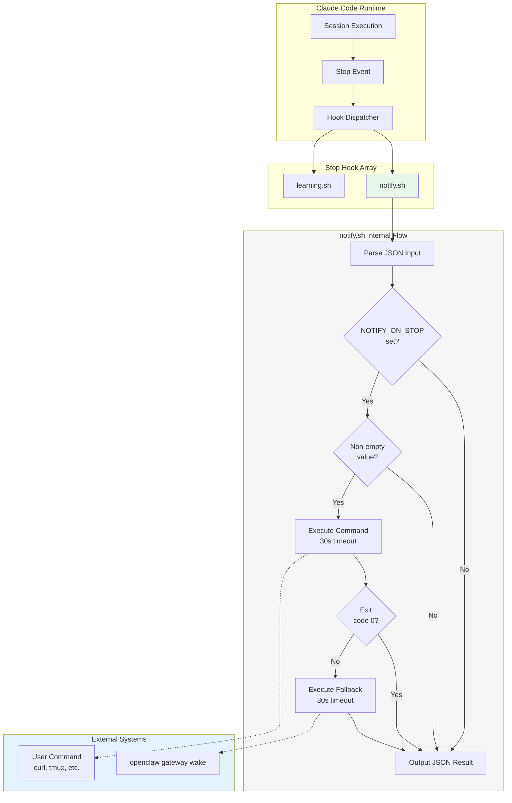
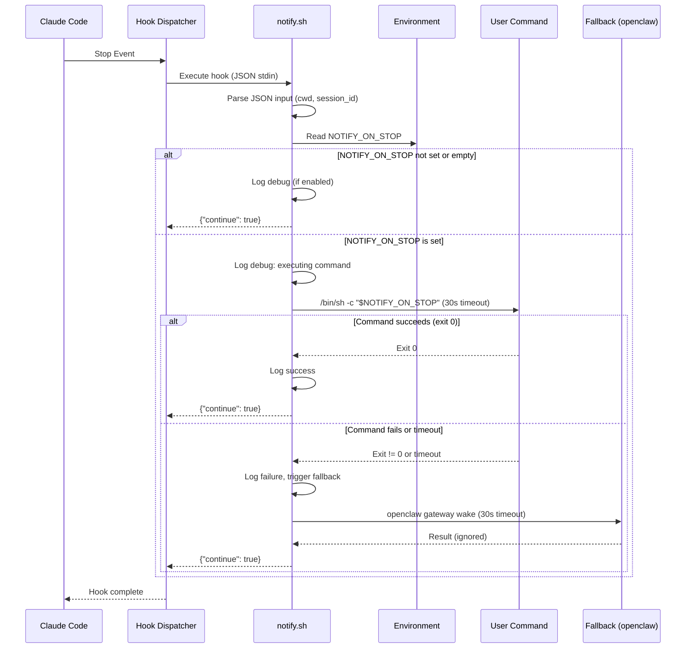
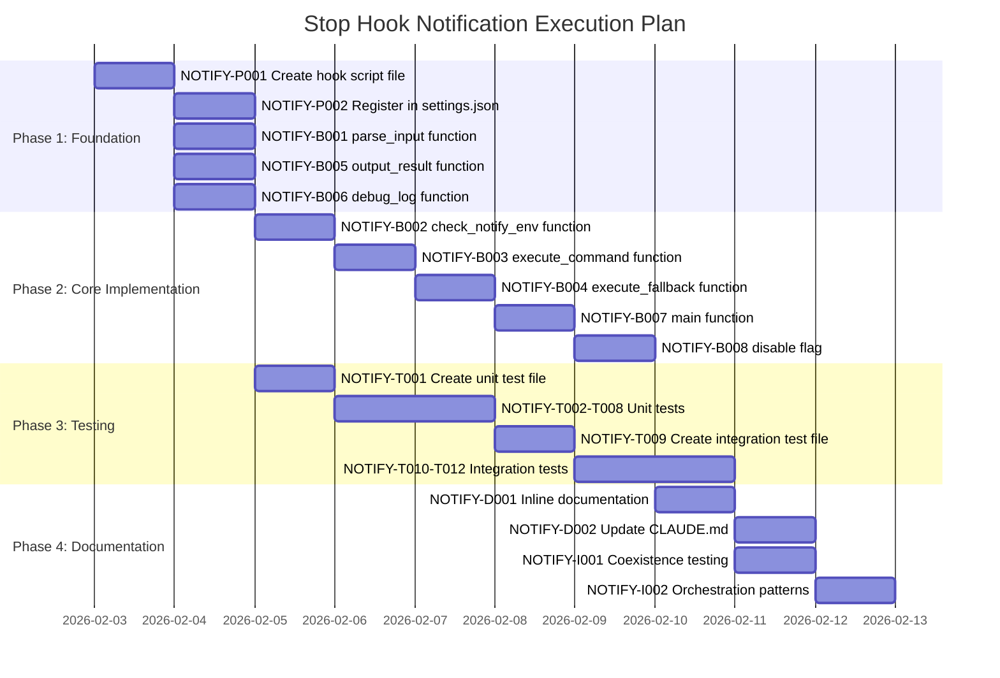

# Technical Requirements Document: Stop Hook Notification

**Document Version**: 1.0.0
**Status**: Draft
**Created**: 2026-02-03
**Updated**: 2026-02-03
**Author**: Technical Architecture
**Source PRD**: [docs/PRD/stop-hook-notification.md](../PRD/stop-hook-notification.md)
**Task ID Prefix**: NOTIFY

**Stakeholders**:
- Engineering Team (implementation)
- DevOps Team (orchestration patterns)
- Platform Team (Claude Code integration)

---

## Changelog

| Version | Date | Changes |
|---------|------|---------|
| 1.0.0 | 2026-02-03 | Initial TRD creation from PRD |

---

## Table of Contents

1. [Overview](#1-overview)
2. [System Architecture](#2-system-architecture)
3. [Technical Specifications](#3-technical-specifications)
4. [Master Task List](#4-master-task-list)
5. [Execution Plan](#5-execution-plan)
6. [Quality Requirements](#6-quality-requirements)
7. [Risk Assessment](#7-risk-assessment)
8. [Non-Goals](#8-non-goals)
9. [Appendices](#appendices)

---

## 1. Overview

### 1.1 Technical Summary

This TRD specifies the implementation of a **Stop hook** (`notify.sh`) that fires when Claude Code sessions end and optionally executes a user-configured notification command via the `NOTIFY_ON_STOP` environment variable. The hook provides deterministic session completion signaling for orchestration systems without relying on LLM behavior.

### 1.2 Key Technical Decisions

| Decision | Choice | Rationale |
|----------|--------|-----------|
| Implementation Language | Bash | Consistency with existing hooks (learning.sh, formatter.sh); POSIX compatibility |
| Configuration Mechanism | Environment Variable | Zero-config for non-users; simple orchestrator integration |
| Command Execution | `/bin/sh -c` | Standard shell execution; supports complex commands |
| Timeout Strategy | 30s command + 30s fallback | Prevents indefinite hangs; allows network operations |
| Fallback Command | `openclaw gateway wake` | Ensemble ecosystem integration; best-effort notification |
| Hook Event | Stop | Fires on session end; appropriate for completion notification |

### 1.3 Technology Stack

| Component | Technology | Version |
|-----------|------------|---------|
| Hook Script | Bash | 4.0+ (macOS/Linux compatible) |
| Unit Tests | BATS | ^1.9.0 |
| Integration Tests | BATS | ^1.9.0 |
| JSON Parsing | jq (optional) | Any |
| Configuration | settings.json | Claude Code SDK |

### 1.4 Integration Points

| System | Integration Type | Description |
|--------|------------------|-------------|
| Claude Code CLI | Hook Registration | Settings.json Stop hook array |
| Orchestrating Systems | Environment Variable | NOTIFY_ON_STOP command execution |
| openclaw gateway | Fallback Command | Best-effort notification on failure |
| Existing Hooks | Coexistence | Runs alongside learning.sh in Stop array |

---

## 2. System Architecture

### 2.1 Architecture Overview



### 2.2 Component Description

| Component | Responsibility | Location |
|-----------|----------------|----------|
| notify.sh | Main hook script; environment detection, command execution, fallback | `.claude/hooks/notify.sh` |
| settings.json | Hook registration and timeout configuration | `.claude/settings.json` |
| Unit Tests | Function-level testing of hook logic | `packages/core/hooks/notify.test.sh` |
| Integration Tests | End-to-end hook firing verification | `test/integration/hooks/notify-hook.test.sh` |

### 2.3 Data Flow Diagram



---

## 3. Technical Specifications

### 3.1 Hook Script Specification (notify.sh)

#### 3.1.1 Interface Contract

**Input** (JSON via stdin):
```json
{
  "cwd": "/path/to/working/directory",
  "transcript_path": "/path/to/session/transcript.jsonl",
  "session_id": "abc123..."
}
```

**Output** (JSON to stdout):
```json
{"continue": true}
```

The hook ALWAYS returns `{"continue": true}` as Stop hooks must not block session termination.

#### 3.1.2 Environment Variables

| Variable | Required | Description |
|----------|----------|-------------|
| `NOTIFY_ON_STOP` | No | Command to execute on session stop |
| `NOTIFY_HOOK_DEBUG` | No | Set to "1" to enable debug logging |
| `NOTIFY_HOOK_DISABLE` | No | Set to "1" to disable hook entirely |

#### 3.1.3 Function Specifications

| Function | Purpose | Parameters | Returns |
|----------|---------|------------|---------|
| `main()` | Entry point; orchestrates hook logic | None | Exit 0 |
| `parse_input()` | Read and validate JSON from stdin | None | Input string |
| `get_cwd_from_input()` | Extract cwd from JSON | Input string | CWD path |
| `check_notify_env()` | Validate NOTIFY_ON_STOP | None | 0 if valid, 1 if empty/unset |
| `execute_command()` | Run user command with timeout | Command string | Exit code |
| `execute_fallback()` | Run fallback notification | None | Exit code |
| `output_result()` | Write JSON result to stdout | None | None |
| `debug_log()` | Conditional debug logging | Message | None |

#### 3.1.4 Behavior Specifications

**Environment Variable Handling**:
- Unset `NOTIFY_ON_STOP`: Silent exit (no notification)
- Empty string `""`: Treated as unset (silent exit)
- Whitespace-only string: Treated as unset (silent exit)
- Non-empty value: Execute as shell command

**Command Execution**:
- Execute via `/bin/sh -c "$NOTIFY_ON_STOP"`
- Timeout: 30 seconds
- stdout/stderr: Captured and logged to hook stderr (debug mode)
- Exit code: 0 = success, non-zero = failure

**Fallback Execution**:
- Trigger: Primary command exits non-zero OR times out
- Command: `openclaw gateway wake --text "Session stopped (notify failed)" --mode now`
- Timeout: 30 seconds
- Failure: Logged but does not fail hook

### 3.2 Hook Registration Specification

**settings.json addition**:
```json
{
  "hooks": {
    "Stop": [
      {
        "matcher": "",
        "hooks": [
          {
            "type": "command",
            "command": ".claude/hooks/learning.sh",
            "timeout": 10
          },
          {
            "type": "command",
            "command": ".claude/hooks/notify.sh",
            "timeout": 60
          }
        ]
      }
    ]
  }
}
```

**Configuration Details**:
- Hook position: After `learning.sh` in Stop array (order preserved)
- Timeout: 60 seconds (30s command + 30s fallback + buffer)
- Matcher: Empty (fires on all Stop events)

### 3.3 Error Handling

| Scenario | Behavior | Exit Code |
|----------|----------|-----------|
| NOTIFY_ON_STOP unset | Silent exit, return `{"continue": true}` | 0 |
| NOTIFY_ON_STOP empty | Silent exit, return `{"continue": true}` | 0 |
| Command execution fails | Execute fallback, return `{"continue": true}` | 0 |
| Command times out | Kill process, execute fallback | 0 |
| Fallback fails | Log error, return `{"continue": true}` | 0 |
| JSON parsing fails | Use defaults, continue execution | 0 |
| Invalid input | Log warning, return `{"continue": true}` | 0 |

---

## 4. Master Task List

### 4.1 Infrastructure Tasks

| ID | Task | Description | Dependencies | Assignee |
|----|------|-------------|--------------|----------|
| NOTIFY-P001 | Create hook script file | Create `.claude/hooks/notify.sh` with shebang and header | None | backend-implementer |
| NOTIFY-P002 | Register hook in settings.json | Add notify.sh to Stop hook array after learning.sh | NOTIFY-P001 | backend-implementer |

### 4.2 Implementation Tasks

| ID | Task | Description | Dependencies | Assignee |
|----|------|-------------|--------------|----------|
| NOTIFY-B001 | Implement parse_input function | Parse JSON from stdin, extract cwd/session_id | NOTIFY-P001 | backend-implementer |
| NOTIFY-B002 | Implement check_notify_env function | Validate NOTIFY_ON_STOP (unset, empty, whitespace) | NOTIFY-P001 | backend-implementer |
| NOTIFY-B003 | Implement execute_command function | Run command via /bin/sh -c with 30s timeout | NOTIFY-B002 | backend-implementer |
| NOTIFY-B004 | Implement execute_fallback function | Run openclaw fallback with 30s timeout | NOTIFY-B003 | backend-implementer |
| NOTIFY-B005 | Implement output_result function | Output JSON `{"continue": true}` | NOTIFY-B001 | backend-implementer |
| NOTIFY-B006 | Implement debug_log function | Conditional logging when NOTIFY_HOOK_DEBUG=1 | NOTIFY-P001 | backend-implementer |
| NOTIFY-B007 | Implement main function | Orchestrate hook flow | NOTIFY-B001 through NOTIFY-B006 | backend-implementer |
| NOTIFY-B008 | Implement disable flag | Early exit when NOTIFY_HOOK_DISABLE=1 | NOTIFY-B007 | backend-implementer |

### 4.3 Testing Tasks

| ID | Task | Description | Dependencies | Assignee |
|----|------|-------------|--------------|----------|
| NOTIFY-T001 | Create unit test file | Create `packages/core/hooks/notify.test.sh` with BATS setup | NOTIFY-P001 | verify-app |
| NOTIFY-T002 | Test parse_input function | Verify JSON parsing and defaults | NOTIFY-B001, NOTIFY-T001 | verify-app |
| NOTIFY-T003 | Test check_notify_env function | Verify all env var states (unset, empty, whitespace, valid) | NOTIFY-B002, NOTIFY-T001 | verify-app |
| NOTIFY-T004 | Test execute_command function | Verify command execution, timeout, exit codes | NOTIFY-B003, NOTIFY-T001 | verify-app |
| NOTIFY-T005 | Test execute_fallback function | Verify fallback execution and failure handling | NOTIFY-B004, NOTIFY-T001 | verify-app |
| NOTIFY-T006 | Test main function flow | Verify complete hook flow for all scenarios | NOTIFY-B007, NOTIFY-T001 | verify-app |
| NOTIFY-T007 | Test disable flag | Verify NOTIFY_HOOK_DISABLE behavior | NOTIFY-B008, NOTIFY-T001 | verify-app |
| NOTIFY-T008 | Test always exits 0 | Verify non-blocking behavior in all scenarios | NOTIFY-B007, NOTIFY-T001 | verify-app |
| NOTIFY-T009 | Create integration test file | Create `test/integration/hooks/notify-hook.test.sh` | NOTIFY-T001 | verify-app |
| NOTIFY-T010 | Integration: hook fires on Stop | Verify hook executes on session Stop event | NOTIFY-B007, NOTIFY-T009 | verify-app |
| NOTIFY-T011 | Integration: command execution | Verify user command is executed end-to-end | NOTIFY-B003, NOTIFY-T009 | verify-app |
| NOTIFY-T012 | Integration: fallback execution | Verify fallback triggers on command failure | NOTIFY-B004, NOTIFY-T009 | verify-app |

### 4.4 Documentation Tasks

| ID | Task | Description | Dependencies | Assignee |
|----|------|-------------|--------------|----------|
| NOTIFY-D001 | Add inline documentation | Document hook header, functions, environment variables | NOTIFY-B007 | backend-implementer |
| NOTIFY-D002 | Update CLAUDE.md | Add notify hook to development documentation | NOTIFY-B007 | backend-implementer |

### 4.5 Integration Tasks

| ID | Task | Description | Dependencies | Assignee |
|----|------|-------------|--------------|----------|
| NOTIFY-I001 | Test coexistence with learning.sh | Verify both hooks fire correctly in sequence | NOTIFY-P002, NOTIFY-B007 | verify-app |
| NOTIFY-I002 | Test orchestration patterns | Verify tmux, webhook, file-based signal patterns | NOTIFY-B007 | verify-app |

---

## 5. Execution Plan

### 5.1 Phase 1: Foundation

**Objective**: Create hook infrastructure and core functions

**Tasks**:
- NOTIFY-P001: Create hook script file
- NOTIFY-P002: Register hook in settings.json
- NOTIFY-B001: Implement parse_input function
- NOTIFY-B005: Implement output_result function
- NOTIFY-B006: Implement debug_log function

**Exit Criteria**:
- Hook file exists and is executable
- Hook registered in settings.json
- Basic input parsing works

### 5.2 Phase 2: Core Implementation

**Objective**: Implement command execution logic

**Tasks**:
- NOTIFY-B002: Implement check_notify_env function
- NOTIFY-B003: Implement execute_command function
- NOTIFY-B004: Implement execute_fallback function
- NOTIFY-B007: Implement main function
- NOTIFY-B008: Implement disable flag

**Exit Criteria**:
- Full hook logic implemented
- All environment variable scenarios handled
- Command and fallback execution working

### 5.3 Phase 3: Testing

**Objective**: Comprehensive test coverage

**Tasks**:
- NOTIFY-T001: Create unit test file
- NOTIFY-T002 through NOTIFY-T008: Unit tests
- NOTIFY-T009: Create integration test file
- NOTIFY-T010 through NOTIFY-T012: Integration tests

**Exit Criteria**:
- Unit test coverage >= 60%
- Integration tests passing
- All PRD acceptance criteria verified

### 5.4 Phase 4: Documentation and Integration

**Objective**: Documentation and system integration

**Tasks**:
- NOTIFY-D001: Add inline documentation
- NOTIFY-D002: Update CLAUDE.md
- NOTIFY-I001: Test coexistence with learning.sh
- NOTIFY-I002: Test orchestration patterns

**Exit Criteria**:
- Hook fully documented
- Works correctly with existing hooks
- Orchestration patterns verified

### 5.5 Execution Plan Gantt Chart



### 5.6 Parallelization Opportunities

| Parallel Group | Tasks | Rationale |
|----------------|-------|-----------|
| Foundation Functions | NOTIFY-B001, NOTIFY-B005, NOTIFY-B006 | Independent functions with no inter-dependencies |
| Test Creation | NOTIFY-T001, NOTIFY-T009 | Test file setup can parallel with implementation |
| Documentation | NOTIFY-D001, NOTIFY-D002 | Documentation tasks are independent |

### 5.7 Critical Path

```
NOTIFY-P001 --> NOTIFY-B002 --> NOTIFY-B003 --> NOTIFY-B004 --> NOTIFY-B007 --> NOTIFY-T006 --> NOTIFY-I001
```

The critical path runs through core implementation (environment check, command execution, fallback) to main function integration and final coexistence testing.

---

## 6. Quality Requirements

### 6.1 Testing Requirements

| Type | Target | Rationale |
|------|--------|-----------|
| Unit Test Coverage | >= 60% | Standard for hook implementations |
| Integration Test Coverage | >= 50% | Focus on critical paths |
| All PRD Acceptance Criteria | 100% | Required for feature completion |

### 6.2 Code Quality Standards

| Requirement | Description |
|-------------|-------------|
| Shell Safety | Use `set -euo pipefail` |
| Quoting | All variables must be quoted |
| Timeout Handling | Use `timeout` command where available |
| Exit Codes | Hook always exits 0 (non-blocking) |
| JSON Output | Valid JSON via `echo` or here-doc |
| Debug Logging | Conditional, to stderr only |

### 6.3 Security Requirements

| ID | Requirement | Implementation |
|----|-------------|----------------|
| SEC-1 | Command executed in session context | Use `/bin/sh -c` without privilege escalation |
| SEC-2 | No credential logging | Mask or truncate command in debug output |
| SEC-3 | Hardcoded fallback | Prevent injection via fallback command |
| SEC-4 | Input validation | Validate JSON structure before use |

### 6.4 Performance Requirements

| Metric | Target | Measurement |
|--------|--------|-------------|
| Silent exit time | < 50ms | Time from hook start to exit when NOTIFY_ON_STOP unset |
| Hook startup time | < 100ms | Time to reach first conditional |
| Command timeout | 30 seconds | Maximum time for user command |
| Total hook timeout | 60 seconds | Configured in settings.json |

---

## 7. Risk Assessment

### 7.1 Risks Imported from PRD

#### Risk 1: Hook Execution Delays Session Termination

**Technical Mitigation**:
- Implement 30-second command timeout using `timeout` command
- Set 60-second total hook timeout in settings.json
- Always return `{"continue": true}` regardless of outcome
- Test timeout behavior in unit tests (NOTIFY-T004)

#### Risk 2: Fallback Command Not Available

**Technical Mitigation**:
- Check for `openclaw` availability before execution
- Log warning if fallback unavailable, continue silently
- Document fallback requirements in inline documentation
- Test fallback unavailability in unit tests (NOTIFY-T005)

#### Risk 3: Environment Variable Injection

**Technical Mitigation**:
- Execute via `/bin/sh -c` which inherits session permissions
- Do not elevate privileges in hook
- Document security implications in NOTIFY-D001
- Validate that command is non-empty string before execution

#### Risk 4: Debug Logging Exposes Sensitive Data

**Technical Mitigation**:
- Mask NOTIFY_ON_STOP value in debug output (show first 20 chars + "...")
- Require explicit opt-in via NOTIFY_HOOK_DEBUG=1
- Document debug mode security implications
- Test masking in NOTIFY-T006

#### Risk 5: Race Condition with Other Stop Hooks

**Technical Mitigation**:
- Hook is stateless (no shared files or state)
- Order defined by settings.json array (learning.sh before notify.sh)
- No dependencies on other hook outputs
- Test coexistence in NOTIFY-I001

### 7.2 Additional Technical Risks

#### Risk 6: Timeout Command Availability

**Description**: The `timeout` command may not be available on all systems (notably macOS without coreutils).

**Likelihood**: Medium
**Impact**: Medium

**Technical Mitigation**:
- Check for `timeout` command availability
- Implement fallback using background process + sleep + kill pattern
- Test both paths in unit tests

#### Risk 7: JSON Parsing Failures

**Description**: Input JSON may be malformed or missing fields.

**Likelihood**: Low
**Impact**: Low

**Technical Mitigation**:
- Use jq if available, fall back to sed/grep
- Provide sensible defaults for missing fields
- Never fail the hook on parsing errors

---

## 8. Non-Goals

**Imported from PRD - Critical for Scope Enforcement**

### NG1: Complex Notification Routing

The hook will NOT support:
- Multiple notification targets in a single configuration
- Conditional notification based on session outcome
- Notification filtering or transformation

**Enforcement**: Code review must reject any routing logic beyond single command execution.

### NG2: Session Outcome Reporting

The hook will NOT:
- Parse or report on session success vs failure
- Include session logs or output in notifications
- Provide structured completion status

**Enforcement**: Hook must not read transcript_path content or analyze session data.

### NG3: Built-in Retry Logic for Notifications

The hook will NOT:
- Implement exponential backoff for failed notifications
- Queue notifications for later delivery
- Persist failed notifications

**Enforcement**: Single command + single fallback only. No retry loops.

### NG4: Bi-directional Communication

The hook will NOT:
- Wait for acknowledgment from notification target
- Support request-response patterns
- Allow notification target to influence session

**Enforcement**: Fire-and-forget pattern. No response parsing.

### NG5: Session Metadata Injection

The hook will NOT:
- Inject session ID into notification command
- Provide working directory or other context to command
- Template variables in NOTIFY_ON_STOP value

**Enforcement**: Execute NOTIFY_ON_STOP as literal string. No variable substitution by hook.

---

## Appendices

### Appendix A: File Structure

```
.claude/
  hooks/
    notify.sh              # New: Stop hook for notifications
    learning.sh            # Existing: SessionEnd file staging
    wiggum.js              # Existing: Autonomous mode
    ...
  settings.json            # Modified: Add notify.sh to Stop array

packages/
  core/
    hooks/
      notify.test.sh       # New: BATS unit tests

test/
  integration/
    hooks/
      notify-hook.test.sh  # New: BATS integration tests
```

### Appendix B: Example Usage Patterns

#### Pattern 1: tmux Notification
```bash
export NOTIFY_ON_STOP="tmux send-keys -t orchestrator 'echo Session complete' Enter"
claude --remote "Implement feature X"
```

#### Pattern 2: Webhook Notification
```bash
export NOTIFY_ON_STOP="curl -X POST https://webhook.example.com/session-complete"
claude --remote "Run tests"
```

#### Pattern 3: File-based Signal
```bash
export NOTIFY_ON_STOP="touch /tmp/session-complete-signal"
claude --remote "Build project"
```

#### Pattern 4: Message Queue
```bash
export NOTIFY_ON_STOP="aws sqs send-message --queue-url https://sqs... --message-body 'done'"
claude --remote "Deploy to staging"
```

### Appendix C: Glossary

| Term | Definition |
|------|------------|
| Stop Event | Claude Code lifecycle event fired when a session ends |
| Stop Hook | Script registered to execute on Stop events |
| NOTIFY_ON_STOP | Environment variable containing the notification command |
| Fallback | Backup notification mechanism when primary command fails |
| openclaw | CLI tool that provides the gateway wake command |
| Orchestrating Agent | External system that spawns and coordinates Claude Code sessions |

### Appendix D: Related Documents

| Document | Description |
|----------|-------------|
| `docs/PRD/stop-hook-notification.md` | Source product requirements |
| `.claude/settings.json` | Hook registration configuration |
| `.claude/hooks/learning.sh` | Existing Stop/SessionEnd hook pattern |
| `.claude/hooks/wiggum.js` | Existing Stop hook (autonomous mode) |
| `docs/TRD/ensemble-vnext.md` | Overall technical architecture |

---

*Document generated by technical-architect agent*
*TRD Reference: NOTIFY-* task prefix for all implementation tasks*
*Last updated: 2026-02-03*
