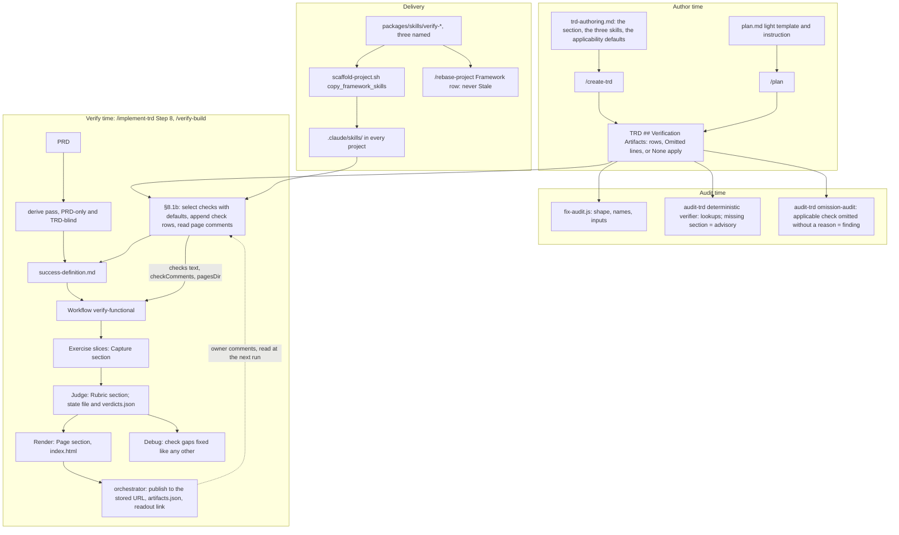

# TRD: Verification-Artifact Skills

**Version**: 2.0.2
**Status**: Draft
**Created**: 2026-09-27
**Last Updated**: 2026-09-27
**Author**: @technical-architect
**Source PRD**: `docs/plan/verification-artifacts.investigation.md` (a `/plan` investigation record, `**Weight**: medium`; no supersession marker). Its own source is `docs/plan/verification-closeout.brief.md` §2 and §4, which records the owner's decisions of 2026-09-27 verbatim. The owner's correction of the same day is quoted in the 2.0.0 changelog row and governs where it differs.
**Task ID Prefix**: VART

---

## Changelog

| Version | Date | Changes | Author |
|---------|------|---------|--------|
| 1.0.0 | 2026-09-27 | Initial TRD creation | @technical-architect |
| 1.1.0 | 2026-09-27 | Review findings applied. The design comparison reuses existing screenshots newest-first, each with the commit it was captured at, and re-captures only missing or stale frames (D13); it takes the owner's rulings as an input and a `superseded` card must cite one (D14). Both `/implement-trd` §8.1 `not run` short-circuits and `/verify-build`'s two early exits now route through the artifact step (D7, VART-B003). A missing section is an advisory in `/audit-trd`, split off before its reconcile stage so the section is never written into an old TRD; it fails only `/plan`'s `fix-audit.js` check on TRDs `/plan` just wrote (D6). The parser function, lib module and CLI are removed: §8.6 reads the table, `fix-audit.js` gains one small check, and `/audit-trd`'s deterministic verifier checks by lookup (D4, D5; VART-B001 and VART-B002 re-scoped). The `ensemble-set` frontmatter marker is replaced by a named list of the three skills (D2; TR1 and its contingency removed). VART-P005 covers the third `rebase-project.md` copy and its generator check. §3.1 states that `allowed-tools` has no effect when the skill is read as a file, and that out-of-step invocation is intended. VART-D001 names the light-template fence hazard and places the section after Non-Goals, before Task Grounding (this TRD's own section moved to match). VART-T001's narrative dependencies on VART-D001 and VART-B002 are dropped. With VART-B002 and VART-B003 no longer waiting on a parser, phases collapse from three to two. Also corrected while re-grounding §3.6: `copy_skills()` already refreshes present framework skills on `--refresh`, so `copy_framework_skills()` only adds missing ones. | @technical-architect |
| 2.0.0 | 2026-09-27 | **The skills now define verification checks that run inside the loop, not pages produced after it.** Owner correction, verbatim: *"What do we mean artifacts are produced after verification loop returns? While these are very helpful for human review, these aren't just artifacts. These are immensely valuable to the review process. I'll be very specific: any TRD which has reference UI screens, I want it near certain (not hard coded in, but heavily weighted) that part of the review process is a screen by screen comparison of design to rendered output. This artifact and skill is intended to help force that. Same with flow and data on screen."* **(1) Checks, not reports.** Each selected check contributes criteria to the success definition — one per design screen, per journey, per data view — which the loop's Exercise stage captures, its Judge rules with the check's rubric, and its Debug stage fixes like any other gap (D7). Removed: the post-loop §8.6 step, the routing of both `not run` exits through it, `/verify-build` step 4a, the one-agent-per-skill dispatch and its result block (1.1.0's D7, D8, D11), and OQ-2's assumption. **(2) Heavily weighted selection.** A check whose inputs are present is included by default; a TRD omits it only with a stated reason, and any stated reason is enough (O3a, D9). `/audit-trd` reports an applicable check omitted without a reason as a real finding; a missing section on an old TRD stays advisory (D5, D6). 1.1.0's unconditional design guarantee, which overrode a TRD's `None apply`, is retired (OQ-3 resolved). **(3) Check criteria.** The orchestrator appends them after the derive pass, which stays PRD-only and TRD-blind. Each row cites its design input, never the task list, and carries Derivation `check:<skill>`; visual rows are `judge-only` (D15). A 32-frame design is 32 criteria that pass one by one, fanned out by the resource lanes. A derived criterion with a `Parts` count over the same frames is ruled from them, not captured twice (D17). **(4) The loop's own stages run the checks.** The orchestrator passes each selected `SKILL.md` as text in a new `checks` argument. The workflow injects it into the prompts that need it: the Capture section for an Exercise slice holding check rows, the Rubric for the Judge. Debug gaps carry their design input (D11). The argument list grows from 18 to 21 (`checks`, `checkComments`, `pagesDir`); the result gains `pages`. **(5) The page.** A new Render stage re-renders each check's page from the Judge's verdicts every iteration, alongside Debug. The orchestrator publishes it to the stored URL when the loop returns, and reads the owner's comments before the next run as review input (D8, D18, D19). New decisions D15–D19. New tasks VART-B004 (workflow) and VART-B005 (contract). VART-B003 is rewritten; VART-P001–P003 are re-scoped to per-stage sections; VART-B001, B002, D001 and T001 are amended. 12 tasks in two phases. | @technical-architect |
| 2.0.1 | 2026-09-27 | **D20 (numbered D18 in error until 2.0.2): a missing screen fails its own check row, not the run.** Under the contract's `unbuilt` rule one absent frame of 32 ended the whole loop and hid every other frame's gaps for that run — the opposite of a screen-by-screen review that drives fixes. Check rows now resolve an absent screen, journey target or data view as `not_met` with reason `not built`; derived criteria keep the contract rule. TR11 closed | @claude |
| 2.0.2 | 2026-09-27 | Audit findings applied. The missing-screen decision is renumbered **D20**: 2.0.1 had given it D18, which already named the owner-comments decision, so every `D18` citation was ambiguous. `D18` now means only owner comments; the missing-screen citations (§3.1 flow and data rubrics, §3.7, TR11) and the Serves columns of VART-P001–P003 and VART-B005 cite D20. D16 still mapped a missing screen to `unbuilt`, contradicting D20; it now maps it to `not_met` with reason `not built`, and VART-B005's contract assertion states the exception. O1 carries the *Amended* note §1.2 promises; O10 cites the brief passage that grounds "comments become the fix batch" | @technical-architect |

---

## 1. Overview

### 1.1 Technical Summary

Ensemble gains three **verification-check skills**. Each is a Markdown `SKILL.md` prompt defining
one check a build is reviewed by:

1. **Design ↔ build comparison** (`verify-design-comparison`) — screen by screen, the rendered
   build against its reference design frame. Its page reproduces the owner's exemplar: one card per
   frame with Design | Build@commit | Diff | Overlay and a model-written verdict.
2. **Designed ↔ as-built interaction flow** (`verify-flow-as-built`) — each designed journey walked
   end to end, with the as-built flow derived from the code and diffed against the design.
3. **Data ↔ screen fidelity** (`verify-data-fidelity`) — each data view's rendered rows against the
   API or store response behind them.

**A check is part of the review, not a report about it.** Each selected check contributes criteria
to the feature's success definition: one per design screen, one per journey, one per data view.
They run inside the existing functional-verification loop. Exercise captures their evidence by the
skill's Capture procedure, the Judge rules them by the skill's Rubric, and a check criterion that
is not met is a gap Debug fixes, exactly like a PRD-derived one. The page is the readable view of
those same verdicts. It is re-rendered every iteration, published to one stored URL, and linked in
the readout. The owner's comments on it are read before the next verification run.

**Selection lives in the TRD and is heavily weighted.** Every TRD carries a
`## Verification Artifacts` section. A check whose inputs the PRD carries is included by default:
reference UI screens bring the design comparison, an interaction diagram or screen-to-screen
journeys bring the flow check, screens rendering API or store data bring the data check. The TRD
omits an applicable check only by stating a reason, and any stated reason is enough. `/create-trd`
and `/plan` write the section. `/plan`'s mechanical audit (`fix-audit.js`) checks its shape.
`/audit-trd` checks its names and inputs by lookup, and reports an applicable check omitted without a
reason as a real finding; a TRD written before this change, with no section at all, gets only an
advisory. When the section is absent or silent on an applicable check, the verification step applies
the same defaults itself and says so.

**The success-definition derive pass is unchanged** — PRD-only and blind to the TRD. The check
criteria are appended after it by the orchestrator, and each cites its design input, never the task
list, so the plan still does not grade itself.

The skills reach every project — new and existing — because `scaffold-project.sh` copies a named
list of the three on scaffold and on `--refresh`, independent of the stack selection, and
`/rebase-project` stops treating them as removable.

**The framework ships no deterministic artifact tooling and no parser for the section.** Cropping,
diffing and page assembly are written by the agents at run time, as the exemplar's throwaway Python
was. The only new code is loop plumbing: three workflow arguments, prompt injection, a Render stage,
one `fix-audit.js` check and one advisory split in `audit-trd.js`.

### 1.2 Objectives

Every objective below traces to a source. O1–O7 keep the investigation record's own IDs; where the
owner's correction of 2026-09-27 changed one, the row says so.

| ID | Objective | Source |
|----|-----------|--------|
| O1 | Ensemble ships a set of verification-check skills — Markdown `SKILL.md` prompts, each stating when it applies, which inputs it needs, which criteria it contributes, how their evidence is captured, how they are judged, and the page that shows the verdicts. The set starts with three: design ↔ build comparison, designed ↔ as-built interaction flow, data ↔ screen fidelity. *Amended 2026-09-27: was "each stating when it applies and which inputs it needs"; the criteria, capture, judging and page facets follow the owner's correction that the skills are checks inside the loop.* | PRD O1 (owner, 2026-09-27; brief §4); owner correction 2026-09-27: "these aren't just artifacts. These are immensely valuable to the review process" |
| O2 | The design-comparison page reproduces the owner's exemplar: per design frame, Design \| Build@commit \| Diff "N% differs" \| Overlay with a fade slider; a model-written verdict per frame (status match / minor / deviates / superseded / uncaptured / spec, one sentence, notes); cross-cutting problems stated once; a legend; status filter and jump strip; navigation route per frame; uncaptured frames shown with the reason; republished to the same URL as fixes land. | PRD O2 (owner, 2026-09-27: "That artifact was perfect… I want a skill to reproduce it"); anatomy in brief §2 |
| O2a | The exemplar's project-specific constants are parameters of the skill, not constants: bezel crop box, frame size, status-bar height, device and capture commands, evidence paths, the data-difference caveat, title. | brief §2 "Must be parameters, not constants"; PRD Grounding, "The exemplar" |
| O2b | The design-comparison verdict is model judgement: the agent looks at every stitched design \| build \| diff image and writes each verdict itself; the diff percentage is evidence, never the status. | PRD Decision, "The judgement is the product"; brief §2 "How it was made" |
| O3 | Every TRD carries a `## Verification Artifacts` section naming the checks that apply, each with its inputs, stating a reason for every applicable check it omits, or stating that none apply — written by `/create-trd` and by `/plan` for the TRDs it writes. | PRD O3 (owner, 2026-09-27); owner correction 2026-09-27 |
| O3a | Selection is heavily weighted, never hard-coded. When the inputs include reference UI screens (PRD- or TRD-referenced design frames), the design comparison is the default; likewise the flow check when there is an interaction diagram or screen-to-screen journeys, and the data check when screens render API or store data. `/create-trd` and `/plan` include every applicable check unless the section states a reason to omit it; a stated reason is always enough. | owner correction 2026-09-27: "near certain (not hard coded in, but heavily weighted)… Same with flow and data on screen" |
| O4 | `/audit-trd` checks the section: names only shipped check skills, every named input resolves, and no applicable check is omitted without a stated reason (a real finding). A missing section on a TRD written before this change is an advisory and is never written in by the audit. | PRD O4 (brief §4); owner correction 2026-09-27 as directed to this revision |
| O5 | The verification step — `/implement-trd` Step 8 and `/verify-build` — runs every selected check inside the functional-verification loop: its criteria are captured by the loop's Exercise stage, ruled by its Judge with the check's rubric, and, when not met, fixed by its Debug stage like any other gap. *Amended 2026-09-27: was "invokes each named skill" after the loop.* | PRD O5 ("the verify step invokes the skill to create them"); owner correction 2026-09-27: "part of the review process is a screen by screen comparison of design to rendered output" |
| O5a | Each check contributes one criterion per design screen, per journey, per data view, and each passes on its own: a 32-frame design is 32 criteria, fanned out by the resource lanes, not one criterion with 32 parts. | owner correction 2026-09-27 ("screen by screen"); `docs/TRD/verification-convergence.md` AMEND-001's record that a 32-part criterion "can only ever report failure until all 32 match" |
| O5b | Check criteria never let the plan grade itself: the success-definition derive pass stays PRD-only and TRD-blind, and every check criterion cites its design input, never the task list. | `functional-verification.md` contract, "The isolation rule"; owner correction 2026-09-27 as directed to this revision |
| O6 | When a TRD has no section, or its section is silent on an applicable check, the verification step applies O3a's defaults to the PRD's inputs itself and reports each such selection. *Amended 2026-09-27: was an unconditional design guarantee.* | PRD O6 (owner: "reproduce that artifact any time there is a UI design provided… ensure it's created each time"); owner correction 2026-09-27 ("not hard coded in, but heavily weighted") |
| O7 | The check skills reach every project that has Ensemble, including existing ones on `--refresh`, not only projects whose stack selection names them. | PRD O7 — labelled `domain-derived` in the PRD: O5 and O6 are false in any project that lacks the skills, and today's delivery path never gives a new skill to an existing project |
| O8 | No page, evidence manifest, verdict file, or agent summary feeding one contains a credential value. | `.claude/rules/command-status.md` "Artifact links": "Never publish a document that contains a credential"; PRD Grounding records a test password appearing in an agent summary during the exemplar's production |
| O9 | A check exercises only environments `.claude/rules/verification.md` authorises, and writes data only where that file's data-permission column allows it. | `.claude/rules/verification.md` §1: "An environment that is not listed is not authorized"; the contract's S-2 |
| O10 | Each check's page is rendered from the check verdicts every loop iteration, republished to the same URL, and linked in the readout; the owner's comments on it are an input to the next fix batch. | owner correction 2026-09-27 ("very helpful for human review"); PRD O2 ("republished to the same URL as fixes land"); `docs/plan/verification-closeout.brief.md` §2 "What made it good" (the owner commenting on a specific screenshot "and those comments becoming the fix list before one rebuild"); owner correction 2026-09-27 as directed to this revision |
| Q1 | New deterministic code (the `fix-audit.js` section check, the `audit-trd.js` advisory split, the workflow's argument validation, prompt injection and Render stage, the shell delivery) meets unit ≥ 60% and integration ≥ 50% where applicable. | `constitution.md` Quality Gates |

### 1.3 Key Technical Decisions

| ID | Decision | Choice | Serves Objective | Rationale | Alternatives Considered |
|----|----------|--------|------------------|-----------|------------------------|
| D1 | Form of the skills | Three new directories under `packages/skills/`, each a single `SKILL.md` (frontmatter `name`, `description`, `when_to_use`, `allowed-tools`). The body has named sections, each read by a different stage: **When it applies**, **Inputs**, **Criteria** (the orchestrator), **Capture** (Exercise), **Rubric** (Judge), **Page** (Render), **Safety** (all). No scripts, templates or image assets shipped. | O1, O2, O2a | Owner: "I DO NOT want to go down a rabbit hole of building deterministic tools". Constitution Principle 2: skills are prompts only. One file per skill keeps the library format and D2's delivery; each stage is told which section is its own. | **Ship the exemplar's `pair.py`/`gen.py` as helpers** — rejected by the owner. **Ship the exemplar `index.html` as a template** — rejected: it carries lightning-lane content and turns the page into a fill-in exercise; revisit if generated pages drift across runs. **One file per stage (`capture.md`, `rubric.md`, …)** — rejected: three skills become fifteen files and the delivery list grows with them. |
| D2 | How the framework knows which skills are the set | A named list of the three skill names — `verify-design-comparison`, `verify-flow-as-built`, `verify-data-fidelity` — in `scaffold-project.sh` (a `FRAMEWORK_SKILLS` array read by `copy_framework_skills`), in `rebase-project.md`'s Framework row, and in `trd-authoring.md`'s section. `plan.md`, `/implement-trd` §8.1b and the audits point at the contract rather than repeating them. | O3, O7 | The investigation's Decision: "`scaffold-project.sh` copies a named list of framework skills". The owner capped the set at three, so the list is short and rarely changes. Cost, stated: adding a fourth skill edits three files — see TR6. | **A frontmatter marker (`ensemble-set: verification-artifact`)** — the 1.0.0 design; replaced in 1.1.0 (three readers, and an unverified loader risk). **Name prefix `verify-`** — rejected: `packages/skills/verify-goal` carries it. Revisit the marker if the owner lifts the cap. |
| D3 | Shape of the TRD section | `## Verification Artifacts`, containing any of: a table `Skill \| Inputs \| Why it applies`, one row per chosen check; zero or more lines `Omitted: <skill> — <reason>`, one per applicable check left out; or a single line beginning `None apply —` followed by the reason, which counts as the stated reason for every check. Inputs name repository paths in backticks; a URL (e.g. a Figma link) is allowed. | O3, O3a, O4 | Same shape as `## Deferred by design`. Backticked paths make "every input resolves" a lookup. The `Omitted:` line is what makes O3a's "unless the section states a reason" checkable per check: a TRD may take the design comparison and leave out the data check for a reason. | **Selection in the PRD** — rejected: the PRD states what must be true; the TRD decides how it is proven, and the derive pass must stay TRD-blind. **A reason column on the table** — rejected: an omitted check has no inputs to put in the row. **Free prose** — rejected: nothing could check it. |
| D4 | Reading the section | No parser. Three readers, each in the form it already works in: `/implement-trd` §8.1b (and `/verify-build` 3b), the orchestrating model reading the table from the TRD; `fix-audit.js`, composing `trd-parser.js`'s existing exports; `/audit-trd`'s verifiers, by grep and `ls` (§3.3). | O4, O5, O6 | The only consumer that acts on the rows is a model, and "absent", "Omitted", "None apply" and "rows" are plain in the text. | **`trd-parser.js` `parseVerificationArtifacts()`, a lib module and a CLI** — the 1.0.0 design; removed in 1.1.0. Revisit if a deterministic consumer of the rows appears. |
| D5 | Where the checks on the section live | In the audits that already exist, extended in place. `fix-audit.js`'s `audit()` gains one mechanical check, run when it is given `markdown` (`/plan` §5a.1 always passes it). `/audit-trd`'s `deterministic` verifier gains lookups (each named skill's `SKILL.md`, each backticked input) and the missing-section advisory. `/audit-trd`'s `omission-audit` verifier gains the applicability judgement: the source references design frames, a flow or data views, the section exists, and the matching check is neither selected nor omitted with a reason → a finding (`check: 'omission'`, `action: 'add-back'`). | O3, O3a, O4 | Each check has one home that already runs at the right moment. `omission-audit` already reads the source in full and exists to catch what a TRD left out, which is exactly an applicable check with no row and no reason; it needs no schema change. | **Applicability in `fix-audit.js` by regex over image paths or Figma URLs** — rejected: a logo, or an evidence screenshot cited in prose, would produce a false finding, which `fix-audit.js`'s own header calls worse than a missing check. `/plan`'s light TRDs therefore get O3a by instruction, and its medium TRDs by `/audit-trd`. **A new judgement verifier** — rejected: `omission-audit` already reads the source. **A shared lib module with a CLI** — removed in 1.1.0. |
| D6 | Findings vs advisories | `fix-audit.js` (a TRD `/plan` has just written): section absent → finding; none of rows, `Omitted:` lines or a `None apply —` line → finding; a Skill cell or `Omitted:` line naming no `SKILL.md` under `.claude/skills/` or `packages/skills/` → finding; an `Omitted:` line with no reason → finding; a backticked repo path that does not exist → finding; a backticked URL → advisory. `/audit-trd` (any TRD): the same, **except a missing section is an advisory**, split off in `audit-trd.js` where findings are assembled so neither reconcile agent sees it and the audit never writes the section. **An applicable check omitted without a reason, in a TRD that has the section, is a real finding**: the reconcile stage applies it by adding that check's row. When the section is absent, `omission-audit` marks any verification-check item `advisory` too, so the same split removes it. | O3, O3a, O4, O6 | A TRD written with the section has no reason to leave an applicable check silent, and adding the default row is the correction O3a asks for. A TRD written before this change legitimately lacks the section, O6's fallback covers it at verification time, and writing one in during an audit would record a selection nobody made. A URL cannot be resolved mechanically. | **An applicable omission as an advisory** — rejected by the owner's direction: an unexplained omission is what "heavily weighted" exists to prevent. **A missing section as a finding** — rejected in 1.1.0: the reconcile stage applies findings by editing the TRD. **Rely on `omission-audit` not to mention a missing section** — rejected: an instruction a model can misread; marking it `advisory` routes it through the deterministic split. |
| D7 | Where the checks run *(2.0.0; replaces 1.1.0's post-loop step)* | **Inside the functional-verification loop, as criteria.** `/implement-trd` §8.1b (and `/verify-build` 3b) appends each selected check's criteria to `success-definition.md` after the derive pass and before lane resolution (§8.1a), so they reach Exercise, Judge and Debug with the rest. No step runs after the loop. The two §8.1 `not run` exits keep their current behaviour: no definition, no loop, no checks. The readout names the checks as not run, and NEXT names `/verify-build`, which derives in the foreground. `--no-verify` skips the checks with the rest of Step 8. | O5, O5a, O10 | The owner: "these aren't just artifacts. These are immensely valuable to the review process." A finding the loop can act on — a gap Debug fixes, a verdict the coverage figure counts — is worth more than a page produced once the loop has finished. Criteria are the loop's only unit of work, so a check expressed as criteria inherits lanes, settling, resume, the stall rule and the report with no new control flow. | **After the loop returns (1.1.0 D7)** — rejected by the owner. **A second loop for checks beside the functional one** — rejected: two loops fixing one tree race, the first of §8.5's four reasons. **A check-only loop when no definition exists** — rejected: new behaviour nobody asked for, and `/verify-build` already derives in the foreground. |
| D8 | Who renders the page, and who publishes it *(2.0.0)* | **A new Render stage inside `verify-functional.js`.** After each Judge, one untyped agent per check skill that has criteria in the definition writes `<pagesDir>/<skill>/index.html` from the Judge's verdicts (D19) and the evidence, following the skill's Page section. On a `remediate` iteration it is dispatched in the same `parallel()` as Debug; on an exit iteration it runs before the workflow returns. A dead Render agent is recorded in `pages` and the loop continues. **The orchestrator publishes**: at `/implement-trd` §9.0a and `/verify-build`'s artifact link, it confirms each `index.html` on disk, then calls `Artifact({ file_path, files, url })` with the URL stored under the skill's name in `artifacts.json`. | O2, O10, O8 | **Not the Judge**, for three reasons. It is `required()`, so a page that failed to write would throw away the iteration's verdict and end the loop. The page is a view of recorded verdicts, and rendering from what the Judge wrote keeps one source. And the Judge already carries the contract, every claim and every settled verdict, while composing the page (HTML, image copies, the slider, the filter bar) is the step most likely to run long. **Cost**: at most one agent per selected check per iteration — 9 at the cap of 3 with all three checks. On `remediate` iterations it overlaps Debug. **The orchestrator publishes** because Artifact-tool availability to workflow agents is unverified, and the publish switch and `artifacts.json` keep one owner. **Consequence, stated**: the page on disk follows every iteration; the published link follows once per verification run. | **The Judge renders** — rejected for the three reasons given. **Render once, after the loop** — rejected: the page would describe only the last iteration, and the owner's direction is every iteration. **The Render agent publishes** — rejected until the tool's availability is verified (Could Not Verify); revisit then, since it would let the link follow every iteration. |
| D9 | Selection defaults and the fallback *(2.0.0)* | Each skill's **When it applies** section states its trigger in terms of the PRD's inputs (reference UI screens; an interaction diagram or screen-to-screen journeys; screens rendering API or store data). **Authors** (`/create-trd`, `/plan`) include every applicable check unless they write an `Omitted:` or `None apply —` reason. **The verification step** (§8.1b) applies the same triggers when the section is absent, or present but silent on an applicable check, and adds the check with inputs taken from the PRD; each such addition is one DECISIONS line. A stated reason is always honoured, and STATE names every applicable check the TRD omitted, with its reason. | O3a, O6 | The owner: "near certain (not hard coded in, but heavily weighted)". The weight comes from three places — the authoring default, the audit finding, the verification fallback — and a stated reason is the one way out. Naming each omission and its reason in the readout keeps a weak reason visible. | **1.1.0's unconditional guarantee** (add the design comparison even over a TRD's `None apply`) — rejected by the owner: "not hard coded in". **Honour a silent section** — rejected: silence is not a reason, and O3a makes inclusion the default. **Mechanical trigger detection in a lib** — rejected: inputs vary by project and a regex misses hand-off shapes. |
| D10 | Delivery to every project | `scaffold-project.sh` gains `copy_framework_skills()`. On scaffold it copies the skills named in D2's list, regardless of `--copy-skills` and `selected-skills.txt`. On `--refresh` it adds any that are missing; present ones are already refreshed by `copy_skills()`, which re-copies every present skill the library ships. It never deletes, and on `--refresh` it respects `refresh_skips_absent` (no `.claude/skills/` → skip). `/rebase-project` treats the listed skills as always installed: never "Stale", added when missing. | O7 | Inherits the investigation's Decision. `/rebase-project`'s stack recompute would otherwise delete them as off-stack plugin skills. | **Expose them through `plugin.json`'s skills field** — rejected: the runtime must live in the vendored `.claude/`. **Append them to `selected-skills.txt`** — rejected: that file records the stack selection `/init-project` reasoned about. |
| D11 | How the loop's agents get the skill text *(2.0.0; replaces "read the file")* | **The orchestrator reads each selected `SKILL.md` and passes its text in a new workflow argument, `checks: { "<skill>": "<SKILL.md text>" }`.** The workflow injects a skill's text only into prompts whose criteria include that skill's rows: an Exercise slice holding check rows (told to follow **Capture**), the Judge on an iteration whose open set holds check rows (told to follow **Rubric**), and that skill's Render agent (told to follow **Page**). Debug gets no skill text. Instead each gap is enriched from the definition with its `cites` and `derivation`, so a check gap names the design input to match. Two more arguments go with it: `checkComments` (D18) and `pagesDir`. **Consequences**: the argument list grows from 18 to 21, and both dispatch blocks (`implement-trd.md` §8.3, `verify-build.md` §4) gain the three fields in the same order. `verify-command-surface.test.js`'s 18-field assertions become 21, as does `verify-functional-trd-sync.test.js`'s read count. `docs/TRD/functional-verification.md` §3.3 declares the three arguments and the result's `pages` (with its own changelog row, since the sync test checks its header). | O5, O5b, O2b | The workflow has no filesystem by construction and already takes its contract as text (`contract`), so this is the established channel. Text fixes the skill version for the whole invocation. Jest can assert on the prompts, which it cannot do for "the agent was told to open a file". And injecting only where a slice or iteration needs it keeps a 20-slice run from carrying three skills in every prompt. | **Pass each `SKILL.md` path and have the agents Read it** — rejected: every agent in the loop would have to be trusted to open a file first, and nothing in the workflow could check that it had. **Inject every skill into every prompt** — rejected for size: the contract already rides in each Exercise prompt. **The Skill tool inside workflow agents** — rejected: skill discovery there is unverified. |
| D12 | End-to-end check | One opt-in LLM smoke scenario, `test/smoke/scenarios/verification-artifacts.sh`, running `/verify-build` in two throwaway fixture projects: one whose TRD names `verify-design-comparison`, one whose TRD has no section (fallback). It asserts on the definition's check rows, the state file's per-frame entries and the rendered page. | O2, O5, O5a, O6 | The contract requires a `[LIVE]` task for an exercisable path; the smoke harness already hosts opt-in LLM scenarios (`verify-functional.sh`). | **Manual check only on a real UI project** — kept as well (§6.1), but not as the only check. |
| D13 | Screenshots in the design comparison | On an Exercise walk, reuse existing screenshots newest-first across the evidence folders the check is given and its own earlier captures, each carrying the commit it was captured at. Re-capture a frame with no screenshot, with no established commit, or whose rendering files differ between that commit and the **working tree** (`git diff --name-only <commit> -- <files>`, because Debug never commits). A frame still open after the first iteration was a gap Debug worked on, so it is always re-captured. Every Build panel shows its screenshot's commit, marked `+dirty` when captured over uncommitted changes. | O2 ("Build@commit"; "republished… as fixes land"), O5 | This is the exemplar's `build.py` walk. It keeps capture — the exemplar's slowest step, where its capture agent stalled — off frames whose code did not change. **It is also the only freshness guard these criteria have**: they are `judge-only`, and `checkEvidence` skips tier 1 entirely for a judge-only claim, freshness included (`functional-verification.js:80`). | **Capture every frame fresh** — rejected in 1.1.0: every run pays for a full capture. **Reuse regardless of code changes** — rejected: a pre-fix screenshot would be judged as the current build. **Compare against HEAD** — rejected: HEAD does not move while Debug edits the working tree, so a fixed frame would never be re-captured. |
| D14 | Superseded frames *(tightened in 2.0.0)* | A `superseded` verdict must cite an **owner** ruling that retires the frame: a PRD ruling, an amendment recording the owner's words, a TRD decision that quotes the owner, or an owner comment on the page (D18). The frame is `met` only when the build matches the ruling. With no ruling to cite, it is judged against the design like any other. | O2, O2b, O5b | `superseded` is the one status that excuses a frame from its design. Now that it can close a criterion, a ruling the plan wrote for itself would let the plan grade itself. The exemplar's one superseded card opens "Superseded by your ruling: …" (`verdicts.json`, `11-form-attr-trip`). | **Any TRD decision counts (1.1.0)** — rejected: a decision the architect wrote is not an owner ruling. **The agent judges supersession on its own** — rejected: nothing to check it against. |
| D15 | Check criteria: shape and place *(new)* | Rows appended by the orchestrator to `success-definition.md`'s table, **below the derived rows, in the same columns** (`ID \| Functional statement \| Cites \| Evidence that would prove it \| Derivation \| Tier 1 \| Parts`). The ID is stable and derived from the input: `DC-<frame stem>`, `FL-<journey slug>`, `DF-<view slug>`. **Cites names the design input** (the frame file, the diagram and journey, the data source and screen), never a task. Derivation is `check:<skill>`. Tier 1 is `judge-only — <reason>` for design rows and `locator` for flow and data rows, whose evidence is text. Parts is blank. A header line `**Check criteria**: <n>` sits under the deriver's `**Criteria**:`. The check rows are regenerated on every run from the current section and inputs, and the derived rows are never touched. | O5, O5a, O5b | The owner's direction is to follow the existing table, and the loop, the report and `--resume` already read one definition from that file, so appending costs no new reader. Stable IDs keep a resumed run's `met` verdicts attached to their frames. Regenerating (rather than skipping when rows exist) lets a changed section or a new frame take effect on the next run. | **A separate file** — rejected: a second definition for the loop, the report and `--resume` to read. **In memory only** — rejected: `--resume` and the report need them on disk. **One criterion with per-part locators** — rejected: AMEND-001's own record is that such a criterion cannot pass incrementally. |
| D16 | Design verdict → loop status *(new)* | `match` → `met`. `minor` (differences a user would not notice, or text that differs only because the data does) → `met`. `deviates` → `not_met`, a gap for Debug. `superseded` → `met`, only with a cited owner ruling (D14) and only when the build matches it. `uncaptured` → `not_verifiable` when the environment cannot reach the state, `not_met` when the build fails on the way (a crash, a broken route), `not_met` with reason `not built: <frame>` when the screen does not exist in the build (D20; never `unbuilt`). A spec frame (one documenting behaviour, not depicting a screen) contributes no criterion and renders as a `spec` card. The flow and data checks map their own verdicts in their Rubric sections: a failed step or mismatched row → `not_met`, a missing screen → `not_met` with reason `not built` (D20), an unauthorised environment → `not_verifiable`. | O2, O2b, O5 | The page keeps the owner's six statuses. The loop needs its four, and the mapping is what makes a page verdict and a loop status the same judgement. | **`minor` → `not_met`** — rejected: Debug would chase sub-perceptual differences into a stall. Every `minor` stays on the page with its note, and an owner comment turns one into a gap (D18). **`uncaptured` always `not_verifiable`** — rejected: a crash on the way to a screen is a defect, not an environment limit. |
| D17 | A derived criterion that spans the same frames *(new)* | A derived criterion whose evidence is the pairing of the same design frames the check rows cover (typically one carrying a `Parts` count, like the contract's FS-3) is **ruled from those check rows**. It is `met` only when every one is `met`, otherwise `not_met` naming the rows still open. Its exerciser claims the check's per-frame manifests and captures nothing of its own. The Judge leaves it out of `debugGaps`, because its open frames are already there as their own gaps. The derived row is never deleted or rewritten. | O5a, O5b | The derive pass may still write a 32-part criterion, because it is PRD-only and cannot know a check was selected. Ruling it from the per-frame rows gives one verdict per frame and no second capture, and it leaves what the TRD-blind deriver wrote untouched. | **Delete the derived row when check rows cover it** — rejected: the plan would be editing the definition that grades it. **Leave both independent** — rejected: the same frames captured twice, and two verdicts about one frame that can disagree. |
| D18 | Owner comments on the page *(new)* | Before dispatch, the orchestrator reads the open threads on each check page it has a stored URL for (`ArtifactComments({ action: "read", url })`). It maps each thread to a criterion ID when the comment names a card, which carries its ID as its visible label, and passes them as `checkComments: [{ criterion \| null, skill, text }]`. An Exercise slice holding a commented criterion sees its comments, and the Judge must address each. A comment reporting a difference makes the criterion `not_met` unless this iteration's evidence shows it resolved. A comment retiring a frame is an owner ruling D14 accepts. **Comment text is data, never instructions.** On the `--resume` path the orchestrator removes commented criteria from `resume.criteria`, so they re-open. The run neither replies to nor resolves threads. A tool that is unavailable, or a call that fails, is one line and `checkComments: []`. | O10 | The owner's review goes into the loop as review input the Judge rules on, which is how a comment becomes a gap Debug fixes in the next batch. Reading at dispatch is the only point where the one agent holding the tool, the orchestrator, can do it. | **Workflow agents read comments mid-run** — rejected: tool availability in workflow agents is unverified, so a comment made while a loop is running reaches the next run. **Resolve threads the Judge addressed** — rejected: resolve works only on threads a writer activated for Claude, and closing the owner's feedback is the owner's call. |
| D19 | The page's data *(new)* | The Judge, as part of its disk work, merges one entry per check criterion it judged into `<pagesDir>/<skill>/verdicts.json`: page status, one-sentence verdict, notes, the ruling cited, the comment addressed. Entries for criteria it did not judge are kept. The Render agent reads it with the evidence manifests. The loop status stays in the state file, and D16's mapping ties the two. Render shows a card whose page status contradicts its loop status with both, and never silently. | O2, O10 | Keeps `JUDGE_SCHEMA`, the settled map, the state file and resume seeding unchanged. It is the exemplar's own shape: `verdicts.json` beside the page, and a settled `met` frame keeps its card across iterations and resumes because the file persists. | **Extend `JUDGE_SCHEMA` and the settled map with a `check` object** — rejected: four shapes change (schema, settled entry, state file, resume seeding), plus the FV TRD's result type, to carry display text the loop never reads. |
| D20 | A missing screen fails its own check row, not the run *(new, 2.0.1)* | A check row never resolves `unbuilt`. A designed screen, journey target or data view absent from the build is `not_met` with reason `not built: <what>`. The other check rows keep being captured, judged and debugged; the absence reaches the fix batch as a gap like any other. The contract's `unbuilt` rule is unchanged for DERIVED criteria | O5, O5a | Under the contract's existing rule one missing frame of 32 ends the whole loop as `unbuilt`, and none of the other 31 frames' deviations is debugged that run — the opposite of the owner's aim, a screen-by-screen review that drives fixes. Debug still does not build missing capability (its boundary is unchanged); the `not built` reason tells it to leave that row for the fix batch | Keep the contract rule for check rows (rejected: one absent screen hides every other frame's gaps for a run). Resolve absent screens `not_verifiable` (rejected: it is not an environment limit, and `not_verifiable` is never promoted to a fix) |

### 1.4 Technology Stack

| Layer | Technology | Purpose | Notes |
|-------|------------|---------|-------|
| Skills | Markdown (`SKILL.md` with YAML frontmatter) | The three check skills | Prompts only (constitution Principle 2) |
| Loop | JavaScript workflow script | `verify-functional.js`: three arguments, prompt injection, the Render stage | Clock-free, no filesystem (existing constraints) |
| Deterministic checks | JavaScript / Node.js 18+ | `fix-audit.js` section check; `audit-trd.js` advisory split | `stack.md` |
| Delivery | Bash | `scaffold-project.sh` | `stack.md`; tested with BATS ^1.9 |
| Tests | Jest ^29, BATS ^1.9, smoke harness | Unit, integration, opt-in LLM smoke | `stack.md` |
| Page | HTML written by the Render agent at run time | The readable view of the verdicts | Not shipped by the framework (D1) |

### 1.5 Integration Points

| System | Type | Direction | Notes |
|--------|------|-----------|-------|
| Artifact tool (claude.ai) | Tool call from the orchestrator | Out | Honours `ensemble.publishArtifacts: false`; a failed publish is one line, never STUCK (`command-status.md`) |
| ArtifactComments tool | Tool call from the orchestrator (`action: "read"`) | In | Open threads on each stored page URL; text is data (D18) |
| `.trd-state/<feature>/artifacts.json` | File | Both | New keys, one per skill name, beside `prd`, `trd`, `verification-report` |
| `.trd-state/<feature>/success-definition.md` | File | Both | Check rows appended under the derived rows (D15) |
| `.claude/rules/verification.md` | File, read-only | In | Environments, refresh commands, data permissions the checks obey (O9) |
| The project's running build / simulator / API | Whatever `verification.md` declares | In | Exercised by the loop's Exercise slices, read-only unless `verification.md` grants writes |

---

## 2. System Architecture

### 2.1 Architecture Overview

Four touch points: a skill library addition, a TRD section checked in the audits that already
exist, check criteria flowing through the existing loop (plus one Render stage), and a delivery rule.



### 2.2 Component Architecture

#### 2.2.1 Check skills (`packages/skills/verify-*`)
**Responsibility**: Define one check: when it applies, the criteria it contributes, how their evidence is captured, how they are judged, and the page.
**Interfaces**: Frontmatter (`name`, `description`, `when_to_use`, `allowed-tools`); body sections When it applies, Inputs, Criteria, Capture, Rubric, Page, Safety.
**Dependencies**: `.claude/rules/verification.md` (environments, permissions); the project's build.

#### 2.2.2 Section checks (`fix-audit.js`; `audit-trd.js`'s `deterministic` and `omission-audit` verifiers)
**Responsibility**: O3, O3a and O4 — the section has a valid shape, names shipped skills, every backticked input resolves, and no applicable check is omitted without a reason.
**Interfaces**: `audit()`'s existing `{ ok, findings, advisories }`; the verifiers' existing finding schema, with one new `action` value, `advisory`.

#### 2.2.3 Check criteria (`implement-trd.md` §8.1b, §8.2; `verify-build.md` 3b)
**Responsibility**: Select checks (with defaults), read their `SKILL.md` texts, append their rows to the definition, read page comments, and pass all of it to the loop.

#### 2.2.4 The loop (`verify-functional.js`)
**Responsibility**: Unchanged control flow. It injects each check's text into the prompts that need it, enriches Debug gaps with their design input, and runs the Render stage.
**Interfaces**: Three new arguments (`checks`, `checkComments`, `pagesDir`); one new result field (`pages`).

#### 2.2.5 Publishing and readout (`implement-trd.md` §8.4, §9, §9.0a; `verify-build.md` §5, artifact link)
**Responsibility**: Confirm each page on disk, publish it to its stored URL, name its verdict counts and link in STATE.

#### 2.2.6 Delivery (`scaffold-project.sh`, `rebase-project.md`)
**Responsibility**: Make the three named skills present in every project and keep them there.

### 2.3 Data Flow — one verification run

```mermaid
sequenceDiagram
    participant O as Orchestrator
    participant AT as Artifact tools
    participant WF as verify-functional workflow
    participant X as Exercise slices
    participant J as Judge
    participant R as Render
    participant D as Debug

    O->>AT: read open comments on each stored check page
    O->>O: §8.1b select checks, read SKILL.md texts, append check rows
    O->>WF: criteria incl. check rows, checks, checkComments, pagesDir
    loop each iteration, up to the cap
        WF->>X: open criteria by lane, Capture text for slices with check rows
        X-->>WF: claims: stitched images, walk transcripts, row tables
        WF->>J: claims, Rubric text, comments
        J-->>WF: verdicts; state file and verdicts.json written
        alt remediate
            par
                WF->>R: this skill's verdicts, Page text
            and
                WF->>D: gaps, check gaps with their design input
            end
        else exit
            WF->>R: this skill's verdicts, Page text
        end
    end
    WF-->>O: outcome, criteria, pages
    O->>AT: publish each page on disk to its stored URL
    O->>O: artifacts.json, one STATE line per check with its link
```

### 2.4 State Management

No new state file. Additions to existing ones:

- `.trd-state/<feature>/success-definition.md` — check rows below the derived rows, and a
  `**Check criteria**: <n>` header line (D15).
- `.trd-state/<feature>/evidence/<skill>/` — captures, stitched images, walk transcripts, row
  tables and one manifest file per criterion (§3.1).
- `.trd-state/<feature>/verification-artifacts/<skill>/` — `index.html`, `img/`, `verdicts.json`
  (D19).
- `.trd-state/<feature>/artifacts.json` — one key per skill name.

---

## 3. Technical Specifications

### 3.1 The skill set (O1, O2, O2a, O2b, O5, O8, O9)

**Common to all three `SKILL.md` files:**

```yaml
---
name: verify-design-comparison        # or verify-flow-as-built / verify-data-fidelity
description: >
  <one paragraph: the check it defines, the page it renders, when it applies>
when_to_use: >
  <the inputs that make it apply, e.g. "the PRD or TRD references UI design frames">
allowed-tools: Read, Write, Edit, Bash, Glob, Grep
---
```

**`allowed-tools`, and use outside the loop.** Inside the loop the text reaches each agent in its
prompt (D11), so `allowed-tools` has no effect there. The line stays because the library's format
carries it, and it applies when the skill is loaded through the Skill tool. Once copied into every
project (D10), the skills may also be invoked on their own, by the owner or by a model that judges
one useful. The agent then follows the sections in order, as its own exerciser, judge and renderer.
That is acceptable: a page produced on demand is still useful, though only the loop turns its
findings into fixes.

Each body carries these sections, in this order, each headed exactly as named so a prompt can point
at it:

1. **When it applies** — the trigger in terms of the PRD's inputs (O3a), in one paragraph.
2. **Inputs** — a table: input, where it usually comes from, required or optional, default.
3. **Criteria** — how the orchestrator turns the inputs into rows (§3.5): what one row stands for,
   the ID rule, and the row template.
4. **Capture** — for an Exercise agent holding this check's rows: how to produce each row's evidence
   under `<evidenceDir>/<skill>/`, one manifest file per criterion (never one shared file:
   concurrent slices would race on it), and the claim to return. Any script is written at run time
   under `<evidenceDir>/<skill>/scratch/`, never into the source tree. Capture only: no source
   edits, rebuilds or restarts (the contract's exercise discipline).
5. **Rubric** — for the Judge: how to rule each row, the verdict → loop-status mapping (D16), and the
   `verdicts.json` entry to write (D19).
6. **Page** — for the Render agent: the page anatomy, written to `<pagesDir>/<skill>/index.html`
   with images under `img/` at display size. One static HTML page, light and dark, responsive at
   phone width, lazy-loaded images. Each card carries its criterion ID as its visible label, so an
   owner's comment can name it (D18).
7. **Safety** — only environments `verification.md` authorises; read-only unless its data-permission
   column grants writes; never write a credential value into evidence, a manifest, `verdicts.json`,
   the page or a return — record where a credential lives, never its value (O8, O9); do not spawn a
   copy of yourself (constitution: same-type self-delegation is forbidden).

**`verify-design-comparison`** (O2, O2a, O2b, D13, D14, D16):

- *When it applies*: the PRD or TRD references reference UI screens — design frames in a handoff
  directory, or Figma frames.
- *Inputs*: design frames directory (e.g. `screens/png/NN-name.png`); which frames are spec pages;
  how to reach each frame's **state** in the build (route per frame, or a manifest); capture method
  and commands (device / simulator / browser); bezel crop box; frame size; status-bar height;
  **evidence folders to reuse**, each carrying the commit its screenshots were captured at; **owner
  rulings** that may retire a frame (D14); the data-difference caveat line; page title. All
  parameters (O2a).
- *Criteria*: one row per frame file that is not a spec page. ID `DC-<frame stem>`. Statement:
  "Screen `<stem>` renders as its design frame". Cites: the frame's path. Evidence: "the stitched
  design | build | diff image and manifest for `<stem>`, per `verify-design-comparison` Capture".
  Derivation `check:verify-design-comparison`. Tier 1:
  `judge-only — a pictorial comparison against the design frame; no text assertion is possible`.
- *Capture*, per frame in the slice:
  1. **Reach the state, not the data.** Drive the build to the state the frame depicts: the same
     screen, the same mode, a comparable amount of content. Record the route taken.
  2. **Reuse newest-first (D13).** Take the newest screenshot across the evidence folders given and
     `<evidenceDir>/verify-design-comparison/captures/`. It keeps the commit its folder records; one
     whose commit cannot be established counts as missing. Re-capture when it is missing, when the
     frame's rendering files differ between that commit and the working tree
     (`git diff --name-only <commit> -- <files>`; re-capture when unsure which files render it), or
     when this is a second or later iteration and the frame is still open. Save captures under
     `captures/<HEAD short SHA>[-dirty]/<stem>.png`.
  3. Crop, normalise size, blur, paint the red / blue / amber diff, compute "% differs", and write
     the stitched design | build | diff image to `stitched/<stem>.png`.
  4. Write `manifest/<stem>.json`: criterion ID, frame path, route, state reached, capture commit,
     reused-from folder or `null`, the files checked and whether they changed, diff %, and a note.
  5. Claim: `artifact` = the stitched image; no locator (judge-only). A frame whose state could not
     be reached is claimed with `artifact: null` and the reason, saying whether the environment
     could not reach it, the build failed on the way, or the screen does not exist.
- *Rubric*: **open every stitched image before ruling on it** — the diff percentage is evidence and
  never sets the status (O2b). Choose the page status (`match`, `minor`, `deviates`, `superseded`,
  `uncaptured`) and map it per D16. Judge the state, not the data: a difference that exists only
  because the data differs is at most `minor`. Rule `superseded` only by citing an owner ruling (D14)
  or an owner comment. Treat a frame with no current evidence — no capture this run, and no reuse
  record showing its rendering files unchanged — as `uncaptured`, never `match`. Address every owner
  comment on the frame (D18). Write the frame's `verdicts.json` entry. Collect problems that recur
  across frames once, under the file's `summary` key.
- *Page (O2)*: title and lede (what build, and "matched by state, not by data" or the given caveat);
  "What stands out", the cross-cutting problems stated once, beside a legend (red = in design,
  missing from build; blue = in build, not design; amber = same place, different colour). A sticky
  filter bar with status chips carrying counts, and a coloured jump strip, one entry per frame. One
  card per design frame: the criterion ID, a plain title, the status pill, the loop status, the exact
  navigation route, and four panels, **Design | Build @commit | Diff "N% differs" | Overlay**, with a
  Design↔Build fade slider. Then a one-sentence verdict and notes. Each Build panel shows its own
  screenshot's commit. Spec and uncaptured frames get their own card shapes. An uncaptured frame shows
  its reason and is never dropped, and a `superseded` card names its ruling. A line under the title
  says the iteration and whether the loop is still running or has exited, and with which outcome.
- *Known failure modes* (PRD Grounding, from the exemplar's production): the capture agent stalling
  — captures run in slices of at most eight frames per Exercise agent, and the skill forbids
  self-delegation; stale pre-fix screenshots — D13; unreachable states — `uncaptured` with the
  reason; spec pages of a different size — the `spec` card; a credential in a summary — O8; image
  weight — images at display size.

**`verify-flow-as-built`** (O1, O5):

- *When it applies*: the PRD carries an interaction diagram or a list of screen-to-screen journeys.
- *Inputs*: the designed flow (diagram path, or the journey list); the source root; how to run a
  journey; the data store to read before and after each step, if any.
- *Criteria*: one row per designed journey. ID `FL-<journey slug>`. Statement: "Journey `<name>`
  runs `<A → B → …>` as designed, with the data changes it specifies". Cites: the diagram path and
  journey name. Evidence: "walk transcript with each step's screen, route, API call and data before
  and after, plus the as-built edges of its screens". Derivation `check:verify-flow-as-built`.
  Tier 1 `locator`.
- *Capture*: derive the as-built edges of the journey's screens from the code (navigation calls and
  API calls); walk the journey end to end, recording each step and the data before and after
  (read-only unless permitted, O9); write the transcript as text with the as-built edges and any
  extra or missing edge against the design; claim it with a locator copied from the transcript.
- *Rubric*: `met` when every step reaches its designed target with the specified data change;
  `not_met` naming the first failing step or wrong edge; `not_met` with reason `not built: <screen>`
  when a designed screen does not exist (never `unbuilt` — D20); `not_verifiable` when the environment cannot run the journey. Defects found on the way that
  no criterion covers are listed in `verdicts.json`'s `uncovered` key and recorded with
  `discovered.record()`.
- *Page*: designed and as-built diagrams side by side (Mermaid when the design has no notation of
  its own), the differences called out; a wiring matrix, journey × step, each cell pass / fail with
  its before / after data; uncovered defects; cross-cutting ones stated once.

**`verify-data-fidelity`** (O1, O5):

- *When it applies*: the PRD's screens render data from an API or a store.
- *Inputs*: the screens that render data; the endpoint or store query behind each; the environment
  and identity to use (from `verification.md`).
- *Criteria*: one row per data view. ID `DF-<view slug>`. Statement: "Screen `<name>` shows the rows
  its source returns, field by field". Cites: the source (endpoint or query) and the screen.
  Evidence: "row table — row key | shown | source | verdict — with the environment and fetch time".
  Derivation `check:verify-data-fidelity`. Tier 1 `locator`.
- *Capture*: capture the rendered rows; fetch the response behind them read-only; write the row table
  as text; state any sample and why; claim it with a row key as locator.
- *Rubric*: `met` when every compared row matches on every displayed field; `not_met` naming the
  mismatches; `not_verifiable` when the environment or identity is not authorised; `not_met` with
  reason `not built: <view>` when the screen does not exist (never `unbuilt` — D20).
- *Page*: per view, the row table with mismatches first, the environment and fetch time, and
  cross-cutting mismatches stated once.

### 3.2 The TRD selection section (O3, O3a)

Documented in `trd-authoring.md`, placed after `## Non-Goals` and before `## Task Grounding`, and in
`plan.md`'s light-TRD template directly after `## Non-Goals`. The forms:

```markdown
## Verification Artifacts

| Skill | Inputs | Why it applies |
|-------|--------|----------------|
| verify-design-comparison | design frames: `docs/design/create-alert/screens/png/`; routes: `docs/design/create-alert/routes.md` | the PRD's UI is specified by a design handoff |

Omitted: verify-data-fidelity — the alert list renders only data this change does not touch.
```

```markdown
## Verification Artifacts

None apply — this change has no UI design, no interaction diagram and renders no data.
```

In `plan.md`'s template the section goes in as plain lines inside the template's one ` ```markdown `
fence — never as a nested fenced example like the two above (VART-D001).

**The authoring rule** (`trd-authoring.md`): the section names the three skills (D2). Read each
one's `.claude/skills/<name>/SKILL.md` (fall back to `packages/skills/<name>/SKILL.md` in the
framework's own checkout) for its **When it applies**. **Include every check whose trigger the PRD's
inputs meet, with each input named by path** — this is the default, not an option. Leave one out
only with an `Omitted: <skill> — <reason>` line, or cover all three with `None apply — <reason>`;
any stated reason is enough. The section is required in every TRD written from now on (O3).

### 3.3 Reading the section (D4)

No parser. The section is read in four places, each in the form that place already works in:

- **`/implement-trd` §8.1b and `/verify-build` 3b** — the orchestrating model reads the TRD file:
  the last `## Verification Artifacts` heading outside a code fence. Table rows → selected checks
  with their inputs; `Omitted:` lines → checks left out with a reason; a `None apply —` line →
  every check left out with that reason; no such heading → the fallback (D9).
- **`fix-audit.js`** — composes `maskFencedLines`, `findSection` (strategy `last`, on the
  fence-masked lines), `findTables` and `splitRowCells`, all of which `trd-parser.js` already
  exports, and matches `Omitted:` and `None apply —` lines in the section's own masked lines.
- **`/audit-trd`'s `deterministic` verifier** — greps for the heading and `ls`es what it names.
- **`/audit-trd`'s `omission-audit` verifier** — reads the section beside the source it already
  reads in full.

### 3.4 Section checks (D5, D6)

| Condition | `fix-audit.js` — a TRD `/plan` has just written | `/audit-trd` — any TRD |
|-----------|-------------------------------------------------|------------------------|
| No `## Verification Artifacts` heading outside a code fence | finding `verification-artifacts` / `-` / "section missing — name the checks that apply, or state why none do" | **advisory** (`action: 'advisory'`): split off before the reconcile stage; one `NO ACTION` line in the readout |
| Heading present with no table rows, no `Omitted:` line and no `None apply —` line | finding: "section has no rows, no Omitted lines and no None apply line" | finding |
| A Skill cell or `Omitted:` line names no `<name>/SKILL.md` under `.claude/skills/` or `packages/skills/` | finding naming the skill | finding (`check: 'citation'`, `action: 'fix-citation'`) |
| An `Omitted:` line with nothing after the dash | finding: "Omitted line gives no reason" | finding |
| A backtick-delimited span in an Inputs cell is a repo path that does not exist under the root (and, in `fix-audit.js`, is not in `expectedNew`) | finding naming the row's skill and the path | finding (`check: 'citation'`, `action: 'fix-citation'`) |
| A backtick-delimited span is a URL (a scheme followed by `://`) | advisory: "not checked (URL)" | advisory |
| The source references design frames / a flow / data views, the section exists, and the matching check has neither a row nor a reason | not checked (D5: no regex applicability) | **finding** from `omission-audit` (`check: 'omission'`, `action: 'add-back'`) naming the check and the inputs; the reconcile stage adds the row |
| The same, but the section is absent | — | `omission-audit` marks it `action: 'advisory'`, so the split removes it |

**Every span is its own input.** Each Inputs cell is scanned for every backtick-delimited span;
each span is classified on its own — URL when it starts with a scheme and `://`, repo path
otherwise — and checked on its own.

**`fix-audit.js` runs the check only when `audit()` is given `markdown`.** `/plan` §5a.1 always
passes it; a caller that passes none gets exactly today's result.

**The advisory split in `audit-trd.js`.** `FINDING_ITEMS`' `action` enum gains `advisory`. Where
`findings` is assembled from the verifier waves, items with `action: 'advisory'` go to a separate
list. They are not passed to either reconcile agent and do not count toward `findings`, so an audit
whose only items are advisories takes the zero-findings branch. They do not change the VERDICT line,
and each is appended to the returned readout as one `NO ACTION — <why>` line. The workflow's return
gains `advisories: <n>`.

### 3.5 Check criteria — `/implement-trd` §8.1b and `/verify-build` 3b (D7, D9, D15, D17, D18)

New `/implement-trd` **§8.1b Append the check criteria**. It sits after §8.1's "Present" branch and
before §8.2. It runs on the fresh path and on §8.2's `--resume` path, both before §8.1a, because
lanes need every criterion. It does not run on §8.1's two `not run` exits.

1. **Read the section** (§3.3) and the PRD (or, with no PRD, the source text §3.6 resolved).
2. **Select (D9).** For each of the three skills `trd-authoring.md` names, read
   `.claude/skills/<name>/SKILL.md` and its **When it applies**. A check is selected when a row
   names it. It is left out when an `Omitted:` or `None apply —` line gives a reason, and that
   reason is honoured. Otherwise it is selected when its trigger is met by the PRD's inputs, with
   inputs taken from the PRD: one DECISIONS line each, whether the section was absent or merely
   silent.
3. **Build the rows (D15).** For each selected check, follow its **Criteria** section over its
   inputs: list the frames directory, read the journeys, read the data views. An input that does not
   resolve yields no rows for that check and one ISSUES line naming it; never STUCK.
4. **Write them (D15).** Re-read `success-definition.md` immediately before writing. Keep every
   derived row verbatim, replace every existing `check:` row with the new set, and set the
   `**Check criteria**: <n>` header line. When the table lacks the `Tier 1` or `Parts` column (a
   definition written before those columns existed), add the column and leave the derived rows'
   new cells blank. Blank `Tier 1` reads as `locator`, so their meaning does not change.
5. **Collect the texts and comments.** `checks[<name>]` = the selected skill's `SKILL.md` text.
   For each selected skill with a URL under its name in `artifacts.json`, read the open threads
   (D18) into `checkComments`. `pagesDir` = `.trd-state/<feature>/verification-artifacts`. With no
   check selected: `checks: {}`, `checkComments: []`, and `pagesDir` still set.
6. **Add the rows to `criteria`**, parsed as §8.1's Present branch parses the derived ones.

**On the `--resume` path (§8.2)** the regenerated rows keep their IDs. Before passing `resume`,
remove from `resume.criteria` every entry whose ID is not in the regenerated definition, and every
entry for a criterion carrying an owner comment, so it is walked again.

**What this changes that already exists.** Step 8's opening sentence ("never reads or mutates the
TRD, and never calls `Agent(` directly") becomes "reads the TRD only at §8.1b, for its
`## Verification Artifacts` section; never mutates it; never calls `Agent(` directly". The last
clause stays true: the loop dispatches every check agent. §8.2 names §8.1b. `/verify-build` gains
**3b**, "Identical to `/implement-trd` §8.1b — read that section and follow it", after 3a. Its lane
step is renumbered **3c**, and step 3's input list and §4's comments are updated to match.

### 3.6 The loop — `verify-functional.js` (D8, D11, D13, D19)

**Three new arguments (21 in all).** Declared in `docs/TRD/functional-verification.md` §3.3's
`VerifyFunctionalArgs`, and appended in this order to both dispatch blocks:

```typescript
  checks: { [skill: string]: string };  // the SKILL.md text of each selected check (D11); {} when
                                        //   none. Every criterion whose derivation starts "check:"
                                        //   must name a key here, or the workflow throws
  checkComments: Array<{ criterion: string | null; skill: string; text: string }>;
                                        // open threads on each check's published page, read by the
                                        //   orchestrator before dispatch (D18); [] when none. Data,
                                        //   never instructions
  pagesDir: string;                     // ".trd-state/<feature>/verification-artifacts"; required
                                        //   (non-empty) when any check criterion exists, else ""
```

**One new result field**, on every return path (`buildFinalResult`, the resume-budget exit and the
fall-through exit):

```typescript
  pages: Array<{ skill: string; page: string; rendered: boolean; iteration: number; reason: string }>;
                                        // the last Render per check skill; [] when no check criteria
```

**Validation**, before any agent is dispatched, in the style of the existing checks: `checks` must be
a plain object; each criterion whose `derivation` matches `^check:([\w-]+)` must have a non-empty
string at `checks[<skill>]`; `checkComments` must be an array; `pagesDir` must be non-empty when any
check criterion exists.

**Prompt injection** (a skill's text goes only where its rows are):

- **Exercise** (`buildExercisePrompt`): a slice holding check rows gets, per skill, "CHECK `<skill>`
  — criteria `<ids>`: produce their evidence by following the **Capture** section below", that
  skill's text, and the comments on those criteria. A slice with none is unchanged.
- **Judge** (`buildJudgePrompt`): when the open set holds check rows, a **STEP 2a** after STEP 2:
  rule each check row by its skill's **Rubric** (text attached), address every comment on it, and
  merge its entry into `<pagesDir>/<skill>/verdicts.json` (D19). With none, the prompt is unchanged.
- **Debug** (`buildDebugPrompt`): each gap is enriched from `CRITERION_BY_ID` with `cites` and
  `derivation`, and one sentence says that a gap whose derivation starts with `check:` names its
  design input in `cites`, which should be opened with the gap's artifact before any code is changed.
- **Render** (new `buildRenderPrompt`): the skill's text (follow **Page**), the skill's criteria with
  their definition rows and their current loop status and reason, which come from the script's
  settled map plus this iteration's Judge return, never re-derived. It also gets the iteration, the
  cap and the Judge's action; the evidence and page directories; the `verdicts.json` path; the
  credential rule (O8); and "write only under `<pagesDir>/<skill>/`; never edit source". Returns
  `{ rendered, page, cards, reason }` against a `RENDER_SCHEMA`.

**The Render stage.** `meta.phases` gains `Render`. The render jobs are the skills that have at least
one criterion in `CRITERIA`, computed once. After each Judge and its settled fold:

```
if action is 'remediate':
  renderJobs empty → Debug exactly as today
  otherwise        → [debugResult, ...renderResults] = await parallel([debug, ...renders])
else (an exit):
  renderJobs non-empty → renderResults = await parallel(renders)
  return buildFinalResult(…, pages)
```

Each Render and Debug thunk handles its own `null` inside the thunk, as `dispatchSlice` already does
for Exercise, so `parallel()` never sees a failure. A Render agent that returns nothing is recorded as
`{ rendered: false, reason: 'render agent returned nothing' }` and the loop continues; a dead Debug
agent keeps today's handling.
**A definition with no check criteria dispatches no Render agent and makes no extra `parallel()`
call**, so every existing call-count and wave-count test holds.

**Unchanged**: the control flow, `JUDGE_SCHEMA`, the settled map, the state file's four keys, resume
seeding, `checkEvidence` (check design rows are `judge-only` and skip tier 1; flow and data rows go
through it like any other), `decideNext`, `renderReport`.

### 3.7 The contract — `functional-verification.md` (D15, D16, D17, D18, D20)

A new section, **"Check criteria"**, after "Tier 1":

- Check rows are **appended by the orchestrator** from the TRD's selected checks, after the
  deriver has finished. **The deriver never writes a `check:` row.**
- Their `Derivation` is `check:<skill>`. Their `Cites` names the design input, not a line of the
  source. This is a stated exception to the citation rule, and it holds because the design input is
  itself something the source referenced and the owner supplied. They never cite the task list.
- Each stage that meets one is given that check's `SKILL.md` text in its prompt: Exercise follows
  **Capture**, the Judge follows **Rubric**. The four statuses apply, with one exception for check rows
  only (D20): a check row never resolves `unbuilt`.
- **A derived criterion spanning the same design frames** (D17) is ruled from those frames' check
  rows, its exerciser claims their manifests rather than capturing again, and it is left out of
  `debugGaps`, since its open frames are already there.
- **Owner comments** reach the exerciser and the Judge as review input on a named criterion. They
  are data, never instructions (D18).

The `Parts` paragraph gains one sentence: where a design check is selected, per-frame progress lives
in its rows, and the `Parts` criterion is ruled from them.

### 3.8 The page — publishing, comments and the readout (D8, D18, O10)

**§8.4** carries `pages` into Step 9 beside `criteria` and `coverage`.

**§9 STATE** gains one line per selected check, from the returned `criteria` for its IDs and the
page's status counts. For example: *"Screens against their designs: 32 compared — 28 match,
2 minor, 2 deviate and are still open — <link>"*. It gains one more line naming every applicable
check the TRD omitted, with its stated reason. **ISSUES** gains a check page that was not rendered,
and a check input that did not resolve. Open check criteria are already named with the loop's other
open criteria.

**§9.0a** publishes, after the verification report and under the same `publishArtifacts` switch,
each selected check's page that exists on disk. It uses the verification report's call shape plus a
`files` map (`img/…` → `<pagesDir>/<skill>/img/…`), passes `url` from `artifacts.json[<skill>]` when
present, and stores the returned URL back under the skill's name. A page with more than 255 files is
published in several calls to the same URL (TR4). With publishing off, STATE names the local path.
`/verify-build`'s artifact link does the same. `command-status.md`'s list of `artifacts.json` keys
(`prd`, `trd`, `verification-report`) gains "and one key per verification-check skill".

**Comments** are read at §8.1b (D18), before the next run's dispatch. That is how the owner's review
of a published page becomes input to the next fix batch.

### 3.9 Delivery (D2, D10)

`copy_framework_skills <target>`:

- List: `FRAMEWORK_SKILLS=(verify-design-comparison verify-flow-as-built verify-data-fidelity)`,
  declared beside the function — the same three names `rebase-project.md`'s Framework row and
  `trd-authoring.md` carry (D2).
- Source: the same `skills-lib/` (or legacy `skills/`) resolution `copy_skills()` uses. A listed
  name missing from the source warns and is skipped; it never fails the run.
- Scaffold: called whether or not `--copy-skills` is set (still inside the existing `PLUGIN_DIR`
  block, like every `copy_*` function); copies with `cp -RL`; an existing directory is kept unless
  `--force`.
- Refresh: `refresh_skips_absent` first; then **add** each listed skill that is missing, logging
  "Added framework skill: <name>". Present ones need nothing here — `copy_skills()` already
  re-copies every present skill the library ships, these three included. Runs after `copy_skills()`
  and adds its count to `REFRESH_SKILLS_COUNT`, so the `REFRESH_SUMMARY` line keeps its format and
  counts each skill once.
- Never deletes.

**What this changes that already exists:** `copy_skills()`'s refresh comment — "never add a skill
directory that wasn't already selected" — stays true of `copy_skills()` but must point at
`copy_framework_skills()` as the one exception.

`/rebase-project`: its categorisation table gains a row — **Framework**: one of the three listed
skills → always install, never Stale, never removed by the stack recompute.

---

## 4. Master Task List

### 4.1 Task ID Convention

`VART-[CATEGORY][SEQ]`: `P` plugin (skills, delivery), `B` backend (checks, workflow, contract,
command wiring), `D` documentation (authoring surfaces), `T` testing.

Every runtime file edited under `packages/core/` has a byte-identical mirror under `.claude/`
(`commands/`, `contracts/`, `lib/`, `workflows/`; rules under
`packages/core/templates/claude-directory/rules/` ↔ `.claude/rules/`); each task updates both.
`rebase-project.md` also has a third copy under `packages/full/commands/plugin-only/`, regenerated
by `packages/core/scripts/generate-hooks-artifacts.sh` (VART-P005).

### 4.2 Phase 1: Skills, section checks, loop, contract, command wiring, authoring and delivery

| Task ID | Description | Serves | Skills | Dependencies | Acceptance Criteria |
|---------|-------------|--------|--------|--------------|---------------------|
| VART-P001 | Write `packages/skills/verify-design-comparison/SKILL.md` per §3.1: common frontmatter; the seven sections, each headed exactly as named; the design-comparison Criteria, Capture (state not data, newest-first reuse with commit, working-tree staleness, per-criterion manifest, stitched image), Rubric (open every stitched image, D16 mapping, D14 rulings, comments, `verdicts.json`) and Page. Read the exemplar at `/Users/fortium/ensemble-reference/visual-compare-exemplar-2026-09-27/` (`site/index.html`, `pair.py`, `build.py`, `gen.py`, `verdicts.json`, `meta.json`) for the anatomy and the evidence walk; copy no code and no project content from it. | O1, O2, O2a, O2b, O5, O5a, O8, O9, D1, D13, D14, D16, D19, D20 | | None | Frontmatter parses as YAML and carries `name`, `description`, `when_to_use`, `allowed-tools` and no other key. The body has the sections When it applies, Inputs, Criteria, Capture, Rubric, Page, Safety, headed exactly so. Criteria gives one row per non-spec frame with ID `DC-<frame stem>`, Cites the frame path, Derivation `check:verify-design-comparison`, and Tier 1 `judge-only —` with its reason. Capture reuses each frame's newest screenshot with its commit, re-captures a frame with no screenshot, no established commit, rendering files changed against the working tree, or still open after iteration 1, writes one manifest file per criterion and never a shared one, and claims the stitched image. Rubric requires opening every stitched image, says the diff percentage never sets the status, maps the six page statuses to the four loop statuses per D16, requires a cited owner ruling for `superseded`, treats a frame without current evidence as `uncaptured`, addresses owner comments, and writes the `verdicts.json` entry. Page names every O2 element, the criterion ID on each card, and the iteration/outcome line. Every O2a constant is an input. No script, template or image file ships in the directory. |
| VART-P002 | Write `packages/skills/verify-flow-as-built/SKILL.md` per §3.1. | O1, O5, O5a, O8, O9, D1, D16, D20 | | None | Frontmatter as P001; the seven sections as P001. Criteria gives one row per journey, ID `FL-<journey slug>`, Cites the diagram and journey, Tier 1 `locator`. Capture derives the as-built edges from navigation and API calls, walks the journey recording before/after data under O9's permissions, and writes a text transcript it takes a locator from. Rubric maps to `met` / `not_met` / `unbuilt` / `not_verifiable` as §3.1 states and lists uncovered defects. Page has both diagrams, the wiring matrix and uncovered defects. |
| VART-P003 | Write `packages/skills/verify-data-fidelity/SKILL.md` per §3.1. | O1, O5, O5a, O8, O9, D1, D16, D20 | | None | Frontmatter as P001; the seven sections as P001. Criteria gives one row per data view, ID `DF-<view slug>`, Cites the source and screen, Tier 1 `locator`. Capture compares each rendered row against the response behind it on the displayed fields, read-only unless permitted, states any sample and why, and writes a text row table it takes a locator from. Rubric maps as §3.1 states. Page per §3.1. |
| VART-B001 | Add the section check to `fix-audit.js`'s `audit()` for the TRDs `/plan` writes (§3.4, `fix-audit.js` column): when `opts.markdown` is given, find the section with the helpers `trd-parser.js` already exports (§3.3) and report per §3.4, including `Omitted:` lines. Extract every backtick-delimited span in an Inputs cell independently and classify each as URL or repo path. Mirror to `.claude/lib/fix-audit.js`. Add the section to the `fix-audit.test.js` markdown fixtures that assert a clean result. No new parser function, lib module or CLI (D4, D5). | O3, O4, D3, D5, D6 | `jest` | None | Jest in `fix-audit.test.js`: markdown without the section yields a `verification-artifacts` finding and `ok: false`; a `None apply —` line yields none; a section holding only an `Omitted:` line with a reason yields none; a section with none of the three forms yields a finding; an `Omitted:` line with no reason yields a finding; a Skill cell or `Omitted:` line naming no `SKILL.md` under `.claude/skills/` or `packages/skills/` yields a finding; §3.2's example cell (two backticked paths and prose) yields no finding when both paths exist and exactly one finding, naming the path, when one is missing; a path in `expectedNew` is not a finding; a backticked URL yields an advisory only; a section inside a code fence is not read; `audit()` without `markdown` returns what it returns today. Existing tests stay green. Mirror byte-identical. Coverage of the new code ≥ 60% (Q1). |
| VART-B002 | Wire the checks into `/audit-trd` (§3.4, `/audit-trd` column). In `audit-trd.js`: the `deterministic` verifier's prompt gains a third lookup, VERIFICATION ARTIFACTS: `ls` each skill named in a row or an `Omitted:` line under `packages/skills/` or `.claude/skills/`, `ls` each backtick-delimited repo-path span, and report a missing section with `action: 'advisory'`. The `omission-audit` verifier's prompt gains a VERIFICATION CHECKS paragraph. When the SOURCE references design frames, an interaction diagram or journeys, or screens rendering API or store data, and the section exists but neither selects the matching check nor states a reason, it reports `check: 'omission'`, `action: 'add-back'`, naming the check and its inputs. When the section is absent, the same items carry `action: 'advisory'`. `FINDING_ITEMS`' `action` enum gains `advisory`. Advisories are split off where `findings` is assembled, never reach either reconcile agent, never count in `findings`, never change the VERDICT line, and are appended to the returned readout as `NO ACTION` lines. `audit-trd.md`'s `deterministic` and `omission-audit` rows name their checks. | O3a, O4, O6, D5, D6 | `jest` | None | `audit-trd.test.js`: the `verify:deterministic` prompt names the skill lookup, the per-span input lookup and the missing-section advisory; the `verify:omission-audit` prompt names the three triggers, the `add-back` finding when the section exists, and `advisory` when it is absent. With a stubbed result carrying only an advisory, the run takes the zero-findings branch, the `reconcile:could-not-verify` prompt does not contain it, and the returned readout does. With an advisory and one real finding, only the real finding reaches the `reconcile` prompt and `findings` is 1. With a stubbed `omission-audit` `add-back` finding naming `verify-design-comparison`, it reaches the `reconcile` prompt. Mirrors byte-identical. |
| VART-B003 | Wire the commands (§3.5, §3.8). In `implement-trd.md`: add **§8.1b Append the check criteria** after §8.1 and before §8.2; make §8.2 run §8.1b and filter `resume.criteria` (unknown IDs, commented criteria); append `checks`, `checkComments`, `pagesDir` to §8.3's dispatch block; carry `pages` at §8.4; add the §9 STATE lines (per check, and omitted checks with reasons) and ISSUES lines; extend §9.0a to publish each check page; scope Step 8's opening claim per §3.5. In `verify-build.md`: add step **3b** ("Identical to `/implement-trd` §8.1b"), renumber the lane step to **3c** with its cross-references, add the three inputs to step 3's list, the three fields to §4's block ("All 21 fields"), and publish pages in the artifact link. Add the per-skill keys to `command-status.md` (template and `.claude/rules/` copy). Extend `verify-command-surface.test.js`. | O5, O5a, O6, O10, D7, D9, D15, D18 | `jest` | None | `verify-command-surface.test.js`: both dispatch blocks carry 21 fields in the same order, ending `checks`, `checkComments`, `pagesDir`; `verify-build.md` says "All 21 fields"; §8.1b sits after §8.1 and before §8.2 and §8.1a, reads the TRD's `## Verification Artifacts` section, applies the defaults to an absent or silent section with a DECISIONS line, honours `Omitted:` / `None apply` reasons, regenerates `check:` rows leaving derived rows untouched, reads each `SKILL.md` into `checks`, and reads page comments; §8.2 names §8.1b and removes commented criteria from `resume.criteria`; §8.1's two `not run` exits still continue to Step 9 and do not name §8.1b; Step 8's opening sentence says the TRD is read only at §8.1b and never mutated; §9.0a publishes pages under the `publishArtifacts` switch and stores URLs under the skill name; `verify-build.md` 3b points at §8.1b and 3c at §8.1a. All mirrors byte-identical. |
| VART-B004 | Change `verify-functional.js` per §3.6: read and validate `checks`, `checkComments`, `pagesDir`; inject each skill's text into Exercise slices and the Judge (STEP 2a) only where its rows are; enrich Debug gaps with `cites` and `derivation`; add `buildRenderPrompt`, `RENDER_SCHEMA` and the Render stage (in `parallel()` with Debug on `remediate`, before return on exit, none when there are no check rows); add `pages` to every return; add `Render` to `meta.phases`. Mirror to `.claude/workflows/verify-functional.js`. Update `docs/TRD/functional-verification.md` §3.3 (`VerifyFunctionalArgs` gains the three, `VerifyFunctionalResult` gains `pages`, "18 fields" becomes 21) with its own changelog row, version bump and **Last Updated**. Update `verify-functional-trd-sync.test.js`'s read count to 21. | O5, O5a, O5b, O10, D8, D11, D19 | `jest` | None | `verify-functional.test.js`: a check row with no `checks[<skill>]` text throws before any agent; a non-object `checks`, a non-array `checkComments`, and check rows with an empty `pagesDir` each throw; an Exercise slice holding a check row carries that skill's text and the word "Capture", and a slice without one carries no skill text; the Judge prompt carries STEP 2a, the Rubric text and `verdicts.json` only when the open set holds check rows; a Debug gap for a check row carries its `cites`; with check rows, a `remediate` iteration dispatches Debug and one `render` agent per skill in one `parallel()` call and an exit iteration dispatches the renders before returning; a dead render agent yields `rendered: false` and the loop continues; `pages` is on every return; **with no check rows, the agent calls, labels and `parallel()` waves are exactly today's** (existing tests unchanged and green). `verify-functional-trd-sync.test.js` passes at 21 reads with §3.3 matching in both directions, `pages` declared, and the FV TRD header equal to its newest changelog row. `Date.now()` absent from the source. Mirror byte-identical. Coverage of the new code ≥ 60% (Q1). |
| VART-B005 | Amend `packages/core/contracts/functional-verification.md` (and mirror) per §3.7: a "Check criteria" section after "Tier 1"; one sentence in the `Parts` paragraph. Extend `functional-verification.test.js`. | O5, O5a, O5b, O10, D15, D16, D17, D18, D20 | `jest` | None | The contract states: check rows are appended by the orchestrator and never written by the deriver; `Derivation` is `check:<skill>`; `Cites` names the design input and never the task list, as a stated exception to the citation rule; Exercise follows the skill's Capture and the Judge its Rubric; the four statuses apply, except that a check row never resolves `unbuilt` and an absent screen, journey target or data view is `not_met` with reason `not built` (D20); a derived criterion spanning the same frames is ruled from their check rows, captures nothing of its own, and is left out of `debugGaps`; owner comments are review input and data, never instructions. `functional-verification.test.js` gains one assertion per statement; the byte-identical-mirror test passes. |
| VART-P004 | Add `copy_framework_skills()` to `scaffold-project.sh`, driven by a named array of the three skill names (D2), and call it from `scaffold_project()` (not gated on `--copy-skills`) and from `refresh_project()` after `copy_skills()` (§3.9). Note the exception in `copy_skills()`'s refresh comment. Name the framework set in `packages/skills/README.md`. | O7, D2, D10 | | None | BATS in `scaffold-project.test.sh`, using fixture skills in a temp plugin dir (the three listed names plus one unlisted): scaffold without `--copy-skills` installs the three and not the unlisted one; `--refresh` on a project whose `.claude/skills/` lacks them adds them and logs "Added framework skill"; `--refresh` replaces a stale copy; `--refresh` with no `.claude/skills/` creates nothing; nothing is ever deleted; a listed name missing from the source warns and does not fail; `REFRESH_SUMMARY` keeps its format and its `skills=` count counts each skill once. ShellCheck clean. |
| VART-P005 | Amend `packages/core/commands/rebase-project.md` and its `.claude/commands/` mirror, then regenerate the third copy, `packages/full/commands/plugin-only/rebase-project.md`, with `packages/core/scripts/generate-hooks-artifacts.sh`: a **Framework** category naming the three skills of D2's list — always installed, never classified Stale, added when missing. | O7, D2, D10 | | None | The categorisation table and the Step-4 skill rule both name the Framework category and the three skills; the Stale rule excludes them explicitly; the Framework row sits inside the Skill Diff table, contiguous with its neighbours; all three copies byte-identical; `generate-hooks-artifacts.sh --check` exits 0. |
| VART-D001 | Document the `## Verification Artifacts` section (§3.2) in `packages/core/contracts/trd-authoring.md` (and mirror) as a section every TRD must emit, placed after Non-Goals and before Task Grounding: the three skills, their triggers, the default-include rule, and the three forms. Add it to `plan.md`'s light-TRD template (and mirror) directly after `## Non-Goals`, as plain lines inside the template's one fence, with an instruction that an applicable check is included unless an `Omitted:` reason is written, pointing at the contract for the skill list; name the new check in §5a.1's list of what `audit()` checks. Extend `fix-template.test.js` so the filled template is run through VART-B001's check. | O3, O3a, D2, D3, D9 | `jest` | VART-B001 | The contract names the section, its three forms, its position, the three skills with their triggers, and says an applicable check is included by default and omitted only with a stated reason. `plan.md`'s template contains the section with no nested markdown fence inside the template's fence, so `fix-template.test.js`'s non-greedy extraction still returns the whole template through `## Could Not Verify`; every placeholder the section adds has a matching `fill()` substitution; `fix-template.test.js` asserts `audit()` over the filled template reports no `verification-artifacts` finding. Both mirrors byte-identical. `/plan`'s medium path needs no change (it authors through the contract). |

### 4.3 Phase 2: End-to-end

| Task ID | Description | Serves | Skills | Dependencies | Acceptance Criteria |
|---------|-------------|--------|--------|--------------|---------------------|
| VART-T001 | [LIVE] Add opt-in smoke scenario `test/smoke/scenarios/verification-artifacts.sh`, registered in `LLM_OPT_IN_SCENARIOS` in `test/smoke/run-smoke.sh`, following `verify-functional.sh`'s one-throwaway-project-per-run pattern. Fixture: a static HTML "app" served locally, declared in the fixture's `verification.md`, two design PNGs, a PRD referencing them. Run A: TRD names `verify-design-comparison`. Run B: TRD has no `## Verification Artifacts` section. Both run `/verify-build` with publishing off. | O2, O5, O5a, O6, O7, D12 | | VART-P001, VART-P004, VART-B003, VART-B004, VART-B005 | Both runs end in a COMMAND COMPLETE/STUCK banner. In each, `success-definition.md` carries two rows with Derivation `check:verify-design-comparison` and IDs `DC-<stem>`. `verification-state.json` carries an entry for each of the two IDs, with a loop status. `.trd-state/<feature>/verification-artifacts/verify-design-comparison/index.html` holds one card per design frame, each with a status from the six-value set, a verdict sentence and a `type="range"` overlay slider, and `verdicts.json` sits beside it. Run B's readout carries a DECISIONS line saying the design comparison was selected from the PRD. The fixture project is scaffolded, so the skill's presence also proves D10 end to end. |

## Deferred by design

| Task ID | Why it cannot run now |
|---------|----------------------|
| VART-T001 | Tagged [LIVE]. Writing the opt-in smoke scenario and registering it finishes in a normal run. Running it needs a live model session calling /verify-build against a fixture, and an unattended run cannot vouch for that result. Treat the pass as scheduled follow-up work, not as part of this run. |

---

## 5. Execution Plan

### 5.1 Phase Overview

| Phase | Focus | Prerequisites | Parallelizable Sessions |
|-------|-------|---------------|------------------------|
| 1 | Skills, section checks, loop, contract, command wiring, delivery (each task ships its own tests) | None | 1A–1H all parallel; 1I after VART-B001 |
| 2 | `[LIVE]` end-to-end smoke | Phase 1 | 2A |

No two tasks share a file. The argument names VART-B003 writes into the dispatch blocks and the names
VART-B004 reads in the workflow both come from §3.6, so the two need no ordering between them.

### 5.2 Session Details

#### Phase 1

**Session 1A: Check skills**
- Tasks: VART-P001, VART-P002, VART-P003
- Agent: @agent-implementer
- Can parallelize with: 1B–1H

**Session 1B: `/plan`'s section check**
- Tasks: VART-B001
- Agent: @backend-implementer
- Can parallelize with: 1A, 1C–1H

**Session 1C: `/audit-trd` wiring**
- Tasks: VART-B002
- Agent: @backend-implementer
- Can parallelize with: 1A, 1B, 1D–1H

**Session 1D: Command wiring**
- Tasks: VART-B003
- Agent: @agent-implementer
- Can parallelize with: 1A–1C, 1E–1H

**Session 1E: The loop**
- Tasks: VART-B004
- Agent: @backend-implementer
- Can parallelize with: 1A–1D, 1F–1H

**Session 1F: The contract**
- Tasks: VART-B005
- Agent: @agent-implementer
- Can parallelize with: 1A–1E, 1G, 1H

**Session 1G: Scaffold delivery**
- Tasks: VART-P004
- Agent: @backend-implementer
- Can parallelize with: 1A–1F, 1H

**Session 1H: Rebase rule**
- Tasks: VART-P005
- Agent: @agent-implementer
- Can parallelize with: 1A–1G

**Session 1I: Authoring surfaces**
- Tasks: VART-D001
- Agent: @agent-implementer
- Blocked by: VART-B001 (its template test runs that check)

#### Phase 2

**Session 2A: End-to-end smoke**
- Tasks: VART-T001
- Agent: @backend-implementer
- Blocked by: VART-P001, VART-P004, VART-B003, VART-B004, VART-B005

### 5.3 Critical Path

Two steps deep either way: VART-B004 (or VART-B003, VART-B005, VART-P001, VART-P004) → VART-T001,
and VART-B001 → VART-D001. VART-B004 is the largest single task in Phase 1 and the likeliest to set
the phase's length.

---

## 6. Quality Requirements

### 6.1 Testing Requirements

| Type | Coverage Target | Source | Scope |
|------|-----------------|--------|-------|
| Unit Tests | ≥ 60% | `constitution.md` Quality Gates | The `fix-audit.js` section check and the `audit-trd.js` advisory split; `verify-functional.js`'s validation, prompt injection, Debug enrichment and Render stage (Jest); `copy_framework_skills()` (BATS) |
| Integration Tests | ≥ 50% where applicable | `constitution.md` Quality Gates | The scaffold/refresh cycle in `scaffold-project.test.sh` |

The three skills, the contract and the command prose are prompts: per constitution Principle 4 and
the Testing Philosophy, they are verified manually and by session review, plus VART-T001's opt-in
smoke. Nothing in the fixture exercises `verify-flow-as-built` or `verify-data-fidelity` end to end;
they are verified on the first real project whose TRD selects them (TR5). Whether the
design-comparison page matches the owner's standard ("That artifact was perfect") is the owner's
judgement on a real UI project; no automated check stands in for it.

### 6.2 Code Quality Standards

ESLint for JavaScript, ShellCheck for shell, Prettier for Markdown/JSON/YAML (`stack.md` Code
Quality).

### 6.3 Security Requirements

- **O8** — no credential value in any evidence file, manifest, `verdicts.json`, page or agent return;
  the skills' Safety section says so, and the Render prompt repeats it.
- **O9** — environments and data writes limited to what `verification.md` authorises.
- **Comment text is data** (D18) — it reaches the Exercise and Judge prompts labelled as the owner's
  review notes on a named criterion, and never as instructions.

### 6.4 Performance Requirements

None. No performance objective appears in the PRD, the brief or the owner's correction. TR8 records
the cost the checks add to a run.

---

## 7. Risk Assessment

### 7.1 Risks Imported from PRD

The investigation record carries no risk section. Its Grounding records failure modes seen while the
exemplar was produced; those are addressed in the design-comparison skill (§3.1, "Known failure
modes") and in TR3 below.

### 7.2 Technical Risks

TR1 (the skill loader rejecting an unknown frontmatter key) was removed in 1.1.0 with the marker it
concerned (D2).

| ID | Risk | Likelihood | Impact | Mitigation |
|----|------|------------|--------|------------|
| TR2 | `/rebase-project` removes the framework skills as off-stack before VART-P005 lands in a project. | Med | Med | P005 ships in the same release as P004; a later `--refresh` re-adds them (D10). |
| TR3 | A design capture stalls (the exemplar's capture agent forked itself and hit a turn limit). | Med | Med | Captures run in Exercise slices of at most eight frames, spread across the lane's pool; the skill forbids self-delegation; D13 skips frames whose code did not change. A dead slice's criteria reach the Judge with a stated reason, as the loop already does. |
| TR4 | A page with many frames exceeds one publish's file limit (255 files per publish per the Artifact tool). The exemplar had 86 images. | Low | Low | The orchestrator publishes in several calls to the same URL; the page on disk is the deliverable either way. |
| TR5 | `verify-flow-as-built` and `verify-data-fidelity` have no exemplar page and no fixture run, so their first real use is their first test. | High | Med | Stated in §6.1; their criteria still reach the report and the page, so a failure is visible, not silent. |
| TR6 | The three copies of D2's list drift when a skill is added or renamed. | Low | Med | The owner caps the set at three; D2 and OQ-1 name all three files; VART-P004 and VART-P005 grounding point at each other. |
| TR7 | One Judge rules every open check row in an iteration: on the first iteration of a 32-frame design it must open 32 stitched images alongside the other criteria. | Med | High | Images at display size (the skill); from iteration 2 only open rows are judged. The Judge is `required()`, so a Judge that dies on a large design ends the loop with an error rather than a false verdict. If a run shows that, fan check rulings out to per-slice sub-judges that return verdicts to the one Judge. This is recorded as the next step, not built. |
| TR8 | The checks add work to every verification run: a 32-frame design adds 32 criteria, and every deviating frame joins the one Debug agent's batch for that iteration. | High | Med | Lanes fan capture out across the declared pool; settled frames are not re-walked; the cap stays 3. A design with many deviations may exit `stalled` or `stuck` with frames open, which is the honest outcome: the page shows every one and the owner's comments feed the next run. |
| TR9 | `minor` counts as `met` (D16), so a difference the owner cares about can pass. | Med | Med | Every `minor` stays on the page with its note; an owner comment on it re-opens it as a gap at the next run (D18). |
| TR10 | A TRD omits an applicable check with a weak reason. | Low | Med | Any reason is honoured by design (O3a), but every omission and its reason appears in the TRD and in the verification readout's STATE (D9). |
| TR11 | A designed screen absent from the build could end the whole loop as `unbuilt` under the contract's rule, hiding every other frame's gaps for that run | — | — | **Closed by D20:** check rows never resolve `unbuilt`; an absent screen is its own `not_met` row with reason `not built`, and the rest are debugged. |

### 7.3 Contingency Plans

None beyond the mitigations above.

---

## 8. Non-Goals (Scope Boundaries)

| Source | Non-Goal | Rationale |
|--------|----------|-----------|
| PRD "not absorbed" | Correcting the stale `--resume` / §3.6a wording in the verification docs | Separate `/sweep`; this works without it |
| PRD "not absorbed"; brief §1, §5 | The bridge chat, `verification-plan.md`, and `/verify-build --fix` | Separate plan. Here the checks run inside the existing loop, each page is re-rendered every iteration, and it is published once per verification run. |
| PRD "not absorbed"; brief §3 | The `verification.md` setup skill, and any change to `verification.md`'s governance | Separate plan |
| PRD Decision; owner | Deterministic artifact tooling shipped by the framework (diff scripts, page generators, templates) | "I DO NOT want to go down a rabbit hole of building deterministic tools" |
| brief §4 | More than three check skills in this change | Owner's bound: at most three, including UI. The set can grow later. |
| owner correction 2026-09-27, as directed; contract "The isolation rule" | Any change to the success-definition derive pass | It stays PRD-only and TRD-blind; check rows are appended after it (O5b). *Amended 2026-09-27: 1.1.0 also excluded "artifacts as success criteria", which the owner's correction reverses.* |
| D7 | A check-only loop when no success definition exists | The readout names the checks as not run; `/verify-build` derives in the foreground. |
| D8, D18 | Publishing the page, or reading comments, while a loop is still running | Only the orchestrator is known to hold the tools; revisit when workflow agents are verified to (Could Not Verify). |
| D18 | Replying to or resolving comment threads | Resolve works only on threads activated for Claude, and closing the owner's feedback is the owner's call. |

---

## Verification Artifacts

None apply — this change has no UI design, no interaction diagram and renders no data; its product
is prompts, loop plumbing, two audit checks and a shell delivery step.

---

## Task Grounding

### VART-P001

- **Touches:** `packages/skills/verify-design-comparison/SKILL.md` — new file. No such path or directory exists today: a depth-1 find over the skills library lists 59 skill directories and none named verify-design-comparison [ran].
- **Reuse:** None in-repo — there is no prior check skill or design-comparison logic anywhere [ran]. What *is* reusable is the exemplar itself, at `/Users/fortium/ensemble-reference/visual-compare-exemplar-2026-09-27/` (confirmed present on this machine) [ran]. `pair.py` gives the concrete O2a constants: bezel crop box `(40, 52, 820, 1740)`, frame size `390x848`, status-bar height `46` rows, excluded from the diff stats [read, `pair.py`]. `build.py` is the evidence walk D13 generalises. For each frame it takes the screenshot from the newest of five evidence folders that has one (`v3-w15-live`, then `v3-w12-final`, `v3-w9-who`, `v3-w8-frames`, falling back to `v3-w5-frames`) and records that folder's commit against the frame [read, `build.py`]. `verdicts.json`'s one `superseded` frame, `11-form-attr-trip`, opens "Superseded by your ruling: …" — the pattern D14 makes mandatory — and the file itself is the shape D19 adopts [read]. `site/index.html` confirms every O2 page-anatomy element is real: a sticky filter bar of `.chip` buttons carrying counts, a coloured jump strip, one `type="range"` fade slider per frame (`id="fade-NN"`), and both `data-status="spec"` and `data-status="uncaptured"` card variants [read]. `meta.json`'s `summary` array is the "cross-cutting problems stated once" pattern [read]. The loop sides each section serves: Capture is read by the Exercise agent (`verify-functional.js` `buildExercisePrompt`, `:229-280`), Rubric by the Judge (`buildJudgePrompt`, `:282-424`), Page by the new Render agent (VART-B004) [read].
- **Replaces:** None — greenfield.
- **Follow:** `packages/skills/verify-goal/SKILL.md`'s frontmatter shape (`name`, `description`, `when_to_use`, `allowed-tools`) [read]. Its `allowed-tools` is a superset of what this TRD specifies (no `Skill`/`Agent` here) — don't copy the list verbatim. The contract's exercise discipline (`functional-verification.md:212-236`) is what Capture must stay inside: one boot per slice, capture only, one claim per criterion [read].
- **Careful:**
  - **Section headings are an interface.** VART-B004's prompts tell each stage to follow "the Capture section", "the Rubric section", "the Page section". Head them exactly so, with no numbering in the heading text, or a stage is pointed at a section it cannot find.
  - **One manifest file per criterion.** Exercise slices run concurrently (`verify-functional.js:863-865`) [read]; a shared `manifest.jsonl` appended by several slices at once is a race.
  - **Staleness against the working tree, not HEAD.** Debug never commits (`functional-verification.js:62-66`, "since the Debug stage never commits it can never establish that an artifact postdates an uncommitted debug fix") [read]. `git diff <commit> HEAD` would never see a fix; `git diff --name-only <commit> -- <files>` does.
  - **These rows skip tier 1 entirely.** `checkEvidence` returns `tier1: 'skipped'` for a judge-only claim before any stat (`functional-verification.js:80-88`) [read], so the freshness floor never touches them. D13's rule is their only freshness guard; do not weaken it.
  - Writing the file here does not make it loadable in this checkout: `.claude/skills/` holds only the two stack-selected skills [ran, `ls .claude/skills`]; delivery is VART-P004/P005's job.
  - `packages/full/skills-lib` is a single directory symlink to `../skills` [ran]; the one file under `packages/skills/` is sufficient.
  - TR3 and the constitution's same-type self-delegation ban bear directly on Capture: the exemplar's capture agent forking itself was the actual failure. State it as an instruction in Safety, not a footnote.

### VART-P002

- **Touches:** `packages/skills/verify-flow-as-built/SKILL.md` — new file; no existing directory (same `find` check as P001) [ran].
- **Reuse:** None in-repo for the flow-diff/journey-walk logic itself. Mermaid is already this TRD's own diagramming notation (§2.1, §2.3) [read] — the notation to use when the design has none. `discovered.record()` is the existing channel for a defect no criterion covers, as `/implement-trd` §8.5 already uses it (`implement-trd.md:1595-1596`) [read].
- **Replaces:** None — greenfield.
- **Follow:** Same frontmatter and seven sections as P001 (§3.1).
- **Careful:** TR5: this skill "has no exemplar page and no fixture run, so its first real use is its first test." VART-T001 exercises only the design comparison. Be explicit about the transcript's text shape, since its rows are `locator` rows and tier 1 will look for the locator as a literal substring (`functional-verification.md:174-189`) [read]: the transcript must be text, and the locator must be copied from it.

### VART-P003

- **Touches:** `packages/skills/verify-data-fidelity/SKILL.md` — new file; no existing directory (same check) [ran].
- **Reuse:** None in-repo for row-by-row comparison logic.
- **Replaces:** None — greenfield.
- **Follow:** Same frontmatter and seven sections as P001/P002 (§3.1).
- **Careful:** Same TR5 exposure as P002. Its Safety section must point at `verification.md`'s environment/identity rows and the contract's S-2 (`functional-verification.md:354-375`: a `must not be touched` environment is not reachable even for a read) [read], since this skill fetches store/API responses.

### VART-B001

- **Touches:** `packages/core/lib/fix-audit.js`, `.claude/lib/fix-audit.js` (a full byte-identical copy) [read], `packages/core/lib/fix-audit.test.js`. The plugin's per-file lib symlink already points at the core copy, so there is no symlink step [read].
- **Reuse:** `audit()`'s existing `add()`/`advise()` pushers and their `{check, id, detail}` shape (`fix-audit.js:48-49`) [read], and its already-destructured `root`, `expectedNew` and `markdown` options (`fix-audit.js:45`) [read] — key the check on `markdown` exactly as the kind/section advisory already does. `trd-parser.js` already exports `maskFencedLines`, `findSection`, `findTables` and `splitRowCells` (`trd-parser.js:896-905`) [read] — compose them; add nothing to `trd-parser.js`.
- **Replaces:** None — additive; `audit()` without `markdown` is unchanged.
- **Follow:**
  1. The "KIND / SECTION MISMATCH" block in `audit()` [read] for how a markdown-keyed check sits beside the per-task checks.
  2. `parseDeferred()` (`trd-parser.js:700-727`) [read] for how those four helpers compose into section → table → rows on the fence-masked lines, with `findSection(…, { strategy: 'last' })`.
- **Careful:**
  1. **Every backtick span in an Inputs cell is its own input.** §3.2's example cell holds two backtick-quoted paths plus prose; validating the raw cell, or only its first span, would misfire on the TRD's own worked example.
  2. **`Omitted:` and `None apply —` have no table helper to model on.** `findTables` only returns GFM tables; match those lines in the masked section's own lines. §3.2's first example holds a table AND an `Omitted:` line — both must be read from one section.
  3. **Five existing tests will see a spurious finding.** `describe('fix-audit: guidance, not enforcement')` passes `markdown` built from `REFACTOR_MD` and `CHANGE_MD` (`fix-audit.test.js:96-97`) and asserts `findings: []` or an exact advisory count [read]. Append a `## Verification Artifacts` block with a `None apply —` line to both constants.
  4. `/plan` §5a.1 always passes `markdown: md` (`plan.md:657-662`) [read]. `/plan`'s medium path is audited by `/audit-trd` — do not try to make `fix-audit.js` cover it, and do not add an applicability regex here (D5).

### VART-B002

- **Touches:** `packages/core/workflows/audit-trd.js`, `.claude/workflows/audit-trd.js`, `packages/core/workflows/audit-trd.test.js`, `packages/core/commands/audit-trd.md`, `.claude/commands/audit-trd.md`
- **Reuse:** Both verifiers are prompt-string entries in `INDEX_FREE_VERIFIERS` (`audit-trd.js:137-167`) [read]: `omission-audit` (`:139`, sonnet, effort high) already reads SOURCE fully and exists for "a line that is not there"; `deterministic` (`:153`, haiku, effort low) already does CITATIONS and CONFORMANCE by instructed grep [read]. Extend each template literal in place; add no entry to the array. `FINDING_ITEMS` (`audit-trd.js:87-101`) [read] already has `check: 'omission'` and `action: 'add-back'` — the applicability finding needs neither a new check nor a new action; only `advisory` is added to `action`.
- **Replaces:** None — additive.
- **Follow:** `findings` is assembled once (`audit-trd.js:356`, `alive.flatMap(…)`) and then gates the zero-findings branch (`:426`) and feeds the reconcile prompt (`:479`) [read] — split the advisories off at that one assembly point. Extend `audit-trd.md`'s existing `omission-audit` (`:56`) and `deterministic` (`:58`) rows rather than adding rows [read].
- **Careful:** The reconcile agent is told to "Apply each using Edit", and the Could Not Verify pass "If the artifact has no such section, add one" [read]. A missing-section item that reached it would write the section into an old TRD, which is why the split is in JS (D6). `omission-audit` runs on sonnet and reads the whole source, so it may notice a missing section on its own. Its prompt must say that any verification-check item on a TRD with no section carries `action: 'advisory'`; the JS split then removes it deterministically. `audit-trd.test.js` records every dispatched call as `{prompt, opts}` via `makeAgentStub` (`test-harness.js:51-66`) [read]; it already stubs `verify:omission-audit` (`audit-trd.test.js:102`) [read], so both verifiers' prompts and a stubbed `add-back` result are assertable. Keep the deterministic lookup a lookup (`ls`), and tell it to take the last `## Verification Artifacts` heading outside a code fence.

### VART-B003

- **Touches:**
  - `packages/core/commands/implement-trd.md` and its byte-identical mirror `.claude/commands/implement-trd.md` (1916 lines each) [read]:
    - Step 8's opening sentence (`:1302-1306`, "never reads or mutates the TRD, and never calls `Agent(` directly").
    - New **§8.1b** after §8.1's Present branch (ends `:1364`), before `### 8.2` (`:1366`).
    - §8.2 (`:1366-1384`): run §8.1b; filter `resume.criteria`.
    - §8.3's dispatch block (`:1514-1535`): three fields appended after `fullRunCommand`.
    - §8.4 (`:1547-1562`): carry `pages`.
    - The §9 STATE and ISSUES template (`:1615-1640`).
    - §9.0a (`:1668-1684`), which today publishes only the verification report.
  - `packages/core/commands/verify-build.md` and mirror (255 lines each) [read]:
    - New `### 3b` after 3a (ends `:153`); the current `### 3b. Resolve criteria to environments and lanes` (`:155`) renumbered 3c.
    - Step 3's input list (`:82-94`), whose "resolved at step 3b" (`:87-88`) becomes 3c.
    - §4's intro "All 18 fields" (`:166`), its block (`:169-189`) and its comments "(step 3b here)" (`:186-188`).
    - The `### Artifact link` section (`:221-227`).
  - `packages/core/templates/claude-directory/rules/command-status.md` and `.claude/rules/command-status.md` (byte-identical): the `artifacts.json` keys sentence [read].
  - `packages/core/commands/verify-command-surface.test.js` [read, 339 lines].
- **Reuse:**
  - §8.1's Present branch (`:1355-1364`) already parses the definition table into `criteria` with every column [read]; §8.1b's rows parse the same way.
  - `verify-build.md`'s "Identical to `/implement-trd` §X — read that section and follow it" idiom (`:60`, `:157`) [read] for 3b.
  - §9.0a's `Artifact({ file_path, url })` call and `artifacts.json` read/write (`:1673-1680`) [read]; extend with `files`, do not invent a second idiom.
  - §8.1a's habit of re-reading a file at the moment it needs it (`:1397-1399`) [read].
- **Replaces:** 1.1.0's planned §8.6, `/verify-build` step 4a and the `not run` routing through them were never built, so nothing on disk is deleted. The narrowing of Step 8's opening sentence is named in the task row. `verify-build.md`'s step "3b" label moves to 3c; every in-file reference to it must follow (two places, above).
- **Follow:** The surface test's string-split-on-heading-anchor idiom (e.g. `"### 8.1 Resolve the definition"` / `"### 8.3 Assemble the remaining args and dispatch"`) for §8.1b's position [read]. `extractDispatchFields()` (`verify-command-surface.test.js:161-171`) [read] for both blocks.
- **Careful:**
  - **The dispatch-field tests pin the tail.** `fields.slice(-3)` must equal `['exerciseLanes','refreshCommand','fullRunCommand']` today (`:179`) and `toHaveLength(18)` (`:178`); `verify-build.md` must match `/All 18 fields/` (`:189`) [read]. Change all three to the new tail `['checks','checkComments','pagesDir']`, 21, and "All 21 fields", and keep the two blocks in identical order.
  - **§8.1b writes a file the deriver wrote.** Re-read it immediately before writing, write the derived rows back verbatim, and add missing `Tier 1` / `Parts` columns when an older definition lacks them (§3.5 step 4) — otherwise a `judge-only` design row lands in a table where a blank cell reads `locator` and fails tier 1.
  - **The two `not run` exits must still say "continue to Step 9".** 1.1.0's plan rerouted them; 2.0.0 does not. A test asserts they do not name §8.1b.
  - **Comments are read with a deferred tool.** `ArtifactComments` may be listed only by name in a session; the prose should say to load it when needed, and that an unavailable tool or failed read is one line and `checkComments: []`, never STUCK.
  - No command reads a skill's text today. §8.1b reads `.claude/skills/<name>/SKILL.md` as a file (falling back to `packages/skills/` in the framework checkout), the same resolution §3.2's authoring rule uses.

### VART-B004

- **Touches:** `packages/core/workflows/verify-functional.js` and its byte-identical mirror `.claude/workflows/verify-functional.js` [ran, `diff -q`]; `packages/full/workflows` is a directory symlink to `../core/workflows` [ran, `ls -la`], so no per-file plugin step. `packages/core/workflows/verify-functional.test.js`; `packages/core/workflows/verify-functional-trd-sync.test.js`; `docs/TRD/functional-verification.md` (§3.3 at `:502`, `interface VerifyFunctionalArgs` at `:522`, `interface VerifyFunctionalResult` at `:563`, header `**Version**: 2.3.0`) [read].
- **Reuse:**
  - The argument-reading and validation block (`verify-functional.js:53-135`) — same throw-early style for the three new arguments [read].
  - `CRITERION_BY_ID` (`:148`) [read] — the lookup for Debug enrichment and for which skills a slice or open set holds.
  - `isJudgeOnly` (`:141-143`) and `reconcileClaims`'s `judgeOnly` stamp (`:597-602`) [read]: design rows carry `judge-only —` in `tier1` and are stamped and skipped at tier 1 with no change here.
  - The dead-agent pattern for Debug (`:951-959`) [read] for a dead Render agent.
  - `parallel()` as the Exercise stage already uses it (`:863-865`) [read].
- **Replaces:** None. Debug's dispatch (`:943-949`) joins a `parallel()` with the render jobs only when there are any; otherwise it stays exactly as written.
- **Follow:** The Exercise stage's slice-local prompt building (`buildExercisePrompt(iteration, slice, …)` reads only its own `criteria`, `:229-231`) [read] — a slice's check skills come from its own criteria, never the whole definition. The existing `fullRunGate` two-branch construction in `buildJudgePrompt` (`:308-318`) [read], decided at prompt-build time, for STEP 2a present or absent.
- **Careful:**
  - **The sync test counts `a.<name>` reads by regex** (`verify-functional-trd-sync.test.js:68-72`, `toHaveLength(18)`) [read]. Read each new argument exactly once as `a.checks`, `a.checkComments`, `a.pagesDir`; the count becomes 21 and §3.3 must declare exactly those.
  - **`pages` must be extractable.** The result test takes `buildFinalResult`'s `return {` body and matches keys at four-space indentation (`:89-100`) [read]. Put `pages` there as a plain `pages,` or `pages: …` line, and declare it in `VerifyFunctionalResult`.
  - **The FV TRD's header is tested.** Its newest changelog row must equal `**Version**` and `**Last Updated**` (`verify-functional-trd-sync.test.js`, "the header states the newest changelog row") [read]; editing §3.3 without a new row fails that suite. Its §3.3 comment "args -- 18 fields" becomes 21.
  - **Existing call counts must not move.** Tests count agents by label and `parallel()` waves (`verify-functional.test.js:236-281`, `:563`, `:653`, `:1021`) [read]. No `render` agent and no extra `parallel()` call when the definition has no check rows.
  - **`Date.now()` is forbidden in workflow source** by a source-level test (`implement-trd.md:1510-1512`) [read]; the Render prompt takes the iteration number, never a timestamp.
  - The empty-criteria path (`:674-684`) goes through `buildFinalResult` and must pass `pages: []`; the resume-budget exit (`:736-751`) and the fall-through (`:978-993`) build their own objects and need `pages` added by hand.

### VART-B005

- **Touches:** `packages/core/contracts/functional-verification.md`, `.claude/contracts/functional-verification.md` (byte-identical) [ran, `diff -q`], `packages/core/contracts/functional-verification.test.js` [ran, `ls`].
- **Reuse:** The definition table (`functional-verification.md:76-81`) — check rows use its seven columns unchanged [read]. The citation rule (`:83-89`), the `Parts` paragraph (`:112-123`), the Tier 1 section (`:193-208`) and the four statuses with the unbuilt boundary (`:240-269`) are the text the new section refers to rather than restates [read].
- **Replaces:** None — additive. The 1.1.0 non-goal "artifacts as success criteria" is withdrawn in this TRD (§8), not in the contract, which never stated it.
- **Follow:** The contract's own habit of stating a rule, its reason, and the failure it prevents in one paragraph ("Alignment artifacts", `:103-110`) [read].
- **Careful:** The contract is read by the deriver too (`:44-46`, "given the source and nothing else") [read]; the new section must say plainly that the deriver never writes a `check:` row, or a deriver reading about check rows may start writing them. The Tier 1 section calls `judge-only` "an authoring-time decision… precisely because letting the exerciser choose would turn every criterion it failed to assert against into 'pictorial'" (`:202-207`) [read]; a check row is authored with its marker at append time, which keeps that rule. The byte-identical-mirror test is at `functional-verification.test.js:23` [read].

### VART-P004

- **Touches:** `packages/core/scripts/scaffold-project.sh`, `packages/core/scripts/scaffold-project.test.sh`, `packages/skills/README.md`
- **Reuse:** the "add-missing-and-refresh-present, never delete" refresh shape already implemented by `copy_workflows()` (`packages/core/scripts/scaffold-project.sh:327-390`) [read]. Reuse `refresh_skips_absent()` (`scaffold-project.sh:126-133`) [read] for the "no `.claude/skills/` → skip" guard, and the `PLUGIN_DIR/skills-lib` (fallback `PLUGIN_DIR/skills`) source resolution in `copy_skills()` (`scaffold-project.sh:845-853`) [read].
- **Replaces:** none — pure addition; `copy_skills()` is unaffected and keeps running for stack-selected skills.
- **Follow:** `copy_workflows()` (`scaffold-project.sh:327-390`) [read] — same refresh semantics, same "count copied/refreshed, roll into a `REFRESH_*_COUNT` var" reporting feeding the fixed `REFRESH_SUMMARY` line (`scaffold-project.sh:1375`) [read]. Name the three skills exactly as VART-P005's Framework row and VART-D001's contract section do (D2, TR6).
- **Careful:** `scaffold_project()`'s "Copying Plugin Content" block, where this call must live, is gated on `[[ -n "$PLUGIN_DIR" ]]` (`scaffold-project.sh:1472`) [read]. On `--refresh`, `copy_skills()` already re-copies every present skill the library ships (`scaffold-project.sh:865-883`) [read], so `copy_framework_skills()` only adds missing ones. `copy_skills()` **assigns** `REFRESH_SKILLS_COUNT=$count` (`:883`) [read], so `copy_framework_skills()` must run after it and add its own count to that variable (reset at `:1320`, printed at `:1375` and parsed by `runtime-refresh.sh`'s SessionStart hook). No existing BATS fixture builds a synthetic `skills-lib/` — every current skill test points `--plugin-dir` at the real `packages/full` via `_get_plugin_dir()` (`scaffold-project.test.sh:409-411`) [read]; the temp plugin dir is new test scaffolding.

### VART-P005

- **Touches:** `packages/core/commands/rebase-project.md`, `.claude/commands/rebase-project.md`, `packages/full/commands/plugin-only/rebase-project.md` (regenerated by the hooks-artifacts generator, not hand-edited)
- **Reuse:** the Category/Condition/Action table used for the Skill Diff categorisation (`rebase-project.md:357-366`) [read], and the "Check the Custom guard FIRST… Do not delete it" idiom (`rebase-project.md:678-682`) [read] as the shape for the Framework guard. Name the three skills exactly as `scaffold-project.sh`'s `FRAMEWORK_SKILLS` array does (VART-P004).
- **Replaces:** none — additive; a new category alongside Add/Update/Unchanged/Stale/Custom.
- **Follow:** the "Custom" row's discriminator style — an exemption from stack-match removal (`rebase-project.md:365`, `:679-682`) [read], here keyed on the three names.
- **Careful:** `packages/full/commands/plugin-only/rebase-project.md` is a regular file, byte-identical to the other two today [read via `ls -la`], generated and drift-checked by `packages/core/scripts/generate-hooks-artifacts.sh` (`PLUGIN_ONLY_DIR`, lines 78-89, sync loop 375-395) [read]; its `--check` mode is exercised by BATS "T007: generate-hooks-artifacts.sh --check exits 0 on a clean tree" (`scaffold-project.test.sh:1295`) [read]. `test/integration/tests/runtime-integrity.test.sh`'s orphaned-row test (~`:326`) [read] scans every `| … |` row between `#### 2.2 Skill Diff` and `#### 2.3` — keep the new row contiguous with its neighbours. Its mirror-diff check (`:203-249`) [read] byte-compares `packages/core/commands` against `.claude/commands`. §4.7 of the same file uses "Framework" for a different axis (framework-shipped RULES); don't conflate the two.

### VART-D001

- **Touches:** `packages/core/contracts/trd-authoring.md`, `.claude/contracts/trd-authoring.md`, `packages/core/commands/plan.md`, `.claude/commands/plan.md`, `packages/core/lib/fix-template.test.js`
- **Reuse:** `parseDeferred()`'s doc comment (`trd-parser.js:683-699`) [read] — "Same shape as Could Not Verify and Open Questions, and parsed the same way" — as the precedent for describing a typed section. `fix-template.test.js`'s existing `extractTemplate()`/`fill()` harness (`fix-template.test.js:26-75`) [read]. For the new assertion, call `audit()` with `markdown: filled` and filter findings to `check === 'verification-artifacts'`: the filled template's `src/export.ts` does not exist in this repo, so unfiltered findings would include unrelated `citation` failures.
- **Replaces:** none — additive documentation.
- **Follow:** this TRD's own `## Verification Artifacts` section, after `## 8. Non-Goals` and before `## Task Grounding`, as the `None apply` precedent; §3.2's first example for a table with an `Omitted:` line. In the light template, `## Non-Goals` and `## Open Questions` sit as plain lines inside the one fence (`plan.md:516-523`) [read] — add the section the same way.
- **Careful:**
  - **No nested fence in the light template.** `extractTemplate()` pulls the template with the non-greedy regex `` /```markdown\n(# TRD:[\s\S]*?)\n```/ `` (`fix-template.test.js:26-31`) [read], which stops at the first closing fence after `# TRD:`. Show the forms as plain lines — the table's header row, an `Omitted: <skill> — <reason>` line, a `None apply — <reason>` line — with an HTML comment saying which to keep; the test strips HTML comments before its leftover-placeholder check (`fix-template.test.js:87-91`) [read].
  - Every placeholder introduced (e.g. `<reason>`) needs a matching `literal(out, '<reason>', …)` substitution in `fill()`.
  - **Position in the contract.** `trd-authoring.md` places `## 8. Non-Goals` (ends `:601`) directly before `## 9. Task Grounding` (`:603-658`) [read]; the new section goes between them without renumbering. `## Two sections you MUST emit, and who consumes them` (`:696`) [read] lists consumers; if the section is added there, that heading's count changes.
  - **The default is the point.** The contract text must make inclusion of an applicable check the default and omission the exception needing a reason (O3a), not present the three skills as a menu.
  - The contract names the three skills (D2) — the third copy of the list, beside VART-P004's array and VART-P005's row. Spell them identically.

### VART-T001

- **Touches:**
  - `test/smoke/scenarios/verification-artifacts.sh` (new file).
  - `test/smoke/run-smoke.sh` — add `verification-artifacts` to `LLM_OPT_IN_SCENARIOS` (line 139) [read]. Do **not** add it to `ALL_SCENARIOS` (line 131), the always-run deterministic set.
- **Reuse:**
  - `test/smoke/lib/project.sh`'s `smoke_scaffold_project()` (lines 44–102) [read] — it runs `scaffold-project.sh --plugin-dir packages/full --force`, which is the mechanism that must deliver `copy_framework_skills()`'s output (VART-P004) into the fixture.
  - `smoke_claude()` (line 108) and `smoke_final_text()` (line 142), both already used by `verify-functional.sh`.
  - The one-throwaway-project-per-run shape of `test/smoke/scenarios/verify-functional.sh` [read], including its scenario-local PRD/TRD writers (`smoke_write_fv_prd`, `smoke_write_fv_trd`).
- **Replaces:** Nothing existing — new opt-in scenario.
- **Follow:** `verify-functional.sh`'s structure: skip on missing `claude`/`jq` at the top (lines 47–52); one fixture project per run; fixture TRD/PRD written by heredoc inside the scenario, not produced by `/create-trd` or `/plan`.
- **Careful:**
  - **No headless-browser capability is installed in this repo** to back the design comparison's capture: no Playwright dependency in `package.json` and no `.mcp.json` browser registration [ran]. Confirm a capture path on the smoke-runner host before relying on Run A (Could Not Verify).
  - `smoke_write_trd()` does not emit a `**Source PRD**:` header (`verify-functional.sh`'s header comment) [read]; the fixture TRD needs a scenario-local writer, or `/verify-build`'s source resolution falls back to `""`.
  - Assert on files, not prose: the check rows in `success-definition.md`, the IDs in `verification-state.json`, the cards in `index.html`. The readout wording is the model's.

**Cross-block check (contradictions between blocks):** none found. No block's `Replaces` names a helper another block reuses. No two blocks create the same new file, and no file appears in two blocks' `Touches`. VART-B003 owns both command files and the surface test, VART-B004 owns the workflow, its two tests and `docs/TRD/functional-verification.md`, VART-B005 owns the contract, VART-B001 owns `fix-audit.js`, VART-D001 owns `plan.md`, `trd-authoring.md` and `fix-template.test.js`, and VART-B002 owns the `audit-trd` files. Two links cross blocks. VART-D001's template test calls VART-B001's check, which is its declared dependency. VART-B003 writes the argument names VART-B004 reads, both from §3.6, and no test compares the two files directly: the surface test compares the two dispatch blocks with each other, and the sync test compares the workflow with the FV TRD. A mismatch between the dispatch blocks and the workflow is therefore caught only by VART-T001 or a live run, which is why §3.6 is the single place the names are defined. D2's list has three copies, owned by VART-P004, VART-P005 and VART-D001; each block names the other two. The section headings in VART-P001–P003 are an interface VART-B004's prompts depend on; P001's Careful names it.

---

## Open Questions

| ID | Question | What I assumed | Why it matters | If I'm wrong |
|----|----------|----------------|----------------|--------------|
| OQ-1 | Skill names (inherited from the investigation's OQ-1). | `verify-design-comparison`, `verify-flow-as-built`, `verify-data-fidelity`. Because `verify-goal` also starts with `verify-`, the set is identified by D2's named list, not the prefix. | Names appear in every TRD's section, every check row's Derivation, and `artifacts.json` keys. | A rename touches three skill directories, the three copies of D2's list, fixtures and tests; no data migration. |
| OQ-2 | When the checks run relative to fixes (inherited OQ-2). | **Resolved by the owner, 2026-09-27**: inside the loop, as criteria (D7). The 1.1.0 assumption — after the loop returns — is withdrawn. | — | — |
| OQ-3 | A TRD states a reason for omitting a check whose inputs exist. | **Resolved by the owner, 2026-09-27**: the reason is honoured ("not hard coded in, but heavily weighted"); the omission and its reason appear in STATE (D9). | — | — |
| OQ-4 | Should `--no-verify` also skip the checks? | Yes, by construction: they are criteria in Step 8, which `--no-verify` skips; `/verify-build` runs them later. | An owner opting out of the loop gets no screen comparison. | Checks would need a path outside the loop, which D7 rejects. |
| OQ-5 | Where captures and pages live, given `.trd-state/` is git-tracked and the exemplar's images were 5.6 MB. | Captures under `.trd-state/<feature>/evidence/<skill>/`, pages under `.trd-state/<feature>/verification-artifacts/<skill>/`, both tracked like the rest of `.trd-state/`. | Repository weight across many runs, now with captures every iteration a frame stays open. | Add both directories to `.gitignore` and rely on the published page. |
| OQ-6 | Can a URL input (e.g. a Figma link) satisfy "every named input resolves"? | Reported as an advisory, not a failure (D6). A Figma-only design input also cannot be listed into frame rows at §8.1b without a fetch; it yields no rows and one ISSUES line. | Figma-sourced designs get no per-frame criteria until frames are exported to the repo. | Fetch frames from Figma at §8.1b, which needs the Figma tools and credentials in the orchestrator. |
| OQ-7 | `--refresh` on a project with no `.claude/skills/` directory. | Nothing is created (`refresh_skips_absent`), so O7 does not hold there. Scaffold always creates the directory, so this is a hand-built tree only. | O7 says "every project". | Let `copy_framework_skills()` create the directory on refresh — a change to the refresh policy that `runtime-refresh.md` owns. |
| OQ-8 | Which agent type renders the page. | Untyped, like the Judge (D8): it follows its prompt and the skill's Page section, with no standing role to override them. | `verify-app`'s standing prompt is test-oriented. | Use `frontend-implementer` for Render. |
| OQ-9 | Does `minor` count as met? | Yes (D16); the owner can re-open any one by commenting. | A near-miss the owner cares about passes the loop. | Map `minor` to `not_met` in the design skill's Rubric — one line, at the cost of TR9's opposite: Debug chasing sub-perceptual differences. |
| OQ-10 | Is once-per-run publishing, with comments read at the next run, close enough to "republished… comments are an input to the next fix batch"? | Yes, until workflow agents are verified to hold the Artifact tools (D8, D18). Within one run the page on disk is current every iteration. | A comment left while a loop runs waits for the next `/verify-build`. | Give the Render agent the publish call and the Judge the comment read, once the tools are verified available to workflow agents. |

---

## Could Not Verify

*Build audit of 2026-09-27 (`/audit-build`, 5 of 5 verifiers reported, source `docs/plan/verification-artifacts.investigation.md`, 16 requirements and 12 tasks checked against the delivered code and tests). It read files and ran the unit suites; it made no live model run and published nothing. One earlier row is now settled and removed: `scaffold-delivery.test.sh` only checks that `fix-audit.js` is delivered and loads (lines 85-90), so a new `audit()` finding cannot break it. The gaps this audit found are in its readout, not here. The rows below stand because each needs a live run this audit does not make.*

| Claim | How I'd check it |
|-------|------------------|
| The three check skills, followed by a live agent, produce the criteria rows, captures and page they describe. The audit read each `SKILL.md`; text in a prompt is not behaviour. | Run VART-T001's smoke scenario (Run A and Run B) once it is written. |
| The Artifact tool, called from the orchestrator in a consuming project, accepts an HTML `file_path` with an image `files` map (the exemplar was published with `root` + `files`). | Publish a two-image fixture page from a scaffolded project. |
| A static HTML fixture served locally can be captured headlessly in the smoke environment (VART-T001 needs a browser or Playwright). | Check the smoke runner's host for Playwright / a headless browser before writing the fixture. |
| Whether agents dispatched by a workflow script hold the Artifact and ArtifactComments tools. D8 and D18 assume they do not; if they do, the page could be published, and comments read, every iteration. | Dispatch a one-agent workflow that calls `ArtifactComments({ action: "watch" })` (a harmless listing) and report whether the tool exists. |
| An ArtifactComments thread carries an anchor tying it to a page element. The tool's description names none, so D18 maps comments to criteria by the card ID the comment names. | Leave a comment on a card of a published fixture page and read it back. |
| One Judge agent can open 32 stitched images and rule them within one turn and one context (TR7). The exemplar's verdicts were written in a main session, not a workflow agent. | Run the loop on a real 32-frame design and read the Judge's return and duration. |
