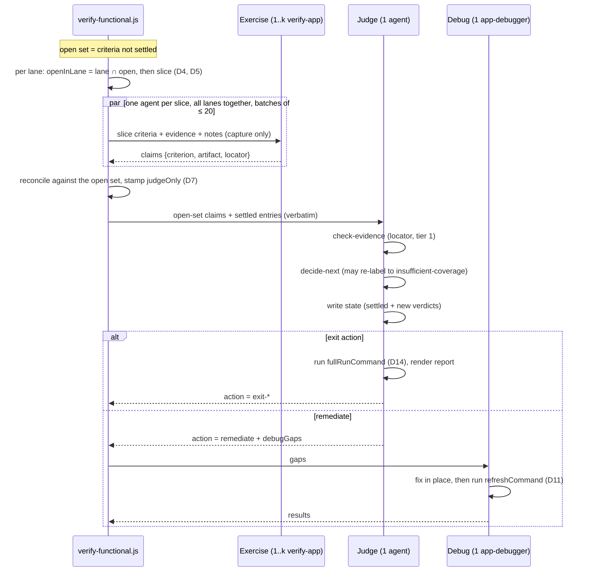
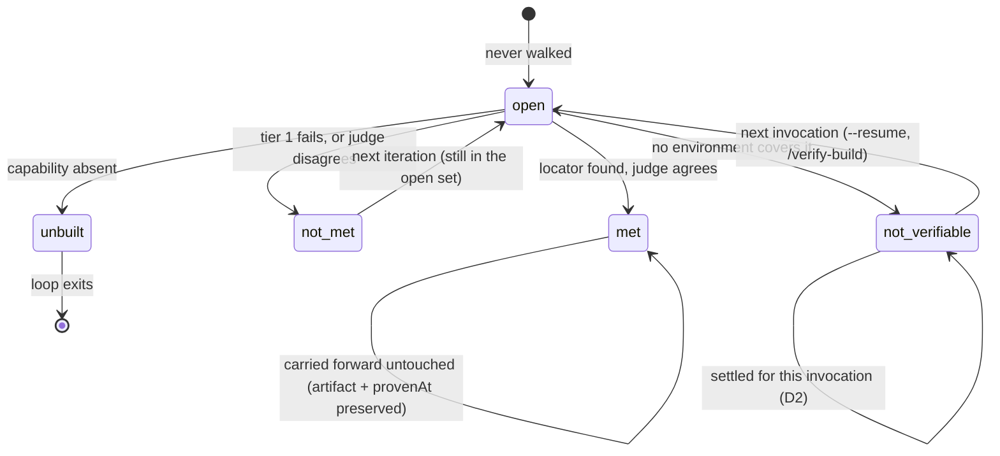

# TRD: Verification Convergence

**Version**: 1.5.0
**Status**: Draft
**Created**: 2026-09-26
**Last Updated**: 2026-09-26
**Author**: @technical-architect
**Source PRD**: `docs/plan/verification-convergence.investigation.md` (medium-weight `/plan` record; its own source brief is `docs/plan/verification-parallelism.brief.md`)
**Task ID Prefix**: VCON

---

## Changelog

| Version | Date | Changes | Author |
|---------|------|---------|--------|
| 1.0.0 | 2026-09-26 | Initial TRD creation | @technical-architect |
| 1.1.0 | 2026-09-26 | Applied a verified correction list. **Buildability**: the exerciser can now actually supply the `locator` the tier-1 check needs (VCON-B003, its own phase-1 task); the criterion table's `Tier 1` column is parsed before anything asserts on it (VCON-B004, same); `exerciseConcurrency` defaults to `1` instead of throwing; the slice formula's dead `, 20` is gone; and the Judge is told what to do with a `skipped` tier-1 verdict. **Sequencing**: `--resume` alone no longer re-enters verification after the default flip; the end-to-end walk splits so its evidence assertions ship before the flip; the wall-clock pricing task leaves the phase graph. **Splits**: the carry-forward task became three (carry-forward / coverage vocabulary / full-environment gate) and the slicing task became two (capture-repair boundary first, then slicing). **Corrections**: `packages/full/{lib,workflows}` are symlinks, not a third copy; vocabulary moves from "wave" to "batch"/"slice"; D13 is digests only, with a delivery path to existing projects; the `satisfied`-with-mass-`not_verifiable` gap in D8 is stated rather than closed (OQ-7) | @technical-architect |
| 1.2.0 | 2026-09-26 | Applied `/audit-trd` findings (5 of 5 verifiers reporting; source `docs/plan/verification-convergence.investigation.md`). **Citation collision fixed**: five bare `NG4` references meant the SIBLING TRD's non-goal while this document defines its own different `NG4`; they are now `FV-NG4`, matching the `FV-D2`/`FV-D11` convention already in use. **Contradiction closed**: `functional-verification.md` §3.7 stated the opt-in default in prose while §1.2 marked it superseded — D16's sync range now includes §3.7, with Step 9's outcome list going to VCON-D001 and the flag polarity to VCON-B014, which is where it becomes false (no phase-3→phase-4 dependency added). **D5 made checkable**: the concurrency gate's *"already reachable"* named no declared cell, so it could only be satisfied by a probe (NG7 forbids) or a new column (OQ-3 rejects); it now reads three named cells, and VCON-B012/B013 must name all three. **D2 clarified**: `unbuilt` is in the settled map for report/state-file symmetry, not for open-set shrinkage — `decideNext` exits terminally on the first `unbuilt` verdict, so no later pass consults it. Two index-paraphrase findings and one "missing file" finding rejected | @technical-architect |
| 1.3.0 | 2026-09-26 | Applied the owner's refinement: six issues and seven open-question answers. **The concurrency rule is replaced, not tuned.** D5 derived a budget of `1` unless EVERY declared environment was read-only, reachable AND never-restarted — "if anything is exclusive, serialize everything". Under it an iOS-simulator project and a project holding one undeletable probe row both sit at `1` permanently, so the fan-out this TRD builds would have shipped as dead code with a test suite. The owner declares instead **how many of each resource may exist at once** (`verification.md`'s new §1a), and the orchestrator resolves those counts into **lanes**: criteria contend only for the resource they need, and a budget of 1 follows from every open criterion needing one singular resource — never from one exclusive resource existing somewhere in the declarations. New objective O12; new argument `exerciseLanes` replaces `exerciseConcurrency`; D4, D5, D12, D15, §3.3, §3.5 and §3.7 rewritten around it. **Open questions closed by the owner**: OQ-1 the coverage floor stays unset; OQ-2 an agent MAY create simulators or containers up to the declared count, which **supersedes NG8**; OQ-3 counts are declared, not derived from the read-only column; OQ-5 the coverage denominator is every criterion; OQ-7 yes — `exit-satisfied` is re-labelled below the floor, which combined with OQ-1 means that branch ships built, unit-tested and **dormant until a floor exists**; OQ-4 (`SLICE_SIZE = 8`) and OQ-6 (exact literal matching) keep their stated defaults as decisions. **REMOVED**: `VCON-D002`, the wall-clock pricing document — a doc with no consumer — and with it O6's *"priced before or alongside the flip"* clause; the default flip ships unpriced and this document says so rather than carrying a task that gates nothing. Six tasks removed by merging producer/consumer seams: the locator supply and the `Tier 1` column parse into the locator check they exist for; the loop's exit vocabulary into the carry-forward it travels with; `/verify-build`'s command surface into `/implement-trd`'s (one author for one rule stated twice); the sibling TRD's flag polarity into its own sync task; the pre-flip and post-flip live walks into one. 18 tasks → 12, five phases → four. The capture/repair boundary stays split from slicing, because §7.3's contingency turns on that seam existing in the history | @technical-architect |
| 1.3.1 | 2026-09-26 | Re-audited against `docs/plan/verification-convergence.decisions.md` (5 of 5 verifiers reporting). **D5 rule (iv) was unbuildable as written**: it routed criteria needing no environment into a `resource: null` remainder lane while deriving no `concurrency` for it, and §3.3 requires one on every lane — so an implementer had to invent either a throttle of 1 (the opposite of "unconstrained") or an unbounded number the document nowhere authorises. The rule now states that lane's concurrency is its own criterion count, so §3.5's `Math.min` cannot bind on it, and that the lane is omitted rather than emitted at `concurrency: 0`; §3.3, §3.5 and VCON-B009's acceptance criterion say the same. **§5.4's arithmetic corrected**: the two hot files carry seven of twelve tasks, not six (B001 is in both). **OD-2 reconciled in §4.5**: the flip is in this TRD and on this branch, and the phase-4 boundary is a `Touches` collision between VCON-B009 and VCON-B010, not staging — flagged for the owner rather than folded unilaterally. One finding rejected: the `parallel()` / `MAX_PARALLEL_REGIONS` conflict is already a `## Could Not Verify` row, now sharpened with the code read | @technical-architect |
| 1.4.0 | 2026-09-26 | **AMEND-001**, from reviewing the `lightning-lane` run this plan was built from (11 criteria proven at 08:27, 46 by 16:51, across ~20 hand-sequenced invocations). Two additions, both to VCON-B007, no new task and no new phase. **(a) A `Parts` column.** That run's FS-60 folds THIRTEEN source acceptance criteria into one line whose evidence is 32 design frames paired against 32 PNGs. It can only ever report failure until all 32 match: fixing 30 moves the count 0 to 0, and its own report shows 2 frames driven on the current build, 26 resting on screenshots older than that morning's fixes, 3 with no screenshot anywhere and 1 unreachable locally — four different states under one verdict. Nothing in the pipeline notices a criterion has 32 parts, so nothing warns it cannot pass incrementally and nothing tracks 30-of-32 as progress. `Parts` comes from the criterion's own sentence, never inferred, and it REPORTS rather than measures: tracking needs per-part locators, which is the same task's locator work. **(b) Alignment artifacts.** The existing `Evidence that would prove it` column is strengthened, NOT duplicated, to require evidence that the build matches what was REQUESTED where the criterion is about matching a design, spec or contract — a screenshot against its design, a control-flow trace against the specified flow — as distinct from evidence the code ran. Considered and rejected: a second column, which would make the contract's fenced example eight wide to say what one instruction says better. **Neither helps FS-60 itself**, which already exists and would need re-deriving or hand-splitting; both help the next feature | @claude |
| 1.5.0 | 2026-09-26 | Two owner decisions. **(a) `not_verifiable` reopens on a new invocation.** It stays settled within one run — nothing can deploy mid-run, so a retry there fails the same way — but a resumed run or a later `/verify-build` now reloads only `met` as settled. Before this, the saved `not_verifiable` entries were reloaded as closed, so an owner who unblocked an environment and resumed got those criteria carried forward untouched, the opposite of what they asked for. D2, §3.4, the state diagram, NG4 and VCON-B004 changed. **(b) The flip merges into the command-surface task.** VCON-B010 (the `--verify` default flip) edited the same `implement-trd.md` regions as VCON-B009, which is why it sat alone in a fourth phase; the owner's reading is that two tasks editing the same regions of the same file should be one task. VCON-B010 is folded into VCON-B009, Phase 4 is gone, and VCON-D001 and VCON-T001 move into Phase 3 behind VCON-B009. VCON-B009's acceptance criteria now also name `verify-build.md`'s *"Why this exists separately"* rationale, which the flip makes false and no task previously owned. Two `## Could Not Verify` rows closed (OD-2's phase question, and that rationale). 12 tasks → 11, four phases → three | @claude |

**Task ids were renumbered in 1.3.0.** Rows above use the ids as they stood when they were
written; this is the map, so a reference in an older row still resolves: B001 + B003 + B004 →
**B001**; B002 → **B002**; B005 → **B003**; B006 + B007 → **B004**; B008 → **B005**; B009 →
**B006**; B010 → **B007**; B011 → **B008**; B012 + B013 → **B009**; B014 → **B010**; T001 + T002 →
**T001**; D001 → **D001**; D002 → **removed**. **In 1.5.0, B010 was merged into B009**; a later
reference to B010 means the flip half of B009.

---

## 1. Overview

### 1.1 Technical Summary

The functional-verification loop re-walks every criterion on every iteration and gates evidence
by asking whether a file exists. Both facts are what stop it converging: a run proved 11 of 62
criteria in 101 minutes, exited under the name `stuck`, and one jest log satisfied the evidence
gate for 25 different criteria.

This TRD makes six changes, all inside the loop that already exists (`verify-functional.js` and
`functional-verification.js`) rather than beside it:

1. **The open set shrinks, and it fans out per resource.** The script carries settled verdicts
   forward and hands each Exercise pass only the criteria still unproven, sliced to what one walk
   of the system can cover. How wide it fans out comes from one declared number per resource —
   **how many of that resource may exist at once** — so criteria contend only for the resource
   they need and everything else runs in parallel regardless. A run is serial when every open
   criterion needs the same singular resource, not because one exclusive resource exists
   somewhere in the declarations.
2. **Tier 1 resolves a locator inside the artifact.** A claim becomes `{criterion, artifact,
   locator}` and `checkEvidence` opens the file. Attaching a log stops being enough. Criteria
   whose only possible evidence is pictorial are marked judge-only at authoring time and skip
   tier 1 rather than failing it.
3. **Capture and repair never interleave.** Exercise captures and nothing else; the Debug stage
   applies fixes *and* refreshes the environment, between passes.
4. **A run that verified little says so — including a run that "passed".** A new terminal
   outcome `insufficient-coverage`, plumbed through every consumer, with the ratio and the
   membership of the uncovered set in the report. It re-labels any exit except `unbuilt`, and that
   includes `satisfied`: a run whose criteria mostly resolved `not_verifiable` has no gaps, so it
   exits `satisfied` at near-zero coverage today, and that is the shape an unfilled
   `verification.md` guarantees (OQ-7, owner-answered). **The floor itself stays unset** (OQ-1),
   so this branch ships built and unit-tested against an explicit floor and does not fire in
   production until the owner sets a number — the two answers interact, and §3.2 states the
   interaction rather than leaving a reader to discover that nothing relabels yet.
5. **The declarations get four things they cannot express today**: how many of each exclusive
   resource may exist at once (the new §1a, and the whole of change 1's input), whether the loop
   may write data to an environment, a cheap iteration refresh distinct from a full deploy, and
   `preview` as the default target ahead of `dev`/`staging`/`production`.
6. **`--verify` becomes the default**, `--no-verify` opts out — sequenced last, because before
   1–4 land the default would make 11-of-62 the standard experience.

Nothing here adds a second loop, a capacity model, or an environment probe. Capacity is **read**
from a number the owner wrote down; it is never inferred from a URL, a runtime or an environment
name. Every input the loop needs already exists somewhere and is not being read; the shape of this
work is overwhelmingly *read what is already produced*.

### 1.1a Objectives, and where each comes from

Every `Serves` reference in this document resolves here. Nothing in this table was invented by
this TRD; the right-hand column is where each one is written down.

| ID | Objective | Source |
|----|-----------|--------|
| O1 | An iteration exercises only the criteria not yet proven, so the loop's open set shrinks monotonically instead of being re-walked whole | PRD O1 — measured: 62 criteria re-walked 3 times proved 11 in 101 min; the same criteria as 4 sized slices with repairs held back closed 21 more in 28 min `[ran]` |
| O2 | A criterion's tier-1 evidence check resolves a locator INSIDE the claimed artifact, so attaching a file cannot satisfy it | PRD O2 — one jest log was cited by 25 criteria and passed the existence gate for all 25; `checkEvidence` never opens the file `[ran]` |
| O2a | A criterion whose only possible evidence is pictorial is marked judge-only at authoring time and **skips** tier 1 rather than failing it. Tier 1 cannot check image evidence | PRD O2's Intended Change, stated there as a limit |
| O3 | Evidence-gathering and repair do not interleave within one pass | PRD O3 — 2 proven criteria reverted when a rebuild landed between capture and judgement; the `cap: 1` run rebuilt nothing and reverted nothing `[ran]` |
| O4 | A run that verified little exits under a name that says so, not `stuck` and not `satisfied`, and the report names the ratio and the members of the uncovered set. All three consumers of the outcome value handle the new one, or a finished run is resumed forever | PRD O4, extended to the `satisfied` case by the owner's answer to OQ-7 (2026-09-26) |
| O5 | The owner's environment declarations can express how many of each exclusive resource may exist at once, read-only access, a cheap iteration refresh distinct from a full deploy (where the end-of-run full run is a gate that fails loudly), and a disposable per-branch target | PRD O5, extended from three additions to four by the owner's answer to OQ-3 (2026-09-26) |
| O6 | `--verify` is the default, with `--no-verify` to opt out | PRD O6 (owner decision, 2026-09-26). **The brief's *"price the wall clock before or alongside this flip"* clause is withdrawn** — owner instruction, 2026-09-26: the pricing document had no consumer. The flip ships unpriced; see the Departures note |
| O12 | The exercise budget follows from a declared count per resource — how many may exist at once — so criteria contend only for the resource they need and everything else runs in parallel regardless. **A budget of 1 must follow from every open criterion contending for the same singular resource, never from one exclusive resource existing somewhere in the declarations** | Owner instruction, 2026-09-26: *"understand exclusive resources and managing them vs only allowing a single, serialized agent to USE them"*, with the worked case *"in lightning-lane, the session we're using as our template, it was relatively trivial to fire up 4 simulators"* |
| O7 | The loop never writes to, deploys to, restarts or reads an environment the owner declared `must not be touched` | `domain-derived`: an irreversible side effect on a shared system cannot be undone by a later iteration, which is what separates it from an ordinary correctness defect. Named in PRD O5's rationale — `gcats` records a probe row that can never be removed, the hazard that manufactured the source run's one false defect |
| O8 | Unit test coverage ≥ 60% | `constitution.md` Quality Gates |
| O9 | Integration test coverage ≥ 50%, where applicable | `constitution.md` Quality Gates |
| O10 | `packages/core/lib/functional-verification.test.js` and `packages/core/workflows/verify-functional.test.js` stay green | PRD Grounding `[ran]` — these are named there as the suites this work must keep green |
| O11 | Every `packages/core/{lib,workflows,commands,contracts}` file and its `.claude/…` mirror stay byte-identical | `test/integration/tests/runtime-integrity.test.sh` — an existing enforced gate, not a target set here |

### 1.2 Key Technical Decisions

| ID | Decision | Choice | Serves Objective | Rationale | Alternatives Considered |
|----|----------|--------|------------------|-----------|------------------------|
| D1 | Where open-set scoping lives | In `verify-functional.js`: the script keeps a `settled` map across iterations, seeded from `resume`, and builds each pass's open set from it | O1 | The script already owns control flow and already has the criterion list; the Judge owns disk and the Exercise agents own the system. Adding scoping anywhere else splits the loop's state across two owners. **This widens a judgement the file already makes rather than introducing a new mechanism**: `skipExercise` (`verify-functional.js:494-503` `[read]`) already skips Exercise wholly when Debug reported unbuilt gaps, and its own comment carries the entire argument — *"re-walking the system to rediscover that the code is missing is exactly the waste this skip exists to avoid"*. O1 generalises that from one special case to every settled verdict | (a) An outer implement/review/verify loop — rejected in the PRD's Decision: two capped loops give 9 attempts and two termination stories. (b) The Judge re-derives the open set each pass — rejected: the Judge is an agent, and the open set is arithmetic. **Revisit** if the settled map ever needs to outlive one workflow invocation by more than `resume` carries |
| D2 | What counts as settled | Within one invocation, `met`, `not_verifiable` and `unbuilt` are settled; never-walked and `not_met` are open. **Across invocations only `met` carries over**: a resumed run or a later `/verify-build` reloads `met` as settled and puts every previous `not_verifiable` back in the open set (owner, 2026-09-26) | O1 | `not_verifiable` is an environmental blocker, and the PRD rejects retrying those in-session (43 of 96 needed a deploy that will not happen mid-run). **`unbuilt` is listed for state-file and report symmetry with the other two, NOT for carry-forward, and no test should assert carry-forward behaviour for it.** `decideNext` returns `exit-unbuilt` the moment `unbuilt.length > 0`, before it looks at gaps (`functional-verification.js:158-164` `[read]`), and D8 leaves that rule unchanged; the action is terminal (a non-null `outcome`, so `--verify --resume` will not re-enter it either). So the iteration that first produces an `unbuilt` verdict always ends the run, and there is no later pass — in this run or a resumed one — in which its presence in the settled map changes what gets re-walked. `met` and `not_verifiable` are the two that do work here | Re-walk `not_verifiable` every pass — rejected, same measurement. Keep `not_verifiable` settled across invocations too — rejected by the owner 2026-09-26: an owner who unblocks an environment and resumes expects those criteria tried, and §3.6a's preflight re-buckets them against the current `verification.md` before anything is walked. Omit `unbuilt` from the settled set entirely — rejected: the state file and the report both need its status carried, and a settled map that silently drops one of the four statuses is a trap for the next reader. **Revisit** when a post-deploy re-check list exists to receive `not_verifiable` (the brief's item 9 follow-on), or if `exit-unbuilt` ever stops being terminal |
| D3 | Iteration shape | Exercise fans out over slices; Judge and Debug stay one agent each | O1 | A human verifies a build by starting it once and walking the list. One Judge is the only thing that sees the whole state, and one Debug is what keeps repairs batched between passes (O3) | Fan out per criterion — rejected in the PRD: N exercisers means N startups competing for one port. Fan out the Judge too — rejected: independence is per-run, not per-criterion. **Revisit** if slice returns show the single Judge dominating an iteration's wall clock |
| D4 | Slice partition, per lane | Slices are computed **within a lane** (D5), never across the whole open set: `sliceCount(lane) = min(ceil(openInLane / SLICE_SIZE), lane.concurrency)`, `SLICE_SIZE = 8` as a named constant. At `lane.concurrency <= 1` that lane's open criteria are exactly ONE slice. Every lane's slices are dispatched together, in `parallel()` batches of at most 20 | O1, O12 | 8 is the brief's figure for "criteria with a stated scenario, not 62 and explore" (OQ-4 — a partition parameter, not a measured optimum; the owner kept it 2026-09-26). Collapsing to one slice at concurrency 1 preserves *start once, walk the list* for that resource: sequential slices within a lane would restart the system per slice, which is the waste the PRD's Decision names. Computing per lane is what makes O12 true arithmetically rather than by intent — a singular resource yields one slice and the rest of the run is unaffected by it | A single global `sliceCount` over the whole open set — **rejected: it is the defect O12 names.** One number cannot express "one holder of this, four of that", so the only safe global number is the minimum, which serializes everything behind the scarcest thing declared. A fixed slice count — rejected: it does not adapt as the open set shrinks, so late iterations dispatch agents with one criterion each |
| D5 | Where the exercise budget comes from | **READ, never probed, never modelled — one declared number per resource: how many may exist at once.** `verification.md` gains §1a, a resource table (D12). The orchestrator resolves it into **lanes** and passes them as one argument, `exerciseLanes: {resource, concurrency, createCommand, criteria[]}[]` (D15). The resolution rules, complete: (i) a resource's declared count IS its lane's concurrency — `N` a **pool** the loop may create and tear down up to, `1` a **queue** with one holder at a time, `0` **must not be touched**; (ii) an environment with no row in §1a counts as one resource of its own with count `1` — silence is a queue, never a pool; (iii) criteria needing the same count-1 resource share a lane, and transitively, so two singular resources that some criterion needs together form one lane; (iv) a criterion needing no environment at all — its evidence is a file already on disk — joins the unconstrained remainder lane (`resource: null`), **whose concurrency is that lane's own criterion count**, so §3.5's `Math.min` never binds and its slice count is set by slice SIZE alone: this is the one lane with no §1a row to read a count from, and "unconstrained" has to mean a number that cannot throttle it rather than the `1` rule (ii) would give a declared-but-silent environment. The remainder lane is emitted only when at least one criterion falls into it, since §3.3 rejects `concurrency: 0`; (v) a criterion needing a count-0 resource is in no lane and is marked `not_verifiable` at the preflight (O7); (vi) a pool lane dispatches **at most one instance per slice**, and at most `lane.concurrency` slices, so at most N instances exist — the count is enforced by the slice arithmetic, not by an agent's good faith — and the lane carries §1a's create/destroy command verbatim, so a slice never has to go and find one for itself; (vii) absent `exerciseLanes`, the workflow behaves as one lane of concurrency 1 over every criterion, which is exactly today | O1, O7, O12 | The PRD: *"Build a capacity reader, not a capacity model."* A count is the smallest thing that can be read and still answer the question; the previous rule tried to infer capacity from three permission cells and got "serialize everything" whenever any one of them said no. Rule (ii) is the safety direction: an owner who describes an environment but not its capacity gets a queue, so silence never over-subscribes a single dev server. Rule (vi) is what lets OQ-2's answer (an agent MAY create up to N) hold without an allocator: the ceiling is arithmetic. No ceiling argument is needed, because §3.5's batching already chunks slices at 20 — `CLAUDE_CODE_MAX_CONCURRENT_SUBAGENTS` per `constitution.md` | (a) **The previous rule — `1` unless every environment is read-only, reachable and never-restarted — rejected by the owner, 2026-09-26.** It is "if anything is exclusive, serialize everything": an iOS-simulator project and a project holding one undeletable probe row both derive `1` permanently, which ships this TRD's fan-out as dead code with a test suite. (b) A budget derived from the read-only column — rejected by OQ-3's answer: permission and capacity are different questions, and conflating them is how (a) happened. (c) Lanes keyed on runtime — rejected in the PRD: wrong unit. (d) Probing to establish capacity or reachability — rejected by NG7. (e) One global number instead of lanes — rejected, see D4. **Revisit** if a declaration needs to say that two resources are the same physical thing under two names, which §1a cannot express — or if a count turns out to be the wrong unit for a rate-limited third-party account, where the real constraint is requests per minute rather than instances at once. A count of `1` approximates that safely (one caller) and NG7 rejects rate limiting as its own concept, so the approximation is deliberate rather than overlooked |
| D6 | Tier-1 locator matching | Literal substring match on the artifact's decoded text, within a byte cap (`LOCATOR_SCAN_BYTES`), new failure `locator-not-found`, and a `truncated` flag on the result when the cap was hit | O2 | A regex supplied by an agent can be made to match anything (`.*`), which reinstates the hole the locator closes. A byte cap keeps `checkEvidence` usable against a 500 MB video without a new failure mode | Regex matching — rejected, above; **revisit** if exact matching proves brittle against a reporter's own line wrapping. Requiring the artifact to name its criteria — rejected in the PRD, refuted in both directions |
| D7 | How judge-only criteria skip tier 1 | The **definition** marks the row; `reconcileClaims` stamps `judgeOnly` onto the claim from the criterion row and discards any value the exerciser supplied; `checkEvidence` returns the already-declared-but-never-produced `tier1: 'skipped'` | O2a | If the exerciser could declare judge-only, every criterion it failed to assert against would become pictorial — the exact incentive the locator exists to remove. `'skipped'` is in `JUDGE_CRITERION_SCHEMA`'s enum today and is produced by nothing, so this costs no new vocabulary | Exerciser-declared judge-only — rejected, above. A separate judge-only list in args — rejected: the definition table is already the manifest. **Revisit** if authoring-time marking proves too coarse for mixed criteria (part text, part picture) |
| D8 | Where `insufficient-coverage` is decided, and which exits it can rename | In `decideNext`, as a **re-label of an exit**: computed after the existing chain has produced a base action, and applied to `exit-satisfied`, `exit-stalled` and `exit-stuck`. Never to `remediate` — a coverage rule that stopped a converging run would undo O1. Never to `exit-unbuilt` — "most of this was never built" is the truer statement and must win. The denominator is **every criterion** (`met / total`, OQ-5's owner-answered denominator), with the `not_verifiable` tally reported beside it | O4 | Re-labelling `satisfied` is OQ-7, answered YES by the owner on 2026-09-26, and it is the case that actually happens: a run whose criteria mostly resolved `not_verifiable` has no gaps, exits `satisfied` at near-zero coverage, and is the exact shape an unfilled `verification.md` guarantees. A hollow pass is the failure O4 exists to stop, and excluding it left O4 met only for the case it was written against. **The interaction with D9 is the thing to state plainly: with the floor unset, nothing is re-labelled in production.** This branch ships built, unit-tested against an explicit floor, and dormant | A standalone branch evaluated before the stall rule — rejected: it would end a run on iteration 1 of a healthy convergence. Re-labelling `exit-unbuilt` too — rejected, above. Leaving `exit-satisfied` alone — **the previous decision here, reversed by the owner**: it rested on OQ-5's denominator and OQ-1's floor being unsettled, and both are now settled |
| D9 | The coverage floor | `COVERAGE_FLOOR = null` — a named constant, explicitly unset, with `decideNext` reading `input.coverageFloor ?? COVERAGE_FLOOR`. The branch is reachable and unit-tested with an explicit floor; in production it does not fire until the owner sets one | O4 | OQ-1, confirmed by the owner 2026-09-26: leave it unset. The PRD's *"the floor is an open question, not a number to invent"* stands. The ratio and the uncovered membership are reported unconditionally, which is the half that needs no policy. **Read together with D8 this means the whole re-label — including the `satisfied` case the owner asked for — is dormant on delivery.** That is deliberate and it is the cheap failure direction: the code exists and one number turns it on | Pick a floor (50%, 25%) — rejected: any number is a policy choice the owner has not made. Omit the outcome until the floor exists — rejected: the PRD asks for the outcome reachable now, and the plumbing (D10) is the expensive half |
| D10 | Plumbing the new outcome | One task carries it to every consumer at once: `decideNext`, `OUTCOME_BY_ACTION`, `JUDGE_SCHEMA`'s action enum, `OUTCOME_LABEL`, the judge prompt's outcome list, and both commands' banner/terminality prose. It is **terminal** (a non-null `outcome`, never re-entered by `--verify --resume`) | O4 | The PRD: *"It is the only new value in a state machine two other things read… All three must handle the new value or a finished run is resumed forever."* Splitting the plumbing is how one consumer gets missed | Spread across the tasks that own each file — rejected: the window between them is a run that resumes forever |
| D11 | Who refreshes the environment | The **Debug** stage runs the declared fast-refresh command as its last act, after applying fixes. Exercise never builds, restarts or edits; it may bring a system up when nothing is running | O3, O5 | A rebuild between capture and judgement is what reverted 2 proven criteria. Debug is the agent that changed the code, it is a single agent, and it sits exactly between passes — where the PRD wants the rebuild. Putting the refresh in Exercise would also race N slices against one build | Refresh at the head of each Exercise pass — rejected: with concurrent slices that is N racing rebuilds, and at budget 1 it reopens the interleaving O3 forbids |
| D12 | The declaration additions | Four, not three. A **new §1a resource table** — `Resource` / `How many may exist at once` / `Which environments need it` / `How the loop creates and destroys one` — which is the only input D5 reads for capacity; `verification.md`'s §1 table gains a data-permission column (`read-only` / `may write` / `must not be touched`) and a `preview` row taught as the default; §2 gains a second command per environment, splitting a fast iteration refresh from the full deploy | O5, O7, O12 | The table is the entire policy (the PRD rejects framework rules keyed on environment name), so anything the loop must honour has to be expressible there — and after O12, capacity is one of those things. **§1a and the data-permission column answer different questions and must not be merged**: permission says what the loop may DO to an environment, capacity says how many of a thing may EXIST. The previous design read capacity out of the permission cells, which is precisely how "if anything is exclusive, serialize everything" got written. The create/destroy column is what makes OQ-2's answer usable — an agent may create up to N, with the owner's command, rather than inventing `xcrun simctl create` for itself. `lightning-lane` authorises production read-only in prose nothing can read, and `gcats` records an unremovable probe row — the hazard that manufactured the source run's one false defect | A free-text hazards paragraph — rejected: prose is what the current file already has and what nothing reads. Capacity as a fifth column on §1 — rejected: a resource is not one-to-one with an environment (a rate-limited third-party account is shared by several; one environment may hold a simulator pool and a singular database), so a per-environment cell cannot express it |
| D13 | Keeping the unfilled detector honest across a template change — and getting the new shape to projects that already exist | `isVerificationUnfilled` gains `KNOWN_UNFILLED_DIGESTS`: sha256 hashes of the SAME `normalize()` output the function already computes, one entry per prior template, and the function reports WHICH one matched. **Digests, not contents.** That one list is then read a second way — §3.6a reports *"your `verification.md` predates the resource / read-only / fast-refresh sections"* on a prior-template match, which is the only delivery path the new shape has to a project that already exists | O5, O12 | Two problems, one list. (a) `check-verification-unfilled` byte-compares a project's copy with the shipped template; change the template alone and every project holding an unfilled OLD copy silently reports *filled* — the exact failure 4.7.1's check was added to prevent. (b) `scaffold-project.sh`'s `refresh_rules()` refuses to refresh `verification.md` (its `AUTHORED_RULES` list, `:1248` `[read]`), so the new sections reach NEWLY scaffolded projects only, and every lane stays at concurrency `1` everywhere else indefinitely with nothing saying why. A prior-template match is precisely the signal *"this owner has never seen the new sections"*, so reporting it costs one line and no new mechanism. **Nothing writes a filled-in copy**: that file is owner-governed and the `--refresh` guard protecting it must not regress | Embedding the prior templates' normalised CONTENTS in the lib — **rejected**: roughly 4 KB of prose inside a module whose purity is load-bearing, to answer a yes/no question a 64-character hash answers. Structural detection (all cells empty) — rejected: brittle against a legitimately sparse but filled file. Accept the regression — rejected: it converts a working check into a lie. Refreshing the owner's copy automatically — rejected, above. **Revisit** if the digest list grows past a handful of entries |
| D14 | The end-of-run full-environment gate | The **Judge** runs the declared full command on any exit action except `unbuilt` / `not-run`, and its result enters the rendered report and the workflow's return. A failure does not change the outcome string; it appears on the report's Outcome line and in both commands' ISSUES | O5 | The report is written inside the loop by the Judge (one renderer, per the sibling TRD's FV-D3), so a gate run by the orchestrator afterwards could not reach the durable artifact — which is the "information present and unread" failure this whole plan is against. The criteria *were* proven against a running system; what failed is the full rebuild, and that is a defect to surface, not a reason to retract evidence | (a) Force `stuck` on a failed full run — rejected: it discards real evidence. (b) A sixth outcome — rejected: the state machine has two readers and D10 is already paying for one addition. (c) Run it in the orchestrator — rejected, above. **Revisit** if a failed full run is observed alongside a `satisfied` report and the banner is not loud enough to stop a ship |
| D15 | New workflow arguments | Three: `exerciseLanes` (an array of `{resource, concurrency, createCommand, criteria}`), `refreshCommand` (string), `fullRunCommand` (string). All resolved by the orchestrator, which already reads `verification.md` at its preflight | O1, O3, O5, O12 | The workflow has no filesystem by construction — every input arrives in args. The preflight is the one place that already reads the declarations, and it already resolves per criterion which environment that criterion needs, which is the other half of a lane. **A lane list rather than a number**: a number cannot say "one holder of this, four of that", and the one number that is always safe is the minimum — the defect O12 rejects. The lane carries §1a's create/destroy command as a fourth field for the same reason every other input is resolved by the caller: an Exercise agent reading a markdown table for its own permission is owner policy behind an agent's reading of it | Pass the raw `verification.md` text and let the loop parse it — rejected: it already arrives as `stackHints` prose for the agents, and asking prompt-DSL source to parse a markdown table puts owner policy behind an agent's reading of it. Keep `exerciseConcurrency` alongside the lanes — rejected: two arguments that can contradict each other, where the contradiction is the bug being fixed |
| D16 | The sibling TRD is amended, not forked | `docs/TRD/functional-verification.md` §3.2–§3.6 **and §3.7** are updated in place, and its `FV-D2`, `FV-D11` and `FV-NG4` are marked superseded by this document. **`FV-` prefixes throughout**: that document's `D2`, `D11` and `NG4` are different things from this TRD's own `D2`, `D11` and `NG4`, so every cross-reference to it carries the prefix | O4, O6 | `verify-build.md` §4 names that TRD's §3.3 as the authority on the argument list. Adding args without updating it leaves two commands dispatching against a spec that no longer describes the workflow. §3.7 is inside the range because it is the section that STATES the opt-in default in prose — *"Flag: `--verify`. Absent → nothing in this TRD executes"* and the Step 9 banner's `not run (--verify not set)` — so leaving it out would have that document simultaneously declare the default superseded (decision table) and describe it as current (command surface), and would also leave Step 9's outcome list without `insufficient-coverage`. **One task owns the whole of that file, and it runs after the default flip** (VCON-D001): an earlier version split §3.7's flag polarity into the flip task because a phase-3 task cannot depend on a phase-4 one, which was a seam invented to satisfy the phase graph rather than the document. Moving the sync behind the flip removes both the split and the reason for it | Leave it and let this TRD be the newer authority — rejected: two documents describing one interface is how the 15-field arg list drifted before. Leave §3.7 out and rely on the §1.2 supersession note — rejected: a reader looking up the command surface reads §3.7, not the decision table. Split the file between two tasks by section — rejected, above: it put the boundary where the phase graph wanted it instead of where the document's own seams are |

**Departures from the existing design corpus, stated:**

- **`FV-D2` (iteration shape: 3 agents)** — Exercise is now 1..k agents per iteration. Judge and
  Debug stay single (D3).
- **`FV-D11` (`--verify` opt-in, default off)** and **`FV-NG4` ("running by default" is a non-goal,
  *"cost is unmeasured"*)** — reversed by O6, an owner decision dated 2026-09-26. **The
  *"cost is unmeasured"* premise is not addressed, and the flip ships unpriced.** An earlier
  version carried a task (`VCON-D002`) that ran `run-profile.js` over the dispatch ledgers and
  wrote `docs/plan/verification-cost.md`; the owner removed it on 2026-09-26 as a document with no
  consumer, and withdrew O6's *"before or alongside this flip"* clause with it. The measurement is
  still available to anyone who wants it — the ledgers under `.trd-state/**/dispatch.jsonl` and
  `packages/core/scripts/run-profile.js` both already exist, and no new instrumentation is
  needed — but it is **not a task in this TRD and nothing waits on it**.
- **The contract's exercise discipline** (*"One exerciser, one boot, every criterion"*) becomes
  one boot per slice over that slice's criteria, plus an explicit capture-only prohibition.
- **`checkEvidence`'s purity note** (*"pure apart from `fs.statSync`"*) — it now reads file
  content too. Still no clock and no git, which is what the purity claim is load-bearing for.

### 1.3 Technology Stack

| Layer | Technology | Purpose | Notes |
|-------|------------|---------|-------|
| Deterministic half | Node.js 18+ (CommonJS) | `packages/core/lib/functional-verification.js` — tier 1, loop decision, report rendering | No clock, no git; `fs` only. Reached from the loop exclusively through its CLI |
| Loop | Workflow prompt-DSL (`packages/core/workflows/verify-functional.js`) | Control flow and agent dispatch | No `require`, no `fs`, no `child_process`, no `Date.now()` — enforced by source-level tests |
| Agents | verify-app (Exercise), untyped (Judge), app-debugger (Debug) | Exercise / judge / repair | Unchanged roster; `constitution.md`'s 13 agents |
| Declarations | Markdown (`.claude/rules/verification.md` + shipped template) | Owner-governed environment policy | An agent READS this and never writes it |
| Command surface | Markdown prompts (`implement-trd.md`, `verify-build.md`) | Argument resolution and dispatch | Mirrored into `.claude/commands/` |
| Tests | Jest ^29, BATS ^1.9, smoke (`test/smoke/`) | Unit, integration, `[LIVE]` end-to-end | Per `stack.md` |

### 1.4 Integration Points

| System | Type | Direction | Notes |
|--------|------|-----------|-------|
| `.claude/rules/verification.md` | File read | In | Owner-governed. Reaches the loop as `stackHints` (landed `53deea8`) and now also as three resolved args (D15) |
| `.trd-state/<feature>/verification-state.json` | File read/write | Both | Written by the Judge; read back by `/implement-trd` §3.6's terminality gate and as the `resume` snapshot |
| `.trd-state/<feature>/dispatch.jsonl` + `run-profile.js` | File read | In | **Not used by any task here.** Listed because it is where the loop's wall clock could be priced if the owner ever wants it; the task that did so was removed (see Departures) |
| `packages/core/contracts/functional-verification.md` | Text arg | In | Passed to every agent in the loop as `contract` |
| Artifact publish | Tool call | Out | Existing; the report already publishes under key `verification-report` |

---

## 2. System Architecture

### 2.1 Component Architecture

#### 2.1.1 `verify-functional.js` — the loop

**Responsibility**: own the bounded loop; hold the settled/open partition across iterations;
intersect each declared lane with the open set and slice within it; dispatch Exercise (1..k),
Judge (1), Debug (0..1).
**Interfaces**: `VerifyFunctionalArgs` in, `VerifyFunctionalResult` out (§3.3).
**Dependencies**: none at runtime — no `require`, no disk. Everything reaches it through `args`
and through the agents it dispatches.

#### 2.1.2 `functional-verification.js` — the deterministic half

**Responsibility**: tier-1 evidence checking (now including the locator), the loop-exit decision
(now including `insufficient-coverage`), report rendering (now including the coverage ratio and
the final-run result), and the unfilled-declarations check.
**Interfaces**: three exported functions plus the CLI that is the only path the loop has to them.
**Dependencies**: `fs` only.

#### 2.1.3 The orchestrating commands

**Responsibility**: resolve inputs from disk — including the three new args derived from the
owner's declarations — dispatch once, render what comes back.
**Interfaces**: `/implement-trd` §3.6a and §8.3; `/verify-build` §2 and §4.
**Dependencies**: `verification.md`, `implement.json`, `success-definition.md`.

### 2.2 One iteration, with the capture/repair boundary

The ordering constraint O3 states is the point of this diagram: every repair and every rebuild
sits between two passes, never inside one.



### 2.3 A criterion's life across iterations



---

## 3. Technical Specifications

### 3.1 Tier 1 — `checkEvidence()` with a locator

**Purpose**: make attaching a file insufficient.

```typescript
interface Claim {
  criterion: string;
  artifact: string | null;
  locator: string | null;   // a literal string that must appear INSIDE artifact. SUPPLIED BY THE
                            // EXERCISER -- VCON-B003 adds it to EXERCISE_SCHEMA and to the
                            // Exercise prompt's returned-shape line (§4.2)
  reason?: string;          // present when artifact is null
  judgeOnly?: boolean;      // stamped by reconcileClaims from the DEFINITION, never by the agent (D7)
}

type EvidenceFailure =
  | 'no-artifact' | 'missing' | 'not-a-file' | 'empty' | 'stale'
  | 'no-locator'          // an artifact was claimed, the criterion is not judge-only, no locator given
  | 'locator-not-found';  // the artifact exists and is fresh, and does not contain the locator

interface EvidenceResult {
  criterion: string;
  tier1: 'pass' | 'fail' | 'skipped';
  artifact: string | null;
  bytes: number | null;
  mtimeSec: number | null;
  locator?: string | null;
  truncated?: boolean;     // the scan stopped at LOCATOR_SCAN_BYTES
  failure?: EvidenceFailure;
}
```

**Behaviour**:

- Existing order is preserved: `no-artifact` → `missing` → `not-a-file` → `empty` → `stale`.
  The locator check is appended **last**, so it only ever runs against a file that already
  cleared every cheaper condition.
- `judgeOnly: true` short-circuits to `tier1: 'skipped'` before any stat. A judge-only criterion
  is neither passed nor failed by tier 1; the Judge reads its content or its reason and rules.
  `'skipped'` already exists in `JUDGE_CRITERION_SCHEMA`'s enum and is produced by nothing today.
- Matching is a literal substring search over the artifact decoded as UTF-8, reading at most
  `LOCATOR_SCAN_BYTES` (2,000,000). Not a regex (D6). Where the cap was hit and the locator was
  not found, the result carries `truncated: true` alongside `locator-not-found`.
- A non-judge-only claim with an artifact and no locator fails with `no-locator`. This is a
  *claim-shape* failure, not a verdict: the Judge may still read the stated reason.

**The producer ships in the same task as the check.** `EXERCISE_SCHEMA` is
`additionalProperties: false` with claim properties exactly `criterion` / `artifact` / `reason`
(`verify-functional.js:283-303` `[read]`), and `buildExercisePrompt`'s returned-shape instruction
(`:164-166` `[read]`) never asks for a locator — so today the exerciser both cannot supply one and
would be rejected for trying. Ship `no-locator` on its own and EVERY non-judge-only criterion
fails it, which is strictly worse than the existing-file gate it replaces. An earlier version of
this plan split the supply into its own task and then spent a paragraph arguing it had to land in
the same phase; **VCON-B001 now carries the check, the supply and the judge-only marker together**,
because none of the three is worth anything without the other two.

**Stated limit, carried into the contract**: tier 1 cannot check image evidence. A screenshot
contains no text a locator can resolve. This is why assertions matter more than screenshots, and
why judge-only is an authoring-time decision rather than a fallback the exerciser can reach for.

**Error handling**:

- Unreadable file after a successful `stat` (permissions, a race) → `missing`, same as a failed
  `stat`. The distinction is not useful to a judge and inventing a seventh failure for it is not.
- A non-UTF-8 artifact decodes lossily and the search runs on the result. A binary artifact
  therefore fails `locator-not-found`, which is the correct answer for a criterion that should
  have been marked judge-only.

### 3.2 Loop exit — `decideNext()` with a coverage re-label

```typescript
interface DecideNextInput {
  iteration: number;
  gaps: string[];
  unbuilt: string[];
  previousGaps: string[] | null;
  met: string[];                    // NEW — membership, so the reason can name the ratio
  total: number;                    // NEW — the definition's criterion count
  coverageFloor?: number | null;    // NEW — defaults to COVERAGE_FLOOR (null, unset: OQ-1)
  cap?: number;
}

type DecideNextAction =
  | 'exit-satisfied' | 'exit-unbuilt' | 'exit-stalled' | 'exit-stuck'
  | 'exit-insufficient-coverage'    // NEW
  | 'remediate';
```

**Behaviour** — evaluation order is the specification:

1. `unbuilt.length > 0` → `exit-unbuilt`. Unchanged, and **not** re-labelled by coverage: "most
   of this was never built" is the truer statement.
2. `gaps.length === 0` → base action `exit-satisfied`.
3. The stall rule and the cap rule are evaluated exactly as today, producing a base action of
   `exit-stalled` or `exit-stuck`.
4. **The re-label**: where step 2 or step 3 produced an exit *and* `coverageFloor` is non-null
   *and* `total > 0` *and* `met.length / total < coverageFloor`, the action becomes
   `exit-insufficient-coverage`. Its `reason` names the ratio, the members of the uncovered set,
   and the base cause it replaced.
5. Otherwise `remediate`. **A `remediate` is never re-labelled** (D8) — a coverage rule that
   could stop a converging run would undo O1.

**`exit-satisfied` is re-labelled, and that is the case that actually happens** (OQ-7, owner
answer 2026-09-26): a run whose criteria mostly resolved `not_verifiable` has no gaps, so it
reaches step 2 at near-zero coverage. Excluding it left a hollow pass reading `satisfied` — the
failure O4 exists to stop.

**And with the floor unset it never fires.** `COVERAGE_FLOOR = null` (D9, OQ-1), so on delivery
this whole branch is built, unit-tested against an explicit floor, and dormant: no run's name
changes until the owner sets a number. The two answers have to be read together or the delivered
behaviour reads as a bug — a `satisfied` report at 18% coverage is the expected output of this
work, until a floor exists.

`met` and `total` are validated in the same style as `gaps`/`unbuilt` today: a missing `met`
would read as "nothing proven" and could re-label a healthy exit, so it throws rather than
defaulting.

### 3.3 The loop — `VerifyFunctionalArgs` additions

```typescript
interface ExerciseLane {
  resource: string | null;   // the §1a resource this lane contends for; null = the
                             // unconstrained remainder (criteria needing no environment)
  concurrency: number;       // the resource's DECLARED count: how many may exist at once.
                             // 1 = a queue (one holder); N = a pool the loop may create up to.
                             // On the remainder lane there is no declared count: it carries its
                             // own criteria.length, so slice SIZE alone bounds it (D5 rule iv)
  createCommand: string;     // §1a's create/destroy command, verbatim. "" = this lane's slices
                             // may NOT create an instance; they use what is already running
  criteria: string[];        // criterion ids assigned to this lane, by the orchestrator (D5)
}

interface VerifyFunctionalArgs {
  // ...the 15 existing fields, unchanged...
  exerciseLanes: ExerciseLane[];  // NEW — DEFAULTS to one lane of concurrency 1 over every
                                  //       criterion, which is exactly today's behaviour.
                                  //       Resolved from verification.md §1a by the caller (D5).
  refreshCommand: string;         // NEW — the FAST per-iteration refresh, run by Debug (D11).
                                  //       "" when the environment cannot be refreshed by the loop.
  fullRunCommand: string;         // NEW — the FULL deploy/build, run once by the Judge at exit
                                  //       (D14). "" when none is declared.
}

interface VerifyFunctionalResult {
  outcome: 'satisfied' | 'unbuilt' | 'stalled' | 'stuck' | 'insufficient-coverage';  // NEW value
  // ...existing fields...
  coverage: { proven: number; total: number; uncovered: string[] };  // NEW
  finalRun: { command: string; status: 'pass' | 'fail' | 'skipped' } | null;  // NEW (D14)
}
```

**Validation**: `exerciseLanes` **defaults to `[{resource: null, concurrency: 1, createCommand: "",
criteria: <every id>}]`** when absent or empty — exactly today's behaviour, one Exercise agent over
the whole open set. A value that IS supplied is validated: it must be an array, each lane's
`concurrency` a positive integer (so `0`, a negative, a non-integer and a non-number all throw),
each lane's `criteria` an array of ids **present in the definition** (an unknown id throws, the same
standard `reconcileClaims` already applies to a claim), and no id may appear in two lanes.
`createCommand` defaults to `""`, which is the safe direction: a lane with no command withholds
permission to create whatever its count says.

**The remainder lane is not a special case in this validation.** The caller resolves its
`concurrency` to its own `criteria.length` (D5 rule iv), so it arrives as an ordinary positive
integer and the workflow needs no `null`-resource branch; a remainder lane with no criteria is not
emitted at all rather than arriving as `concurrency: 0`. The defaults-when-absent lane keeps
`concurrency: 1`, because that case means *no declarations were resolved*, which is today's
behaviour and not an unconstrained one.

**A criterion in NO lane is not an error and is not silently dropped.** It is a criterion the
declarations reach no environment for — including one whose resource is declared `0`, must not be
touched (D5 rule v, O7). The loop exercises it in no slice and synthesizes one claim for it,
`{criterion, artifact: null, reason: 'no exercise lane: the declarations reach no environment
that covers this criterion'}`, using the same device the loop already uses for a dead Exercise
agent (`verify-functional.js:513-516` `[read]`). The Judge then rules `not_verifiable` from that
reason, which is what its STEP 2 already does with a stated reason. Left out of the claims
entirely it would stay open forever and burn the iteration cap.

Lanes do not follow `cap`'s throw-on-absence rule, and the analogy to `cap` is false: `cap` has no
safe default, whereas one serial lane is exactly today's behaviour. Throwing on absence would
break BOTH commands for the entire window between the task that adds the throw and the tasks that
pass the value. `refreshCommand` and `fullRunCommand` default to `""` for the same reason, and
because absence is a legitimate declaration.

### 3.4 The settled/open partition

**Purpose**: the loop's memory. Held in the script, seeded from `resume`, never re-derived by an
agent.

```typescript
type Settled = Map<string, {
  status: 'met' | 'not_verifiable' | 'unbuilt';
  tier1: 'pass' | 'fail' | 'skipped';
  artifact: string | null;
  reason: string | null;
  provenAt: number;              // NEW — the iteration this verdict was established
}>;
```

**Behaviour**:

- Seeded from `resume.criteria` by filtering for **`met` only** (D2). A `not_verifiable` entry from
  a previous invocation goes back in the open set: the preflight has re-read `verification.md`
  since, and an environment the owner unblocked is what a resume is for. Within one invocation a
  `not_verifiable` verdict moves into the map and is not re-walked. (Today the same snapshot is
  filtered for `not_met` to seed `previousGaps`; that stays.)
- **`unbuilt` is in the type for symmetry, not for shrinkage.** `decideNext` exits terminally on
  the first `unbuilt` verdict before it looks at gaps, so no later pass ever consults an `unbuilt`
  entry in this map (D2). It is carried because the Judge writes the state file and the report
  from this map and needs every status, not because it changes an open set.
- `openSet = CRITERIA.filter(c => !settled.has(c.id))`.
- After each Judge return, entries whose status is settled move into the map with
  `provenAt: iteration`. A `not_met` verdict stays out of the map and remains open.
- `reconcileClaims` maps over the **open set**, not over `CRITERIA`. Left unchanged it would
  report every carried-forward criterion as unwalked — the PRD names this as the likeliest place
  to break a correct run.
- The `exercised` label becomes `<walked>/<openSet.length>` for the iteration, and the final
  result's `coverage` reports `proven`/`total` over the whole definition. These are two different
  denominators on purpose: one is this pass's reach, the other is the run's.
- The Judge prompt carries the settled entries **verbatim** with an instruction to write them
  into the state file and the report input unchanged and not to re-judge them. The Judge is the
  writer of both files, so it must see every criterion even though it rules on only the open set.

**The Judge's STEP 2 must be taught `skipped`.** `buildJudgePrompt`'s STEP 2 branches on tier-1
`pass` and `fail` only (`verify-functional.js:196-200` `[read]`): *"only for the criteria whose
tier-1 verdict just came back `pass`, read the evidence artifact's content… A criterion whose
tier-1 verdict is `fail` is `not_met` unless its stated reason shows it is genuinely
`not_verifiable` here"*. `'skipped'` matches neither branch, so a judge-only criterion would
reach the Judge with no defined handling at all — the D7 mechanism's whole point lost between the
lib and the prompt. STEP 2 gains a third clause: **a criterion whose tier-1 verdict is `skipped`
is judge-only. Read its artifact's content and rule on it directly, or rule on its stated reason
when it claimed no artifact. There is no tier-1 gate in front of it, and its absence from the
`pass` list is not evidence against it.**

**Error handling**: a Judge return that contains an entry for a settled criterion is ignored for
that criterion (the carried-forward entry wins) and logged. The alternative — letting a
re-judgement overwrite a proven verdict — would make the open set non-monotonic, which is the
one property O1 asks for.

### 3.5 Slice partition, per lane, and the Exercise prompt

```
for each lane of exerciseLanes:
  openInLane = lane.criteria ∩ openSet          // order follows the definition
  sliceCount(lane) = lane.concurrency <= 1
    ? (openInLane.length > 0 ? 1 : 0)
    : Math.min(Math.ceil(openInLane.length / SLICE_SIZE), lane.concurrency)

slices = concat over lanes, dispatched together in parallel() batches of at most 20
```

Slices are contiguous and balanced within their lane — `ceil`-sized, remainder in the last.

**Worked example, one lane.** 20 open at `concurrency: 4` gives **3 slices of 7 / 7 / 6**, not 4:
`ceil(20 / 8) = 3` is the binding term. That is the formula's point — the slice SIZE, not the
budget, is what keeps a slice to one walk of the system.

**Worked example, the one this rule exists for (O12).** Two lanes: a queue lane (`concurrency: 1`, an
undeletable probe row on a shared project) holding 9 open criteria, and a pool lane
(`concurrency: 4`, four simulators) holding 20. That iteration dispatches **1 slice of 9 plus 3
slices of 7 / 7 / 6 — four agents in one batch.** The exclusive resource gets exactly one holder
and does not serialize anything else. Under the rule this replaced, the same declarations produced
**one** agent over all 29 criteria, because one exclusive resource existed somewhere.

**Creating a pooled instance is allowed, and bounded by the arithmetic, not by good faith.** A
slice whose lane carries a non-empty `createCommand` may create one instance with it and must tear
it down before it returns; the slice prompt states the command and that bound. At most one instance
per slice and at most `lane.concurrency` slices means at most N instances exist — which is why
OQ-2's answer (an agent MAY create simulators, up to the declared count) needs no allocator and no
capacity model. A lane with an empty `createCommand` gets no such permission: its slices use what
is already running, whatever the count says. **The agent is never asked to read §1a for this** — the
command reaches it in its own prompt, already resolved.

**The formula does not cap `sliceCount` itself.** An earlier draft closed the `Math.min` with
`, 20`. That was dead arithmetic that also made the batching below unreachable. Slices are
dispatched through `parallel()` in batches of at most 20, following `sweep.js`, which chunks an
**uncapped** list into batches of ≤ 20 rather than capping the list
(`MAX_PARALLEL_REGIONS = 20` at `sweep.js:54`, chunking at `:163-166`, dispatch at `:232-233`:
`for (const batch of batches) results.push(...await parallel(batch))`). A slice past the first
batch runs in the next one and is never dropped. **The batching is now load-bearing rather than
defensive**: with lanes there is no single number for a caller to ceiling, so the sum of lane
concurrencies is what the platform's 20-slot pool has to absorb, and the workflow is the only
thing positioned to chunk it. It is exercised by passing lanes whose concurrencies sum to 25.

**Say "batch" and "slice", never "wave."** `verify-functional.test.js:106-111` asserts the source
matches no `/\bwaves\b/i` `[read]`. That is a *separate* assertion from the `parallel(` one
VCON-B009 deliberately changes, and this one is **not** being changed — a comment or identifier
containing "wave" fails the suite. Renaming the concept is cheaper than widening a source-level
guard whose job is to keep this workflow from drifting toward the phase-dispatch vocabulary it is
not.

**Pass a slice and defer; never re-schedule** (the PRD's Decision). A slice whose agent returns
nothing, or returns claims for criteria outside its slice, leaves those criteria open for the
next iteration; nothing redistributes mid-batch.

**`buildExercisePrompt` has three couplings to the full criteria set, and all three move.** The
function takes only `iteration` (`:148` `[read]`), so it has no way to receive a slice; it
interpolates the module-level `${N}` into *"walk every one of the following ${N} criteria"*
(`:155` `[read]`); and it serialises `criteriaJson()`, which is every `CRITERIA` entry (`:159`
`[read]`). Hand a slice agent 5 criteria under a prompt that says 62 and it will go hunting for
the other 57, which is the failure this whole change exists to stop. The function takes the
slice, the count comes from the slice, and the JSON is the slice's. `N` itself stays a
module-level constant — the `N === 0` branch still needs it — it simply stops being what `:155`
and `:159` read.

**The "stated scenario" needs no new input.** Each slice prompt carries its criteria *with* the
definition's `Evidence that would prove it` column, plus `.claude/verification-notes.md` — which
is where prior runs recorded ports, commands and tap requirements. Do not build a scenario
generator.

**Capture-only, stated in the prompt** (O3): the Exercise agent may bring a system up when nothing
is running, and — where its slice's lane carries a non-empty `createCommand` — create and tear down
one pooled instance; it may not edit source, rebuild, restart, or re-deploy. Anything it wants
repaired is returned as a claim with a stated reason. The refresh belongs to Debug (D11). **The two
permissions are different and must not be collapsed**: bringing up or creating an instance is how a
slice gets something to exercise; rebuilding is how two proven criteria reverted.

### 3.6 Report additions — `renderReport()`

- A `**Coverage**` line beside the existing `**Criteria**` tally: `<proven> of <total> proven`,
  and the membership of the uncovered set. Counts alone were what let iteration 2 hold at 4 while
  swapping which 4.
- A `Tier 1` column on the **Not Met** table, sourced from the `tier1` value the state file now
  persists (`53deea8`). It is what separates *never reached* from *reached and failed* — the
  source run's `tier1: fail` column ran 25 → 23 → 1 while real coverage went 4 → 4 → 11.
- A `Proven at` column on the **Met** table, from `provenAt`. Under carry-forward a `met` verdict
  may be several iterations old, and TR1 is the reason a reader needs to know which.
- `OUTCOME_LABEL` gains `'insufficient-coverage': 'Insufficient Coverage'`.
- An optional `finalEnvironmentRun: { command, status }` input, with three renderings and not
  two. `status === 'fail'` puts `(final full-environment run FAILED)` on the Outcome line —
  including when the outcome is `satisfied`, which is the case the suffix exists for.
  `status === 'skipped'` with an empty `command` puts `(no full-environment run declared)` there
  instead, because "nobody declared one" and "one passed" must not read the same (§3.7). A `pass`
  adds nothing; a clean line is the existing meaning of a clean result.

Unknown-status handling, cell escaping and the `satisfied (n of m not verifiable)` suffix are
unchanged.

### 3.7 The declarations — `verification.md` §1, the new §1a, and §2

**§1a is new, and it is the whole input to D5.** One row per resource the loop must not
over-subscribe, with the count stated as *how many may exist at once*:

| Resource | How many may exist at once | Which environments need it | How the loop creates and destroys one |
|----------|---------------------------|----------------------------|----------------------------------------|
| e.g. iOS simulator | 4 | local | `xcrun simctl create … / xcrun simctl delete …` |
| e.g. dev server on :3000 | 1 | local | — (never created; it is already up) |
| e.g. shared Supabase project | 1 | dev | — |
| production database | 0 | production | — |

The meanings are stated in the file itself, because the number is the only thing the framework
reads and a reader guessing at it is the failure this table exists to prevent:

- **`N`** — a **pool**. The loop may create and tear down up to N of them, using the command in the
  last column. At most one per exercise slice, so at most N slices touch it at once.
- **`1`** — a **queue**. One holder at a time. The loop never creates one.
- **`0`** — **must not be touched.** Criteria needing it resolve `not verifiable here` and are
  exercised by nothing (O7).
- **An environment with no row here counts as one resource of its own, with a count of `1`.**
  Silence is a queue, never a pool — so an owner who describes an environment and forgets its
  capacity gets today's serial behaviour, not four agents racing one dev server.
- **A blank create/destroy cell means the loop may not create one**, whatever the count says. A
  count of 4 with no command means "four already exist"; a count of 4 with a command means "make
  up to four".

The table names resources rather than adding a column to §1 because a resource is not one-to-one
with an environment: a rate-limited third-party account is shared by several environments, and one
environment can hold a simulator pool and a singular database at the same time.

§1 gains one column and one row. The `preview` row is listed **first** and taught as the default:

| Name | URL / how to reach it | What it is for | Loop may WRITE data? | Loop may DEPLOY to it? | Loop may RESTART it? |
|------|----------------------|----------------|----------------------|------------------------|----------------------|
| preview | | per-branch, disposable — **prefer this** | | | |
| local | | | | | |
| … | | | | | |

Permitted values for the new column: `read-only`, `may write`, `must not be touched`. The
column's meaning is stated in the file itself: *read-only* authorises exercise that mutates
nothing — no records created, no rows written; *may write* authorises exercise that does;
*must not be touched* forbids the loop from reaching that environment at all, including for reads.

**This column is a permission, not a capacity, and the two are deliberately not the same cell.**
It says what the loop may DO to an environment; §1a says how many of a thing may EXIST. The
previous version of this TRD read capacity out of this column and two others, which is how it
arrived at a budget of `1` for every project holding one exclusive resource. A `must not be
touched` environment and a `0` count are the same prohibition seen from two sides; where a file
states both and they disagree, the stricter reading wins.

§2 gains a second command per environment:

| Environment | Fast refresh (per iteration) | Full deploy (end of run) | Roughly how long |
|-------------|------------------------------|--------------------------|------------------|
| preview | | | |

with the statement that **the end-of-run full run is a gate that fails loudly, not a
convention** — it is executed (D14), and its failure is reported on the report's Outcome line and
in both commands' ISSUES.

**Where no full run is declared, say so; never imply one ran.** `fullRunCommand === ""` is the
common case, and in this repository it is the permanent case (see `## Could Not Verify`). The
result then carries `finalRun: { command: "", status: "skipped" }` and the report's Outcome line
carries `(no full-environment run declared)`. So the rule is **not** that a `satisfied` result is
impossible without a full run — an absolute that `""` makes unsatisfiable — it is that a
`satisfied` result must never be presented as though a full run passed. A declared command that
FAILED and a command that was never declared are two different sentences, and the report says
which.

**A `must not be touched` environment contributes nothing** (O7): no `refreshCommand`, no
`fullRunCommand`, and no lane — its criteria are marked `not_verifiable` at the preflight and
exercised by nothing (D5 rule v). Nothing in code or prompt enforces that today — the permission
is served only by prose — so it is carried as an acceptance criterion on the command task rather
than left to a reader's good faith.

### 3.8 The success-definition table — the judge-only marker

The table in `packages/core/contracts/functional-verification.md` gains a `Tier 1` column with
two values:

| Value | Meaning |
|-------|---------|
| `locator` | the exerciser must supply a locator string found inside the artifact (the default) |
| `judge-only` | the only possible evidence is pictorial (colour, spacing, scroll behaviour); tier 1 is skipped and the judge reads the artifact |

A `judge-only` row must state, in the same cell, why no text assertion is possible. The contract
already refuses to let the exerciser assert a judge status; this extends the same separation to
the evidence tier.

**The parsed field is `tier1`, and it is a string.** The criterion row carries
`tier1: 'locator' | 'judge-only'` — two named values, not a boolean, because D7 makes this an
authoring-time decision with a stated reason, and a boolean cannot carry a third value later.
`/implement-trd` §8.1's column → field map (`implement-trd.md:1259-1261` `[read]`, where the five
existing columns are named) is where `Tier 1` → `tier1` belongs; `/verify-build` §3 needs no edit,
because it points at §8.1 rather than restating the map, and that pointer is the reason it has not
drifted. An absent column, or an absent cell, reads as `locator` — the default this table already
states — so a definition written before this change parses unchanged. **This parse is part of
VCON-B001**, with the locator check and the exerciser's supply: it is the third leg of one rule,
and the marker is what exempts a row from the other two.

`judgeOnly: boolean` is a different field on a different object. It lives on the **Claim**, and
`reconcileClaims` stamps it from the criterion row's `tier1` (D7), discarding whatever the
exerciser supplied.

---

## 4. Master Task List

### 4.1 Task ID Convention

Task IDs follow the format `VCON-[CATEGORY][SEQ]`, with `B` = backend/library/prompt
implementation, `T` = testing, `D` = documentation.

**Every task in this TRD edits `packages/core/…` and its `.claude/…` mirror in the same change (O11).**
The test that catches a one-sided edit is `runtime-integrity.test.sh`'s **directory-wide** one —
*"every file mirrored into `.claude/` matches its `packages/` source"* (`:204` `[read]`). The
enumerated test a reader meets first, *"packages/core/ <-> .claude/ mirror parity for every file
this TRD adds or edits"* (`:53` `[read]`), pins a fixed list from an older TRD and excludes every
file this one touches — so it is the wrong one to cite. Either way a one-sided edit is a red
suite, not a subtle drift, and it is not repeated in every row.

**There are exactly two copies, not three.** `packages/full/workflows` is a symlink to
`../core/workflows`, and `packages/full/lib/*.js` are per-file symlinks into `packages/core/lib/`
`[ran: ls -la]`. Nothing under `packages/full` is edited by any task here, and no parity test
needs to reach it.

**Each new workflow argument lands with the task that consumes it**, not in a separate plumbing
task: `refreshCommand` with VCON-B003, `fullRunCommand` with VCON-B005, `exerciseLanes` with
VCON-B006. All three default (§3.3), so no phase boundary leaves a command passing an argument the
workflow rejects, or a workflow demanding one no command sends yet.

### 4.2 Phase 1: The deterministic half

Two tasks. Both edit `packages/core/lib/functional-verification.js` and so **serialize on that
file** regardless of the dependency graph.

| Task ID | Description | Serves | Skills | Dependencies | Acceptance Criteria |
|---------|-------------|--------|--------|--------------|---------------------|
| VCON-B001 | **The locator rule, end to end — check, supply and exemption in one change.** (a) Extend `checkEvidence` with the locator check, the `no-locator` / `locator-not-found` failures, `LOCATOR_SCAN_BYTES` with a `truncated` flag, and the `judgeOnly → tier1: 'skipped'` short-circuit; update the CLI's `check-evidence` docs and the module's purity note, which now reads content. (b) Add `locator: { type: ['string','null'] }` to `EXERCISE_SCHEMA`'s claim properties (`verify-functional.js:283-303`, which is `additionalProperties: false`, so an unlisted field is rejected outright) and add `locator` to `buildExercisePrompt`'s returned-shape instruction (`:164-166`) with one sentence saying what one is: a literal string the agent has actually SEEN in the artifact, and none for a judge-only criterion. (c) Extend `/implement-trd` §8.1's column → field map (`implement-trd.md:1259-1261`) with `Tier 1` → `tier1`, valued `locator` or `judge-only`, defaulting to `locator` when the column or the cell is absent so a definition written before this change parses unchanged. **Three files, one rule, and none of the three is worth anything alone**: ship the check without the supply and every non-judge-only criterion fails `no-locator`, which is strictly worse than the existence gate it replaces; ship both without the marker and judge-only is unreachable, because nothing puts `tier1` on a criterion row. `/verify-build` §3 needs no edit — it points at §8.1 rather than restating the map, and that pointer is why it has not drifted | O2, O2a (D6, D7) | `jest` | None | One artifact cited by two criteria with different locators passes for the criterion whose locator is present and fails, with `locator-not-found`, for the one whose is not. A `judgeOnly` claim returns `tier1: 'skipped'` with no `failure`. An artifact larger than the cap that does not contain the locator returns `locator-not-found` with `truncated: true`. The five existing failure modes and their order are unchanged, proven by the existing tests still passing untouched. `EXERCISE_SCHEMA` accepts a claim carrying `locator` and still rejects an unknown property; a claim with an `artifact` and no `locator` still validates at the schema level — `checkEvidence` rules on its absence (§3.1), not the schema. The Exercise prompt's returned-shape line names `locator` beside `artifact` and `reason`, states it must be a string the agent has seen in the artifact, and states that a judge-only criterion supplies none. §8.1's map names `Tier 1` → `tier1` beside the five existing columns, states the two permitted values and the `locator` default, and no other section of either command gains a second copy of it. The workflow file's existing source-level purity assertions still pass |
| VCON-B002 | The exit vocabulary in the lib: `decideNext` gains `met` / `total` / `coverageFloor` and the `exit-insufficient-coverage` re-label over `exit-satisfied`, `exit-stalled` and `exit-stuck`; `COVERAGE_FLOOR = null` is exported as an explicitly-unset named constant; `renderReport` gains the coverage line, the uncovered membership, the `Tier 1` and `Proven at` columns, the `insufficient-coverage` label and the optional `finalEnvironmentRun`. **Split reason — verifiability**: its acceptance is about what a run is *called* and what the report *says*; B001's is about whether evidence *counts*. Neither can be checked as one unit | O4 (D8, D9, D10) | `jest` | None (serialized behind B001 by the `Touches` partition) | With an explicit `coverageFloor`, an iteration whose proven ratio is below it returns `exit-insufficient-coverage` — **including a zero-gap iteration, which would otherwise be `exit-satisfied`** (OQ-7) — with a reason naming the ratio and the uncovered ids. With `coverageFloor` null (the shipped default) the same inputs return `exit-satisfied` / `exit-stalled` / `exit-stuck` exactly as today, which is the delivered production behaviour (D9). A `remediate` is never re-labelled, at any floor. `exit-unbuilt` is never re-labelled. A rendered report with `finalEnvironmentRun.status === 'fail'` carries the failure on its Outcome line even when the outcome is `satisfied`, and one with `{command: "", status: 'skipped'}` says no full-environment run was declared. A missing `met` throws rather than defaulting |

### 4.3 Phase 2: The loop

Four tasks, all in `packages/core/workflows/verify-functional.js` and `verify-functional.test.js`,
so they **serialize on that file** whatever the dependency graph permits. They are ordered so the
one seam that matters exists in the commit history: the capture/repair boundary first — it closes
the measured defect and needs neither slicing nor a lane budget — then the loop's memory and exit
vocabulary, then the gate, then the fan-out last as the riskiest edit.

| Task ID | Description | Serves | Skills | Dependencies | Acceptance Criteria |
|---------|-------------|--------|--------|--------------|---------------------|
| VCON-B003 | The capture/repair boundary: add the capture-only prohibition to the Exercise prompt — it may bring a system up when nothing is running, and may not edit source, rebuild, restart or re-deploy; anything it wants repaired comes back as a claim with a stated reason — and move the declared fast refresh into the Debug prompt as its last act after applying fixes (D11), reading the new `refreshCommand` arg (default `""`, §3.3). **Split reason — this is the half that fixes the measured defect, and it needs nothing from slicing**: two proven criteria reverted when a rebuild landed between capture and judgement, and the ordering alone closes that with one Exercise agent and no fan-out. Bundled behind the riskiest edit it could not ship alone, and §7.3's contingency — turn slicing off, keep the rest — is only true if this seam is in the history | O3 (D11) | `jest` | None | The Exercise prompt forbids editing, rebuilding, restarting and re-deploying, and says what to do instead. The Debug prompt runs `refreshCommand` after its fixes, and nowhere else in the loop runs it. An empty `refreshCommand` runs nothing and is not an error. No Exercise dispatch, in any branch, is preceded by a build or restart instruction |
| VCON-B004 | The loop's memory and its coverage exit vocabulary, as ONE unit: hold the settled/open partition in the script (§3.4), seed it from `resume` (`met` only — D2), make `reconcileClaims` open-set-relative, stamp `judgeOnly` onto each claim from the criterion row's `tier1` (discarding whatever the exerciser supplied), carry settled entries verbatim into the Judge prompt and the report input with `provenAt`, add STEP 2's third clause so a `skipped` tier-1 verdict has defined handling, and in the same change extend `JUDGE_SCHEMA`'s action enum, `OUTCOME_BY_ACTION`, the judge prompt's stated outcome list and the run `meta` with `insufficient-coverage`, passing `met` / `total` into the decide-next payload. **Merged because the second half cannot be built without the first and fails hard if separated**: `met` is the settled-met membership this task's own map produces, and a Judge returning an action the enum does not carry fails structured output — `agent()` returns null and the workflow dies mid-run with no state written. Every consumer of the enum therefore lands together, which is D10's whole argument | O1, O2a, O4 (D1, D2, D7, D10) | `jest` | VCON-B001, VCON-B002, VCON-B003 | On a second iteration where iteration 1 proved k of N, the Judge prompt and the claims payload contain N−k criteria, and the state file still reports the k as `met` with their original artifacts and their original `provenAt`. `judgeOnly` on a claim comes from the criterion row even when the exerciser returns the opposite. A Judge entry for an already-settled criterion is ignored and logged. The Judge prompt's STEP 2 states that a `skipped` tier-1 verdict means judge-only — read the artifact's content, or the stated reason when there is no artifact, and rule, with no tier-1 gate in front of it. A Judge returning `exit-insufficient-coverage` yields `outcome: 'insufficient-coverage'` and a non-null (terminal) state-file outcome. The action is present in `JUDGE_SCHEMA`'s enum, in `OUTCOME_BY_ACTION`, in the judge prompt's stated outcome list and in the run `meta` — asserted per site, not as "tests pass". `met` reaches the decide-next payload as the settled-met membership and `total` as the whole definition's count. No intermediate commit exists in which the enum and `OUTCOME_BY_ACTION` disagree A resumed run reloads only `met` entries as settled; a `not_verifiable` entry from the previous invocation is back in the open set, and a unit test pins both halves (D2) |
| VCON-B005 | The end-of-run full-environment gate (D14): on any exit action except `unbuilt` / `not-run` the Judge runs the declared full command once, its result enters the rendered report and `buildFinalResult`'s return as `finalRun`, and a failure is reported without changing the outcome string. Reads the new `fullRunCommand` arg (default `""`, §3.3). **Split reason — a different objective, sharing nothing**: this is the guarantee that makes a fast refresh safe to permit (O5), and it touches neither the settled map nor the exit enum | O5 (D14) | `jest` | VCON-B002, VCON-B004 | On an exit other than `unbuilt`, a non-empty `fullRunCommand` is run exactly once and its result appears in both the report input and the workflow's return; on `unbuilt` and on either not-run case it is `skipped`. An empty `fullRunCommand` yields `finalRun: {command: "", status: "skipped"}` and a report Outcome line saying no full-environment run was declared — not that one passed. A failed full run leaves the outcome string unchanged and appears on the Outcome line even when the outcome is `satisfied` |
| VCON-B006 | Lane-based slicing: read the new `exerciseLanes` arg (§3.3, defaulting to one lane of concurrency 1 over every criterion, `createCommand: ""`), intersect each lane with the open set, slice **within** the lane (§3.5), state each slice's own lane resource and its `createCommand` bound in its prompt, dispatch every lane's slices together through `parallel()` in batches of at most 20 following `sweep.js`, and synthesize one stated-reason claim for any criterion in no lane so it reaches the Judge instead of staying open forever. Close `buildExercisePrompt`'s three couplings to the full criteria set — its `iteration`-only signature (`:148`), the `${N}` in *"walk every one of the following ${N} criteria"* (`:155`), and `criteriaJson()` (`:159`). Correct both open-set labels: `exercisedLabel` (`:518-529`) and the dead-Exercise fallback (`:513`), which maps over `CRITERIA` and must map over the open set. Change the source-level assertion `contains no workflow( call and no parallel( call` to check only for `workflow(`; the separate `waves` assertion four lines below it is NOT changed, so say "batch", "slice" and "lane" in comments and identifiers | O1, O12 (D3, D4, D5) | `jest` | VCON-B003, VCON-B004 | One lane of 20 open at `concurrency: 4` dispatches **3** slices of 7 / 7 / 6 — `ceil(20/8) = 3` is the binding term, which is what proves the slice-size term load-bearing rather than decorative; the same lane at `concurrency: 1` dispatches exactly one agent with all 20. **Two lanes — one at `concurrency: 1` holding 9 open criteria, one at `concurrency: 4` holding 20 — dispatch four slices in one batch (9, then 7 / 7 / 6), and the queue lane's slice carries only its own 9 criteria**: a singular resource does not serialize the rest of the run (O12). Lanes whose concurrencies sum to 25 produce 25 slices dispatched as two batches (20 then 5) with no criterion dropped. A `resource: null` lane of 9 criteria arriving at `concurrency: 9` dispatches `ceil(9/8) = 2` slices — the concurrency term does not bind on it, which is the whole of what "unconstrained" buys. Each slice's prompt states its own criterion count and serialises only its own criteria, and a slice in a lane with a non-empty `createCommand` is told it may create at most one instance with that command and must tear it down — a lane with an empty `createCommand` says so instead. A criterion in no lane is exercised by nothing, reaches the Judge as one synthesized claim with a stated reason, and does not remain open. A slice agent returning nothing leaves its criteria open without failing the iteration, and the synthesized fallback claims cover that slice only. `exercised` reports over the open set. Absent `exerciseLanes`, the loop dispatches exactly one Exercise agent over the whole open set. The empty-criteria and `skipExercise` branches behave as they do today. The source still matches no `/\bwaves\b/i` and no `workflow(` |

### 4.4 Phase 3: The surfaces

Five tasks. The contract (VCON-B007) and the declarations (VCON-B008) run in parallel; the command
surfaces and the flip (VCON-B009) follow the declarations; the sibling-TRD sync (VCON-D001) and the
live walk (VCON-T001) both describe the flipped default, so they follow VCON-B009 and run beside each
other. The flip still lands after every change to the loop itself (phases 1 and 2), which is what O6's
ordering exists to guarantee; nothing between tasks is a release.

| Task ID | Description | Serves | Skills | Dependencies | Acceptance Criteria |
|---------|-------------|--------|--------|--------------|---------------------|
| VCON-B007 | `packages/core/contracts/functional-verification.md` + mirror + `functional-verification.test.js` (the contract's own suite): add the locator rule and its stated image limit, the `Tier 1` column and `judge-only` marker in the definition table (§3.8), the capture-only exercise discipline replacing *"one exerciser, one boot, every criterion"*, `insufficient-coverage` in the outcome vocabulary, the data-permission prohibition (a `must not be touched` environment is not reachable, for reads either), **a `Parts` column carrying the count when a criterion's own text enumerates one** (AMEND-001), and **an instruction that `Evidence that would prove it` name an artifact proving ALIGNMENT with what was asked for wherever the criterion is about matching a design, a spec or a contract** (AMEND-001) | O2, O2a, O3, O4, O7 (D6, D7, D11, D12) | | VCON-B003, VCON-B004, VCON-B006 | The contract states the locator rule, names the image limit explicitly, documents both `Tier 1` values with the requirement that `judge-only` states why, and instructs the exerciser not to edit/rebuild/restart. **`Parts` is populated for a criterion whose statement enumerates a count and blank otherwise, and the derive instruction warns in the definition that such a criterion cannot pass incrementally.** **A criterion about matching a design or spec names its alignment artifact, not only evidence the code ran.** Its Jest suite gains an assertion per addition and the byte-identical-mirror test still passes |
| VCON-B008 | The declarations: add the new §1a resource table, the data-permission column, the `preview` row and the fast-refresh/full-deploy split to `packages/core/templates/claude-directory/rules/verification.md` (§3.7) **and** to this repo's `.claude/rules/verification.md`, which `diff` reports byte-identical to the template and is therefore demonstrably unfilled. Then give the new shape its only delivery path to a project that already exists: add `KNOWN_UNFILLED_DIGESTS` to `isVerificationUnfilled` — sha256 of the same `normalize()` output the function already computes, one entry per prior template — and have the function report WHICH digest matched, so §3.6a can say *"your `verification.md` predates the resource / read-only / fast-refresh sections"* (D13). `scaffold-project.sh`'s refusal to refresh this file stays exactly as it is, and nothing writes a filled-in copy | O5, O7, O12 (D12, D13) | `jest` | None | The template and this repo's copy carry §1a and all three §1/§2 additions and remain byte-identical to each other. §1a states what each count means, that an environment with no row counts as one resource with a count of 1, and that a blank create/destroy cell withholds permission to create whatever the count says. `check-verification-unfilled` reports unfilled for a copy matching the NEW template and for one matching the PREVIOUS template, names which of the two matched, and reports filled for a modified copy. The digest list holds hashes only — no prior-template prose appears in the module. The CLI keeps its two-positional-argument shape, so `/implement-trd` §3.6a's existing hard-coded call exercises the new check without being edited for it. `scaffold-project.test.sh`'s authored-rules test (RUNTIME-T003) still passes unchanged, and no code path writes a project's `verification.md` |
| VCON-B009 | Both command surfaces, in one change: `packages/core/commands/implement-trd.md` and `verify-build.md`, each with its mirror. §3.6a (and `verify-build.md` §2, which points at it) resolves `exerciseLanes` from §1a's counts and create/destroy commands, `refreshCommand` and `fullRunCommand` from §2's split, records per criterion which environment it resolved and which lane that criterion lands in, and reports a prior-template digest match in one line; both dispatch blocks (`implement-trd.md` §8.3 and `verify-build.md` §4, which deliberately restates the list) pass all three new args; §8.4 carries `coverage` and `finalRun` into the readout, with a failed full run appearing in ISSUES; §3.6's terminality list, §9's verdict sentence, `verify-build.md` §5's outcome list and its `--resume` section all learn `insufficient-coverage`. **Merged from two tasks because the lane rule has to be stated identically in both files and nothing compares them**: two implementers in parallel reaching the same wording was a drift hazard this TRD recorded twice; one implementer writing both is the cheapest available fix **And the flip, in the same change (merged from VCON-B010 in 1.5.0 — both edit the same `implement-trd.md` regions):** The flip: `--verify` defaults ON and `--no-verify` opts out, across `packages/core/commands/implement-trd.md` + mirror (frontmatter `argument-hint`, the flag description, Step 0's parse, §3.6's and §8's "only when set" gates, §9's two verdict branches, §9.0a's artifact condition) and the process documentation (`packages/core/templates/process.md.template` and this repo's `.claude/rules/process.md`). §3.6's **step 0** is the one gate that must NOT flip. `fix-plan.js`'s explicit `--verify` in `chainArgs` is left alone — it becomes redundant, not wrong, and its test pins it | O1, O4, O5, O6, O7, O12 (D5, D10, D13, D14, D15) |  | VCON-B004, VCON-B005, VCON-B006, VCON-B008 | §3.6a states the lane rule — it reads §1a's counts and nothing else for capacity, it probes nothing, an environment with no §1a row contributes a lane of concurrency 1, a blank create/destroy cell yields `createCommand: ""`, and a count of `0` contributes no lane at all — and records the resolved lane per criterion. Criteria needing no environment at all form the `resource: null` remainder lane, whose `concurrency` is its own criterion count so that slice size alone bounds it (D5 rule iv), and which is omitted entirely when no criterion falls into it — the derivation never emits a lane with `concurrency: 0`, and never gives the remainder lane the `1` that a silent-but-declared environment gets. Both dispatch blocks list the same 18 fields in the same order with the same comments. The terminality gate still reads *non-null*, not an enumeration. `insufficient-coverage` renders as a sentence a person can act on, not a glyph, in both commands. A failed final full run appears under ISSUES with who acts. An environment declared `must not be touched` contributes no `refreshCommand`, no `fullRunCommand` and no lane — stated as a rule the derivation applies, not as prose a reader is trusted to honour. A prior-template digest match reports that the file predates the resource / read-only / fast-refresh sections, and says the consequence in one line: every lane is concurrency 1 and no refresh or full run is declared **Flip:** Every place that gated on `--verify` being present now gates on `--no-verify` being absent; §9's "nobody checked" branch fires on `--no-verify`, not on a missing flag; the flag documentation in both process files states the new default. No remaining prose in either command or either process file claims the loop is opt-in. **§3.6's step 0 — the branch that skips the whole phase loop and re-enters verification only — requires an EXPLICIT `--verify` alongside `--resume`, not the new default**: a bare `/implement-trd --resume` with a non-terminal `verification-state.json` on disk still runs the phase loop, and `implement-trd.md:594`'s sentence *"`--resume` without `--verify` keeps its existing meaning"* is still true after the flip. `verify-build.md`'s *"Why this exists separately"* section (`:21-44`), which frames the ordinary case as a run made WITHOUT `--verify`, is rewritten for a default-on loop |
| VCON-D001 | `docs/TRD/functional-verification.md`, the whole file, after the flip: sync §3.2 (`checkEvidence`), §3.3 (`VerifyFunctionalArgs` — now 18 fields, including `exerciseLanes` — and the result shape), §3.3a and §3.5 (both inside D16's stated range and both falsified by this work), §3.4 (`decideNext`), §3.6 (`renderReport`) and §3.7 (the Step 9 outcome list **and** the flag polarity — its `Flag: --verify. Absent → nothing in this TRD executes` line and Step 9's `not run (--verify not set)` banner text); mark `FV-D2`, `FV-D11` and `FV-NG4` superseded by this TRD with the reason and the date; add a changelog row and correct the header's version/date drift. **One task owns the file because the flag polarity was the only reason to split it**, and running after the flip removes that reason (D16) | O4, O6 (D16) |  | VCON-B009 | Every field the workflow reads appears in §3.3 and nothing appears there that it does not read — the "15 fields, no drift" property that document already claims, at 18. Its "all criteria, on every iteration" paragraph no longer says that. §3.7 names `insufficient-coverage` in Step 9's outcome list and describes a default-on loop with `--no-verify` opting out, so the document no longer declares the opt-in default superseded in §1.2 while describing it as current in §3.7. The three superseded items say what supersedes them and why. `verify-build.md`'s pointer at §3.3 as the authority is true again |
| VCON-T001 | `[LIVE]`: extend and run `test/smoke/scenarios/verify-functional.sh`. Add a two-criterion fixture where one criterion's locator is present in a shared artifact and the other's is not, and assert the report's coverage line, the per-criterion statuses, and the state file's `tier1` and `provenAt`. Flip the two `run_implement_trd` command strings — run 1 becomes `--no-verify`, run 2 drops its now-redundant explicit `--verify` — rewrite the comment block above run 1, which currently describes the opt-in semantics, and change run 1's assertion from *no `success-definition.md` appears without the flag* to *none appears with `--no-verify`*. The VACUOUS-PASS GUARD reasoning holds verbatim. Keep it in `LLM_OPT_IN_SCENARIOS`. **Merged from two tasks**: the pre-flip half was split only so something walked the result before the default changed, and since both halves are `[LIVE]` and run by hand (see *Deferred by design*) that ordering bought nothing | O1, O2, O6 |  | VCON-B009 | The scenario passes against a scaffolded throwaway project: a default-on run produces a `verification-state.json` whose criteria carry `tier1` and `provenAt`, and a report whose coverage line names the ratio; the shared artifact proves one criterion and fails the other with `locator-not-found`. `--no-verify` produces no success definition; a run with no flag at all produces one. The comment block describes opting OUT of a default-on pass, with no remaining prose describing the loop as opt-in. It still skips (not fails) without `claude` or `jq`. Its assertions are scoped to what an UNFILLED declarations file can reach (see `## Could Not Verify`): none depends on a lane of concurrency above 1, on a fast refresh running, or on a full-environment run passing |


---

## Deferred by design

| Task ID | Why it cannot run now |
|---------|----------------------|
| VCON-T001 | Marked [LIVE] and kept in LLM_OPT_IN_SCENARIOS: it scaffolds a throwaway project and drives a real claude session, so it is excluded from the default smoke run and skips outright without claude/jq. It can run here, but this repo's own known-open records that [LIVE] has no consumer in implement-phase.js, so it will be dispatched like an ordinary task and may return a skip reported as a pass. Plan on running it by hand and reading its output. **This is also why its pre-flip and post-flip halves were merged**: the split existed to get one walk in before the default changed, and a task nobody dispatches automatically cannot honour an ordering that fine. |

---

## 5. Execution Plan

### 5.1 Phase Overview

| Phase | Focus | Prerequisites | Parallelizable Sessions |
|-------|-------|---------------|------------------------|
| 1 | The deterministic half: the locator rule end to end, then the exit vocabulary in the lib | None | None. Both edit `functional-verification.js` |
| 2 | The loop — the capture/repair boundary, then its memory and exit vocabulary together, then the gate, then the lane fan-out | Phase 1 complete | None. All four edit one file |
| 3 | The surfaces, the default, and the record and walk that describe it | Phase 2 complete (3B needs nothing from it) | 3A and 3B in parallel; 3C once 3B lands; 3D and 3E in parallel once 3C lands |

### 5.2 Session Details

**Session 1A: the lib and the locator rule**
- Tasks: VCON-B001, VCON-B002
- Agent: @backend-implementer
- Serial in that order: both edit `packages/core/lib/functional-verification.js`
- VCON-B001 also touches `verify-functional.js` and `implement-trd.md`, which is why it heads the
  whole graph — every phase-2 task and both command tasks share a file with it

**Session 2A: the loop**
- Tasks: VCON-B003, VCON-B004, VCON-B005, VCON-B006
- Agent: @agent-implementer
- Serial in that order: all four edit `packages/core/workflows/verify-functional.js`
- Blocked by: Session 1A

**Session 3A: the contract**
- Tasks: VCON-B007
- Agent: @agent-implementer
- Blocked by: Session 2A

**Session 3B: the declarations**
- Tasks: VCON-B008
- Agent: @backend-implementer
- No blocker within phase 3 (the lib file it also touches was finished in phase 1)

**Session 3C: both command surfaces, and the flip**
- Tasks: VCON-B009
- Agent: @agent-implementer
- Blocked by: Session 2A, Session 3B
- One session on purpose: the lane rule is stated in two command files and nothing compares them,
  and the flip edits the same `implement-trd.md` regions

**Session 3D: the sibling TRD**
- Tasks: VCON-D001
- Agent: @technical-architect
- Blocked by: Session 3C — it describes the flipped default, so it cannot precede the flip

**Session 3E: the live walk**
- Tasks: VCON-T001
- Agent: @verify-app
- Blocked by: Session 3C. Parallel with 3D — different files, no shared state

### 5.3 Parallelization Map

```mermaid
gantt
    title Execution Plan (no time scale — dependency order only)
    dateFormat X
    axisFormat %s

    section Phase 1
    B001 the locator rule    : b001, 0, 1
    B002 exit vocabulary     : b002, after b001, 1

    section Phase 2
    B003 capture/repair      : b003, after b001, 1
    B004 memory + coverage   : b004, after b002 b003, 1
    B005 full-run gate       : b005, after b004, 1
    B006 lane slicing        : b006, after b005, 1

    section Phase 3
    B007 contract            : b007, after b006, 1
    B008 declarations        : b008, after b002, 1
    B009 commands + flip     : b009, after b006 b008, 1
    D001 sibling TRD         : d001, after b009, 1
    T001 live walk           : t001, after b009, 1
```



### 5.4 Critical Path

`VCON-B001 → VCON-B002 → VCON-B004 → VCON-B005 → VCON-B006 → VCON-B009 → VCON-D001`

Seven tasks of eleven, and that is what `task-graph.js` computes from the declared dependencies
plus the file partition `[ran]`. Eleven tasks, seven waves, no cycles.

**Depth, not width, is what sets this plan's length, and merging tasks barely changed it.** Two
files carry seven of the eleven tasks — three and five, with B001 in both: `functional-verification.js`
(B001, B002, and B008's digest list) and `verify-functional.js` (B001's schema/prompt half, B003,
B004, B005, B006). Those are
serial because the `Touches` partition serializes them whatever the dependency graph permits, and
they sit at the head of the chain, so nothing downstream starts early. The merges took the task
count from 18 to 12 and the wave count from 9 to 8 — which is the honest measure of what the extra
splits were buying in schedule terms: almost nothing. Folding the flip into VCON-B009 in 1.5.0 took it
to 11 tasks and 7 waves.

What the remaining split does buy is a **seam**. `VCON-B003` (the capture/repair boundary) lands
before `VCON-B006` (lane slicing) as a separate commit, so §7.3's contingency — turn the fan-out
off and keep the fix for the defect that was actually measured — survives a revert. That is the
one split in this plan justified by something other than schedule, and it is why it survived the
merge pass.

The genuinely parallel windows are both in phase 3: 3A beside 3B, and 3D beside 3E.

`VCON-B008` carries no declared dependency, so it can run in phase 3's first slot rather than
blocking the command task that reads what it declares. It still edits `functional-verification.js`,
so the file partition serializes it behind B001 and B002 — which phase ordering already guarantees.

### 5.5 Offload Recommendations

| Task | Recommended Agent | Rationale |
|------|-------------------|-----------|
| VCON-B001, VCON-B002, VCON-B008 | @backend-implementer | Node library code and its Jest suite. B001's schema and prompt edits are two additive lines either side of a substantive change to `checkEvidence`, which is where its risk is |
| VCON-B003 … VCON-B007, VCON-B009 | @agent-implementer | The deliverable is prompt text, agent-dispatch control flow and command prose — `constitution.md`'s stated remit for that agent |
| VCON-D001 | @technical-architect | An amendment to a TRD's own interface spec, including three supersessions |
| VCON-T001 | @verify-app | A `[LIVE]` smoke run against a scaffolded project |


---

## 6. Quality Requirements

### 6.1 Testing Requirements

| ID | Type | Coverage Target | Source | Scope |
|----|------|-----------------|--------|-------|
| O8 | Unit Tests | ≥ 60% | `constitution.md` Quality Gates | `functional-verification.js` and `verify-functional.js` changes, via their existing Jest suites |
| O9 | Integration Tests | ≥ 50% when applicable | `constitution.md` Quality Gates | `runtime-integrity.test.sh` (mirror parity, O11), `scaffold-project.test.sh` (the authored-rules guard) |

No figure here exceeds a constitution floor, so none needs a severity source.

**The two named suites must stay green (O10)**: `packages/core/lib/functional-verification.test.js` and
`packages/core/workflows/verify-functional.test.js` (source: the PRD's Grounding, `[ran]`).

**Exactly one source-level assertion changes, and one four lines below it deliberately does not.**
`contains no workflow( call and no parallel( call` (`verify-functional.test.js:100-104` `[read]`)
is edited to check only for `workflow(`, because VCON-B006 makes the `parallel(` half false by
design. That is a deliberate contract change, recorded here so it is not read as a regression.

`contains no reference to buildGraph, waves, remediation tasks, or the TRD`
(`:106-111` `[read]`), which includes `expect(SOURCE).not.toMatch(/\bwaves\b/i)`, is **kept** —
and it is the reason §3.5 requires the slicing implementation to say "batch", "slice" and "lane"
in its comments and identifiers. Renaming the concept costs one word; widening a source-level guard
costs the property the guard exists for, which is keeping this workflow out of the phase-dispatch
vocabulary it is not part of.

**Unit tests ship inside their task.** No `-T###` task exists for them. The one testing task,
`VCON-T001`, is the `[LIVE]` end-to-end walk of the assembled feature — the thing no single
implementation task can own. It was two tasks, split at the default flip; they are merged because
both are `[LIVE]`, both are run by hand, and an ordering no dispatcher honours is not an ordering.

### 6.2 Code Quality Standards

From `constitution.md`'s Architecture Invariants and this repository's enforced tests, not
restated as generalities:

- `verify-functional.js` stays free of `require`, `fs`, `child_process`, `Date.now()`,
  `Math.random()` and argless `new Date()` — all pinned by source-level tests. The three new args
  exist precisely so none of these becomes necessary.
- `functional-verification.js` stays clock-free and git-free. It now reads file content; that is
  the only purity property this work changes, and the module's own doc comment says so.
- A function exported from the lib but absent from its CLI is unreachable from the loop. Nothing
  in this TRD adds an export, so nothing needs a new subcommand — `check-evidence`'s existing
  subcommand carries the locator through its payload unchanged, and
  `check-verification-unfilled` keeps its two positional arguments so VCON-B008's digest list
  reaches the one call site (`/implement-trd` §3.6a) without that call site being edited.
- Both runtime mirrors are edited in the same change (O11).

### 6.3 Security Requirements

| Requirement | Class | Reasoning |
|-------------|-------|-----------|
| The loop must never write data to, deploy to, or restart an environment the owner declared `must not be touched` — including for reads | `domain-derived`, with a named source | The PRD's O5 rationale: `gcats` records a probe row on a shared Supabase project that *can never be removed*, and that hazard manufactured the source run's one false defect. An irreversible external side effect on a shared system is not recoverable by a later iteration, which is what separates this from an ordinary correctness bug. Carried into the contract (VCON-B007), the declarations (VCON-B008) and, because nothing in code or prompt enforces it, into the command task's acceptance criteria (VCON-B009). **The resource count `0` is the same prohibition stated as a capacity** (D5 rule v, §3.7): such a criterion is in no lane and is exercised by nothing |
| `verification.md` records where a credential lives, never its value | Existing rule (`verification.md` §3, contract §S-1) | Unchanged by this work, and restated because VCON-B008 edits that file and the report is published as an artifact by default |

### 6.4 Performance Requirements

None. The PRD states a measured *problem* (101 minutes for 11 of 62 criteria) and no target, and
the owner has explicitly left the loop's wall clock **unpriced, with no task to price it** — the
document that would have done so was removed as having no consumer (see §1.2's Departures). No
latency, throughput or duration figure is asserted anywhere in this document as a requirement.

The measurements quoted in §1.1 and in the objectives table are evidence for the change, not
thresholds the delivered work is gated on.

---

## 7. Risk Assessment

### 7.1 Risks Imported from PRD

The PRD records no risk table. It records two owner-only open questions — **both now answered by
the owner** (OQ-1: leave the floor unset; OQ-2: an agent may create up to the declared count) — and
one stated limit (tier 1 cannot check image evidence), carried into §3.1 and `VCON-B001` rather
than treated as a risk.

### 7.2 Technical Risks

| ID | Risk | Likelihood | Impact | Mitigation |
|----|------|------------|--------|------------|
| TR1 | A Debug pass regresses a criterion already carried forward as `met`. Under carry-forward nothing re-walks it, so the report asserts `met` on evidence that predates the change | Med | Med | Make the window visible rather than closing it: `provenAt` records the iteration each `met` verdict was established, the report's Met table shows it, and Debug already returns the files it changed. Closing it would mean re-walking proven criteria, which is the behaviour O1 exists to remove |
| TR2 | Concurrent slices against one instance interfere — one slice's action changes state another slice asserts on | Med | High | A lane's concurrency is the owner's declared count for the resource it contends for, so two slices share an instance only where the owner said more than one may exist (D5). Silence declares a queue, so an undescribed environment gets one slice. Capture-only (D11) removes the second source of interference, the mid-pass rebuild. **This is narrower than the rule it replaces and deliberately so**: the old rule made the whole run serial whenever any environment was mutable, which is the defect O12 names |
| TR3 | Changing the shipped `verification.md` breaks `check-verification-unfilled` for every project still holding an unfilled copy of the OLD template — it starts reporting *filled*, and every criterion then resolves `not_verifiable` with no hint that the emptiness is the owner's | High (certain, if unaddressed) | Med | `VCON-B008` carries both halves in one task: the template change and the prior-template digests (D13). They must not land separately — between them, the detector lies |
| TR6 | The new §1a and the new columns never reach a project that already exists. `scaffold-project.sh`'s `refresh_rules()` refuses to refresh `verification.md` (correctly — it is owner-governed), so they land only in newly scaffolded projects and every lane stays at concurrency 1 everywhere else with nothing saying why | High (certain) | Med | Not closed, deliberately narrowed: D13's digest list is read a second way, so §3.6a reports *"your `verification.md` predates the resource / read-only / fast-refresh sections"* on a prior-template match (VCON-B008 + VCON-B009). Nothing writes a filled-in copy — the guard that protects an owner-filled file is worth more than the convenience |
| TR4 | `reconcileClaims` becoming open-set-relative is, per the PRD, the likeliest place to break a correct run: left over `CRITERIA` it reports every carried-forward criterion as unwalked | Med | High | It is named in `VCON-B004`'s acceptance criteria as an explicit assertion (the k proven criteria keep their status and artifact while the prompt receives N−k), not left to a general "tests pass" |
| TR5 | Over-use of `judge-only` hollows out tier 1 — the marker becomes the route around the locator rather than the honest exception for pictorial evidence | Med | Med | The marker is authoring-time and stamped from the definition, never settable by the exerciser (D7); the contract requires a `judge-only` row to state why no text assertion is possible; and the report's coverage line makes the count visible run over run |
| TR7 | Lane resolution is done by a model reading two tables (§3.6a), so a criterion mapped to the wrong environment can land in a lane whose count is higher than its real resource allows — over-subscribing a singular thing the owner declared correctly | Med | Med | Three things, none of them a probe: an environment with no §1a row contributes a lane of concurrency 1, so silence never over-subscribes; a pool lane creates an instance only where §1a declares a create command, so a mis-mapped criterion in a command-less lane still uses what is running; and §3.6a must RECORD the environment and lane it resolved per criterion (VCON-B009), which makes a wrong mapping readable in the readout instead of inferable from a failure. **Not closed** — the alternative is inference or probing, both non-goals (NG3, NG6, NG7) |

### 7.3 Contingency Plans

**TR2 contingency**: if interference is observed, the owner lowers the offending resource's count
in `verification.md` §1a — **one number in a file the owner already owns, no code change and no
framework edit** — and that lane goes back to one slice while every other lane is untouched. The
blunter version is still available: have §3.6a emit one lane of concurrency 1 over every criterion,
which is the workflow's own default and returns the loop to today's serial exercise while keeping
the carry-forward and locator changes. The measured 21-criteria gain came from slicing *with*
repairs held back; the slicing half can be turned off without reverting anything.

**That contingency is only true because of a seam in the commit history.** `VCON-B003` (the
capture/repair boundary) lands before `VCON-B006` (lane slicing) as a separate commit, so "hold
repairs back" survives a revert of the fan-out. Bundled into one task, turning slicing off would
mean reverting the fix for the defect that was actually measured.

**TR3 contingency**: if the digest approach proves insufficient (a project's copy differs from
every known template by a trailing-whitespace variant the normaliser does not cover), report
`unfilled: null` with reason `unknown-template` rather than guessing either way — the CLI already
has that shape for a missing file.

---

## 8. Non-Goals (Scope Boundaries)

The PRD states these as a Rejected list and an open-question assumption rather than as labelled
non-goals. The `NG` identifiers below are **this TRD's**, assigned so tasks and decisions can
reference them.

| ID (TRD-local) | Non-Goal | Rationale (from the PRD / brief) |
|--------|----------|-----------|
| NG1 | `--harden`, a second implementation pass over completed tasks | First-pass source survives at 96.4% median across 37,300 lines and 14 feature commits; a revisit brief makes neighbours' code in scope by definition, and neighbours' code is the 96% |
| NG2 | An outer implement/review/verify loop | Superseded by convergence inside the existing loop. Two capped loops give 9 attempts and two termination stories |
| NG3 | Lanes keyed on runtime | Wrong unit. Key on declared mutation, and read the runner's own config where it has one |
| NG4 | Retrying `not_verifiable` criteria in the same session | 43 of 96 need a deploy that will not happen mid-run. A NEW invocation does retry them (D2, 1.5.0); a post-deploy list that would trigger that retry automatically is not built here |
| NG5 | Requiring an artifact to name the criteria it serves, or capping criteria per artifact | Refuted in both directions: one artifact named twelve criteria and failed five of the seven citing it; another named none and proved five of six. Addressability, not cardinality |
| NG6 | Framework rules keyed on environment NAME | No coded policy about `production` or `staging` exists and none should. The table is the entire policy |
| NG7 | A capacity model, rate limiting as its own concept, read/write inference, or environment probing | Still non-goals, and §1a does not change that: **a declared count is a number the framework READS, not one it derives.** Nothing infers capacity from a URL, a runtime, an environment name or a live check. Build a reader, not a model |
| NG8 | ~~An agent creating simulators or containers to raise its own capacity~~ — **superseded 2026-09-26 by the owner's answer to OQ-2** | The original rationale was that resource allocation on a shared machine is the owner's call. That still holds; what changed is that the owner can now MAKE that call in writing. An agent may create and tear down up to the count declared in §1a, using the command declared beside it, and at most one instance per slice bounds the total (§3.5). It is a declared allowance, not an agent's judgement, so read-never-probe is intact. **Creating anything not declared in §1a remains forbidden**, which is the part of NG8 that survives |
| NG9 | The phase-gate "wired?" check (does every new export have a non-test caller) | Deferred by sweep triage as a new static-analysis capability and recorded in the ledger. This work succeeds without it |
| NG10 | Inventing a coverage floor | OQ-1. The outcome is made reachable and the ratio visible; the number is the owner's |

---

## Task Grounding

**Mirror note, once, for every block below.** `packages/core/{lib,workflows,commands,contracts}`
files are mirrored into `.claude/…` and must be edited in the same change (O11).
`packages/full/lib/*.js` and `packages/full/workflows` are **symlinks** into `packages/core`
`[ran: ls -la]` — no file there is edited, and no block repeats them.

### VCON-B001
- **Touches:** `packages/core/lib/functional-verification.js` (the `checkEvidence()` function, its module-doc purity note, and the CLI usage/doc text) + `packages/core/lib/functional-verification.test.js`; `packages/core/workflows/verify-functional.js` — `EXERCISE_SCHEMA` (`:283-303` `[read]`) and `buildExercisePrompt`'s returned-shape instruction (`:164-166` `[read]`) — + `packages/core/workflows/verify-functional.test.js`; `packages/core/commands/implement-trd.md` §8.1's column → field map (`:1259-1261` `[read]`). All three mirrored under `.claude/…`, each confirmed byte-identical today `[ran: diff, empty]`.
- **Owner:** `checkEvidence` already owns tier-1 evidence checking and is the only function every verdict passes through; `EXERCISE_SCHEMA` + `buildExercisePrompt` already own what a claim may contain; §8.1's map already owns the criterion row's fields. Nothing new owns anything here — all three edits extend the existing owner of their own half of the rule.
- **Reuse:** the existing ordered failure chain in `checkEvidence` — `no-artifact` → `missing` → `not-a-file` → `empty` → `stale`, each an early `return {criterion, tier1, artifact, bytes, mtimeSec, failure}` object (`functional-verification.js:57-111` `[read]`). The locator check is an ADDITIONAL branch appended after `stale`, in the same return-shape idiom — not a rewrite. Reuse the CLI's existing `check-evidence` subcommand and its three-form payload resolver `resolveJsonPayload()` (`:441-452` `[read]`); §6.2 confirms no new subcommand is needed — the locator travels inside the claims JSON payload. In the schema, reuse the existing property idiom: `artifact: { type: ['string', 'null'] }` (`:299` `[read]`) is the exact shape `locator` takes. In the prompt, extend the single `Return { ... }` line (`:170-172` `[read]`) rather than adding a second one. In §8.1, append `` `Tier 1` → `tier1` `` to the map's existing one-line inline form, in the same parenthesis, rather than adding a table or a new step.
- **Replaces:** nothing becomes unreachable. Three additive edits: five existing failure modes and their order are explicitly required to stay unchanged; a claim that omits `locator` still validates, because `checkEvidence` rules on its absence (§3.1), not the schema; the five existing criterion columns keep their names and order.
- **Follow:** the lib module's own doc-comment convention of stating exactly what purity property holds and why (`:10-12` `[read]`) — update it in place rather than dropping it. The prompt's habit of saying what a field MEANS and not only its type — compare the `reason` field's "present when artifact is null" gloss (`:171` `[read]`); a locator needs the same treatment, a literal string the agent has actually seen, not a description of what the artifact ought to contain. `/verify-build` §3's deliberate pointer — *"Exactly the inputs §8.1–§8.3 assemble. Read those sections for how each is derived rather than restating the derivations here"* (`verify-build.md:63-65` `[read]`) — which is why §8.1 is the only command file edited.
- **Careful:**
  - The lib module header (`:10-20` `[read]`) asserts `checkEvidence` is "pure apart from `fs.statSync`" — false the moment content-reading is added, and cited elsewhere. The CLI's `usage()` banner (`:426-434` `[read]`) needs no new flag; do not add one.
  - **`additionalProperties: false` (`:292` `[read]`) is why the schema half is not cosmetic** — an exerciser that helpfully returned a locator today would have its whole claims array rejected. Do NOT also change the criteria the prompt is GIVEN here; the lane partition and the `${N}` / `criteriaJson()` couplings belong to VCON-B006 and touching them here would collide with it on the same lines.
  - The `Tier 1` value is a **string with two named values** (`locator` / `judge-only`), not a boolean — D7 makes this an authoring-time decision with a stated reason, and a boolean forecloses a third value. State the default explicitly (absent column, or absent cell, reads as `locator`) or every definition written before this change parses to `undefined` and VCON-B004's stamping has nothing to read.
  - Do not work around a missing locator by defaulting it to pass — that reinstates the hole this task closes.
  - `insufficient-coverage` and `tier1` both appear zero times in `implement-trd.md` today `[ran: grep]` — greenfield vocabulary within that file. VCON-B009 also edits it in a later phase; phase ordering serializes them, but keep this edit confined to the map's parenthesis so neither has to reason about it.

### VCON-B002
- **Touches:** `packages/core/lib/functional-verification.js` (`decideNext()`, `OUTCOME_LABEL`, `renderReport()`, `module.exports`) + `functional-verification.test.js`, same mirror as B001.
- **Owner:** `decideNext` already owns the loop-exit decision and `renderReport` already owns the report; the coverage re-label and the coverage line belong to them and to nothing new.
- **Reuse:** `DEFAULT_CAP`'s named-constant-plus-export pattern (`:118`, exported at `:390-396` `[read]`) — `COVERAGE_FLOOR` belongs in that same `module.exports` object, not on a separate export path. The existing throw-not-default validation for `gaps`/`unbuilt` (`:143-148` `[read]`) is the pattern §3.2 says `met`/`total` must follow. `escapeCell()` (`:215-224` `[read]`) must be reused for every new interpolated report cell (coverage ratio, uncovered ids, `Tier 1` / `Proven at` values) — every existing table section already routes through it.
- **Replaces:** nothing existing is superseded; this is additive to both functions. `OUTCOME_LABEL` (`:207-213` `[read]`) gains one key (`'insufficient-coverage'`) rather than being restructured.
- **Follow:** `decideNext`'s current shape is a chain of early returns, one per branch (unbuilt → satisfied → stalled → stuck → remediate, `:131-201` `[read]`). D8 requires the coverage re-label to fire only AFTER the existing chain has produced a base action, and never on `remediate` — which means capturing the base action from that chain and applying the re-label as a final step, not inserting a sixth early-return branch ahead of the existing four.
- **Careful:** `decideNext`'s CLI subcommand (`:474-480` `[read]`) calls `decideNext(JSON.parse(inputJson))` with no try/catch — a `TypeError` for a missing `met`/`total` propagates uncaught to process exit, exactly as the existing `gaps`/`unbuilt` guards do; that is the accepted behaviour, not something to "fix" with a catch. `renderReport`'s JSDoc'd `criteria` item shape (`id, statement, cites, status, artifact, reason, attempts, blocker`, `:226-240` `[read]`) has no `tier1`/`provenAt` today; those names must match exactly what VCON-B004 writes into the Judge's state and report-input files — a naming coordination point across two tasks, not a conflict. **`exit-satisfied` IS re-labelled now** (D8, OQ-7 answered YES by the owner 2026-09-26) — the previous version of this TRD excluded it and an earlier reviewer would have found an acceptance criterion pinning the exclusion; that criterion is gone. **And with `COVERAGE_FLOOR = null` the re-label never fires in production** (D9), so the unit tests are the only place it is exercised on delivery: write them against an explicit floor and do not be tempted to ship a number to make the branch "live".

### VCON-B003
- **Touches:** `packages/core/workflows/verify-functional.js` — `buildExercisePrompt` (the capture-only prohibition), `buildDebugPrompt` (`:262-278` `[read]`, the fast refresh), and the top-level arg read for `refreshCommand` — plus `verify-functional.test.js`. Same mirror as B001's workflow half.
- **Owner:** the Debug stage already owns repair; this moves environment refresh to the stage that already owns changing the tree, rather than creating a refresh stage.
- **Reuse:** the arg-reading idiom already used for the optional string args (`const NOTES = a.notes || ''` style at the module head, `[read]`) — `refreshCommand` defaults to `''` the same way, so no `required()` call and no throw. `buildDebugPrompt`'s existing numbered-step prose is where the refresh becomes a final step, not a new prompt section.
- **Replaces:** the contract's *"One exerciser, one boot, every criterion"* discipline is rewritten by VCON-B007, not here; what this task replaces is the ABSENCE of any prohibition — today nothing in `buildExercisePrompt` stops the exerciser rebuilding, which is how two proven criteria reverted.
- **Follow:** D11's ordering statement literally: the refresh is Debug's **last act, after applying fixes**. A refresh placed before the fixes rebuilds the unfixed tree, which is the same interleaving with extra steps.
- **Careful:** do not put the refresh at the head of the Exercise pass "for safety" — with lane slicing (VCON-B006) that is N racing rebuilds, and with one lane it reopens exactly the interleaving O3 forbids. The Exercise agent must still be allowed to bring a system UP when nothing is running, and (once VCON-B006 lands) to create a pooled instance where its lane carries a `createCommand`; the prohibition is on edit / rebuild / restart / re-deploy, and a prohibition written too broadly makes the loop unable to exercise anything. This task lands BEFORE VCON-B006 on purpose (§7.3) — do not fold slicing work into it because the files are the same.

### VCON-B004
- **Touches:** `packages/core/workflows/verify-functional.js` (top-level arg parsing for `resume`, `reconcileClaims`, `buildJudgePrompt` STEP 2, STEP 3's outcome list and the settled-entry payload, `JUDGE_CRITERION_SCHEMA`, `JUDGE_SCHEMA` (`:320` `[read]`), `OUTCOME_BY_ACTION` (`:410-415` `[read]`), the run `meta`, the decide-next payload, and the main loop's settled/open bookkeeping) + `verify-functional.test.js`. Same mirror as B001's workflow half.
- **Owner:** the script already owns control flow and the criterion list, and `skipExercise` (`:494-503` `[read]`) is the existing judgement this generalises — its own comment carries the whole argument. The Judge already owns the state file and the report input, which is why settled entries pass through its prompt rather than being written by anything new.
- **Reuse:** `required()` (`:47-52` `[read]`), already the Judge stage's dead-agent guard — keep using it, do not add a second one. `reconcileClaims()` (`:391-406` `[read]`) is MODIFIED, not replaced, to map over the open set instead of `CRITERIA`; its `unknown`/`duplicates` bookkeeping must survive. The `STATE_WRITER`/`implement-state.js` `save()` wiring already in `buildJudgePrompt`'s STEP 4 (`:112-120`, `:205-212` `[read]`) is the sanctioned writer for `.trd-state` JSON — the settled map's persistence extends that same write; it does not add a second state file. `JUDGE_CRITERION_SCHEMA.tier1`'s enum already contains `'skipped'` (`:312` `[read]`) — per D7 a vestigial value nothing produces; reuse it. `OUTCOME_BY_ACTION`'s key-per-action convention takes one new entry, `'exit-insufficient-coverage': 'insufficient-coverage'`, and `JUDGE_SCHEMA`'s action enum is extended rather than restructured. The decide-next payload is already assembled inline in STEP 3's prompt text (`:202-205` `[read]`); `met` and `total` are appended to that same JSON literal.
- **Replaces:** the doc comment above `reconcileClaims` (`:372-390` `[read]`) narrates today's CRITERIA-relative behaviour in detail, including two "concrete wrong answers this closes" that are specifically about the full-definition case. It becomes partially stale the moment the function is open-set-relative and must be updated in place, not left describing behaviour the function no longer has. The four-value action enum and the four-entry `OUTCOME_BY_ACTION` map both become five-valued; nothing is removed.
- **Follow:** the existing dead-Exercise-agent idiom — an absent claim becomes `{criterion, artifact: null, reason: '<stated reason>'}` rather than being silently dropped (`:513-516` `[read]`) — is the device the settled/open bookkeeping should use for any criterion the Judge's return omits. And D10's rule that every consumer of the enum lands in ONE change: the five sites are enumerable and short — schema enum, `OUTCOME_BY_ACTION`, the prompt's stated outcome list, the `meta`, and the decide-next payload. Assert per site, not once.
- **Careful:**
  - `buildJudgePrompt`'s STEP 4 (`:213-236` `[read]`) is explicit that the state file carries "EXACTLY these four top-level keys" and that an unrecognised key reads as absent on `--resume` — `provenAt` goes inside the existing `criteria` entries, never as a fifth top-level key.
  - **STEP 2 (`:196-200` `[read]`) branches on `pass` and `fail` only**, so `'skipped'` currently matches neither and a judge-only criterion would arrive with no defined handling; the third clause is named in this task's acceptance criteria for that reason.
  - `judgeOnly` is stamped from the criterion row's `tier1`, which only exists once VCON-B001 has landed — hence the declared dependency.
  - **The enum half fails hard if separated from itself.** A Judge returning an action `JUDGE_SCHEMA` does not carry fails structured output, `agent()` returns null, and the workflow dies mid-run with no state written — so there must be no intermediate commit in which the enum and `OUTCOME_BY_ACTION` disagree. `met` must be the settled-met membership (this task's own map), not the current iteration's, and `total` the whole definition's count — the two denominators §3.4 deliberately keeps apart. The lib side (`decideNext`'s `met`/`total`/re-label) is VCON-B002 and is already landed by this point; do not re-implement the re-label here.
  - This is, per the PRD, the likeliest place in the whole plan to break a correct run (TR4).

### VCON-B005
- **Touches:** `packages/core/workflows/verify-functional.js` — the top-level arg read for `fullRunCommand`, `buildJudgePrompt`'s exit path, and `buildFinalResult` (`:417-430` `[read]`, which has no `finalRun` field today) — plus `verify-functional.test.js`. Same mirror as B001's workflow half.
- **Owner:** the Judge already owns the report and the exit, which is why the gate runs there (D14); nothing else in the loop can reach the durable artifact.
- **Reuse:** the same optional-string arg idiom as `refreshCommand` (default `''`, no `required()`). `renderReport`'s `finalEnvironmentRun` input already exists by this point (VCON-B002) — pass to it, do not invent a second shape.
- **Replaces:** nothing. `buildFinalResult` gains a field; no existing field changes meaning.
- **Follow:** D14's placement argument — the Judge runs it because the Judge writes the report, and a gate run by the orchestrator afterwards could not reach the durable artifact. That is the reason this is in the workflow at all, and it is why the result must land in BOTH the report input and the workflow's return.
- **Careful:** a failed full run **must not change the outcome string** (D14) — the criteria were proven against a running system; what failed is the rebuild. `fullRunCommand === ""` is the ordinary case and the permanent case in this repository, so `finalRun: {command: "", status: "skipped"}` plus the report's *no full-environment run declared* note is the path that will actually execute here; get that one right first. "Any exit action except `unbuilt` / `not-run`" is written so it needs no knowledge of the action enum — keep it that way rather than enumerating actions, which would couple this task to VCON-B004's list.

### VCON-B006
- **Touches:** `packages/core/workflows/verify-functional.js` (the main per-iteration loop's Exercise dispatch, `exercisedLabel` computation, the dead-Exercise fallback at `:513`, `buildExercisePrompt`'s signature and its two criteria-set interpolations, the top-level arg read for `exerciseLanes`) + `verify-functional.test.js` including the source-level constraint test. Same mirror as B001's workflow half.
- **Owner:** the per-iteration loop already owns Exercise dispatch; lanes arrive as an argument and are intersected with the open set the script already holds (VCON-B004). **Nothing here resolves a lane** — the orchestrator does that (VCON-B009), because resolving it needs `verification.md`, which this file has no way to read by construction.
- **Reuse:** the existing `for (; iteration <= CAP; iteration++)` loop skeleton and its `phase()`/`log()` calls (`:490-582` `[read]`) — slice dispatch replaces the single `await agent(buildExercisePrompt(iteration), …)` call at `:507-512` inside this same body; it does not add a parallel outer loop. `makeParallelStub()` in `test-harness.js` (`:69-81` `[read]`) already records batch sizes generically and needs no change. The dead-Exercise fallback idiom at `:513-516` (`[read]`) — synthesize a `not_met`-shaped claim per criterion when the agent returns nothing — is exactly what this task's *"a slice agent returning nothing leaves its criteria open"* criterion asks for, applied per slice, **and it is the same device §3.3 requires for a criterion in no lane**: one synthesized claim with a stated reason, so the Judge rules `not_verifiable` rather than the criterion sitting open until the cap.
- **Replaces:** the single-call Exercise dispatch (`:507-512`) is superseded by N slice dispatches — it survives only as the one-lane, concurrency-1 case of the general path, not as a second code path beside it. **Two labels computed over the full definition are superseded, not one:** `exercisedLabel`'s math over the module-level `N = CRITERIA.length` (`:123`, `:518-529` `[read]`), and the dead-Exercise fallback at `:513`, which maps over `CRITERIA` and must map over the open set — hand it the full list and a dead slice agent re-opens every carried-forward criterion. **`N` itself is NOT redefined**: it stays a module-level constant because the `N === 0` branch still needs it. What changes is that `:155` (the `${N}` in the prompt) and `:159` (`criteriaJson()`) stop reading it. The source-level assertion `'contains no workflow( call and no parallel( call'` (`verify-functional.test.js:100-104` `[read]`) has its `parallel(` half superseded per §6.1 — edit it to check only for `workflow(`.
- **Follow:** `sweep.js`'s batching pattern, named in §3.5 and real: `MAX_PARALLEL_REGIONS = 20` (`sweep.js:54` `[read]`) chunks the FULL, uncapped region list into batches of ≤ 20 (`:163-166`), then dispatches batch by batch — `for (const batch of regionBatches) regionResults.push(...(await parallel(batch.map(runRegion))))` (`:232-233` `[read]`) — logging when more than one batch is needed (`:168`). §3.5's formula deliberately does NOT pre-cap `sliceCount`, matching this, and with lanes there is no single caller-supplied number to ceiling, so this batching is the only thing standing between a declared pool and the platform's 20-slot limit.
- **Careful:**
  - **Slice WITHIN a lane, never across the open set.** `min(ceil(openInLane / SLICE_SIZE), lane.concurrency)` per lane, then concatenate. A single global `sliceCount` is the defect O12 rejects: it forces one number onto a run that has several resources with different counts, and the only globally safe number is the smallest — which serializes everything behind the scarcest declared thing.
  - **Say "batch", "slice" and "lane", never "wave."** `verify-functional.test.js:106-111` `[read]` asserts the source matches no `/\bwaves\b/i`, that assertion is NOT being changed, and it will fail on a comment or identifier.
  - `exercisedLabel`, `skipExercise` and `forcedUnbuilt` are single mutable `let`s across the whole outer loop (`:486-488` `[read]`) — once an iteration dispatches N concurrent slices they must be aggregated AFTER all of that iteration's slices return (summed `walked`, unioned `unknown`/`duplicates`), not left as whatever the last-resolved call wrote.
  - The worked example in this task's acceptance criteria is **3** slices for a 20-criterion lane at concurrency 4, not 4: `min(ceil(20/8), 4) = 3`. An implementation that produces 4 has dropped the slice-size term. The two-lane example (9 + 20 at concurrencies 1 and 4 → four slices in one batch) is the one that proves O12; an implementation that produces one agent over all 29 has reimplemented the rule this TRD replaced.

### VCON-B007
- **Touches:** `packages/core/contracts/functional-verification.md`, `.claude/contracts/functional-verification.md` (mirror, byte-identical today `[ran: diff]`), `packages/core/contracts/functional-verification.test.js`.
- **Owner:** the contract already owns what every agent in the loop is told; these rules belong there and not in a new document.
- **Reuse:** the existing `[ran]`/`[read]`/`[inferred]` evidence-marker convention already defined at contract lines 25-33 `[read]` — new locator/judge-only prose should cite it rather than invent vocabulary. Reuse the existing byte-identical-mirror test (`functional-verification.test.js:23-24`, `expect(mirrorText).toBe(coreText)` `[read]`) — it already enforces the mirror; no new test for that property.
- **Replaces:** the sentence **"One exerciser, one boot, every criterion."** opening `## The exercise discipline` (contract lines 151-153 `[read]`) — the exact phrase §1.2's "Departures" names as becoming one boot per slice over that slice's criteria, plus an explicit capture-only prohibition. Rewrite it; do not leave it beside new prose about slices, or the contract contradicts itself within one section.
- **Follow:** the existing `## The four stack hint rows (D12)` table pattern (contract lines 104-115 `[read]`) — a two-column table naming permitted values with a one-line meaning each — for the new `Tier 1` column's two values (§3.8). Also follow the literal success-definition code-sample block (contract lines 68-79 `[read]`), which today has exactly 5 columns (`ID | Functional statement | Cites | Evidence that would prove it | Derivation` `[read]`): the new column belongs inside that same fenced example, in the same row-per-example style, not as prose beside it.
- **Careful:**
  - **The contract states an invariant VCON-B004 makes false, and this task is the one place positioned to fix it.** `## The report shape` (contract lines 298-301 `[read]`) says *"every criterion… carries the status the **final** iteration produced — this loop re-walks the full criterion list on every iteration, so there is never a carried-forward status to disambiguate from a fresh one."* VCON-B004's settled/open partition carries a `met`/`not_verifiable`/`unbuilt` verdict forward with a `provenAt` stamp — the exact thing that sentence says never happens. Fold the correction into this task; nothing else in the TRD names it.
  - **`Parts` reports, it does not measure — say so in the contract.** Knowing a criterion has 32 parts lets
    the readout show "30 of 32" instead of a flat failure, but TRACKING that needs 32 addressable pieces of
    evidence, which is the locator work in this same task. Without per-part locators the count is a label.
    State the limit in the contract rather than leaving an implementer to infer fractional progress is free.
  - **`Parts` is derived from the criterion's OWN sentence, never inferred.** "each of the 32 design frames",
    "all 5 endpoints" — the number is written there. Do not count artifacts, do not parse the source document,
    do not estimate. Blank is the correct value whenever no count is stated, and blank must not read as 1.
  - **The alignment-artifact instruction strengthens an EXISTING column; it adds no column.** `Evidence that
    would prove it` (contract lines 76-78 `[read]`) already carries evidence kind — "HTTP transcript: POST
    /auth/login → 200 with a session cookie; screenshot of the dashboard". The gap is that nothing asks for
    evidence proving the build matches what was REQUESTED, as distinct from evidence it ran: a screenshot
    paired against its design PNG, a control-flow trace against the specified flow. Two columns for this
    would make the fenced example eight wide to say what one stronger instruction says better.
  - Real dependency on VCON-B003, VCON-B004 and VCON-B006: the capture-only prohibition's exact phrasing, the outcome vocabulary, and the slice/claim shape are settled by those three, and this task cites the mechanism rather than merely following them narratively.

### VCON-B008
- **Touches:** `packages/core/templates/claude-directory/rules/verification.md`, `.claude/rules/verification.md` (confirmed byte-identical to the template today `[ran: diff]`), `packages/core/lib/functional-verification.js` (`isVerificationUnfilled`, `:365-391` `[read]`) and its `.claude/lib/` mirror, plus `functional-verification.test.js`'s `isVerificationUnfilled` describe block (`:700-780` `[read]`).
- **Owner:** `verification.md` already owns environment policy and `isVerificationUnfilled` already owns "has the owner filled this in?". The new §1a is a new SECTION in an existing owner-governed file, not a new file — capacity is environment policy, and putting it anywhere else would create a second place an owner has to look.
- **Reuse:** `isVerificationUnfilled`'s existing `normalize()` helper (CRLF/trim normalisation, `:386` `[read]`) — hash the output of that same helper, so a digest means exactly what the current equality means. Reuse the CLI's distinct-outcomes pattern (`{unfilled: null, reason: 'missing', path}` for a missing file, `:495` `[read]`) as the model for reporting WHICH template matched without breaking the existing two-outcome shape. `crypto` is already available to this module's runtime (Node 18+); a sha256 hex digest is the one addition. In the declarations file itself, follow §1's existing table-plus-bullets shape for §1a rather than inventing a new layout.
- **Replaces:** nothing. New sections and columns in both copies of the file, and an additive case on an existing function. The equality against the CURRENT template stays the primary check; digests only widen it backwards.
- **Follow:** the CLI's existing two-positional-argument shape (`check-verification-unfilled <projectPath> <templatePath>`, `:432` usage and `:489` destructure, both `[read]`). Its one real caller, `/implement-trd` §3.6a (`implement-trd.md:726` `[read]`), passes exactly those two, hard-coded. **Keep the digest list internal to the module** — a baked-in array of hashes — so that call site keeps working unmodified. A required third argument, or a signature change that makes the caller supply prior-template content, silently stops exercising the new check, because nothing forces that call site to be updated in the same change.
- **Careful:**
  - **D13 says digests, and only digests.** Embedding roughly 4 KB of prior template prose in a module whose purity is load-bearing is the wrong half; a 64-character hash answers the same yes/no question.
  - **§1a's defaults are the safety direction and must be written as rules, not examples.** An environment with no §1a row counts as one resource with a count of 1; a blank create/destroy cell withholds permission to create whatever the count says. Written as examples they read as suggestions, and a reader who skips them gets four agents against one dev server.
  - **Real `Touches` collision, resolved by phase ordering rather than by declared dependencies.** `packages/core/lib/functional-verification.js` is also edited by VCON-B001 and VCON-B002, both phase 1. This task's row says `Dependencies: None`, which is accurate only because §5.1 gates phase 3 behind phase 2, itself behind phase 1 — so by the time this implementer opens the file, B001 and B002 are merged. Build on that state (post-locator, post-`COVERAGE_FLOOR`), not on the file as read during grounding.
  - `scaffold-project.sh`'s `refresh_rules()` already refuses to refresh `verification.md` unconditionally (`AUTHORED_RULES`, `:1248` `[read]`), and `scaffold-project.test.sh`'s RUNTIME-T003 (*"a locally modified verification.md survives refresh byte-identical"*, `:1940` `[read]`) already asserts it. **Do not touch either.** That refusal is exactly why §3.6a's prior-template report is the delivery path — and why nothing here may write a filled-in copy.
  - `/rebase-project` §4.7 and its Flag Behavior Summary (`rebase-project.md:976-991`, `:1187-1189` `[read]`) still list `verification.md` under framework-shipped rules that are UPDATED on rebase — which the script contradicts. That stale prose is a real defect and is **not** in this task's scope; it is recorded in `## Could Not Verify` so nobody reads it as authority for auto-refreshing the file.

### VCON-B009
- **Touches:** `packages/core/commands/implement-trd.md` and `packages/core/commands/verify-build.md`, each with its `.claude/commands/` mirror (both confirmed byte-identical `[ran: diff]`).
- **Owner:** §3.6a already owns the environment preflight and already resolves, per criterion, which environment it needs — which is exactly half of a lane. The other half is §1a's counts. **This is where lane resolution belongs and nowhere else**: the workflow has no filesystem, and a second reader of `verification.md` would be a second opinion about the budget.
- **Reuse:** the existing §3.6a preflight (`:718-767` `[read]`) already reads `.claude/rules/verification.md` and already runs `check-verification-unfilled` before the phase loop — extend that step in place with the lane / refresh / full-run derivation and the prior-template line, rather than adding a new step. Its per-criterion exercisable / `not_verifiable` / needs-one-thing-from-the-owner bucketing (the ONLY legitimate `AskUserQuestion` on this path) is where the per-criterion environment is already decided; lanes fall out of it. `verify-build.md` §2 ("Preflight the environment," `:56-61` `[read]`) already reads *"Identical to `/implement-trd` §3.6a — read that section and follow it."* Extend that same one-line pointer rather than duplicating the derivation prose. The §8.3 arg-assembly block (`:1278-1298` `[read]`) is one field per line with a trailing `//` comment naming its source; `verify-build.md` §4's block (`:146-170` `[read]`) is a deliberately restated duplicate of it, and the file's own comment at `:63-68` explains why (*"a dropped `statePath` is how that failed in the field"*). Both list the same 15 fields in the same order today `[read]`; append the 3 new fields in the same visual style, in the same order, in both.
- **Replaces:** the terminality prose at `implement-trd.md:596-597` — *"A non-null `outcome` (`satisfied`, `unbuilt`, `stalled`, `stuck`) means the loop finished"* `[read]` — an enumeration that becomes incomplete once `insufficient-coverage` exists. Edit it in place to add the fifth value; the gate itself still reads *non-null*, not the enumeration. Also `verify-build.md` §5 (`:173` `[read]`: *"Render the outcome — `satisfied` / `unbuilt` / `stalled` / `stuck`, or either `not run` case"*) and its `--resume` section (`:191` `[read]`: *"any of the four outcome strings means it finished"*) — both enumerate four terminal outcomes and both become five.
- **Follow:** §3.6a's existing habit of stating what it READ and what it concluded, per criterion. The lane resolution has to be recorded the same way — which environment each criterion resolved to, and which lane it lands in — or the readout says a number with no way to check it.
- **Careful:**
  - **This task exists as one task because the lane rule is stated twice and nothing compares the two statements.** The previous version split it in two and flagged the drift as a residual risk in two places. One author writing both blocks is the whole point; do not treat the second file as a copy-paste of the first without re-reading its surrounding prose, and do re-check field order and comments between the two dispatch blocks before returning.
  - Real, confirmed dependency on VCON-B004 / VCON-B005 / VCON-B006 (the arg names and the `coverage` / `finalRun` fields must exist before the dispatch blocks and §8.4 reference them) and on VCON-B008 (the derivation reads §1a and the exact column names — `read-only` / `may write` / `must not be touched`, and the fast-refresh/full-deploy split — that only exist after B008 lands).
  - §8.4 (`:1346-1352` `[read]`) carries only `outcome`, `reportPath`, `criteria` from the `Workflow` return today; `coverage` and `finalRun` do not exist on that return until VCON-B002/B005 add them.
  - **The `must not be touched` permission is enforced by nothing.** No code and no schema checks it — the whole guarantee is prose, which is why it is an acceptance criterion here rather than a line in §3.7 anyone can skim past. Write the exclusion as a rule the derivation APPLIES (no lane, no refresh, no full run), not as a caution the reader is trusted to honour.
  - **Capacity comes from §1a's counts and from nothing else.** Do not re-derive it from the data-permission column, the reach address or `Loop may RESTART it?` — that is precisely the rule the owner rejected, and those three cells now serve permissions only.
  - **The flip is part of this task (1.5.0).** Its grounding follows under *The flip half*, below. Make the `insufficient-coverage` edits and the polarity flip as two readable passes over §3.6 and §9 rather than interleaving them, so each is reviewable on its own.
  - Confirmed by grep: `insufficient-coverage` appears zero times in either command file today.

#### The flip half (was VCON-B010 until 1.5.0)
- **Touches:** `packages/core/commands/implement-trd.md` + `.claude/commands/implement-trd.md` (confirmed byte-identical `[ran: diff]`) — frontmatter `argument-hint` (`:4`), the `--verify` bullet under Arguments (`:21`), the `Examples:` line (`:23`), the `Parse:` line (`:33`), the Execution Model diagram's `--verify` annotations (`:42-51`, `:62-67`), §3.6's two "Only when `--verify` is set" gates (`:581-582`, `:585-593`), §8's gate (`:1201-1203`), §9's two verdict branches (`:1412-1413`), §9.0a's artifact condition (`:1456`) — plus `packages/core/templates/process.md.template` and `.claude/rules/process.md`, both at the identical `/implement-trd` Options-table row and Staged-Execution-Loop annotation (lines 142 and 154 in both, identical text `[ran: grep]`).
- **Owner:** the flag's polarity is owned by the command that parses it and by the process docs that describe it. The sibling TRD's prose statement of the same default is owned by VCON-D001, which runs after this task for exactly that reason (D16) — **do not edit `docs/TRD/functional-verification.md` here.**
- **Reuse:** the terminality-gate prose at `:596-600` (*"Read `outcome` and nothing else to decide this"*) is unaffected by this flip — the coverage half of this task, not the flip, teaches it `insufficient-coverage`.
- **Replaces:** every *"Only when `--verify` is set… Absent the flag, skip"* gate becomes a check for `--no-verify` being present; the literal string `"(--verify not set)"` at `:1413` is replaced (the message it produces — "nobody checked" — is preserved; the condition that produces it flips).
- **Follow:** `packages/core/lib/fix-plan.js:132-134`'s comment on why it passes an explicit `--verify` in `chainArgs` (*"re-running the recorded criterion IS the acceptance check"*) is the precedent for leaving that call site alone; `fix-plan.test.js:66-67`'s `expect(...chainArgs).toMatch(/--verify$/)` pins it `[read]`. Do not touch either file.
- **Careful:** **§3.6's step 0 is the one gate that must NOT flip.** `implement-trd.md:594` `[read]` reads *"`--resume` without `--verify` keeps its existing meaning."* Step 0 fires when BOTH flags are set and a non-terminal `verification-state.json` is on disk, and it skips the derive, the phase loop (Steps 4–6) and the end-of-run review. Gate it on `--no-verify` being absent and a bare `/implement-trd --resume` — the commonest recovery command there is — silently becomes "re-enter verification only" whenever a stale non-terminal state file exists, skipping the whole phase loop. Step 0 must require an EXPLICIT `--verify` alongside `--resume`; that is an acceptance criterion, not a judgement call. Both halves are one task, so one implementer makes both edits in sequence. `.claude/rules/process.md` currently carries an unrelated uncommitted diff (the docs-as-built archival-language change near line 222) at a different part of the file from this task's edit at lines 142/154 — no textual collision, noted so the existing diff is not misread as this task's work.

### VCON-D001
- **Touches:** `docs/TRD/functional-verification.md` — §3.2 (`checkEvidence`), §3.3 (`VerifyFunctionalArgs`/result shape), §3.3a and §3.5 (both inside D16's stated range), §3.4 (`decideNext`), §3.6 (`renderReport`), §3.7 in full (the Step 9 outcome list, the Flag line at `:660-661` and Step 9's `not run (--verify not set)` banner text at `:709-712`), the §1.2 decisions table (`FV-D2`, `FV-D11`), the §8 Non-Goals table (`FV-NG4`), the Changelog, and the header's `**Version**` / `**Last Updated**` fields. `[read]` all cited sections.
- **Owner:** that document owns the workflow's interface spec — `verify-build.md` §4 names its §3.3 as the authority on the argument list — so the sync belongs there rather than in a note here. **One task owns the whole file**; the previous split, which sent §3.7's flag polarity to the flip task, existed only because a phase-3 task cannot depend on a phase-4 one. This task now runs after the flip, so the split has no reason left.
- **Reuse:** none applicable to code — a documentation-sync task. Reuse the document's own changelog convention: a bold summary sentence, enumerated changes, then a "Knock-on:" list (see the 2.0.0 / 2.1.0 rows at `:17` / `:21` `[read]`).
- **Replaces:** `FV-D2` (`:84`, "Three agents, not 2N" — one Exercise `agent()`) becomes unreachable once VCON-B006 makes Exercise 1..k agents. `FV-D11` (`:93`, "`--verify`, default off") and `FV-NG4` (`:948`, "Running by default — cost is unmeasured") become unreachable once VCON-B009 flips the default; **`FV-NG4`'s *"cost is unmeasured"* premise is still true and the supersession must say so** rather than implying a measurement happened (see §1.2's Departures — the pricing task was removed). §3.7's Flag line (`:660-661`, *"Absent → nothing in this TRD executes"*) and Step 9's `not run (--verify not set)` banner text (`:709-712`) `[read]` both become false with the flip and are rewritten here. §3.3's *"Which criteria are in scope: all of them, on every iteration"* paragraph (`:485-492` `[read]`) is directly superseded by the open-set/settled scoping (D1–D3) and needs rewriting, not just a decision-table note.
- **Follow:** the "15 fields, no drift" property that document claims for §3.3 — it must hold at 18, which means listing `exerciseLanes` with its shape and not merely its name, since a lane list is the one new argument a reader cannot guess.
- **Careful:** D16's sync range is "§3.2–§3.7 updated in place". An earlier draft of this task named only §3.2/§3.3/§3.4/§3.6, silently omitting §3.3a and §3.5 — both inside that range and both containing prose this TRD falsifies. The header reads Version 2.0.2 / Last Updated 2026-08-18 while the newest changelog row is already 2.1.0 / 2026-08-19 — pre-existing drift this task fixes along the way rather than compounding. No other task touches this file.

### VCON-T001
- **Touches:** `test/smoke/scenarios/verify-functional.sh` — `smoke_write_fv_prd` / `smoke_write_fv_trd` (the fixture bodies), the post-run-2 assertions block (`:270-345` `[read]`), the two `run_implement_trd` invocations (currently `"/implement-trd ${TRD_REL}"` and `"/implement-trd ${TRD_REL} --verify"` `[read]`), the comment block describing run 1's semantics (`:5-14` `[read]`), and run 1's success-definition assertion.
- **Owner:** this scenario already owns the end-to-end walk of the verification loop; it is the only place that drives a real session against a scaffolded project. Nothing new is created.
- **Reuse:** `test/smoke/lib/assert.sh`'s existing `jq -e '... | type == ...'` guard pattern, already used for `.iteration` / `.criteria` at this file's tail `[read]` — follow that style for the new coverage-line and per-criterion-status assertions. `test/smoke/lib/project.sh`'s `smoke_scaffold_project` / `smoke_claude` / `smoke_final_text` are already used, unchanged. The scenario's `LLM_OPT_IN_SCENARIOS` and `SCENARIO_TIMEOUT[verify-functional]=3300` registration (`test/smoke/run-smoke.sh:73,139` `[read]`) is already present — nothing to add. The VACUOUS-PASS GUARD reasoning at `:245-253` `[read]` holds verbatim once run 1's command becomes `--no-verify` — reuse it as written rather than re-deriving it.
- **Replaces:** run 1's command string `"/implement-trd ${TRD_REL}"` becomes `"/implement-trd ${TRD_REL} --no-verify"`, and run 2's explicit `--verify` is dropped as redundant under the new default. The comment block at `:5-14` (*"WITHOUT --verify -> … Step 3.6 is skipped entirely when the flag is absent"*) describes the OLD opt-in semantics and must be rewritten to describe `--no-verify` opting OUT of a default-on pass. The existing single-requirement fixture gains a second requirement.
- **Follow:** the fixture's own precedent for a deliberately-uncitable trap (the "Aspirations" section in `smoke_write_fv_prd` and its promoted-criterion check) for how to add a second, purposefully-designed requirement rather than a vague one. §3.6 commits to a coverage line of the form `<proven> of <total> proven` plus uncovered membership but VCON-B002 pins no exact prose — assert on the pieces the spec commits to, not on exact wording. And the file's habit of stating in a comment WHY a run exists before asserting on it: the rewritten block is the only place a reader learns that the absence of a flag now means the loop RUNS.
- **Careful:**
  - **Scope the assertions to what an UNFILLED `verification.md` can reach.** This repository can never fill in its own declarations file: two `runtime-integrity.test.sh` tests require it to be byte-identical to the shipped template (`:109` and `:283` `[read]`). So a scaffolded throwaway project's copy is unfilled too, every lane derives to concurrency 1, no fast refresh and no full run are declared, and the fan-out is not exercisable here at all. No assertion may depend on a lane above concurrency 1, on a refresh running, or on a full-environment run passing. Recorded in `## Could Not Verify`.
  - Run 2 dropping `--verify` is the assertion that the default actually flipped — leaving the flag in place would make the scenario pass whether the flip in VCON-B009 worked or not, which is the vacuous-pass failure this scenario already guards against in the other direction.
  - The current fixture has exactly one requirement, one task and one artifact; the second requirement (FR-2) must land in the SAME single-task/single-artifact shape so both criteria's evidence naturally shares a file. `smoke_write_fv_trd`'s single-task shape supports that without restructuring.
  - This scenario hand-rolls its own PRD/TRD heredocs rather than using `lib/project.sh`'s `smoke_write_trd()` (which "does NOT emit a `**Source PRD**:` header," per this file's own comment) — keep doing so.
  - The contract's "One artifact per criterion" rule (`packages/core/contracts/functional-verification.md:159` `[read]`) governs what one CLAIM states, not whether two claims may name the same file — the PRD's measured problem (one jest log cited by 25 criteria) is exactly this shape in practice, so the fixture's premise is realistic. It is still a live LLM decision (the Exercise agent's), not something the fixture can force: treat a first-run miss as a flake to retry, not a contract bug.


---

## Open Questions

**All seven are closed.** The owner answered every one on 2026-09-26, in the refinement that
produced version 1.3.0. They are kept rather than deleted because each answer is now a decision
this document rests on, and a reader who disagrees needs to see what was decided and why.

| ID | Question | Answer, and what it changed | If it is wrong |
|----|----------|-----------------------------|----------------|
| OQ-1 | The coverage ratio below which a run exits `insufficient-coverage`. Any number is a policy choice; 18% was clearly below it | **Leave it UNSET** (owner, 2026-09-26). `COVERAGE_FLOOR = null` (D9). The branch is built and unit-tested against an explicit floor and does not fire in production until the owner sets a number. The ratio and the uncovered membership are reported unconditionally. **Read with OQ-7 this means the whole re-label, including the `satisfied` case, ships dormant** | The outcome exists and renames nothing until someone sets one number. That is the cheap failure direction, and it is chosen deliberately |
| OQ-2 | May an agent create simulators or containers? The source run's prep agent ran `xcrun simctl create` | **YES, up to the count the owner declared** (owner, 2026-09-26). §1a carries the count and the create/destroy command; at most one instance per slice and at most `concurrency` slices bounds the total (§3.5). **This supersedes NG8**, which is marked superseded rather than deleted. It remains a declared allowance, not an agent's judgement, so read-never-probe holds | An agent creates something the owner did not want created. The bound is the declared count and the declared command, so the failure is visible in §1a and correctable by editing one cell |
| OQ-3 | Should the owner declare the exercise concurrency budget explicitly, rather than have it derived from the read-only column? | **DECLARED** (owner, 2026-09-26). One count per resource in §1a; the budget follows from those counts plus what the open criteria actually need (D5). The previous derived-from-permissions rule is the defect O12 names. O5 grew from three declaration additions to four, which is the direct cost of this answer | An owner has to write down a number they would rather the framework guessed. Cheap, and the alternative was measured wrong |
| OQ-4 | `SLICE_SIZE = 8`. The brief says *"~8 criteria with a stated scenario"*; that is a judgement, not a measured optimum | **Keep 8** (owner, 2026-09-26), as a named constant in one place (D4) | Too large and a slice becomes "62 and explore" again; too small and the run pays per-slice startup for nothing. One constant changes, and the symptom is visible in a slice's own claims |
| OQ-5 | Is the coverage ratio's denominator every criterion, or only the exercisable ones? | **Every criterion** — `met / total` (owner, 2026-09-26), which is how the PRD's own 18% (11 of 62) is computed. The `not_verifiable` count is reported beside it, as the report already does for `satisfied` | With many `not_verifiable` criteria the ratio indicts the environment rather than the loop. The `not_verifiable` tally sits beside it for exactly that reading, and OQ-1's unset floor means nothing is renamed on the strength of it yet |
| OQ-6 | Locator matching: case-sensitive and whitespace-exact, or normalised? | **Exact, literal, case-sensitive substring** (owner, 2026-09-26; D6) | A class of true evidence reads as `locator-not-found`. Visible immediately — the failure names itself — and the fix is a normalisation step in one function |
| OQ-7 | Should `exit-satisfied` be re-labelled `insufficient-coverage` too, when a floor is set? A run whose criteria mostly resolve `not_verifiable` has no gaps, so it exits `satisfied` at near-zero coverage — and that is exactly the shape an unfilled `verification.md` guarantees | **YES** (owner, 2026-09-26). A run below the floor exits `insufficient-coverage` even with zero failures (D8, §3.2). This closes the part of O4 the previous version knowingly left unmet. **The interaction with OQ-1 is stated in D8, D9 and §3.2 and is not incidental**: with the floor unset, nothing relabels, so the delivered behaviour is unchanged until a floor exists | A hollow pass would go on reading `satisfied`. That is the failure O4 exists to stop, which is why the branch is built now rather than when a floor appears |


---

## Could Not Verify

**Re-audited 2026-09-27 by `/audit-build`**, which checks the delivered code against this TRD and
against `docs/plan/verification-convergence.investigation.md`. Five verifiers of five reported
(13 requirements and 11 tasks indexed). Besides the verifiers' reads, this pass ran the feature's
five Jest suites `[ran: 243 passed, 5 suites — functional-verification, verify-functional,
verify-command-surface, the contract suite, verify-functional-trd-sync]` and grepped the delivered
code. **It ran no live verification and no smoke scenario.** Gaps it found (a missing test, a stale
fixture, a self-contradicting changelog line) are reported in that audit's readout, not here: this
section lists only what is still unchecked.

**Six rows were closed by this audit, because the delivered code now answers them:**
- *The two named Jest suites pass on HEAD* — they do, inside the 243 above.
- *`tier1: 'skipped'` has no other writer* — moot. D7 is built: `functional-verification.js:83`
  writes the value itself, so no other writer matters. A grep of `packages/core` found none.
- *§3.6's terminality gate reads non-null, not an enumeration* — the prose says *"A non-null
  `outcome`"*, and `verify-command-surface.test.js:162-166` asserts it.
- *`verify-build.md` §4 is the only second copy of `VerifyFunctionalArgs`* — only
  `implement-trd.md` and `verify-build.md` in `packages/core` carry `exerciseLanes`, and
  `verify-command-surface.test.js:125-129` requires their two 18-field lists to be identical.
- *§3.6a is the only orchestrator reader of `verification.md`* — for environments and capacity,
  yes. The other readers (`plan.md:899`, `fix-plan.js:104`, `fix-sizing.js:12`) read only the
  never-unattended path list, which feeds no lane.
- *The lane rule is stated in two command files and nothing compares them* — `verify-build.md` §2
  now points at §3.6a instead of restating the rule, and `verify-command-surface.test.js:87-99`
  pins that pointer.

| Claim | How I'd check it | Audit status |
|-------|------------------|--------------|
| **A default-on `/implement-trd` run, end to end, produces a `verification-state.json` with `tier1` and `provenAt`, a report with a coverage line, and no success definition under `--no-verify`** (VCON-T001, serving O1, O2 and O6) | Run `test/smoke/scenarios/verify-functional.sh` by hand against a scaffolded throwaway project, once VCON-T001's edits to it have landed | **Not checked; out of a code audit's reach.** VCON-T001 is `[LIVE]` and `deferred` in `implement.json`, never dispatched. The flip itself is covered only by prose-level assertions (`verify-command-surface.test.js:189-243`). The scenario as it sits on disk still encodes the opt-in default and cannot be run as-is; that is reported in the audit readout. |
| `CLAUDE_CODE_MAX_CONCURRENT_SUBAGENTS` is 20 and counts the whole agent tree | Read from `constitution.md` and `sweep.js`'s `MAX_PARALLEL_REGIONS` comment, not measured. Dispatch 21 slices and count concurrent starts in `dispatch.jsonl` | **Not checked.** Out of scope: this is a claim about the platform, and `/audit-build` reads code. §3.5 uses 20 as a BATCH SIZE, so an over-estimate makes a batch too large rather than dropping work. With lanes there is no caller-side ceiling behind it, so the batching is the only thing enforcing it. |
| `parallel()` caps internally at `min(16, cores-2)`, which is smaller than the 20 §3.5 batches at | The claim's only source is a code comment (`create-trd.js:485`, beside `sweep.js:54`'s `MAX_PARALLEL_REGIONS = 20`). Measuring it means dispatching 20 slices and counting concurrent starts in `dispatch.jsonl` | **The comment exists and says this; the behaviour is not measured.** It changes nothing in this plan either way: an internal throttle makes a batch queue inside `parallel()` rather than drop a slice. |
| **The lane rule, and the `must not be touched` exclusion (O7), are applied correctly by a model reading §3.6a.** The derivation is built as prose in `implement-trd.md` §3.6a (VCON-B009) and executed by a model, not by code. Rules (ii) no §1a row → one lane of concurrency 1, (iii) criteria sharing a singular resource share a lane, (iv) the remainder lane's concurrency is its own criterion count, and rule (v) a `must not be touched` environment contributes no lane, no refresh and no full run — none has ever been resolved in a real run | Fill a consuming project's `verification.md` with §1a rows (a simulator pool of 4, one singular database, one `must not be touched` environment), run the loop, and compare §3.6a's recorded per-criterion lanes with what the owner intended. **Not doable in this repository** (see the next row) | **Not checked.** What IS proven: `verify-functional.js`'s handling of lanes it is handed (unit tests pass `exerciseLanes` directly), including a criterion in no lane becoming one `not_verifiable` claim (`verify-functional.test.js:1676-1716`), and that the command prose states each rule (`verify-command-surface.test.js:53-64`). What a model does with that prose is unmeasured. |
| **This repository can never fill in its own `verification.md`, so the fan-out cannot be exercised locally.** Two `runtime-integrity.test.sh` tests (`:109`, `:283`) require `.claude/rules/verification.md` to be byte-identical to the shipped template, so every lane here derives to concurrency 1, and `refreshCommand` and `fullRunCommand` are always `""` | Fill in `.claude/rules/verification.md` and run `npx bats test/integration/tests/runtime-integrity.test.sh`; it should fail those two tests | **Not checked; the experiment was not run.** Byte-identity itself re-confirmed this audit `[ran: diff -q, identical]`. Still the reason VCON-T001's assertions are scoped to an unfilled declarations file. |
| **`/rebase-project` §4.7 contradicts `scaffold-project.sh` on `verification.md`.** `rebase-project.md:990` and `:1189` still list it among framework rules UPDATED on rebase, while `AUTHORED_RULES` (`scaffold-project.sh:1248`) refuses to refresh it. The script is what runs; the prose is stale | Compare the two, then run a rebase over a filled-in copy | **Not checked in practice; the contradiction is still on disk** `[ran: grep]`. Out of scope: no task in this TRD edits `rebase-project.md`. Recorded so nobody reads §4.7 as permission to overwrite an owner-filled file. |
| **`FV-NG4`'s premise, that the loop's cost is unmeasured, is still true, and the flip shipped anyway** (owner decision; the pricing task was withdrawn) | Run `packages/core/scripts/run-profile.js` over `.trd-state/**/dispatch.jsonl`. The data is on disk; nothing in this plan reads it | **Not checked, deliberately not a task.** A measurement the owner may take at any time. |
