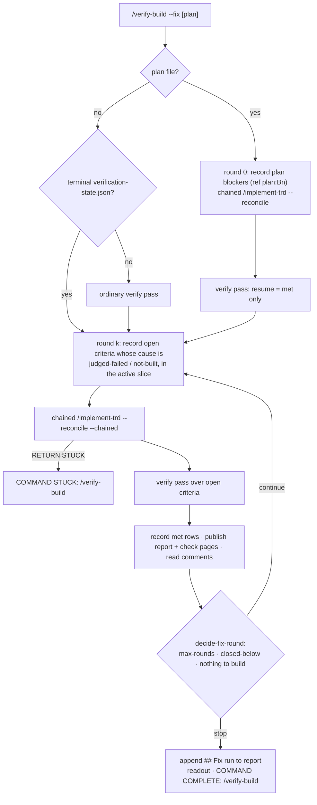

# TRD: Verification Fix Loop

**Version**: 1.0.2
**Status**: Draft
**Created**: 2026-09-27
**Last Updated**: 2026-09-27
**Author**: @technical-architect
**Source PRD**: `docs/plan/verification-fix-loop.investigation.md` (a `/plan` investigation record, `**Kind**: change`, `**Weight**: medium`; no supersession marker). Its own source is `docs/plan/verification-closeout.brief.md` §1 and §5, which records the owner's decisions of 2026-09-27 verbatim, including the reversal of verification-convergence NG2.
**Task ID Prefix**: VFIX

---

## Changelog

| Version | Date | Changes | Author |
|---------|------|---------|--------|
| 1.0.0 | 2026-09-27 | Initial TRD creation | @technical-architect |
| 1.0.2 | 2026-09-27 | Built. End-of-run review finding: round 0 builds blockers only, so `decideFixRound` does not apply `stop-when-closed-below` to it — the same reason OQ-6 keeps it out of `max-rounds` | main agent |
| 1.0.3 | 2026-09-27 | **Synced from `docs/TRD/functional-verification.md` (VFIX-D002).** §3.3's `resume.criteria` and `VerifyFunctionalResult.criteria` gain `cause` field; §3.6's `renderReport()` adds `cause` to report input; report gains `**Diagnosis**`/`**Next**` lines counting causes under Coverage line | @technical-architect |
| 1.0.1 | 2026-09-27 | Audit findings applied. O1 restores the investigation's "e.g." and points at §3.1 for the full cause set, which also has `not-built`. D2 and §3.3 state that `--chained` skips §3.6a's environment preflight: `/verify-build` step 2 already ran it, its owner question must not fire unattended, and Step 8 (§3.6a's only reader) is skipped, so §8.2's fallback is never reached. VFIX-D001 now also amends VART D2, its §3.9 list line and TR6, which D14 replaces. Could Not Verify states this audit's coverage | @technical-architect |

---

## 1. Overview

### 1.1 Technical Summary

When functional verification stops short today, the owner is told an outcome name and a list of
criteria, and nothing else: no account of *why* the rest is open, and no way back into
implementation. `/verify-build` explicitly forbids offering fixes, and `discovered.js` has a
promotable status list for verification gaps that nothing ever writes. The lightning-lane session
the brief studied got from 11 to 56 of 62 criteria only because an agent hand-sequenced ~21
verification passes and ~22 fixes over 6.5 hours.

The owner's design has three stages. This TRD builds the last two and the hand-off into them:

1. **A diagnosis at the stall.** Every open criterion carries a **cause** from a fixed set,
   stored by the Judge rather than re-parsed from prose. The report gains a `**Diagnosis**` block
   (counts by cause) under its Coverage line, and both commands' readouts name the next step:
   a short chat, then `/verify-build --fix`.
2. **The bridge.** A new framework-shipped skill, `verify-plan-recovery`, conducts that chat and
   writes `.trd-state/<feature>/verification-plan.md` in a fixed shape: blockers, slices and
   order, owner rulings, criteria accepted as not verifiable, extra checks, and a stop rule.
3. **The long run.** `/verify-build --fix` reads the plan and runs without questions. Round 0
   builds the plan's blockers and verifies. Each later round records what failed as blocking
   discoveries, builds them through `/implement-trd --reconcile` in a new **chained mode** (no
   banner, no notify, no verification of its own), re-verifies only what is open, republishes the
   check pages, reads the owner's comments, and asks the stop rule whether to go again. Without a
   plan it does exactly one round.

Two supporting changes ride along because the owner scoped them in: framework-shipped skills move to
**one list with a role** (`check` or `support`), so the bridge ships everywhere but is never
selectable as a verification check; and the verification documentation stops contradicting the
delivered loop.

### 1.2 Objectives

O1–O9 keep the investigation record's IDs and wording. Nothing here is new policy.

| ID | Objective | Source |
|----|-----------|--------|
| O1 | When a verification run ends `stalled`, `stuck`, `unbuilt` or `insufficient-coverage`, its readout and report give a **diagnosis by cause with counts** (e.g. evidence missing / stale / locator not found / judged failed / environment not reachable / capability absent / never exercised; the investigation's list is illustrative, and the full set this TRD builds, which adds `not-built`, is §3.1) and name the next step: a short chat, then `/verify-build --fix`. It does not try to fix anything itself. | Investigation O1 (owner, 2026-09-27; brief §1: "provide the mechanism… to do some planning and iterating") |
| O2 | A bridge skill, conducted by the orchestrator in a short chat with the owner, writes `.trd-state/<feature>/verification-plan.md` in a fixed, command-readable shape: blockers (each small enough to be a task), slicing and order, owner rulings (also written into the PRD/TRD), criteria accepted as not verifiable, extra checks to add, and a **stop rule**. | Investigation O2 (owner, 2026-09-27; brief §1: "if a short chat — even with an orchestrator agent — can be the bridge") |
| O3 | `/verify-build --fix` reads the plan and runs without questions: blockers → built; then verify → one fix batch for what failed → re-verify only what failed, repeating until the plan's stop rule; then reports the remainder, each with a reason. | Investigation O3 (owner, 2026-09-27; brief §1: "the /verify-build kicks off the next 6 hours of autonomy") |
| O3a | `not_verifiable` criteria and the `insufficient-coverage` outcome are never turned into build tasks. | Investigation, Intended Change; brief §5 ("`not_verifiable` and `insufficient-coverage` are not promoted") |
| O4 | Without a plan, `--fix` does **one** fix-and-re-verify cycle. | Investigation O4; brief §1 |
| O5 | Check pages republish after each `--fix` round, and the owner's comments are read before the next. | Investigation O5 (owner, 2026-09-27; FS-28 ruling in `docs/TRD/verification-artifacts.md` 2.0.3; brief §5 "Check pages between batches") |
| O6 | An autonomous `--fix` run **never edits `verification.md`**; a change it needs is recorded for the next bridge. | Investigation O6 (owner, 2026-09-27; brief §3 approval model) |
| O7 | The outer loop runs **only on explicit invocation with `--fix`** and has **one** stop rule — the conditions on which the owner reversed NG2. | Investigation O7 (owner, 2026-09-27; brief §1, NG2 reversal) |
| O8 | Verification documentation stops contradicting the delivered loop: what `--resume` re-enters, where lanes are derived, and whether `--verify` is required. | Investigation O8; brief §5 (stale list, re-grounded in the investigation's Grounding G) |
| O9 | Framework-shipped skills are named in ONE list with a role (`check` or `support`); adding a skill is a one-line edit, and only `check` skills are selectable as verification checks. | Investigation O9 (owner, 2026-09-27: "yes to one list") |
| Q1 | New and changed deterministic code meets unit ≥ 60% and integration ≥ 50% where applicable. | `constitution.md` Quality Gates |

### 1.3 Key Technical Decisions

Inherited, not re-decided: VCON D5 (lanes from `verification.md` §1a), VART D7 (checks run inside
the loop as criteria), VART D9 (applicable checks included unless a reason is stated), VART D18
(owner comments are data, never instructions), FV D1 (one Judge per artifact), and FV D3 (one
renderer for the report). Each decision below says where it departs from a sibling.

| ID | Decision | Choice | Serves Objective | Rationale | Alternatives Considered |
|----|----------|--------|------------------|-----------|------------------------|
| D1 | Who owns the outer loop | `/verify-build --fix` owns it. `/implement-trd` only builds, invoked each round as `Skill({skill: "implement-trd", args: "<trd> --reconcile --chained"})`. | O3, O7 | Verification already lives in `/verify-build`; building already lives in `/implement-trd`. The loop is the glue between them and belongs to the command the owner invokes. | (a) Call `/implement-trd --reconcile` plainly in a loop — rejected: it prints a COMMAND COMPLETE banner mid-turn every round (breaking "one banner per RUN", `command-status.md`) and runs its own Step 8 verification, a second redundant pass per round. (b) Re-implement phase dispatch inside `/verify-build` — rejected: duplicates `/implement-trd`. Revisit (b) only if `Skill` chaining proves unable to return control to the caller (see Could Not Verify). |
| D2 | How `/implement-trd` runs under a caller | A new `--chained` flag: skips Step 3.6's derive pass, §3.6a's environment preflight, Step 8, §9.0a's publishing, the §9.1 banner, `notify-complete.sh` and `PushNotification`. It ends with one handoff line `[STATUS: /implement-trd] RETURN → …` carrying tasks built / not built, or `RETURN → STUCK: <reason>` on retry exhaustion. Phase gates and Step 7.2's end-of-run code review still run. Documented as for callers, not for direct use. | O3, O7 | Mirrors `fix-plan.js`'s existing chained path (`banner: null, notify: false`), which already honours "one banner per run". Keeping the review keeps the build's own quality gate. §3.6a is skipped because the caller's step 2 has already run it in the same run and persisted `functional_verification.environments`; its one batched owner question would otherwise break O3's "without questions"; and its only reader, §8.1a, sits inside the skipped Step 8, so §8.2's "run §3.6a now if none recorded" fallback is never reached and needs no chained equivalent. | A `--no-verify --no-banner` flag pair — rejected: two flags the caller must always pass together, and a partial pair silently prints a banner. Skipping Step 7.2 in chained mode — rejected for now, recorded as OQ-3. |
| D3 | Cause storage | The Judge assigns each non-`met` criterion a `cause` from a fixed vocabulary (§3.1). It is stored in `JUDGE_CRITERION_SCHEMA`, the settled map, the state file, the report input and `buildFinalResult`'s per-criterion records. `renderReport` counts it. | O1 | The checker already computes the failure kind (`checkEvidence`'s `failure`) and discards it. Storing a cause is cheaper and more reliable than pattern-matching free-text reasons after the fact. | Re-parse `reason` strings into causes in `renderReport` — rejected: reasons are free text written by an agent, so any parser guesses. Persist raw `failure` kinds only — rejected: they cover tier 1 alone and say nothing about `not_verifiable` or Judge rulings. |
| D4 | Which failures become build tasks | Only criteria with cause `judged-failed` or `not-built` (status `not_met` or `unbuilt`) are recorded as blocking discoveries. Mechanics causes (`evidence-missing`, `evidence-stale`, `locator-not-found`, `never-exercised`) are re-verified next round but never built. `not_verifiable` never promotes. **Departs from the investigation's Decision**, which records "each open `not_met`/`unbuilt` criterion". | O3, O3a | A mechanics failure means the capture step did not produce usable evidence, not that the build misbehaved. Promoting it mints a task no implementer can action. `discovered.js` already excludes `not_verifiable` for the same reason. The contract defines `judged-failed` to include a crash or wrong behaviour seen during capture, so a real defect is never mis-filed as mechanics. | Follow the investigation literally and promote every `not_met` — rejected: produces "SC-12 evidence was stale" tasks that end in no change and burn a round. Revisit if a live `--fix` run shows real defects being mis-labelled as mechanics causes (OQ-4). |
| D5 | Discovery identity | `record()` gains an optional `ref` (the criterion ID, or `plan:<blocker id>` for a plan blocker). For rows carrying a `ref`, `promotable()` keeps only the **latest** row per `ref`, so a later `met` row retires earlier failures. `promoteToTrd()` dedupes on the observation key `<ref>@<ts>` embedded in the row description, writes `Serves` as `criterion <id>` or `plan blocker <id>`, and when an earlier row for the same `ref` already exists, writes the new row as a follow-up that depends on it. `after` (a list of refs) becomes the Dependencies cell. Rows without `ref` behave exactly as today. **Names the field `ref`, not the investigation's "criterion id"**, because plan blockers need the same dedupe. | O3, O7 | Deduping on a normalised summary re-promotes a reworded gap every round. The append-only ledger is re-read on every `--reconcile`, so without latest-per-ref a criterion fixed in round 1 would be promoted again in round 2 from its old row. A follow-up row carries the new failure evidence in its own text. That matters because the implementer's prompt is built from the TRD row, not from `implement.json`'s `current_problem`. | (a) Reopen the existing AMEND task in `implement.json` — rejected: the implementer would receive the old row's evidence, not the new failure. (b) A field named `criterion` — rejected: blockers are not criteria. (c) Dedupe on `ref` alone — rejected: a criterion still failing after its fix could never get a second task. |
| D6 | Plan file shape | `verification-plan.md` has fixed `##` sections, each a table or `key: value` lines (§3.4). The model reads every section **except the stop rule**, which `readStopRule()` in `functional-verification.js` parses. **Departs from VART D4** ("no parser; model + grep/ls"), for the stop rule only. | O2, O7 | The stop rule is the only termination story of a multi-hour unattended run (O7). A model re-reading prose after a compaction is exactly how a second, drifting termination story appears. Every other section is read once per round by a model, which is where D4's reasoning still holds. | Parse the whole file — rejected: blockers, rulings and slices are judgement inputs, and a parser adds a schema that has to be kept in step with the skill. Store the stop rule as JSON beside the plan — rejected: two files for one plan, and the owner reads markdown. |
| D7 | Stop-rule vocabulary and evaluation | Two keys: `max-rounds: <n>` (required) and `stop-when-closed-below: <n>` (optional). One clause is always on and printed in every plan: stop when nothing is left to build. `decideFixRound()` evaluates all three after each round, exposed as `node .claude/lib/functional-verification.js decide-fix-round --file <payload>`. A plan whose stop rule is missing or unreadable runs as if there were no plan (one round), and ISSUES says so. No plan at all: `{maxRounds: 1}`. Round 0 (blockers + first verify) does not count toward `max-rounds`. | O4, O7 | One deterministic function is the one stop rule, and it mirrors `decideNext`'s existing decide-next CLI pattern. "Nothing left to build" is part of the rule rather than a second rule, because a round with nothing to build has no fix batch to run. Falling back to one round keeps O4's semantics instead of inventing a default budget. | Default an absent stop rule to "3 rounds, stop when a round closes no gap" (the investigation's OQ-2 assumption) — **not** applied as a runtime default, because that would be a threshold nobody set. The bridge **proposes** it to the owner as the default answer (§3.7), so it becomes a number the owner accepted. A time or cost budget — rejected: none exists anywhere (Grounding H) and none was asked for. |
| D8 | Re-verify only what is open | Each verify pass under `--fix` reuses `/verify-build`'s existing step 4 dispatch with a synthesised `resume: { iteration: 0, criteria: <met entries from the latest verification-state.json>, gapsClosed: [] }`, minus any criterion carrying an owner comment (as `/implement-trd` §8.2 already does). | O3, O5 | The workflow already seeds its settled set from `resume.criteria` filtered to `met` and nothing else, so no workflow change is needed. `iteration: 0` gives each pass its own inner budget. Otherwise the cap-as-total-across-resumes rule would return `stuck` immediately. Carrying only `met` passes `previousGaps = []`, which the `previousGaps.length > 0` guard already treats as "no stall yet". | A new workflow argument naming the criteria to walk — rejected: duplicates what `resume` already does. Passing the real state file as `resume` — rejected: an exhausted cap returns `stuck` at once. |
| D9 | Round state | `implement.json`'s `functional_verification.fix` = `{ plan, stopRule, rounds: [{ round, promoted, closed, open, buildable }], stopped }`, written through `implement-state.js`'s `save()`. | O3, O7 | The stop rule needs each round's closed count, and a multi-hour run will be compacted: the record, not memory, says which round is next. `/verify-build` already writes `functional_verification.environments` into the same file (step 2), so no new file or writer is introduced. | A separate `verification-fix.json` — rejected: a second state file with its own writer. Holding rounds in the orchestrator's context — rejected: compaction loses them. |
| D10 | The remainder report | After the final verify pass, `--fix` appends a `## Fix run` section to `verification-report.md`, rendered by a new pure `renderFixSummary()` (`render-fix-summary` CLI): one row per round (tasks promoted, criteria closed, still open), then every criterion still not `met` with its status, cause, and why `--fix` stopped on it (not buildable by cause / accepted as not verifiable by ruling / stop rule reached / not verifiable here). | O3 | "Reports the remainder, each with a reason" needs a durable, per-criterion record. The verification report is already the published artifact, and FV D3's one-renderer rule keeps the formatting in the lib. | A separate `fix-report.md` artifact — rejected: a second published page competing with the report. Readout lines only — rejected: the readout is one screen and is not durable. |
| D11 | How plan content reaches the loop | Owner rulings: appended to the workflow's existing `notes` argument under a `## Owner rulings (verification-plan.md)` heading, so the Judge applies them. Accepted-as-not-verifiable criteria: never recorded as discoveries, and labelled with their ruling in the fix summary. Extra checks: unioned with the TRD's `## Verification Artifacts` selection at step 3b, restricted to `check`-role skills. Slices: each round verifies every open criterion; the **active slice** (the first in order that still has an open buildable criterion) limits which failures are recorded for building that round. Blocker order: each blocker's `After` column becomes its promoted row's Dependencies (D5). | O2, O3, O5 | Every channel already exists (`notes`, §8.1b's selection, the Dependencies column). Nothing new crosses into the workflow. Verification stays whole-scope, so a regression outside the active slice is still seen. Only building is sliced. | Verify only the active slice — rejected: hides regressions in finished slices. Pass rulings as a new workflow argument — rejected: `notes` is already the Judge's channel for project facts. |
| D12 | The bridge skill | ~~`packages/skills/verify-plan-recovery/SKILL.md`, a prompt-only skill (Constitution Principle 2), listed with role `support`. It reads the latest report, state file, discovery ledger (including `verification.md` needs recorded by `--fix`) and any existing plan. It proposes a plan section by section with a default for each, asks the owner for rulings, writes rulings into the PRD/TRD, and writes the plan file on a clear yes. It never edits `verification.md` itself; needs recorded against that file are listed for the owner, pointing at the separate setup work (NG3). `autonomy.md` (and its template) names it beside `/refine-*` as interactive by purpose.~~ *Superseded 2026-09-29: the owner asked for a command "like `/refine-verification` … with the option to add `--auto`", consistent with the rest of the refine family, not a skill. `docs/TRD/refine-verification.md` moves the bridge's whole job — deriving the plan, asking only what the evidence cannot settle, `--auto` for an unattended answer — into `/refine-verification`, and removes the skill from this repository and from consuming projects on their next `/rebase-project`. Struck through rather than deleted so the reason a skill was chosen first stays legible. See `docs/TRD/refine-verification.md` O1, O2, O5, D (the "refine command, not a skill" decision).* | O2, O6 | ~~A chat is the owner's stated mechanism. The autonomy rule otherwise forbids exactly the questions the bridge exists to ask. The stop-hook judge's case B only blocks "obviously yes" permission asks, so no judge prompt change is needed.~~ *Superseded 2026-09-29 — see `docs/TRD/refine-verification.md`.* | ~~A new slash command instead of a skill — rejected: the owner and brief both say "a skill conducts the chat". Folding the bridge into `/verify-build` — rejected: that would make an autonomous command ask questions.~~ *Superseded 2026-09-29: the owner's own later request is the slash command this row rejected — see `docs/TRD/refine-verification.md`.* |
| D13 | Where `--fix` needs for `verification.md` go | Recorded as ordinary discoveries: `kind: "gap"`, `blocksFeature: false`, `file: ".claude/rules/verification.md"`, summary naming the change needed. Named in ISSUES with "the owner, at the next bridge" as who acts. Every delegation prompt the chained build receives carries the file's existing read-only rule. | O6 | No schema change, never promotable (`blocksFeature: false`), and the bridge already reads the ledger. | A "Pending for the owner" section appended to the plan file — rejected: an autonomous run editing the owner-agreed plan. A post-round diff check that restores the file — rejected: it cannot tell a `--fix` edit from the owner's own edit made during a six-hour run, and restoring would destroy the owner's. |
| D14 | The one list of framework skills | `packages/skills/framework-skills.txt`, one skill per line as `<name> <role>`, `#` comments allowed. `copy_framework_skills()` reads it and ships it to `.claude/skills/framework-skills.txt`. Readers resolve `.claude/skills/` first and fall back to `packages/skills/` in this checkout, the same resolution already used for `SKILL.md`. Check selection (`trd-authoring.md`, `audit-trd.js`'s verifier prompt, `/implement-trd` §8.1b, `/verify-build` 3b) reads the `check` rows. Delivery readers (scaffold, the three `rebase-project.md` copies, README, CLAUDE.md, tests) read all rows. `fix-audit.js` reports a `## Verification Artifacts` row or `Omitted:` line naming a non-`check` skill. **Replaces VART D2's named list in `scaffold-project.sh`**; VFIX-D001 amends VART D2, its §3.9 list line and TR6 in place, the same way D15 treats NG2. | O9 | A plain line format is a true one-line edit. It parses in bash without `jq` (optional per `stack.md`) and in JS without a dependency, and a prompt can read it directly. | JSON array — rejected: an edit touches two lines (commas), and bash would need `node` or `jq`. A `role:` key in each `SKILL.md`'s frontmatter — rejected: that is N lists, not one, and the owner said one list. A JS module — rejected: `packages/full/lib` needs a per-file symlink per module and bash cannot read it. |
| D15 | NG2 | Amend verification-convergence NG2 in place: strike through, cite the owner's reversal of 2026-09-27 and its two conditions (explicit `--fix` only; one stop rule), and point here. Not deleted. | O7, O8 | Supersession convention in this corpus: amended rows are marked inline and cross-linked, so a reader of VCON sees why its non-goal no longer binds. | Delete NG2 — rejected: loses the reason the outer loop was refused and the conditions it was accepted on. |

### 1.4 Technology Stack

| Layer | Technology | Purpose | Notes |
|-------|------------|---------|-------|
| Commands, skill, contract | Markdown prompts | `/verify-build --fix`, `/implement-trd --chained`, `verify-plan-recovery`, contract cause vocabulary | Constitution Principles 2–3 |
| Loop | `packages/core/workflows/verify-functional.js` | Carries `cause` through the Judge, state and result | Workflow script, no filesystem |
| Deterministic lib | `packages/core/lib/functional-verification.js`, `discovered.js`, `fix-audit.js` (Node 18+) | Diagnosis rendering, stop rule, fix summary, discovery identity, section check | Existing modules, extended |
| Delivery | `packages/core/scripts/scaffold-project.sh` (bash) | Reads the one list, ships skills and list | BATS-tested |
| Tests | Jest ^29.7.0, BATS ^1.9.0 | Per `stack.md` | |

### 1.5 Integration Points

| System | Type | Direction | Notes |
|--------|------|-----------|-------|
| `/implement-trd` | `Skill` invocation | Out (from `--fix`) | Chained mode only (D2) |
| Discovery ledger `.trd-state/<feature>/discovered.jsonl` | Append-only JSONL | Both | `--fix` writes; `--reconcile` promotes; the bridge reads |
| Artifact publishing + `ArtifactComments` | Claude tool calls | Both | Existing §9.0a / §8.1b paths, run once per round (O5) |

---

## 2. System Architecture

### 2.1 The `--fix` run



The two stop points are the stop rule and a STUCK build. The STUCK is a failure exit, not a
termination rule: the build could not be done, so the run ends reporting that. It never reads as
"finished".

### 2.2 Component Architecture

#### 2.2.1 `functional-verification.js` (lib)
**Responsibility**: cause vocabulary, the Diagnosis block in `renderReport`, `readStopRule`,
`decideFixRound`, `renderFixSummary`.
**Interfaces**: exports plus CLI subcommands `decide-fix-round`, `render-fix-summary`.
**Dependencies**: none new.

#### 2.2.2 `verify-functional.js` (workflow) and the contract
**Responsibility**: the Judge assigns and persists `cause`. The contract defines each cause.

#### 2.2.3 `discovered.js`
**Responsibility**: `ref`, latest-per-ref promotability, observation-keyed dedupe, follow-up rows.

#### 2.2.4 `/implement-trd` (`--chained`), `/verify-build` (`--fix`)
**Responsibility**: build under a caller; own the outer loop.

#### 2.2.5 `verify-plan-recovery` (skill)
**Responsibility**: the bridge chat and the plan file.

#### 2.2.6 `framework-skills.txt`
**Responsibility**: the one list of framework-shipped skills and their roles.

### 2.3 State Management

| File | Writer | Reader |
|------|--------|--------|
| `.trd-state/<feature>/verification-plan.md` | the bridge skill, on the owner's yes | `/verify-build --fix`; the next bridge |
| `.trd-state/<feature>/discovered.jsonl` | `--fix` (failures, `met` retirements, `verification.md` needs) | `--reconcile` promotion; the bridge |
| `.trd-state/<feature>/implement.json` → `functional_verification.fix` | `--fix`, via `implement-state.save()` | `--fix` after compaction; `decide-fix-round` payload |
| `.trd-state/<feature>/verification-state.json` | the workflow (unchanged path), now with `cause` | `--fix`'s synthesised resume; the bridge |

---

## 3. Technical Specifications

### 3.1 Cause vocabulary and the Diagnosis (D3; O1)

Exported from `functional-verification.js` as `CAUSES`, and matched exactly by
`JUDGE_CRITERION_SCHEMA`'s `cause` enum:

| Cause | Assigned when | Buildable (D4) |
|-------|---------------|----------------|
| `evidence-missing` | tier 1 failed with `missing`, `empty`, `not-a-file` or `no-artifact`, and nothing seen shows the build misbehaving | no |
| `evidence-stale` | tier 1 failed with `stale` | no |
| `locator-not-found` | tier 1 failed with `no-locator` or `locator-not-found` | no |
| `never-exercised` | no claim reached the Judge for the criterion | no |
| `judged-failed` | the build was reached and did the wrong thing, **including crashing or erroring during capture**; also a check row ruled `deviates` | yes |
| `not-built` | status `unbuilt`, or a check row `not_met` with reason `not built` (VART D20) | yes |
| `environment-unreachable` | `not_verifiable` because the needed environment is undeclared, unusable or `must not be touched` | no (never promoted) |
| `capability-absent` | `not_verifiable` because tooling or a capability the criterion needs is absent (`verification.md` §4/§5) | no (never promoted) |

`met` criteria carry `cause: null`. A report input carrying no `cause` (older inputs) is counted
as `unrecorded`, never guessed.

`renderReport` adds, directly under `**Coverage**`, only when `outcome` is `stalled`, `stuck`,
`unbuilt` or `insufficient-coverage`:

```
**Diagnosis**: <n> open — <count> <cause in words>, <count> <cause in words>, …
**Next**: agree a recovery plan with `/verify-plan-recovery`, then run `/verify-build --fix`
```

Causes are listed by descending count and rendered in words ("environment not reachable", not
`environment-unreachable`). The function takes no other action.

### 3.2 Discovery identity (D5; O3, O7)

```typescript
record(stateDir, {
  kind: 'gap', foundBy: 'verify-build --fix', summary, blocksFeature: true,
  status: 'not_met' | 'unbuilt' | 'met',   // 'met' retires earlier rows for the same ref
  ref: 'SC-12' | 'DC-03' | 'plan:B1',      // ≤ 80 chars; optional
  after?: string[],                        // refs; plan blockers only
  evidence?: string,                       // "<cause>: <Judge reason>"
  file?, files?,
}, nowIso)
```

- `promotable(rows)`: for rows with `ref`, keep only the latest by `ts` before today's filters, so a
  later `met` retires earlier failures. Rows without `ref` are unchanged.
- `promoteToTrd`: the description ends `[<ref> @ <ts>]`. A row whose key already appears in the
  TRD is skipped. If another row for the same `ref` already exists, the new row's description reads
  `… — follow-up to <earlier id>, which did not close it` and its Dependencies cell names that id.
  `after` refs map to the promoted IDs of those refs. `Serves` = `criterion <ref>` or
  `plan blocker <id>`. `opts.serves` still wins when a caller passes it.
- Plan blockers are recorded with `ts` = the plan's `**Written**` timestamp, so re-running `--fix`
  on the same plan never re-promotes a blocker (same key).

### 3.3 `/implement-trd --chained` (D2)

Parse `--chained`. Under it: Step 3.6 does not dispatch the derive pass; §3.6a's environment
preflight is skipped (the caller, `/verify-build` step 2, already ran it this run and recorded
`functional_verification.environments`, and §3.6a's batched owner question must not fire inside
an unattended run); Step 8 is skipped, so §8.1a and §8.2's environment fallback are never
reached; §9.0a
publishes nothing; no banner, no `notify-complete.sh`, no `PushNotification`. The readout is replaced
by one line:

```
[STATUS: /implement-trd] RETURN → chained by /verify-build --fix: <n> of <m> tasks built[; not built: <id> — <why>, …]
```

On a Step 10.1 STUCK: `[STATUS: /implement-trd] RETURN → STUCK: <reason>` and no banner. The
caller emits the run's only banner. Everything else (phase gates, checkpoints, commits, Step 7.2)
is unchanged. The frontmatter `argument-hint` and flag list name it as for callers.

### 3.4 `verification-plan.md` (D6, D11; O2)

```markdown
# Verification plan: <feature>

**Written**: <ISO timestamp> by verify-plan-recovery
**From run**: <outcome> at <proven>/<total>, report `.trd-state/<feature>/verification-report.md`

## Blockers
| ID | Blocker | Files | After | Unblocks |
|----|---------|-------|-------|----------|
| B1 | <one task-sized change> | `<path>` | — | SC-3, SC-7 |

## Slices
| Order | Slice | Criteria |
|-------|-------|----------|
| 1 | <name> | SC-1, SC-2, DC-01 |

## Owner rulings
| ID | Ruling | Written into |
|----|--------|--------------|
| R1 | <ruling> | `docs/PRD/<feature>.md` §<n> |

## Accepted as not verifiable
| Criterion | Ruling | Why |
|-----------|--------|-----|

## Extra checks
| Skill | Inputs |
|-------|--------|

## Stop rule
max-rounds: <n>
stop-when-closed-below: <n>
always: stop when nothing is left to build
```

Any section may hold `none`. An `Extra checks` row naming a non-`check` skill is ignored and
reported in ISSUES.

### 3.5 Stop rule (D7; O4, O7)

```typescript
readStopRule(planText: string): { maxRounds: number|null, closedBelow: number|null, errors: string[] }
// reads the last "## Stop rule" section outside a fence; maxRounds must be a positive integer

decideFixRound(input: {
  round: number,              // the fix round just finished, 1-based; round 0 is never evaluated
  maxRounds: number,          // 1 when there is no plan or its rule is unreadable
  closedBelow: number|null,
  closedThisRound: number,    // criteria not met before this round and met after it
  buildableOpen: number,      // open criteria with a buildable cause, not accepted-not-verifiable
}): { action: 'continue'|'stop', reason: string }
```

Evaluation order: `buildableOpen === 0` → stop ("nothing left to build"); `round >= maxRounds` →
stop; `closedBelow != null && closedThisRound < closedBelow` → stop; else continue. The function
validates its input and throws on missing fields, as `decideNext` does.

### 3.6 `/verify-build --fix [plan-path]` (D1, D8–D11, D13; O3–O7)

`argument-hint` becomes `[trd-path] [--resume] [--cap N] [--fix [plan-path]]`. `--fix` and
`--resume` are mutually exclusive. The plan path defaults to
`.trd-state/<feature>/verification-plan.md` when that file exists.

1. Steps 1–3c as today. The `--fix` additions: plan rulings go into `notes`, plan extra checks go
   into 3b's selection, and the stop rule is read with `readStopRule`. Initialise
   `functional_verification.fix` (D9).
2. **Round 0**, with a plan: record each blocker (D5), chain the build, then verify (step 4 with
   D8's resume). Without a plan and with no terminal state file: run an ordinary verify pass.
3. **Round k ≥ 1**: from the latest state, record a `met` row for each criterion now met that has
   an earlier ref'd row, and a failing row for each open criterion in the active slice whose cause
   is buildable and which is not accepted as not verifiable. If none were recorded, go to 6. Chain
   `/implement-trd <trd> --reconcile --chained`. On `RETURN → STUCK`, end with
   `COMMAND STUCK: /verify-build`.
4. Verify (step 4, D8). Publish the report and each check page to their stored URLs (the existing
   Artifact-link section), then read comments on each page (§8.1b step 5) so the next round's 3b
   carries them and D8 un-settles commented criteria.
5. Append the round to `functional_verification.fix.rounds`, emit
   `[STATUS: /verify-build] PHASE <k>/<maxRounds> COMPLETE → <closed> closed, <open> open`, then
   run `decide-fix-round`. On `continue`, go to 3.
6. Render `## Fix run` (D10) and append it to the report, republish, and emit the readout (STATE
   with the Diagnosis counts; ISSUES with each `verification.md` need recorded under D13, "the owner
   acts at the next bridge"; NEXT = the bridge when anything buildable or blocked remains, otherwise
   `/audit-build`). One `COMMAND COMPLETE: /verify-build` banner, `notify-complete.sh`, and a
   `PushNotification` per `command-status.md` Path A for long-running commands.

Carve-outs, stated once in the file: "never implements" becomes "never dispatches an implementer
itself; under `--fix` it chains `/implement-trd`". "Do not offer to fix" stands: `--fix` fixes
because it was invoked, never because the command offered. §8.5 applies within each verify pass.

### 3.7 The bridge skill (D12; O2, O6)

Sections: **When it applies** (a run ended stalled/stuck/unbuilt/insufficient-coverage, or the
owner asks), **Inputs** (report, state file, `discovered.jsonl`, existing plan, PRD, TRD,
`framework-skills.txt`), **Conversation** (diagnosis first, in plain words; then each plan section
with an evidence-based default; the stop rule's default proposal is `max-rounds: 3` and
`stop-when-closed-below: 1`, investigation OQ-2, which the owner accepts or changes), **Writes**
(the plan in §3.4's shape; each ruling into the PRD or TRD with a dated changelog line, on a clear
yes), **Never** (edits `verification.md`; writes a credential value; starts `--fix`, which the owner
runs). It ends with the four-section readout and its own banner, NEXT = `/verify-build --fix`.

### 3.8 The framework skill list (D14; O9)

```text
# name                      role     (check = selectable as a verification check; support = shipped only)
verify-design-comparison    check
verify-flow-as-built        check
verify-data-fidelity        check
verify-plan-recovery        support
```

### 3.9 Stale wording to correct (O8)

From the investigation's Grounding G, which cites file and line; locate by text, not line number:
`.claude/rules/process.md` and `packages/core/templates/process.md.template` (`--verify` +
`--resume` "re-enters a stalled verification loop" → only an interrupted one, `outcome: null`);
`verify-build.md` "crashed, stalled, or was interrupted" and the `--resume` section (add the met-only
reload and cap-as-total-budget); `docs/TRD/functional-verification.md` §3.7 (lanes derived at 3.6a →
§8.1a; `resume` passed whenever a state file exists → only on explicit `--resume` with
`outcome: null`); `docs/TRD/verification-convergence.md` VCON-B009 text, TR7, §7.3 and the
grounding lines describing §3.6a lanes; `packages/core/lib/fix-plan.js` comments calling `--verify`
required (the `chainArgs` value stays, since its test pins it).

---

## 4. Master Task List

### 4.1 Task ID Convention

`VFIX-[CATEGORY][SEQ]`: P = plugin/infrastructure, B = implementation, D = documentation, T = testing.

### 4.2 Phase 1: Diagnosis, identity, chained build, bridge, one list, `--fix`, docs

| Task ID | Description | Serves | Skills | Dependencies | Acceptance Criteria |
|---------|-------------|--------|--------|--------------|---------------------|
| VFIX-B001 | `functional-verification.js`: export `CAUSES` (§3.1); the Diagnosis and Next lines in `renderReport`; `readStopRule`, `decideFixRound` (§3.5) and `renderFixSummary` (D10), with CLI subcommands `decide-fix-round` and `render-fix-summary`. One task: one file, and the three pieces are checked together by one unit suite. | O1, O3, O4, O7, D3, D7, D10 | `jest` | None | Diagnosis appears under Coverage for exactly the four outcomes and not for `satisfied`/`not-run`, counts by cause in descending order, counts cause-less rows as `unrecorded`, and names the bridge and `--fix`. `readStopRule` returns errors for a missing or non-positive `max-rounds` and reads the last section outside a fence. `decideFixRound` follows §3.5's order, and throws on a missing field. `renderFixSummary` lists every non-`met` criterion with status, cause and stop reason. Existing `functional-verification.test.js` cases still pass. |
| VFIX-B002 | `verify-functional.js` and the contract `packages/core/contracts/functional-verification.md` (+ `.claude/` mirrors): add `cause` to `JUDGE_CRITERION_SCHEMA`, the Judge's STEP 1/4/5 instructions (state file and report input), the settled map, and `buildFinalResult`'s per-criterion records; the contract defines each cause per §3.1, including that a crash during capture is `judged-failed`. | O1, D3, D4 | `jest` | VFIX-B001 | A workflow test asserts the schema's `cause` enum equals `CAUSES` from the lib. Settled entries carry `cause` through a resume. The state-file prompt names `cause` as a required key for non-`met` entries. The contract's mirror test stays byte-identical. |
| VFIX-B003 | `discovered.js`: `ref` and `after` on `record()`; latest-per-ref in `promotable()`; observation-keyed dedupe, follow-up rows, per-row `Serves` and `after` → Dependencies in `promoteToTrd()` (§3.2). New cases in a new `discovered-ref.test.js` (see TR2). | O3, O7, D5 | `jest` | None | Two `not_met` rows for one ref in one call promote one row. A later `met` row for the ref promotes nothing. A second observation after the first row exists produces a follow-up row depending on the first. The same observation re-run promotes nothing. A plan blocker keyed by the plan's timestamp is promoted once across two runs. `after` maps to promoted IDs. Rows without `ref` behave as before (existing tests unchanged). |
| VFIX-B006 | The bridge skill `packages/skills/verify-plan-recovery/SKILL.md` (§3.7) with a `__tests__/skill-md.test.js` like the check skills'; add it beside `/refine-*` as interactive by purpose in `.claude/rules/autonomy.md` and `packages/core/templates/claude-directory/rules/autonomy.md`. | O2, O6, D6, D12 | `jest` | None | The skill has When it applies / Inputs / Conversation / Writes / Never sections. It writes §3.4's exact section names. It states the stop-rule default proposal and that the owner decides. It never edits `verification.md` and never runs `--fix`. Its frontmatter test passes. Both `autonomy.md` copies stay identical. |
| VFIX-P001 | The one list: create `packages/skills/framework-skills.txt` (§3.8). `scaffold-project.sh` builds `FRAMEWORK_SKILLS` from it (all roles) and ships the file to `.claude/skills/`. Update `scaffold-project.test.sh`, `test/integration/tests/runtime-integrity.test.sh` and `packages/skills/README.md` to read or describe the list instead of three hand-copied names. | O9, D14 | | VFIX-B006 | Scaffold and `--refresh` install all four skills and the list file. Adding a fifth line to the list ships a fifth skill with no other edit (a BATS case proves it with a fixture skill). No test or script outside the list names the four skills. ShellCheck clean. |
| VFIX-P002 | Delivery prose reads the list: the three `rebase-project.md` copies (`packages/core/commands/`, `.claude/commands/`, `packages/full/commands/plugin-only/`) treat every listed skill as always-installed, and `CLAUDE.md`'s framework-skills sentence points at the list. | O9, D14 | | VFIX-P001 | All three copies name `framework-skills.txt` rather than the three skills; the two mirrored copies stay byte-identical; the plugin-only copy's generator check still passes. |
| VFIX-B007 | Check selection reads `check` rows only: `trd-authoring.md` (+ mirror) replaces its three-skill table with "read the `check` rows of `framework-skills.txt`, then each skill's **When it applies**"; `audit-trd.js` (+ mirror) verifier prompt does the same; `fix-audit.js` reports a `## Verification Artifacts` row or `Omitted:` line naming a skill whose role is not `check`. | O9, D14 | `jest` | VFIX-P001 | `fix-audit.test.js` gains a case where `verify-plan-recovery` in the table is reported. No selection reader names a skill literally. The `audit-trd.test.js` and `fix-template.test.js` suites pass. Mirrors identical. |
| VFIX-B004 | `packages/core/commands/implement-trd.md` (+ mirror), one task because every change is in one file: `--chained` (§3.3); §8.1b selects from the list's `check` rows; Step 9's readout carries the Diagnosis counts, and its NEXT names the bridge then `/verify-build --fix` when the outcome is stalled/stuck/unbuilt/insufficient-coverage; the `--verify` flag text says what `--resume` re-enters (O8). Update `verify-command-surface.test.js`. | O1, O3, O7, O8, O9, D2, D14 | `jest` | VFIX-P001 | Under `--chained` no banner, notify, derive pass, §3.6a preflight (and so no `AskUserQuestion`), Step 8 or publish is reachable in the prose, and the RETURN line shapes of §3.3 are stated. STUCK under `--chained` returns without a banner. §8.1b names the list, not three skills. NEXT wording matches §3.1's Next line. Surface tests pass, including the 21-field dispatch identity with `verify-build.md`. |
| VFIX-B005 | `packages/core/commands/verify-build.md` (+ mirror): `--fix [plan-path]` per §3.6, with the carve-outs; the Diagnosis and NEXT in the ordinary readout (O1); step 3b reads the list's `check` rows; the stale "crashed, stalled, or was interrupted" wording and the `--resume` section corrected (O8). Extend `verify-command-surface.test.js`. | O1, O3, O3a, O4, O5, O6, O7, O8, D1, D8, D9, D10, D11, D13 | `jest` | VFIX-B001, VFIX-B003, VFIX-B004 | The prose states every step of §3.6 in order, including round 0, D8's synthesised resume, D4's buildable-cause filter, accepted-not-verifiable exclusion, D13's recording of `verification.md` needs, the per-round publish and comment read, the PHASE line, `decide-fix-round`, the one banner, and the no-plan single round. `--fix` with `--resume` is refused. The step 4 dispatch block is unchanged, so the 21-field identity test still passes. |
| VFIX-D001 | Documentation that has no code beside it: amend NG2 in `docs/TRD/verification-convergence.md` (D15) and correct its VCON-B009 text, TR7, §7.3 and §3.6a-lane grounding lines; amend `docs/TRD/verification-artifacts.md` D2, its §3.9 `FRAMEWORK_SKILLS=(…)` list line and TR6 in place (D14); correct `.claude/rules/process.md` and `packages/core/templates/process.md.template`; correct the `--verify is not optional` comments in `packages/core/lib/fix-plan.js` (§3.9). | O7, O8, O9, D14, D15 | | None | NG2 is struck through with the owner's reversal, its two conditions, and a link here; VART D2's Choice and Rationale, its §3.9 list line and TR6 are struck through with the owner's "yes to one list" ruling of 2026-09-27 and a link to this TRD's D14 (VART D10 needs no edit: it cites D2's list); VART gains a changelog row; the other VCON lines name §8.1a and `outcome: null`; both process files say `--resume` re-enters only an interrupted loop and remain identical; `fix-plan.test.js` passes unchanged. VCON gains a changelog row. |
| VFIX-D002 | `docs/TRD/functional-verification.md`: §3.3 per-criterion record gains `cause`; §3.6 describes the Diagnosis block; §3.7's lane and resume sentences corrected (§3.9). Changelog row. | O1, O8 | `jest` | VFIX-B002 | `verify-functional-trd-sync.test.js` passes with `cause` in both the TRD and the code. §3.7 names §8.1a and the explicit-flag, `outcome: null` gate. |

### 4.3 Phase 2: End-to-end

| Task ID | Description | Serves | Skills | Dependencies | Acceptance Criteria |
|---------|-------------|--------|--------|--------------|---------------------|
| VFIX-T001 | [LIVE] Add opt-in smoke scenario `test/smoke/scenarios/verify-fix.sh`, registered in `LLM_OPT_IN_SCENARIOS`, following `verify-functional.sh`'s throwaway-project pattern. Fixture: a PRD with two criteria, one of which the fixture code does not implement. Run 1: `/verify-build`. Then write a `verification-plan.md` by hand in §3.4's shape with `max-rounds: 1` (the bridge is a chat and cannot run headless). Run 2: `/verify-build --fix`. | O1, O3, O5, O6, O7 | | VFIX-B005, VFIX-B006 | Run 1's report carries a Diagnosis line and a Next line naming `--fix`. Run 2: the ledger holds a row with `ref` for the failing criterion; the TRD gains one AMEND row whose `Serves` names that criterion; the transcript holds exactly one `COMMAND COMPLETE`/`STUCK` banner, for `/verify-build`, and no `/implement-trd` banner; `implement.json` holds `functional_verification.fix.rounds` with one entry; the report ends with `## Fix run`; `.claude/rules/verification.md` is byte-unchanged. Skips (not fails) without `claude` or `jq`. |

## Deferred by design

| Task ID | Why it cannot run now |
|---------|----------------------|
| VFIX-T001 | Tagged [LIVE]. Writing and registering the smoke scenario fits in a normal run, but passing it means driving /verify-build and then /verify-build --fix in a live model session. An unattended run cannot vouch for that result, and the TRD's own text schedules it as follow-up work. |

---

## 5. Execution Plan

### 5.1 Phase Overview

| Phase | Focus | Prerequisites | Parallelizable Sessions |
|-------|-------|---------------|------------------------|
| 1 | Lib, workflow, ledger, bridge, list, commands, docs (each task ships its own tests) | None | 1A, 1B, 1C, 1D, 1E start together; the rest follow their dependency |
| 2 | `[LIVE]` end-to-end smoke | Phase 1 | 2A |

### 5.2 Session Details

- **1A** VFIX-B001 → VFIX-B002 → VFIX-D002 (lib, then workflow and contract, then the FV TRD sync). @backend-implementer.
- **1B** VFIX-B003 (ledger identity). @backend-implementer.
- **1C** VFIX-B006 → VFIX-P001 → {VFIX-P002, VFIX-B007, VFIX-B004} (skill, then the list that names it, then its readers). P002 and B007 are @backend-implementer; B004 is command prose.
- **1D** VFIX-D001 (NG2 and stale wording). @backend-implementer.
- **1E** VFIX-B005 after VFIX-B001, VFIX-B003, VFIX-B004 (it calls their interfaces and shares `verify-command-surface.test.js` with B004).
- **2A** VFIX-T001. @verify-app.

### 5.3 Parallelization Map

```mermaid
gantt
    title Execution Plan (No time scale - dependency order only)
    dateFormat X
    axisFormat %s
    section Phase 1
    B001 lib: b1, 0, 1
    B003 ledger: b3, 0, 1
    B006 bridge skill: b6, 0, 1
    D001 NG2 + stale docs: d1, 0, 1
    B002 workflow + contract: b2, after b1, 1
    P001 one list: p1, after b6, 1
    D002 FV TRD: d2, after b2, 1
    P002 rebase + CLAUDE.md: p2, after p1, 1
    B007 selection readers: b7, after p1, 1
    B004 implement-trd: b4, after p1, 1
    B005 verify-build --fix: b5, after b1 b3 b4, 1
    section Phase 2
    T001 LIVE smoke: t1, after b5, 1
```



### 5.4 Critical Path

VFIX-B006 → VFIX-P001 → VFIX-B004 → VFIX-B005 → VFIX-T001. The serial part is the command
files: `verify-build.md`'s `--fix` step names `/implement-trd --chained`, and both edit
`verify-command-surface.test.js`. No two tasks in the same wave share a file.

---

## 6. Quality Requirements

### 6.1 Testing Requirements

| Type | Coverage Target | Source | Scope |
|------|-----------------|--------|-------|
| Unit Tests | ≥ 60% | `constitution.md` Quality Gates | `functional-verification.js` additions, `discovered.js` identity, `fix-audit.js` role check, `verify-functional.js` cause plumbing (Jest); `copy_framework_skills()` list reading (BATS) |
| Integration Tests | ≥ 50% where applicable | `constitution.md` Quality Gates | The scaffold/refresh cycle in `scaffold-project.test.sh`; command-surface assertions |

The bridge skill and the `--fix` / `--chained` prose are prompts. Per Constitution Principle 4 they
are verified by session review and by VFIX-T001's opt-in smoke. The bridge chat itself has no
headless test: its output shape is fixed by §3.4 and exercised by T001 through a hand-written plan.

### 6.2 Code Quality Standards

ESLint for JavaScript, ShellCheck for shell, Prettier for Markdown/JSON/YAML (`stack.md`).

### 6.3 Security Requirements

- The plan file, fix summary and discovery rows never hold a credential value. Domain-derived: the
  report is published by default (`command-status.md`, "Never publish a document that contains a
  credential"), and `--fix` appends to it every round.
- Owner comments reach the loop as data, never instructions (VART D18, unchanged).

### 6.4 Performance Requirements

None. No time, cost or round budget appears in the investigation, the brief or the constitution
(Grounding H). The only bound is the owner's stop rule.

---

## 7. Risk Assessment

### 7.1 Risks Imported from PRD

The investigation records no risk table.

### 7.2 Technical Risks

| ID | Risk | Likelihood | Impact | Mitigation |
|----|------|------------|--------|------------|
| TR1 | A `--fix` run is compacted mid-round and loses its place, running a round twice or skipping the stop rule | Med | High | D9 puts round state in `implement.json`; §3.6 step 5 writes it before evaluating the stop rule, and every step re-reads it rather than recalling it |
| TR2 | `discovered.test.js` is excluded from CI because it hangs on the GitHub runner only (CLAUDE.md, cause unidentified), so D5's cases would never run in CI | High | Med | VFIX-B003 puts its cases in a new `discovered-ref.test.js` |
| TR3 | The Judge labels a real defect as a mechanics cause, so D4 never builds it and the run stops "nothing to build" with a real bug open | Med | Med | The contract defines a crash or error during capture as `judged-failed` (VFIX-B002); the Diagnosis and fix summary show every mechanics-caused criterion by cause, so the next bridge sees them |
| TR4 | Each chained round loads `implement-trd.md` (2,011 lines) into the same context again | High | Med | Accepted. TR1's on-disk round state is the recovery path |

### 7.3 Contingency Plans

**TR2 contingency**: if `discovered-ref.test.js` also hangs on the runner, exclude it in
`jest.config.ci.js` beside the existing entry with the same evidence note, and record it in ISSUES
of the release. The hang is then shown to be in the module, not the test file, which narrows the
open CI investigation.

**TR3 contingency**: if a live run shows mechanics causes hiding real defects, widen D4's
buildable set to include `evidence-missing` (the likeliest mislabel). That is a one-line change in
`--fix`'s filter plus `CAUSES`' buildable flag. OQ-4 records it.

---

## 8. Non-Goals (Scope Boundaries)

| ID | Non-Goal | Rationale |
|----|----------|-----------|
| NG1 | CodeRabbit's smoke-scenario tightenings for verification-artifacts | Investigation "not absorbed: separate" |
| NG2 | A skill that builds `verification.md`, and the coverage-floor question and plumbing | Investigation "not absorbed: separate plan (brief §3)" |
| NG3 | Adding `verification.md` to `constitution.md`'s Governance Split | Brief §3: a constitution change, "proposed for the owner's decision, not for the plan to do on its own" |
| NG4 | The framework diagnosing every stall on its own, or `--fix` running without explicit invocation | Owner framing (brief §1: "We can't predict everything that will stall verification, nor do I want to try"); O7 |
| NG5 | Agent-liveness stalls (orphaned jest, Monitor never firing, overnight stack breakage) and spec ambiguity in entry points | Brief §1 table: "not addressed — out of scope" |
| NG6 | A time or cost budget on the outer loop | Grounding H: none exists; none was asked for. The stop rule is the only bound (O7) |
| NG7 | `--fix` editing `verification.md` | O6 |

---

## Verification Artifacts

None apply — this change has no UI design, no interaction diagram and renders no data from an API or store; it changes command prompts, a skill, a workflow and libraries.

---

## Task Grounding

### VFIX-B001

- **Touches:** `packages/core/lib/functional-verification.js` (729 lines [read]) — add exported `CAUSES`, the Diagnosis/Next lines inside `renderReport()` (currently `packages/core/lib/functional-verification.js:382-540` [read], no cause-handling of any kind today), `readStopRule()`, `decideFixRound()`, `renderFixSummary()`, plus two new CLI subcommands in the `if (require.main === module)` block (`packages/core/lib/functional-verification.js:650-729` [read]). **Also touches its mirror `.claude/lib/functional-verification.js`** — confirmed byte-identical to the `packages/core/lib` copy today [ran: `diff`, no output]; both must change together or the mirror silently drifts (`packages/full/lib/functional-verification.js` is a symlink to `packages/core/lib`, so it needs no separate edit [read: `ls -la`, symlink target `../../core/lib/functional-verification.js`]).
- **Reuse:**
  - `decideNext()`'s validate-then-throw pattern (`packages/core/lib/functional-verification.js:244-255` [read]: `if (!Array.isArray(gaps)) throw new TypeError(...)`) is the exact style `decideFixRound` should follow — the TRD's own §3.5 says so ("throws on missing fields, as `decideNext` does").
  - The existing CLI dispatch shape (`resolveJsonPayload()`, `--file`/`-`/inline forms, `console.log(JSON.stringify(...))` for `decide-next`, `console.log(<markdown>)` for `render-report` — `packages/core/lib/functional-verification.js:666-712` [read]) is the template for the two new subcommands `decide-fix-round` and `render-fix-summary`.
  - For `readStopRule`'s "reads the last section outside a fence" requirement (§3.5, D6): `packages/core/lib/trd-parser.js` already implements exactly this pair — `maskFencedLines(lines)` (blanks fenced regions, keeping line count; `trd-parser.js:86-109` [read]) and `findSection(lines, phrase, {strategy: 'last'})` (`trd-parser.js:171` [read], `strategy: 'last'` documented at :159-163 for exactly this "prefer the canonical terminal section over an accidental fenced collision" reason). Both are exported (`trd-parser.js:896-905` [read]) and are the closest existing fence-aware section-finder in the repo.
  - Counter-precedent worth weighing against the above: `packages/core/lib/discovered.js`'s own `findLastSectionByPhrase()` (`discovered.js:250-266` [read]) deliberately duplicates a similar (but NOT fence-aware) heading-scan rather than importing `trd-parser.js`, with the reasoning stated in its own comment (`discovered.js:239-241` [read]: "this module has no other dependency on trd-parser.js and pulling one in just for a one-line regex would make a promote-time write depend on a parse-time module"). `functional-verification.js` carries the same "pure, dependency-light module" framing in its own header comment (`:10-15` [read]), so the implementer has a real choice — reuse `trd-parser.js`'s fence-aware pair (cheaper, correct out of the box) or write a small local fence-aware scan matching this module's existing no-cross-lib-dependency norm. Either is buildable; only `trd-parser.js` already handles the fence exclusion.
  - The `checkEvidence()` tier-1 failure vocabulary (`missing`, `empty`, `not-a-file`, `no-artifact` at :99/113/128/132 [read]; `stale` at :136; `no-locator`/`locator-not-found` at :149/187) maps cleanly and exhaustively onto §3.1's `evidence-missing` / `evidence-stale` / `locator-not-found` causes — confirms the cause vocabulary is a re-labelling of an existing, already-tested vocabulary, not new territory.
- **Replaces:** nothing — this is pure addition to an existing module; no existing export, branch or CLI subcommand is superseded.
- **Follow:** `OUTCOME_LABEL` (`:341-348` [read]) is the existing lookup-table style for a fixed, small vocabulary rendered in words — the Diagnosis line's "cause in words" rendering (§3.1: "environment not reachable", not `environment-unreachable`) should follow the same table-lookup shape rather than a string-transform function.
- **Careful:** `renderReport`'s existing JSDoc (`:361-380` [read]) already documents `tier1`/`provenAt` as fields that may be ABSENT on older report inputs and must render blank, not fabricated, when missing (`:490-493`, `:510-512`). `cause` needs the identical "absent → `unrecorded`, never guessed" treatment (§3.1 already says this), so the Diagnosis-counting code should follow the exact same defensive-read pattern already used for `tier1 ?? ''` (`:520`) rather than assuming every criterion in a report input carries the new field.

### VFIX-B002

- **Touches:** `packages/core/workflows/verify-functional.js` (1228 lines [read]) and `packages/core/contracts/functional-verification.md` (464 lines [read]), each with its mirror(s): `.claude/workflows/verify-functional.js` and `packages/full/workflows/verify-functional.js` are both real (non-symlinked) files, currently byte-identical to the core copy [ran: `diff`, three-way, no output — all three are 68,936 bytes]; `.claude/contracts/functional-verification.md` is likewise byte-identical to the core copy [ran: `diff`, no output] and that identity is already enforced by a test (`packages/core/contracts/functional-verification.test.js`: `test('the two copies are byte-identical', ...)` [read]). All three workflow copies and both contract copies must change together.
- **Reuse:**
  - `JUDGE_CRITERION_SCHEMA` (`verify-functional.js:642-654` [read]) already has a `tier1: {type: 'string', enum: [...]}` sibling property in the exact shape a new `cause` property needs.
  - `settledList(settled)` (`:211-213` [read], `Array.from(settled, ([id, v]) => ({id, ...v}))`) spreads WHATEVER is stored in each settled-map value object straight through to `buildFinalResult`'s `criteria` (`:828-831` [read]) and from there to both the state-file write and the report input the Judge is instructed to compose (`buildJudgePrompt` STEP 4/5, `:463-512` [read]). Adding `cause` to the two places that populate the settled map's value object — the resume-seed block (`:917-929`, `met`-only) and the per-iteration fold (`:1139-1147`, `met`/`not_verifiable`/`unbuilt`) — is therefore sufficient to make `cause` flow through everywhere else with no separate plumbing.
- **Replaces:** nothing — `cause` is a new field threaded alongside existing ones; no existing schema property, prompt instruction or settled-map field is removed.
- **Follow:** the existing STEP 4 instruction's exact-key-list style (`"id", "status", "tier1", "artifact", "reason", "provenAt"` — `:478` [read]) is where `"cause"` gets added as a further required key for non-`met` entries, worded the same way.
- **Careful:**
  - **Test-harness limit** (see the paired finding): `packages/core/workflows/test-harness.js`'s `runWorkflow()` (`:82-99` [read]) returns only `{result, phases, logs}` — no access to internal top-level consts like `JUDGE_CRITERION_SCHEMA`. The acceptance criterion "a workflow test asserts the schema's cause enum equals `CAUSES` from the lib" has to be built as a SOURCE-text regex extraction (the technique already used at `verify-functional.test.js:1247-1254` for the `exit-insufficient-coverage` enum value), diffed against `require('../lib/functional-verification').CAUSES` — not a live object comparison, which the harness cannot provide.
  - The contract file (`packages/core/contracts/functional-verification.md`) currently has **no** "cause" concept anywhere [ran: `grep -n cause` returned nothing] — this is new prose, not an edit to existing cause-adjacent text. The natural anchor is the existing "## The four judge statuses..." section (`:288` area [read]), which already documents `met`/`not_met`/`not_verifiable`/`unbuilt` in the same table style §3.1's cause table should sit beside.
  - `packages/core/contracts/functional-verification.test.js` (mirror-sync test, [read] in full) asserts many specific substrings/regexes against the contract's prose (e.g. the four-status table, the locator rule, S-1/S-2 headings) — none of its existing assertions constrain where "cause" prose goes, so adding it is additive and should not break any existing assertion, but the new prose still needs to keep the file byte-identical to `.claude/contracts/functional-verification.md` per that same test file's first assertion.

### VFIX-B003

- **Touches:** `packages/core/lib/discovered.js` (462 lines [read]) and its mirror `.claude/lib/discovered.js` (byte-identical [ran: `diff`, no output]; `packages/full/lib/discovered.js` is a symlink to core, needs no separate edit [read: `ls -la`]). New test file `packages/core/lib/discovered-ref.test.js` (does not exist yet [ran: `find`, no match]).
- **Reuse:**
  - `record()`'s existing optional-field pattern for `file`/`files` (`:375-381` [read]: `if (entry.file) row.file = String(entry.file).slice(0, 200); if (Array.isArray(entry.files) && entry.files.length) row.files = ...slice(0, 20);`) is the exact template for adding `ref` (single string, ≤80 chars per §3.2) and `after` (array of refs, plan blockers only).
  - `promoteToTrd`'s existing generic column-role resolution (`col.id`/`col.desc`/`col.serves`/`col.deps`/`col.ac`, built from the table's own header text via `roleOf()` — `:127-135` [read]) already gives per-row access to `col.serves` and `col.deps`; the new per-row `Serves`/`Dependencies` logic (§3.2: `criterion <ref>` / `plan blocker <id>`, and `after` → Dependencies) is additional logic inside the existing per-row loop (`:180-223` [read]), not a new column-resolution mechanism.
- **Replaces:** nothing existing is removed. `promotable()` (`:68-75` [read]) and the summary-based dedupe in `promoteToTrd` (`:159-172`, `:191` [read]) both stay as the REQUIRED behavior for ref-less rows per this task's own acceptance criteria ("Rows without `ref` behave as before (existing tests unchanged)") — this task extends both functions with a `ref`-gated branch rather than replacing either.
- **Follow:** n/a beyond the Reuse citations above — no other module in this repo implements ref/observation-keyed promotion to model against.
- **Careful:**
  - `promotable()` today is a single `.filter()` pass (`:68-75`). D5's "for rows with `ref`, keep only the latest by `ts`" has to run as a pre-pass BEFORE the existing three filters (blocksFeature / kind!=risk / status), because a later `met` row is meant to make an earlier `not_met` row for the same ref disappear entirely — including from anything that reads `promotable()`'s output for reporting, not just for promotion. Rows with no `ref` must pass through this pre-pass completely unaffected (order and content), since the acceptance criteria require existing ref-less tests to keep passing unchanged; grouping-by-ref then re-flattening will change relative row ORDER unless the implementation is careful to preserve it (not covered by any current test, but worth preserving deliberately rather than as an accident of `Map` iteration order).
  - `promoteToTrd`'s existing dedupe (`const seen = new Set(); ... if (seen.has(norm(summary))) continue;`, `:166-172, :191` [read]) must stay intact, verbatim, for rows carrying no `ref` (explicit acceptance criterion). The new `<ref>@<ts>`-keyed dedupe (D5) has to be a PARALLEL check gated on `if (r.ref)`, not a replacement of the summary-based one — the two mechanisms coexist rather than one superseding the other.
  - `cells[col.serves] = opts.serves || 'amendment — no objective recorded';` (`:207` [read]) is currently ONE value applied uniformly to every row in a single `promoteToTrd()` call. D5 needs this to become per-row (`criterion <ref>` vs `plan blocker <id>`, derived from that row's own `ref`), falling back to today's `opts.serves`-or-default expression only when a row carries no `ref`.
  - `cells[col.deps] = 'None';` (`:208` [read]) is likewise a blanket default today. Building §3.2's `after` → Dependencies mapping and the "follow-up to `<earlier id>`" Dependencies value both require a `ref → promoted-task-id` map that is populated both from rows already in the TRD (parsed from the new `[<ref> @ <ts>]` marker this same task adds to the description) and incrementally from rows this same `promoteToTrd()` call is in the middle of adding — a plan blocker's `after` may reference a sibling blocker promoted earlier in the very same call.
  - `MAX_LINE_BYTES = 2048` and the existing truncation ladder (`:386-394`, drops `evidence` first, then truncates `summary`) does not currently account for the new `ref`/`after` fields; they should be added to the row-building before that ladder runs so they count toward the same byte budget, and the implementer should decide whether they are ever eligible to be dropped under pressure (the ladder as written never drops `file`/`files` either, so likely `ref`/`after` should be treated the same — never dropped, only evidence/summary trimmed).
  - **CI note** (TR2, already named in the TRD): `packages/core/lib/discovered.test.js` is excluded from CI because it hangs on the GitHub runner for an unidentified reason [read: `jest.config.ci.js:8, 30-33, 44`] — confirms exactly why this task's own acceptance criteria require the new cases to live in a fresh `discovered-ref.test.js` rather than being added to the existing (CI-excluded) file.

### VFIX-B004

- **Touches:**
  - `packages/core/commands/implement-trd.md`, `.claude/commands/implement-trd.md` (byte-identical) [ran: `diff -q`, empty] —
    - frontmatter `argument-hint` (line 4) and the `> **Arguments:**` block (lines 9-35) [read]: add `--chained`.
    - `## User Input` parse line (lines 45-48) [read]: add `--chained`.
    - `### 3.6 Dispatch the background success-definition derive pass` (line 602) [read]: skip under `--chained`.
    - `### 3.6a Preflight the environment BEFORE spending iterations` (line 752) [read]: skip under `--chained` (D2). `/verify-build` step 2 is "identical to `/implement-trd` §3.6a" (`verify-build.md` step 2) [read] and has already persisted `environments` in the same run; §8.1a, the only reader, is inside the skipped Step 8.
    - `### 8.1b Append the check criteria`, step 2 (lines 1379-1382) [read]: "For each of the three skills named in `trd-authoring.md` (`verify-design-comparison`, `verify-flow-as-built`, `verify-data-fidelity`)..." becomes "for each `check`-role skill named in `framework-skills.txt`."
    - `### 9.0a Artifact link` (lines 1747-1780) [read]: skip publishing under `--chained`.
    - `### 9.1 The banner closes the turn` (line 1781) and `## Step 10` / `### 10.1 STUCK` (lines 1806-1845) [read]: replace the terminal banner with the `RETURN →` line under `--chained`.
    - `## Step 9: Completion`'s STATE and NEXT templates (lines 1686-1726) [read]: add the Diagnosis-counts sentence and the bridge-then-`--fix` NEXT branch for the four non-terminal outcomes.
    - The existing `--verify`/`--resume` flag prose (lines 21-30, 82-91, 609-639) [read] already states the `outcome: null` gate accurately — confirmed no stale wording here; that correction belongs to `process.md`/the functional-verification TRD (VFIX-D001/D002), not this file.
  - `packages/core/commands/verify-command-surface.test.js` — extend the existing `describe('implement-trd.md §8.1b appends check criteria...')` assertions (lines 217-227) [read], which must keep matching generic `SKILL.md`/`packages/skills/` prose (not the three literal names); add new tests for `--chained` parsing, the RETURN-line shape, and the Step 9 additions.
- **Reuse:**
  - `fix-plan.js`'s existing chained-dispatch shape (`chain: true, chainSkill: 'implement-trd', ..., banner: null, bannerBody: null, notify: false`, lines ~126-138) [read] — D2 names this as the pattern `--chained` mirrors: the same "no banner, no notify, one line stating the result" idiom, not a new suppression mechanism.
  - `command-status.md`'s existing four-section readout — the Diagnosis/NEXT additions are new sentences inside the existing STATE/NEXT sections, not a new section.
  - `checks`/`checkComments`/`pagesDir` plumbing already built by §8.1b/§8.4/§9.0a — untouched by `--chained` beyond turning §9.0a's publish step off.
- **Replaces:**
  - Nothing existing inside `implement-trd.md` is superseded — `--chained` is additive alongside the default and `--resume`/`--verify` paths.
  - §8.1b's hardcoded three-skill sentence is replaced by the "check-role rows of `framework-skills.txt`" instruction (same replacement VFIX-B007 makes in `trd-authoring.md`/`audit-trd.js`, applied here per D14's own reader list).
- **Follow:**
  - The new `[STATUS: /implement-trd] RETURN → ...` line should read as a sibling of the existing DISPATCHED/RESUMED/PHASE lines already defined in this file's `## Output discipline` section (line 1898+) [read] and in `command-status.md` — same `[STATUS: /<command>] <VERB> → ...` shape, new verb.
  - `implement-trd.md` carries no `disable-model-invocation` frontmatter key (unlike `create-prd.md`, per `plan.md`'s own note on that flag) [read: frontmatter, lines 1-7] — consistent with, though not full confirmation of, the TRD's own "Could Not Verify" item that `Skill({skill: "implement-trd"})` is not blocked by that guard.
- **Careful:**
  - Real, declared dependency on VFIX-P001: §8.1b's rewritten step 2 needs `framework-skills.txt` to exist.
  - Shares `verify-command-surface.test.js` with VFIX-B005 (which depends on VFIX-B004) — both edit the same test file; the TRD's own §5.4 already names this as the reason the two are serialized, so this is confirmation of an existing collision-avoidance, not a new one to report.
  - Settled by audit (2026-09-27): `--chained` skips §3.6a outright and needs no equivalent of §8.2's "run environment checks if none recorded" fallback, because Step 8 (and so §8.1a) never runs under it (D2, §3.3). Still open: that Step 9's Diagnosis sentence depends in substance (not in file, and not in the declared graph) on VFIX-B002's `cause` field landing on `criteria`, which today's §8.4 field list does not yet show.

### VFIX-B005

- **Touches:** `packages/core/commands/verify-build.md` and its byte-identical mirror
  `.claude/commands/verify-build.md` `[ran: diff -q packages/core/commands/verify-build.md
  .claude/commands/verify-build.md → identical]`; `packages/core/commands/verify-command-surface.test.js`
  (extend, not fork — this suite already asserts on both files' prose in lockstep).
- **Reuse:**
  - The frontmatter `argument-hint: "[trd-path] [--resume] [--cap N]"` (`verify-build.md:5`
    `[read]`) — append `[--fix [plan-path]]` rather than restating the whole hint.
  - The existing step numbering and pointer style: step 2 already reads *"Identical to
    `/implement-trd` §3.6a — read that section and follow it"* (`:60`), step 3b *"Identical to
    `/implement-trd` §8.1b"* (`:159`), step 3c *"Identical to `/implement-trd` §8.1a"* (`:166`) —
    the `--fix` additions (plan rulings into `notes`, plan extra checks into 3b's selection,
    `readStopRule`) are additions to these same pointer paragraphs, not new duplicated
    derivations (`verify-command-surface.test.js` already pins the pointer-not-duplicate
    pattern for §3.6a/§8.1a/§8.1b, e.g. lines 95-113, 296-326).
  - The existing Step 4 dispatch block (`:173-202`) is untouched by `--fix` — VFIX-B005's own
    acceptance criteria says so explicitly ("the step 4 dispatch block is unchanged, so the
    21-field identity test still passes"); the `--fix` loop calls this SAME block once per
    round rather than replacing it. `extractDispatchFields()` in the surface test
    (`verify-command-surface.test.js:162-192`) will re-verify field parity unchanged.
  - The Output-discipline section's existing publish/banner/notify mechanics (`:231-262`) — one
    round's publish under `--fix` is the SAME "Artifact link" paragraph run again, not a second
    mechanism; only the loop around it (§3.6 steps 3-5) is new.
  - `discovered.js`'s `record()` with a `ref` (VFIX-B003) and `promoteToTrd()`'s follow-up-row
    behaviour — `verify-build.md` describes CALLING these, never reimplements ledger/promotion
    logic inline.
  - `/implement-trd --chained`'s RETURN-line shapes (VFIX-B004, §3.3 of this TRD) — `verify-build.md`
    describes reading `RETURN → …` / `RETURN → STUCK: …`, never restates `--chained`'s own step list.
  - `functional-verification.js`'s `decide-fix-round` CLI (VFIX-B001) — called by name, not
    reimplemented as inline prose logic.
  - `command-status.md`'s PHASE-banner convention ("For long, multi-phase commands … emit at
    each phase boundary: `[STATUS: /<\command-name>] PHASE <N>/<M> COMPLETE → …`") — the
    per-round `PHASE <k>/<maxRounds>` line this task adds is that existing convention applied
    to a new multi-round command, not a new banner shape.
- **Replaces:** Nothing existing is deprecated — `--fix` is a strictly additive branch beside
  the plain (no-`--fix`) path, which is unchanged. Two SENTENCES do get superseded rather than a
  code path: (1) the "Why this exists separately" paragraph's *"The loop **crashed, stalled, or
  was interrupted**"* framing (`:31-32` `[read]`) is misleading after this task, because
  `stalled` is one of the five TERMINAL outcomes (`:226-227`'s own `--resume` section: *"any of
  the five outcome strings means it finished and `--resume` starts a fresh run instead"*) — a
  run that ended `stalled` is exactly the case `--resume` does NOT re-enter, so citing it as a
  reason to reach for `--resume` contradicts the section 200 lines later in the same file. Fold
  it into "crashed or was interrupted" (i.e. `outcome: null`), and point a `stalled` run at
  `--fix` instead, which is the new command this whole TRD adds for that exact case. (2) the
  `--resume` section (`:223-227`) currently states outcome-gated re-entry correctly but omits
  two facts D8/§3.9 require adding: only `met` carries forward (not `not_verifiable`/`unbuilt`),
  and the iteration cap is a total budget across resumes, not reset per resume — both currently
  undocumented, not wrong, so nothing here is struck out, only extended.
- **Follow:** `verify-command-surface.test.js`'s existing pattern of pinning PROSE (not
  behaviour) for pointer sections, mirror parity, and field-order/count (`:43-51`, `95-192`) —
  extend this same file with `--fix`-shaped `describe` blocks rather than a new test file, since
  the whole suite's premise is "both surfaces, compared, in one place."
- **Careful:**
  - **Shares `verify-command-surface.test.js` with VFIX-B004** (implement-trd.md's `--chained`
    task, "Update `verify-command-surface.test.js`" is also in B004's own acceptance criteria).
    Already declared and correctly serialized: VFIX-B005's `Dependencies` column names
    VFIX-B004, and §5.4's Critical Path states this explicitly ("both edit
    `verify-command-surface.test.js`"). Do not also collide with VFIX-B007 here — B007 touches
    `trd-authoring.md`/`audit-trd.js`/`fix-audit.js`, not this file.
  - `verify-build.md`'s step 3b currently only POINTS at `/implement-trd` §8.1b; VFIX-B004 (not
    this task) is what actually teaches §8.1b to read `framework-skills.txt`'s `check` rows
    (VFIX-B007's job, dependent on VFIX-P001). VFIX-B005's OWN addition to step 3b is narrower:
    union the `--fix` plan's `## Extra checks` section into the selection (D11) — do not
    re-derive the base `check`-row selection logic here; that already exists once §8.1b is
    updated by the sibling tasks.
  - `--fix` and `--resume` must be refused together (VFIX-B005's own acceptance criterion) —
    the existing `## \`--resume\`` heading and the new `--fix` material should read as clearly
    mutually exclusive branches under `## Steps`, not two independent sections a reader could
    combine.
  - `discovered.js`'s current `PROMOTABLE_STATUSES = ['not_met', 'stalled', 'unbuilt']`
    (`discovered.js:50` `[read]`) already excludes `not_verifiable` — consistent with D4's
    "never promoted" rule for `environment-unreachable`/`capability-absent` causes. Nothing to
    reconcile here; just don't have `verify-build.md`'s prose imply a NEW exclusion rule that
    duplicates what `discovered.js` already enforces mechanically.

### VFIX-B006

- **Touches:** `packages/skills/verify-plan-recovery/SKILL.md` and `packages/skills/verify-plan-recovery/__tests__/skill-md.test.js` — neither exists yet [ran: `find . -path "*verify-plan-recovery*"`, no match]; genuinely new files. `.claude/rules/autonomy.md` and `packages/core/templates/claude-directory/rules/autonomy.md` — both exist and are byte-identical today [ran: `diff`, no output].
- **Reuse:**
  - `packages/skills/verify-design-comparison/SKILL.md` + `packages/skills/verify-design-comparison/__tests__/skill-md.test.js` [read, both in full] is the established shape for a framework-shipped skill and its structural test: YAML frontmatter (`name`/`description`/`when_to_use`/`allowed-tools`) parsed with a `^---\r?\n([\s\S]*?)\r?\n---\r?\n([\s\S]*)$` regex + `js-yaml`, a fixed `REQUIRED_SECTIONS` array, and `sectionHeadingIndexes`/`sectionBody` helpers that locate each named `##` heading and slice its body. VFIX-B006's own test should mirror this exact scaffolding, substituting §3.7's five section names (**When it applies**, **Inputs**, **Conversation**, **Writes**, **Never**) for the check-skill's seven.
  - `packages/core/commands/refine-trd.md`'s `## Modes` table (`:28` [read]: "Each open question is put to you with `AskUserQuestion`") is the closest existing precedent in this repo for a one-question-at-a-time interactive flow with a stated default per question — the closest available Follow model for §3.7's "Conversation" section, since no other skill in `packages/skills/` conducts an interactive chat (confirmed: no `SKILL.md` in the repo contains an `## Conversation` heading or references `AskUserQuestion` [ran: `grep -rl`, both empty]).
- **Replaces:** nothing — there is no prior bridge skill, plan-recovery mechanism, or superseded command to remove. `packages/skills/verify-goal/SKILL.md` (an existing conversational-adjacent skill, no `__tests__/`) is a different mechanism ( `/goal`-driven autonomous looping, not an interactive chat) and is not superseded by this task.
- **Follow:** see Reuse above — no other section beyond frontmatter/heading-structure conventions applies, since the bridge's actual conversational content is new territory in this repo.
- **Careful:**
  - The autonomy.md exemption clause this task extends is written entirely around **commands**, not skills: `.claude/rules/autonomy.md:3-6` [read] states "`/refine-prd` and `/refine-trd` are exempt... conditional on mode, not on command name" and the heading at `:153` is literally "## Refine commands (`/refine-prd`, `/refine-trd`) — exempt by MODE, not by name". `verify-plan-recovery` is a **skill**, invoked directly by the owner or read by `/verify-build`'s readout (per the TRD's D12), not a command with an interactive/non-interactive mode switch the way `/refine-prd`/`/refine-trd` have. The implementer has to decide how to fold a skill into language written for a command's two modes — most likely a short added clause ("and the `verify-plan-recovery` skill, which has no non-interactive mode at all") rather than assuming the exact "exempt by mode" framing transfers unchanged.
  - No dedicated test asserts the specific sentence being added (only the two files' overall byte-identity is checked, generically, by `test/integration/tests/runtime-integrity.test.sh` [read: confirmed it checks `autonomy.md` byte-identity]) — whatever wording is chosen must be applied to BOTH `.claude/rules/autonomy.md` and `packages/core/templates/claude-directory/rules/autonomy.md` identically, or that BATS suite fails.
  - This task's own acceptance criteria ("never edits `verification.md` and never runs `--fix`") are properties of the SKILL's prose the test (`skill-md.test.js`, modelled on the check-skills' `sectionBody()` helper) should assert on the **Never** section's text — following the check-skill test's own pattern of asserting specific load-bearing phrases per section (e.g. `verify-design-comparison`'s test asserting particular D13/D14 terms inside named sections) rather than asserting only that the section exists.

### VFIX-B007

- **Touches:**
  - `.claude/contracts/trd-authoring.md`, `packages/core/contracts/trd-authoring.md` (byte-identical) [ran: `diff -q`, empty] — `### Section 9a: Verification Artifacts`'s three-row table (lines 611-616) [read] and its lead-in sentence "Ensemble ships three verification-check skills" (line 609) [read].
  - `packages/core/workflows/audit-trd.js`, `.claude/workflows/audit-trd.js` (byte-identical) [ran: `diff -q`, empty] — the `omission-audit` verifier's prompt text "VERIFICATION CHECKS. The framework has three checks matching three things SOURCE may reference: ... -> verify-design-comparison; ... -> verify-flow-as-built; ... -> verify-data-fidelity" (lines 151-155) [read]. The `deterministic` verifier's "VERIFICATION ARTIFACTS: find the LAST..." block (lines 180-193) [read] does **not** hardcode the three names — its skill-cell lookup already does `ls both packages/skills/<skill>/SKILL.md and .claude/skills/<skill>/SKILL.md` generically — so this half needs no change beyond confirming it stays generic.
  - `packages/core/lib/fix-audit.js` (byte-identical to `.claude/lib/fix-audit.js` and `packages/full/lib/fix-audit.js`) [ran: `diff -q` x2, empty] — `checkVerificationArtifacts()` [read], which today only confirms a Skill cell / `Omitted:` name resolves to *some* `SKILL.md` via `skillExists()`/`SKILL_DIRS` (lines 27-30) [read]; needs a second check reading each matched skill's role from `framework-skills.txt` and reporting a non-`check` role as a finding.
  - `packages/core/lib/fix-audit.test.js` — the `describe('fix-audit: the Verification Artifacts section (TRD §3.4)')` block (line 138) [read], whose `beforeEach` builds two real fixture `SKILL.md`s under a temp `root` (lines 149-158) [read]; the new case needs a `verify-plan-recovery` fixture skill plus a fixture `framework-skills.txt` naming its role `support`.
- **Reuse:**
  - `SKILL_DIRS = ['.claude/skills', 'packages/skills']` and `skillExists(root, skillName)` (fix-audit.js:27-30) [read] — the same two-directory fallback resolution the new role lookup should use to find `framework-skills.txt` itself.
  - `findSection`/`findTables` from `./trd-parser` (fix-audit.js:18) [read] — already parses the `## Verification Artifacts` table; no new parsing primitive needed, only a role lookup per already-extracted skill name.
- **Replaces:**
  - `trd-authoring.md`'s three-row table (the per-skill trigger-phrase cells) is replaced by an instruction to read the list's `check` rows and then that skill's own **When it applies** section — the per-skill trigger prose moves out of the contract and lives only once, in each `SKILL.md`.
  - `audit-trd.js`'s `omission-audit` prompt's inline "three checks matching three things" enumeration is replaced by the same "read the list's check rows" instruction.
- **Careful:**
  - Real, declared dependency on VFIX-P001: the role lookup this task adds to `fix-audit.js` needs `framework-skills.txt`'s `<name> <role>` shape fixed first.
  - The acceptance criterion "No selection reader names a skill literally" is broader than the files this task touches — `implement-trd.md` §8.1b (VFIX-B004, same wave) and `verify-build.md` step 3b (VFIX-B005) are also named as check-selection readers by D14 §2.2.4 ("Check selection (`trd-authoring.md`, `audit-trd.js`'s verifier prompt, `/implement-trd` §8.1b, `/verify-build` 3b) reads the `check` rows"), and currently name the three skills literally too (implement-trd.md:1379-1382 [read]). Not a defect in this task — VFIX-B004 covers its own copy — but the criterion only holds TRD-wide once all four land.
  - `fix-audit.test.js`'s existing fixture `beforeEach` does not build a `framework-skills.txt` today; the new role check must degrade gracefully (no crash, no false finding) when the file is absent, matching this file's existing "absence is legitimate, never guessed" convention.

### VFIX-D001

- **Touches:** `docs/TRD/verification-convergence.md` (multiple regions — NG2 row `:1006`; the
  VCON-B009 task row `:753`; TR7 `:973`; §7.3 `:975-983`; the Could-Not-Verify/Grounding lines
  describing §3.6a as the lane-derivation site: `:1125-1128`, `:1209-1214`, `:1221`); both
  `.claude/rules/process.md:142` and `packages/core/templates/process.md.template:142`
  (byte-identical `[ran: diff shows no diff line for this row — both files carry the identical
  string]`); `packages/core/lib/fix-plan.js:132-133` (comment only).
  Also `docs/TRD/verification-artifacts.md` (added at audit, 2026-09-27): D2's row (`:103`), the
  §3.9 `List:` bullet (`:635`) and TR6 (`:833`) [read], all describing the three-name hand-copied
  list D14 replaces, plus a changelog row after 2.0.4.
- **Reuse:** the corpus's OWN existing supersession convention, already used elsewhere in this
  same document: strike-through plus a dated correction note, e.g. functional-verification.md's
  changelog row 2.2.0 (`~~**\`coverage\` is not on the result**...~~ *Corrected 2026-09-27...*`)
  — apply that exact shape to NG2 rather than inventing new supersession prose.
- **Replaces:** NG2 itself — *"An outer implement/review/verify loop … Superseded by
  convergence inside the existing loop. Two capped loops give 9 attempts and two termination
  stories"* (`:1006` `[read]`) — is precisely what this whole VFIX TRD builds (`/verify-build
  --fix` chaining `/implement-trd --reconcile --chained` IS an outer implement/verify loop). D15
  requires striking it through in place (not deleting it) with the owner's 2026-09-27 reversal
  and its two conditions (explicit `--fix` only; one stop rule) and a link to this TRD — leaving
  it unstruck would mean this framework's own non-goals document still forbids the feature being
  built beside it. Likewise VART D2 ("the owner capped the set at three, so the list is short and rarely
  changes"), its §3.9 list line and TR6: once VFIX-P001 lands they describe code that no longer
  exists. Strike through in place and link to D14, as for NG2. Also superseded (not deleted): the *"§3.6a is the only orchestrator reader of
  `verification.md`"* framing at `:1209` and the *"lane resolution … §3.6a (VCON-B009)"* framing
  at `:1221` — per verification-convergence.md's OWN 1.5.3 changelog row (`:26`, already
  correctly applied to D15/§Interfaces/§Could-Not-Verify's OWN summary bullets but missed in
  TR7/§7.3/the VCON-B009 row body and two Could-Not-Verify detail rows), the per-criterion bucket
  and the ENTIRE lane derivation moved to `/implement-trd` §8.1a; §3.6a legitimately still owns
  ONLY the environment preflight (unfilled-template digest, per-environment reachability). These
  lines should say §8.1a wherever they mean the lane rule, and keep §3.6a only where they
  correctly mean environment preflight.
- **Follow:** the already-corrected sibling text in the SAME document, which shows the target
  phrasing exactly: `## Interfaces` at `:191` (`[read]`) already reads *"`/implement-trd` §3.6a
  (environment preflight), §8.1a (per-criterion bucket and lane derivation) and §8.3
  (dispatch)"* — the TR7/§7.3/VCON-B009-row/Could-Not-Verify edits should converge on this same
  split, not invent new wording.
- **Careful:**
  - `fix-plan.test.js:66-67` (`[read]`) pins `chainArgs` to end in the literal string
    `'--verify'` (`expect(P({ implement: true }).chainArgs).toMatch(/--verify$/)`) — the
    VALUE at `fix-plan.js:134` (`chainArgs: \`docs/TRD/${slug}.md --verify\``) must NOT change,
    only the comment at `:132-133` explaining WHY it's there. VCON-B009's own row already states
    the target framing: *"it becomes redundant, not wrong, and its test pins it"* — the fixed
    comment should say that, not that `--verify` is required.
  - `fix-plan.js:158`'s user-facing string (*"Run `/implement-trd --verify` when
    satisfied."*) is a SEPARATE occurrence of `--verify` from the `:132-133` comment and is
    explicitly OUT of this task's stated scope (§3.9 names "comments," and VCON-B009's own note
    treats the flag as merely redundant, not something to purge from user-facing text) — do not
    also rewrite this line under the same task.
  - `.claude/rules/process.md` and its template are BYTE-IDENTICAL at the target line — a fix
    applied to only one copy fails `verify-command-surface.test.js`'s
    `'.claude/rules/process.md documents --no-verify identically'`-style parity tests (see the
    existing `describe('process docs describe the new default', …)` block,
    `verify-command-surface.test.js:473-486`, which already asserts both copies stay identical
    on this exact pair of files) — edit both in the same change.
  - `docs/TRD/verification-convergence.md:1144` (Careful line under VCON-B009's own grounding)
    already notes *"`.claude/rules/process.md` currently carries an unrelated uncommitted diff
    (the docs-as-built archival-language change near line 222) at a different part of the file
    from this task's edit at lines 142/154"* — that stale warning is itself now further stale
    (git status shows `process.md` as unmodified in this working tree at present), but is a
    pointer worth reading before editing so an editor isn't confused by residual context.

### VFIX-D002

- **Touches:** `docs/TRD/functional-verification.md` — §3.3's `VerifyFunctionalResult.criteria`
  per-entry shape (`:582-591` `[read]`, add `cause` beside `reason`/`provenAt`) and the
  `resume.criteria` per-entry shape (`:544-548`, same addition for consistency, since `resume`
  entries and result entries are the same shape); §3.3a step 3's per-criterion state-file fields
  list (`:812-814` `[read]`: *"each `id, status, tier1, artifact, reason, provenAt`"* — append
  `cause`); §3.6's `renderReport` interface `criteria` shape (`:965-973`) and its Behavior list
  (`:982-1002`, add the Diagnosis-block description under the Coverage-line bullet); §3.7's two
  stale sentences (`:1036-1037` `[read]`: *"`/implement-trd` §3.6a is the rule's only
  statement"* → name §8.1a for the lane rule, per the same VFIX-D001 finding; `:1074` `[read]`:
  *"Read `verification-state.json` if a prior run left one, and pass it as `resume`"* → gate on
  the explicit `--verify --resume` composition with `outcome: null`, matching the already-correct
  paragraph immediately above it at `:1015-1027`); a new Changelog row (currently at 2.4.0,
  `:14-18` `[read]`).
- **Reuse:** the document's OWN existing correction convention for exactly this situation —
  §3.7's `--verify --resume` paragraph (`:1015-1027`) ALREADY states the correct rule precisely
  (*"Terminality is read from the file's top-level `outcome` key … `null` means the run stopped
  mid-loop and is resumable; any of the five outcome strings means it finished and is not"*); the
  Step 8 numbered-list sentence at `:1074` simply needs to be brought into line with what its own
  sibling paragraph already says, not a new rule invented from scratch.
- **Replaces:** the Step 8 sentence *"Read `verification-state.json` if a prior run left one, and
  pass it as `resume`"* (`:1074`) is superseded — as written it would pass `resume` on an
  ORDINARY (non-`--resume`) full run merely because a stale non-terminal file happens to be on
  disk, which contradicts the explicit-flag gate the paragraph nine lines above already
  documents. The §3.6a-as-lane-owner phrasing at `:1036-1037` is superseded for the same reason
  as VFIX-D001's finding (lane derivation moved to §8.1a).
- **Follow:** `verify-functional-trd-sync.test.js`'s existing pattern of deriving TRD assertions
  from executable facts (workflow reads, return object keys, outcome enums) rather than pinning
  wording — see `Careful` below for where this pattern currently does NOT reach the field this
  task adds.
- **Careful:**
  - **Dependency on VFIX-B002 is real and load-bearing**: this task documents the exact `cause`
    shape B002 builds (`JUDGE_CRITERION_SCHEMA`, the settled map, `buildFinalResult`'s
    per-criterion records) — writing D002 before B002 lands would be documenting an assumed
    shape rather than the delivered one, same failure class this TRD's own Section-10 preamble
    warns about ("cite a source file you opened," not a design intent).
  - **`verify-functional-trd-sync.test.js`'s structural checks do not reach nested per-criterion
    fields** (see the reported finding above): `interfaceFields()` (`:42-53`) only matches
    2-space-indented top-level interface members, and the `buildFinalResult` key extraction
    (`:90-98`) only reads the top-level `return {` block. Adding `cause` to the TRD's
    `criteria[]` entry shape and to the code's nested per-criterion object will NOT be
    cross-checked by any assertion currently in this file — the acceptance criterion "passes
    with cause in both" is true whether or not the two actually agree. Flag this to whoever
    implements VFIX-B002/D002 rather than assuming the existing suite proves parity.
  - The §3.3 `criteria` shape appears in TWO places in this section (the `resume.criteria`
    input shape at `:544-548` and the `VerifyFunctionalResult.criteria` output shape at
    `:582-591`) — VFIX-B002's own acceptance criteria says only "the schema's `cause` enum" and
    "settled entries carry `cause` through a resume," which implies BOTH shapes need it for
    resume round-tripping to be internally consistent; make sure the TRD documents both, not
    only the result shape.

### VFIX-P001

- **Touches:**
  - `packages/skills/framework-skills.txt` (new file) — the one list, `<name> <role>` lines, `#` comments allowed (§3.8).
  - `packages/core/scripts/scaffold-project.sh` — the literal `FRAMEWORK_SKILLS=(...)` array (lines 43-47) [read], replaced by one derived from the list file; `copy_framework_skills()` (line 854) [read], which loops `for skill in "${FRAMEWORK_SKILLS[@]}"` (line 879) [read] and must also ship `framework-skills.txt` itself into `.claude/skills/`.
  - `packages/core/scripts/scaffold-project.test.sh` — the VART-P004 fixture builder `_make_fixture_plugin_dir()` (~line 766) [read], which hand-lists the three names plus `unlisted-skill`, and every test built on it (`Framework skills: scaffold installs the three...`, `--refresh adds them...`, `--refresh replaces a stale copy`, `refresh never deletes...`, `a listed name missing... warns`, `REFRESH_SUMMARY... skills=3`, lines ~780-920) [read]. A new case is needed proving a fifth list line ships a fifth skill with no other file touched (the task's own acceptance criterion).
  - `test/integration/tests/runtime-integrity.test.sh` — `@test "the three framework skills are never classified Stale by rebase"` (line 323) [read], whose body does `for f in verify-design-comparison verify-flow-as-built verify-data-fidelity; do grep -q "$f" "$RP"; done` (~line 330) [read] — becomes a read of the list instead.
  - `packages/skills/README.md` — the "## Framework skills" section (line 46) [read], which names the three skills and `FRAMEWORK_SKILLS` by hand.
- **Reuse:**
  - `copy_skills()`'s existing `skills-lib/` (falling back to `skills/`) source resolution (scaffold-project.sh:924-927) [read] — the identical fallback `copy_framework_skills()` already uses (lines 864-867) [read]; the list file should resolve from the same `$src`.
  - `refresh_skips_absent()` (used at scaffold-project.sh:857) [read] — the list file's own delivery on `--refresh` must go through this same guard, not a new one.
  - The existing per-skill "warn and skip, never fail" pattern for a listed name missing from the source (`warn "Framework skill not found in plugin: $skill"`, line 881) [read] — the same tolerance applies to any bad line in the list.
  - `copy_skills()`'s comment/blank-line tolerance for `selected-skills.txt` (`[[ -z "$skill" || "$skill" =~ ^[[:space:]]*# ]] && continue`, lines 974-978) [read] — the exact pattern the new list's `#`-comment support should follow.
- **Replaces:**
  - `docs/TRD/verification-artifacts.md` D2, D10, and its §3.9 worked line `FRAMEWORK_SKILLS=(verify-design-comparison verify-flow-as-built verify-data-fidelity)` (line 635) [read] — D14 states this explicitly ("Replaces VART D2's named list in `scaffold-project.sh`"). The sibling document is corrected by VFIX-D001, not by this task (added at audit, 2026-09-27).
  - The three-name hand-copies in `scaffold-project.test.sh`'s fixture builder and `runtime-integrity.test.sh`'s literal loop both become reads of a fixture/real `framework-skills.txt`.
- **Follow:**
  - The bash array `FRAMEWORK_SKILLS` stays the interface every caller (`copy_framework_skills()`'s own loop) already expects; only its assignment changes from a literal to something parsed from the file. No caller-visible rename.
- **Careful:**
  - Real, already-declared dependency on VFIX-B006: `framework-skills.txt`'s fourth line names `verify-plan-recovery`, and this task's own acceptance criterion ("Scaffold and `--refresh` install all four skills and the list file") only passes once that skill directory exists under `packages/skills/`.
  - The list file's path is one level above `skills-lib/`/`skills/`'s own per-skill directories — reading it from inside that directory (as if it were a skill) would be wrong; it resolves the same two ways (`.claude/skills/` first, `packages/skills/` fallback) as `SKILL.md` lookups do elsewhere in this TRD, but the file itself sits beside the skill directories, not inside one.
  - Acceptance criterion requires ShellCheck-clean and no `jq` dependency (D14 rejected JSON for exactly this reason) — a plain `grep`/`cut`/`awk` reader is what stays consistent with the existing script's `set -euo pipefail` style.

### VFIX-P002

- **Touches:**
  - `packages/core/commands/rebase-project.md`, `.claude/commands/rebase-project.md`, `packages/full/commands/plugin-only/rebase-project.md` (all three byte-identical today) [ran: `diff -q` x2, both empty] — `#### 2.2 Skill Diff` step 3's category table "**Framework**" row and its two explanatory paragraphs naming the three skills explicitly [read]; `#### 4.2 Update Skills` step 1's "Check the Framework guard" bullet, step 2's "for each of the three always-installed skills" bullet, and the closing `Report:` block's "Framework (always installed, added if missing)" line [read].
  - `CLAUDE.md` — the 4.9.0 "Current Status" paragraph's sentence "Three check skills ship to every project (`verify-design-comparison`, `verify-flow-as-built`, `verify-data-fidelity`)" (line 535) [read].
- **Reuse:**
  - `rebase-project.md`'s existing Custom-guard idiom ("Check the Custom guard FIRST... Do not delete it") — the shape the Framework guard already imitates (per `docs/TRD/verification-artifacts.md`'s own grounding note, ~line 994) [read]; the rewritten Framework guard keeps imitating it, reading the list's rows instead of a literal name check.
- **Replaces:**
  - The three literal names in rebase-project.md's category table, both guard bullets and the Report block are replaced by "every skill listed in `framework-skills.txt`" language.
  - CLAUDE.md's literal three-name parenthetical is replaced by a pointer at the list.
- **Follow:**
  - The three-copy mirroring convention already enforced by `runtime-integrity.test.sh`'s `diff -q` assertions (~lines 344-346) [read] — any edit here must land in all three files identically.
- **Careful:**
  - Real, declared dependency on VFIX-P001: this prose can only correctly say "read `framework-skills.txt`" once that file exists at a stable path and shape.
  - `rebase-project.md` currently scopes "Framework" to exactly the three check skills; after this change it must say "every listed skill, whatever its role," because `verify-plan-recovery` (role `support`) is also always-installed and must equally survive a rebase's Stale-removal pass — scoping the rewritten guard to `check`-role rows only would silently let a future rebase delete the bridge skill, since it too matches nothing in the stack-match table.
  - CLAUDE.md's 4.9.0 paragraph is dated changelog prose describing a past release; this is the one place in the repo's own convention where changelog text is edited in place rather than appended to — worth the owner's awareness, not a reason to skip the edit (the task explicitly asks for it).

### VFIX-T001

- **Touches:** new file `test/smoke/scenarios/verify-fix.sh`; `test/smoke/run-smoke.sh`'s
  `LLM_OPT_IN_SCENARIOS` array (`:149` `[read]`: currently `(prd-run trd-run debug-path
  verify-functional rebase-old-tree judge-sees-marker plan-light-fix plan-decoy-root-cause
  plan-medium-weight verification-artifacts)` — append `verify-fix`) and its `SCENARIO_TIMEOUT`
  associative array (`:57-90` `[read]`, add a `[verify-fix]=<n>` entry sized for TWO sequential
  live commands plus one hand-written file, following the existing per-scenario comments
  explaining the budget's arithmetic, e.g. `verify-functional`'s entry at `:65`).
- **Reuse:** `test/smoke/lib/project.sh`'s `smoke_scaffold_project()` (`:44-102`
  `[read]`), `smoke_claude()` (`:108-126`), and `smoke_final_text()` (`:142-148`) — the exact
  three helpers `verify-functional.sh` composes into its own `run_implement_trd()` wrapper
  (`test/smoke/scenarios/verify-functional.sh:153-186` `[read]`). `verify-fix.sh` needs an
  analogous wrapper for `claude --print "/verify-build …"` invocations (there is no existing
  `run_verify_build` helper — this scenario is the first caller of `/verify-build` from the
  smoke harness) but should build it from the same three primitives rather than re-deriving
  scaffold/claude-invocation/text-extraction logic. `test/smoke/lib/assert.sh`'s
  `assert_tail_matches`/`assert_file_nonempty`/`assert_contains` (used throughout
  `verify-functional.sh`) for the same reason.
- **Replaces:** nothing — this is a new, additive opt-in scenario alongside
  `verify-functional.sh`, not a replacement of it (that scenario tests the base default-on loop;
  this one tests the NEW `--fix` recovery loop on top of it).
- **Follow:** `verify-functional.sh`'s overall shape almost exactly, per the task's own
  description ("following `verify-functional.sh`'s throwaway-project pattern"): a `smoke_write_*`
  fixture-writer pair for PRD+TRD (here: two criteria, one the fixture code deliberately does
  NOT implement, so the first `/verify-build` run has something to fail), the `cleanup()`
  trap that PRESERVES scratch dirs on failure rather than deleting them (`verify-functional.sh:202-212`,
  with its dated rationale: *"a scenario that destroys the state needed to diagnose its own
  failure can only ever tell you THAT something broke"*), the VACUOUS-PASS-GUARD discipline
  (`verify-functional.sh:254-263`: a non-zero/timeout exit makes an "absence" assertion
  inconclusive rather than a pass), and the `jq`/`claude`-absence skip guard at the top
  (`verify-functional.sh:46-51`).
- **Careful:**
  - **VFIX-B006 dependency may not be real** — see the reported dependency finding: this
    scenario explicitly substitutes a HAND-WRITTEN plan file for the bridge chat "since the
    bridge is a chat and cannot run headless," so nothing in the scenario reads
    `packages/skills/verify-plan-recovery/SKILL.md`. What genuinely matters is that this
    scenario's hand-written plan matches §3.4's shape EXACTLY (same section headers, same
    `max-rounds`/`stop-when-closed-below` key names) — the shape is defined once in the TRD and
    should be treated as the single source, not re-derived from reading the skill file.
  - **This is the first smoke scenario to invoke `/verify-build`** — there is no existing
    `run_verify_build`-style helper to reuse verbatim (unlike `implement-one-task.sh` and
    `verify-functional.sh`, which both wrap `/implement-trd`). Building one is in scope for this
    task, not a sign something was missed.
  - **`.claude/rules/verification.md` byte-unchanged is an explicit acceptance criterion** — the
    scaffolded throwaway project's copy comes from `scaffold-project.sh` (via
    `smoke_scaffold_project()`), which is the SHIPPED template; the assertion should diff the
    scaffolded copy against `packages/core/templates/claude-directory/rules/verification.md` (or
    equivalent shipped source), the same way `runtime-integrity.test.sh` establishes byte-identity
    elsewhere in this repo, rather than only checking mtime or asserting no diagnostic mentions it.
  - The fixture needs the SECOND criterion to plausibly become a "blocking discovery"
    (cause `judged-failed` or `not-built`, per D4) so round 1 of `--fix` has something buildable
    to chain into `/implement-trd --reconcile --chained` — a criterion that resolves to a
    mechanics cause (`evidence-missing`/`locator-not-found`) instead would make `--fix` report
    "nothing to build" on round 1 and never exercise the chained build at all, silently
    invalidating most of this scenario's assertions (the ledger `ref` row, the TRD's AMEND row,
    `implement.json`'s `fix.rounds` entry). Bias the fixture toward an unimplemented behavior
    (`not-built`) rather than a missing-artifact one, exactly as the task description already
    specifies ("one of which the fixture code does not implement").

---

## Open Questions

| ID | Question | What I assumed | Why it matters | If I'm wrong |
|----|----------|----------------|----------------|--------------|
| OQ-1 | Bridge skill name | `verify-plan-recovery` (investigation OQ-1) | Readouts, the list and the Next line name it | A rename across four files and one test |
| OQ-2 | Default stop rule for a plan that omits one | None at runtime: an unreadable or missing stop rule runs one round (D7). The bridge proposes `max-rounds: 3`, `stop-when-closed-below: 1` (investigation OQ-2) as the answer the owner accepts or changes | An unasked runtime default would be an invented threshold | If the owner wants the 3-round default applied even to hand-written plans, it moves into `readStopRule` |
| OQ-3 | Should `--chained` skip Step 7.2's end-of-run code review? | No, it keeps it: the build's own quality gate | One review per round over the whole branch diff costs a review per round | Skip it under `--chained` and run one review at the end of `--fix` |
| OQ-4 | Are mechanics-caused `not_met` criteria (`evidence-*`, `locator-not-found`, `never-exercised`) ever buildable? | No (D4, departing from the investigation's "each open `not_met`") | Decides what a fix batch contains | TR3's contingency widens the set |
| OQ-5 | Should an owner ruling that changes a PRD requirement re-derive the success definition? | No. Rulings reach the Judge through `notes` (D11), and criterion IDs stay stable so `met` carries forward | Re-deriving can renumber criteria and break carry-forward and discovery refs | A ruling the Judge does not apply leaves a criterion judged against superseded wording; the next bridge would have to delete `success-definition.md` by hand |
| OQ-6 | Does round 0 count toward `max-rounds`? | No; `max-rounds` counts fix rounds only, and `stop-when-closed-below` is not applied to round 0 either (1.0.2) | Changes how many builds a plan buys | `max-rounds: 1` would allow only blockers + one verify |
| OQ-7 | Each verify pass under `--fix` gets a fresh inner iteration budget (D8), so the worst case is `max-rounds` × `cap` Debug passes | Accepted: the owner sets `max-rounds` knowing this, and NG2's objection was two independent termination stories, not the count | This is the "9 attempts" arithmetic NG2 named | Run each `--fix` verify pass with `cap: 1` (Exercise + Judge only), so the fix batch is the only fixer |

## Could Not Verify

**Audit of 2026-09-27** (`/audit-trd`, 5 of 5 verifiers reporting, source
`docs/plan/verification-fix-loop.investigation.md`). It checked the objectives against the
investigation and the decisions against the code they name, and returned three findings, all
applied (O1's illustrative cause list, §3.6a under `--chained`, VART D2's supersession). None of
the six claims below was examined by that audit: each needs a live session, a scaffolded project
or a corpus replay, which a document audit does not run. They are unchanged and still open.

| Claim | Why this audit did not check it | How I'd check it |
|-------|----------------------------------|------------------|
| `Skill({skill: "implement-trd"})` loads the command into the caller's turn and control continues with `/verify-build`'s next step afterwards. The investigation ran only that the invocation is permitted (no `disable-model-invocation`) | Runtime behaviour of a live session | Run VFIX-T001, or invoke a trivial chained skill from a command and observe the continuation |
| A plain file `framework-skills.txt` inside `.claude/skills/` is ignored by Claude Code's skill discovery and does not trip `/rebase-project`'s per-directory comparison | Needs a scaffolded project and a live session | Scaffold a project, start a session and list skills; run `/rebase-project` on it |
| A skill under `.claude/skills/` can be started by the owner as `/verify-plan-recovery` | Needs a live session | Start a session in a scaffolded project and type it |
| `/implement-trd` §3.5's delegation prompt does not include `implement.json`'s `current_problem`, so a reopened task would not see new evidence (the premise of D5's follow-up rows) | No verifier read §3.5 in full | Grep shows `current_problem` only at §4.4 and §10.1; confirm by reading §3.5 in full |
| The stop-hook judge's case B does not block the bridge's questions, because they are rulings rather than "obviously yes" permission asks (D12) | Needs a corpus replay of real stops | Replay a bridge session's stops through `test/discipline-corpus/replay/` |
| The investigation's Grounding line numbers (e.g. `verify-build.md:31`, `verification-convergence.md:753`) still point at the cited text | Not sampled; §3.9 already says to locate by text | Grep each quoted phrase; §3.9 says to locate by text for this reason |
