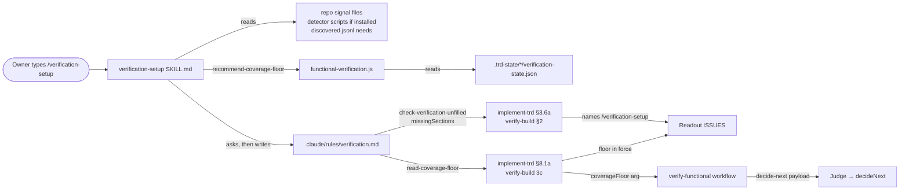

# TRD: verification.md Setup Skill and Coverage Floor

**Version**: 1.0.0
**Status**: Draft
**Created**: 2026-09-27
**Last Updated**: 2026-09-27
**Author**: @technical-architect
**Source PRD**: `docs/plan/verification-md-setup.investigation.md` (a `/plan` investigation record, `**Kind**: change`, `**Weight**: medium`; no supersession marker). Its own source is `docs/plan/verification-closeout.brief.md` §3, plus three owner rulings of 2026-09-27 the record cites: the coverage-floor question, "yes to one list", and the constitution 1.4.0 Governance Split row.
**Task ID Prefix**: VSET

---

## Changelog

| Version | Date | Changes | Author |
|---------|------|---------|--------|
| 1.0.0 | 2026-09-27 | Initial TRD creation | @technical-architect |
| 1.0.1 | 2026-09-27 | **Synced from `docs/TRD/functional-verification.md` (VSET-B002).** §3.3's `VerifyFunctionalArgs` gains optional `coverageFloor?: number | null` field after `fullRunCommand`; Judge STEP 3 payload gains `"coverageFloor"` value; test `verify-functional-trd-sync.test.js` field count moves from 21 to 22 | @technical-architect |

---

## 1. Overview

### 1.1 Technical Summary

Today `.claude/rules/verification.md` is written by hand or not at all. Across lightning-lane's
23 verification runs, 16 criteria were not verifiable because of the file itself (brief §3). A
filled file written to the pre-4.8.0 shape is invisible to the preflight: the unfilled check
matches only unmodified templates. The coverage floor has been built into `decideNext` since
verification-convergence, but nothing supplies it. So a run can report `satisfied` with 0 of 4
criteria proven.

This plan closes those three gaps with four pieces:

1. **A setup skill, `/verification-setup`** (`packages/skills/verification-setup/SKILL.md`, prompts
   only). The owner runs it. It reads the current file, detects what the repository can tell it,
   and asks one topic at a time, offering the detected value as the default. It recommends a
   coverage floor from this project's past runs. Then it writes the file and prints what changed.
   Running it is the owner's approval (O2). No command chains into it, and the model cannot start
   it (O3).
2. **Deterministic helpers in `functional-verification.js`.** `missingVerificationSections()`
   names the current-shape sections a file lacks. `readCoverageFloor()` parses the floor line.
   `recommendCoverageFloor()` does the recommendation arithmetic. Each has a CLI subcommand, and
   `check-verification-unfilled` gains `missingSections` in its result.
3. **A new template section `## 5a. Coverage floor`**, plus a reworded header. The old
   template's digest is kept, so untouched projects still read as unfilled.
4. **Plumbing.** `/implement-trd` §8.1a and `/verify-build` 3c read the floor. A new optional
   `coverageFloor` workflow argument carries it into the Judge's decide-next payload. The readout
   states the floor in force, or "none declared". §3.6a and `/verify-build` §2 name the missing
   sections and point at the skill, and `/init-project` names the skill after `stack.md`.

**Sequenced after `docs/TRD/verification-fix-loop.md` Phase 1.** That TRD builds the one
framework-skill list this skill joins (VFIX D14) and adds the bridge skill to `autonomy.md`
(VFIX D12). It also edits the same sections of `implement-trd.md`, `verify-build.md`,
`functional-verification.js`, `verify-functional.js` and `docs/TRD/functional-verification.md`.

**Already done, not a task:** the owner-approved constitution 1.4.0 Governance Split row. It
makes `verification.md` a slow, owner-governed file and running the setup skill that approval. It
is on disk in `.claude/rules/constitution.md` and `packages/core/templates/constitution.md.template`,
uncommitted on this branch. O3 cites it.

### 1.2 Objectives

O1–O9 keep the investigation record's IDs and wording. Q1 and Q2 come from the constitution. No other
objective is introduced.

| ID | Objective | Source |
|----|-----------|--------|
| O1 | Ensemble ships a skill that builds or updates a project's `.claude/rules/verification.md` by asking the owner questions, detecting what it can from the repo, and writing the file. | PRD O1 (owner, 2026-09-27; brief §3) |
| O2 | **Running the skill is the owner's approval to write the file.** The skill writes without a separate confirmation step, shows what it changed, and records credential LOCATIONS only, never values. | PRD O2 (owner, 2026-09-27: "running the update skill is considered explicit approval"); `verification.md` §3 ("Record WHERE a credential lives, never its value. This file is committed.") |
| O3 | No autonomous run writes `verification.md`. The skill is invoked by the owner only; no command chains into it. | PRD O3 (owner, 2026-09-27; brief §3); constitution 1.4.0 Governance Split |
| O4 | The skill asks for a **coverage floor**, meaning the share of success-definition criteria that must be proven before a run may report satisfied. It **recommends a value** from the project's own evidence and states why. | PRD O4 (owner, 2026-09-27: "make that coverage floor a question asked when verification.md is built using our skill - recommend an intelligent floor") |
| O5 | The floor the file declares reaches the verification loop. `/implement-trd` §8.1a and `/verify-build` step 3c read it and pass it to the `verify-functional` workflow, and the Judge's decide-next payload carries it. The readout states the floor in force, or "none declared". | PRD O5; `decideNext` reads `input.coverageFloor` (`functional-verification.js:257`) and nothing supplies it (`verify-functional.js` STEP 3 payload) |
| O6 | A filled `verification.md` written to an **older template shape** is detected, and the sections it lacks are named: resource capacity §1a, the `Loop may WRITE data?` column, the fast/full refresh split. The readout that names it points at the skill. | PRD O6; brief §3; `implement-trd.md` §3.6a records this as undetectable today |
| O7 | Every place that tells the owner `verification.md` is unfilled or out of date names the skill as the fix: the `/implement-trd` §3.6a readout, `/verify-build` §2, and `/init-project` (offered after `stack.md` is written). | PRD O7; brief §3 |
| O8 | The skill ships to every project through the ONE framework-skill list with role `support`. It is never selectable as a verification check. | PRD O8 (owner, 2026-09-27: "yes to one list"); the list is built by `verification-fix-loop` O9 |
| O9 | The template's header stops saying an agent never writes the file. It says the owner governs it and the skill is how it is written. | PRD O9; brief §3; template `:3`, `:11-13` |
| Q1 | New and changed deterministic code meets unit ≥ 60% and integration ≥ 50% where applicable. | `constitution.md` Quality Gates |
| Q2 | Documentation is updated with the change. | `constitution.md` Quality Gates ("Documentation updated") |

### 1.3 Key Technical Decisions

Inherited, not re-decided:
- **VC D8/D9.** `decideNext` re-labels only `satisfied`/`stalled`/`stuck`, and `COVERAGE_FLOOR`
  stays `null` in code. This plan does not ship a number. It supplies the owner's number from
  the file, which is the "one number turns it on" path D9 anticipated.
- **VC D5.** `verification.md` is read by the orchestrator and never probed.
- **VCON-B008/D13.** Prior templates are recognised by digest, with a byte-copy fixture and a test.
- **VART D2 → VFIX D14.** Framework skills ship through one list.
- **FV D3.** The report has one renderer.

Each decision below says where it departs from a sibling.

| ID | Decision | Choice | Serves Objective | Rationale | Alternatives Considered |
|----|----------|--------|------------------|-----------|------------------------|
| D1 | Form and name | A skill at `packages/skills/verification-setup/SKILL.md`, invocable in a project as `/verification-setup`. Frontmatter carries `disable-model-invocation: true`. | O1, O3 | A skill is the PRD's decision: the command surface is for workflow steps, and this is an interview. `disable-model-invocation` is this repo's existing way to make something owner-start-only (`audit-trd.md:8`, `create-trd.md:8`). It stops any command or agent reaching the skill through the `Skill` tool, which enforces O3 structurally instead of by instruction. | A thin command in `packages/core/commands/`. Rejected by the PRD. An instruction-only "do not invoke this" line. Rejected: the one-list readers and the bridge skill all name the skill, and a model that sees the name can invoke it unless the platform refuses. Revisit if `disable-model-invocation` turns out to also block the owner's typed `/verification-setup` (Could Not Verify). |
| D2 | Approval model | Invocation is the approval. After the last question the skill writes the file at once, with no preview and no yes/no. It then prints a per-section summary of what changed. An answer of "keep" (or skipping a topic) leaves that section's current content untouched. | O2 | Owner rulings of 2026-09-27, recorded verbatim in the PRD's Decision. The summary is how "shows what it changed" is met. The file is committed, so `git diff` is the owner's full view. | A propose-a-diff skill. Rejected by the owner ("Human users despise a skill like that"). A second confirmation after the questions. Rejected by the owner. |
| D3 | Interview mechanics | One `AskUserQuestion` call per topic, in file order: §1 environments (with the three permission columns), §1a capacity, §2 refresh/deploy, §3 credential locations, §4 tooling, §5 what cannot be verified, §5a coverage floor, §6 multi-repo. Each call offers the detected value first, marked as detected, then the file's current value where it differs, then "keep". Owner-only cells (write/deploy/restart permission, §1a counts, whether a gap is permanent) default to the template's own example row for that environment kind. They are labelled "not detectable — the conservative default". **On a re-run, a topic is asked only when its section is missing, its detected evidence differs from the file, or a recorded need names it (D12). Unchanged topics are listed as unchanged in the summary.** | O1, O4 | Questions inside `AskUserQuestion` are answered within the turn, so no `Stop` fires mid-interview. One topic per call is the PRD's procedure. Asking only what is missing or stale is the PRD's OQ-2 assumption, adopted: a re-run that re-asks forty cells is the propose-a-diff experience by another route. | Free-text chat turns. Rejected: each question ends a turn, and the `Stop`-hook judge then reads it as a mid-command pause. One call with every question. Rejected: the owner loses the per-topic default and its evidence. |
| D4 | Detection | Repo-only, and never contacts an environment. If `tooling-detector`, `framework-detector`, `test-detector` or `cloud-provider-detector` is installed under `.claude/skills/`, its script is used. Otherwise the skill reads the signal files named in its Inputs section: `package.json` scripts, `docker-compose*`, `.env*.example`, `vercel.json`, `railway.json`/`railway.toml`, `.claude/verification-notes.md`, `CLAUDE.md`. For `.env*` files it extracts **key names only**. Values are never read into the conversation. | O1, O2 | The detectors are only present in projects whose stack selected them, so the skill cannot assume them. Probing an environment would contradict "read, never probed" (VC D5), and it cannot be undone if a URL points somewhere live. Reading key names satisfies "credential locations only" at the source, not by a later filter. | Always run the detectors. Rejected: absent in most projects. Probe URLs to confirm reachability. Rejected: §3.6a already does reachability at run time, under the owner's declarations. |
| D5 | How the skill knows the current shape | `packages/skills/verification-setup/template.md` is a relative symlink to `../../core/templates/claude-directory/rules/verification.md`. `copy_framework_skills()` copies with `cp -RL`, which dereferences it, so every project receives a real copy of the template current at install or refresh time. | O1, O6 | The skill must restructure an old-shape file into the current shape and create a missing file, so it needs the template. A symlink keeps one source. `packages/full/` already distributes through symlinks (`templates -> ../core/templates`, `skills-lib -> ../skills`). | A copied `template.md`. Rejected: a second copy drifts, and would need a parity test. Locate the plugin's template at runtime. Rejected: a project skill has no reliable plugin root. Describe the sections in `SKILL.md` prose. Rejected: a third statement of the shape. |
| D6 | Floor recommendation | A pure `recommendCoverageFloor(runs)` in `functional-verification.js`, exposed as `recommend-coverage-floor <.trd-state dir>`. It reads each `*/verification-state.json` and computes each run's proven share with `coverageOf()`'s rule (`met` among all criteria). Runs whose `outcome` is `satisfied` and whose criteria count is positive are eligible. The recommendation is the lowest eligible share, rounded down to a multiple of 5%. With no eligible run, the recommendation is `null` ("none"). The result lists every run, so the skill can show its working in one line. | O4 | This is the PRD's Decision rule. Rounding down, with `decideNext`'s strict `<`, means every past satisfied run still passes. Arithmetic over JSON files belongs in tested code, not in a model's head (constitution Principle 3). | A fixed default. Rejected: an invented threshold, which `trd-authoring.md` forbids. The model computes it by reading files. Rejected: untestable, and a miscount becomes the owner's policy. Also estimate the structurally unverifiable ceiling (brief §3's second input). Not carried: the PRD's Decision uses past runs only (NG3). |
| D7 | How the floor is declared | The template gains `## 5a. Coverage floor` between §5 and §6, holding one line `Coverage floor: none`. The skill writes `Coverage floor: <N>%` (whole or decimal percent, 0–100) or `none`, followed by one `Why:` line. `readCoverageFloor(content)` finds the line inside a heading containing "coverage floor". It returns `{ floor, status, raw }`: `floor` is a fraction or `null`, `status` is `declared`, `none`, `absent` or `invalid`. It is exposed as `read-coverage-floor <path>`. **Percent in the file, fraction on the wire.** | O4, O5 | `decideNext` compares a 0–1 ratio to the floor directly. A model copying "60" from the file would re-label every run. A parser fixes the unit once. `5a` follows `1a`'s precedent and renumbers nothing. | A model reads the line at §8.1a. Rejected: the unit error above. A separate JSON config. Rejected: a second owner-policy file beside the one the constitution now governs. A fraction in the file (`0.6`). Rejected: the owner reads percentages, and the readout prints them. |
| D8 | Carrying the floor into the loop | A new optional workflow argument `coverageFloor` (`number \| null`, default `null`). It is validated as `null` or a finite number in `[0, 1]` before any agent is dispatched, or it throws. It is placed directly after `fullRunCommand` in both dispatch blocks and in FV TRD §3.3, taking the list from 21 fields to 22. The Judge's STEP 3 decide-next payload gains `"coverageFloor": <value>`. `COVERAGE_FLOOR` in the lib stays `null`. | O5 | This is the PRD's plumbing. Validation follows the existing arg-guard standard (`since`, `cap`). Placing the argument beside the other three `verification.md`-derived arguments groups them, and leaves the `slice(-3) == checks/checkComments/pagesDir` assertion true. | Pass the floor inside `notes`/`stackHints` and have the Judge read it. Rejected: the same unit hazard as D7's rejected option. Set `COVERAGE_FLOOR` from the file at load time. Rejected: the workflow has no filesystem (VC D5), and the lib must stay pure. |
| D9 | A floor line that does not parse | `status: 'invalid'` → no floor is applied (`coverageFloor: null`). ISSUES names the raw text and says to fix it with `/verification-setup`. The run is never STUCK over it. | O5 | A typo must be visible. Ignoring it silently reproduces the "satisfied on nothing" failure unseen. It must not stop verification either: partial verification with a stated gap beats none (`verify-build.md` §2). | STUCK the run. Rejected: blocks all verification on a formatting error. Guess (e.g. `60` → 60%). Rejected: a guessed policy. |
| D10 | Old-shape detection | `missingVerificationSections(content)` returns, in file order, the ids of current-shape sections the file lacks. The detection matches text case-insensitively, so renumbering a heading does not count as missing: `resource-capacity` (a heading containing "resource capacity"), `write-permission-column` (a table header containing "Loop may WRITE data?"), `refresh-split` (a table header containing both "fast refresh" and "full deploy"), `coverage-floor` (a heading containing "coverage floor"). A `VERIFICATION_SECTION_LABELS` map gives each id its readout wording. `check-verification-unfilled` returns `missingSections` for every existing file. §3.6a composes its message from that list. **This extends O6's three sections with the floor section**, so a filled current-shape file is told about the floor once. | O6, O7, O4 | Structural detection is the PRD's Decision: a filled file never matches a digest. Deriving the message from the list replaces §3.6a's fixed "predates the resource / read-only / fast-refresh sections" sentence. That sentence would be wrong for a `resource-table-v1` or `v2` copy, which has those sections and lacks only the floor. | More digests. Rejected by the PRD. Leave the floor out of detection. Rejected: an owner with a filled file would never learn the question exists. The PRD's OQ-2 assumes re-running asks about the floor, which needs a reason to re-run. See OQ-3. |
| D11 | The CLI when the template path does not exist | `check-verification-unfilled <projectPath> [templatePath]`. When `templatePath` is absent or missing, the CLI skips the current-template comparison, still checks the prior-template digests, and still returns `missingSections`. With no digest match, the result is `{ unfilled: null, reason: 'template-missing', matchedTemplate: null, missingSections }`, and §3.6a says the unfilled check could not run. | O6, O7 | §3.6a passes `packages/core/templates/claude-directory/rules/verification.md`. That path exists in this repository, and apparently not in a scaffolded project, where the CLI would throw on `readFileSync` (Could Not Verify). Degrading means O6's detection reaches the projects it exists for. | Fix §3.6a's path to the plugin's template. Not taken here: it is outside the PRD, and it needs the plugin-root question answered (OQ-7). Leave the throw. Rejected: O6 would silently never reach a consumer project. |
| D12 | Keeping the file current as needs land | The skill reads `.trd-state/*/discovered.jsonl` rows whose `file` is `.claude/rules/verification.md`: the needs `/verify-build --fix` records under VFIX D13. Each is offered as a proposed change in its topic. Once the file is written, the skill names in its summary which needs it settled. It does not edit the ledger. | O1 | Brief §3: the builder "keeps it current as rulings land in later bridges". The bridge skill never edits `verification.md` (VFIX D12, NG7), so recorded needs have exactly one place to be applied. | Have the bridge write `verification.md`. Rejected by VFIX D12 and the template header (O9). Mark ledger rows resolved. Rejected: `discovered.js` has no resolution status for gap rows, and adding one is outside the PRD. |
| D13 | Template header and its echoes | Header: *"Owner-governed, like `stack.md`. It changes only when the owner runs `/verification-setup`, which asks, then writes; running it is the approval. No autonomous run edits this file."* The rationale at `:11-13` keeps "infrastructure policy, not observations", and adds that the skill offers what it detects as defaults. The `scaffold-project.sh` `refresh_rules()` comment that quotes the old header is updated to match. **Departs from brief §3's "through the setup skill or the bridge"**: the bridge never writes the file (VFIX D12). | O9, O3 | The PRD's O9 wording. A comment quoting retired text is a documentation claim gone false. | Keep "An agent READS this and never writes it". Rejected: the skill is an agent that writes it. |
| D14 | Freezing the pre-change template | Before the template is edited, copy it byte-for-byte to `packages/core/lib/__fixtures__/verification.resource-table-v2.md`. Add `'resource-table-v2': <sha256 of its normalize()d content>` to `KNOWN_UNFILLED_DIGESTS`, with tests matching the two existing ones. | O6 (PRD "absorbed … [BLOCKS]") | Without it, every project holding the unmodified current template reads as filled the moment the template moves on. The label follows the existing `resource-table-v1` naming. | None viable. This is the established pattern (VCON-B008). |
| D15 | Where the skill is named | By §3.6a (unfilled, old shape, template missing) and by §8.1a's ISSUES line (invalid floor). By `/verify-build` §2, which restates §3.6a's reporting. By `/init-project` Step 4.4, which lists `verification.md` as a rule shipped unfilled, and by its completion report's Next Steps. Named, never run. | O7, O3 | These are the PRD's three places, plus the invalid-floor line D9 creates. Naming a command is reporting, not deferring (`autonomy.md`, "scoped to ONE command"). | Also name it after a run with several not-verifiable criteria citing the file (brief §3 "Invoke"). Not carried: PRD O7 lists three places (NG4). |
| D16 | Delivery | Add one line `verification-setup support` to `packages/skills/framework-skills.txt` (VFIX D14). No scaffold, rebase or test edit beyond that. VFIX-P001's acceptance makes the list the only place a framework skill is named. | O8 | The one list is the owner's ruling. `support` keeps the skill out of check selection by construction. | Add it to a hand-kept array. Rejected: the list replaces those. |
| D17 | Autonomy rule | `autonomy.md` (rule and template) names `/verification-setup` beside `/refine-*` and the bridge skill as interactive by purpose. | O1 | Its questions are outside `AskUserQuestion`'s four permitted cases. Without the entry, the rule text forbids the skill's whole method. VFIX D12 made the same entry for the bridge, with the same reasoning. | Rely on D3 (no `Stop` mid-interview) alone. Rejected: the written rule would still contradict the skill. |
| D18 | How the skill ends | The four-section readout (STATE lists what changed per section; DECISIONS lists defaults applied without an answer; ISSUES lists anything left blank; NEXT gives the next command). Then the `═══ COMMAND COMPLETE: /verification-setup ═══` banner, and the `notify-complete.sh` call. | O2 | The readout is how "shows what it changed" is met. The router opens a run-state marker on any slash prompt, and only the COMPLETE turn's `notify-complete.sh` closes it (`autonomy.md` Enforcement 3). Without the close, Judgment B stays armed on the session for 30 minutes. | A bare summary with no banner. Rejected: leaves the marker open, and breaks constitution Prohibition 7 ("No silent completion"). |
| D19 | The readout states the floor | `/implement-trd` Step 9 STATE and `/verify-build` §5 print `Coverage floor: <N>% (from verification.md)` or `Coverage floor: none declared`. `decideNext`'s re-label reason prints the floor as a percentage (`below the 60% coverage floor`) instead of a fraction. | O5 | This is the PRD's readout requirement. The percentage follows `CLAUDE.md` ("Numbers carry their unit"). The reason string is what the report's Reason line shows. | Add a floor line to `renderReport`'s header. Not taken: the PRD asks for the readout, and the re-label reason already carries the floor into the report whenever it fires. |
| D20 | Sequencing | This TRD's Phase 1 starts after `verification-fix-loop` Phase 1 is delivered. That is stated as a phase prerequisite, not as task-level dependencies, because the task graph drops dependency ids from another TRD (`task-graph.js:124-133`). | O5, O6, O7, O8 | The PRD's Decision. Five files are shared with VFIX tasks (listed in §5.1), and D16/D17 extend VFIX artefacts. | Build in parallel and rebase. Rejected: two TRDs editing the same command sections is the lost-update the Touches partition exists to prevent, with no partition across TRDs. |

### 1.4 Technology Stack

| Layer | Technology | Purpose | Notes |
|-------|------------|---------|-------|
| Skill | Markdown `SKILL.md` | The interview | Prompts only (constitution Principle 2) |
| Library | Node.js (`packages/core/lib/functional-verification.js`) | Section detection, floor parse, floor recommendation, CLI | `stack.md`: Node 18+ |
| Workflow | `packages/core/workflows/verify-functional.js` | Carries `coverageFloor` to the Judge | Existing |
| Commands | Markdown (`implement-trd.md`, `verify-build.md`, `init-project.md`) | Reading the floor, reporting | Each with its mirror copy |
| Tests | Jest ^29.7.0; BATS ^1.9.0 for the existing shell suites | Unit and parity | `stack.md` |

### 1.5 Integration Points

| System | Type | Direction | Notes |
|--------|------|-----------|-------|
| `packages/skills/framework-skills.txt` (VFIX D14) | Plain list | In | One line added (D16) |
| `.trd-state/*/verification-state.json` | JSON files | In (read) | Read by `recommend-coverage-floor` (D6) |
| `.trd-state/*/discovered.jsonl` | JSONL ledger | In (read) | Rows naming `verification.md` (D12; row shape from VFIX D13) |
| `verify-functional` workflow | `Workflow` args | Out | New `coverageFloor` argument (D8) |
| `autonomy.md` (rule and template) | Rule text | Out | One entry (D17), after VFIX-B006's |

---

## 2. System Architecture

### 2.1 Architecture Overview



The skill is the only writer of `verification.md`. Everything to the right of the file reads it,
either through the deterministic CLI or, as today, through `stackHints` excerpts.

### 2.2 Component Architecture

**`verification-setup` skill.** It runs the interview and writes the file. Its inputs are listed
under D4, D6 and D12. It depends on `functional-verification.js`'s CLI in `.claude/lib/`, which
every scaffolded project carries (§3.6a already calls it there).

**`functional-verification.js` additions.** Pure functions plus CLI subcommands, with no new
module. Each new function sits beside the concern it extends: detection beside
`isVerificationUnfilled`, and the floor beside `decideNext`'s `COVERAGE_FLOOR`.

**Commands.** They read and report. Only §8.1a / 3c turn the file's floor into an argument.

---

## 3. Technical Specifications

### 3.1 Library — `packages/core/lib/functional-verification.js` (D6, D7, D10, D11, D14, D19)

```javascript
// Current-shape sections a verification.md may lack, in file order (D10).
const VERIFICATION_SECTION_LABELS = {
  'resource-capacity':       '§1a resource capacity (how many of each resource may exist at once)',
  'write-permission-column': "§1's `Loop may WRITE data?` column",
  'refresh-split':           "§2's fast refresh / full deploy split",
  'coverage-floor':          '§5a coverage floor',
};

/** @returns {string[]} ids from VERIFICATION_SECTION_LABELS the content lacks, in file order */
function missingVerificationSections(content) {}

/**
 * Parses the `Coverage floor:` line inside the heading containing "coverage floor" (D7).
 * @returns {{ floor: number|null, status: 'declared'|'none'|'absent'|'invalid', raw: string|null }}
 *   `floor` is a fraction in [0, 1]; "60%" -> 0.6. `none` (any case) -> floor null, status 'none'.
 *   No such heading, or no such line under it -> status 'absent'. Anything else -> 'invalid'.
 */
function readCoverageFloor(content) {}

/**
 * @param {Array<{ feature: string, outcome: string|null, criteria: Array<{status: string}> }>} runs
 * @returns {{
 *   runs: Array<{ feature, outcome, proven, total, share }>,   // every run passed in, share = proven/total (null when total is 0)
 *   eligible: number,                                          // runs with outcome 'satisfied' and total > 0
 *   recommended: number|null,                                  // floor-to-0.05 of the lowest eligible share; null when eligible is 0
 *   lowest: { feature, proven, total, share } | null,
 * }}
 */
function recommendCoverageFloor(runs) {}
```

Rounding is `Math.floor(share * 20 + 1e-9) / 20`. The epsilon keeps a share such as 0.35 from
rounding down to 0.30 through floating-point error.

CLI (same `usage()` / `process.exit(1)` conventions as the existing subcommands):

| Subcommand | Output |
|------------|--------|
| `check-verification-unfilled <projectPath> [templatePath]` | `{ unfilled, matchedTemplate, missingSections }`. A missing project file keeps today's `{ unfilled: null, reason: 'missing', path }`. A missing template with no prior-digest match gives `{ unfilled: null, reason: 'template-missing', matchedTemplate: null, missingSections }` (D11). |
| `read-coverage-floor <projectPath>` | `readCoverageFloor()` output. A missing file gives `{ floor: null, status: 'absent', raw: null, reason: 'missing' }`. |
| `recommend-coverage-floor <trdStateDir>` | `recommendCoverageFloor()` over every `<trdStateDir>/*/verification-state.json`, plus `skipped: [<path>]` for files that do not parse. |

`KNOWN_UNFILLED_DIGESTS` gains `'resource-table-v2'` (D14). The `decideNext` re-label reason
renders the floor as a percentage (D19). `COVERAGE_FLOOR` stays `null`. Its comment names where
an owner sets a floor (`verification.md` §5a, via `/verification-setup`).

**Error handling:** each function is pure and throws on nothing but a non-string `content`, where
it throws `TypeError`, matching `decideNext`'s validate-don't-default stance. The CLI reports an
unreadable file as a `reason`, not a crash, except for misuse (missing arguments), which exits 1.

### 3.2 Template — `packages/core/templates/claude-directory/rules/verification.md` (D7, D13, D14)

- Header and rationale per D13.
- New section, between §5 and §6:

```markdown
## 5a. Coverage floor

The share of the success definition's criteria that must be PROVEN (`met`) before a
verification run may report `satisfied`, `stalled` or `stuck`. Below it the run reports
`insufficient-coverage` instead. Write a percentage or `none`; `none` leaves the check off.
`/verification-setup` recommends a value from this project's past runs and says why.

Coverage floor: none
```

- `.claude/rules/verification.md` is updated to stay byte-identical. `runtime-integrity.test.sh`
  requires every `.claude/rules/` file to match its template (TR1).

### 3.3 Workflow — `packages/core/workflows/verify-functional.js` (D8)

```javascript
// NEW (verification-md-setup D8). The owner's coverage floor from verification.md §5a, as a
// fraction; null (the default) leaves decideNext's re-label dormant, exactly as today.
const FLOOR = a.coverageFloor === undefined ? null : a.coverageFloor
if (FLOOR !== null && !(typeof FLOOR === 'number' && Number.isFinite(FLOOR) && FLOOR >= 0 && FLOOR <= 1)) {
  throw new Error('verify-functional: args.coverageFloor must be null or a number in [0, 1] (a fraction, not a percentage)')
}
```

The Judge prompt's STEP 3 payload gains `"coverageFloor":${JSON.stringify(FLOOR)}` after `"cap"`.
`docs/TRD/functional-verification.md` §3.3's `VerifyFunctionalArgs` interface gains
`coverageFloor?: number | null;` so `verify-functional-trd-sync.test.js` stays green at 22 fields.

### 3.4 Commands (D9, D10, D11, D15, D19)

**`/implement-trd` §3.6a** (and its mirror). This step reads `missingSections` from the call it
already makes, and reports one of the following:
- Unfilled, `matchedTemplate: "current"`: *"`verification.md` has never been filled in. Run
  `/verification-setup`."*
- Unfilled, a prior label: *"`verification.md` is an unfilled copy of an older template. It lacks
  <labels>. Run `/verification-setup`."*
- Filled, `missingSections` non-empty: *"`verification.md` was written to an older template
  shape. It lacks <labels>. Run `/verification-setup`; it asks only about what is missing."*
  This keeps the one-line consequences where they apply. Without §1a, every lane runs at
  concurrency 1. Without the refresh split, no refresh or full run is declared. Without §5a, no
  coverage floor is applied.
- `reason: 'template-missing'`: *"the unfilled check could not run: the shipped template was not
  found"*, followed by the `missingSections` line if the list is non-empty.

The parenthetical stating that an owner-filled old-shape file "never reaches that owner" is
deleted, because it is no longer true.

**`/implement-trd` §8.1a.** Runs
`node .claude/lib/functional-verification.js read-coverage-floor .claude/rules/verification.md`
and sets `coverageFloor` from `floor`. On `status: 'invalid'` it adds D9's ISSUES line. **§8.3**
adds `coverageFloor,` after `fullRunCommand,` with the comment `// §8.1a -- verification.md §5a
as a fraction, or null when none is declared`. **Step 9** STATE carries D19's floor line whenever
verification ran.

**`/verify-build`** (and its mirror). §2's restatement names the skill and the missing sections.
3c names `coverageFloor` among what §8.1a derives. §4's block matches `/implement-trd` §8.3 field
for field, and its intro reads "All 22 fields". §5 states the floor per D19.

**`/init-project`** (both copies: `packages/core/commands/` and
`packages/full/commands/plugin-only/`). Step 4.4 lists `verification.md` as a framework-shipped
rule copied unfilled, filled by running `/verification-setup`. The completion report's Next Steps
adds *"Fill `.claude/rules/verification.md`: run `/verification-setup`"* after the `stack.md`
review item.

### 3.5 The skill — `packages/skills/verification-setup/SKILL.md` (D1–D6, D12, D17, D18)

Frontmatter: `name`, `description`, `when_to_use`, `disable-model-invocation: true`,
`allowed-tools: Read, Write, Edit, Bash, Glob, Grep, AskUserQuestion`.

Sections, in order (the structural test asserts them):

1. **When it applies.** A new project after `/init-project`. A readout that named the skill. A
   bridge that recorded needs against the file. Or any time the owner wants to change the file.
2. **Inputs.** The current `.claude/rules/verification.md`, or `template.md` when it is absent.
   `template.md` for the current shape. `check-verification-unfilled` for `missingSections`.
   The D4 signal files and any installed detector scripts. `recommend-coverage-floor .trd-state`.
   D12's ledger rows.
3. **Topics.** D3's eight topics in file order. For each: what is detected and from where, what
   is owner-only, and the default rule.
4. **Coverage floor.** Shows the per-run table from `recommend-coverage-floor`, then the
   recommendation with its one-line reason. The reason names the lowest satisfied run and the
   rounding, or says no past run ended satisfied, so no floor is recommended yet and one can be
   added after the first runs. When the lowest satisfied run proved little, the skill says so
   with that run's figures and the owner decides (OQ-4). Any answer is accepted, including
   `none`.
5. **Writing.** Writes the whole file in the current shape. Owner content in every section the
   interview did not change is kept verbatim. Then it re-runs `check-verification-unfilled` and
   `read-coverage-floor` on the result. A non-empty `missingSections`, or an `invalid` floor, is
   reported in ISSUES as the skill's own defect.
6. **Never.** Write a credential value (a vault item name, env key name or file path only). If an
   answer looks like a value, do not write it and ask for its location instead. Contact or probe
   an environment. Edit any file other than `.claude/rules/verification.md`. Start a verification
   run or any other command.
7. **Readout.** D18.

`packages/skills/verification-setup/__tests__/skill-md.test.js` follows
`verify-data-fidelity/__tests__/skill-md.test.js`. It checks valid frontmatter with
`disable-model-invocation: true`, the seven headings in order, and that `template.md` resolves to
the shipped template.

### 3.6 Delivery (D5, D16, D17)

- `packages/skills/framework-skills.txt`: `verification-setup    support`.
- `packages/skills/verification-setup/template.md` → `../../core/templates/claude-directory/rules/verification.md`
  (relative symlink, committed as a symlink).
- `.claude/rules/autonomy.md` and `packages/core/templates/claude-directory/rules/autonomy.md`:
  one entry beside VFIX-B006's. Both copies stay identical.

---

## 4. Master Task List

### 4.1 Task ID Convention

`VSET-[CATEGORY][SEQ]`: B = implementation, D = documentation, T = testing.

**Phase 1 prerequisite (D20):** `docs/TRD/verification-fix-loop.md` Phase 1 delivered. That
means VFIX-B001, B002, B004, B005, B006, P001, D001 and D002 in particular.

### 4.2 Phase 1: Library and template, workflow argument, commands, skill, init, docs

| Task ID | Description | Serves | Skills | Dependencies | Acceptance Criteria |
|---------|-------------|--------|--------|--------------|---------------------|
| VSET-B001 | `functional-verification.js` (§3.1) and the template (§3.2) as one task. The template's digest, fixture and section detection are verified against each other, so splitting them serializes on the same test file for no gain. Order inside the task: freeze the current template as `__fixtures__/verification.resource-table-v2.md` and add its digest (D14) **before** editing the template. Then add the three functions, the two new subcommands and the `check-verification-unfilled` changes (D11), and render the re-label reason as a percentage (D19). Edit the template's header and add §5a (D13, D7). Copy the template to `.claude/rules/verification.md`. Update the `refresh_rules()` comment in `scaffold-project.sh`. Refresh the `.claude/lib/` copy. | O4, O5, O6, O9, D6, D7, D10, D11, D13, D14, D19 | `jest` | None | The following are checked in `functional-verification.test.js`. The `resource-table-v2` fixture reads `{unfilled: true, matchedTemplate: 'resource-table-v2'}` against the edited template. `missingSections` is all four ids for `pre-1.5.0`, `['coverage-floor']` for `resource-table-v1` and `v2`, and `[]` for the new template. A filled pre-1.5.0-shape file reads `unfilled: false` with all four ids. A missing template path returns `template-missing` with `missingSections`. It still returns `unfilled: true` for a prior-digest match. `readCoverageFloor` covers `60%` → 0.6, `none`, `NONE`, `12.5%`, absent heading, heading without the line, `150%`, `abc`, and `0.6` (invalid). `recommendCoverageFloor` covers no runs → `null`; only non-satisfied runs → `null`; the three satisfied runs 12/12, 3/6, 26/32 → 0.5; a share of 0.35 → 0.35 (the epsilon); `total: 0` excluded. `decideNext`'s re-label reason contains `%`. `runtime-integrity.test.sh`'s rule-parity tests pass. Existing tests pass. |
| VSET-B002 | `verify-functional.js`: the `coverageFloor` argument, its validation and the STEP 3 payload (§3.3). `docs/TRD/functional-verification.md` §3.3 declares it, with a changelog row. Update `verify-functional.test.js` and `verify-functional-trd-sync.test.js` (21 → 22 read fields). | O5, D8 | `jest` | None | A test dispatches with `coverageFloor: 0.6` and asserts the Judge prompt's decide-next payload carries `"coverageFloor":0.6`. Omitted or `null` → `"coverageFloor":null`. `60`, `-0.1`, `"0.6"` and `NaN` each throw before any agent is dispatched. The TRD-sync suite passes with 22 fields declared and read. |
| VSET-B003 | Command prose, as one task because both files share `verify-command-surface.test.js` and the dispatch-block identity test spans them. `implement-trd.md` (+ `.claude/` mirror): §3.6a, §8.1a, §8.3 and Step 9 per §3.4. `verify-build.md` (+ mirror): §2, 3c, §4 and §5 per §3.4. Update `verify-command-surface.test.js`. | O5, O6, O7, D9, D10, D11, D15, D19 | `jest` | VSET-B001, VSET-B002 | Both dispatch blocks list 22 identical fields, with `coverageFloor` directly after `fullRunCommand`, and the last three are still `checks/checkComments/pagesDir`. `verify-build.md` says "All 22 fields". §3.6a names `/verification-setup` in all four report shapes, reads `missingSections`, and no longer contains "never reaches that owner". §8.1a runs `read-coverage-floor` and states the invalid-floor ISSUES line. Step 9 and `/verify-build` §5 carry the "Coverage floor:" line in both forms. Mirrors are byte-identical. |
| VSET-B004 | The skill (§3.5): `SKILL.md`, the `template.md` symlink, and `__tests__/skill-md.test.js`. The list line (D16). The `autonomy.md` entry in both copies (D17). If `packages/skills/README.md` enumerates library skills, name it there too. | O1, O2, O3, O4, O8, D1, D2, D3, D4, D5, D6, D12, D16, D17, D18 | `jest` | VSET-B001 | The structural test passes: frontmatter, `disable-model-invocation: true`, seven sections in order, and `template.md` resolving to the shipped template. The prose states D2 (no confirmation step; "keep" leaves a section untouched), D3's topic order and re-run rule, D4's key-names-only reading of `.env*`, D6's recommendation shown with its working, D12's ledger reading, and every item under "Never". Scaffolding a fixture project installs `.claude/skills/verification-setup/` containing a real file (not a link) at `template.md`. `framework-skills.txt` has the line with role `support`, and `fix-audit.js` reports it if named in a `## Verification Artifacts` table (VFIX-B007's check). The two `autonomy.md` copies are identical. |
| VSET-B005 | `/init-project`, both copies (§3.4). | O7, D15 | | None | Step 4.4 names `verification.md` and `/verification-setup`. Completion-report Next Steps names `/verification-setup` after the `stack.md` item. Nothing in the file runs the skill. The two copies are byte-identical. |
| VSET-D001 | Documentation with no code beside it. In `.claude/rules/process.md` and `packages/core/templates/process.md.template` (both are authored rules, so both need the edit), MAINTENANCE gains `/verification-setup` with a one-line purpose. In `docs/TRD/verification-convergence.md`, OQ-1 ("the coverage floor stays unset") and D9 get an inline note: the floor stays unset in code and is now supplied from `verification.md` §5a by the owner (link here), with a changelog row. | Q2, O5 | | None | Both process files name the skill and remain consistent with each other. VC's OQ-1 and D9 carry the note, with D9's `COVERAGE_FLOOR = null` unchanged. VC gains a changelog row. |

### 4.3 Phase 2: End-to-end

| Task ID | Description | Serves | Skills | Dependencies | Acceptance Criteria |
|---------|-------------|--------|--------|--------------|---------------------|
| VSET-T001 | [LIVE] Add opt-in smoke scenario `test/smoke/scenarios/verification-md-setup.sh`, registered in `LLM_OPT_IN_SCENARIOS`, following `verify-functional.sh`'s throwaway-project pattern. It exercises the seam between the CLI (B001), the workflow argument (B002) and the command prose (B003), which no single task owns. The fixture has a PRD with four criteria, only one of which the fixture code implements observably. It has a hand-filled `verification.md` in the **pre-1.5.0 shape**, plus a `## 5a. Coverage floor` section reading `Coverage floor: 50%`. One `/verify-build` run. The interview itself is not exercised: it asks questions and cannot run headless (§6.1). | O5, O6, O7 | | VSET-B003 | The readout names the three missing sections and `/verification-setup`. `verification-state.json` or the report shows outcome `insufficient-coverage`, with a reason containing `50%`. The readout says "Coverage floor: 50%". The workflow's Judge prompt in the transcript carries `"coverageFloor":0.5`. `.claude/rules/verification.md` is byte-unchanged. Skips (not fails) without `claude` or `jq`. |

## Deferred by design

| Task ID | Why it cannot run now |
|---------|----------------------|
| VSET-T001 | Tagged [LIVE]. A normal run writes and registers the smoke scenario, but running it needs a live model session driving /verify-build against a fixture. The TRD's own 'Deferred by design' table already schedules that as follow-up. |

---

## 5. Execution Plan

### 5.1 Phase Overview

| Phase | Focus | Prerequisites | Parallelizable Sessions |
|-------|-------|---------------|------------------------|
| 1 | Library and template, workflow argument, commands, skill, init, docs (each task ships its own tests) | `verification-fix-loop` Phase 1 delivered (D20) | 1A, 1B, 1C, 1D start together; 1E after 1A and 1B; 1F after 1A |
| 2 | `[LIVE]` end-to-end smoke | Phase 1 | 2A |

Files shared with `verification-fix-loop`, which is why D20 sequences this plan after it:
- `functional-verification.js` (VFIX-B001)
- `verify-functional.js` (VFIX-B002)
- `implement-trd.md` and `verify-build.md` with `verify-command-surface.test.js` (VFIX-B004, B005)
- `docs/TRD/functional-verification.md` (VFIX-D002)
- `process.md` (VFIX-D001)
- `autonomy.md` (VFIX-B006)
- `framework-skills.txt` (VFIX-P001)

No two VSET tasks in the same wave share a file.

### 5.2 Session Details

- **1A** VSET-B001 (lib and template). @backend-implementer.
- **1B** VSET-B002 (workflow argument and FV TRD). @backend-implementer.
- **1C** VSET-B005 (`/init-project`). @backend-implementer.
- **1D** VSET-D001 (process files, VC note). @backend-implementer.
- **1E** VSET-B003 (command prose) after 1A and 1B. @backend-implementer.
- **1F** VSET-B004 (the skill) after 1A. @agent-implementer: the deliverable is a prompt.
- **2A** VSET-T001. @verify-app.

### 5.3 Parallelization Map

```mermaid
gantt
    title Execution Plan (No time scale - dependency order only)
    dateFormat X
    axisFormat %s
    section Prerequisite
    verification-fix-loop Phase 1: pre, 0, 1
    section Phase 1
    B001 lib + template: b1, after pre, 1
    B002 workflow arg: b2, after pre, 1
    B005 init-project: b5, after pre, 1
    D001 docs: d1, after pre, 1
    B003 commands: b3, after b1 b2, 1
    B004 skill: b4, after b1, 1
    section Phase 2
    T001 LIVE smoke: t1, after b3, 1
```



### 5.4 Critical Path

verification-fix-loop Phase 1 → VSET-B001 → VSET-B003 → VSET-T001. VSET-B001 is on it because
the command prose quotes the CLI's result shape, and the smoke scenario needs both.

### 5.5 Offload Recommendations

| Task | Recommended Agent | Rationale |
|------|-------------------|-----------|
| VSET-B004 | @agent-implementer | The deliverable is an interview prompt, and its quality is prompt engineering |

---

## 6. Quality Requirements

### 6.1 Testing Requirements

| Type | Coverage Target | Source | Scope |
|------|-----------------|--------|-------|
| Unit Tests | ≥ 60% | `constitution.md` Quality Gates | New and changed functions in `functional-verification.js`; the workflow's `coverageFloor` guard and payload |
| Integration Tests | ≥ 50% where applicable | `constitution.md` Quality Gates | VSET-T001's smoke scenario; the existing BATS rule-parity and scaffold suites |

**No headless path for the interview.** The skill asks its questions through `AskUserQuestion`,
which needs a person. It is verified manually per the constitution's Testing Philosophy
("manual verification is primary"), in a scratch project and never in this repository (TR1).
Its structure is covered by the `skill-md` test, its arithmetic by `recommendCoverageFloor`'s
unit tests, and its output shape by the parsers it re-runs on its own result (§3.5, step 5).

### 6.2 Code Quality Standards

None beyond `stack.md`'s ESLint/Prettier/ShellCheck configuration.

### 6.3 Security Requirements

O2's "credential LOCATIONS only, never values" is the security requirement. D4 enforces it at
the source, since `.env*` files are read for key names only. §3.5 "Never" enforces it at the
answer. It matters twice over: `verification.md` is committed, and `stackHints` carries it into
verification agents' prompts. No generic checklist is added.

### 6.4 Performance Requirements

None. No performance objective was stated.

---

## 7. Risk Assessment

### 7.1 Risks Imported from PRD

The PRD records none.

### 7.2 Technical Risks

| ID | Risk | Likelihood | Impact | Mitigation |
|----|------|------------|--------|------------|
| TR1 | `runtime-integrity.test.sh` requires this repository's `.claude/rules/verification.md` to be byte-identical to the template, so running the skill here fails the battery | Med | Med | The skill is exercised in scratch projects only (§6.1). OQ-5 asks whether this repository should ever hold a filled file. |
| TR2 | `verification-fix-loop` changes the list format or the `autonomy.md` entry shape before delivery | Low | Low | D16 and D17 are one line each. VSET-B004 reads the delivered format. |
| TR3 | The recommendation rule recommends a near-zero floor when a past satisfied run proved almost nothing (e.g. 0 of 4 → 0%), which leaves the floor inert | Med | Med | The skill shows the per-run table with the lowest run named, so the owner sees why the number is low and can choose higher. Whether the rule should exclude such runs is OQ-4. |
| TR4 | Symlink dereference: an install path that does not use `cp -RL` would ship `template.md` as a dangling link | Low | Med | VSET-B004's acceptance scaffolds a fixture project and asserts a real file. |

### 7.3 Contingency Plans

**TR1 Contingency:** if the owner wants this repository's own file filled, `runtime-integrity`'s
two rule-parity tests exempt `verification.md` the way `refresh_rules()` already does
(`AUTHORED_RULES`). That is a one-line change in each test.

---

## 8. Non-Goals (Scope Boundaries)

| ID | Non-Goal | Rationale |
|----|----------|-----------|
| NG1 | Building the one framework-skill list | PRD: "not absorbed: built by `verification-fix-loop` (O9 there)" |
| NG2 | Any autonomous or chained write of `verification.md`: by `/verify-build --fix`, by the bridge skill, or by any command | O3; constitution 1.4.0 |
| NG3 | Estimating a "structurally unverifiable" ceiling from the declared environments as a second input to the floor recommendation | Brief §3 proposed it. The PRD's Decision recommends from past runs only |
| NG4 | Naming the skill after a run with several not-verifiable criteria citing the file | Brief §3 "Invoke" lists it. PRD O7 names three places |
| NG5 | Shipping a default floor in code, or changing `COVERAGE_FLOOR = null` | PRD Decision ("an invented threshold is exactly what `trd-authoring.md` forbids"); VC D9 |
| NG6 | A proposed-diff mode or a second confirmation step | Owner, 2026-09-27 (PRD Decision) |
| NG7 | Editing `constitution.md` | Already done by the owner (1.4.0, on disk) |
| NG8 | Correcting §3.6a's template path for scaffolded projects | Outside the PRD. D11 makes the CLI degrade instead (OQ-7) |

---

## Verification Artifacts

None apply — this change has no UI design, no interaction diagram and renders no data from an API or store; it changes a skill, a template, a library, a workflow argument and command prompts.

---

## Task Grounding

### VSET-B001

- **Touches:**
  - `packages/core/lib/functional-verification.js` — add `missingVerificationSections()`,
    `readCoverageFloor()`, `recommendCoverageFloor()`, `VERIFICATION_SECTION_LABELS`;
    extend `KNOWN_UNFILLED_DIGESTS` with `'resource-table-v2'`; extend the
    `check-verification-unfilled` CLI branch (D11); add `read-coverage-floor` and
    `recommend-coverage-floor` CLI subcommands; edit `decideNext`'s coverage re-label reason
    to render the floor as a percentage (D19) [read: full file, :1-729]
  - `packages/core/lib/functional-verification.test.js` — new tests per the acceptance
    criteria, **plus** required edits to four pre-existing tests the task text doesn't name
    (see Careful)
  - `packages/core/lib/__fixtures__/verification.resource-table-v2.md` (new) — byte-for-byte
    freeze of the current template, taken **before** editing it (D14), following the sibling
    `verification.resource-table-v1.md` / `verification.pre-1.5.0.md` fixtures already there
    [read: `ls packages/core/lib/__fixtures__/`]
  - `packages/core/templates/claude-directory/rules/verification.md` — header/rationale per
    D13, new `## 5a. Coverage floor` section between the existing `## 5.` and `## 6.` headings
    [read: current file has `## 1`, `## 1a`, `## 2`, `## 3`, `## 4`, `## 5`, `## 6` and no
    `5a`, header line 3 reads "An agent READS this and never writes it"]
  - `.claude/rules/verification.md` — copied byte-identical to the template above [read:
    `diff` against the template shows no differences today]
  - `.claude/lib/functional-verification.js` — mirror copy [read: `diff` against
    `packages/core/lib/functional-verification.js` shows no differences today]
  - `packages/core/scripts/scaffold-project.sh` — the `refresh_rules()` comment block quoting
    the old header text, at the literal string "An agent READS this and never writes it."
    [read: scaffold-project.sh:1322-1329]

- **Reuse:**
  - The existing plain-positional-argument CLI pattern `check-verification-unfilled
    <projectPath> <templatePath>` already establishes (`fs.existsSync` guard,
    `JSON.stringify(...)` output, no JSON-payload parsing) — `read-coverage-floor` and
    `recommend-coverage-floor` take plain paths too and should follow the same shape, not the
    `resolveJsonPayload()` / `--file` / `-` convention used by `check-evidence`,
    `decide-next`, `render-report` (those take a JSON object payload; these three don't)
    [read: functional-verification.js:640-729]
  - `isVerificationUnfilled`'s `normalize()` helper (CRLF/whitespace-insensitive compare,
    :596) as the model for `missingVerificationSections`' own case-insensitive heading/table
    match, rather than a second ad hoc normalizer
  - `KNOWN_UNFILLED_DIGESTS`'s label-keyed-map pattern for `VERIFICATION_SECTION_LABELS`

- **Replaces:** None within this task's own file set — additive only (new functions, one new
  digest entry, one new template section). The task DOES supply the data
  (`missingSections`) that VSET-B003 uses to replace stale prose in `implement-trd.md`; see
  that task's Replaces line and the top-level `replaces_found`.

- **Follow:** The existing `usage()` / `process.exit(1)` CLI convention
  (functional-verification.js:650-660) for the two new subcommands' misuse cases.

- **Careful:**
  - `functional-verification.test.js:487` — `expect(result.reason).toMatch(/0\.5/);` pins the
    CURRENT fraction-rendering of the re-label reason. Once D19's percentage rendering lands
    (`coverage floor ${coverageFloor}` at :328 becomes a `%`-formatted string), "50%" does not
    contain the substring "0.5" and this assertion fails. Update it in the same task.
  - Four existing CLI tests (`functional-verification.test.js:1235, 1250, 1273, 1287`) use
    strict `toEqual({ unfilled, matchedTemplate })` / `{ unfilled, matchedTemplate, reason,
    path }` with no `missingSections` key. Once the CLI result gains that key, all four fail
    on the added property and need the key added to their expectations.
  - D11 changes the CLI's arg-count contract for `check-verification-unfilled` from "both
    args required, else `usage()`" to "templatePath optional" — `implement-trd.md`'s existing
    call site (§3.6a) passes both positional args today, so the two-arg call path's *behaviour*
    must stay unchanged; only the *result shape* gains `missingSections`. Don't let the
    optional-arg refactor change what a two-arg call returns.
  - The direct-call tests for `isVerificationUnfilled()` itself (not via CLI, e.g.
    `functional-verification.test.js:1097-1145`) assert a 2-key `{unfilled, matchedTemplate}`
    object and should NOT need to change — `missingSections` is composed at the CLI layer from
    a separate function call, not added to `isVerificationUnfilled()`'s own return shape (per
    the TRD's §3.1 function signatures, which keep the two functions separate).
  - `docs/TRD/verification-fix-loop.md` (VFIX Phase 1, this TRD's phase prerequisite per D20)
    also edits `functional-verification.js` — adds `CAUSES`, `readStopRule`, `decideFixRound`,
    `renderFixSummary` (VFIX-B001). [ran: `grep -n "CAUSES\|readStopRule\|decideFixRound"
    packages/core/lib/functional-verification.js` — no hits] confirms none of that has landed
    yet as of this grounding pass. The line numbers cited above are against the pre-VFIX file;
    re-anchor by symbol (already done here) rather than assuming today's line numbers survive.

---

### VSET-B002

- **Touches:**
  - `packages/core/workflows/verify-functional.js` — the `coverageFloor` arg read + guard
    (beside the existing `SINCE`/`CAP` guards, :85-100), and the STEP 3 Judge-prompt payload
    literal (see anchor below) [read: full file]
  - `.claude/workflows/verify-functional.js` — mirror; not named in the task's own text but
    required (see Careful/findings)
  - `docs/TRD/functional-verification.md` — §3.3's `VerifyFunctionalArgs` interface gains
    `coverageFloor?: number | null;`, plus a new changelog row (current header is Version
    2.4.0, dated 2026-09-27) [read: docs/TRD/functional-verification.md:1-20, 523-570]
  - `packages/core/workflows/verify-functional.test.js`
  - `packages/core/workflows/verify-functional-trd-sync.test.js` — the hardcoded
    `expect(read).toHaveLength(21)` sanity check (and the field-symmetry assertion right
    below it) must move to 22 [read: verify-functional-trd-sync.test.js:65-77]

- **Reuse:** The existing "validate rather than silently default" idiom already used for
  `SINCE`/`CAP` (verify-functional.js:85-100, with the comment explaining why defaulting
  would be worse than throwing) — `coverageFloor`'s guard (null-or-finite-fraction-in-[0,1],
  or throw before any agent dispatches) should read the same way, not add a new style.

- **Replaces:** None — a purely additive, optional argument with a dormant-by-default
  effect (matches D8's own framing: "ships built and unit-tested against an explicit floor,
  but dormant in production until the owner sets one").

- **Follow:** The STEP 3 payload's existing JSON-literal construction — insert
  `"coverageFloor":${JSON.stringify(FLOOR)}` immediately after the literal
  `"cap":${CAP},` and before `"met":` [read: exact anchor is the line
  `` `"previousGaps":${prevGapsJson},"cap":${CAP},"met":<the met ids, as described above>, ` ``
  inside `buildJudgePrompt`, functional-verification.js... i.e. verify-functional.js:460].

- **Careful:**
  - `verify-functional-trd-sync.test.js` extracts declared vs. read fields by regex
    (`/\ba\.([A-Za-z_]\w*)/g` over the workflow source, deduped via `Set`) and compares
    against `interfaceFields()` parsed from the TRD's `### 3.3` section. Adding
    `a.coverageFloor` to the workflow AND `coverageFloor?: number | null;` to the TRD's
    interface are both required for that symmetry test to stay green — doing only one side
    breaks it.
  - `docs/TRD/verification-fix-loop.md` (VFIX Phase 1, phase prerequisite per D20) also edits
    the STEP-payload JSON literal in `verify-functional.js` — VFIX-B002 adds a `cause` field
    to the same per-criterion / STEP payload region. [ran: `grep -n "cause" ...` finds no
    `"cause":` literal in the current STEP 3 payload] confirms VFIX hasn't landed yet. Anchor
    the `coverageFloor` insertion on the literal text cited above, not on VFIX's future
    `cause` field, and expect to re-anchor if VFIX lands first as D20 requires.
  - This task does not, on its own, make the 22-field dispatch-identity test pass —
    `verify-command-surface.test.js`'s field-count assertions (in VSET-B003's scope) also
    need the same bump. That's the real dependency VSET-B003 declares on this task, not a
    same-wave collision (B002 and B003 are in different waves per §5.1/§5.2).

---

### VSET-B003

- **Touches:**
  - `packages/core/commands/implement-trd.md` — §3.6a's digest-match reporting (replace the
    fixed sentence and delete the "never reaches that owner" parenthetical, D10); §8.1a
    (run `read-coverage-floor`, set `coverageFloor`, add the invalid-floor ISSUES line, D9);
    §8.3's dispatch block (insert `coverageFloor,` immediately after `fullRunCommand,` and
    before `checks,`, D8); Step 9 STATE (D19's floor line) [read: implement-trd.md:752-841,
    1449-1601, 1674+]
  - `.claude/commands/implement-trd.md` — mirror, byte-identical to the above today [read:
    `diff` shows no differences]
  - `packages/core/commands/verify-build.md` — §2 (restate the digest-match message, naming
    the skill and missing sections); 3c (name `coverageFloor` among what it derives, "step
    3c here" comment); §4's dispatch block (same `coverageFloor` insertion, "All 22 fields"
    intro text replacing "All 21 fields"); §5 (D19's floor line) [read: verify-build.md, full
    file, esp. :164-208]
  - `.claude/commands/verify-build.md` — mirror, byte-identical today [read: `diff` shows no
    differences]
  - `packages/core/commands/verify-command-surface.test.js` — see Careful; at least three
    existing assertions must change, not just be extended

- **Reuse:** `verify-build.md`'s existing "Identical to `/implement-trd` §X — read that
  section and follow it" cross-reference idiom (already used for step 2→§3.6a, 3b→§8.1b,
  3c→§8.1a) — the coverageFloor derivation and digest-match reporting should be pointed at
  via the same idiom rather than restated in full a second time.

- **Replaces:** The parenthetical sentence at `implement-trd.md:825-829` — "(A digest can
  only recognise an unmodified template — an owner-filled file of the old shape reports
  `matchedTemplate: null` like any other filled file, so this line never reaches that
  owner.)" — is made false by D10's `missingSections`-derived reporting (an owner-filled
  old-shape file now IS reported, via non-empty `missingSections`). Delete it, and delete /
  rewrite the adjacent fixed one-line message it was guarding at :829-832 ("...predates the
  resource / read-only / fast-refresh sections..."). See `replaces_found` above.

- **Follow:** N/A beyond the cross-reference idiom above.

- **Careful:**
  - `verify-command-surface.test.js:89-92` pins the exact phrase this task retires
    (`/predates the resource \/ read-only \/ fast-refresh sections/i` via `flat(src())`).
    Must be rewritten in this same task to assert on the new missingSections-derived message
    instead, or the suite goes red on an intentional, in-scope change.
  - `verify-command-surface.test.js:174-192` hardcodes the dispatch field count at 21 in
    three places (`toHaveLength(21)` ×2, `/All 21 fields/`, `.not.toMatch(/All 18
    fields/)`); all move to 22, and `fields.slice(-3)).toEqual(['checks', 'checkComments',
    'pagesDir'])` stays correct only if `coverageFloor` is inserted BEFORE `checks` (matching
    D8's placement "directly after `fullRunCommand`"), not appended at the end.
  - `docs/TRD/verification-fix-loop.md` (the D20 phase prerequisite) also edits both
    `implement-trd.md`/`verify-build.md` and this same `verify-command-surface.test.js`
    (VFIX-B004, VFIX-B005 — `--chained` flag, Diagnosis/NEXT lines, `§8.1b` check-row
    selection). [ran: `grep -n "\-\-chained" packages/core/commands/implement-trd.md` — no
    hits] confirms VFIX hasn't landed. This task's edits should land on top of VFIX's
    delivered state per D20, not the current pre-VFIX file — re-verify anchors once VFIX
    Phase 1 merges.
  - Both declared dependencies (VSET-B001, VSET-B002) are real, not narrative-order-only:
    this task's own edits directly consume B001's `missingSections`/`read-coverage-floor`
    output shape and B002's `coverageFloor` workflow argument. See the `dependency` findings.

---

### VSET-B004

- **Touches:**
  - `packages/skills/verification-setup/SKILL.md` (new)
  - `packages/skills/verification-setup/template.md` (new) — relative symlink to
    `../../core/templates/claude-directory/rules/verification.md`, following the pattern
    `packages/full/lib/functional-verification.js` already uses (a symlink to
    `../../core/lib/functional-verification.js`) [read: `ls -la
    packages/full/lib/functional-verification.js`]
  - `packages/skills/verification-setup/__tests__/skill-md.test.js` (new)
  - `packages/skills/framework-skills.txt` — one line, `verification-setup    support`.
    **Does not exist in this repository yet** (see Careful).
  - `.claude/rules/autonomy.md` and `packages/core/templates/claude-directory/rules/autonomy.md`
    — one entry naming `/verification-setup` beside `/refine-*` in the existing "Refine
    commands ... exempt by MODE, not by name" section [read: both files, confirmed identical;
    no bridge-skill or `/verification-setup` entry present today]
  - `packages/skills/README.md` — conditionally: it DOES enumerate framework skills today
    (the "## Framework skills" section, :45-51, names all three by name and by count,
    "Three skills ship to every project") [read: packages/skills/README.md:39-51]

- **Reuse:** `packages/skills/verify-data-fidelity/__tests__/skill-md.test.js`'s
  frontmatter/section-order test harness (`parseFrontmatter`, `sectionHeadingIndexes`,
  `sectionBody` helpers) — copy this parsing approach for the new
  `verification-setup/__tests__/skill-md.test.js` rather than writing a second YAML/heading
  parser from scratch [read: full file].

- **Replaces:** None found within this task's own scope. `packages/skills/README.md`'s
  "Three skills ship to every project" sentence (:47) will undercount once a fourth
  (`support`-role) skill ships, but replacing that count is `verification-fix-loop`'s
  `VFIX-P001` territory (it owns "the one list"), not explicitly this task's — flagged here
  as inherited, not claimed as this task's Replaces.

- **Follow:** `packages/skills/verify-data-fidelity/SKILL.md`'s frontmatter shape (`name`,
  `description`, `when_to_use`, `allowed-tools`) [read: verify-data-fidelity/SKILL.md:1-10] —
  this skill adds `disable-model-invocation: true` on top per D1, which has a real precedent
  on COMMAND files (`packages/core/commands/audit-trd.md:8`, `create-trd.md:8`) but not on
  any skill (see Careful — this is the one place "Follow" has no in-repo skill precedent to
  point at).

- **Careful:**
  - `disable-model-invocation: true` appears, today, **only** on command files under
    `packages/core/commands/` (and their `.claude/commands/` mirrors) — confirmed by grepping
    every occurrence in the tree. No skill anywhere carries it. D1's claim that the same flag
    blocks the platform's `Skill` tool while still letting the owner type `/verification-setup`
    is unverified in this codebase (the TRD's own Could Not Verify table already says so).
    There is no working skill example to model the mechanism on.
  - `packages/skills/framework-skills.txt` does not exist anywhere in this repository as of
    this grounding pass [ran: `find . -iname "framework-skills.txt"` — no hits], and
    `scaffold-project.sh`'s `FRAMEWORK_SKILLS` is still a hardcoded 3-element bash array
    [read: scaffold-project.sh:41-43], not list-file-driven. Both are created by the D20
    phase prerequisite (`verification-fix-loop` VFIX-P001). VSET-B004's "add one line"
    instruction assumes that file already exists — confirm VFIX-P001 landed before starting.
  - `.claude/rules/autonomy.md` today has no bridge-skill entry to sit "beside" — D17 says to
    add this entry beside VFIX-B006's (also unlanded: `verification-fix-loop` creates the
    bridge skill `verify-plan-recovery` and its own autonomy.md entry). Until VFIX-B006
    lands, there is nothing to be positioned beside; this is an ordering fact, not just
    convention.
  - Declared dependency (VSET-B001 only, not VSET-B002) is correct and justified: the skill's
    Inputs section names `check-verification-unfilled`'s `missingSections` and
    `recommend-coverage-floor`, both added by B001; it has no reason to depend on B002 since
    it never touches `verify-functional.js`.

---

### VSET-B005

- **Touches:** `packages/core/commands/init-project.md` §4.4 and completion-report Next Steps; `packages/full/commands/plugin-only/init-project.md` (same two regions) — the two files are byte-identical today [read: `diff` produced no output].
- **Reuse:** the existing §4.4 bullet-list pattern and the existing numbered Next Steps list — no new mechanism, prose only.
- **Replaces:** nothing. This is purely additive naming; no prior text asserts the opposite of what's being added.
- **Follow:**
  - §4.4's existing bullet for `async-discipline.md` [read, `packages/core/commands/init-project.md:378-380`]:
    > `- `async-discipline.md` — paired with the `async-discipline.js` Stop hook; documents the four async primitives (`run_in_background`, `ScheduleWakeup`, `Monitor`, `/goal`) and the regex/bypass behavior of the guard.`
    is the template for the new `verification.md` bullet. Note `verification.md` is *already* shipped through the same `@packages/core/templates/claude-directory/rules/` mechanism this section describes [read: `ls packages/core/templates/claude-directory/rules/` lists `async-discipline.md, autonomy.md, command-status.md, verification.md`] — §4.4's bullet list just doesn't name it yet. This is a real, present-day gap, not a hypothetical one.
  - The completion-report Next Steps list [read, `packages/core/commands/init-project.md:871-875`]: item 2 is `Review .claude/rules/stack.md for accuracy`. D15/O7 ask for the new line to land directly after it (renumbering the rest by one), matching the existing "imperative verb + path" phrasing of that list (e.g. item 3 `Create a PRD with /create-prd for new features`).
- **Careful:**
  - See the `buildability` finding above: `.claude/commands/init-project.md` is a third tracked copy in *this* repository, enforced byte-identical to `packages/core/commands/init-project.md` by `runtime-integrity.test.sh`'s mirror-parity test. The TRD names only two copies for this task; the implementer must still update the third or that existing test fails.
- **Careful:** `CLAUDE.md` (repo root) carries its own, separately-governed `MAINTENANCE` list (Constitution's "fast layer", updated only via `/update-project`/`/cleanup-project`) — this task does not touch it, correctly; do not conflate it with VSET-D001's `process.md` edit.
- **Careful:** No other VSET task touches `init-project.md`; no `Touches` collision inside this TRD's task set.

---

### VSET-D001

- **Touches:** `.claude/rules/process.md` and `packages/core/templates/process.md.template` (MAINTENANCE list in the `## Workflow Overview` fenced block); `docs/TRD/verification-convergence.md` (OQ-1 row, D9 row, and a new Changelog row).
- **Reuse:** the existing MAINTENANCE list's exact format (`/command-name<padding>--> one-line purpose`) — both files carry it identically today apart from template placeholders [read: `diff .claude/rules/process.md packages/core/templates/process.md.template` shows only the `{{PROJECT_NAME}}`, `{{UNIT_COVERAGE}}`/`{{INTEGRATION_COVERAGE}}`, and `{{GENERATED_DATE}}` lines differing — the MAINTENANCE block itself is byte-identical between the two today]. Also reuse `verification-convergence.md`'s own Changelog convention: one row per revision, format `| Version | Date | Changes | Author |`, latest existing row is `1.5.2` dated `2026-09-27` [read, line 25].
- **Replaces:** nothing. The task's own acceptance criteria are explicit that `D9`'s `COVERAGE_FLOOR = null` stays unchanged — this is an annotation/pointer, not a behavioral change to the file it's added to.
- **Follow:**
  - `.claude/rules/process.md`'s MAINTENANCE block [read, lines 33-37]:
    ```
    MAINTENANCE
    /update-project        --> Capture learnings into CLAUDE.md; propose governance changes
    /cleanup-project        --> Prune CLAUDE.md and project artifacts
    /rebase-project        --> Refresh the vendored runtime from the plugin
    /augment-trd-figma     --> Add Figma design context to a TRD
    ```
    Add a `/verification-setup` line here, in both `process.md` and `process.md.template`, with the same arrow-padding convention.
  - `verification-convergence.md`'s post-1.3.1 changelog rows (`1.4.0`–`1.5.2`) are all authored `@claude` rather than `@technical-architect` [read, lines 22-25] — follow that same authorship convention for the new row, consistent with this being a later, non-original-authoring amendment.
  - D9 [read, line 116] and OQ-1 [read, line 1178] are the two exact rows to annotate; a third passage at lines 355-358 ("And with the floor unset it never fires...") states the same "dormant until a floor exists" fact in prose and is worth a consistency check but is not itself a table row requiring an edit.
- **Careful:**
  - `verification-convergence.md` is a separate, already-shipped TRD at version `1.5.2` with its own decisions and open questions — this task adds a pointer to this new skill/section, and must not alter the substance of D9 or OQ-1's existing answers (`COVERAGE_FLOOR = null`, "leave it unset").
  - `process.md` and `process.md.template` are **not** part of `runtime-integrity.test.sh`'s byte-identity mirror check (that check's `PAIRS` list only covers `hooks`, `hooks/lib`, `lib`, `workflows`, `contracts`, `commands`, and `full/agents` — never `rules/`) [read, lines 204-213]. `process.md`, `constitution.md` and `stack.md` are instead `AUTHORED_RULES` in `scaffold-project.sh` [read, line 1329], generated once from their `.template` at `/init-project` time and never auto-refreshed. So there is no test requiring these two files to be byte-identical beyond their shared placeholders — but the acceptance criteria's "remain consistent with each other" is still worth satisfying by keeping the MAINTENANCE line's wording identical in both, matching how every other line in that block already matches.
  - No other VSET task touches `process.md`, `process.md.template`, or `verification-convergence.md`; no `Touches` collision inside this TRD's task set.

---

### VSET-T001

- **Touches:** `test/smoke/scenarios/verification-md-setup.sh` (new file); `test/smoke/run-smoke.sh` (add to the `LLM_OPT_IN_SCENARIOS` array at line 149, and add a `SCENARIO_TIMEOUT[verification-md-setup]=<N>` entry to the associative array at lines ~60-99).
- **Reuse:**
  - `test/smoke/lib/project.sh`'s helpers [read: `smoke_scaffold_project`, `smoke_claude`, `smoke_final_text`, `smoke_write_trd`, `smoke_age_project`] and `test/smoke/lib/assert.sh`'s helpers [read: `assert_file_nonempty`, `assert_contains`, `assert_tail_matches`, `assert_json_field`, `smoke_skip`, `smoke_finish`, `smoke_timeout`] — do not reimplement scaffolding, the `claude --print` invocation, or banner detection; `verify-functional.sh` and `verification-artifacts.sh` already build on exactly these.
  - `packages/core/lib/__fixtures__/verification.pre-1.5.0.md` [read: confirmed this is the actual old-shape fixture — its §1 table has no `Loop may WRITE data?` column, there is no §1a, and §2 has no fast-refresh/full-deploy split, matching `missingVerificationSections()`'s three non-floor ids] as the base content for the scenario's hand-filled project `.claude/rules/verification.md`. Fill it with concrete (fixture-appropriate) values and append the required `## 5a. Coverage floor` section reading `Coverage floor: 50%`, rather than writing a new file shape from scratch.
  - `run-smoke.sh` already exports `ENSEMBLE_RUNTIME_REFRESH_DISABLE=1` once, globally [read, ~line 120] — "so the refresh hook must never fire mid-scenario and rewrite a fixture runtime" already covers this scenario's hand-filled `verification.md`; no extra guard is needed in the new scenario file itself.
- **Replaces:** nothing — new scenario file, nothing superseded.
- **Follow:**
  - `test/smoke/scenarios/verify-functional.sh` [read, full file] for: the `set -uo pipefail` + `source lib/assert.sh` + `source lib/project.sh` + `command -v claude`/`command -v jq` skip-guard preamble; the `trap cleanup EXIT INT TERM` pattern that preserves scratch project dirs on failure (`ASSERT_FAIL_COUNT`) rather than deleting the only evidence; and the local `smoke_write_*` fixture-writer convention (a scenario supplies its own minimal PRD/TRD when the shared helpers don't fit, exactly as this scenario must supply its own `verification.md`).
  - `test/smoke/run-smoke.sh`'s registration surface: add the scenario name to `LLM_OPT_IN_SCENARIOS` (line 149) and add its own `SCENARIO_TIMEOUT` entry with a comment explaining the budget, following the style of the existing entries (e.g. `[verification-artifacts]=3900`'s comment reasoning from its own runs).
- **Careful:**
  - See the `buildability` finding above: `smoke-registration.test.sh`'s "every registered scenario has an explicit SCENARIO_TIMEOUT budget" check will fail unless the `SCENARIO_TIMEOUT` entry is added alongside the `LLM_OPT_IN_SCENARIOS` registration — the TRD's own task text and acceptance criteria are silent on this required second step.
  - Declared dependency **VSET-B003 is real**: this scenario's expected outcome (`insufficient-coverage`, reading `50%`, `"coverageFloor":0.5` in the Judge prompt) requires `/implement-trd` §8.1a / `/verify-build` §3c (built by VSET-B003) to actually call `read-coverage-floor` and thread the result into the `coverageFloor` workflow argument (VSET-B002) and the CLI subcommand (VSET-B001). B003 itself already depends on B001 and B002, so depending only on B003 is sufficient — the transitive chain covers what this scenario exercises.
  - Per §6.1 and the task's own text, "the interview itself is not exercised" — the scenario must invoke `/verify-build` only, never `/verification-setup`.
  - Soft/non-blocking note: `test/smoke/README.md` has a documentation table (one row per scenario, e.g. lines 37-38) and a directory listing (~line 104) that every existing LLM opt-in scenario appears in, but nothing tests this for completeness (unlike `SCENARIO_TIMEOUT`, which is tested). Adding a row there matches the established pattern but is not required for anything to pass.
  - No other VSET task touches `test/smoke/`; no `Touches` collision inside this TRD's task set.

---

## Open Questions

| ID | Question | What I assumed | Why it matters | If I'm wrong |
|----|----------|----------------|----------------|--------------|
| OQ-1 | Skill name | `verification-setup` (PRD OQ-1) | Named in five files and a test | A rename across those files |
| OQ-2 | Does re-running the skill on a filled file ask about everything, or only what is missing or out of date? | Only what is missing, out of date, or named by a recorded need, with the floor included (PRD OQ-2, D3) | Decides whether a re-run feels like an interview or a diff review | Ask every topic; D3's skip rule is removed |
| OQ-3 | Should a filled file lacking only §5a be reported as out of date? | Yes (D10): it is the only way an owner with a filled file learns the floor question exists | Every filled file in the field is flagged once after this ships | Drop `coverage-floor` from detection; the floor is then reachable only by running the skill unprompted |
| OQ-4 | When a past satisfied run proved very little (0 of 4), the PRD's rule recommends a floor near 0%. Should such runs be excluded? | No. The PRD rule is applied as written; the skill shows the lowest run so the owner can choose higher (TR3) | The brief names exactly that run shape as the one the floor exists to catch | Exclude satisfied runs below some share, which is a threshold the owner would have to set |
| OQ-5 | Should this repository's own `verification.md` ever be filled? | No. It stays the unfilled template, as `runtime-integrity.test.sh` enforces (TR1) | Running the skill here breaks the battery | TR1's contingency |
| OQ-6 | The workflow's two no-Judge exits (a resume with no budget left, and the cap fall-through) return `stuck` without passing through `decideNext`, so a floor does not re-label them | Left as is: neither can read as `satisfied`, and the readout prints coverage and the floor beside them | A below-floor run could read `stuck` rather than `insufficient-coverage` on those two paths | Apply the re-label in `verify-functional.js` on both exits |
| OQ-7 | Does §3.6a's `packages/core/templates/…` template path exist in a scaffolded project? | No (inferred), so D11 makes the CLI degrade | If it throws there, today's unfilled check has never run outside this repository | If the path resolves, D11's degrade path is simply never taken |
| OQ-8 | A floor line that does not parse: STUCK, or no floor plus an ISSUES line? | No floor plus ISSUES (D9) | A typo either blocks verification or passes unseen | STUCK on `invalid` |
| OQ-9 | Percent in the file, fraction on the wire? | Yes (D7): the owner reads percentages; `decideNext` compares fractions | A unit mismatch re-labels every run | Store a fraction and print it as a percentage |

## Could Not Verify

| Claim | How I'd check it |
|-------|------------------|
| `disable-model-invocation: true` on a skill under `.claude/skills/` blocks `Skill`-tool invocation but still lets the owner type `/verification-setup` | Scaffold a project, type the command, then ask an agent to invoke the skill |
| A skill under `.claude/skills/` is invocable as `/verification-setup` (the PRD asserts it; VFIX lists the same claim for its bridge) | Start a session in a scaffolded project and type it |
| §3.6a's template path does not exist in a scaffolded project, so `check-verification-unfilled` throws there today (D11, OQ-7) | Run the §3.6a call in a scaffolded project |
| `AskUserQuestion` answered inside a turn fires no `Stop` event, so the `Stop`-hook judge never sees the interview as a pause (D3) | Run the skill and count `stop_hook_summary` records in the transcript |
| The marketplace install of the plugin preserves the relative symlink under `skills-lib/verification-setup/` until `cp -RL` dereferences it (D5, TR4) | Install from the marketplace and scaffold a project |
| `framework-skills.txt`'s format (`<name> <role>`) and VFIX D13's ledger row shape (`kind: "gap"`, `file: ".claude/rules/verification.md"`) are as `docs/TRD/verification-fix-loop.md` specifies. Neither is built yet | Read both after VFIX Phase 1 lands |
| The live `/verify-build` run that finished "satisfied" with 0 of 4 criteria proven (brief §3) | Not re-read; the brief is the only record cited |
