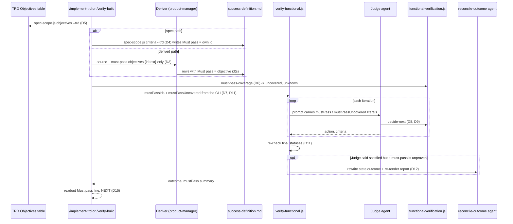

# TRD: verification-must-pass

**Version**: 1.1.0
**Status**: Draft
**Created**: 2026-10-05
**Last Updated**: 2026-10-06
**Author**: @technical-architect
**Source PRD**: None — change decided in session; investigation record `docs/plan/verification-must-pass.investigation.md`
**Kind**: change
**Weight**: medium
**Task ID Prefix**: VMP

---

## Changelog

| Version | Date | Changes | Author |
|---------|------|---------|--------|
| 1.0.0 | 2026-10-05 | Initial TRD, authored from the investigation record | @technical-architect |
| 1.0.1 | 2026-10-05 | Review pass (`/plan` Step 6) applied: D4 writes the `Must pass` column only when a mark exists; D9 lets `insufficient-coverage` keep winning; D10 makes the new inputs required; D11 takes the must-pass ids from `must-pass-coverage`, not the model's table parse; D13 adds the report line only when must-pass is declared; D14 (text-only proof label) deferred to OQ-1; D18 says why PRD P0 is not reused and adds `create-trd.md`. Sections 3–4 and grounding still carry the earlier wording where they restate these decisions; the decisions table governs | /plan review pass |
| 1.0.2 | 2026-10-06 | `/audit-trd` applied: sections 1.1, 2–4, grounding, TR3 and OQ-1/OQ-3 brought in line with the decisions table, so the 1.0.1 caveat no longer applies. D9 precedence (`insufficient-coverage` wins when the floor is also missed) now holds in §1.1, §3.4, OQ-3, VMP-B001 and VMP-D001; D11's re-check is floor-aware; D10's required inputs replace the optional defaults; D13's report is unchanged when nothing is declared; D14's deferred `proof` field and text-only label removed from VMP-B001, VMP-B002 and §3.5. Redesigned: `must-pass-coverage` reads `--trd` and `--definition` paths itself (D6, D11), the workflow takes `mustPassIds` and `mustPassUncovered` (25 args), and VMP-B001 now depends on VMP-B003; D7 says where the id-only uncovered list is derived; D4 copies a mark on a guard row instead of claiming it is rejected | /audit-trd |
| 1.1.0 | 2026-10-06 | `/refine-trd`: the owner settled all seven open questions, each as the TRD assumed (OQ-1 to OQ-7, now under Settled Questions). D14 is now "not built" rather than deferred. Nothing added or removed | /refine-trd |

## Objectives

O1–O5 are the investigation record's objectives, verbatim. O6–O8 are statements the same record
makes in its Intended Change and Decision sections that O1–O5 do not already carry; they are
listed here so nothing the source asks for is narrowed silently.

| ID | Objective | Source | Must pass |
|----|-----------|--------|-----------|
| O1 | A plan can mark objectives as "must pass": the true core functionality of the feature | your instruction, 2026-10-05: "The plan needs a way to identify items that are 'must pass'—the true core functionality" | |
| O2 | The must-pass marking is carried into the success definition, so verification knows which criteria are must-pass | your instruction, 2026-10-05 (/plan argument): "carried into the success definition" | |
| O3 | Verification cannot end `satisfied` unless every must-pass criterion is `met`, whatever the coverage-floor percentage | your instruction, 2026-10-05: "verification cannot pass without them regardless of %" | yes |
| O4 | A must-pass criterion that is `not_verifiable` (or `not_met`, or `unbuilt`) blocks `satisfied` exactly as a missing one would | your instruction, 2026-10-05 (/plan argument): "regardless of not-verifiable status" | yes |
| O5 | When verification is blocked by must-pass criteria, the report and the readout name each blocking criterion, so the owner sees which core item was not proven | domain-derived from O3 (investigation record): a block nobody can trace is the failure this replaces (owner: "verification satisfied level doesn't make sense in practice") | |
| O6 | Every must-pass objective is covered by at least one must-pass criterion; a must-pass objective with no criterion is reported, not silently dropped | investigation record, Intended Change "After" item 2 | |
| O7 | The coverage floor still applies, separately, over all criteria | investigation record, Intended Change "After" item 3 | |
| O8 | A plan that marks no objective must-pass keeps today's verification behaviour, and the readout says that none was declared | investigation record, Decision ("No must-pass objective marked keeps today's behaviour and adds one readout line saying none was declared") and its OQ-2 assumption | |

## Intended Change

**Before** (checked 2026-10-05):

- `decideNext` in `packages/core/lib/functional-verification.js` returns `exit-satisfied` whenever
  no criterion is `not_met` and none is `unbuilt`: "every criterion is met or not verifiable here".
  A `not_verifiable` criterion never blocks. The only other gate is the coverage floor
  (`verification.md` §5a), one percentage over all criteria, which re-labels the exit to
  `insufficient-coverage`.
- 14 of the last 15 verified features in this repository ended `satisfied`. On `docs-as-built`
  the two criteria that proved the feature's core (FS-18, FS-20: the live review behaviour) were
  `not_verifiable`, and the run still read "Satisfied (2 of 30 not verifiable)".
- Nothing marks any objective or criterion as more important than another: the TRD Objectives
  table and the success-definition table carry no priority.

**After:**

1. The TRD Objectives table can mark an objective must-pass. The plan author (or the owner)
   marks it; an unmarked objective is ordinary.
2. The success definition carries the marking per criterion, and every must-pass objective is
   covered by at least one must-pass criterion. A must-pass objective with no criterion is
   reported, not silently dropped.
3. A run whose criteria are otherwise all met or not verifiable, but with any must-pass criterion
   not `met`, does not end `satisfied`. It ends with a distinct outcome that names each unproven
   must-pass criterion. The coverage floor still applies, separately, over all criteria.
4. The block is enforced deterministically by the workflow after the Judge returns, not only by
   the Judge's own call.
5. The readouts of `/implement-trd` and `/verify-build` and the rendered report name the
   unproven must-pass criteria, and NEXT routes the new outcome the way it routes the other
   non-satisfied ones (to `/refine-verification`, then `/verify-build`).

The decisive test: a definition whose must-pass criterion is `not_verifiable` while all others
are `met`. Today it ends `satisfied`; after this change it must not.

---

## 1. Overview

### 1.1 Technical Summary

A `Must pass` column is added in two places: the TRD's `## Objectives` table (the plan's
statement of intent, `yes` or blank) and the success-definition table (the objective id or ids a
criterion proves, or blank). The marking crosses from the first to the second in one of two
ways. On the spec path the criterion ids are the objective ids, so `spec-scope.js criteria`
copies it with no model involved. On every other path the deriver is handed the must-pass
objectives' statements as text only and marks the criteria that prove each one. The command
then checks deterministically that every must-pass objective has at least one must-pass
criterion.

The exit decision gains one step. `decideNext` still runs its base chain unchanged (unbuilt,
satisfied, stalled, stuck, remediate), then the coverage re-label unchanged. After both, when
the action is still `exit-satisfied` (the base was satisfied and the floor, if set, is cleared)
and any must-pass criterion is not `met`, or any must-pass objective has no criterion, the
action becomes `exit-must-pass-unproven` (outcome `must-pass-unproven`). When the floor is also
missed, `insufficient-coverage` keeps winning as today (D9) and its reason appends the unproven
must-pass ids. `verify-functional.js` recomputes the same rule from the final criterion
statuses after every Judge exit and overrides a Judge that returned `satisfied` anyway (D11).
The report, both readouts and `/refine-verification` learn the new outcome.

### 1.2 Key Technical Decisions

| ID | Decision | Choice | Serves Objective | Rationale | Alternatives Considered |
|----|----------|--------|------------------|-----------|------------------------|
| D1 | Where the plan marks must-pass | A `Must pass` column appended as the LAST column of the TRD `## Objectives` table. `yes` (case-insensitive, ignoring `**` and backticks) marks; blank or `no` does not. Located by header name, not by position | O1 | The Objectives table is the plan's own statement of intent and is where the owner asked for the marking. Appending last leaves every existing reader of `cells[0]`/`cells[1]` (`spec-scope.js objectiveRows`, `check`) unaffected. Inherited from the investigation's Decision | A separate `## Must Pass` id list (rejected: two places to keep in step for one fact). Marking in the PRD (rejected: the owner asked for the *plan* to mark; revisit if the owner wants product-manager to propose marks) |
| D2 | How the definition carries the marking | A `Must pass` column appended as the LAST column of the success-definition table (after `Parts`). The cell holds the objective id or ids the criterion proves (`O3` or `O3, O4`). Blank means ordinary. An absent column or an absent cell reads as blank, the same convention `Tier 1` uses (VC §3.8), so existing definitions and appended check rows (VART-D15) parse unchanged | O2, O6 | Naming the objective, rather than a bare yes, is what makes O6's coverage check arithmetic | A boolean `yes` cell (rejected: cannot tell which objective a criterion covers, so O6 is uncheckable) |
| D3 | How the marking crosses deriver isolation | The deriver (product-manager, FV-D5) receives the must-pass objectives as `{id, text}` only: no Source column, no tasks, no TRD path. It marks the criteria that prove each one. It never writes a criterion to cover an objective the source does not support. The citation rule is unchanged, so such an objective is simply left uncovered | O2, O6 | Inherited from the investigation's Decision. **A narrow, stated departure from FV-D5**: objective statements are outcome statements, not plan. They are used only to mark criteria, never as a citable source. The contract states the exception in its isolation section so the next reader does not take it for drift | Let the deriver see the whole TRD (rejected: verification becomes circular, which is FV-D5's reason). Mark criteria after derivation by a second agent that matches criterion text to objectives (rejected: a second model pass for a mapping the deriver can make while writing; revisit if marks prove unreliable in practice) |
| D4 | Spec-path marking | `spec-scope.js criteria` gains an optional `--trd <file>`. A criterion whose id is a must-pass objective in that TRD gets its own id in `Must pass`. This includes a regression guard whose own Objectives row the owner marked `yes`: the mark is copied like any other, so the guard is covered rather than left permanently uncovered (D7 would then block every run with no criterion able to clear it). An unmarked guard stays blank. No reader rejects a guard mark: `objectiveRows` returns only id and text and cannot tell a guard row from a criterion row (guard-ness lives in the spec, via `extract`), so honouring the mark is the fail-closed reading, as in D17. **The `Must pass` column is written only when at least one mark exists**, in both `renderObjectives` and `criteria()`; when it exists, `renderObjectives` keeps each id's existing cell | O2, O8 | Criterion ids equal objective ids on this path (plan-from-spec), so the copy is deterministic. Writing the column only when used leaves every unmarked TRD and definition byte-identical to today, including the audit-rounds `trdHash` over `## Objectives` (review pass, 2026-10-05) | Always write the column (rejected by the review pass: changes every existing spec TRD's Objectives section and its audit hash for no objective). Mark every core criterion automatically (rejected: core-vs-sweep is a risk split, not a statement of what the core is) |
| D5 | Who reads the Objectives table | Extend `spec-scope.js objectiveRows` (today the only Objectives-table reader) to return `mustPass` and any invalid raw value. Add an `objectives --trd <file>` CLI subcommand printing that list as JSON | O1, O2 | Reuse the existing owner rather than writing a second Objectives parser | Move Objectives parsing into `trd-parser.js` (rejected: churn across two importers for one column; `trd-parser.js` parses no Objectives today. Revisit if a third consumer appears) |
| D6 | The must-pass coverage check | A pure `mustPassCoverage({ objectives, criteria })` in `functional-verification.js` with CLI `must-pass-coverage --trd <TRD path> --definition <definition path>`. The CLI reads both files itself (D11): the TRD's must-pass objectives through `spec-scope.js objectiveRows`, and the definition table's `ID` and `Must pass` columns, located by header name, through `trd-parser.js` `findTables`/`splitRowCells` (both already imported by these libraries; `spec-scope.js` does not import `functional-verification.js`, so there is no cycle). The pure function returns `{ criteria: <must-pass criterion ids>, uncovered: [{id, text}], unknown: [{criterion, objective}] }`. The command runs it at §8.1 after parsing the definition. A criterion whose cell names an id that is not a declared must-pass objective is treated as ordinary and listed under `unknown` | O6 | The check must be deterministic and testable. `functional-verification.js` already holds every pure verification-side helper with a CLI (FV-D3) | Let the Judge check coverage (rejected: arithmetic belongs in code, the same reason `decideNext` exists) |
| D7 | Uncovered objectives block | `uncovered` travels into the workflow as a new arg `mustPassUncovered` (`[{id, text}]`, as the CLI returns it). The workflow derives the id-only list (`mustPassUncovered.map(o => o.id)`) itself when it builds the Judge prompt, and embeds that as the `mustPassUncovered` literal in the `decide-next` payload, so `decideNext` receives objective ids (`string[]`) while `renderReport` receives the `[{id, text}]` list. Any entry blocks `satisfied`, exactly as an unproven must-pass criterion does | O4, O6 | O4: a must-pass item that is unproven "blocks `satisfied` exactly as a missing one would". The missing case has to block too, or adding no criterion becomes the way to pass | Synthesize a criterion from the objective's text (rejected: the command would be writing a criterion the deriver's citation rule refused, the very invention FV-P001 forbids) |
| D8 | The new outcome | Action `exit-must-pass-unproven`, outcome `must-pass-unproven`, label "Must-Pass Unproven". Computed in `decideNext` after the base chain and the coverage re-label, and only when the action is still `exit-satisfied` (D9). The reason names each unproven must-pass criterion id and each uncovered objective id. The other base actions are unchanged: a must-pass criterion that is `not_met` or `unbuilt` already prevents `satisfied` | O3, O4, O5 | Inherited from the investigation: a distinct outcome, not folded into `insufficient-coverage`, which is a percentage statement and would hide which core item failed. Joins the centralized vocabulary (`OUTCOME_LABEL`, `OUTCOME_BY_ACTION`, `JUDGE_SCHEMA`), one change reaching every consumer | Fold into `insufficient-coverage` (rejected by the investigation, for the reason given) |
| D9 | Precedence against the coverage floor | When the floor is also missed, `insufficient-coverage` keeps winning, as today, and its reason appends the unproven must-pass criteria and uncovered objectives by id. `exit-must-pass-unproven` is reached only from a base `exit-satisfied` whose coverage clears the floor | O3, O5, O7 | `verification.md` §5a, its template and `verification-setup/SKILL.md` all say a run below the floor reports `insufficient-coverage`; that file is owner-governed and must not be made false (review pass, 2026-10-05). Either outcome blocks a pass, and the reason still names the core items (O5) | Let `must-pass-unproven` win (rejected by the review pass: makes owner-governed text false). A compound outcome (rejected: every consumer would parse a pair) |
| D10 | `decideNext` input contract | `mustPass` (criterion ids) and `mustPassUncovered` (objective ids) are **required** arrays, validated the same way as `met`: an absent or non-array value throws `TypeError`. Callers with none declared pass `[]` explicitly. The existing `decideNext` tests and every call site are updated to pass `[]` | O3, O8 | `decideNext`'s own rule (the comment above the `met` check): defaulting is worse than throwing when absence reads as the lenient answer, and an absent `mustPass` would read as `satisfied` (review pass, 2026-10-05) | Optional, defaulting to `[]` (rejected by the review pass for that reason) |
| D11 | Deterministic enforcement in the workflow | `verify-functional.js` takes two new args, `mustPassIds` (the CLI's `criteria`) and `mustPassUncovered` (the CLI's `uncovered`), which the command passes **unchanged from `must-pass-coverage`'s output**; that CLI reads the definition file and the TRD from their paths (D6), so the must-pass set never depends on the model parsing the table in prose (review pass, 2026-10-05: a dropped column would otherwise fail open). It holds them as `MUST_PASS_IDS`. After EVERY Judge exit, including the zero-criteria branch, it recomputes over the final criteria list (settled entries plus this iteration's returns). The condition: zero `not_met`, zero `unbuilt`, and any must-pass id not `met` or any uncovered objective. When it holds, the floor decides the target, using the workflow's own `FLOOR` and `coverageOf` over the same final list, so D9's precedence holds here too: **floor unset or cleared** — an `exit-satisfied` or `exit-insufficient-coverage` action is overridden to `exit-must-pass-unproven`; **floor missed** — `exit-insufficient-coverage` is kept (it is correct, D9), and `exit-satisfied` is overridden to `exit-insufficient-coverage` with the must-pass ids appended to its reason. **One-directional: the workflow only ever blocks, never un-blocks** | O3, O4 | Inherited from the investigation (After item 4). The Judge is a model, and `computeFinalRun`/`OUTCOME_BY_ACTION` are the precedent for recomputing what code can know. Basing the rule on statuses rather than on the Judge's label also covers a Judge that relabelled to `insufficient-coverage` from a clean base | Trust the Judge's `decide-next` call (rejected by the investigation). Symmetric correction back to `satisfied` (rejected: correcting toward the lenient outcome on the same Judge-supplied statuses buys nothing and opens a path to a wrong pass. Revisit if a wrongly blocked run is ever observed) |
| D12 | Keeping report and state in step after an override | On an override the workflow dispatches one `reconcile-outcome` agent (sonnet, untyped, the same dead-agent pattern as Render). It rewrites the state file's `outcome` through the sanctioned `save()` writer, sets `outcome`/`reason` in that iteration's report-input file, and re-runs `render-report`. If the agent returns nothing, the returned `reason` gains the suffix "(report file still shows the Judge's outcome — the reconcile agent returned nothing)" | O3, O5 | The workflow has no filesystem or shell (FV-D1), and the Judge already wrote both files. Without this the report would read "Satisfied" while the run returned the blocked outcome, and `/refine-verification` reads the report | Have each command re-render after the workflow returns (rejected: two copies of the same instruction, in `implement-trd.md` and `verify-build.md`, and §8.4 deliberately re-reads nothing) |
| D13 | What the report shows | `renderReport` gains top-level inputs `mustPass` (criterion ids) and `mustPassUncovered` ([{id, text}]), which the Judge copies verbatim from literals in its prompt. **When any must-pass is declared**, the report gets a `**Must pass**:` line after `**Coverage**:`: `<k> of <n> proven`, then `unproven: <id> (<status words>)`, then `no criterion for: <objective id>` for each uncovered objective. With none declared the report is unchanged from today. The new outcome joins `DIAGNOSIS_OUTCOMES`, so its Diagnosis and Next lines match the other non-satisfied outcomes | O5, O8 | A block the owner can read off the report is the point of O5. Leaving undeclared reports unchanged keeps every existing report byte-identical (review pass, 2026-10-05); the readout still says none was declared (D15) | A `none declared` line on every report (rejected by the review pass: the investigation asked for a readout line only). Per-criterion field in the report input (rejected: one more thing the Judge must copy per row) |
| D14 | Text-only proof of a must-pass criterion | **Not built.** A `met` must-pass criterion counts as met however it was proven, as every criterion does today; no `proof` field and no label are added | O3 | Settled by the owner on 2026-10-06 (OQ-1): text-only proof counts. On prompt-only features it is often the only proof available | A `proof` field and a "(proven from text only)" label (not taken: the owner settled that it counts, and the label was machinery resting on that question) |
| D15 | Readouts | When verification ran, `/implement-trd` §9 and `/verify-build`'s readout each gain one STATE line: `Must pass: none declared in the TRD's Objectives`, or `Must pass: <k> of <n> proven`, naming each unproven criterion with its statement in plain words. For `must-pass-unproven` the outcome sentence says the core was not shown to work and names the items. ISSUES names each uncovered objective and each invalid `Must pass` cell, and says who acts. NEXT routes `must-pass-unproven` like `stalled`/`stuck`/`unbuilt`/`insufficient-coverage` | O5, O8 | Inherited from the investigation (After item 5). The readout and the report must not disagree on what comes next (refine-verification O4) | none |
| D16 | `/refine-verification` and a must-pass criterion | A must-pass criterion whose cause is `environment-unreachable` or `capability-absent` is never placed under `## Accepted as not verifiable`. It becomes an owner ruling (`OWNER-CALL` under `--auto`) naming the two ways out: declare an environment that reaches it (via `/verification-setup`, since `verification.md` is owner-governed), or remove the must-pass marking from the TRD's Objectives | O4 | Without this, the routing in D15 loops forever. Refine accepts the criterion, the next `/verify-build` finds it `not_verifiable` again, and the run blocks again | Let refine accept it (rejected: produces an unbreakable loop with no owner decision recorded) |
| D17 | Invalid `Must pass` cell in the Objectives table | Any non-blank value other than `yes`/`no` is reported as invalid (by the `objectives` CLI, then in ISSUES) and treated as must-pass. It fails closed | O1, O3 | Someone wrote something in the must-pass column. Reading it as "ordinary" would silently drop a core item, the exact failure this TRD removes | Treat as ordinary (rejected, for that reason). Stop the command (rejected: a typo should not block a whole build) |
| D18 | Authoring surfaces | `packages/core/contracts/trd-authoring.md` gains an `## Objectives` section in the document structure, with the `Must pass` column and one paragraph of guidance: mark only the objectives without which the feature does not exist; a TRD with none is valid. The three Objectives templates in `packages/core/commands/plan.md` gain the column and the same guidance, and `packages/core/commands/create-trd.md`'s copy of the document structure gets the same section | O1 | 16 of 35 TRDs in `docs/TRD/` have no Objectives table today (the PRD-sourced ones), so O1 cannot hold for them unless the authoring contract puts one there. The PRD's existing goal `Priority` column (P0 = must have, `prd-authoring.md`) is not reused: `docs-as-built`, the motivating example, marks all six goals P0, so it does not pick out the core, and the owner asked for the plan to mark it | Reuse PRD P0 (rejected: does not discriminate in practice, and TRDs from `/plan` have no PRD). Leave PRD-sourced TRDs without the ability (rejected: `docs-as-built` was one) |
| D19 | Sweep files | A sweep file (`.sweep.md`) declares no must-pass. Its definition's `Must pass` column is blank, and its readout carries the `none declared` line | O8 | Sweep items are by construction the small, independent criteria split away from the core (plan-from-spec). The core TRD's own run carries the marks | Inherit marks from the core TRD (rejected: a swept criterion is never the core, by the split's own rule) |
| D20 | The `verification.md` template | Left unchanged | O7 | Its §5a text stays correct after this change. Editing the template changes its digest, so this repo's own unfilled `.claude/rules/verification.md` (byte-identical to the template today) would stop being recognised as unfilled unless `KNOWN_UNFILLED_DIGESTS` were extended. That is a cost with no objective behind it | Add a must-pass sentence to §5a plus a digest entry (rejected: no objective asks for it; revisit when the template next changes for another reason) |

### 1.3 Technology Stack

| Layer | Technology | Purpose | Notes |
|-------|------------|---------|-------|
| Deterministic libs | JavaScript / Node.js 18+ | `functional-verification.js`, `spec-scope.js` | `stack.md` |
| Workflow | Workflow script (JS, no `require`, no fs/shell) | `verify-functional.js` | FV-D1 |
| Commands, contracts | Markdown prompts | `implement-trd.md`, `verify-build.md`, `refine-verification.md`, `plan.md`, `functional-verification.md`, `trd-authoring.md` | constitution Principles 2–3 |
| Tests | Jest ^29 | unit and source-level tests beside each file | `stack.md` |
| Live check | BATS-style smoke scenario under `test/smoke/scenarios/` | end-to-end `/verify-build` walk | opt-in, `LLM_OPT_IN_SCENARIOS` |

### 1.4 Integration Points

| System | Type | Direction | Notes |
|--------|------|-----------|-------|
| `.claude/` vendored mirrors | file copy | Out | Every edited file under `packages/core/` has a byte-identical copy under `.claude/` that must be edited alongside it (parity tests exist for `functional-verification.js`) |
| `docs/TRD/functional-verification.md` | spec kept in step by test | Both | `verify-functional-trd-sync.test.js` compares its §3.3/§3.4/§3.7 to the workflow's args, return keys, outcome map and action enum |

---

## 2. System Architecture

### 2.1 Data Flow



### 2.2 Component Responsibilities

- **`spec-scope.js`** reads and rewrites the Objectives table (D1, D4, D5, D17) and writes the
  spec-path definition (D4).
- **`functional-verification.js`** decides exits (`decideNext`, D8–D10), checks must-pass
  coverage (`mustPassCoverage`, D6) and renders the report (`renderReport`, D13).
- **`verify-functional.js`** carries the marks through the loop, prompts the Judge, enforces the
  block (D11), reconciles files on override (D12) and returns the summary.
- **Commands** read the Objectives, hand marks to the deriver, run the coverage check, pass the
  arg, and render the readout (D3, D15). `/refine-verification` handles the new outcome (D16).
- **Contracts** state the column, the deriver's marking rule and the isolation exception (D2,
  D3), and the authoring guidance (D18).

---

## 3. Technical Specifications

### 3.1 Objectives table (`## Objectives`)

```markdown
| ID | Objective | Source | Must pass |
|----|-----------|--------|-----------|
| O1 | <what must be true> | <source> | yes |
| O2 | <what must be true> | <source> | |
```

`spec-scope.js objectives --trd <file>` prints:

```typescript
type ObjectiveRow = { id: string; text: string; mustPass: boolean; invalidValue?: string };
// invalidValue present only when the cell is non-blank and not yes/no; mustPass is then true (D17)
```

A table with no `Must pass` header column yields `mustPass: false` for every row. The column is
written only when at least one row is marked (D4); the four-column form above is what a marked
table looks like, not what every rewrite produces.

### 3.2 Success-definition table

```markdown
| ID | Functional statement | Cites | Evidence that would prove it | Derivation | Tier 1 | Parts | Must pass |
```

The eighth column is written only when at least one criterion is marked (D4); an unmarked
definition keeps today's seven columns. The cell is read by `must-pass-coverage` (D6), by header
name, `""` when the column or the cell is absent. A criterion is must-pass when its cell, split
on commas, names at least one declared must-pass objective. Ids that are not declared go to
`unknown`, and the criterion stays ordinary.

### 3.3 `mustPassCoverage`

```typescript
function mustPassCoverage(input: {
  objectives: Array<{ id: string; text: string }>;   // declared must-pass objectives only
  criteria: Array<{ id: string; mustPass?: string }>;
}): {
  criteria: string[];                                 // ids of must-pass criteria
  uncovered: Array<{ id: string; text: string }>;     // must-pass objectives no criterion names
  unknown: Array<{ criterion: string; objective: string }>;
};
// CLI: node functional-verification.js must-pass-coverage --trd <TRD path> --definition <definition path>
//      reads both files itself (D6, D11): objectives via spec-scope objectiveRows (mustPass rows only),
//      criteria via the definition table's `ID` and `Must pass` columns, located by header name
```

### 3.4 `decideNext` additions

```typescript
input.mustPass: string[];          // must-pass criterion ids; REQUIRED (D10) -- absent or non-array throws TypeError
input.mustPassUncovered: string[]; // uncovered must-pass objective ids; REQUIRED (D10)
// returns action ... | 'exit-must-pass-unproven'
```

Order (D9): the base chain is unchanged, then the coverage re-label over
`COVERAGE_RELABELABLE_ACTIONS` runs unchanged. Then the must-pass step, with
`unproven = mustPass \ met`:

- If the action is still `exit-satisfied` and `unproven` or `mustPassUncovered` is non-empty, the
  result is `exit-must-pass-unproven`. Its reason has the form "N must-pass criterion/criteria
  not proven: <ids>; must-pass objective(s) with no criterion: <ids>".
- If the re-label turned a base `exit-satisfied` into `exit-insufficient-coverage` and `unproven`
  or `mustPassUncovered` is non-empty, the action is kept and its reason gains "; must-pass not
  proven: <ids>; no criterion for: <ids>".

**Decisive case** (unit-tested): `{gaps: [], unbuilt: [], met: ['A','B'], total: 3,
mustPass: ['C'], mustPassUncovered: []}` gives `exit-must-pass-unproven`. The same input with
`mustPass: []` gives `exit-satisfied`.

### 3.5 Workflow additions (`verify-functional.js`)

```typescript
// args -- both passed unchanged from `must-pass-coverage`'s output (D11)
mustPassIds?: string[];                                  // the CLI's `criteria`; default []; validated (array of strings); held as MUST_PASS_IDS
mustPassUncovered?: Array<{ id: string; text: string }>; // the CLI's `uncovered`; default []; validated (array of objects with string id)

// result, on EVERY return path, including the resume-cap exit and the fall-through stuck exit
mustPass: {
  criteria: string[];                               // MUST_PASS_IDS
  uncovered: string[];                              // objective ids
  unproven: Array<{ id: string; status: string }>;  // must-pass criteria not met; status 'missing' when absent from criteria
  overridden: boolean;                              // true when D11 changed the Judge's action
}
```

The Judge prompt's `decide-next` payload gains the literals `"mustPass"` (`MUST_PASS_IDS`) and
`"mustPassUncovered"` (the id-only list, `mustPassUncovered.map(o => o.id)`, computed by the
workflow when it builds the prompt, D7). Both are always present, `[]` when none is declared,
because `decideNext` requires them (D10). Its report-input instruction gains `"mustPass"` and
`"mustPassUncovered"` (the [{id,text}] list) to copy verbatim. Its outcome lists name
`must-pass-unproven`. `JUDGE_SCHEMA.action.enum` and `OUTCOME_BY_ACTION` gain the new action.
No `proof` field is added (D14).

### 3.6 Error handling

- `mustPassIds` not an array of strings, or `mustPassUncovered` not an array or an entry without
  a string `id`: throw before any agent is dispatched (same idiom as `coverageFloor`,
  `liveEvidence`).
- `decideNext` with `mustPass`/`mustPassUncovered` absent or not an array: `TypeError` (D10).
- Reconcile agent dead: log, add the reason suffix (D12), and still return the overridden
  outcome.
- `must-pass-coverage` with a missing or unreadable `--trd` or `--definition` file: non-zero
  exit with a message, like the existing CLI subcommands.

---

## 4. Master Task List

### 4.1 Task ID Convention

`VMP-[CATEGORY][SEQ]`: B = implementation (code and prompt files), D = documentation,
T = end-to-end test. Every task edits the `packages/core/` file AND its `.claude/` mirror
byte-identically, and ships its own unit tests.

### 4.2 Phase 1: Foundations

| Task ID | Description | Serves | Skills | Dependencies | Acceptance Criteria |
|---------|-------------|--------|--------|--------------|---------------------|
| VMP-B001 | In `functional-verification.js`: the must-pass step in `decideNext` (§3.4); `mustPassCoverage` plus its `must-pass-coverage --trd --definition` CLI subcommand, which reads both files itself (§3.3, D6, D11); and in `renderReport`, the new `OUTCOME_LABEL` entry, the `DIAGNOSIS_OUTCOMES` membership and the `**Must pass**:` line (D13). One task: all of it lands in one file and one test file | D6, D8, D9, D10, D11, D13 | `jest` | VMP-B003 (the CLI reads the Objectives through `objectiveRows`'s `mustPass` field) | The decisive case in §3.4 returns `exit-must-pass-unproven`, and without `mustPass` returns `exit-satisfied`. An uncovered objective alone blocks. A must-pass criterion in `gaps` still yields `remediate`/`exit-stalled`/`exit-stuck`, and one in `unbuilt` still yields `exit-unbuilt`. With a floor set and missed and a base `exit-satisfied`, the action is `exit-insufficient-coverage` and its reason names the ratio, the floor and the unproven must-pass ids (D9). An absent or non-array `mustPass` or `mustPassUncovered` throws `TypeError` (D10). Existing `decideNext` tests pass once updated to supply `mustPass: []` and `mustPassUncovered: []`, with no other change to their expectations. `mustPassCoverage` returns `criteria`/`uncovered`/`unknown` exactly as §3.3, including a comma-separated cell naming two objectives. The `must-pass-coverage` CLI, given a fixture TRD and definition on disk, returns the same, and a definition with no `Must pass` column yields every declared must-pass objective under `uncovered` (a dropped column fails closed). The report renders "Must-Pass Unproven", a Diagnosis line and the `/refine-verification` Next line for the new outcome. With both lists empty the report carries no `**Must pass**:` line and is byte-identical to today's (D13); otherwise the line names each unproven id with its status and each uncovered objective id. The mirror-parity test passes |
| VMP-B003 | In `spec-scope.js`: `objectiveRows` returns `mustPass` and `invalidValue`, located by header name (D1, D17). Add the `objectives --trd` CLI subcommand (D5). `renderObjectives` keeps existing marks by id and writes the `Must pass` column only when at least one mark exists (D4). `criteria()` gains an optional `trd`, CLI `--trd`, which writes the `Must pass` column only when at least one criterion is marked (D4) | D1, D4, D5, D17 | `jest` | None | `objectives` prints §3.1's rows. A three-column table yields `mustPass: false` for every row. `Yes`, `**yes**` and `` `yes` `` mark. A cell reading `must` yields `invalidValue: "must"` and `mustPass: true`. `renderObjectives` on a TRD whose O2 is marked `yes` keeps O2 `yes` after the rewrite, and `check` still reports `ok`. `renderObjectives` on a TRD with no marks leaves the Objectives section byte-identical to today's three-column output. `criteria --trd` writes `Must pass` = the criterion's own id for each must-pass objective, including a guard whose Objectives row is marked `yes`, and blank for unmarked guards. With `--trd` omitted, or with no marks, the definition keeps today's seven-column header; with a mark it carries eight. Mirror identical |
| VMP-B004 | `contracts/functional-verification.md`: the definition format gains the `Must pass` column, with its rules (D2). The deriving section states that the deriver receives must-pass objectives as id plus text only, marks the criteria that prove each, never writes a criterion to cover one, and that this is a narrow, stated exception to the isolation rule (D3). The report-shape section names six outcomes and defines `must-pass-unproven`, including its precedence over the coverage re-label (D8, D9) | D2, D3, D8, D9 | | None | The contract's example table has the eighth column with one marked row. The isolation paragraph names the exception and its limit (no Source column, no tasks, no TRD path). The outcome sentence lists `must-pass-unproven`. `contracts/functional-verification.test.js` is updated for the new outcome sentence and passes. Mirror identical |
| VMP-B006 | Authoring surfaces. `contracts/trd-authoring.md` gains an `## Objectives` section in the TRD Document Structure, with the four-column table and the marking guidance (D18). Its locked-scope paragraph notes that a `Must pass` mark is not a reword. `commands/plan.md`'s three Objectives templates gain the column and the guidance, and Step 6a says `render-objectives` keeps existing marks | D18 | | None | All three `plan.md` templates and the contract show `\| ID \| Objective \| Source \| Must pass \|`. The guidance says to mark only the objectives without which the feature does not exist, and that none marked is valid and keeps today's behaviour. Step 6a mentions preserved marks. Mirrors identical |

### 4.3 Phase 2: Loop and commands

| Task ID | Description | Serves | Skills | Dependencies | Acceptance Criteria |
|---------|-------------|--------|--------|--------------|---------------------|
| VMP-B002 | `workflows/verify-functional.js` per §3.5 and D7, D11, D12: validate the `mustPassIds` and `mustPassUncovered` args and hold `mustPassIds` as `MUST_PASS_IDS`; extend the Judge prompt (decide-next payload with the id-only uncovered list, report-input literals, outcome lists); add the new action to `JUDGE_SCHEMA` and `OUTCOME_BY_ACTION`; run the re-check after every Judge exit, including `N === 0`; dispatch the `reconcile-outcome` agent on override; return `mustPass` on every path. Update `docs/TRD/functional-verification.md` §3.3 (args, result), §3.4 (LoopAction), §3.7 (outcome list), header version and changelog row in the same task, because `verify-functional-trd-sync.test.js` compares them to this file | D7, D11, D12 | `jest` | VMP-B001 | The §3.4 decisive case, driven with a mocked Judge returning `exit-satisfied`, makes the workflow return `outcome: 'must-pass-unproven'` and `mustPass.overridden: true`, after exactly one reconcile dispatch. The same with a Judge returning `exit-must-pass-unproven` returns that outcome with no reconcile dispatch. With no must-pass marks the result matches today's on the existing fixtures, apart from the added `mustPass` key. A Judge returning `exit-insufficient-coverage` with zero gaps and an unproven must-pass is overridden to `exit-must-pass-unproven` when coverage clears the floor (or none is set), and kept when the floor is really missed (D9). A Judge returning `exit-satisfied` with an unproven must-pass and the floor missed is overridden to `exit-insufficient-coverage`. One returning `exit-stalled` is not overridden. A dead reconcile agent adds the reason suffix. A malformed `mustPassIds` or `mustPassUncovered` throws before any agent dispatch. The Judge prompt contains `"mustPass"`, `"mustPassUncovered"` and `"must-pass-unproven"`. `verify-functional.test.js` (including its exact-outcome-list assertions) and `verify-functional-trd-sync.test.js` pass, with its field and outcome-count sanity checks updated. Mirror identical |
| VMP-B005 | `commands/implement-trd.md` and `commands/verify-build.md` (plus mirrors). Merged rather than split: `verify-build.md` restates `implement-trd.md` §8's steps, so the two must say the same thing, and both are pinned by `verify-command-surface.test.js`. §3.6: read `spec-scope.js objectives --trd`, add the must-pass objectives block (id plus text only) to the deriver prompt, add `--trd <TRD>` to the spec-path `criteria` call, and add `must-pass-unproven` to step 0's terminal list. §8.1: run `must-pass-coverage --trd <TRD> --definition <path>` (no prose parse of the `Must pass` column, D11; `unknown` marks are already left out of its `criteria`, so they stay ordinary). §8.3: the `mustPassIds` and `mustPassUncovered` args, passed unchanged from that output. §8.4: carry `mustPass`. §9 and verify-build's readout: the STATE line, the outcome sentence, ISSUES (uncovered objectives, invalid cells) and NEXT routing (D15). verify-build 3a and 4–5 and its `RETURN` outcome list get the same | D3, D4, D6, D7, D11, D15, D17, D19 | | VMP-B001, VMP-B003, VMP-B004 (the workflow arg and result names it uses are fixed in §3.5, so it does not wait for the workflow task) | Both files name `must-pass-unproven` everywhere they enumerate outcomes. The derive dispatch text says the objectives go in as id plus text only, with no TRD path. Both readout templates carry the `Must pass:` STATE line with its `none declared` form. NEXT routes the new outcome to `/refine-verification` then `/verify-build`, in the exact wording `renderReport` uses. `verify-command-surface.test.js`'s outcome-list regexes are updated and pass. Mirrors identical |
| VMP-B007 | `commands/refine-verification.md` (plus mirror): its Derive step never lists a must-pass criterion under `## Accepted as not verifiable`, and records the owner ruling (`OWNER-CALL` under `--auto`) instead (D16). Its Diagnose step names the unproven must-pass criteria first | D16 | | VMP-B001 | The Accepted-as-not-verifiable bullet excludes must-pass criteria explicitly. The Owner rulings bullet names the two ways out (declare an environment via `/verification-setup`, or remove the mark from the TRD Objectives). Mirror identical |

### 4.4 Phase 3: Documentation and end-to-end

| Task ID | Description | Serves | Skills | Dependencies | Acceptance Criteria |
|---------|-------------|--------|--------|--------------|---------------------|
| VMP-D001 | `docs/reference/verification.md` (outcome table, `decideNext` precedence, the `Must pass` columns, the report's Must pass line) and `docs/reference/implement-trd.md` (the outcome list at its verification pointer). The `verification.md` template is deliberately not touched (D20) | D8, D9, D13, D20 | | VMP-B002, VMP-B005 | Both reference docs name `must-pass-unproven` wherever they list outcomes. The precedence statement matches §3.4. `packages/core/templates/claude-directory/rules/verification.md` and `.claude/rules/verification.md` are byte-unchanged |
| VMP-T001 | [LIVE] Add the opt-in smoke scenario `test/smoke/scenarios/verification-must-pass.sh`, registered in `LLM_OPT_IN_SCENARIOS`, following `verification-md-setup.sh`'s throwaway-project pattern. It exercises the seam between the Objectives reader (B003), the coverage check (B001), the workflow (B002) and the command prose (B005), which no single task owns. Fixture: a TRD with `Source PRD: None` and an `## Intended Change`, whose Objectives mark O2 `yes`. O1 is implemented and observable. O2 names a capability the fixture's hand-filled `verification.md` §5 lists as unverifiable here. One `/verify-build` run. Its artifacts go in the live-evidence manifest | O3, O4, O5 | | VMP-B002, VMP-B005 | The report's Outcome line reads "Must-Pass Unproven", and its `**Must pass**:` line names O2's criterion as not verifiable. `verification-state.json` has `outcome: "must-pass-unproven"`. The readout's NEXT is `/refine-verification` then `/verify-build`. A second fixture variant with the O2 mark removed ends `satisfied`. Skips (not fails) without `claude` or `jq` |

## Deferred by design

| Task ID | Why it cannot run now |
|---------|----------------------|
| VMP-T001 | Tagged [LIVE]: it needs a live model session running /verify-build against a fixture. The TRD already sets it aside to run with --include-deferred. |

## Task Grounding

### VMP-B001
- **Touches:** `packages/core/lib/functional-verification.js` and its mirror `.claude/lib/functional-verification.js`; `packages/core/lib/functional-verification.test.js` (no `.claude` copy of tests). [read] The two `.js` copies are byte-identical today (`cmp` silent); `describe('mirror parity'` in the test file and `test/integration/tests/runtime-integrity.test.sh` (`packages/core/lib` vs `.claude/lib` sweep) both enforce it. [read]
- **Reuse:** `decideNext` (`function decideNext(input)`, ~line 317) already holds the base chain; add the must-pass step AFTER the coverage re-label block (`// Step 4 (D8): the coverage re-label`, ~line 394), so it sees the re-labelled action and D9's precedence falls out of the order. Do not reorder the chain. [read] The re-label already writes the ratio and the floor (through `formatCoveragePercent`) into the `exit-insufficient-coverage` reason; the must-pass step only appends the ids to that reason, so the floor text and the real re-label cannot disagree. To tell "re-labelled from a base satisfied" apart, capture the base action before the re-label block. [read] Reuse `escapeCell` for ids/text in the new report line and `CAUSE_LABEL`/`DIAGNOSIS_OUTCOMES` for Diagnosis and Next (adding `'must-pass-unproven'` to the `DIAGNOSIS_OUTCOMES` Set at ~line 737 is the whole Diagnosis/Next change; the Next string is the existing `refine the plan with \`/refine-verification\`...` branch). [read] CLI subcommand: `must-pass-coverage` takes file paths, not a JSON payload (D6, D11), so follow `check-evidence`'s `--state-dir` flag parsing (`rest.indexOf(...)`, ~line 1460) rather than `resolveJsonPayload`. Read the TRD's must-pass objectives with `require('./spec-scope').objectiveRows` (exported; `spec-scope.js` does not import this file, so no cycle) and the definition's `ID`/`Must pass` columns with `findTables`/`splitRowCells` from `./trd-parser` (exported; this file already imports `maskFencedLines` and `findSection` from it). [read]
- **Replaces:** nothing becomes unreachable; but edit in place the text this makes false: the JSDoc `@returns {{action: 'exit-satisfied'|...|'remediate'` union on `decideNext`; the `renderReport` JSDoc `outcome:` union; the comment "The four outcomes the Diagnosis/Next lines render under (§3.1)" above `DIAGNOSIS_OUTCOMES`; the file-header and CLI comment blocks (`//   node functional-verification.js render-fix-summary -` list, ~lines 1403-1417) and the `usage()` string (~line 1420), which must gain `must-pass-coverage '<input-json>'|--file <path>|-`; add the new function to `module.exports` (~line 1366). [read]
- **Follow:** validate-then-throw in `decideNext` (`throw new TypeError('decideNext: input.met is required...')`) for an absent or non-array `mustPass`/`mustPassUncovered`, exactly as for `met`: required, no default (D10). The new action is also not in `COVERAGE_RELABELABLE_ACTIONS`, though placing the step after the re-label already keeps it from being re-labelled. [read]
- **Careful:** (1) `renderReport` input is hand-composed by the Judge and is NOT schema-validated (the comment above `const KNOWN = [...]` says so), so `mustPass` ids may name criteria absent from `criteria`; render those as status `missing`, never throw. [read] (2) Existing tests: the `describe('decideNext'` block (~line 395) and `describe('decideNext: the coverage re-label'` (~line 554) call `decideNext` without the new keys, so each call gains `mustPass: []` and `mustPassUncovered: []` (D10) with its expectation unchanged; these keep passing unchanged: `describe('renderReport: Diagnosis and Next lines'` (~line 2463; its outcome loop lists four outcomes and stays valid), and the `**Coverage**` line tests (~lines 895, 907, which find the line by `startsWith('**Coverage**')`, so a new line after it is safe). [read] (3) `verify-functional-trd-sync.test.js` slices this file only for the `checkEvidence` body (`LIB.split('function checkEvidence(')`), so edits elsewhere cannot break it. [read] (4) The sweep branch in `renderReport` (`isSweep`) would print a `/sweep` Next line for `must-pass-unproven`; D19 says sweeps never carry marks, so no code path is needed, but do not add a test that expects otherwise. [inferred] (5) No text-only label is built: D14 defers it until the owner rules on OQ-1. (6) VMP-B002 depends on this task by declaration but consumes nothing from this file (see findings).

### VMP-B002
- **Touches:** `packages/core/workflows/verify-functional.js`, `.claude/workflows/verify-functional.js` (mirror; byte parity pinned in `verify-functional.test.js` 'mirror parity' [read]), `packages/core/workflows/verify-functional.test.js`, `packages/core/workflows/verify-functional-trd-sync.test.js`, `docs/TRD/functional-verification.md` (header **Version** 2.7.0 and **Last Updated**, a new changelog row, §3.3 `VerifyFunctionalArgs`/`VerifyFunctionalResult`, §3.4 `LoopAction`, §3.7 **Step 9**).
- **Reuse:** `OUTCOME_BY_ACTION` plus `buildFinalResult` (`function buildFinalResult(` ~line 939 [read]) stay the single outcome table. `computeFinalRun` (~916) is the precedent for recomputing in code what the Judge only reports. `dispatchRender` (~963 [read]) is the dead-agent pattern for the reconcile dispatch: `model: 'sonnet'`, a schema, a null check that logs and returns a flagged record. `coverageOf` (~933) is the shape to copy for the `mustPass` summary. The existing `FLOOR` validation block (~79) and `LIVE_EVIDENCE` IIFE (~88) are the idiom for validating `mustPassIds` and `mustPassUncovered` before any agent runs. `FLOOR` and `coverageOf` are also what the D11 re-check uses to decide whether the floor is cleared.
- **Replaces:** nothing is deleted [inferred]. The five-value outcome literal in the Judge prompt STEP 4 (`"satisfied", "unbuilt", "stalled", "stuck" or "insufficient-coverage"`, ~line 573 [read]) and the five-key `OUTCOME_BY_ACTION` gain the sixth value. `verify-functional.test.js` ~line 528 pins the old phrase and must be rewritten.
- **Follow:** `verify-functional-trd-sync.test.js` [read in full]. It reads the workflow's source text, so: (a) the regex `/\ba\.([A-Za-z_]\w*)/g` counts every `a.<word>` in comments and prompt strings as an arg read, so avoid text like 'a.k.a.' and add exactly two new reads, `a.mustPassIds` and `a.mustPassUncovered`, declared in `interface VerifyFunctionalArgs` (`workflow reads 23 fields` becomes 25); (b) the result keys are the lines matching `^ {4}key[:,]` inside `buildFinalResult`'s `return {`, so `mustPass` must sit at four-space indent there and be declared at two-space indent in `VerifyFunctionalResult`; (c) `outcomes` is parsed from `OUTCOME_BY_ACTION` (`toHaveLength(5)` becomes 6) and compared with §3.3's `outcome:` union and §3.7 Step 9 (each outcome as a backticked token); (d) `enum: ['exit-satisfied' ...]` in `JUDGE_SCHEMA` must equal §3.4's `LoopAction` union, so the enum may not contain `]` inside the list and 'exit-satisfied' stays first; (e) header **Version** and **Last Updated** must equal the newest changelog row.
- **Careful:** (1) There are THREE return paths and the TRD says `mustPass` goes on all of them: `buildFinalResult`, the `if (iteration > CAP) {` resume-exhausted return (~line 1066, `criteria: RESUME_CRITERIA || []`), and the final fall-through return (~line 1358). The sync test checks only the first. (2) The `if (N === 0) {` branch (~line 993) returns before the loop, so the D11 re-check must also run there. With `N === 0` and an uncovered must-pass objective the run becomes `must-pass-unproven`, so implement-trd.md ~1518's 'zero rows ... satisfied' sentence needs a qualifier (B005). (3) Apply the override BEFORE the Render dispatch (`if (judgeResult.action !== 'remediate') {` ~line 1274), because `buildRenderPrompt` prints `judgeResult.action`. Pass the overridden object to `buildFinalResult`; `computeFinalRun` only special-cases `exit-unbuilt`, so the full-run gate result is unaffected. (4) The final `criteria` list is built inside `buildFinalResult` as `[...settledList(settled), ...openReturned]`. Compute the re-check from that same list, not from `judgeResult.criteria` alone, which holds only this iteration's open set. (5) No `proof` field is added (D14): the `settled.set(...)` blocks (~1036, ~1262), the criterion schema and the three prompt key lists pinned at verify-functional.test.js ~2466/2470/2473 stay as they are. (6) The reconcile agent needs: the iteration number (report input is `${STATE_DIR}/judge-report-input-${iteration}.json`, so `-0.json` at N=0), `STATE_WRITER`, `CHECKER`, `STATE_PATH`, `REPORT_PATH`, and the `mustPass`/`mustPassUncovered` literals handed in directly. That also covers a Judge that forgot to copy them (TR3). (7) `unpinnedLabels` in `test-harness.js` fails any agent call with neither `agentType` nor `model`, so the reconcile call needs `model: 'sonnet'`. (8) The workflow never reads a `Must pass` cell: `mustPassIds` arrives already validated by `must-pass-coverage` (D11), which has dropped `unknown` marks. (9) Collisions: none in the other TRD tasks for these files. `docs/TRD/functional-verification.md` is touched only by B002 [inferred from the task list]. B005 and D001 read the workflow's contract, not the file.

### VMP-B003
- **Touches:** `packages/core/lib/spec-scope.js` and mirror `.claude/lib/spec-scope.js`; `packages/core/lib/spec-scope.test.js`. [read] The mirror is currently byte-identical and is covered by the broad `packages/core/lib` to `.claude/lib` sweep in `test/integration/tests/runtime-integrity.test.sh` (no per-file parity test in `spec-scope.test.js`). [read]
- **Reuse:** `findTables(masked, obj.start, obj.end)[0]` already returns `{headerLine, headerCells, dataRows[{line, cells}]}`; locate the `Must pass` column with `table.headerCells` by name, not by index. [read] `objectivesSpan(masked)` and `maskFencedLines` (both already used by `objectiveRows` and `renderObjectives`). `cell(s)` re-escapes `|` when writing a preserved mark back (note `splitRowCells` un-escapes `\|` on read, so re-escape on write). [read] `pick(..., {allowGuards: true})` in `criteria()` already separates `chosen` from `guards`. [read]
- **Replaces:** the literal three-column rows in `renderObjectives` (`'| ID | Objective | Source |'` and its separator) and the seven-column header string plus the seven-cell template in `criteria()`'s `row()` (`'| ID | Functional statement | Cites | Evidence that would prove it | Derivation | Tier 1 | Parts |'`, ~line 425) become conditional: written as today when nothing is marked, extended with a `Must pass` column when something is (D4); update the header-comment CLI list (`criteria --spec P ...` and add `objectives --trd F`) and the `default:` usage string in `cli()` so the new subcommand is discoverable. [read]
- **Follow:** header-keyed column mapping as in `trd-parser.js` `mapTaskColumns(headerCells)` ("Column identity is keyed on THIS table's header, not a fixed width"). CLI shape: `need(f, 'trd')` then return the value from the `switch` in `cli()`; arrays print fine through `JSON.stringify` and the `result.ok === false` exit check tolerates them. [read]
- **Careful:** (1) `objectiveRows` has two callers inside the file (`check` reads `r.id`/`r.text`; the tests read `.id` and `.text`), so adding `mustPass`/`invalidValue` fields is safe; no other module imports `objectiveRows` today (grep over packages and `.claude/lib`) [read]; after VMP-B001, `functional-verification.js`'s `must-pass-coverage` CLI does, and reads only `id`, `text` and `mustPass`, so keep those field names stable. (2) Tests that WILL break and need rewriting inside this task: `'replaces only the Objectives table and the header line; the rest is byte-identical'` finds the table with the literal `'| ID | Objective | Source |'`, which still holds for an unmarked TRD (D4) but not for a marked fixture, so a marked-TRD case needs its own locator; the CLI test `'render-sweep, render-objectives, check, source and criteria compose'` and `describe('criteria'` read cells by `split(' | ')` index (Tier 1 is `r[5]`, still valid at eight columns, but trailing blank cells change the tail). `'replaces an existing header line instead of adding a second'` asserts `twice` equals `once`, so mark preservation must be idempotent. [read] (3) `renderObjectives` builds `rows` before it finds the existing table; read the old marks from the table first (reorder). [read] (4) Guards: `render-objectives` puts guard rows in the Objectives table, and `objectiveRows` cannot tell them from criterion rows. D4's rule: a guard whose Objectives row is marked `yes` gets its own id in `Must pass`, like any criterion, so it is never left uncoverable; pin that in a test. (5) Sweep and verify-build call `criteria` without `--trd` for a sweep file (D19) so `--trd` must stay optional and the eighth column blank. [read] (6) `trdHash` in `audit-rounds.js` hashes the whole `## Objectives` section, so marks change the audit hash by design. [read] (7) Callers: `commands/implement-trd.md` (~line 719) and `commands/verify-build.md` (~line 145) call `criteria`; VMP-B005 owns their prose and edits `verify-command-surface.test.js`, so do not edit those here.

### VMP-B004
- **Touches:** `packages/core/contracts/functional-verification.md` and mirror `.claude/contracts/functional-verification.md` (byte-identical today; `functional-verification.test.js` 'the two copies are byte-identical' enforces it); `packages/core/contracts/functional-verification.test.js`. [read]
- **Reuse:** the `## Tier 1 — locator or judge-only (§3.8)` section is the template for the `Must pass` column rules, including its last sentence ("An absent column, or an absent cell, reads as `locator`") for D2's absent-reads-blank rule. [read] The existing "Check criteria" paragraph already states a stated exception to the citation rule ("a **stated exception to the citation rule**"); reuse that phrasing for D3's stated exception to isolation. [read]
- **Replaces:** edit in place, these become false: line 44 "given **the source and nothing else** -- no TRD path, no TRD excerpt, no task list" (the exception must be named there too, not only in the later isolation paragraph at ~line 60); line 233 "A check row uses the same seven columns as any other row" (now eight; check rows leave `Must pass` blank by the absent-cell rule, so the three check-row skills under `packages/skills/verify-*` need no change); line 493 "one of five outcomes: `satisfied`, `unbuilt`, `stalled`, `stuck`, or `insufficient-coverage`"; the example table header at line 81 and its three rows (add the eighth column, mark one row). [read]
- **Follow:** the contract test style: regexes over `coreText` with `\s*\n?` tolerant of line wraps. [read]
- **Careful:** (1) `contracts/functional-verification.test.js` line 108 regex `Evidence that would prove it | Derivation | Tier 1 | Parts |` still matches with a trailing ` Must pass |`; the test near line 120 (`states insufficient-coverage in the loop exit vocabulary...`) matches the exact sentence ``satisfied`, `unbuilt`, `stalled`,\s*\n?`stuck`, or `insufficient-coverage` `` and WILL fail when the sentence becomes six outcomes; rewrite it in this task. [read] (2) `commands/verify-command-surface.test.js` also reads this contract (CORE_CONTRACT ~line 833 pins 'unless it qualifies for reuse' and the `evidence-stale` table row; ~line 1434 pins the `**Source kind**: prd | reproduction | intended-change | behaviour-preserved | spec` line). Keep all of those strings intact. That file is edited by VMP-B005, so do not touch it here. [read] (3) The contract is the deriver-facing text; the exception must keep the citation rule binding: objectives are used to mark criteria, never as a `Cites` source (D3, TR2). (4) The Check criteria text says a check row never resolves `unbuilt`; do not give check rows a must-pass mark.

### VMP-B005
- **Touches:** `packages/core/commands/implement-trd.md`, `.claude/commands/implement-trd.md`, `packages/core/commands/verify-build.md`, `.claude/commands/verify-build.md` (all three mirror pairs [ran: `cmp` identical]), `packages/core/commands/verify-command-surface.test.js`. Sites in implement-trd.md [read]: `### 3.6 Dispatch the background success-definition derive pass` (~line 672) incl. the spec-path `spec-scope.js criteria` block, step 0's terminal list (~700) and the `--verify` description (~28); `### 8.1 Resolve the definition` (~1463); `### 8.3 Assemble the remaining args and dispatch` (`Workflow({ name: "verify-functional", args: {` ~1735); `### 8.4 Render the outcome` (~1789); the §9 readout (~1878, ~1893, ~1924). Sites in verify-build.md [read]: step 3a spec block and the deriver dispatch (~140-210), step 4 args (~258), step 5 (~291), Readout (~313-320), `--chained` RETURN list (~372), `--resume` (~411), fix-loop step 2 (~462) and step 6 (~512).
- **Reuse:** `node .claude/lib/spec-scope.js objectives --trd` (VMP-B003) and `must-pass-coverage` (VMP-B001) are new CLIs, so do not hand-parse the Objectives table or the arithmetic in prose. The existing `renderReport` Next-line wording (`refine the plan with \`/refine-verification\` (add \`--auto\` to let an agent answer\`), then run \`/verify-build\``) is reused verbatim [read, `functional-verification.js` ~line 860]. The coverage-floor STATE line in §9 (`Coverage floor: {N}% ...`) is the model for the `Must pass:` line.
- **Replaces:** implement-trd.md ~757 and ~827 ('nothing else — no TRD path, no TRD excerpt, no task list') become false once the deriver gets an objectives block, so reword them, not just add beside them. 'All 23 fields' (verify-build.md:258) becomes 25. 'five outcome strings' (verify-build.md:411, pinned by the surface test ~469) becomes six. Nothing else is deleted [inferred].
- **Follow:** the dispatch blocks must stay field-for-field identical: `extractDispatchFields` in the surface test (~line 247 [read]) pins both blocks at 23 fields with `checks, checkComments, pagesDir` last. Add `mustPassIds` and `mustPassUncovered` as the 24th and 25th and update `toHaveLength(23)`, `slice(-3)` and `/All 23 fields/` (or insert them before `checks` and leave `slice(-3)`). The 'persist it, never rely on memory' pattern in §3.6 does not need to be copied, because §8.1 re-reads the Objectives from the TRD on disk.
- **Careful:** (1) A sweep file has no `## Objectives` and declares no must-pass (D19). Skip `objectives --trd` and `must-pass-coverage` for it, and do not pass `--trd` on a sweep input to `criteria`; verify-build step 1 treats `.sweep.md` as a separate feature. (2) §8.1b rewrites the definition and keeps derived rows verbatim [read ~1521-1580], but check rows it appends have no `Must pass` cell. `must-pass-coverage` reads an absent cell as blank (D2), so the prose needs no handling. (3) `unknown` marks: pass `must-pass-coverage`'s `criteria` and `uncovered` unchanged as `mustPassIds`/`mustPassUncovered` (D11); `unknown` ids are already left out, and are reported in ISSUES. (4) Do not let fix-loop step 2 record the run's outcome `must-pass-unproven` as a failing row (same rule as `insufficient-coverage`), and make step 6's 'otherwise `/audit-build`' outcome-keyed. (5) The readout's Diagnosis condition must include the new outcome because `renderReport` will print one (D13). (6) `plan.md` ~1069 and `fix-plan.js` ~355 accept only exactly `satisfied`, so the sweep chain fails closed on the new outcome and needs no edit [read]. (7) Collisions: `verify-command-surface.test.js` is also edited by VMP-B007 (and B006 if it pins a test); `docs/reference/implement-trd.md` belongs to VMP-D001; `implement-trd.md` and `verify-build.md` are touched by no other task [inferred].

### VMP-B006
- **Touches:** `packages/core/contracts/trd-authoring.md`, `.claude/contracts/trd-authoring.md` (byte-identical mirror [ran: `cmp` identical]), `packages/core/commands/plan.md`, `.claude/commands/plan.md` (mirror [ran: `cmp` identical]). Also `packages/core/commands/create-trd.md` and its `.claude` mirror, which hold a second copy of the TRD Document Structure (`### Section 1: Changelog`, `### Section 9a: Verification Artifacts`) [read]; see the finding. If B006 adds a pin test it goes in `packages/core/commands/verify-command-surface.test.js`.
- **Reuse:** `objectivesSpan` in `packages/core/lib/spec-scope.js` already accepts `## Objectives` and numbered `## 1. Objectives` headings via `/^(\d+\.?\s*)?objectives$/i` [read], so the new contract section needs no parser change. `trd-parser.js` has no Objectives parsing at all [ran: `grep -in objective packages/core/lib/trd-parser.js` printed nothing], so the extra column cannot break it.
- **Replaces:** nothing becomes unreachable [inferred]. The three-column `| ID | Objective | Source |` header at the `## Objectives` templates in `plan.md` (`# Investigation: <slug>` route=prd ~line 376, `# TRD: <slug>` ~line 525, `# Investigation: <slug>` route=plan ~line 763) [read] is edited in place. All three must change, because the investigation's table is what the technical-architect copies into the TRD.
- **Follow:** the `### Section 9a: Verification Artifacts` precedent in `trd-authoring.md` (~line 634 [read]): a section placed between two numbered ones without renumbering. Put the new section after `### Section 1: Changelog` (~line 122) as `### Section 1a: Objectives`. For the locked-scope sentence, add it inside `### Locked scope: when the source is a spec with acceptance criteria` (~line 80) before the closing `---`.
- **Careful:** (1) `verify-command-surface.test.js` 'trd-authoring.md locked-scope rule' (~line 886) splits the file on `### Omission is a failure too` and `### Locked scope`, ends the rule at the first `\n---`, and asserts `verbatim with their ids`, `no others`, `handled by \`/sweep <file>\`` and `quoting the spec line` [read]. Keep those phrases and add the 'a Must pass mark is not a reword' sentence without a heading and without a `---`. (2) Mirror parity for the contract is pinned at ~line 923 [read]. For plan.md the test file declares `CLAUDE_PLAN` (~line 35) [read]. (3) `audit-build.md` hashes the TRD's `## Objectives` and `## Master Task List` as `trdHash` [read, `audit-rounds.js` `trdHash`]. A changed mark changes the hash and only forces a fresh audit index, so it is safe. (4) Step 6a's prose ('render-objectives keeps existing marks') describes behaviour VMP-B003 builds. Same phase, no declared dependency. That is correct, since B006 consumes no artifact of B003. (5) Collision: if a pin test is added, `verify-command-surface.test.js` is also edited by VMP-B005 and probably VMP-B007, so those tasks serialize.

### VMP-B007
- **Touches:** `packages/core/commands/refine-verification.md`, `.claude/commands/refine-verification.md` (byte-identical copy of the first [ran: `cmp` reported them identical]). No test file is named for this task; see Careful.
- **Reuse:** the existing three-verdict vocabulary in the `--auto` section of the same file (`answered` / `default` / `OWNER-CALL`, table under "### `--auto`") and the existing `## Owner rulings` plan table (`| ID | Ruling | Written into |`) [read]. Do not invent a new plan section or a new verdict; the TRD's "owner ruling" is an `Owner rulings` row, and under `--auto` an `OWNER-CALL` row marked `decided by: agent (--auto)` [read]. `/verification-setup` is the only route to a new environment (the file's own "## Never" says it never edits `.claude/rules/verification.md`) [read].
- **Replaces:** nothing is deleted. Two passages are superseded for must-pass criteria and must be reworded so the file does not contradict itself [read]: (1) the Derive bullet beginning `- **Accepted as not verifiable** — every criterion whose cause is` `environment-unreachable` or `capability-absent` (line ~76); (2) the `--auto` paragraph beginning `**Access only the owner has is never guessed.**` (line ~125), which says such an item "is marked not verifiable ... Nothing is recorded or written for it" -- for a must-pass criterion that must become an `OWNER-CALL` ruling instead (D16).
- **Follow:** the file's own style for exceptions in the Derive list, one bullet per plan section; and the way the Diagnose step (`**1. Diagnose, in plain words.**`) already says "the causes by name and count" -- add the unproven must-pass criteria ahead of the cause counts, in plain words with each criterion's statement, per CLAUDE.md "An id is a lookup key, not a description" [read].
- **Careful:**
  - `packages/core/lib/functional-verification.test.js`, `describe("refine-verification.md's example plan")`, extracts the FIRST fenced ```` ```markdown ```` block containing `# Verification plan:` from this file and requires `readStopRule()` to parse it (`max-rounds: 3`, `stop-when-closed-below: 1`). Do not add an earlier ```` ```markdown ```` fence, and keep the example's `## Stop rule` section intact [read]. Run that suite after the edit [inferred: it passes today; not run here].
  - `verify-build.md` (§ "Round k >= 1 — record", line ~453, and the Fix-run `stopReason` list, line ~504) consumes `## Accepted as not verifiable` rulings. Excluding must-pass criteria from that section means a `not_verifiable` must-pass criterion reaches those steps as plain `not_verifiable` ("not verifiable here: ...") and is never built, as intended [read]. No change to verify-build.md is needed for this task; VMP-B005 owns that file.
  - The mirror is NOT covered by any parity test: `test/integration/tests/runtime-integrity.test.sh` lists a fixed set of files and refine-verification.md is not in it [read]. Edit both copies and run `cmp` yourself.
  - This task shares no file with any other task [read of the roster]. `functional-verification.test.js` (touched by VMP-B001) READS this file but B007 does not write it, so there is no wave collision.
  - `disable-model-invocation: true` and the autonomy rule apply: in interactive mode an owner ruling is asked with `AskUserQuestion` (one of the four allowed cases: a decision only the owner holds); in `--auto` it is decided and marked OWNER-CALL [read].

### VMP-D001
- **Touches:** `docs/reference/verification.md`, `docs/reference/implement-trd.md`. The two `verification.md` copies (`packages/core/templates/claude-directory/rules/verification.md`, `.claude/rules/verification.md`) must stay byte-unchanged [ran: `cmp` shows them identical today; `KNOWN_UNFILLED_DIGESTS` in `packages/core/lib/functional-verification.js` is why an edit would matter].
- **Reuse:** the existing tables rather than new sections [read]. In `docs/reference/verification.md`: the success-definition column table under "### The table it writes" (add a `Must pass` row after `Parts`; header row `| Column | Content | Parsed as |`); the outcome table in "## 9. How the next step is decided, and every outcome" (add a `must-pass-unproven` row); the report table in "## 10. The report and state files" (the `**Reason**, **Criteria**, **Coverage**` and `**Diagnosis**, **Next**` rows); the `/refine-verification` row in the entry-point table in section 1; and the "## 12. Recovery" step 2 list. In `docs/reference/implement-trd.md`: the section 8 table (row `| §8.4 | Carries ...`), the stop-rule sentence after it ("`satisfied`, `stalled`, `stuck`, `unbuilt` and `insufficient-coverage`"), and the Step 9 Readout row. Source of truth for wording is the code and TRD section 3.4 / D8 / D9 / D13 / D15, which are the design; read the built code (`decideNext`, `renderReport`, `OUTCOME_BY_ACTION`) after B001/B002/B005 land and describe what it does [read of today's code; the new code does not exist yet].
- **Replaces:** nothing is deleted; these sentences become false and are edited in place [read]:
  - `docs/reference/verification.md` "Both commands dispatch the **same** workflow with the same 22 arguments" (line ~35). Already wrong today: the workflow reads 23 (`verify-functional-trd-sync.test.js` `toHaveLength(23)`; 23 keys in the `Workflow({ name: "verify-functional", args: {` block in `implement-trd.md` §8.3) [ran count]. After VMP-B002 adds `mustPassIds` and `mustPassUncovered` it is 25.
  - "Only the four short outcomes get a **Next** line in the report itself (§10)" (line ~354) and the `**Diagnosis**, **Next**` row "Only on stalled, stuck, unbuilt and insufficient-coverage (`DIAGNOSIS_OUTCOMES`)" (line ~368): `DIAGNOSIS_OUTCOMES` in `functional-verification.js` is `new Set(['stalled', 'stuck', 'unbuilt', 'insufficient-coverage'])` today and VMP-B001 adds a fifth [read].
  - The paragraph "**Then the coverage re-label.** If the base action is satisfied, stalled or stuck ..." (line ~336): after this change the re-label still runs first and unchanged; a must-pass step follows it, turning a still-`exit-satisfied` action with an unproven must-pass into `exit-must-pass-unproven`, and appending the must-pass ids to an `exit-insufficient-coverage` reason re-labelled from a satisfied base (D9). The new action is not in `COVERAGE_RELABELABLE_ACTIONS` (currently `new Set(['exit-satisfied', 'exit-stalled', 'exit-stuck'])`) [read].
  - The `satisfied` row "Nothing open" (line ~344): now also "and every must-pass criterion is met".
  - The `/refine-verification` row "After a run ended `stalled` / `stuck` / `unbuilt` / `insufficient-coverage`" (line ~32) and the `implement-trd.md` stop-rule list (line ~288).
- **Follow:** the doc's own convention that every row names its source location and whether it is **code** or **model** [read]; the must-pass block-check is **code** (`decideNext`, the workflow re-check), the deriver marking is **model**, the `objectives`/`criteria --trd` copy on the spec path is **code**. Plain-words style per CLAUDE.md "How to talk to the owner".
- **Careful:**
  - `docs/reference/README.md` says where these pages and the source disagree, the source is right; do not copy the TRD's prose, re-read the shipped code.
  - Not in D001's stated scope but listing the same outcomes: `docs/guides/PROCESS.md` ("### Outcomes" table, line ~318, and the flowchart edge at ~276) and `docs/guides/CONCEPTS.md` (state diagram and note, ~248-265). See the consistency finding; the implementer should not edit them unless the TRD is amended to say so.
  - D001 shares no file with any other task [read of the roster]. VMP-B002 edits `docs/TRD/functional-verification.md`, a different file.
  - Run `check-verification-unfilled` is not needed; just confirm `cmp` on the two `verification.md` copies and `git diff --stat` shows neither changed.

### VMP-T001
- **Touches:** `test/smoke/scenarios/verification-must-pass.sh` (new); `test/smoke/run-smoke.sh` (append the name to the `LLM_OPT_IN_SCENARIOS=(...)` array at line ~181 AND add a `[verification-must-pass]=<seconds>` entry to the `declare -A SCENARIO_TIMEOUT=(` map at line ~57); `test/smoke/README.md` (scenario table row beside `verification-md-setup`, and the file tree near line ~114). The `SCENARIO_TIMEOUT` entry is not named in the TRD but is required, see Careful.
- **Reuse:** `test/smoke/scenarios/verification-md-setup.sh` end to end as the template [read]: the `smoke_skip` guards for `claude` and `jq`; `smoke_scaffold_project`, `smoke_claude`, `smoke_final_text`, `smoke_file_hash` from `test/smoke/lib/project.sh`; the `assert_*` helpers in `lib/assert.sh` (`assert_json_field`, `assert_tail_matches`, `assert_contains`, `assert_pass_raw`/`assert_fail_raw`); its `run_verify_build` function; its vacuous-pass guard (`RUN_RC` nonzero is INCONCLUSIVE) and its preserve-scratch-on-failure `cleanup` trap [read]. Fixture writers `smoke_write_vset_prd`/`_trd`/`_code` show how to build a PRD, TRD and `src/greet.js` fixture. For two runs, `verify-fix.sh` and `verification-artifacts.sh` are the existing "two live runs" scenarios [read: README table].
- **Replaces:** nothing; greenfield (new scenario file).
- **Follow:** `verification-md-setup.sh` (the TRD names it) for structure; the README step list "Adding a scenario" (steps 3-8, including `shellcheck --severity=warning --exclude=SC1091,SC2317` and proving once by hand that it goes red when the thing it checks is broken) [read].
- **Careful:**
  - `test/integration/tests/smoke-registration.test.sh` has three registration tests that will fail otherwise: the file must be in exactly one roster, every registered name needs a file, and every registered name needs `^\s*\[name\]=<digits>` in `run-smoke.sh` [read]. Raise `SCENARIO_TIMEOUT` above the scenario's own internal `TIMEOUT_RUN` total plus scaffold overhead (verification-md-setup: 1500 inside, 1800 cap).
  - Do NOT copy `smoke_write_vset_verification_md` verbatim: it is deliberately a pre-1.5.0-shape file with `Coverage floor: 50%` to provoke `insufficient-coverage` [read]. T001 needs a current-shape `verification.md` with `Coverage floor: none` so that the second variant (O2's mark removed) is not re-labelled; with the VSET fixture's 50% floor a 1-of-2 proven ratio sits exactly at the floor.
  - The description says "One `/verify-build` run" but the acceptance requires a second fixture variant ending `satisfied`: that is two live runs in two throwaway projects. See the consistency finding; size `TIMEOUT_RUN` per run and the cap for both.
  - The TRD's fixture uses `**Source PRD**: None` plus `## Intended Change`; source kind `intended-change` is handled by `implement-trd.md` §3.6 / `verify-build.md` (section text passed as source, "Source kind `intended-change`") [read]. The deriver is told never to write a criterion the source does not support (D3), so the fixture's `## Intended Change` text must itself state O2's capability, or the run will end `must-pass-unproven` with "no criterion for: O2" rather than naming a not-verifiable criterion, and the acceptance wording "names O2's criterion as not verifiable" would fail [inferred from D3 and D7].
  - The state-file key to assert is `.outcome` in `.trd-state/<feature>/verification-state.json` (`assert_json_field`), and the report's Outcome line in `verification-report.md`; the report's label comes from `OUTCOME_LABEL` in `functional-verification.js` (VMP-B001). A `[LIVE]` task's `live_evidence` element (implement-trd.md §4 delegation, `node .claude/lib/live-evidence.js record --state-dir ... --covers <existing files> --environment <name in verification.md §1>`) rejects a nonexistent `--covers` path or an empty one [read].
  - Deferred by design: `parseTrd()` sets it aside unless `--include-deferred`; nothing in a normal `/implement-trd` run writes this file.
  - Shares `test/smoke/run-smoke.sh` and `test/smoke/README.md` with no other task in this TRD [read of the roster].

---

## 5. Execution Plan

### 5.1 Phase Overview

| Phase | Focus | Prerequisites | Parallelizable Sessions |
|-------|-------|---------------|------------------------|
| 1 | Libraries, contract and authoring surfaces (each task ships its own unit tests) | None | B003, B004, B006 in parallel; B001 after B003 (its `must-pass-coverage` CLI reads `objectiveRows`'s new `mustPass` field). No shared files |
| 2 | Workflow, command prose, refine | Phase 1 | B002, B005, B007 in parallel; no shared files (B005 needs only B002's arg name, fixed in §3.5) |
| 3 | Reference docs; `[LIVE]` end-to-end (deferred) | Phase 2 | D001 alone; T001 is set aside |

### 5.2 Parallelization Map

```mermaid
gantt
    title Execution Plan (no time scale - dependency order only)
    dateFormat X
    axisFormat %s

    section Phase 1
    VMP-B003 spec-scope Objectives: b003, 0, 1
    VMP-B001 decideNext, coverage, report: b001, after b003, 1
    VMP-B004 verification contract: b004, 0, 1
    VMP-B006 authoring surfaces: b006, 0, 1

    section Phase 2
    VMP-B002 workflow enforcement: b002, after b001, 1
    VMP-B005 implement-trd + verify-build: b005, after b001 b003 b004, 1
    VMP-B007 refine-verification: b007, after b001, 1

    section Phase 3
    VMP-D001 reference docs: d001, after b002 b005, 1
    VMP-T001 LIVE smoke (deferred): t001, after b002 b005, 1
```



### 5.3 Critical Path

VMP-B003 → VMP-B001 → VMP-B002 → VMP-D001. VMP-B005 runs beside VMP-B002 on the fixed arg contract in §3.5.

---

## 6. Quality Requirements

### 6.1 Testing Requirements

| Type | Coverage Target | Source | Scope |
|------|-----------------|--------|-------|
| Unit Tests | ≥ 60% | `constitution.md` Quality Gates | New and changed code in `functional-verification.js`, `spec-scope.js`, `verify-functional.js` |
| Integration Tests | ≥ 50% when applicable | `constitution.md` Quality Gates | The `[LIVE]` scenario VMP-T001; `constitution.md` sets `verification_level: unit-only` for this project, and `[LIVE]` overrides it for that task alone |

The decisive case (a not-verifiable must-pass criterion with everything else met must not end
`satisfied`) is pinned at two levels: `decideNext` (B001) and the workflow re-check (B002). The
source names it as the test that distinguishes a real change from one that does nothing.

### 6.2 Code Quality Standards

- `.claude/` mirrors stay byte-identical to their `packages/core/` sources (investigation
  Grounding, hazards; enforced for `functional-verification.js` by its parity test).
- `verify-functional.js` stays free of `require`, filesystem, shell and `Date.now()`
  (FV-D1; pinned by existing source-level tests).

### 6.3 Security Requirements

None. The change handles no credentials, personal data or external input beyond files already
read.

---

## 7. Risk Assessment

### 7.1 Risks Imported from the Investigation

| ID | Risk | Technical Mitigation |
|----|------|---------------------|
| H1 | `.claude/` mirrors drift from `packages/core/` | Every task edits both and says so in its acceptance; parity tests where they exist |
| H2 | `refine-verification` reads outcomes to diagnose | VMP-B007 teaches it the new outcome (D16) |
| H3 | `trd-parser.js` may break on a new Objectives column | Checked by grep: `trd-parser.js` contains no Objectives parsing at all; the only reader is `spec-scope.js objectiveRows`, extended by header name in VMP-B003 |

### 7.2 Technical Risks

| ID | Risk | Likelihood | Impact | Mitigation |
|----|------|------------|--------|------------|
| TR1 | Exact-list regex tests break when a sixth outcome appears: `verify-command-surface.test.js:453,464`, `contracts/functional-verification.test.js:121`, `verify-functional.test.js:528` and the sync test's "five values" check | High | Low | Named in B002, B004 and B005's acceptance, so each task updates its own |
| TR2 | Handing the deriver objective text erodes the isolation FV-D5 protects: criteria start restating objectives and cite them instead of the source | Med | Med | The contract (B004) keeps the citation rule binding and forbids objectives as a citation. An objective the source cannot support stays uncovered and blocks (D7), which is visible rather than invented |
| TR3 | The Judge does not copy the `mustPass` literals into the report input, so the report carries no `**Must pass**:` line (D13 omits it when the lists are empty) while the outcome blocks | Med | Med | The outcome itself is enforced by the workflow (D11) regardless. The literals sit next to the existing verbatim-copy instructions for `feature`/`prd`/`definitionPath` |

---

## 8. Non-Goals (Scope Boundaries)

| ID | Non-Goal | Rationale |
|----|----------|-----------|
| NG1 | The "(no full-environment run declared)" suffix on every report | Investigation: "not absorbed … separate wording fix" |
| NG2 | Treating text-only proof differently from exercised proof for ordinary (non-must-pass) criteria | Investigation: "not absorbed … separate; see OQ-1 for must-pass only" |
| NG3 | Requiring a TRD to mark at least one must-pass objective | Investigation Decision: rejected, because it would stop every existing TRD from verifying (O8) |
| NG4 | Must-pass marks on sweep files | D19 |
| NG5 | Editing `.claude/rules/verification.md` or the `verification.md` template | Owner-governed (constitution Governance Split); D20 |
| NG6 | Prioritising must-pass gaps within the Debug stage | Not asked for by the source |

## Verification Artifacts

None apply — this change has no UI design, no interaction diagram and renders no data from an API or store.

---

## Open Questions

None open. All seven were settled by the owner on 2026-10-06; see Settled Questions.

## Settled Questions

Each was put to the owner in `/refine-trd` on 2026-10-06, and each confirmed the TRD's assumption.

| ID | Question | Settled as | Decision it fixes |
|----|----------|------------|-------------------|
| OQ-1 | Does a must-pass criterion proven only by finding its instruction in a prompt file count as `met`? | Yes, it counts, as every `met` criterion does today. No text-only label is built | D14 |
| OQ-2 | May a plan mark no objective must-pass? | Yes: today's behaviour, plus a readout line saying none was declared | D10, D15 |
| OQ-3 | When both the must-pass gate and the coverage floor fail, which outcome wins? | `insufficient-coverage`, its reason naming the unproven must-pass items | D9 |
| OQ-4 | What does a `Must pass` cell reading neither `yes`, `no` nor blank mean? | Must-pass, reported as invalid (fails closed) | D17 |
| OQ-5 | Should the workflow also correct a Judge that blocked when every must-pass is met? | No: the code check only ever blocks | D11 |
| OQ-6 | Does an uncovered must-pass objective block `satisfied`? | Yes | D7 |
| OQ-7 | Should TRDs `/create-trd` writes from a PRD gain an Objectives table? | Yes, through the authoring contract | D18 |

## Could Not Verify

State after `/audit-build` on 2026-10-06 (5 of 5 verifiers reported; source checked:
`docs/plan/verification-must-pass.investigation.md`; 8 objectives and 9 tasks indexed). The
one gap it found, the unbuilt `[LIVE]` smoke scenario (VMP-T001), is a finding reported in the
audit readout, not an entry here.

Four claims left open by the 2026-10-06 `/audit-trd` were checked against the delivered code
and are closed:

- The test harness drives the override and reconcile path with a mocked Judge:
  `packages/core/workflows/verify-functional.test.js` "must-pass enforcement" (from line 2645).
- An absent `Must pass` cell reads as blank: `mustPassCoverageFromFiles` uses
  `row.cells[mpCol] ?? ''` (`packages/core/lib/functional-verification.js`), so a short §8.1b
  row cannot mark a criterion must-pass. No test feeds a short row specifically.
- The `.claude/` mirrors match their sources: every file this feature changed under
  `packages/core/` (lib, workflow, five commands, two contracts) is byte-identical to its
  `.claude/` copy (`cmp`). Only `verify-functional.test.js` references a mirror path in a test.
- Nothing else reads the report's `**Outcome**:` line: the only other match under
  `packages/skills` is an unrelated C# `args.Outcome` in `building-integrations/SKILL.md`.

| Claim | How I'd check it | Why the 2026-10-06 `/audit-build` left it open |
|-------|------------------|-----------------------------------------------|
| The TRDs without an `## Objectives` table are all PRD-sourced (now 16 of 36: 20 have one) | open each of the 16 and read its `Source PRD` header | Planning context for D18, not a delivered behaviour; out of scope for an audit of the code |
| The end-to-end seam (Objectives reader → coverage check → workflow → command prose) behaves as VMP-T001 specifies in a throwaway project | run `/implement-trd --include-deferred`, then the opt-in smoke scenario | VMP-T001 is deferred by design (`[LIVE]`, needs a live model session). The recorded verification run on this branch reports 13 of 13 criteria met and must-pass 3 of 3 proven, which covers the same seam on this repository but not the fixture's `not verifiable` path |
