# Working with Ensemble

How to take work from an idea to verified code with Ensemble's commands. This guide assumes
you have installed Ensemble into a project ([INSTALL.md](INSTALL.md)).

Each command below gets enough to use it well; the command file it links to has the rest. In an installed project the same files live in `.claude/commands/`.

Two things hold for every command:

- **A command runs unattended from your invocation to its final banner.** It does not stop
  to ask you to confirm things it can decide. It stops early only when it is stuck and needs
  you.
- **A command authorizes only itself.** `/create-trd` writes a TRD. It does not go on to
  audit or build it. The final readout names the next command, and you decide whether to
  run it.

---

## 1. Choosing a path

The question is what the work is and whose plan it belongs to. Size doesn't decide it.

| The work is… | Use | Why |
|---|---|---|
| A new feature, or anything where the correct behaviour is still a product decision | The full pipeline: `/create-prd` → `/create-trd` → `/implement-trd` → `/audit-build`, which closes the feature when it passes | Someone has to decide *what* to build before anyone decides *how* |
| A bug, a small change, or a refactor | `/plan` | Sizes the work and writes a plan to match. It skips the PRD because the reproduction or your instruction already says what is wanted |
| A list of small, unrelated fixes (say, notes from walking the app) | `/sweep` | Fixes each one in parallel, with no plan document to write |
| One change to the feature you are already building | `/amend` | Adds the change to that feature's plan. `/plan` would fork a second plan for work that is already understood |

`/plan` also sends you to `/create-prd` when its investigation finds the work is a product
question after all.


In the diagrams below, **blue** steps are decided by code, **purple** by an agent's judgement, and **orange** by you. Uncoloured boxes are commands.

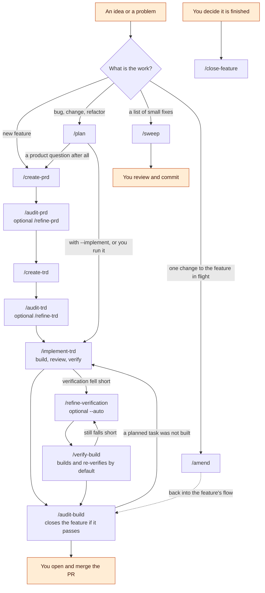

---

## 2. The core flow

A **PRD** (Product Requirements Document) says what to build and why. A **TRD** (Technical
Requirements Document) says how: architecture, tasks, phases. They live in `docs/PRD/` and
`docs/TRD/`.

For each document the order is **create → refine → audit**. Creating is required. Refining
and auditing are optional, but you should run them: each has one job the author can't do for
itself.

### PRD

| Command | What it does |
|---|---|
| [`/create-prd <description or issue>`](../../packages/core/commands/create-prd.md) | Writes the PRD from your description; with no argument, it interviews you first. Every requirement must trace to something real: your words, a source document, a measurement. Anything the author could not settle goes under `## Open Questions` and is not guessed. |
| [`/refine-prd [path] [--auto] [feedback]`](../../packages/core/commands/refine-prd.md) | Answers those open questions. By default it asks you, one question at a time, with the author's assumption offered as an answer. `--auto` has an agent decide each one and mark it as answered from evidence, a default, or yours to settle. Refine also runs a challenge pass that removes requirements with no source. |
| [`/audit-prd [path] [--source <path>]`](../../packages/core/commands/audit-prd.md) | Checks the PRD against its source in both directions: is anything the source asked for missing, and does anything in the PRD trace to nothing? It also checks the code for things the PRD asks for that already exist, and checks for conflicts with `stack.md` and `constitution.md`. It applies findings that hold up, and it rewrites the PRD's `## Could Not Verify` section. |

`/create-prd`:

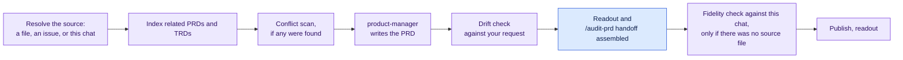

`/refine-prd` and `/refine-trd` work the same way:

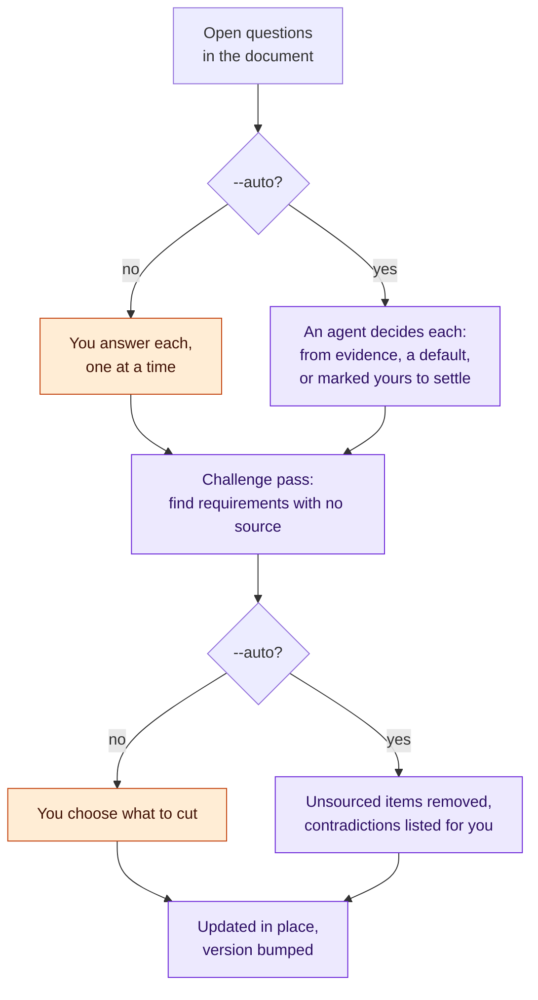

Audits read code as fact and documents as intent. When a design document and the code
disagree, the code wins, and the disagreement goes on record as a finding.

### TRD

| Command | What it does |
|---|---|
| [`/create-trd [prd-path]`](../../packages/core/commands/create-trd.md) | Writes the TRD from the PRD, then **grounds** every task against the existing code, so the plan reuses what exists and names what it replaces. The readout tells you how parallel the plan is. When the plan is mostly serial, it says why and shows the chain of tasks that sets its length. |
| [`/refine-trd [path] [--auto] [feedback]`](../../packages/core/commands/refine-trd.md) | Same shape as `/refine-prd`, applied to the TRD's open questions. |
| [`/audit-trd [path] [--source <path>]`](../../packages/core/commands/audit-trd.md) | Checks that every objective traces to a source, every task serves an objective, nothing from the PRD was dropped, and every design decision can actually be built the way it is specified. |

`/create-trd`:

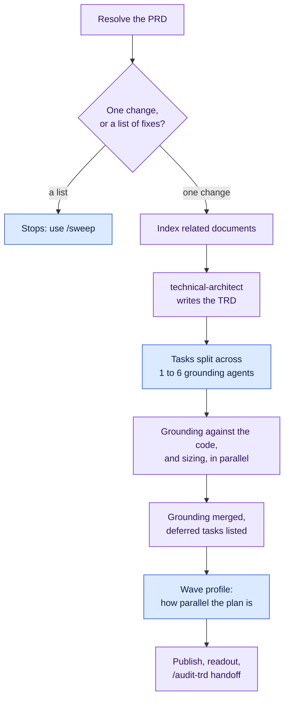

`/audit-prd` and `/audit-trd` share one shape:

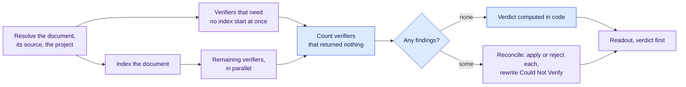

**Verification Artifacts.** Every TRD has a `## Verification Artifacts` section. It selects
which extra checks run when the build is verified: a screen-by-screen comparison against
designs (`verify-design-comparison`), a walk through designed user journeys
(`verify-flow-as-built`), and a comparison of what screens show against what their data
source returns (`verify-data-fidelity`). A check that applies is included by default, and
leaving one out needs a stated reason. `/audit-trd` reports an applicable check that was left
out with no reason given.

### `/implement-trd` — build it

[`/implement-trd [trd-path] [flags]`](../../packages/core/commands/implement-trd.md). With no
path, it works out the TRD from the current branch, or uses the only TRD in progress.

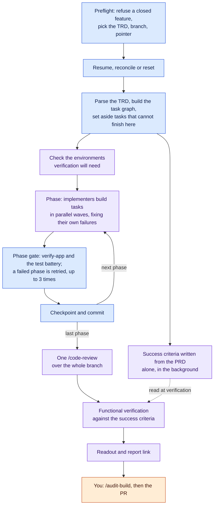

What a run does:

1. **Phases, in order.** Within a phase, tasks run in parallel waves. Tasks that touch the
   same file never run at the same time.
2. **Per task:** a specialist implementer (frontend, backend, mobile, or AI/agent) builds
   the task, runs its own targeted checks, and fixes what fails before it reports back.
3. **Phase gate:** a verification agent plus your project's own test battery. The phase is
   then checkpointed and committed.
4. **Once, after the last phase:** one code review (`/code-review high --fix`) over the whole
   branch diff, with its fixes applied.
5. **Then functional verification** (§3), on by default.

Tasks the TRD itself says can't finish in a normal run (marked `[LIVE]`, or "after the next
deploy") are set aside and reported. They are not dispatched.

| Flag | Use it when |
|---|---|
| `--resume` / `--continue` | A run was interrupted. Picks up from the last checkpoint and re-runs anything not marked done. |
| `--reconcile` | You don't trust what is marked done. Re-checks every "done" task against the disk, re-opens any task none of whose claimed files exist, adds tasks written into the TRD since the last run, then builds everything outstanding. Use it after `/audit-build` finds a gap. |
| `--no-verify` | Skip functional verification entirely. The readout will say nobody checked the software against the PRD. |
| `--verify` | Useful only together with `--resume`: jumps straight back into a verification loop that was interrupted partway through, without re-running the build. Verification already runs by default. |
| `--include-deferred` | Run the tasks that would otherwise be set aside. |
| `--reset-state` | Throw away progress tracking and start fresh. Asks you to confirm first. |

(`--chained` also exists, but only `/verify-build` passes it, when fixing. Don't type it
yourself.)

### `/audit-build` — check what was delivered

[`/audit-build [trd-path] [--prd <path>] [--report-only]`](../../packages/core/commands/audit-build.md)
answers three questions about the code that was actually delivered:

- **Verification:** does the code match the TRD's tasks? It reads the files, not the state file.
- **Validation:** does it do what the PRD asked, however the TRD restated it?
- **Traceability** (the headline check): does every requirement have both an implementation
  and a test that proves it? A requirement with code and no test counts as a gap, not a pass.

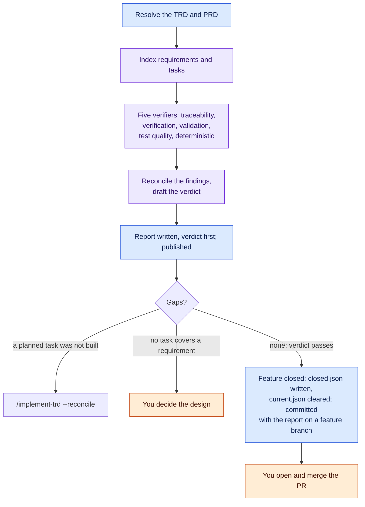

Gaps split two ways. When a TRD task already covers the gap, nothing needs deciding: the audit
marks the task not done and chains straight into `/implement-trd --reconcile` to build it.
When no task covers the gap, deciding *how* to close it is design work. The audit reports it
and stops. `--report-only` gives you the findings without the chained build.

Every run leaves a report at `.trd-state/<feature>/audit-build-report.md`. It opens with the
verdict, names the commit it audited, and holds the readout. It is published as a link (unless publishing is off), and on a
feature branch the audit commits it, so it travels with the PR.

**A passing audit closes the feature.** When the verdict is "safe to proceed" or "proceed with
these caveats", nothing is handed back to `/implement-trd`, and the run isn't `--report-only`,
the audit marks the feature closed: it writes `.trd-state/<feature>/closed.json` with its
verdict, clears `current.json`, and commits the record with the report.

### `/close-feature` — close it on your say-so

[`/close-feature [trd-path] ["<note>"]`](../../packages/core/commands/close-feature.md) is the
other way a feature gets closed: you say it's done. Shipped and tested, superseded, abandoned:
your word is the whole decision, and the note records why. It checks nothing and judges
nothing.

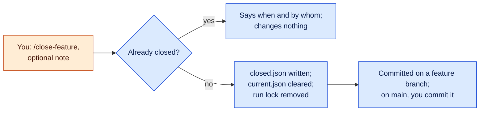

However it closes, the effect is the same bookkeeping. The session banner says "Closed", the
prompt hint stops treating the feature as in flight, and `/implement-trd` and `/amend` refuse
to work on it. `implement.json`, the TRD and the reports are left as they are. To reopen a
feature, delete its `closed.json`.

---

## 3. Verification

Every earlier stage checks documents or code. Verification checks the **running software**:
does it do what the PRD asked? It is the most important stage in the pipeline, and it is the
one to understand.

### Where it runs

| Situation | Command |
|---|---|
| Normal case: at the end of every build | Inside `/implement-trd`, unless you passed `--no-verify` |
| On its own: the build ran with `--no-verify`, you fixed something by hand (a credential, a config), or the loop crashed partway through | [`/verify-build [trd-path]`](../../packages/core/commands/verify-build.md). `--resume` continues an interrupted loop. `--cap N` sets the iteration budget (default 3, counted across resumes). |
| Recovery: a run ended without success | Run `/refine-verification` — interactive by default, `--auto` for an unattended answer — which turns the report's diagnosis into a plan with you (or, under `--auto`, with an agent). Then run `/verify-build`, which now builds and re-verifies that plan by default (`--no-fix` for a report-only pass), for as many rounds as the plan allows, and asks you nothing. |

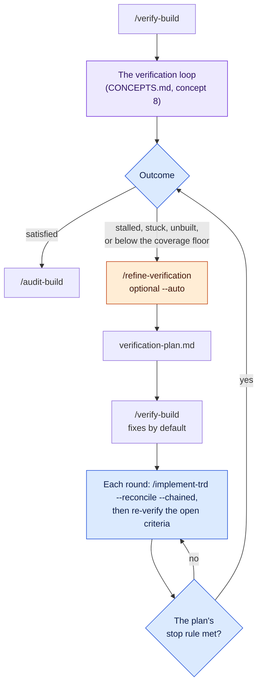

### What it checks against

- **Success criteria derived from the PRD alone.** An agent writes them without seeing the
  TRD, the task list or the code, so the plan can't grade its own homework. They are saved to
  `.trd-state/<feature>/success-definition.md`. With no PRD (for example, a `/plan` fix), they
  come from the TRD's reproduction or intended-change section.
- **The checks the TRD selected** under `## Verification Artifacts`. Each adds one criterion
  per screen, journey or data view.

Each iteration **exercises** the criteria against a running instance and collects evidence.
It **judges** each criterion as met, not met, not verifiable here, or unbuilt, and then
**debugs** what is not met, fixing the code in place. Proven criteria stay proven for the rest
of the run.

### What `.claude/rules/verification.md` contributes

This owner-written file tells the loop how to reach a running instance. It lists which
environments it may use and what it may do there, how many of each resource (simulators,
servers) can exist at once, how to refresh after a fix, where test credentials live (never
their values), which tools are installed, and what cannot be verified here. The loop won't
touch an environment the file doesn't list. It can also set a minimum share of criteria that
must be proven (the coverage floor). Run `/verification-setup` to fill it in; it interviews
you one topic at a time ([INSTALL.md §5](INSTALL.md#5-set-up-verification)). **An unfilled
file doesn't stop the loop, but most criteria will come back "not verifiable here".**

### Outcomes

| Outcome | Means | What to do |
|---|---|---|
| **satisfied** | No failing criterion remains. The report line says how many were never exercised: *satisfied* with 6 of 32 unchecked is not the same as fully proven | Nothing, or fill gaps in `verification.md` so more can be checked next time |
| **unbuilt** | Some capability the PRD asked for is absent, not broken. The loop stops instead of debugging code that doesn't exist | `/refine-verification`, then `/verify-build` |
| **stalled** | A debug pass closed no gaps, so the fixes aren't converging | Same. Also check that the environment actually picks up fixes (the refresh command in `verification.md`) |
| **stuck** | The iteration budget ran out with gaps still open | Same, or re-run with a larger `--cap` |
| **insufficient-coverage** | Too few criteria were proven to reach the coverage floor. This is a checking problem, not a code problem | Same. The plan usually adds environments or tooling rather than code |

For every outcome except *satisfied*, the readout has a **Diagnosis** line counting the open
criteria by cause, and its NEXT line is the recovery pair above.

### The report

The report is written to `.trd-state/<feature>/verification-report.md` and published as a
private link on claude.ai (see §6). The loop's resumable state is in
`verification-state.json` next to it. Each selected check can also publish its own page,
such as a design-versus-build frame diff.

---

## 4. Secondary flows

**[`/plan <what> [--implement]`](../../packages/core/commands/plan.md)** handles work that
doesn't need a PRD. Give it a sentence, or better, a bug report, issue ref, stack trace or log,
since those already carry steps and actual-versus-expected. A bare `/plan` writes up something
decided earlier in the conversation. It investigates, then classifies the work two ways:

- **Kind:** `defect` (success means the reproduction stops reproducing), `change` (the stated
  outcome holds), or `refactor` (behaviour unchanged, so the existing tests pass before and
  after).
- **Weight:** `trivial` (a one-file fix whose approach isn't in question) and `small` (a
  contained fix with one obvious approach) get a light TRD, with no audit. `medium` (a settled
  body of work spanning several tasks) gets full authoring, grounding and an audit.

`/plan` then **stops**. **`--implement` is the only thing that starts building**, at any
weight. Otherwise, run `/implement-trd` on the TRD yourself.

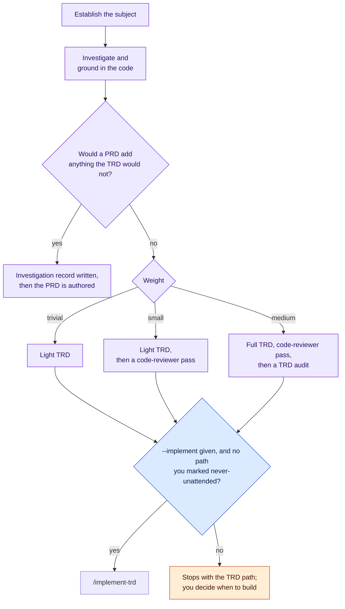

**[`/sweep <file or issues inline>`](../../packages/core/commands/sweep.md)** is for a list of
small, independent issues. It sorts out the ones that aren't quick wins. Each remaining issue
gets its own grounded fixer: different areas are fixed in parallel, and issues in the same area
one after another. It confirms that every claimed fix actually changed files on disk, then runs
your test battery once. Deferred issues are recorded rather than lost. The test for using it is
*coupling*, not size: six tasks that must land in order don't belong here.

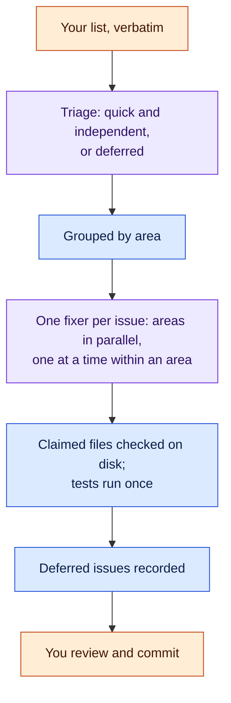

**[`/amend <what to change>`](../../packages/core/commands/amend.md)** makes one change to the
feature in flight: it grounds the change in the code, records it as an `AMEND-nnn` row in that
feature's TRD **before** doing it, implements it, and runs the test battery. It acts. There is
no confirm step and no flag. It refuses, and tells you where to go instead, if the change needs
ordering, more than one kind of specialist, or a product decision. It needs a feature in flight
(`.trd-state/current.json`).

**`/implement-trd --reconcile`** is how you bring the delivered state back in line with the
TRD after an audit gap, a hand edit to the TRD, or a suspicion that "done" is not done. See
the flag table in §2.

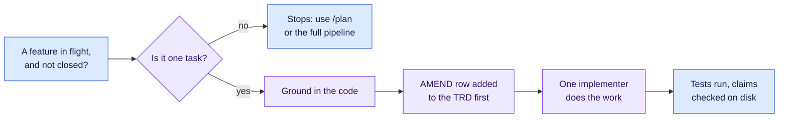

**[`/augment-trd-figma <figma-url> [--trd <path>]`](../../packages/core/commands/augment-trd-figma.md)**
pulls screenshots, component specs, design tokens and fixture data from Figma into the TRD and
onto disk. Implementers can't reach Figma themselves, so do this before `/implement-trd` on a
UI feature. It needs the Figma MCP server and a Figma access token.

**[`/fold-prompt`](../../packages/core/commands/fold-prompt.md)** analyses the project and
tightens `CLAUDE.md`, README and agent configuration so later sessions start with better
context.

---

## 5. Maintenance

- **[`/update-project`](../../packages/core/commands/update-project.md)** records what this
  session learned in `CLAUDE.md` without asking. It *proposes* changes to `constitution.md` or
  `stack.md` and applies them only if you approve.
- **[`/cleanup-project [--dry-run] [--auto]`](../../packages/core/commands/cleanup-project.md)**
  prunes stale or duplicate entries from `CLAUDE.md`, backing up first. Use `--dry-run` to
  preview the changes.
- **[`/rebase-project [--dry-run] [--preserve-all] [--force]`](../../packages/core/commands/rebase-project.md)**
  upgrades the vendored runtime in `.claude/` to the installed plugin version. It needs a clean
  git tree, because git is the undo. It never touches `constitution.md`, `stack.md` or
  `process.md`. See [INSTALL.md §7](INSTALL.md#7-keeping-current).

---

## 6. What you'll see while a command runs

**Status banners** tell you the state at a glance:

```
[STATUS: /implement-trd] DISPATCHED → phase 2 workflow in flight: 4 tasks, 2 waves
[STATUS: /implement-trd] RESUMED → phase 2 workflow returned
[STATUS: /implement-trd] PHASE 2/4 COMPLETE → …
═══ COMMAND COMPLETE: /implement-trd ═══
═══ COMMAND STUCK: /implement-trd ═══
```

*DISPATCHED* means the turn ended with work still running in the background, and names what
it is waiting on. *RESUMED* opens the turn after that work reports back. *COMPLETE* and
*STUCK* are always the very last line. STUCK gives the reason and what would unblock it.
**If a command ends with neither, that is a bug.**

**The readout.** Every finished command prints four sections just above its banner, in this
order:

| Section | Answers |
|---|---|
| STATE | What exists now, and what doesn't |
| DECISIONS | Choices the command made that you didn't, each with its reason |
| ISSUES | What's wrong or unresolved, and who has to act |
| NEXT | The one next command, ready to run, or "nothing" |

**Artifact links.** A command that produces a PRD, TRD or verification report publishes it as
a private page on claude.ai and prints the link above the banner. Later refinements update the
same link, so it never points at a superseded version. The links are stored in
`.trd-state/<feature>/artifacts.json`. To turn publishing off, set
`"ensemble": { "publishArtifacts": false }` in `.claude/settings.json`. A failed publish is one
line in the output and never stops the command.

**Completion notifications.** Long-running commands (`/implement-trd`, `/audit-build`,
`/plan --implement`) send a desktop notification when they finish or get stuck. For a webhook,
queue or script, set `NOTIFY_ON_COMPLETE`. It runs exactly once, when the command completes,
with the project, branch, feature and summary in `NOTIFY_*` variables
([command-status.md](../../.claude/rules/command-status.md) has examples).

**A Stop-hook block.** A model checks every turn as it ends for two things:

- a claim that work is continuing in the background when nothing was actually dispatched
- a pause to ask you something a running command should have decided itself (checked only
  while a command is running, not in ordinary conversation)

When it objects, the CLI shows **`Stop hook error: …`**. That is a known display quirk in
Claude Code. It is not an error in your setup. The agent gets one corrective turn. If the
block was wrong, the agent replies `My answer stands — <one sentence why>` and the turn ends.
You don't need to intervene either way.

---

## 7. Where state lives

| Path | Holds |
|---|---|
| `.trd-state/current.json` | Pointer to the feature in flight (PRD, TRD, branch). Commands use it when you give no path. |
| `.trd-state/<feature>/implement.json` | Task-by-task progress, checkpoints, and verification settings. `--resume` and `--reconcile` read this. |
| `.trd-state/<feature>/success-definition.md` | The criteria verification checks, derived from the PRD |
| `.trd-state/<feature>/verification-report.md`, `verification-state.json` | The latest verification report, and the loop's resumable state |
| `.trd-state/<feature>/verification-plan.md` | The recovery plan `/refine-verification` writes and `/verify-build` runs |
| `.trd-state/<feature>/discovered.jsonl` | Issues found along the way but not fixed. Those marked as blocking the feature become TRD tasks on the next `--reconcile`. |
| `.trd-state/<feature>/audit-build-report.md` | The latest `/audit-build` report: its verdict, the commit it audited, and the readout |
| `.trd-state/<feature>/closed.json` | Written by a passing `/audit-build` or by `/close-feature`: when, by whom, and the audit verdict or your note. Its presence is what marks the feature closed |
| `.trd-state/<feature>/artifacts.json` | The published links for this feature's documents |

`.trd-state/` is meant to be committed with the feature, so a fresh clone can resume. The
installer ignores nothing inside it.
