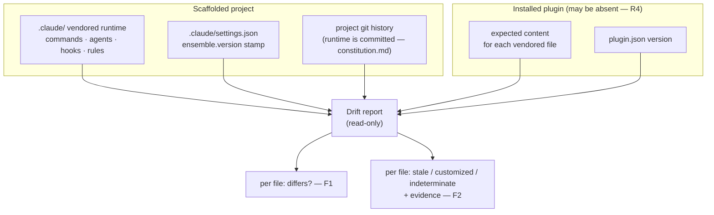

# PRD: Runtime Drift Detection

**Version**: 1.1.0
**Status**: Draft
**Created**: 2026-08-15
**Last Updated**: 2026-08-15
**Author**: @product-manager
**Stakeholders**: Ensemble vNext maintainer (author of the source feature request); maintainers of projects scaffolded from the Ensemble plugin

**Source**: `docs/modernization/runs/ab-test/spec.md` (feature request: runtime drift detection)

---

## Changelog

| Version | Date | Changes | Author |
|---------|------|---------|--------|
| 1.0.0 | 2026-08-15 | Initial PRD creation from `spec.md` | @product-manager |
| 1.1.0 | 2026-08-15 | Grounding pass: recorded `/rebase-project --dry-run` as prior art for F1 (§4 F1, §8, Appendix B); added `runtime-refresh.sh`'s ambient SessionStart overwrite as a third grounding fact (§1.1, NG5, E1); noted that rules are the one kind with no existing diff mechanism (AC-F1.1) | @product-manager |

---

## 1. Product Summary

### 1.1 Problem Statement

A project scaffolded from the Ensemble plugin carries a vendored `.claude/` runtime —
commands, agents, hooks, rules. Over time that copy diverges from what the plugin would
generate today. Two different causes produce divergence and they need opposite responses:

- **Stale** — the plugin moved on and the project didn't. The project should refresh.
- **Customized** — someone edited the vendored copy on purpose, for that project. It must
  be preserved; refreshing over it destroys real work.

Today nothing tells you which you have. Quoting the source: *"So a project can sit on a
two-release-old runtime indefinitely with no signal, and a refresh can silently overwrite a
deliberate local change."*

Three facts grounding the gap, all verified in this checkout:

- `generate-hooks-artifacts.sh --check` compares the plugin's own template against the
  manifest and exits 1 if regeneration would change any file. It never reads a consuming
  project's `.claude/`. (Source: `packages/core/scripts/generate-hooks-artifacts.sh`
  header, *"--check Exit 1 (without writing) if regeneration would change any file"*;
  confirmed by the source spec.)
- `/rebase-project`'s documented default is *"any file that **differs from the plugin's
  current version** is replaced. Anything not currently in the plugin is preserved as a user
  customization."* (Source: `packages/core/commands/rebase-project.md`.) That rule treats
  every difference in a plugin-shipped file as staleness, which is exactly the overwrite the
  source describes. It mitigates with always-on timestamped backups and a `--preserve-all`
  escape hatch, but it does not answer the question.
- The overwrite is not confined to an explicit `/rebase-project` invocation. The SessionStart
  hook `.claude/hooks/runtime-refresh.sh` (registered in `.claude/settings.json`; TRD:
  `docs/TRD/runtime-refresh.md`) performs it **automatically, on every session start**, with
  no user action. Its only signal is a version comparison — E1 below — and it *"replaces only
  the components already present under `.claude/`"* the instant the installed plugin's version
  exceeds the vendored `ensemble.version` stamp. Its four guards (plugin absent, version,
  self-repo checkout, in-flight `implement.json` work) gate *whether* a refresh runs; **none of
  them inspects file content**, so nothing distinguishes a stale file from a customized one.
  This is the strongest instance of the problem the source describes, and it is ambient.

### 1.2 Proposed Solution

A read-only drift report for a scaffolded project. It answers, per file: does the vendored
copy differ from what the currently installed plugin would generate, and — where it can
establish this from evidence — whether that difference is staleness or deliberate
customization. Where it cannot establish which, it says so rather than guessing.

The discrimination method itself is the open design problem the source hands to the TRD:
*"How to tell them apart is the hard part and I don't have an answer — that's what I want
designed."* This PRD does not choose the method. It fixes the product-level constraints the
method must satisfy (evidence must be reported, an indeterminate verdict must exist, nothing
may be written) and inventories the evidence sources that are actually available today.

### 1.3 Value Proposition

- A project can discover it is running an old runtime instead of sitting on one with no
  signal (source: problem statement).
- A deliberate local edit can be identified as such *before* a refresh replaces it (source:
  *"a refresh can silently overwrite a deliberate local change"*).

### 1.4 Key Differentiators

Not applicable — this is an internal tool for one framework, with no competitive framing in
the source.

### 1.5 Solution Architecture

No user-journey diagram: the flow is a single invocation of a reporting tool by one actor,
with no multi-step or multi-actor path to disambiguate.

---

## 2. User Analysis

### 2.1 Target Users

| User Type | Description | Primary Need |
|-----------|-------------|--------------|
| Project maintainer | Maintains a project whose `.claude/` was scaffolded from the Ensemble plugin | Ask the project *"what has drifted, and which kind is it?"* before deciding whether to refresh (source: *"I want a way to ask a project…"*) |
| Plugin maintainer | Maintains Ensemble vNext itself | Know whether a consuming project is on a current runtime — the signal `--check` does not provide (source: problem statement) |

### 2.2 User Personas

The source is a single first-person feature request from the framework's own maintainer,
who is both user types above. It supplies no research, interviews, or additional user
population. One persona is stated rather than invented:

**Persona: Ensemble vNext maintainer** (the source's author)
- **Role**: Maintains the plugin and consuming projects
- **Goals**: Decide what to do about drift — explicitly reserving the decision:
  *"I'll decide what to do with the report."*
- **Pain Points**: No signal that a project is on a two-release-old runtime; refreshes can
  silently destroy deliberate local edits (both stated in the source)
- **Technical Proficiency**: High — authors the framework, its generator, and its scaffold
  scripts

No further personas are recorded. The source names no other users, and inventing a
population would put fabricated needs in front of implementation.

---

## 3. Goals and Non-Goals

### 3.1 Goals

| ID | Goal | Success Metric | Priority |
|----|------|----------------|----------|
| G1 | Report per-file whether the vendored copy differs from what the installed plugin would generate | Every file in the vendored runtime set appears in the report exactly once, with a differs/matches verdict; none silently omitted | P0 |
| G2 | Distinguish stale-and-should-refresh from deliberately-customized | Every drifted file carries one of `stale` / `customized` / `indeterminate`, and every non-indeterminate verdict names the evidence it rests on | P0 |
| G3 | Change nothing | After a run, the project working tree and the plugin installation are byte-identical to before (verified by checksum comparison over both trees, plus `git status` showing no new or modified paths) | P0 |
| G4 | Produce a useful answer with no plugin installed | With no plugin installed the tool exits successfully and still reports something actionable, naming which verdicts became unavailable and why | P0 |
| G5 | Work on a runtime scaffolded before this feature existed | The report is produced on a project whose `.claude/` carries no provenance beyond what scaffolding already wrote, with no setup step, migration, or prior opt-in | P0 |

All five goals are P0 because the source states all five as MUST. No goal here was added
beyond the source's five requirements.

### 3.2 Non-Goals (Explicit Scope Exclusions)

| ID | Non-Goal | Rationale |
|----|----------|-----------|
| NG1 | Automatically fixing drift — refreshing, merging, reverting, or repairing any file | Source, *Not doing*: *"Automatically fixing drift. I'll decide what to do with the report."* |
| NG2 | Any change to how the runtime is version-controlled — no sidecar pristine copies, no subtree/submodule, no change to what is committed or gitignored | Source, *Not doing*: *"Any change to how the runtime is version-controlled."* |
| NG3 | Writing anything into the project to enable future runs — no baseline manifest, no checksum file, no provenance stamp, not even on first run | Direct consequence of source requirement 3, *"It MUST NOT change anything. Reporting only."* A first-run baseline write is still a write. See §8 for the rejected alternative |
| NG4 | Modifying `/rebase-project`, `scaffold-project.sh --refresh`, or the plugin's `--check` behaviour to consume or act on the report | The source asks for a way to *ask* a project a question. Wiring the answer into the tools that mutate the runtime is the natural scope-creep vector and would collide with NG1 |
| NG5 | Ambient or automatic drift warnings (session-start hook, banner, periodic check) | Not asked for. The source describes a question the user asks, not a notification the framework pushes. Scope note: this excludes adding a new ambient *warning*; it does not touch `runtime-refresh.sh`, the existing SessionStart hook that ambiently *refreshes* (§1.1) — changing that is NG4's territory. See §8 |
| NG6 | Drift detection over skills (`.claude/skills/`) | The source enumerates the vendored runtime as *"commands, agents, hooks, rules"* and names no others. `scaffold-project.sh` also copies skills, so this is a genuine ambiguity — recorded as an open question (Appendix C, Q1) rather than silently scoped in or out of the build |

---

## 4. Feature Requirements

### 4.1 P0 - Core Features (Must Have)

#### F1: Per-file drift inventory

**Priority**: P0
**Description**: For every file in the project's vendored runtime, report whether it differs
from what the currently installed plugin would generate.

**Source**: Requirement 1 — *"It MUST report, per file, whether the vendored copy differs
from what the currently installed plugin would generate."*

**Prior art — most of this mechanism already exists.** `/rebase-project`'s Step 2
(*Component Diff*, `packages/core/commands/rebase-project.md` §2.1–2.5) already performs a
per-file, byte-level content comparison of the vendored copy against what the plugin ships,
categorizing each file **New** (in plugin, not vendored) / **Updated** (in both, content
differs) / **Unchanged** (identical) / **Stale** (vendored-only, carries ensemble
frontmatter) / **Custom** (vendored-only, no frontmatter — preserved and reported, not
flagged as differing). `--dry-run` runs that comparison in *"Report only"* mode for every
category (§ the mode matrix, *"--dry-run | Report only | …"*), writing nothing. That is
AC-F1.1–AC-F1.4 for **commands, agents and hooks**, already built and already satisfying
NFR-1 for the comparison step. F1 should reuse this logic rather than reimplement it; the
TRD decides whether that means extraction into a shared library or invocation of the
existing path. What F1 adds beyond it is the fourth kind (rules — see AC-F1.1's note), the
generated-output comparison of AC-F1.5, and a standalone read-only entry point that is not a
mode of an upgrade command.

**User Stories**:
- As a project maintainer, I want a per-file list of what differs, so that I know the extent
  of divergence before deciding anything.

**Acceptance Criteria**:
- [ ] AC-F1.1: The report has one entry per file in the vendored runtime set, covering
      commands, agents, hooks and rules (the four kinds the source enumerates).
      **Note on rules — three of the four kinds have prior art, one has none.**
      `/rebase-project` content-diffs commands, agents, skills and hooks, but never diffs
      `.claude/rules/`: governance files (`constitution.md`, `stack.md`, `process.md`) are
      *"NEVER modified"* and framework-shipped rules (e.g. `async-discipline.md`) are
      copied-if-missing and *"preserve as-is"* once present, never compared for drift
      (`packages/core/commands/rebase-project.md` §4.6). So rules-kind coverage is new work
      with nothing to reuse, and it is the kind Appendix C Q3 has an open question over.
- [ ] AC-F1.2: Each entry states whether the vendored copy differs from what the currently
      installed plugin would generate.
- [ ] AC-F1.3: Files present in the vendored runtime but not shipped by the plugin are
      reported as such, and are not reported as "differs" (there is nothing to compare them
      against).
- [ ] AC-F1.4: Files the plugin ships but the vendored runtime lacks are reported as such.
      The source asks "what has drifted" without restricting drift to files that exist on
      both sides; an absent file is a divergence a maintainer must see.
- [ ] AC-F1.5: The comparison is against what the plugin **would generate today**, not
      against a raw source file, wherever the plugin generates rather than copies. (Source:
      requirement 1's wording, plus `generate-hooks-artifacts.sh`, which generates hook
      artifacts from `hooks.manifest.json` rather than copying them.)

**Dependencies**: An installed plugin. When absent, F3 governs.

#### F2: Classification with stated evidence, including an explicit indeterminate verdict

**Priority**: P0
**Description**: For each drifted file, classify the drift as stale-and-should-refresh or
deliberately-customized, report the evidence the verdict rests on, and report
`indeterminate` when the available evidence does not separate the two.

**Source**: Requirement 2 — *"It MUST distinguish stale-and-should-refresh from
deliberately-customized. How to tell them apart is the hard part and I don't have an answer
— that's what I want designed."*

The design of the discrimination method is delegated to the TRD. What this PRD fixes is that
the method must be **evidence-reporting** and must be **allowed to abstain**. Both follow
from the consequence the source names: a wrong "stale" verdict leads the user to refresh,
and *"refreshing over it destroys real work."* A classifier that must always pick one of two
answers will assert one with no basis.

**Evidence sources available today** (an inventory for the TRD, not a chosen design):

| ID | Evidence | Status |
|----|----------|--------|
| E1 | `ensemble.version` in `.claude/settings.json`, written by `stamp_ensemble_version()` in `scaffold-project.sh`, read by `/rebase-project` for version detection, and used by `runtime-refresh.sh` as its *sole* refresh trigger (§1.1) — so any project whose sessions have started under a newer plugin has already been refreshed on this signal alone. Measured present in this checkout: `4.1.15`, matching `packages/full/.claude-plugin/plugin.json` | Available, but only on runtimes scaffolded or refreshed after the RUNTIME work that introduced stamping (commits `8dc88ec`, `7c16621`). Absent on older projects — see R3 |
| E2 | The project's own git history for the vendored path. The runtime is committed to git (constitution.md, *Vendored Runtime*: *"Runtime is committed to git for reproducibility"*), so every edit to it has a commit | Available on any git-managed project. Its power to separate a hand edit from a bulk refresh commit is **Belief, not fact** — see R1 |
| E3 | Comparison against the plugin's *historical* released versions, not just the current one: a vendored file that matches some earlier released version byte-for-byte was never hand-edited | **Belief, not fact** that this is decisive, and availability is unproven — see R2 |
| E4 | A per-file checksum or provenance manifest recorded at scaffold time | Does not exist. Measured: a grep for `sha256`, `checksum`, and `md5` across `packages/core/scripts/` and `packages/core/templates/` returns no matches. Creating one is excluded by NG3 |

**User Stories**:
- As a project maintainer, I want each drifted file labelled stale or customized, so that I
  refresh the stale ones and preserve the customized ones.
- As a project maintainer, I want to see the evidence behind each label, so that I can
  override a verdict I can tell is wrong.
- As a project maintainer, I want the tool to say "I can't tell" rather than guess, so that
  I do not refresh over deliberate work on the strength of a fabricated verdict.

**Acceptance Criteria**:
- [ ] AC-F2.1: Every file reported as differing by F1 carries exactly one verdict:
      `stale`, `customized`, or `indeterminate`.
- [ ] AC-F2.2: Every `stale` and every `customized` verdict names the evidence it rests on,
      in the report, per file.
- [ ] AC-F2.3: The tool emits `indeterminate` — rather than defaulting to either category —
      when the available evidence does not separate them for that file.
- [ ] AC-F2.4: A file that is byte-identical to what the plugin would generate is never
      classified; it is reported as matching (no drift to explain).
- [ ] AC-F2.5: The report distinguishes a file that is *both* behind the plugin and locally
      edited from one that is only one of the two, or states explicitly that it cannot.
      (The source presents the two causes as distinct, not exclusive; `scaffold-project.sh
      --refresh` replaces only components already present, so a partially refreshed tree is
      reachable. See R4.)

**Dependencies**: F1.

#### F3: Useful answer with no plugin installed

**Priority**: P0
**Description**: The tool still produces a useful report when no plugin is installed at all.

**Source**: Requirement 4 — *"It MUST still produce a useful answer when no plugin is
installed at all."*

**Acceptance Criteria**:
- [ ] AC-F3.1: With no plugin installed, the tool completes and produces a report rather
      than erroring out or refusing to run.
- [ ] AC-F3.2: The report states plainly that no plugin was found, and which verdicts are
      unavailable as a result.
- [ ] AC-F3.3: The report still contains whatever the project alone supports — at minimum
      the vendored runtime inventory and the recorded `ensemble.version` when present (E1).
- [ ] AC-F3.4: Verdicts that require the plugin are reported as unavailable-for-this-reason,
      not as `indeterminate` and not as "no drift". Absence of a comparison is not evidence
      of a match.

**Dependencies**: None. This is the degraded mode of F1/F2.

#### F4: Works on a runtime scaffolded before this feature existed

**Priority**: P0
**Description**: The tool produces its report on a project whose vendored runtime predates
this feature, with no cooperation from the past — no migration, no baseline step, no prior
opt-in.

**Source**: Requirement 5 — *"It MUST work on a project whose runtime was scaffolded before
this feature existed — no cooperation from the past."*

**Acceptance Criteria**:
- [ ] AC-F4.1: The tool runs and reports on a project containing only what scaffolding
      already produced, with no new file, marker, or manifest required to exist first.
- [ ] AC-F4.2: The tool runs and reports on a project whose `.claude/settings.json` has no
      `ensemble.version` key (the pre-stamping case — E1 above), degrading its verdicts
      rather than failing.
- [ ] AC-F4.3: No run instructs the user to perform a setup, initialization, or baseline
      step before a report can be produced. (Such a step would be a write, excluded by NG3.)

**Dependencies**: None.

### 4.2 P1 - Enhanced Features (Should Have)

None. The source states five MUST requirements and two exclusions, and asks for nothing
beyond them. A P1 tier here would be invention.

### 4.3 P2 - Future Features (Nice to Have)

None, for the same reason.

---

## 5. Non-Functional Requirements

| ID | Requirement | Source |
|----|-------------|--------|
| NFR-1 | The tool must change nothing — no file in the project, none in the plugin installation, no state directory, no git operation. Reporting only | Source spec, requirement 3: *"It MUST NOT change anything. Reporting only."* |
| NFR-2 | The tool must be deterministic and reproducible: the same project and the same installed plugin produce the same report | constitution.md, Principle 4 as narrowed 2026-08-13: *"command-type hooks, `lib/`, and the generator (`generate-hooks-artifacts.sh`) remain deterministic and unit-tested."* A drift report is a comparison over files, in the same class as the generator |
| NFR-3 | Deterministic logic must carry unit tests meeting the project's quality gate: unit >= 60%, integration >= 50% when applicable | constitution.md, *Quality Gates*. Figures are quoted from that file, not chosen here. `verification_level: unit-only` applies unless a TRD task is marked `[LIVE]` |

No performance, throughput, uptime, or scale requirement is recorded: the source states
none, and no measurement of the vendored runtime's size or of an acceptable run time exists
to source one from.

---

## 6. Acceptance Criteria Summary

### Feature Acceptance Criteria

| ID | Feature | Criterion | Verification Method |
|----|---------|-----------|---------------------|
| AC-F1.1 | F1 | One entry per vendored file across commands, agents, hooks, rules | Unit test over a fixture runtime |
| AC-F1.2 | F1 | Each entry states differs / matches vs. what the plugin would generate | Unit test |
| AC-F1.3 | F1 | Vendored files not shipped by the plugin are reported as such, not as "differs" | Unit test |
| AC-F1.4 | F1 | Plugin files missing from the vendored runtime are reported as such | Unit test |
| AC-F1.5 | F1 | Comparison targets generated output, not raw source, where the plugin generates | Unit test against a generated hook artifact |
| AC-F2.1 | F2 | Every differing file carries exactly one of stale / customized / indeterminate | Unit test |
| AC-F2.2 | F2 | Every stale and customized verdict names its evidence | Unit test |
| AC-F2.3 | F2 | Indeterminate is emitted rather than defaulting to a category | Unit test with evidence deliberately withheld |
| AC-F2.4 | F2 | Matching files are not classified | Unit test |
| AC-F2.5 | F2 | Simultaneously-behind-and-edited is distinguished, or explicitly declared undistinguishable | Unit test over a partially refreshed fixture |
| AC-F3.1 | F3 | Completes and reports with no plugin installed | Integration test (BATS) with no plugin present |
| AC-F3.2 | F3 | Names the missing plugin and the verdicts thereby unavailable | Integration test |
| AC-F3.3 | F3 | Still reports project-only content, including `ensemble.version` when present | Integration test |
| AC-F3.4 | F3 | Unavailable verdicts are not reported as indeterminate or as no-drift | Unit test |
| AC-F4.1 | F4 | Reports on a project with only what scaffolding produced, no prerequisite file | Integration test on a legacy-shaped fixture |
| AC-F4.2 | F4 | Degrades rather than fails when `ensemble.version` is absent | Integration test on a fixture with the key removed |
| AC-F4.3 | F4 | No run demands a setup or baseline step first | Manual review of output text + integration test |

### Non-Functional Acceptance Criteria

| ID | Requirement | Criterion | Verification Method |
|----|-------------|-----------|---------------------|
| AC-N1 | NFR-1 | Project tree, plugin tree and git status are byte-identical before and after a run, including all failure and no-plugin paths | Integration test: checksum both trees pre/post, assert `git status --porcelain` unchanged |
| AC-N2 | NFR-2 | Two consecutive runs on an unchanged project and plugin produce identical reports | Integration test |
| AC-N3 | NFR-3 | Unit coverage >= 60% on the deterministic comparison and classification logic | Coverage report from the project's test runner |

---

## 7. Risk Assessment

| ID | Risk | Likelihood | Impact | Mitigation Strategy |
|----|------|------------|--------|---------------------|
| R1 | The discrimination has no ground truth to validate against. A wrong `stale` verdict leads the user to refresh, and per the source *"refreshing over it destroys real work."* The evidence sources E2 and E3 are believed to separate the causes but this is unverified | Med | High | Require evidence in every verdict (AC-F2.2) and permit abstention (AC-F2.3), so a weak verdict is visible as weak rather than asserted. Validate the chosen method against real project histories before trusting it — see contingency |
| R2 | The strongest candidate evidence (E3 — matching a vendored file against the plugin's historical released versions) may not be available where the tool runs: a project may have only the current plugin installed, with no local corpus of prior versions | Med | Med | Treat E3 as optional evidence, not a precondition. If E3 is unavailable, verdicts that depend on it become `indeterminate` (AC-F2.3), which is a correct outcome rather than a failure |
| R3 | Requirement 5's target case is exactly the case with the least evidence: a runtime scaffolded before `ensemble.version` stamping existed (introduced in commits `8dc88ec` / `7c16621`) has no E1, so classification may degrade to `indeterminate` across the whole tree — a technically compliant but useless report | Med | High | Do not let the design rest on E1 alone. Measure, on a real pre-stamping project, what fraction of files still get a non-indeterminate verdict, and treat an all-indeterminate result as a design failure — see contingency |
| R4 | Drift may not be binary. `scaffold-project.sh --refresh` *"[replaces] only components already present under the target's `.claude/`"*, so a tree can be partially refreshed and a file can be both behind the plugin and locally edited. A two-label scheme forces such a file into a category that misdescribes it | Med | Med | AC-F2.5 requires the report to distinguish this case or to declare explicitly that it cannot |
| R5 | Scope creep into repair. `/rebase-project` is the obvious consumer of this report and already mutates the runtime; wiring the two together contradicts the source's *"I'll decide what to do with the report"* | Med | Med | NG1 and NG4 are explicit and are referenced by `/implement-trd` to reject the change |

### Contingency Plans

**R1 Contingency**: If validation cannot establish that the chosen method separates the two
causes, ship F1 (the per-file inventory) with F2 restricted to verdicts backed by evidence
that *is* validated, and report everything else as `indeterminate`. An honest inventory plus
"I can't tell" is strictly better than the status quo, in which nothing tells you anything
— and it is safe, because NG1 means no automatic action follows a verdict.

**R3 Contingency**: If a real pre-stamping project yields an all-indeterminate report, that
is a design failure against requirement 5, not an acceptable degradation. Return to the
evidence inventory (E2, E3) for a signal that does not depend on scaffold-time cooperation,
and re-open Q2 in Appendix C before implementing.

---

## 8. Decisions and Rejected Alternatives

| Proposal / Challenge | Verdict | Rationale | Revisit when |
|----------------------|---------|-----------|--------------|
| Write a per-file baseline/checksum manifest into the project on first run, then compare against it on later runs | Rejected | It is a write. Source requirement 3 is *"It MUST NOT change anything"*, with no first-run exemption. It also fails requirement 5 on its first encounter with any pre-existing project — the baseline would record already-drifted content as pristine | The user explicitly authorizes an opt-in baseline, or a separate command owns baseline creation and this tool stays read-only over it |
| Byte-equality against the current plugin as the sole classifier | Rejected | It answers requirement 1 and not requirement 2. It is also, in substance, what `/rebase-project` already does (*"any file that differs from the plugin's current version is replaced"*) — the behaviour the source identifies as destroying deliberate edits | Never as a *sole* classifier. It remains a valid input to F1 |
| Extend `generate-hooks-artifacts.sh --check` to cover consuming projects instead of building a new entry point | Rejected | Measured: `--check` compares the plugin's template against the manifest inside the monorepo checkout and never reads a consuming project's `.claude/`; it also exits 1 on drift, which is CI-gate semantics, not a report. Retrofitting a second audience onto a gate conflates the two | The TRD determines that a consuming-project mode inside the existing script is cheaper than a separate entry point, provided the exit-code contract for the gate is unchanged |
| Build F1's comparison from scratch instead of reusing `/rebase-project --dry-run` | Rejected | Measured: `/rebase-project` §2.1–2.5 already does per-file byte comparison with New / Updated / Unchanged / Stale / Custom categories for commands, agents and hooks, and `--dry-run` already runs it "Report only," writing nothing. Reimplementing it would produce a second, divergent notion of what "differs" means in this codebase | Never for the comparison itself. The TRD may still build a separate *entry point* (see the next row) as long as the comparison logic is shared |
| Deliver the report as a mode of `/rebase-project` rather than a distinct entry point | Not decided — TRD's call | `--dry-run` is already read-only and already produces most of F1, so this is the cheapest path. Against it: `/rebase-project` is an *upgrade* command whose report is framed as "what I will replace," which is the framing the source objects to; and F2's verdicts have no place in an upgrade preview. NG4 forbids the report *driving* the mutation, not the two sharing a command | The TRD picks one, subject to NG4 and to NFR-1 holding on every path |
| Deliver drift detection as an ambient hook that warns at session start | Rejected | Not asked for. The source describes a question the user asks (*"I want a way to ask a project…"*), and constitution.md prohibits blocking hooks. Note the framework already *acts* ambiently at SessionStart (`runtime-refresh.sh`, §1.1); this rejection is about adding a *warning*, and does not endorse that existing behaviour | The user asks for ambient notification of drift |
| Have the report trigger or offer a refresh of the files it labels `stale` | Rejected | Source, *Not doing*: *"Automatically fixing drift. I'll decide what to do with the report."* | The user retracts that exclusion |
| Store a pristine copy of the plugin output alongside the vendored runtime to diff against | Rejected | Both a write (NG3) and a change to what the project version-controls, excluded by the source's *"Any change to how the runtime is version-controlled"* | The user retracts that exclusion |
| Force every drifted file into `stale` or `customized`, with no third verdict | Rejected | With the evidence available today (E1–E4), some files admit no basis for either. A forced verdict is a fabricated one, and the consequence of a fabricated `stale` is destroyed work | Evidence is found that separates the two causes for every file; then the third verdict becomes dead weight rather than a safeguard |

### Confirmed grounding — do not re-litigate

- *"It MUST NOT change anything. Reporting only."*
- *"Automatically fixing drift. I'll decide what to do with the report."* — the user owns
  the decision; the tool does not act on its own findings.
- *"Any change to how the runtime is version-controlled."* — excluded.
- *"How to tell them apart is the hard part and I don't have an answer — that's what I want
  designed."* — the discrimination method is an open design task for the TRD, not a settled
  choice this PRD is withholding.
- *"It MUST work on a project whose runtime was scaffolded before this feature existed — no
  cooperation from the past."*

---

## Appendices

### Appendix A: Glossary

| Term | Definition |
|------|------------|
| Vendored runtime | The `.claude/` copy carried inside a scaffolded project — commands, agents, hooks, rules (source's enumeration) |
| Stale | Vendored copy differs because the plugin moved on and the project did not; should refresh (source) |
| Customized | Vendored copy differs because someone edited it on purpose for that project; must be preserved (source) |
| Indeterminate | Available evidence does not separate stale from customized for that file (this PRD, AC-F2.3) |
| Drift | Any divergence between the vendored copy and what the installed plugin would generate today |

### Appendix B: Related Documents

- Source feature request: `docs/modernization/runs/ab-test/spec.md`
- `.claude/rules/stack.md`, `.claude/rules/constitution.md` (named by the source's *Context*)
- `packages/core/scripts/generate-hooks-artifacts.sh` — the `--check` this feature is not
- `packages/core/scripts/scaffold-project.sh` — produces the vendored runtime; stamps
  `ensemble.version`; `--refresh` semantics behind R4
- `packages/core/commands/rebase-project.md` — the consumer that overwrites on difference,
  **and the closest existing thing to F1**: §2.1–2.5 (*Component Diff*) plus `--dry-run`'s
  report-only mode; §4.6 for why rules are the one kind it never diffs
- `docs/TRD/runtime-refresh.md` and `.claude/hooks/runtime-refresh.sh` — the SessionStart
  hook that performs the silent overwrite automatically, on version comparison alone (§1.1)

### Appendix C: Open Questions

| Question | Status | Resolution |
|----------|--------|------------|
| Q1: Does the vendored runtime set include `.claude/skills/`? The source enumerates *"commands, agents, hooks, rules"*; `scaffold-project.sh` also copies skills | Open | Default applied: build to the source's four named kinds (NG6). Extend to skills only if the user confirms. Flagged rather than silently decided because it changes the report's scope |
| Q2: Which evidence source does the discrimination rest on — E1, E2, E3, or a combination? | Open | Delegated to the TRD by the source's own framing. Constrained here by AC-F2.2, AC-F2.3 and R3's contingency |
| Q3: Do governance files (`constitution.md`, `stack.md`, `process.md`) belong in the report? `/rebase-project` never modifies them, so their divergence is expected by design and might be noise | Open | Not decided. Reporting them as always-customized would be accurate but uninformative; omitting them silently would violate AC-F1.1's completeness |
| Q4: What form does the report take — stdout, a file, both? | Open | Unconstrained by the source. Note that writing a report file into the project is itself a write; NFR-1 and NG3 push toward stdout unless the user directs the output elsewhere |
