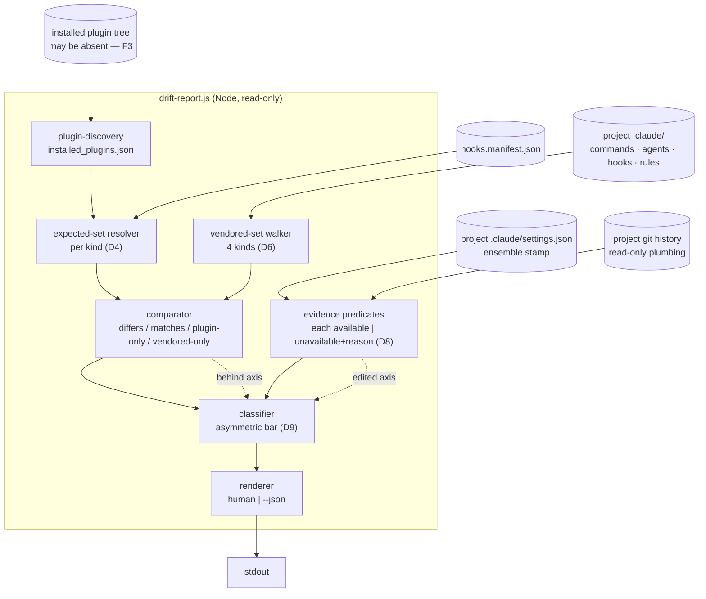

# TRD: Runtime Drift Detection

**Version**: 1.0.0
**Status**: Draft
**Created**: 2026-08-15
**Last Updated**: 2026-08-15
**Author**: @technical-architect
**Source PRD**: `docs/modernization/runs/ab-test/new-v2/PRD.md` (v1.1.0)
**Task ID Prefix**: DRIFT

---

## Changelog

| Version | Date | Changes | Author |
|---------|------|---------|--------|
| 1.0.0 | 2026-08-15 | Initial TRD creation from PRD v1.1.0 | @technical-architect |

---

## 1. Overview

### 1.1 Technical Summary

A read-only reporting tool that answers, per vendored runtime file: *does this differ from
what the installed plugin would produce today, and — where evidence supports it — is the
difference staleness or a deliberate edit?*

The PRD hands the TRD one genuinely open design problem (F2 / Appendix C Q2): the
discrimination method. This TRD's answer has three parts.

**First, split the question in two.** PRD R4 observes that drift is not binary — a file can
be simultaneously behind the plugin and locally edited. The tool therefore computes two
independent axes per file — `behind` (content differs from the plugin's expected output) and
`edited` (evidence that the last write to this file did not come from a scaffold/refresh) —
and derives the single required verdict from them. The axes are reported alongside the
verdict, which is what makes AC-F2.5 satisfiable rather than a labelling compromise.

**Second, get `edited` from the project's own git history, using a signal that already
exists in the code.** Every scaffold and every refresh ends in `stamp_ensemble_version()`
(`packages/core/scripts/scaffold-project.sh:1012`), which rewrites `.claude/settings.json`'s
`ensemble` object — `version` and `refreshed_at` — atomically, in the same operation that
replaced the component files. The runtime is committed to git (constitution.md, *Vendored
Runtime*). So a commit that changes a vendored file **and** changes the `ensemble` stamp in
the same commit is refresh-shaped; a commit that changes a vendored file and leaves the
stamp untouched was not produced by the scaffold path. This is PRD evidence source E2, made
mechanical, and it needs neither a plugin installation nor a corpus of historical plugin
releases.

**Third, make every evidence predicate carry an explicit availability state, and make the
evidence bar asymmetric.** A predicate is *available*, or *unavailable with a stated reason*
— never silently false. This is the difference between "no stamp exists in this project's
history, so I cannot run the refresh-shape test" and "the stamp did not change, so this was
hand-edited"; on a pre-stamping project (PRD R3) the second reading would label the entire
tree `customized` with total confidence and no basis. And because PRD R1 states the
consequence asymmetrically — *"refreshing over it destroys real work"* — weak evidence is
permitted to produce `customized` (the direction whose error costs nothing) and is never
permitted to produce `stale` (the direction whose error destroys work).

Everything else follows from NFR-1 (change nothing) and NFR-2 (deterministic): a
command-type Node.js CLI, not a prompt; stdout only, no report file; git accessed through
read-only plumbing commands invoked with array arguments.

### 1.2 Key Technical Decisions

| ID | Decision | Choice | Serves Objective | Rationale | Alternatives Considered |
|----|----------|--------|------------------|-----------|------------------------|
| D1 | Entry point form | A standalone deterministic CLI plus a thin `/drift-report` command that invokes it — **not** a mode of `/rebase-project`. Resolves the PRD §8 row marked *"Not decided — TRD's call"* | NFR-2, NFR-3 | `/rebase-project` is a prompt (`packages/core/commands/rebase-project.md`), executed by the LLM. constitution.md Principle 4 as narrowed 2026-08-13 confines the determinism-and-unit-test guarantee to command-type hooks, `lib/`, and the generator. A prompt cannot satisfy NFR-2 and cannot be measured against NFR-3's coverage gate at all | (a) A `--drift` mode of `/rebase-project`: cheapest path, and `--dry-run` is already read-only — rejected because its report is non-deterministic and unmeasurable, and because F2's verdicts have no place in an upgrade preview. **Revisit when** the framework acquires a deterministic executor for command bodies. (b) Extend `generate-hooks-artifacts.sh --check`: rejected by the PRD (§8) and confirmed here — `--check` never reads a consuming project |
| D2 | Implementation language | Node.js 18+, single-file CLI with a `lib/` of pure functions; Jest for unit tests | NFR-3, AC-N3, stack.md | stack.md assigns JavaScript/Node 18+ to hook development and Jest ^29 to JS unit tests; `packages/core/hooks/package.json` already carries a Jest devDependency. Jest reports line coverage, which is the only way AC-N3's `>= 60%` is *measurable*; BATS has no coverage instrumentation | Bash (matches `scaffold-project.sh`, and the comparison is file-shaped) — rejected: no coverage tooling, so NFR-3 would be unverifiable. Python (matches the router hook) — rejected: no existing pytest surface in `packages/core/`. **Revisit when** the project adopts a shell coverage tool |
| D3 | Delivery | Ship as `workflows/drift-report.js`, delivered to `.claude/workflows/` by the **existing** `copy_workflows()` in `scaffold-project.sh`; the same file is invocable from the plugin with `--project <path>` | AC-F3.1, AC-F4.1 | Two invocation sites are required by the ACs and neither is optional: F3 demands a run with **no plugin installed** (only a vendored copy can do that), F4 demands a run on a project that predates the feature (only a plugin-side copy can do that). `copy_workflows()` already ships `*.js` to `.claude/workflows/`, so delivery needs no new scaffold machinery | A new `copy_lib()` targeting the already-created-but-empty `.claude/lib/` — rejected: new delivery code for no gain, and `.claude/lib/` has no existing consumer. A vendored copy only — rejected: fails F4 on pre-existing projects. **Revisit when** `.claude/lib/` acquires a delivery function for another reason |
| D4 | Expected-content resolution | Per-kind, mirroring `scaffold-project.sh`'s own source resolution: agents from `<plugin>/agents/`, commands from `<plugin>/commands/core/` (or `<plugin>/../core/commands/`) minus the plugin-only exclusion list, rules from `<plugin>/templates/claude-directory/rules/`, hooks from `hooks.manifest.json` | AC-F1.2, AC-F1.5 | AC-F1.5 requires comparing against *generated* output where the plugin generates. Measured: scaffold copies byte-for-byte (`cp`) for agents, commands and rules, so expected content is the plugin file itself. The one genuine generation is the **hook set**: `manifest_shippable_hooks()` filters on `shippable` and skips `hookType:"prompt"` entries, and `copy_hook_prompts()` delivers a prompt file instead. A directory-to-directory diff would report phantom missing hooks for every prompt-type entry | Diff the plugin's `hooks/` directory against `.claude/hooks/` — rejected: as of 4.1.11 three manifest entries name `.js` files that do not exist on disk (they are identifiers), so this reports three false absences. **Revisit** never; the manifest is the single declaration by design (RUNTIME-B001) |
| D5 | Governance files | `constitution.md`, `stack.md`, `process.md` are classified **structurally** as vendored-only (AC-F1.3), not by a hardcoded exclusion list: a rule is plugin-shipped exactly when it exists in the plugin's rules template dir, and these never do. Resolves PRD Appendix C Q3 | AC-F1.1, AC-F1.3 | This is the same structural derivation `refresh_rules()` uses (`scaffold-project.sh:1091`, *"a rule is 'framework-shipped' exactly when it exists in rules_src_dir"*). They appear in the report (satisfying AC-F1.1's completeness) as "not shipped by the plugin — nothing to compare against", which is accurate rather than a policy judgement | Omit them (Q3's "might be noise") — rejected: violates AC-F1.1 completeness. Report them as always-customized — rejected: accurate but uninformative, and it invents a verdict for a file with no comparison basis, contradicting AC-F3.4's principle. **Revisit when** the plugin starts shipping a governance template |
| D6 | Report scope | The four kinds the PRD names: `.claude/commands/`, `.claude/agents/`, `.claude/hooks/` (incl. `prompts/`, `lib/`), `.claude/rules/`. `.claude/skills/` excluded per NG6. `.claude/contracts/`, `.claude/workflows/` and `.claude/settings.json` also excluded, and named here rather than dropped silently | AC-F1.1, NG6 | Contracts and workflows are copied by scaffold but are not among the source's four kinds — the same ambiguity NG6/Q1 records for skills, resolved the same way. `settings.json` is merge-managed (`stamp_ensemble_version()` merges rather than replaces), so a whole-file diff would be meaningless; it is consumed as **evidence** (E1) instead of reported as a file | Include contracts/workflows — rejected as scope expansion past the source's enumeration. **Revisit when** the user confirms the kind set, jointly with Q1 |
| D7 | Output shape | Two independent axes per file (`behind`, `edited`), each with its own evidence and availability, plus exactly one derived `verdict` field | AC-F2.1, AC-F2.5 | AC-F2.1 requires exactly one verdict; AC-F2.5 requires that behind-and-edited be distinguishable. A single label cannot do both. Axes satisfy F2.5; the derived verdict satisfies F2.1. R4's "a two-label scheme forces such a file into a category that misdescribes it" is answered structurally rather than by choosing a better label | A fourth verdict value (`both`) — rejected: AC-F2.1 enumerates exactly three, and adding one changes the PRD's contract. **Revisit when** the user amends AC-F2.1 |
| D8 | Evidence model | Every predicate returns `available` with a value, or `unavailable` with a machine-readable reason. Nothing is silently false | AC-F2.3, AC-F3.4, AC-F4.2 | This is the mechanism behind AC-F3.4 ("absence of a comparison is not evidence of a match") and AC-F4.2 (degrade, don't fail). It is also what stops the pre-stamping failure mode: on a project with no `ensemble` stamp in its history, the refresh-shape predicate is *unavailable*, not *false* — the false reading labels the whole tree `customized` with no basis (see TR3) | A boolean-per-predicate model with a separate "confidence" score — rejected: a score is an invented severity, and it hides which specific evidence was missing. **Revisit** never |
| D9 | Asymmetric evidence bar | Weak evidence may produce `customized`; only strong evidence may produce `stale`. Everything else is `indeterminate` | AC-F2.3, PRD R1 | PRD R1 states the consequence asymmetrically: a wrong `stale` leads to a refresh and *"refreshing over it destroys real work"*, while a wrong `customized` costs a preserved file the user can refresh by hand. The evidence bar follows the consequence | A symmetric bar — rejected: it treats a recoverable error and an unrecoverable one as equally acceptable. **Revisit when** NG1 is retracted and a verdict drives an automatic action, at which point both directions become destructive and the bar must rise on both |
| D10 | `edited` predicate (primary, strong) | For file F, find the newest commit touching F. It is **refresh-shaped** if the same commit also changes any field of the `ensemble` object in `.claude/settings.json` (`version`, `refreshed_at`, `rebased_at`, `previous_version`); **edit-shaped** if it does not; **unavailable** if the project has no git history for F, or if `.claude/settings.json` has never carried an `ensemble` object at any point in that history | AC-F2.2, G2 | Grounded in code, not in belief: `stamp_ensemble_version()` runs at the end of both the scaffold path (`:1225`) and the `--refresh` path (`:1369`), rewriting `refreshed_at` on every run; `/rebase-project` additionally writes `rebased_at` and `previous_version`. Keying on the whole `ensemble` object rather than on `refreshed_at` alone is what stops TR4 | Keying on `refreshed_at` alone — rejected, see TR4. Keying on commit breadth ("a refresh touches many files") — rejected: it needs an invented threshold. **Revisit when** a write path is added that changes vendored files without stamping |
| D11 | `edited` predicate (secondary, weak) | **Isolation**: the newest commit touching F changed exactly one path inside the vendored runtime set. Reported explicitly as weak evidence, and — per D9 — admissible only toward `customized` | AC-F2.2, PRD R3 | This is the only `edited` signal that survives on a pre-stamping project, which is precisely PRD R3's target case. It is genuinely weak: a refresh in which only one upstream file changed also produces a one-file commit. Stating the weakness in the report is what AC-F2.2 asks for | Omitting it entirely — rejected: it is the difference between a partly-useful and an all-indeterminate report on R3's case, and D9 already bounds the damage of a false positive. **Revisit** after DRIFT-T007 measures it against real history; if it produces false `customized` verdicts at a rate the maintainer rejects, drop it and invoke the R3 contingency |
| D12 | Historical-release evidence (E3) | Optional. If a corpus of prior plugin releases is discoverable locally, a vendored blob matching any earlier release is strong evidence of `stale`. If no corpus is discoverable, the predicate reports `unavailable` and contributes nothing | AC-F2.3, PRD R2 | Exactly PRD R2's mitigation: *"Treat E3 as optional evidence, not a precondition."* Making it a precondition would fail on any project with only the current plugin installed | Requiring E3 — rejected by R2. Fetching historical releases over the network — rejected: a network dependency in a read-only local report, and it would make NFR-2's reproducibility depend on a remote. **Revisit when** the plugin ships a local release archive |
| D13 | I/O discipline | Read-only on every path. No file written anywhere, no temp file inside the project, no `git` subcommand that mutates. Git invoked via `spawnSync` with array arguments and `--no-optional-locks`, restricted to `rev-parse`, `log`, `ls-files`, `cat-file`, `show`. Output to stdout only: human-readable by default, `--json` for machine consumption | NFR-1, AC-N1, CLAUDE.md | NFR-1 forbids writing anywhere, and AC-N1 checksums both trees. `--no-optional-locks` matters concretely: index-refreshing git commands rewrite `.git/index` mtime, which is a write (TR1). `spawnSync` with array args is CLAUDE.md's *Command Injection Prevention* rule, and the CLI takes a user-supplied `--project` path | Writing the report to a file (PRD Q4's "a file, both") — rejected: NG3 forbids writing into the project, and writing outside it makes NFR-2 harder to verify. Shelling out through a string — rejected by CLAUDE.md. **Revisit when** the user directs output elsewhere (Q4 leaves this to them; `> file` from the shell already covers it) |

### 1.3 Technology Stack

| Layer | Technology | Purpose | Notes |
|-------|------------|---------|-------|
| CLI / comparison / classification | Node.js 18+ | The drift-report executable and its pure-function library | stack.md: *Hook development — JavaScript/Node.js 18+* |
| Unit tests | Jest ^29.7.0 | Comparison and classification logic; coverage measurement for AC-N3 | stack.md *Frameworks*; `packages/core/hooks/package.json` already depends on Jest |
| Integration tests | BATS ^1.9.0 | No-plugin, legacy-fixture, byte-identity and determinism scenarios | stack.md *Testing*; matches `scaffold-project.test.sh`, `runtime-refresh.test.sh` |
| Evidence source | `git` plumbing (read-only) | `log`, `cat-file`, `ls-files`, `show`, `rev-parse` | stack.md *Runtime Dependencies*: Git 2.x+ |
| Manifest parsing | JSON (Node built-in) | `hooks.manifest.json`, `installed_plugins.json`, `.claude/settings.json` | stack.md *Configuration: JSON/YAML* |
| Command surface | Markdown prompt | `/drift-report` — a thin wrapper that runs the CLI and shows its output | constitution.md Principle 3 |

### 1.4 Integration Points

| System | Type | Direction | Notes |
|--------|------|-----------|-------|
| `~/.claude/plugins/installed_plugins.json` | File read | In | Plugin discovery — the `full@ensemble-vnext` entry's `installPath`. Same source `runtime-refresh.sh` guard 1 uses |
| Installed plugin tree | File read | In | Expected content for agents, commands, rules; `hooks.manifest.json` for the expected hook set |
| Project `.claude/` | File read | In | The vendored runtime under comparison |
| Project `.claude/settings.json` | File read | In | Evidence E1 (`ensemble.version`, `ensemble.refreshed_at`) — **not** a reported file (D6) |
| Project git repository | Read-only subprocess | In | Evidence E2 — commit shape for the `edited` axis |
| stdout | Stream | Out | The report. The only output channel (D13) |

---

## 2. System Architecture

### 2.1 Architecture Overview



### 2.2 Component Architecture

#### 2.2.1 Plugin discovery
**Responsibility**: Locate the installed plugin tree and its version, or report its absence
as a first-class state.
**Interfaces**: `discoverPlugin(): {available: true, root, version} | {available: false, reason}`
**Dependencies**: `~/.claude/plugins/installed_plugins.json`.
**Note**: absence is a supported outcome (F3), not an error. It also short-circuits the
expected-set resolver, which is what makes every plugin-dependent verdict `unavailable`
rather than `indeterminate` (AC-F3.4).

#### 2.2.2 Expected-set resolver
**Responsibility**: For each of the four kinds, produce the map `relativePath -> expected
bytes` the plugin would deliver today.
**Interfaces**: `resolveExpected(pluginRoot): Map<string, Buffer>`
**Dependencies**: plugin tree; `hooks.manifest.json`.
**Note**: the hooks kind is manifest-derived, not directory-derived (D4). Shippable entries
with `hookType != "prompt"` expect `.claude/hooks/<file>`; shippable entries with
`hookType == "prompt"` expect `.claude/hooks/prompts/<promptFile>` and expect **no** file at
`.claude/hooks/<file>`.

#### 2.2.3 Vendored-set walker
**Responsibility**: Enumerate every file in the project's vendored runtime across the four
kinds (D6).
**Interfaces**: `walkVendored(projectRoot): Map<string, Buffer>`
**Dependencies**: project `.claude/`.

#### 2.2.4 Comparator
**Responsibility**: Join the two sets and assign each path exactly one content state:
`matches`, `differs`, `plugin-only` (AC-F1.4), `vendored-only` (AC-F1.3).
**Interfaces**: `compare(expected, vendored): FileState[]`
**Dependencies**: 2.2.2, 2.2.3.

#### 2.2.5 Evidence predicates
**Responsibility**: Compute each predicate independently, each with an availability state.
**Interfaces**:
`versionStamp(projectRoot, pluginVersion)`, `refreshShape(projectRoot, path)`,
`isolation(projectRoot, path)`, `historicalMatch(path, bytes, corpus)`
**Dependencies**: `.claude/settings.json`; read-only git; optional release corpus.

#### 2.2.6 Classifier
**Responsibility**: Derive the two axes and the single verdict from the content state and
the available evidence, under the asymmetric bar (D9).
**Interfaces**: `classify(fileState, evidence): {verdict, behind, edited, evidence[]}`
**Dependencies**: 2.2.4, 2.2.5. Pure — no I/O, which is what makes AC-F2.3's
withheld-evidence test trivial to write.

#### 2.2.7 Renderer
**Responsibility**: Emit the report to stdout in human or JSON form.
**Interfaces**: `render(report, {json: boolean}): string`
**Dependencies**: 2.2.6.

### 2.3 Data Flow

```mermaid
sequenceDiagram
    participant U as Maintainer
    participant C as drift-report.js
    participant P as Installed plugin
    participant V as Project .claude/
    participant G as Project git (read-only)

    U->>C: /drift-report  (or node drift-report.js --project X)
    C->>P: discover installPath + version
    alt plugin present
        P-->>C: root, version
        C->>P: read agents / commands / rules / hooks.manifest.json
        P-->>C: expected content per path
    else plugin absent (F3)
        P-->>C: unavailable + reason
        Note over C: plugin-dependent verdicts become<br/>unavailable, never indeterminate (AC-F3.4)
    end
    C->>V: walk four kinds
    V-->>C: vendored content per path
    C->>V: read .claude/settings.json ensemble stamp (E1)
    V-->>C: version / refreshed_at, or absent (AC-F4.2)
    loop per differing file
        C->>G: newest commit touching path; did it change the ensemble stamp?
        G-->>C: commit sha + shape, or unavailable + reason
    end
    C-->>U: report on stdout (nothing written — NFR-1)
```

### 2.4 State Management

None. The tool holds no state between runs and creates none — that is NG3 and NFR-1
restated as an implementation property. Every run recomputes from the project, the plugin
and git, which is also what makes NFR-2's reproducibility achievable.

---

## 3. Technical Specifications

### 3.1 Report record

**Purpose**: The unit of the report. One record per path in the union of the vendored set
and the expected set (AC-F1.1, AC-F1.3, AC-F1.4).

**Interface**:
```typescript
type ContentState =
  | 'matches'        // byte-identical to expected            (AC-F2.4: never classified)
  | 'differs'        // present both sides, content differs
  | 'vendored-only'  // in the project, not shipped by the plugin (AC-F1.3)
  | 'plugin-only'    // shipped by the plugin, absent from the project (AC-F1.4)
  | 'unavailable';   // no plugin, so no comparison was possible  (AC-F3.4)

type Verdict = 'stale' | 'customized' | 'indeterminate';

type Availability<T> =
  | { available: true;  value: T }
  | { available: false; reason: string };   // D8 — never silently false

interface Evidence {
  id: 'E1-version' | 'E2-refresh-shape' | 'E2-isolation' | 'E3-historical';
  strength: 'strong' | 'weak';              // D9/D11 — weak may only support `customized`
  state: Availability<unknown>;
  detail: string;                           // human-readable, e.g. commit sha + date
}

interface FileRecord {
  path: string;                             // relative to project root
  kind: 'command' | 'agent' | 'hook' | 'rule';
  content: ContentState;
  behind:  Availability<boolean>;           // axis 1 — D7
  edited:  Availability<boolean>;           // axis 2 — D7
  verdict: Verdict | null;                  // null iff content !== 'differs'  (AC-F2.4)
  evidence: Evidence[];                     // non-empty for stale/customized  (AC-F2.2)
}
```

**Behavior**:
- Every path in the union appears exactly once (AC-F1.1).
- `verdict` is non-null exactly when `content === 'differs'` (AC-F2.1, AC-F2.4).
- `behind` and `edited` are reported independently, so behind-and-edited is directly
  readable (AC-F2.5).
- A record with `content: 'unavailable'` carries the plugin-absent reason and no verdict
  (AC-F3.4).

**Error Handling**:
- Unreadable vendored file: record emitted with the read error as the `content` reason; the
  run continues (a single unreadable file must not suppress the rest of the inventory).
- Malformed `.claude/settings.json`: E1 becomes `unavailable` with the parse error as its
  reason; the run continues (AC-F4.2's degrade-don't-fail, generalised).
- No git repository: both git-derived predicates become `unavailable`; the run continues.

### 3.2 Classifier

**Purpose**: Derive the axes and verdict. Pure function — the entire decision procedure with
no I/O, which is what makes AC-F2.3 testable by withholding evidence.

**Interface**:
```typescript
function classify(
  content: ContentState,
  evidence: Evidence[]
): Pick<FileRecord, 'behind' | 'edited' | 'verdict' | 'evidence'>;
```

**Behavior** — evaluated in order:

1. `content !== 'differs'` → `verdict: null`. No classification (AC-F2.4), and no
   classification for `vendored-only` or `plugin-only` either — there is nothing to explain.
2. `edited` is `true` from a **strong** predicate (E2-refresh-shape says the newest commit
   touching this file did not change the `ensemble` stamp) → `customized`.
3. `edited` is `true` from a **weak** predicate only (E2-isolation) → `customized`, with the
   record naming the evidence as weak (D9, D11).
4. `edited` is `false` from a strong predicate **and** `behind` is `true` (E1 says the
   vendored `ensemble.version` is older than the installed plugin's, or E3 matches an
   earlier release) → `stale`.
5. `edited` is `false` from a strong predicate and `behind` is not established → conflicting
   or insufficient evidence → `indeterminate`, naming what was missing.
6. Any predicate needed by the rule that would otherwise fire is `unavailable` →
   `indeterminate`, naming the unavailable predicates and their reasons (AC-F2.3).

**The `stale` path is reachable only through rule 4**, which requires a strong predicate in
both directions. That is D9's asymmetry expressed as control flow rather than as a comment.

**Error Handling**:
- Contradictory strong evidence (stamp says refresh-shaped, E3 finds no historical match,
  E1 says version is current) → `indeterminate`, with both findings listed. The classifier
  never breaks a tie between two strong predicates.

### 3.3 Refresh-shape predicate (E2)

**Purpose**: The primary `edited` signal (D10).

**Interface**:
```typescript
function refreshShape(
  projectRoot: string,
  relPath: string
): Availability<'refresh-shaped' | 'edit-shaped'>;
```

**Behavior**:
1. If the project is not a git repository, or `relPath` is untracked → `unavailable`
   (reason: `no-git-history`).
2. If `.claude/settings.json` has never contained an `ensemble` object at any commit in its
   history → `unavailable` (reason: `pre-stamping-project`). **Not `edit-shaped`.** This is
   the R3 case, and reading it as `edit-shaped` would label the entire tree `customized`
   (TR3).
3. Find the newest commit `C` touching `relPath`.
4. If `C` also modifies `.claude/settings.json` and the `ensemble` object differs between
   `C` and `C^` in any of `version`, `refreshed_at`, `rebased_at`, `previous_version` →
   `refresh-shaped`.
5. Otherwise → `edit-shaped`.

The field list in step 4 is deliberately broader than `refreshed_at` alone: `/rebase-project`
writes `rebased_at` and `previous_version` (recorded in `stamp_ensemble_version()`'s merge
comment), and keying on `refreshed_at` alone would read every rebase commit as a hand edit
(TR4).

**Error Handling**:
- Any git invocation exiting non-zero → `unavailable`, carrying git's stderr as the reason.
  Never a fallback to a guessed shape.
- Shallow or truncated history: step 2's "never contained" test is answered from the
  available history only, so a shallow clone yields `unavailable`, not a wrong answer.

### 3.4 CLI contract

**Purpose**: The single entry point behind both invocation sites (D3).

**Interface**:
```
node drift-report.js [--project <path>] [--json]

  --project <path>   Project root to report on. Default: resolved by walking up from cwd.
  --json             Emit the FileRecord[] report as JSON instead of the human table.

Exit codes:
  0  A report was produced. ALWAYS 0 when a report was produced — including when
     drift was found, and including the no-plugin path (AC-F3.1).
  2  No report could be produced (target is not a project: no .claude/ directory).
```

**Behavior**:
- Drift is **not** an error condition. `--check`-style exit-1-on-drift is CI-gate semantics,
  which PRD §8 rejects for this tool; conflating the two is the exact confusion the PRD
  records against extending `generate-hooks-artifacts.sh --check`.
- `--project` is resolved and normalised before use, and every read is confined beneath it
  (CLAUDE.md, *Path Traversal Prevention*).
- No argument, no environment variable and no code path writes anything (D13).

---

## 4. Master Task List

### 4.1 Task ID Convention

Task IDs follow the format `DRIFT-[CATEGORY][SEQ]`:

- `P` = Plugin/Infrastructure setup
- `B` = Backend implementation
- `T` = Testing
- `D` = Documentation
- `I` = Integration

No task carries the `[LIVE]` marker: constitution.md sets `verification_level: unit-only`,
and nothing here needs a running service. The BATS integration tests run the CLI against
filesystem fixtures.

### 4.2 Phase 1: Comparison core

| Task ID | Description | Serves | Skills | Dependencies | Acceptance Criteria |
|---------|-------------|--------|--------|--------------|---------------------|
| DRIFT-B001 | Plugin discovery: read `installed_plugins.json`, select the `full@ensemble-vnext` entry with an existing `installPath`, return root + version, or an `unavailable` result with a reason | D1, AC-F3.2 | | None | Returns `{available:false, reason}` when the file, the entry, or the install path is missing; never throws |
| DRIFT-B002 | Manifest-derived expected hook set: parse `hooks.manifest.json`, apply the `shippable` filter, map `hookType:"prompt"` entries to `prompts/<promptFile>` and all others to `<file>`, include `hooks/lib/*.js` | AC-F1.5, D4 | | DRIFT-B001 | A prompt-type entry produces an expectation at `hooks/prompts/<promptFile>` and **no** expectation at `hooks/<file>` |
| DRIFT-B003 | Expected-set resolver for agents, commands and rules, mirroring scaffold's source resolution and the plugin-only command exclusions; both plugin-cache and monorepo layouts | AC-F1.2, D4 | | DRIFT-B001 | `init-project.md` and `rebase-project.md` never appear as expected; both layouts resolve to the same expected set |
| DRIFT-B004 | Vendored-set walker over the four kinds, excluding skills, contracts, workflows and `settings.json` | AC-F1.1, D6 | | None | Every file under the four kind directories appears exactly once |
| DRIFT-B005 | Comparator producing the four content states over the union of the two sets | AC-F1.2, AC-F1.3, AC-F1.4 | | DRIFT-B002, DRIFT-B003, DRIFT-B004 | A vendored-only file is `vendored-only`, never `differs`; a plugin-only file is reported; governance files land in `vendored-only` via D5's structural rule |

### 4.3 Phase 2: Evidence and classification

| Task ID | Description | Serves | Skills | Dependencies | Acceptance Criteria |
|---------|-------------|--------|--------|--------------|---------------------|
| DRIFT-B006 | E1 version predicate: read `ensemble.version` from `.claude/settings.json`, compare against the installed plugin's version; `unavailable` with a reason when the key, the file, or the plugin is absent | AC-F4.2, D8 | | DRIFT-B001 | Absent `ensemble.version` yields `unavailable`, not `false` and not a thrown error |
| DRIFT-B007 | E2 refresh-shape predicate per §3.3, including the `pre-stamping-project` unavailability branch and the four-field stamp test | AC-F2.2, D10 | | None | A project whose history never carried an `ensemble` object yields `unavailable`, never `edit-shaped`; a `/rebase-project` commit that changes only `rebased_at` reads as `refresh-shaped` |
| DRIFT-B008 | E2 isolation predicate (weak): newest commit touching the path changed exactly one vendored path | D11, AC-F2.2 | | DRIFT-B007 | Result is tagged `strength: 'weak'` and carries the commit sha |
| DRIFT-B009 | E3 historical-release predicate, optional: match the vendored blob against a locally discoverable corpus of prior plugin releases; `unavailable` with a reason when no corpus is found | D12, PRD R2 | | DRIFT-B001 | Absence of a corpus yields `unavailable` and no verdict change; the predicate is never a precondition for a run |
| DRIFT-B010 | Classifier per §3.2: two axes, single verdict, asymmetric bar, ordered rules, contradiction handling | AC-F2.1, AC-F2.3, AC-F2.4, AC-F2.5, D7, D9 | | DRIFT-B005, DRIFT-B006, DRIFT-B007, DRIFT-B008, DRIFT-B009 | Pure function, no I/O; `stale` reachable only via rule 4; a matching file gets `verdict: null` |
| DRIFT-B011 | No-plugin degraded mode: content state `unavailable` with the discovery reason, project-only inventory and the `ensemble` stamp still reported, plugin-dependent verdicts marked unavailable rather than indeterminate or no-drift | AC-F3.1, AC-F3.2, AC-F3.3, AC-F3.4 | | DRIFT-B001, DRIFT-B010 | Exit code 0; the report names the missing plugin and which verdicts became unavailable |

### 4.4 Phase 3: Entry point and delivery

| Task ID | Description | Serves | Skills | Dependencies | Acceptance Criteria |
|---------|-------------|--------|--------|--------------|---------------------|
| DRIFT-B012 | Renderer: human-readable table by default, `--json` for the `FileRecord[]`; stdout only | D13, PRD Q4 | | DRIFT-B010 | No file is written on any path; JSON output round-trips the full record shape |
| DRIFT-B013 | CLI entry point `workflows/drift-report.js` per §3.4: `--project`, `--json`, exit-code contract, read-only git invocation via `spawnSync` with array args and `--no-optional-locks`, path normalisation confined beneath the project root | NFR-1, D13, CLAUDE.md security | | DRIFT-B011, DRIFT-B012 | Exit 0 when a report is produced including on drift and on the no-plugin path; exit 2 only when the target has no `.claude/`; no string-interpolated shell invocation anywhere |
| DRIFT-P001 | Verify `copy_workflows()` delivers `drift-report.js` to `.claude/workflows/` in both plugin-cache and monorepo layouts, and confirm the plugin-side path is invocable with `--project`. No new delivery function | D3, AC-F3.1, AC-F4.1 | | DRIFT-B013 | A freshly scaffolded project contains `.claude/workflows/drift-report.js`; the plugin copy runs against an arbitrary project path |
| DRIFT-D001 | `/drift-report` command prompt: invoke the CLI, surface its output, emit the `═══ COMMAND COMPLETE ═══` banner, embed the autonomy block | command-status.md, autonomy.md | | DRIFT-B013 | The command never offers to fix, refresh or repair anything (NG1, NG4); last line of the final turn is the COMMAND COMPLETE banner |

### 4.5 Phase 4: Verification

| Task ID | Description | Serves | Skills | Dependencies | Acceptance Criteria |
|---------|-------------|--------|--------|--------------|---------------------|
| DRIFT-T001 | Jest unit tests for the comparator over a fixture runtime: one entry per file, differs/matches, vendored-only, plugin-only, and a generated hook artifact | AC-F1.1, AC-F1.2, AC-F1.3, AC-F1.4, AC-F1.5 | `jest` | DRIFT-B005 | Each of the five F1 criteria has at least one asserting test |
| DRIFT-T002 | Jest unit tests for the classifier, including a case with evidence deliberately withheld, a matching-file case, and a partially-refreshed both-behind-and-edited case | AC-F2.1, AC-F2.2, AC-F2.3, AC-F2.4, AC-F2.5 | `jest` | DRIFT-B010 | Withheld evidence yields `indeterminate`, never a default category; a matching file is never classified |
| DRIFT-T003 | Jest unit test asserting no plugin-dependent verdict is reported as `indeterminate` or as no-drift when the plugin is absent | AC-F3.4 | `jest` | DRIFT-B011 | Plugin-absent records carry `content: 'unavailable'` with a reason |
| DRIFT-T004 | BATS integration: run with no plugin installed; assert exit 0, the named missing plugin, the project-only inventory, and the reported `ensemble.version` | AC-F3.1, AC-F3.2, AC-F3.3 | | DRIFT-B013 | Passes with `installed_plugins.json` absent and with the entry present but its `installPath` missing |
| DRIFT-T005 | BATS integration on a legacy-shaped fixture: a project carrying only what scaffolding produced, and a variant with `ensemble.version` removed | AC-F4.1, AC-F4.2, AC-F4.3 | | DRIFT-B013 | Report is produced in both; output text instructs no setup, initialization or baseline step |
| DRIFT-T006 | BATS integration for NFR-1: checksum the project tree and the plugin tree before and after a run on every path (drift, no drift, no plugin, no git), assert `git --no-optional-locks status --porcelain` is unchanged | NFR-1, AC-N1 | | DRIFT-B013 | Byte-identical on all four paths, including `.git/index` |
| DRIFT-T007 | BATS integration for NFR-2: two consecutive runs on an unchanged project and plugin produce identical output | NFR-2, AC-N2 | | DRIFT-B013 | Byte-identical stdout across runs, both human and `--json` |
| DRIFT-T008 | Manifest-parity test: the JS expected-hook-set reader and `manifest_shippable_hooks()` in `scaffold-project.sh` produce the same shippable set from the same manifest | TR2 | `jest` | DRIFT-B002 | Test fails if either reader gains a filter the other lacks |
| DRIFT-T009 | Coverage gate: unit coverage on the comparison and classification logic meets the constitution floor | NFR-3, AC-N3 | `jest` | DRIFT-T001, DRIFT-T002, DRIFT-T003 | Jest coverage report shows >= 60% on the deterministic logic |
| DRIFT-T010 | R3 measurement: run the report against a project whose runtime predates `ensemble.version` stamping (pre-`8dc88ec`/`7c16621` history), record the fraction of files receiving a non-indeterminate verdict, and report it | OBJ-R3 | | DRIFT-B013 | An all-indeterminate result is recorded as a design failure and routes to the R3 contingency (§7.3) before implementation is considered complete. The fraction itself is reported as a measurement, not gated against a threshold |

---

## 5. Execution Plan

### 5.1 Phase Overview

| Phase | Focus | Prerequisites | Parallelizable Sessions |
|-------|-------|---------------|------------------------|
| 1 | Comparison core | None | 1A, 1B in parallel |
| 2 | Evidence and classification | Phase 1 complete | 2A, 2B in parallel; 2C after both |
| 3 | Entry point and delivery | Phase 2 complete | 3A, then 3B |
| 4 | Verification | Phase 3 complete (unit tests may start after their subject task) | 4A, 4B, 4C in parallel |

### 5.2 Session Details

#### Phase 1: Comparison core

**Session 1A: Plugin side**
- Tasks: DRIFT-B001, DRIFT-B002, DRIFT-B003
- Agent: @backend-implementer
- Can parallelize with: Session 1B

**Session 1B: Project side**
- Tasks: DRIFT-B004
- Agent: @backend-implementer
- Can parallelize with: Session 1A (no shared code; joined only by DRIFT-B005)

#### Phase 2: Evidence and classification

**Session 2A: Evidence predicates**
- Tasks: DRIFT-B006, DRIFT-B007, DRIFT-B008, DRIFT-B009
- Agent: @backend-implementer
- Blocked by: DRIFT-B001 (E1 and E3 need the plugin version)

**Session 2B: Comparator**
- Tasks: DRIFT-B005
- Agent: @backend-implementer
- Blocked by: Session 1A, Session 1B
- Can parallelize with: Session 2A

**Session 2C: Classifier and degraded mode**
- Tasks: DRIFT-B010, DRIFT-B011
- Agent: @backend-implementer
- Blocked by: Sessions 2A and 2B

#### Phase 3: Entry point and delivery

**Session 3A: CLI**
- Tasks: DRIFT-B012, DRIFT-B013
- Agent: @backend-implementer
- Blocked by: Session 2C

**Session 3B: Delivery and command**
- Tasks: DRIFT-P001, DRIFT-D001
- Agent: @backend-implementer
- Blocked by: Session 3A

#### Phase 4: Verification

**Session 4A: Unit tests**
- Tasks: DRIFT-T001, DRIFT-T002, DRIFT-T003, DRIFT-T008, DRIFT-T009
- Agent: @verify-app
- Can parallelize with: 4B, 4C

**Session 4B: Integration — behaviour**
- Tasks: DRIFT-T004, DRIFT-T005
- Agent: @verify-app
- Blocked by: Session 3A
- Can parallelize with: 4A, 4C

**Session 4C: Integration — invariants and measurement**
- Tasks: DRIFT-T006, DRIFT-T007, DRIFT-T010
- Agent: @verify-app
- Blocked by: Session 3A
- Can parallelize with: 4A, 4B

### 5.3 Parallelization Map

```mermaid
gantt
    title Execution Plan (No time scale - dependency order only)
    dateFormat X
    axisFormat %s

    section Phase 1
    Session 1A plugin side    : p1a, 0, 1
    Session 1B project side   : p1b, 0, 1

    section Phase 2
    Session 2A evidence       : p2a, after p1a, 1
    Session 2B comparator     : p2b, after p1a p1b, 1
    Session 2C classifier     : p2c, after p2a p2b, 1

    section Phase 3
    Session 3A cli            : p3a, after p2c, 1
    Session 3B delivery       : p3b, after p3a, 1

    section Phase 4
    Session 4A unit           : p4a, after p3a, 1
    Session 4B integration    : p4b, after p3a, 1
    Session 4C invariants     : p4c, after p3a, 1
```



### 5.4 Critical Path

DRIFT-B001 → DRIFT-B003 → DRIFT-B005 → DRIFT-B010 → DRIFT-B011 → DRIFT-B013 → DRIFT-T010.

DRIFT-T010 is on the critical path deliberately: it is the measurement PRD R3 requires
before the design can be considered sound, and its failure mode routes back into the
evidence inventory rather than forward to completion.

### 5.5 Offload Recommendations

| Task | Recommended Agent | Rationale |
|------|-------------------|-----------|
| DRIFT-T004 – DRIFT-T007, DRIFT-T010 | @verify-app | BATS fixture construction and invariant assertion is test execution work, not implementation |
| DRIFT-D001 | @backend-implementer | The command file is a thin wrapper over the CLI; splitting it to a separate agent would separate it from the contract it wraps |

---

## 6. Quality Requirements

### 6.1 Testing Requirements

| Type | Coverage Target | Source | Scope |
|------|-----------------|--------|-------|
| Unit Tests | >= 60% | `constitution.md` *Quality Gates*, quoted by PRD NFR-3 and AC-N3 | The deterministic comparison and classification logic (DRIFT-B002 – DRIFT-B012) |
| Integration Tests | >= 50% *when applicable* | `constitution.md` *Quality Gates*, quoted by PRD NFR-3 | BATS scenarios over the CLI: no-plugin, legacy fixture, byte-identity, determinism |

No target here exceeds a constitution floor, so no exceedance needs justifying. The floors
are used as written.

`verification_level: unit-only` (constitution.md, *Verification Requirements*) applies. No
task carries `[LIVE]`.

### 6.2 Code Quality Standards

| Standard | Source |
|----------|--------|
| Git subprocesses invoked via `spawnSync` with array arguments, never string interpolation | CLAUDE.md, *Security Considerations — Command Injection Prevention* |
| The `--project` path is normalised and every read confined beneath the resolved root | CLAUDE.md, *Security Considerations — Path Traversal Prevention* |
| BATS tests use `set -euo pipefail`; all shell variables quoted | CLAUDE.md, *Security Considerations — Shell Script Safety* |
| `/drift-report` emits the `═══ COMMAND COMPLETE ═══` banner as the last line of its final turn | `.claude/rules/command-status.md` (active, required of every workflow command) |
| `/drift-report` embeds the autonomy block and does not checkpoint mid-run | `.claude/rules/autonomy.md`; constitution.md *Prohibited Patterns* 8 |

### 6.3 Security Requirements

The tool reads a user-supplied filesystem path and invokes a subprocess with it. The two
standards above (injection, traversal) are the applicable requirements, and both trace to
CLAUDE.md rather than being derived here.

It handles no credentials, no personal data, no payments and no tenancy boundary, and
accepts no network input — so no further security objective applies, and none is invented.

### 6.4 Performance Requirements

None. PRD §5 records explicitly that *"No performance, throughput, uptime, or scale
requirement is recorded: the source states none, and no measurement of the vendored
runtime's size or of an acceptable run time exists to source one from."* This section is
intentionally empty.

---

## 7. Risk Assessment

### 7.1 Risks Imported from PRD

| PRD Risk ID | Risk | Technical Mitigation |
|-------------|------|---------------------|
| R1 | The discrimination has no ground truth; a wrong `stale` verdict leads to a refresh that destroys real work | D9's asymmetric evidence bar makes `stale` reachable only through §3.2 rule 4, which requires a strong predicate in both directions. Every verdict carries its evidence (§3.1 `Evidence[]`), so a weak verdict is visibly weak. DRIFT-T010 validates against real history before the design is trusted |
| R2 | E3 (historical release match) may be unavailable where the tool runs | D12 makes E3 optional: absent corpus → `unavailable`, contributing nothing, never a precondition (DRIFT-B009) |
| R3 | Requirement 5's target case — a pre-stamping runtime — has the least evidence, risking an all-indeterminate report | The design does not rest on E1: DRIFT-B007's refresh-shape predicate is git-derived, and DRIFT-B008's isolation predicate survives even where the stamp never existed. DRIFT-T010 measures the outcome on real pre-stamping history and treats all-indeterminate as a design failure |
| R4 | Drift is not binary; a file can be both behind and locally edited | D7's two-axis record (§3.1 `behind`, `edited`) reports both independently, with a derived verdict for AC-F2.1. DRIFT-T002 covers the partially-refreshed fixture |
| R5 | Scope creep into repair — wiring the report into `/rebase-project` | DRIFT-D001's acceptance criterion forbids the command offering to fix, refresh or repair. The CLI has no write path at all (D13), so the creep is structurally unavailable, not merely prohibited |

### 7.2 Technical Risks

| ID | Risk | Likelihood | Impact | Mitigation |
|----|------|------------|--------|------------|
| TR1 | Git commands that refresh the index rewrite `.git/index`, which is a write — breaking NFR-1 and failing AC-N1's checksum comparison in a way that looks like a test bug rather than a design fault | Med | High | D13 restricts git to read-only plumbing (`rev-parse`, `log`, `ls-files`, `cat-file`, `show`) and passes `--no-optional-locks`. DRIFT-T006 checksums `.git/` too, so a regression fails loudly |
| TR2 | The JS expected-hook-set reader (DRIFT-B002) diverges from `manifest_shippable_hooks()` in `scaffold-project.sh`, so the report's notion of "what the plugin ships" silently stops matching what scaffold actually delivers | Med | High | DRIFT-T008 asserts parity between the two readers over the same manifest. This is the second reader of a file whose whole design point is being the single declaration (RUNTIME-B001); parity has to be tested, not assumed |
| TR3 | The refresh-shape predicate treats "no stamp in this project's history" as `edit-shaped` rather than `unavailable`, labelling every file in a pre-stamping project `customized` with total confidence and no basis — the R3 case turned into confident wrong answers | Med | High | §3.3 step 2 makes this an explicit `unavailable` branch with reason `pre-stamping-project`, and DRIFT-B007's acceptance criterion names it. D8's availability tri-state exists chiefly to make this expressible |
| TR4 | Keying the refresh-shape test on `ensemble.refreshed_at` alone misreads every `/rebase-project` commit as a hand edit, because rebase writes `rebased_at` and `previous_version` | Med | Med | §3.3 step 4 tests all four `ensemble` fields. DRIFT-B007's acceptance criterion covers the rebase-only case explicitly |

### 7.3 Contingency Plans

**R3 Contingency** (PRD-stated, restated here as the response to DRIFT-T010): if a real
pre-stamping project yields an all-indeterminate report, that is a design failure against
requirement 5, not an acceptable degradation. Return to the evidence inventory (E2, E3) for
a signal that does not depend on scaffold-time cooperation, and re-open Appendix C Q2 before
continuing implementation.

**R1 Contingency** (PRD-stated): if validation cannot establish that the method separates
the two causes, ship the F1 inventory with F2 restricted to verdicts backed by validated
evidence, and report everything else as `indeterminate`. This is safe because NG1 means no
automatic action follows a verdict.

**TR2 Contingency**: if the two manifest readers cannot be kept in parity by test alone,
extract the shippable-set computation to a single Node module and have `scaffold-project.sh`
call it, replacing the embedded Python. That is a larger change than this TRD scopes, so it
is a contingency rather than the plan.

---

## 8. Non-Goals (Scope Boundaries)

The following are **explicitly out of scope** per the PRD. Implementation agents MUST reject
requests that fall into these categories.

| PRD ID | Non-Goal | Rationale |
|--------|----------|-----------|
| NG1 | Automatically fixing drift — refreshing, merging, reverting, or repairing any file | Source, *Not doing*: *"Automatically fixing drift. I'll decide what to do with the report."* |
| NG2 | Any change to how the runtime is version-controlled — no sidecar pristine copies, no subtree/submodule, no change to what is committed or gitignored | Source, *Not doing*: *"Any change to how the runtime is version-controlled."* |
| NG3 | Writing anything into the project to enable future runs — no baseline manifest, no checksum file, no provenance stamp, not even on first run | Direct consequence of source requirement 3, *"It MUST NOT change anything. Reporting only."* A first-run baseline write is still a write |
| NG4 | Modifying `/rebase-project`, `scaffold-project.sh --refresh`, or the plugin's `--check` behaviour to consume or act on the report | The source asks for a way to *ask* a project a question. Wiring the answer into the tools that mutate the runtime is the natural scope-creep vector and would collide with NG1 |
| NG5 | Ambient or automatic drift warnings (session-start hook, banner, periodic check) | Not asked for. The source describes a question the user asks, not a notification the framework pushes. Excludes adding a new ambient *warning*; does not touch `runtime-refresh.sh`, the existing SessionStart hook that ambiently *refreshes* — changing that is NG4's territory |
| NG6 | Drift detection over skills (`.claude/skills/`) | The source enumerates the vendored runtime as *"commands, agents, hooks, rules"* and names no others. Recorded as PRD open question Q1 rather than silently scoped in or out |

**Scope note carried from D6**: `.claude/contracts/`, `.claude/workflows/` and
`.claude/settings.json` are likewise outside the reported file set. They are not PRD
non-goals — they are TRD scope decisions, recorded here so the omission is visible rather
than silent, and they resolve the same way as NG6 if the user extends the kind set.

---

## 9. Task Grounding

Reconciled against the repository on 2026-08-15 by reading
`packages/core/scripts/scaffold-project.sh`, `packages/core/hooks/runtime-refresh.sh`,
`packages/core/hooks/hooks.manifest.json`, `packages/core/scripts/generate-hooks-artifacts.sh`,
`packages/core/workflows/*.js`, `packages/core/commands/rebase-project.md`, and the existing
Jest/BATS suites.

**Whole-TRD `Replaces` note.** This feature is additive. No task in it supersedes a function,
module, config path or test that exists today — the drift report is a new read-only consumer
of `scaffold-project.sh`'s existing declarations, and it deletes nothing. Individual
`Replaces` lines are therefore absent below rather than padded. The one thing implementers
must *not* do is create a second delivery function, a second manifest reader that outlives
DRIFT-T008's parity assertion, or a second copy of the plugin-discovery block — those are the
duplications this section exists to prevent.

**Facts every task in this TRD depends on** (each verified in this checkout, cited once here
rather than repeated in every block):

- `packages/full/` is the plugin root. `commands/core`, `scripts`, `templates`, `skills-lib`,
  `router-lib` are **symlinks** into `packages/core/`; `hooks/*`, `hooks/lib/*`,
  `hooks/prompts/*` and `workflows/*` are **per-file symlinks**; `commands/plugin-only/`
  holds **real copies** on purpose (`generate-hooks-artifacts.sh:69-72` — Claude Code does
  not load plugin commands through symlinks).
- A hook is shippable per `hooks.manifest.json`; all 14 entries are currently
  `shippable: true`, three carry `hookType: "prompt"`, and `dispatch-ledger.js` has two
  entries (SubagentStart + SubagentStop) that the readers dedupe by `file`.
- `.claude/settings.json`'s `ensemble` object in a live project holds
  `agents_dir, skills_dir, rules_dir, state_dir, docs_dir, prd_dir, trd_dir` from the template
  plus `version` (+ `refreshed_at` once stamped). Measured here: `version: "4.1.15"`,
  **no `refreshed_at`** — the stamp writes both together, so a project can carry `version`
  from another writer with `refreshed_at` absent.

---

### DRIFT-B001 — Plugin discovery

- **Touches:** `packages/core/workflows/drift-report.js` (or the `lib/` module it delegates to)
- **Reuse:** `packages/core/hooks/runtime-refresh.sh:214-340` already implements exactly this,
  in inline Python: read `${HOME}/.claude/plugins/installed_plugins.json`, take
  `plugins.get("full@ensemble-vnext")`, prefer the scoped entry whose `installPath` exists on
  disk, emit `installPath` + `version`. Port that selection rule verbatim (including the
  *prefer-an-entry-whose-path-exists* preference at `:259-277`); do not invent a different
  one — the two would disagree about which plugin is "installed" and the drift report would
  contradict the hook that ambiently refreshes the same project. Its BATS fixtures in
  `packages/core/hooks/runtime-refresh.test.sh` already build every absence shape this task's
  acceptance criterion names.
- **Follow:** `runtime-refresh.sh`'s "guard 1" three-way outcome shape — file absent / entry
  absent / `installPath` missing from disk are distinct reasons, not one boolean.
- **Careful:** the plugin *version* lives at `<installPath>/.claude-plugin/plugin.json`
  (`scaffold-project.sh:1021`), not in `installed_plugins.json`; four other files declare the
  same version and `check-version-sync.sh` exists because they drifted before. Read
  `plugin.json`, the same file `stamp_ensemble_version()` reads.

### DRIFT-B002 — Manifest-derived expected hook set

- **Touches:** `packages/core/workflows/drift-report.js` (manifest-reader module),
  `packages/core/hooks/hooks.manifest.json` (read-only)
- **Reuse:** `manifest_shippable_hooks()` (`scaffold-project.sh:402-466`) and
  `manifest_shippable_prompts()` (`:479-506`) are the two existing readers. Together they
  define the delivered set: the first **skips `hookType == "prompt"` entries entirely**
  (`:447-448`) and dedupes by `file`; the second emits `promptFile` for exactly those skipped
  entries. Mirror both, including the `file`/`source`/`promptFile` validation
  (`:411-431`, `:488-490`) — the flat-basename rule is a security control at the single point
  every consumer reads the manifest through, and a JS reader without it reintroduces the
  path-join escape.
- **Follow:** `find_plugin_json()` (`:374-385`) for locating `hooks.manifest.json` — its
  three-candidate order (plugin-cache → monorepo → script-relative) is what makes both
  layouts work; do not hardcode one path.
- **Careful:** **`hooks/lib/*.js` is not in the manifest.** `copy_hook_libs()` (`:563-600`)
  globs `*.js` out of the resolved lib directory — currently `dispatch-ledger.js` and
  `resolve-project-root.js`. The expected set for `hooks/lib/` is therefore
  *directory*-derived, from `<plugin>/hooks/lib/` in the cache layout or
  `<plugin>/../core/hooks/lib/` in the monorepo layout (`:657`, `:661`). Same for
  `hooks/prompts/`'s source directory (`:658`, `:662`), though *which* prompt files are
  expected there is manifest-derived. Also: a prompt-type entry's `file` (e.g.
  `async-discipline.js`) is an **identifier with no file on disk** — expecting
  `.claude/hooks/async-discipline.js` produces three false `plugin-only` records.

### DRIFT-B003 — Expected-set resolver for agents, commands and rules

- **Touches:** `packages/core/workflows/drift-report.js` (expected-set module)
- **Reuse:** `copy_commands()` (`:285-363`) for the command source resolution
  (`$PLUGIN_DIR/commands/core` → `$PLUGIN_DIR/../core/commands`, `:295-299`) and the
  `exclude_commands` array (`:309-312`: `init-project.md`, `rebase-project.md`).
  `copy_agents()` (`:141-188`) for agents (`$PLUGIN_DIR/agents/*.md`, flat, no exclusions).
  `refresh_rules()` (`:1091-1135`) for rules — and specifically for D5's structural
  derivation, which is that function's own documented rule (`:1086-1090`).
- **Follow:** the "verified in both layouts" discipline of `find_plugin_json()`; every source
  directory in this file is resolved with a cache-first / monorepo-second fallback pair.
- **Careful — three corrections to D4's premise, all measured:**
  1. **Agents are not a byte-for-byte `cp`.** `inject_agent_skills()`
     (`scaffold-project.sh:824-998`) runs *unconditionally after* `copy_agents()` on both the
     scaffold path (`:1364-1365`) and the refresh path (`:1210-1211`). It rewrites the copied
     agent's frontmatter (`skills:` block, `:969-971`) and appends a generated
     `<!-- ENSEMBLE:SKILLS:BEGIN … END -->` body block (`:977-981`) whenever the agent appears
     in `packages/core/agents/skill-affinity.json` **and** `.claude/selected-skills.txt`
     exists. All 13 agents are in that affinity map. So in any project with a skill selection
     — the normal case — every vendored agent differs from `<plugin>/agents/<name>.md`, and a
     raw-file comparison reports the entire agents kind as drifted. The expected content for
     an agent is the plugin file **with `inject_agent_skills()` applied** using the project's
     own `selected-skills.txt` and `skills/*/SKILL.md` descriptions. This is a second genuine
     generation alongside the hook set, and it is what AC-F1.5 is about.
  2. **The rules source is script-relative, not plugin-relative.**
     `TEMPLATES_DIR="${SCRIPT_DIR}/../templates"` (`:30`) — resolved from the *scaffold
     script's* location, not `$PLUGIN_DIR`. It happens to coincide because
     `packages/full/scripts` and `packages/full/templates` are both symlinks into
     `packages/core/`, but resolve it the way the script does, from the script path, or the
     two disagree the moment that symlink pair changes.
  3. **Only three files are framework-shipped rules today** —
     `packages/core/templates/claude-directory/rules/{async-discipline,autonomy,command-status}.md`.
     `constitution.md`, `stack.md`, `process.md` are absent from that directory (confirmed by
     listing), which is what makes D5's structural derivation correct — but
     `refresh_rules():1112` keeps a hardcoded `AUTHORED_RULES` defence-in-depth list precisely
     because someone shipping a `constitution.md` template is plausible. Carry the same
     defence: if one of those three ever appears in the template directory, the drift report
     must not start calling a project's authored governance "stale".

### DRIFT-B004 — Vendored-set walker

- **Touches:** `packages/core/workflows/drift-report.js` (walker module)
- **Reuse:** nothing to reuse — there is no existing directory walker over `.claude/`. This
  part is genuinely new.
- **Careful:** `.claude/hooks/` contains two subdirectories that must be walked and kept
  distinguishable — `lib/` and `prompts/` (both present in this checkout). `.claude/hooks/`
  in a scaffolded project does **not** receive `hooks.manifest.json`, `hooks.json` or
  `README.md` even though they sit in `packages/full/hooks/`: `copy_hooks()` copies only
  manifest-declared files, so those three must not be treated as vendored-runtime members.
  The walker also excludes `.claude/workflows/` per D6 — which is the directory the tool
  itself is delivered into, so it correctly never reports on itself.

### DRIFT-B005 — Comparator

- **Touches:** `packages/core/workflows/drift-report.js` (comparator module)
- **Reuse:** the *categories* are already named in
  `packages/core/commands/rebase-project.md` §2.1–2.5 — New / Updated / Unchanged / Stale /
  Custom. Match that vocabulary's meaning where it maps (`plugin-only` ≡ New,
  `differs` ≡ Updated, `matches` ≡ Unchanged, `vendored-only` ≡ Custom) so the two documents
  do not develop divergent notions of "differs".
- **Careful:** that prior art is **prose in an LLM-executed command prompt**
  (`rebase-project.md` is a Markdown command with YAML frontmatter, `disable-model-invocation:
  true`), not a library. There is no function to call and nothing to extract — PRD §8's
  *"as long as the comparison logic is shared"* cannot be satisfied by code reuse against this
  codebase as it stands. Record that, and do not spend implementation time hunting for a
  shared module that does not exist.

### DRIFT-B006 — E1 version predicate

- **Touches:** `packages/core/workflows/drift-report.js` (evidence module)
- **Reuse:** `runtime-refresh.sh:285` reads `sdata.get("ensemble")` then `version`, and
  `:218` documents that it compares *real* `major.minor.patch` semver, not string ordering.
  Use the same comparison; a string compare makes `4.1.9 > 4.1.15` and the drift report would
  disagree with the hook that refreshes on the same signal.
- **Careful:** `stamp_ensemble_version()` (`:1039-1072`) merges rather than replaces, and also
  `setdefault`s `agents_dir`. `ensemble` may legitimately exist with `version` absent (the
  template ships six `*_dir` keys and no version) — that is AC-F4.2's case and must read
  `unavailable`, not `false`. Measured here: this repo's `ensemble` carries `version` with no
  `refreshed_at`, so do not assume the two always co-occur.

### DRIFT-B007 — E2 refresh-shape predicate

- **Touches:** `packages/core/workflows/drift-report.js` (git evidence module)
- **Reuse:** the four-field list is grounded in two writers —
  `stamp_ensemble_version()` writes `version` + `refreshed_at` (`:1053-1054`), and
  `rebase-project.md:709-710` writes `rebased_at` + `previous_version`. Both are confirmed;
  `:1010` and `:1048-1049` are the comments that record the division.
- **Careful — the commit boundary is not under the framework's control.**
  `stamp_ensemble_version()` writes the working tree; **nothing in this codebase commits.**
  `runtime-refresh.sh` invokes `scaffold-project.sh --refresh` from a *SessionStart hook*
  (`:588-595`), ambiently, with no user action — so refreshed files and the restamped
  `settings.json` land uncommitted in a tree the user is actively editing, and the commit that
  eventually captures them is whatever the user next makes. Two consequences the predicate
  must handle explicitly rather than assume away:
  1. A commit can be simultaneously refresh-shaped *and* contain a hand edit. Reading it as
     `refresh-shaped` yields a **strong** `edited: false`, which §3.2 rule 4 accepts as one of
     the two strong predicates required for `stale` — the exact direction D9 says must never
     rest on weak reasoning.
  2. The comparator reads the **working tree**; this predicate reads **commits**. A file
     refreshed ambiently and not yet committed has working-tree content newer than any commit
     touching it. Decide and document what the predicate does when
     `git status --porcelain -- <path>` is non-empty (`unavailable` with reason
     `uncommitted-change` is the shape that matches D8).
- **Careful (2):** in *this* repository the `ensemble.version` bump is part of a hand-authored
  release commit (`a69d2b8 feat(4.1.15)` touches both `.claude/settings.json` and vendored
  agents). `runtime-refresh.sh`'s guard 3 excludes the self-repo from ambient refresh, so this
  is not the target case — but it is the fixture nearest to hand, and it will read
  `refresh-shaped` for hand edits. Build DRIFT-T010's fixture from a real consuming project,
  not from this checkout.

### DRIFT-B008 — E2 isolation predicate (weak)

- **Touches:** `packages/core/workflows/drift-report.js` (git evidence module)
- **Careful:** "exactly one path inside the vendored runtime set" needs the vendored set
  definition from DRIFT-B004, not a raw `.claude/` prefix test — a commit touching one hook
  and `.claude/settings.json` is a two-path commit under a prefix test and a one-path commit
  under D6's kind set. State which, in the code, at the comparison.

### DRIFT-B009 — E3 historical-release predicate (optional)

- **Touches:** `packages/core/workflows/drift-report.js` (evidence module)
- **Reuse:** nothing. No release corpus exists in this repo or in the plugin cache — there is
  no archive directory, no vendored tarball set, and `installed_plugins.json` records one
  `installPath` per plugin, not a version history. This predicate will report `unavailable`
  on every machine as things stand today, which is what D12 anticipates.
- **Careful:** greenfield with no discovery target. Implement the `unavailable` path first and
  keep the corpus-location logic behind a single named function, so the whole predicate is one
  edit away from becoming real if a corpus ever ships. Do not add a network fetch (D13).

### DRIFT-B010 — Classifier

- **Touches:** `packages/core/workflows/drift-report.js` (classifier module)
- **Reuse:** nothing — this is the genuinely new logic the PRD delegated (Q2). Keep it a pure
  function with no `fs` and no `child_process` import at all; that import-level purity is what
  DRIFT-T002's withheld-evidence test relies on.

### DRIFT-B011 — No-plugin degraded mode

- **Touches:** `packages/core/workflows/drift-report.js`
- **Reuse:** `runtime-refresh.sh`'s guard-1 messaging (`:236`, `:316`, `:606`) already models
  the tone AC-F3.2 asks for — it names the missing thing and what became impossible, and it
  never fails the session. Follow it.
- **Careful:** with the plugin absent, `hooks.manifest.json` is also unreachable, so the
  *expected* set is empty for all four kinds — every vendored file must land in
  `content: 'unavailable'`, never in `vendored-only`. `vendored-only` is a comparison result
  (AC-F1.3); `unavailable` is the absence of a comparison (AC-F3.4). Conflating them is the
  precise failure AC-F3.4 was written against.

### DRIFT-B012 — Renderer

- **Touches:** `packages/core/workflows/drift-report.js` (renderer module)
- **Follow:** `packages/core/hooks/dispatch-ledger.js`'s `--open` / `--json` reporting mode —
  the existing precedent in this repo for a Node file that is both a hook/module and a
  human-or-JSON stdout reporter.
- **Careful:** NFR-2 (byte-identical output across runs, DRIFT-T007) rules out anything
  ordering-unstable or time-varying: sort paths explicitly (`readdir` order is not
  guaranteed), and never print a run timestamp, a duration, or an absolute path that varies
  by invocation directory.

### DRIFT-B013 — CLI entry point

- **Touches:** `packages/core/workflows/drift-report.js` (new file);
  `packages/full/workflows/drift-report.js` (new symlink → `../../core/workflows/drift-report.js`)
- **Follow:** `packages/core/hooks/dispatch-ledger.js` for the executable-Node conventions
  actually used here (shebang, `process.argv` parsing, exit codes, `lib/resolve-project-root.js`
  for walking up to a project root — reuse that helper for `--project`'s default rather than
  writing a second walker).
- **Careful — `.claude/workflows/` is not a directory of CLIs.** Its two current members,
  `create-prd.js` and `create-trd.js`, are **Workflow-tool scripts**: ES modules with
  `export const meta`, an ambient `args` binding and an ambient `agent()` call, no shebang and
  no `process.argv`, invoked as `Workflow({scriptPath: ".claude/workflows/create-trd.js", …})`
  (see `packages/core/commands/create-trd.md:727` and `create-prd.md:470`). A file invoked as
  `node drift-report.js --project X` has a different contract from every other file in that
  directory. `copy_workflows()` will still deliver it (it globs `*.js`, `:254`), so D3's
  delivery claim holds mechanically — but confirm with the maintainer that a
  `node`-invoked CLI belongs there rather than in `hooks/` (where `dispatch-ledger.js`'s
  `--open` already sets the precedent for a manifest-declared file with a CLI mode), because
  co-locating two invocation contracts in one directory is the kind of thing the next reader
  gets wrong.
- **Careful (2):** `--no-optional-locks` is a **global** git option and must precede the
  subcommand (`git --no-optional-locks log …`, not `git log --no-optional-locks`).

### DRIFT-P001 — Delivery via `copy_workflows()`

- **Touches:** `packages/full/workflows/drift-report.js` (new symlink);
  `packages/core/scripts/scaffold-project.test.sh` and/or
  `test/integration/tests/vendoring.test.sh` (assertion for the new file)
- **Reuse:** `copy_workflows()` (`scaffold-project.sh:225-282`) exactly as it stands — it
  globs `$PLUGIN_DIR/workflows/*.js` (cache) or `$PLUGIN_DIR/../core/workflows/*.js`
  (monorepo) and needs no change. Correct: no new delivery function.
- **Careful — the symlink is not optional and is not generated.**
  `packages/full/workflows/` contains per-file symlinks (`create-prd.js`, `create-trd.js` →
  `../../core/workflows/…`) that are **hand-maintained**: `generate-hooks-artifacts.sh` manages
  hook symlinks only, and there is no generator for workflows. In a plugin-cache install
  `$PLUGIN_DIR/workflows` *is* `packages/full/workflows`, so a `drift-report.js` that exists
  only in `packages/core/workflows/` is never delivered. Adding the symlink is the whole of
  this task's real work.
- **Careful (2):** `--refresh` **never creates a file that is absent**
  (`copy_workflows():258-265`, and the same rule in every copy function). A project scaffolded
  before this feature will therefore never receive `drift-report.js` from the ambient
  SessionStart refresh — only `/rebase-project` adds new components. That is exactly why D3
  requires the plugin-side invocation with `--project` for AC-F4.1; do not weaken it to
  "refresh will deliver it."

### DRIFT-D001 — `/drift-report` command prompt

- **Touches:** `packages/core/commands/drift-report.md` (new)
- **Reuse:** the vendored copy is delivered automatically — `copy_commands()` globs
  `$src/*.md` and excludes only `init-project.md` and `rebase-project.md` (`:309-312`), so a
  new file in `packages/core/commands/` needs no registration. Nothing else to add.
- **Follow:** `packages/core/commands/cleanup-project.md` / `fold-prompt.md` for the shape of
  a short one-shot command: YAML frontmatter (`name`, `description`, `version`,
  `argument-hint`, `disable-model-invocation: true`), the autonomy block, and the
  `═══ COMMAND COMPLETE: /drift-report ═══` banner as the last line.
  `.claude/rules/command-status.md` says short one-shot commands must **not** send
  `PushNotification` — the banner alone.
- **Careful:** `test/integration/tests/notify-on-complete.test.sh` carries Layer-2 static
  contract tests that assert every non-refine command's prompt embeds the autonomy block. A
  new command file will be picked up by those tests; write the block, do not paraphrase it.

### DRIFT-T001 — Jest unit tests, comparator

- **Touches:** `packages/core/workflows/drift-report.test.js` (new)
- **Follow:** `packages/core/hooks/dispatch-ledger.test.js` and `status.test.js` — colocated
  `*.test.js`, run by the **root** `package.json`'s `"test": "jest"` with the Jest config
  inlined there (`testPathIgnorePatterns` excluding `test/evals/analysis-archive/` and
  `results/`). There is no `jest.config.js` in `packages/` — do not add one. `mock-fs` is
  already a devDependency and is the established way these suites fake a filesystem.
- **Careful:** the AC-F1.5 fixture must exercise a **prompt-type manifest entry** (expectation
  at `hooks/prompts/<promptFile>`, *no* expectation at `hooks/<file>`) and an
  **`inject_agent_skills`-processed agent** — those are the two real generations (see
  DRIFT-B003). A fixture built from raw plugin files tests the bug rather than the behaviour.

### DRIFT-T002 — Jest unit tests, classifier

- **Touches:** `packages/core/workflows/drift-report.test.js` (or a sibling
  `drift-classifier.test.js`)
- **Follow:** same Jest conventions as DRIFT-T001.
- **Careful:** the partially-refreshed AC-F2.5 fixture is reachable in reality precisely
  because `--refresh` replaces present-only components (`scaffold-project.sh:160-168`,
  `:334-343`, `:676-685`) — build the fixture from that mechanism, not from an invented mix.

### DRIFT-T003 — Jest unit test, plugin-absent verdicts

- **Touches:** `packages/core/workflows/drift-report.test.js`
- **Careful:** assert the `vendored-only` vs `unavailable` distinction called out under
  DRIFT-B011 — that is the only thing separating AC-F3.4 from a passing test that means
  nothing.

### DRIFT-T004 — BATS integration, no plugin

- **Touches:** `packages/core/workflows/drift-report.test.sh` **or**
  `test/integration/tests/drift-report.test.sh` (pick one location; both conventions exist)
- **Reuse:** `packages/core/hooks/runtime-refresh.test.sh` already builds every no-plugin
  fixture this task needs — absent `installed_plugins.json`, present entry with a missing
  `installPath` — by pointing `HOME` at a temp dir. Copy that setup rather than re-deriving
  it.
- **Follow:** `set -euo pipefail`, quoted variables, `test/integration/tests/helpers/` for the
  shared assertions (`check_file_exists`, `check_dir_exists`) used by `vendoring.test.sh`.

### DRIFT-T005 — BATS integration, legacy fixture

- **Touches:** the BATS file chosen in DRIFT-T004
- **Reuse:** `packages/core/scripts/scaffold-project.test.sh` for building a scaffolded-project
  fixture from the real script — that is what "only what scaffolding produced" (AC-F4.1)
  means, and generating it with the script under test is stronger than hand-authoring a tree.
- **Careful:** the `ensemble.version`-removed variant must delete only that key, leaving the
  six template `*_dir` keys in place — `runtime-refresh.test.sh:99-113` documents the
  distinction between an empty `version` and an omitted `ensemble` object, and they are
  different fixtures.

### DRIFT-T006 — BATS integration, NFR-1 byte-identity

- **Touches:** the BATS file chosen in DRIFT-T004
- **Careful:** the acceptance criterion names `git --no-optional-locks status --porcelain`,
  which is correct for the *assertion* but is **not** in D13's allowlist for the tool itself
  (`rev-parse`, `log`, `ls-files`, `cat-file`, `show`) — keep the two lists distinct in the
  test's comments so a later reader does not "fix" the tool by adding `status`. Checksum
  `.git/index` explicitly (TR1): a plain `find`-and-hash over the project will skip `.git/`
  under most default excludes, and skipping it is exactly the regression this test exists to
  catch.

### DRIFT-T007 — BATS integration, NFR-2 determinism

- **Touches:** the BATS file chosen in DRIFT-T004
- **Careful:** see DRIFT-B012's ordering/timestamp constraint — this test is what enforces it.
  Run both `--json` and the human form; the human table is the likelier place for an
  unsorted `readdir` to leak through.

### DRIFT-T008 — Manifest-parity test

- **Touches:** `packages/core/workflows/drift-report.test.js` (or a dedicated
  `manifest-parity.test.js`)
- **Reuse:** invoke the shell functions directly — `scaffold-project.sh` is source-able
  (`:1417` guards `main` behind `BASH_SOURCE[0] == $0`), so a test can
  `source packages/core/scripts/scaffold-project.sh` and call `manifest_shippable_hooks` /
  `manifest_shippable_prompts` against a fixture manifest, then compare with the JS reader's
  output. That is a real parity assertion rather than two hand-written expectations.
- **Careful — parity is against the union of TWO functions, not one.** The task description
  names only `manifest_shippable_hooks()`, which *excludes* prompt-type entries (`:447-448`).
  The JS reader includes them (mapped to `prompts/<promptFile>`), so a literal comparison
  against `manifest_shippable_hooks()` alone fails by construction on all three current
  prompt-type entries. The correct comparison is
  `manifest_shippable_hooks()` ∪ `manifest_shippable_prompts()` versus the JS expected-hook
  set. Also assert the validation failures (bad `file`, bad `source`, bad `promptFile`, and
  the conflicting-duplicate-source case at `:456-460`), since those are filters one reader can
  silently lose.

### DRIFT-T009 — Coverage gate

- **Touches:** `package.json` (a `test:coverage` script, if one is added)
- **Careful:** there is **no coverage configuration anywhere in the repo** — the root
  `package.json`'s inline Jest config sets only `testPathIgnorePatterns` and
  `modulePathIgnorePatterns`, and no `collectCoverageFrom` or `coverageThreshold` exists. The
  gate has to come from the invocation (`jest --coverage --collectCoverageFrom=...`) or from a
  new config block. Scope `collectCoverageFrom` to the drift-report modules; a repo-wide
  coverage number would be measuring `test/evals/` and would mean nothing against AC-N3's
  *"the deterministic comparison and classification logic."*
- **Careful (2):** `packages/core/hooks/package.json` declares `jest ^30.2.0` while the root
  declares `^29.7.0`; the root is the one that actually runs the suites. Do not add a third
  Jest.

### DRIFT-T010 — R3 measurement on pre-stamping history

- **Touches:** no product code — a measurement run plus its recorded result
- **Careful:** the fixture must be a real **consuming** project, not this repository. This
  checkout is excluded from ambient refresh by `runtime-refresh.sh`'s self-repo guard, and its
  `ensemble.version` moves in hand-authored release commits that also touch vendored files
  (`a69d2b8`), so every such commit reads `refresh-shaped` — measuring here would report
  D10 working when it is being fed the one history shape it misreads. The pre-stamping
  boundary the PRD names is commits `8dc88ec` / `7c16621`.

---

## Appendices

### Appendix A: Open questions resolved by this TRD

| PRD Question | Resolution |
|--------------|------------|
| Q1: Does the vendored runtime set include `.claude/skills/`? | Not resolved here — NG6 stands, and D6 records contracts and workflows as excluded on the same grounds. Still awaiting the user |
| Q2: Which evidence source does the discrimination rest on? | Resolved: primarily E2, mechanised as the refresh-shape predicate (D10, §3.3), supported by E1 for the `behind` axis (D8) and by E3 where available (D12). Not E4 — it does not exist and creating it is NG3 |
| Q3: Do governance files belong in the report? | Resolved: yes, as `vendored-only`, derived structurally rather than by policy (D5). They appear — satisfying AC-F1.1's completeness — and are never classified, because there is nothing to compare them against |
| Q4: What form does the report take? | Resolved: stdout only, human-readable by default with `--json` for machine consumption (D13). No file is written; shell redirection covers the "a file" case without the tool writing one |

### Appendix B: Glossary

| Term | Definition |
|------|------------|
| Vendored runtime | The `.claude/` copy carried inside a scaffolded project — commands, agents, hooks, rules |
| Stale | Vendored copy differs because the plugin moved on and the project did not; should refresh |
| Customized | Vendored copy differs because someone edited it on purpose for that project; must be preserved |
| Indeterminate | Available evidence does not separate stale from customized for that file |
| Unavailable | A predicate could not be computed, with a stated reason. Distinct from `indeterminate`: indeterminate is a verdict about a file, unavailable is a statement about the evidence |
| Refresh-shaped commit | A commit that changes a vendored file and, in the same commit, changes the `ensemble` object in `.claude/settings.json` |
| Behind / edited | The two independent axes of the report, reported alongside the single verdict |
