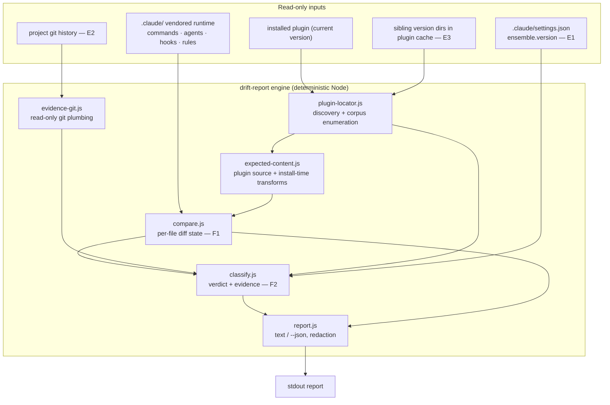
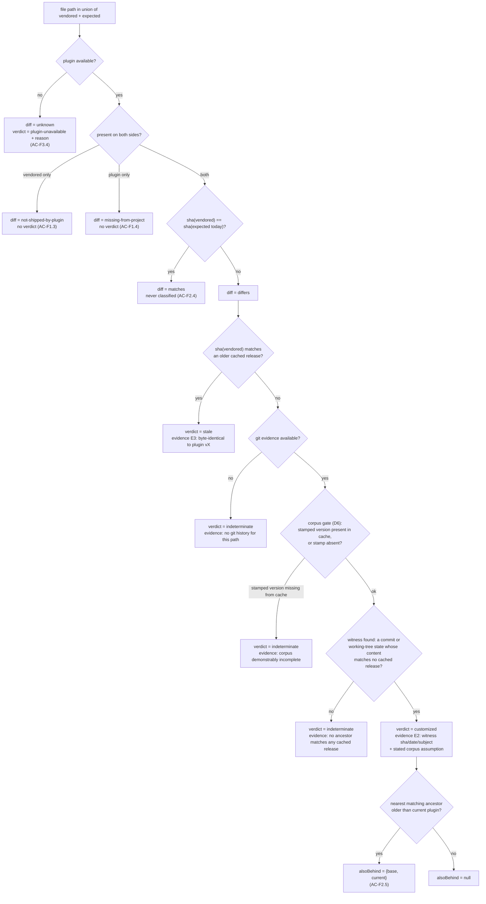

# TRD: Runtime Drift Detection

**Version**: 1.0.0
**Status**: Draft
**Created**: 2026-08-15
**Last Updated**: 2026-08-15
**Author**: @technical-architect
**Source PRD**: `docs/modernization/runs/ab-test/new-v2/PRD.md` (v1.1.0)
**Task ID Prefix**: DRIFT

---

## Changelog

| Version | Date | Changes | Author |
|---------|------|---------|--------|
| 1.0.0 | 2026-08-15 | Initial TRD creation from PRD v1.1.0 | @technical-architect |

---

## 1. Overview

### 1.1 Technical Summary

A read-only drift report for a project's vendored `.claude/` runtime, delivered as a
deterministic Node CLI in `packages/core/scripts/` plus a thin plugin-only slash command
that invokes it.

The design turns on two things the PRD left open and one thing measured in this checkout:

1. **"What the plugin would generate today" is not the plugin's source file.**
   `scaffold-project.sh` applies install-time transforms — `inject_agent_skills()` rewrites
   every agent's frontmatter and inserts a marked body block; `copy_hooks()` dereferences
   symlinks and filters the hook set through `manifest_shippable_hooks()`; framework rules
   come from `templates/claude-directory/rules/`, not from a `rules/` directory the plugin
   does not have. A byte-diff against plugin source therefore misreports transformed files
   as drifted. The comparison target is a **computed expected content** that mirrors those
   transforms (D2).

   **Scope note — this is a TRD extension of AC-F1.5, not a restatement of it.** AC-F1.5
   says the comparison targets generated output *"wherever the plugin generates rather than
   copies"*, and its named instance is `generate-hooks-artifacts.sh`, which synthesises a
   file from `hooks.manifest.json`. Two of the four cases above are not generation in that
   sense — `inject_agent_skills()` and `copy_hooks()` copy a real source file and rewrite it
   in transit. Treating copy-and-rewrite as within AC-F1.5's scope is this TRD's inference
   from the criterion's purpose (do not report install-time behaviour as drift), not
   something the PRD states; the word "transform" appears nowhere in it. The inference is
   load-bearing: reject it and every agent file and every symlinked hook reports as drifted
   on a clean install. Flag to the PRD author rather than assume.

2. **The discrimination method (the PRD's delegated design problem, Q2) rests on E3 + E2,
   with E1 demoted from classifier to corpus-completeness check.** Measured in this
   checkout: `~/.claude/plugins/cache/ensemble-vnext/full/` holds **seven** installed
   versions side by side — `3.3.10, 4.0.0, 4.1.0, 4.1.5, 4.1.11, 4.1.12, 4.1.14`. That is a
   local corpus of historical released content (E3), available with no network and no
   writes. Ancestry against it is **positive-only**: matching a cached prior release proves
   *stale*; matching nothing proves nothing on its own, so `customized` additionally
   requires a git witness in the project's own history (E2). Everything else is
   `indeterminate`. This deliberately does not rest on the `ensemble.version` stamp, which
   is exactly what R3's contingency asks for.

3. **The prior art the PRD points at is a prompt, not code.** `/rebase-project` §2.1–2.5 is
   LLM-executed Markdown. Its category semantics are reusable as a *specification*; its
   execution is not reusable under NFR-2 (determinism). Reuse therefore means encoding those
   categories once, in a deterministic module, with a conformance test pinning the category
   set to the documented table (D3).

### 1.2 Key Technical Decisions

| ID | Decision | Choice | Serves Objective | Rationale | Alternatives Considered |
|----|----------|--------|------------------|-----------|------------------------|
| D1 | Implementation medium | Deterministic Node (CommonJS) library + CLI under `packages/core/scripts/`, unit-tested with Jest | NFR-2, NFR-3, AC-N2, AC-N3 | The comparison is pure computation over files — the class constitution.md Principle 4 keeps deterministic and unit-tested. Jest is stack.md's JS unit runner and is already a devDependency with built-in coverage, which is what makes AC-N3's 60% figure *measurable* | (a) A prompt-driven command like `/rebase-project` — rejected: LLM execution cannot satisfy NFR-2 and produces no coverage number for AC-N3. Revisit never for the engine; the *presentation* layer may stay a prompt. (b) Python + pytest (also in stack.md) — rejected: the shared-helper layer the tool sits beside (`hooks/lib/*.js`) is JS, and a second language in `scripts/` splits the test story. Revisit if the python router ever needs to call this in-process |
| D2 | Comparison target | Computed **expected content**: plugin source passed through the same install-time transforms `scaffold-project.sh` applies, materialised in memory | AC-F1.5, AC-F1.2 | Measured: `inject_agent_skills()` (scaffold-project.sh:824) rewrites agent files at install time from `skill-affinity.json` ∩ `.claude/selected-skills.txt`; `copy_hooks()` (:634) copies with `cp -L` and only the subset `manifest_shippable_hooks()` yields. Comparing raw source would report transformed files as drifted and bury real drift | (a) Byte-compare against plugin source directly, as `/rebase-project` §2.1 does — rejected on the measurement above. Revisit if install-time transforms are ever removed from the scaffold. (b) Run `scaffold-project.sh` into a temp dir and diff the trees — rejected: it is a write and would drag `--refresh`'s side effects (version stamping) into a read-only tool. Revisit never; NFR-1 |
| D3 | Definition of "differs" | One shared module (`compare.js`) implementing the New / Updated / Unchanged / Stale / Custom categories documented in `rebase-project.md` §2.1–2.5, with a conformance test pinning the category set | AC-F1.2, AC-F1.3, AC-F1.4, NFR-2 | The PRD forbids a second, divergent notion of "differs". The existing notion lives in prose in an LLM-executed command, so the only way to share it is to encode it once and pin it | (a) Invoke `/rebase-project --dry-run` and parse its report — rejected: non-deterministic (NFR-2) and its output is framed as "what I will replace". (b) Rewrite `rebase-project.md` §2 to call this module, collapsing divergence risk to zero — **not done here**: it is close enough to NG4 ("modifying `/rebase-project` … to consume") to need the user's word. Revisit when the user confirms NG4 does not cover a shared comparison primitive |
| D4 | Classification method | Version-ancestry over the local plugin-version cache (E3) as the `stale` proof, project git history (E2) as the `customized` witness, `indeterminate` otherwise | AC-F2.1, AC-F2.2, AC-F2.3, AC-F2.5, R3 mitigation | Measured: the plugin cache retains every version installed on the machine (7 present here), giving byte-exact historical released content. Reproducing a byte-exact prior release by hand is not a credible accident, so a corpus hit is decisive. Deliberately independent of E1, per R3's contingency ("a signal that does not depend on scaffold-time cooperation") | (a) Byte-equality against the current plugin alone — rejected by the PRD §8 and by R1. (b) E1 (`ensemble.version`) as the classifier — rejected: R3's target case has no stamp, and the stamp is written even after a *partial* refresh (`scaffold-project.sh:1225`), so it does not describe individual files. (c) Content heuristics (comment density, diff shape, "looks hand-written") — rejected: no ground truth to calibrate against (R1), and a miscalibrated `stale` destroys work. Revisit (c) never without a labelled corpus |
| D5 | Evidence asymmetry | Positive-only ancestry: a corpus hit proves `stale`; a corpus miss proves nothing. `customized` additionally requires a git witness. Otherwise `indeterminate` | AC-F2.3, R1 mitigation | The corpus is complete only with respect to this machine's install history. Treating "matches nothing cached" as proof of a hand edit would manufacture `customized` verdicts for any release never installed here — the measured cache is non-contiguous (4.1.5 → 4.1.11 skips four releases) | Force a binary verdict — rejected by the PRD §8's last row. Revisit when evidence exists that separates the causes for every file, at which point the third verdict becomes dead weight |
| D6 | Corpus completeness check | Use E1 as a *gate*, not a classifier: if `.claude/settings.json`'s `ensemble.version` names a version absent from the local cache, downgrade every would-be `customized` to `indeterminate` and say why | AC-F2.2, AC-F2.3, AC-F4.2 | A stamped version missing from the cache is direct proof the corpus cannot cover this project's refresh history. When the stamp is absent (the R3 case) the gate cannot run, and the assumption is stated in the evidence line instead of being silently assumed | Ignore corpus completeness and always emit `customized` on a git witness — rejected: it converts an unknowable into an assertion, which is R1's failure mode. Revisit if a plugin release index becomes readable offline |
| D7 | Corpus source | Sibling version directories under the installed plugin's cache root, derived from `installPath` in `~/.claude/plugins/installed_plugins.json` | AC-F2.2, G4 | Measured: `installPath` is `…/cache/<marketplace>/<plugin>/<version>/`, and its siblings are the previously installed versions, each a complete plugin tree | (a) Plugin git history via the `gitCommitSha` recorded alongside `installPath` — rejected: measured, the cache directories are not git checkouts (no `.git`), so the sha is a label with nothing local to resolve it against. Revisit if the plugin is ever installed as a clone. (b) Fetch release tarballs — rejected: network dependency in a tool that must work offline and change nothing |
| D8 | Git access | Read-only plumbing only (`cat-file`, `ls-tree`, `log`, `rev-list`, `status --porcelain`), via `spawnSync` with array args, `GIT_OPTIONAL_LOCKS=0` and `--no-optional-locks` | NFR-1, AC-N1, O-D2 | `git status` normally refreshes `.git/index`'s stat cache — a write inside the project tree that AC-N1's checksum comparison would catch. `GIT_OPTIONAL_LOCKS=0` suppresses it. Array-arg `spawnSync` is CLAUDE.md's stated injection discipline. **Note the tension this decision resolves, and who resolved it**: NFR-1 as written bans *"no git operation"* flatly, with no read/write qualifier, and this TRD nonetheless runs five git subcommands. The narrowing to *"no git operation that changes anything"* is **the TRD's reading, not the PRD's wording** — it rests on AC-N1, which operationalises NFR-1 as a byte-identity test over both trees plus `git status --porcelain`, a test read-only plumbing passes. If the literal reading is the intended one, D8 is invalid and E2 (project git history) is unreachable, which removes one of D4's two evidence sources and pushes most verdicts to `indeterminate`. Flag to the PRD author rather than assume | Shelling out with interpolated paths — rejected outright (CLAUDE.md, Command Injection Prevention). Using a git library — rejected: adds a runtime dependency to a plugin that currently ships none |
| D9 | Entry point | New **plugin-only** slash command `/drift-report`, wrapping `packages/core/scripts/drift-report.js`; not vendored into projects | AC-F4.1, AC-F4.3, G4 | F4 requires a report on a project that predates the feature, with nothing pre-installed. Only a plugin-side entry point can do that: a vendored script is itself a file the legacy project does not have. `init-project` and `rebase-project` are already plugin-only for the same reason | (a) A mode of `/rebase-project` (the PRD explicitly left this to the TRD) — rejected: it is an *upgrade* command whose report is framed as "what I will replace", the framing the source objects to; F2's verdicts have no meaning inside an upgrade preview; and sharing a command invites the NG4 coupling. Revisit if maintaining a second command proves the larger cost. (b) Vendor it like other commands — rejected: fails AC-F4.1 for exactly the projects F4 names |
| D10 | Report destination | stdout; `--json` emits the same record set machine-readably. No file is written anywhere | NFR-1, NG3, AC-N1 | Resolves the PRD's open Q4 in the direction NFR-1 and NG3 already point. Redirecting stdout is the user's own act, outside the tool | Write `drift-report.md` into the project — rejected: a write (NG3). Revisit if the user asks for a written artifact and accepts it as their own write |
| D11 | Rules-kind definition | Framework-shipped rules = the files present in the plugin's `templates/claude-directory/rules/`. The three authored governance files (`constitution.md`, `stack.md`, `process.md`) appear in the report as **not shipped by the plugin** (the AC-F1.3 class), never classified | AC-F1.1, AC-F1.3, and resolves PRD Q3 | Measured: the plugin cache has no `rules/` directory; `refresh_rules()` (scaffold-project.sh:1091) sources framework rules from the template directory and hard-refuses the three authored names. Reporting the authored three as "always customized" would be accurate and useless; omitting them would violate AC-F1.1's completeness. The AC-F1.3 class says the true thing: there is nothing to compare them against | Omit governance files entirely — rejected: silent narrowing. Classify them as `customized` — rejected: it is a verdict with no comparison behind it. Revisit if the plugin ever ships a governance default |
| D12 | Degraded mode | With no plugin resolvable, every plugin-dependent field carries the distinct state `plugin-unavailable` with the reason, never `indeterminate` and never `matches` | AC-F3.1, AC-F3.2, AC-F3.4, G4 | AC-F3.4 is explicit that absence of a comparison is not evidence of a match, and `indeterminate` means "evidence exists but does not separate", which is a different claim | Exit non-zero when the plugin is missing — rejected: AC-F3.1. Reuse `indeterminate` — rejected: AC-F3.4 |
| D13 | Exit-code contract | Exit 0 whenever a report was produced, drift or not, plugin or not. Non-zero is reserved for the tool failing to produce a report at all | AC-F3.1 | The PRD §8 identifies `--check`'s exit-1-on-drift as CI-gate semantics and names conflating a gate with a report as the reason not to extend it. Drift is the expected finding, not an error | Exit 1 on drift found — rejected on that row. Revisit if the user asks for a CI gate, which would be a second flag with its own objective |
| D14 | Scope of kinds | Commands, agents, hooks, rules. Skills are out (NG6); the report states the exclusion in its header so a reader is not misled about completeness | NG6, AC-F1.1 | NG6 records this as a genuine ambiguity defaulted rather than settled (PRD Q1). Stating it in the output makes the boundary visible where it matters | Silently omit skills — rejected: a reader would read the report as covering the runtime. Include skills — rejected: NG6, pending the user's answer to Q1 |

### 1.3 Technology Stack

| Layer | Technology | Purpose | Notes |
|-------|------------|---------|-------|
| Engine + CLI | Node.js 18+, CommonJS | Comparison, classification, rendering | stack.md, *Hook development: JavaScript/Node.js 18+*. No runtime dependencies added |
| Command surface | Markdown prompt (`packages/core/commands/drift-report.md`) | Plugin-only slash command wrapping the CLI | constitution.md Principle 3, *Commands are prompts with optional shell scripts* |
| Unit tests | Jest ^29.7.0 | Engine unit tests + coverage for AC-N3 | stack.md, *Testing (JS): Jest*. Already a devDependency; coverage is built in |
| Integration tests | BATS ^1.9.0 | Fixture-project runs, immutability, no-plugin, legacy-runtime | stack.md, *Testing (Shell): BATS*; matches `scaffold-project.test.sh` |
| Evidence access | `git` plumbing (read-only), filesystem | E2 and E3 collection | stack.md, *Runtime Dependencies: Git 2.x+* |

### 1.4 Integration Points

| System | Type | Direction | Notes |
|--------|------|-----------|-------|
| `~/.claude/plugins/installed_plugins.json` | JSON read | In | Plugin discovery and `installPath`. Same selection rule as `runtime-refresh.sh:214–334` (prefer the scoped `full@ensemble-vnext` entry whose `installPath` exists on disk) |
| Installed plugin cache tree | Filesystem read | In | Current version = expected content; sibling version directories = the E3 corpus |
| Project `.claude/` | Filesystem read | In | The vendored runtime under inspection |
| Project git repository | `git` plumbing read | In | E2. Read-only per D8 |
| `.claude/settings.json` → `ensemble.version` | JSON read | In | E1, used as the D6 corpus-completeness gate |
| `packages/core/scripts/generate-hooks-artifacts.sh` | Build-time sync | Out | Its hardcoded plugin-only loop (`for cmd in init-project rebase-project`) gains `drift-report`, and `--check` then guards the copy against staleness |
| `packages/core/scripts/scaffold-project.sh` | Build-time list | Out | `exclude_commands` gains `drift-report.md` so the command stays plugin-only (D9). No behavioural change to `--refresh` — NG4 |

---

## 2. System Architecture

### 2.1 Architecture Overview



### 2.2 Component Architecture

#### 2.2.1 `plugin-locator.js`
**Responsibility**: Resolve the installed plugin's root, its version, and the set of sibling
cached versions that form the E3 corpus. Report unavailability as a first-class result
rather than throwing.
**Interfaces**: `locatePlugin({ home, projectRoot }) → PluginContext | { available: false, reason }`
**Dependencies**: `installed_plugins.json`, filesystem.

#### 2.2.2 `expected-content.js`
**Responsibility**: For a given plugin root, enumerate the shippable file set per kind and
produce the **expected bytes** for each vendored path, applying the same install-time
transforms as `scaffold-project.sh`. Used both for the current version and for each corpus
version.
**Interfaces**: `expectedTree(pluginRoot, projectContext) → Map<vendoredPath, Buffer>`
**Dependencies**: `hooks.manifest.json`, `skill-affinity.json`, the project's
`.claude/selected-skills.txt` and `.claude/skills/` (inputs to the agent transform — read
only), `templates/claude-directory/rules/`.

#### 2.2.3 `compare.js`
**Responsibility**: The single definition of "differs" (D3). Produces one record per path in
the union of the vendored set and the expected set.
**Interfaces**: `compare(vendoredTree, expectedTree) → FileRecord[]`
**Dependencies**: none beyond hashing.

#### 2.2.4 `evidence-git.js`
**Responsibility**: Read-only git evidence for a path: the blob history, whether the working
tree differs from HEAD, and the commit metadata for a witness.
**Interfaces**: `blobHistory(repo, path) → { sha, blobSha, date, subject }[]`,
`worktreeDirty(repo, path) → boolean`
**Dependencies**: `git` binary. Returns an explicit unavailable result when the project is
not a git repository or `git` is missing.

#### 2.2.5 `classify.js`
**Responsibility**: F2. Assign exactly one verdict to each differing file, attach the
evidence it rests on, apply the D6 completeness gate, and compute the AC-F2.5
also-behind field.
**Interfaces**: `classify(record, { corpus, gitEvidence, stamp, pluginVersion }) → Classification`
**Dependencies**: 2.2.1, 2.2.4.

#### 2.2.6 `report.js`
**Responsibility**: Render to stdout as text or `--json`. Enforces O-D1 — records carry
paths, hashes, verdicts and evidence statements, never file contents or diff hunks.
**Interfaces**: `render(reportModel, { format }) → string`
**Dependencies**: none.

### 2.3 Classification Decision Flow

The discrimination method is the PRD's delegated design problem, so it gets the diagram.



### 2.4 State Management

None. The tool holds everything in memory for the duration of one invocation and persists
nothing — that is NFR-1 and NG3, not an implementation preference.

---

## 3. Technical Specifications

### 3.1 Report record model

**Purpose**: The single output shape, rendered as text or JSON. Every acceptance criterion
in F1–F3 is a statement about a field of this record.

**Interface**:

```typescript
type Kind = 'command' | 'agent' | 'hook' | 'rule';

type DiffState =
  | 'matches'                 // AC-F1.2 / AC-F2.4
  | 'differs'                 // AC-F1.2
  | 'not-shipped-by-plugin'   // AC-F1.3 — nothing to compare against
  | 'missing-from-project'    // AC-F1.4
  | 'unknown';                // AC-F3.4 — no plugin; not a match, not indeterminate

type Verdict =
  | 'stale'
  | 'customized'
  | 'indeterminate'
  | 'not-applicable'          // diff !== 'differs' (AC-F2.4)
  | 'plugin-unavailable';     // AC-F3.4

interface EvidenceItem {
  source: 'E1' | 'E2' | 'E3';
  statement: string;          // human-readable, no file contents (O-D1)
  ref?: string;               // e.g. plugin version, commit sha
}

interface FileRecord {
  path: string;               // vendored-relative, e.g. '.claude/agents/verify-app.md'
  kind: Kind;
  diff: DiffState;
  vendoredSha256: string | null;
  expectedSha256: string | null;
  verdict: Verdict;
  evidence: EvidenceItem[];   // non-empty for stale and customized (AC-F2.2)
  alsoBehind: { baseVersion: string; pluginVersion: string } | null;  // AC-F2.5
  unavailableReason?: string; // AC-F3.2 / AC-F3.4
}

interface Report {
  pluginAvailable: boolean;
  pluginVersion: string | null;
  stampedVersion: string | null;      // E1; null on a pre-stamping runtime (AC-F4.2)
  corpusVersions: string[];           // E3, may be [] or [current]
  gitAvailable: boolean;              // E2
  excludedKinds: string[];            // ['skill'] per D14/NG6
  unavailableVerdicts: string[];      // AC-F3.2
  files: FileRecord[];
}
```

**Behavior**:
- Exactly one `FileRecord` per path in the union of the vendored set and the expected set
  (AC-F1.1); paths are emitted sorted so two runs are byte-identical (AC-N2).
- `verdict` is one of `stale` / `customized` / `indeterminate` for and only for
  `diff === 'differs'` (AC-F2.1); `not-applicable` everywhere else (AC-F2.4).
- `evidence` is non-empty whenever `verdict` is `stale` or `customized` (AC-F2.2).
- Governance files land as `diff: 'not-shipped-by-plugin'`, `verdict: 'not-applicable'`
  (D11).

**Error Handling**:
- Unreadable vendored file: `diff: 'unknown'`, `unavailableReason` naming the errno. The
  file still appears (AC-F1.1); it is not silently dropped.
- Malformed `settings.json`: `stampedVersion: null`, D6 gate falls back to the stated
  assumption. Not fatal (AC-F4.2's degrade-don't-fail posture generalised to a corrupt
  stamp).
- Missing `git`, or project not a repository: `gitAvailable: false`; every would-be
  `customized` becomes `indeterminate` with that reason (D5).

### 3.2 Expected-content resolution

**Purpose**: Produce "what the plugin would generate today" (AC-F1.5) for each vendored
path, for the current plugin version and for each corpus version.

**Interface**:

```typescript
interface ProjectContext {
  projectRoot: string;
  selectedSkills: string[] | null;   // .claude/selected-skills.txt, null when absent
  skillsDir: string;                 // .claude/skills — read for description text only
}

function expectedTree(pluginRoot: string, ctx: ProjectContext): Map<string, Buffer>;
```

**Behavior** — the source map, each row grounded in the scaffold that produces it:

| Kind | Vendored path | Plugin source (cache layout) | Install-time transform to mirror |
|------|---------------|------------------------------|----------------------------------|
| command | `.claude/commands/*.md` | `<plugin>/commands/core/*.md`, `<plugin>/commands/router/*.md` | Exclude the plugin-only set (`init-project.md`, `rebase-project.md`, and `drift-report.md` once DRIFT-P001 lands) — `scaffold-project.sh:285` |
| agent | `.claude/agents/*.md` | `<plugin>/agents/*.md` | `inject_agent_skills()` — strip any existing `ENSEMBLE:SKILLS` block, then write the `skills:` frontmatter and body block from `skill-affinity.json` ∩ `selected-skills.txt`. **Skipped entirely when `selected-skills.txt` or the affinity manifest is absent**, which is the legacy case (`scaffold-project.sh:824`) |
| hook | `.claude/hooks/<name>`, `.claude/hooks/lib/*.js`, `.claude/hooks/prompts/*.md` | `<plugin>/hooks/…` | Include only `manifest_shippable_hooks()` output; dereference symlinks (`cp -L`); prompt-type entries are pruned from the shipped set (`scaffold-project.sh:634`, `generate-hooks-artifacts.sh`) |
| rule | `.claude/rules/*.md` | `<plugin>/templates/claude-directory/rules/*.md` | None. `constitution.md` / `stack.md` / `process.md` have no plugin counterpart and fall to D11 (`scaffold-project.sh:1091`) |

**Error Handling**:
- A corpus version whose layout the resolver does not recognise (an older plugin with a
  different tree shape — 3.3.10 predates several of these paths) is skipped for corpus
  purposes and named in `corpusVersions` diagnostics rather than crashing the run. A skipped
  version simply cannot produce a `stale` proof.

### 3.3 Immutability contract

**Purpose**: NFR-1, verified by AC-N1.

**Behavior**:
- No `open` for write, no `mkdir`, no temp file, anywhere in the engine or CLI. Expected
  content is materialised in memory only.
- Git access is restricted to the plumbing allowlist in D8, invoked through `spawnSync` with
  array arguments and `env: { ...process.env, GIT_OPTIONAL_LOCKS: '0' }`, plus
  `--no-optional-locks` on the command line so the index stat-cache refresh cannot touch
  `.git/index`.
- The report goes to stdout. Redirection is the caller's act.

**Error Handling**: any unexpected write attempt is a test failure, not a runtime concern —
AC-N1's checksum comparison over both trees is what enforces it (DRIFT-T005).

### 3.4 CLI contract

**Interface**:

```
drift-report.js [--json] [--project <dir>] [--plugin-dir <dir>]

  --json          machine-readable Report (D10)
  --project       project root; defaults to cwd
  --plugin-dir    override plugin discovery; used by tests and by a monorepo checkout
```

**Behavior**: exit 0 whenever a `Report` was produced, including "drift found" and "no
plugin installed" (D13, AC-F3.1). Non-zero only when no report could be produced at all
(e.g. `--project` does not exist).

**Error Handling**: with no plugin found, the header states plainly that no plugin was
found and lists the verdicts thereby unavailable (AC-F3.2), and the body still carries the
vendored inventory and the stamped version when present (AC-F3.3).

---

## 4. Master Task List

### 4.1 Task ID Convention

Task IDs follow the format `DRIFT-[CATEGORY][SEQ]` — `P` infrastructure, `B` backend/engine,
`T` testing, `D` documentation.

No task carries a `[LIVE]` marker. The tool is a filesystem CLI with no running service to
verify against; the project's `verification_level: unit-only` (constitution.md) governs, and
the integration tests below are BATS runs over fixtures, not live-service verification.

### 4.2 Phase 1: Evidence and expected-content foundations

| Task ID | Description | Serves | Skills | Dependencies | Acceptance Criteria |
|---------|-------------|--------|--------|--------------|---------------------|
| DRIFT-B001 | `lib/drift/plugin-locator.js` — resolve installed plugin root + version from `installed_plugins.json` (same selection rule as `runtime-refresh.sh:214–334`); enumerate sibling cache directories as the E3 corpus; return an explicit unavailable result with reason when nothing resolves | D7, D12, AC-F3.1 | | None | Returns `{available:true, root, version, corpusVersions[]}` on this machine with 7 corpus versions; returns `{available:false, reason}` with `HOME` pointed at an empty dir, without throwing |
| DRIFT-B002 | `lib/drift/expected-content.js` — enumerate the shippable set per kind and materialise expected bytes in memory, mirroring the four install-time transforms in §3.2 | D2, AC-F1.5 | | None | Agent expected content equals what `inject_agent_skills()` produces for the same inputs, and equals raw source when `selected-skills.txt` is absent; hook set equals `manifest_shippable_hooks()` output with symlinks dereferenced |
| DRIFT-B003 | `lib/drift/evidence-git.js` — read-only git adapter: blob history for a path, worktree-dirty check, commit metadata; `spawnSync` array args, `GIT_OPTIONAL_LOCKS=0`, `--no-optional-locks`; explicit unavailable result outside a repo | D8, O-D2, NFR-1 | | None | Running the adapter over this repo's `.claude/` leaves `git status --porcelain` and the sha256 of `.git/index` unchanged; returns `{available:false}` in a non-git temp dir |

### 4.3 Phase 2: Comparison and classification

| Task ID | Description | Serves | Skills | Dependencies | Acceptance Criteria |
|---------|-------------|--------|--------|--------------|---------------------|
| DRIFT-B004 | `lib/drift/compare.js` — one `FileRecord` per path in the union of vendored and expected sets, with `diff` per §3.1, implementing the `rebase-project.md` §2.1–2.5 category semantics as the single definition of "differs" | D3, AC-F1.1, AC-F1.2, AC-F1.3, AC-F1.4 | | DRIFT-B002 | Every vendored and every expected path appears exactly once; vendored-only files carry `not-shipped-by-plugin` (not `differs`); plugin-only files carry `missing-from-project`; output ordering is stable |
| DRIFT-B005 | `lib/drift/classify.js` — the §2.3 decision flow: positive-only ancestry against the corpus, git witness for `customized`, D6 completeness gate, `alsoBehind` computation, evidence attachment | D4, D5, D6, AC-F2.1, AC-F2.2, AC-F2.3, AC-F2.5 | | DRIFT-B001, DRIFT-B003, DRIFT-B004 | Exactly one of `stale`/`customized`/`indeterminate` on every `differs` record and on no other record; `evidence` non-empty for `stale` and `customized`; a stamped version absent from the corpus downgrades `customized` to `indeterminate` with that reason |
| DRIFT-B006 | No-plugin path: `diff: 'unknown'` + `verdict: 'plugin-unavailable'` with reason, `unavailableVerdicts` populated, inventory and stamped version still emitted | D12, AC-F3.1, AC-F3.2, AC-F3.3, AC-F3.4 | | DRIFT-B004 | With the plugin unresolvable, no record carries `indeterminate` or `matches`; the report names the missing plugin and the unavailable verdicts |

### 4.4 Phase 3: Surface

| Task ID | Description | Serves | Skills | Dependencies | Acceptance Criteria |
|---------|-------------|--------|--------|--------------|---------------------|
| DRIFT-B007 | `lib/drift/report.js` — text and `--json` renderers over the same model; header states plugin availability, corpus versions, git availability and the skills exclusion; emits paths, hashes, verdicts and evidence statements only | D10, D14, O-D1, AC-F2.2, AC-F3.2 | | DRIFT-B005, DRIFT-B006 | No file content or diff hunk appears in either renderer's output for a fixture whose files contain a marker string; both renderers are byte-stable across two runs on unchanged inputs |
| DRIFT-B008 | `packages/core/scripts/drift-report.js` — CLI entry: arg parsing, `--project`/`--plugin-dir`, exit-0 contract | D9, D13, AC-F3.1, AC-F4.3 | | DRIFT-B007 | Exits 0 with drift present, and 0 with no plugin; exits non-zero only when `--project` cannot be read; output never instructs the user to run a setup or baseline step |
| DRIFT-P001 | `packages/core/commands/drift-report.md` (plugin-only command wrapping the CLI); add `drift-report` to `generate-hooks-artifacts.sh`'s plugin-only sync loop; add `drift-report.md` to `scaffold-project.sh`'s `exclude_commands` | D9, AC-F4.1 | | DRIFT-B008 | `generate-hooks-artifacts.sh --check` passes after regeneration and fails when the plugin-only copy is stale; a scaffolded fixture project contains no `drift-report.md` under `.claude/commands/`; no change to `--refresh` behaviour (NG4) |

### 4.5 Phase 4: Verification

| Task ID | Description | Serves | Skills | Dependencies | Acceptance Criteria |
|---------|-------------|--------|--------|--------------|---------------------|
| DRIFT-T001 | Jest unit tests for `compare.js` over a fixture runtime — one case per AC-F1.1 through AC-F1.5, including a generated hook artifact and a transformed agent | AC-F1.1, AC-F1.2, AC-F1.3, AC-F1.4, AC-F1.5 | `jest` | DRIFT-B004 | Each of the five criteria has a named failing-before/passing-after test |
| DRIFT-T002 | Jest unit tests for `classify.js` — one case per AC-F2.1 through AC-F2.5 plus AC-F3.4, including a case with evidence deliberately withheld | AC-F2.1, AC-F2.2, AC-F2.3, AC-F2.4, AC-F2.5, AC-F3.4 | `jest` | DRIFT-B005, DRIFT-B006 | Withheld-evidence case yields `indeterminate`, never a default category |
| DRIFT-T003 | Fixture builders: a legacy-shaped project (no `ensemble.version`, no `selected-skills.txt`), a partially refreshed tree (R4 shape), a synthetic multi-version plugin cache | AC-F2.5, AC-F4.1, AC-F4.2, TR1 | `jest` | DRIFT-B001 | Fixtures build hermetically under a temp dir and are reused by T001–T009 |
| DRIFT-T004 | BATS: no-plugin run — `HOME` pointed at a plugin-free dir | AC-F3.1, AC-F3.2, AC-F3.3 | | DRIFT-B008, DRIFT-T003 | Exit 0; output names the missing plugin, the unavailable verdicts, the inventory, and the stamped version when present |
| DRIFT-T005 | BATS: immutability — sha256 manifest of the project tree and the plugin tree before/after, plus `git status --porcelain`, across the normal path, the no-plugin path, and an unreadable-file failure path | NFR-1, AC-N1 | | DRIFT-B008, DRIFT-T003 | All three trees byte-identical on every path, `.git/index` included |
| DRIFT-T006 | BATS: determinism — two consecutive runs on an unchanged project and plugin | NFR-2, AC-N2 | | DRIFT-B008 | Both stdout captures byte-identical, text and `--json` |
| DRIFT-T007 | BATS: scaffold round-trip — scaffold a fresh fixture project with `scaffold-project.sh` into a temp dir, then run the report against it | TR2, AC-F1.5 | | DRIFT-B008 | Zero records with `diff: 'differs'`. A non-zero count means the expected-content model has fallen behind the scaffold |
| DRIFT-T008 | Jest coverage run over `lib/drift/` | AC-N3, NFR-3 | `jest` | DRIFT-T001, DRIFT-T002 | Statement coverage ≥ 60% on the comparison and classification modules |
| DRIFT-T009 | Measure verdict distribution on the pre-stamping fixture and record it in the TRD's completion notes | R3 (PRD §7, and its contingency) | | DRIFT-T003, DRIFT-B005 | At least one non-indeterminate verdict is produced; an all-indeterminate result is reported as a design failure per R3's contingency, not accepted |
| DRIFT-T010 | Validate the method against this repository's own `.claude/` history: run the report, and for each `stale` and `customized` verdict check it against the actual commit history | R1 (PRD §7, and its contingency) | | DRIFT-B008 | Every `stale` verdict is corroborated by a matching cached release; every `customized` verdict is corroborated by a real local commit; disagreements are recorded, not explained away |
| DRIFT-D001 | Document the command and the discrimination method in `CLAUDE.md` (hooks/commands reference) and in the command file's own prose, including the corpus-completeness assumption | §6.2 *Documentation updated* (constitution.md Quality Gates) | | DRIFT-P001 | A reader can tell from the docs what evidence each verdict rests on and when it abstains |

---

## 5. Execution Plan

### 5.1 Phase Overview

| Phase | Focus | Prerequisites | Parallelizable Sessions |
|-------|-------|---------------|------------------------|
| 1 | Evidence and expected-content foundations | None | 1A, 1B, 1C fully parallel |
| 2 | Comparison and classification | Phase 1 | 2A then 2B; 2C parallel with 2B after DRIFT-B004 |
| 3 | Surface (renderer, CLI, command wiring) | Phase 2 | Sequential |
| 4 | Verification | Per-task; unit tests can start against Phase 2 modules | 4A, 4B parallel; 4C after Phase 3 |

### 5.2 Session Details

#### Phase 1: Foundations

**Session 1A: Plugin discovery and corpus**
- Tasks: DRIFT-B001
- Agent: @backend-implementer
- Can parallelize with: 1B, 1C

**Session 1B: Expected content**
- Tasks: DRIFT-B002
- Agent: @backend-implementer
- Can parallelize with: 1A, 1C

**Session 1C: Git evidence adapter**
- Tasks: DRIFT-B003
- Agent: @backend-implementer
- Can parallelize with: 1A, 1B

#### Phase 2: Comparison and classification

**Session 2A: Comparison engine**
- Tasks: DRIFT-B004
- Agent: @backend-implementer
- Blocked by: 1B

**Session 2B: Classifier**
- Tasks: DRIFT-B005
- Agent: @backend-implementer
- Blocked by: 2A, 1A, 1C

**Session 2C: Degraded mode**
- Tasks: DRIFT-B006
- Agent: @backend-implementer
- Blocked by: 2A; can parallelize with 2B

#### Phase 3: Surface

**Session 3A: Renderer, CLI and command wiring**
- Tasks: DRIFT-B007, DRIFT-B008, DRIFT-P001
- Agent: @backend-implementer
- Blocked by: 2B, 2C

#### Phase 4: Verification

**Session 4A: Unit tests and fixtures**
- Tasks: DRIFT-T003, DRIFT-T001, DRIFT-T002, DRIFT-T008
- Agent: @backend-implementer (executed by @verify-app)
- Blocked by: 2B, 2C; can parallelize with 3A once the module APIs are fixed

**Session 4B: Integration tests**
- Tasks: DRIFT-T004, DRIFT-T005, DRIFT-T006, DRIFT-T007
- Agent: @backend-implementer (executed by @verify-app)
- Blocked by: 3A

**Session 4C: Method validation and docs**
- Tasks: DRIFT-T009, DRIFT-T010, DRIFT-D001
- Agent: @backend-implementer
- Blocked by: 4A (T009), 3A (T010, D001)

### 5.3 Parallelization Map

```mermaid
gantt
    title Execution Plan (No time scale - dependency order only)
    dateFormat X
    axisFormat %s

    section Phase 1
    1A plugin-locator   : p1a, 0, 1
    1B expected-content : p1b, 0, 1
    1C evidence-git     : p1c, 0, 1

    section Phase 2
    2A compare          : p2a, after p1b, 1
    2B classify         : p2b, after p2a p1a p1c, 1
    2C degraded mode    : p2c, after p2a, 1

    section Phase 3
    3A surface + wiring : p3a, after p2b p2c, 1

    section Phase 4
    4A unit + fixtures  : p4a, after p2b p2c, 1
    4B integration      : p4b, after p3a, 1
    4C validation + docs: p4c, after p4a p3a, 1
```



### 5.4 Critical Path

DRIFT-B002 → DRIFT-B004 → DRIFT-B005 → DRIFT-B007 → DRIFT-B008 → DRIFT-P001 →
DRIFT-T007 (the scaffold round-trip, which is the test most likely to send work back into
DRIFT-B002).

### 5.5 Offload Recommendations

| Task | Recommended Agent | Rationale |
|------|-------------------|-----------|
| DRIFT-T010 | @verify-app | It is a measurement against real history, not an implementation; the answer may contradict the design and should come from a reader that has no stake in it |

---

## 6. Quality Requirements

### 6.1 Testing Requirements

| Type | Coverage Target | Source | Scope |
|------|-----------------|--------|-------|
| Unit Tests | ≥ 60% | `constitution.md` Quality Gates (floor used as stated; PRD AC-N3 names the same figure) | `packages/core/scripts/lib/drift/*.js` — the comparison and classification logic |
| Integration Tests | ≥ 50% *when applicable* | `constitution.md` Quality Gates | BATS coverage has no instrumentation in this project, so the applicable form of this gate is enumeration, not a percentage: every criterion the PRD assigns to an integration test (AC-F3.1–3.3, AC-F4.1–4.2, AC-N1, AC-N2) has a named BATS test. No percentage is asserted, because none can be measured |

No target here exceeds a constitution floor, so no exceedance is claimed.

Verification level is `unit-only` per constitution.md; no task is marked `[LIVE]` (§4.1).

### 6.2 Code Quality Standards

| Requirement | Source |
|-------------|--------|
| No secrets in code | `constitution.md` Quality Gates |
| Input validation present — specifically, no untrusted path or ref value is ever interpolated into a shell command; `spawnSync` with array arguments only | `constitution.md` Quality Gates, and CLAUDE.md *Security Considerations → Command Injection Prevention* |
| Documentation updated | `constitution.md` Quality Gates (DRIFT-D001) |
| Deterministic layer is unit-tested | `constitution.md` Principle 4 as narrowed 2026-08-13 |

### 6.3 Security Requirements

| ID | Requirement | Class |
|----|-------------|-------|
| O-D1 | The report reproduces no file contents — records carry paths, sha256 hashes, verdicts and evidence statements only, in both renderers | **domain-derived**. The tool reads `.claude/settings.json`, which by design carries an `env` block and permission rules, and hook sources that may embed webhook URLs or tokens. A drift report is the kind of output a maintainer pastes into an issue or a chat. Echoing content would turn a read-only diagnostic into a disclosure channel |
| O-D2 | Paths, git refs and version strings taken from the filesystem or from `installed_plugins.json` never reach a shell; all subprocess invocation is `spawnSync` with array arguments | **domain-derived**, and independently required by CLAUDE.md's injection rule. The tool runs over directory names and git refs it did not choose, in a repository the user did not necessarily author |

### 6.4 Performance Requirements

None. The PRD records none, and states why: no measurement of the vendored runtime's size
or of an acceptable run time exists to source one from. No figure is asserted here either.

---

## 7. Risk Assessment

### 7.1 Risks Imported from PRD

| PRD Risk ID | Risk | Technical Mitigation |
|-------------|------|---------------------|
| R1 | The discrimination has no ground truth; a wrong `stale` verdict leads to a refresh that destroys work | D5's positive-only rule makes `stale` rest on a byte-exact match with a real cached release, which is not reachable by accident. Every verdict carries its evidence (DRIFT-B007). DRIFT-T010 validates the method against this repository's own history before the verdicts are trusted, per R1's own mitigation |
| R2 | E3 may be unavailable where the tool runs — a project may hold only the current plugin version | Measured: seven versions are cached on this machine, so E3 exists here; availability elsewhere is install-history-dependent, which is exactly why D5 treats a corpus miss as non-evidence. With a single-version corpus the tool still produces F1 in full and falls to `indeterminate` for F2 — the PRD's stated correct outcome, not a failure |
| R3 | Requirement 5's target case (pre-stamping runtime) has the least evidence and may degrade to all-`indeterminate` | D4 deliberately does not rest on E1: the classifier's inputs are E3 (plugin cache) and E2 (project git history), neither of which requires scaffold-time cooperation. E1 is used only as the D6 completeness gate, and its absence degrades to a stated assumption rather than to a missing verdict. DRIFT-T009 measures the outcome on a pre-stamping fixture and treats all-indeterminate as a design failure |
| R4 | Drift is not binary — a file can be both behind and locally edited | `alsoBehind` on the record (§3.1) carries the base version alongside a `customized` verdict, satisfying AC-F2.5 without breaking AC-F2.1's exactly-one-verdict rule. DRIFT-T003 builds the partially-refreshed fixture that exercises it |
| R5 | Scope creep into repair — wiring the report into `/rebase-project` | D3 and D9 hold the line: the comparison module is new and standalone, `/rebase-project` is not modified, and `scaffold-project.sh` is touched only to keep the new command plugin-only. DRIFT-P001's acceptance criteria assert `--refresh` behaviour is unchanged |

### 7.2 Technical Risks

| ID | Risk | Likelihood | Impact | Mitigation |
|----|------|------------|--------|------------|
| TR1 | **Corpus non-contiguity.** The cache holds only versions installed on this machine — measured here as `3.3.10, 4.0.0, 4.1.0, 4.1.5, 4.1.11, 4.1.12, 4.1.14`, skipping four releases between 4.1.5 and 4.1.11. A vendored file pristine from an uncached release matches nothing and, under a looser rule, would be asserted `customized` | High | High | D5 (a corpus miss is not evidence) plus D6 (a stamped version absent from the cache downgrades `customized` to `indeterminate`). Where the gate cannot run, the assumption is written into the evidence line rather than assumed silently |
| TR2 | **Expected-content model falls behind the scaffold.** `expected-content.js` mirrors four transforms in `scaffold-project.sh`. If a fifth is added there and not here, every affected file reports as drifted and the report becomes noise | Med | High | DRIFT-T007: scaffold a fresh fixture project with the real `scaffold-project.sh`, then run the report over it and require zero `differs` records. A new transform breaks that test the day it lands |
| TR3 | **Read-only git that is not read-only.** `git status` refreshes `.git/index`'s stat cache — a write inside the project tree that AC-N1's checksum comparison catches | Med | Med | D8: `GIT_OPTIONAL_LOCKS=0` plus `--no-optional-locks`, and DRIFT-T005 hashes `.git/index` explicitly rather than only the working tree |
| TR4 | **Conditional transforms misapplied on legacy projects.** `inject_agent_skills()` is skipped when `selected-skills.txt` or the affinity manifest is absent. A model that always applies the transform would report every agent as drifted on exactly the legacy projects F4 targets | Med | High | §3.2 specifies the skip condition explicitly; DRIFT-T003's legacy fixture omits both inputs and DRIFT-T001 asserts the untransformed expectation on it |

### 7.3 Contingency Plans

**TR2 Contingency**: if DRIFT-T007 fails after a scaffold change, the expected-content model
is wrong, not the scaffold. Fix `expected-content.js`; do not relax the test to a threshold.
A drift tool that tolerates its own drift reports noise indefinitely.

**R1 Contingency (inherited)**: if DRIFT-T010 cannot establish that the chosen method
separates the two causes — that is, if it is run against a real (non-self-excluded) project
and genuine disagreements surface between the verdicts and the actual commit history — then
ship F1 (the per-file inventory) in full, restrict F2 to the verdict classes whose evidence
DRIFT-T010 *did* corroborate, and emit `indeterminate` for every other differing file.
Concretely: disable the classifier branch whose evidence failed validation in `classify.js`
(D5's positive-only rule already makes each branch independently removable), leave the rest
untouched, and record the restriction in the report header alongside the corpus-completeness
assumption (DRIFT-B007, DRIFT-D001). Do not weaken a verdict's evidence rule to keep it
alive, and do not defer shipping. Per the PRD: an honest inventory plus "I can't tell" is
strictly better than the status quo, and it is safe because NG1 means no automatic action
follows a verdict.

**R3 Contingency (inherited)**: if DRIFT-T009 yields an all-indeterminate report on the
pre-stamping fixture, that is a design failure against requirement 5. Return to the evidence
inventory and re-open Q2 before continuing to Phase 3 — do not ship the degraded result as
an acceptable outcome.

---

## 8. Non-Goals (Scope Boundaries)

The following are **explicitly out of scope** per the PRD. Implementation agents MUST reject
requests that fall into these categories.

| PRD ID | Non-Goal | Rationale |
|--------|----------|-----------|
| NG1 | Automatically fixing drift — refreshing, merging, reverting, or repairing any file | Source, *Not doing*: *"Automatically fixing drift. I'll decide what to do with the report."* |
| NG2 | Any change to how the runtime is version-controlled — no sidecar pristine copies, no subtree/submodule, no change to what is committed or gitignored | Source, *Not doing*: *"Any change to how the runtime is version-controlled."* |
| NG3 | Writing anything into the project to enable future runs — no baseline manifest, no checksum file, no provenance stamp, not even on first run | Direct consequence of requirement 3, *"It MUST NOT change anything. Reporting only."* |
| NG4 | Modifying `/rebase-project`, `scaffold-project.sh --refresh`, or the plugin's `--check` behaviour to consume or act on the report | The source asks for a way to *ask* a project a question; wiring the answer into the tools that mutate the runtime would collide with NG1. **TRD note**: DRIFT-P001 touches `scaffold-project.sh`'s plugin-only `exclude_commands` list and `generate-hooks-artifacts.sh`'s plugin-only sync loop. Neither is a behavioural change to `--refresh` or to `--check`'s drift contract — they are delivery lists for a new command — and DRIFT-P001's acceptance criteria assert as much |
| NG5 | Ambient or automatic drift warnings (session-start hook, banner, periodic check) | Not asked for. Excludes adding a new ambient *warning*; does not touch `runtime-refresh.sh`, the existing SessionStart hook that ambiently refreshes |
| NG6 | Drift detection over skills (`.claude/skills/`) | The source enumerates *"commands, agents, hooks, rules"* and names no others; recorded as an open question (PRD Q1) rather than silently scoped in. D14 makes the exclusion visible in the report header |

**Deferred, not dropped** — the PRD's open questions this TRD answers or leaves open:

| PRD question | Disposition here |
|--------------|------------------|
| Q1 (skills in scope?) | Left to the user; D14 implements the PRD's default and surfaces it in the output |
| Q2 (which evidence source?) | **Answered**: E3 + E2, with E1 demoted to the D6 completeness gate (D4, D5, D6) |
| Q3 (governance files in the report?) | **Answered**: they appear as `not-shipped-by-plugin` and are never classified (D11) |
| Q4 (report form?) | **Answered**: stdout, with `--json` (D10) |
| §8 row "mode of `/rebase-project` vs distinct entry point" — *"Not decided — TRD's call"* | **Answered**: distinct plugin-only entry point (D9) |

---

## 9. Task Grounding

*Written by the grounding pass after reading the code, not by the authoring stage. Line
numbers are as of `main` @ `1c361f0`, package version 4.1.15.*

**Repository facts every task in this TRD depends on** (verified, not assumed):

- `packages/core/scripts/lib/` **does not exist**. The whole `lib/drift/` tree is new. The
  only sibling helper layer in the repo is `packages/core/hooks/lib/`
  (`dispatch-ledger.js`, `resolve-project-root.js`).
- `packages/full/scripts` is a symlink to `../core/scripts`. The installed cache tree
  preserves nested directories through it (`hooks/lib/` and `hooks/prompts/` are both
  present under `~/.claude/plugins/cache/ensemble-vnext/full/4.1.14/hooks/`), so a new
  `scripts/lib/drift/` subdirectory ships without any packaging change.
- `packages/full/.claude-plugin/plugin.json` declares `"commands": ["./commands/plugin-only"]`
  — a **directory**, not a file list. A new plugin-only command needs no `plugin.json` edit.
- There is **no reusable JS/shell comparison primitive** anywhere in this repo.
  `manifest_shippable_hooks()` / `manifest_shippable_prompts()` are bash functions wrapping
  python3 heredocs inside `scaffold-project.sh` (:402, :479); `check_plugin_and_version()`
  is the same shape inside `runtime-refresh.sh` (:232). None is importable from Node. Every
  "same rule as X" in this TRD means *re-express in JS and keep in step*, never *require*.
- `createHash` appears exactly once in the repo (`test/discipline-corpus/extract.js`). There
  is no shared hashing helper; use `node:crypto` directly.

---

### DRIFT-B001 — `lib/drift/plugin-locator.js`

- **Touches:** `packages/core/scripts/lib/drift/plugin-locator.js` (new),
  `packages/core/scripts/lib/drift/plugin-locator.test.js` (new).
- **Reuse:** `packages/core/hooks/lib/resolve-project-root.js` — `ROOT_MARKERS =
  ['.claude', '.trd-state', '.git']` and its upward walk are the project's existing answer to
  "where is the project root". Do not write a second walker for `--project`'s default.
- **Replaces:** nothing. This is new code in a new directory.
- **Follow:** the plugin-selection rule in `runtime-refresh.sh:258–274` — key
  `full@ensemble-vnext` in `plugins`, entries are an **array** (multiple scopes), choose the
  first whose `installPath` `isdir()`. Verified against the live
  `~/.claude/plugins/installed_plugins.json`: `full@ensemble-vnext` → a one-element array,
  `installPath` `…/cache/ensemble-vnext/full/4.1.14`, `version` `4.1.14`.
- **Careful:**
  - The corpus is the sibling directories of `installPath`, and it **includes the current
    version**. Measured today: `3.3.10, 4.0.0, 4.1.0, 4.1.5, 4.1.11, 4.1.12, 4.1.14` = 7
    directories, 6 of them older than current. DRIFT-B001's "7 corpus versions" is the
    directory count, not the ancestry count.
  - `~/.claude/plugins/cache/` also contains `temp_git_*` directories that hold only a
    `.git/`. They are siblings of the *marketplace* directory, not of a version directory, so
    enumerating strictly under `<installPath>/..` avoids them — do not enumerate one level
    higher.
  - `3.3.10` has no `.claude-plugin/plugin.json`… it does, but it has no
    `hooks/hooks.manifest.json` and no `agents/skill-affinity.json` (see DRIFT-B002).
    Version must therefore come from the **directory name**, which is what the cache layout
    guarantees, not from a manifest read.
  - `installed_plugins.json` values are attacker-adjacent path data — O-D2 applies here
    first.

### DRIFT-B002 — `lib/drift/expected-content.js`

- **Touches:** `packages/core/scripts/lib/drift/expected-content.js` (new),
  `packages/core/scripts/lib/drift/expected-content.test.js` (new).
- **Reuse:** nothing importable exists. The four transforms must be re-expressed from their
  bash/python originals:
  - commands — `copy_commands()` `scaffold-project.sh:285`, source resolution at :295–299,
    `exclude_commands` at :309–312.
  - hooks — `copy_hooks()` :634, shippable set `manifest_shippable_hooks()` :402 (skips
    `hookType: "prompt"` at :447, dedupes by `file`, `source` defaults to
    `packages/core/hooks/<file>`), prompts `manifest_shippable_prompts()` :479 →
    `copy_hook_prompts()` :514 → `.claude/hooks/prompts/`, libs `copy_hook_libs()` :563 →
    `.claude/hooks/lib/*.js` (**all** `*.js`, manifest-independent).
  - agents — `inject_agent_skills()` :824, python block :845–997.
  - rules — `refresh_rules()` :1091 / the scaffold copy loop :1310–1332, both sourced from
    `$TEMPLATES_DIR/claude-directory/rules`.
- **Replaces:** nothing. Note explicitly that it does **not** replace any of the above —
  `scaffold-project.sh` keeps its own copies, and TR2 exists precisely because there is now a
  second expression of the same rules.
- **Follow:** `manifest_shippable_hooks()`'s validation discipline (:411–431) — `file` must be
  a flat basename, `source` must normalise under `packages/`. Port those checks; they are the
  single point every consumer of the manifest reads through.
- **Careful:**
  - **The agent transform is not a pure function of plugin source.** `inject_agent_skills()`
    reads `<project>/.claude/selected-skills.txt` (:826) and
    `<project>/.claude/skills/<name>/SKILL.md` for description text (:856), and injects only
    for agents named in `skill-affinity.json`'s `agents` map (:953 `if pool is None: continue`
    — all 13 shipped agents are named). Ordering: pool order for `skills:` frontmatter,
    selection-file order for the `others` list.
  - **The transform may legitimately never have run on a vendored tree even when both inputs
    are present.** Measured here: `.claude/selected-skills.txt` exists, `skill-affinity.json`
    exists, and yet no vendored agent carries `ENSEMBLE:SKILLS` or `skills:` — because
    `runtime-refresh.sh`'s `is_self_repo()` guard (:358) excludes this checkout. §3.2's stated
    skip condition (inputs absent) does not cover that case.
  - Corpus layouts are **not uniform**: `3.3.10` and `4.0.0` have **no**
    `hooks/hooks.manifest.json`; `3.3.10` additionally has no `agents/skill-affinity.json` and
    ships `skills/` alongside `skills-lib/`. `commands/core` holds 19 / 18 / 18 / 17 / 17 /
    17 / 17 files across the seven versions.
  - `commands/router/` **does not exist** in any layout — `packages/router/` contains only
    `hooks/` and `tests/`, `packages/full/commands/router` is a dangling symlink, and the
    4.1.14 cache's `commands/` holds only `core/` and `plugin-only/`. §3.2's source column
    lists it; do not enumerate it.
  - `ensure_hooks_executable()` (:604) sets the exec bit after copying. Compare **content
    only**; mode is not part of the expected bytes.

### DRIFT-B003 — `lib/drift/evidence-git.js`

- **Touches:** `packages/core/scripts/lib/drift/evidence-git.js` (new),
  `packages/core/scripts/lib/drift/evidence-git.test.js` (new).
- **Reuse:** nothing — no existing module in this repo shells out to `git`.
- **Replaces:** nothing.
- **Follow:** CLAUDE.md *Security Considerations → Command Injection Prevention*:
  `spawnSync('git', [...], { encoding: 'utf8' })`, array args, never string interpolation.
- **Careful:**
  - **`--no-optional-locks` is a top-level git option and must precede the subcommand.**
    Verified: `git status --no-optional-locks --porcelain` → `error: unknown option
    'no-optional-locks'`; `git --no-optional-locks status --porcelain` works. §3.3 says only
    "on the command line".
  - Set `GIT_OPTIONAL_LOCKS=0` in `env` as well — belt and braces, and it is the variable
    DRIFT-T005 will be measuring the effect of.
  - This repo has a live dirty file (`.trd-state/discipline-judgment/dispatch.jsonl`) and
    untracked dirs; a "worktree clean" assumption will not hold in the development checkout.
  - `.claude/` history is shallow for some paths — `git log -- .claude/agents` returns 13
    commits total. A blob-history walk must tolerate a single-commit history.

### DRIFT-B004 — `lib/drift/compare.js`

- **Touches:** `packages/core/scripts/lib/drift/compare.js` (new),
  `packages/core/scripts/lib/drift/compare.test.js` (new).
- **Reuse:** DRIFT-B002's `expectedTree()` output. Nothing else — see the note below.
- **Replaces:** **nothing, and that is the point of D3's own alternative (b).**
  `packages/core/commands/rebase-project.md` §2.1–2.5 keeps its prose comparison and stays
  live; this module is a *second* expression of it. Do not delete or edit anything in
  `rebase-project.md` under this task (NG4, D3(b)). The divergence risk is real and
  deliberately accepted — record it, do not silently resolve it.
- **Follow:** the DiffState↔rebase mapping actually present in the file:
  `Unchanged` (:195/:299/:362) → `matches`; `Updated` (:194/:298/:361) → `differs`;
  `New` (:193/:297/:360) → `missing-from-project`; `Custom` (:196/:301/:364) →
  `not-shipped-by-plugin`.
- **Careful:**
  - `rebase-project.md` does **not** contain one category table. §2.1 (agents, :191–196) has
    **four** rows and no `Stale`; §2.3 (commands, :295–301) and §2.4 (hooks, :358–364) have
    five; §2.2 (skills, :270–277) uses add/update/unchanged/remove; §2.5 (settings, :390–396)
    has no categories at all. D3's "conformance test pinning the category set to the
    documented table" has no single table to pin to.
  - rebase's fifth category `Stale` (:300) means *"in vendored, not in plugin, AND has
    `category:` frontmatter"* — a **presence** category with no DiffState counterpart, and
    the same word this TRD uses for a **content-provenance** verdict (§3.1:239).
  - Ordering must be stable for AC-N2: sort by path, and hash with a fixed encoding.
  - `.claude/lib/` is created by the scaffold (:1282) but nothing ever copies into it. An
    empty vendored directory is not a file record.

### DRIFT-B005 — `lib/drift/classify.js`

- **Touches:** `packages/core/scripts/lib/drift/classify.js` (new),
  `packages/core/scripts/lib/drift/classify.test.js` (new).
- **Reuse:** DRIFT-B001 (corpus), DRIFT-B003 (git), DRIFT-B004 (records). No existing
  classifier exists anywhere in the repo.
- **Replaces:** nothing.
- **Follow:** the semver parse in `runtime-refresh.sh:294–296` — `^(\d+)\.(\d+)\.(\d+)`,
  tuple compare, never string compare (the comment there records why: `4.10.0` vs `4.9.0`).
  `alsoBehind` and the D6 gate both need this.
- **Careful:**
  - Ancestry must compare against `expectedTree(corpusVersion)`, not raw corpus source —
    otherwise a transformed kind can never produce a `stale` proof. §3.2 says this; the
    decision flow's box (§2.3, "matches an older cached release") does not.
  - **The corpus cannot answer for hooks at 3.3.10 or 4.0.0** — no `hooks.manifest.json`, so
    per §3.2's error handling those versions are skipped for that kind.
  - **The D6 gate trips in this very checkout.** `.claude/settings.json` stamps
    `ensemble.version: "4.1.15"`; the newest cached version is `4.1.14`. Every would-be
    `customized` here downgrades to `indeterminate`.
  - A vendored tree can be **ahead** of the installed plugin (this repo is: `.claude/` is
    byte-identical to the 4.1.15 working tree, the cache is 4.1.14). The verdict vocabulary
    has no state for that; it lands as `differs` → no ancestry hit → `indeterminate`.
  - AC-F2.1's "exactly one verdict" and §3.1's `not-applicable` must not both be emitted for
    the same record — `not-applicable` is the `diff !== 'differs'` filler, not a fourth
    verdict for differing files.

### DRIFT-B006 — no-plugin path

- **Touches:** `packages/core/scripts/lib/drift/classify.js` (the degraded branch),
  `packages/core/scripts/lib/drift/plugin-locator.js` (its `{available:false, reason}`
  result), and their `.test.js` files.
- **Reuse:** DRIFT-B001's unavailable result — it is already specified as first-class
  ("Report unavailability as a first-class result rather than throwing", §2.2.1). Do not add
  a second not-found path.
- **Replaces:** nothing.
- **Follow:** `runtime-refresh.sh`'s degraded posture — `check_plugin_and_version()` prints
  `ABSENT` and `main()` exits silently rather than erroring (:315–318). Same *shape*, opposite
  *output*: this tool must still print a report.
- **Careful:** AC-F3.3 requires the stamped version to still appear. `ensemble.version` is
  read from `.claude/settings.json` (`ensemble.version`, merged never replaced —
  `stamp_ensemble_version()` :1050–1056), which is a project file and stays readable with no
  plugin present. `stampedVersion` must not be sourced through the locator.

### DRIFT-B007 — `lib/drift/report.js`

- **Touches:** `packages/core/scripts/lib/drift/report.js` (new),
  `packages/core/scripts/lib/drift/report.test.js` (new).
- **Reuse:** nothing. No renderer exists.
- **Replaces:** nothing.
- **Follow:** `scaffold-project.sh`'s machine-readable-tally convention (`REFRESH_SUMMARY …`,
  :1238) — a single parseable line, emitted last, distinct from the human prose above it.
  The `--json` mode is the same idea taken further.
- **Careful:**
  - O-D1 is not theoretical here: the tool reads `.claude/settings.json`, which in this repo
    carries an `ensemble` block and permission/env config, and `.claude/hooks/notify.sh`,
    whose documented usage embeds webhook URLs. Emit paths, sha256, verdict, evidence
    statements — never bytes, never hunks.
  - The header's exclusion line currently names skills only. The vendored runtime also
    carries `.claude/workflows/` and `.claude/contracts/` (see the D14 note under DRIFT-D001).
  - Byte-stability across runs (AC-N2) rules out timestamps, absolute `$HOME` paths, and
    `Object` iteration order in the JSON renderer.

### DRIFT-B008 — `packages/core/scripts/drift-report.js`

- **Touches:** `packages/core/scripts/drift-report.js` (new).
- **Reuse:** `packages/core/hooks/lib/resolve-project-root.js` for `--project`'s default;
  DRIFT-B001 for `--plugin-dir`'s override.
- **Replaces:** nothing.
- **Follow:**
  - argument parsing with an **explicit unknown-flag rejection**, as
    `generate-hooks-artifacts.sh:45–49` does — its comment records that a permissive parser
    let a typo'd CI arg silently become a no-op.
  - `packages/core/hooks/*.js` executable convention: `#!/usr/bin/env node`, `'use strict'`,
    CommonJS, `chmod +x` (see `status.js`, `wiggum.js`, `dispatch-ledger.js`).
- **Careful:**
  - The file must be executable in git — the plugin cache ships it verbatim and the command
    invokes it by path.
  - `--plugin-dir` accepts both layouts, exactly as `scaffold-project.sh` does: cache
    (`<dir>/commands/core`, `<dir>/hooks/…`) and monorepo (`<dir>/../core/commands`,
    `<dir>/../<subpath>`) — see :295–299 and :652–663.

### DRIFT-P001 — plugin-only command + delivery wiring

- **Touches:** `packages/core/commands/drift-report.md` (new),
  `packages/full/commands/plugin-only/drift-report.md` (new, **real copy — never a symlink**),
  `packages/core/scripts/generate-hooks-artifacts.sh:359`,
  `packages/core/scripts/scaffold-project.sh:309–312`.
- **Reuse:** the existing plugin-only machinery in full. `generate-hooks-artifacts.sh:359` is
  literally `for cmd in init-project rebase-project; do` — the sync, the symlink refusal
  (:364–368) and the `--check` drift failure (:370–377) all already exist; add the name to the
  loop and nothing else.
- **Replaces:** nothing. `plugin.json`'s `"commands": ["./commands/plugin-only"]` is a
  directory reference, so no manifest entry becomes stale and none needs adding.
- **Follow:**
  - `rebase-project.md`'s frontmatter shape (`name`, `description`, `version`,
    `category: generator`, `argument-hint`, `disable-model-invocation: true`) — and note that
    `category:` is the marker `rebase-project.md:300` uses to tell vendored plugin commands
    from user-authored ones.
  - the plugin-root resolution chain used by `init-project.md:503`:
    `${ENSEMBLE_PLUGIN_DIR:-${CLAUDE_PLUGIN_ROOT:-…jq installPath…}}` then
    `"${PLUGIN_PATH}/scripts/<script>"`.
  - `.claude/rules/command-status.md` banners and the autonomy block — every command file in
    `packages/core/commands/` carries them (`rebase-project.md:971`, `:993`).
- **Careful:**
  - Both lists are needed and they are independent: `exclude_commands` keeps the command out
    of `.claude/commands/`, the generator loop puts it into `packages/full/commands/plugin-only/`.
    Omitting either half is a silent failure — the generator's own comment (:69–79) records
    that this exact omission once left the plugin exposing zero commands.
  - A symlink at `packages/full/commands/plugin-only/drift-report.md` makes the generator
    `exit 1` (:364–368) and makes Claude Code refuse to load the command.
  - Do **not** touch `refresh_project()` (:1151) or `--check`'s hook-drift contract — NG4.

### DRIFT-T001 — Jest unit tests for `compare.js`

- **Touches:** `packages/core/scripts/lib/drift/compare.test.js`.
- **Reuse:** `mock-fs` ^5.2.0 and `jest` ^29.7.0 are already devDependencies; no new package.
  Fixture builders come from DRIFT-T003.
- **Replaces:** nothing.
- **Follow:** `packages/core/hooks/status.test.js` / `dispatch-ledger.test.js` — co-located
  `*.test.js`, plain `describe`/`it`, real temp dirs under `os.tmpdir()`. Jest's config in
  `package.json` sets no `roots`, so a test anywhere outside `test/evals/results/` and
  `test/evals/analysis-archive/` is picked up automatically.
- **Careful:** AC-F1.5's "generated hook artifact" has a concrete instance to use — the
  `ENSEMBLE:HOOKS-TABLE` block that `generate-hooks-artifacts.sh` writes into
  `init-project.md` / `rebase-project.md` (`rebase-project.md:606`). Those two are
  plugin-only and never vendored, so the *vendored* generated-artifact case is the hook
  **prompt** files and the manifest-derived hook set, not the table.

### DRIFT-T002 — Jest unit tests for `classify.js`

- **Touches:** `packages/core/scripts/lib/drift/classify.test.js`.
- **Reuse:** DRIFT-T003's synthetic multi-version cache — do not test against the real
  `~/.claude/plugins/cache/`, whose contents differ per machine.
- **Replaces:** nothing.
- **Follow:** the injected-`HOME` pattern from `packages/core/hooks/runtime-refresh.test.sh`,
  which already fabricates an `installed_plugins.json` under a temp `HOME`.
- **Careful:** the withheld-evidence case (AC-F2.3) must withhold *both* E2 and E3 —
  withholding only the corpus still leaves the git-witness path reachable.

### DRIFT-T003 — fixture builders

- **Touches:** `packages/core/scripts/lib/drift/fixtures.js` (or equivalent, new),
  consumed by T001–T009.
- **Reuse:** `scaffold-project.sh` itself for the "real" fixture (DRIFT-T007); hand-built
  trees only for the legacy and partially-refreshed shapes.
- **Replaces:** nothing.
- **Follow:** `packages/core/scripts/scaffold-project.test.sh`'s temp-dir setup/teardown.
- **Careful:**
  - The legacy fixture must omit **both** `.claude/selected-skills.txt` and the affinity
    manifest to reproduce the `inject_agent_skills()` skip (`scaffold-project.sh:830–839`).
  - The "partially refreshed" (R4) shape is produced by `refresh_project()`'s
    replace-present-only rule (:1139–1145): a file the target already had is replaced, one it
    lacked is never created. Build it that way rather than by hand-picking versions.
  - The synthetic cache must include at least one version **without**
    `hooks/hooks.manifest.json`, because two of the seven real ones (3.3.10, 4.0.0) are like
    that and §3.2's skip path is otherwise untested.

### DRIFT-T004 — BATS: no-plugin run

- **Touches:** `packages/core/scripts/drift-report.test.sh` (new).
- **Reuse:** nothing beyond the fixtures.
- **Replaces:** nothing.
- **Follow:** `packages/core/hooks/runtime-refresh.test.sh` — same `HOME`-redirection trick,
  same `set -euo pipefail`, same BATS ^1.9 style as `scaffold-project.test.sh`.
- **Careful:** pointing `HOME` at an empty dir removes `installed_plugins.json` **and**
  `~/.claude/`. Assert the report still prints `ensemble.version` from the project's own
  `.claude/settings.json` (AC-F3.3) — that read must not go through the locator.

### DRIFT-T005 — BATS: immutability

- **Touches:** `packages/core/scripts/drift-report.test.sh`.
- **Reuse:** nothing.
- **Replaces:** nothing.
- **Follow:** `scaffold-project.test.sh`'s tree-comparison assertions.
- **Careful:**
  - Hash `.git/index` explicitly (TR3) **and** `.git/HEAD`; `git status` touches the former.
  - Verify the top-level flag placement from DRIFT-B003 here — a mis-placed
    `--no-optional-locks` makes `git status` fail rather than write, which this test would
    pass while the tool silently lost its git evidence.
  - The plugin tree must be hashed too (AC-N1 names both trees), including the corpus
    directories the ancestry walk reads.

### DRIFT-T006 — BATS: determinism

- **Touches:** `packages/core/scripts/drift-report.test.sh`.
- **Reuse:** nothing. **Replaces:** nothing.
- **Follow:** `scaffold-project.test.sh`.
- **Careful:** `expectedTree()` reads `.claude/skills/*/SKILL.md` for agent-block description
  text; if the fixture has no `skills/`, `skill_description()` returns `""` (scaffold
  :856–858) and the block still renders. Both runs must see the same fixture state.

### DRIFT-T007 — BATS: scaffold round-trip

- **Touches:** `packages/core/scripts/drift-report.test.sh`.
- **Reuse:** the real `packages/core/scripts/scaffold-project.sh` with
  `--plugin-dir packages/full`. Do not reimplement scaffolding.
- **Replaces:** nothing.
- **Follow:** the monorepo invocation form used throughout `scaffold-project.test.sh`.
- **Careful:**
  - Scaffolding **without** `--copy-skills` leaves no `selected-skills.txt`, so
    `inject_agent_skills()` is skipped (:836–839) and the agent path is never exercised. Run
    the round-trip **both** ways, or the transform TR2 exists to protect goes untested.
  - `scaffold_project()` also creates and populates `.claude/workflows/` and
    `.claude/contracts/` (:1279–1280, :1347–1348). If the report covers only four kinds, those
    files must not appear as `differs`; if the report grows to cover them, this test is where
    it shows.
  - The fixture's expected-content must be computed against the **same** plugin dir the
    scaffold used, or the test measures version skew instead of model skew.

### DRIFT-T008 — Jest coverage

- **Touches:** `package.json` (a `test:drift` / coverage script, optional).
- **Reuse:** Jest's built-in coverage; no new tooling. **Replaces:** nothing.
- **Follow:** `package.json`'s existing `scripts` block style (`test`, `test:evals`,
  `check:versions`, `smoke`).
- **Careful:** the `jest` block in `package.json` declares no `collectCoverageFrom` and no
  `coverageThreshold`, so a bare `npx jest --coverage` instruments the whole repo and the
  ≥60% figure will be measured against the wrong denominator. Scope it explicitly to
  `packages/core/scripts/lib/drift/**`.

### DRIFT-T009 — verdict distribution on the pre-stamping fixture

- **Touches:** this TRD's completion notes; no source file.
- **Reuse:** DRIFT-T003's legacy fixture. **Replaces:** nothing.
- **Follow:** nothing — this is a measurement.
- **Careful:** the fixture's vendored content must be **taken from a cached release** (e.g.
  copy `4.1.5`'s expected tree) or the corpus can never hit and the all-indeterminate result
  is an artefact of fixture construction, not a finding about the design.

### DRIFT-T010 — validate against this repository's own history

- **Touches:** this TRD's completion notes; no source file.
- **Reuse:** the real `.claude/` and the real cache. **Replaces:** nothing.
- **Follow:** nothing — this is a measurement, and per §5.5 it is offloaded to `@verify-app`.
- **Careful — measured before the run:** this checkout produces **zero** `stale` and **zero**
  `customized` verdicts by construction.
  - `.claude/settings.json` stamps `4.1.15`; the newest cached version is `4.1.14`, so the D6
    gate downgrades every would-be `customized` to `indeterminate`.
  - `.claude/` is byte-identical to the 4.1.15 working tree — verified for all 13 agents, all
    13 vendored commands, all 3 framework rules and all 10 shippable hooks — i.e. **ahead of**
    every cached release, so no ancestry hit is reachable either.
  - `runtime-refresh.sh`'s `is_self_repo()` guard (:358) is why: this checkout is never
    refreshed, so its `.claude/` is not a product of the pipeline the expected-content model
    mirrors. Pick a different project, or record the vacuity explicitly.
- **Careful — the non-vacuous outcome has a defined landing place.** On a real project where
  verdicts and history genuinely disagree, this task does not end in a judgement call:
  §7.3's *R1 Contingency (inherited)* states what ships (F1 whole, F2 restricted to the
  corroborated verdict classes, everything else `indeterminate`) and what is forbidden
  (relaxing a verdict's evidence rule to keep it alive). Record disagreements verbatim and
  apply that contingency; do not explain them away and do not invent a third option.

### DRIFT-D001 — documentation

- **Touches:** `CLAUDE.md`, `packages/core/commands/drift-report.md` (its own prose).
- **Reuse:** nothing. **Replaces:** nothing.
- **Follow:** CLAUDE.md's existing *Hooks Reference* section shape — a purpose paragraph, an
  env/flag table, behaviour bullets, and a testing line.
- **Careful:**
  - CLAUDE.md has a *Hooks Reference* but **no** commands-reference section; D001 either adds
    one or documents under *Development Workflow*. Do not invent a heading that other docs
    then cite as if it pre-existed.
  - CLAUDE.md's *File Structure Reference* lists `packages/permitter/`, retired in 4.1.0
    (constitution.md, *Architecture Invariants*). If the structure block is edited for
    `scripts/lib/drift/`, that stale entry is in the same block.
  - The corpus-completeness assumption (D6) must be written where the *user* reads it — the
    command's own prose — not only in this TRD.

---

## Appendices

### Appendix A: File Structure

```
packages/core/
├── commands/
│   └── drift-report.md               # plugin-only slash command (DRIFT-P001)
└── scripts/
    ├── drift-report.js               # CLI entry (DRIFT-B008)
    ├── drift-report.test.sh          # BATS integration (DRIFT-T004..T007)
    └── lib/drift/
        ├── plugin-locator.js         # DRIFT-B001
        ├── expected-content.js       # DRIFT-B002
        ├── evidence-git.js           # DRIFT-B003
        ├── compare.js                # DRIFT-B004
        ├── classify.js               # DRIFT-B005 (+ B006 degraded path)
        ├── report.js                 # DRIFT-B007
        └── *.test.js                 # Jest, co-located (matches packages/core/hooks/status.test.js)

packages/full/
├── scripts -> ../core/scripts        # existing symlink; the CLI ships through it
└── commands/plugin-only/
    └── drift-report.md               # real copy, synced by generate-hooks-artifacts.sh
```

### Appendix B: Glossary

| Term | Definition |
|------|------------|
| Vendored runtime | The `.claude/` copy carried inside a scaffolded project — commands, agents, hooks, rules |
| Expected content | What the installed plugin *would generate* for a vendored path today: plugin source passed through the install-time transforms `scaffold-project.sh` applies (D2) |
| Corpus | The set of historical plugin versions available locally as sibling directories in the plugin cache (E3) |
| Witness | A commit, or a working-tree state, whose content for a path matches no cached release — the evidence a `customized` verdict rests on |
| Stale | Vendored copy differs because the plugin moved on and the project did not |
| Customized | Vendored copy differs because someone edited it on purpose for that project |
| Indeterminate | Available evidence does not separate stale from customized for that file |
