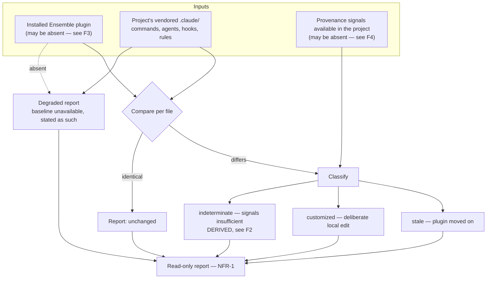

# PRD: Runtime Drift Detection

**Version**: 1.1.0
**Status**: Draft
**Created**: 2026-08-14
**Last Updated**: 2026-08-14
**Author**: @product-manager
**Source**: `docs/modernization/runs/ab-test/spec.md` (verbatim feature request; the sole requirements baseline for this PRD)
**Stakeholders**: The requester (author of the source spec). No other stakeholders are named in the source.

---

## Changelog

| Version | Date | Changes | Author |
|---------|------|---------|--------|
| 1.0.0 | 2026-08-14 | Initial PRD creation from `docs/modernization/runs/ab-test/spec.md` | @product-manager |
| 1.1.0 | 2026-08-14 | Verification pass applied. Added NFR-3 (coverage gate, was wrongly asserted not to exist). Broadened NFR-1/NG3/G3 to req 3's unqualified scope. Recorded that `/rebase-project --dry-run` already satisfies F1/G3/NFR-1 (§8) and that the novel work is F2+F3. Corrected R3: skills are copied verbatim, only agents are transformed. Documented `runtime-refresh.sh` as an unattended auto-overwrite and its consequence for AC-N1. Located the prior requirement in `docs/PRD|TRD/ensemble-vnext.md` and its conflict with the as-built command. Fixed §1.1 line anchors and added the omitted fifth `--check` target. Flagged AC-F4.3 as derived; bounded F2's "no mechanism" disclaimer against AC-F4.3/node S/B1. Narrowed B1 to its unsettled half. | @product-manager |

---

## 1. Product Summary

### 1.1 Problem Statement

Quoting the source directly:

> A project that has been scaffolded from the Ensemble plugin carries a vendored `.claude/`
> runtime — commands, agents, hooks, rules. Over time that copy diverges from what the plugin
> would generate today. Two different things cause divergence, and they need opposite
> responses:
>
> - The plugin moved on and the project didn't. The project is **stale** and should refresh.
> - Someone edited the vendored copy on purpose, for that project. That's **customization**
>   and must be preserved — refreshing over it destroys real work.
>
> Today nothing tells you which you have.

The source substantiates "nothing tells you" with one concrete fact, which this PRD verified
against the code:

- `generate-hooks-artifacts.sh --check` compares the plugin's own manifest against its
  generated consumers and exits 1 if regeneration would change any file
  (`packages/core/scripts/generate-hooks-artifacts.sh:28-30`). Its targets are all resolved
  under `REPO_ROOT` of the monorepo checkout (`:34`) — the manifest (`:53`), the settings
  template, the `init-project.md` / `rebase-project.md` pairs (through `:67`), and
  `packages/full/commands/plugin-only` (`:80`, synced and `--check`-validated per `:73-81`).
  **Confirmed: it never reads an arbitrary consuming project's `.claude/`** — every one of
  the five targets is under `REPO_ROOT`. (Precision note: it does read
  `$REPO_ROOT/.claude/commands/init-project.md`, but that is this repository's own vendored
  copy, not a consumer's.)

The stated consequences: a project can sit on an old runtime with no signal, and a refresh
can silently overwrite a deliberate local change.

**One correction to the source's framing, which changes the scope of the problem rather than
the requirements.** The source says "today nothing tells you which you have" and describes the
overwrite risk as something a refresh "can" do. In a standard scaffolded project the overwrite
is already happening automatically and unattended:
`packages/core/templates/claude-directory/settings.json:147` registers `runtime-refresh.sh` on
**SessionStart** in every scaffolded project; `packages/core/hooks/runtime-refresh.sh:1-20`
runs `scaffold-project.sh --refresh` whenever the installed plugin version exceeds the vendored
`ensemble.version`; and `refresh_project()`
(`packages/core/scripts/scaffold-project.sh:1120-1207`) overwrites every already-present
command, workflow, agent, hook and skill from the plugin. `grep -n -i backup
packages/core/scripts/scaffold-project.sh` returns nothing — unlike `/rebase-project`, the
refresh path makes no backup and performs no customization check. Two consequences this PRD
carries forward:

1. On a standard scaffolded project the **stale** population is continuously self-erased at
   SessionStart, and any customization inside a shipped component is erased with it. The value
   of this feature is therefore weighted toward *detecting customization before it is
   destroyed*, and toward projects where that hook is absent, disabled, or version-pinned.
2. **The delivery form is constrained by this, and AC-N1's verification method depends on
   it** — see Appendix C. If the report ships as an in-session command, SessionStart may
   itself rewrite `.claude/` (via `runtime-refresh.sh`) and `.trd-state/` (via the dispatch
   ledger, per `.claude/rules/async-discipline.md`) before the report ever runs, so a
   "snapshot tree, run, diff" check cannot attribute the delta to this feature.

The user's ask, verbatim: *"I want a way to ask a project 'what has drifted, and which kind
is it?'"*

### 1.2 Proposed Solution

A read-only drift report, run against a scaffolded project, that lists each vendored
`.claude/` file whose content differs from what the currently installed plugin would generate,
and attaches a classification to each difference distinguishing **stale** (plugin moved on)
from **customized** (deliberate local edit).

The classification mechanism is deliberately **not specified here.** The source states:

> How to tell them apart is the hard part and I don't have an answer — that's what I want designed.

Designing that mechanism is the TRD's job. This PRD fixes the observable behaviour the
mechanism must produce (F2), and the two conditions it must survive (F3, F4).

### 1.3 Value Proposition

Stated by the source as two avoided harms:

1. A project sitting on an old runtime "indefinitely with no signal."
2. A refresh that "silently overwrite[s] a deliberate local change" — the source is explicit
   that this "destroys real work."

The report is the input to a human decision; the source reserves that decision to the user
("I'll decide what to do with the report").

### 1.4 Key Differentiators

Not applicable — the source makes no competitive or differentiation claim. Section left empty
deliberately.

### 1.5 Solution Architecture

Included because the comparison has two inputs living in different places (an installed plugin
outside the project, and the project's own vendored copy) and one branch the source explicitly
requires (F3, no plugin installed). That boundary is not obvious from the prose.

---

## 2. User Analysis

### 2.1 Target Users

The source is written in the first person by one person. **One user type appears in it.** No
second user type is invented here.

| User Type | Description | Primary Need |
|-----------|-------------|--------------|
| Owner of a project scaffolded from the Ensemble plugin | The person deciding whether to refresh that project's vendored runtime | To ask the project "what has drifted, and which kind is it?" before deciding to refresh |

### 2.2 User Personas

**Persona: the requester (as evidenced by the source text)**

- **Role**: Owner/maintainer of a project carrying a vendored Ensemble `.claude/` runtime.
- **Goals**: Know per file whether the vendored copy differs from the plugin's current output,
  and whether each difference is stale or deliberate. Decide the response themselves.
- **Pain Points**: Stated verbatim — "Today nothing tells you which you have"; a project "can
  sit on a two-release-old runtime indefinitely with no signal"; "a refresh can silently
  overwrite a deliberate local change."
- **Technical Proficiency**: High. Inferred from the source citing `generate-hooks-artifacts.sh
  --check` by name and reasoning about what it compares. This is an inference from the source
  text, not a research finding.

### 2.3 User Journey

**No journey diagram.** The interaction the source describes is a single invocation producing
a single report; a journey diagram would restate one step. Per the PRD structure rules, this
is a deliberate omission, not a gap.

---

## 3. Goals and Non-Goals

### 3.1 Goals

All five source requirements are stated as MUST, so all goals are P0. Success metrics are
observable checks, not figures — the source states no numeric target, and none is invented.

| ID | Goal | Success Metric | Priority |
|----|------|----------------|----------|
| G1 | A project can be asked what has drifted and gets a per-file answer | For a fixture project with a known modified vendored file, the report names that file (source req 1) | P0 |
| G2 | Each reported difference is classified stale vs customized | Every file the report lists as differing carries exactly one verdict from the documented verdict set (source req 2) | P0 |
| G3 | Running the report changes nothing, anywhere | After a run, the project tree is byte-identical to before, including no new files — and so are the installed plugin directory and `$HOME/.claude` (source req 3, whose MUST NOT is unqualified) | P0 |
| G4 | A useful answer is produced with no plugin installed | With no installed plugin, the run completes and produces a report that names the missing baseline rather than aborting or reporting "no drift" (source req 4) | P0 |
| G5 | A runtime scaffolded before this feature existed is supported | For a fixture `.claude/` carrying no feature-specific provenance artifact, a report is still produced (source req 5) | P0 |

### 3.2 Non-Goals (Explicit Scope Exclusions)

| ID | Non-Goal | Rationale |
|----|----------|-----------|
| NG1 | Automatically fixing, repairing, or refreshing drift — including offering to do it as part of the same run | Source, "Not doing": *"Automatically fixing drift. I'll decide what to do with the report."* |
| NG2 | Any change to how the runtime is version-controlled — do not add/remove `.claude/` from `.gitignore`, do not move the runtime to a separate repository, do not change what `scaffold-project.sh` commits | Source, "Not doing": *"Any change to how the runtime is version-controlled."* |
| NG3 | Writing anything as a side effect of reporting — including backups, caches, lock files, logs, or a baseline/manifest file created on first run. **Not limited to the project tree**: a cache under `$HOME/.claude` or a scratch file in the installed plugin directory is equally excluded | **Derived** from source req 3 (*"It MUST NOT change anything. Reporting only."*), whose MUST NOT is unqualified. Called out separately because a first-run baseline write is the natural implementation shortcut for the classification problem, and it violates req 3 — and because putting that baseline *outside* the project is the natural way to evade a project-tree-only reading of it. |

Nothing else from the source is excluded. Every requirement in the source appears in Section 4.

---

## 4. Feature Requirements

### 4.1 P0 - Core Features (Must Have)

#### F1: Per-file drift report

**Priority**: P0
**Source**: spec.md req 1 — *"It MUST report, per file, whether the vendored copy differs from
what the currently installed plugin would generate."* Plus the framing sentence *"I want a way
to ask a project 'what has drifted, and which kind is it?'"*

**Description**: A single invocation against a project directory produces a report covering the
project's vendored `.claude/` runtime, stating per file whether its content differs from what
the currently installed plugin would generate for that project.

**User Stories**:
- As the owner of a scaffolded project, I want to ask the project what has drifted, so that I
  know whether refreshing is safe.

**Acceptance Criteria**:
- [ ] AC-F1.1: The report has one entry per vendored runtime file examined, each stating
  differs / does-not-differ. *("Vendored runtime file" is undefined against three component
  classes the source's own enumeration — commands, agents, hooks, rules — does not name, and
  which are nonetheless refreshed by the same path: `.claude/workflows/*.js` (`copy_workflows()`,
  `packages/core/scripts/scaffold-project.sh:194-250`, counted in `REFRESH_SUMMARY workflows=`
  at `:1206`), `.claude/hooks/prompts/*.md` (shipped per the `promptFile` rule in
  `packages/core/hooks/hooks.manifest.json`), and `.claude/selected-skills.txt` (the per-project
  input read by `copy_skills()` `:690` and `inject_agent_skills()` `:795`). This is a
  codebase-vs-PRD scope gap, not a source omission — the source enumerates four categories and
  the codebase has seven. Carried to Appendix C for the TRD to close.)*
- [ ] AC-F1.2: For a fixture project in which one vendored file has been modified, that file is
  reported as differing.
- [ ] AC-F1.3: For a fixture project whose vendored files match the plugin's output, no file is
  reported as differing.
- [ ] AC-F1.4: The comparison baseline is what the plugin **would generate for this project**,
  not the plugin's on-disk source file. *(Derived from req 1's wording "would generate", and
  necessary because generation is not a pure copy — see R3.)*

**Dependencies**: An installed plugin, when one is present (see F3 for when one is not).

---

#### F2: Classify each difference — stale vs customized

**Priority**: P0
**Source**: spec.md req 2 — *"It MUST distinguish stale-and-should-refresh from
deliberately-customized. How to tell them apart is the hard part and I don't have an answer —
that's what I want designed."*

**Description**: Every difference F1 reports carries a verdict. The two verdicts the source
names are **stale** (the plugin moved on and the project didn't) and **customized** (someone
edited the vendored copy on purpose, and it must be preserved).

**The mechanism is explicitly undesigned and is the TRD's deliverable.** This PRD does not name
signals, heuristics, or an algorithm; doing so would fabricate the answer the source asked to
have designed.

*Scope of that disclaimer, stated precisely because three other places in this PRD do touch the
mechanism.* AC-F4.3 makes "a provenance signal" load-bearing, §1.5's diagram feeds node S
("Provenance signals available in the project") into Classify, and B1 names git history as "a
classification signal". None of those is authorized by source req 2, which leaves the mechanism
entirely undesigned. The reconciliation: **"provenance signal" is used throughout as an
unbound placeholder for whatever inputs the TRD's designed mechanism turns out to need — it is
not a requirement that provenance signals specifically be the mechanism.** If the TRD designs a
mechanism using no provenance signal at all, AC-F4.3 and node S are satisfied vacuously and
neither is violated. What AC-F4.3 actually requires is the degradation behaviour (AC-F2.4),
not the signal class.

**User Stories**:
- As the owner of a scaffolded project, I want each drifted file labelled stale or customized,
  so that I refresh the stale ones and preserve the customized ones.

**Acceptance Criteria**:
- [ ] AC-F2.1: Every file reported as differing carries exactly one verdict.
- [ ] AC-F2.2: The verdict set includes at least `stale` and `customized`, matching the source's
  two named causes.
- [ ] AC-F2.3: The report states, per file, the evidence the verdict rests on, so the user can
  overrule it. *(Derived: the source reserves the decision to the user — "I'll decide what to
  do with the report" — and a bare verdict with no evidence cannot be overruled on anything but
  faith. Strike this AC if the user disagrees.)*
- [ ] AC-F2.4: When the available signals do not support either verdict, the file is reported
  under a third, explicitly indeterminate verdict rather than being guessed into `stale` or
  `customized`. *(**Derived**, not stated. Reasoning: the source names an asymmetric harm —
  refreshing over a customization "destroys real work" — and states the user has no answer for
  the hard case; a forced binary verdict converts every unresolved case into a silent claim.
  This is the single largest addition this PRD makes to the source; it is flagged so it can be
  struck cleanly.)*

**Dependencies**: F1.

---

#### F3: Useful report when no plugin is installed

**Priority**: P0
**Source**: spec.md req 4 — *"It MUST still produce a useful answer when no plugin is installed
at all."*

**Description**: With no Ensemble plugin installed, the run still completes and reports what it
can, naming the fact that the generation baseline is unavailable.

**User Stories**:
- As the owner of a scaffolded project on a machine with no plugin installed, I want the drift
  question to still return something, so that the tool is usable where I actually am.

**Acceptance Criteria**:
- [ ] AC-F3.1: With no installed plugin discoverable, the run completes and emits a report
  rather than aborting with an error.
- [ ] AC-F3.2: The report states plainly that no plugin baseline was available.
- [ ] AC-F3.3: The absence of a baseline is never presented as "no drift." *(Derived from the
  source's problem framing: the failure being solved is a project sitting stale "with no
  signal"; a false all-clear reproduces that failure exactly.)*

*What "useful" contains beyond the above is not specified by the source. See Appendix C.*

**Dependencies**: None.

---

#### F4: Works on a runtime scaffolded before this feature existed

**Priority**: P0
**Source**: spec.md req 5 — *"It MUST work on a project whose runtime was scaffolded before this
feature existed — no cooperation from the past."*

**Description**: The report works against a vendored `.claude/` that carries no artifact created
by this feature, and no guarantee of any particular provenance record.

Grounding, relevant to how much is safe to assume: `.claude/settings.json` carries an
`ensemble.version` stamp (observed in this repository: `"version": "4.1.15"`), written by
`scaffold-project.sh`'s `stamp_ensemble_version()` on initial scaffold and on every successful
`--refresh`. The script's own comment records the pre-stamp case explicitly: *"without the
stamp it always falls through to 'unknown -> full sync'"*
(`packages/core/scripts/scaffold-project.sh:970-980`). `/rebase-project` handles the same case
by treating a missing version field as `"unknown"` (`.claude/commands/rebase-project.md`, Step 1).
So the stamp may be present and may be used when it is — but req 5 forbids **requiring** it.

**User Stories**:
- As the owner of an older scaffolded project, I want the drift report to work without my
  runtime having been prepared for it, so that the projects that most need this get it.

**Acceptance Criteria**:
- [ ] AC-F4.1: For a fixture `.claude/` with no `ensemble.version` key and no artifact produced
  by this feature, a report is produced.
- [ ] AC-F4.2: No classification path depends on an artifact this feature would have had to
  write earlier (which NG3 forbids writing in any case).
- [ ] AC-F4.3: When a provenance signal is absent, classification degrades to a stated
  lower-confidence verdict (AC-F2.4) rather than failing or silently guessing. *(**Derived**,
  not stated — inherits the flag on AC-F2.4. Req 5 says only "no cooperation from the past";
  the degradation *behaviour* is this PRD's addition, and strikes with AC-F2.4 if that one is
  struck. What survives independently is AC-F4.1: a report is still produced.)*

**Dependencies**: F2.

---

### 4.2 P1 - Enhanced Features (Should Have)

**Empty.** The source states five requirements, all MUST, and asks for nothing beyond them.
This is a correct outcome, not an omission.

### 4.3 P2 - Future Features (Nice to Have)

**Empty.** Same reason.

---

## 5. Non-Functional Requirements

| ID | Requirement | Source |
|----|-------------|--------|
| NFR-1 | The feature performs no writes **anywhere** as a side effect of reporting — not into the target project tree, and not into the installed plugin directory, a shared cache, or `~/.claude` | spec.md req 3: *"It MUST NOT change anything. Reporting only."* |
| NFR-2 | Whatever form the feature ships in must respect the project's construct rules: skills and agents are prompts only with no executable code; commands are prompts with optional shell scripts | `constitution.md`, Core Principles 2 and 3 |
| NFR-3 | Test coverage for the delivered feature meets the project floor: unit >= 60%, integration >= 50% when applicable | `constitution.md`, Quality Gates — incorporated by the source's Context section ("*See `.claude/rules/stack.md` and `.claude/rules/constitution.md` for … the project's absolutes*") |

**NFR-1 scope note.** Req 3's MUST NOT is unqualified — *"change anything"*. An earlier draft of
this PRD scoped it to the target project tree, which would have let a run that writes into the
installed plugin directory, a shared cache, or `~/.claude` satisfy NFR-1 and AC-N1 while
violating req 3 as written. The unqualified form above is the source's, restored. AC-N1 verifies
the project tree because that is what a fixture can cheaply snapshot; the requirement is broader
than its check, and the TRD should say where else it verifies.

No performance, availability, or throughput requirement is listed: the source states none, and no
measurement exists to cite. Coverage is **not** in that category — NFR-3 above is a stated
project absolute, reached through the same Context reference this PRD already relies on for
NFR-2 and for §6's `verification_level`. An earlier draft asserted no coverage requirement
existed; that was contradicted by the file this PRD cites three times.

---

## 6. Acceptance Criteria Summary

Verification methods use the project's declared level: `constitution.md` sets
`verification_level: unit-only`, and `stack.md` names BATS ^1.9.0 for shell-level tests, which
is the layer the fixture-project checks below live at.

### Feature Acceptance Criteria

| ID | Feature | Criterion | Verification Method |
|----|---------|-----------|---------------------|
| AC-F1.1 | F1 | One entry per vendored runtime file examined, each stating differs / does-not-differ | BATS unit test against fixture project |
| AC-F1.2 | F1 | A known-modified vendored file is reported as differing | BATS unit test against fixture project |
| AC-F1.3 | F1 | An unmodified project reports no differing files | BATS unit test against fixture project |
| AC-F1.4 | F1 | Baseline is what the plugin would generate for this project, not the plugin's raw source file | BATS unit test using a fixture whose generated output differs from plugin source |
| AC-F2.1 | F2 | Every differing file carries exactly one verdict | BATS unit test against fixture project |
| AC-F2.2 | F2 | Verdict set includes `stale` and `customized` | BATS unit test against fixture project |
| AC-F2.3 | F2 | Each verdict states the evidence it rests on | Manual review of report output |
| AC-F2.4 | F2 | Unresolvable cases get an explicit indeterminate verdict, not a guess | BATS unit test with a fixture engineered to be ambiguous |
| AC-F3.1 | F3 | Run completes and emits a report with no plugin installed | BATS unit test with plugin discovery pointed at an empty location |
| AC-F3.2 | F3 | Report states that no plugin baseline was available | BATS unit test (assert on report text) |
| AC-F3.3 | F3 | Missing baseline is never rendered as "no drift" | BATS unit test (assert absence of all-clear wording) |
| AC-F4.1 | F4 | Report produced for a `.claude/` with no `ensemble.version` and no feature artifact | BATS unit test against pre-stamp fixture |
| AC-F4.2 | F4 | No classification path requires a previously written artifact | Manual review of the TRD design + BATS pre-stamp fixture |
| AC-F4.3 | F4 | Absent provenance degrades to a stated lower-confidence verdict | BATS unit test against pre-stamp fixture |

### Non-Functional Acceptance Criteria

| ID | Requirement | Criterion | Verification Method |
|----|-------------|-----------|---------------------|
| AC-N1 | NFR-1 | Project tree is byte-identical before and after a run, and contains no new paths | BATS unit test: snapshot fixture tree, run, diff. **Only valid if the report runs outside a session** — see Appendix C; an in-session delivery needs a different method, because SessionStart writes to `.claude/` and `.trd-state/` on its own |
| AC-N1b | NFR-1 | No writes outside the project tree either — installed plugin directory, shared caches, and `$HOME/.claude` are unchanged by a run | BATS unit test with `HOME` and the plugin dir pointed at snapshotted temp locations, diffed after the run |
| AC-N2 | NFR-2 | Delivered artifacts contain no executable code inside skill or agent definitions | Manual review against `constitution.md` principles 2-3 |
| AC-N3 | NFR-3 | Unit coverage >= 60%, integration >= 50% where applicable | Coverage report from the project's declared test stack (`stack.md`: BATS ^1.9.0 for shell, Jest ^29 for JS) |

---

## 7. Risk Assessment

Likelihood and Impact below are authoring judgment, not measurements. Each row names a trigger
specific to this product; generic hazards are omitted.

| ID | Risk | Likelihood | Impact | Mitigation Strategy |
|----|------|------------|--------|---------------------|
| R1 | A file is both stale and customized — edited locally *and* changed in a later plugin release — and gets a single verdict. A wrong `stale` verdict leads the user to refresh over deliberate work | Med | High | Report the case explicitly (AC-F2.4) rather than collapsing it; surface the evidence (AC-F2.3) so the user can overrule; the report never acts (NFR-1, NG1), so the destructive step stays a human decision |
| R2 | The classification cannot be resolved from signals available in a project that offered "no cooperation from the past" (req 5), because the obvious mechanism — a baseline recorded at scaffold time — is exactly what req 5 rules out relying on | Med | High | Treat the mechanism as the TRD's designed deliverable, not an assumption; require the indeterminate verdict (AC-F2.4) so an unsolvable case is reported as unsolved rather than guessed |
| R3 | "What the plugin would generate" is not a byte copy of the plugin's files **for agents**. `inject_agent_skills()` (`packages/core/scripts/scaffold-project.sh:793-966`) rewrites each agent's `skills:` frontmatter and appends a generated body block at scaffold *and* refresh time, so a vendored agent never byte-matches its plugin source. A naive plugin-file-vs-project-file comparison would report **every agent** as drifted, drowning the real signal | Med | High | AC-F1.4 fixes the baseline as generated-for-this-project; the TRD must reproduce generation for agents, not copy comparison. Scope this to the component classes that are actually transformed — see the note below |
| R4 | With no plugin installed (req 4), there is no baseline at all, and a report that renders that as "no drift" reproduces the exact failure the source is trying to fix ("no signal") | Med | High | AC-F3.2 and AC-F3.3 make the missing baseline explicit and forbid an all-clear |

**R3 correction — skills are not transformed, and an earlier draft said they were.** The claim
that skills too would be falsely reported as drifted traces to nothing in the code.
`copy_skills()` (`packages/core/scripts/scaffold-project.sh:688-772`) copies skill directories
verbatim (`cp -r "$src/$skill" "$dest/"`) with no per-project transformation; "compiled from
`stack.md`" is **selection**, not content generation. `/rebase-project` Step 2.2
(`.claude/commands/rebase-project.md:207-281`) confirms it by byte-diffing skill folders against
the plugin, which only works if an unmodified skill is byte-identical. So for skills a naive
byte comparison is **correct**, and AC-F1.4's "reproduce generation" requirement should not be
applied to them — doing so would add cost with no signal. R3 is an agent-shaped risk (and
possibly a `settings.json`-shaped one, which is merged rather than copied); it is not a
skill-shaped one.

### Contingency Plans

**R1 Contingency**: If a case cannot be separated, it is reported as indeterminate with its
evidence. The report never refreshes anything (NG1), so an indeterminate verdict costs the user
a manual look, not lost work.

**R2 Contingency**: If the designed mechanism cannot reach acceptable separation on pre-existing
projects, the fallback is to ship F1 (per-file difference) with every difference reported as
indeterminate, and defer F2's stale/customized split. **This does not satisfy source req 2 and
requires the user's explicit agreement** — it is recorded as a contingency, not a plan.

**R3 Contingency**: If reproducing generation for some component type proves impractical, that
component type is reported as "not comparable" with the reason, rather than compared naively and
reported as noise.

---

## 8. Decisions and Rejected Alternatives

| Proposal / Challenge | Verdict | Rationale | Revisit when |
|----------------------|---------|-----------|--------------|
| Automatically fix or refresh the drift the report finds | Rejected | Source, "Not doing": *"Automatically fixing drift. I'll decide what to do with the report."* | The user asks for it — plausibly once the classification has proven reliable enough to act on unattended |
| Change how the vendored runtime is version-controlled (e.g. move it out of the project repo, or gitignore it) to make drift trivially visible | Rejected | Source, "Not doing": *"Any change to how the runtime is version-controlled."* | The user reopens it; nothing in this feature's implementation should force the question |
| Record a baseline manifest/hash at scaffold time and classify by comparing against it | Rejected **as the sole or required mechanism** | Source req 5: *"no cooperation from the past."* A required baseline fails every project scaffolded before this feature. Using such a record as an *additional* signal where it happens to exist is not rejected | The supported population is narrowed to projects scaffolded after this feature ships — then it becomes viable as the primary signal |
| Answer the drift question with a version comparison alone (installed plugin version vs `.claude/settings.json` `ensemble.version`) | Rejected | Source req 1 asks for a **per-file** answer. A version comparison answers "is this runtime old", not "which files differ and why". The existing `runtime-refresh.sh` SessionStart hook already does the version-gated comparison and *acts* on it, which req 3 forbids here | Never — req 1 is explicit about per-file reporting. A version comparison may still be an input to classification |
| Specify the stale-vs-customized detection mechanism in this PRD | Rejected | The source states the mechanism is what it wants **designed**, and that the requester has no answer. Naming signals here would fabricate the deliverable and it would then go unchallenged downstream | The TRD produces a mechanism; this PRD is not the place for it either way |
| Extend `generate-hooks-artifacts.sh --check` to cover consuming projects, versus extending `/rebase-project --dry-run`, versus a new command or script | **Not decided** — deliberately left open | The source cites `--check`'s scope as evidence of the gap, not as a place to change. Naming a delivery vehicle here would constrain the design without a source. `--dry-run` is now named as a candidate because it already satisfies part of the ask — see the row below | The TRD picks a delivery form; see Appendix C |
| Build F1 (the per-file differs / does-not-differ report) as new behaviour | **Rejected as new behaviour — F1 substantially already exists** | `/rebase-project --dry-run` already does byte-level per-file content comparison of vendored vs plugin and already writes nothing. `.claude/commands/rebase-project.md:169-421` (Step 2 Component Diff) covers agents (2.1, *"Categorize via content comparison (byte-level diff of the full file)"*), skills (2.2, *"byte-diffing the folder contents"*), commands (2.3), hooks (2.4) and settings (2.5), and emits a per-category per-file summary (2.6, `:398`). `:451` and the flag table at `:949` make `--dry-run` "Report only" for every category, skipping the apply step entirely — so it already satisfies **F1, G3 and NFR-1**. Step 1's version table (`:150`) also already handles F4's pre-stamp case: *"Unknown \| Any \| Proceed with full sync"*. **What does not exist there is F2 and F3**: `--dry-run` classifies by *existence* (a file the plugin does not ship, or a command with no ensemble frontmatter), never by content, so it cannot say stale vs customized; and with no plugin installed it aborts outright (`.claude/commands/rebase-project.md:97-99`, *"Cannot resolve plugin source path… Abort rebase"*), which is exactly what req 4 forbids. **Consequence for scope:** the novel work is F2 and F3, not F1. A TRD that rebuilds F1 from scratch is duplicating shipped, working code | The TRD establishes that `--dry-run`'s diff cannot be reused — e.g. because it is prose-specified rather than callable, or because its output is not machine-readable |

### Confirmed grounding — do not re-litigate

Verbatim from the source:

- *"It MUST NOT change anything. Reporting only."*
- *"Automatically fixing drift. I'll decide what to do with the report."*
- *"Any change to how the runtime is version-controlled."* (listed under "Not doing")
- *"How to tell them apart is the hard part and I don't have an answer — that's what I want designed."*
- *"It MUST work on a project whose runtime was scaffolded before this feature existed — no cooperation from the past."*

---

## 9. Beliefs Not Yet Established

Claims this PRD relies on that are believed but unverified. Each names what would settle it.

| # | Claim | Status | What would settle it |
|---|-------|--------|----------------------|
| B1 | A consuming project's vendored `.claude/` is committed to git, making git history available as a classification signal | **Belief, narrowed — the framework half is now fact.** The framework never ignores it: `packages/core/commands/init-project.md:692` (Step 11, `:671-694`) states *"**Important:** Do NOT add `.claude/` or `.trd-state/` to gitignore - these should be tracked"*, and `grep -n gitignore packages/core/scripts/scaffold-project.sh` returns nothing — the scaffold script writes no `.gitignore` at all. `constitution.md` states the same as an architecture invariant. What remains unverified is only whether a consumer later added an ignore entry of their own, or committed the tree at all | Survey real consumer repos for a locally-added ignore entry covering `.claude/`. The framework-side question is settled and needs no further work |
| B2 | "What the plugin would generate today" is reproducible for every component type, so a generated baseline can be computed on demand | **Belief, not fact.** `constitution.md` calls `generate-hooks-artifacts.sh` deterministic, but skills are compiled from `stack.md` and agents receive scaffold-time skill injection, so reproduction depends on project inputs as well as plugin version | Scaffold a fixture project from a pinned plugin version into a temp directory twice and diff the outputs; then diff against an existing project's `.claude/` |
| B3 | The `ensemble.version` stamp is present in most existing consumer projects, so the pre-stamp case (req 5) is the minority path | **Belief, not fact.** The stamp is observed in this repository (`4.1.15`) and written by `stamp_ensemble_version()`, but the installed base is unmeasured | Survey the `.claude/settings.json` of real consumer projects. Note that req 5 holds regardless of the answer — this only affects how much the stamp can be leaned on |

---

## Appendices

### Appendix A: Glossary

| Term | Definition |
|------|------------|
| Vendored runtime | The `.claude/` directory carried inside a scaffolded project — commands, agents, hooks, rules (source, opening paragraph; `constitution.md`, "Vendored Runtime") |
| Stale | A vendored file that differs because the plugin moved on and the project didn't; should refresh (source) |
| Customization | A vendored file that differs because someone edited it on purpose for that project; must be preserved (source) |
| Drift | Any difference between the vendored copy and what the plugin would generate today, before it has been classified (source: "what has drifted") |

### Appendix B: Related Documents

- `docs/modernization/runs/ab-test/spec.md` — the source for this PRD
- `.claude/rules/stack.md`, `.claude/rules/constitution.md` — named by the source under "Context"
- `docs/TRD/runtime-refresh.md` — existing refresh mechanism, version stamp (§3.3), and `--refresh` semantics (§2.2/§3.2)
- `packages/core/scripts/generate-hooks-artifacts.sh` — the `--check` the source contrasts against
- `packages/core/scripts/scaffold-project.sh` — scaffold/refresh, `stamp_ensemble_version()`
- `.claude/commands/rebase-project.md` — nearest existing behaviour: Step 2 "Component Diff" plus `--dry-run`, which already satisfies F1, G3 and NFR-1 (see §8). Its notion of customization is existence-based (a file the plugin does not ship, or a command with no ensemble frontmatter — Step 2.3), not content-based, which is the gap this feature addresses
- `packages/core/hooks/runtime-refresh.sh` + `packages/core/templates/claude-directory/settings.json:147` — the SessionStart hook that auto-refreshes every scaffolded project, and the reason the overwrite risk is already unattended rather than merely possible (§1.1)
- **`docs/PRD/ensemble-vnext.md:553-564` (F1.2 details) and `docs/TRD/ensemble-vnext.md:588-608` (§3.1.2)** — the nearest *prior requirement*, not previously located by this PRD. Both already require exactly the preservation concern F2 exists to serve: the PRD says *"Preserve local customizations where possible"* and *"do not modify existing subagents as they've been tailored"*, with accepted criterion AC-F1.2-01 (`:1601`, *"`/rebase-project` preserves existing subagent customizations"*); the TRD says *"do NOT overwrite customized agents"* and lists *"Agent customizations: Preserved"*. **These documents contradict the as-built command**, which replaces any agent whose content differs and preserves the old copy only as a backup (`.claude/commands/rebase-project.md:16-18`, `:177-184`, `:462`). That is a live doc-vs-code conflict sitting in the exact area F2 classifies, and the TRD should resolve which side is authoritative before designing on top of either

### Appendix C: Open Questions

| Question | Status | Resolution |
|----------|--------|------------|
| What form does the feature ship in — a new command, an extension of an existing one, a standalone script? | Open | Not specified by the source; constrained by NFR-2, by the `--dry-run` overlap (§8), and by one thing an earlier draft left unstated: **if it ships as an in-session command, AC-N1's "snapshot tree, run, diff" check cannot hold**, because SessionStart itself may rewrite `.claude/` (`runtime-refresh.sh`) and `.trd-state/` (dispatch ledger) before the report runs. A standalone script invoked outside a session avoids this; an in-session command needs a different verification method for AC-N1. TRD decides, with that constraint recorded |
| What does the report look like? Ordering, grouping, machine-readable output? | Open | The source specifies content, not presentation. No format requirement is invented here |
| How is a vendored file that the plugin does not ship at all (user-created) reported? The source names two causes of divergence and this is a third case | Open | `/rebase-project` treats such files as customizations and preserves them (Step 2.3). Whether this feature adopts the same treatment is undecided; not invented as a requirement |
| Does the report cover `.claude/rules/constitution.md`, `stack.md`, `process.md`? | Open | `docs/TRD/runtime-refresh.md` §2.2 marks these "project-authored — never touched" by refresh, so drift in them may not mean the same thing. Source does not address it |
| Does the report scope to `.claude/` only, or also `.trd-state/`? | Open | The source names "a vendored `.claude/` runtime — commands, agents, hooks, rules". `.trd-state/` is runtime state and is never refreshed (runtime-refresh §2.2). Assumed out of scope; flagged rather than silently dropped |
| Does the report cover the three refreshed component classes the source's enumeration omits — `.claude/workflows/*.js`, `.claude/hooks/prompts/*.md`, and `.claude/selected-skills.txt`? | Open | All three are written by the same scaffold/refresh path as the four named categories (see AC-F1.1), so they can drift identically. The source's four-category list is descriptive of `.claude/`, not obviously an exhaustive scope statement. Recommend including them; not asserted as a requirement, since the source does not name them |
| Which component classes need generation reproduced, and which can be compared byte-for-byte? | Open | Established here: **agents must be reproduced** (`inject_agent_skills()` transforms them); **skills must not** (`copy_skills()` is a verbatim `cp -r`). Commands, hooks and workflows appear to be verbatim copies; `settings.json` is merged, not copied, and likely needs its own treatment. TRD to confirm per class rather than applying AC-F1.4 uniformly |
