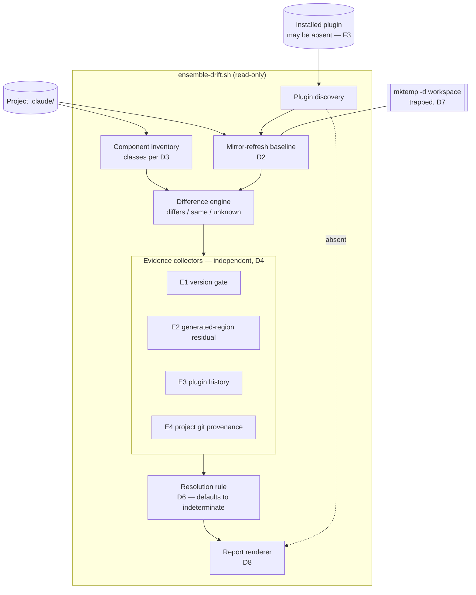
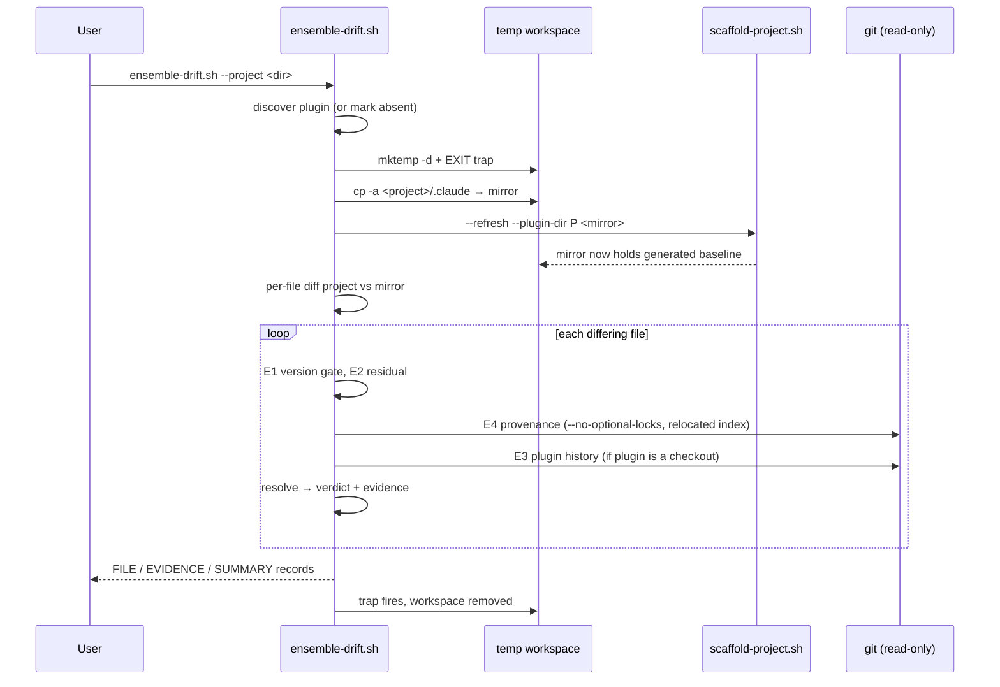
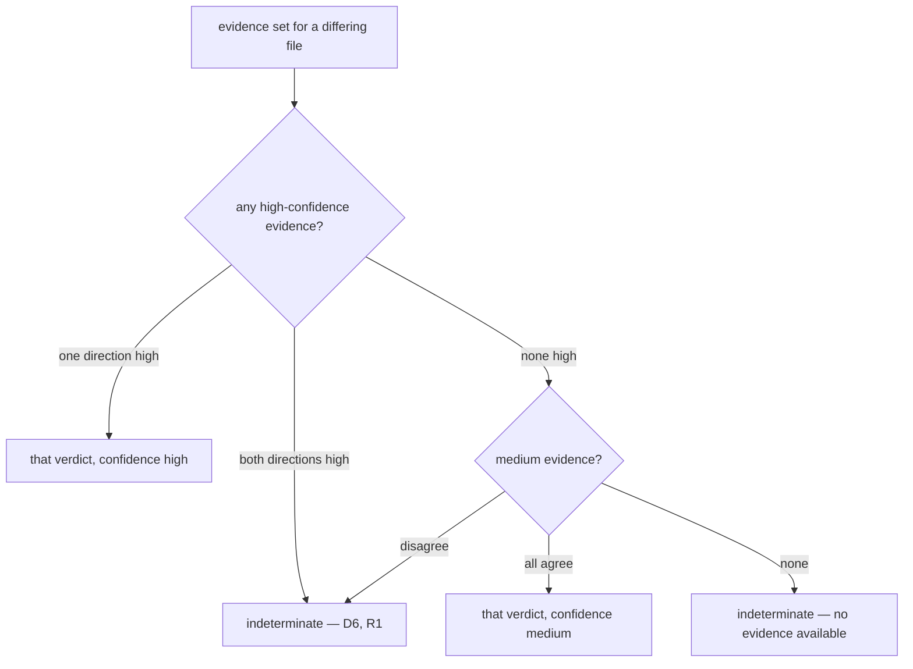

# TRD: Runtime Drift Detection

**Version**: 1.1.0
**Status**: Draft
**Created**: 2026-08-14
**Last Updated**: 2026-08-14
**Author**: @technical-architect
**Source PRD**: `docs/modernization/runs/ab-test/new/PRD.md` (v1.1.0, no supersession marker)
**Additional sources of truth**: `.claude/rules/stack.md`, `.claude/rules/constitution.md`, the codebase
**Task ID Prefix**: `DRIFT`

---

## Changelog

| Version | Date | Changes | Author |
|---------|------|---------|--------|
| 1.0.0 | 2026-08-14 | Initial TRD creation from PRD v1.1.0 | @technical-architect |
| 1.1.0 | 2026-08-14 | Verification pass applied. **Closed the delivery gap**: D10's vendoring channel could not reach any already-scaffolded project (refresh never creates), leaving the F3∩F4 population with no artifact to run — added D11 and DRIFT-P003 routing delivery through `/rebase-project`. **Made DRIFT-T007 buildable**: located `kcov` as the project's already-designated Bash coverage tool (`docs/TRD/testing-phase.md:55`) and wired it, with a documented unmeasured fallback, replacing an AC its own grounding block called unsatisfiable. **Fixed E2/E3's agent branch**: residuals needed trailing-newline normalisation or the `stale`/high branch was unreachable and every agent got the wrong verdict. Resolved D8 vs §3.2 on `SUMMARY` placement in favour of the `REFRESH_SUMMARY` precedent. Serialised Phases 3 and 4 — all B tasks write one file. Dropped `--verbose` and `--no-git` (no objective, no test). Added a `not-comparable (no-settings-baseline)` outcome. Flagged AC-F2.3/F2.4/F4.3 as PRD-derived where this TRD makes them load-bearing. Corrected five line anchors in DRIFT-B006. | @technical-architect |

---

## 1. Overview

### 1.1 Technical Summary

A self-contained Bash script, `ensemble-drift.sh`, is invoked against a scaffolded project
and emits a read-only, line-oriented drift report. It answers the PRD's two questions in two
separable stages:

1. **Difference (F1).** The baseline — *what the plugin would generate for this project* —
   is produced by **mirror-refresh**: copy the project's `.claude/` into a throwaway temp
   directory and run the real `scaffold-project.sh --refresh` against that copy. The result
   is generated-for-this-project by construction, which is what AC-F1.4 requires and what a
   byte-comparison against plugin source cannot give (PRD R3: `inject_agent_skills()`
   rewrites every agent). The report is then a per-file diff of the project against its own
   mirror.
2. **Classification (F2 — the PRD's central undesigned deliverable).** Four **independent
   evidence collectors** (E1–E4) each look at one signal that happens to be present in an
   ordinary project — the version stamp, the generated-region boundary inside agent files,
   the project's own git history, and the plugin's git history when the plugin is a checkout.
   Each yields evidence for `stale` or `customized` at a stated confidence, or reports itself
   unavailable. A documented resolution rule turns the evidence set into exactly one verdict,
   and **defaults to `indeterminate`** whenever the evidence is absent, weak, or in conflict.

Nothing in this design requires an artifact written at scaffold time (AC-F4.2, NG3): every
signal is either derivable on demand or already present for unrelated reasons.

The two degraded paths the PRD requires are not error paths — they are ordinary paths with
fewer collectors available. With no plugin, stage 1 has no baseline and every comparable file
is reported `state=unknown` while E4 (project git) still runs. With no version stamp, E1 is
unavailable and the rest still run.

**Established, closing PRD §8's revisit condition.** The PRD rejected F1 as new work on the
grounds that `/rebase-project --dry-run` already does it, with the revisit condition *"the TRD
establishes that `--dry-run`'s diff cannot be reused — e.g. because it is prose-specified
rather than callable, or because its output is not machine-readable."* Both halves of that
condition hold, and a third: `.claude/commands/rebase-project.md` is a prompt executed by the
model (`:80-99`, *"For LLM execution: use file system tools to read from resolved paths"*),
so there is no callable diff to reuse; its output is a prose table, not machine-readable; its
agent comparison is an explicit *"byte-level diff of the full file"* against plugin source
(`:160-200`), which AC-F1.4 and PRD R3 rule out; and it aborts outright with no plugin
(`:97-99`), which AC-F3.1 forbids. **F1 is therefore in scope as new script work.** What is
reused is its *vocabulary* (New / Updated / Unchanged / Custom) and its treatment of
plugin-unknown files as local.

### 1.2 Key Technical Decisions

| ID | Decision | Choice | Serves Objective | Rationale | Alternatives Considered |
|----|----------|--------|------------------|-----------|------------------------|
| D1 | Delivery form | Standalone Bash script `ensemble-drift.sh`, invocable outside a session, plus a thin `/drift-report` command that does nothing but run it and print its output | AC-F3.1, AC-N1, NFR-2 | PRD Appendix C: an in-session-only command makes AC-N1's "snapshot, run, diff" check unattributable, because SessionStart itself rewrites `.claude/` (`runtime-refresh.sh`) and `.trd-state/` (dispatch ledger). A script is directly BATS-testable, which is the layer AC-N1/AC-N1b live at. NFR-2 permits a command backed by a shell script | (a) Extend `generate-hooks-artifacts.sh --check` — rejected: all five of its targets resolve under `REPO_ROOT` of the plugin's own checkout (`packages/core/scripts/generate-hooks-artifacts.sh:34`), so it is the plugin's self-check, not a consumer-facing one; *revisit if the plugin grows a general consumer-inspection surface*. (b) Extend `/rebase-project --dry-run` — rejected on the three grounds established in §1.1; *revisit if `rebase-project` is ever reimplemented as a callable script*. (c) Command only, no script — rejected: AC-N1 becomes unverifiable per PRD Appendix C; *revisit if a write-free session mode ever exists* |
| D2 | Baseline construction | **Mirror-refresh**: `cp -a` the project's `.claude/` into a temp dir, run `scaffold-project.sh --refresh --plugin-dir <P> <tempdir>`, diff project against mirror | AC-F1.4, PRD R3 | "What the plugin would generate for this project" is *operationally defined* by the refresh path — including `inject_agent_skills()`'s frontmatter rewrite and body block, `copy_skills()`'s verbatim copy, and refresh's replace-present-never-create semantics. Reproducing it by invoking it cannot drift from it | (a) Reimplement the transforms inside the drift script — rejected: creates a second source of truth for generation, which is precisely the failure class this feature exists to detect; *revisit if `scaffold-project.sh` ever acquires a write outside its target directory, which would make invoking it incompatible with NFR-1*. (b) Byte-compare vendored files against plugin source — rejected: reports every agent as drifted (PRD R3) and contradicts AC-F1.4; *revisit never for agents; it remains correct for skills, and D3 applies it there* |
| D3 | Comparison scope | All seven refreshable classes — commands, agents, hooks (+ `hooks/prompts/`, `hooks/lib/`), workflows, skills, framework-shipped rules, `selected-skills.txt` — plus `settings.json` on its framework-owned surface only. `constitution.md` / `stack.md` / `process.md` reported `not-comparable (project-authored)`. `.trd-state/` out of scope. `/rebase-project` backup directories not compared. Files the plugin does not ship reported `local-only` | AC-F1.1, PRD Appendix C rows 3–7 | The PRD's Appendix C leaves five scope questions open and recommends including the three classes the source's four-category enumeration omits. All seven are written by the same `refresh_project()` path (`scaffold-project.sh:1155-1194`), so they drift identically. `refresh_rules()` (`:1060-1104`) structurally refuses to touch the three authored rules, so drift in them does not mean what drift elsewhere means | (a) The source's four named categories only — rejected: `.claude/workflows/*.js`, `.claude/hooks/prompts/*.md` and `selected-skills.txt` are refreshed by the same code path and would silently drift unreported; *revisit if the user scopes the report back to the four*. (b) Include `.trd-state/` — rejected: it is runtime state, never refreshed, and the PRD assumes it out of scope; *revisit if state files are ever brought under the refresh path* |
| D4 | Classification architecture | Independent evidence collectors E1–E4, each emitting `{signal, direction, confidence}` or `unavailable`, consumed by one resolution rule | F2, AC-F2.1, AC-F2.3, AC-F4.3 | Additive collectors are what make the degraded paths ordinary rather than special-cased: F3 and F4 are "fewer collectors available", not separate algorithms. Per-signal output is also what AC-F2.3's "state the evidence" needs — a monolithic heuristic has no evidence to print | (a) A single scoring heuristic — rejected: produces a number the user cannot overrule, defeating AC-F2.3 and the source's *"I'll decide what to do with the report"*; *revisit if the collector set stabilises and a weighting proves reliable enough to summarise*. (b) A required scaffold-time baseline manifest — already rejected by the PRD (§8) against source req 5 and NG3; *revisit only if the supported population is narrowed to post-feature projects* |
| D5 | Evidence set | E1 version-gate, E2 generated-region residual, E3 plugin-history match, E4 project-git provenance. Each declares its own availability | AC-F2.2, AC-F4.2, AC-F4.3 | Each signal exists for reasons unrelated to this feature and therefore satisfies "no cooperation from the past": the stamp is written by `stamp_ensemble_version()`, the generated block by `inject_agent_skills()`, and git history by the framework's own invariant that `.claude/` is tracked (`packages/core/commands/init-project.md:692`; `constitution.md`, Vendored Runtime) | (a) E4 alone — rejected: unavailable in an untracked or non-git project, leaving F2 with no mechanism there. (b) Add a filesystem-mtime signal — rejected: a fresh `git clone` sets every mtime to checkout time, so the signal is silently wrong rather than absent, which is worse than unavailable; *revisit never* |
| D6 | Conflict resolution | High-confidence evidence pointing both ways resolves to `indeterminate` with both evidences printed — never to a collapsed single verdict | AC-F2.4 (**PRD-derived — see §1.5's derived-AC note; if that AC is struck, this decision goes with it**), PRD R1 | R1's stated mitigation is *"Report the case explicitly (AC-F2.4) rather than collapsing it"*. A file that is both locally edited and changed upstream is the case the source calls out as destroying real work | Precedence rule "customized wins on conflict" — rejected: it produces a confident verdict from unresolved evidence, which AC-F2.4 forbids, and it would hide exactly the R1 case; *revisit if measurement shows the conflict class is large enough that always-indeterminate makes the report unusable* |
| D7 | No-write enforcement | One `mktemp -d` workspace with an `EXIT` trap; all git invoked as `git --no-optional-locks -C <project>` with `GIT_INDEX_FILE` pointed at a copy inside the workspace; no path under the project, the plugin directory, or `$HOME` is ever opened for writing | NFR-1, NG3, AC-N1, AC-N1b | `git diff` refreshes the index stat cache and writes `.git/index` as an ordinary side effect — a read-only-looking command that violates NFR-1 inside the project tree. `--no-optional-locks` plus a relocated index removes both the write and the lock | (a) Accept `.git/index` churn as "not a real change" — rejected: NFR-1's MUST NOT is unqualified and AC-N1 asserts byte-identity of the tree; *revisit only if the user narrows NFR-1*. (b) Operate on a full copy of the project — rejected: cost scales with the whole repo for no added signal; *revisit if git-in-place proves unsafe for some command E3/E4 needs* |
| D8 | Report format | Stable line-oriented records (`FILE`, `EVIDENCE`, `SUMMARY`) on stdout. **`SUMMARY` is the final line; nothing prints after it, and there is no trailing prose block.** The records are themselves the human-readable output — the `FILE` lines read as a table and `EVIDENCE` lines carry sentence text. No separate `--json` mode | AC-F2.3, AC-N3 | The PRD specifies content, not presentation, and leaves format open (Appendix C row 2). A line format with a fixed field order is directly assertable from BATS, which is how every AC in §6 is verified, and follows the existing `REFRESH_SUMMARY` precedent (`scaffold-project.sh:1206`) — **including its contract that the tally is last** (`:1200-1205`, asserted by an anchored `tail -1` test at `scaffold-project.test.sh:1703`). An earlier draft promised a prose summary *after* `SUMMARY`, contradicting both §3.2's grammar and the precedent it cites; the trailing prose is dropped | (a) Prose summary after `SUMMARY` — rejected: inverts the precedent's own contract, and DRIFT-T004's negative grep for all-clear wording would then have to run over unbounded free text. (b) A `--json` output mode — rejected: a second output surface with no named consumer today; *revisit when a programmatic consumer exists — the obvious one is a scripted `/rebase-project` that reads verdicts to decide what to preserve* |
| D9 | Authority for the documented-vs-as-built rebase conflict | The as-built `.claude/commands/rebase-project.md` is authoritative for what rebase does today. The preservation statements in `docs/PRD/ensemble-vnext.md:553-564` and `docs/TRD/ensemble-vnext.md:588-608` describe intent that was not implemented, and the classifier may not assume them | F2, AC-F2.3 | PRD Appendix B asks the TRD to resolve this before designing on top of either. It is load-bearing: as-built rebase *replaces* a differing agent and preserves the old copy only as a timestamped backup (`:16-18`, `:177-184`, `:462`). So after a rebase the vendored file holds plugin content and the customization lives in a backup directory — which makes a backup directory *evidence about a past customization*, not a preserved original, and means a post-rebase vendored file must not be assumed to carry local intent | Treat the older PRD/TRD as authoritative and assume customizations survive in place — rejected: contradicted by the shipped command; *revisit if `/rebase-project` is changed to preserve in place, at which point E2/E4's reasoning about post-rebase files changes* |
| D10 | Vendoring channel | New `copy_project_scripts()` in `scaffold-project.sh` copies `packages/core/scripts/project/*.sh` (excluding `*.test.sh`) into `.claude/lib/`, with the same replace-if-present-never-create refresh semantics as every other `copy_*` function. **This channel does not reach an already-scaffolded project — see D11, which resolves that gap** | AC-F3.1 | F3 requires a useful answer *"when no plugin is installed at all"*. A tool that lives only inside the plugin cannot run then. Vendoring it puts one copy in the project from a single source file, exactly as hooks are delivered. `.claude/lib/` is already created by `scaffold_project()` (`:1249`) and currently ships nothing | Ship plugin-side only — rejected: makes AC-F3.1 unreachable by construction; *revisit never while F3 stands*. Make `copy_project_scripts()` create on refresh — rejected: `refresh_project()`'s never-create contract (`:1108-1119`) is asserted by RUNTIME-T001 (`scaffold-project.test.sh:1673`) and is what lets refresh run unattended from SessionStart; breaking it for this feature is out of proportion to it |
| D11 | Delivery to pre-existing projects | `/rebase-project` gains `.claude/lib/*.sh` as a component class it adds and replaces, alongside the `.claude/hooks/lib/*.js` class it already handles (`rebase-project.md:329-334`, `:350`, `:596`). This makes rebase — which already exists to *add* components refresh may not — the delivery path for a runtime scaffolded before this feature | AC-F3.1, G5 | Without this, the vendoring channel reaches only fresh scaffolds. `refresh_project()` replaces present-only and creates nothing, so no project scaffolded before this feature ever receives `.claude/lib/ensemble-drift.sh` through the SessionStart `runtime-refresh.sh` path — and the F3∩F4 population (a pre-feature runtime on a machine with no plugin) would have no artifact to run at all, which is the exact state D10's rationale exists to prevent. Rebase is the framework's own answer to "component the project lacks" (TR4 already routes plugin-shipped-absent files there), and it already knows a `lib` class | (a) Leave the gap and narrow AC-F3.1 to post-feature projects — rejected: source req 5 forbids it, and F3∩F4 is precisely the population the source names. (b) Have `/drift-report` fall back to the plugin copy when the vendored one is absent — kept as a *secondary* path (it is DRIFT-P002's stated resolution order) but rejected as the primary answer: it fails on exactly the F3 condition, since there is no plugin to fall back to |

### 1.3 Technology Stack

| Layer | Technology | Purpose | Notes |
|-------|------------|---------|-------|
| Report tool | Bash | `ensemble-drift.sh` and its collectors | `stack.md`: Shell is the project's script language; matches `scaffold-project.sh` / `runtime-refresh.sh` |
| Structured parsing | Python 3.x | `settings.json` framework-surface comparison, semver compare, agent frontmatter residual | `stack.md` Runtime Dependencies (required). Same embedded-heredoc pattern already used across `scaffold-project.sh` |
| Provenance signals | Git 2.x+ | E3 and E4 collectors, read-only | `stack.md` Runtime Dependencies (required) |
| Tests | BATS ^1.9.0 | Every AC in §6 | `stack.md` Frameworks; PRD §6 names BATS as the verification layer |
| Command surface | Markdown prompt | `/drift-report` wrapper | `constitution.md` Core Principle 3 |

### 1.4 Integration Points

| System | Type | Direction | Notes |
|--------|------|-----------|-------|
| `~/.claude/plugins/installed_plugins.json` | JSON file | Read | Plugin discovery. Same shape and `full@ensemble-vnext` key `runtime-refresh.sh:214-303` reads; absence is F3's trigger, not an error |
| `scaffold-project.sh --refresh` | Subprocess | Out (invoked against a temp mirror only) | D2's baseline builder |
| Project `.claude/settings.json` | JSON file | Read | `ensemble.version` for E1 |
| Project git repository | Subprocess, read-only | Read | E4; invoked per D7 |
| Plugin git repository (when the plugin is a checkout) | Subprocess, read-only | Read | E3; opportunistic |

### 1.5 Objective Traceability

Every objective in the source, and where it lands in this TRD. Nothing in the PRD is dropped;
where a scope question was left open rather than required, it appears in §8's resolved-boundaries
table instead.

| Source objective | Where it lands |
|---|---|
| G1 per-file answer | F1 objectives; DRIFT-B002, B004, B012 |
| G2 stale vs customized | F2 objectives; DRIFT-B005–B009 |
| G3 changes nothing anywhere (project tree, plugin dir, `$HOME/.claude`) | NFR-1; D7; DRIFT-B001, T006 |
| G4 useful answer with no plugin | F3 objectives; DRIFT-B010 |
| G5 works on a pre-feature runtime | F4 objectives; DRIFT-B011 |
| AC-F1.1–1.4 | §3.2 record grammar; DRIFT-B002, B003, B004, T002 |
| AC-F2.1, AC-F2.2 | §3.3 resolution rule; DRIFT-B009, T003 |
| **AC-F2.3 (PRD-derived)** | §3.2 evidence rule; D4; DRIFT-B012, T008 — **see the derived-AC note below** |
| **AC-F2.4 (PRD-derived)** | §3.3 resolution rule; D6; DRIFT-B009, T003 — **see the derived-AC note below** |
| AC-F3.1–3.3 | §3.2 renderer refusal; DRIFT-B010, B012, T004 |
| AC-F4.1, AC-F4.2 | §3.3 collector availability; DRIFT-B011, T005 |
| **AC-F4.3 (PRD-derived, inherits AC-F2.4)** | §3.3 resolution rule; DRIFT-B009, B011, T005 |
| NFR-1 / AC-N1 / AC-N1b | D7, §3.5; DRIFT-B001, T006 |
| NFR-2 / AC-N2 | D1 (script-backed command); §6.2; DRIFT-P002, T008 |
| NFR-3 / AC-N3 | §6.1 at the constitution floors; DRIFT-T007 |
| NG1, NG2, NG3 | §8 |
| R1–R4 | §7.1 |
| B1, B2, B3 (PRD beliefs) | TR3 (B1), TR5 (B2), E1's stamp-absent path (B3) |
| Appendix B rebase doc-vs-code conflict | D9 |
| Appendix C open questions (7) | D1 (form), D8 (format), D3 (user-created files, rules, `.trd-state/`, the three omitted classes), D2 + R3 (which classes need generation reproduced) |

#### Derived-AC note: AC-F2.3, AC-F2.4 and AC-F4.3 are not in the source

The PRD marks all three as its own additions and explicitly offers them for striking. AC-F2.3:
*"(Derived: the source reserves the decision to the user … Strike this AC if the user
disagrees.)"* AC-F2.4: *"(**Derived**, not stated … This is the single largest addition this PRD
makes to the source; it is flagged so it can be struck cleanly.)"* AC-F4.3 inherits AC-F2.4's flag
by the PRD's own wording. The source spec asks only, in req 2, to distinguish stale from
customized; it says nothing about printing evidence, about a third verdict, or about graceful
degradation.

**This TRD builds structure on all three, which means they cannot in fact be struck cleanly.**
If AC-F2.4 goes, so do: D6 (a "never" rule built on it), D4's rejection of a scoring heuristic
(rejected *because* of AC-F2.3), the `indeterminate` member of the verdict set in §3.2, the whole
resolution rule in §3.3, DRIFT-B009, DRIFT-B012's evidence enforcement, DRIFT-T003, and AC-F4.3
with it. That is roughly a third of the classification design.

**This is flagged, not resolved — it needs the user's call.** The recommendation is to keep all
three and treat them as settled: the source's own asymmetric-harm statement ("refreshing over a
customization destroys real work") plus its admission that it has no answer for the hard case are
what make a forced binary verdict actively dangerous, and a verdict the user cannot audit
contradicts "I'll decide what to do with the report". But the TRD should not quietly convert a
PRD's flagged addition into load-bearing structure without saying so, which is what an earlier
draft's flat `AC-F2.1–2.4` traceability row did.

---

## 2. System Architecture

### 2.1 Architecture Overview



### 2.2 Component Architecture

#### 2.2.1 Plugin discovery

**Responsibility**: Resolve the installed plugin's path and version, or declare it absent.
**Interfaces**: Reads `$HOME/.claude/plugins/installed_plugins.json`; honours a `--plugin-dir`
override for tests and for a monorepo checkout.
**Dependencies**: None. Absence is a normal outcome that sets `baseline=unavailable` and
enters the F3 path; it never aborts (AC-F3.1).

#### 2.2.2 Component inventory

**Responsibility**: Enumerate the vendored files in scope and assign each a component class
per D3.
**Interfaces**: Emits `(path, class, comparability)` per file.
**Dependencies**: The project tree only — so it works unchanged on the F3 path.

Comparability is one of `comparable`, `not-comparable (project-authored)`,
`not-comparable (rebase backup)`, `local-only`.

#### 2.2.3 Mirror-refresh baseline builder

**Responsibility**: Produce the generated-for-this-project baseline (D2).
**Interfaces**: `build_baseline <project> <plugin> <workspace> → <mirror>/.claude/`.
**Dependencies**: Plugin discovery; `scaffold-project.sh`. Unavailable on the F3 path.

Because refresh is replace-present-never-create, the mirror contains a baseline entry for
exactly the files the project already has — which is the correct baseline for "would the
plugin change this file", and is why plugin-shipped components the project lacks are
informational only (see TR4).

#### 2.2.4 Evidence collectors

**Responsibility**: One signal each, no shared state, each declaring its own availability.
**Interfaces**: `collect_<id> <path> → direction=stale|customized  confidence=high|medium  note=<text>`
or `unavailable=<reason>`.
**Dependencies**: The difference engine (they run only on files that differ, except E4's
untracked/dirty check which is meaningful on the F3 path too).

#### 2.2.5 Resolution rule

**Responsibility**: Reduce an evidence set to exactly one verdict (AC-F2.1).
**Interfaces**: `resolve <evidence-set> → verdict ∈ {stale, customized, indeterminate}` plus a
confidence and the evidence list.
**Dependencies**: All collectors.

#### 2.2.6 Report renderer

**Responsibility**: Emit the records of D8.
**Dependencies**: Everything above. On the F3 path it emits `BASELINE-UNAVAILABLE` and never
an all-clear (AC-F3.3).

### 2.3 Data Flow



### 2.4 State Management

The tool holds no persistent state. All intermediate state lives in the `mktemp -d`
workspace and is removed by the `EXIT` trap (D7). This is not an optimisation — it is what
NFR-1 and NG3 require, and NG3 explicitly names a first-run baseline file as the shortcut it
forbids.

---

## 3. Technical Specifications

### 3.1 Command-line interface

**Purpose**: One invocation, one report.

**Interface**:

```
ensemble-drift.sh [--project <dir>] [--plugin-dir <dir>]

  --project     Target project root. Default: $PWD.
  --plugin-dir  Override plugin discovery. Default: resolved from
                $HOME/.claude/plugins/installed_plugins.json.
```

**Two flags were removed from this interface, and their removal is deliberate.**

- `--verbose` ("emit collector availability lines for every file") had **no objective attached**
  — the only option in the block without one. It appears nowhere in the PRD, and nowhere in §4,
  §5 or §6 of this TRD: no task's `Serves` names it, no AC exercises it, no test task references
  it. It would have been built and shipped with no consumer. Its intended content is already
  covered unconditionally by the `COLLECTORS` record in §3.2.
- `--no-git` ("disable E3 and E4") was justified as making AC-F4.3's degradation "directly
  testable", but the test plan does not use it: AC-F4.3 is verified by DRIFT-T005 against the
  *pre-stamp* fixture, and the git-absent case is covered by DRIFT-T001's separate non-git
  fixture and DRIFT-B007's own AC (`a non-git project yields unavailable=no-git-provenance`). The
  flag appears zero times in §4/§5/§6. Its second justification — "a user who does not want git
  invoked at all" — is sourced to nothing; the PRD does not mention it.

If the user wants either flag, they come back as scoped tasks with an AC. Adding a config toggle
no test exercises is how a tool acquires surface nobody maintains.

**Behavior**:
- Exit status `0` when a report was produced, including on the F3 and F4 paths. A non-zero
  exit is reserved for the tool being unable to read the project at all.
- Writes nothing outside its `mktemp -d` workspace (NFR-1).

**Error Handling**:
- Project directory missing or has no `.claude/`: exit non-zero with a message. This is not
  F3 — F3 is a missing *plugin*, not a missing project.
- Plugin absent or unreadable: not an error; F3 path.
- `scaffold-project.sh` absent from the discovered plugin, or exiting non-zero: baseline
  unavailable, reason stated, F3 path taken with the reason substituted.

### 3.2 Report records

**Purpose**: A format assertable from BATS and readable by a person (D8).

**Interface**:

```
DRIFT-REPORT v1 project=<abs-path> plugin=<version|none> vendored=<version|unknown> baseline=<available|unavailable>
BASELINE-UNAVAILABLE reason=<text>                      # emitted only when baseline=unavailable
COLLECTORS e1=<available|unavailable:reason> e2=... e3=... e4=...
FILE <class> <state> <verdict> <confidence> <path> evidence=<id>[,<id>...]
EVIDENCE <id> <direction> <confidence> <text>
INFO plugin-shipped-absent=<n>                          # informational, see TR4; never a verdict
SUMMARY total=<n> unchanged=<n> stale=<n> customized=<n> indeterminate=<n> not-comparable=<n> local-only=<n> unknown=<n>
```

- `class` ∈ `command | agent | hook | hook-prompt | hook-lib | workflow | skill | rule | settings | selected-skills | other`
- `state` ∈ `same | differs | unknown` — `unknown` only when no baseline exists
- `verdict` ∈ `unchanged | stale | customized | indeterminate | not-comparable | local-only`
- `confidence` ∈ `high | medium | none`

**Behavior**:
- Every file examined produces exactly one `FILE` record (AC-F1.1).
- Every `FILE` record whose `state=differs` carries exactly one verdict from the set above
  (AC-F2.1), and that verdict is one of `stale`, `customized`, `indeterminate` (AC-F2.2 plus
  AC-F2.4).
- Every non-`unchanged` verdict names at least one evidence id, and every named id has an
  `EVIDENCE` line (AC-F2.3).
- `SUMMARY` is the **final line of stdout** and nothing prints after it (D8, following
  `REFRESH_SUMMARY`'s contract at `scaffold-project.sh:1200-1205`). Consumers may therefore use
  either `grep '^SUMMARY'` or `tail -1`; DRIFT-B012's tests assert both hold.

**Error Handling**:
- When `baseline=unavailable`, the renderer refuses to emit `unchanged` for any file and
  refuses any all-clear phrasing (AC-F3.3). This is enforced in the renderer rather than left
  to the caller, because it is the one output property the PRD singles out as reproducing the
  original failure.

### 3.3 Evidence collectors

#### E1 — version gate

**Purpose**: Use the relationship between the vendored stamp and the installed plugin version.

**Behavior**:
- Read `ensemble.version` from `<project>/.claude/settings.json`. Absent or unparseable →
  `unavailable=no-version-stamp` (the F4 path; `scaffold-project.sh:970-980` records that the
  pre-stamp case is real, and `/rebase-project` Step 1 already treats it as `unknown`).
- `stamped == installed` and the file still differs → evidence `customized`, **medium**. A
  refresh at this exact version would have written the baseline content into a present file,
  so a remaining difference is most likely local. Medium, not high: `/rebase-project` can add
  a component after the last stamp-writing refresh, and refresh never touches an absent file.
- `stamped < installed` → evidence `stale`, **medium**. The plugin genuinely moved on, which
  makes `stale` possible for every differing file but proves it for none.
- `stamped > installed` → `unavailable=stamp-ahead-of-plugin`; the situation is outside the
  monotonic model `runtime-refresh.sh` assumes and the collector declines to guess.

#### E2 — generated-region residual

**Purpose**: Separate "the generator's output changed" from "a human edited the file".

**Behavior**: For agents, strip the `skills:` frontmatter list and the block delimited by
`<!-- ENSEMBLE:SKILLS:BEGIN … -->` / `<!-- ENSEMBLE:SKILLS:END -->` (the literal markers
written by `inject_agent_skills()`, `scaffold-project.sh:820-821`) from both the vendored file
and the baseline, then compare the residuals.

- Residuals identical, full files differ → evidence `stale`, **high**. The entire difference
  lies inside a region the generator owns and overwrites.
- Residuals differ → evidence `customized`, **medium**. The authored body was changed — but
  the plugin may also have changed it upstream, so this is not decisive on its own; E3
  settles it when available.
- For every other class there is no generated region; the collector reports
  `unavailable=no-generated-region` rather than pretending the whole file is a residual.

#### E3 — plugin history match

**Purpose**: The decisive stale signal — did this exact content ever ship?

**Behavior**: Available only when the discovered plugin directory is inside a git work tree.
For the file's plugin source path, walk `git log --format=%H -- <path>` and compare each
historical blob against the vendored file's residual (E2's residual for agents, the whole
file otherwise).

**Both sides are normalised before comparison** — trailing newlines stripped
(`.rstrip("\n")`) and, for agents, the blank line that precedes the generated block removed with
it. This is not cosmetic tidying; without it the agent branch is **unreachable**.
`inject_agent_skills()` writes `body = strip_body_block(...).rstrip("\n") + "\n\n" + block +
"\n"` (`scaffold-project.sh:946-948`) and `strip_body_block()` removes only
`BEGIN.*?END\n?` (`:854-860`), so stripping the block back out of a vendored agent leaves a body
ending in `\n\n`, while the plugin source blob ends in a single `\n` (verified:
`packages/full/agents/verify-app.md` tails `implementer.\n`). Unnormalised, no agent residual can
ever be byte-equal to any historical blob, the `stale`/high branch never fires, and every agent
falls through to the "no match across history" arm — which returns `customized`, **the wrong
direction**, on exactly the class PRD R3 and AC-F1.4 exist for. E2 applies the same normalisation
to both of its residuals for the same reason.

- Match at commit `C` → evidence `stale`, **high**, naming `C`.
- No match across the full reachable history → evidence `customized`, **medium**.
- `git rev-parse --is-shallow-repository` reports true → `unavailable=shallow-history`. A
  shallow clone cannot distinguish "never shipped" from "shipped before the graft point", and
  reporting `customized` from it would be a confident wrong answer.
- Plugin is not a git work tree → `unavailable=plugin-not-a-checkout`.

#### E4 — project git provenance

**Purpose**: The signal that survives when no plugin exists at all.

**Behavior**: All commands per D7. Availability requires the project to be a git work tree
with the file's directory tracked.

- File is untracked → evidence `customized`, **high**. A file nobody committed in a tree where
  `.claude/` is tracked was created locally. The framework never gitignores `.claude/`
  (`packages/core/commands/init-project.md:692`; `scaffold-project.sh` writes no `.gitignore`
  at all), so this reading is sound wherever git is available.
- File differs from `HEAD` in the working tree → evidence `customized`, **high**. An
  uncommitted edit to a vendored file is a local edit in progress.
- Otherwise inspect the last commit that changed the file. If that commit changed **no file
  outside `.claude/`** → evidence `stale`, **medium** (refresh-shaped). If it also changed
  files outside `.claude/` → evidence `customized`, **medium** (hand-edit-shaped, committed
  alongside project work).
- Not a git work tree, or `.claude/` untracked → `unavailable=no-git-provenance`. This is the
  PRD's B1 residual risk and it degrades to `indeterminate` rather than to a guess.

#### Resolution rule



The rule is total: every differing file leaves it with exactly one verdict (AC-F2.1), and
every path that is not a clean agreement lands on `indeterminate` (AC-F2.4, AC-F4.3).

### 3.4 `settings.json` comparison

**Purpose**: `settings.json` is merged, not copied, so a whole-file diff is meaningless.

**Behavior**: Compare only the framework-owned surface — the `hooks` object against the
generated settings template's `hooks` object. `permissions`, `env`, and any other user key are
reported `not-compared (user-owned)`. Within `ensemble`, `version`, `refreshed_at`,
`rebased_at` and `previous_version` are excluded: `stamp_ensemble_version()`
(`scaffold-project.sh:1022-1023`) rewrites `version` and `refreshed_at` on every refresh, so
the mirror always differs there by construction and comparing them would report drift on every
run.

**Error Handling**:
- Unparseable JSON on either side → the file is reported `not-comparable (unparseable)` with the
  parse error as its evidence, not silently skipped.
- **Baseline template not reachable** → the file is reported
  `not-comparable (no-settings-baseline)` with the missing path as its evidence. §9's correction 3
  fixes `packages/core/templates/claude-directory/settings.json` as the *only* correct baseline
  source for the `hooks` surface, and that directory is not guaranteed to exist in every install
  layout: `refresh_rules()` resolves `$TEMPLATES_DIR` as `<script-dir>/../templates` and already
  carries an explicit guard that silently no-ops when it is absent
  (`scaffold-project.sh:1065-1069`). The `settings` class draws its baseline from the same
  directory and so inherits the same exposure — DRIFT-B003's grounding already prescribes
  surfacing this as reduced baseline coverage for the `rule` class, and the `settings` class gets
  the identical treatment. Reporting `unchanged` because the baseline could not be loaded is the
  false all-clear AC-F3.3 exists to forbid, in a second place.

### 3.5 No-write enforcement

**Purpose**: NFR-1 and NG3, whose MUST NOT is unqualified.

**Behavior**:
- Exactly one writable location: `WORKSPACE="$(mktemp -d)"`, removed by
  `trap 'rm -rf "$WORKSPACE"' EXIT`.
- Every git invocation takes the form
  `git --no-optional-locks -C <dir> …` with `GIT_INDEX_FILE="$WORKSPACE/index"` seeded from a
  copy of the real index when one exists — so no git command can refresh, lock, or rewrite the
  project's `.git/index`.
- `scaffold-project.sh` is invoked only with a target inside `$WORKSPACE`.
- `$HOME` and the plugin directory are opened read-only.

**Error Handling**: If `mktemp -d` fails, the tool exits non-zero without attempting a
fallback location. A fallback would be the exact "writes somewhere unexpected" behaviour NG3
forbids.

---

## 4. Master Task List

### 4.1 Task ID Convention

`DRIFT-[CATEGORY][SEQ]` — `P` infrastructure, `B` backend/script, `T` testing, `D`
documentation.

**No task carries a `[LIVE]` marker.** `constitution.md` sets
`verification_level: unit-only`, and this feature has no running service to verify against —
its subject is files on disk. Adding `[LIVE]` would force `verify-app` to start a service that
does not exist.

### 4.2 Phase 1: Foundation

| Task ID | Description | Serves | Skills | Dependencies | Acceptance Criteria |
|---------|-------------|--------|--------|--------------|---------------------|
| DRIFT-B001 | Create `packages/core/scripts/project/ensemble-drift.sh`: CLI per §3.1, plugin discovery per §2.2.1, `mktemp -d` workspace with `EXIT` trap, and the git safety wrapper of §3.5 | NFR-1, AC-F3.1, D1, D7 | `developing-with-python` | None | Script runs against a project and exits 0; missing plugin is reported, not fatal; `shellcheck` clean; workspace removed on both success and failure paths |
| DRIFT-B002 | Component inventory and class assignment per D3, including `not-comparable` for the three project-authored rules, `not-comparable (rebase backup)` for `*.backup.*` directories, and `local-only` for plugin-unknown files | AC-F1.1, D3 | | DRIFT-B001 | Every file under the in-scope tree receives exactly one class; `constitution.md`/`stack.md`/`process.md` classed project-authored; `.trd-state/` absent from output |

### 4.3 Phase 2: Baseline and difference

| Task ID | Description | Serves | Skills | Dependencies | Acceptance Criteria |
|---------|-------------|--------|--------|--------------|---------------------|
| DRIFT-B003 | Mirror-refresh baseline builder per D2: `cp -a` the project's `.claude/` into the workspace, invoke `scaffold-project.sh --refresh --plugin-dir <P>` against it, surface a non-zero refresh exit as `baseline unavailable` with the reason | AC-F1.4, D2 | | DRIFT-B001 | For a fixture whose agent differs from plugin source only by `inject_agent_skills()` output, the mirror's agent is byte-identical to the project's; refresh failure yields `baseline=unavailable`, not an abort |
| DRIFT-B004 | Difference engine: per-file `same`/`differs` against the mirror, plus the `settings.json` framework-surface comparison and volatile-key exclusion of §3.4 | AC-F1.1, AC-F1.2, AC-F1.3, D2, D3 | `developing-with-python` | DRIFT-B002, DRIFT-B003 | A modified vendored file reports `differs`; an untouched project reports no `differs`; two consecutive runs on an untouched project report identically (no `version`/`refreshed_at` churn) |

### 4.4 Phase 3: Evidence collectors and resolution

| Task ID | Description | Serves | Skills | Dependencies | Acceptance Criteria |
|---------|-------------|--------|--------|--------------|---------------------|
| DRIFT-B005 | E1 version-gate collector per §3.3, including the three unavailability reasons | AC-F2.2, AC-F4.3, D5 | `developing-with-python` | DRIFT-B004 | Missing stamp yields `unavailable=no-version-stamp`; equal versions yield `customized`/medium; lower stamp yields `stale`/medium |
| DRIFT-B006 | E2 generated-region residual collector per §3.3, using the literal `ENSEMBLE:SKILLS` markers | AC-F2.2, PRD R3, D5 | `developing-with-python` | DRIFT-B004 | An agent differing only inside the generated block yields `stale`/high; an agent with an edited body yields `customized`/medium; a non-agent yields `unavailable=no-generated-region` |
| DRIFT-B007 | E4 project-git provenance collector per §3.3, using only the D7 git wrapper | AC-F2.2, D5, D7 | | DRIFT-B004 | Untracked and dirty files yield `customized`/high; a commit touching only `.claude/` yields `stale`/medium; a commit spanning outside `.claude/` yields `customized`/medium; a non-git project yields `unavailable=no-git-provenance` |
| DRIFT-B008 | E3 plugin-history collector per §3.3, with the shallow-repository and not-a-checkout guards | AC-F2.2, D5 | | DRIFT-B004 | Content matching a historical plugin blob yields `stale`/high naming the commit; a shallow plugin clone yields `unavailable=shallow-history` rather than a verdict |
| DRIFT-B009 | Resolution rule per §3.3, producing exactly one verdict plus confidence and the evidence id list | AC-F2.1, AC-F2.3, AC-F2.4, AC-F4.3, D4, D6 | | DRIFT-B005, DRIFT-B006, DRIFT-B007, DRIFT-B008 | Every differing file gets exactly one verdict; conflicting high-confidence evidence yields `indeterminate` with both evidences retained; empty evidence yields `indeterminate` |

### 4.5 Phase 4: Degraded paths and output

| Task ID | Description | Serves | Skills | Dependencies | Acceptance Criteria |
|---------|-------------|--------|--------|--------------|---------------------|
| DRIFT-B012 | Report renderer per §3.2, including the renderer-level refusal to emit `unchanged` or all-clear wording when the baseline is unavailable, and the fixed list of forbidden all-clear strings that DRIFT-T004 greps for | AC-F1.1, AC-F2.3, AC-F3.3, D8 | | DRIFT-B009 | Field order and record grammar match §3.2 exactly; every referenced evidence id has an `EVIDENCE` line; `SUMMARY` counts sum to `total`; `tail -1` of a run matches `^SUMMARY ` |
| DRIFT-B010 | No-plugin path: `baseline=unavailable`, `state=unknown` for every comparable file, `BASELINE-UNAVAILABLE` record with reason, E4 still running | AC-F3.1, AC-F3.2, AC-F3.3, PRD R4 | | DRIFT-B009, **DRIFT-B012** | Run completes and emits a report with plugin discovery pointed at an empty location; report states the missing baseline; no file reports `unchanged` and no all-clear phrasing appears (**this half is renderer behaviour, hence the B012 dependency**) |
| DRIFT-B011 | Pre-stamp path: report produced with no `ensemble.version` and no feature-written artifact; E1 unavailable, remaining collectors resolve or degrade to `indeterminate` | AC-F4.1, AC-F4.2, AC-F4.3 | | DRIFT-B009, DRIFT-B012 | A `.claude/` with no `ensemble` key produces a full report; no code path reads any file this feature would have had to write earlier |

### 4.6 Phase 5: Delivery

| Task ID | Description | Serves | Skills | Dependencies | Acceptance Criteria |
|---------|-------------|--------|--------|--------------|---------------------|
| DRIFT-P001 | Add `copy_project_scripts()` to `scaffold-project.sh` per D10 — copies `packages/core/scripts/project/*.sh` (excluding `*.test.sh`) into `.claude/lib/`, wired into both `scaffold_project()` and `refresh_project()` with replace-if-present-never-create semantics, executable bit set | AC-F3.1, D10 | | DRIFT-B012 | A fresh scaffold produces an executable `.claude/lib/ensemble-drift.sh`; `--refresh` on a project lacking it does not create it; `--refresh` on a project having it replaces it; no `*.test.sh` is vendored; existing `REFRESH_SUMMARY` consumers still parse |
| DRIFT-P003 | Add `.claude/lib/*.sh` to `/rebase-project` as an added-and-replaced component class per D11 — a component-map row, a diff-target row, and an entry in the install-layout list, mirroring the existing `.claude/hooks/lib/*.js` treatment | AC-F3.1, G5, D11 | | DRIFT-P001 | `rebase-project.md` names `.claude/lib/*.sh` in its component map, its diff-target table, and its replace list; a project with no `.claude/lib/` gains one with an executable `ensemble-drift.sh` after a rebase; the command still aborts on an unresolvable plugin path (unchanged behaviour) |
| DRIFT-P002 | Add the `/drift-report` command: resolve the script (vendored copy first, plugin second, and a stated error naming D11's rebase path when neither exists), run it, print its output verbatim, emit the `command-status.md` banners. The command performs no file writes of its own | F1, D1, NFR-2 | | DRIFT-B012 | Command file contains no Write/Edit instruction and no state mutation; running it against a fixture reproduces the script's output; with neither copy present it names `/rebase-project` as the remedy rather than failing opaquely; ends with `═══ COMMAND COMPLETE` |

### 4.7 Phase 6: Verification and documentation

| Task ID | Description | Serves | Skills | Dependencies | Acceptance Criteria |
|---------|-------------|--------|--------|--------------|---------------------|
| DRIFT-T001 | BATS fixture builders: a scaffolded fixture project, a modified-file variant, an ambiguous variant, a pre-stamp variant, a non-git variant, and an empty-plugin-location variant | AC-N3 | `test-detector` | DRIFT-B012 | Fixtures build hermetically under `$BATS_TMPDIR`; no fixture writes into the repo |
| DRIFT-T002 | F1 tests: AC-F1.1, AC-F1.2, AC-F1.3, AC-F1.4 | AC-F1.1–AC-F1.4 | `test-detector` | DRIFT-T001 | Four passing BATS tests, including the AC-F1.4 case where generated output differs from plugin source |
| DRIFT-T003 | F2 tests: AC-F2.1, AC-F2.2, AC-F2.4 against the ambiguous fixture | AC-F2.1, AC-F2.2, AC-F2.4 | `test-detector` | DRIFT-T001 | Exactly-one-verdict assertion; `stale` and `customized` both reachable; the ambiguous fixture yields `indeterminate` |
| DRIFT-T004 | F3 tests: AC-F3.1, AC-F3.2, AC-F3.3 with plugin discovery pointed at an empty location | AC-F3.1–AC-F3.3 | `test-detector` | DRIFT-T001 | Run exits 0 and emits a report; `BASELINE-UNAVAILABLE` present; assertion that no all-clear wording and no `unchanged` verdict appears |
| DRIFT-T005 | F4 tests: AC-F4.1 and AC-F4.3 against the pre-stamp fixture | AC-F4.1, AC-F4.3 | `test-detector` | DRIFT-T001 | Report produced with no `ensemble.version`; absent-provenance files carry `indeterminate` with a stated reason |
| DRIFT-T006 | NFR-1 tests: AC-N1 (project tree byte-identical, no new paths, `.git/` included) and AC-N1b (`HOME` and plugin dir redirected to snapshotted temp locations, diffed after the run) | NFR-1, AC-N1, AC-N1b, NG3, D7 | `test-detector` | DRIFT-T001 | Tree hash identical before and after; `.git/index` unchanged; snapshotted `HOME` and plugin dir unchanged; workspace absent after exit |
| DRIFT-T007 | Wire `kcov` — already designated as this project's Bash coverage tool by `docs/TRD/testing-phase.md:55` and `docs/PRD/testing-phase.md:841` — into the BATS run for `ensemble-drift.test.sh`, and record the measured figures. If `kcov` is unavailable on the runner, emit an explicit `COVERAGE UNMEASURED` line and the enumerated branch/AC argument instead | NFR-3, AC-N3 | `test-detector` | DRIFT-T002–T006 | Unit ≥ 60%, integration ≥ 50% **measured by `kcov`** and both figures recorded in the test output; **or**, when `kcov` is absent, a `COVERAGE UNMEASURED` line plus an enumerated branch-and-AC coverage argument. No number is ever reported that no tool produced |
| DRIFT-T008 | Static review checks: AC-N2 (no executable code in skill/agent definitions), AC-F2.3 (evidence present and readable), AC-F4.2 (no classification path depends on a previously written artifact) | AC-N2, AC-F2.3, AC-F4.2, NFR-2 | | DRIFT-P002 | Reviewer confirms all three against the delivered artifacts; AC-F4.2 confirmed by a grep showing no read of any feature-authored path |
| DRIFT-D001 | Document the tool: `CLAUDE.md` entry for `/drift-report` and `.claude/lib/`, and a note in the `scaffold-project.sh` header covering `copy_project_scripts()` | `constitution.md` Quality Gates ("Documentation updated") | | DRIFT-P001, DRIFT-P002 | Both documents mention the tool, its no-write guarantee, and its degraded paths |

---

## 5. Execution Plan

### 5.1 Phase Overview

| Phase | Focus | Prerequisites | Parallelizable Sessions |
|-------|-------|---------------|------------------------|
| 1 | Foundation — CLI, discovery, workspace, inventory | None | Sequential (1A only) |
| 2 | Baseline and difference | Phase 1 | 2A only; B003 may start once B001 lands |
| 3 | Evidence collectors and resolution | Phase 2 | Sequential — 3A (all four collectors), then 3B. One script file; see §5.2 |
| 4 | Degraded paths and output | Phase 3 | Sequential (4A only) — same single file; renderer first |
| 5 | Delivery | Phase 4 | 5A, 5B in parallel — disjoint files |
| 6 | Verification and documentation | Phase 5 (T001 after 4A) | 6B–6F after 6A; one suite file, so serialise on conflict |

### 5.2 Session Details

#### Phase 1

**Session 1A: Script foundation**
- Tasks: DRIFT-B001, DRIFT-B002
- Agent: @backend-implementer

#### Phase 2

**Session 2A: Baseline and difference**
- Tasks: DRIFT-B003, DRIFT-B004
- Agent: @backend-implementer
- Blocked by: Session 1A

#### Phase 3

**Session 3A: All four evidence collectors** — DRIFT-B005, B006, B007, B008 — @backend-implementer
**Session 3B: Resolution rule** — DRIFT-B009 — @backend-implementer — blocked by 3A

**These four tasks are one session, not four parallel ones.** An earlier draft split them across
concurrent sessions 3A–3D on the grounds that "the four collectors share only the
`{direction, confidence, note}` return contract fixed in §2.2.4, which is why they parallelize
cleanly". That reasoning is about *interface* coupling and does not address *file* coupling:
§9 gives all four the same single `Touches:` target — `packages/core/scripts/project/ensemble-drift.sh`
— and Appendix A lists exactly one script file for B001–B012. Four agents editing one Bash file
concurrently is a merge conflict by construction, however clean the interface. The collectors are
independent *logic*, so a single session can still write them in any order and they remain
independently testable; what cannot be parallelised is the write.

The same constraint applies to Phases 1, 2 and 4 and is why each is a single session.

#### Phase 4

**Session 4A: Degraded paths and renderer** — DRIFT-B012, then B010, B011 — @backend-implementer — blocked by 3B

Same single-file constraint. The order within the session matters: **DRIFT-B012 first.**
DRIFT-B010's acceptance criterion ("no file reports `unchanged` and no all-clear phrasing
appears") asserts behaviour §3.2 places *in the renderer* — DRIFT-B012 — so B010 cannot be
evaluated before B012 exists. DRIFT-B010 and B011 therefore list DRIFT-B012 as a dependency
(§4.5), which an earlier draft omitted.

#### Phase 5

**Session 5A: Vendoring and rebase delivery** — DRIFT-P001, DRIFT-P003 — @backend-implementer — blocked by 4A
**Session 5B: Command wrapper** — DRIFT-P002 — @backend-implementer — blocked by 4A

5A and 5B touch disjoint files (`scaffold-project.sh` + `rebase-project.md` vs
`commands/drift-report.md`), so these two genuinely parallelize. P001 and P003 are paired because
P003's rebase delivery is only meaningful once P001's copier exists.

#### Phase 6

**Session 6A: Fixtures** — DRIFT-T001 — @verify-app — blocked by 4A
**Session 6B–6F: AC tests** — DRIFT-T002, T003, T004, T005, T006 — @verify-app — blocked by 6A. These share one suite file (`ensemble-drift.test.sh`); run them as one session if concurrent edits conflict
**Session 6G: Coverage** — DRIFT-T007 — @verify-app — blocked by 6B–6F
**Session 6H: Static review** — DRIFT-T008 — @code-reviewer — blocked by 5B
**Session 6I: Documentation** — DRIFT-D001 — @backend-implementer — blocked by 5A, 5B

### 5.3 Parallelization Map

```mermaid
gantt
    title Execution Plan (No time scale - dependency order only)
    dateFormat X
    axisFormat %s

    section Phase 1
    1A Foundation            :p1a, 0, 1

    section Phase 2
    2A Baseline & diff       :p2a, after p1a, 1

    section Phase 3
    3A All four collectors   :p3a, after p2a, 1
    3B Resolution rule       :p3b, after p3a, 1

    section Phase 4
    4A Renderer then degraded paths :p4a, after p3b, 1

    section Phase 5
    5A Vendoring + rebase    :p5a, after p4a, 1
    5B Command wrapper       :p5b, after p4a, 1

    section Phase 6
    6A Fixtures              :p6a, after p4a, 1
    6B-6F AC tests           :p6b, after p6a, 1
    6G Coverage              :p6g, after p6b, 1
    6H Static review         :p6h, after p5b, 1
    6I Documentation         :p6i, after p5a p5b, 1
```



**The only genuine parallelism in this plan is 5A ∥ 5B and the 6B–6F test sessions** (each test
session owns its own `@test` blocks in one suite file, so they are merge-conflict-prone in the
same way and should be run as one session if conflicts appear). Everything on the B-task spine
writes one file and is therefore sequential. That is a property of the deliverable being a single
Bash script, not a planning oversight — and it is worth stating rather than papering over with a
parallel-looking chart.

### 5.4 Critical Path

`DRIFT-B001 → DRIFT-B003 → DRIFT-B004 → DRIFT-B005…B008 → DRIFT-B009 → DRIFT-B012 → DRIFT-T001 → DRIFT-T002…T006 → DRIFT-T007`

DRIFT-B012 is the widest fan-out (delivery and every test session). **The B-spine has almost no
slack, because every B task writes the same file** (§5.2) — the collectors are a logical join at
DRIFT-B009 but a sequential write before it. The only off-spine work is DRIFT-P002/P003
(different files) and DRIFT-D001.

### 5.5 Offload Recommendations

| Task | Recommended Agent | Rationale |
|------|-------------------|-----------|
| DRIFT-T001–T007 | @verify-app | Test construction and execution against BATS fixtures |
| DRIFT-T008 | @code-reviewer | AC-N2 and AC-F4.2 are static-review criteria, not executable checks |

---

## 6. Quality Requirements

### 6.1 Testing Requirements

| Type | Coverage Target | Source | Scope |
|------|-----------------|--------|-------|
| Unit Tests | ≥ 60% | `constitution.md` Quality Gates; restated by PRD NFR-3 / AC-N3 | Branch coverage of `ensemble-drift.sh` and its collectors, **measured by `kcov` wrapping the BATS run** (DRIFT-T007) |
| Integration Tests | ≥ 50% | `constitution.md` Quality Gates ("when applicable"); restated by PRD NFR-3 / AC-N3 | End-to-end runs against fixture projects, including the F3 and F4 paths, `copy_project_scripts()`, and D11's rebase delivery; same `kcov` instrumentation |

Both figures are the constitution's floors, used unchanged. Nothing in the PRD or in any
measurement justifies exceeding them, so they are not exceeded.

**How they are measured.** BATS does not produce coverage; `kcov` does, and it is already this
project's designated Bash coverage tool (`docs/TRD/testing-phase.md:55` — a key document per
`CLAUDE.md` — and `docs/PRD/testing-phase.md:841`, which sets a stricter ≥80% script-line floor
for that phase's own scope). It is designated but **not yet installed or wired**: `package.json`
carries only bats/jest/js-yaml/mock-fs, and the CI BATS job (`.github/workflows/ci.yml:62-102`)
runs `bats "${files[@]}"` with no coverage step. DRIFT-T007 wires it for this suite. Because the
tool is already designated in a project TRD, this is an implementation of an existing decision
rather than a new `stack.md` entry — but `stack.md`'s Testing table omits it, and adding the row
there is a `stack.md` change requiring user approval per `constitution.md`. **If that approval is
withheld, or `kcov` cannot be installed on the runner, DRIFT-T007 falls back to the enumerated
branch/AC-coverage argument and states plainly that no instrumented measurement exists.** What is
forbidden either way is reporting a percentage no tool produced.

Verification level is `unit-only` per `constitution.md`; PRD §6 names BATS ^1.9.0 as the
verification layer for every functional AC, which matches.

### 6.2 Code Quality Standards

| Standard | Source |
|----------|--------|
| Skills and agents contain no executable code; commands are prompts with optional shell scripts | `constitution.md` Core Principles 2 and 3; PRD NFR-2 / AC-N2 |
| Shell scripts use `set -euo pipefail` and quote all variables | `CLAUDE.md`, Shell Script Safety |
| ShellCheck clean | `stack.md`, Code Quality |
| No secrets in code; input validation present; documentation updated | `constitution.md` Quality Gates |

### 6.3 Security Requirements

| ID | Requirement | Class | Reasoning |
|----|-------------|-------|-----------|
| SEC-1 | Paths derived from the project tree, the plugin manifest, or git output are validated to stay within the project root, the plugin root, or the workspace before being opened | `domain-derived` | The tool walks attacker-influenceable inputs — filenames inside a repository and JSON from `installed_plugins.json`. `scaffold-project.sh:362-401` already treats manifest-derived paths as untrusted and rejects traversal for exactly this reason; a new consumer of the same inputs inherits the same exposure |
| SEC-2 | The tool never executes content it discovers in the project or plugin; the only subprocesses are `scaffold-project.sh` from the discovered plugin, and `git` | `domain-derived` | The subject of inspection includes hook scripts and workflow JavaScript. A drift tool that sourced or ran what it inspects would turn a stale runtime into an execution vector |

No credential, personal-data, payment, or tenancy surface exists in this feature, so nothing
further is listed.

### 6.4 Performance Requirements

**None.** The PRD states none, no measurement exists to cite, and the user raised none. The
mirror-refresh baseline is the most expensive step in the design and it is bounded by the
project's own component count; if it ever becomes a problem, that is a measurement to take,
not a number to assert here.

---

## 7. Risk Assessment

### 7.1 Risks Imported from PRD

| PRD Risk ID | Risk | Technical Mitigation |
|-------------|------|---------------------|
| R1 | A file is both stale and customized and gets a single verdict | D6 resolves conflicting high-confidence evidence to `indeterminate` and prints both evidences (DRIFT-B009). The report never acts (NG1, NFR-1), so the destructive step stays a human decision |
| R2 | The classification cannot be resolved from signals available in a project offering no cooperation from the past | D5's four collectors all read signals that exist for unrelated reasons — the stamp, the generator's own markers, project git, plugin git. Each declares unavailability independently (DRIFT-B005–B008), so partial availability degrades rather than fails. R2's contingency is carried in §7.3 unchanged |
| R3 | "What the plugin would generate" is not a byte copy for agents; a naive comparison reports every agent as drifted | D2's mirror-refresh reproduces generation by invoking the real generator, so the agent transform is applied to the baseline by construction (DRIFT-B003). Per the PRD's R3 correction this is *not* applied to skills, where `copy_skills()` is a verbatim `cp -r` and byte comparison is already correct |
| R4 | With no plugin there is no baseline, and rendering that as "no drift" reproduces the original failure | DRIFT-B010 sets `state=unknown` for every comparable file and DRIFT-B012 enforces the refusal at the renderer, where it cannot be bypassed by a caller. DRIFT-T004 asserts the absence of all-clear wording |

### 7.2 Technical Risks

| ID | Risk | Likelihood | Impact | Mitigation |
|----|------|------------|--------|------------|
| TR1 | D2 invokes `scaffold-project.sh`, whose no-writes-outside-target property is a current fact, not an enforced invariant. A future `copy_*` step with a destination outside the target would make the drift tool violate NFR-1 through no change of its own | Low | High | DRIFT-T006 snapshots `HOME` and the plugin directory around the run (AC-N1b), so the violation surfaces as a test failure in this feature's own suite rather than as a silent write |
| TR2 | Ordinary `git` commands write. `git diff` refreshes the index stat cache and writes `.git/index`, which is inside the project tree AC-N1 asserts byte-identity over | Med | High | D7's `--no-optional-locks` plus a workspace-relocated `GIT_INDEX_FILE` (DRIFT-B001), with DRIFT-T006 asserting `.git/` is unchanged |
| TR3 | E4 is the only collector that works on the F3 path, and it is unavailable when a consumer's `.claude/` is untracked — the unverified half of PRD B1 | Med | Med | Collector availability is printed in the `COLLECTORS` record, so the user sees *why* verdicts are weak. Files fall to `indeterminate` (AC-F2.4), which is a correct outcome rather than a wrong one |
| TR4 | Mirror-refresh inherits refresh's replace-present-never-create semantics, so a component the plugin ships but the project lacks produces no baseline entry and is invisible to the diff | High | Low | Reported as the informational `INFO plugin-shipped-absent=<n>` record (§3.2) and never as a verdict. Adding those files is `/rebase-project`'s job, and the PRD asks for a report over *vendored* files (AC-F1.1) |
| TR5 | PRD B2 is a belief: generation reproducibility depends on project inputs (`selected-skills.txt`, existing skills for description extraction) as well as plugin version. If it is not reproducible, the baseline is unstable and DRIFT-B004 reports spurious drift | Med | High | DRIFT-B004's acceptance criterion includes a two-consecutive-runs stability check on an untouched project, which fails loudly if reproduction is not deterministic. §3.4's volatile-key exclusion removes the one known non-deterministic field |

### 7.3 Contingency Plans

**R2 Contingency** (carried from the PRD unchanged): if the designed mechanism cannot reach
acceptable separation on pre-existing projects, the fallback is to ship F1 with every
difference reported as `indeterminate` and defer F2's stale/customized split. **This does not
satisfy source req 2 and requires the user's explicit agreement** — it is recorded as a
contingency, not a plan.

**TR5 Contingency**: if the two-consecutive-runs check in DRIFT-B004 fails, identify the
non-deterministic field and add it to §3.4's exclusion list only if it is generator-authored
metadata. If the non-determinism is in file *content* rather than metadata, D2 is invalid for
that component class, and the class is reported `not-comparable` with the reason — the same
treatment PRD R3's contingency prescribes.

**TR2 Contingency**: if some git command E3 or E4 needs cannot be made write-free, run it
against a `git --git-dir` pointed at a copy of `.git` inside the workspace rather than
weakening AC-N1.

---

## 8. Non-Goals (Scope Boundaries)

The following are **explicitly out of scope**. Implementation agents MUST reject requests that
fall into these categories.

| PRD ID | Non-Goal | Rationale |
|--------|----------|-----------|
| NG1 | Automatically fixing, repairing, or refreshing drift — including offering to do it as part of the same run | Source, "Not doing": *"Automatically fixing drift. I'll decide what to do with the report."* |
| NG2 | Any change to how the runtime is version-controlled — do not add/remove `.claude/` from `.gitignore`, do not move the runtime to a separate repository, do not change what `scaffold-project.sh` commits | Source, "Not doing": *"Any change to how the runtime is version-controlled."* |
| NG3 | Writing anything as a side effect of reporting — backups, caches, lock files, logs, or a baseline/manifest file created on first run. Not limited to the project tree: a cache under `$HOME/.claude` or a scratch file in the installed plugin directory is equally excluded | Derived in the PRD from source req 3, whose MUST NOT is unqualified. The `mktemp -d` workspace of D7 is process-lifetime scratch removed by an `EXIT` trap, and AC-N1/AC-N1b assert that nothing persists anywhere |

### Scope boundaries resolved by this TRD (PRD Appendix C)

These were left open by the PRD rather than excluded by the source. They are recorded here so
they are visible as decisions, not as silent omissions.

| Boundary | Resolution | Source |
|----------|------------|--------|
| `.trd-state/` is not examined | Runtime state, never refreshed; PRD assumed it out of scope and flagged rather than dropped it | PRD Appendix C row 5; D3 |
| `constitution.md`, `stack.md`, `process.md` are reported but never compared | `refresh_rules()` (`scaffold-project.sh:1081-1096`) structurally refuses to touch them, so drift there is not the same phenomenon | PRD Appendix C row 4; D3 |
| Plugin-shipped components absent from the project are informational, not verdicts | `/rebase-project` territory; AC-F1.1 scopes the report to vendored files | TR4; D3 |
| No `--json` output mode | No named programmatic consumer today | D8 |
| `/rebase-project` gains one component class (`.claude/lib/*.sh`) and nothing else | It is the only delivery path that reaches a project scaffolded before this feature — refresh creates nothing (D11, DRIFT-P003). Its documented-vs-as-built *preservation* conflict is still resolved as an authority question (D9), not as work; no preservation behaviour changes | PRD Appendix B; D9; D11 |

---

## 9. Task Grounding

Written after the decisions in §1–§8 existed, against the code as it stands on `main` at
4.1.15. Every line number below was read, not assumed.

### Three corrections this pass makes to §1–§3

These are findings, not restatements. Implementers should treat them as amending the section
they name.

1. **`selected-skills.txt` is not a refreshable class (D3 is wrong on this).** Nothing in
   `scaffold-project.sh` ever *writes* it — it is only ever read (`:690` by `copy_skills()`,
   `:795` by `inject_agent_skills()`). It is authored per project by `/init-project`
   (`packages/core/commands/init-project.md:430`). It therefore has no plugin baseline, and a
   mirror built by `cp -a` will always compare it equal to itself. Class it with the three
   authored rules as `not-comparable (project-authored)`; classing it `comparable` produces a
   guaranteed `unchanged` verdict, which is the exact false all-clear AC-F3.3 exists to forbid.
   D3's "seven refreshable classes" is really six plus `settings.json`.
2. **Anything `--refresh` *skips* compares equal to the mirror by construction.** The mirror
   only ever gets *replaced* files; every file refresh declines to touch is the project's own
   `cp -a` copy compared against itself. The full skip set is: the two plugin-only commands in
   `copy_commands()`'s `exclude_commands` array (`:278-281` — `init-project.md`,
   `rebase-project.md`), the three authored rules (`refresh_rules()`'s `AUTHORED_RULES`,
   `:1081`), `selected-skills.txt`, `.claude/settings.local.json` (gitignored, `.gitignore:4-5`),
   and every component the plugin does not ship. Each needs an explicit non-`comparable` class
   in DRIFT-B002 or it silently reports `unchanged`.
3. **`settings.json`'s `hooks` surface has no mirror baseline at all.**
   `stamp_ensemble_version()` merges only into the `ensemble` key and explicitly never touches
   `hooks` / `permissions` / `env` (`:975-980`, `:1015-1020`), and no other refresh step opens
   `settings.json`. §3.4 is right to compare against
   `packages/core/templates/claude-directory/settings.json`'s `hooks` object — the grounding
   point is that this is the *only* correct source; comparing the mirror's `settings.json`
   would report "no drift" unconditionally.

---

### DRIFT-B001 — script foundation, CLI, discovery, workspace, git wrapper

- **Touches:** `packages/core/scripts/project/ensemble-drift.sh` (new file; the `project/`
  directory does not exist yet)
- **Reuse:** the plugin-discovery + semver logic in `packages/core/hooks/runtime-refresh.sh`
  `check_plugin_and_version()` (`:232`, python3 heredoc `:248-330`). It encodes three facts a
  reimplementation gets wrong: `plugins["full@ensemble-vnext"]` is an **array** of scope
  entries; the right entry is the first whose `installPath` is an existing directory; version
  ordering must parse `^(\d+)\.(\d+)\.(\d+)` and compare tuples, never strings ("4.10.0" vs
  "4.9.0"). Port the heredoc — **do not `source` the hook**: it calls `main` unconditionally as
  its last statement and writes SessionStart JSON to stdout.
- **Reuse:** `info()` / `warn()` / `error()` and the `[[ -t 1 ]]` colour gate,
  `scaffold-project.sh:80-108`.
- **Reuse:** argument parsing shape, `scaffold-project.sh:39-68` (positional target defaulting
  to `.`, `-*` rejected with exit 1) plus `generate-hooks-artifacts.sh:36-51`'s explicit refusal
  to fall through to the default mode on an unrecognised flag.
- **Replaces:** nothing. There is no consumer-facing drift tool today.
  `generate-hooks-artifacts.sh --check` stays as-is: its five targets all resolve under
  `REPO_ROOT` computed from the script's own location (`:33-34`), so it cannot be pointed at a
  consumer project.
- **Follow:** `SCRIPT_DIR="$(cd "$(dirname "${BASH_SOURCE[0]}")" && pwd)"`
  (`scaffold-project.sh:29`) — `packages/full/scripts` is a **symlink** to `../core/scripts`,
  so the script's own path resolution must tolerate being reached through it.
- **Careful:** `packages/core/scripts/**/*.sh` (excluding `*.test.sh`) is linted in CI at
  `--severity=warning` with only SC1091/SC2317 excluded (`.github/workflows/ci.yml:17-31`), and
  the `find` is recursive — the new `project/` subdirectory is picked up automatically. "ShellCheck
  clean" in this task's AC is enforced, not aspirational.
- **Careful:** there is no existing read-only-git helper anywhere in the repo (`--no-optional-locks`,
  `GIT_INDEX_FILE`, `--is-inside-work-tree` all return zero hits across `packages/` and `.claude/`).
  D7 is genuinely new code. Put every `git` invocation behind one wrapper function so DRIFT-T006
  has a single thing to assert against.
- **Careful:** `stack.md` lists `jq` as *optional* and python3 as *required*;
  `scaffold-project.sh` already hard-depends on python3 for all JSON. Do not introduce a jq
  dependency — `packages/full/lib/plugin-config.sh:60-72` shows the grep/sed fallback that
  results, and it is not worth repeating.

### DRIFT-B002 — component inventory and class assignment

- **Touches:** `packages/core/scripts/project/ensemble-drift.sh`
- **Reuse:** derive the class list from the functions that actually deliver each class rather
  than from prose — `copy_commands()` (`:254`), `copy_workflows()` (`:194`), `copy_agents()`
  (`:141`), `copy_hooks()` (`:603`) with `copy_hook_libs()` (`:532`) and `copy_hook_prompts()`
  (`:483`), `copy_skills()` (`:688`), `refresh_rules()` (`:1060`). That is the complete set of
  things refresh touches.
- **Reuse:** `.claude/hooks/prompts/` contains only manifest-`shippable` prompts
  (`manifest_shippable_prompts()`, `:448`). `packages/core/hooks/prompts/build-judge-prompts.js`
  lives beside them in the plugin and is deliberately never shipped — a project lacking it is not
  drift.
- **Replaces:** nothing.
- **Follow:** the classification vocabulary of `rebase-project.md:185-193` (New / Updated /
  Unchanged / Custom), per §1.1's "what is reused is its vocabulary".
- **Careful:** the three corrections above land here. `selected-skills.txt`, `init-project.md`,
  `rebase-project.md`, the three authored rules, and `settings.local.json` all need explicit
  non-`comparable` classes.
- **Careful:** `.claude/lib/` is created empty by `scaffold_project()` (`:1249`) and today ships
  nothing. After DRIFT-P001 it holds the tool's own vendored copy — the inventory must not report
  `ensemble-drift.sh` as `local-only` when running from inside it.
- **Careful:** `.claude/settings.local.json` and anything matching `*.local.*` are gitignored by
  design (`.gitignore:4-5`; `packages/core/templates/gitignore-additions.txt`). Class them out
  here so DRIFT-B007's "untracked ⇒ customized/high" rule never sees them.

### DRIFT-B003 — mirror-refresh baseline builder

- **Touches:** `packages/core/scripts/project/ensemble-drift.sh`
- **Reuse:** the invocation form is already established at `runtime-refresh.sh:588-595`:
  `bash "$PLUGIN_INSTALL_PATH/scripts/scaffold-project.sh" --refresh --plugin-dir
  "$PLUGIN_INSTALL_PATH" "$target"` — the script lives at `scripts/` *under* the install path,
  and `--plugin-dir` is that same install path. Do not invent a different resolution.
- **Reuse:** read the tally with `grep '^REFRESH_SUMMARY' | tail -1` (`runtime-refresh.sh:610`),
  not `tail -1` of stdout, even though `:1206` promises it is last.
- **Replaces:** nothing.
- **Careful:** `refresh_project()` (`:1120`) requires `--plugin-dir` and an existing target, and
  `cd`s into the target. Its writes are confined to that target — verified across every
  `copy_*` (all take `$(pwd)`), `inject_agent_skills()` (`:793`), `refresh_rules()` (`:1060`)
  and `stamp_ensemble_version()` (`:981`). That confinement is the current fact TR1 records;
  it is not enforced by anything.
- **Careful:** `copy_skills()` in refresh mode does `rm -rf "$dest/$skill"` then `cp -r`
  (`:726-731`). The mirror must be a real copy (`cp -a`), never a symlink farm or hardlinks,
  or that `rm -rf` reaches the project.
- **Careful:** `refresh_rules()` sources from `$TEMPLATES_DIR` = `<script-dir>/../templates`
  (`:30`, `:1062`) — the *plugin's* templates, resolved from the script's own location, not from
  `--plugin-dir`. In an install layout where `templates/` is absent it silently no-ops
  (`:1066-1069`). Surface that as reduced baseline coverage for the `rule` class, not as drift.
- **Careful:** `stamp_ensemble_version()` rewrites `version` and `refreshed_at` on every mirror
  build (`:1022-1023`), so the mirror's `settings.json` always differs. That is expected, not a
  refresh failure.

### DRIFT-B004 — difference engine and `settings.json` surface

- **Touches:** `packages/core/scripts/project/ensemble-drift.sh`
- **Reuse:** the framework-owned `hooks` object comes from
  `packages/core/templates/claude-directory/settings.json`, which is itself **generated** by
  `generate-hooks-artifacts.sh` (`SETTINGS_TEMPLATE`, `:54`) from `hooks.manifest.json`. Compare
  the project's `hooks` against that template — see correction 3 above for why the mirror is the
  wrong source.
- **Reuse:** the `ensemble` key's non-volatile members are enumerable, not guessable: the
  template ships `agents_dir` / `skills_dir` / `rules_dir` / `state_dir` / `docs_dir` /
  `prd_dir` / `trd_dir`; `stamp_ensemble_version()` writes `version` + `refreshed_at` and
  `setdefault`s `agents_dir` (`:1018-1023`); `/rebase-project` writes `rebased_at` +
  `previous_version` (`:975-980` comment). §3.4's exclusion list is exactly right — the `*_dir`
  keys remain comparable.
- **Replaces:** nothing.
- **Careful:** the two-consecutive-runs stability check in this task's AC is the only thing
  standing between TR5 and a tool that cries wolf. Run it against a project where
  `inject_agent_skills()` actually fires (a project with both `selected-skills.txt` and
  `agents/skill-affinity.json` resolvable), not an empty fixture where it short-circuits at
  `:801-813`.

### DRIFT-B005 — E1 version gate

- **Touches:** `packages/core/scripts/project/ensemble-drift.sh`
- **Reuse:** the semver `parse()` regex from `runtime-refresh.sh`'s heredoc (`^(\d+)\.(\d+)\.(\d+)`,
  tuple compare). Read the installed plugin version from
  `<plugin>/.claude-plugin/plugin.json` — that is the value `stamp_ensemble_version()` reads
  (`:991-996`) and therefore the value the stamp was derived from. `installed_plugins.json`'s
  own `version` field can disagree during development; prefer the manifest.
- **Reuse:** `check-version-sync.sh:22-27` documents that four files declare the version and
  have drifted before. If `plugin.json` and `installed_plugins.json` disagree, say so in the
  evidence text rather than silently picking one.
- **Replaces:** nothing.
- **Careful:** §3.3 names one route to a missing stamp; there are three, all in
  `stamp_ensemble_version()`: no `settings.json` (`:985-988`), no
  `$PLUGIN_DIR/.claude-plugin/plugin.json` (`:990-994`), and an unreadable/empty version
  (`:1000-1005`). All three must land on `unavailable=no-version-stamp` — a pre-feature runtime
  is not the only cause.
- **Careful:** the stamp is written *after* every copy step, deliberately (`:1196-1203`), so
  `stamped == installed` really does imply a completed scaffold or refresh at that version. The
  medium-confidence reasoning in §3.3 rests on that ordering; do not weaken it to high on the
  grounds that the stamp "proves" a refresh — refresh is present-only, so a component added
  later by `/rebase-project` was never touched by it.

### DRIFT-B006 — E2 generated-region residual

- **Touches:** `packages/core/scripts/project/ensemble-drift.sh`
- **Reuse:** the marker literals at `scaffold-project.sh:820-821`, **including the em dash** in
  the BEGIN comment. Match them the way the generator does — `strip_body_block()` (`:854-860`)
  uses `re.escape(BEGIN) + ".*?" + re.escape(END) + "\n?"` with `DOTALL`. Reproduce that
  expression rather than writing a line-based stripper.
- **Reuse:** `strip_skills()` (`:905-914`) — removes a `^skills:` line plus its following
  `^\s+-\s` items. Port it verbatim; a differently-written frontmatter stripper produces
  residuals that differ from the generator's own idea of the residual, and every E2 verdict is
  then wrong in the same direction.
- **Replaces:** nothing.
- **Careful — this is what makes the `stale` branch reachable at all:** the block is appended as
  `body = strip_body_block(...).rstrip("\n") + "\n\n" + block + "\n"` (`:946-948`), while
  `strip_body_block()` removes only `BEGIN.*?END\n?`. Stripping the block back out therefore
  leaves a residual ending in `\n\n`, and plugin source files end in a single `\n`. Normalise
  both sides with `.rstrip("\n")` before comparing (§3.3, E2 and E3), or every agent residual
  mismatches on trailing whitespace and lands on `customized` — the wrong direction, on the one
  class PRD R3 exists for. The blank line before BEGIN is part of the generated region.
- **Careful:** `inject_agent_skills()` only processes agents that have a pool in
  `agents/skill-affinity.json` (`pools.get(name)` → `continue` when `None`, `:922-923`), and it
  skips the whole pass when the affinity manifest or `selected-skills.txt` is missing
  (`:801-813`). An agent in either situation has **no generated region**, so E2 must report
  `unavailable=no-generated-region` for it even though its class is `agent`. §3.3 currently
  implies every agent has one.
- **Careful:** an agent whose resolved intersection is empty gets **no `skills:` field at all**
  but still gets a body block (`:938-948`) — absence of `skills:` is not absence of generation.
- **Note on the anchors above:** four line ranges in an earlier draft of this block
  (`:831-838`, `:874-884`, `:890-892`, `:919-921`, and `:906-921`) pointed at unrelated code —
  `skill_description()`, `build_body_block()`, and the `endswith(".md")` loop head. The named
  constructs and every substantive claim were correct; only the anchors were wrong. They are
  corrected above, re-read against `main` at 4.1.15.

### DRIFT-B007 — E4 project-git provenance

- **Touches:** `packages/core/scripts/project/ensemble-drift.sh`
- **Reuse:** nothing exists to reuse — no read-only git wrapper is present in the repo (see
  DRIFT-B001). The one adjacent precedent is `notify-complete.sh`'s `git branch --show-current`
  discovery, which is read-only but does not relocate the index.
- **Replaces:** nothing.
- **Careful:** the "framework never gitignores `.claude/`" premise holds and is sourced:
  `packages/core/templates/gitignore-additions.txt` states `.claude/` and `.trd-state/` SHOULD
  be tracked, and `init-project.md`'s gitignore-update block says "Do NOT add `.claude/` or
  `.trd-state/` to gitignore" (≈`:690`, the TRD cites `:692`). **But** the same template
  ignores `.claude/settings.local.json`, `*.local.*` and `*.local.json`. Run `git check-ignore`
  before applying the untracked ⇒ `customized`/high rule, or those files get a confident wrong
  verdict on every run.
- **Careful:** `scaffold-project.sh` writes no `.gitignore` itself — the gitignore text is
  applied by `/init-project`'s model step. A project that skipped it may have no `.gitignore` at
  all; that is not evidence of anything.

### DRIFT-B008 — E3 plugin-history match

- **Touches:** `packages/core/scripts/project/ensemble-drift.sh`
- **Reuse:** vendored-file → plugin-source-path mapping is **not** uniform and must reuse the
  resolution each copier already performs: hooks resolve through `hooks.manifest.json`'s
  `source` field (`manifest_shippable_hooks()`, `:371-447` — e.g. `packages/router/hooks/router.py`,
  which is not under `packages/core`); commands come from `commands/core` (cache layout) or
  `../core/commands` (monorepo) (`:263-270`); skills from `skills-lib/` with a legacy `skills/`
  fallback (`:702-707`); workflows from `workflows/` or `../core/workflows` (`:204-212`).
  Assuming `packages/core/<class>/<name>` silently mis-resolves hooks and skills.
- **Replaces:** nothing.
- **Careful:** every file under `packages/full/` is a **symlink** into `packages/core/` (and
  `packages/full/scripts` is a whole-directory symlink). `git log -- packages/full/hooks/notify.sh`
  walks the symlink blob's history, not the real file's. Resolve to the real path first — the
  copiers already do the equivalent with `cp -L` (`:649`, `:661`, `:504`, `:550`).
- **Careful:** a marketplace/cache install is normally not a git work tree, so
  `unavailable=plugin-not-a-checkout` is the **common** case. E3 is a bonus signal, not the
  backbone; the resolution rule must be tuned expecting it to be absent.

### DRIFT-B009 — resolution rule

- **Touches:** `packages/core/scripts/project/ensemble-drift.sh`
- **Reuse:** none. There is no existing evidence-resolution or scoring code anywhere in this
  repo — this is genuinely greenfield logic, and the grounding block is short because it should
  be, not because the code was not read.
- **Replaces:** nothing.
- **Careful:** the F3-plus-non-git fixture makes *every* collector unavailable at once (no
  baseline ⇒ no E2/E3 comparison, no plugin ⇒ no E1, no git ⇒ no E4). The rule must still
  terminate with `indeterminate` and an evidence list explaining each unavailability, or
  AC-F2.1's "exactly one verdict" fails on the very path F3 exists to cover.

### DRIFT-B010 — no-plugin path

- **Touches:** `packages/core/scripts/project/ensemble-drift.sh`
- **Reuse:** the discovery failure modes are already enumerated in `runtime-refresh.sh`'s guard 1
  (`:275-300`): no `installed_plugins.json`; no `plugins` key; `full@ensemble-vnext` absent or
  not a non-empty array; no entry whose `installPath` is an existing directory. Each deserves a
  distinct `reason=` rather than a single "plugin not found".
- **Reuse:** "plugin found but `scaffold-project.sh` missing" is a real, already-handled case
  (`runtime-refresh.sh:588-591`, whose user-facing wording blames "an installed plugin whose
  scaffold predates `--refresh`"). Route it to `baseline=unavailable` with that reason and keep
  the wording consistent with the message users already see.
- **Replaces:** nothing.
- **Careful:** `/rebase-project` **aborts** when the plugin path is unresolvable
  (`rebase-project.md:97-99`). This task is the deliberate inverse; do not copy that behaviour
  along with the discovery logic.

### DRIFT-B011 — pre-stamp path

- **Touches:** `packages/core/scripts/project/ensemble-drift.sh`
- **Reuse:** `/rebase-project` Step 1 already defines the semantics for an absent stamp —
  "Version unknown - treating as initial installation" (`rebase-project.md:130-141`). Match that
  reading rather than inventing a new one.
- **Replaces:** nothing.
- **Careful:** AC-F4.2's "no feature-written artifact" is only demonstrable if the tool reads
  nothing under `.trd-state/` at all — which D3 already scopes out. Keep it that way so
  DRIFT-T008's grep is a one-line proof.

### DRIFT-B012 — report renderer

- **Touches:** `packages/core/scripts/project/ensemble-drift.sh`
- **Reuse:** the `REFRESH_SUMMARY` precedent (`scaffold-project.sh:1206`) — one line, leading
  keyword, `key=value` fields in fixed order. Its consumer greps for the leading keyword
  (`runtime-refresh.sh:610`), and its shape is asserted by an anchored regex in
  `scaffold-project.test.sh:1703`. Both are the model for D8's records.
- **Replaces:** nothing.
- **Resolved (was an open choice in an earlier draft):** `REFRESH_SUMMARY`'s contract is "MUST be
  the final line of stdout — nothing may print after this" (`:1200-1205`, anchored `tail -1`
  assertion at `scaffold-project.test.sh:1703`). D8 and §3.2 now both say `SUMMARY` is last and
  no prose follows it. Assert it the same way the precedent is asserted — `tail -1` of the run
  matches `^SUMMARY `.

### DRIFT-P001 — `copy_project_scripts()`

- **Touches:** `packages/core/scripts/scaffold-project.sh` (new function; call sites inside
  `refresh_project()` `:1150-1180` and `scaffold_project()` `:1290-1310`),
  `packages/core/scripts/scaffold-project.test.sh` (new tests alongside RUNTIME-T001/T002,
  `:1653+`)
- **Reuse:** `copy_workflows()` (`:194-252`) is the closest structural template and should be
  copied almost line for line: two-layout source resolution (`$PLUGIN_DIR/<dir>` then
  `$PLUGIN_DIR/../core/<dir>`), `mkdir -p` only in non-refresh mode, the refresh branch that
  replaces present-only and returns 0 when the destination directory is absent, and a
  `REFRESH_*_COUNT` global. Do not invent a new shape.
- **Reuse:** `ensure_hooks_executable()` (`:573-601`) for the executable bit. It currently takes
  a hooks directory plus a name list and has exactly **one** caller (`:684`).
- **Replaces:** if you generalise `ensure_hooks_executable()` to serve both call sites, the
  hooks-specific signature is superseded — change it in place and update `:684`. Do **not** add
  a second near-identical helper beside it; two executable-bit helpers is precisely the "looks
  live" dead code this section exists to prevent.
- **Careful — the highest-risk item in this task:** `packages/core/scripts/project/*.sh` also
  matches `ensemble-drift.test.sh`, which Appendix A places in that same directory. A bare glob
  vendors the BATS suite into every scaffolded project's `.claude/lib/`. Either exclude
  `*.test.sh` explicitly or move the suite. Note the precedent: hooks are copied from the
  manifest's `shippable` set rather than a glob, for exactly this class of reason
  (`copy_hooks()` `:603`, comment `:598-602`).
- **Careful:** `REFRESH_SUMMARY`'s field list (`:1206`) is parsed by `runtime-refresh.sh:610-640`
  and matched by an anchored five-field regex at `scaffold-project.test.sh:1703`. Adding a
  `lib=` field breaks both. Either leave the line alone, or extend it *and* update the hook
  parser and that regex in this same task.
- **Careful:** `refresh_project()`'s contract is never-create / never-delete
  (`:1108-1119`, RUNTIME-T002 tests at `:1719-1760`). A new copier that creates `.claude/lib/`
  on refresh violates it and will fail "RUNTIME-T001: refresh performs no mkdir of absent
  directories" (`:1673`).

### DRIFT-P003 — `.claude/lib/*.sh` as a rebase component class (D11)

- **Touches:** `.claude/commands/rebase-project.md` and its generator source
  (`rebase-project.md` was brought under `generate-hooks-artifacts.sh` in 4.1.12 — edit the
  generator's source and regenerate, do not hand-edit the dogfood copy)
- **Reuse:** the `.claude/hooks/lib/*.js` class is the exact structural precedent and is already
  spelled out in three places that each need a sibling row: the component map
  (`rebase-project.md:329-334`, "**Installed as a SUBDIRECTORY**" with a stated diff target), the
  install-layout list (`:350`), and the replace table (`:596`). Mirror all three; a class named in
  only one of them is half-wired.
- **Replaces:** nothing. No preservation or backup behaviour changes — D9's authority ruling
  stands untouched, and this task must not be used as a vehicle for revisiting it.
- **Careful:** `.claude/lib/` may not exist in the target at all — that is the whole point of
  routing delivery through rebase rather than refresh. Rebase *may* create it (that is its job,
  per `refresh_project()`'s comment naming "adding or removing components" as
  `/rebase-project`'s); refresh may not.
- **Careful:** set the executable bit. A vendored `ensemble-drift.sh` delivered non-executable
  fails at the one moment F3 needs it, and `/drift-report` invokes it directly.
- **Careful:** `/rebase-project` aborts when the plugin path is unresolvable
  (`rebase-project.md:97-99`). That is correct for rebase and must stay — it is the inverse of
  DRIFT-B010's deliberate non-abort, and the two must not be harmonised.

### DRIFT-P002 — `/drift-report` command

- **Touches:** `packages/core/commands/drift-report.md` (new), `.claude/commands/drift-report.md`
  (dogfood mirror — every canonical command has one), `test/integration/tests/notify-on-complete.test.sh`
- **Reuse:** `copy_commands()` vendors every `.md` in the commands directory except the two named
  in `exclude_commands` (`:278-281`), so a new command file ships to projects with no
  registration step. Nothing to add to `plugin.json` (`commands` there points only at
  `./commands/plugin-only`).
- **Reuse:** frontmatter shape from `cleanup-project.md:1-7` (`name` / `description` / `version` /
  `category` / `argument-hint`). `disable-model-invocation: true` (`rebase-project.md:7`) if the
  command should be user-invoked only.
- **Replaces:** the hardcoded 15-command lists in `notify-on-complete.test.sh` (`:209`, `:224`,
  `:245`, `:261`, `:271`, `:313`) become stale the moment a 16th command exists — their titles
  literally say "all 15 workflow commands". Update the lists and the titles in this task;
  leaving them means the new command is silently exempt from every Layer-2 contract check.
- **Careful:** to satisfy those checks the command must contain a
  `notify-complete.sh "drift-report" "complete" "<summary>"` invocation (arg 1 must equal the
  filename), an `Autonomous-execution discipline` block (it is not a refine command), and the
  three `command-status.md` banners.
- **Careful:** `.claude/commands/init-project.md` is generator-managed
  (`generate-hooks-artifacts.sh:57-58`) and `rebase-project.md` was brought under the generator
  in 4.1.12. `drift-report.md` is **not** generator-managed — do not add it to that script's
  target list, and keep the dogfood mirror in sync by hand as the L2 diff test expects.

### DRIFT-T001 — fixture builders

- **Touches:** `packages/core/scripts/project/ensemble-drift.test.sh` (new)
- **Reuse:** `runtime-refresh.test.sh:18-45` is the fixture pattern to copy — a `FAKE_HOME`,
  a fake plugin install and a fake target project, all under one `mktemp -d`, with the explicit
  rule (`:29-33`) never to point a fixture at the real repo's `.claude/` or `packages/`.
- **Reuse:** `_write_installed_plugins()` (`runtime-refresh.test.sh:60-80`) writes the exact
  `installed_plugins.json` shape discovery expects, including the array-per-key and the
  requirement that `installPath` exist on disk.
- **Reuse:** `_get_plugin_dir()` (`scaffold-project.test.sh:415`) returns `packages/full`; ~30
  existing tests build a real scaffolded fixture by running the real script against it. Build the
  scaffolded fixture the same way rather than hand-assembling a `.claude/`.
- **Replaces:** nothing.
- **Follow:** this repo's BATS convention is `mktemp -d` in `setup()` + `rm -rf` in `teardown()`
  (both suites), **not** `$BATS_TMPDIR` as this task's AC says. Follow the repo.
- **Careful:** DRIFT-P001's glob problem (above) applies to this file's location. If the suite
  stays in `packages/core/scripts/project/`, the vendoring exclusion must land first.

### DRIFT-T002 — F1 tests

- **Touches:** `packages/core/scripts/project/ensemble-drift.test.sh`
- **Reuse:** the AC-F1.4 case (generated output ≠ plugin source) already has a fixture recipe:
  `scaffold-project.test.sh:683-700` ("preloads are the intersection of the agent pool and
  selected skills") writes `selected-skills.txt`, runs the scaffold, and asserts the injected
  frontmatter. Reuse that setup to produce an agent that necessarily differs from plugin source.
- **Replaces:** nothing.
- **Careful:** AC-F1.3 ("untouched project reports no `differs`") only holds once §3.4's volatile
  keys are excluded — the mirror's `refreshed_at` differs on every single run by construction.

### DRIFT-T003 — F2 tests

- **Touches:** `packages/core/scripts/project/ensemble-drift.test.sh`
- **Reuse:** `scaffold-project.test.sh:1750` ("present command is replaced (drift removed)")
  shows the modify-then-refresh fixture shape for producing a genuinely drifted file.
- **Replaces:** nothing.
- **Careful:** constructing a file that is *both* stale and customized (the D6 / R1 conflict
  case) needs a plugin that is a git checkout for E3 to fire high-confidence `stale` — in CI the
  repo itself is that checkout, but on a cache install it is not. Gate or skip accordingly
  rather than asserting E3 is available.

### DRIFT-T004 — F3 tests

- **Touches:** `packages/core/scripts/project/ensemble-drift.test.sh`
- **Reuse:** point discovery at an empty `FAKE_HOME` — `runtime-refresh.test.sh` already has
  tests for "no installed_plugins.json" and "installPath missing from disk" and their setup is
  directly transferable.
- **Replaces:** nothing.
- **Careful:** the "no all-clear wording" assertion is a negative grep over free text. Fix the
  exact forbidden strings in DRIFT-B012 (`unchanged`, and whatever prose the summary uses) so the
  test is asserting a contract rather than a phrasing accident.

### DRIFT-T005 — F4 tests

- **Touches:** `packages/core/scripts/project/ensemble-drift.test.sh`
- **Reuse:** to build a pre-stamp fixture, scaffold **without** `--plugin-dir`
  (`stamp_ensemble_version()` is only reached inside the `if [[ -n "$PLUGIN_DIR" ]]` block,
  `:1283-1320`), or delete the `ensemble.version` key afterwards. Both are simpler than
  hand-writing a `.claude/`.
- **Replaces:** nothing.
- **Careful:** cover all three no-stamp routes from DRIFT-B005, not only the missing-key one.

### DRIFT-T006 — NFR-1 tests

- **Touches:** `packages/core/scripts/project/ensemble-drift.test.sh`
- **Reuse:** `HOME="$FAKE_HOME" bash "$SCRIPT"` (`runtime-refresh.test.sh:163`) is the existing
  HOME-redirection idiom; AC-N1b's snapshot-and-diff of `$HOME` and the plugin dir builds on it.
- **Replaces:** nothing.
- **Careful:** redirecting `HOME` also redirects git's global config. A fixture that runs
  `git commit` will fail for want of `user.email` — set `GIT_CONFIG_GLOBAL` / `GIT_AUTHOR_*` /
  `GIT_COMMITTER_*` explicitly in the fixture builder.
- **Careful:** the `.git/index` assertion must snapshot the file's bytes, not just its mtime —
  `git diff` rewrites the index with identical *length*, and a size check would pass while the
  content changed.

### DRIFT-T007 — coverage measurement

- **Touches:** `packages/core/scripts/project/ensemble-drift.test.sh`, and whatever records the
  figures
- **Reuse:** `kcov` is **already designated** as this project's Bash coverage tool —
  `docs/TRD/testing-phase.md:55` ("Coverage (Bash) | kcov | Coverage for shell scripts") and
  `docs/PRD/testing-phase.md:841` ("Script unit test line coverage | >= 80% | BATS + kcov"), and
  `CLAUDE.md` lists that Testing TRD among its key documents. An earlier draft of this block said
  no such designation existed; that was wrong, and the correction is why §6.1 now names a
  measurement mechanism instead of leaving the AC unsatisfiable.
- **Careful — designated is not installed.** Nothing wires it: `package.json` devDependencies are
  bats/jest/js-yaml/mock-fs, `npm test` is `jest`, and the CI BATS job
  (`.github/workflows/ci.yml:62-102`) runs `bats "${files[@]}"` with no coverage step. This task
  is the wiring. `stack.md`'s Testing table also omits `kcov`; adding the row is a `stack.md`
  change and needs user approval per `constitution.md` — raise it rather than editing silently.
- **Careful:** `kcov` instruments a subprocess, so the BATS run must be invoked *under* it
  (`kcov --include-pattern=ensemble-drift.sh <outdir> bats <suite>`), not the other way round.
- **Replaces:** nothing.
- **Careful:** if approval is withheld or `kcov` is unavailable on the runner, take the documented
  fallback — emit `COVERAGE UNMEASURED` plus an enumerated branch/AC-coverage argument, and say
  plainly that no instrumented measurement exists. Do not report a number no tool produced.

### DRIFT-T008 — static review checks

- **Touches:** review output only (no files)
- **Reuse:** the Layer-2 contract tests in `notify-on-complete.test.sh` are the existing model
  for "assert a property of a command's prose" — several of AC-N2's checks are mechanisable
  there rather than left to a human reviewer.
- **Replaces:** nothing.
- **Careful:** AC-N2 is trivially satisfied for this feature (no skills or agents are added).
  The substantive checks are that `drift-report.md` contains no Write/Edit instruction, and that
  no code path reads a feature-authored path (AC-F4.2) — the latter is a grep for reads under
  `.trd-state/` or any new dotfile.

### DRIFT-D001 — documentation

- **Touches:** `CLAUDE.md` (repo root), `packages/core/templates/CLAUDE.md.template`,
  `packages/core/scripts/scaffold-project.sh` header (`:1-24`)
- **Reuse:** the scaffold header already enumerates usage, options and a TRD reference in a
  fixed shape (`:8-23`); `copy_project_scripts()` belongs in that same block.
- **Replaces:** the root `CLAUDE.md`'s "File Structure Reference" lists `packages/core/scripts/`
  without `project/` and `.claude/` without `lib/` — both become wrong the moment DRIFT-P001
  lands, and a stale structure listing is read as authoritative. Update it rather than appending
  a new section beside it.
- **Careful:** root `CLAUDE.md` documents *this* repo; `packages/core/templates/CLAUDE.md.template`
  is what every scaffolded project receives. `/drift-report` is a consumer-facing tool, so the
  template is the file that actually reaches its audience. This task's AC says "both documents"
  and means CLAUDE.md + the script header — decide explicitly whether the template is in scope
  rather than leaving consumers undocumented.
- **Careful:** `docs/TRD/runtime-refresh.md` §2.2/§3.2 defines the refresh contract in terms of
  the classes it copies. Adding an eighth copier either extends that contract or is deliberately
  out of its scope; say which, in that document, or the next reader of RUNTIME will find a
  copier the TRD never mentions.

---

## Appendices

### Appendix A: File Structure

```
packages/core/scripts/
├── project/
│   ├── ensemble-drift.sh          # DRIFT-B001..B012 — single source, vendored by D10
│   └── ensemble-drift.test.sh     # DRIFT-T001..T006 (BATS) — MUST be excluded from
│                                  #   copy_project_scripts()'s glob (DRIFT-P001)
└── scaffold-project.sh            # DRIFT-P001 adds copy_project_scripts()

packages/core/commands/
└── drift-report.md                # DRIFT-P002

.claude/commands/rebase-project.md # DRIFT-P003 adds the .claude/lib/*.sh class (D11)

<scaffolded project>/.claude/
└── lib/
    └── ensemble-drift.sh          # vendored copy, delivered by copy_project_scripts()
```

### Appendix B: Glossary

| Term | Definition |
|------|------------|
| Mirror-refresh | D2's baseline technique: a temp copy of the project's `.claude/` put through the real `scaffold-project.sh --refresh` |
| Residual | A vendored file with its generator-owned regions removed, so only authored content remains (E2) |
| Collector availability | A collector's declaration that its signal is absent in this project — the mechanism by which the F3 and F4 paths degrade instead of failing |
| Verdict | Exactly one of `unchanged`, `stale`, `customized`, `indeterminate`, `not-comparable`, `local-only` |
