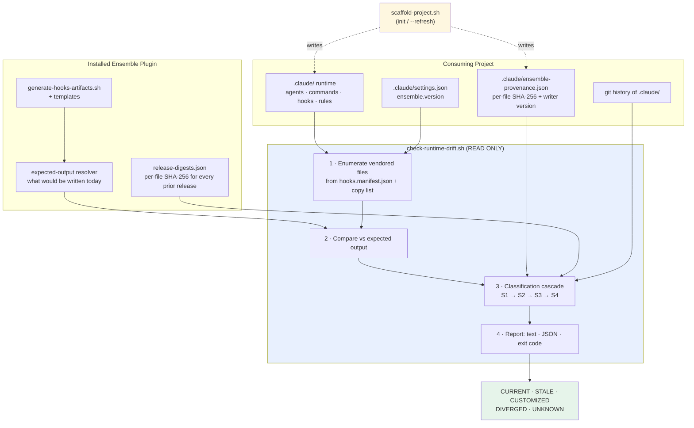
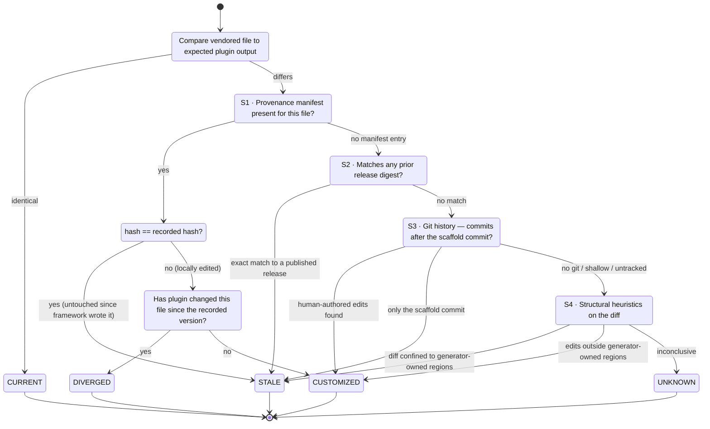
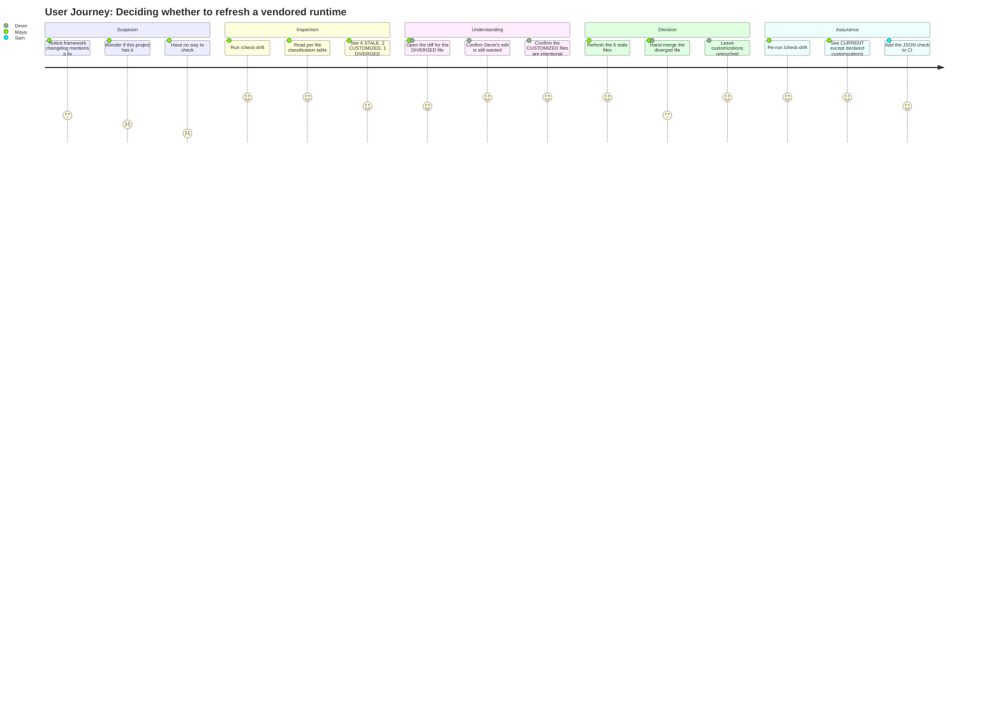

# PRD: Runtime Drift Detection

**Version**: 1.0.0
**Status**: Draft
**Created**: 2026-08-14
**Last Updated**: 2026-08-14
**Author**: @product-manager
**Stakeholders**: Ensemble vNext maintainers (Fortium Partners), project leads consuming the Ensemble plugin, contributors who customize a vendored runtime, CI owners

---

## Changelog

| Version | Date | Changes | Author |
|---------|------|---------|--------|
| 1.0.0 | 2026-08-14 | Initial PRD creation from feature request `runtime drift detection` | @product-manager |

---

## 1. Product Summary

### 1.1 Problem Statement

A project scaffolded from the Ensemble plugin carries a **vendored `.claude/` runtime** — commands, agents, hooks, rules, and `settings.json` — copied at a point in time by `/init-project` and committed to that project's git history. The vendored copy is the execution layer; `packages/` in the plugin repo is the generator layer and the source of truth. The two diverge from the moment scaffolding finishes.

Divergence has **two causes that demand opposite responses**:

1. **Stale** — the plugin moved on (4.1.9 → 4.1.15) and the project's copy did not. The correct response is *refresh*: pull the plugin's current output over the vendored file.
2. **Customized** — someone deliberately edited the vendored copy for that project's needs. The correct response is *preserve*: refreshing over it destroys real work.

A byte-level comparison sees these two as identical events: "file differs." Nothing in the framework today tells them apart, and nothing even performs the comparison at the project level:

- `generate-hooks-artifacts.sh --check` compares the **plugin's own** manifest against the **plugin's own** generated templates. It never opens a consuming project's `.claude/`.
- `runtime-refresh.sh` (SessionStart) compares only **version numbers** — `semver(plugin) > semver(.claude/settings.json → ensemble.version)` — and then hands off to `scaffold-project.sh --refresh`, which replaces components already present with no knowledge of whether the file it is about to overwrite was hand-edited.
- `check-version-sync.sh` verifies version consistency inside the plugin repo, not in consumers.

Two failures follow directly, and both have occurred in practice:

- **Silent staleness.** A project can sit two releases behind indefinitely — running retired hooks, missing corrected rules — with no signal whatsoever. The version guard in `runtime-refresh.sh` exits silently on the no-plugin path, which is exactly the CI and fresh-clone case.
- **Silent destruction.** A refresh overwrites a deliberate local edit with no warning, no diff, and no record that anything was lost. The only recovery is git archaeology, and only if the customization was committed.

The user's ask is precise: *"I want a way to ask a project 'what has drifted, and which kind is it?'"* — and, explicitly, *"How to tell them apart is the hard part and I don't have an answer — that's what I want designed."* The classification design is the deliverable, not an implementation detail.

### 1.2 Proposed Solution

A **read-only drift report** — a project-level command (`/check-drift`) backed by a deterministic script (`packages/core/scripts/check-runtime-drift.sh`) — that walks a project's vendored `.claude/` runtime, compares each file against what the currently installed plugin would generate, and assigns every difference one of five classifications with an explicit confidence level and the evidence behind it.

The classification problem is solved by a **cascade of independent provenance signals**, evaluated in order of decreasing certainty. Each signal is fallible on its own; the cascade is designed so that a project always lands somewhere honest, including `UNKNOWN`, rather than being forced into a guess:

| # | Signal | Answers | Available when |
|---|--------|---------|----------------|
| S1 | **Provenance manifest** — `.claude/ensemble-provenance.json`, a per-file SHA-256 of exactly what scaffold/refresh wrote, plus the plugin version that wrote it | "Has this file changed since the plugin last wrote it?" | Project scaffolded or refreshed at/after this feature ships |
| S2 | **Release-digest catalog** — a plugin-shipped table of per-file SHA-256 for every prior published plugin version | "Is this file byte-identical to some *earlier* official plugin output?" | Plugin installed and catalog present |
| S3 | **Git provenance** — commit history of the vendored file: is its only commit the scaffold/refresh commit, or are there subsequent human-authored commits? | "Did a person touch this file after the framework wrote it?" | Project is a git repo with the runtime committed |
| S4 | **Structural heuristics** — generated-artifact markers (generator banners, manifest-derived blocks), plus whether the diff is confined to regions the generator owns | "Does this diff look like generator output or like hand-editing?" | Always |

The decisive insight is **S2**: a vendored file whose content matches *any* historical plugin release exactly is, by construction, unmodified plugin output — it is stale, not customized, and no manifest or git history is needed to know it. That single signal delivers requirement 5 (*"work on a project whose runtime was scaffolded before this feature existed — no cooperation from the past"*) without any retroactive cooperation, because the past releases are the plugin's own artifacts and can be digested today.

Every file lands in exactly one bucket:

| Classification | Meaning | Recommended action (reported, never taken) |
|---|---|---|
| `CURRENT` | Matches installed plugin output | none |
| `STALE` | Differs from plugin; evidence says unmodified since the framework wrote it | safe to refresh |
| `CUSTOMIZED` | Differs from plugin; evidence says a person edited it | preserve — refresh would destroy work |
| `DIVERGED` | Both: locally edited *and* the plugin has since changed the same file | manual merge required |
| `UNKNOWN` | No signal reached a confident verdict | inspect the emitted diff yourself |

`UNKNOWN` is a first-class, deliberately visible outcome. A drift detector that hides its uncertainty behind a confident-looking label is worse than one that admits it, because the user acts on the label.

The tool is **strictly read-only** (requirement 3): it opens files, hashes them, shells out to `git log`, and prints. It never writes to `.claude/`, never stages, never commits, never refreshes. The provenance manifest that signal S1 reads is written by `scaffold-project.sh` — the tool that is *already* writing those files — and never by the reporting path.

When no plugin is installed (requirement 4), the tool degrades rather than failing: it cannot answer "differs from what the plugin would generate today," but it can still answer "differs from what the framework last wrote here" using S1 and S3 alone. It reports the local-modification set, states plainly that plugin comparison was unavailable and why, and exits with a distinct status. It must never render an absent plugin as "no drift found."

### 1.3 Value Proposition

**User value**

- A single, answerable question — *"what has drifted, and which kind is it?"* — gets a single, trustworthy answer, on demand, in seconds.
- Refresh becomes a decision rather than a gamble. The user sees exactly which files a refresh would overwrite and which of those hold real work, *before* running it.
- Deliberate customization stops being invisible. Today, a local edit to a vendored agent is indistinguishable from an old copy; afterwards it is labeled and preserved by intent.
- Projects stop silently rotting. "Two releases behind on four hook files" becomes a visible fact instead of a discovery made during an incident.

**Business value**

- Removes the most cited hazard of the vendored-runtime architecture. The two-layer design (generator/execution) is a deliberate architectural invariant of Ensemble vNext; the destructive-refresh risk is the price it charges, and this feature pays it down without changing the architecture.
- Makes automatic refresh safer to trust. `runtime-refresh.sh` currently refreshes on a version-number guard alone; a shared classification engine gives a future guard something substantive to consult.
- Auditable runtime state for consumers. A CI-runnable, machine-readable report lets a team assert "our runtime is current, except these three deliberate customizations" as a checked fact.
- Cheap to adopt: read-only, no migration, no change to how the runtime is version-controlled (explicitly excluded by the request), and useful on day one against projects that predate it.

### 1.4 Key Differentiators

- **Classification, not diffing.** Every existing check in this repo answers "different: yes/no." This answers "different: *why*," which is the only form of the answer a user can act on.
- **Retroactive by construction.** S2 requires nothing of past scaffolds. The evidence is the plugin's own release history, digested now.
- **Honest uncertainty.** `UNKNOWN` plus a printed diff, rather than a confident misclassification. Sized to the project's own constitution: reporting must not overstate what the evidence supports.
- **Read-only by architecture, not by discipline.** The write path (provenance manifest) lives in the tool that already writes; the read path has no write capability to misuse.
- **Deterministic.** Hashing, git plumbing, and table comparison — no LLM in the classification loop. Consistent with the framework's narrowed determinism claim: scripts, `lib/`, and generators stay deterministic and unit-tested.

### 1.5 Solution Architecture

The classification cascade itself, as a decision flow:

---

## 2. User Analysis

### 2.1 Target Users

| User Type | Description | Primary Need |
|-----------|-------------|--------------|
| Project maintainer (consumer) | Owns a project scaffolded from the Ensemble plugin; runs `/init-project`, lives with the vendored `.claude/` daily | Know before refreshing whether a refresh will destroy anything, and know when the project has fallen behind |
| Runtime customizer | Deliberately edits a vendored agent, command, or rule to fit one project (a stricter constitution, an extra hook) | Have that edit recognized as intentional and preserved, not silently reverted |
| Framework maintainer (Ensemble vNext) | Ships plugin releases; needs to know how consumers actually diverge | See the real distribution of drift so refresh policy and defaults are evidence-based |
| CI / release engineer | Runs automated checks on a repo containing a vendored runtime | A non-interactive, machine-readable, exit-code-bearing runtime status check |
| Onboarding contributor | Joins a project mid-life, inherits an unfamiliar `.claude/` | Understand which parts of this runtime are stock and which are project-specific |

### 2.2 User Personas

**Persona: Maya — Project Maintainer**
- **Role**: Tech lead on a product team that adopted Ensemble vNext eight months ago
- **Goals**: Keep the team's workflow runtime current; adopt framework fixes quickly; never lose the team's own tuning
- **Pain Points**: Has no idea which plugin version the project is really on beyond one number in `settings.json`; refuses to run a refresh because a teammate once lost a hand-tuned command and nobody noticed for a week; treats the vendored runtime as untouchable, which means the project is frozen on an old release
- **Technical Proficiency**: High

**Persona: Devin — Runtime Customizer**
- **Role**: Senior engineer who tightened the project's `verify-app` agent and added a domain-specific rule file
- **Goals**: Keep those edits; still benefit from upstream improvements to everything he did *not* touch
- **Pain Points**: His edits are indistinguishable from staleness to every tool in the framework; he has no way to declare "this one is mine"; he reviews every refresh by hand, which he does not have time for
- **Technical Proficiency**: High

**Persona: Priya — Framework Maintainer**
- **Role**: Maintains the Ensemble vNext plugin and its release cadence
- **Goals**: Ship changes that consumers actually receive; understand which files consumers customize so those become extension points rather than overwrite hazards
- **Pain Points**: Zero visibility into consumer runtimes; every refresh-related bug report arrives without the one fact that would explain it — what the consumer's runtime actually contained
- **Technical Proficiency**: High

**Persona: Sam — CI / Release Engineer**
- **Role**: Owns the GitHub Actions pipelines for several consuming repos
- **Goals**: Fail a build, or at least annotate it, when the vendored runtime has silently fallen behind
- **Pain Points**: Nothing to call; CI environments typically have **no plugin installed at all**, so any check must still produce a useful answer there rather than exiting silently
- **Technical Proficiency**: High

### 2.3 User Journey

---

## 3. Goals and Non-Goals

### 3.1 Goals

| ID | Goal | Success Metric | Priority |
|----|------|----------------|----------|
| G1 | Report, per file, whether the vendored copy differs from what the installed plugin would generate today | 100% of files in the scaffold copy list are enumerated and given a differs/identical verdict; no file silently skipped | P0 |
| G2 | Classify each difference as stale-and-refreshable vs deliberately-customized, with stated evidence and confidence | ≥ 95% correct classification on the labeled fixture corpus (§6 AC-T3); every verdict cites the signal (S1–S4) that produced it | P0 |
| G3 | Change nothing — reporting only | Automated test asserts zero filesystem mutations under the project root across every code path, including error paths | P0 |
| G4 | Produce a useful, clearly-labeled answer when no plugin is installed | Degraded-mode run on a plugin-free environment reports local-modification status and an explicit `plugin_available: false`; never reports "no drift" | P0 |
| G5 | Work on projects scaffolded before this feature existed, with no retroactive cooperation | Classification accuracy on the pre-manifest fixture corpus ≥ 85% with the remainder reported as `UNKNOWN`, never as a wrong confident verdict | P0 |
| G6 | Make the report consumable by both humans and machines | Text output readable at a glance; `--json` emits schema-valid output; exit codes distinguish clean / drift / degraded / error | P1 |
| G7 | Establish forward provenance so future runs are high-confidence | After one scaffold or refresh at/after this feature ships, ≥ 99% of files classify via S1 (highest-confidence signal) | P1 |
| G8 | Give the framework maintainer real data on how consumers diverge | JSON report includes an anonymizable summary suitable for aggregation | P2 |

### 3.2 Non-Goals (Explicit Scope Exclusions)

These items are **explicitly out of scope** for this PRD. Implementation agents will reference this list to reject scope creep.

| ID | Non-Goal | Rationale |
|----|----------|-----------|
| NG1 | Automatically fixing, refreshing, merging, or reverting drift | Stated verbatim in the request: *"Automatically fixing drift. I'll decide what to do with the report."* The tool reports; the human decides. Any auto-fix code path is a defect, not a feature. |
| NG2 | Any change to how the runtime is version-controlled | Stated verbatim in the request. The vendored `.claude/` stays committed to the consuming project's git exactly as it is today. No submodules, no ignore-file changes, no relocation. |
| NG3 | Changing `runtime-refresh.sh`'s existing four-guard refresh behavior | It is a separate, tested mechanism (`docs/TRD/runtime-refresh.md`). Consuming the classification engine from that hook is a candidate follow-up, deliberately not in this scope. Touching it here couples a read-only reporter to an auto-writing hook. |
| NG4 | An interactive merge/resolution UI for `DIVERGED` files | Out of the "reporting only" boundary. The tool prints the diff; the user's own tools merge. |
| NG5 | Detecting drift in anything outside the vendored runtime | Scope is `.claude/` (agents, commands, hooks, rules, skills, `settings.json`) plus `.claude/ensemble-provenance.json`. Application source, `docs/`, `.trd-state/`, and `CLAUDE.md` are user-owned by design and always differ; reporting them is noise. `CLAUDE.md` in particular is explicitly designated fast-layer, user/command-owned in the constitution. |
| NG6 | Network access of any kind | The tool must run offline, in CI, and inside sandboxes. All evidence comes from the local filesystem, the locally installed plugin, and local git. No fetching of release artifacts at runtime. |
| NG7 | A cross-project or fleet-wide drift dashboard | One project, one report, one invocation. Aggregation across repos is a separate product surface (G8 provides only the raw JSON that would feed one). |
| NG8 | Blocking, gating, or slowing session start | The reporter is user-invoked. It is not registered as a hook and adds nothing to the SessionStart path. |
| NG9 | Semantic/behavioral equivalence checking (e.g. "this reworded prompt still means the same thing") | Requires an LLM in the classification loop, which forfeits determinism and reproducibility. Classification is byte- and provenance-based only. |
| NG10 | Rewriting or migrating existing projects to add provenance data | Provenance appears as a natural byproduct of the next scaffold/refresh. G5/S2 exists precisely so no migration is needed. |

---

## 4. Feature Requirements

### 4.1 P0 - Core Features (Must Have)

#### F1: Per-File Drift Report

**Priority**: P0
**Description**: Enumerate every file the plugin would deliver into a project's vendored `.claude/`, compare each against the installed plugin's expected output, and emit a per-file verdict. The enumeration is driven by the same authority the scaffolder uses — `hooks.manifest.json`'s shippable copy list plus the `templates/claude-directory/` tree — so the reporter and the writer can never disagree about what "the runtime" is. Files present in the project but *not* in the plugin's delivery set are reported as `LOCAL_ONLY` (informational; never a drift error).

**User Stories**:
- As Maya, I want a per-file table of what has drifted so that I know exactly what a refresh would touch.
- As Priya, I want the enumeration derived from the manifest so that a newly shipped hook is covered without editing the reporter.
- As Sam, I want files that exist only in the project reported separately so that project-local additions are never mistaken for drift.

**Acceptance Criteria**:
- [ ] AC-F1.1: Every file in the plugin's shippable delivery set is enumerated and receives exactly one verdict; the count is printed and matches the manifest-derived expected count.
- [ ] AC-F1.2: A file present in the plugin's set but absent from the project is reported as `MISSING`, distinct from `STALE`.
- [ ] AC-F1.3: A file present in the project but not in the plugin's set is reported as `LOCAL_ONLY` and does not affect the drift exit code.
- [ ] AC-F1.4: Comparison is byte-exact SHA-256 on file contents; no whitespace or formatting normalization is applied.
- [ ] AC-F1.5: The enumeration source is `hooks.manifest.json` plus the templates tree — not a list hardcoded in the reporter; adding a shippable manifest entry causes it to appear in the report with no reporter change.
- [ ] AC-F1.6: `prompt`-type hook entries are enumerated by their `promptFile` artifact (`.claude/hooks/prompts/<promptFile>`), since their `file` value is an identifier and resolves to nothing on disk.

**Dependencies**: Installed plugin discovery (shared with `runtime-refresh.sh`'s guard 1); `hooks.manifest.json`.

---

#### F2: Provenance Manifest (Forward Signal S1)

**Priority**: P0
**Description**: `scaffold-project.sh` records, at init and at every `--refresh`, a `.claude/ensemble-provenance.json` containing the SHA-256 of each file **as written**, the plugin version that wrote it, and a timestamp. This is the highest-confidence signal: a later mismatch between a file's current hash and its recorded hash is direct, unambiguous evidence that something other than the framework changed it. **This file is written only by the scaffolder — never by the reporting tool** (see F4/G3).

**User Stories**:
- As Devin, I want the framework to record what it wrote so that my later edit is provably mine.
- As Maya, I want a refresh to update the record so that provenance stays accurate over time.
- As Priya, I want the record to carry the writing plugin version so that "how far behind" is answerable per file, not just per project.

**Acceptance Criteria**:
- [ ] AC-F2.1: After `scaffold-project.sh` (init or `--refresh`), `.claude/ensemble-provenance.json` exists and contains one entry per written file with `path`, `sha256`, `plugin_version`, `written_at`.
- [ ] AC-F2.2: `--refresh` updates entries only for files it actually replaced; entries for untouched files retain their original recorded version and hash.
- [ ] AC-F2.3: The file is deterministic — stable key ordering — so it diffs cleanly in the consuming project's git.
- [ ] AC-F2.4: A missing, malformed, or partially-written provenance file degrades the reporter to S2 rather than causing an error.
- [ ] AC-F2.5: The provenance file is itself excluded from drift classification (it is metadata about the runtime, not part of it).
- [ ] AC-F2.6: Writing provenance never fails a scaffold; on write error the scaffold completes and warns.

**Dependencies**: F1 (shared file enumeration); `scaffold-project.sh`.

---

#### F3: Classification Cascade (The Stale-vs-Customized Engine)

**Priority**: P0
**Description**: The core of the feature and the explicit design ask. For every file that differs from expected plugin output, evaluate signals S1 → S2 → S3 → S4 in order and emit the first confident verdict, together with the signal that produced it and a confidence level (`high` / `medium` / `low`). Never emit a confident verdict from a low-confidence signal; fall through to `UNKNOWN` instead.

- **S1 — Provenance (confidence: high).** Current hash == recorded hash ⇒ untouched since the framework wrote it ⇒ `STALE`. Hash differs from recorded ⇒ locally edited; then, if the plugin has *also* changed the file since the recorded version, ⇒ `DIVERGED`, else ⇒ `CUSTOMIZED`.
- **S2 — Release-digest catalog (confidence: high).** Content exactly matches the digest of this path in *any* published plugin release ⇒ it is verbatim official output of an older version ⇒ `STALE`, and the report names the matched version. This is the signal that makes pre-existing projects work (G5) with no cooperation from the past.
- **S3 — Git provenance (confidence: medium).** Inspect the vendored file's commit history: if its only commit is the scaffold/init commit (or a `--refresh` commit) and nothing since ⇒ `STALE`; if there are subsequent commits touching it ⇒ `CUSTOMIZED`. Uncommitted working-tree modifications count as edits ⇒ `CUSTOMIZED`.
- **S4 — Structural heuristics (confidence: low).** Generated files carry generator banners and manifest-derived blocks. A diff confined to generator-owned regions leans `STALE`; edits outside them lean `CUSTOMIZED`. Because confidence is low, S4 may only *break ties within* a bucket already suggested by weaker evidence; on its own it resolves to `UNKNOWN`.

**User Stories**:
- As Maya, I want each verdict to state its evidence so that I can decide how much to trust it.
- As Devin, I want an uncommitted hand-edit to classify as `CUSTOMIZED` even with no provenance file so that work-in-progress is never labeled refreshable.
- As Maya, I want files that are both edited and upstream-changed called out as `DIVERGED` so that I merge them instead of choosing blindly.
- As Priya, I want `UNKNOWN` to be a real outcome so that the tool never fabricates certainty.

**Acceptance Criteria**:
- [ ] AC-F3.1: Signals evaluate strictly in order S1 → S2 → S3 → S4; the first confident verdict wins and short-circuits the rest.
- [ ] AC-F3.2: Every reported verdict names the deciding signal (`s1_provenance` | `s2_release_digest` | `s3_git_history` | `s4_structural`) and a confidence of `high` | `medium` | `low`.
- [ ] AC-F3.3: A file matching a prior release digest classifies `STALE` and the report names the matched plugin version.
- [ ] AC-F3.4: A file whose hash differs from provenance **and** whose expected output changed since the recorded version classifies `DIVERGED`, not `CUSTOMIZED`.
- [ ] AC-F3.5: An uncommitted working-tree modification classifies `CUSTOMIZED` under S3 when S1/S2 are unavailable.
- [ ] AC-F3.6: When no signal is confident, the verdict is `UNKNOWN` and a unified diff is emitted so the user can judge; the tool never guesses `STALE` by default.
- [ ] AC-F3.7: Classification is deterministic — repeated runs on unchanged inputs produce byte-identical reports.
- [ ] AC-F3.8: S4 alone never produces `STALE` or `CUSTOMIZED` at `high` confidence.

**Dependencies**: F1, F2, F5.

---

#### F4: Read-Only Guarantee

**Priority**: P0
**Description**: The reporter performs no mutation of any kind under the project root: no writes, no creates, no deletes, no `chmod`, no git index or working-tree changes, no `.trd-state/` updates. Temporary work, if any, is confined to a system temp directory and removed. The guarantee is enforced by test, not by convention.

**User Stories**:
- As Maya, I want to run this on a dirty working tree with total confidence that it changes nothing.
- As Sam, I want to run it in CI against a checked-out repo without polluting the workspace or the diff.

**Acceptance Criteria**:
- [ ] AC-F4.1: A test snapshots the full project tree (paths, contents, mtimes) before and after a run and asserts byte-identical state, on both the success and every error path.
- [ ] AC-F4.2: Only read-only git plumbing is invoked (`git log`, `git status --porcelain`, `git cat-file`, `git ls-files`); no command that can write the index, refs, or working tree appears in the source.
- [ ] AC-F4.3: The tool runs successfully against a read-only filesystem mount of the project.
- [ ] AC-F4.4: The reporter contains no call path to `scaffold-project.sh`, `--refresh`, or any writer, direct or indirect.
- [ ] AC-F4.5: Any temp file is created under the OS temp dir and removed on exit, including on failure.

**Dependencies**: None.

---

#### F5: Degraded Mode — No Plugin Installed

**Priority**: P0
**Description**: When no Ensemble plugin is installed (the normal case in CI and fresh clones), the tool cannot compute "what would the plugin generate today." It must still answer the half of the question that is locally answerable: which vendored files have been modified since the framework wrote them (S1), or since they were committed (S3). It reports `plugin_available: false` prominently, states the consequence in plain language, lists what it could and could not determine, and exits with a distinct code. Rendering an absent plugin as "no drift found" is an explicit defect.

**User Stories**:
- As Sam, I want a useful runtime report from CI where no plugin is installed.
- As Maya, I want the tool to say plainly that it could not check against the plugin, rather than implying everything is fine.

**Acceptance Criteria**:
- [ ] AC-F5.1: With no plugin installed, the run completes successfully and prints a prominent `PLUGIN NOT INSTALLED — plugin comparison unavailable` banner.
- [ ] AC-F5.2: Local-modification classification (`CUSTOMIZED` vs unmodified) is still produced for every file with a provenance entry or git history.
- [ ] AC-F5.3: Files whose status cannot be determined without the plugin are reported as `UNKNOWN (requires plugin)` — never as `CURRENT`.
- [ ] AC-F5.4: The run exits with the dedicated degraded-mode code (`3`), distinct from clean (`0`), drift-found (`1`), and error (`2`).
- [ ] AC-F5.5: The recorded plugin version (from provenance and `settings.json → ensemble.version`) is reported so the user knows what the runtime came from.
- [ ] AC-F5.6: No output in degraded mode asserts or implies "no drift."

**Dependencies**: F1, F2, F3.

---

#### F6: Retroactive Support for Pre-Existing Runtimes

**Priority**: P0
**Description**: Requirement 5 — the tool must work on a project scaffolded before this feature existed, with no cooperation from the past. Delivered by S2 (release-digest catalog) and S3 (git provenance), neither of which requires anything to have been recorded at scaffold time. S2 in particular is decisive: a byte-exact match against any prior release proves unmodified plugin output.

**User Stories**:
- As Maya, whose project was scaffolded at 4.0.2, I want a real classification today without re-scaffolding first.
- As Priya, I want the retroactive path to reuse the plugin's own release history rather than requiring a migration of consumer projects.

**Acceptance Criteria**:
- [ ] AC-F6.1: A project with no `.claude/ensemble-provenance.json` produces a full report using S2/S3/S4.
- [ ] AC-F6.2: On the pre-manifest fixture corpus, ≥ 85% of files receive a correct confident verdict and the remainder are `UNKNOWN`; zero files receive a *wrong* confident verdict.
- [ ] AC-F6.3: The report states which signal tier was used, so the user knows the answer is inferred rather than recorded.
- [ ] AC-F6.4: No prompt, migration step, or write is required to enable retroactive classification.
- [ ] AC-F6.5: A project that is not a git repository still produces a report via S2/S4, with S3 reported as unavailable.

**Dependencies**: F3, F7.

---

### 4.2 P1 - Enhanced Features (Should Have)

#### F7: Release-Digest Catalog

**Priority**: P1
**Description**: A plugin-shipped `release-digests.json` mapping `{plugin_version → {path → sha256}}` for every published release, generated at release time by extending `generate-hooks-artifacts.sh`. This is the data behind S2 and therefore the backbone of retroactive classification (F6). Shipped as static data; never fetched at runtime (NG6). Classified P1 because S3/S4 provide a working, lower-confidence fallback if it is absent — but F6's accuracy target depends on it.

**User Stories**:
- As Priya, I want each release to publish its own digests so that retroactive classification improves automatically over time.
- As Maya, I want the report to tell me *which* old version my file came from, not just that it is old.

**Acceptance Criteria**:
- [ ] AC-F7.1: `release-digests.json` is generated by the existing generator and validated by `--check` like the other generated artifacts.
- [ ] AC-F7.2: It covers every shippable file for every published version from the earliest digestible release forward.
- [ ] AC-F7.3: The reporter functions with the catalog missing or truncated, degrading to S3/S4 and saying so.
- [ ] AC-F7.4: Catalog lookup is O(1) per file and adds < 200 ms to a full run.
- [ ] AC-F7.5: An S2 match reports the matched version string.

**Dependencies**: F3; `generate-hooks-artifacts.sh`.

---

#### F8: Machine-Readable Output and Exit Codes

**Priority**: P1
**Description**: `--json` emits a schema-stable report (tool version, plugin availability, per-file records with path, verdict, signal, confidence, hashes, matched version) for CI and aggregation. Exit codes: `0` clean, `1` drift found, `2` error, `3` degraded (no plugin). `--fail-on <classification>` lets CI choose which classifications are build-failing — e.g. fail on `STALE` and `DIVERGED`, tolerate `CUSTOMIZED`.

**User Stories**:
- As Sam, I want to fail the build on staleness while tolerating declared customizations.
- As Priya, I want stable JSON so aggregation tooling does not break every release.

**Acceptance Criteria**:
- [ ] AC-F8.1: `--json` output validates against a committed JSON schema.
- [ ] AC-F8.2: Exit codes follow the 0/1/2/3 contract exactly and are covered by tests.
- [ ] AC-F8.3: `--fail-on` accepts a comma-separated classification list and controls only the exit code, never the report contents.
- [ ] AC-F8.4: JSON mode writes nothing but JSON to stdout; all diagnostics go to stderr.
- [ ] AC-F8.5: The JSON schema carries a version field and changes are additive within a major version.

**Dependencies**: F1, F3, F5.

---

#### F9: `/check-drift` Command Surface

**Priority**: P1
**Description**: A vendored workflow command wrapping the script, with the framework's standard flags (`--json`, `--verbose`, `--diff`, `--fail-on`) and a human-readable grouped summary. It obeys the project's command contracts: autonomous execution, and a terminating `═══ COMMAND COMPLETE: /check-drift ═══` banner as the last line of its final turn.

**User Stories**:
- As Maya, I want to type `/check-drift` in a session and read the answer immediately.
- As Maya, I want the command to complete on its own without asking me to confirm anything mid-run.

**Acceptance Criteria**:
- [ ] AC-F9.1: `/check-drift` runs end-to-end with no user prompts and emits the `═══ COMMAND COMPLETE: /check-drift ═══` banner as its final line.
- [ ] AC-F9.2: Output groups files by classification with counts, most actionable group first.
- [ ] AC-F9.3: `--diff` prints unified diffs for `DIVERGED` and `UNKNOWN` files.
- [ ] AC-F9.4: The command is delivered by `scaffold-project.sh` into `.claude/commands/` like every other vendored command.
- [ ] AC-F9.5: The command embeds the autonomy block required of non-refine commands.

**Dependencies**: F1–F5, F8.

---

### 4.3 P2 - Future Features (Nice to Have)

#### F10: Declared-Customization File

**Priority**: P2
**Description**: An optional `.claude/ensemble-customizations.json` in which a maintainer explicitly declares "this file is deliberately ours," turning an inferred `CUSTOMIZED` verdict into a stated one. Raises confidence and gives a future refresh mechanism something authoritative to respect — without this PRD changing refresh behavior (NG3).

**User Stories**:
- As Devin, I want to declare my customizations so no future tool has to guess.

**Acceptance Criteria**:
- [ ] AC-F10.1: A declared file classifies `CUSTOMIZED` at high confidence regardless of other signals, with signal `declared`.
- [ ] AC-F10.2: The declaration file is optional; absence changes nothing.
- [ ] AC-F10.3: A declaration for a path the plugin no longer ships is reported as stale-declaration, not an error.

**Dependencies**: F3.

---

#### F11: Hunk-Level Attribution for `DIVERGED` Files

**Priority**: P2
**Description**: For a file that is both locally edited and upstream-changed, attribute individual diff hunks to "yours" vs "upstream," so the merge is scoped rather than whole-file.

**User Stories**:
- As Maya, I want to see exactly which lines are mine and which are the plugin's before merging.

**Acceptance Criteria**:
- [ ] AC-F11.1: For a `DIVERGED` file with a provenance entry, hunks are labeled `local` or `upstream` using the recorded base version as the common ancestor.
- [ ] AC-F11.2: Overlapping hunks are labeled `conflict` and never silently attributed to one side.

**Dependencies**: F3, F7.

---

#### F12: Drift Summary for Framework Maintainers

**Priority**: P2
**Description**: An anonymizable aggregate block in the JSON report (counts by classification, per-path customization frequency, version lag distribution) that a consuming team can voluntarily share so the framework maintainer learns which files are customized often enough to deserve real extension points.

**User Stories**:
- As Priya, I want evidence about which vendored files consumers keep editing.

**Acceptance Criteria**:
- [ ] AC-F12.1: The summary contains no file contents, diffs, or project-identifying paths outside `.claude/`.
- [ ] AC-F12.2: It is emitted only under an explicit opt-in flag.

**Dependencies**: F8.

---

## 5. Technical Requirements

### 5.1 Performance Requirements

| Metric | Target | Measurement |
|--------|--------|-------------|
| Full-report wall time, typical runtime (~60 files) | < 3 s | Timed run on the reference fixture project |
| Full-report wall time, large runtime (~500 files) | < 10 s | Timed run on the synthetic large fixture |
| Degraded mode (no plugin) | < 1 s | Timed run with plugin discovery failing |
| Per-file hashing | < 5 ms/file | Micro-benchmark over the fixture corpus |
| Release-digest lookup | O(1) per file, < 200 ms total | AC-F7.4 benchmark |
| Peak memory | < 100 MB | Measured on the 500-file fixture |
| Git history queries | ≤ 1 process invocation per file, batched where possible | Process-count assertion in test |

### 5.2 Security Requirements

- No network access on any code path (NG6); enforced by test and by code review.
- All shell scripts use `set -euo pipefail` and quote every variable expansion, per the project's shell-safety standard.
- Path traversal prevention: every resolved path must normalize to within the project root or the discovered plugin root; anything outside is refused, not followed.
- No symlink following outside the project root when enumerating `.claude/` (a vendored symlink pointing at `/etc` must not be read).
- Subprocess invocation passes arguments as arrays, never string-interpolated shell (the project's `spawnSync`-over-`execSync` rule).
- File-size and file-count limits (10 MB per file, 1000 files) to bound work on a pathological tree; exceeding a limit is reported, not silently truncated.
- The report must not print file contents for anything outside `.claude/`, and `--json` must not embed secrets: `settings.local.json` and any gitignored local settings are excluded from the report entirely.
- No secrets, tokens, or absolute home paths in committed fixtures.

### 5.3 Accessibility Requirements

- WCAG 2.1 AA is not applicable — there is no graphical UI. The terminal-output equivalents apply:
  - Classification is conveyed by an explicit text label (`STALE`, `CUSTOMIZED`, …), never by color alone.
  - All color output is suppressed when stdout is not a TTY and when `NO_COLOR` is set.
  - Output remains legible at 80 columns; tables degrade to a list rather than wrapping into unreadability.
  - `--json` provides a complete non-visual equivalent of every fact in the text report.

### 5.4 Scalability Requirements

- Linear in the number of vendored files; no quadratic comparison across releases (digest lookup is a hash-map hit, not a scan).
- The release-digest catalog grows one entry-set per release; it must stay under 5 MB at 100 releases, with older entries prunable by policy without breaking the reporter.
- A single run must not spawn more than one git process per file, and should batch history queries where git allows.

### 5.5 Integration Requirements

| System | Integration Type | Notes |
|--------|-----------------|-------|
| `scaffold-project.sh` | Write-side integration | Writes `.claude/ensemble-provenance.json` on init and `--refresh` (F2). The only writer. |
| `generate-hooks-artifacts.sh` | Build-time generation | Generates and `--check`-validates `release-digests.json` (F7). |
| `hooks.manifest.json` | Data source | Authoritative enumeration of shippable files, including `promptFile` artifacts for prompt-type entries (AC-F1.6). |
| `runtime-refresh.sh` | Shared library only | Reuses plugin-discovery logic. Its refresh behavior is unchanged (NG3). |
| `.claude/settings.json` (`ensemble.version`) | Read-only input | Project's recorded plugin version; cross-checked against provenance. |
| Local git | Read-only plumbing | S3 evidence. Absence degrades gracefully (AC-F6.5). |
| BATS test suite | Verification | Shell-side unit and integration tests. |
| GitHub Actions | Consumer | Exit codes and `--json` drive CI checks (F8). |

---

## 6. Acceptance Criteria Summary

### Feature Acceptance Criteria

| ID | Feature | Criterion | Verification Method |
|----|---------|-----------|---------------------|
| AC-F1.1 | F1 | Every shippable file enumerated with exactly one verdict; count printed and matches manifest | BATS integration |
| AC-F1.2 | F1 | Plugin file absent from project reported `MISSING`, distinct from `STALE` | BATS integration |
| AC-F1.3 | F1 | Project-only file reported `LOCAL_ONLY`, no effect on exit code | BATS integration |
| AC-F1.4 | F1 | Byte-exact SHA-256 comparison, no normalization | BATS unit |
| AC-F1.5 | F1 | Enumeration derived from manifest, not hardcoded | BATS integration (add fixture manifest entry) |
| AC-F1.6 | F1 | Prompt-type entries enumerated via `promptFile` artifact | BATS unit |
| AC-F2.1 | F2 | Provenance file written with path/sha256/plugin_version/written_at | BATS integration |
| AC-F2.2 | F2 | `--refresh` updates only replaced files' entries | BATS integration |
| AC-F2.3 | F2 | Deterministic key ordering | BATS unit |
| AC-F2.4 | F2 | Malformed provenance degrades to S2, no error | BATS unit |
| AC-F2.5 | F2 | Provenance file excluded from its own classification | BATS unit |
| AC-F2.6 | F2 | Provenance write failure warns, never fails scaffold | BATS unit |
| AC-F3.1 | F3 | Signals evaluate S1→S2→S3→S4, first confident verdict wins | BATS unit (per-signal fixtures) |
| AC-F3.2 | F3 | Every verdict names deciding signal and confidence | BATS integration |
| AC-F3.3 | F3 | Prior-release digest match ⇒ `STALE` + matched version named | BATS unit |
| AC-F3.4 | F3 | Edited + upstream-changed ⇒ `DIVERGED` | BATS unit |
| AC-F3.5 | F3 | Uncommitted edit ⇒ `CUSTOMIZED` under S3 | BATS integration (git fixture) |
| AC-F3.6 | F3 | No confident signal ⇒ `UNKNOWN` + diff; never defaults to `STALE` | BATS unit |
| AC-F3.7 | F3 | Repeated runs byte-identical | BATS integration |
| AC-F3.8 | F3 | S4 alone never yields high confidence | BATS unit |
| AC-F4.1 | F4 | Tree snapshot identical before/after, success and error paths | BATS integration |
| AC-F4.2 | F4 | Only read-only git plumbing invoked | Static source scan + BATS |
| AC-F4.3 | F4 | Runs against read-only mount | BATS integration |
| AC-F4.4 | F4 | No call path to any writer | Static source scan |
| AC-F4.5 | F4 | Temp files under OS temp dir, removed on exit incl. failure | BATS integration |
| AC-F5.1 | F5 | No-plugin run succeeds with prominent banner | BATS integration |
| AC-F5.2 | F5 | Local-modification classification still produced | BATS integration |
| AC-F5.3 | F5 | Undeterminable files ⇒ `UNKNOWN (requires plugin)`, never `CURRENT` | BATS unit |
| AC-F5.4 | F5 | Exit code 3 in degraded mode | BATS unit |
| AC-F5.5 | F5 | Recorded plugin version reported | BATS integration |
| AC-F5.6 | F5 | No output implies "no drift" in degraded mode | BATS integration (output assertion) |
| AC-F6.1 | F6 | Full report with no provenance file | BATS integration (legacy fixture) |
| AC-F6.2 | F6 | ≥ 85% correct confident verdicts on pre-manifest corpus; zero wrong confident verdicts | Corpus test |
| AC-F6.3 | F6 | Signal tier stated in report | BATS integration |
| AC-F6.4 | F6 | No migration or write required | BATS integration + AC-F4.1 |
| AC-F6.5 | F6 | Non-git project still reports via S2/S4 | BATS integration |
| AC-F7.1 | F7 | Catalog generated and `--check`-validated by the generator | BATS |
| AC-F7.2 | F7 | Covers every shippable file for every published version | Generator test |
| AC-F7.3 | F7 | Missing catalog degrades to S3/S4 and says so | BATS unit |
| AC-F7.4 | F7 | O(1) lookup, < 200 ms total | Benchmark |
| AC-F7.5 | F7 | Matched version string reported | BATS unit |
| AC-F8.1 | F8 | `--json` validates against committed schema | Schema validation test |
| AC-F8.2 | F8 | Exit codes 0/1/2/3 exact | BATS unit |
| AC-F8.3 | F8 | `--fail-on` affects exit code only | BATS unit |
| AC-F8.4 | F8 | JSON mode: only JSON on stdout | BATS unit |
| AC-F8.5 | F8 | Schema versioned, additive within major | Review + schema test |
| AC-F9.1 | F9 | Command autonomous; `═══ COMMAND COMPLETE ═══` is final line | Manual + session-log review |
| AC-F9.2 | F9 | Grouped output, most actionable first | Manual |
| AC-F9.3 | F9 | `--diff` prints diffs for `DIVERGED`/`UNKNOWN` | BATS integration |
| AC-F9.4 | F9 | Command delivered by scaffolder into `.claude/commands/` | BATS (scaffold test) |
| AC-F9.5 | F9 | Autonomy block embedded in command prompt | BATS (contract test) |
| AC-F10.1 | F10 | Declared file ⇒ `CUSTOMIZED` high confidence, signal `declared` | BATS unit |
| AC-F10.2 | F10 | Declaration file optional | BATS unit |
| AC-F10.3 | F10 | Declaration for unshipped path ⇒ stale-declaration, not error | BATS unit |
| AC-F11.1 | F11 | Hunks labeled `local`/`upstream` from recorded base | BATS unit |
| AC-F11.2 | F11 | Overlapping hunks labeled `conflict` | BATS unit |
| AC-F12.1 | F12 | Summary carries no contents/diffs/identifying paths | BATS unit |
| AC-F12.2 | F12 | Emitted only under explicit opt-in flag | BATS unit |

### Technical Acceptance Criteria

| ID | Requirement | Criterion | Verification Method |
|----|-------------|-----------|---------------------|
| AC-T1 | Performance | Full report < 3 s on ~60-file runtime; < 10 s on 500-file fixture | Benchmark in CI |
| AC-T2 | Security | Zero network calls on any path; no unquoted expansions; `set -euo pipefail` present | Static scan + sandboxed network-denied run |
| AC-T3 | Classification accuracy | ≥ 95% correct on the labeled full-signal corpus; ≥ 85% with zero wrong confident verdicts on the pre-manifest corpus | Labeled-corpus test |
| AC-T4 | Read-only | Byte-identical project tree before/after across all paths | Snapshot test (see AC-F4.1) |
| AC-T5 | Determinism | Identical inputs ⇒ byte-identical output across 10 consecutive runs | Repeat-run test |
| AC-T6 | Path safety | Paths outside project/plugin root refused; no symlink escape | BATS unit with adversarial fixtures |
| AC-T7 | Coverage | Unit ≥ 60%, integration ≥ 50% per the project quality gate | Coverage report |
| AC-T8 | Accessibility | No color-only meaning; color suppressed for non-TTY and `NO_COLOR`; legible at 80 cols | BATS output assertions |
| AC-T9 | Robustness | Malformed provenance, truncated catalog, shallow clone, detached HEAD, non-git project all produce a report rather than a crash | BATS unit matrix |
| AC-T10 | Scale | 500-file fixture under 100 MB peak memory, ≤ 1 git process per file | Benchmark |

---

## 7. Risk Assessment

| ID | Risk | Likelihood | Impact | Mitigation Strategy |
|----|------|------------|--------|---------------------|
| R1 | **Misclassification destroys work** — a genuinely customized file is labeled `STALE`, the user refreshes on that advice, and the customization is lost | Medium | High | Asymmetric conservatism: never emit `STALE` from a low-confidence signal (AC-F3.8); default to `UNKNOWN` with a diff (AC-F3.6). Uncommitted edits always classify `CUSTOMIZED` (AC-F3.5). Labeled-corpus accuracy gate (AC-T3) counts a wrong `STALE` as the most severe failure class. The tool never acts (NG1), so a bad label costs a review, not data — provided the user reads it. |
| R2 | **Release-digest catalog cannot be built for old releases** — pre-4.x artifacts are not reconstructible, weakening S2 exactly where retroactive support matters most | Medium | High | Build the catalog from plugin git tags at generation time; where a release cannot be digested, record the gap explicitly and let the reporter say "no catalog coverage before vX" rather than silently returning no-match (which would read as `CUSTOMIZED`). S3 covers the gap at medium confidence. Reclassify F7 as P0 if coverage falls below the F6 accuracy target. |
| R3 | **Git-history signal is unavailable or misleading** — shallow clones, squashed history, detached HEAD, vendored runtime committed in a single "initial commit" | High | Medium | Treat S3 as medium confidence by design; detect shallow clones (`git rev-parse --is-shallow-repository`) and downgrade rather than trusting. Never let S3 alone produce a `STALE` verdict that contradicts an S1/S2 signal. Report S3 unavailability explicitly (AC-F6.5). |
| R4 | **Read-only guarantee erodes over time** — a future contributor adds a convenience "fix it for me" flag, and the tool starts writing | Medium | High | Enforce by test, not convention (AC-F4.1/4.4): tree-snapshot assertion plus a static scan forbidding writer call paths. NG1 states the prohibition in the artifact that implementation agents consult for scope. |
| R5 | **Provenance file becomes a merge-conflict magnet** — a committed per-file hash list conflicts on every branch that refreshes | Medium | Medium | Deterministic ordering and one-line-per-file layout so conflicts are line-local and mechanically resolvable (AC-F2.3). Document that regenerating via `--refresh` resolves any conflict. Absence or corruption is a graceful degrade, never an error (AC-F2.4). |
| R6 | **Generated-file churn produces false `CUSTOMIZED`** — non-deterministic generator output (timestamps, ordering) makes untouched files look edited | Medium | Medium | The generator is already deterministic and `--check`-validated; add a fixture asserting byte-stability of generated output across runs. Where a field is genuinely volatile, exclude that region from comparison and document the exclusion in S4's generator-owned regions. |
| R7 | **Scope creep into auto-fix** — the report makes the next step obvious and someone implements it here | Medium | Medium | NG1 and NG3 are explicit and specific. `/implement-trd` reads non-goals to reject scope creep. Auto-fix is a separate PRD with its own risk review. |
| R8 | **Degraded mode is misread as a clean bill of health** — CI sees a successful run and assumes no drift | Medium | High | Distinct exit code 3 (AC-F5.4), prominent banner (AC-F5.1), explicit prohibition on "no drift" phrasing (AC-F5.6), and `UNKNOWN (requires plugin)` rather than `CURRENT` for undeterminable files (AC-F5.3). |
| R9 | **Enumeration drifts from the scaffolder** — the reporter checks a set of files that no longer matches what the scaffolder delivers | Low | High | Single source of truth: both derive the file set from `hooks.manifest.json` (AC-F1.5). A test asserts the two enumerations are identical. |
| R10 | **Report volume overwhelms** — a very stale project produces a wall of output nobody reads, defeating the purpose | Medium | Low | Group by classification with counts, most actionable first (AC-F9.2); full detail behind `--verbose`/`--diff`; `--json` for machines. |
| R11 | **Performance regression on large runtimes** makes the tool skipped in practice | Low | Medium | Explicit budgets (AC-T1, AC-T10) enforced by CI benchmark on a 500-file fixture. |
| R12 | **`settings.json` is genuinely both generated and user-owned** — it carries a generated hook block *and* legitimate project configuration, so whole-file classification is wrong for it | High | Medium | Treat `settings.json` as a structured special case in S4: compare the generator-owned hook block separately from the rest, and classify the file by the hook block while reporting user-region edits as informational. Document the exception; if hunk-level attribution (F11) lands, generalize it. |

### Contingency Plans

**R1 Contingency** (misclassification destroys work): If the labeled corpus shows any wrong-`STALE` verdict at high confidence, disable that signal's ability to emit `STALE` and force those cases to `UNKNOWN` until the signal is corrected. Ship with the accuracy gate as a hard release blocker rather than a target. If field reports of lost work appear despite this, add a mandatory pre-refresh backup recommendation to the report text — still reporting, not acting.

**R2 Contingency** (catalog coverage gap): If digests cannot be reconstructed for releases older than the project's own scaffold version, promote F7 to P0 for the reachable range and ship the reporter with an explicit "catalog covers vX.Y.Z onward" statement. Projects older than the coverage floor fall to S3/S4 and receive proportionally more `UNKNOWN` verdicts — an honest outcome that still satisfies requirement 5's "produce a useful answer," which is not the same as "produce a certain answer."

**R4 Contingency** (read-only erosion): If a write path is ever discovered in the reporter, treat it as a P0 defect, revert it, and add the specific call to the static-scan denylist. The read-only property is the feature's licence to be run casually; losing it makes the tool as scary as the refresh it exists to de-risk.

**R8 Contingency** (degraded mode misread): If CI adoption shows teams treating exit 3 as success, change the default so that degraded mode exits non-zero unless `--allow-degraded` is passed explicitly, making the "I know the plugin is absent" acknowledgement deliberate.

**R12 Contingency** (`settings.json` special case): If structured region comparison proves unreliable, classify `settings.json` as `UNKNOWN` by default with a mandatory diff, rather than risking a `STALE` verdict on a file that reliably contains user configuration.

---

## Appendices

### Appendix A: Glossary

| Term | Definition |
|------|------------|
| Vendored runtime | The copy of the Ensemble execution layer committed into a consuming project at `.claude/` — agents, commands, hooks, rules, skills, settings |
| Generator layer | The plugin itself (`packages/`), which produces what the vendored runtime contains |
| Drift | Any byte-level difference between a vendored file and what the installed plugin would generate for that path today |
| Stale | Drift caused by the plugin advancing while the project's copy did not; the vendored file is unmodified plugin output of an older version |
| Customized | Drift caused by a deliberate local edit to the vendored copy |
| Diverged | Both at once — locally edited *and* changed upstream since the local edit's base version |
| Provenance manifest | `.claude/ensemble-provenance.json`; per-file SHA-256 plus writing plugin version, recorded by the scaffolder |
| Release-digest catalog | `release-digests.json`; plugin-shipped per-file hashes for every published release, the basis of retroactive classification |
| Signal (S1–S4) | An independent source of provenance evidence used by the classification cascade |
| Confidence | `high` / `medium` / `low`, attached to every verdict; low-confidence signals may not emit confident verdicts |
| Degraded mode | Operation with no plugin installed; local-modification evidence only, exit code 3 |
| Shippable | A `hooks.manifest.json` flag marking a file the scaffolder copies into a consuming project |

### Appendix B: Related Documents

- `.claude/rules/constitution.md` — project absolutes, two-layer architecture, vendored-runtime invariant, prohibited patterns
- `.claude/rules/stack.md` — shell/BATS/Node stack this feature must be built on
- `.claude/rules/command-status.md` — the `COMMAND COMPLETE` banner contract F9 must honor
- `.claude/rules/autonomy.md` — autonomous-execution discipline F9 must embed
- `docs/TRD/runtime-refresh.md` — the existing four-guard SessionStart refresh mechanism (unchanged by this PRD, NG3)
- `packages/core/hooks/hooks.manifest.json` — the enumeration authority for F1
- `packages/core/scripts/scaffold-project.sh` — the write-side integration point for F2
- `packages/core/scripts/generate-hooks-artifacts.sh` — the generator extended by F7

### Appendix C: Open Questions

| Question | Status | Resolution |
|----------|--------|------------|
| How far back can the release-digest catalog reach? | Open | Determined at implementation from the plugin's tag history; the reporter must state its coverage floor either way (R2) |
| Should `settings.json` be classified as a whole or region-by-region? | Resolved | Region-by-region — the generated hook block decides the classification, user regions are reported informationally (R12) |
| Should degraded mode exit 0 or non-zero by default? | Resolved | Exit 3 by default, distinct from both success and failure; revisit via R8 contingency if CI treats it as success |
| Should `runtime-refresh.sh` consult the classification engine before refreshing? | Open | Explicitly deferred — NG3 keeps it out of this scope; strong candidate for the immediate follow-up PRD |
| Is a declared-customization file needed at v1? | Resolved | No — F10 is P2; S1–S3 infer well enough to ship, and a declaration format is easier to design once real drift data exists |
| Should skills under `.claude/skills/` be in scope? | Resolved | Yes, when scaffolder-delivered (they are in the shippable set); user-added skills classify `LOCAL_ONLY` |
