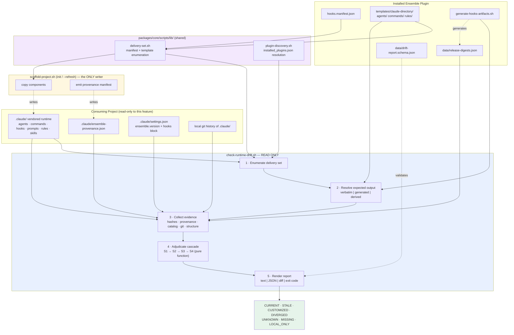
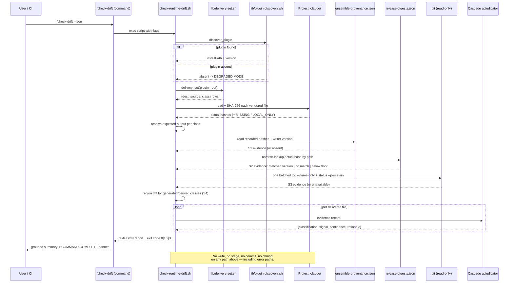
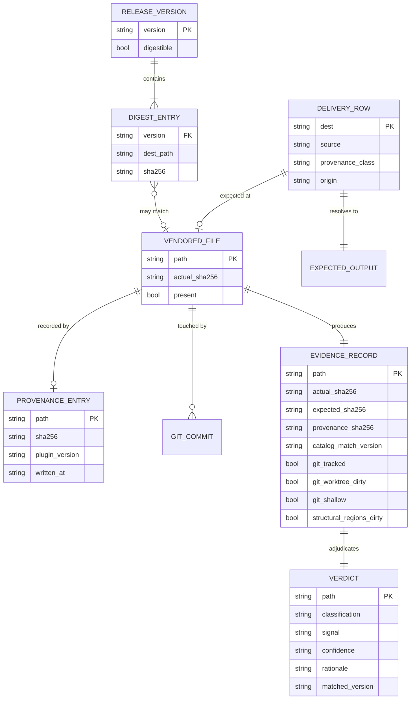

# TRD: Runtime Drift Detection

**Version**: 1.0.0
**Status**: Draft
**Created**: 2026-08-14
**Last Updated**: 2026-08-14
**Author**: @technical-architect
**Source PRD**: [docs/modernization/runs/ab-test/old/PRD.md](./PRD.md)
**Task ID Prefix**: DRIFT

---

## Changelog

| Version | Date | Changes | Author |
|---------|------|---------|--------|
| 1.0.0 | 2026-08-14 | Initial TRD creation | @technical-architect |

---

## 1. Overview

### 1.1 Technical Summary

Runtime Drift Detection adds a **read-only, deterministic reporter** to the Ensemble vNext
plugin that answers, per file in a consuming project's vendored `.claude/` runtime: *does this
differ from what the installed plugin would generate today, and if so, why?*

The implementation is a single POSIX-compatible Bash script,
`packages/core/scripts/check-runtime-drift.sh`, following the established convention in this
repository for non-trivial scripts: Bash owns process control, file walking, git plumbing and
output formatting; embedded `python3` heredocs own every JSON parse, hash-map lookup and
structured emission. That split is not new — `scaffold-project.sh` and `runtime-refresh.sh`
already use it, and reusing it keeps the reporter dependency-free (Python 3 is already a
declared runtime dependency in `stack.md`) while avoiding fragile shell JSON parsing.

Three architectural commitments shape everything else:

1. **One enumeration authority.** The reporter and `scaffold-project.sh` must never disagree
   about what "the runtime" is (PRD R9). Rather than duplicating the manifest-walking logic
   that currently lives inline in `scaffold-project.sh` (`manifest_shippable_hooks()`,
   `manifest_shippable_prompts()`), that logic is **extracted** into a shared library,
   `packages/core/scripts/lib/delivery-set.sh`, which both scripts source. A test asserts the
   two callers produce identical sets.
2. **The write path and the read path are different programs.** The provenance manifest
   (signal S1) is written by `scaffold-project.sh`, which is already the only writer of the
   vendored runtime. `check-runtime-drift.sh` has no code path — direct or transitive — that
   reaches a writer. This is what makes G3/F4 a structural property rather than a discipline.
3. **The cascade is a pure function.** Signal evaluation (S1→S2→S3→S4) takes a record of
   already-collected evidence and returns `(classification, signal, confidence)`. Evidence
   collection (hashing, git queries, catalog lookup) is separated from adjudication so the
   adjudicator can be unit-tested against synthetic evidence records without building a
   filesystem fixture for every branch — which matters given AC-T3's labeled-corpus accuracy
   gate.

The one genuinely hard design problem the PRD delegates — *how the reporter knows what the
plugin "would generate today"* — is resolved by an **expected-output resolver** that
distinguishes three provenance classes of shipped file, because they are not comparable the
same way:

| Class | Example | Expected output is |
|---|---|---|
| **Verbatim** | agents, commands, rules, hook scripts, hook prompt files | the plugin-side source file, byte-for-byte |
| **Generated** | `.claude/settings.json` hooks block, `init-project.md` hook table | the output of `generate-hooks-artifacts.sh` for that path |
| **Derived** | `.claude/settings.json` outside the hooks block; agent files after `inject_agent_skills()` | template + per-project derivation; **region-scoped comparison only** |

Only the derived class needs region logic, and PRD R12 already anticipated it for
`settings.json`. The resolver makes that a declared property of each path rather than a
special case buried in a conditional.

### 1.2 Key Technical Decisions

| Decision | Choice | Rationale | Alternatives Considered |
|----------|--------|-----------|------------------------|
| Implementation language | Bash + embedded `python3` heredocs | Matches `scaffold-project.sh` / `runtime-refresh.sh` precedent exactly; `stack.md` already declares both; no new dependency; shell owns the git plumbing naturally | Pure Node.js (adds a second runtime to a script that must run where only the plugin is unpacked); pure Bash (JSON parsing in shell is the exact fragility this repo already rejected) |
| Enumeration source | Extract `manifest_shippable_hooks()` / `manifest_shippable_prompts()` into `lib/delivery-set.sh`, sourced by both scaffolder and reporter | Single source of truth is the stated mitigation for R9. Duplicating the walk guarantees eventual divergence | Reporter re-implements the walk (rejected: R9); reporter shells out to `scaffold-project.sh --list` (rejected: puts a writer on the reporter's call path, violating AC-F4.4) |
| Plugin discovery | Extract `runtime-refresh.sh`'s guards-1+4 python helper into `lib/plugin-discovery.sh` | PRD §5.5 mandates "shared library only"; the discovery logic (parse `installed_plugins.json`, find `full@ensemble-vnext`, verify `installPath` exists) is already correct and tested | Reporter duplicates discovery (divergence risk); reporter calls `runtime-refresh.sh` (a hook that can trigger a refresh — flatly incompatible with F4) |
| Hash algorithm | SHA-256 via `shasum -a 256` with `sha256sum` fallback | `shasum` is present on macOS (the primary dev platform per `stack.md` env) and most Linux; `sha256sum` covers the rest. PRD specifies SHA-256 throughout | `git hash-object` (blob SHA-1 — wrong algorithm, and couples hashing to git availability which F6/AC-F6.5 forbids) |
| Cascade structure | Evidence-collection phase, then a pure adjudication function | Enables unit-testing every cascade branch from a synthetic evidence record; required to make AC-T3's corpus test tractable | Inline branching during the file walk (untestable per-branch; forces filesystem fixtures for all 20+ paths) |
| Confidence model | Signal tier fixes confidence (`S1`/`S2`→high, `S3`→medium, `S4`→low); low may never emit a confident verdict | Directly encodes AC-F3.8 and the R1 asymmetric-conservatism mitigation as a structural invariant instead of a per-branch check | Per-verdict heuristic confidence scoring (unfalsifiable, and makes AC-F3.8 a property nobody can test) |
| S4 scope | S4 may only *narrow* a bucket that a weaker prior signal already suggested; standalone S4 always yields `UNKNOWN` | PRD F3 states this literally; making it structural (S4 receives the prior signals' hints as input and refuses to emit without one) removes the possibility of regression | S4 as a full peer signal (rejected by PRD) |
| Release-digest catalog build | Generated by `generate-hooks-artifacts.sh` from `git tag` history, checked in as `packages/core/data/release-digests.json`, `--check`-validated | PRD §5.5 and AC-F7.1 mandate the generator; checking it in keeps NG6 (no network) trivially true and makes coverage auditable in review | Fetch release artifacts at runtime (violates NG6); compute digests at scaffold time (the consumer has no access to prior releases) |
| Catalog coverage floor | Explicitly recorded in the catalog and printed by the reporter | R2's mitigation verbatim: a coverage gap must read as "not covered", never as "no match" (which reads as `CUSTOMIZED` and is the R1 failure inverted) | Silent empty result on uncovered versions |
| `settings.json` handling | Structured region comparison — the generator-owned `hooks` block classifies the file; edits elsewhere reported informationally | PRD Appendix C resolves this explicitly (region-by-region); R12 | Whole-file classification (guaranteed wrong: the file is legitimately both generated and user-owned) |
| Output surface | Single script with `--json` / `--verbose` / `--diff` / `--fail-on`; `/check-drift` command is a thin prompt wrapper | Keeps the deterministic core testable by BATS with no LLM in the loop, per the constitution's narrowed determinism claim | Logic in the command prompt (non-deterministic, untestable) |
| Read-only enforcement | Tree-snapshot BATS test + static source scan denylist | AC-F4.1/4.2/4.4 and R4's stated mitigation. Enforced by test, not convention | Code review only (R4 is precisely the risk that this erodes) |
| Git query batching | One `git log --name-only` pass over `.claude/` plus one `git status --porcelain`, then in-memory lookup | AC-T10 caps at ≤1 git process per file; a single batched pass is far under budget and keeps the 500-file fixture inside AC-T1 | Per-file `git log` (500 processes; meets the letter of AC-T10, blows AC-T1) |

### 1.3 Technology Stack

| Layer | Technology | Purpose | Notes |
|-------|------------|---------|-------|
| Reporter core | Bash 3.2+ / POSIX shell | Process control, file walk, git plumbing, output formatting | `set -euo pipefail`; every expansion quoted (`stack.md` shell-safety standard) |
| Structured data | Python 3.x (embedded heredocs) | JSON parse/emit, SHA-256 hash maps, catalog lookup, schema-stable JSON output | Already a declared runtime dependency; matches `scaffold-project.sh` precedent |
| Hashing | `shasum -a 256` / `sha256sum` / `hashlib.sha256` | Byte-exact file digests (AC-F1.4) | Python fallback keeps behavior identical where neither CLI exists |
| Provenance write | Bash (inside `scaffold-project.sh`) | `.claude/ensemble-provenance.json` emission | Deterministic key ordering (AC-F2.3) |
| Catalog generation | Bash + Python (inside `generate-hooks-artifacts.sh`) | `release-digests.json` build from tag history | `--check`-validated like the other generated artifacts |
| Version control plumbing | Git 2.x+ | S3 evidence; read-only subcommands only | `log`, `status --porcelain`, `ls-files`, `cat-file`, `rev-parse` |
| Unit + integration tests | BATS ^1.9.0 | Reporter, cascade, generator, scaffolder tests | `packages/core/scripts/*.test.sh` convention |
| Schema validation | JSON Schema (draft 2020-12), validated in-test via Python | AC-F8.1 | Schema committed at `packages/core/data/drift-report.schema.json` |
| Command surface | Markdown prompt | `/check-drift` vendored command | Prompts only — no executable logic (constitution principle 2) |
| CI | GitHub Actions | Benchmark, `--check` drift gate, network-denied run | AC-T1, AC-T2, AC-T10 |

**Detection skills used**: none. The `technical-architect` skill table directs
`framework-detector` / `tooling-detector` / `cloud-provider-detector` at *unfamiliar* repos.
This design targets the Ensemble vNext repository itself, whose stack is declared
authoritatively in `.claude/rules/stack.md` and confirmed by direct reading of
`packages/core/scripts/` and `packages/core/hooks/`. There is no cloud target and no
infrastructure tooling in scope (NG6 forbids network access entirely), so those detectors
would have nothing to detect.

### 1.4 Integration Points

| System | Type | Direction | Notes |
|--------|------|-----------|-------|
| `packages/core/hooks/hooks.manifest.json` | Data source (read) | In | Authoritative shippable set, including `promptFile` artifacts for `hookType:"prompt"` entries (AC-F1.6) |
| `packages/core/scripts/scaffold-project.sh` | Code integration (write side) | Out | Gains provenance emission (F2); loses inline enumeration to `lib/delivery-set.sh` |
| `packages/core/scripts/generate-hooks-artifacts.sh` | Build-time generation | Both | Gains `release-digests.json` generation + `--check` coverage (F7) |
| `packages/core/hooks/runtime-refresh.sh` | Shared library only | In | Donates plugin discovery to `lib/plugin-discovery.sh`; **its four-guard refresh behavior is unchanged** (NG3) |
| `.claude/settings.json` (`ensemble.version`) | Read-only input | In | Project's recorded plugin version; cross-checked against provenance |
| `.claude/ensemble-provenance.json` | Data source (read) / artifact (write, scaffolder only) | Both | S1 evidence |
| Local git | Read-only plumbing | In | S3 evidence; absence degrades (AC-F6.5) |
| `.claude/commands/check-drift.md` | Command surface | Out | Delivered by the scaffolder like every other vendored command (AC-F9.4) |
| BATS suite | Verification | — | `packages/core/scripts/check-runtime-drift.test.sh` and fixture corpus |
| GitHub Actions | Consumer | Out | Exit codes + `--json` drive CI checks; benchmark job enforces AC-T1/AC-T10 |

---

## 2. System Architecture

### 2.1 Architecture Overview



**Note the absent edge.** There is no arrow from any node inside `Reporter` to any node inside
`Writer` or to `VR`/`PROV`. That absence is the F4 guarantee, and AC-F4.4's static scan exists
to keep the diagram honest.

### 2.2 Component Architecture

#### 2.2.1 `lib/delivery-set.sh` — Delivery-Set Enumerator

**Responsibility**: Produce the authoritative list of `(destination_path, source_path,
provenance_class)` tuples that the plugin delivers into a project's `.claude/`. Sources are
`hooks.manifest.json` (shippable hook files and their `promptFile` artifacts) plus the
`templates/claude-directory/` tree plus the agents/commands/rules copy sets.

**Interfaces**: `delivery_set <plugin_root>` → TSV on stdout, one row per delivered file.
`delivery_set_count <plugin_root>` → integer (AC-F1.1's printed expected count).

**Dependencies**: `hooks.manifest.json`, `templates/claude-directory/`, `python3`.

**Origin**: extracted verbatim (behavior-preserving) from `scaffold-project.sh`'s existing
`manifest_shippable_hooks()` and `manifest_shippable_prompts()`, including their path-safety
validation (flat-basename enforcement, `..` rejection, `packages/`-rooted `source` check). Both
`scaffold-project.sh` and the reporter source this file. The extraction is behavior-preserving
by construction: the existing `scaffold-project.test.sh` suite is the regression gate.

#### 2.2.2 `lib/plugin-discovery.sh` — Installed-Plugin Resolver

**Responsibility**: Locate the installed `full@ensemble-vnext` plugin root and its version, or
report absence. Returns absence cleanly — absence is the degraded-mode trigger (F5), not an
error.

**Interfaces**: `discover_plugin` → sets `PLUGIN_INSTALL_PATH`, `PLUGIN_VERSION`; returns 0 on
found, 1 on absent.

**Dependencies**: `~/.claude/plugins/installed_plugins.json`, `python3`.

**Origin**: extracted from `runtime-refresh.sh`'s combined guards-1+4 helper. **The extraction
takes discovery only.** The semver comparison, the self-repo guard, the in-flight-task guard and
the `--refresh` invocation stay in `runtime-refresh.sh` untouched — NG3 forbids changing its
behavior, and the reporter has no use for a refresh trigger.

#### 2.2.3 Expected-Output Resolver

**Responsibility**: For a delivered path, produce the byte content the plugin would write there
today, plus the comparison mode.

**Interfaces**: `resolve_expected <plugin_root> <dest_path>` → `(temp_file_path,
provenance_class, comparable_regions)`.

**Behavior by class**:
- `verbatim` — the plugin-side source file is the expected content; whole-file comparison.
- `generated` — invoke the generator's *emit* path in a temp directory to produce expected
  content. The generator's write path is never pointed at the project (AC-F4.5: temp files live
  under `$TMPDIR` and are removed on exit including on failure).
- `derived` — expected content is defined only over declared generator-owned regions; the
  remainder is user territory and is reported informationally, never classified.

**Dependencies**: `lib/delivery-set.sh`, `generate-hooks-artifacts.sh` (read/emit only).

#### 2.2.4 Evidence Collector

**Responsibility**: Gather, per file, every fact the cascade may need, in one pass, with no
adjudication.

**Emitted evidence record** (one per delivered path):

| Field | Source | Absent when |
|---|---|---|
| `actual_sha256` | file on disk | file `MISSING` |
| `expected_sha256` | expected-output resolver | degraded mode |
| `provenance_sha256`, `provenance_version` | `.claude/ensemble-provenance.json` | pre-manifest project |
| `catalog_match_version` | `release-digests.json` reverse lookup | catalog absent / no match / below coverage floor |
| `expected_changed_since_provenance` | catalog diff between `provenance_version` and current | either version uncovered |
| `git_tracked`, `git_commits_after_scaffold`, `git_worktree_dirty`, `git_shallow` | one batched `git log --name-only` + one `git status --porcelain` + `git rev-parse --is-shallow-repository` | not a git repo |
| `structural_regions_dirty` | region diff for `derived`/`generated` classes | class is `verbatim` |

**Interfaces**: `collect_evidence <delivery_row>` → one JSON object per file on stdout.

**Dependencies**: all four signal data sources; git (optional).

#### 2.2.5 Cascade Adjudicator

**Responsibility**: Pure function. Evidence record in, verdict out. No I/O, no filesystem, no
git. This is the component AC-T3's labeled corpus exercises directly.

**Interfaces**: `adjudicate(evidence) -> {classification, signal, confidence, rationale}`.

**Invariants enforced in code, not by convention**:
- Signal order is a fixed list; the first confident verdict short-circuits (AC-F3.1).
- Confidence is a property of the signal tier, not of the verdict (AC-F3.2, AC-F3.8).
- S4 receives the prior signals' non-confident hints and **refuses to emit** without one,
  returning `UNKNOWN` (AC-F3.6, AC-F3.8).
- No branch may return `STALE` at anything below `high` except S3's committed-history path,
  which returns `medium` (AC-F3.8, R1).

#### 2.2.6 Report Renderer

**Responsibility**: Text and JSON rendering, grouping, diff emission, exit-code computation.

**Interfaces**: `render_text`, `render_json`, `compute_exit_code <verdicts> <fail_on_list>`.

**Behavior**: JSON mode writes only JSON to stdout, diagnostics to stderr (AC-F8.4). Colour is
suppressed for non-TTY and when `NO_COLOR` is set; classification is always carried by a text
label (AC-T8). Output is grouped most-actionable-first: `DIVERGED`, `CUSTOMIZED`, `STALE`,
`MISSING`, `UNKNOWN`, `LOCAL_ONLY`, `CURRENT` (AC-F9.2, R10).

#### 2.2.7 Provenance Writer (inside `scaffold-project.sh`)

**Responsibility**: After copy, record `{path, sha256, plugin_version, written_at}` for every
file actually written. On `--refresh`, update only replaced entries (AC-F2.2). Deterministic key
ordering (AC-F2.3). Write failure warns and never fails the scaffold (AC-F2.6).

**Dependencies**: `lib/delivery-set.sh`, `python3`.

#### 2.2.8 Release-Digest Catalog Generator (inside `generate-hooks-artifacts.sh`)

**Responsibility**: For every reachable published tag, check out the delivery set at that tag
(via `git cat-file`/`git archive` against the plugin repo — read-only, no working-tree
mutation), hash each delivered path, and emit
`{coverage_floor, versions: {version: {path: sha256}}}`. Records explicitly which tags could
**not** be digested, so the reporter can distinguish "no match" from "not covered" (R2).

**Dependencies**: plugin repo git history, `lib/delivery-set.sh`.

### 2.3 Data Flow



### 2.4 State Management

The reporter is **stateless across runs**. It holds no cache, writes no index, and persists
nothing. Determinism (AC-F3.7, AC-T5) therefore reduces to: identical inputs produce identical
evidence records, and adjudication is pure. Two ordering requirements make that true —
the delivery set is emitted in a stable sort order, and the JSON renderer uses stable key
ordering.

The only persisted state this feature introduces anywhere is `.claude/ensemble-provenance.json`,
owned exclusively by `scaffold-project.sh`, and `release-digests.json`, owned exclusively by
`generate-hooks-artifacts.sh` at build time.

---

## 3. Technical Specifications

### 3.1 Delivery-Set Enumeration (F1)

**Purpose**: Produce the one authoritative answer to "what files does the plugin deliver into
`.claude/`?", consumed identically by the writer and the reporter.

**Interface**:

```typescript
type ProvenanceClass = 'verbatim' | 'generated' | 'derived';

interface DeliveryRow {
  dest: string;            // path relative to project root, e.g. ".claude/hooks/status.js"
  source: string;          // path relative to plugin root
  class: ProvenanceClass;
  origin: 'manifest' | 'manifest-prompt' | 'template' | 'agents' | 'commands' | 'rules' | 'skills';
}
```

Wire format between shell and Python is TSV (`dest \t source \t class \t origin`), sorted by
`dest`.

**Behavior**:
- Hook entries are deduped by `file`, exactly as `manifest_shippable_hooks()` does today — a
  hook registered on two events is delivered once.
- `hookType:"prompt"` entries contribute `.claude/hooks/prompts/<promptFile>`, **not**
  `.claude/hooks/<file>`. Their `file` is an identifier and resolves to nothing on disk
  (AC-F1.6).
- Path-safety validation from the existing implementation is preserved verbatim: `file` and
  `promptFile` must be flat basenames; `source` must be relative, `packages/`-rooted, and free
  of `..` (PRD §5.2 path-traversal requirement).
- `.claude/settings.json` is emitted with class `derived`; `.claude/commands/init-project.md` and
  the settings hooks block are `generated`; everything else is `verbatim`.
- `.claude/ensemble-provenance.json` is **not** a member of the delivery set (AC-F2.5).
- `.claude/settings.local.json` and any gitignored local settings are excluded outright
  (PRD §5.2 secrets requirement).

**Error Handling**:
- Malformed manifest JSON: hard error, exit 2, message names the offending entry. The reporter
  cannot produce an honest answer without the enumeration authority.
- Manifest entry failing path validation: hard error, exit 2 (same as today's scaffolder).
- Missing `templates/claude-directory/`: hard error, exit 2 — indicates a broken plugin install.

### 3.2 Expected-Output Resolution

**Purpose**: Answer "what would the plugin write at this path today?" for each provenance class.

**Interface**:

```typescript
interface ExpectedOutput {
  dest: string;
  sha256: string | null;          // null in degraded mode
  regions?: Array<{              // present for 'generated' and 'derived'
    name: string;                 // e.g. "hooks-block"
    ownedBy: 'generator' | 'user';
    locator: RegionLocator;       // JSON pointer for JSON files, marker pair for markdown
  }>;
}

type RegionLocator =
  | { kind: 'json-pointer'; pointer: string }        // e.g. "/hooks"
  | { kind: 'marker-pair'; begin: string; end: string }; // e.g. ENSEMBLE:HOOKS-TABLE
```

**Behavior**:
- `verbatim`: `sha256` is the hash of the plugin-side source file.
- `generated`: the generator is invoked into a temp directory and its output hashed. This is a
  read of the plugin plus a write to `$TMPDIR` only.
- `derived`: `sha256` is `null` for the whole file; comparison is region-scoped. For
  `.claude/settings.json` the generator-owned region is the `/hooks` JSON pointer; everything
  else is user-owned (R12, PRD Appendix C resolution).

**Error Handling**:
- Generator invocation fails: that path's expected output is unavailable; the file is reported
  `UNKNOWN` with rationale `expected-output-unavailable`. It is never reported `CURRENT`.
- Region locator does not match (marker missing, pointer absent): treat the region as absent
  evidence; falls through the cascade to `UNKNOWN` rather than assuming equality.

### 3.3 Provenance Manifest (F2)

**Purpose**: Record what the framework actually wrote, so a later mismatch is direct evidence of
a non-framework edit.

**Interface** (`.claude/ensemble-provenance.json`):

```typescript
interface ProvenanceManifest {
  schema_version: 1;
  generated_by: 'scaffold-project.sh';
  entries: ProvenanceEntry[];     // sorted by path, ascending, byte-wise
}

interface ProvenanceEntry {
  path: string;                   // project-relative, e.g. ".claude/agents/verify-app.md"
  sha256: string;                 // lowercase hex, of content as written
  plugin_version: string;         // semver of the plugin that wrote THIS file
  written_at: string;             // RFC 3339 UTC, e.g. "2026-08-14T17:04:11Z"
}
```

**Behavior**:
- Written at the end of `scaffold_project()` and at the end of `refresh_project()`, after
  `stamp_ensemble_version()`.
- On `--refresh`: load existing manifest, replace entries for files actually replaced, retain
  all others untouched including their original `plugin_version` and `written_at` (AC-F2.2).
  This is what makes "how far behind is *this file*" answerable per file rather than per project.
- Serialization: one entry per line inside the `entries` array, keys in fixed order, sorted by
  `path`. Line-local layout is the R5 merge-conflict mitigation.
- Hash is computed on content **as written to the destination**, after any per-project derivation
  (notably `inject_agent_skills()`), not on the plugin-side source. Hashing the source would make
  every agent file look modified on the very first run.

**Error Handling**:
- Any write failure (read-only dir, disk full, permission): `warn` and continue. The scaffold
  succeeds (AC-F2.6). A missing provenance file is a supported state, not a fault.
- Malformed existing manifest on `--refresh`: warn, discard, write a fresh full manifest. A
  corrupt file must never wedge a refresh.

### 3.4 Release-Digest Catalog (F7)

**Purpose**: Data for S2 — the signal that makes pre-existing projects work with no cooperation
from the past.

**Interface** (`packages/core/data/release-digests.json`):

```typescript
interface ReleaseDigestCatalog {
  schema_version: 1;
  coverage_floor: string;               // earliest digestible version, e.g. "4.0.0"
  undigestible: Array<{ version: string; reason: string }>;
  versions: {
    [version: string]: { [destPath: string]: string };  // dest path -> sha256
  };
}
```

**Behavior**:
- Generated by `generate-hooks-artifacts.sh` from the plugin repo's own tag history using
  read-only git plumbing; no working-tree checkout, no network (NG6).
- Lookup is inverted at load time into `{ (dest, sha256) -> [versions] }`, giving the O(1)
  per-file lookup AC-F7.4 requires.
- `coverage_floor` and `undigestible` are printed by the reporter whenever S2 fails to match,
  so "no match" and "not covered" are never conflated (R2).
- `--check` validates the catalog like every other generated artifact (AC-F7.1).

**Error Handling**:
- Catalog absent or truncated: the reporter degrades to S3/S4 and says so explicitly (AC-F7.3).
- A tag that cannot be digested (pre-4.x layout, missing manifest): recorded in `undigestible`
  with a reason; never silently omitted.

### 3.5 Classification Cascade (F3)

**Purpose**: The design deliverable. Turn evidence into a verdict with a named signal and an
honest confidence.

**Interface**:

```typescript
type Classification =
  | 'CURRENT' | 'STALE' | 'CUSTOMIZED' | 'DIVERGED'
  | 'UNKNOWN' | 'MISSING' | 'LOCAL_ONLY';

type Signal = 's1_provenance' | 's2_release_digest' | 's3_git_history' | 's4_structural';
type Confidence = 'high' | 'medium' | 'low';

interface Verdict {
  path: string;
  classification: Classification;
  signal: Signal | null;            // null only for CURRENT / MISSING / LOCAL_ONLY
  confidence: Confidence | null;
  rationale: string;                // human-readable, cites the concrete evidence
  matched_version?: string;         // S2 hits only
  diff?: string;                    // UNKNOWN and DIVERGED, when --diff
}
```

**Behavior** (evaluated strictly in order; first confident verdict short-circuits):

| Step | Condition | Verdict | Signal | Confidence |
|---|---|---|---|---|
| 0 | `actual == expected` | `CURRENT` | — | — |
| 0 | in delivery set, absent on disk | `MISSING` | — | — |
| 0 | on disk under `.claude/`, not in delivery set | `LOCAL_ONLY` | — | — |
| S1 | provenance entry exists, `actual == provenance.sha256` | `STALE` | `s1_provenance` | high |
| S1 | provenance entry exists, hashes differ, **and** expected changed since `provenance.plugin_version` | `DIVERGED` | `s1_provenance` | high |
| S1 | provenance entry exists, hashes differ, expected unchanged since recorded version | `CUSTOMIZED` | `s1_provenance` | high |
| S2 | `actual` matches this path's digest in any covered release | `STALE` (+ `matched_version`) | `s2_release_digest` | high |
| S3 | worktree dirty for this path | `CUSTOMIZED` | `s3_git_history` | medium |
| S3 | commits touching this path after the scaffold/refresh commit | `CUSTOMIZED` | `s3_git_history` | medium |
| S3 | only the scaffold/refresh commit touches it, repo not shallow | `STALE` | `s3_git_history` | medium |
| S4 | prior signal left a non-confident hint **and** region evidence agrees with it | that hint | `s4_structural` | low |
| — | otherwise | `UNKNOWN` (+ diff) | `s4_structural` | low |

**S1's `DIVERGED` test in detail.** "Expected changed since the recorded version" is answered
from the catalog: compare `catalog.versions[provenance.plugin_version][path]` against today's
`expected_sha256`. If either side is uncovered, the question is unanswerable — and the honest
answer is `DIVERGED`, not `CUSTOMIZED`. Guessing `CUSTOMIZED` would tell a user "your edit is
safe to keep as-is" when upstream may have moved underneath it. `DIVERGED` costs the user a diff
review; the inverse error costs them a silent bad merge.

**S3 shallow-clone handling.** `git rev-parse --is-shallow-repository` returning true
disqualifies S3's `STALE` branch entirely (a shallow clone cannot prove "only one commit touched
this"). The `CUSTOMIZED` branches remain valid — a dirty worktree or a visible later commit is
positive evidence regardless of depth. This asymmetry is deliberate and matches R3: S3 may
always accuse, and may only exonerate when it can see the whole history.

**S4's structural inputs**: generator banner presence and integrity; whether the diff is
confined to declared generator-owned regions; for `settings.json`, whether the `/hooks` pointer
region differs independently of user keys.

**Error Handling**:
- Any single signal erroring (unreadable provenance, git failure, catalog parse error) removes
  that signal from the cascade for that run, logs the reason to stderr, and continues with the
  remaining signals. One broken signal never aborts a report (AC-T9).
- Degraded mode (no `expected_sha256`): step 0 cannot run. `CURRENT` becomes unreachable by
  construction — the only outcomes are `CUSTOMIZED`, unmodified-since-write, and
  `UNKNOWN (requires plugin)` (AC-F5.3).

### 3.6 Read-Only Guarantee (F4)

**Purpose**: Make "changes nothing" a property that survives future contributors (R4).

**Behavior**:
- The reporter's only writes are to `mktemp -d` under `$TMPDIR`, removed by an `EXIT` trap that
  also fires on error paths (AC-F4.5). `set -euo pipefail` plus `trap cleanup EXIT` is the whole
  mechanism.
- Permitted git subcommands are an allowlist: `log`, `status --porcelain`, `cat-file`,
  `ls-files`, `rev-parse`. A static scan asserts no other `git ` invocation appears in the source
  (AC-F4.2).
- A second static scan asserts the source contains no reference to `scaffold-project.sh`,
  `--refresh`, `runtime-refresh.sh`, or any `>`/`>>`/`tee`/`cp`/`mv`/`rm`/`chmod`/`install`
  targeting a path under the project root (AC-F4.4).
- Both scans run in CI and in BATS, so the guarantee fails the build rather than degrading
  quietly.

**Error Handling**: If the project root is read-only, the run must succeed (AC-F4.3) — which it
does, because nothing under it is opened for writing.

### 3.7 Degraded Mode (F5)

**Purpose**: Produce a useful answer where the plugin is absent, which is the *normal* CI case.

**Behavior**:
- Banner, first line of output, unconditionally:
  `PLUGIN NOT INSTALLED — plugin comparison unavailable`.
- Reports the recorded plugin version from provenance and from `settings.json → ensemble.version`,
  and flags a mismatch between them (AC-F5.5).
- S1 and S3 still run; S2 and S4-vs-expected cannot. Files with neither provenance nor git
  evidence report `UNKNOWN (requires plugin)`.
- Exit code 3 (AC-F5.4).
- The renderer has a **prohibited-phrase assertion** in test: the strings "no drift", "up to
  date", "everything is current" must not appear in degraded output (AC-F5.6).

**Error Handling**: Degraded mode is a normal outcome, not an error. Exit 2 is reserved for
genuine faults (malformed manifest, unreadable project root, bad flags).

### 3.8 Output Contract (F8, F9)

**Exit codes**:

| Code | Meaning |
|---|---|
| 0 | Clean — no classification in the `--fail-on` set |
| 1 | Drift found — at least one classification in the `--fail-on` set |
| 2 | Error — malformed input, unreadable project, bad flags |
| 3 | Degraded — no plugin installed |

**`--fail-on`** takes a comma-separated classification list, default `STALE,DIVERGED,MISSING`.
It affects **only** the exit code, never report contents (AC-F8.3).

**JSON**: validated against `packages/core/data/drift-report.schema.json`, carries
`schema_version`, and changes additively within a major (AC-F8.5). Only JSON on stdout;
diagnostics to stderr (AC-F8.4).

**Command surface** `/check-drift`: a prompt-only wrapper (constitution principle 2) that runs
the script, groups the output, embeds the autonomy block required of non-refine commands
(AC-F9.5), and ends its final turn with
`═══ COMMAND COMPLETE: /check-drift ═══` as the last line (AC-F9.1).

---

## 4. Master Task List

### 4.1 Task ID Convention

Task IDs follow the format: `[PREFIX]-[CATEGORY][SEQ]`

- **PREFIX**: `DRIFT` (unique in this project — existing TRDs use `RUNTIME`, `DISC`, `TEST`)
- **CATEGORY**: Single letter indicating task type
  - `P` = Plugin/Infrastructure setup
  - `F` = Frontend implementation
  - `B` = Backend implementation
  - `T` = Testing
  - `D` = Documentation
  - `I` = Integration
- **SEQ**: Three-digit sequence number (001, 002, etc.)

**No `F` tasks appear in this TRD.** The feature has no UI surface of any kind; its user-facing
layer is a terminal report and a command prompt, both of which are integration/backend work.

### 4.1.1 Live Verification Marker

Tasks that require live/running service verification get a `[LIVE]` marker in their description.
The project's `verification_level` is `unit-only` (constitution), and this feature has no
running service, no database and no network (NG6). **No task in this TRD carries `[LIVE]`.**
Every acceptance criterion is reachable by BATS unit/integration tests against fixtures, which
is exactly the verification model `unit-only` prescribes.

### 4.1.2 Skill Hints

The `Skills` column is populated per the procedure in `/create-trd` §4.1.2: determine the target
agent from the category letter, read that agent's declared skills, and match against the task's
domain.

Applying that procedure to this project yields a mostly-empty column, and the reason is worth
recording rather than hiding. The vendored agents at `.claude/agents/*.md` carry **no `skills:`
frontmatter** — this project's own scaffold selected five skills (`developing-with-python`,
`developing-with-typescript`, `jest`, `pytest`, `test-detector`) and none of them covers Bash or
BATS, which is what this feature is built in. `developing-with-python` is a genuine match for the
tasks whose substance is the embedded `python3` helpers (JSON parsing, hashing, catalog
inversion, schema emission) and is listed there. Everything else is left empty, which
`/implement-trd` handles by falling back to the agent's full skill list at delegation time.

### 4.2 Phase 1: Foundation — Shared Libraries and Fixtures

| Task ID | Description | Skills | Dependencies | Acceptance Criteria |
|---------|-------------|--------|--------------|---------------------|
| DRIFT-P001 | Extract `manifest_shippable_hooks()` + `manifest_shippable_prompts()` from `scaffold-project.sh` into `packages/core/scripts/lib/delivery-set.sh`; add template/agents/commands/rules/skills enumeration and the `provenance_class` column; source it back into `scaffold-project.sh` with behavior preserved | `developing-with-python` | None | Existing `scaffold-project.test.sh` passes unchanged; `delivery_set` emits sorted TSV rows; path-safety validation preserved verbatim; AC-F1.5, AC-F1.6 |
| DRIFT-P002 | Extract the plugin-discovery half of `runtime-refresh.sh`'s guards-1+4 helper into `packages/core/scripts/lib/plugin-discovery.sh`; source it back into `runtime-refresh.sh`. **Discovery only — semver compare, self-repo guard, in-flight guard and the refresh call stay put** (NG3) | `developing-with-python` | None | `runtime-refresh.test.sh` passes unchanged; `discover_plugin` returns 0/1 with `PLUGIN_INSTALL_PATH`/`PLUGIN_VERSION` set on success; no behavior change to any of the four guards |
| DRIFT-P003 | Build the labeled fixture corpus under `test/fixtures/drift/`: full-signal project, pre-manifest (legacy) project, non-git project, shallow-clone project, dirty-worktree project, read-only-mount project, 500-file synthetic project, adversarial project (symlink escape, oversized file, path traversal) — each with a committed expected-verdict label file | | None | Every fixture carries a `labels.json` naming the correct verdict per file; no secrets, tokens, or absolute home paths in any fixture (PRD §5.2) |
| DRIFT-P004 | Commit `packages/core/data/drift-report.schema.json` (JSON Schema draft 2020-12) covering the full report shape, with `schema_version` | | None | Schema validates the shapes in §3.5; AC-F8.1, AC-F8.5 |

### 4.3 Phase 2: Engine — Evidence, Cascade, and the Two Data Producers

| Task ID | Description | Skills | Dependencies | Acceptance Criteria |
|---------|-------------|--------|--------------|---------------------|
| DRIFT-B001 | Hashing + comparison core: byte-exact SHA-256 with `shasum`/`sha256sum`/`hashlib` fallback chain; no normalization of any kind | `developing-with-python` | DRIFT-P001 | AC-F1.4; identical digests across all three backends on the fixture corpus |
| DRIFT-B002 | Expected-output resolver: `verbatim` / `generated` / `derived` classes; region locators (JSON pointer, marker pair); generator emit into `$TMPDIR` only | `developing-with-python` | DRIFT-P001, DRIFT-B001 | §3.2 behavior; generator failure ⇒ `UNKNOWN`, never `CURRENT`; temp dirs removed on exit incl. failure (AC-F4.5) |
| DRIFT-B003 | Provenance manifest writer in `scaffold-project.sh`: emit on init and `--refresh`; hash content **as written** (post-`inject_agent_skills`); update only replaced entries on refresh; deterministic ordering; warn-never-fail on write error | `developing-with-python` | DRIFT-P001, DRIFT-B001 | AC-F2.1, AC-F2.2, AC-F2.3, AC-F2.6 |
| DRIFT-B004 | Release-digest catalog generation in `generate-hooks-artifacts.sh`: digest the delivery set at every reachable tag via read-only git plumbing; emit `coverage_floor` + `undigestible`; wire into `--check` | `developing-with-python` | DRIFT-P001, DRIFT-B001 | AC-F7.1, AC-F7.2; no network on any path (NG6); no working-tree mutation |
| DRIFT-B005 | Evidence collector: single-pass gathering of hashes, provenance, catalog lookup, batched git evidence, structural region diffs; emits one JSON evidence record per delivered path | `developing-with-python` | DRIFT-B001, DRIFT-B002, DRIFT-B003, DRIFT-B004 | ≤ 1 git process per file, batched (AC-T10); every field in §2.2.4 populated or explicitly absent |
| DRIFT-B006 | Signal S1 (provenance) adjudication branch, including the `DIVERGED` test against the catalog and the unanswerable-⇒-`DIVERGED` rule | `developing-with-python` | DRIFT-B005 | AC-F3.4; `STALE`/`CUSTOMIZED`/`DIVERGED` at `high` only |
| DRIFT-B007 | Signal S2 (release digest) adjudication branch with inverted O(1) lookup and matched-version reporting; "not covered" distinguished from "no match" | `developing-with-python` | DRIFT-B004, DRIFT-B005 | AC-F3.3, AC-F7.4, AC-F7.5; R2 mitigation observable in output |
| DRIFT-B008 | Signal S3 (git history) adjudication branch: dirty worktree ⇒ `CUSTOMIZED`; later commits ⇒ `CUSTOMIZED`; sole scaffold commit + non-shallow ⇒ `STALE`; shallow disqualifies only the `STALE` branch | | DRIFT-B005 | AC-F3.5; R3 mitigation: S3 never contradicts S1/S2, never exonerates on a shallow clone |
| DRIFT-B009 | Signal S4 (structural) adjudication branch: generator banners, generator-owned regions, `settings.json` `/hooks` region special case; refuses to emit without a prior hint | | DRIFT-B002, DRIFT-B005 | AC-F3.8, R12; standalone S4 always yields `UNKNOWN` |
| DRIFT-B010 | Cascade orchestrator: pure `adjudicate(evidence) -> Verdict`; fixed signal order with short-circuit; confidence fixed by signal tier; per-signal error isolation | `developing-with-python` | DRIFT-B006, DRIFT-B007, DRIFT-B008, DRIFT-B009 | AC-F3.1, AC-F3.2, AC-F3.6, AC-F3.7; one broken signal never aborts a report (AC-T9) |
| DRIFT-B011 | Degraded mode: plugin-absent path, banner, recorded-version reporting, `UNKNOWN (requires plugin)`, exit 3, prohibited-phrase discipline | | DRIFT-P002, DRIFT-B010 | AC-F5.1–AC-F5.6 |
| DRIFT-B012 | Report renderer: grouped text output (most actionable first), `--json`, `--verbose`, `--diff`, `--fail-on`, exit-code computation, `NO_COLOR`/non-TTY suppression, 80-column legibility | `developing-with-python` | DRIFT-B010, DRIFT-P004 | AC-F8.1–AC-F8.5, AC-F9.2, AC-F9.3, AC-T8, R10 |
| DRIFT-B013 | Read-only enforcement: `mktemp -d` + `trap cleanup EXIT`, git-subcommand allowlist, static-scan denylist for writer call paths and project-root writes | | DRIFT-B012 | AC-F4.1–AC-F4.5, R4 |
| DRIFT-B014 | Path- and resource-safety: refuse paths resolving outside project/plugin root, no symlink following outside the project root, 10 MB per-file and 1000-file limits reported rather than silently truncated | `developing-with-python` | DRIFT-B005 | AC-T6; PRD §5.2 in full |

### 4.4 Phase 3: Integration — CLI, Command Surface, Delivery

| Task ID | Description | Skills | Dependencies | Acceptance Criteria |
|---------|-------------|--------|--------------|---------------------|
| DRIFT-I001 | Assemble `packages/core/scripts/check-runtime-drift.sh`: argument parsing with unknown-flag rejection, `set -euo pipefail`, every expansion quoted, wiring of all Phase 2 components | | DRIFT-B011, DRIFT-B012, DRIFT-B013, DRIFT-B014 | Full run on the reference fixture produces the report end to end; unknown flag ⇒ exit 2 (matching `generate-hooks-artifacts.sh`'s existing strictness) |
| DRIFT-I002 | Author `packages/core/commands/check-drift.md`: prompt-only wrapper, standard flags, grouped summary, embedded autonomy block, terminating `═══ COMMAND COMPLETE: /check-drift ═══` banner | | DRIFT-I001 | AC-F9.1, AC-F9.5; no executable logic in the prompt (constitution principle 2) |
| DRIFT-I003 | Deliver `check-drift.md` through `scaffold-project.sh`'s command copy set and add the script to the plugin's shipped scripts; verify it lands in `.claude/commands/` on init and `--refresh` | | DRIFT-P001, DRIFT-I002 | AC-F9.4 |
| DRIFT-I004 | GitHub Actions wiring: `--check` gate for the new generated catalog, benchmark job on the 500-file fixture, network-denied run asserting zero network calls | | DRIFT-B004, DRIFT-I001 | AC-T1, AC-T2, AC-T10 |

### 4.5 Phase 4: Verification and Documentation

| Task ID | Description | Skills | Dependencies | Acceptance Criteria |
|---------|-------------|--------|--------------|---------------------|
| DRIFT-T001 | BATS unit tests for `lib/delivery-set.sh`: manifest-derived enumeration, prompt-file resolution, dedupe, path-safety rejection, enumeration parity with the scaffolder | | DRIFT-P001 | AC-F1.5, AC-F1.6; R9 parity assertion |
| DRIFT-T002 | BATS integration tests for F1 verdict coverage: exactly one verdict per delivered file, printed count matches manifest, `MISSING` vs `STALE`, `LOCAL_ONLY` exit-code neutrality | | DRIFT-I001 | AC-F1.1, AC-F1.2, AC-F1.3 |
| DRIFT-T003 | BATS tests for provenance: content/shape, refresh-partial-update, deterministic ordering, malformed degrade, self-exclusion, write-failure warn | | DRIFT-B003 | AC-F2.1–AC-F2.6 |
| DRIFT-T004 | Labeled-corpus cascade test driving `adjudicate()` from synthetic evidence records across every branch; accuracy gate ≥ 95% full-signal, ≥ 85% pre-manifest with **zero** wrong confident verdicts | | DRIFT-B010, DRIFT-P003 | AC-T3, AC-F3.1–AC-F3.8, AC-F6.2 |
| DRIFT-T005 | Read-only test suite: tree snapshot (paths, contents, mtimes) before/after on success and every error path; read-only-mount run; static scans for git allowlist and writer denylist | | DRIFT-B013 | AC-F4.1–AC-F4.5, AC-T4 |
| DRIFT-T006 | Degraded-mode tests including the prohibited-phrase assertion and exit-code 3 coverage | | DRIFT-B011 | AC-F5.1–AC-F5.6, R8 |
| DRIFT-T007 | Retroactive-support tests on the pre-manifest and non-git fixtures; signal-tier reporting; no-migration assertion | | DRIFT-B007, DRIFT-B008, DRIFT-P003 | AC-F6.1, AC-F6.3, AC-F6.4, AC-F6.5 |
| DRIFT-T008 | Catalog tests: generator output, `--check` validation, coverage-floor reporting, missing/truncated degrade, O(1) lookup benchmark | | DRIFT-B004 | AC-F7.1–AC-F7.5 |
| DRIFT-T009 | Output-contract tests: JSON schema validation, exit-code matrix, `--fail-on` affects exit code only, stdout-purity in JSON mode, colour suppression, 80-column legibility | | DRIFT-B012, DRIFT-P004 | AC-F8.1–AC-F8.5, AC-T8 |
| DRIFT-T010 | Robustness matrix: malformed provenance, truncated catalog, shallow clone, detached HEAD, non-git project, symlink escape, oversized file, file-count limit — each produces a report rather than a crash | | DRIFT-B014, DRIFT-P003 | AC-T9, AC-T6 |
| DRIFT-T011 | Determinism and performance: 10 consecutive byte-identical runs; wall-time budgets on the ~60-file and 500-file fixtures; degraded-mode budget; peak memory; git process count | | DRIFT-I004 | AC-T5, AC-T1, AC-T10, §5.1 budgets in full |
| DRIFT-T012 | Coverage verification against the project quality gate (unit ≥ 60%, integration ≥ 50%) | | DRIFT-T001–DRIFT-T011 | AC-T7 |
| DRIFT-D001 | Author `docs/TRD/`-adjacent operator documentation: classification semantics, what each verdict means for the user's next action, the S1–S4 evidence model, and the coverage-floor caveat | | DRIFT-I001 | Every classification in §3.5 documented with its recommended action; R10 grouping rationale stated |
| DRIFT-D002 | Update `CLAUDE.md` and `packages/core/commands/init-project.md` to describe `/check-drift`, the provenance manifest, and the release-digest catalog as parts of the runtime | | DRIFT-I003 | Documentation quality gate (constitution §Quality Gates); no stale claims about enumeration authority |

### 4.6 Deferred: P2 Features

`F10` (declared-customization file), `F11` (hunk-level attribution), and `F12` (maintainer drift
summary) are P2 in the PRD and are **not scheduled in this TRD**. They are recorded here so the
execution plan's completeness is not mistaken for the feature's completeness:

| PRD Feature | Would become | Blocked on |
|---|---|---|
| F10 Declared customizations | `DRIFT-B015` + `DRIFT-T013` | Nothing technical — deliberately deferred until real drift data exists (PRD Appendix C) |
| F11 Hunk-level attribution | `DRIFT-B016` + `DRIFT-T014` | DRIFT-B003 (needs the recorded base version as common ancestor), DRIFT-B004 |
| F12 Maintainer summary | `DRIFT-B017` + `DRIFT-T015` | DRIFT-B012 |

---

## 5. Execution Plan

### 5.1 Phase Overview

| Phase | Focus | Prerequisites | Parallelizable Sessions |
|-------|-------|---------------|------------------------|
| 1 | Foundation: shared libraries, fixtures, schema | None | 1A, 1B, 1C fully parallel |
| 2 | Engine: evidence collection, four signals, cascade, renderer | Phase 1 complete | 2A, 2B parallel; 2C after 2A/2B contracts; 2D after 2C |
| 3 | Integration: CLI assembly, command surface, delivery, CI | Phase 2 complete | 3A, 3B parallel |
| 4 | Verification and documentation | Phase 3 complete (test authoring may start earlier per-session) | 4A, 4B, 4C parallel |

### 5.2 Session Details

#### Phase 1: Foundation

**Session 1A: Shared Library Extraction**
- Tasks: DRIFT-P001, DRIFT-P002
- Agent: @backend-implementer
- Can parallelize with: Session 1B, Session 1C
- Note: both are behavior-preserving refactors of existing, tested scripts. Their regression
  gates (`scaffold-project.test.sh`, `runtime-refresh.test.sh`) already exist and must pass
  unchanged — that is the definition of done, not a nice-to-have.

**Session 1B: Fixture Corpus**
- Tasks: DRIFT-P003
- Agent: @verify-app
- Can parallelize with: Session 1A, Session 1C
- Note: on the critical path despite being test infrastructure — DRIFT-T004's accuracy gate is a
  release blocker (R1 contingency) and cannot be authored without labeled fixtures.

**Session 1C: Report Schema**
- Tasks: DRIFT-P004
- Agent: @backend-implementer
- Can parallelize with: Session 1A, Session 1B

#### Phase 2: Engine

**Session 2A: Core Comparison and Data Producers**
- Tasks: DRIFT-B001, DRIFT-B002, DRIFT-B003, DRIFT-B004
- Agent: @backend-implementer
- Blocked by: Session 1A
- Can parallelize with: Session 2B

**Session 2B: Safety Layer**
- Tasks: DRIFT-B013, DRIFT-B014
- Agent: @backend-implementer
- Blocked by: Session 1A (needs the delivery-set contract only, not its full implementation)
- Can parallelize with: Session 2A
- Note: sequenced early on purpose. R4 says the read-only guarantee erodes when it is added last
  as a wrapper; building the enforcement before the code it constrains is what makes it a
  constraint rather than a retrofit.

**Session 2C: Signals**
- Tasks: DRIFT-B005, DRIFT-B006, DRIFT-B007, DRIFT-B008, DRIFT-B009
- Agent: @backend-implementer
- Blocked by: Session 2A
- Note: the four signal branches (B006–B009) are internally parallel once B005's evidence-record
  contract is fixed; they share no state and are pure functions over one record.

**Session 2D: Cascade, Degraded Mode, Renderer**
- Tasks: DRIFT-B010, DRIFT-B011, DRIFT-B012
- Agent: @backend-implementer
- Blocked by: Session 2C, Session 1C

#### Phase 3: Integration

**Session 3A: CLI and Delivery**
- Tasks: DRIFT-I001, DRIFT-I002, DRIFT-I003
- Agent: @backend-implementer
- Blocked by: Session 2D, Session 2B
- Can parallelize with: Session 3B

**Session 3B: CI Wiring**
- Tasks: DRIFT-I004
- Agent: @cicd-specialist
- Blocked by: Session 2A (catalog generation) — full run needs 3A, but the workflow file and the
  network-denied harness can be authored against the CLI contract
- Can parallelize with: Session 3A

#### Phase 4: Verification and Documentation

**Session 4A: Correctness Suites**
- Tasks: DRIFT-T001, DRIFT-T002, DRIFT-T003, DRIFT-T004, DRIFT-T007, DRIFT-T008
- Agent: @verify-app
- Blocked by: Session 3A
- Can parallelize with: Session 4B, Session 4C

**Session 4B: Guarantee and Contract Suites**
- Tasks: DRIFT-T005, DRIFT-T006, DRIFT-T009, DRIFT-T010, DRIFT-T011, DRIFT-T012
- Agent: @verify-app
- Blocked by: Session 3A, Session 3B
- Can parallelize with: Session 4A, Session 4C

**Session 4C: Documentation**
- Tasks: DRIFT-D001, DRIFT-D002
- Agent: @backend-implementer
- Blocked by: Session 3A
- Can parallelize with: Session 4A, Session 4B

### 5.3 Parallelization Map

```mermaid
gantt
    title Execution Plan (No time scale - dependency order only)
    dateFormat X
    axisFormat %s

    section Phase 1
    Session 1A Shared Libraries    : p1a, 0, 1
    Session 1B Fixture Corpus      : p1b, 0, 1
    Session 1C Report Schema       : p1c, 0, 1

    section Phase 2
    Session 2A Core and Producers  : p2a, after p1a, 1
    Session 2B Safety Layer        : p2b, after p1a, 1
    Session 2C Signals             : p2c, after p2a, 1
    Session 2D Cascade and Render  : p2d, after p2c p1c, 1

    section Phase 3
    Session 3A CLI and Delivery    : p3a, after p2d p2b, 1
    Session 3B CI Wiring           : p3b, after p2a, 1

    section Phase 4
    Session 4A Correctness Suites  : p4a, after p3a p1b, 1
    Session 4B Guarantee Suites    : p4b, after p3a p3b, 1
    Session 4C Documentation       : p4c, after p3a, 1
```



### 5.4 Critical Path

```
DRIFT-P001  (delivery-set extraction — the enumeration authority everything reads)
   ↓
DRIFT-B001 → DRIFT-B002  (hashing, then expected-output resolution)
   ↓
DRIFT-B004  (release-digest catalog — S2's data, and S1's DIVERGED test needs it too)
   ↓
DRIFT-B005  (evidence collector — fixes the record contract all four signals consume)
   ↓
DRIFT-B006 / B007  (S1 and S2 — the two high-confidence signals; the feature is not
                    useful without at least one of them working)
   ↓
DRIFT-B010  (cascade adjudicator)
   ↓
DRIFT-B012  (renderer)
   ↓
DRIFT-I001  (CLI assembly)
   ↓
DRIFT-T004  (labeled-corpus accuracy gate — a hard release blocker per R1 contingency,
             not a target)
```

Two observations about this path:

- **DRIFT-P001 blocks nearly everything**, and it is a refactor of a working script rather than
  new logic. That is the right shape: the alternative — writing a second enumeration in the
  reporter and reconciling later — is R9 realized.
- **DRIFT-T004 is on the critical path, not after it.** The PRD's R1 contingency makes the
  accuracy gate a release blocker, so a failing corpus does not produce a "known issue"; it
  produces a signal that must lose its ability to emit `STALE` until corrected. Treating that
  test as a post-hoc formality would defeat the mitigation.

Off the critical path and safely parallel: DRIFT-P003 (fixtures, though 4A waits on it),
DRIFT-P004, DRIFT-B003, DRIFT-B008, DRIFT-B009, DRIFT-B013, DRIFT-B014, DRIFT-I002,
DRIFT-I003, DRIFT-I004, and all documentation.

### 5.5 Offload Recommendations

| Task | Recommended Agent | Rationale |
|------|-------------------|-----------|
| DRIFT-P003 | @verify-app | Fixture corpus with committed expected-verdict labels is test-design work; the labels *are* the specification of correct classification |
| DRIFT-T001–DRIFT-T012 | @verify-app | BATS authoring and the accuracy/coverage gates |
| DRIFT-I004 | @cicd-specialist | GitHub Actions workflow, benchmark job, network-denied sandbox — pipeline work, explicitly this agent's domain |
| DRIFT-B013 | @code-reviewer (review pass after implementation) | The read-only guarantee is a security-shaped property; a static-scan denylist benefits from an adversarial reading before it is trusted |
| DRIFT-B014 | @code-reviewer (review pass after implementation) | Path traversal and symlink-escape handling is OWASP-adjacent; the fixture set is adversarial by design |
| DRIFT-D001, DRIFT-D002 | @backend-implementer | Documentation is inseparable from the classification semantics the same author just implemented |

---

## 6. Quality Requirements

### 6.1 Testing Requirements

| Type | Coverage Target | Scope |
|------|-----------------|-------|
| Unit Tests | ≥ 60% | Cascade adjudicator, delivery-set enumeration, hashing, catalog lookup, provenance serialization, exit-code computation, path safety |
| Integration Tests | ≥ 50% | Full-run behavior against the fixture corpus: verdict coverage, degraded mode, read-only snapshot, retroactive paths, output contract |
| E2E Tests | Critical paths | `/check-drift` on the reference fixture project and on a project scaffolded by the real `scaffold-project.sh`; the journey in PRD §2.3 (inspect → decide → re-run → CI) |

The project's constitution sets the gate at unit ≥ 60% / integration ≥ 50% (AC-T7). The PRD's
§5.1 performance budgets and AC-T3's accuracy gate are additional, non-negotiable gates on top of
coverage — coverage alone does not establish that the classifications are *right*.

**Verification level**: `unit-only` per the constitution. No task carries `[LIVE]`; see §4.1.1.

### 6.2 Code Quality Standards

- `set -euo pipefail` in every shell script and BATS test; every variable expansion quoted
  (`stack.md` shell-safety standard; AC-T2).
- Subprocess arguments passed as arrays, never string-interpolated into a shell command
  (the project's `spawnSync`-over-`execSync` rule, applied to shell and Python alike).
- ShellCheck clean; Prettier-formatted JSON and Markdown; no ASCII-art diagrams anywhere.
- Every function that can fail returns a status the caller checks; no silent `|| true`.
- The cascade adjudicator stays a pure function — no filesystem, git, or environment access
  inside it. This is a testability property and a reviewable one.
- No LLM in the classification loop (NG9, constitution's narrowed determinism claim). The command
  prompt formats and explains; it never decides a verdict.
- Comments explain *why* a branch exists, particularly for the asymmetric conservatism rules
  (unanswerable-⇒-`DIVERGED`, shallow-clone-disqualifies-`STALE`-only), which read as arbitrary
  without their rationale and are the ones most likely to be "simplified" away later.

### 6.3 Security Requirements

- [ ] No network access on any code path; verified by a network-denied sandboxed CI run (NG6, AC-T2)
- [ ] `set -euo pipefail` present and every expansion quoted; verified by static scan (AC-T2)
- [ ] Every resolved path normalizes to within the project root or the discovered plugin root; anything outside is refused, not followed (AC-T6)
- [ ] No symlink following outside the project root when enumerating `.claude/`; a vendored symlink pointing at `/etc` is refused, not read (AC-T6)
- [ ] Subprocess invocation passes arguments as arrays, never string-interpolated shell
- [ ] File-size limit 10 MB and file-count limit 1000; exceeding a limit is reported, never silently truncated
- [ ] `settings.local.json` and gitignored local settings excluded from the report entirely — no secret can reach stdout or the JSON output
- [ ] No file contents printed for anything outside `.claude/`
- [ ] No secrets, tokens, or absolute home paths in any committed fixture
- [ ] Only read-only git subcommands invoked; enforced by allowlist static scan (AC-F4.2)
- [ ] No writer call path in the reporter; enforced by denylist static scan (AC-F4.4)

### 6.4 Performance Requirements

| Metric | Target | Measurement Method |
|--------|--------|-------------------|
| Full report, typical runtime (~60 files) | < 3 s | Timed CI run on the reference fixture project |
| Full report, large runtime (~500 files) | < 10 s | Timed CI run on the synthetic 500-file fixture |
| Degraded mode (no plugin) | < 1 s | Timed run with plugin discovery forced to fail |
| Per-file hashing | < 5 ms/file | Micro-benchmark over the fixture corpus |
| Release-digest lookup | O(1) per file, < 200 ms total | Inverted-index benchmark (AC-F7.4) |
| Peak memory | < 100 MB | Measured on the 500-file fixture |
| Git process count | ≤ 1 per file, batched in practice to a fixed 3 | Process-count assertion in test (AC-T10) |
| Determinism | 10 consecutive runs byte-identical | Repeat-run test (AC-T5) |

---

## 7. Risk Assessment

### 7.1 Risks Imported from PRD

| PRD Risk ID | Risk | Technical Mitigation |
|-------------|------|---------------------|
| R1 | Misclassification destroys work — a customized file labeled `STALE`, user refreshes, work lost | Confidence is a structural property of the signal tier, not a per-branch judgment (DRIFT-B010), so AC-F3.8 cannot regress silently. S4 refuses to emit without a prior hint (DRIFT-B009). Unanswerable S1 comparisons resolve to `DIVERGED`, never `CUSTOMIZED` (DRIFT-B006). DRIFT-T004's accuracy gate counts a wrong `STALE` as the severe failure class and is a release blocker on the critical path, not a report |
| R2 | Release-digest catalog cannot be built for old releases, weakening S2 where it matters most | Catalog carries `coverage_floor` and an explicit `undigestible` list (DRIFT-B004); the reporter prints coverage whenever S2 fails to match, so "not covered" never reads as "no match" (DRIFT-B007). S3 covers the gap at medium confidence |
| R3 | Git-history signal unavailable or misleading (shallow, squashed, single initial commit) | S3 fixed at medium confidence by tier. Shallow-clone detection disqualifies **only** the exonerating `STALE` branch; the accusing `CUSTOMIZED` branches remain valid (DRIFT-B008). S3 never overrides an S1/S2 verdict — the cascade short-circuits before reaching it |
| R4 | Read-only guarantee erodes as a future contributor adds a convenience write | Enforced by test: tree-snapshot before/after on success and every error path, git-subcommand allowlist scan, writer-call-path denylist scan (DRIFT-B013, DRIFT-T005). Safety layer built in Session 2B, *before* the code it constrains, so it is a constraint rather than a retrofit |
| R5 | Provenance file becomes a merge-conflict magnet | One entry per line, fixed key order, sorted by path (DRIFT-B003) so conflicts are line-local and mechanically resolvable. Absence or corruption degrades gracefully rather than erroring (AC-F2.4) |
| R6 | Generated-file churn produces false `CUSTOMIZED` | Expected output for `generated` paths comes from invoking the generator, not from a checked-in snapshot, so generator determinism is exercised on every run. Volatile regions are excluded via declared region locators (DRIFT-B002) and named in the S4 generator-owned set |
| R7 | Scope creep into auto-fix | NG1/NG3 reproduced verbatim in §8; DRIFT-B013's denylist scan makes an auto-fix path fail the build, not just review. `/implement-trd` reads §8 to reject scope creep |
| R8 | Degraded mode misread as a clean bill of health | Exit 3 distinct from 0/1/2 (DRIFT-B011), mandatory banner, and a prohibited-phrase assertion in DRIFT-T006 that fails the build if "no drift"/"up to date" appears in degraded output |
| R9 | Enumeration drifts from the scaffolder | Single implementation in `lib/delivery-set.sh` sourced by both (DRIFT-P001). DRIFT-T001 asserts parity between the reporter's set and the scaffolder's. Duplication is not merely discouraged — there is no second implementation to drift |
| R10 | Report volume overwhelms | Grouped by classification with counts, most actionable first; detail behind `--verbose`/`--diff`; `--json` for machines (DRIFT-B012) |
| R11 | Performance regression makes the tool skipped | Explicit budgets enforced by a CI benchmark on the 500-file fixture (DRIFT-I004, DRIFT-T011) |
| R12 | `settings.json` is genuinely both generated and user-owned | Declared `derived` class with a `/hooks` JSON-pointer region locator; the hook block decides the classification, user-region edits are informational (DRIFT-B002, DRIFT-B009) |

### 7.2 Technical Risks

| ID | Risk | Likelihood | Impact | Mitigation |
|----|------|------------|--------|------------|
| TR1 | **Extracting the enumeration from `scaffold-project.sh` breaks scaffolding.** DRIFT-P001 refactors a 1388-line script that every consuming project depends on; a subtle behavior change (dedupe order, validation strictness) ships silently | Medium | High | Behavior-preserving extraction with `scaffold-project.test.sh` as an unchanged regression gate — the suite must pass without edits, and any test change during DRIFT-P001 is a review-blocking signal that behavior moved. Extract first, extend second: the new columns and template enumeration land as a separate commit after parity is proven |
| TR2 | **The expected-output resolver is wrong for `derived` paths**, so agent files (post-`inject_agent_skills`) or `settings.json` mis-compare on every run, drowning the report in false `CUSTOMIZED` | Medium | High | Provenance hashes content *as written*, so S1 is immune. For S2/S3/S4, `derived` paths compare only declared generator-owned regions; a path whose regions cannot be located reports `UNKNOWN`, never a confident verdict. DRIFT-T002 includes a freshly-scaffolded project that must report 100% `CURRENT` — the single most sensitive detector of this class of bug |
| TR3 | **`hashlib`/`shasum`/`sha256sum` disagree** on some platform (line-ending translation, text mode), making determinism platform-dependent | Low | High | All three read in binary mode; DRIFT-B001 asserts identical digests across all available backends on the fixture corpus, run on both macOS and Linux in CI |
| TR4 | **Catalog size growth** — digesting every path for every release makes `release-digests.json` unwieldy in the repo and slow to load | Low | Medium | PRD §5.4 caps it at 5 MB per 100 releases; entries are prunable by policy without breaking the reporter (which treats a pruned version as uncovered, not as a fault). Loading is a single parse into an inverted index |
| TR5 | **Region locators are brittle** — a marker rename or a settings-schema change silently disables region comparison, and files quietly fall to `UNKNOWN` | Medium | Medium | A locator that fails to match is a *reported* condition, not a silent one: the rationale string names the missing locator. DRIFT-T009 asserts the reference fixture produces zero locator-miss rationales, so a rename fails the build |
| TR6 | **Generator invocation for `generated` paths is slow**, since it runs per report and may re-run per path | Medium | Medium | Invoke the generator once per run into a single temp directory and index its outputs, rather than once per path. DRIFT-T011's 3 s budget on the ~60-file fixture is the enforcing constraint |
| TR7 | **`plugin-discovery.sh` extraction changes `runtime-refresh.sh`'s timing.** That hook has a documented ~100 ms budget it already had to fight for by folding three python3 calls into one; adding a `source` could regress it | Medium | Medium | The extraction moves the same single python3 invocation, not additional processes; `source` of a shell file is process-free. `runtime-refresh.test.sh` retains its timing assertions and must pass unchanged (DRIFT-P002) |

### 7.3 Implementation Risks

| ID | Risk | Likelihood | Impact | Mitigation |
|----|------|------------|--------|------------|
| IR1 | **The labeled corpus encodes the implementation's opinions rather than ground truth**, so DRIFT-T004 passes while the classifier is wrong — the accuracy gate becomes theatre | Medium | High | DRIFT-P003 authors fixtures and labels **before** the cascade exists (Phase 1, Session 1B) and is assigned to @verify-app rather than the implementer. Labels are derived from how each fixture was *constructed* (this file was hand-edited; this one is verbatim 4.0.2 output), which is knowable independently of any classifier |
| IR2 | **Phase 2 is large and single-agent**, making it the bottleneck and a context-exhaustion risk for one session | High | Medium | Split into four sessions (2A–2D) with 2A/2B genuinely parallel, and the four signal branches internally parallel behind B005's fixed evidence contract. Each task lands with its own tests; `/implement-trd` checkpoints between them |
| IR3 | **Read-only enforcement written last** as a wrapper, which R4 specifically warns produces a guarantee nobody can rely on | Medium | High | Session 2B is sequenced before the CLI assembly that would otherwise absorb it. The static scans run in CI from the moment they exist, so any write introduced afterward fails the build immediately rather than at review |
| IR4 | **Scope creep into `runtime-refresh.sh`** — the connection between the classification engine and the refresh guard is obvious and tempting, and NG3 forbids it | Medium | Medium | DRIFT-P002 is scoped in its own description to discovery only, with the four guards named as out of bounds. `runtime-refresh.test.sh` passing unchanged is the definition of done. §8 carries NG3 verbatim |
| IR5 | **Documentation lags the classification semantics**, so users act on labels they misunderstand — which is exactly the R1 failure delivered by a different route | Medium | Medium | DRIFT-D001 requires a documented recommended action for every classification and is gated on the same phase as the test suites, not deferred past them |

### 7.4 Contingency Plans

**TR1 Contingency** (extraction breaks scaffolding): revert DRIFT-P001's extraction and land the
reporter against a *copy* of the enumeration logic, with a CI test asserting the two copies are
byte-identical. This is strictly worse than the single-source design — it converts R9 from
"impossible" to "detected" — and should be treated as temporary, with the extraction retried once
`scaffold-project.sh` has a tighter test harness.

**TR2 Contingency** (derived-path resolver wrong): classify every `derived` path as `UNKNOWN` with
a mandatory diff, exactly as PRD R12's contingency prescribes for `settings.json`, and ship. An
honest `UNKNOWN` on a handful of paths is a working feature; a report full of false `CUSTOMIZED`
is a feature nobody runs twice.

**R1 Contingency** (inherited, restated because it governs release): if the labeled corpus shows
any wrong-`STALE` verdict at high confidence, disable that signal's ability to emit `STALE` and
force those cases to `UNKNOWN` until the signal is corrected. The accuracy gate is a hard release
blocker, not a target.

**R2 Contingency** (inherited): if digests cannot be reconstructed below some version, ship with
an explicit "catalog covers vX.Y.Z onward" statement; older projects fall to S3/S4 and receive
proportionally more `UNKNOWN` verdicts. That is an honest outcome and still satisfies the PRD's
"produce a useful answer", which is not the same as "produce a certain answer".

**IR2 Contingency** (Phase 2 bottleneck): if Session 2C exceeds a single session's practical
context, split the four signal branches into two sessions (S1+S2, then S3+S4) — they are pure
functions over a fixed evidence record and share no state, so the split costs only the handoff of
that contract.

---

## 8. Non-Goals (Scope Boundaries)

The following are **explicitly out of scope** per the PRD. Implementation agents
MUST reject requests that fall into these categories.

| PRD ID | Non-Goal | Rationale |
|--------|----------|-----------|
| NG1 | Automatically fixing, refreshing, merging, or reverting drift | Stated verbatim in the request: *"Automatically fixing drift. I'll decide what to do with the report."* The tool reports; the human decides. Any auto-fix code path is a defect, not a feature. |
| NG2 | Any change to how the runtime is version-controlled | Stated verbatim in the request. The vendored `.claude/` stays committed to the consuming project's git exactly as it is today. No submodules, no ignore-file changes, no relocation. |
| NG3 | Changing `runtime-refresh.sh`'s existing four-guard refresh behavior | It is a separate, tested mechanism (`docs/TRD/runtime-refresh.md`). Consuming the classification engine from that hook is a candidate follow-up, deliberately not in this scope. Touching it here couples a read-only reporter to an auto-writing hook. |
| NG4 | An interactive merge/resolution UI for `DIVERGED` files | Out of the "reporting only" boundary. The tool prints the diff; the user's own tools merge. |
| NG5 | Detecting drift in anything outside the vendored runtime | Scope is `.claude/` (agents, commands, hooks, rules, skills, `settings.json`) plus `.claude/ensemble-provenance.json`. Application source, `docs/`, `.trd-state/`, and `CLAUDE.md` are user-owned by design and always differ; reporting them is noise. `CLAUDE.md` in particular is explicitly designated fast-layer, user/command-owned in the constitution. |
| NG6 | Network access of any kind | The tool must run offline, in CI, and inside sandboxes. All evidence comes from the local filesystem, the locally installed plugin, and local git. No fetching of release artifacts at runtime. |
| NG7 | A cross-project or fleet-wide drift dashboard | One project, one report, one invocation. Aggregation across repos is a separate product surface (G8 provides only the raw JSON that would feed one). |
| NG8 | Blocking, gating, or slowing session start | The reporter is user-invoked. It is not registered as a hook and adds nothing to the SessionStart path. |
| NG9 | Semantic/behavioral equivalence checking (e.g. "this reworded prompt still means the same thing") | Requires an LLM in the classification loop, which forfeits determinism and reproducibility. Classification is byte- and provenance-based only. |
| NG10 | Rewriting or migrating existing projects to add provenance data | Provenance appears as a natural byproduct of the next scaffold/refresh. G5/S2 exists precisely so no migration is needed. |

**Enforcement notes for implementers.** NG1 and NG6 are the two with executable guards rather
than prose alone: DRIFT-B013's denylist static scan fails the build if a writer call path appears
in the reporter, and DRIFT-I004's network-denied CI run fails the build if any code path attempts
a connection. NG8 is guarded by omission — this feature adds no entry to `hooks.manifest.json`.

---

## Appendices

### Appendix A: File Structure

```
packages/core/
├── scripts/
│   ├── check-runtime-drift.sh              # NEW — the reporter (F1, F3, F4, F5, F8)
│   ├── check-runtime-drift.test.sh         # NEW — BATS suite
│   ├── lib/                                # NEW directory
│   │   ├── delivery-set.sh                 # NEW — extracted from scaffold-project.sh
│   │   ├── delivery-set.test.sh            # NEW
│   │   ├── plugin-discovery.sh             # NEW — extracted from runtime-refresh.sh
│   │   └── plugin-discovery.test.sh        # NEW
│   ├── scaffold-project.sh                 # MODIFIED — sources lib/, writes provenance (F2)
│   ├── scaffold-project.test.sh            # MODIFIED — provenance coverage added
│   └── generate-hooks-artifacts.sh         # MODIFIED — generates release-digests.json (F7)
├── data/                                   # NEW directory
│   ├── release-digests.json                # NEW — generated, checked in, --check-validated
│   └── drift-report.schema.json            # NEW — JSON Schema for --json output
├── commands/
│   └── check-drift.md                      # NEW — /check-drift prompt (F9)
└── hooks/
    ├── hooks.manifest.json                 # UNCHANGED — read as enumeration authority
    └── runtime-refresh.sh                  # MODIFIED — sources lib/plugin-discovery.sh only

test/fixtures/drift/                        # NEW — labeled corpus (DRIFT-P003)
├── full-signal/          {project, labels.json}
├── pre-manifest/         {project, labels.json}
├── non-git/              {project, labels.json}
├── shallow-clone/        {project, labels.json}
├── dirty-worktree/       {project, labels.json}
├── read-only-mount/      {project, labels.json}
├── large-500/            {project, labels.json}
└── adversarial/          {project, labels.json}

<consuming project>/
└── .claude/
    ├── ensemble-provenance.json            # NEW — written by scaffolder only (F2)
    └── commands/check-drift.md             # NEW — delivered by scaffolder (F9)
```

### Appendix B: Data Model



### Appendix C: API Contracts

**CLI contract** (`check-runtime-drift.sh`):

```
Usage: check-runtime-drift.sh [OPTIONS] [PROJECT_DIR]

  PROJECT_DIR            Project root to inspect (default: $PWD)

Options:
  --json                 Emit schema-valid JSON on stdout; diagnostics to stderr
  --verbose              Include CURRENT and LOCAL_ONLY files in text output
  --diff                 Print unified diffs for DIVERGED and UNKNOWN files
  --fail-on LIST         Comma-separated classifications that set exit 1
                         (default: STALE,DIVERGED,MISSING)
  --plugin-dir DIR       Override plugin discovery (testing / non-standard installs)
  -h, --help             Usage

Exit codes:
  0  clean       no classification in the --fail-on set
  1  drift       at least one classification in the --fail-on set
  2  error       malformed manifest, unreadable project, unknown flag
  3  degraded    no plugin installed; plugin comparison unavailable
```

**JSON report contract** (abbreviated; full schema at
`packages/core/data/drift-report.schema.json`):

```typescript
interface DriftReport {
  schema_version: 1;
  tool_version: string;
  generated_at: string;              // RFC 3339 UTC
  project_root: string;              // project-relative rendering; never an absolute home path
  plugin_available: boolean;         // false => degraded mode
  plugin_version: string | null;     // installed plugin, null when absent
  recorded_version: string | null;   // settings.json -> ensemble.version
  provenance_present: boolean;
  catalog: {
    present: boolean;
    coverage_floor: string | null;
    undigestible: Array<{ version: string; reason: string }>;
  };
  signals_available: {
    s1_provenance: boolean;
    s2_release_digest: boolean;
    s3_git_history: boolean;
    s4_structural: boolean;          // always true
  };
  counts: Record<Classification, number>;
  files: Verdict[];                  // sorted by path; see §3.5
  exit_code: 0 | 1 | 2 | 3;
}
```

### Appendix D: Glossary

| Term | Definition |
|------|------------|
| Vendored runtime | The copy of the Ensemble execution layer committed into a consuming project at `.claude/` — agents, commands, hooks, rules, skills, settings |
| Generator layer | The plugin itself (`packages/`), which produces what the vendored runtime contains |
| Delivery set | The authoritative `(dest, source, class)` list of files the plugin delivers into `.claude/`, produced by `lib/delivery-set.sh` |
| Provenance class | `verbatim` / `generated` / `derived` — how a delivered file's expected content is produced, and therefore how it may be compared |
| Drift | Any byte-level difference between a vendored file and what the installed plugin would generate for that path today |
| Stale | Drift caused by the plugin advancing while the project's copy did not; the vendored file is unmodified plugin output of an older version |
| Customized | Drift caused by a deliberate local edit to the vendored copy |
| Diverged | Both at once — locally edited *and* changed upstream since the local edit's base version |
| Provenance manifest | `.claude/ensemble-provenance.json`; per-file SHA-256 plus writing plugin version, recorded by the scaffolder |
| Release-digest catalog | `release-digests.json`; plugin-shipped per-file hashes for every published release, the basis of retroactive classification |
| Coverage floor | The earliest plugin version the release-digest catalog can answer for; below it, S2 reports "not covered" rather than "no match" |
| Signal (S1–S4) | An independent source of provenance evidence used by the classification cascade |
| Confidence | `high` / `medium` / `low`, fixed by signal tier; low-confidence signals may not emit confident verdicts |
| Evidence record | The per-file collection of facts handed to the pure adjudication function |
| Degraded mode | Operation with no plugin installed; local-modification evidence only, exit code 3 |
| Shippable | A `hooks.manifest.json` flag marking a file the scaffolder copies into a consuming project |
| Region locator | A JSON pointer or marker pair identifying a generator-owned region inside a `derived`/`generated` file |
