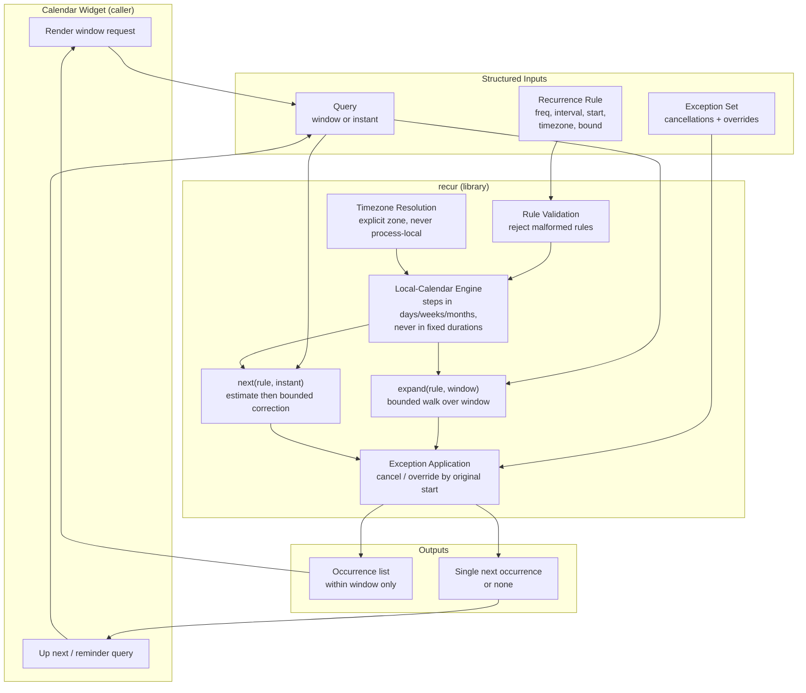
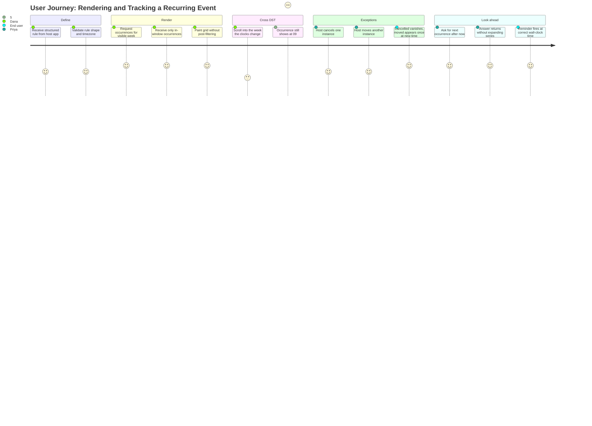

# PRD: recur — Recurring Event Expansion

**Version**: 1.0.0
**Status**: Draft
**Created**: 2026-08-15
**Last Updated**: 2026-08-15
**Author**: @product-manager
**Stakeholders**: Calendar widget team (consumer), `recur` library maintainer, downstream application developers embedding the widget

---

## Changelog

| Version | Date | Changes | Author |
|---------|------|---------|--------|
| 1.0.0 | 2026-08-15 | Initial PRD creation from `SPEC.md` feature request | @product-manager |

---

## 1. Product Summary

### 1.1 Problem Statement

A calendar widget must display recurring events, but it has no way to turn a recurrence
*rule* ("every Monday at 09:00") into the concrete *occurrences* a user actually sees in
the week or month currently on screen. Today nothing exists: the project is empty.

Three properties make this harder than repeated date arithmetic:

1. **Bounded work.** A rule may describe an unbounded series. A widget rendering one week
   must not pay the cost of a series that runs for a decade, and must never materialise
   occurrences outside the window it asked for.
2. **Wall-clock stability across DST.** Users understand a 09:00 standing meeting as
   "09:00", not as "an event 168 hours after the last one." When clocks change, an
   implementation built on elapsed-time arithmetic silently drifts the event to 08:00 or
   10:00 — a defect users perceive as the calendar being wrong, not as a timezone subtlety.
3. **Cheap lookahead.** "When is the next occurrence after now?" is asked constantly — for
   reminders, for "up next" affordances, for sorting agendas. Answering it by expanding the
   whole series is both slow and, for unbounded rules, non-terminating.

Properties 2 and 3 are in direct tension, and the source request states plainly that the
tension is unresolved: keeping wall-clock time across a DST transition means occurrences are
**not evenly spaced in absolute time**, so the Nth occurrence cannot be reached by
multiplying an interval — yet requirement 4 forbids expanding the series to find it. This
PRD treats reconciling that tension as the central deliverable, not an implementation detail.

### 1.2 Proposed Solution

`recur` is a dependency-light Node ES-module library exposing a small, pure API over a
structured recurrence rule (no text parsing — the rule arrives as an object):

- **`expand(rule, window)`** — the concrete occurrences inside a half-open time window,
  computed by walking the rule in the event's own local calendar rather than by adding fixed
  durations, so wall-clock time is preserved by construction across DST transitions.
- **`next(rule, instant)`** — the first occurrence strictly after a given instant, computed
  by *seeking* rather than *enumerating*: an arithmetic estimate in the rule's own period
  units lands near the answer, and a small bounded correction walk in local-calendar terms
  settles it exactly. Cost depends on the rule's shape, not on how far `instant` sits from
  the series start.
- **An exception layer** applied uniformly to both operations: individual occurrences can be
  **cancelled** (removed) or **overridden** (moved to a different time from the rest of the
  series), keyed by the occurrence's original start.
- **Explicit timezone handling throughout**, so results never depend on the timezone of the
  process that happens to be running the code.

The reconciliation of requirements 2 and 4 — the "hard part" — rests on separating the
*shape* of the recurrence (which is regular in **local calendar units**: days, weeks, months)
from its *realisation* (which is irregular in **absolute time** precisely because of DST).
Seeking is done in the regular space; conversion to absolute instants happens once, at the
end, per candidate. That keeps `next()` from enumerating while keeping every occurrence
pinned to its intended wall clock. This PRD states the property as a requirement and an
acceptance criterion; the TRD owns the algorithm.

### 1.3 Value Proposition

**User value** (the person looking at the calendar): recurring events appear where they are
expected — the 09:00 standing meeting is at 09:00 in March and in November. Cancelled
instances disappear; moved instances appear once, at their new time, and not at their old
one. "Up next" is instant.

**Developer value** (the widget team): one small, pure, well-specified module replaces
ad-hoc date math scattered through view code. Rendering a window costs work proportional to
what is *in* the window. Behaviour does not change when the same code runs on a laptop in
`America/Chicago`, in CI under `UTC`, and on a server in `Europe/London`.

**Business value**: DST and exception bugs in calendars are high-visibility, hard to
reproduce, and expensive to chase after release — they surface twice a year and only for
some users. Specifying the semantics up front, with a test surface that pins them, converts
a recurring class of production incidents into a fixed, testable cost.

### 1.4 Key Differentiators

- **Wall-clock-first semantics**, stated as a contract rather than emerging accidentally
  from whichever date type the implementation happened to use.
- **Windowed by design** — the API has no "expand everything" mode to misuse.
- **Seek, don't enumerate** for lookahead, with a stated cost property rather than a vague
  "it's fast."
- **Scope held deliberately narrow**: no RFC 5545 text parsing, no persistence. The library
  does one thing, which is what makes the DST and exception semantics tractable to pin down.

### 1.5 Solution Architecture

---

## 2. User Analysis

### 2.1 Target Users

| User Type | Description | Primary Need |
|-----------|-------------|--------------|
| Widget developer | Builds the calendar UI that consumes `recur` to paint days/weeks/months | Given a visible window, get exactly the occurrences in it, correct across DST, fast enough to call on every scroll |
| Application integrator | Embeds the widget in a product; wires reminders, notifications, "up next" | Ask "what's next after now?" cheaply and get an answer that matches what the grid shows |
| Library maintainer | Owns `recur` over time; adds frequencies, fixes edge cases | Semantics pinned by tests, so DST and exception behaviour cannot regress silently |
| End user (indirect) | Person reading the calendar | Events appear at the time they expect; cancelled ones vanish; moved ones move |

### 2.2 User Personas

**Persona: Dana — Widget Developer**
- **Role**: Frontend engineer building the calendar grid component
- **Goals**: Paint the visible week or month correctly; keep render work proportional to the
  visible range; not think about timezones in view code
- **Pain Points**: Previous hand-rolled recurrence math drifted an hour twice a year and only
  for some users; "expand the series then filter" made month views janky for long-running
  rules; every date bug was reproducible only by changing the machine's clock
- **Technical Proficiency**: High

**Persona: Priya — Application Integrator**
- **Role**: Backend/full-stack engineer wiring reminders and agenda summaries
- **Goals**: Ask for the next occurrence after an arbitrary instant without loading a series;
  have server-side answers agree exactly with what the client renders
- **Pain Points**: Server runs `UTC`, laptops don't, and results differed between them;
  lookahead queries got slower as events aged because the series had to be walked from its
  start
- **Technical Proficiency**: High

**Persona: Sam — Library Maintainer**
- **Role**: Owner of `recur`
- **Goals**: A specification precise enough to test; confidence that a change to month
  handling did not quietly break DST handling
- **Pain Points**: Recurrence semantics that live only in someone's head; edge cases (spring-
  forward into a nonexistent local time, fall-back into an ambiguous one) discovered by users
  rather than by tests
- **Technical Proficiency**: High

### 2.3 User Journey

---

## 3. Goals and Non-Goals

### 3.1 Goals

| ID | Goal | Success Metric | Priority |
|----|------|----------------|----------|
| G1 | Expand a rule into occurrences inside a requested window, materialising nothing outside it | For a rule spanning 10 years, a 7-day window query produces only in-window occurrences, and internal candidate generation is bounded by the window, not the series length | P0 |
| G2 | Preserve intended wall-clock time across DST transitions | A daily 09:00 event in a DST-observing zone yields local time 09:00 for every occurrence before, during, and after both spring-forward and fall-back | P0 |
| G3 | Support per-occurrence exceptions: cancellation and moves | A cancelled occurrence never appears in `expand` or `next`; a moved occurrence appears exactly once, at its new time, and never at its original time | P0 |
| G4 | Answer "next occurrence after instant T" without expanding the series | Cost of `next()` does not grow with the distance between the series start and T; measured work is flat as T moves years forward | P0 |
| G5 | Produce identical results regardless of the host process timezone | The full test suite passes with `TZ` set to at least `UTC`, `America/Chicago`, `Asia/Kolkata`, and `Pacific/Kiritimati`, byte-identical results | P0 |
| G6 | Define behaviour for DST edge cases (nonexistent and ambiguous local times) explicitly | Every such case has a documented, tested rule; no case resolves by accident of implementation | P1 |
| G7 | Reject malformed rules with actionable errors rather than producing wrong occurrences | Invalid rules (unknown frequency, non-positive interval, unknown timezone, inverted window) throw with a message naming the offending field | P1 |
| G8 | Keep the dependency surface at zero unless a requirement forces otherwise, with the forcing requirement named | `package.json` dependencies remain empty, or each entry is justified in the TRD against a specific numbered requirement | P1 |

### 3.2 Non-Goals (Explicit Scope Exclusions)

These items are **explicitly out of scope**. Implementation agents will reference this list
to reject scope creep.

| ID | Non-Goal | Rationale |
|----|----------|-----------|
| NG1 | Parsing or emitting iCalendar / RFC 5545 text (`RRULE:` strings, `.ics` files) | Stated explicitly in the source request. The rule arrives as a structured object; text parsing is a separate concern with its own grammar and error surface |
| NG2 | Storage, persistence, or any database access | Stated explicitly in the source request. `recur` is a pure computation over inputs supplied by the caller |
| NG3 | Rendering, UI components, or any calendar widget code | `recur` is the expansion library the widget calls; the widget is the caller, not part of this deliverable |
| NG4 | Timezone database maintenance or shipping tz data | The Node runtime's ICU timezone data is the source of truth; `recur` reads zones, it does not curate them |
| NG5 | Network access, telemetry, or remote configuration of any kind | A pure library; any I/O would break both testability and the timezone-determinism guarantee |
| NG6 | Attendee/invitee modelling, RSVP state, free-busy, or conflict detection | Event *semantics* beyond time; out of scope for an expansion library |
| NG7 | Recurrence authoring UX, natural-language rule input, or rule "humanisation" strings | Presentation concerns owned by the widget, not the expansion engine |
| NG8 | Cross-series operations (merging multiple rules, deduplicating across events, agenda assembly) | The caller composes multiple series; `recur` answers about one rule + its exceptions at a time |
| NG9 | Mutation APIs — editing a rule, "this and all future occurrences" splitting | Rule *editing* semantics are a distinct problem; `recur` reads a rule and reports occurrences |
| NG10 | Leap-second modelling, non-Gregorian calendars, or sub-millisecond precision | Not required by any stated requirement; would expand the semantic surface without a driving need |

---

## 4. Feature Requirements

Priorities follow P0 (must have for the initial release), P1 (should have for a complete
solution), P2 (nice to have / future).

Traceability: F1–F5 correspond one-to-one with `SPEC.md` requirements 1–5.

### 4.1 P0 - Core Features (Must Have)

#### F1: Windowed Expansion
**Priority**: P0
**Description**: Given a structured recurrence rule and a time window, return the concrete
occurrences falling inside that window — and only those. The window is half-open
(`start` inclusive, `end` exclusive) so adjacent windows tile without duplicating or
dropping boundary occurrences. Work performed is bounded by the window, not by the length of
the series; a rule with no end date is a legitimate input and must not cause unbounded work.
Traces `SPEC.md` requirement 1.

**User Stories**:
- As Dana, I want to request the occurrences for the week currently on screen so that I can
  paint the grid without filtering a larger result set myself.
- As Dana, I want a decade-long rule and a one-week window to cost about the same as a
  one-year rule and a one-week window so that scrolling stays smooth.
- As Dana, I want adjacent windows to tile exactly so that an occurrence at a boundary
  appears in one window and not both.

**Acceptance Criteria**:
- [ ] AC-F1.1: `expand(rule, window)` returns every occurrence with start in `[window.start, window.end)` in ascending order, and no occurrence outside that range.
- [ ] AC-F1.2: An occurrence starting exactly at `window.start` is included; one starting exactly at `window.end` is excluded; two adjacent windows over the same rule together yield each occurrence exactly once.
- [ ] AC-F1.3: For an unbounded rule, `expand` over a bounded window terminates and returns a finite list.
- [ ] AC-F1.4: With the series start fixed and the window held at one week, the number of candidate occurrences generated internally does not grow as the window is moved further from the series start (instrumented in test).
- [ ] AC-F1.5: A window whose range contains no occurrences returns an empty list rather than throwing.
- [ ] AC-F1.6: An inverted or zero-length window (`end <= start`) is rejected with an actionable error naming the window bounds.

**Dependencies**: F5 (timezone resolution) — expansion is defined in the rule's zone.

---

#### F2: DST-Stable Wall-Clock Recurrence
**Priority**: P0
**Description**: Occurrences keep their intended **wall-clock** time across daylight-saving
transitions, not their intended elapsed offset. An event at 09:00 local remains at 09:00
local after the clocks change, which necessarily means consecutive occurrences are **not**
evenly spaced in absolute time (a daily 09:00 event spans 23 or 25 hours across a
transition). The two pathological local times a transition creates must have documented,
tested behaviour: a **nonexistent** local time (skipped by spring-forward) and an
**ambiguous** local time (occurring twice at fall-back). Traces `SPEC.md` requirement 2.

**User Stories**:
- As an end user, I want my 09:00 standing meeting to stay at 09:00 after the clocks change
  so that I do not arrive an hour early or late.
- As Dana, I want the library to define what happens to an event scheduled at a local time
  that does not exist on a given day so that I am not guessing at render time.
- As Sam, I want DST behaviour pinned by tests so that a later change to interval handling
  cannot silently reintroduce elapsed-time drift.

**Acceptance Criteria**:
- [ ] AC-F2.1: A daily rule at 09:00 in a DST-observing zone yields local wall-clock 09:00 for every occurrence across both the spring-forward and fall-back transitions.
- [ ] AC-F2.2: The absolute elapsed interval between the occurrences bracketing a transition differs from the nominal interval by exactly the transition offset (e.g., 23h or 25h for a daily rule with a one-hour shift), confirming wall-clock rather than elapsed-time stepping.
- [ ] AC-F2.3: Weekly and monthly rules crossing a transition also preserve wall-clock time, not only daily rules.
- [ ] AC-F2.4: An occurrence landing on a **nonexistent** local time resolves per a single documented rule, applied consistently, and is covered by a test naming the zone and date.
- [ ] AC-F2.5: An occurrence landing on an **ambiguous** local time resolves per a single documented rule (choosing one of the two instants deterministically), applied consistently, and is covered by a test naming the zone and date.
- [ ] AC-F2.6: Behaviour is verified in at least two zones with differing transition dates and directions (a northern-hemisphere and a southern-hemisphere zone), plus one zone with no DST as a control.
- [ ] AC-F2.7: No code path computes a subsequent occurrence by adding a fixed millisecond duration to the previous one for frequencies of a day or longer.

**Dependencies**: F5 (timezone resolution).

---

#### F3: Occurrence Exceptions — Cancellations and Overrides
**Priority**: P0
**Description**: Individual occurrences of a series can be **cancelled** (removed from
results entirely) or **overridden** (moved to a different time from the rest of the series,
and/or otherwise distinguished). Exceptions are keyed by the occurrence's **original**
start — the instant the unmodified rule would have produced — so that identity survives a
move. Exceptions apply uniformly to both `expand` and `next`. Traces `SPEC.md` requirement 3.

**User Stories**:
- As Priya, I want to cancel a single instance of a weekly meeting so that the holiday week
  shows nothing rather than a meeting nobody attends.
- As Priya, I want to move one instance to a different time so that it appears once, at the
  new time, and not at the old one.
- As Dana, I want a moved occurrence that lands inside my window to appear even if its
  original time was outside the window, and to disappear if it moved out.

**Acceptance Criteria**:
- [ ] AC-F3.1: A cancelled occurrence appears in neither `expand` output nor as the result of `next`.
- [ ] AC-F3.2: An overridden occurrence appears exactly once, at its overridden time; its original time yields nothing.
- [ ] AC-F3.3: An occurrence overridden to a time **inside** the requested window appears in `expand`, even when its original time fell outside the window.
- [ ] AC-F3.4: An occurrence overridden to a time **outside** the requested window does not appear in `expand`, even though its original time fell inside.
- [ ] AC-F3.5: `expand` output remains sorted ascending by effective start after overrides are applied, including when an override reorders it relative to its neighbours.
- [ ] AC-F3.6: An exception whose key matches no occurrence of the rule is handled per a documented rule (ignored or reported) rather than corrupting output.
- [ ] AC-F3.7: Exception keys are matched by the original occurrence instant, resolved in the rule's timezone, so a caller-supplied key expressed in a different zone but denoting the same instant still matches.
- [ ] AC-F3.8: Exceptions are respected by `next`: the occurrence returned is never a cancelled one, and is the overridden time when the next occurrence was moved.

**Dependencies**: F1, F4 (exceptions layer over both), F5.

---

#### F4: Next-Occurrence Query Without Series Expansion
**Priority**: P0
**Description**: Answer "what is the next occurrence strictly after instant T?" without
enumerating the series from its start. Because F2 makes occurrences unevenly spaced in
absolute time, a pure arithmetic jump is not by itself correct; the required behaviour is a
**seek**: estimate the position in the rule's own local-calendar period units, then settle
the answer with a bounded correction that does not depend on how far T is from the series
start. Traces `SPEC.md` requirement 4, and is the requirement in tension with F2 — see R1.

**User Stories**:
- As Priya, I want the next occurrence after an arbitrary instant so that I can schedule a
  reminder without loading the series.
- As Priya, I want that query to cost the same for an event that started last week and one
  that started in 2015 so that lookahead does not degrade as data ages.
- As Dana, I want "up next" to agree exactly with what the grid shows, including exceptions.

**Acceptance Criteria**:
- [ ] AC-F4.1: `next(rule, T)` returns the earliest occurrence with start strictly greater than T, or an explicit "none" result for a bounded rule already exhausted at T.
- [ ] AC-F4.2: The number of candidate occurrences generated internally by `next` is bounded by a small constant independent of the elapsed distance between the rule's start and T (instrumented in test at 1 day, 1 year, and 25 years of separation, with no growth in count).
- [ ] AC-F4.3: `next` never calls the full-series expansion path; asserted structurally (the expansion entry point is not reachable from `next`) rather than only by timing.
- [ ] AC-F4.4: `next` is correct across a DST transition: for T immediately before a transition, the returned occurrence has the intended wall-clock time, matching what `expand` returns for the same instant.
- [ ] AC-F4.5: For a randomised set of rules and instants, `next(rule, T)` equals the first element of `expand(rule, {start: T + ε, end: far future})` — a property test cross-checking the seek path against the walk path.
- [ ] AC-F4.6: `next` respects exceptions per AC-F3.8.
- [ ] AC-F4.7: T exactly equal to an occurrence start returns the **following** occurrence (strictly-after semantics), documented and tested.

**Dependencies**: F1 (shared occurrence semantics), F2 (correctness across transitions), F3, F5.

---

#### F5: Timezone Independence from the Host Process
**Priority**: P0
**Description**: Results depend only on the rule's declared timezone and the supplied
inputs — never on the timezone of the process running the code. The rule carries an explicit
IANA zone identifier; no code path relies on the ambient system zone or on local-time
conversions performed implicitly by the runtime. Traces `SPEC.md` requirement 5.

**User Stories**:
- As Priya, I want server results (running `UTC`) to match client results (running the user's
  zone) exactly so that reminders and the grid never disagree.
- As Sam, I want CI to prove this rather than assume it so that an implicit local-time
  conversion cannot slip in unnoticed.

**Acceptance Criteria**:
- [ ] AC-F5.1: The entire test suite passes with the process `TZ` set to `UTC`, `America/Chicago`, `Asia/Kolkata`, and `Pacific/Kiritimati`, producing identical results in each run.
- [ ] AC-F5.2: For a fixed rule and window, output is byte-identical across those `TZ` settings (compared as serialised results, not merely "all tests green").
- [ ] AC-F5.3: A rule with a missing or unrecognised timezone identifier is rejected with an actionable error rather than silently defaulting to the process zone.
- [ ] AC-F5.4: No production code path derives a date or time component from the ambient system zone; verified by review and by AC-F5.2's differential test.
- [ ] AC-F5.5: A rule in a zone different from the process zone yields the same occurrences as the identical rule evaluated with the process set to that zone.

**Dependencies**: None (foundational; F1–F4 depend on it).

---

### 4.2 P1 - Enhanced Features (Should Have)

#### F6: Rule Validation and Actionable Errors
**Priority**: P1
**Description**: Validate the structured rule and query arguments before computing, failing
fast with errors that name the offending field and the constraint violated. Prevents
malformed input from producing plausible-looking but wrong occurrences.

**User Stories**:
- As Dana, I want a malformed rule to fail loudly at the call site so that I do not ship a
  grid quietly rendering the wrong days.
- As Sam, I want one validation surface so that error behaviour is consistent across entry
  points.

**Acceptance Criteria**:
- [ ] AC-F6.1: Unknown or missing frequency, non-integer or non-positive interval, missing start, and unknown timezone each throw an error naming the field.
- [ ] AC-F6.2: Validation runs identically for `expand` and `next`.
- [ ] AC-F6.3: Errors are distinguishable programmatically (a typed/tagged error, not a bare string) so callers can surface them to users.
- [ ] AC-F6.4: Valid rules never throw validation errors (no false rejections), covered by the positive-path suite.

**Dependencies**: F1, F4.

---

#### F7: Series Termination Bounds (count and until)
**Priority**: P1
**Description**: Support rules that end — after a fixed number of occurrences, or at a
terminal instant — alongside unbounded rules. Both `expand` and `next` must respect the
bound, and cancellations must not silently extend a count-bounded series.

**User Stories**:
- As Priya, I want a "12 sessions" course to stop after 12 so that no thirteenth appears.
- As Dana, I want a window past the end of a bounded series to render empty rather than
  looping.

**Acceptance Criteria**:
- [ ] AC-F7.1: A count-bounded rule yields exactly that many occurrences in total across tiled windows covering the whole series.
- [ ] AC-F7.2: An until-bounded rule yields no occurrence at or after its terminal instant, with inclusivity documented and tested.
- [ ] AC-F7.3: `next` past the end of a bounded series returns the explicit "none" result and terminates.
- [ ] AC-F7.4: Whether a cancelled occurrence consumes a slot in a count-bounded series is documented and tested (one rule, applied consistently).

**Dependencies**: F1, F3, F4.

---

#### F8: Documented Semantics and Usage Reference
**Priority**: P1
**Description**: A written reference for the rule object shape, the exception model, the
half-open window convention, the DST edge-case rules (nonexistent/ambiguous local times), and
the strictly-after semantics of `next`. Without it, the contract lives only in tests.

**User Stories**:
- As Dana, I want the DST edge-case rules written down so that I can explain the calendar's
  behaviour to a user reporting an "off by an hour" issue.
- As Sam, I want the contract documented so that a future change that alters it is visibly a
  breaking change.

**Acceptance Criteria**:
- [ ] AC-F8.1: Every public API entry point is documented with parameters, return shape, and error conditions.
- [ ] AC-F8.2: The nonexistent-time and ambiguous-time resolution rules from AC-F2.4/AC-F2.5 are stated explicitly with a worked example each.
- [ ] AC-F8.3: The half-open window convention and the strictly-after semantics of `next` are stated explicitly.
- [ ] AC-F8.4: Every documented example is exercised by a test, so documentation cannot drift from behaviour.

**Dependencies**: F1–F5.

---

### 4.3 P2 - Future Features (Nice to Have)

#### F9: Previous-Occurrence Query
**Priority**: P2
**Description**: The mirror of F4 — the latest occurrence strictly before an instant, seeking
backwards without expanding the series. Useful for "last occurrence" displays and for
backfilling agendas.

**User Stories**:
- As Priya, I want the most recent past occurrence so that I can show "last met on…".

**Acceptance Criteria**:
- [ ] AC-F9.1: `previous(rule, T)` returns the latest occurrence strictly before T, or an explicit "none" when T precedes the series.
- [ ] AC-F9.2: Bounded-candidate behaviour matches AC-F4.2 in the backwards direction.
- [ ] AC-F9.3: Exceptions and DST behaviour match F2/F3 semantics.

**Dependencies**: F4.

---

#### F10: Lazy Occurrence Iterator
**Priority**: P2
**Description**: A pull-based iterator over occurrences from a starting instant, so callers
that want "the next N" pay for N rather than choosing between a single `next` call and a
window guess.

**User Stories**:
- As Priya, I want the next five occurrences for an agenda preview without inventing a window
  wide enough to be sure of containing them.

**Acceptance Criteria**:
- [ ] AC-F10.1: The iterator yields occurrences in ascending order and computes each only when pulled.
- [ ] AC-F10.2: Taking N items generates work proportional to N, not to the series length.
- [ ] AC-F10.3: Iterator output for a given range equals `expand` output over the same range.

**Dependencies**: F1, F4.

---

## 5. Technical Requirements

### 5.1 Performance Requirements

| Metric | Target | Measurement |
|--------|--------|-------------|
| Candidate generation for `expand` | Bounded by window span ÷ rule interval, plus a small constant; independent of series length | Instrumented candidate counter; one-week window over rules of 1-year and 25-year spans compared (AC-F1.4) |
| Candidate generation for `next` | A small constant, independent of the distance between series start and the query instant | Instrumented counter at 1-day, 1-year, and 25-year separations (AC-F4.2) |
| `expand` for a one-month window over a daily rule | Completes well within a UI frame budget on developer hardware | `node --test` timing assertion with generous headroom, to catch order-of-magnitude regressions rather than to micro-benchmark |
| Memory | Peak retained occurrences bounded by the result size for `expand`, and O(1) for `next` | No full-series array is allocated on any path (structural assertion, AC-F4.3) |

### 5.2 Security Requirements

- No network access, filesystem access, subprocess execution, or dynamic code evaluation on
  any code path (a pure computational library).
- No secrets, credentials, tokens, or environment-derived configuration in source or tests.
- All inputs treated as untrusted: rule fields, exception keys, and window bounds are
  validated before use (F6), so malformed input yields a typed error rather than an
  unbounded loop or a wrong result.
- Unbounded rules must not permit a caller-supplied window or query to induce unbounded
  computation — every loop has an explicit termination condition derived from the window or
  the seek bound (a correctness requirement that is also the denial-of-service guard).
- Dependency surface stays empty unless a specific numbered requirement forces an addition;
  any dependency added must be justified in the TRD by requirement, keeping the supply-chain
  surface auditable (G8).

### 5.3 Accessibility Requirements

WCAG 2.1 AA is **not directly applicable** — `recur` has no user interface (NG3). The
accessibility obligation `recur` carries is upstream of the UI: it must return occurrence
data complete and precise enough for the consuming widget to render accessible output.

- Returned occurrences expose both the absolute instant and the rule's timezone, so the
  widget can render an unambiguous, screen-reader-friendly local time rather than guessing.
- Overridden and cancelled occurrences are distinguishable in the result, so the widget can
  announce "moved" or omit cancelled instances rather than presenting a silently altered grid.
- Error conditions are typed and specific (AC-F6.3), so the widget can present an actionable
  message instead of an empty calendar with no explanation.

### 5.4 Scalability Requirements

- Correct and bounded for unbounded (never-ending) rules — the primary scalability case here
  is series *length*, not request volume.
- Correct for series spanning decades, including multiple DST rule changes within a zone's
  history (zone rules themselves change over time; results follow the tz database in effect
  in the runtime).
- Exception sets sized in the hundreds for a single series must not degrade `expand` or
  `next` to a linear scan of the whole exception set per candidate.
- Stateless and free of shared mutable state, so many independent series can be evaluated
  concurrently in one process without interference.

### 5.5 Integration Requirements

| System | Integration Type | Notes |
|--------|-----------------|-------|
| Calendar widget (consumer) | Direct ES-module import | Sole consumer; calls `expand` for rendering and `next` for lookahead |
| Node.js runtime (ES modules) | Host platform | `"type": "module"`; ESM import/export only, per project `package.json` |
| Node built-in timezone support (ICU) | Runtime capability | Source of timezone offsets and transition data; requires a Node build with full ICU. If ICU proves insufficient for the DST semantics F2 requires, that is the specific requirement forcing a dependency, and it must be named as such per G8 |
| `node --test` | Test runner | Project test command is `node --test test/`; no third-party test framework |
| Host application (indirect) | Supplies inputs | Provides rule objects and exception sets; `recur` neither fetches nor stores them (NG2) |

---

## 6. Acceptance Criteria Summary

### Feature Acceptance Criteria

| ID | Feature | Criterion | Verification Method |
|----|---------|-----------|---------------------|
| AC-F1.1 | F1 | Returns exactly the occurrences within `[start, end)`, ascending | Unit test |
| AC-F1.2 | F1 | Boundary inclusivity; adjacent windows tile without gap or duplicate | Unit test |
| AC-F1.3 | F1 | Unbounded rule over a bounded window terminates | Unit test |
| AC-F1.4 | F1 | Candidate count independent of series length | Unit test (instrumented counter) |
| AC-F1.5 | F1 | Empty window returns empty list, not an error | Unit test |
| AC-F1.6 | F1 | Inverted/zero-length window rejected with actionable error | Unit test |
| AC-F2.1 | F2 | Daily 09:00 event stays at 09:00 local across both transitions | Unit test |
| AC-F2.2 | F2 | Bracketing interval is 23h/25h, proving wall-clock stepping | Unit test |
| AC-F2.3 | F2 | Weekly and monthly rules also preserve wall-clock time | Unit test |
| AC-F2.4 | F2 | Nonexistent local time resolves per one documented rule | Unit test |
| AC-F2.5 | F2 | Ambiguous local time resolves per one documented rule | Unit test |
| AC-F2.6 | F2 | Verified in northern, southern, and non-DST zones | Unit test (parameterised) |
| AC-F2.7 | F2 | No fixed-duration addition for day-or-longer frequencies | Code review + unit test |
| AC-F3.1 | F3 | Cancelled occurrence absent from `expand` and `next` | Unit test |
| AC-F3.2 | F3 | Overridden occurrence appears once, at the new time only | Unit test |
| AC-F3.3 | F3 | Override moved into the window appears | Unit test |
| AC-F3.4 | F3 | Override moved out of the window does not appear | Unit test |
| AC-F3.5 | F3 | Output stays sorted after overrides reorder occurrences | Unit test |
| AC-F3.6 | F3 | Non-matching exception key handled per documented rule | Unit test |
| AC-F3.7 | F3 | Exception keys match by instant across zone representations | Unit test |
| AC-F3.8 | F3 | `next` respects cancellations and overrides | Unit test |
| AC-F4.1 | F4 | Returns earliest occurrence strictly after T, or explicit none | Unit test |
| AC-F4.2 | F4 | Candidate count constant at 1-day / 1-year / 25-year separation | Unit test (instrumented counter) |
| AC-F4.3 | F4 | Full-expansion path unreachable from `next` | Structural test + code review |
| AC-F4.4 | F4 | `next` correct across a DST transition, agreeing with `expand` | Unit test |
| AC-F4.5 | F4 | `next` equals first element of the equivalent `expand` | Property test (randomised rules/instants) |
| AC-F4.6 | F4 | `next` respects exceptions | Unit test |
| AC-F4.7 | F4 | T equal to an occurrence returns the following one | Unit test |
| AC-F5.1 | F5 | Suite passes under four `TZ` settings | CI matrix (`TZ` per job) |
| AC-F5.2 | F5 | Byte-identical serialised output across those `TZ` settings | Differential test |
| AC-F5.3 | F5 | Missing/unknown zone rejected, never defaulted to process zone | Unit test |
| AC-F5.4 | F5 | No ambient-zone derivation on any production path | Code review + AC-F5.2 |
| AC-F5.5 | F5 | Cross-zone rule matches same-zone evaluation | Unit test |
| AC-F6.1 | F6 | Each malformed field throws an error naming that field | Unit test |
| AC-F6.2 | F6 | Validation identical for `expand` and `next` | Unit test |
| AC-F6.3 | F6 | Errors programmatically distinguishable | Unit test |
| AC-F6.4 | F6 | No false rejections of valid rules | Unit test |
| AC-F7.1 | F7 | Count-bounded rule yields exactly N occurrences in total | Unit test |
| AC-F7.2 | F7 | Until-bounded rule respects its terminal instant | Unit test |
| AC-F7.3 | F7 | `next` past the end returns none and terminates | Unit test |
| AC-F7.4 | F7 | Cancellation-vs-count interaction documented and tested | Unit test |
| AC-F8.1 | F8 | Every public entry point documented incl. errors | Manual review |
| AC-F8.2 | F8 | DST edge-case rules documented with worked examples | Manual review |
| AC-F8.3 | F8 | Half-open window and strictly-after semantics documented | Manual review |
| AC-F8.4 | F8 | Every documented example exercised by a test | Unit test |
| AC-F9.1 | F9 | `previous(rule, T)` returns latest occurrence before T | Unit test |
| AC-F9.2 | F9 | Bounded candidates backwards, mirroring AC-F4.2 | Unit test (instrumented counter) |
| AC-F9.3 | F9 | Exceptions and DST semantics match F2/F3 | Unit test |
| AC-F10.1 | F10 | Iterator yields ascending, computed on pull | Unit test |
| AC-F10.2 | F10 | Work proportional to items taken | Unit test (instrumented counter) |
| AC-F10.3 | F10 | Iterator agrees with `expand` over the same range | Property test |

### Technical Acceptance Criteria

| ID | Requirement | Criterion | Verification Method |
|----|-------------|-----------|---------------------|
| AC-T1 | Performance — `expand` | Candidate generation bounded by window, not series length | Instrumented counter test (AC-F1.4) |
| AC-T2 | Performance — `next` | Candidate generation constant in query distance | Instrumented counter test (AC-F4.2) |
| AC-T3 | Performance — memory | No full-series array allocated on any path | Structural test + code review |
| AC-T4 | Security — purity | No network, filesystem, subprocess, or dynamic evaluation | Code review + dependency audit |
| AC-T5 | Security — input trust | All rule/window/exception inputs validated before use | Unit test (F6 suite) |
| AC-T6 | Security — termination | Every loop bounded by window or seek bound; no unbounded loop reachable from public API | Code review + AC-F1.3 / AC-F4.2 |
| AC-T7 | Dependencies | `dependencies` empty, or each entry justified in the TRD against a numbered requirement | Manual review of `package.json` + TRD |
| AC-T8 | Determinism | Byte-identical output across four `TZ` settings | CI matrix differential test (AC-F5.2) |
| AC-T9 | Platform | ESM-only; suite runs under `node --test test/` with no third-party framework | CI run |
| AC-T10 | Accessibility (data adequacy) | Results expose instant, zone, and exception status sufficient for accessible rendering | Manual review against F2/F3 output shape |
| AC-T11 | Scalability | Large exception sets do not degrade `expand`/`next` to a per-candidate linear scan | Unit test (instrumented) |
| AC-T12 | Coverage | Unit coverage meets or exceeds the project quality gate, with DST and exception paths covered | Coverage report |

---

## 7. Risk Assessment

| ID | Risk | Likelihood | Impact | Mitigation Strategy |
|----|------|------------|--------|---------------------|
| R1 | **The core tension is unresolved at intake.** F2 (wall-clock stability) makes occurrences unevenly spaced in absolute time; F4 (no expansion) forbids walking to find them. The source request explicitly states it has no answer. A wrong reconciliation silently breaks one requirement to satisfy the other | High | High | Treat reconciliation as the TRD's primary design task, not an implementation detail. Require the TRD to state the seek strategy explicitly (estimate in local-calendar period units, then a bounded correction) and to justify the bound. Enforce with AC-F4.2 (bounded candidates) **and** AC-F4.5 (seek result must equal the walk result) — the pair makes "fast but wrong" and "correct but enumerating" both fail |
| R2 | Implementation reaches for fixed-millisecond arithmetic because it is the obvious way to step a series, reintroducing DST drift | High | High | AC-F2.7 forbids fixed-duration stepping for day-or-longer frequencies; AC-F2.2 detects it behaviourally (a 24h bracketing interval fails the test). Both are required before F1 is accepted |
| R3 | Ambient process timezone leaks into a code path through an implicit local-time conversion, passing on the developer's machine and failing elsewhere | Medium | High | AC-F5.1/AC-F5.2 run the suite under four contrasting `TZ` values in CI and compare serialised output, so a leak fails the build rather than a user's calendar |
| R4 | Node's built-in ICU support proves insufficient to express the needed transition handling, forcing a dependency against the stated zero-dependency preference | Medium | Medium | G8 and AC-T7 permit a dependency **only** with the forcing requirement named. Prove the ICU path against F2's edge cases (AC-F2.4/2.5) early, before broader implementation commits to it |
| R5 | Exception semantics under-specified at the edges — an override moving an occurrence across the window boundary, or reordering it relative to neighbours | Medium | Medium | AC-F3.3/3.4/3.5 pin exactly these cases; AC-F3.6 requires a documented rule for non-matching keys rather than leaving it to chance |
| R6 | DST edge cases (nonexistent and ambiguous local times) resolved by accident of implementation rather than by decision, differing between `expand` and `next` | Medium | Medium | AC-F2.4/AC-F2.5 require one documented rule each, applied consistently; AC-F4.4 requires `next` and `expand` to agree across transitions; AC-F8.2 requires both rules written down with worked examples |
| R7 | Bounded-candidate performance properties are asserted by wall-clock timing, making tests flaky on shared CI hardware | Medium | Low | Assert on an **instrumented candidate counter** rather than elapsed time (AC-F1.4, AC-F4.2, AC-T1/T2); reserve timing assertions for generous order-of-magnitude regression guards only |
| R8 | Scope creep toward RFC 5545 parsing, since real rules usually arrive as `RRULE:` text in the wild | Medium | Medium | NG1 states the exclusion explicitly; implementation agents reject the addition. The structured rule object is the contract |
| R9 | Frequency coverage ambiguity — the source states requirements without enumerating which frequencies (daily/weekly/monthly/yearly, by-day/by-month-day refinements) must be supported | Medium | Medium | Documented default: support daily, weekly, and monthly with a positive integer interval as the P0 surface, since F2's DST behaviour must be demonstrated across all three (AC-F2.3). Yearly and by-day/by-month-day refinements are deferred; the TRD may revise with rationale |
| R10 | An unbounded rule combined with an unsatisfiable query (e.g., `next` on a rule whose remaining occurrences are all cancelled) loops forever | Low | High | AC-T6 requires every loop bounded by the window or an explicit seek bound; AC-F7.3 requires an explicit "none" result and termination for exhausted series |

### Contingency Plans

**R1 Contingency** (highest-impact, and known-unresolved at intake): if the seek strategy
cannot be shown to satisfy AC-F4.2 and AC-F4.5 together, do **not** relax F2 — wall-clock
stability is user-visible correctness, while lookahead cost is a performance property. Fall
back in this order: (a) restrict the constant-candidate guarantee to the frequencies where it
is provable (daily/weekly/monthly with a fixed interval), documenting the boundary; (b) for
any rule shape outside that set, use a bounded walk from the nearest cheaply-computable
anchor and document the cost characteristic honestly rather than claiming a guarantee the
implementation does not meet. Escalate to the user with the analysis before shipping any
approach that weakens F2.

**R2 Contingency**: if a fixed-duration path is found after implementation, treat it as a
correctness defect, not an optimisation choice — revert it and add the failing case from
AC-F2.2 to the regression suite before re-implementing.

**R3 Contingency**: if a `TZ`-dependent failure appears, add the failing zone to the CI
matrix permanently rather than fixing only the observed symptom; the matrix is the guard, and
each escape widens it.

**R4 Contingency**: if ICU cannot express F2's semantics, name the forcing requirement
(expected: requirement 2 / F2), select the smallest well-maintained timezone library that
covers it, and record the justification in the TRD per AC-T7 — rather than either weakening
F2 or adding the dependency silently.

---

## Appendices

### Appendix A: Glossary

| Term | Definition |
|------|------------|
| Occurrence | A single concrete instance of a recurring event, with a definite start instant |
| Rule | The structured recurrence definition (frequency, interval, start, timezone, optional bound). Not text — an object (NG1) |
| Window | A half-open time range `[start, end)` for which occurrences are requested |
| Expansion | Producing the concrete occurrences of a rule within a window |
| Wall-clock time | The time as displayed on a local clock (e.g., 09:00), as opposed to elapsed absolute time |
| Absolute time | An instant on a continuous timeline, independent of any local calendar or offset |
| DST transition | A change in a zone's UTC offset, shifting local clocks forward or back |
| Nonexistent local time | A local time skipped by a spring-forward transition; it never occurs on that date in that zone |
| Ambiguous local time | A local time occurring twice due to a fall-back transition; it maps to two distinct instants |
| Cancellation | An exception removing a single occurrence from the series |
| Override | An exception moving a single occurrence to a different time from the rest of the series |
| Original start | The instant the unmodified rule would produce for an occurrence; the key by which exceptions are matched |
| Seek | Locating an occurrence by estimation plus bounded correction, as opposed to enumerating from the series start |
| IANA zone identifier | A timezone name such as `America/Chicago`, resolved via the runtime's tz database |

### Appendix B: Related Documents

- Source feature request: `SPEC.md` (project root) — requirements 1–5 trace to features F1–F5
- Project instructions: `CLAUDE.md` (project root)
- Project rules: `.claude/rules/autonomy.md`, `.claude/rules/command-status.md`, `.claude/rules/async-discipline.md`
- Downstream: the TRD generated from this PRD by `/create-trd`

### Appendix C: Open Questions

| Question | Status | Resolution |
|----------|--------|------------|
| How are F2 (wall-clock stability) and F4 (no expansion) reconciled concretely? | Open — flagged as the central design task | Direction set in §1.2 (seek in local-calendar period units, then bounded correction); the exact algorithm and its proof of bound are owned by the TRD. Guarded by AC-F4.2 + AC-F4.5 and risk R1 |
| Which frequencies must the initial release support? | Open — source is silent | Default applied: daily, weekly, monthly with a positive integer interval (needed anyway to demonstrate F2 across frequencies, AC-F2.3). Yearly and by-day/by-month-day refinements deferred. See R9 |
| How should a nonexistent local time resolve (skip the occurrence, shift forward past the gap, or clamp to the transition instant)? | Open | Must be decided and documented in the TRD; AC-F2.4 requires one rule applied consistently. Recommended default: shift forward by the transition offset, as it preserves an occurrence rather than silently dropping one |
| How should an ambiguous local time resolve (first or second instant)? | Open | Must be decided and documented; AC-F2.5 requires one rule. Recommended default: the first (earlier) instant, matching common calendar behaviour |
| Does a cancelled occurrence consume a slot in a count-bounded series? | Open | AC-F7.4 requires a documented, tested rule. Recommended default: yes — the count describes the rule's occurrences, and cancellations are an overlay on them |
| What is the occurrence result shape (instant only, or instant + zone + duration + exception status)? | Open | §5.3 requires instant, zone, and exception status at minimum for accessible rendering; the exact shape is the TRD's to fix |
| Are exception sets supplied alongside the rule per call, or attached to the rule object? | Open | Either satisfies F3; the TRD should choose one and apply it consistently across `expand` and `next` |

---
