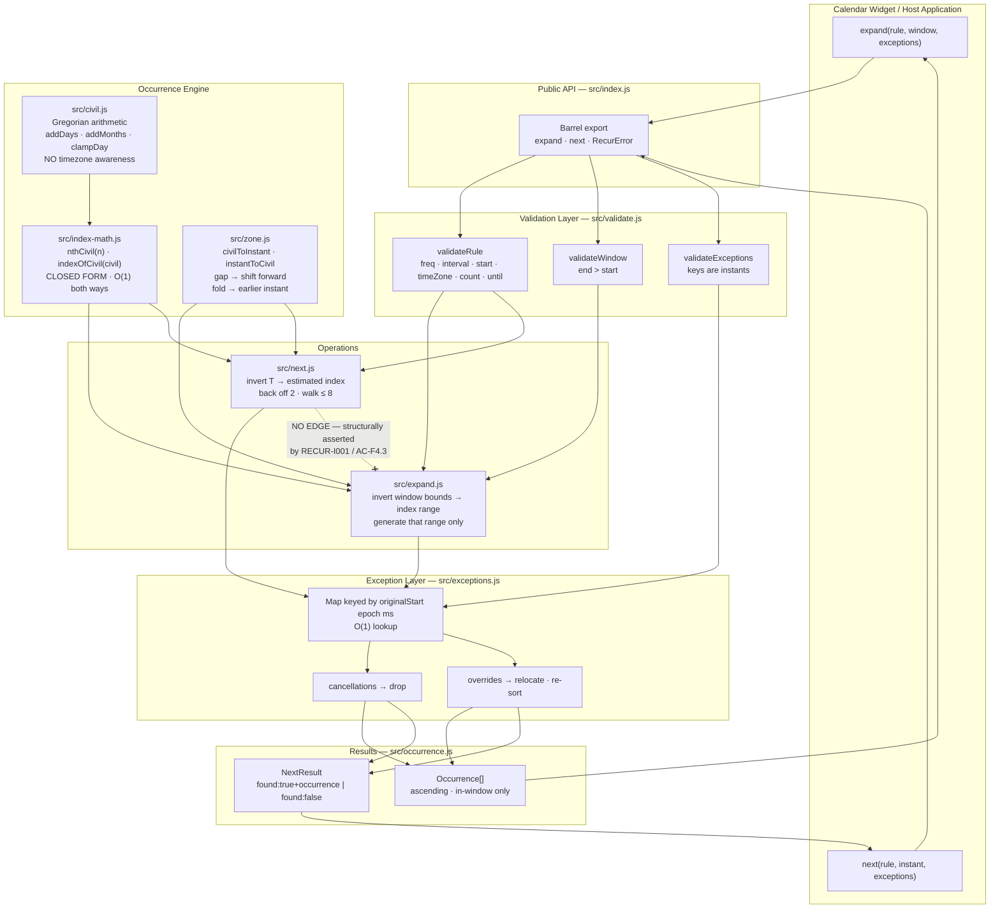
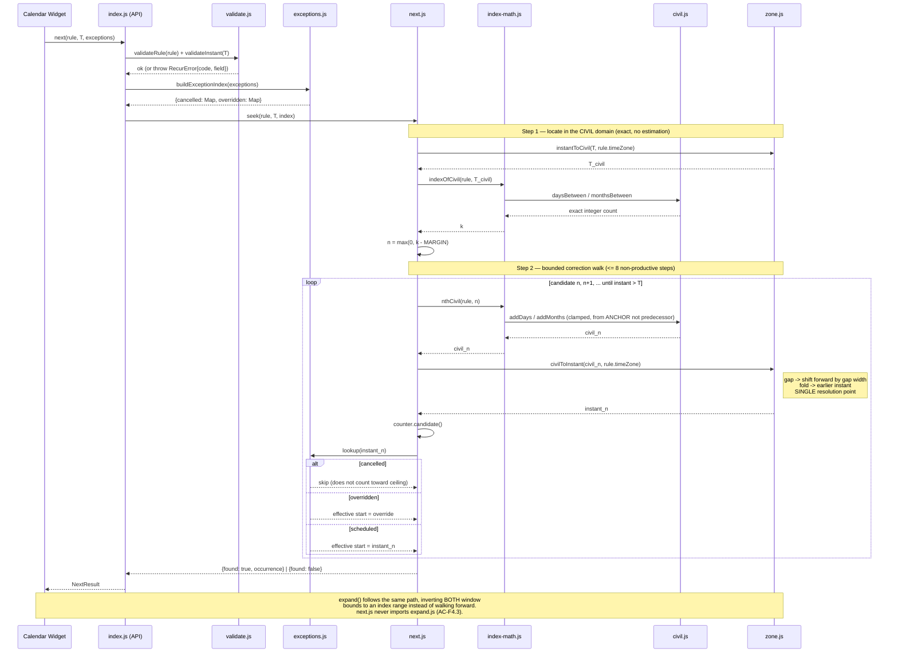
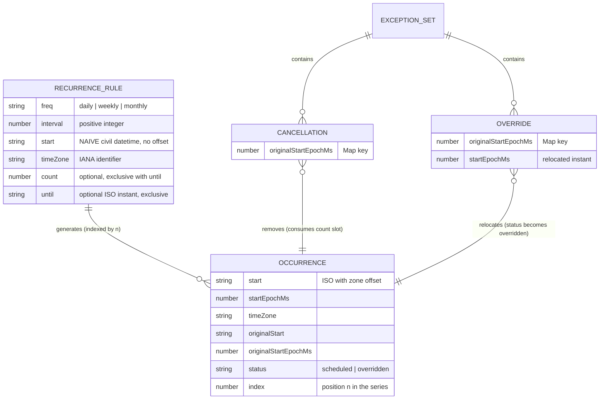

# TRD: recur — Recurring Event Expansion

**Version**: 1.0.0
**Status**: Draft
**Created**: 2026-08-15
**Last Updated**: 2026-08-15
**Author**: @technical-architect
**Source PRD**: `docs/modernization/runs/case2-calendar/old/PRD.md`
**Task ID Prefix**: RECUR

---

## Changelog

| Version | Date | Changes | Author |
|---------|------|---------|--------|
| 1.0.0 | 2026-08-15 | Initial TRD creation from PRD v1.0.0 | @technical-architect |

---

## 1. Overview

### 1.1 Technical Summary

`recur` is a zero-dependency Node ES module that expands a structured recurrence rule into
concrete occurrences. The whole design turns on one decision: **the recurrence is defined in
the civil (wall-clock) domain, and conversion to absolute instants happens exactly once, per
candidate, at the very end.**

That decision resolves the tension the source request could not (PRD R1, §1.2). In the civil
domain the series is perfectly regular — occurrence *n* starts at
`addPeriods(dtstart, freq, n × interval)`, a **closed-form** function of *n* computed with pure
Gregorian arithmetic and no timezone involvement whatsoever. Regularity means the function is
invertible: given any civil datetime, the index of the nearest occurrence is computable in
O(1) by counting days, weeks, or months. All of the irregularity DST introduces lives in the
`civil → instant` mapping, which is applied *after* the index is known.

So:

- **F2 (wall-clock stability)** is satisfied *by construction*, not by care. No code path adds
  a fixed millisecond duration to an instant for a frequency of a day or longer; the only way
  to reach occurrence *n+1* is to re-evaluate the closed form at index *n+1*, which necessarily
  reproduces the intended wall clock. AC-F2.7 is a structural property of the architecture
  rather than a discipline the implementer must remember.
- **F4 (seek, don't enumerate)** is satisfied because the closed form is invertible. `next(rule, T)`
  converts `T` to civil time *in the rule's own zone* (exact), inverts the closed form to get an
  estimated index, backs off a small fixed margin, and walks forward a bounded number of
  candidates. Cost depends on the rule's shape and on nothing else — not on the distance from
  the series start.

The residual error the correction walk absorbs is small and boundable: ordering by civil time
and ordering by instant agree everywhere except within one UTC-offset transition, and the
largest transition in the IANA database is under 24 hours. For a frequency of a day or longer
that is at most one period, so a **margin of 2 indices** is already generous; the implementation
carries a documented hard ceiling of 8 correction steps and asserts it is never approached.

Two further consequences of indexing from the anchor rather than from the previous occurrence:
monthly clamping never accumulates (Jan 31 → Feb 28 → **Mar 31**, not Mar 28), and every
occurrence is independently addressable, which is what makes exception keying by *original
start* cheap.

Node's built-in ICU (`Intl.DateTimeFormat` with an explicit `timeZone` and `formatToParts`) is
sufficient to express every DST semantic F2 requires, including gap and fold detection.
Therefore **no dependency is forced** and `dependencies` stays empty (G8, AC-T7, PRD R4
resolved in the negative).

### 1.2 Key Technical Decisions

| Decision | Choice | Rationale | Alternatives Considered |
|----------|--------|-----------|------------------------|
| Recurrence domain | Civil (wall-clock) datetime + IANA zone; instants derived last | Makes F2 structural rather than disciplinary, and keeps the series regular so F4's inversion is possible at all | Instant-based stepping (fails F2); offset-frozen stepping (fails F2 across transitions) |
| Occurrence addressing | Closed-form index: occurrence *n* = `addPeriods(dtstart, freq, n × interval)` | O(1) forward evaluation and O(1) inversion; the mechanism that reconciles R1. Also prevents cumulative monthly-clamp drift | Iterative "previous + interval" stepping (O(n), and drifts on monthly clamp) |
| `next()` strategy | Invert the closed form to an estimated index, back off a fixed margin of 2, walk forward with a hard ceiling of 8 steps | Satisfies AC-F4.2 (constant candidates) *and* AC-F4.5 (agrees with the walk) simultaneously — the pair the PRD requires | Binary search over instants (more code, same bound); enumerate-and-filter (violates F4) |
| Timezone engine | Node built-in ICU via `Intl.DateTimeFormat` + `formatToParts` | Zero dependencies (G8). Offsets and transitions are derivable; gaps and folds are detectable by round-trip comparison | Luxon / `@js-joda/timezone` / `tzdata` — rejected: no requirement forces them (AC-T7), and each enlarges the supply-chain surface |
| `start` representation in the rule | **Naive civil datetime string** (`"2026-01-05T09:00:00"`, no offset, no `Z`) plus a sibling `timeZone` field | An instant-typed start would have to be converted back to wall clock on every evaluation — reintroducing exactly the ambient-conversion risk F5 exists to eliminate. A naive string cannot be misread as an instant | ISO instant with offset (invites F5 leaks); epoch ms (same, and unreadable) |
| Nonexistent local time (spring-forward gap) | **Shift forward by the gap width** (02:30 → 03:30 for a 1h gap) | Preserves an occurrence rather than silently dropping one; matches the PRD's recommended default (Appendix C) and common calendar behaviour | Skip the occurrence (a user's meeting vanishes); clamp to the transition instant (collides with a legitimately-scheduled 03:00) |
| Ambiguous local time (fall-back fold) | **The first (earlier) instant** — the pre-transition offset | Matches the PRD's recommended default; the earlier instant is the one a user watching a clock reaches first | Second instant; throwing (unacceptable — a valid rule would fail twice a year) |
| Window convention | Half-open `[start, end)` on the **absolute instant** | Adjacent windows tile exactly (AC-F1.2). Comparing instants, not civil times, is what makes tiling hold across a transition | Closed windows (duplicate boundary occurrences); civil-time comparison (breaks tiling at folds) |
| Exception keying | `Map` keyed by the **epoch-millisecond** value of the original start instant | Instant-valued keys match across zone representations for free (AC-F3.7); `Map` gives O(1) lookup, so a large exception set never becomes a per-candidate linear scan (AC-T11) | Keying by civil string (fails AC-F3.7); array scan (fails AC-T11) |
| Exception supply | Passed **per call**, alongside the rule — `expand(rule, window, exceptions?)`, `next(rule, instant, exceptions?)` | Keeps the rule a pure value and makes it structurally impossible for `expand` and `next` to see different exception sets. Resolves the PRD's open question | Attached to the rule object (equally valid; rejected only to keep the rule immutable and cacheable) |
| Cancellation vs `count` | A cancelled occurrence **consumes** its slot | `count` describes the *rule's* occurrences; cancellations are an overlay applied afterwards. Matches the PRD's recommended default (AC-F7.4) | Cancellations extend the series (makes the total unbounded in the number of cancellations) |
| `until` inclusivity | **Exclusive** — no occurrence at or after `until` | Consistent with the half-open window convention used everywhere else in the API; one rule to remember instead of two | Inclusive (RFC 5545's choice, but NG1 puts us outside that contract anyway) |
| Frequencies in scope | `daily`, `weekly`, `monthly`, each with a positive integer `interval` | The PRD's documented default (R9); all three are needed to demonstrate F2 across frequencies (AC-F2.3). `yearly` and by-day/by-month-day refinements deferred | Adding `yearly` now (no requirement drives it; would widen the DST/clamp test matrix without need) |
| Error model | `RecurError extends Error` with `code` and `field` properties | AC-F6.3 requires programmatic distinguishability; a tagged class gives `instanceof` plus a stable machine-readable `code` | String messages only (fails AC-F6.3); error codes without a class (no `instanceof`) |
| Candidate instrumentation | An internal counter module the test suite imports; not part of the public API | AC-F1.4 / AC-F4.2 / AC-T11 must assert on candidate *counts*, not wall-clock time, or they go flaky on shared CI (PRD R7) | Timing assertions (flaky); no instrumentation (the acceptance criteria become unverifiable) |

### 1.3 Technology Stack

| Layer | Technology | Purpose | Notes |
|-------|------------|---------|-------|
| Runtime | Node.js 18+ | Host platform | `"type": "module"` — ESM import/export only, per existing `package.json` |
| Language | JavaScript (ES2022) | Implementation | No build step, no transpiler; the published source is the source |
| Timezone data | Node built-in ICU (`Intl.DateTimeFormat`, `formatToParts`) | Offsets, transitions, gap/fold detection | Requires a full-ICU Node build. Probed explicitly by RECUR-P001 |
| Test runner | `node --test` | Unit, property, differential, and structural tests | Existing `npm test` → `node --test test/`. No third-party framework (AC-T9) |
| Coverage | `node --test --experimental-test-coverage` | Coverage reporting for AC-T12 | Built in; no `c8`/`nyc` dependency |
| CI | GitHub Actions | `TZ` matrix (AC-F5.1) | Four jobs: `UTC`, `America/Chicago`, `Asia/Kolkata`, `Pacific/Kiritimati` |
| Dependencies | **None** | — | `dependencies` and `devDependencies` both stay empty. No requirement forces an entry (G8, AC-T7) |

### 1.4 Integration Points

| System | Type | Direction | Notes |
|--------|------|-----------|-------|
| Calendar widget (consumer) | Direct ES-module import | Out | Sole consumer. Calls `expand` for rendering, `next` for lookahead. `recur` knows nothing about it (NG3) |
| Host application | Value passing | In | Supplies rule objects and exception sets as plain data. `recur` neither fetches nor persists them (NG2, NG5) |
| Node ICU / tz database | Runtime capability | In | Read-only consumer of zone rules. `recur` does not ship or curate tz data (NG4) |
| `node --test` | Test harness | Out | The only execution surface besides library import |
| GitHub Actions | CI | Out | Runs the suite once per `TZ` value and diffs the serialised output (AC-F5.2) |

---

## 2. System Architecture

### 2.1 Architecture Overview



**Reading the diagram.** `src/civil.js` sits below `src/index-math.js` and has *no* knowledge of
timezones — it is pure Gregorian arithmetic on `{year, month, day, hour, minute, second}`.
`src/zone.js` is the only module that touches `Intl`, and it is the only place an offset is ever
computed. Neither `expand` nor `next` may import `Intl` directly. The dashed non-edge between
`next` and `expand` is the structural guarantee AC-F4.3 demands, and RECUR-I001 enforces it by
parsing the import graph.

### 2.2 Component Architecture

#### 2.2.1 `src/civil.js` — Civil Datetime Primitives

**Responsibility**: Gregorian calendar arithmetic on naive civil datetimes. Adding days, adding
months with end-of-month clamping, comparing, counting days/months between two civil values,
and parsing/formatting the naive ISO form.

**Interfaces**: `parseCivil`, `formatCivil`, `addDays`, `addMonths`, `compareCivil`,
`daysBetween`, `monthsBetween`, `isValidCivil`.

**Dependencies**: none. **This module must not import `zone.js`, must not reference `Intl`, and
must not construct a `Date` from anything but explicit UTC components.** It is deliberately the
one part of the system where "the wall clock" is the only clock, and it is what makes F2
structural: since the series is stepped here, DST cannot reach it.

**Critical detail — monthly clamping.** `addMonths` clamps the day-of-month to the target
month's length (Jan 31 + 1 month → Feb 28, or Feb 29 in a leap year). Because every occurrence
is computed from the *anchor* rather than from its predecessor, clamping never accumulates:
Jan 31 → Feb 28 → **Mar 31**. This is a direct consequence of the closed-form indexing decision
and is pinned by test in RECUR-T007.

#### 2.2.2 `src/zone.js` — Timezone Bridge

**Responsibility**: The single crossing point between civil time and absolute time. Converts a
civil datetime in a named IANA zone to an epoch-millisecond instant and back, and classifies
civil values as normal, nonexistent (gap), or ambiguous (fold).

**Interfaces**: `offsetAt(epochMs, timeZone)`, `civilToInstant(civil, timeZone)`,
`instantToCivil(epochMs, timeZone)`, `classifyCivil(civil, timeZone)`, `isValidZone(timeZone)`.

**Dependencies**: `Intl.DateTimeFormat` (ICU). **The only module in the codebase permitted to
reference `Intl`.**

**Algorithm — `offsetAt`.** Format the instant in the target zone with
`formatToParts` (`year`/`month`/`day`/`hour`/`minute`/`second`, `hourCycle: 'h23'`), reassemble
those parts as if they were UTC via `Date.UTC`, and subtract the original instant. The
difference is the zone's UTC offset at that instant. This uses no ambient zone anywhere, which
is what makes F5 hold structurally.

**Algorithm — `civilToInstant`.** Two-step guess-and-correct:

1. Guess `t₀ = Date.UTC(...civil) − offsetAt(Date.UTC(...civil), zone)`.
2. Recompute `off₁ = offsetAt(t₀, zone)` and let `t₁ = Date.UTC(...civil) − off₁`.
3. Round-trip: `instantToCivil(t₁, zone)`.
   - Equal to the input civil → **normal**; return `t₁`.
   - Not equal → the civil time is **nonexistent** (a gap swallowed it). The requested wall
     clock does not exist that day. Per §1.2, **shift forward by the gap width**: return
     `Date.UTC(...civil) − off₀` where `off₀` is the *pre-transition* offset, which lands the
     occurrence exactly `gap` later in wall-clock terms (02:30 → 03:30 for a one-hour gap).
   - Two distinct valid solutions exist (`t₀ ≠ t₁` and both round-trip) → the civil time is
     **ambiguous** (a fold produced it twice). Per §1.2, return `min(t₀, t₁)` — the **earlier**
     instant.

Gap and fold resolution live *here and only here*, which is what guarantees `expand` and `next`
resolve them identically (AC-F4.4, PRD R6). Neither operation implements its own conversion.

#### 2.2.3 `src/index-math.js` — Closed-Form Occurrence Indexing

**Responsibility**: The reconciliation of F2 and F4 in one module.

**Interfaces**:
- `nthCivil(rule, n) → civil` — the civil start of occurrence *n*. O(1).
  - `daily`: `addDays(dtstart, n × interval)`
  - `weekly`: `addDays(dtstart, 7 × n × interval)`
  - `monthly`: `addMonths(dtstart, n × interval)` (with clamping per §2.2.1)
- `indexOfCivil(rule, civil) → number` — the (possibly fractional, floored) index whose civil
  start is nearest at or below `civil`. O(1). The exact inverse of `nthCivil` in the civil
  domain:
  - `daily`: `floor(daysBetween(dtstart, civil) / interval)`
  - `weekly`: `floor(daysBetween(dtstart, civil) / (7 × interval))`
  - `monthly`: `floor(monthsBetween(dtstart, civil) / interval)`, decremented when the
    day-of-month/time-of-day of `civil` precedes the anchor's within that month
- `maxIndex(rule) → number | Infinity` — derived from `count` (`count − 1`) or `Infinity`.

**Dependencies**: `civil.js` only. **Must not import `zone.js`.** Indexing is a purely civil
operation; the instant is derived afterwards. Keeping this module zone-blind is what proves no
occurrence can be reached by absolute-duration arithmetic (AC-F2.7).

**Why the inverse is exact.** `nthCivil` is a strictly increasing function of *n* over civil
datetimes, with a period that is an exact whole number of days or months. Counting days or
months between two civil datetimes is exact integer arithmetic with no offsets involved.
Therefore `indexOfCivil(nthCivil(n)) === n` for every valid *n* — pinned as a round-trip
property test in RECUR-T003.

#### 2.2.4 `src/expand.js` — Windowed Expansion

**Responsibility**: Return every occurrence whose effective start lies in `[window.start, window.end)`,
ascending, materialising nothing outside it.

**Algorithm**:
1. Convert `window.start` and `window.end` to civil datetimes **in the rule's zone**.
2. `lo = max(0, indexOfCivil(startCivil) − MARGIN)`, `hi = min(maxIndex(rule), indexOfCivil(endCivil) + MARGIN)`, with `MARGIN = 2`.
3. For `n` in `[lo, hi]`: `civilToInstant(nthCivil(rule, n), zone)`; increment the candidate counter; drop anything at or after `until`; keep instants in `[window.start, window.end)`.
4. Apply the exception layer (§2.2.6).
5. Sort ascending by effective start and return.

**Cost**: `O((window span ÷ rule period) + MARGIN + |overrides|)`. Independent of the series
length and of the distance from `dtstart` — AC-F1.4, AC-T1. An unbounded rule terminates because
`hi` is finite by construction (AC-F1.3, AC-T6). No full-series array is ever allocated (AC-T3).

**Dependencies**: `validate.js`, `index-math.js`, `zone.js`, `exceptions.js`, `occurrence.js`.

#### 2.2.5 `src/next.js` — Bounded Seek

**Responsibility**: The earliest occurrence strictly after instant `T`, without enumerating.

**Algorithm**:
1. Convert `T` to a civil datetime **in the rule's zone** (exact — no estimation involved).
2. `k = indexOfCivil(rule, T_civil)`; `n = max(0, k − MARGIN)` with `MARGIN = 2`.
3. Walk forward from `n`: compute `civilToInstant(nthCivil(rule, n), zone)`, increment the
   candidate counter, and return the first candidate that is `> T`, is not cancelled, and is
   before `until`. Apply overrides before comparing (§2.2.6).
4. Stop and return `{found: false}` when `n > maxIndex(rule)` or the candidate is at/after `until`.
5. **Hard ceiling**: `MAX_CORRECTION_STEPS = 8` non-productive steps (steps that neither return
   a result nor are explained by a cancellation). Exceeding it throws an internal invariant
   error — a loud bug report, never a silent wrong answer.

**Why the walk is bounded.** Civil ordering and instant ordering agree everywhere except within
a single UTC-offset transition, and the largest transition in the IANA database is under 24
hours — at most one period for a frequency of a day or longer. `MARGIN = 2` therefore already
covers it with slack, and the ceiling of 8 exists only to convert a hypothetical unknown into a
crash rather than a hang. Candidate count is a small constant independent of `T`'s distance from
`dtstart` — AC-F4.2, AC-T2.

**Cancellation termination (PRD R10).** When consecutive candidates are cancelled, the walk
continues, but the cancellation set is finite and caller-supplied, so the walk is bounded by
`|cancellations| + MARGIN + 1`. Cancellation-driven steps are exempt from the ceiling and
counted separately; every other loop is bounded by the ceiling, `maxIndex`, or `until` (AC-T6).

**Dependencies**: `validate.js`, `index-math.js`, `zone.js`, `exceptions.js`, `occurrence.js`.
**Must not import `expand.js`** — enforced structurally by RECUR-I001 (AC-F4.3).

#### 2.2.6 `src/exceptions.js` — Cancellations and Overrides

**Responsibility**: Apply the caller's exception set uniformly to both operations.

**Interfaces**: `buildExceptionIndex(exceptions) → {cancelled: Map, overridden: Map}`,
`applyToCandidate(occurrence, index)`, `collectInboundOverrides(index, window, rule)`.

**Design**: Both maps are keyed by the **epoch-millisecond value of the original start instant**.
Instant-valued keys make AC-F3.7 free — a key supplied as `"2026-03-09T15:00:00Z"` and one
supplied as `"2026-03-09T09:00:00-06:00"` denote the same instant and produce the same key.
`Map` lookup is O(1), so a series with hundreds of exceptions never degrades either operation to
a per-candidate linear scan (AC-T11).

**The inbound-override case (AC-F3.3)** is the one thing index-range generation cannot find on
its own: an occurrence whose *original* start lies outside the window but whose *overridden*
start lies inside it will never be produced as a candidate. `collectInboundOverrides` handles it
by iterating the override map — bounded by `|overrides|`, which is caller-supplied and finite —
and admitting any entry whose new start falls in `[window.start, window.end)` while its original
did not. The symmetric outbound case (AC-F3.4) falls out of applying the override before the
window filter. Sorting happens after all relocation, so AC-F3.5 holds even when an override
reorders an occurrence relative to its neighbours.

**Unmatched keys (AC-F3.6)**: an exception whose key matches no occurrence of the rule is
**ignored silently** rather than throwing — a rule edited after exceptions were recorded is a
normal state, not a caller error. Ignored keys are counted and exposed through the internal
instrumentation module so a test can assert the documented behaviour.

#### 2.2.7 `src/validate.js` — Input Validation

**Responsibility**: Reject malformed rules, windows, and exception sets before any computation,
with errors naming the offending field.

**Design**: One module invoked identically from both entry points (AC-F6.2) — validation is not
duplicated per operation, which is the mechanism that guarantees consistency rather than a
promise of it. Zone validity is checked with `isValidZone` (a guarded
`new Intl.DateTimeFormat(undefined, {timeZone})`, catching `RangeError`), so a missing or
unrecognised zone is rejected outright and never falls back to the process zone (AC-F5.3).

#### 2.2.8 `src/occurrence.js` and `src/errors.js` — Result and Error Shapes

**Responsibility**: Construct the public result objects and the tagged error type.

**Result shape** (fixes the PRD's open question, satisfying §5.3's accessibility-data
obligation — instant, zone, and exception status are all present):

```
{ start, startEpochMs, timeZone, originalStart, originalStartEpochMs, status, index }
```

`status` is `'scheduled'` or `'overridden'`, so the widget can announce a moved instance rather
than silently repainting it. `RecurError` carries `code` and `field` for AC-F6.3.

### 2.3 Data Flow



### 2.4 State Management

`recur` is **stateless**. Every exported function is pure: same inputs → same outputs, no shared
mutable state, no caches, no module-level mutable bindings. This satisfies the PRD's §5.4
concurrency requirement for free — many independent series can be evaluated concurrently in one
process without interference — and is what makes the `TZ` differential test (AC-F5.2) meaningful
rather than order-dependent.

The single exception is the internal candidate counter (`src/internal/counter.js`), which is
mutable by necessity. It is deliberately **not** exported from `src/index.js`, is reset
explicitly by each test that reads it, and is never consulted by production logic — it only
increments.

---

## 3. Technical Specifications

### 3.1 Recurrence Rule (input contract)

**Purpose**: The structured recurrence definition. Not text (NG1).

**Interface**:
```typescript
type Frequency = 'daily' | 'weekly' | 'monthly';

interface RecurrenceRule {
  freq: Frequency;
  interval: number;      // positive integer; defaults to 1 when omitted
  start: string;         // NAIVE civil datetime: "YYYY-MM-DDTHH:mm:ss"
                         // No offset, no trailing Z. Interpreted in `timeZone`.
  timeZone: string;      // IANA identifier, e.g. "America/Chicago"
  count?: number;        // positive integer; total occurrences the RULE produces
  until?: string;        // ISO-8601 instant, exclusive bound
  // count and until are mutually exclusive
}
```

**Behaviour**:
- `start` is a wall-clock time, deliberately not an instant. Supplying an offset or a `Z` suffix
  is a validation error, not a silent reinterpretation — the distinction is load-bearing for F2.
- `interval` omitted means `1`.
- Neither `count` nor `until` means an unbounded series, which is a legitimate input (AC-F1.3).
- `count` counts occurrences the *rule* produces; cancellations consume slots (AC-F7.4).
- `until` is exclusive: no occurrence at or after it (AC-F7.2).

**Error Handling**:
- `freq` missing or not one of the three: `RecurError{code: 'INVALID_FREQ', field: 'freq'}`
- `interval` non-integer, zero, or negative: `RecurError{code: 'INVALID_INTERVAL', field: 'interval'}`
- `start` missing, unparseable, or carrying an offset/`Z`: `RecurError{code: 'INVALID_START', field: 'start'}`
- `timeZone` missing or unknown to ICU: `RecurError{code: 'INVALID_TIMEZONE', field: 'timeZone'}` — **never** a fallback to the process zone (AC-F5.3)
- `count` and `until` both present: `RecurError{code: 'CONFLICTING_BOUNDS', field: 'count'}`

### 3.2 `expand(rule, window, exceptions?)`

**Purpose**: The concrete occurrences inside a window, and only those (F1).

**Interface**:
```typescript
interface Window {
  start: string | number;   // ISO-8601 instant or epoch ms — an INSTANT, not civil
  end: string | number;     // exclusive
}

function expand(
  rule: RecurrenceRule,
  window: Window,
  exceptions?: ExceptionSet
): Occurrence[];
```

**Behaviour**:
- Returns occurrences with effective start in `[window.start, window.end)`, ascending (AC-F1.1).
- Boundary: start-of-window inclusive, end-of-window exclusive; adjacent windows tile exactly (AC-F1.2).
- Terminates on unbounded rules (AC-F1.3).
- Empty window → `[]`, not an error (AC-F1.5).
- Candidate generation is bounded by the window span, not the series length (AC-F1.4).
- Exceptions applied before the window filter, so inbound/outbound overrides behave per AC-F3.3/3.4.

**Error Handling**:
- `end <= start`: `RecurError{code: 'INVALID_WINDOW', field: 'window'}`, message naming both bounds (AC-F1.6)
- Unparseable bound: `RecurError{code: 'INVALID_INSTANT', field: 'window.start' | 'window.end'}`
- Rule errors per §3.1, thrown before any computation.

### 3.3 `next(rule, instant, exceptions?)`

**Purpose**: The earliest occurrence strictly after an instant, by seeking (F4).

**Interface**:
```typescript
type NextResult =
  | { found: true; occurrence: Occurrence }
  | { found: false; reason: 'exhausted' };

function next(
  rule: RecurrenceRule,
  instant: string | number,
  exceptions?: ExceptionSet
): NextResult;
```

**Behaviour**:
- Strictly after: `T` exactly equal to an occurrence start returns the **following** one (AC-F4.7).
- Explicit `{found: false, reason: 'exhausted'}` past the end of a bounded series — never `null`, never a throw (AC-F4.1, AC-F7.3).
- Candidate count constant in `T`'s distance from `dtstart` (AC-F4.2).
- Agrees with `expand` across DST transitions (AC-F4.4) and in general (AC-F4.5), because both share `index-math.js` and `zone.js`.
- Respects cancellations and overrides (AC-F3.8, AC-F4.6).

**Error Handling**:
- Same validation surface as `expand` (AC-F6.2).
- Exceeding `MAX_CORRECTION_STEPS`: `RecurError{code: 'SEEK_BOUND_EXCEEDED'}` — an internal invariant violation, surfaced loudly rather than resolved by looping.

### 3.4 Exception Set

**Purpose**: Per-occurrence cancellations and overrides (F3).

**Interface**:
```typescript
interface ExceptionSet {
  cancellations?: Array<string | number>;   // ORIGINAL start instants
  overrides?: Array<{
    originalStart: string | number;         // key: the unmodified rule's instant
    start: string | number;                 // the new instant
  }>;
}
```

**Behaviour**:
- Keys are **instants**, matched by epoch-millisecond value, so any zone representation of the same instant matches (AC-F3.7).
- Cancelled occurrences appear in neither operation (AC-F3.1) and consume `count` slots (AC-F7.4).
- Overridden occurrences appear exactly once, at the new time (AC-F3.2).
- Keys matching no occurrence are ignored silently and counted for instrumentation (AC-F3.6).
- Passed per call, so `expand` and `next` cannot diverge on which set they saw.

**Error Handling**:
- Non-array `cancellations`/`overrides`: `RecurError{code: 'INVALID_EXCEPTIONS', field: ...}`
- Override missing `originalStart` or `start`: `RecurError{code: 'INVALID_OVERRIDE', field: ...}`
- Duplicate `originalStart` across two overrides: `RecurError{code: 'DUPLICATE_OVERRIDE'}` — ambiguity resolved by rejection, not by last-write-wins.

### 3.5 Occurrence (output contract)

**Purpose**: A single concrete instance, carrying enough for accessible rendering (§5.3, AC-T10).

**Interface**:
```typescript
interface Occurrence {
  start: string;                // ISO-8601 with the zone's offset, e.g. "2026-03-09T09:00:00-05:00"
  startEpochMs: number;
  timeZone: string;             // the rule's zone — so the widget need not guess
  originalStart: string;        // what the unmodified rule produced
  originalStartEpochMs: number;
  status: 'scheduled' | 'overridden';
  index: number;                // position in the rule's series; stable identity
}
```

**Behaviour**: `start === originalStart` exactly when `status === 'scheduled'`. `index` gives the
widget a stable key across re-renders without hashing the timestamp.

### 3.6 DST Resolution Rules (the documented semantics)

**Purpose**: Pin AC-F2.4 and AC-F2.5 to one rule each, decided rather than emergent.

**Nonexistent local time** (spring-forward gap) — **shift forward by the gap width**.

> Worked example. `America/Chicago`, 2026-03-08: local clocks jump 02:00 → 03:00, so 02:30 does
> not exist. A daily rule at 02:30 yields **03:30 CDT** on that date and 02:30 on every other
> date. The occurrence is preserved and moved by exactly the gap; it is not dropped, and it does
> not collide with a separately-scheduled 03:00 event.

**Ambiguous local time** (fall-back fold) — **the earlier instant**.

> Worked example. `America/Chicago`, 2026-11-01: local clocks fall 02:00 → 01:00, so 01:30 occurs
> twice. A daily rule at 01:30 yields the **first** 01:30 — the one at UTC-05:00 (CDT) — not the
> second at UTC-06:00 (CST).

Both rules are implemented once, inside `civilToInstant` (§2.2.2), which is the only reason
`expand` and `next` cannot disagree (AC-F4.4, PRD R6).

### 3.7 Instrumentation (test-only surface)

**Purpose**: Make the bounded-candidate acceptance criteria assertable on a *counter* rather than
on wall-clock time (PRD R7).

**Interface** (`src/internal/counter.js`, deliberately absent from `src/index.js`):
```typescript
interface Counters {
  candidates: number;        // civil -> instant conversions performed
  zoneLookups: number;       // offsetAt calls
  exceptionLookups: number;  // Map probes
  ignoredExceptionKeys: number;
}
function reset(): void;
function snapshot(): Counters;
```

**Behaviour**: Production paths only ever increment. Tests reset, exercise, and assert on
`snapshot()`. Because it is not exported from the barrel, consumers cannot depend on it.

---

## 4. Master Task List

### 4.1 Task ID Convention

Task IDs follow the format: `[PREFIX]-[CATEGORY][SEQ]`

- **PREFIX**: `RECUR` (unique within this project — the project has no other TRD)
- **CATEGORY**: Single letter indicating task type
  - `P` = Plugin/Infrastructure setup
  - `F` = Frontend implementation
  - `B` = Backend implementation
  - `T` = Testing
  - `D` = Documentation
  - `I` = Integration
- **SEQ**: Three-digit sequence number (001, 002, etc.)

Examples:
- `RECUR-B001` = recur TRD, Backend task 1
- `RECUR-T001` = recur TRD, Test task 1

**No `F` (frontend) tasks appear in this TRD.** `recur` is a library with no user interface;
rendering is explicitly excluded by NG3.

### 4.1.1 Live Verification Marker

**No task in this TRD carries a `[LIVE]` marker.** `[LIVE]` instructs verify-app to start a
service and verify against a running instance. `recur` is a pure computational library with no
server, no database, and no network or filesystem access on any path (NG2, NG5, AC-T4) — there is
nothing to stand up. Every acceptance criterion is verifiable by importing the module under
`node --test`. All tasks therefore use the project's default `verification_level`.

### 4.1.2 Skill Hints

The Skills column is **empty for every task**, and this is the documented outcome of applying the
procedure rather than an omission:

1. Target agents were determined by category — `B` → backend-implementer, `T` → verify-app,
   `P` → devops-engineer / cicd-specialist, `I` → backend-implementer, `D` → backend-implementer.
2. Their frontmatter was read from `/Users/james/dev/ab-calendar/.claude/agents/*.md`.
   **None of the vendored agents in this project declares a `skills:` list** — the frontmatter
   carries `name`, `description`, `model`, `effort`, `color`, `background`, and `disallowedTools`
   only.
3. `/Users/james/dev/ab-calendar/.claude/skills/` is empty, so no skill descriptions are
   available to match against.

Per §4.1.2 of `/create-trd`, where no clear match exists the column is left empty and
`implement-trd` falls back to the agent's full skills list at delegation time.

### 4.2 Phase 1: Foundation — Civil and Zone Primitives

Nothing above this layer can be correct if these are wrong, and both are testable in complete
isolation. `RECUR-B001` and `RECUR-B002` are the only tasks in the project that may not be
attempted in parallel with their own dependents.

| Task ID | Description | Skills | Dependencies | Acceptance Criteria |
|---------|-------------|--------|--------------|---------------------|
| RECUR-P001 | Scaffold the module layout (`src/`, `src/internal/`, `test/`), add the `test:coverage` script, and add an explicit **full-ICU capability probe** that fails loudly at import time if `Intl.DateTimeFormat` cannot resolve `America/Chicago` and `Australia/Sydney`. Confirm `dependencies` stays empty. | | None | Probe throws a clear diagnostic on an ICU-less build; `npm test` runs green on an empty suite; `package.json` `dependencies` and `devDependencies` are both `{}` (AC-T7, AC-T9, PRD R4) |
| RECUR-B001 | Implement `src/civil.js`: `parseCivil`, `formatCivil`, `addDays`, `addMonths` (with end-of-month clamping), `compareCivil`, `daysBetween`, `monthsBetween`, `isValidCivil`. **No `Intl` reference, no `zone.js` import, no ambient-zone `Date` construction.** | | RECUR-P001 | Gregorian arithmetic correct across leap years and month-length boundaries; `addMonths` clamps (Jan 31 + 1 → Feb 28/29); module source contains no `Intl` and no timezone-aware `Date` call (AC-F2.7, AC-F5.4) |
| RECUR-B002 | Implement `src/zone.js`: `offsetAt`, `civilToInstant`, `instantToCivil`, `classifyCivil`, `isValidZone`, using `Intl.DateTimeFormat` + `formatToParts` only. Implement the gap rule (shift forward by gap width) and the fold rule (earlier instant) per §3.6. **The only module permitted to reference `Intl`.** | | RECUR-P001 | Round-trip `civil → instant → civil` is identity for every non-gap time; gaps classify as `nonexistent` and resolve forward; folds classify as `ambiguous` and resolve to the earlier instant; unknown zone rejected via `isValidZone` (AC-F2.4, AC-F2.5, AC-F5.3) |
| RECUR-B003 | Implement `src/errors.js` (`RecurError` with `code` + `field`) and `src/validate.js` (`validateRule`, `validateWindow`, `validateInstant`, `validateExceptions`) per §3.1–§3.4. Single shared surface, invoked identically from both entry points. | | RECUR-B002 | Every malformed field throws naming that field; errors are `instanceof RecurError` with a stable `code`; valid rules never throw (AC-F6.1, AC-F6.2, AC-F6.3, AC-F6.4, AC-T5) |
| RECUR-B004 | Implement `src/internal/counter.js` (candidates, zoneLookups, exceptionLookups, ignoredExceptionKeys; `reset`/`snapshot`). Wire increments into `zone.js`. **Not exported from the public barrel.** | | RECUR-B002 | Counters increment on conversion and zone lookup; `reset()` zeroes them; the module is unreachable from `src/index.js` (AC-T1, AC-T2 prerequisite) |

### 4.3 Phase 2: Core Engine — Indexing and Operations

`RECUR-B005` is the load-bearing task: it is where R1 is actually resolved. `RECUR-B006` and
`RECUR-B007` are independent of each other once it lands and are the project's main
parallelisation opportunity.

| Task ID | Description | Skills | Dependencies | Acceptance Criteria |
|---------|-------------|--------|--------------|---------------------|
| RECUR-B005 | Implement `src/index-math.js`: `nthCivil(rule, n)` and `indexOfCivil(rule, civil)` in closed form for `daily`/`weekly`/`monthly`, plus `maxIndex(rule)`. **Imports `civil.js` only — must not import `zone.js`.** This is the module that reconciles F2 and F4 (PRD R1). | | RECUR-B001 | `indexOfCivil(nthCivil(n)) === n` for all valid n across all three frequencies; monthly clamping does not accumulate (Jan 31 → Feb 28 → Mar 31); both directions are O(1) with no loop over prior occurrences; source contains no `Intl` and no `zone.js` import (AC-F2.7, AC-T3) |
| RECUR-B006 | Implement `src/expand.js` per §2.2.4: invert both window bounds to an index range, pad by `MARGIN = 2`, generate that range only, convert per candidate, apply `until`/`count`, filter to `[start, end)`, sort ascending. | | RECUR-B005, RECUR-B003 | Returns exactly the in-window occurrences, ascending; boundary is half-open; unbounded rule terminates; empty window returns `[]`; inverted window rejected naming both bounds (AC-F1.1, AC-F1.2, AC-F1.3, AC-F1.5, AC-F1.6) |
| RECUR-B007 | Implement `src/next.js` per §2.2.5: convert `T` to civil in the rule's zone, invert to an index, back off `MARGIN = 2`, walk forward with `MAX_CORRECTION_STEPS = 8`, return `{found}` discriminated result. **Must not import `expand.js`.** | | RECUR-B005, RECUR-B003 | Returns the earliest occurrence strictly after `T`; `T` equal to an occurrence returns the following one; exhausted bounded series returns `{found: false, reason: 'exhausted'}`; the ceiling is never approached in the suite (AC-F4.1, AC-F4.7, AC-F7.3) |
| RECUR-B008 | Implement `src/exceptions.js` and `src/occurrence.js` per §2.2.6 / §3.5: epoch-ms-keyed `Map` index, cancellation drop, override relocation, `collectInboundOverrides`, unmatched-key ignore-and-count, and the `Occurrence` constructor. Wire into both operations. | | RECUR-B006, RECUR-B007 | Cancelled absent from both operations; overridden appears once at the new time; inbound override appears, outbound does not; output stays sorted after reordering overrides; keys match across zone representations; unmatched keys ignored and counted (AC-F3.1–AC-F3.8) |
| RECUR-I001 | Implement `src/index.js` as the public barrel (`expand`, `next`, `RecurError` only) and add the **structural import-graph test**: parse every `src/**/*.js` module's `import` statements and assert (a) `next.js` cannot reach `expand.js` transitively, (b) only `zone.js` references `Intl`, (c) `src/internal/counter.js` is unreachable from the barrel. | | RECUR-B008 | The import-graph assertions hold and fail loudly if a later change violates them; the barrel exports exactly three names (AC-F4.3, AC-F5.4, AC-T3) |

### 4.4 Phase 3: Verification, Determinism, and Documentation

Every task here is independent of every other — this phase parallelises fully across as many
sessions as are available. `RECUR-P002` gates the determinism criteria, which cannot be
demonstrated on a single-`TZ` developer machine.

| Task ID | Description | Skills | Dependencies | Acceptance Criteria |
|---------|-------------|--------|--------------|---------------------|
| RECUR-T001 | DST suite: daily 09:00 across spring-forward and fall-back; bracketing intervals of 23h/25h; weekly and monthly rules across transitions; the gap and fold worked examples from §3.6 by zone and date; parameterised over a northern zone (`America/Chicago`), a southern zone (`Australia/Sydney`), and a non-DST control (`Asia/Kolkata`). | | RECUR-I001 | AC-F2.1, AC-F2.2, AC-F2.3, AC-F2.4, AC-F2.5, AC-F2.6 |
| RECUR-T002 | Bounded-candidate suite using the instrumented counter: `expand` over a fixed one-week window against 1-year and 25-year rules with the window moved progressively further from `dtstart`; `next` at 1-day, 1-year, and 25-year separations. **Assert on counter values, never on elapsed time** (PRD R7). | | RECUR-I001 | Candidate count for `expand` does not grow with distance from `dtstart`; candidate count for `next` is constant across all three separations (AC-F1.4, AC-F4.2, AC-T1, AC-T2) |
| RECUR-T003 | Property suite (seeded, deterministic PRNG — no `Math.random`): `next(rule, T)` equals the first element of `expand(rule, {start: T + 1ms, end: far future})` over randomised rules, zones, and instants; plus the `indexOfCivil(nthCivil(n)) === n` round-trip. | | RECUR-I001 | The seek path and the walk path agree on every generated case; a failure prints the seed for reproduction (AC-F4.5, AC-F4.4) |
| RECUR-T004 | Determinism suite: serialise a fixed corpus of rule + window results to a canonical JSON form and compare **byte-for-byte** across `TZ` values; assert no production module derives a date component from the ambient zone; assert cross-zone evaluation matches same-zone evaluation. | | RECUR-I001 | Byte-identical serialised output under all four `TZ` values; ambient-zone derivation absent (AC-F5.2, AC-F5.4, AC-F5.5, AC-T8) |
| RECUR-T005 | Validation suite: every malformed field from §3.1–§3.4; identical behaviour through both entry points; `instanceof RecurError` plus `code` assertions; a positive-path corpus proving no false rejections; missing/unknown zone never defaults to the process zone. | | RECUR-I001 | AC-F6.1, AC-F6.2, AC-F6.3, AC-F6.4, AC-F5.3, AC-T5 |
| RECUR-T006 | Exception suite: cancellation, override, inbound/outbound window moves, re-sorting, unmatched keys, cross-zone key matching, `next` respecting both; plus a **scale test** with several hundred exceptions asserting via the counter that per-candidate exception lookups stay O(1). | | RECUR-I001 | AC-F3.1–AC-F3.8, AC-T11 |
| RECUR-T007 | Termination-bounds suite: count-bounded series yields exactly N across tiled windows; until-bounded respects its exclusive terminal instant; `next` past the end returns `{found: false}` and terminates; cancellations consume count slots; monthly non-accumulating clamp; **`next` on an unbounded rule whose upcoming occurrences are all cancelled terminates** (PRD R10). | | RECUR-I001 | AC-F7.1, AC-F7.2, AC-F7.3, AC-F7.4, AC-T6 |
| RECUR-T008 | Extract every code example from the README/API reference into executable tests, so a documented example that stops being true fails the build. | | RECUR-D001 | Every documented example is exercised and passes (AC-F8.4) |
| RECUR-P002 | GitHub Actions workflow: `TZ` matrix over `UTC`, `America/Chicago`, `Asia/Kolkata`, `Pacific/Kiritimati`; run `node --test test/` per job; run the coverage report and gate on the project quality target; upload the serialised determinism corpus per job for cross-job diffing. | | RECUR-T004 | Four jobs run green; the determinism corpus is identical across all four; coverage gate enforced with DST and exception paths covered (AC-F5.1, AC-T8, AC-T9, AC-T12) |
| RECUR-D001 | Write the API reference: rule shape, exception model, the half-open window convention, the strictly-after semantics of `next`, the two DST resolution rules with the worked examples from §3.6, every error `code`, and a §1.1-derived note on why the design is index-based. State explicitly that `dependencies` is empty and no requirement forced otherwise (G8). | | RECUR-I001 | Every public entry point documented with parameters, return shape, and error conditions; both DST rules stated with a worked example each; window and strictly-after conventions stated (AC-F8.1, AC-F8.2, AC-F8.3, AC-T7) |
| RECUR-D002 | Record the deferred-scope boundary in the README: `yearly`, by-day/by-month-day refinements, `previous()` (F9), and the lazy iterator (F10) are out of the initial release, with NG1–NG10 restated so a future contributor sees the boundary. | | RECUR-D001 | Deferred surface and non-goals stated; no P2 feature implemented (scope-creep guard for NG1–NG10, PRD R8, R9) |

**Task totals**: 2 infrastructure (P), 8 backend (B), 8 testing (T), 1 integration (I),
2 documentation (D) — 21 tasks, no frontend tasks (NG3).

---

## 5. Execution Plan

**No timing estimates appear anywhere below.** Ordering is by dependency only.

### 5.1 Phase Overview

| Phase | Focus | Prerequisites | Parallelizable Sessions |
|-------|-------|---------------|------------------------|
| 1 | Foundation — civil arithmetic, zone bridge, validation, instrumentation | None | 1A and 1B run in parallel after RECUR-P001; 1C follows 1B |
| 2 | Core engine — closed-form indexing, expand, next, exceptions | Phase 1 complete | 2B and 2C run in parallel once RECUR-B005 lands (the main parallelisation opportunity) |
| 3 | Verification, determinism, documentation | Phase 2 complete (RECUR-I001) | 3A–3E all run in parallel; 3F gates on 3D, 3G on 3E |

### 5.2 Session Details

#### Phase 1: Foundation

**Session 1A: Civil Arithmetic**
- Tasks: RECUR-P001, RECUR-B001
- Agent: @backend-implementer
- Can parallelize with: Session 1B (after RECUR-P001 lands — both depend on the scaffold)

**Session 1B: Zone Bridge and Instrumentation**
- Tasks: RECUR-B002, RECUR-B004
- Agent: @backend-implementer
- Blocked by: RECUR-P001 only
- Can parallelize with: Session 1A. `civil.js` and `zone.js` share no code by design (§2.2.1
  forbids the import), so the two sessions cannot collide.

**Session 1C: Validation and Errors**
- Tasks: RECUR-B003
- Agent: @backend-implementer
- Blocked by: Session 1B (needs `isValidZone`)

#### Phase 2: Core Engine

**Session 2A: Closed-Form Indexing**
- Tasks: RECUR-B005
- Agent: @backend-implementer
- Blocked by: Session 1A
- **Critical path.** This is where PRD R1 is resolved; nothing in Phase 2 or 3 proceeds without it.

**Session 2B: Windowed Expansion**
- Tasks: RECUR-B006
- Agent: @backend-implementer
- Blocked by: Session 2A, Session 1C
- Can parallelize with: Session 2C

**Session 2C: Bounded Seek**
- Tasks: RECUR-B007
- Agent: @backend-implementer
- Blocked by: Session 2A, Session 1C
- Can parallelize with: Session 2B — and *should* be run by a different session than 2B, because
  AC-F4.3 requires `next.js` never to import `expand.js`. Independent authorship makes the
  accidental import less likely; RECUR-I001 catches it either way.

**Session 2D: Exceptions and Public Surface**
- Tasks: RECUR-B008, RECUR-I001
- Agent: @backend-implementer
- Blocked by: Sessions 2B and 2C both complete (the exception layer applies to both operations)

#### Phase 3: Verification and Documentation

**Session 3A: DST Verification**
- Tasks: RECUR-T001
- Agent: @verify-app
- Blocked by: Session 2D
- Can parallelize with: 3B, 3C, 3D, 3E

**Session 3B: Bounded-Candidate and Property Verification**
- Tasks: RECUR-T002, RECUR-T003
- Agent: @verify-app
- Blocked by: Session 2D
- Can parallelize with: 3A, 3C, 3D, 3E

**Session 3C: Validation, Exception, and Bounds Verification**
- Tasks: RECUR-T005, RECUR-T006, RECUR-T007
- Agent: @verify-app
- Blocked by: Session 2D
- Can parallelize with: 3A, 3B, 3D, 3E

**Session 3D: Determinism**
- Tasks: RECUR-T004
- Agent: @verify-app
- Blocked by: Session 2D
- Can parallelize with: 3A, 3B, 3C, 3E

**Session 3E: Documentation**
- Tasks: RECUR-D001, RECUR-D002
- Agent: @backend-implementer
- Blocked by: Session 2D
- Can parallelize with: 3A, 3B, 3C, 3D

**Session 3F: CI Timezone Matrix**
- Tasks: RECUR-P002
- Agent: @cicd-specialist
- Blocked by: Session 3D (the determinism corpus must exist before the matrix can diff it)

**Session 3G: Documentation-Example Tests**
- Tasks: RECUR-T008
- Agent: @verify-app
- Blocked by: Session 3E (examples must exist before they can be extracted)

### 5.3 Parallelization Map

```mermaid
gantt
    title Execution Plan (No time scale - dependency order only)
    dateFormat X
    axisFormat %s

    section Phase 1
    Session 1A Civil Arithmetic       :p1a, 0, 1
    Session 1B Zone Bridge            :p1b, 0, 1
    Session 1C Validation             :p1c, after p1b, 1

    section Phase 2
    Session 2A Index Math             :p2a, after p1a, 1
    Session 2B Expand                 :p2b, after p2a p1c, 1
    Session 2C Next Seek              :p2c, after p2a p1c, 1
    Session 2D Exceptions and Barrel  :p2d, after p2b p2c, 1

    section Phase 3
    Session 3A DST Verification       :p3a, after p2d, 1
    Session 3B Bounds and Property    :p3b, after p2d, 1
    Session 3C Validation and Except  :p3c, after p2d, 1
    Session 3D Determinism            :p3d, after p2d, 1
    Session 3E Documentation          :p3e, after p2d, 1
    Session 3F CI Timezone Matrix     :p3f, after p3d, 1
    Session 3G Doc Example Tests      :p3g, after p3e, 1
```



### 5.4 Critical Path

```
RECUR-P001 → RECUR-B001 → RECUR-B005 → RECUR-B006 ┐
                                       RECUR-B007 ┼→ RECUR-B008 → RECUR-I001 → RECUR-T004 → RECUR-P002
```

Narratively: **scaffold → civil arithmetic → closed-form indexing → expansion and seek (parallel)
→ exception layer → public barrel → determinism corpus → CI matrix.**

`RECUR-B005` is the single most consequential task on the path. It is where the PRD's R1 tension
is actually resolved, and every downstream correctness property depends on `indexOfCivil` being
the exact inverse of `nthCivil`. If that inversion is wrong, `expand` returns the wrong window
and `next` seeks to the wrong place — and both fail in ways that look like DST bugs rather than
like arithmetic bugs. The round-trip property test in RECUR-T003 exists specifically to make that
failure legible.

Off the critical path but worth noting: `RECUR-B002` (the zone bridge) is not on it, yet it
carries the highest defect risk in the project (TR1). Its dependents are structured so it can be
proven against F2's edge cases in Phase 1 — before Phase 2 commits to it — which is exactly what
PRD R4's mitigation asks for.

### 5.5 Offload Recommendations

| Task | Recommended Agent | Rationale |
|------|-------------------|-----------|
| RECUR-P002 | @cicd-specialist | A GitHub Actions matrix workflow is pipeline configuration, squarely in this agent's remit and outside an implementer's |
| RECUR-T001 – RECUR-T008 | @verify-app | These tasks *are* the acceptance criteria. Authoring them separately from the implementation keeps the tests from being written to match the code that exists rather than the contract that was specified |
| RECUR-B002 | @backend-implementer, run early and reviewed before Phase 2 | The ICU gap/fold logic is the highest-risk code in the project (TR1) and PRD R4's mitigation explicitly asks for it to be proven before broader implementation commits to it |
| RECUR-I001 (structural test) | @code-reviewer as a second pass | AC-F4.3 and AC-F5.4 are architectural invariants, not behaviours; a review pass over the import graph complements the automated assertion |

---

## 6. Quality Requirements

### 6.1 Testing Requirements

| Type | Coverage Target | Scope |
|------|-----------------|-------|
| Unit Tests | ≥80% | All business logic — civil arithmetic, zone conversion, indexing, expansion, seek, exceptions, validation |
| Integration Tests | ≥70% | Public API surface: `expand` and `next` end-to-end through validation, engine, and exception layer |
| E2E Tests | Critical paths | Not applicable in the conventional sense — `recur` has no deployed surface (NG3, NG5). The equivalent is the **`TZ` matrix run** (RECUR-P002), which exercises the whole library under four host configurations, plus the property suite cross-checking the two operations against each other |
| Branch coverage — DST and exception paths | 100% of the gap/fold and cancel/override branches | These are the paths that fail twice a year and only for some users (PRD §1.3); partial coverage here is the specific failure the project exists to prevent (AC-T12) |

**Test-design constraints**, binding on every `T` task:

- **Assert on the instrumented counter, never on elapsed wall-clock time**, for every
  bounded-candidate criterion. Timing assertions are reserved for generous order-of-magnitude
  regression guards, per PRD R7.
- **Property tests use a seeded, deterministic PRNG** — never `Math.random`. A failing case must
  print its seed and be replayable.
- **No test may depend on the host's `TZ`.** Every test states its zone explicitly. A test that
  passes only on the author's machine is the exact defect class F5 exists to eliminate.
- **No test may depend on the current date.** All instants are fixed literals; a suite that
  changes behaviour in November is not a suite.

### 6.2 Code Quality Standards

- ES modules only; no CommonJS, no build step, no transpiler. The published source is the source (AC-T9).
- **Module-boundary invariants, mechanically enforced by RECUR-I001:**
  - `src/civil.js` and `src/index-math.js` never reference `Intl` and never import `zone.js`.
  - `src/zone.js` is the only module that references `Intl`.
  - `src/next.js` never imports `src/expand.js`, transitively or directly.
  - `src/internal/counter.js` is unreachable from `src/index.js`.
- **No fixed-duration arithmetic on instants for frequencies of a day or longer.** Adding
  `86_400_000` to an epoch value to reach the next occurrence is a correctness defect, not an
  optimisation (AC-F2.7, PRD R2).
- All exported functions are pure: no shared mutable state, no caches, no module-level mutable
  bindings outside `src/internal/counter.js`.
- Every magic constant is named and commented with its justification — specifically `MARGIN = 2`
  and `MAX_CORRECTION_STEPS = 8`, each carrying the reasoning from §2.2.5 at the definition site.
- Public API surface is exactly three names: `expand`, `next`, `RecurError`.

### 6.3 Security Requirements

- [ ] No network access on any code path — no `fetch`, no `http`/`https`, no sockets (NG5, AC-T4)
- [ ] No filesystem access on any code path — no `fs`, no `path`-based reads (NG2, AC-T4)
- [ ] No subprocess execution — no `child_process` (AC-T4)
- [ ] No dynamic code evaluation — no `eval`, no `new Function`, no dynamic `import()` of caller-supplied strings (AC-T4)
- [ ] All inputs treated as untrusted: rule fields, window bounds, and exception keys validated before use (AC-T5)
- [ ] **Every loop has an explicit termination condition** derived from the window, `maxIndex`, `until`, the seek ceiling, or the finite exception set. No loop reachable from the public API can run unbounded on caller-supplied input — a correctness requirement that is simultaneously the denial-of-service guard (AC-T6, PRD R10)
- [ ] No secrets, credentials, tokens, or environment-derived configuration in source or tests
- [ ] `dependencies` and `devDependencies` remain empty; any future entry must name the forcing numbered requirement in this TRD (G8, AC-T7)

### 6.4 Performance Requirements

| Metric | Target | Measurement Method |
|--------|--------|-------------------|
| `expand` candidate generation | `(window span ÷ rule period) + 2×MARGIN`; independent of series length and of distance from `dtstart` | Instrumented counter; one-week window over 1-year and 25-year rules, window progressively displaced (RECUR-T002, AC-F1.4, AC-T1) |
| `next` candidate generation | A small constant — `MARGIN + 1` in the common case, never exceeding `MAX_CORRECTION_STEPS` | Instrumented counter at 1-day, 1-year, and 25-year separations, asserting **no growth** (RECUR-T002, AC-F4.2, AC-T2) |
| `expand`, one-month window over a daily rule | Completes well within a UI frame budget on developer hardware | `node --test` timing assertion with generous headroom — an order-of-magnitude regression guard, explicitly **not** a micro-benchmark (PRD R7) |
| Memory | Result-sized for `expand`; O(1) for `next` | No full-series array allocated on any path; asserted structurally via the import graph and the counter (AC-T3) |
| Exception lookup | O(1) per candidate regardless of exception-set size | `Map`-keyed index; counter-instrumented scale test with several hundred exceptions (RECUR-T006, AC-T11) |
| `zone.js` conversions | ≤ 2 `Intl` offset lookups per candidate | `zoneLookups` counter ratio against `candidates` (RECUR-T002) |

---

## 7. Risk Assessment

### 7.1 Risks Imported from PRD

| PRD Risk ID | Risk | Technical Mitigation |
|-------------|------|---------------------|
| R1 | **The core tension is unresolved at intake** — F2 makes occurrences unevenly spaced in absolute time; F4 forbids walking to find them | **Resolved architecturally by closed-form indexing (§1.1, §2.2.3).** The series is regular in the *civil* domain, so `nthCivil` is a closed form and `indexOfCivil` is its exact inverse — both O(1). All DST irregularity is confined to `civilToInstant`, applied per candidate after the index is known. `next` inverts, backs off `MARGIN = 2`, and walks at most `MAX_CORRECTION_STEPS = 8`. AC-F4.2 (counter-asserted, RECUR-T002) proves it does not enumerate; AC-F4.5 (property test, RECUR-T003) proves it gets the same answer as the walk. The pair makes "fast but wrong" and "correct but enumerating" both fail |
| R2 | Implementation reaches for fixed-millisecond arithmetic, reintroducing DST drift | **Made structurally unreachable.** `src/civil.js` may not reference `Intl` or import `zone.js`; `src/index-math.js` may not import `zone.js`. There is no module where an instant and a stepping loop coexist, so fixed-duration stepping has nowhere to live. RECUR-I001 asserts the boundaries mechanically; AC-F2.2 detects a violation behaviourally (a 24h bracketing interval fails the test) |
| R3 | Ambient process timezone leaks into a code path via an implicit local-time conversion | `src/zone.js` is the only module permitted to touch `Intl`, and every call passes an explicit `timeZone` — there is no code path that *could* read the ambient zone. RECUR-I001 asserts the single-module boundary; RECUR-T004 compares byte-identical serialised output across four `TZ` values; RECUR-P002 makes that a build gate rather than a local convention |
| R4 | Node's ICU proves insufficient, forcing a dependency against the zero-dependency preference | **Resolved in the negative.** `Intl.DateTimeFormat` + `formatToParts` expresses offsets, gaps, and folds completely (§2.2.2). RECUR-P001 probes ICU adequacy at the very start, and RECUR-B002 lands in Phase 1 — before Phase 2 commits to it — which is exactly the "prove it early" mitigation the PRD asks for. `dependencies` stays empty; no forcing requirement exists (G8, AC-T7) |
| R5 | Exception semantics under-specified at the edges — overrides crossing the window boundary or reordering neighbours | §2.2.6 specifies all four edge cases explicitly: `collectInboundOverrides` handles the inbound case index-range generation structurally cannot find; the outbound case falls out of applying overrides before the window filter; sorting happens after relocation; unmatched keys are ignored-and-counted per a stated rule. RECUR-T006 pins AC-F3.1–AC-F3.8 |
| R6 | DST edge cases resolved by accident rather than by decision, differing between `expand` and `next` | **Structurally impossible to differ.** Gap and fold resolution exist in exactly one function, `civilToInstant`, which both operations call. Divergence would require two implementations, and there is only one. §3.6 documents both rules with worked examples; AC-F4.4 asserts agreement; AC-F8.2 requires them written down |
| R7 | Bounded-candidate properties asserted by wall-clock timing, flaky on shared CI | §3.7's instrumented counter is a first-class deliverable (RECUR-B004), not a testing afterthought, and §6.1 makes counter-assertion binding on every `T` task. Timing assertions are restricted to a single generous order-of-magnitude guard |
| R8 | Scope creep toward RFC 5545 parsing | NG1 restated in §8 and in the README (RECUR-D002). The rule object in §3.1 *is* the contract — it takes structured fields, not a string, so `RRULE:` text has no entry point into the API |
| R9 | Frequency coverage ambiguity — which frequencies must the initial release support | **Decision recorded**: `daily`, `weekly`, `monthly`, each with a positive integer `interval` (§1.2). All three are exercised across DST transitions by AC-F2.3. `yearly` and by-day/by-month-day refinements are deferred and recorded as such in RECUR-D002. `validateRule` rejects unknown frequencies by name, so an unsupported one fails loudly rather than silently degrading |
| R10 | An unbounded rule with an unsatisfiable query loops forever | Every loop reachable from the public API is bounded: `expand` by the computed index range, `next` by `MAX_CORRECTION_STEPS`, both by `maxIndex`/`until`. The one genuinely open-ended case — `next` skipping consecutive cancellations — is bounded by `|cancellations|`, which is caller-supplied and finite. RECUR-T007 tests exactly this case; AC-T6 audits every loop |

### 7.2 Technical Risks

| ID | Risk | Likelihood | Impact | Mitigation |
|----|------|------------|--------|------------|
| TR1 | `civilToInstant`'s guess-and-correct algorithm mis-detects a gap as a fold (or vice versa) in a zone with an unusual transition — a 30-minute shift (`Australia/Lord_Howe`), a shift at midnight (`America/Santiago`), or a historical whole-day jump (`Pacific/Kiritimati` 1994) | Medium | High | `classifyCivil` is a separately-testable export rather than an internal branch, so classification is asserted directly instead of inferred from expansion output. RECUR-T001 parameterises over northern, southern, and non-DST zones; the half-hour and midnight-transition zones are added as explicit cases. RECUR-B002 lands in Phase 1 so this is proven before anything depends on it |
| TR2 | `indexOfCivil` is subtly wrong for `monthly` near month boundaries — the day-of-month/time-of-day adjustment is exactly the kind of off-by-one that survives casual testing | Medium | High | The round-trip property `indexOfCivil(nthCivil(n)) === n` is asserted over a randomised corpus spanning all three frequencies and many anchors (RECUR-T003), not just hand-picked cases. An off-by-one fails on the first generated month-end anchor |
| TR3 | `MARGIN = 2` is insufficient for some zone/frequency combination not anticipated here, and the seek quietly returns a *later* occurrence than the true next one | Low | High | `MAX_CORRECTION_STEPS` converts the failure mode from "silently wrong" to "throws `SEEK_BOUND_EXCEEDED`" — a crash is recoverable, a wrong reminder is not. AC-F4.5's property test cross-checks the seek against the walk over randomised inputs, which is what would actually catch a too-small margin. Both constants are named and justified at their definition sites so a future change is a deliberate act |
| TR4 | The tz database changes between Node versions, altering historical offsets and making a pinned test fixture fail for a legitimate reason | Low | Medium | Test fixtures favour **near-future and recent-past** transitions, which are stable, over deep-historical ones. Where a historical case is genuinely needed (TR1's date-line jump), the test comments the tz-db dependency so a future failure is diagnosable in seconds rather than mistaken for a regression |
| TR5 | ICU-less or small-ICU Node build silently resolves every zone to UTC, so the suite passes while the library is entirely wrong | Low | High | RECUR-P001's capability probe fails loudly at import time if `America/Chicago` and `Australia/Sydney` do not resolve to distinct offsets. This turns a silent catastrophe into an immediate, legible startup error |
| TR6 | `Intl.DateTimeFormat` construction per conversion is slow enough to matter for large windows | Low | Low | Formatter instances are memoised per zone inside `zone.js` — the one permitted cache, and safe because formatters are immutable and stateless. The `zoneLookups`-to-`candidates` ratio is counter-asserted in RECUR-T002, so a regression to per-call construction is visible |

### 7.3 Implementation Risks

| ID | Risk | Likelihood | Impact | Mitigation |
|----|------|------------|--------|------------|
| IR1 | An implementer working on `next.js` imports a helper from `expand.js` for convenience, silently breaking AC-F4.3 | Medium | Medium | RECUR-I001's import-graph test fails the build. §5.2 additionally recommends authoring 2B and 2C in separate sessions so the shortcut is less available to reach for |
| IR2 | Tests are written after the implementation and shaped to match the code that exists rather than the contract that was specified — the most common way a green suite hides a wrong library | Medium | High | Every `T` task is delegated to @verify-app rather than to the implementer (§5.5), and every acceptance criterion in §4 names the AC it discharges, so a test that does not map to an AC is visibly out of scope |
| IR3 | An implementer adds a convenience dependency (a date library, a test helper) without noticing G8 | Low | Medium | RECUR-P001 asserts empty `dependencies`; AC-T7 requires any entry to name its forcing numbered requirement in this TRD; RECUR-D001 restates the zero-dependency position in the README where the next contributor will read it |
| IR4 | Scope creeps into P2 territory — `previous()` or the lazy iterator get built "while we're here", widening the surface before the P0 semantics are pinned | Medium | Low | NG-style boundary restated in §8 and in RECUR-D002. F9 and F10 are P2 in the PRD and have **no tasks in this TRD** — there is nothing to accidentally start |
| IR5 | The result shape is changed mid-implementation (adding `duration`, dropping `index`) after tests are written against it | Low | Medium | §3.5 fixes the shape and closes the PRD's open question. It is a public contract; changing it is a breaking change requiring a `/refine-trd` pass, not an implementation decision |

### 7.4 Contingency Plans

**R1 Contingency** (the PRD's highest-impact risk, known-unresolved at intake). If the closed-form
seek cannot be shown to satisfy AC-F4.2 and AC-F4.5 *together*, **do not relax F2** — wall-clock
stability is user-visible correctness, while lookahead cost is a performance property. Fall back
in this order:

(a) Restrict the constant-candidate guarantee to the frequencies where the inversion is provable
(all three P0 frequencies are, so this fallback would only bite if `yearly` or by-day refinements
are later added), and document the boundary explicitly rather than implying a guarantee that does
not hold everywhere.

(b) For any rule shape outside that set, walk from the nearest cheaply-computable anchor with an
explicit bound, and describe the cost characteristic honestly in RECUR-D001 rather than claiming
a guarantee the implementation does not meet.

Escalate to the user with the analysis before shipping anything that weakens F2.

**TR1 Contingency**: if gap/fold classification proves unreliable for an unusual zone, do not
special-case the zone. Replace the round-trip heuristic with an explicit transition search —
binary-search `offsetAt` over the surrounding 48 hours to locate the transition instant directly,
then classify from the offset delta. Slower per conversion, but exact, and it stays inside
`zone.js` so nothing above it changes.

**TR3 Contingency**: if `SEEK_BOUND_EXCEEDED` ever fires in the wild, do **not** raise the ceiling
as the fix. Capture the rule, zone, and instant as a regression case, determine why civil ordering
and instant ordering diverged by more than one period, and correct `MARGIN` with the reasoning
recorded at the definition site. Raising a bound to silence an invariant violation converts a
loud bug into a quiet one.

**TR5 Contingency**: if a target deployment genuinely cannot provide full ICU, that is the moment
requirement F2 forces a dependency. Name F2 as the forcing requirement per AC-T7, select the
smallest well-maintained tz-data package that covers it, confine it to `zone.js` (which is why
that module is isolated), and record the justification in this TRD via `/refine-trd`. Do **not**
weaken F2 and do **not** add the dependency silently.

**R2 Contingency**: if a fixed-duration path is found after implementation, treat it as a
correctness defect rather than an optimisation choice — revert it and add the failing AC-F2.2 case
to the regression suite *before* re-implementing.

**R3 Contingency**: if a `TZ`-dependent failure appears, add the failing zone to the CI matrix
permanently rather than fixing only the observed symptom. The matrix is the guard; each escape
widens it.

---

## 8. Non-Goals (Scope Boundaries)

The following are **explicitly out of scope** per the PRD. Implementation agents MUST reject
requests that fall into these categories.

| PRD ID | Non-Goal | Rationale |
|--------|----------|-----------|
| NG1 | Parsing or emitting iCalendar / RFC 5545 text (`RRULE:` strings, `.ics` files) | Stated explicitly in the source request. The rule arrives as a structured object; text parsing is a separate concern with its own grammar and error surface |
| NG2 | Storage, persistence, or any database access | Stated explicitly in the source request. `recur` is a pure computation over inputs supplied by the caller |
| NG3 | Rendering, UI components, or any calendar widget code | `recur` is the expansion library the widget calls; the widget is the caller, not part of this deliverable |
| NG4 | Timezone database maintenance or shipping tz data | The Node runtime's ICU timezone data is the source of truth; `recur` reads zones, it does not curate them |
| NG5 | Network access, telemetry, or remote configuration of any kind | A pure library; any I/O would break both testability and the timezone-determinism guarantee |
| NG6 | Attendee/invitee modelling, RSVP state, free-busy, or conflict detection | Event *semantics* beyond time; out of scope for an expansion library |
| NG7 | Recurrence authoring UX, natural-language rule input, or rule "humanisation" strings | Presentation concerns owned by the widget, not the expansion engine |
| NG8 | Cross-series operations (merging multiple rules, deduplicating across events, agenda assembly) | The caller composes multiple series; `recur` answers about one rule + its exceptions at a time |
| NG9 | Mutation APIs — editing a rule, "this and all future occurrences" splitting | Rule *editing* semantics are a distinct problem; `recur` reads a rule and reports occurrences |
| NG10 | Leap-second modelling, non-Gregorian calendars, or sub-millisecond precision | Not required by any stated requirement; would expand the semantic surface without a driving need |

### 8.1 Deferred Scope (in the PRD, not in this TRD)

Distinct from the non-goals above — these are legitimate future work, deliberately absent from
this release. **No task in §4 implements any of them.**

| PRD ID | Deferred Item | Priority | Note |
|--------|---------------|----------|------|
| F9 | `previous(rule, T)` — the backwards mirror of `next` | P2 | The closed-form indexing in §2.2.3 makes this a small addition later: invert, back off forward instead of backward, walk down |
| F10 | Lazy occurrence iterator | P2 | Likewise a thin generator over `nthCivil`, once the P0 semantics are pinned |
| — | `yearly` frequency, by-day / by-month-day refinements | Deferred per PRD R9 | Rejected by `validateRule` with a named-field error until deliberately added |

---

## Appendices

### Appendix A: File Structure

```
recur/
├── package.json              # type: module; dependencies: {} (G8, AC-T7)
├── README.md                 # API reference, DST rules, deferred scope (RECUR-D001/D002)
├── SPEC.md                   # original feature request
├── src/
│   ├── index.js              # public barrel: expand, next, RecurError — and nothing else
│   ├── civil.js              # Gregorian arithmetic. NO Intl. NO zone import.
│   ├── zone.js               # THE ONLY module that touches Intl. Gap/fold rules live here.
│   ├── index-math.js         # nthCivil / indexOfCivil — closed form, O(1) both ways
│   ├── expand.js             # windowed expansion via index-range inversion
│   ├── next.js               # bounded seek. MUST NOT import expand.js (AC-F4.3)
│   ├── exceptions.js         # epoch-ms-keyed Map; cancel / override / inbound collection
│   ├── occurrence.js         # Occurrence constructor (§3.5)
│   ├── errors.js             # RecurError { code, field }
│   └── internal/
│       └── counter.js        # instrumentation; NOT exported from the barrel
├── test/
│   ├── civil.test.js         # RECUR-B001
│   ├── zone.test.js          # RECUR-B002
│   ├── index-math.test.js    # RECUR-B005
│   ├── dst.test.js           # RECUR-T001
│   ├── bounds.test.js        # RECUR-T002 (instrumented counters)
│   ├── property.test.js      # RECUR-T003 (seeded PRNG)
│   ├── determinism.test.js   # RECUR-T004 (TZ differential)
│   ├── validation.test.js    # RECUR-T005
│   ├── exceptions.test.js    # RECUR-T006
│   ├── termination.test.js   # RECUR-T007
│   ├── structure.test.js     # RECUR-I001 (import-graph assertions)
│   ├── docs.test.js          # RECUR-T008 (extracted README examples)
│   └── fixtures/
│       └── determinism-corpus.json
└── .github/
    └── workflows/
        └── test.yml          # RECUR-P002: TZ matrix × 4
```

### Appendix B: Data Model

No database (NG2). The entity relationships below describe **in-memory value objects** only,
supplied by the caller and returned to it.



### Appendix C: API Contracts

```typescript
// ─── Public surface: src/index.js exports exactly these three names ───

export type Frequency = 'daily' | 'weekly' | 'monthly';

export interface RecurrenceRule {
  freq: Frequency;
  interval?: number;        // positive integer; default 1
  start: string;            // NAIVE civil: "YYYY-MM-DDTHH:mm:ss" (no offset, no Z)
  timeZone: string;         // IANA identifier
  count?: number;           // mutually exclusive with `until`
  until?: string;           // ISO instant, EXCLUSIVE
}

export interface Window {
  start: string | number;   // instant, inclusive
  end: string | number;     // instant, EXCLUSIVE
}

export interface ExceptionSet {
  cancellations?: Array<string | number>;
  overrides?: Array<{ originalStart: string | number; start: string | number }>;
}

export interface Occurrence {
  start: string;
  startEpochMs: number;
  timeZone: string;
  originalStart: string;
  originalStartEpochMs: number;
  status: 'scheduled' | 'overridden';
  index: number;
}

export type NextResult =
  | { found: true; occurrence: Occurrence }
  | { found: false; reason: 'exhausted' };

export declare function expand(
  rule: RecurrenceRule, window: Window, exceptions?: ExceptionSet
): Occurrence[];

export declare function next(
  rule: RecurrenceRule, instant: string | number, exceptions?: ExceptionSet
): NextResult;

export declare class RecurError extends Error {
  code: ErrorCode;
  field?: string;
}

export type ErrorCode =
  | 'INVALID_FREQ' | 'INVALID_INTERVAL' | 'INVALID_START'
  | 'INVALID_TIMEZONE' | 'CONFLICTING_BOUNDS'
  | 'INVALID_WINDOW' | 'INVALID_INSTANT'
  | 'INVALID_EXCEPTIONS' | 'INVALID_OVERRIDE' | 'DUPLICATE_OVERRIDE'
  | 'SEEK_BOUND_EXCEEDED';
```

**Worked usage:**

```javascript
import { expand, next } from 'recur';

const rule = {
  freq: 'weekly',
  interval: 1,
  start: '2026-01-05T09:00:00',   // Monday 09:00, WALL CLOCK — not an instant
  timeZone: 'America/Chicago'
};

// Render the week containing the spring-forward transition.
const week = expand(rule, {
  start: '2026-03-08T06:00:00Z',
  end:   '2026-03-15T06:00:00Z'
});
// -> exactly one occurrence, at 09:00 local (UTC-05:00 after the transition,
//    where naive elapsed-time arithmetic would have produced 08:00).

// Lookahead — seeks; does not enumerate.
const upNext = next(rule, '2026-03-09T15:00:00Z');
// -> { found: true, occurrence: { start: '2026-03-16T09:00:00-05:00', index: 10, ... } }
```

### Appendix D: Glossary

| Term | Definition |
|------|------------|
| Occurrence | A single concrete instance of a recurring event, with a definite start instant |
| Rule | The structured recurrence definition (frequency, interval, start, timezone, optional bound). Not text — an object (NG1) |
| Window | A half-open time range `[start, end)` for which occurrences are requested |
| Expansion | Producing the concrete occurrences of a rule within a window |
| Civil datetime | A naive wall-clock datetime (`{year, month, day, hour, minute, second}`) with **no** zone or offset attached. The domain `src/civil.js` operates in |
| Instant | An absolute point on the timeline, represented as epoch milliseconds. The domain the public API's window and query arguments operate in |
| Wall-clock time | The time as displayed on a local clock (e.g., 09:00), as opposed to elapsed absolute time |
| Absolute time | An instant on a continuous timeline, independent of any local calendar or offset |
| DST transition | A change in a zone's UTC offset, shifting local clocks forward or back |
| Nonexistent local time | A local time skipped by spring-forward. Resolution rule: **shift forward by the gap width** (§3.6) |
| Ambiguous local time | A local time occurring twice at fall-back. Resolution rule: **the earlier instant** (§3.6) |
| Gap | The interval of nonexistent local times created by a spring-forward transition |
| Fold | The interval of ambiguous local times created by a fall-back transition |
| Cancellation | An exception removing a single occurrence from the series; consumes a `count` slot |
| Override | An exception moving a single occurrence to a different time from the rest of the series |
| Original start | The instant the unmodified rule would produce for an occurrence; the key by which exceptions are matched |
| Closed form | `nthCivil(rule, n)` — occurrence *n*'s civil start computed directly from the anchor in O(1), never by stepping from occurrence *n−1* |
| Index inversion | `indexOfCivil(rule, civil)` — the exact inverse of the closed form, in O(1). The mechanism that makes seeking possible (PRD R1) |
| Seek | Locating an occurrence by inversion plus a bounded correction walk, as opposed to enumerating from the series start |
| `MARGIN` | 2 — index back-off absorbing civil-vs-instant ordering divergence across a transition (§2.2.5) |
| `MAX_CORRECTION_STEPS` | 8 — hard ceiling on non-productive seek steps; exceeding it throws rather than loops (§2.2.5) |
| IANA zone identifier | A timezone name such as `America/Chicago`, resolved via the runtime's tz database |

---
