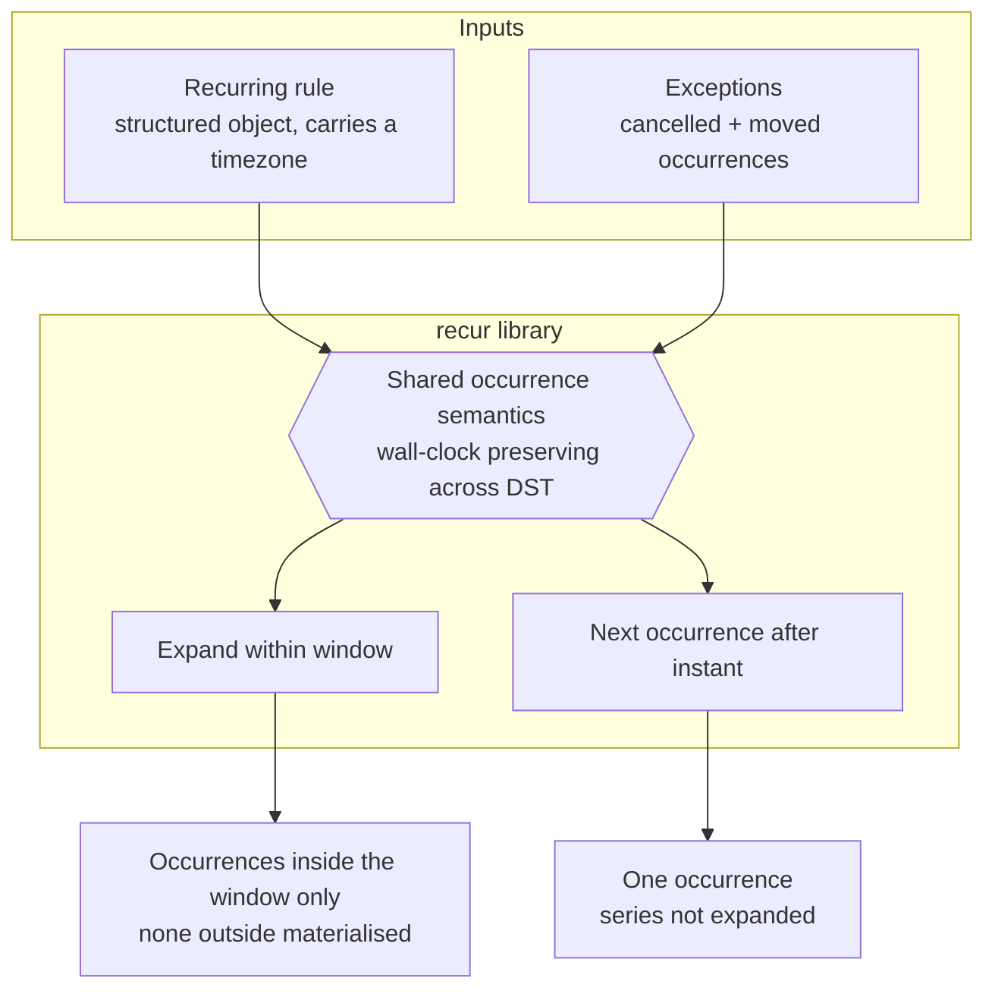

# PRD: `recur` — Recurring Event Expansion

**Version**: 1.0.0
**Status**: Draft
**Created**: 2026-08-15
**Last Updated**: 2026-08-15
**Author**: @product-manager
**Stakeholders**: The author of `SPEC.md` (repo owner) is the only stakeholder named in the source. No others are identified, and none are inferred here.

**Source of record**: `/Users/james/dev/ab-calendar/SPEC.md`, read in full. Every requirement below carries an inline trace to that file, to a measurement recorded in Appendix B, or is marked as a derivation with its reasoning shown.

**A second draft of this PRD exists and neither draft is declared authoritative** — see OQ-6 and Appendix D. Do not generate a TRD from this file until that is settled.

---

## Changelog

| Version | Date | Changes | Author |
|---------|------|---------|--------|
| 1.0.0 | 2026-08-15 | Initial PRD creation from `SPEC.md` | @product-manager |

---

## 1. Product Summary

### 1.1 Problem Statement

A calendar widget needs to display recurring events, but the recurrence rules it holds are declarative — a definition, not a list of dates. The widget needs concrete occurrences for the window it is currently showing, and it needs the single next occurrence after a given instant. Neither is available today: *"Nothing is built yet. The project is empty."* (SPEC.md)

Two properties make this harder than a loop over a fixed interval, and both are stated as MUSTs in the source:

- **Occurrences are not evenly spaced in absolute time.** An event that recurs across a daylight-saving transition must keep its wall-clock time, not its elapsed offset — *"An event at 09:00 local stays at 09:00 local after the clocks change."* (SPEC.md Requirement 2)
- **Neither query may pay for the whole series.** A window query must not materialise occurrences outside the window (Requirement 1); a next-occurrence query must not expand the series to find its answer (Requirement 4).

The source names the collision between these two directly, and does not resolve it:

> "Requirement 2 and requirement 4 pull against each other, and I don't know how to reconcile them. Keeping wall-clock time across a DST transition means occurrences are not evenly spaced in absolute time, so you cannot jump to the Nth occurrence by arithmetic — but requirement 4 says you must not expand the series to find the next one. That tension is what I want designed. I have no answer for it."

### 1.2 Proposed Solution

`recur`, a library that takes a structured recurring-event definition (plus its exceptions) and answers two questions about it:

1. **Expand**: given a window of time, return the concrete occurrences inside that window.
2. **Next**: given an instant, return the next occurrence after it.

Both answers must respect cancelled and moved occurrences, must preserve wall-clock time across DST transitions, and must be independent of the calling process's timezone.

**This PRD does not propose a design for the Requirement 2 / Requirement 4 reconciliation.** The source explicitly hands that problem to the design stage — *"That tension is what I want designed. I have no answer for it."* Producing that design is the defining obligation of the TRD, recorded here as **G6** and **R1**, not as a solution.

### 1.3 Value Proposition

The calendar widget can render any window of a recurring series correctly — including across clock changes — without the widget author reimplementing recurrence arithmetic, and without the cost of the query scaling with the length of the series.

### 1.4 Key Differentiators

Not applicable. The source describes an internal library for one named consumer; it makes no competitive or market claim, and none is invented here.

### 1.5 Solution Architecture

The diagram earns its place only because the central risk is a relationship the prose states but does not make visual: two separate query paths that must agree on identical occurrence semantics, while being forbidden from sharing the obvious implementation (full expansion).

The two output constraints are what make the shared-semantics box hard: both paths must produce answers consistent with the same rule, and neither may reach its answer by walking the series.

---

## 2. User Analysis

### 2.1 Target Users

| User Type | Description | Primary Need |
|-----------|-------------|--------------|
| Calendar widget developer | The consumer named in the source: *"`recur` is a library for a calendar widget."* | Concrete occurrences for the window currently on screen, and the next upcoming occurrence |

No second user type is named in the source, and none is added here.

### 2.2 User Personas

**Persona: the calendar widget developer**

- **Role**: Developer of the calendar widget that consumes this library. Named in SPEC.md line 3.
- **Goals**: Render a visible time window of a recurring series; show "next occurrence" without loading the series.
- **Pain Points**: The two named in the source — occurrences drifting off their wall-clock time across a DST transition (Requirement 2), and paying full-series cost for a bounded question (Requirements 1 and 4).
- **Technical Proficiency**: High. *Derived*, not researched: the source specifies the runtime, module system and test runner directly and imposes a dependency-justification rule, which is a practitioner's framing. No user research was conducted for this PRD.

### 2.3 User Journey

Omitted deliberately. The journey is a synchronous function call from a library consumer; there is no multi-step or multi-actor flow to diagram, and drawing one would add a picture without adding information.

---

## 3. Goals and Non-Goals

### 3.1 Goals

Success metrics below are binary and testable. No numeric threshold appears in the source, so none is set here — see the note under Section 5.

| ID | Goal | Success Metric | Priority |
|----|------|----------------|----------|
| G1 | Expand a rule into the occurrences inside a requested window | For a rule and window, the returned set equals the expected occurrences for that window, and occurrences outside the window are not materialised | P0 |
| G2 | Preserve wall-clock time across DST transitions | An event defined at a local time keeps that local time on both sides of a transition (source's example: 09:00 local stays 09:00 local) | P0 |
| G3 | Support cancelled and moved individual occurrences | A cancelled occurrence is absent from results; a moved occurrence appears at its overridden time and not at its series time | P0 |
| G4 | Answer "next occurrence after this instant" without expanding the series | The correct next occurrence is returned, and the answer is not obtained by walking the series | P0 |
| G5 | Behave identically regardless of the caller's process timezone | Identical inputs produce identical outputs when the test process runs under differing `TZ` values, including one matching and one not matching the event's timezone | P0 |
| G6 | Deliver an explicit reconciliation of the Requirement 2 / Requirement 4 tension | A design exists that satisfies G2 and G4 simultaneously, with neither weakened | P0 |

G6 is a design-stage obligation, stated because the source states it: *"That tension is what I want designed."* It is listed as a goal so that it cannot be closed by quietly relaxing G2 or G4.

### 3.2 Non-Goals (Explicit Scope Exclusions)

| ID | Non-Goal | Rationale |
|----|----------|-----------|
| NG1 | Parsing iCalendar / RFC 5545 text into a rule | Source, "Not doing": *"Parsing or emitting iCalendar/RFC 5545 text. The rule arrives as a structured object."* |
| NG2 | Emitting iCalendar / RFC 5545 text from a rule | Same source line as NG1; the emit half is stated alongside the parse half |
| NG3 | Storage, persistence, or any database | Source, "Not doing": *"Storage, persistence, or any database."* The library computes from inputs it is handed; it owns no state across calls |
| NG4 | Adding a runtime dependency without a named justification | Source, Context: *"No dependencies unless a requirement forces one — and if one does, say which requirement and why."* This is a conditional exclusion, not an absolute one — see NFR-3 and the Decisions table |
| NG5 | Rendering, UI, or any calendar-widget code | The source scopes this deliverable as *"a library for a calendar widget"* — the widget is the consumer, not part of the build |

NG5 is a boundary the source draws by its framing rather than by a "Not doing" bullet; it is recorded so that widget work is not pulled in during implementation.

---

## 4. Feature Requirements

### 4.0 Source coverage

Every numbered requirement in `SPEC.md`, and every "Not doing" bullet, is accounted for below. Nothing in the source is left unplaced.

| SPEC.md item | Where it lands here |
|--------------|---------------------|
| Requirement 1 — expand within a window, nothing outside materialised | F1 |
| Requirement 2 — wall-clock preserved across DST | F2 |
| Requirement 3 — cancelled and moved occurrences | F3 |
| Requirement 4 — next occurrence without expanding the series | F4 |
| Requirement 5 — identical behaviour regardless of process timezone | F5 |
| "Not doing" — iCal/RFC 5545 parse and emit | NG1, NG2 |
| "Not doing" — storage/persistence/database | NG3 |
| "The hard part" — R2 vs R4 tension | G6, R1 (risk), D5 (decision) |
| Context — Node, ES modules, `node --test` | NFR-1, NFR-2 |
| Context — dependency justification rule | NFR-3, NG4, D4 |

### 4.1 P0 - Core Features (Must Have)

All five source requirements are stated with "MUST". All five are therefore P0. There is no basis in the source for ranking any of them below the others.

#### F1: Window expansion

**Priority**: P0
**Source**: SPEC.md Requirement 1, verbatim: *"It MUST expand a recurring rule into concrete occurrences within a requested window, without materialising occurrences outside it."*
**Description**: Given a rule and a window of time, return the concrete occurrences falling inside that window. Occurrences outside the window are not constructed.

**User Stories**:
- As a calendar widget developer, I want the occurrences for the window I am displaying so that I can render a recurring event without computing the recurrence myself.

**Acceptance Criteria**:
- [ ] AC-F1.1: For a given rule and window, the returned occurrences are exactly those falling inside the window.
- [ ] AC-F1.2: Occurrences outside the requested window are not materialised. *(Verbatim constraint from the source. How this is observed in a test is unresolved — see OQ-4.)*
- [ ] AC-F1.3: A window containing no occurrences of the rule returns an empty result rather than an error. *(Derived: the source states expansion returns "the concrete occurrences inside that window"; a window with none is the zero case of that statement. Flagged as a derivation, not a source requirement.)*

**Dependencies**: Shares occurrence semantics with F2, F3, F4, F5.

#### F2: Wall-clock preservation across DST transitions

**Priority**: P0
**Source**: SPEC.md Requirement 2, verbatim: *"It MUST handle events that recur across a daylight-saving transition such that each occurrence keeps its intended wall-clock time, not its intended elapsed offset. An event at 09:00 local stays at 09:00 local after the clocks change."*
**Description**: Occurrences are anchored to local wall-clock time in the event's timezone, so the absolute instant shifts when the offset changes, rather than the local time shifting.

**User Stories**:
- As a calendar widget developer, I want a 09:00 recurring event to still read 09:00 after the clocks change so that the displayed series does not silently drift by an hour.

**Acceptance Criteria**:
- [ ] AC-F2.1: A series defined at a given local time yields occurrences at that same local time on both sides of a DST transition. The source's own example — 09:00 local before and after — is the reference case.
- [ ] AC-F2.2: The absolute (UTC) instants of two consecutive occurrences spanning a transition differ from the nominal interval by the offset change, confirming wall-clock rather than elapsed-offset anchoring.
- [ ] AC-F2.3: Behaviour is defined for occurrences landing in a nonexistent or repeated local time caused by the transition. **Unresolved — see OQ-2.** No policy is specified here, because the source specifies none.

**Dependencies**: The event's timezone must be carried on the rule. *(Derived from Requirement 5's phrase "the event's timezone", which presupposes the event has one.)*

#### F3: Exceptions — cancelled and moved occurrences

**Priority**: P0
**Source**: SPEC.md Requirement 3, verbatim: *"It MUST support exceptions: individual occurrences that are cancelled, and individual occurrences that are moved to a different time from the rest of the series."*
**Description**: Individual occurrences may be cancelled, or moved to a time differing from the series pattern. Both kinds are honoured wherever occurrences are produced.

**User Stories**:
- As a calendar widget developer, I want a cancelled instance to be absent from results so that the widget does not display a meeting that was called off.
- As a calendar widget developer, I want a rescheduled instance to appear at its new time so that the widget shows where the meeting actually is.

**Acceptance Criteria**:
- [ ] AC-F3.1: A cancelled occurrence does not appear in window-expansion results.
- [ ] AC-F3.2: A moved occurrence appears at its overridden time, and does not also appear at its original series time.
- [ ] AC-F3.3: Exceptions are honoured identically by the next-occurrence query (F4). *(Derived: Requirements 3 and 4 read together — a "next occurrence" that returned a cancelled instance would contradict Requirement 3. Flagged as a derivation; if the intended behaviour differs, this AC is the place to correct it.)*
- [ ] AC-F3.4: A moved occurrence whose new time falls inside the requested window is returned even if its original series time fell outside it, and vice versa. *(Derived from F1 + F3 read together: "moved to a different time" implies the moved time is the occurrence's time for windowing purposes. Flagged as a derivation. See OQ-3.)*

**Dependencies**: F1, F4.

#### F4: Next occurrence after an instant

**Priority**: P0
**Source**: SPEC.md Requirement 4, verbatim: *"It MUST be able to answer 'what is the next occurrence after this instant' without expanding the whole series."*
**Description**: Given an instant, return the next occurrence of the series after it, without expanding the series to find it.

**User Stories**:
- As a calendar widget developer, I want the next upcoming occurrence of a series so that I can show it without loading the whole series.

**Acceptance Criteria**:
- [ ] AC-F4.1: For a given rule and instant, the correct next occurrence is returned.
- [ ] AC-F4.2: The answer is not obtained by expanding the whole series. *(Verbatim constraint from the source. How this is observed in a test is unresolved — see OQ-4.)*
- [ ] AC-F4.3: The result is consistent with what F1 would return for a window starting at that instant — the two queries agree on the same series.
- [ ] AC-F4.4: Behaviour is defined when the series has no occurrence after the given instant. **Unresolved — see OQ-3.**
- [ ] AC-F4.5: Boundary semantics are defined for an instant that coincides exactly with an occurrence. **Unresolved — see OQ-3.**

**Dependencies**: F2 (must respect wall-clock anchoring), F3 (must respect exceptions, per AC-F3.3). **This feature is the one in direct tension with F2 — see R1.**

#### F5: Process-timezone independence

**Priority**: P0
**Source**: SPEC.md Requirement 5, verbatim: *"It MUST behave identically whether the caller's process timezone matches the event's timezone or not."*
**Description**: Results depend on the event's timezone and the inputs, never on the ambient timezone of the process making the call.

**User Stories**:
- As a calendar widget developer, I want identical results whatever timezone my server or browser is in so that behaviour does not change between my machine and production.

**Acceptance Criteria**:
- [ ] AC-F5.1: F1 and F4 return identical results for identical inputs when the process timezone is set to the event's timezone and when it is set to a different one.
- [ ] AC-F5.2: The test suite exercises at least one process timezone that does not match the event's timezone. *(The development machine's process timezone was measured as `America/Los_Angeles` — Appendix B — so a non-matching case is available without configuration, but must not be relied on implicitly.)*

**Dependencies**: F1, F2, F4.

### 4.2 P1 - Enhanced Features (Should Have)

None. The source states five requirements, all as MUSTs, and asks for nothing beyond them. This section is empty because the source is empty here, not because it is unfinished.

### 4.3 P2 - Future Features (Nice to Have)

None. See 4.2.

---

## 5. Non-Functional Requirements

| ID | Requirement | Source |
|----|-------------|--------|
| NFR-1 | Runs on Node using ES modules | SPEC.md Context: *"Node, ES modules, `node --test`."* Corroborated by `package.json`, which sets `"type": "module"` |
| NFR-2 | Tests run under `node --test` | SPEC.md Context, same line. Corroborated by `package.json`, whose test script is `node --test test/` |
| NFR-3 | No runtime dependencies unless a requirement forces one; where one is added, the specific requirement forcing it and the reason must be stated | SPEC.md Context, verbatim: *"No dependencies unless a requirement forces one — and if one does, say which requirement and why."* |

**No performance figure appears in this PRD, because none appears in the source.** Requirements 1 and 4 constrain *what must not happen* ("without materialising occurrences outside it", "without expanding the whole series") rather than how fast anything must be. Those constraints are tracked as AC-F1.2 and AC-F4.2 — attached to the features they are inseparable from — and are deliberately not restated here as a latency, throughput or complexity target. Any such number would be invented.

No Node version floor is stated here. The source says "Node" without a version; the measurement in Appendix B records what one machine happens to run, which is evidence about feasibility, not a stated requirement.

---

## 6. Acceptance Criteria Summary

### Feature Acceptance Criteria

| ID | Feature | Criterion | Verification Method |
|----|---------|-----------|---------------------|
| AC-F1.1 | F1 | Returned occurrences are exactly those inside the window | Unit test (`node --test`) |
| AC-F1.2 | F1 | Occurrences outside the window are not materialised | Unit test — observation mechanism unresolved (OQ-4) |
| AC-F1.3 | F1 | Empty window returns empty result, not an error | Unit test |
| AC-F2.1 | F2 | Local time preserved on both sides of a DST transition | Unit test |
| AC-F2.2 | F2 | Absolute interval across a transition differs by the offset change | Unit test |
| AC-F2.3 | F2 | Defined behaviour for nonexistent/repeated local times | Blocked on OQ-2 |
| AC-F3.1 | F3 | Cancelled occurrence absent from expansion | Unit test |
| AC-F3.2 | F3 | Moved occurrence appears once, at its overridden time | Unit test |
| AC-F3.3 | F3 | Next-occurrence query honours exceptions | Unit test |
| AC-F3.4 | F3 | Moved occurrence is windowed by its moved time | Unit test — pending OQ-3 |
| AC-F4.1 | F4 | Correct next occurrence returned for an instant | Unit test |
| AC-F4.2 | F4 | Answer not obtained by expanding the series | Unit test — observation mechanism unresolved (OQ-4) |
| AC-F4.3 | F4 | Next-occurrence result agrees with window expansion | Unit test |
| AC-F4.4 | F4 | Defined behaviour when no occurrence follows the instant | Blocked on OQ-3 |
| AC-F4.5 | F4 | Defined boundary semantics at an exact-match instant | Blocked on OQ-3 |
| AC-F5.1 | F5 | Identical results under matching and non-matching process TZ | Unit test run under differing `TZ` values |
| AC-F5.2 | F5 | Suite exercises a non-matching process timezone | Unit test / test-suite inspection |

### Non-Functional Acceptance Criteria

| ID | Requirement | Criterion | Verification Method |
|----|-------------|-----------|---------------------|
| AC-N1 | NFR-1 | Library loads and runs as ES modules under Node | Test suite executes |
| AC-N2 | NFR-2 | Full suite runs via `node --test` | `npm test` |
| AC-N3 | NFR-3 | Dependency list is empty, or each entry names the requirement forcing it and why | Inspection of `package.json` and the TRD's justification |

---

## 7. Risk Assessment

| ID | Risk | Likelihood | Impact | Mitigation Strategy |
|----|------|------------|--------|---------------------|
| R1 | The Requirement 2 / Requirement 4 tension is not reconciled, and the design satisfies one at the cost of the other | High | High | The source states the author has no answer (*"I have no answer for it"*), so this is an open problem entering design, not a hypothetical. G6 makes the reconciliation an explicit deliverable. Neither F2 nor F4 may be weakened to close it without the author's decision |
| R2 | The shape and expressiveness of the recurrence rule are undefined in the source, so implementation invents a grammar that does not match the widget's actual rules | High | Medium | OQ-1 must be settled before task breakdown. The source says only that the rule "arrives as a structured object" — it enumerates no frequencies, intervals, or terminators |
| R3 | DST edge cases — an occurrence landing in a skipped or repeated local hour — are handled inconsistently between the two query paths | Medium | Medium | OQ-2 must be settled and a single policy applied to both paths. AC-F4.3 (cross-query agreement) is the guard that would catch divergence |
| R4 | Timezone-correct arithmetic proves impossible without a dependency, colliding with NFR-3 | Low | Medium | Appendix B measurement shows the platform provides IANA timezone support natively, which is why likelihood is rated Low. If a dependency does prove necessary, NFR-3's escape hatch applies: name the requirement forcing it and why |

### Contingency Plans

**R1 Contingency**: If design cannot satisfy F2 and F4 simultaneously, do not silently pick a winner. Surface the specific impossibility to the author with the two candidate relaxations stated concretely (e.g. what "next occurrence" would cost if it may walk part of the series, versus what wall-clock fidelity would cost if it may not). The source asked for this tension to be *designed*, so an honest "here is why it cannot be fully closed, here are the options" is an acceptable outcome; an unremarked weakening of either requirement is not.

**R2 Contingency**: If OQ-1 cannot be settled with the author before implementation starts, scope the first implementation to the narrowest rule shape that exercises all five requirements, and record the supported shape explicitly as a limitation rather than presenting it as complete.

---

## 8. Decisions and Rejected Alternatives

| ID | Proposal / Challenge | Verdict | Rationale | Revisit when |
|----|----------------------|---------|-----------|--------------|
| D1 | Parse iCalendar / RFC 5545 text into rules | Rejected | Source, "Not doing". The rule arrives as a structured object | A consumer needs to accept iCalendar text as input; this would be a separate adapter above `recur`, not a change to it |
| D2 | Emit iCalendar / RFC 5545 text | Rejected | Source, "Not doing" | A consumer needs to export series in interchange format |
| D3 | Own storage or persistence of occurrences | Rejected | Source, "Not doing". The library computes from inputs handed to it and holds no state across calls | The library is asked to own occurrence state across processes — which would be a different product, not a feature of this one |
| D4 | Add a datetime or timezone dependency up front | Rejected as a default, permitted conditionally | Source, Context: dependencies allowed only when a requirement forces one, with the requirement and reason named. Appendix B shows the platform provides IANA timezone support natively | A specific requirement is shown to be unimplementable on platform primitives; at that point add it and state which requirement and why, per NFR-3 |
| D5 | Resolve the R2/R4 tension by relaxing either requirement | Rejected | Both are stated as MUSTs, and the source explicitly asks for the tension to be *designed*, not arbitrated | Design demonstrates the two are provably irreconcilable; then the author chooses which to relax — see R1 Contingency. Not a decision for the implementer |
| D6 | Add P1/P2 features beyond the five stated requirements | Rejected | The source asks for five things. Anything beyond them would be scope nobody requested | The author adds requirements to `SPEC.md` or requests them via `/refine-prd` |

### Confirmed grounding — do not re-litigate

Verbatim from `SPEC.md`:

- *"Nothing is built yet. The project is empty."* — this is greenfield; there is no existing implementation to preserve or migrate.
- *"The rule arrives as a structured object."* — input format is settled.
- *"No dependencies unless a requirement forces one — and if one does, say which requirement and why."*
- *"That tension is what I want designed. I have no answer for it."* — the author is not withholding a solution; the design work is genuinely open.
- *"Node, ES modules, `node --test`."*

---

## Appendices

### Appendix A: Glossary

| Term | Definition |
|------|------------|
| Occurrence | One concrete instance of a recurring event, at a definite time |
| Rule | The structured recurring-event definition handed to the library; not iCalendar text (NG1) |
| Window | A bounded span of time for which occurrences are requested (SPEC.md Requirement 1) |
| Exception | An individual occurrence that is cancelled or moved (SPEC.md Requirement 3) |
| Wall-clock time | The local time as read off a clock in the event's timezone, independent of UTC offset (SPEC.md Requirement 2) |
| Process timezone | The ambient timezone of the Node process calling the library (SPEC.md Requirement 5) |

### Appendix B: Measurements

Taken on the development machine on 2026-08-15, in `/Users/james/dev/ab-calendar`. These are observations about one machine, not stated requirements, and not a portability guarantee.

| Observation | Value | How obtained |
|-------------|-------|--------------|
| Node version | v22.23.0 | `node -v` |
| IANA timezone formatting available | Yes — `Intl.DateTimeFormat` with `timeZone: 'America/New_York'` produced a correctly offset, DST-aware result | `node -e` with `Intl.DateTimeFormat` |
| `Intl.DateTimeFormat.prototype.formatToParts` | Available | `node -e` typeof check |
| `Temporal` global | Not available | `node -e` typeof check |
| Process timezone on this machine | `America/Los_Angeles` | `Intl.DateTimeFormat().resolvedOptions().timeZone` |

**Belief, not fact**: that these platform capabilities are sufficient to satisfy Requirement 2 without any dependency. The measurement establishes that IANA timezone data is *reachable* from the platform on this machine; it does not establish that every operation the design needs (in particular, resolving a wall-clock time in a zone back to an absolute instant, including in gap and overlap cases) is expressible on those primitives. **What would settle it**: a spike implementing the wall-clock-to-instant conversion, including a spring-forward gap and a fall-back overlap, using only platform APIs. This is the direct input to R4 and D4.

**Belief, not fact**: that the deployment target runs a Node build with full ICU. This machine does, per the measurement above. **What would settle it**: confirming the target Node build and ICU configuration with the author, or a runtime capability check in the test suite.

### Appendix C: Open Questions

These are gaps in the source, not decisions deferred by this PRD. Each one is a place where implementation would otherwise invent an answer silently.

| ID | Question | Status | Resolution |
|----|----------|--------|------------|
| OQ-1 | What shape and expressiveness does the recurrence rule have? The source says only that it is "a structured object" — it names no frequencies, intervals, counts, end conditions, or by-day style selectors. | Open | Needed before task breakdown. Drives R2 |
| OQ-2 | What happens when an occurrence's wall-clock time does not exist (spring-forward gap) or exists twice (fall-back overlap) in the event's timezone? Requirement 2's wall-clock anchoring makes this reachable, but the source specifies no policy. | Open | Blocks AC-F2.3. Drives R3 |
| OQ-3 | What are the boundary semantics? Specifically: is a window's start/end inclusive or exclusive; is "next occurrence after this instant" strictly after or at-or-after (AC-F4.5); and what is returned when no occurrence follows (AC-F4.4)? | Open | Blocks AC-F4.4, AC-F4.5; touches AC-F3.4 |
| OQ-4 | How are "without materialising occurrences outside it" (Requirement 1) and "without expanding the whole series" (Requirement 4) to be *observed* in a test? Both are stated as prohibitions on internal behaviour, which a black-box assertion on return values cannot detect. | Open | Blocks AC-F1.2, AC-F4.2 from being genuinely verifiable rather than nominally checked |
| OQ-5 | Is there a required Node version floor? The source says "Node" without qualification; Appendix B records only what one machine runs. | Open | Affects whether platform-primitive-only implementation (D4) is safe to assume |
| OQ-6 | Which PRD draft for `recur` is authoritative — this one, or `/Users/james/dev/ab-calendar/artifacts/old/PRD.md`? Both trace to the same `SPEC.md`, carry the same Created date and the same version (1.0.0), and materially conflict (Appendix D). Nothing in either file, in `CLAUDE.md`, in `.trd-state/current.json` (all four fields `null`), or in git history declares one to supersede the other; `artifacts/` is untracked. | Open | Blocks `/create-trd`, which would otherwise pick a draft arbitrarily. **What would settle it**: the author naming one draft and deleting or explicitly marking the other superseded. Until then, note that on every conflict point listed in Appendix D this draft's position traces to `SPEC.md` and the other draft's does not — that is evidence, not a decision |

### Appendix D: Related Documents

- `/Users/james/dev/ab-calendar/SPEC.md` — the source of record for this PRD
- `/Users/james/dev/ab-calendar/package.json` — corroborates NFR-1 and NFR-2
- `/Users/james/dev/ab-calendar/artifacts/old/PRD.md` — **a second, materially different PRD draft for this same feature** (732 lines vs this file's 390), from the same `SPEC.md` and the same date. Recorded here so that a reader of either file knows the other exists. The two conflict on four points, and on each of them this draft's position traces to `SPEC.md` while the other draft's does not:

| Point | This draft | `artifacts/old/PRD.md` | What `SPEC.md` says |
|-------|-----------|------------------------|---------------------|
| Stakeholders | One named (the repo owner); none inferred | Three groups: calendar widget team, library maintainer, downstream app developers | Names no stakeholder |
| Non-goals | NG1–NG5; NG1–NG3 quote "Not doing" verbatim, NG4–NG5 flagged as boundary/conditional | NG1–NG10; NG4–NG10 have no source line | Two "Not doing" bullets |
| Scope | D6 rejects any P1/P2 feature beyond the five requirements | Proposes five P1/P2 features (F6–F10) | Asks for five things, all MUSTs |
| Performance | None stated; §5 says any number would be invented | Numeric targets and a frame-budget timing assertion | States no figure; Requirements 1 and 4 constrain what must not happen, not speed |

  Which draft governs is unresolved — see OQ-6. This table is the evidence, not the verdict.
