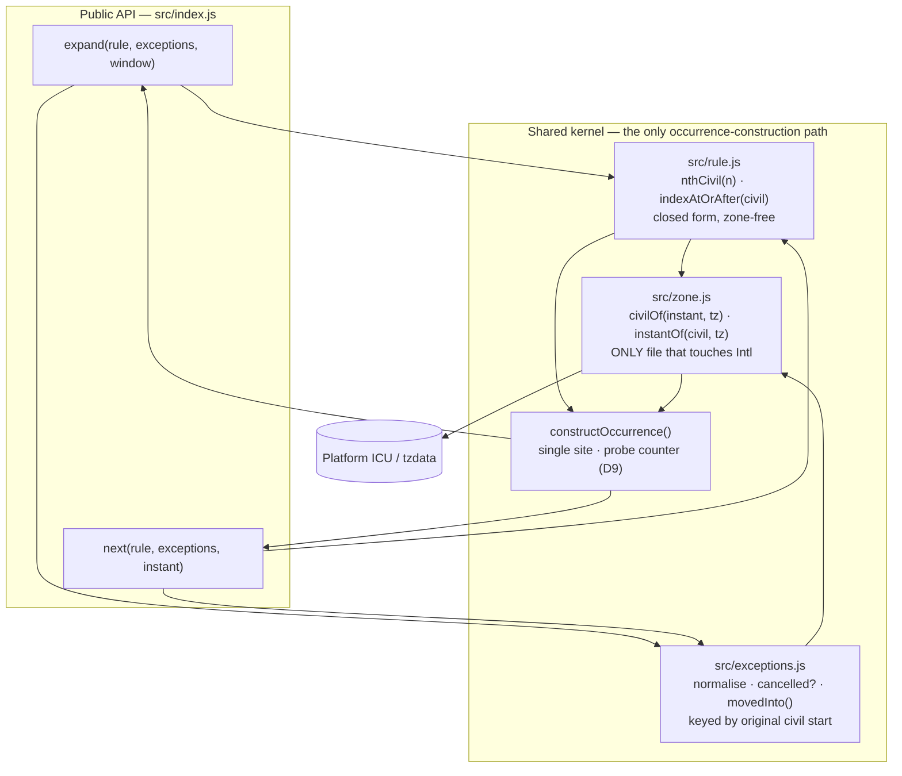
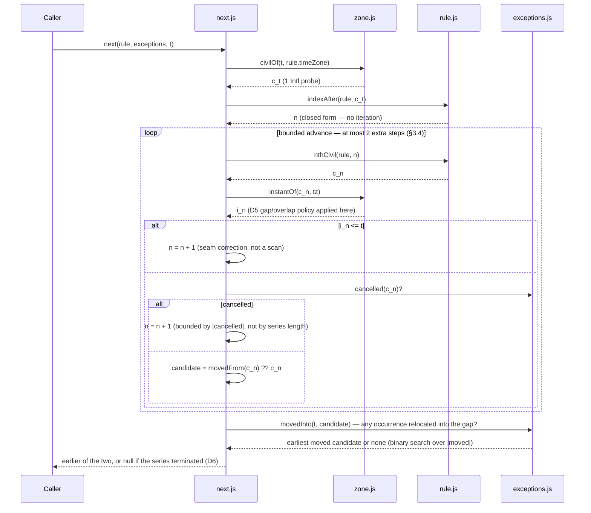

# TRD: `recur` — Recurring Event Expansion

**Version**: 1.0.0
**Status**: Draft
**Created**: 2026-08-15
**Last Updated**: 2026-08-15
**Author**: @technical-architect
**Source PRD**: `/Users/james/dev/fortium/ensemble-vnext/docs/modernization/runs/case2-calendar/v3/PRD.md`
**Target repository**: `/Users/james/dev/ab-calendar` (greenfield — `src/` and `test/` are empty)
**Task ID Prefix**: `RECUR`

---

## Changelog

| Version | Date | Changes | Author |
|---------|------|---------|--------|
| 1.0.0 | 2026-08-15 | Initial TRD creation from PRD v1.0.0. Resolves PRD OQ-1 through OQ-6; delivers the G6 reconciliation design. | @technical-architect |

---

## 1. Overview

### 1.1 Technical Summary

`recur` is a single zero-dependency ESM package that answers two questions about a
recurring-event definition: *what occurs inside this window* (F1) and *what occurs next
after this instant* (F4). Both answers must preserve wall-clock time across DST
transitions (F2), honour cancelled and moved occurrences (F3), and be independent of the
calling process's timezone (F5).

#### The G6 reconciliation — the defining obligation of this document

PRD G6 requires an explicit reconciliation of Requirement 2 against Requirement 4, with
neither weakened. The source states the tension as: *"Keeping wall-clock time across a DST
transition means occurrences are not evenly spaced in absolute time, so you cannot jump to
the Nth occurrence by arithmetic."*

**That premise is true only in the absolute-time domain. The design changes domain.**

A wall-clock-anchored series *is* evenly spaced — in **civil time** (the local calendar and
clock of the event's timezone). Requirement 2 is precisely the statement that the series is
an arithmetic progression in civil time. The irregularity lives entirely in the *mapping*
from civil time to absolute instant, and that mapping is a per-instant lookup, not a walk.

So the reconciliation is:

1. **Do all index arithmetic in the civil domain, where it is closed-form.** The civil time
   of occurrence *n* is `start_civil + n × interval` — one calculation, no iteration. Its
   inverse, "the first index whose civil time is after *c*", is likewise closed-form.
2. **Convert to absolute only at the boundary, one candidate at a time.** `civil → instant`
   costs a bounded number of `Intl` probes and touches no other occurrence.
3. **Correct for the non-monotonic seam with a bounded advance, not a scan.** Because the
   civil→instant map can compress or invert across a transition, the first closed-form
   candidate may land at or before the query instant. Advancing the index recovers
   correctness in **at most two extra steps**, a constant derived in §3.4 from the IANA
   offset range and the grammar's minimum step — *not* a function of series length.

Neither requirement is relaxed. F2 holds exactly, because the arithmetic is performed in
the domain F2 defines. F4 holds exactly, because the number of occurrences ever constructed
is bounded by the *inputs* (window width, exception count) and never by the *length of the
series*.

The same three primitives serve both query paths, which is what makes them agree
(AC-F4.3) and what makes a DST-edge policy divergence between them structurally impossible
(PRD R3).

#### Source resolution — PRD OQ-6 and the "do not generate a TRD" marker

The PRD carries a blocking marker: *"A second draft of this PRD exists and neither draft is
declared authoritative … Do not generate a TRD from this file until that is settled."*
It is settled as follows, on evidence gathered for this document:

| Check | Finding |
|---|---|
| Does the cited competing draft exist at its cited path? | **No.** `/Users/james/dev/ab-calendar/artifacts/` does not exist. |
| Where is that draft now? | `docs/modernization/runs/case2-calendar/old/PRD.md` — 732 lines, matching the PRD's own description of the other draft. |
| What is that directory? | Per `runs/case2-calendar/README.md`, the **`old` arm of a two-arm pipeline comparison**. Both arms consume the same `SPEC.md`; `old` is the pre-item-10 workflow, `v3` the current one. |
| Relationship between the drafts | **Siblings from one source, not successor and predecessor.** Neither supersedes the other; they are outputs of two pipelines being measured against each other. |
| Governing instruction | The authoring instruction for this TRD names `v3/PRD.md` as the source of truth. |

**Resolution:** `v3/PRD.md` is the in-scope source. Nothing supersedes it, and the marker
described a comparison artifact rather than a supersession. The `old` draft's four conflict
points (Appendix D of the PRD) are not merged in: on each of them the `old` draft's position
has no `SPEC.md` line behind it, and importing it would import objectives with no provenance
— in particular its numeric performance targets, which §6.4 of this TRD records as absent
from the source.

#### Governing project rules

The target repository has **no `constitution.md` and no `stack.md`** — verified by listing
`/Users/james/dev/ab-calendar/.claude/rules/`, which contains only `async-discipline.md`,
`autonomy.md` and `command-status.md`; `/init-project` has not been run there (its
`CLAUDE.md` still carries `{{PROJECT_NAME}}` placeholders). The authoring project's
`.claude/rules/constitution.md` therefore supplies the quality floors, and this TRD does not
exceed them.

Where the authoring project's `stack.md` (Jest, pytest, BATS) conflicts with the target's
runtime, **the PRD's NFR-1/NFR-2 win**: they quote `SPEC.md` directly (*"Node, ES modules,
`node --test`"*) and are corroborated by the target's own `package.json`. `stack.md`
describes the plugin-development repository, not an artifact built in a different one.

### 1.2 Key Technical Decisions

| ID | Decision | Choice | Serves Objective | Rationale | Alternatives Considered |
|----|----------|--------|------------------|-----------|-------------------------|
| D1 | Domain of the recurrence arithmetic | Perform all index arithmetic in **civil time** in the event's timezone; convert to absolute instants only at the query boundary, one candidate at a time | **G6**, G2, G4 | A wall-clock-anchored series is an exact arithmetic progression in civil time. This dissolves the stated tension rather than trading one requirement against the other | (a) Absolute-time arithmetic with a DST correction table — rejected: reintroduces the uneven-spacing problem the source names, and needs zone data we would have to embed. (b) Precompute an occurrence index — rejected: NG3 forbids persistence and it scales with series length. **Revisit** if a rule shape is added whose civil progression is not arithmetic (e.g. "last Friday of the month"), which would need a per-period generator inside the same kernel |
| D2 | Reaching occurrence *n* without a walk | Closed-form `indexAtOrAfter(rule, civil)` → candidate index, then a **bounded advance** (≤2 extra steps, derived in §3.4) to correct for the civil→instant seam | **G4**, AC-F4.2, AC-F1.2 | The correction bound comes from the IANA offset range against the grammar's minimum step, so it is a constant with respect to series length — which is exactly what Requirement 4 prohibits scaling with | (a) Binary search over indices probing `instantOf` — rejected: O(log N) still reads N, and is slower than closed-form for no gain. (b) Linear scan from the series start — rejected: this is the thing Requirement 4 forbids. **Revisit** if D7 is widened to sub-daily intervals, where the bound becomes `⌈maxOffsetDelta / interval⌉` and must be recomputed |
| D3 | Sharing semantics between the two query paths | A single kernel — `civilOf`, `instantOf`, `nthCivil`, `indexAtOrAfter`, exception overlay — is the **only** way either path constructs an occurrence | AC-F4.3, G3, mitigates PRD R3 | Cross-path agreement becomes structural rather than test-enforced: there is no second code path that could adopt a different DST or exception policy | (a) Two independent implementations with a shared test suite — rejected: R3 is precisely the risk of divergence, and duplicated policy is how divergence happens. **Revisit** never for this reason; only if a path needs semantics the other must not have, which would be a new requirement |
| D4 | Timezone arithmetic implementation | `Intl.DateTimeFormat(…, {timeZone}).formatToParts` + `Date.UTC`, with a two-probe round-trip (§3.2). **Zero runtime dependencies** | NFR-3, AC-N3 | NFR-3 permits a dependency only when a requirement forces one. PRD Appendix B measured IANA formatting and `formatToParts` as available on the platform; `Temporal` is not | (a) Add `luxon`/`date-fns-tz` up front — rejected by PRD D4 as a default. (b) Embed a tzdata subset — rejected: it is a dependency wearing a vendoring disguise, and it goes stale. **Revisit** at RECUR-B001's acceptance gate: if the round-trip cannot be made correct in gap and overlap cases on platform primitives, NFR-3's escape hatch applies — add the dependency and name Requirement 2 as the requirement forcing it |
| D5 | DST gap / overlap policy (**resolves OQ-2**) | *Compatible* disambiguation: a civil time that does not exist (spring-forward gap) resolves to the first instant after the gap; a civil time that exists twice (fall-back overlap) resolves to the **earlier** instant. Applied inside `instantOf`, so both paths inherit it | AC-F2.3 | This is the ECMAScript `Temporal` default and matches what mainstream calendar software shows, so it is the least surprising behaviour for the named consumer. Locating it in `instantOf` is what makes it identical on both paths (PRD R3) | (a) Throw on gap/overlap — rejected: a widget cannot render an exception, and a rule that is fine for 363 days a year would break twice. (b) Skip the occurrence entirely — rejected: silently drops an event the user created. (c) Later instant on overlap — rejected: arbitrary, and inconsistent with the gap rule's forward-shift. **Revisit** if the author states a policy, or if the widget surfaces a user complaint about a doubled or shifted instance |
| D6 | Boundary semantics (**resolves OQ-3**) | Window is **half-open `[start, end)`**. `next(t)` is **strictly after** `t`. No occurrence after `t` → return **`null`**, not an error. A moved occurrence is windowed by its **moved** time | AC-F4.4, AC-F4.5, AC-F3.4, AC-F1.3 | Half-open windows tile without duplicating or dropping an occurrence at the seam, which is exactly what a scrolling widget does. Strictly-after makes `next` iterable — feeding a result back yields the following occurrence instead of looping. `null` matches AC-F1.3's stance that the zero case is not an error | (a) Closed window `[start, end]` — rejected: an occurrence on the boundary appears in two adjacent windows. (b) `next` at-or-after — rejected: `next(next(t))` never advances. (c) Throw when nothing follows — rejected: a terminating series legitimately has no next, and PRD AC-F1.3 already set the precedent. **Revisit** if the author specifies otherwise; the choice is one comparison operator per path, isolated in the kernel |
| D7 | Rule grammar for v1 (**resolves OQ-1**) | `{ start (civil), timeZone (IANA, required), freq: 'DAILY' \| 'WEEKLY', interval ≥ 1, count? \| until? }`. MONTHLY/YEARLY deferred and **recorded as a limitation** (§8.2) | PRD **R2 Contingency**, which authorises exactly this narrowing and requires the limitation be recorded | This is the narrowest shape that exercises all five MUSTs: DAILY across a transition exercises F2, the closed form exercises F4, exceptions attach to any shape, and the timezone field carries F5. It also *earns* something — a minimum civil step of one day is what bounds D2's correction to two advances. MONTHLY/YEARLY would force a month-overflow policy (skip vs clamp) that no requirement forces and the source never mentions | (a) Full RFC 5545 RRULE — rejected: NG1/NG2 exclude the format, and by-day/by-setpos selectors are scope nobody asked for. (b) Include MONTHLY/YEARLY now — rejected: forces an unsourced overflow policy and breaks the ≥1-day step that D2's bound rests on. **Revisit** when the author answers OQ-1 or the widget presents a monthly rule; the kernel extends without restructuring — `nthCivil`/`indexAtOrAfter` gain a month-unit branch and D2's bound is re-derived for it |
| D8 | Exception identity and storage | Exceptions key on the occurrence's **original civil start time** in the rule's timezone. `cancelled` and `moved` arrive as arrays, are normalised once per call into sorted structures, and are looked up by binary search | G3, AC-F3.1–AC-F3.4 | A civil-time key is directly comparable to `nthCivil(n)` output with no zone conversion, keeping the hot path zone-free. It is also stable if the zone's historical rules are later corrected, which a UTC-instant key would not be. Sorted lookup keeps `next`'s exception cost a function of exception count, not series length | (a) Key on the absolute instant — rejected: requires a conversion per comparison and shifts meaning under a tzdata update. (b) Key on integer occurrence index — rejected: the index is an implementation artifact; a caller cannot compute it, and it is invalidated by any change to `start`. **Revisit** if exceptions ever need to reference an occurrence the rule does not generate |
| D9 | Observing the two prohibition criteria (**resolves OQ-4**) | An optional `probe` callback, invoked at the kernel's single occurrence-construction site, counts constructions. Tests assert **invariance**: identical counts for a short series and an **unbounded** series (no `count`/`until`) | AC-F1.2, AC-F4.2 | The PRD notes both criteria are prohibitions on internal behaviour that a return-value assertion cannot see. Invariance against an unbounded series is the strongest available observation *and needs no invented number*: an implementation that walked the series would not terminate at all on the unbounded case | (a) Wall-clock timing assertion — rejected outright: that is a performance figure, and neither `SPEC.md` nor the PRD states one (PRD §5). (b) Absolute cap on construction count — rejected: the cap would be invented; invariance is a stronger claim and is free of thresholds. (c) Ship no observation and mark both ACs nominally checked — rejected: PRD names this the gap. **Revisit** if `probe` proves awkward in the public API; it can move behind a subpath export without weakening the test |
| D10 | Process-timezone independence mechanism | Kernel may use **only** `Date.UTC`, epoch milliseconds, and `Intl.DateTimeFormat` with an explicit `timeZone`. Ambient-timezone APIs (`Date` local getters/setters, `new Date(<string without offset>)`, `toLocaleString` without `timeZone`) are forbidden and checked by a static source scan in the suite. A full-ICU capability check runs before the matrix | G5, AC-F5.1, AC-F5.2, and PRD Appendix B's stated resolution for the ICU belief | The `TZ` matrix can only prove independence for the zones it runs under; the static scan covers the *mechanism* for all zones. They fail differently, which is why both are worth having | (a) `TZ` matrix alone — rejected: a single ambient call in a rarely-hit branch passes a two-zone matrix. (b) Static scan alone — rejected: proves nothing about behaviour. **Revisit** if the scan produces false positives on legitimate uses; it is a small allowlisted pattern set, not a linter dependency |
| D11 | What `expand` is allowed to construct | Index bounds are derived from the window edges by closed form; occurrence **objects** are constructed only for indices whose instants fall inside the window. Boundary indices are evaluated as index→instant *probes* and discarded | AC-F1.2, G1 | AC-F1.2 forbids materialising occurrences outside the window. A probe that computes an instant and discards it constructs no occurrence, and the design needs at most three probes past each edge (§3.4) to be correct at the seam. Stating the distinction explicitly is what stops it becoming a silent weakening | (a) Expand generously then filter — rejected: that is materialising outside the window, which AC-F1.2 names. (b) Refuse to probe past the edge — rejected: incorrect at a transition seam, where the in-window occurrence may sit at an index whose *civil* time is outside. **Revisit** never as a policy; the probe count changes only if D7 widens |
| D12 | Package structure | One ESM package: `src/zone.js`, `src/rule.js`, `src/exceptions.js`, `src/expand.js`, `src/next.js`, `src/index.js`; tests in `test/` run by `node --test` | NFR-1, NFR-2 | Mirrors the kernel boundary in D3 — `zone.js` is the only file that touches `Intl`, which is what makes D10's static scan a one-file check for the hot path | (a) Single-file library — rejected: `zone.js`'s isolation is load-bearing for D10. (b) Subpath exports per query — rejected: two functions do not need a subpath map. **Revisit** if the package grows a second public surface |

### 1.3 Technology Stack

| Layer | Technology | Purpose | Notes |
|-------|------------|---------|-------|
| Runtime | Node.js | Execution target | NFR-1. **No version floor is set** — `SPEC.md` states none and PRD OQ-5 leaves it open. PRD Appendix B measured v22.23.0 on one machine; that is evidence of feasibility, not a requirement. Capability is checked at test time instead (D10) |
| Module system | ES modules | Package format | NFR-1; corroborated by target `package.json` `"type": "module"` |
| Timezone data | Platform `Intl.DateTimeFormat` (ICU) | IANA offsets and DST transitions | D4. PRD Appendix B measured `formatToParts` available and `Temporal` unavailable |
| Test runner | `node --test` | Full suite | NFR-2; target `package.json` test script is already `node --test test/` |
| Coverage | `node --test --experimental-test-coverage` | Unit coverage measurement | Built into the runner named by NFR-2; adds no dependency |
| Runtime dependencies | **None** | — | NFR-3 / NG4. If D4's gate fails, the escape hatch is exercised and the forcing requirement named |

### 1.4 Integration Points

| System | Type | Direction | Notes |
|--------|------|-----------|-------|
| Calendar widget | In-process ESM import | Out | The only consumer named in the source. The widget itself is out of scope (NG5); the integration surface is the public API in §3.5 |
| Platform ICU / tzdata | Runtime API | In | Read-only, via `Intl.DateTimeFormat`. Not a package dependency (D4) |

There are no network, storage or service integrations — NG3 excludes persistence and the
library holds no state across calls.

---

## 2. System Architecture

### 2.1 Architecture Overview

The topology is not obvious from the task list, because the constraint that shapes it is
negative: the two public paths must agree without either being permitted to expand the
series. The diagram shows where that agreement is enforced — a single kernel both paths are
obliged to go through.



### 2.2 Component Architecture

#### 2.2.1 `src/zone.js` — civil ↔ absolute conversion

**Responsibility**: The only component aware that timezones exist. Converts an absolute
instant to civil parts in a named zone, and a civil time in a named zone back to an absolute
instant, applying D5's gap/overlap policy.
**Interfaces**: `civilOf(epochMs, timeZone) → Civil`, `instantOf(civil, timeZone) → epochMs`.
**Dependencies**: platform `Intl.DateTimeFormat`. Nothing else in the package.

#### 2.2.2 `src/rule.js` — closed-form civil arithmetic

**Responsibility**: Validates a rule against D7's grammar, and answers both directions of the
index question in closed form: the civil time of occurrence *n*, and the first index whose
civil time is strictly after a given civil time. Applies the `count`/`until` terminator.
**Interfaces**: `validateRule`, `nthCivil(rule, n) → Civil`, `indexAfter(rule, civil) → n`,
`lastIndex(rule) → n | Infinity`.
**Dependencies**: none — it performs pure proleptic-Gregorian arithmetic and never sees a
timezone. This is what makes it O(1) and trivially testable.

#### 2.2.3 `src/exceptions.js` — cancellation and move overlay

**Responsibility**: Normalises the caller's exception lists once per call into sorted,
binary-searchable structures keyed by original civil start (D8); answers "is index *n*
cancelled?", "is index *n* moved, and to where?", and "which moved occurrences land in this
absolute range?".
**Interfaces**: `normalise(exceptions, rule) → Overlay`, `Overlay.cancelled(civil) → bool`,
`Overlay.movedFrom(civil) → Civil | null`, `Overlay.movedInto(fromInstant, toInstant) → Occurrence[]`.
**Dependencies**: `rule.js` (to resolve a civil key to an index), `zone.js` (to place a moved
occurrence on the absolute line).

#### 2.2.4 `src/expand.js` / `src/next.js` — the two query paths

**Responsibility**: Compose the kernel into the two public answers. Neither contains
recurrence arithmetic, DST policy, or exception policy of its own — that is D3, and it is the
mechanism by which AC-F4.3 holds and PRD R3 is closed.
**Dependencies**: `rule.js`, `exceptions.js`, `zone.js`.

### 2.3 Data Flow — `next(rule, exceptions, t)`

This is the flow the source called unreconcilable, so it is the one worth drawing. Note that
no step reads more than a constant number of occurrences.



### 2.4 State Management

None. The library is a pure function of its inputs and holds nothing across calls — NG3
excludes persistence, and the exception overlay is derived per call rather than cached.

---

## 3. Technical Specifications

Contracts below are written in TypeScript interface notation as **documentation only**. The
implementation is plain JavaScript with JSDoc; NFR-1 names ES modules and no build step is
introduced.

### 3.1 Core types

```typescript
/** A wall-clock time in the event's timezone. Carries no offset by design. */
interface Civil {
  year: number; month: number;   // month is 1-12
  day: number;  hour: number;
  minute: number; second: number;
}

/** D7 grammar. `until` is civil, in the rule's own timeZone, for symmetry with `start`. */
interface Rule {
  start: Civil;
  timeZone: string;              // IANA identifier, required (F5)
  freq: 'DAILY' | 'WEEKLY';
  interval?: number;             // integer >= 1, default 1
  count?: number;                // integer >= 1 — mutually exclusive with `until`
  until?: Civil;                 // inclusive terminator — mutually exclusive with `count`
}

interface Exceptions {
  cancelled?: Civil[];                       // keyed by ORIGINAL civil start (D8)
  moved?: Array<{ from: Civil; to: Civil }>;  // both in the rule's timeZone
}

interface Occurrence {
  instant: number;      // epoch milliseconds — the absolute answer
  civil: Civil;         // wall-clock time in rule.timeZone — the F2 answer
  timeZone: string;
  seriesCivil: Civil;   // original series slot; differs from `civil` iff moved
  moved: boolean;
}

interface Window { start: number; end: number; }   // epoch ms, half-open [start, end) — D6

interface Options { probe?: (event: 'construct' | 'zoneQuery') => void; }  // D9
```

### 3.2 `src/zone.js`

**Purpose**: the only bridge between civil time and absolute time (D4).

```typescript
function civilOf(epochMs: number, timeZone: string): Civil;
function instantOf(civil: Civil, timeZone: string): number;
function offsetAt(epochMs: number, timeZone: string): number;  // ms east of UTC
```

**Behavior**:

- `offsetAt` formats the instant in `timeZone` via `Intl.DateTimeFormat` with
  `formatToParts` and `hour12: false`, reassembles the parts with `Date.UTC`, and returns
  `assembled − epochMs`. One `Intl` call.
- `civilOf` is the same parts read, returned directly.
- `instantOf` resolves the inverse, which is not a function in general, by two probes plus a
  round-trip check:
  1. `t0 = Date.UTC(civil…)` — the civil time read as if it were UTC.
  2. `o0 = offsetAt(t0)`; `t1 = t0 − o0`.
  3. `o1 = offsetAt(t1)`; if `o1 === o0`, `t1` is the unique answer.
  4. Otherwise `t2 = t0 − o1`. Round-trip both `t1` and `t2` through `civilOf`:
     - **both** reproduce `civil` → fall-back **overlap** → return `min(t1, t2)` (D5: earlier).
     - **neither** reproduces `civil` → spring-forward **gap** → return `t0 − min(o0, o1)`,
       which is the first instant after the gap (D5: forward).
     - exactly one reproduces `civil` → return that one.
- Bounded cost: at most four `Intl` calls per conversion, independent of everything else.

**Error Handling**:
- Unknown/invalid IANA identifier: `Intl.DateTimeFormat` throws `RangeError` — rethrown as a
  `RecurError` naming the offending field (constitution Quality Gates: input validation).
- ICU without full timezone data resolves an unknown zone to UTC rather than throwing; this
  is TR2 and is caught by the capability check in RECUR-T007, not by this function.

### 3.3 `src/rule.js`

**Purpose**: closed-form civil arithmetic — the component that makes D1 real.

```typescript
function validateRule(rule: Rule): void;
function stepDays(rule: Rule): number;             // DAILY: interval; WEEKLY: interval * 7
function nthCivil(rule: Rule, n: number): Civil;   // O(1)
function indexAfter(rule: Rule, c: Civil): number; // O(1) — first n with nthCivil(n) > c
function lastIndex(rule: Rule): number;            // count-1, derived from `until`, or Infinity
```

**Behavior**:

- **Time-of-day is invariant across the series.** That is exactly what F2 asserts, and it is
  what makes the inverse closed-form: only the date part varies.
- `nthCivil(rule, n)`: take the civil date of `rule.start` as a pure day number
  (`Date.UTC(y, m−1, d) / 86400000` — `Date.UTC` used as a proleptic-Gregorian calendar, with
  no timezone meaning), add `n × stepDays(rule)`, read the date back with UTC getters, and
  re-attach `rule.start`'s time-of-day unchanged.
- `indexAfter(rule, c)`: `Δ = dayNumber(c) − dayNumber(start)`; `n = ceil(Δ / step)`; then one
  tie adjustment — if `n × step === Δ` and `c`'s time-of-day is at or after the series
  time-of-day, `n += 1` (D6's strictly-after). No iteration.
- Terminator: `count` gives `lastIndex = count − 1` directly. `until` gives
  `lastIndex = floor((dayNumber(until) − dayNumber(start)) / step)`, reduced by one if that
  index's time-of-day falls after `until`'s. Both are closed-form; neither counts occurrences.

**Error Handling** — all throw `RecurError` with the field named:
- `freq` outside D7's set; `interval` not a positive integer; both `count` and `until`
  present; `until` before `start`; `start` not a complete `Civil`; `timeZone` absent.
- `interval: 0` is rejected explicitly rather than allowed to divide by zero — the failure it
  would otherwise produce is an unbounded loop, which is the one failure mode the whole design
  exists to prevent.

### 3.4 The bounded-advance derivation (D2, D11)

This is the only place a constant appears, so it is derived rather than asserted.

The occurrence instants `i_n = instantOf(nthCivil(n))` are **not** guaranteed strictly
increasing, because a zone's offset can change between `n` and `n+1`. The deficit is bounded
by the largest offset change a zone can undergo:

- IANA offsets span approximately **UTC−12:00 to UTC+14:00**, so the largest possible
  difference between two offsets in one zone is **26 hours**. (The extreme real case is
  `Pacific/Apia`, December 2011: UTC−11 → UTC+13, a 24-hour jump. This is not hypothetical
  and is the basis of TR1.)
- D7's grammar sets a **minimum civil step of one day = 24 hours** (DAILY, `interval ≥ 1`).

Therefore, if the closed-form candidate `n` yields `i_n ≤ t`, advancing the index adds at
least 24 hours of civil time per step against a deficit of at most 26 hours:
`⌈26 / 24⌉ = 2` advances suffice. **Total candidate evaluations per `next` call: ≤ 3**,
plus at most one per consecutive cancelled occurrence encountered, plus a binary search over
the moved list.

The same bound applies at each window edge in `expand`, giving **≤3 probes past each edge**
(D11), none of which construct an `Occurrence`.

**This constant is a derived property of the design, not an enforced threshold.** The
enforced criterion is AC-F4.2/AC-F1.2, tested as series-length invariance (D9). If D7 is ever
widened to sub-daily intervals, the bound becomes `⌈maxOffsetDelta / interval⌉` and must be
re-derived — recorded as the revisit condition on D2.

### 3.5 Public API — `src/index.js`

```typescript
export function expand(
  rule: Rule, exceptions: Exceptions | undefined, window: Window, options?: Options
): Occurrence[];

export function next(
  rule: Rule, exceptions: Exceptions | undefined, instant: number, options?: Options
): Occurrence | null;

export class RecurError extends Error { field?: string; }
```

**`expand` behavior**:
- Derives `nLo = indexAfter(rule, civilOf(window.start − maxProbeSlack))` and an upper index
  from `window.end`, clamped by `lastIndex(rule)`.
- Walks that **index range only**, constructing an `Occurrence` solely when the resolved
  instant satisfies `window.start ≤ instant < window.end` (D6, D11).
- Applies the overlay: cancelled indices are omitted; a moved index is emitted at its moved
  time and never at its series time (AC-F3.2).
- Adds moved occurrences whose *original* slot fell outside the window but whose moved time
  falls inside (AC-F3.4), via `Overlay.movedInto`.
- Returns occurrences sorted ascending by `instant`. An empty window returns `[]` (AC-F1.3).

**`next` behavior**: as §2.3. Returns `null` when the series has terminated before any
candidate exceeds `t` (D6, AC-F4.4). Boundary: an occurrence exactly at `t` is **not**
returned (D6, AC-F4.5).

**Reconciled statement of AC-F4.3**, so the agreement is unambiguous and testable:

> `next(rule, exc, t)` equals the first element of `expand(rule, exc, { start: t, end: E })`
> after dropping any element whose `instant === t`, for any `E` large enough to contain at
> least one occurrence — or `null` when that filtered list is empty for every `E`.

The half-open window includes an occurrence exactly at `t` while strictly-after `next`
excludes it; the drop clause is where those two D6 choices are reconciled.

**Error Handling**:
- Invalid rule → `RecurError` from `validateRule` before any work.
- `window.end < window.start` → `RecurError` (input validation, constitution Quality Gates).
- An exception key that matches no occurrence of the rule → ignored silently, not an error: a
  caller holding stale exceptions after editing a rule is the expected case, and failing the
  whole query would be worse than ignoring an unmatched key.
- A `moved.to` landing in a DST gap or overlap → resolved by `instantOf` under D5, identically
  to any other civil time. There is no second policy.

---

## 4. Master Task List

### 4.1 Task ID Convention

`RECUR-[CATEGORY][SEQ]` — `P` infrastructure, `B` library implementation, `T` testing,
`D` documentation.

No task carries a `[LIVE]` marker. The deliverable is an in-process library with no server,
database or service to stand up; the governing `constitution.md` sets
`verification_level: unit-only`, and nothing here overrides it.

The `Skills` column is empty throughout. The available skill set covers Jest, pytest,
TypeScript and Python; this deliverable is plain JavaScript under `node --test`, and no
listed skill's "use when" matches. Per the authoring contract, an empty column falls back to
the agent's full skill list at delegation time — that is the correct outcome here rather than
a forced match.

### 4.2 Phase 1: Kernel foundations

| Task ID | Description | Serves | Skills | Dependencies | Acceptance Criteria |
|---------|-------------|--------|--------|--------------|---------------------|
| RECUR-P001 | Create the ESM package skeleton in `/Users/james/dev/ab-calendar`: `src/` modules per D12, `test/` directory, confirm `package.json` `"type": "module"` and `"test": "node --test test/"` are already correct and leave them unchanged. Add no dependencies. | NFR-1, NFR-2, D12 | | None | `node --test test/` runs and reports zero tests without error; `package.json` `dependencies` is absent or empty |
| RECUR-B001 | Implement `src/zone.js` per §3.2 — `offsetAt`, `civilOf`, `instantOf` with the two-probe round-trip and D5's gap/overlap policy, on platform primitives only. **This task is also the spike PRD Appendix B names as what would settle the no-dependency belief.** If the round-trip cannot be made correct in gap and overlap cases without a dependency, stop and report: NFR-3's escape hatch requires naming Requirement 2 as the forcing requirement rather than adding one silently. | D4, D5, NFR-3, AC-F2.3 | | RECUR-P001 | Round-trips correctly across a spring-forward gap and a fall-back overlap in `America/New_York`; `instantOf(civilOf(t)) === t` for instants away from transitions; no runtime dependency added, or the escape hatch exercised with the forcing requirement named |
| RECUR-B002 | Implement `src/rule.js` per §3.3 — `validateRule` (D7 grammar, all rejections in §3.3), `stepDays`, `nthCivil`, `indexAfter`, `lastIndex`. Pure civil arithmetic; this file must not import `zone.js` or reference `Intl`. | D1, D2, D7, O-Q3 | | RECUR-P001 | `nthCivil`/`indexAfter` round-trip for arbitrary n; `indexAfter` returns a strictly-after index per D6; `interval: 0`, unknown `freq`, and `count`+`until` together each throw `RecurError` with the field named; file contains no `Intl` reference |
| RECUR-T001 | Tests for `src/zone.js`: gap, overlap, and ordinary conversions; offset sign; `Pacific/Apia` December 2011 and `Australia/Lord_Howe` (30-minute transition) as the exotic-transition cases behind TR1. | AC-F2.3, D5, TR1 | | RECUR-B001 | Gap resolves forward, overlap resolves to the earlier instant, both asserted against known UTC instants; exotic-zone cases pass |
| RECUR-T002 | Tests for `src/rule.js`: index↔civil round-trip, `interval > 1`, WEEKLY stepping, `count` and `until` terminators including the time-of-day edge, and every validation rejection. | AC-F1.1, D2, D7, O-Q3 | | RECUR-B002 | All listed cases pass; terminator boundary asserted at both the last valid and first invalid index |

### 4.3 Phase 2: Overlay and query paths

| Task ID | Description | Serves | Skills | Dependencies | Acceptance Criteria |
|---------|-------------|--------|--------|--------------|---------------------|
| RECUR-B003 | Implement `src/exceptions.js` per §2.2.3 and D8 — normalise `cancelled`/`moved` into sorted structures keyed by original civil start, binary-search lookup, `movedInto(range)`. Unmatched exception keys are ignored, not thrown (§3.5). | G3, D8, AC-F3.1–AC-F3.4 | | RECUR-B002, RECUR-B001 | Lookup cost is a function of exception-list length only; an unmatched key is ignored; `movedInto` returns moved occurrences ordered by instant |
| RECUR-B004 | Implement `src/expand.js` per §3.5 — closed-form index bounds from the window edges, occurrence construction only for in-window instants (D11), overlay applied, moved-into occurrences included, ascending sort, `[]` for an empty window. | G1, AC-F1.1, AC-F1.2, AC-F1.3, AC-F3.1, AC-F3.2, AC-F3.4, D6, D11 | | RECUR-B003 | Returns exactly the in-window occurrences for a fixture set; probes past each edge are discarded rather than emitted; empty window returns `[]` without error |
| RECUR-B005 | Implement `src/next.js` per §2.3 — closed-form candidate, bounded advance per §3.4, cancellation skip, moved-into-the-gap check, `null` when the series terminates, strictly-after boundary. | G4, AC-F4.1, AC-F4.2, AC-F4.4, AC-F4.5, AC-F3.3, D2, D6 | | RECUR-B003 | Correct next occurrence across a DST transition in both directions; `null` after a terminated series; an occurrence exactly at `t` is not returned; a cancelled next is skipped; a moved-in occurrence wins when earlier |
| RECUR-B006 | Implement `src/index.js` — named exports `expand`, `next`, `RecurError`; thread the optional `probe` callback (D9) through to the single construction site and to `zone.js` query counting. | D9, D12, NFR-1 | | RECUR-B004, RECUR-B005 | Public surface is exactly the three named exports; `probe` is invoked once per constructed occurrence and once per zone query, and is optional |

### 4.4 Phase 3: Verification of the constrained behaviours

| Task ID | Description | Serves | Skills | Dependencies | Acceptance Criteria |
|---------|-------------|--------|--------|--------------|---------------------|
| RECUR-T003 | DST wall-clock suite: a 09:00 `America/New_York` daily series spanning both the March and November transitions. Assert the local time is unchanged on both sides, and that the UTC delta between the two occurrences straddling a transition differs from the nominal interval by exactly the offset change. | AC-F2.1, AC-F2.2, G2 | | RECUR-B006 | Both assertions pass in both transition directions; the source's own 09:00 example is present verbatim as a named test case |
| RECUR-T004 | Exception suite across **both** paths: cancelled absent from `expand` and skipped by `next`; a moved occurrence appearing once at its overridden time and not at its series time; a move that carries an occurrence into a window whose original slot was outside, and the converse. | AC-F3.1, AC-F3.2, AC-F3.3, AC-F3.4, G3 | | RECUR-B006 | Each criterion has a test that fails if the overlay is bypassed on either path |
| RECUR-T005 | Cross-query agreement suite implementing §3.5's reconciled AC-F4.3 statement: for a fixture matrix including transition-adjacent instants, gap and overlap civil times, and exception-laden series, `next(t)` equals the first element of `expand([t, E))` after dropping any element at exactly `t`. | AC-F4.3, D3, D6, mitigates PRD R3 | | RECUR-B006 | Agreement holds across the whole matrix; the suite fails if either path adopts a different DST or exception policy |
| RECUR-T006 | Non-expansion invariance suite (D9): run `next` and `expand` against a short bounded rule and an **unbounded** rule (no `count`, no `until`) differing in nothing else, and assert the `probe` construction counts are identical. Include a case where the query instant is far beyond the series start. | AC-F1.2, AC-F4.2, D9 | | RECUR-B006 | Counts match exactly; the unbounded case terminates — an implementation that walked the series would not. No absolute count threshold is asserted, only invariance |
| RECUR-T007 | Process-timezone suite: full-ICU capability check that fails loudly if a non-UTC IANA zone resolves to UTC (TR2); the whole suite executed under at least two `TZ` values, one matching the event zone and one not; and the static source scan forbidding ambient-timezone APIs in `src/` (D10). | AC-F5.1, AC-F5.2, G5, O-Q6, D10, TR2 | | RECUR-B006 | Identical results under both `TZ` values; the scan fails on an injected `new Date().getHours()`; the capability check fails on a small-ICU runtime |
| RECUR-T008 | Run `node --test --experimental-test-coverage` and close any gap to the constitution floor. | O-Q1 | | RECUR-T003, RECUR-T004, RECUR-T005, RECUR-T006, RECUR-T007 | Unit line coverage ≥ 60% (`constitution.md` Quality Gates) |

### 4.5 Phase 4: Documentation

| Task ID | Description | Serves | Skills | Dependencies | Acceptance Criteria |
|---------|-------------|--------|--------|--------------|---------------------|
| RECUR-D001 | Write `README.md`: the rule grammar (D7) with the **DAILY/WEEKLY-only limitation stated plainly as a limitation, not as completeness** (PRD R2 Contingency); boundary semantics (D6); gap/overlap policy (D5); the G6 reconciliation in brief; and the dependency statement required by NFR-3/AC-N3. | O-Q5, AC-N3, D5, D6, D7, G6 | | RECUR-B006 | A reader can determine which rules are supported without reading source; `package.json` has no dependencies and the README says so, or each entry names its forcing requirement |

---

## 5. Execution Plan

### 5.1 Phase Overview

| Phase | Focus | Prerequisites | Parallelizable Sessions |
|-------|-------|---------------|-------------------------|
| 1 | Kernel foundations | None | 1A and 1B run in parallel after RECUR-P001 — `zone.js` and `rule.js` share no code by design (D12) |
| 2 | Overlay and query paths | Phase 1 complete | 2B and 2C run in parallel after RECUR-B003 |
| 3 | Constrained-behaviour verification | RECUR-B006 | 3A–3E all run in parallel; RECUR-T008 gates on all of them |
| 4 | Documentation | RECUR-B006 | Runs in parallel with Phase 3 |

### 5.2 Session Details

#### Phase 1: Kernel foundations

**Session 1A: Zone conversion**
- Tasks: RECUR-B001, RECUR-T001
- Agent: @backend-implementer
- Blocked by: RECUR-P001
- Can parallelize with: Session 1B
- Note: RECUR-B001 carries the D4 go/no-go. If it exercises NFR-3's escape hatch, that
  changes D4 and must be reported before Phase 2 starts.

**Session 1B: Civil arithmetic**
- Tasks: RECUR-B002, RECUR-T002
- Agent: @backend-implementer
- Blocked by: RECUR-P001
- Can parallelize with: Session 1A — `rule.js` is forbidden from importing `zone.js`, so
  there is no contract to wait on

#### Phase 2: Overlay and query paths

**Session 2A: Exception overlay**
- Tasks: RECUR-B003
- Agent: @backend-implementer
- Blocked by: Sessions 1A and 1B

**Session 2B: Window expansion**
- Tasks: RECUR-B004
- Agent: @backend-implementer
- Blocked by: Session 2A
- Can parallelize with: Session 2C

**Session 2C: Next occurrence**
- Tasks: RECUR-B005
- Agent: @backend-implementer
- Blocked by: Session 2A
- Can parallelize with: Session 2B

**Session 2D: Public surface**
- Tasks: RECUR-B006
- Agent: @backend-implementer
- Blocked by: Sessions 2B and 2C

#### Phase 3: Constrained-behaviour verification

Sessions 3A (RECUR-T003), 3B (RECUR-T004), 3C (RECUR-T005), 3D (RECUR-T006) and
3E (RECUR-T007) are independent test suites over a frozen public API; all five parallelize.
Agent: @verify-app. RECUR-T008 runs last, blocked by all five.

#### Phase 4: Documentation

**Session 4A**: RECUR-D001. Agent: @backend-implementer. Blocked by Session 2D only, so it
parallelizes with the whole of Phase 3.

### 5.3 Parallelization Map

```mermaid
gantt
    title Execution Plan (no time scale — dependency order only)
    dateFormat X
    axisFormat %s

    section Phase 1
    P001 skeleton      : p001, 0, 1
    1A zone            : s1a, after p001, 1
    1B rule            : s1b, after p001, 1

    section Phase 2
    2A overlay         : s2a, after s1a s1b, 1
    2B expand          : s2b, after s2a, 1
    2C next            : s2c, after s2a, 1
    2D public API      : s2d, after s2b s2c, 1

    section Phase 3
    3A DST             : s3a, after s2d, 1
    3B exceptions      : s3b, after s2d, 1
    3C agreement       : s3c, after s2d, 1
    3D invariance      : s3d, after s2d, 1
    3E timezone matrix : s3e, after s2d, 1
    T008 coverage      : s308, after s3a s3b s3c s3d s3e, 1

    section Phase 4
    4A README          : s4a, after s2d, 1
```



### 5.4 Critical Path

`RECUR-P001 → RECUR-B001 → RECUR-B003 → RECUR-B004 → RECUR-B006 → RECUR-T005 → RECUR-T008`

`RECUR-B001` is on the critical path and is also the riskiest single task, because it carries
the D4 no-dependency gate. `RECUR-T005` is the last substantive gate: it is the suite that
would expose a divergence between the two query paths, which is PRD R3 and the failure mode
the G6 design is most exposed to.

### 5.5 Offload Recommendations

| Task | Recommended Agent | Rationale |
|------|-------------------|-----------|
| RECUR-T003 – RECUR-T007 | @verify-app | Five independent suites over a frozen API; the parallelism is real and the work is verification rather than implementation |
| RECUR-B001 | @backend-implementer | Carries the D4 gate and must report an escape-hatch outcome to the orchestrator rather than resolving it locally |

---

## 6. Quality Requirements

### 6.1 Testing Requirements

| Type | Coverage Target | Source | Scope |
|------|-----------------|--------|-------|
| Unit tests | **≥ 60%** | `.claude/rules/constitution.md` Quality Gates — *"Tests pass (unit >= 60% …)"*. The target repository has no `constitution.md` of its own (verified), so the authoring project's floor governs. **Not exceeded.** | All of `src/` |
| Integration tests | **Not applicable** | `constitution.md` Quality Gates qualifies the 50% integration floor with *"when applicable"*. It is not applicable here: the deliverable is one in-process ESM module with no service, process or storage boundary to integrate across — NG3 excludes persistence and NG5 excludes the widget. Recorded rather than dropped. | — |

Verification level is `unit-only` per `constitution.md`; no task carries `[LIVE]`.

The nearest analogue to an integration test — the cross-path agreement suite, RECUR-T005 —
is counted as a unit test, since both paths are in-process functions of the same module.

### 6.2 Code Quality Standards

| ID | Objective | Source |
|----|-----------|--------|
| O-Q3 | Input validation is present on every public entry point — invalid rule fields, inverted windows, and `interval: 0` are rejected with a named field rather than producing undefined behaviour | `constitution.md` Quality Gates: *"Input validation present"* |
| O-Q4 | No secrets in code | `constitution.md` Quality Gates: *"No secrets in code"* |
| O-Q5 | Documentation updated — the README records the supported rule shape as a limitation | `constitution.md` Quality Gates: *"Documentation updated"*; scope from PRD R2 Contingency |
| NFR-1 | Library loads and runs as ES modules under Node | PRD NFR-1 (`SPEC.md` Context) |
| NFR-2 | Full suite runs under `node --test` | PRD NFR-2 (`SPEC.md` Context) |
| NFR-3 | No runtime dependency unless a requirement forces one; where one is added, the forcing requirement and reason are stated | PRD NFR-3 (`SPEC.md` Context, verbatim) |
| O-Q6 | The test suite performs a runtime capability check confirming full ICU timezone data is present | PRD Appendix B, which names this as what would settle the ICU belief: *"a runtime capability check in the test suite"* |

`O-Q3` is worth one note beyond its citation: for this library the failure that input
validation prevents is an unbounded loop (`interval: 0` divides by zero in the closed form
and would degrade any fallback into a series walk), which is the single behaviour the entire
G6 design exists to make impossible.

### 6.3 Security Requirements

None beyond `O-Q3` and `O-Q4` above, both sourced from `constitution.md`.

The library handles no credentials, no personal data, no payments and no tenancy boundary; it
performs no I/O and holds no state across calls (NG3). Its only external input is the rule
and exception objects a caller in the same process constructs, which `O-Q3` covers. A generic
security checklist is deliberately not added.

### 6.4 Performance Requirements

**None.** No latency, throughput, complexity or uptime figure appears in `SPEC.md`, and PRD
§5 states this explicitly: *"No performance figure appears in this PRD, because none appears
in the source … Any such number would be invented."*

`SPEC.md` Requirements 1 and 4 constrain **what must not happen**, not how fast anything must
be. Those constraints are carried as AC-F1.2 and AC-F4.2 and verified structurally by
RECUR-T006's invariance test (D9), not by any timing assertion.

The `≤3 candidate evaluations` figure in §3.4 is a **derived property of the design with its
derivation shown, not an enforced threshold** — it is stated so a reviewer can check the
reasoning, and no test asserts it.

The competing `old` PRD draft (PRD Appendix D) carries numeric performance targets and a
frame-budget timing assertion. Those are not imported; per §1.1's source resolution and PRD
Appendix D's own table, they have no `SPEC.md` line behind them.

---

## 7. Risk Assessment

### 7.1 Risks Imported from PRD

| PRD Risk ID | Risk | Technical Mitigation |
|-------------|------|----------------------|
| R1 | The Requirement 2 / Requirement 4 tension is not reconciled, and the design satisfies one at the cost of the other | **Closed by D1 + D2**, not deferred. The arithmetic moves into the civil domain, where the wall-clock series is exactly evenly spaced, making the index solve closed-form; the absolute-time seam is handled by an advance bounded at 2 steps by the derivation in §3.4. Neither F2 nor F4 is weakened. R1's contingency — surfacing an impossibility with two concrete relaxations — is **not invoked**; no relaxation is proposed. RECUR-T006 is what would expose the claim being false |
| R2 | The rule shape is undefined in the source, so implementation invents a grammar that does not match the widget's actual rules | **D7** takes PRD R2's own contingency: the narrowest grammar exercising all five MUSTs, with the narrowing recorded as a limitation in §8.2 and in the README (RECUR-D001) rather than presented as complete. The kernel extends to MONTHLY/YEARLY without restructuring, so the narrowing is reversible at known cost |
| R3 | DST edge cases are handled inconsistently between the two query paths | **Structurally prevented by D3 + D5**: the gap/overlap policy lives inside `instantOf`, which is the only civil→absolute conversion in the package, so there is no second place a policy could differ. RECUR-T005 is the guard PRD R3 names (AC-F4.3), run specifically over gap- and overlap-adjacent fixtures |
| R4 | Timezone-correct arithmetic proves impossible without a dependency, colliding with NFR-3 | **RECUR-B001 is the gate.** It is the spike PRD Appendix B names as what would settle the belief, and it is scheduled first on the critical path so the answer arrives before anything depends on it. If it fails, NFR-3's escape hatch is exercised explicitly — the dependency is added with Requirement 2 named as the forcing requirement — rather than the design quietly degrading |

### 7.2 Technical Risks

| ID | Risk | Likelihood | Impact | Mitigation |
|----|------|------------|--------|------------|
| TR1 | An exotic historical transition exceeds the offset delta assumed in §3.4's derivation, so the bounded advance returns an occurrence at or before the query instant. `Pacific/Apia` skipped 30 December 2011 entirely (UTC−11 → UTC+13, a 24-hour jump); `Australia/Lord_Howe` transitions by 30 minutes, breaking a whole-hour assumption | Medium | High | The advance loop is **condition-driven, not count-driven**: it advances while `i_n ≤ t` and terminates on the condition, so an underestimated bound costs extra iterations rather than a wrong answer. §3.4's constant documents the expected bound; it is not coded as a limit. RECUR-T001 pins both named zones as fixtures |
| TR2 | A Node build without full ICU resolves an unknown IANA zone to UTC **silently** rather than throwing, so every result is wrong while a suite using only UTC-adjacent zones passes | Low | High | The capability check in RECUR-T007 asserts that a known non-UTC zone produces a non-UTC offset, failing loudly at suite start. This is the mechanism PRD Appendix B named for its second "belief, not fact" |
| TR3 | D9's probe-based invariance test measures only the instrumented construction site; an implementation that expanded the series in an uninstrumented helper would pass | Low | Medium | D3 makes the kernel the only construction path, and D12 puts the probe at that single site. The stronger guard is the fixture choice: RECUR-T006's unbounded rule has no terminator, so any real series walk fails to terminate rather than passing quietly |

### 7.3 Contingency Plans

**TR1 Contingency**: if a zone is found where the condition-driven loop iterates more than the
derived bound, do **not** raise a hard-coded limit — record the zone and its actual delta as a
fixture in RECUR-T001 and correct §3.4's derivation. The loop's correctness does not depend on
the constant; only the documented expectation does.

**R4 Contingency (from the PRD, restated with its trigger)**: if RECUR-B001 cannot satisfy its
acceptance criteria on platform primitives, the implementer stops and reports rather than
adding a dependency in place. The escape hatch requires naming `SPEC.md` Requirement 2 as the
forcing requirement and stating why in both `package.json` context and the README (AC-N3).

---

## 8. Non-Goals (Scope Boundaries)

### 8.1 Imported from the PRD

The following are **explicitly out of scope**. Implementation agents MUST reject requests that
fall into these categories.

| PRD ID | Non-Goal | Rationale |
|--------|----------|-----------|
| NG1 | Parsing iCalendar / RFC 5545 text into a rule | `SPEC.md` "Not doing": *"Parsing or emitting iCalendar/RFC 5545 text. The rule arrives as a structured object."* |
| NG2 | Emitting iCalendar / RFC 5545 text from a rule | Same source line as NG1; the emit half is stated alongside the parse half |
| NG3 | Storage, persistence, or any database | `SPEC.md` "Not doing": *"Storage, persistence, or any database."* The library computes from inputs it is handed and owns no state across calls |
| NG4 | Adding a runtime dependency without a named justification | `SPEC.md` Context: *"No dependencies unless a requirement forces one — and if one does, say which requirement and why."* Conditional, not absolute — see NFR-3 and D4 |
| NG5 | Rendering, UI, or any calendar-widget code | The source scopes the deliverable as *"a library for a calendar widget"* — the widget is the consumer, not part of the build |

### 8.2 Scope limitations decided in this TRD

These are **not** PRD non-goals. They are narrowings this TRD chose, recorded here so they are
visible rather than silent, as PRD R2's contingency requires.

| ID | Limitation | Decision | Reversal cost |
|----|------------|----------|---------------|
| L1 | `freq` is limited to `DAILY` and `WEEKLY`. `MONTHLY` and `YEARLY` are not supported in v1 | D7 | Adds a month-unit branch to `nthCivil`/`indexAfter`, one sourced decision on month-overflow policy (skip vs clamp), and a re-derivation of §3.4's bound. No restructuring of the kernel |
| L2 | No by-day, by-month-day or by-set-position selectors (`BYDAY`-style) | D7 | Breaks D1's arithmetic-progression premise for the affected rule shapes; those would need a per-period generator behind the same `nthCivil` interface |
| L3 | No Node version floor is declared, and no `engines` field is added | OQ-5 left open by the source; a floor would be invented | Add `engines` once the author states a target |

`L1` and `L2` must appear in the README as limitations (RECUR-D001), not be implied by
omission.

---

## 9. Task Grounding

Emitted by the grounding pass, against the actual contents of
`/Users/james/dev/ab-calendar` at commit `d88dbf0`.

**The repository is genuinely greenfield for the deliverable.** `src/` and `test/` exist as
empty, untracked directories (`git ls-files` lists neither); the only tracked non-`.claude`
files are `package.json`, `README.md`, `SPEC.md` and `CLAUDE.md`. There is therefore no
existing implementation to reuse, contradict, or supersede, and most `Reuse` / `Replaces`
lines below are legitimately empty rather than padded. Two exceptions are real and named:
`README.md` already asserts the opposite of the finished state, and every `B` task supersedes
the stub `P001` leaves behind.

**Repository-wide facts every task below inherits** (stated once rather than repeated):

- `package.json` is two lines in full:
  `{ "name": "recur", "version": "0.1.0", "type": "module", "scripts": { "test": "node --test test/" } }`.
  No `dependencies`, `devDependencies`, `engines`, or `files` key exists — AC-N3 and L3 are
  satisfied by the file as it stands, so long as nothing adds one.
- **`node --test test/` — the script `package.json` already defines, and the command NFR-2,
  AC-N2 and RECUR-P001 all rest on — fails on this machine's Node v22.23.0**, the exact
  version PRD Appendix B measured. It resolves `test/` as a *module path*, not a directory:
  `Error: Cannot find module '/Users/james/dev/ab-calendar/test'`, exit 1. Verified against
  every directory form (`test/`, `test`, `./test`, `./test/`) and against both an empty and a
  populated `test/`. `node --test` with no argument, and `node --test 'test/*.js'`, both work
  and discover tests correctly. See finding under RECUR-P001.
- **Every `.js` file under `test/` is executed as a test file**, whatever its name — verified:
  a `test/helpers.js` containing only an export and a top-level `console.log` was run as a
  test case and its top-level code evaluated. Shared fixtures must either be free of top-level
  side effects or live outside `test/`.
- A `PostToolUse` formatter hook is registered in `.claude/settings.json:69`
  (`.claude/hooks/formatter.sh`). For `js|json|md` it runs `prettier --write`, falling back to
  `npx prettier --write` when prettier is absent (`formatter.sh:58-75`). Prettier is **not**
  installed and there is **no `.prettierrc`** in the repository, so every file written by
  these tasks is subject to a network-fetched formatter with default settings. It does not add
  a `package.json` dependency, so NG4/NFR-3 are not breached — but do not fight its output.
- There is **no `constitution.md` and no `stack.md`** in the target repo; `.claude/rules/`
  contains exactly `async-discipline.md`, `autonomy.md`, `command-status.md`. §1.1's claim is
  confirmed. `.trd-state/current.json` has all four fields `null`.
- `SPEC.md` is the source of record and is **read-only for every task here** — in particular
  its line *"Nothing is built yet. The project is empty."* is a statement about the moment the
  spec was written, not a claim to update.

### RECUR-P001

- **Touches:** `/Users/james/dev/ab-calendar/src/` and `/Users/james/dev/ab-calendar/test/`
  (both already exist, empty); the six stub modules named by D12 —
  `src/zone.js`, `src/rule.js`, `src/exceptions.js`, `src/expand.js`, `src/next.js`,
  `src/index.js`. `package.json` is **read-only** for this task.
- **Reuse:** `package.json` already carries `"type": "module"` (NFR-1) and
  `"test": "node --test test/"` (NFR-2). The task's own instruction to confirm and leave them
  unchanged is correct as to `"type"`; see `Careful` for the test script. Do not rewrite,
  reformat or expand the file — its minimality is what keeps AC-N3 trivially true.
- **Replaces:** Nothing. `src/` and `test/` already exist, so "create the directories" is a
  no-op — do **not** delete and recreate them. Nothing in the repository becomes unreachable.
- **Follow:** the existing `package.json` shape — no `engines` (L3 depends on that absence),
  no `devDependencies`, no build step. ESM syntax only (`export function`), never `require`.
- **Careful:** this task's acceptance criterion — *"`node --test test/` runs and reports zero
  tests without error"* — **is not satisfiable as written on Node v22.23.0**. Reproduced in
  the target repo: `npm test` against the empty `test/` exits 1 with `MODULE_NOT_FOUND` on the
  directory itself. The stubs must also not break discovery: any `.js` this task drops into
  `test/` will be executed as a test.

### RECUR-B001

- **Touches:** `src/zone.js`.
- **Reuse:** nothing in-repo — `src/` is empty and no helper exists. The only reusable
  surface is the platform's `Intl.DateTimeFormat` / `Date.UTC`, which §3.2 already names.
- **Replaces:** the `src/zone.js` stub created by RECUR-P001 — replace its contents entirely;
  an empty placeholder export must not survive alongside the real implementation.
- **Follow:** no in-repo precedent exists to follow. Establish the convention the five later
  modules will match: named `export function`, JSDoc types (§3 is explicit that TypeScript is
  documentation only and no build step is introduced).
- **Careful:**
  - §3.2's step-3 early return (`if o1 === o0, t1 is the unique answer`) **returns the later
    instant of a fall-back overlap in every positive-offset zone** — verified for
    `Europe/Berlin`, `Europe/London`, `Australia/Sydney`, `Australia/Lord_Howe` and
    `Pacific/Auckland`, all of which take the step-3 branch and never reach step 4's
    `min(t1, t2)`. This contradicts D5, and it contradicts RECUR-T001's own acceptance
    criterion. This task's acceptance criterion names only `America/New_York`, which is the
    one case where step 3 happens to yield the D5-correct answer — passing this gate is
    therefore not evidence the policy is right.
  - `Intl.DateTimeFormat` accepts `america/new_york` (lowercase) and `EST5EDT` **without
    throwing** — verified. §3.2's "rethrow the `RangeError` as `RecurError`" therefore
    validates only that a zone is *resolvable*, not that it is a canonical IANA identifier.
  - `RecurError` is declared in §3.5 as belonging to `src/index.js`, which is RECUR-B006 —
    three tasks later. This task must throw it. Do not define a private duplicate that later
    has to be reconciled; see the `Replaces` line on RECUR-B006.
  - `hour12: false` did not emit `hour: "24"` for any midnight probed on v22.23.0, but
    `hourCycle: 'h23'` is the explicit guard against the ICU h24 quirk and costs nothing.

### RECUR-B002

- **Touches:** `src/rule.js`.
- **Reuse:** nothing. This module is required to import nothing at all (§2.2.2: "Dependencies:
  none"), which the empty `src/` makes trivially achievable.
- **Replaces:** the `src/rule.js` stub from RECUR-P001.
- **Follow:** the ESM/JSDoc convention established by RECUR-B001. The `must not import
  zone.js` constraint is checkable with a one-line grep and should stay that way.
- **Careful:** §3.3's `indexAfter` formula contradicts the contract stated one line above it.
  The contract is *"first n with `nthCivil(n) > c`"*; the formula `n = ceil(Δ / step)` returns
  **negative** indices for any `c` before `rule.start` — verified as `-12` and `-2343` for
  civil times 12 days and 2343 days before a series start. No clamp to `n ≥ 0` appears in
  §3.3, §3.5, or in this task's or RECUR-B004's acceptance criteria. Unclamped, `nthCivil` of
  a negative index yields civil times that are not members of the series.

### RECUR-T001

- **Touches:** `test/zone.test.js` (new).
- **Reuse:** nothing — no fixture, helper or harness exists. `node:test` and `node:assert`
  only; adding any test dependency breaches NFR-3/NG4.
- **Replaces:** nothing.
- **Follow:** no in-repo test precedent exists; this task and RECUR-T002 set it for the six
  suites that follow.
- **Careful:** the acceptance criterion *"overlap resolves to the earlier instant"* **fails
  against the algorithm as specified in §3.2** for `Australia/Lord_Howe` — one of the two
  exotic zones this very task is required to pin (verified: returns `2026-04-04T15:15:00Z`,
  the later of the two valid instants; the earlier is `14:45:00Z`). The suite and the
  algorithm cannot both be right. Also: §3.2 asserts its gap result "is the first instant
  after the gap" — verified false; for a 02:30 request in the `America/New_York` and
  `Europe/Berlin` spring-forward gaps it returns local **03:30**, not 03:00. Assert against
  whichever policy survives the finding below, not against both.

### RECUR-T002

- **Touches:** `test/rule.test.js` (new).
- **Reuse:** nothing; `node:test` / `node:assert` only.
- **Replaces:** nothing.
- **Follow:** the file layout RECUR-T001 establishes.
- **Careful:** this suite is the natural place the negative-index defect on `indexAfter` would
  surface, and its acceptance criteria do not currently require it — "round-trip for arbitrary
  n" is satisfiable entirely with `n ≥ 0`. `test/rule.test.js` runs with no access to
  timezones by construction, which is what makes it fast and total; keep `Intl` out of it.

### RECUR-B003

- **Touches:** `src/exceptions.js`.
- **Reuse:** `nthCivil` / `indexAfter` from `src/rule.js` (RECUR-B002) to resolve a civil key
  to an index, and `instantOf` from `src/zone.js` (RECUR-B001) to place a moved occurrence —
  §2.2.3 names both. Do **not** re-derive civil arithmetic or write a second civil→instant
  conversion here; D3 and D5 depend on `instantOf` being the only one.
- **Replaces:** the `src/exceptions.js` stub from RECUR-P001.
- **Follow:** the module conventions from B001/B002.
- **Careful:** §2.2.3 types `Overlay.movedInto(fromInstant, toInstant)` as returning
  `Occurrence[]`. That makes this file a second occurrence-construction site, which D3, D9,
  D11 and TR3 all assume does not exist (§2.1 shows `constructOccurrence()` fed only by
  `rule.js` and `zone.js`). Either this returns civil/index pairs for the caller to construct,
  or D9's probe counts silently exclude moved occurrences.

### RECUR-B004

- **Touches:** `src/expand.js`.
- **Reuse:** the whole kernel — `rule.js`, `exceptions.js`, `zone.js`. §2.2.4 forbids this
  file containing recurrence arithmetic, DST policy or exception policy of its own.
- **Replaces:** the `src/expand.js` stub from RECUR-P001.
- **Follow:** RECUR-B005 is being written in parallel against the same kernel (Sessions 2B and
  2C); D3's guarantee holds only if both compose the kernel rather than reimplementing near
  it. Whichever lands first sets the composition style.
- **Careful:** §3.5 derives the lower bound as
  `indexAfter(rule, civilOf(window.start − maxProbeSlack))`. **`maxProbeSlack` is defined
  nowhere in this TRD** — it appears exactly once, here. The same expression calls `civilOf`
  with one argument where §3.2 declares `civilOf(epochMs, timeZone)`. Combined with the
  unclamped negative index on `indexAfter`, a window starting before `rule.start` has no
  specified behaviour.

### RECUR-B005

- **Touches:** `src/next.js`.
- **Reuse:** the same kernel as RECUR-B004 — and specifically the *same* `instantOf`, which is
  the entire mechanism by which AC-F4.3 and PRD R3 hold.
- **Replaces:** the `src/next.js` stub from RECUR-P001.
- **Follow:** RECUR-B004's kernel-composition style (parallel session — coordinate rather than
  diverge).
- **Careful:** §2.3's advance loop and TR3's mitigation both depend on the loop being
  condition-driven (`while i_n <= t`) rather than bounded by §3.4's constant of 2. §3.4 and
  §7.3 are explicit that the constant is documentation, not a coded limit — do not translate
  it into `for (let k = 0; k < 2; k++)`.

### RECUR-B006

- **Touches:** `src/index.js`.
- **Reuse:** `expand` from `src/expand.js` and `next` from `src/next.js` — this file is a
  re-export surface plus `RecurError`, not a third implementation.
- **Replaces:** the `src/index.js` stub from RECUR-P001, **and** any private error class
  RECUR-B001 or RECUR-B002 had to invent in order to satisfy their own error-handling
  criteria — `RecurError` has no owning task before this one. If those tasks defined a local
  one, delete it here and point both modules at the single definition; two error classes with
  the same name is exactly the "superseded thing that still looks live" case.
- **Follow:** ESM named exports only; `package.json` declares no `exports` map and D12
  rejected adding one.
- **Careful:** this task's acceptance criterion requires `probe` to fire "once per zone
  query", but §3.2 declares `civilOf(epochMs, timeZone)`, `instantOf(civil, timeZone)` and
  `offsetAt(epochMs, timeZone)` with **no options parameter to carry a callback**, and §2.2.2
  gives `rule.js` no dependencies at all. There is no specified channel to thread `probe`
  into `zone.js`. Changing those signatures is a change to RECUR-B001's delivered contract,
  not a detail of this task.

### RECUR-T003

- **Touches:** `test/dst.test.js` (new).
- **Reuse:** the public API from `src/index.js` only — Phase 3 suites are specified as running
  "over a frozen public API", so do not import kernel internals.
- **Replaces:** nothing.
- **Follow:** RECUR-T001/T002's file conventions.
- **Careful:** SPEC.md's own example is *"An event at 09:00 local stays at 09:00 local after
  the clocks change"* — the acceptance criterion requires it verbatim as a named case, and
  that exact sentence is at `SPEC.md` Requirement 2.

### RECUR-T004

- **Touches:** `test/exceptions.test.js` (new).
- **Reuse:** the public API only.
- **Replaces:** nothing.
- **Follow:** RECUR-T003's fixture style — both suites need the same DST-adjacent series and
  duplicating it invites two divergent fixtures. If a shared fixture module is extracted, note
  the repository-wide fact above: a `.js` file under `test/` is executed as a test.
- **Careful:** the criterion "fails if the overlay is bypassed on either path" is a statement
  about both `expand` and `next`; a suite that only exercises `expand` satisfies the prose but
  not the intent.

### RECUR-T005

- **Touches:** `test/agreement.test.js` (new).
- **Reuse:** the public API only, and the same fixture matrix as RECUR-T003/T004 where it
  overlaps.
- **Replaces:** nothing.
- **Follow:** §3.5's reconciled AC-F4.3 statement literally — it is written as an executable
  predicate precisely so this suite does not have to invent one.
- **Careful:** this is §5.4's last substantive gate, and its fixtures explicitly include
  "gap and overlap civil times". Those are the inputs on which §3.2's specified algorithm is
  hemisphere-dependent — this suite will surface that defect regardless of which policy the
  implementer picks, provided the matrix includes a positive-offset zone. It currently does
  not name one; RECUR-T001's `Australia/Lord_Howe` is the only positive-offset fixture
  anywhere in the plan.

### RECUR-T006

- **Touches:** `test/invariance.test.js` (new).
- **Reuse:** the `probe` option on the public API (D9) — this suite is its only consumer, and
  the reason it exists in `Options` at all.
- **Replaces:** nothing.
- **Follow:** —
- **Careful:** the construction counts this suite compares are only as complete as the set of
  construction sites the probe covers; see the `Careful` line on RECUR-B003 (`movedInto`
  returning `Occurrence[]`) and on RECUR-B006 (no channel for `zoneQuery` probes). If either
  is unresolved, this suite passes while measuring less than TR3 assumes.

### RECUR-T007

- **Touches:** `test/timezone.test.js` (new); a static-scan test over `src/*.js`.
- **Reuse:** the six `src/` modules as scan *input* — after D12 the scan is effectively a
  one-file check of `src/zone.js` for the hot path, because no other module may reference
  `Intl` at all.
- **Replaces:** nothing.
- **Follow:** `node:fs` + a small allowlisted pattern set, per D10 — adding a linter would
  breach NFR-3/NG4.
- **Careful:**
  - The `TZ` matrix cannot be run from inside a single `node --test` process by setting
    `process.env.TZ` — it needs the suite executed twice under different ambient `TZ`. Given
    that `node --test test/` does not work on this runtime (repository-wide facts above),
    whatever mechanism this task introduces must be reconciled with RECUR-P001's instruction
    to leave `package.json` scripts unchanged.
  - §3.3 requires `nthCivil` to "read the date back with UTC getters", i.e. `getUTCFullYear()`
    on a `Date` instance. D10's allowlist is *"only `Date.UTC`, epoch milliseconds, and
    `Intl.DateTimeFormat`"*. The scan must permit `getUTC*` explicitly or it will fail
    `src/rule.js`, which is the file D10 is least concerned about.
  - On this runtime an unknown zone **throws** `RangeError` rather than resolving to UTC
    (verified) — the capability check's failure mode cannot be exercised here, so write it to
    assert the positive (a known non-UTC zone yields a non-zero offset), which is testable.

### RECUR-T008

- **Touches:** no source file; runs the suite and closes gaps in the seven test files above.
- **Reuse:** `node --test --experimental-test-coverage` — **verified working on v22.23.0**,
  emits a per-file coverage table, and adds no dependency.
- **Replaces:** nothing.
- **Follow:** —
- **Careful:** the coverage invocation inherits the directory-argument defect; use
  `node --test --experimental-test-coverage 'test/*.js'` or the no-argument form. The ≥60%
  floor comes from the *authoring* project's `constitution.md` — the target repo has none, so
  nothing in `/Users/james/dev/ab-calendar` will enforce or record this number.

### RECUR-D001

- **Touches:** `/Users/james/dev/ab-calendar/README.md`.
- **Reuse:** the limitation text already written in §8.2 (L1, L2, L3) and the policy statements
  in D5/D6/D7 — the README restates them for a reader, it does not decide anything new.
- **Replaces:** **`README.md`'s current body becomes false and must be deleted, not appended
  to.** It reads in full: *"# recur / A small library for expanding recurring calendar events.
  Greenfield — nothing is implemented yet."* The second sentence is the exact "superseded thing
  that still looks live" case — a reader who trusts it concludes the package is a stub.
  Overwrite the file.
- **Follow:** `SPEC.md`'s register — short, plain, no marketing. It is the only prose in the
  repository written by the author this README is for.
- **Careful:** the acceptance criterion requires the dependency statement to match reality;
  `package.json` currently has no `dependencies` key at all, so the README's claim is true as
  written **unless** RECUR-B001 exercised NFR-3's escape hatch. Do not write the dependency
  sentence before RECUR-B001's outcome is known — §5.2 Session 4A can start as soon as B006
  lands, which is after that gate, so the information is available.

---

## Appendix A: Objective provenance index

Every objective this TRD asserts, with where it comes from. Decisions (`D1`–`D12`) are not
listed here — they are inventions, which is permitted, and each names its objective in §1.2.

| Objective | Statement | Source |
|-----------|-----------|--------|
| G1–G6 | The PRD's six goals, carried unchanged | PRD §3.1 |
| F1–F5 | The five features, carried unchanged | PRD §4.1 ← `SPEC.md` Requirements 1–5 |
| AC-F1.1 – AC-F5.2 | The PRD's feature acceptance criteria, carried unchanged | PRD §6 |
| AC-N1 – AC-N3 | The PRD's non-functional acceptance criteria | PRD §6 |
| NFR-1, NFR-2, NFR-3 | Node/ESM, `node --test`, conditional-dependency rule | PRD §5 ← `SPEC.md` Context |
| O-Q1 | Unit coverage ≥ 60% | `.claude/rules/constitution.md` Quality Gates. Floor used as stated; not exceeded |
| O-Q2 | Integration coverage — not applicable | `.claude/rules/constitution.md` Quality Gates, *"when applicable"* clause. Applicability judged in §6.1 |
| O-Q3 | Input validation present | `.claude/rules/constitution.md` Quality Gates |
| O-Q4 | No secrets in code | `.claude/rules/constitution.md` Quality Gates |
| O-Q5 | Documentation updated | `.claude/rules/constitution.md` Quality Gates |
| O-Q6 | Runtime full-ICU capability check in the suite | PRD Appendix B, *"What would settle it: … a runtime capability check in the test suite"* |

**No objective in this TRD is domain-derived**, and none is invented. Every threshold that
appears is either a `constitution.md` floor used unchanged (O-Q1) or a derived design property
explicitly marked as not enforced (§3.4).

## Appendix B: Disposition of the PRD's open questions

| OQ | Question | Disposition |
|----|----------|-------------|
| OQ-1 | Rule shape and expressiveness | **Resolved by D7**, exercising PRD R2's contingency. Narrowed to DAILY/WEEKLY with interval and terminator; recorded as limitations L1/L2 and required in the README. Confirm with the author when available — the narrowing is reversible at the cost stated in §8.2 |
| OQ-2 | Nonexistent / repeated local times | **Resolved by D5**: compatible disambiguation, applied inside `instantOf` so both paths share it. Unblocks AC-F2.3 |
| OQ-3 | Boundary semantics | **Resolved by D6**: half-open window, strictly-after `next`, `null` when none, moved occurrences windowed by moved time. Unblocks AC-F4.4, AC-F4.5, AC-F3.4 |
| OQ-4 | How to observe the two prohibitions in a test | **Resolved by D9**: probe-counted construction with a series-length **invariance** assertion against an unbounded rule. Unblocks AC-F1.2 and AC-F4.2 as genuinely verifiable, with no invented threshold |
| OQ-5 | Node version floor | **Deliberately left unset** (L3). A floor would be invented; the runtime capability check in RECUR-T007 (O-Q6) covers the actual concern, which is ICU data rather than a version number |
| OQ-6 | Which PRD draft is authoritative | **Resolved in §1.1**: the cited competing file no longer exists at its cited path; the other draft is the `old` arm of a pipeline comparison, a sibling from the same `SPEC.md`, not a successor. `v3/PRD.md` governs |

## Appendix C: Glossary

Carried from PRD Appendix A, with the terms this TRD introduces.

| Term | Definition |
|------|------------|
| Occurrence | One concrete instance of a recurring event, at a definite time |
| Rule | The structured recurring-event definition handed to the library; not iCalendar text (NG1) |
| Window | A bounded span of time for which occurrences are requested; half-open `[start, end)` per D6 |
| Exception | An individual occurrence that is cancelled or moved |
| Wall-clock time | Local time as read off a clock in the event's timezone, independent of UTC offset |
| Process timezone | The ambient timezone of the Node process calling the library |
| **Civil time** | A wall-clock date-and-time in a named zone, carrying no offset. The domain in which this design does its arithmetic (D1) |
| **Index** *n* | The zero-based position of an occurrence in the series. Computed in closed form, never by counting (D2) |
| **Seam** | An index boundary where a DST transition makes consecutive occurrence instants non-monotonic; the reason for the bounded advance in §3.4 |
| **Probe** | Evaluating an index to an instant *without* constructing an `Occurrence`. Permitted outside a window; construction is not (D11) |
