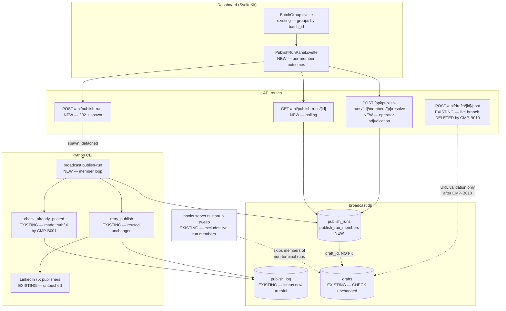
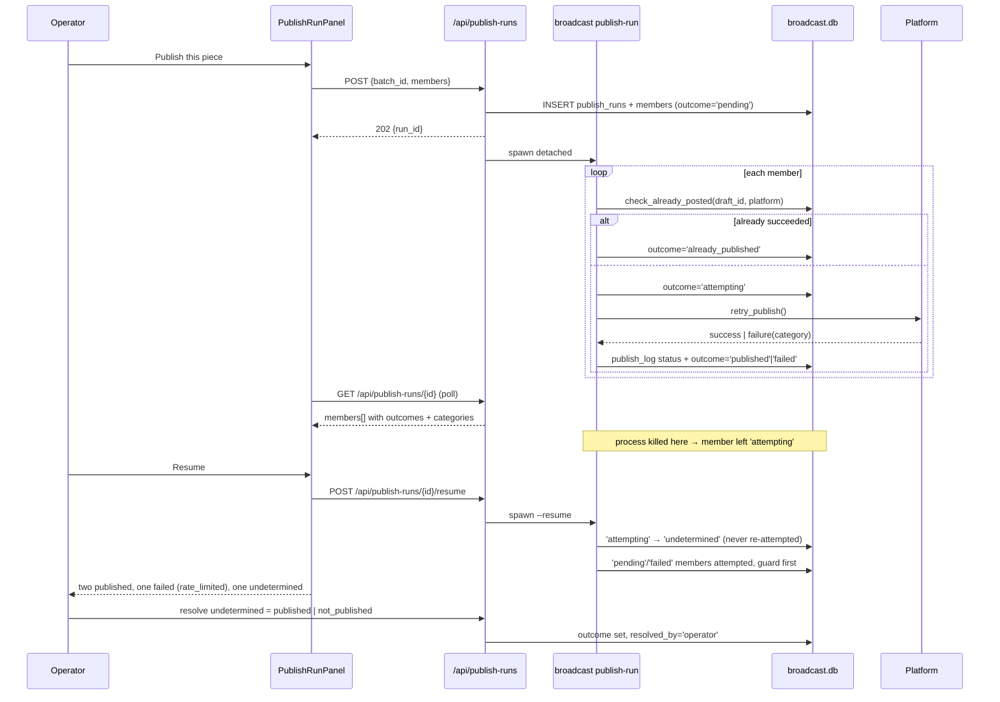
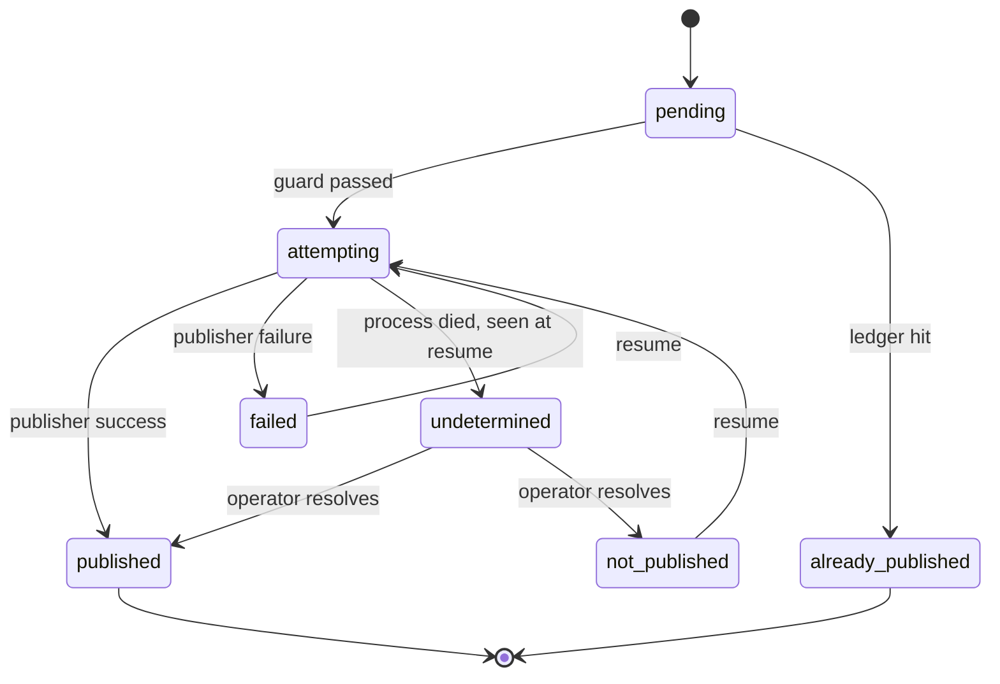

# TRD: Coordinated Multi-Platform Publish

**Version**: 1.0.0
**Status**: Draft
**Created**: 2026-08-15
**Last Updated**: 2026-08-15
**Author**: @technical-architect (`/create-trd --light` — single agent, no verification wave)
**Source PRD**: `docs/modernization/runs/case3-herald/v3/PRD.md`
**Source feature request**: `docs/modernization/runs/case3-herald/SPEC.md`
**Target repository**: `/Users/james/dev/herald` — all source, test and `.claude/rules/*` paths below resolve against Herald
**Task ID Prefix**: `CMP`

> **Authored under `--light`.** One agent did author + ground + self-check. There was no
> independent verification wave. §11 (`COULD NOT VERIFY`) states precisely what that costs
> and is not a formality — read it before acting on this plan.

---

## Changelog

| Version | Date | Changes | Author |
|---------|------|---------|--------|
| 1.0.0 | 2026-08-15 | Initial TRD from PRD v1.0.0 | @technical-architect |

---

## 0. Corpus and code reconciliation — read this first

The PRD builds on the Herald corpus. **The corpus states intent; the code states fact.** Six
places where they disagree were found by reading and running the code, and each one changes
the plan. They are stated up front because they are the difference between this TRD and a
plan that would have been discovered wrong at implement time.

| # | The corpus / PRD says | The code does | Evidence | Consequence for this plan |
|---|---|---|---|---|
| C1 | "`check_already_posted(draft_id, platform)` … already queries `publish_log` for a `status = 'success'` row — the per-platform success ledger the source's requirement 2 needs already exists" (PRD §1.2) | In **live mode** it never finds one. `retry_publish` writes the attempt row with `status='failed'` before the call (`src/herald/publishers/base.py:620-627`) and on success calls `_update_last_publish_log`, which updates only `final_attempt`, `error_category`, `error_detail` — **never `status`** (`base.py:748-760`). Only the stub-mode branch writes `status='success'` (`base.py:603-611`). | `[ran]` — fake publisher returning `success=True` against a real `BroadcastDB`: `publish_log` row is `status='failed', final_attempt=1`; `check_already_posted(...)` returns `None`; draft status is `posted`. | **G2's foundation does not exist in live mode.** `CMP-B001` fixes the ledger before anything is built on it. Without this, every double-post guard in this feature is a no-op in exactly the mode that matters. |
| C2 | NFR-5: "Every `publish_log` row this feature writes has `error_detail` and `request_data` sanitized before INSERT" | `publish_log` **has no `request_data` column** after migration, and `log_publish()` raises `ValueError` on it. `schema.sql:123` declares `request_data` and `success`; the F014/F015 rename-recreations drop both and F016 re-adds only `attempt`, `error_category`, `final_attempt`, `error_detail`. | `[ran]` — live columns are `id, platform, action, status, draft_id, engagement_id, target_url, thing_id, response_data, error, created_at, attempt, error_category, final_attempt, error_detail`. `log_publish({... "request_data": ...})` → `ValueError: Unknown publish_log columns: ['request_data']`. | NFR-5 is retained but its `request_data` half is **unsatisfiable as written**. Restated as O-NFR5 against the columns that exist (`error_detail`, `error`, `response_data`). Not silently dropped — see §6.3. |
| C3 | R5 / NFR-7 / AC-N7: the three `VALID_TRANSITIONS` tables are kept in agreement by "the existing cross-language test (F016 AC-34)" | The three tables **already disagree**, and the test cannot see it. Python `posting → {posted, failed, partial_posted}` (`src/db/broadcast_db.py:181`); TS `posting → {posted, failed, approved}` (`src/lib/db.ts:153`, `src/lib/server/db.ts:281`). The "consistency" test (`tests/integration/test_valid_transitions_consistency.py`) is a substring search — it asserts the literal `'publishing'` appears somewhere in each `.ts` file and that the words `posted`/`failed` appear anywhere in the file. | `[read]` both tables; `[read]` the test at lines 126-196. | **AC-N7 fails on arrival**, before this feature changes anything. `CMP-B003` reconciles the drift and replaces the smoke test with a real equality assertion. |
| C4 | PRD §1.4 and NG9 assume F016's 202/polling publish path is the live architecture; AC-F4.3 assumes "F016's existing error badges" render per-platform failure reasons | The UI publishes through the **synchronous** `POST /api/drafts/[id]/post`. `POST /api/drafts/[id]/publish` (the F016 202 route) has **no caller in `src/`**. `ReAuthBanner.svelte` is **imported by no page or component**. `DraftCard.svelte` renders no `error_category` badge at all. | `[read]` — 7 call sites of `/post` in `DraftCard.svelte`, `+page.svelte`, `drafts/[id]/+page.svelte`; zero for `/publish`; zero non-test importers of `ReAuthBanner`. | F4 must **build** the per-platform error display, not compose an existing one. The run endpoints follow F016's 202 shape (NG9 respected) but are new code, not a wrapper over `/publish`. |
| C5 | — (nobody claims this; it is simply broken) | The live branch of `/api/drafts/[id]/post` calls `broadcast post` — which sets the draft to `posted` inside `retry_publish` (`base.py:648`) — and then calls `updateDraftStatus(id, 'posted')` again. `posted` is terminal in every transition table, so this throws and the route returns **409 after the post has really gone out**. | `[read]` `post/+server.ts:196-240` against `base.py:644-658` and `VALID_TRANSITIONS.posted = new Set()`. Not executed live (would require real credentials). Marked `[inferred]` on the 409, `[read]` on the two writes. | This is a live double-post generator: operator sees a failure, retries, posts twice. `CMP-B010` deletes that branch. It is also why C1's fix alone is not sufficient. |
| C6 | Q1 open: "is there a reliable way to determine after the fact whether a post actually landed" | Partially answerable from code. X routes through PhantomBuster's `GET /api/v2/agents/fetch-output?id={phantom_id}` (`phantombuster.py:77,245`) — keyed on the **phantom id**, which is durable config, not on a lost container id. LinkedIn posts via `POST https://api.linkedin.com/rest/posts` returning the share URN in `x-restli-id` (`linkedin.py:1231-1256`) — read-back would need a list-by-author query this codebase never makes. | `[read]` both. Whether the outputs actually identify the post is `[inferred]`. | Q1 is narrowed but not closed. `CMP-B011` is a spike with a recorded answer (AC-F7.3), not a guess. F7 stays P1. |

**Two stale-document reports, per the corpus rule:**

- `docs/TRD/TRD-publisher-rearchitecture.md` and both F016 TRDs are all still marked
  **Status: Draft** while their code is shipped. PRD belief B2 is confirmed to the extent
  that `phantombuster.py` exists and the Reddit live guard is present (`publishers/__init__.py:75-80`).
- **Two F016 TRDs exist** for one PRD: `TRD-f016-publisher-error-handling.md` (prefix `PERH`)
  and `TRD-publisher-error-handling-rate-limiting.md` (prefix `PEH`). Neither supersedes the
  other. This TRD cites the PRD's AC numbers, not either TRD's task IDs, to avoid inheriting
  the ambiguity.

---

## 1. Overview

### 1.1 Technical Summary

A coordinated publish becomes a row in a new `publish_runs` table with one
`publish_run_members` row per platform. The run is executed by a new Python CLI subcommand,
`broadcast publish-run <id> --json`, which iterates its members, consults the per-platform
success ledger before each attempt, and delegates the actual publish to the existing
`retry_publish()` — so F016's retry schedule, error taxonomy and rate limiting are composed,
not rebuilt (PRD-D7). The SvelteKit dashboard spawns that subprocess and polls, reusing
F016's 202/polling shape (NG9, PRD-D6). A new dashboard panel renders the run's per-platform
outcomes.

Two properties drive the whole design:

1. **The ledger must be true before anything guards on it.** C1 above. `CMP-B001` is first
   and everything else is blocked on it.
2. **Run state lives on the new tables, never on `drafts.status`.** This is what keeps a
   partially-succeeded run resumable (AC-F3.5) without touching `partial_posted`'s
   terminality (R3, PRD-D4), without a third rename-recreate of `drafts`, and without
   re-incurring R5's transition-drift risk on the new states.

### 1.2 Key Technical Decisions

| ID | Decision | Choice | Serves Objective | Rationale | Alternatives Considered |
|----|----------|--------|------------------|-----------|-------------------------|
| TD1 | Where the coordinating entity lives | Two new tables: `publish_runs` (id, batch_id, status, created_at, started_at, completed_at) and `publish_run_members` (run_id, draft_id, platform, outcome, error_category, error_detail, attempted_at, resolved_at, resolved_by) | AC-F1.2, AC-F1.3, AC-F1.4 | A run needs durable state of its own; `drafts.platform` is single-valued by CHECK constraint (`schema.sql:30`) so a draft cannot represent a multi-platform action | (a) Reuse `batch_id` alone — rejected: it is a bare `TEXT` label with no state anywhere (`schema.sql:76`), and AC-F1.2 needs an identifier that resolves to *its own* state. Revisit never; a labelled group is what already failed the operator. (b) Add run columns to `drafts` — rejected: a draft is one platform; there is no row that owns the run. Revisit if `drafts` ever becomes multi-platform. |
| TD2 | Foreign keys on the new tables | `publish_run_members.draft_id` is a plain `INTEGER` with **no `REFERENCES drafts(id)`**, documented inline | TD1, and the buildability of the migration itself | `[ran]` A table with `REFERENCES drafts(id)` breaks the drafts rename-recreate pattern this repo uses: `ALTER TABLE drafts RENAME TO drafts_old` silently rewrites the FK to `REFERENCES "drafts_old"(id)`, and the subsequent `DROP TABLE drafts_old` then fails with `FOREIGN KEY constraint failed` under the `PRAGMA foreign_keys=ON` this repo sets (`broadcast_db.py:239`). Reproduced on sqlite 3.53.3. | (a) Declare the FK and accept it — rejected: it would break the next `drafts` CHECK migration, and the code that does that lives in `migrations.py:1283-1310` today. (b) Declare the FK and have future migrations toggle `PRAGMA foreign_keys=OFF` — rejected as a remote requirement on code that has not been written; revisit if the repo adopts a general FK-safe migration helper. |
| TD3 | The per-platform success ledger | `_update_last_publish_log()` gains a `status` parameter and writes `status='success'` on the successful attempt; `retry_publish`'s stub branch is folded into the same path so stub and live agree | AC-F2.1, AC-F2.2, AC-F2.3 | C1 — without it `check_already_posted()` is blind in live mode and every guard below is decorative | (a) Have the run executor consult `drafts.status='posted'` instead — rejected: it is per-draft, not per-platform-attempt, and loses the "which attempt, when" the operator needs; it would also mask C5's spurious 409. (b) Write a second ledger table owned by this feature — rejected: two success ledgers is the second-error-vocabulary failure PRD-D7 warns about. Revisit if `publish_log` is ever repurposed. |
| TD4 | Run state vs draft state | Run and member outcomes live only on the new tables. `drafts.status` CHECK is **not** extended and `VALID_TRANSITIONS` gains **no new states** | AC-F3.5, and avoids R3 and R5 | A partially-succeeded run must stay resumable; `partial_posted` has no outbound edges in any of the three tables and an existing test asserts that (`src/lib/__tests__/db.test.ts:745`). Keeping run state off `drafts` means no new rename-recreate and no new drift surface | (a) Add a `partial_published` draft status — rejected: needs a fourth `drafts` recreate, extends the CHECK, and adds a state to three tables that already disagree (C3). (b) Reuse `partial_posted` — rejected by PRD-D4 on the same terminality evidence. |
| TD5 | How a run executes | New CLI subcommand `broadcast publish-run <run_id> --json`, spawned by the API route as a detached subprocess; the route returns 202 and the client polls a run-status endpoint | AC-F1.1, NG9, PRD-D6 | Mirrors F016's settled architecture and the existing `execFileAsync('broadcast', ['post', ...])` contract in `post/+server.ts:151-160`; the Python layer already owns Keychain, retry and rate limiting | (a) Drive members from TypeScript, one `broadcast post` subprocess per member — rejected: puts run orchestration on the side of the fence that has neither the retry logic nor the guard, and multiplies subprocess spawns. Revisit if the Python CLI ever loses the publish path. (b) Synchronous — rejected by PRD-D6. |
| TD6 | Member ordering | Members are attempted **sequentially within one subprocess**, continue-on-failure, each independently guarded | AC-F5.1, AC-F5.4 | One writer avoids SQLite write contention with the dashboard (WAL, `busy_timeout=5000`, `broadcast_db.py:236-238`); a `rate_limited` result is **not** in `RETRYABLE` (`base.py:82-85`) so a throttled platform fails immediately and adds no delay to its siblings | Parallel subprocess per member — rejected for now: no evidence anyone needs it, and it multiplies concurrent SQLite writers. **Revisit when** a member's publish latency makes the run window unacceptable, or when a retryable (`network_error`, up to 2+4+8s) member is measured delaying a sibling. See the honest gap in §6.4. |
| TD7 | How "undetermined" is detected | A member row is set to `attempting` **before** the publisher call and to a terminal outcome after. Any member still `attempting` when a run is resumed is set to `undetermined` | AC-F6.1, AC-F6.2, AC-F3.2 | The crash window is exactly the interval between those two writes; making it an observable state is the only thing that distinguishes it from "never attempted". This mirrors the `publishing` transient-status pattern F016 already uses on `drafts` | (a) Infer from `publish_log` attempt rows — rejected: the pre-attempt row `retry_publish` writes is indistinguishable from a genuine failure row (both `status='failed'`), which is C1's root cause. (b) Guess based on elapsed time — rejected: PRD-NG7 and AC-F6.2 forbid converting without evidence. |
| TD8 | Startup sweep reconciliation | `sweepZombiePublishing()` gains a `WHERE NOT EXISTS (…publish_run_members… run not terminal)` exclusion; run resume handles those drafts instead | AC-F3.4 | The sweep's zombie cleanup is legitimate for single drafts (its stated purpose, `hooks.server.ts:4-11`) and must be preserved for them; for a run member it destroys the per-platform outcome requirement 5 says must survive | (a) Delete the sweep — rejected: R2 explicitly says preserve it for single drafts. (b) Let the sweep run and reconstruct from `publish_log` — rejected: it rewrites the draft to `failed` with `error_detail='server_restart'`, converting an undetermined outcome into a determined one, which AC-F6.2 forbids. |
| TD9 | The dashboard surface | New `PublishRunPanel.svelte` rendering all members, their outcomes and reasons, mounted from the existing `BatchGroup.svelte` | AC-F4.1, AC-F4.2, AC-F4.3, AC-F6.4 | `BatchGroup.svelte` already groups drafts by `batch_id` and already renders per-batch actions ("Dismiss All"), so the run panel has an existing home and an existing grouping | Extend `DraftCard` per-platform — rejected: AC-F4.1 requires *one* surface for the whole run; per-card is the reconstruct-it-yourself experience the source complains about. |
| TD10 | Transition-table drift | Reconcile the three tables to the **union** of current edges and replace the substring test with a structural equality test | O-NFR7, AC-N7 | C3 — AC-N7 is false today. The union is right because both divergent edges are live: `posting → approved` is exercised by `POST /api/drafts/[id]/reset` (`reset/+server.ts:46-54`), and `posting → partial_posted` is the X-thread path Python owns | Intersection — rejected: it would break the reset endpoint. Leave as-is and narrow AC-N7 — rejected: AC-N7 is a stated objective; silently narrowing it is the omission failure. |
| TD11 | Reddit | The executor is platform-agnostic; run **creation** excludes Reddit members while `_resolve_publisher()` raises for it in live mode | NG3, R7 | `publishers/__init__.py:75-80` raises `ValueError("Reddit publishing is currently deferred…")` in live mode. Creating a member that can only fail is worse than not creating it | Include Reddit members and let them fail — rejected: pollutes every run with a guaranteed failure. **Revisit when** a Reddit reactivation TRD lands, or the operator answers Q2 the other way — at which point the change is deleting one filter. |
| TD12 | What a run's members are | Default: the sibling drafts sharing the initiating draft's `batch_id`; the operator may deselect members before initiating | AC-F1.1, PRD Q3, PRD belief B3 | `[read]` `batch_id` is assigned by the Content Strategist as `{date}_{source_type}_{index}` and "all platform variants of the same `ParsedItem` share one `batch_id`" (`engine/batcher.py:48-56`, `engine/strategist.py:199`). This is exactly "one piece across several platforms" | Ad-hoc multi-select across batches — rejected as the *default* only; deselection covers the narrowing case. **Revisit when** the operator asks to publish two separately-drafted pieces as one run. |
| TD13 | F7 feasibility | A spike task with a recorded written answer precedes any reconciliation code; F7 stays P1 | AC-F7.3, PRD Q1 | C6 — the code narrows Q1 but does not close it, and PRD-D5 already rejected making this a P0 blocker | Build reconciliation speculatively — rejected: PRD-D5. |

### 1.3 Technology Stack

Nothing new is introduced. Every layer below is already in `.claude/rules/stack.md`.

| Layer | Technology | Purpose | Notes |
|-------|------------|---------|-------|
| Run executor / CLI | Python 3.9+, stdlib only | `broadcast publish-run`, member iteration, guard | stack.md: "Python stdlib only for CLI components — no pip dependencies" |
| Persistence | SQLite via `sqlite3` stdlib (Python) and `better-sqlite3` (Node) | `publish_runs`, `publish_run_members` | Raw SQL, no ORM (constitution: "SQLite — all migrations via explicit SQL, no ORM") |
| API | SvelteKit 2 API routes, TypeScript strict | run create (202) + run status (polling) | Same `execFile` subprocess contract as `post/+server.ts` |
| UI | Svelte 5 (runes), Tailwind | `PublishRunPanel.svelte` | Existing `$props()`/`$derived` idiom, as in `BatchGroup.svelte` |
| Tests | pytest, vitest, Playwright | per §6.1 | `pyproject.toml` `[tool.pytest.ini_options] pythonpath = ["src"]`; `npm test` → `vitest run`; `npm run test:e2e` → `playwright test` |

### 1.4 Integration Points

| System | Type | Direction | Notes |
|--------|------|-----------|-------|
| `broadcast` CLI | subprocess + JSON stdout | dashboard → CLI | Existing contract; `publish-run` adds a second verb alongside `post` |
| LinkedIn Posts API | REST | out | Reached only via the existing `LinkedInPublisher`; unchanged |
| PhantomBuster (X) | REST | out | Reached only via the existing `XPublisher`/`phantombuster.py`; unchanged |
| Reddit | — | — | Excluded at run creation in live mode (TD11) |
| `broadcast.db` | SQLite, WAL | both | Python CLI writes; SvelteKit reads and writes |

---

## 2. System Architecture

### 2.1 Architecture Overview

The topology is not obvious from the task list — the run entity sits above a publish path
that already has two competing entry points (C4, C5) — so a diagram earns its place.



### 2.2 Component Architecture

#### 2.2.1 `publish_runs` / `publish_run_members` (new, `src/db/schema.sql` + migration)

**Responsibility**: durable state of one coordinated publish and each platform's outcome.
**Interfaces**: `BroadcastDB.create_publish_run()`, `.get_publish_run()`, `.list_run_members()`,
`.set_member_outcome()`, `.resume_candidates()`.
**Dependencies**: none. Deliberately no FK to `drafts` (TD2).

#### 2.2.2 Run executor (new, `src/herald/cli.py::cmd_publish_run`)

**Responsibility**: iterate members, guard each, publish each, record each, never abort the
loop on one member's failure.
**Interfaces**: `broadcast publish-run <run_id> [--json] [--resume]`; one JSON object per
member on stdout plus a final run summary, following `cmd_engage`'s existing one-line-per-item
JSON convention (`cli.py` docstring, "One JSON line per action on stdout").
**Dependencies**: `check_already_posted`, `retry_publish`, `_resolve_publisher_with_stub`,
`BroadcastDB`.

#### 2.2.3 `PublishRunPanel.svelte` (new)

**Responsibility**: one surface showing every member, its outcome, and for failures the
`error_category` in words; the operator's resolve control for `undetermined` members.
**Interfaces**: props `{ runId }`; polls `GET /api/publish-runs/[id]`.
**Dependencies**: mounted by `BatchGroup.svelte`.

### 2.3 Data Flow

The interesting flow is the failure-and-resume path, which crosses the browser, a SvelteKit
route, a detached subprocess and two external platforms.



### 2.4 State Management

Two independent state machines, deliberately not merged (TD4).



Run status is **derived**, not stored redundantly: `in_progress` while any member is
`pending`/`attempting`; `complete` when every member is `published`/`already_published`;
`partial` otherwise. AC-F1.4 is satisfied because the run's status is computed from members
rather than forced onto one of them.

`undetermined → published` and `→ not_published` are operator-only edges (AC-F6.5). There is
no automatic edge out of `undetermined` (AC-F6.3, NG7).

---

## 3. Technical Specifications

### 3.1 `publish_runs` and `publish_run_members`

**Purpose**: the addressable entity of AC-F1.2 and the per-platform record of AC-F1.3.

```sql
CREATE TABLE IF NOT EXISTS publish_runs (
    id            INTEGER PRIMARY KEY AUTOINCREMENT,
    batch_id      TEXT,                       -- nullable: ad-hoc runs have none
    created_at    TEXT NOT NULL,              -- UTC ISO-8601, no tz suffix (schema.sql convention)
    started_at    TEXT,
    completed_at  TEXT
);

-- draft_id is intentionally NOT a FOREIGN KEY. See TD2: a REFERENCES drafts(id)
-- is silently rewritten to REFERENCES "drafts_old"(id) by the ALTER TABLE RENAME
-- in migrations.py's drafts recreate, after which DROP TABLE drafts_old fails
-- under PRAGMA foreign_keys=ON. Verified on sqlite 3.53.3.
CREATE TABLE IF NOT EXISTS publish_run_members (
    id             INTEGER PRIMARY KEY AUTOINCREMENT,
    run_id         INTEGER NOT NULL REFERENCES publish_runs(id),
    draft_id       INTEGER NOT NULL,
    platform       TEXT    NOT NULL CHECK(platform IN ('linkedin','x','reddit')),
    outcome        TEXT    NOT NULL DEFAULT 'pending'
                       CHECK(outcome IN ('pending','attempting','published',
                                         'already_published','failed',
                                         'undetermined','not_published')),
    error_category TEXT    CHECK(error_category IS NULL OR error_category IN (
                               'rate_limited','auth_expired','network_error',
                               'server_error','daily_limit','unknown')),
    error_detail   TEXT,
    attempted_at   TEXT,
    resolved_at    TEXT,
    resolved_by    TEXT    CHECK(resolved_by IS NULL OR resolved_by IN ('operator','reconciliation')),
    UNIQUE(run_id, draft_id)
);

CREATE INDEX IF NOT EXISTS idx_run_members_run     ON publish_run_members(run_id);
CREATE INDEX IF NOT EXISTS idx_run_members_draft   ON publish_run_members(draft_id, outcome);
```

**Behavior**:
- The `error_category` CHECK list is copied verbatim from `drafts.error_category`
  (`schema.sql:70-73`) so the dashboard renders one vocabulary, not two (PRD-D7).
- Added to `schema.sql` (idempotent `IF NOT EXISTS`, executed on every `BroadcastDB.__init__`)
  **and** as `apply_cmp_migration(conn)` appended to the migration chain in
  `broadcast_db.py:260-271`, because existing databases do not re-run a changed `schema.sql`
  for tables that... in fact do not yet exist, so `schema.sql` alone would suffice here.
  The migration function exists anyway to hold future ALTERs and to be unit-testable in
  isolation, matching every other feature in `migrations.py`.

**Error Handling**:
- Duplicate member insert → `UNIQUE(run_id, draft_id)` violation, surfaced as a 409 from the
  create endpoint.
- A `draft_id` whose draft has been deleted → the executor skips it and records
  `outcome='failed', error_category='unknown', error_detail='draft missing'`. There is no FK
  to catch this (TD2), so it is an explicit check.

### 3.2 Truthful publish ledger (`_update_last_publish_log`)

**Purpose**: make `check_already_posted()` able to see a live-mode success (C1).

```python
def _update_last_publish_log(
    db, draft_id, platform, attempt,
    final_attempt: int = 0,
    status: Optional[str] = None,        # NEW
    error_category: Optional[str] = None,
    error_detail: Optional[str] = None,
) -> None:
```

**Behavior**:
- When `status` is not `None`, `status = ?` is appended to the `UPDATE` alongside the existing
  optional clauses. `retry_publish`'s success path passes `status="success"`.
- Values are constrained by the live table's CHECK: `('success','failed','rate_limited','stub')`.
- The stub branch of `retry_publish` (`base.py:595-613`) keeps writing `status='success'`
  directly; after this change stub and live produce the same ledger shape, which is what makes
  a stub-mode integration test meaningful evidence about live behaviour.

**Error Handling**:
- Row not found → the existing `logger.warning` and early return are unchanged.
- A `status` value outside the CHECK → `sqlite3.IntegrityError`, deliberately not caught; a
  publish that cannot record itself must be loud.

### 3.3 Run executor contract

**Purpose**: AC-F1.1, AC-F2.*, AC-F5.*, AC-F3.6.

```
broadcast publish-run <run_id> [--json] [--resume] [--dry-run]
```

**Behavior**, in order, per member:

1. If `--resume` and the member is `attempting` → set `undetermined`, **do not attempt**
   (AC-F6.1, AC-F6.3), continue.
2. If the member is `published`, `already_published` or `undetermined` → skip (AC-F6.3).
3. `check_already_posted(draft_id, platform)` → if a row exists, set `already_published`
   (AC-F2.1, AC-F2.2, AC-F2.5), continue **without** attempting.
4. Set `attempting`, `attempted_at = now` (TD7).
5. Resolve the publisher; on `ValueError` (Reddit deferred, unknown platform) record
   `failed`/`unknown` and continue — never abort the loop (AC-F5.4).
6. `db.update_draft_status(draft_id, "publishing")`, then `retry_publish(...)`.
7. Record `published` or `failed` + `error_category` + sanitized `error_detail`.
8. Increment the platform daily count on success (mirroring `cmd_post`'s
   `db.increment_platform_count`).

**There is no `--force` and no `--force-daily-limit` on this subcommand** (AC-F2.4). Step 3 is
unconditional and there is no argument that skips it. The single-draft `broadcast post`
retains its `--force` flags unchanged — R4's "whether the CLI overrides remain available for
single-draft use is a separate question": **they remain, for single-draft use only.** They are
not reachable from a run because the run executor calls `retry_publish` directly rather than
shelling out to `broadcast post`.

**Error Handling**:
- Any member raising an unexpected exception → caught per member, recorded as
  `failed`/`unknown`, loop continues (AC-F5.4).
- Whole-process death → members left `attempting`; handled at resume (step 1).

### 3.4 Run API

```typescript
// POST /api/publish-runs  →  202
interface CreateRunRequest  { batch_id?: string; draft_ids: number[] }
interface CreateRunResponse { run_id: number; members: { draft_id: number; platform: string }[] }

// GET /api/publish-runs/[id]  →  200  (polled)
interface RunStatusResponse {
  run_id: number;
  status: 'in_progress' | 'complete' | 'partial';
  members: {
    draft_id: number;
    platform: string;
    outcome: 'pending' | 'attempting' | 'published' | 'already_published'
           | 'failed' | 'undetermined' | 'not_published';
    error_category: string | null;
    error_detail: string | null;
  }[];
}

// POST /api/publish-runs/[id]/resume     →  202
// POST /api/publish-runs/[id]/members/[draftId]/resolve
interface ResolveRequest { outcome: 'published' | 'not_published' }
```

**Behavior**:
- Create filters Reddit members in live mode (TD11) and returns the filtered member list so
  the UI can state what was excluded rather than silently dropping it.
- Resolve with `outcome: 'published'` writes a `publish_log` row with `status='success'`,
  `action='post'`, `error_detail='operator-resolved'` — that is what makes AC-F6.5's
  "resolution feeds the F2 guard" true, since the guard reads `publish_log`, not the member row.

**Error Handling**:
- Resolve on a member not in `undetermined` → 409.
- Create with an empty or all-Reddit `draft_ids` in live mode → 400 with the reason.

---

## 4. Master Task List

### 4.1 Task ID Convention

`CMP-[CATEGORY][SEQ]` — `P` infrastructure, `B` backend, `F` frontend, `T` testing,
`D` documentation, `I` integration. `CMP` does not collide with any prefix in Herald's
`docs/TRD/` (`[ran]`: existing prefixes are CAR, CLI, CLIPUB, CRON, DBSC, DD, DE, DQ, EDIT,
EFIX, EQ, EVAL, F011, HIST, IMG, LIP, MOBUX, MUX, NEXT, PEH, PERH, PPM, PUB, RDP, SCDB, URLV,
XPB).

`[LIVE]` marks tasks verify-app must exercise against a running dashboard. Herald's
`verification_level` is `live-required` for everything (constitution §"Verification Level"),
so `[LIVE]` here marks the tasks where a *running dashboard specifically* is the only way to
see the behaviour, not a change in the default.

### 4.2 Phase 1 — Make the ledger true, then build on it

Verification sits inside this phase, not after it: C1 is a correctness claim about existing
code, and a test is the only thing that distinguishes "fixed" from "believed fixed".

| Task ID | Description | Serves | Skills | Dependencies | Acceptance Criteria |
|---------|-------------|--------|--------|--------------|---------------------|
| CMP-B001 | Add `status` parameter to `_update_last_publish_log()`; pass `status="success"` from `retry_publish`'s success path | AC-F2.1, TD3 | `developing-with-python` | None | After a live-mode successful publish, the final `publish_log` row has `status='success'` |
| CMP-T001 | pytest: live-mode fake publisher returning success → `check_already_posted()` returns a row. Written RED against current code (it fails today) | AC-F2.1, AC-F2.2, O-NFR2 | `pytest` | None (written first) | Test fails before CMP-B001, passes after |
| CMP-T002 | pytest: assert stub-mode and live-mode success produce the same `publish_log` shape (`status`, `final_attempt`) | TD3 | `pytest` | CMP-B001 | Both paths asserted equal on the compared columns |
| CMP-P001 | `publish_runs` + `publish_run_members` DDL in `schema.sql`; `apply_cmp_migration()` in `migrations.py`; call it in `BroadcastDB.__init__` after `apply_efix_b002_migration` | TD1, AC-F1.2 | `developing-with-python` | None | Both tables exist after `BroadcastDB(":memory:")` |
| CMP-T003 | pytest: migration idempotency (run twice, no raise); **and** assert `publish_run_members` DDL contains no `REFERENCES drafts` | TD2 | `pytest` | CMP-P001 | Both assertions pass; the FK assertion is the regression guard for TD2 |
| CMP-B002 | `BroadcastDB` CRUD: `create_publish_run`, `get_publish_run`, `list_run_members`, `set_member_outcome`, `resume_candidates` | TD1, AC-F1.3 | `developing-with-python` | CMP-P001 | Each method round-trips; `set_member_outcome` rejects an out-of-CHECK outcome |
| CMP-T004 | pytest for CMP-B002 including the `UNIQUE(run_id, draft_id)` violation path | AC-F1.3 | `pytest` | CMP-B002 | Duplicate member insert raises |
| CMP-B003 | Reconcile `VALID_TRANSITIONS` to the union across `broadcast_db.py:176`, `src/lib/db.ts:150`, `src/lib/server/db.ts:278` — one commit | O-NFR7, AC-N7, TD10 | `developing-with-python`, `developing-with-typescript` | None | All three maps are literally equal |
| CMP-T005 | Replace the substring assertions in `tests/integration/test_valid_transitions_consistency.py` with a structural parse-and-compare of all three maps | AC-N7, TD10 | `pytest` | CMP-B003 | Test fails if any one map is edited alone |

### 4.3 Phase 2 — The run executor

| Task ID | Description | Serves | Skills | Dependencies | Acceptance Criteria |
|---------|-------------|--------|--------|--------------|---------------------|
| CMP-B004 | `cmd_publish_run` in `cli.py` + `publish-run` subparser: member loop, guard, `retry_publish`, per-member outcome, continue-on-failure. No force flags | AC-F1.1, AC-F2.1, AC-F2.2, AC-F2.4, AC-F5.4, TD5, TD6 | `developing-with-python` | CMP-B001, CMP-B002 | A three-member run in stub mode records three outcomes; `argparse` exposes no `--force*` on this subcommand |
| CMP-T006 | pytest: repeat the same run N times; assert exactly one `publish_log` `status='success'` row per platform | AC-F2.3 | `pytest` | CMP-B004 | No second success row for any N |
| CMP-T007 | pytest: grep-and-assert no code path from `cmd_publish_run` reaches `check_already_posted`'s bypass — plus an explicit test that a member with a success row is never passed to `retry_publish` | AC-F2.4 | `pytest` | CMP-B004 | Publisher mock records zero calls for the already-published member |
| CMP-B005 | Undetermined detection: write `attempting` before the publisher call; `--resume` converts leftover `attempting` → `undetermined` without attempting | AC-F6.1, AC-F6.2, AC-F6.3, TD7 | `developing-with-python` | CMP-B004 | A member interrupted between the two writes becomes `undetermined`, never `failed` |
| CMP-B006 | `--resume`: attempt only `pending`, `failed`, `not_published`; guard each first | AC-F3.6, AC-F3.3 | `developing-with-python` | CMP-B005 | Resume attempts exactly the members with no recorded success |
| CMP-T008 | Integration: start a run, `SIGKILL` the subprocess mid-member, resume, assert (a) succeeded platforms still recorded, (b) not re-attempted, (c) the interrupted member is `undetermined` | AC-F3.1, AC-F3.2, AC-F3.3, AC-F3.6 | `pytest` | CMP-B006 | All three assertions pass |
| CMP-T009 | Integration: publisher mocked to return a `rate_limited` `PublishResult` for one member (pattern from `tests/unit/test_cmd_post.py::test_rate_limited_error_sets_error_category`); assert the other members are still attempted and their outcomes unchanged | AC-F5.1, AC-F5.2, AC-F5.4 | `pytest` | CMP-B004 | Siblings attempted and recorded independently |
| CMP-T010 | pytest: with `HERALD_PUBLISHER_STUB=1`, assert no member path issues an HTTP request (patch `urllib.request.urlopen` to raise) | O-NFR1, AC-N1 | `pytest` | CMP-B004 | `urlopen` never called |
| CMP-T011 | pytest: assert per-platform `daily_count` accounting is unchanged and unaggregated across a run | AC-F5.3 | `pytest` | CMP-B004 | Each platform's count increments only for its own success |

### 4.4 Phase 3 — Dashboard

| Task ID | Description | Serves | Skills | Dependencies | Acceptance Criteria |
|---------|-------------|--------|--------|--------------|---------------------|
| CMP-B007 | `POST /api/publish-runs` (202 + detached spawn) and `GET /api/publish-runs/[id]` | AC-F1.1, AC-F1.2, TD5 | `developing-with-typescript` | CMP-B004 | 202 returns a `run_id` that the GET resolves to member outcomes |
| CMP-B008 | `POST /api/publish-runs/[id]/resume` and `.../members/[draftId]/resolve`; resolve-as-published writes the `publish_log` success row | AC-F3.6, AC-F6.5 | `developing-with-typescript` | CMP-B007, CMP-B006 | After resolve-as-published, `check_already_posted` returns a row for that platform |
| CMP-B009 | Exclude live run members from `sweepZombiePublishing()` | AC-F3.4, TD8 | `developing-with-typescript` | CMP-P001 | A restart with an in-flight run leaves member outcomes intact; a non-member zombie is still swept |
| CMP-T012 | vitest for CMP-B009: both halves — member preserved, non-member swept | AC-F3.4 | `developing-with-typescript` | CMP-B009 | Both assertions pass |
| CMP-T013 | vitest for CMP-B007/B008 route handlers incl. 409 on resolving a non-undetermined member | AC-F1.2, AC-F6.5 | `developing-with-typescript` | CMP-B008 | Handlers covered incl. error paths |
| CMP-F001 | `PublishRunPanel.svelte`: every member, outcome, and for failures the `error_category` rendered in words | AC-F4.1, AC-F4.2, AC-F4.3, TD9 | `developing-with-typescript` | CMP-B007 | All five outcome classes render distinguishably, including `already_published` (AC-F2.5) |
| CMP-F002 | Undetermined member row: states the outcome is unknown, names the platform, offers resolve-as-published / resolve-as-not-published | AC-F6.4, AC-F6.5 | `developing-with-typescript` | CMP-F001, CMP-B008 | No automatic resolution control exists in the UI |
| CMP-F003 | Mount `PublishRunPanel` from `BatchGroup.svelte`; add the run-initiate control; surface Reddit exclusion when it applies | AC-F1.1, AC-F4.1, TD9, TD11 | `developing-with-typescript` | CMP-F001 | One action on a batch initiates a run for its non-Reddit members |
| CMP-B010 | Delete the live-publish branch of `POST /api/drafts/[id]/post` (CLI spawn + `updateDraftStatus` + `logPublish`); keep URL validation, stub logging and the response shape | C5, AC-F2.3 | `developing-with-typescript` | CMP-F003 | The route no longer double-writes state the CLI already wrote; existing route tests updated, not deleted |
| CMP-T014 | Playwright, stub mode, mixed-outcome run: two published, one failed with a reason, one undetermined — asserted at desktop and at ≤390px | AC-F4.1, AC-F4.2, AC-F4.3, AC-F4.5, AC-F6.4 | | CMP-F003 | Every assertion passes at both viewports |
| CMP-T015 | Playwright: retry a partially-failed run; assert the already-published platform shows as skipped and no second success row is written | AC-F2.3, AC-F2.5 | | CMP-T014 | Skipped state visible; ledger unchanged for that platform |
| CMP-D001 | Update `docs/PRD/f016-…` cross-reference note and `.claude/rules/` nothing; record in `docs/TRD/` that `/api/drafts/[id]/publish` and `ReAuthBanner.svelte` remain unwired and are out of this feature's scope | C4 | | CMP-B010 | The unwired F016 surfaces are documented rather than assumed live |

### 4.5 Phase 4 — P1, gated on a written answer

| Task ID | Description | Serves | Skills | Dependencies | Acceptance Criteria |
|---------|-------------|--------|--------|--------------|---------------------|
| CMP-B011 | Spike: for LinkedIn and X, determine whether a post can be confirmed after the fact from durable state only (no lost container/URN). Record the answer, per platform, in this TRD | AC-F7.3, TD13, PRD Q1, PRD B1 | | CMP-B008 | A written per-platform feasible/infeasible answer with the API surface named |
| CMP-B012 | **Conditional on CMP-B011 returning feasible for ≥1 platform**: reconcile `undetermined` members against the platform; a reconciled success writes the `publish_log` success row | AC-F7.1, AC-F7.2 | `developing-with-python` | CMP-B011 | Reconciled success is thereafter skipped by the guard |
| CMP-T016 | **Conditional on CMP-B012**: integration test per feasible platform | AC-F7.1, AC-F7.2 | `pytest` | CMP-B012 | Reconciliation resolves and updates the ledger |
| CMP-D002 | Record infeasibility for any platform CMP-B011 finds infeasible, and state that F6's manual path is the permanent answer there | AC-F7.3, PRD R1 contingency | | CMP-B011 | Infeasibility recorded in this TRD, not left as a gap |

---

## 5. Execution Plan

### 5.1 Phase Overview

| Phase | Focus | Prerequisites | Parallelizable Sessions |
|-------|-------|---------------|------------------------|
| 1 | Truthful ledger + run schema + transition drift | None | 1A, 1B, 1C fully parallel |
| 2 | Run executor | 1A + 1B | Sequential — one file, one loop |
| 3 | Dashboard | Phase 2 (API contract from CMP-B004's JSON output is enough to start 3B) | 3A, 3B, 3C parallel after the contract |
| 4 | P1 reconciliation | Phase 3 | Gated on CMP-B011's answer |

### 5.2 Session Details

#### Phase 1

**Session 1A: Ledger truth** — CMP-T001, CMP-B001, CMP-T002. Agent: @backend-implementer.
Parallel with 1B, 1C. *TDD order is load-bearing here: CMP-T001 must be written and seen to
fail first, because it is the evidence that C1 is real.*

**Session 1B: Run persistence** — CMP-P001, CMP-T003, CMP-B002, CMP-T004. Agent:
@backend-implementer. Parallel with 1A, 1C.

**Session 1C: Transition drift** — CMP-B003, CMP-T005. Agent: @backend-implementer.
Parallel with 1A, 1B. Touches three files no other session touches.

#### Phase 2

**Session 2A: Executor** — CMP-B004, CMP-T006, CMP-T007, CMP-B005, CMP-B006, CMP-T008,
CMP-T009, CMP-T010, CMP-T011. Agent: @backend-implementer. Blocked by 1A and 1B. Not split:
every task edits `cmd_publish_run`.

#### Phase 3

**Session 3A: Run API** — CMP-B007, CMP-B008, CMP-T013. Agent: @backend-implementer.
Blocked by 2A.

**Session 3B: Run UI** — CMP-F001, CMP-F002, CMP-F003. Agent: @frontend-implementer.
Blocked by the `RunStatusResponse` contract in §3.4, **not** by 3A's completion.

**Session 3C: Sweep + cleanup** — CMP-B009, CMP-T012, CMP-B010, CMP-D001. Agent:
@backend-implementer. CMP-B009/T012 can start after 1B; CMP-B010 is blocked by 3B.

**Session 3D: E2E** — CMP-T014, CMP-T015. Agent: @verify-app. Blocked by 3A + 3B + 3C.

#### Phase 4

**Session 4A** — CMP-B011, then conditionally CMP-B012, CMP-T016, CMP-D002. Agent:
@backend-implementer.

### 5.3 Parallelization Map

```mermaid
gantt
    title Execution Plan (no time scale — dependency order only)
    dateFormat X
    axisFormat %s

    section Phase 1
    1A Ledger truth      :p1a, 0, 1
    1B Run persistence   :p1b, 0, 1
    1C Transition drift  :p1c, 0, 1

    section Phase 2
    2A Executor          :p2a, after p1a p1b, 1

    section Phase 3
    3A Run API           :p3a, after p2a, 1
    3B Run UI            :p3b, after p2a, 1
    3C Sweep + cleanup   :p3c, after p1b, 1
    3D E2E               :p3d, after p3a p3b p3c, 1

    section Phase 4
    4A Reconciliation    :p4a, after p3d, 1
```



### 5.4 Critical Path

`CMP-T001 → CMP-B001 → CMP-B004 → CMP-B005 → CMP-B006 → CMP-B007 → CMP-B008 → CMP-F002 →
CMP-T014`.

The single most consequential link is the first: everything that guards against double-posting
is downstream of the ledger being true (C1). If `CMP-B001` is descoped, `G2` is not delivered
regardless of what else ships.

### 5.5 Offload Recommendations

| Task | Recommended Agent | Rationale |
|------|-------------------|-----------|
| CMP-T014, CMP-T015 | @verify-app | Live dashboard + stubbed publishers is exactly its remit under `verification_level: live-required` |
| CMP-B011 | @backend-implementer | Reading two external API surfaces against existing publisher code; not an implementation task, and its deliverable is prose |

---

## 6. Quality Requirements

### 6.1 Testing Requirements

Floors read from `/Users/james/dev/herald/.claude/rules/constitution.md` §"Coverage Targets".
Neither is exceeded, so neither needs a stated reason.

| Type | Coverage Target | Source | Scope |
|------|-----------------|--------|-------|
| Unit Tests (Python) | 80% minimum | `constitution.md` §Quality Gates → Coverage Targets ("Unit tests: 80% minimum"); `process.md` §Coverage Targets ("Python unit: 80% minimum (pytest-cov)"); restated as PRD NFR-3 | New Python in `cli.py`, `broadcast_db.py`, `migrations.py`, `publishers/base.py` |
| Unit Tests (TypeScript) | 80% minimum | `process.md` §Coverage Targets ("TypeScript unit: 80% minimum (vitest coverage)") | New TS in the run routes and `PublishRunPanel.svelte` |
| Integration Tests | 70% minimum | `constitution.md` §Quality Gates → Coverage Targets ("Integration tests: 70% minimum"); `process.md` §Coverage Targets; restated as PRD NFR-3 | Run executor end-to-end in stub mode, restart/resume, sweep reconciliation |

Command lines are fixed by `process.md` §Coverage Targets and are not restated as choices:
`pytest --cov=src --cov-report=term-missing --cov-fail-under=80` and `npx vitest run --coverage`.

Additional testing objectives, all with named sources:

| ID | Objective | Source |
|----|-----------|--------|
| O-NFR2 | No production code is written before a failing test exists for it | `constitution.md` §"Development Methodology: TDD", which names CLI commands, dashboard API routes and database CRUD explicitly — all three are in scope here. PRD NFR-2 |
| O-NFR4 | Verification runs against a live dashboard instance with publishers stubbed | `constitution.md` §"Verification Level: live-required". PRD NFR-4 |
| O-NFR1 | Every publisher call this feature makes respects `HERALD_PUBLISHER_STUB=1` and issues no HTTP | `constitution.md` §"Publisher Safety Rule" ("This is non-negotiable"); repeated in `stack.md` §"Publisher Safety". PRD NFR-1 |

### 6.2 Code Quality Standards

Each traces to `constitution.md` §"Code Conventions". Nothing else is added.

| Standard | Source |
|----------|--------|
| TypeScript strict mode for all SvelteKit code | `constitution.md` §Code Conventions |
| Python 3.9+ with type hints for CLI and engine code | `constitution.md` §Code Conventions |
| Python stdlib only for CLI components — no pip dependencies | `constitution.md` §Code Conventions; `stack.md` §"Draft Engine & CLI" |
| Explicit SQL migrations, no ORM | `constitution.md` §Code Conventions |

### 6.3 Security Requirements

| ID | Objective | Source |
|----|-----------|--------|
| O-NFR6 | No credential literal in added code; credentials resolved via Keychain / `get_api_key()` | `constitution.md` §Code Conventions ("No credentials in code — macOS Keychain only"). PRD NFR-6 |
| O-NFR5 | Every `publish_log` and `publish_run_members` row this feature writes passes its `error_detail` / `error` / `response_data` through `_sanitize_for_log()` before INSERT | F016 AC-26 / F16.6 via PRD NFR-5. **Amended from the PRD**: NFR-5 also names `request_data`, which does not exist as a column in the migrated `publish_log` and which `log_publish()` rejects with `ValueError` (C2). The requirement is met for the columns that exist; the `request_data` clause is unsatisfiable and is recorded here rather than dropped |
| O-SEC1 | `domain-derived` — an operator-supplied `resolve` outcome must not be accepted for a member the operator cannot address (wrong run, already terminal). Reasoning: the resolve endpoint writes a `publish_log` success row, which permanently suppresses future publishing of that draft to that platform; an unvalidated write there is an irreversible content-suppression bug, not merely a bad status | Derived from the design, not from a document. Flagged as derived per the typing rule |

No further security objectives. The feature adds no new external input surface, no new
credentials, no new network call, and Herald is single-user with no tenancy boundary
(`constitution.md` §"Single-User Constraints"). A generic checklist would be padding.

### 6.4 Performance Requirements

**None.** The source states no latency, throughput or availability figure and none was
measured, so none is invented. F016's existing figures (180s watchdog, retry backoff of
2s/4s/8s, 5s dashboard polling) continue to apply unchanged under NG6 and are not restated
as requirements of this feature.

**One honest gap, stated because a reader would otherwise assume otherwise.** The source's
requirement 4 says a throttled platform must not "block **or delay**" the others. TD6 attempts
members sequentially, which satisfies the *block* half unconditionally and the *delay* half
only partially:

- A `rate_limited` result is not in `RETRYABLE` (`base.py:82-85`), so a throttled member
  fails on its first attempt and delays its siblings by roughly one API round-trip. This is
  the exact scenario the source describes ("one fails on a rate limit"), and it is fine.
- A `network_error` member retries three times with 2s/4s/8s backoff, delaying every
  not-yet-attempted sibling by up to ~14s plus four round-trips. Nothing in the PRD's
  acceptance criteria forbids this — AC-F5.1 and AC-F5.4 are written in terms of *prevent* and
  *abort* — but it is a real gap against the source's wording, and TD6's revisit condition
  names it.

No figure is asserted as a requirement here. The 14s is arithmetic from F016's published
backoff schedule, not a budget.

---

## 7. Risk Assessment

### 7.1 Risks Imported from PRD

| PRD Risk | Risk | Technical Mitigation |
|----------|------|---------------------|
| R1 | Remote success with lost local record is indistinguishable from never-sent | TD7 makes the window observable (`attempting` → `undetermined`) rather than solving it. CMP-B011 narrows it where a platform permits. **Not solved**, per the source's own framing |
| R2 | Startup sweep converts an interrupted run to `failed` | TD8 / CMP-B009 excludes live run members from the sweep while preserving it for single drafts. CMP-T012 asserts both halves |
| R3 | `partial_posted` is terminal, so a partial run modelled with it cannot resume | TD4 avoids it entirely — run state never touches `drafts.status`. The existing terminality test is untouched |
| R4 | `--force` bypasses `check_already_posted` | §3.3: the run executor has no force flag and calls `retry_publish` directly, so `cmd_post`'s `--force` is not reachable from a run. CMP-T007 asserts it. Single-draft `--force` remains, deliberately |
| R5 | Transition-table drift across three files | **Worse than the PRD assessed**: the tables already disagree and the "consistency" test cannot detect it (C3). CMP-B003 + CMP-T005 fix both. TD4 then means this feature adds no new states to drift |
| R6 | F016's phantom-post mitigation deferred to an "F017" that does not exist | Confirmed. F6 (CMP-B005) replaces the vacant deferral with behaviour inside this feature's scope |
| R7 | Reddit raises in live mode | TD11: excluded at run creation, executor stays platform-agnostic. Reactivation is deleting one filter |

### 7.2 Technical Risks

| ID | Risk | Likelihood | Impact | Mitigation |
|----|------|------------|--------|------------|
| TR1 | `CMP-B001` changes what `check_already_posted()` returns for **existing** drafts. Any live-mode publish that already succeeded has a `status='failed'` row, so the fix does not retroactively protect history — but any code that currently *relies* on the guard being blind will start being guarded | Medium | High | CMP-T006 covers the new behaviour. The known consumer is `cmd_post`'s dedup guard, whose intended behaviour is exactly what the fix restores. `RateLimiter.check()` also counts `status='success'` rows (`rate_limiter.py:83-84`), so **live daily counts will start counting posts that previously went uncounted** — expected and correct, but it will look like a sudden tightening |
| TR2 | A new `drafts` CHECK migration written later reintroduces the FK hazard TD2 avoids, because the hazard lives in `migrations.py`, not in this feature's code | Medium | High | CMP-T003 asserts `publish_run_members` declares no `REFERENCES drafts`, so a future edit that adds one fails a test rather than a production migration |
| TR3 | `CMP-B010` deletes a code path that has route tests. If those tests currently pass by asserting the broken behaviour, deleting the path looks like a regression | Medium | Medium | CMP-B010's acceptance criterion requires the existing tests be *updated*, not deleted, and the delete is scoped to the live branch — stub-mode behaviour and the response shape are preserved |
| TR4 | The run executor writes to `broadcast.db` from a detached subprocess while the dashboard polls. `busy_timeout` is 5000ms and journal mode is WAL, so contention is unlikely — but member writes now happen at a higher rate than single-draft publishing did | Low | Medium | TD6's one-writer-per-run choice keeps concurrency at the pre-existing level (one CLI writer). Revisit if TD6's parallel alternative is ever adopted |

### 7.3 Contingency Plans

**R1 contingency** (from the PRD, restated because it is load-bearing): if CMP-B011 finds no
platform supports reliable read-back, CMP-B012/T016 are dropped, F7 is closed as infeasible,
and F6's operator adjudication is the permanent answer. CMP-D002 records that in this document
rather than leaving it as a gap. Requirements 2, 3 and 5 are all still satisfied.

**TR1 contingency**: if the restored guard blocks a publish the operator actually wants, the
single-draft `broadcast post --force` path still exists (§3.3). No such escape exists for a
run, by design (AC-F2.4).

---

## 8. Non-Goals (Scope Boundaries)

Copied from the PRD. Implementation agents must reject work falling into these.

| PRD ID | Non-Goal | Rationale |
|--------|----------|-----------|
| NG1 | Adding a new platform | Source, verbatim: "Adding a new platform. Work with the publishers that already exist." |
| NG2 | Changing how content is generated or edited | Source, verbatim: "Changing how content is generated or edited. This is about delivery only." |
| NG3 | Reactivating Reddit publishing | Deferred by `TRD-publisher-rearchitecture` §1.2/§8, which states reactivation "would require a separate TRD". TD11 keeps the executor platform-agnostic so reactivation needs no rework here |
| NG4 | Publishing without explicit operator approval | `constitution.md`: "Nothing posts without explicit human approval." A run is still one operator-initiated action |
| NG5 | Cross-platform rate limit aggregation or a shared budget | F016 non-goal; source requirement 4 asks for the same independence. AC-F5.3 asserts it |
| NG6 | Changing F016's retry counts, backoff, error taxonomy, or watchdog threshold | Settled by F016; this feature composes them (PRD-D7) |
| NG7 | Automatically re-posting to resolve an undetermined outcome | Would be the double-post G2 forbids. §3.3 step 1 and TD7 forbid it structurally |
| NG8 | Changing the `HERALD_PUBLISHER_STUB=1` contract | `constitution.md` calls it "non-negotiable"; `stack.md` repeats it |
| NG9 | Re-litigating the 202/polling async architecture | Settled by F016. TD5 follows the shape. *Note C4: the F016 202 route itself is unwired, so this feature implements the shape rather than reusing that route* |

**Additional scope boundaries this TRD asserts** (not from the PRD; each is a defect found
during grounding that this feature deliberately does not fix):

| ID | Out of scope | Why |
|----|--------------|-----|
| NG10 | Fixing `XPartialPostedUI.svelte`'s "Accept as-is", which calls `PATCH /api/drafts/[id]/status` — an endpoint that does not exist (the status route exports `GET` only) and whose transition (`partial_posted → posted`) is forbidden by all three transition tables anyway | It is the X-thread case, not coordinated publish. PRD R3's contingency explicitly says leave `partial_posted` alone. Recorded so nobody touching the status route assumes this path works |
| NG11 | Wiring `POST /api/drafts/[id]/publish` or mounting `ReAuthBanner.svelte` | C4. Both are unwired F016 surfaces. Wiring them is F016 completion work with its own acceptance criteria, not this feature's |
| NG12 | Deduplicating `src/lib/queue.ts` and `src/lib/queueUtils.ts`, which implement the same `batch_id` grouping (only `queueUtils` is imported, by `src/lib/server/queue.ts:19`) | Unrelated cleanup. Recorded because TD12 reads `batch_id` grouping and an implementer will meet both files |

---

## 9. Task Grounding

Every claim below is marked `[read]`, `[ran]` or `[inferred]`. Paths are relative to
`/Users/james/dev/herald`.

### CMP-B001 / CMP-T001 / CMP-T002
- **Touches:** `src/herald/publishers/base.py` (`_update_last_publish_log` at :708, `retry_publish` at :541), `tests/unit/test_publishers_base.py` or a new `tests/unit/test_publish_ledger.py`
- **Reuse:** `_update_last_publish_log`'s existing dynamic-SQL builder (`base.py:748-760`) — add one more optional clause; do not write a new update function `[read]`
- **Replaces:** nothing is deleted. But note `retry_publish`'s stub branch writes `status='success'` inline at `base.py:603-611` while the live path does not — after this change the two agree, and the inline stub write is the shape the live path adopts rather than a second mechanism `[read]`
- **Careful:** `publish_log.status` CHECK on the *migrated* table is `('success','failed','rate_limited','stub')` `[ran]`. `schema.sql:122` matches, but the F014 migration DDL at `migrations.py:52-56` lists `('success','failed','rate_limited','pending','skipped')` — a different set. Do not trust `migrations.py`'s string as the live constraint `[read]`
- **Careful:** `RateLimiter.check()` counts `publish_log` rows with `status='success'` (`rate_limiter.py:83-84`) `[read]`. Making the ledger truthful changes live rate-limit arithmetic. See TR1

### CMP-P001 / CMP-T003 / CMP-B002 / CMP-T004
- **Touches:** `src/db/schema.sql`, `src/db/migrations.py`, `src/db/broadcast_db.py` (`__init__` chain at :260-271, CRUD region)
- **Reuse:** `pipeline_runs` (`schema.sql:212-230`) is the closest existing precedent for a run-scoped table with a CHECK-constrained outcome — follow its column-naming and UTC ISO-8601 timestamp convention `[read]`. Reuse `BroadcastDB._row_to_dict` / `_rows_to_dicts` (`broadcast_db.py:292-301`) rather than writing new converters `[read]`
- **Replaces:** nothing — `batch_id` stays exactly as it is (a display grouping). This feature *adds* an entity keyed on it; it does not repurpose the column, so `queueUtils.ts` and `cli.py`'s batch separator continue to work untouched `[read]`
- **Careful — this is the highest-value line in this section:** do **not** write `REFERENCES drafts(id)`. `[ran]` on sqlite 3.53.3: after `ALTER TABLE drafts RENAME TO drafts_old`, the referencing table's DDL is rewritten to `REFERENCES "drafts_old"(id)`, and the migration's subsequent `DROP TABLE drafts_old` (`migrations.py:1304`) then fails with `FOREIGN KEY constraint failed` because `broadcast_db.py:239` sets `PRAGMA foreign_keys=ON`. The rename-recreate pattern is used by `_add_publishing_status` and by the F014/F015 migrations
- **Careful:** `_DRAFTS_DDL_WITH_PUBLISHING` (`migrations.py:1366+`) recreates `drafts` with a status CHECK of `('pending','approved','publishing','posted','dismissed','failed','rejected')` — **dropping `posting` and `partial_posted`**, which `schema.sql:33-37` includes `[read]`. It only fires on a database whose `drafts` table predates `publishing`, so a fresh DB never hits it. Flagged because anyone reading `migrations.py` for the canonical status list will get the wrong one
- **Careful:** `BroadcastDB.__init__` runs `schema.sql` first and then the migration chain, in a documented order (`broadcast_db.py:242-271`). Append `apply_cmp_migration` at the end; do not insert it mid-chain

### CMP-B003 / CMP-T005
- **Touches:** `src/db/broadcast_db.py:176-188`, `src/lib/db.ts:150-160`, `src/lib/server/db.ts:278-288`, `tests/integration/test_valid_transitions_consistency.py`
- **Reuse:** the transition-enforcement call sites are already identical in shape
  (`broadcast_db.py:484`, `db.ts:537`, `server/db.ts:612`) — only the maps change `[read]`
- **Replaces:** the substring assertions in `test_valid_transitions_consistency.py:126-196`
  become dead weight once a structural comparison exists. **Delete them**, don't leave them
  alongside — they currently pass while the maps disagree, so leaving them in means a green
  test that means nothing `[read]`
- **Careful:** the drift is real and in both directions. Python `posting → {posted, failed, partial_posted}`; TS `posting → {posted, failed, approved}` `[read]`. The union keeps `posting → approved`, which `src/routes/api/drafts/[id]/reset/+server.ts:46-54` depends on `[read]`, and `posting → partial_posted`, which the X-thread path uses. Adding `approved` to Python's map is a behaviour change on the Python side — no current Python caller makes that transition `[inferred]`, so it should be harmless, but it is a widening not a no-op
- **Careful:** `src/lib/db.ts` is documented as "a backward-compatibility shim … pure re-exports of `src/lib/server/db.ts`" (`db.ts:1-11`) but in fact declares its **own** `VALID_TRANSITIONS` and its own implementations `[read]`. The comment is false. Consider whether the right fix is to make it a real re-export — but that is larger than this task, so change the map in place and note the discrepancy

### CMP-B004 / CMP-B005 / CMP-B006 / CMP-T006 / CMP-T007 / CMP-T008 / CMP-T009 / CMP-T010 / CMP-T011
- **Touches:** `src/herald/cli.py` (new `cmd_publish_run` + subparser registration near the other `add_parser` calls), `tests/unit/test_cmd_publish_run.py` (new), `tests/integration/`
- **Reuse:** `retry_publish` (`publishers/base.py:541`) — the retry schedule, error classification, `publish_log` writes and draft status transition are all inside it. Do **not** reimplement any of them `[read]`. Reuse `_resolve_publisher_with_stub` (`cli.py:2213`) so tests can patch `herald.publishers._resolve_publisher` the way `test_cmd_post.py` already does `[read]`. Reuse `check_already_posted` (`broadcast_db.py:896`) `[read]`. Reuse `db.increment_platform_count` and `db.reset_daily_counts_if_needed`, called by `cmd_post` at `cli.py:2521` and `:2607` `[read]`
- **Reuse:** `cmd_engage`'s per-item continue-on-failure loop and one-JSON-line-per-item stdout convention (`cli.py` `cmd_engage` docstring) is the closest existing shape for a multi-item command `[read]`
- **Replaces:** nothing in Phase 2. `cmd_post` remains for single-draft publishing, unchanged, including its `--force` and `--force-daily-limit` flags (`cli.py:2489`, `:2545`) `[read]`
- **Careful:** `retry_publish` re-reads the draft each attempt and **aborts if the status is no longer `publishing`** (`base.py:629-638`) `[read]`. The executor must therefore set each member's draft to `publishing` immediately before calling it, per member — not once for the whole run
- **Careful:** `retry_publish` sets the draft to `posted` itself on success (`base.py:648`) `[read]`. The executor must not set it again; `posted` is terminal in all three transition tables and a second write raises. This is precisely the bug in `post/+server.ts` (C5)
- **Careful:** `_resolve_publisher` raises `ValueError` for Reddit in live mode (`publishers/__init__.py:75-80`) and for unknown platforms (`:65-71`) `[read]`. Catch per member; do not let it abort the loop (AC-F5.4)
- **Careful:** `HERALD_PUBLISHER_STUB=1` short-circuits `retry_publish` entirely before the retry loop (`base.py:595`) `[read]`. Every stub-mode test therefore exercises the executor's loop and guard but **not** the retry path — do not read a green stub test as evidence about live retry behaviour

### CMP-B007 / CMP-B008 / CMP-T013
- **Touches:** `src/routes/api/publish-runs/+server.ts` (new), `src/routes/api/publish-runs/[id]/+server.ts` (new), `.../[id]/resume/+server.ts`, `.../[id]/members/[draftId]/resolve/+server.ts`, `src/lib/server/db.ts`
- **Reuse:** the subprocess-spawn pattern in `post/+server.ts:150-160` (`promisify(execFile)`, `env: {...process.env}`) `[read]` — but detached, since the run must outlive the 202. Reuse `resolveId` from `$lib/server/routeHelpers.js` for id parsing, as every existing draft route does `[read]`. Reuse `logPublish` from `$lib/server/db.js` for the resolve-as-published write `[read]`
- **Reuse:** `src/routes/api/drafts/[id]/status/+server.ts` is the existing polling-endpoint shape (GET, returns `error_category` and watchdog state) — follow it `[read]`
- **Replaces:** nothing yet; CMP-B010 does the deleting
- **Careful:** `logPublish`'s TS signature accepts `request_data`, `dead_links_acknowledged` and `dead_links_snapshot` (as passed at `post/+server.ts:211-233`) `[read]`, but the migrated `publish_log` table has no `request_data` column `[ran]`. Verify which of those columns actually exist before writing a resolve row; pass only columns that do
- **Careful:** `resolveId` returns `null` for non-numeric ids; the member route has *two* path params and the second is a `draftId`, not a platform name — keep them distinct in the URL to avoid an ambiguous match

### CMP-B009 / CMP-T012
- **Touches:** `src/lib/server/db.ts:1044-1054` (`sweepZombiePublishing`), `src/hooks.server.ts` (no change expected — it only calls the function), `src/lib/server/__tests__/`
- **Reuse:** the function is a single `UPDATE`; add a `WHERE … AND NOT EXISTS (SELECT 1 FROM publish_run_members m JOIN publish_runs r ON …)`. Do not restructure it `[read]`
- **Replaces:** nothing. The sweep's single-draft behaviour is preserved exactly — that is R2's requirement
- **Careful:** `hooks.server.ts`'s `init` swallows all errors as non-fatal (`hooks.server.ts:27-31`) `[read]`. A malformed query here fails silently at startup and the sweep simply does not run; the test must call `sweepZombiePublishing()` directly rather than relying on server startup to surface a fault
- **Careful:** the sweep runs at server start, which is *before* any run resume can be requested. So a member left `attempting` will be seen first by the sweep (which must skip it) and only later by resume (which converts it to `undetermined`). The ordering is safe but only because of the skip — CMP-T012 must assert the skip, not just the preservation

### CMP-F001 / CMP-F002 / CMP-F003
- **Touches:** `src/lib/components/PublishRunPanel.svelte` (new), `src/lib/components/BatchGroup.svelte`, `src/lib/components/__tests__/`
- **Reuse:** `BatchGroup.svelte` already receives `batch_id`, `created_at` and the batch's drafts, and already renders a batch-level action with inline confirmation (`BatchGroup.svelte:23-58`) `[read]`. Mount the panel there; do not build a second grouping. Follow its Svelte 5 runes idiom (`$props()`, `$derived`, `$state`) `[read]`
- **Reuse:** `data-testid` attribute convention throughout `DraftCard.svelte` `[read]` — Playwright tests depend on it
- **Replaces:** nothing in the UI. **Do not** reuse `ReAuthBanner.svelte`: it is imported by no page or component `[read]`, so treating it as an existing surface (as PRD AC-F4.3 implies) would mean mounting an F016 component this feature has no acceptance criteria for. See NG11
- **Careful:** `DraftCard.svelte` renders **no** `error_category` badge `[read]` — the "F016 error badges" the PRD refers to do not exist in the UI. The error-category-to-words mapping is new code in `PublishRunPanel`, and its vocabulary must be the six categories in the `drafts.error_category` CHECK (`schema.sql:70-73`) `[read]`, not a new set
- **Careful:** `npm run dev` binds port **3200** (`package.json:7` — `vite dev --port 3200`) while `constitution.md` §"Verification Level" says "Dashboard serves and renders correctly on localhost:3100" and `process.md` §"Verification Protocol" step 3 says "wait for localhost:3100" `[read]` all three. Two governance files and the actual dev script disagree. Determine the real port before writing Playwright's `baseURL`, and fix whichever source is wrong rather than hard-coding around it

### CMP-B010 / CMP-D001
- **Touches:** `src/routes/api/drafts/[id]/post/+server.ts`, `src/routes/api/drafts/[id]/post/__tests__/server.test.ts`
- **Replaces:** the live-publish branch — the `execFileAsync('broadcast', ['post', …])` block (`post/+server.ts:137-195`) and the `db.transaction(() => { updateDraftStatus(id,'posted'); logPublish({…}) })` block (`:196-240`). This code is unreachable-as-intended: `broadcast post` already sets the draft to `posted` inside `retry_publish` (`base.py:648`) `[read]`, so `updateDraftStatus(id,'posted')` transitions from a terminal state and throws, which the route maps to 409 (`:232-236`) `[read]` — *after* the post has really gone out `[inferred: not executed live; requires real credentials]`. Delete both blocks
- **Careful:** **keep** the URL-validation section (`:96-135`), the `requires_confirmation` response, the stub-mode logging and the response shape. Three UI call sites depend on the `requires_confirmation` contract: `DraftCard.svelte:278`, `+page.svelte:146`, `drafts/[id]/+page.svelte:350` `[read]`
- **Careful:** existing route tests in `post/__tests__/server.test.ts` cover this branch. Update them; a deletion that also deletes the tests hides whether the branch was doing anything else

### CMP-T014 / CMP-T015
- **Touches:** `tests/e2e/coordinated-publish.spec.ts` (new), `playwright.config.ts` (baseURL only if the port question below forces it)
- **Reuse:** `tests/e2e/f013-linkedin-publisher.spec.ts` and `tests/e2e/f015-reddit-publisher.spec.ts` are the existing publisher E2E patterns, including how they seed a test `broadcast.db` and set `HERALD_PUBLISHER_STUB=1` `[read: filenames only — I did not open them]`
- **Reuse:** the `data-testid` selectors added by CMP-F001/F002; do not add a second selector convention `[read]` on `DraftCard.svelte`'s existing usage
- **Replaces:** nothing
- **Careful:** `process.md` §Verification Protocol mandates `HERALD_PUBLISHER_STUB=1` before the dev server starts and "**Never** make real posts". Every E2E assertion here is about stub-mode outcomes; a green run says nothing about live retry behaviour, because `retry_publish` short-circuits before the retry loop in stub mode (`base.py:595`) `[read]`
- **Careful:** the mixed-outcome fixture needs a member that is `failed` and a member that is `undetermined`. `undetermined` cannot be produced by the stub publisher — it requires the process dying mid-member (TD7). Seed the `publish_run_members` row directly in the fixture rather than trying to reproduce a crash in Playwright
- **Careful:** the port conflict in CMP-F003's block applies here too — Playwright's `baseURL` is where it bites

### CMP-B011 / CMP-B012 / CMP-T016 / CMP-D002
- **Touches:** this TRD (the written answer), then conditionally `src/herald/publishers/linkedin.py`, `src/herald/publishers/phantombuster.py`, `src/herald/cli.py`
- **Reuse:** `PhantomBusterClient.fetch_output()` already exists (`phantombuster.py:245`, `GET /api/v2/agents/fetch-output?id={phantom_id}`) and is keyed on the phantom id — durable config, not a per-launch container id `[read]`. This is the most promising read-back candidate in the codebase
- **Careful:** LinkedIn's post identifier is the share URN returned in the `x-restli-id` response header (`linkedin.py:1231-1244`) `[read]`. In the crash window that header is exactly what was lost, so read-back must be a list-by-author query this codebase never makes `[inferred]` — the spike must confirm the endpoint, the required OAuth scope, and whether the token in Keychain has it
- **Careful:** PRD belief B1 claims no platform accepts a client-supplied idempotency key, citing F016. F016 said that about **Apify actors**, and both backends have since changed (`TRD-publisher-rearchitecture` §1.1) `[read]`. B1 is therefore unverified for the code that actually runs; the spike should settle it rather than inherit it

---

## 10. Readout

```
TRD: docs/modernization/runs/case3-herald/light/TRD.md
SOURCE: case3-herald/v3/PRD.md + case3-herald/SPEC.md + herald/.claude/rules/{constitution,stack}.md + herald source

  CANNOT BE BUILT AS THE SOURCE ASSUMES — grounded in code, not judgment (4)
    C1   PRD §1.2 "the success ledger already exists"   it is blind in live mode; _update_last_publish_log
                                                        never writes status. [ran] check_already_posted → None
                                                        after a real success. CMP-B001 fixes it first.
    C2   NFR-5 "request_data sanitized before INSERT"   publish_log has no request_data column and
                                                        log_publish raises ValueError on it. [ran]
                                                        Restated as O-NFR5 §6.3, not dropped.
    C3   AC-N7 "all three VALID_TRANSITIONS agree"      they already disagree; the cited test is a
                                                        substring search. AC-N7 is false today.
                                                        CMP-B003 + CMP-T005.
    C4   AC-F4.3 "F016's existing error badges"         DraftCard renders no error badge; ReAuthBanner is
                                                        imported nowhere; /publish has no caller. F4 builds
                                                        the display rather than composing one.

  FIX BEFORE SHIPPING — live defect found while grounding (1)
    C5   /api/drafts/[id]/post live branch              writes 'posted' after the CLI already did →
                                                        terminal-transition throw → 409 after a real post.
                                                        A double-post generator. CMP-B010 deletes it.

  DESIGNED AROUND, WITH EVIDENCE (2)
    TD2  no REFERENCES drafts(id) on the new table      [ran] rename-recreate rewrites the FK to drafts_old,
                                                        then DROP fails under foreign_keys=ON. CMP-T003 guards it.
    TD4  run state never touches drafts.status          keeps AC-F3.5 without R3's terminality problem and
                                                        without adding a state to three drifted tables.

  DECIDED, NOT ASKED — PRD open questions closed under the autonomy rule (3)
    Q1   post-hoc read-back feasibility                 narrowed from code (C6), not closed. CMP-B011 is a
                                                        spike with a written answer; F7 stays P1.
    Q2   Reddit                                         excluded at run creation, executor platform-agnostic.
                                                        Reactivation = deleting one filter (TD11).
    Q3   what a run's members are                       batch_id siblings by default, operator may deselect
                                                        (TD12, grounded in batcher.py/strategist.py).

  HONEST GAP — stated in the document, not hidden (1)
    §6.4 source says "block or delay"; TD6 satisfies    a network_error member delays siblings by up to
         "block" fully and "delay" partially            ~14s of F016 backoff. Revisit condition named.

  DERIVED FROM THE DOMAIN — check the reasoning (1)
    O-SEC1 validate the resolve endpoint's target       a resolve-as-published write permanently suppresses
                                                        that draft/platform; an unvalidated write is
                                                        irreversible content suppression.

  DELIBERATELY OUT OF SCOPE — found broken, not fixed (3)
    NG10 XPartialPostedUI "Accept as-is"                calls PATCH /api/drafts/[id]/status; route is GET-only
    NG11 /api/drafts/[id]/publish, ReAuthBanner         unwired F016 surfaces; F016 completion work
    NG12 queue.ts / queueUtils.ts duplication           unrelated cleanup; only queueUtils is imported

  NO ACTION — sourced, listed for completeness
    All 6 goals, 7 features, 34 feature ACs, 7 NFRs, 7 NF-ACs and 9 non-goals from the PRD are
    carried into this TRD. Coverage floors (unit 80%, integration 70%) taken from Herald's
    constitution.md, neither exceeded. No latency, throughput or uptime figure appears anywhere
    in this document as a requirement.
```

---

## 11. COULD NOT VERIFY

`--light` ran one agent with no independent verification wave. This section is the price.
Each item names what a wave would have checked and what specifically was not done.

**An `objective-audit` would have checked, and did not:**

1. **Backward traceability of every objective.** I checked forward — every PRD goal, feature,
   AC, NFR and non-goal is carried into §4/§6/§8. I did **not** systematically walk every line
   *of this TRD* asking "what sources this?". §6.4's ~14s arithmetic is the item I am least
   confident is read as a derivation rather than a budget.
2. **AC-by-AC mapping to task IDs.** The `Serves` column names ACs, but no one enumerated all
   34 feature ACs and confirmed each appears in at least one `Serves` cell. Spot-checked, not
   exhausted. **AC-F1.4 and AC-F4.4 in particular are served by design properties (§2.4's
   derived run status; §3.4's response shape) rather than by a dedicated task**, which is
   defensible but unaudited.

**A `design-audit` would have checked, and did not:**

3. ~~Whether `cmd_publish_run` can actually be registered as written.~~ **Closed during
   self-check.** `[read]` `cli.py:1518-2075` registers every subcommand as
   `subparsers.add_parser(...)` + `set_defaults(command="<name>")`, and `main()` dispatches with
   a flat `if args.command == "post": return cmd_post(args, config, db_path)` chain at
   `cli.py:2145-2206`. `publish-run` slots in by exact analogy. No residual gap.
4. **Whether a detached subprocess from a SvelteKit route survives as designed.** The existing
   route uses `promisify(execFile)` and *awaits* it. TD5 requires the opposite — spawn and
   return 202. No existing Herald code does this, and I did not test it. This is the single
   least-grounded mechanism in the plan.
5. **The `not_published → attempting` edge in §2.4.** It lets a resume re-attempt a member the
   operator declared not-published. That is intended, but I did not check it against AC-F6.3's
   "an undetermined platform is never automatically re-attempted" — an operator resolution
   arguably makes it no longer undetermined, but the reasoning was not adversarially challenged.

**An `omission-audit` would have checked, and did not:**

6. **The PRD's beliefs B1–B4 individually.** B1 remains **unverified** and is the one that
   matters — see §9's CMP-B011 grounding; F016's "no idempotency keys" claim was about Apify
   actors and neither current backend is Apify. B2 partially confirmed. B3 confirmed `[read]`.
   B4 **closed during self-check**: `[read]` `BatchGroup.svelte:96-140` — the batch header
   renders only a derived topic label, a timestamp, and the Dismiss-All control. No
   batch-level publish state renders anywhere. B4 is correct.
7. **Whether F016's PRD contains acceptance criteria this TRD contradicts.** I read F016's
   TRD headers and the PRD's summary of F016, not F016's PRD body (607 lines). NG6's claim
   that this feature changes none of F016's settled values rests on the PRD's characterisation.

**A `citations` verifier would have checked, and did not:**

8. **Line numbers.** Every file path was opened and every symbol grepped, but line numbers were
   taken from grep output at a single point in time and not re-verified after later reads. Treat
   `file.py:NNN` as "near here", and the symbol name as authoritative.
9. **The two F016 TRDs.** I read only their headers. Task IDs `PERH-*` and `PEH-*` are cited
   nowhere in this document precisely because I could not tell which is authoritative — but I
   also did not resolve which is, and a reader may need to.

**A `conformance` verifier would have checked, and did not:**

10. ~~`.claude/rules/process.md`.~~ **Closed during self-check.** `[read]` It agrees with
    `constitution.md` on coverage (80/70) and adds a TypeScript-specific 80% floor, now cited
    in §6.1. It constrains nothing about TRD structure or task naming. **It did surface one
    live conflict**: its Verification Protocol step 3 says "wait for localhost:3100" while
    `package.json:7` binds `vite dev --port 3200`. The §9 `Careful` note on CMP-F003 stands and
    is now a confirmed contradiction between two governance/config sources, not a suspicion.
11. **Whether `apply_cmp_migration` is genuinely needed.** §3.1 argues it is not strictly
    necessary (new tables, `schema.sql` runs idempotently on every open) and adds it for
    consistency and testability anyway. That is a decision made without confirming how a
    *production* `broadcast.db` picks up `schema.sql` changes — I verified the code path
    `[read]` but never against the real database at
    `~/.openclaw/workspace-scout/broadcast.db`, which I did not touch.

**What a wave could not have given me either:** C5's 409 remains `[inferred]`. Confirming it
needs real LinkedIn credentials and a real post. It should be confirmed before CMP-B010 is
implemented, by reading the route's own test expectations rather than by posting.
