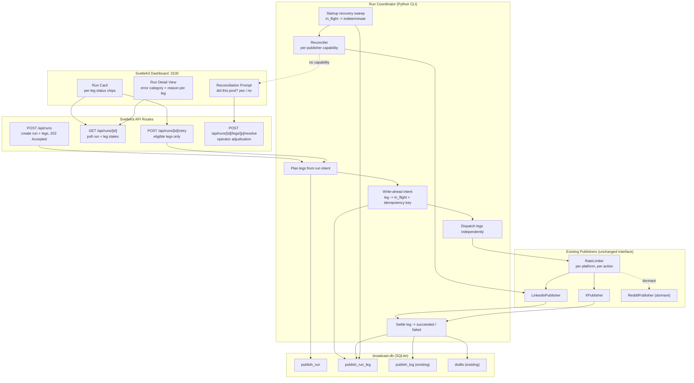
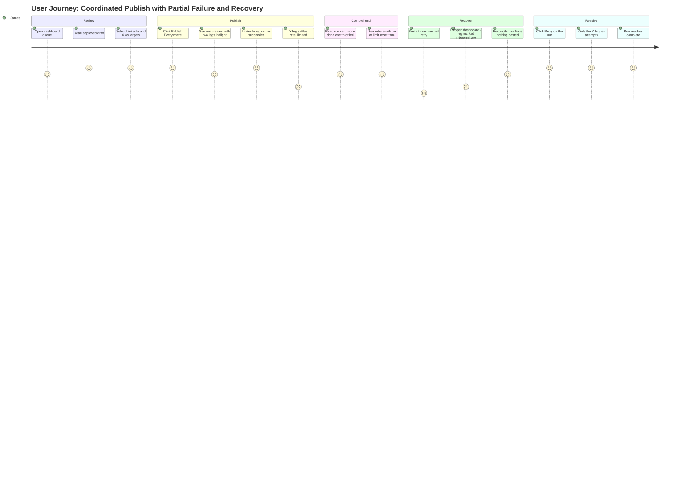
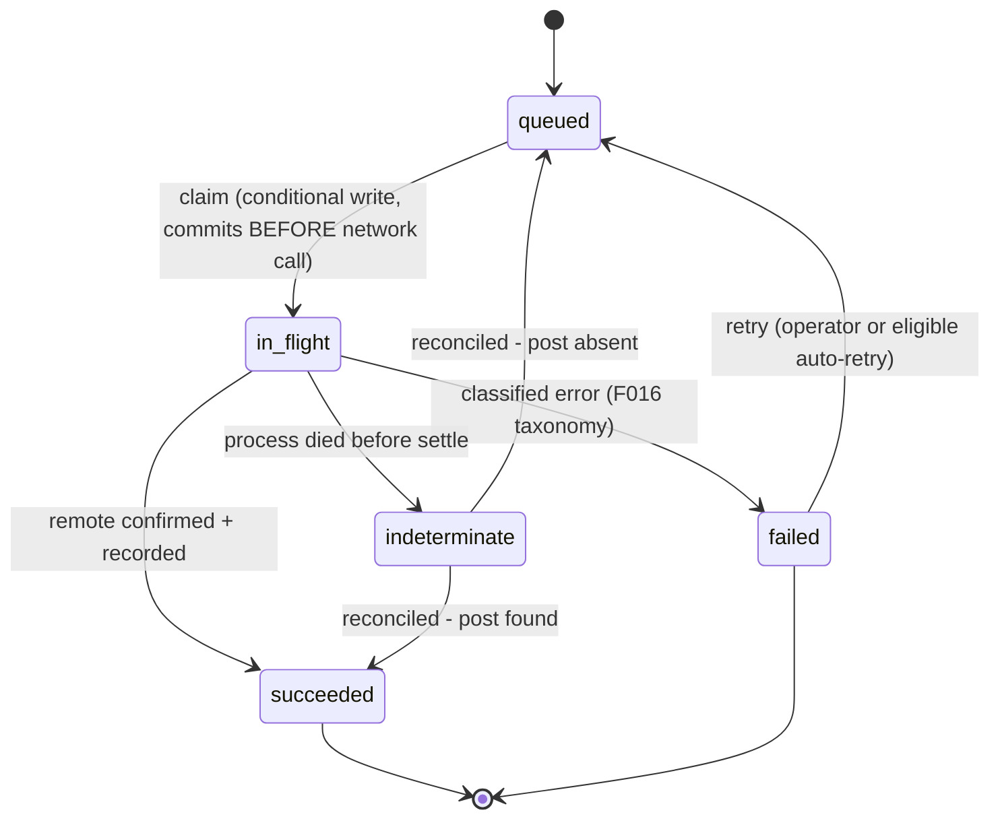
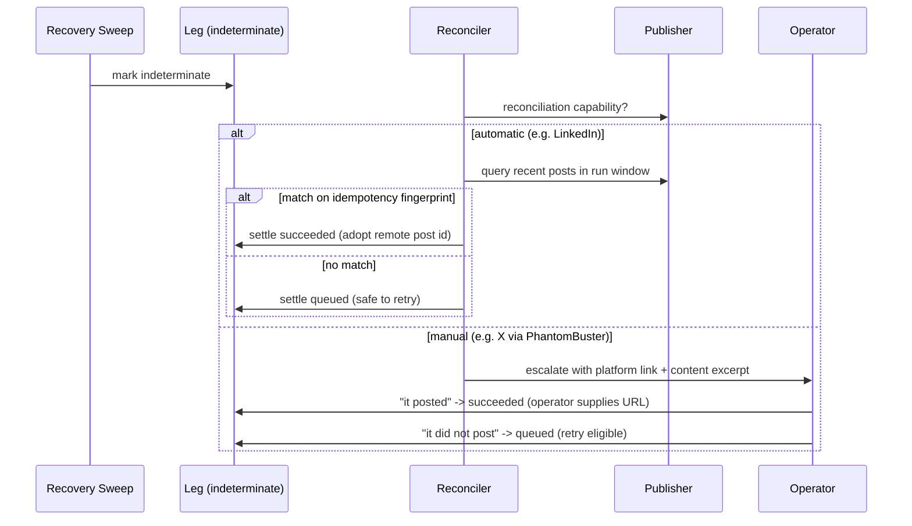

# PRD: Coordinated Multi-Platform Publish

**Version**: 1.0.0
**Status**: Draft
**Created**: 2026-08-15
**Last Updated**: 2026-08-15
**Author**: @product-manager
**Stakeholders**: James Simmons (sole operator, developer, and decision-maker)

---

## Changelog

| Version | Date | Changes | Author |
|---------|------|---------|--------|
| 1.0.0 | 2026-08-15 | Initial PRD creation | @product-manager |

---

## 1. Product Summary

### 1.1 Problem Statement

Herald publishes a draft to exactly one platform per action. Today a draft row carries a
single `platform` value (`linkedin` / `x` / `reddit`), and `POST /api/drafts/[id]/post`
drives one publisher through one attempt chain. Publishing the same piece to three
platforms means three separate, unrelated actions.

That decomposition fails in a specific, recurring way the operator has already hit:

> Publish to three platforms. Two succeed. One fails on a rate limit. There is no single
> place that says what the state of *the piece* is, and retrying is a per-platform manual
> decision with no memory of what already went out.

Three concrete defects follow from having no coordinating object:

1. **No addressable whole.** The operator's mental unit is "this piece," but the system's
   only unit is "this draft-to-one-platform." Partial outcomes are therefore unrepresentable
   — `partial_posted` already exists in the schema, but it means *a partially-sent X thread*
   (tweet-level, F014), not *a partially-landed multi-platform publish*. Reusing it would
   overload a status that dedup logic (`src/herald/engine/dedup.py`) already interprets.
2. **No memory across retries.** Retry is per-platform and stateless with respect to the
   group. Nothing structurally prevents a retry from re-posting to a platform that already
   succeeded. The existing `retry_publish()` chain (F016) is scoped to a single publisher
   attempt and has no notion of siblings.
3. **Failure detail is buried.** `publish_log` records `error_category` and `error_detail`
   per attempt, and the F016 work surfaced auth banners and rate-limit panels — but there is
   no per-piece rollup. Reconstructing "what happened to this piece" means reading logs.

Underneath all three sits the problem the operator explicitly flagged as unsolved:
**durability and exactly-once are different properties.** A publish that succeeded remotely
but crashed before the local write looks byte-for-byte identical to one that never left the
process. Herald's current publishers write to `publish_log` *after* the remote call returns;
a process death in that window is unrecoverable by inspection alone.

### 1.2 Proposed Solution

Introduce a **publish run** — a first-class, durable object representing one operator
intention to publish one piece to N platforms. A run owns N **legs**, one per target
platform. The run is the addressable thing: it has an ID, a state, a dashboard view, and a
retry entry point. The legs carry independent lifecycles, independent rate-limit budgets,
and independent error classification.

The exactly-once problem is answered by a **write-ahead intent record plus explicit
indeterminate state**, not by pretending durability implies exactly-once:

- Before any outbound call, the leg is durably marked `in_flight` with an
  **idempotency key** derived from `(run_id, platform, content fingerprint)`. The write
  commits before the network call begins.
- After the call returns, the leg is marked `succeeded` (with remote post id/URL) or
  `failed` (with an F016 error category).
- If the process dies between those two writes, recovery finds a leg stuck in `in_flight`
  and **must not guess**. It moves the leg to `indeterminate` — a distinct, honest state
  meaning *"we may or may not have posted; we do not know."*
- An `indeterminate` leg is **never auto-retried**. Herald attempts **reconciliation** —
  querying the platform for a post matching the idempotency key within the run window —
  and where the platform cannot support that query, the leg is escalated to the operator
  with a direct link to check manually and a two-button resolution
  (*"it posted" / "it did not post"*).

This is the honest fallback. Reconciliation capability differs per platform and is a
property of the publisher, declared explicitly rather than assumed:

| Platform | Backend (per `TRD-publisher-rearchitecture.md`) | Reconciliation |
|----------|--------------------------------------------------|----------------|
| LinkedIn | Official OAuth2 Posts API (`POST /rest/posts`) | **Automatic** — recent member posts are queryable; match on content fingerprint + time window |
| X | PhantomBuster phantom | **Manual** — phantom output is not a durable, queryable record of member timeline state |
| Reddit | OAuth2 direct API (currently dormant) | **Automatic** when reactivated — `thing_id` is returned and the user's submission history is queryable |

Requirement 2 ("never double-post") is therefore honored by construction for `succeeded`
legs (the run's own durable ledger forbids re-attempting them) and honored by *refusing to
act* for `indeterminate` legs (which are the only case where double-posting is even
possible). Herald never chooses to risk a duplicate on the operator's behalf.

### 1.3 Value Proposition

**Operator value**
- One action publishes a piece everywhere it belongs; one screen says where it landed.
- A partial outcome becomes a normal, readable state rather than a forensic exercise.
- Retry is safe by default. The operator can hit retry repeatedly without reasoning about
  what already went out.
- Crash recovery is truthful. The system says "I don't know" when it doesn't know, instead
  of silently double-posting or silently dropping.

**System value**
- The run object gives Herald a place to attach cross-platform concerns that currently have
  nowhere to live: coordinated scheduling, per-piece performance rollup (F019), per-piece
  dedup.
- Per-leg isolation means a throttled platform costs *that platform's* delivery only —
  consistent with the existing per-platform `RateLimiter` and the conservative self-imposed
  daily limits in `rate_limiter.py`.

### 1.4 Key Differentiators

- **Indeterminate is a first-class state, not an error.** Most retry systems collapse
  "unknown" into "failed" and then retry it — which is precisely how duplicates get created.
- **Reconciliation capability is declared per publisher**, so the fallback is chosen from a
  known property rather than discovered at failure time.
- **The run is the unit of intent; the leg is the unit of delivery.** Rate limiting, retry,
  and error classification stay per-leg (reusing F016 wholesale); visibility and addressing
  stay per-run.

### 1.5 Solution Architecture

---

## 2. User Analysis

### 2.1 Target Users

| User Type | Description | Primary Need |
|-----------|-------------|--------------|
| Solo operator (James) | Sole human in the loop. Reviews drafts each morning, approves, publishes, moves on. Runs Herald on localhost, often from mobile over Tailscale. | Publish one piece to all its platforms in one action, and know unambiguously where it landed |
| Recovering operator | Same person, after a crash, restart, or laptop sleep interrupted a publish | Know exactly which platforms are settled, which are unknown, and what to do about the unknown ones |
| Automation (cron) | Daily `broadcast draft` / scheduled publish paths (F020) running unattended | Never create duplicates when unattended; leave unresolved ambiguity for the human rather than resolving it wrongly |

### 2.2 User Personas

**Persona: James — Solo Operator**
- **Role**: Sole developer, sole publisher, sole decision-maker for Herald
- **Goals**: Push a piece to LinkedIn + X (+ Reddit when reactivated) in one action during a
  short morning window; trust that a retry is safe; never appear in a follower's feed twice
- **Pain Points**: Per-platform publishing is three decisions; a partial failure requires
  reading `publish_log` to reconstruct state; a mid-publish restart leaves no reliable
  answer about what went out; a duplicate post is publicly visible and unfixable by retry
- **Technical Proficiency**: High — writes the system, reads SQL, but explicitly does not
  want log forensics to be part of the normal publishing loop

**Persona: The Unattended Cron Run**
- **Role**: Scheduled execution path with no human present
- **Goals**: Complete coordinated publishes; escalate rather than guess
- **Pain Points**: Any auto-retry heuristic applied to an unknown outcome creates public
  duplicates that cannot be undone
- **Technical Proficiency**: N/A — behavior is entirely determined by the rules this PRD sets

### 2.3 User Journey

---

## 3. Goals and Non-Goals

### 3.1 Goals

| ID | Goal | Success Metric | Priority |
|----|------|----------------|----------|
| G1 | Make a multi-platform publish one addressable object with its own durable state | Every coordinated publish has a `publish_run` row; run state is derivable without reading `publish_log` | P0 |
| G2 | Guarantee no double-post to any platform that already succeeded | 0 duplicate posts across an adversarial retry suite (repeat retries, concurrent retries, retry-after-crash); a `succeeded` leg is never dispatched a second time | P0 |
| G3 | Make partial success comprehensible in the dashboard without reading logs | Operator can name every leg's outcome and reason from the run view alone; 0 log reads required in the partial-failure walkthrough | P0 |
| G4 | Respect each platform's rate limits independently | A throttled leg delays only itself; sibling legs' time-to-settle is unaffected (measured: sibling settle time within normal single-publish latency) | P0 |
| G5 | Survive process restart mid-publish without losing settled outcomes or inventing new ones | After kill -9 at every write boundary, every `succeeded` leg remains `succeeded`; every interrupted leg lands in `indeterminate`, never silently `failed` or auto-retried | P0 |
| G6 | Give indeterminate legs an honest, bounded resolution path | 100% of `indeterminate` legs reach a terminal state via automatic reconciliation or explicit operator adjudication; none linger unbounded | P0 |
| G7 | Reuse existing per-platform error classification and rate limiting rather than reimplementing | Legs record F016 `error_category` values; no new error taxonomy introduced | P1 |
| G8 | Keep the single-platform publish path working unchanged | Existing `POST /api/drafts/[id]/post` behavior and tests pass without modification | P1 |

### 3.2 Non-Goals (Explicit Scope Exclusions)

These items are **explicitly out of scope** for this PRD. Implementation agents will
reference this list to reject scope creep.

| ID | Non-Goal | Rationale |
|----|----------|-----------|
| NG1 | Adding a new publishing platform (Mastodon, Bluesky, Threads, Substack, or any other) | Stated directly in the feature request: "Work with the publishers that already exist." The run/leg model is platform-agnostic, but no new publisher module is written, registered, or tested under this PRD |
| NG2 | Changing how content is drafted, generated, edited, or voice-validated | Stated directly: "This is about delivery only." The draft engine, LLM prompts, `voice-profile.md`, and edit view are untouched. A leg publishes the draft's `final_body` as-is |
| NG3 | Per-platform content variation within a run (tailoring copy per platform inside one run) | That is content generation, which NG2 excludes. A run publishes existing draft content; if platform-specific copy is wanted, the operator creates separate drafts today |
| NG4 | Reactivating the Reddit publisher | `TRD-publisher-rearchitecture.md` deliberately deactivated Reddit (`_resolve_publisher()` refuses it in live mode). This PRD does not reverse that decision. Reddit is designed for as a leg type and gated behind the same enabled-publisher registry, so reactivation is configuration, not rework |
| NG5 | Scheduling, queueing, or delaying a run to a future time | Run creation is operator-triggered and immediate. Scheduled publishing belongs to the F020 cron work and would need its own design for interaction with rate-limit windows |
| NG6 | Automatic deletion or rollback of a post that landed on one platform when siblings fail | Deleting a live post is destructive, platform-specific, and not always possible. Partial success stays partial; the operator decides |
| NG7 | Auto-retrying an `indeterminate` leg on any schedule, under any condition, including under cron | This is the exact mechanism that produces public duplicates. No timeout, no backoff, no "probably fine" heuristic. Auto-resolution happens only via positive reconciliation evidence |
| NG8 | Cross-platform atomicity ("all or nothing" publish) | Social platforms offer no distributed transaction. Promising atomicity would require rollback, which NG6 excludes. Partial success is the honest model |
| NG9 | Multi-user, concurrency, or locking beyond a single Herald process | Per `constitution.md`: single-user, no multi-tenancy. Guards assume one Herald process against one SQLite file |
| NG10 | Changing per-platform rate limits or the `RateLimiter` fail-open policy | Existing limits (`post: 3/day` etc.) and the documented fail-open-on-DB-error behavior are inherited unchanged. This PRD coordinates around them, it does not tune them |
| NG11 | Backfilling historical single-platform publishes into synthetic runs | No operator value; historical `publish_log` rows remain the record for pre-existing posts |

---

## 4. Feature Requirements

### 4.1 P0 - Core Features (Must Have)

#### F1: Publish Run as a First-Class Object

**Priority**: P0
**Description**: A `publish_run` record represents one operator intention to publish one
piece to N platforms, with one `publish_run_leg` record per target platform. The run is
addressable by ID, has its own derived state, and is the unit the dashboard and retry act
on. Directly answers requirement 1 of the feature request.

Run state is **derived from its legs**, never independently written, so the two can never
disagree:

| Run state | Condition |
|-----------|-----------|
| `pending` | No leg has been dispatched |
| `in_progress` | At least one leg is `queued` or `in_flight` |
| `complete` | All legs `succeeded` |
| `partial` | All legs terminal; at least one `succeeded`; at least one `failed` |
| `failed` | All legs terminal; none `succeeded` |
| `needs_attention` | Any leg is `indeterminate` (this state outranks all of the above) |

**User Stories**:
- As the operator, I want to select several platforms and publish once, so that one piece is
  one action rather than three
- As the operator, I want the piece itself to have a state, so that I can answer "where is
  this?" without assembling it from per-platform records
- As the operator, I want `needs_attention` to outrank every other run state, so that an
  unresolved ambiguity is never hidden behind a mostly-green summary

**Acceptance Criteria**:
- [ ] AC-F1.1: Creating a run with N target platforms produces exactly one `publish_run` row
      and exactly N `publish_run_leg` rows, one per platform, in a single committed transaction
- [ ] AC-F1.2: A run is addressable by a stable ID via `GET /api/runs/[id]` returning the run
      state and every leg's state, error category, error reason, and remote post URL/ID
- [ ] AC-F1.3: Run state is computed from leg states on read using the table above; no code
      path writes a run state that contradicts its legs
- [ ] AC-F1.4: `needs_attention` takes precedence over `complete`, `partial`, and `failed`
      whenever any leg is `indeterminate`
- [ ] AC-F1.5: A run targeting exactly one platform is legal and behaves identically to a
      multi-platform run with one leg
- [ ] AC-F1.6: Run and leg creation rejects a target platform not in the enabled-publisher
      registry, with an actionable error naming the platform (satisfies NG1/NG4 at runtime)
- [ ] AC-F1.7: The existing per-draft `partial_posted` status (X thread semantics, F014) is
      not reused or overloaded for run-level partial outcomes

**Dependencies**: `broadcast.db` schema migration; existing `_resolve_publisher()` factory

---

#### F2: Write-Ahead Intent and Exactly-Once Dispatch

**Priority**: P0
**Description**: Each leg carries a durable **idempotency key** and is durably marked
`in_flight` **before** any outbound call. Dispatch is guarded by a conditional state
transition so that a leg can only move `queued → in_flight` once. This is the mechanism
behind requirement 2 and the first half of requirement 5.

Leg lifecycle:

**User Stories**:
- As the operator, I want a platform that already succeeded to be untouchable by any retry,
  so that hammering the retry button can never produce a duplicate
- As the operator, I want the system to record its intent before it acts, so that a crash
  leaves evidence that an attempt was in flight

**Acceptance Criteria**:
- [ ] AC-F2.1: Every leg has an idempotency key derived deterministically from
      `(run_id, platform, content fingerprint)`; the same leg re-derives the same key across
      process restarts
- [ ] AC-F2.2: The `queued → in_flight` transition is a conditional write (`UPDATE ... WHERE
      state = 'queued'`) that commits before the publisher is invoked; a zero-row result
      aborts that dispatch
- [ ] AC-F2.3: A leg in state `succeeded` is never dispatched again by any code path — retry,
      recovery sweep, or cron
- [ ] AC-F2.4: A leg in state `in_flight` is never dispatched again by a concurrent or
      subsequent call while it remains `in_flight`
- [ ] AC-F2.5: Invoking retry on a run 10 consecutive times produces exactly one outbound
      publish call per not-yet-succeeded leg and zero for succeeded legs
- [ ] AC-F2.6: On success, the leg records the remote post ID and URL returned by the
      publisher, alongside the existing `publish_log` row
- [ ] AC-F2.7: The settle write (success or failure) is a single committed transaction; no
      partially-written leg state is observable

**Dependencies**: F1; existing `PublishLogRecorder`; publisher return contract
(`post_id` / `post_url`, per `PostExecResult`)

---

#### F3: Independent Per-Platform Rate Limiting and Isolation

**Priority**: P0
**Description**: Each leg consults and consumes the existing per-platform `RateLimiter`
budget independently. A leg that is throttled records `rate_limited` and its reset time and
becomes retry-eligible later; sibling legs proceed with no added delay. Directly answers
requirement 4.

**User Stories**:
- As the operator, I want a throttled X to not hold up LinkedIn, so that one platform's
  budget never becomes the run's bottleneck
- As the operator, I want to see when a throttled leg becomes retryable, so that I know
  whether to wait or move on

**Acceptance Criteria**:
- [ ] AC-F3.1: Each leg performs its own rate-limit check against its own platform bucket
      immediately before dispatch, reusing `RateLimiter` unchanged
- [ ] AC-F3.2: A leg failing its rate-limit check settles as `failed` with
      `error_category = 'rate_limited'` and does not consume a retry attempt against
      unrelated categories
- [ ] AC-F3.3: A rate-limited or slow leg imposes no additional latency on sibling legs;
      sibling settle time is within the normal single-platform publish envelope
- [ ] AC-F3.4: A leg that exhausts its daily platform budget settles with
      `error_category = 'daily_limit'` and reports the reset boundary
- [ ] AC-F3.5: The run reaches a terminal or `needs_attention` state even when one leg is
      throttled — a throttled leg is terminal-for-now (`failed` + retry-eligible), not an
      indefinite `in_progress`
- [ ] AC-F3.6: Existing `RateLimiter` fail-open-on-DB-error behavior is preserved; a DB
      error during a rate-limit check does not block the leg

**Dependencies**: F1, F2; `src/herald/publishers/rate_limiter.py`; F016 error taxonomy

---

#### F4: Crash Recovery and the `indeterminate` State

**Priority**: P0
**Description**: On startup and on run read, a recovery sweep finds legs left `in_flight` by
a dead process and moves them to `indeterminate`. `indeterminate` means *"the remote outcome
is unknown"* and is never auto-retried. This is the second half of requirement 5 and the
direct answer to the hard part the operator flagged.

The sweep must **not** infer an outcome from elapsed time. A long-running phantom and a dead
process look the same from the outside; only process liveness distinguishes them.

**User Stories**:
- As the operator, I want a mid-publish restart to leave truthful state, so that I am not
  told "failed" about something that may have posted
- As the operator, I want the system to refuse to guess, so that it never creates a public
  duplicate on my behalf
- As the unattended cron path, I want to escalate unknowns rather than resolve them, so that
  ambiguity waits for a human

**Acceptance Criteria**:
- [ ] AC-F4.1: A startup sweep transitions every leg found in `in_flight` with no live owning
      process to `indeterminate`, recording the timestamp and the last known attempt context
- [ ] AC-F4.2: Legs in `succeeded` or `failed` are untouched by the sweep; a `succeeded` leg
      survives any number of restarts with its remote post ID intact
- [ ] AC-F4.3: An `indeterminate` leg is never dispatched by retry, by the sweep, or by cron —
      verified by a test that exercises all three entry points against an `indeterminate` leg
- [ ] AC-F4.4: A run containing any `indeterminate` leg reports `needs_attention`
- [ ] AC-F4.5: `kill -9` injected at each write boundary (before claim, after claim/before
      call, after call/before settle, after settle) always leaves a recoverable state
      matching the table in Appendix B — never a lost `succeeded`, never a silent `failed`
- [ ] AC-F4.6: The sweep never uses elapsed time alone as evidence that a leg failed
- [ ] AC-F4.7: `indeterminate` is a distinct persisted state, not a flag on `failed`, so
      neither state's handling can leak into the other

**Dependencies**: F2; startup hook pattern established by F016's `hooks.server.ts` sweep

---

#### F5: Reconciliation and Operator Adjudication

**Priority**: P0
**Description**: Every `indeterminate` leg gets a bounded resolution path. Herald first
attempts **automatic reconciliation** where the publisher declares the capability; where it
does not, Herald **escalates to the operator** with the evidence it has and a two-choice
resolution. Requirement 6's "honest fallback."

Each publisher declares a reconciliation capability: `automatic` (queryable member post
history) or `manual` (no reliable query). This is a stated property of the publisher module,
not an inference.

**User Stories**:
- As the operator, I want Herald to check the platform itself when it can, so that most
  unknowns resolve without me
- As the operator, I want a clear yes/no question with a direct link when Herald cannot
  check, so that resolving an unknown takes seconds, not an investigation
- As the operator, I want my adjudication to be durable, so that I am never asked the same
  question twice

**Acceptance Criteria**:
- [ ] AC-F5.1: Each enabled publisher declares reconciliation capability as `automatic` or
      `manual`; the reconciler reads the declaration and never assumes a default
- [ ] AC-F5.2: For an `automatic` publisher, reconciliation queries the platform for a post
      matching the leg's content fingerprint within the run's time window
- [ ] AC-F5.3: A positive reconciliation match settles the leg `succeeded` and adopts the
      discovered remote post ID/URL — without publishing anything
- [ ] AC-F5.4: A confident negative reconciliation returns the leg to `queued`, making it
      retry-eligible
- [ ] AC-F5.5: An inconclusive automatic reconciliation (query error, ambiguous match,
      multiple candidates) leaves the leg `indeterminate` and escalates to the operator —
      it never falls through to "assume not posted"
- [ ] AC-F5.6: For a `manual` publisher, the dashboard presents the platform link, the
      content excerpt, the attempt timestamp, and exactly two resolutions: *it posted* /
      *it did not post*
- [ ] AC-F5.7: "It posted" settles `succeeded` (accepting an optional operator-supplied URL);
      "it did not post" returns the leg to `queued`
- [ ] AC-F5.8: Every reconciliation outcome — automatic or operator-supplied — is recorded
      durably with its source, and the leg is never re-escalated once resolved
- [ ] AC-F5.9: Reconciliation makes no publishing call to any platform under any branch

**Dependencies**: F4; per-publisher capability declaration; LinkedIn Posts API read scope

---

#### F6: Run Visibility in the Dashboard

**Priority**: P0
**Description**: The dashboard shows run state and every leg's outcome and reason, without
the operator opening logs. Directly answers requirement 3.

**User Stories**:
- As the operator, I want a run card showing each platform's status at a glance, so that
  partial success is immediately legible
- As the operator, I want the failure reason in plain language next to the platform that
  failed, so that I know whether to wait, retry, or fix credentials
- As the operator on mobile over Tailscale, I want the run card readable at phone width, so
  that I can triage from anywhere

**Acceptance Criteria**:
- [ ] AC-F6.1: The run view shows one status chip per leg with the platform name and one of:
      queued, in flight, succeeded, failed, indeterminate
- [ ] AC-F6.2: Each failed leg shows its F016 `error_category` rendered as operator-facing
      language plus the sanitized reason detail
- [ ] AC-F6.3: Each succeeded leg links directly to the live post
- [ ] AC-F6.4: A rate-limited leg shows when it becomes retryable
- [ ] AC-F6.5: An `indeterminate` leg is visually distinct from a failed leg and carries the
      resolution affordance from F5
- [ ] AC-F6.6: A run in progress updates without a manual refresh, reusing the existing F016
      polling pattern
- [ ] AC-F6.7: The full partial-failure walkthrough (which platforms are done, which failed,
      and why) is completable from the dashboard alone, with zero log reads
- [ ] AC-F6.8: The run view is legible and operable at mobile viewport widths

**Dependencies**: F1; existing polling and error-badge patterns from F016 / `DraftCard`

---

#### F7: Safe Retry at the Run Level

**Priority**: P0
**Description**: One retry action on a run re-attempts exactly the legs that are eligible,
and nothing else. Retry has memory because the run's ledger *is* the memory.

Eligibility: `failed` legs are eligible. `succeeded` legs are never eligible.
`indeterminate` legs are never eligible until reconciled (F5). `in_flight` legs are not
eligible while claimed.

**User Stories**:
- As the operator, I want one retry button for the piece, so that I do not make a per-platform
  decision each time
- As the operator, I want retry to be idempotent, so that clicking it twice is harmless
- As the operator, I want retry to skip legs that are still throttled, so that retry does not
  burn attempts against a closed window

**Acceptance Criteria**:
- [ ] AC-F7.1: Retry on a run dispatches only legs in `failed`, moving each through the F2
      claim transition
- [ ] AC-F7.2: Retry never dispatches `succeeded`, `indeterminate`, or `in_flight` legs
- [ ] AC-F7.3: Retry while legs are still in flight is safe and non-duplicating — the claim
      guard rejects the already-claimed legs
- [ ] AC-F7.4: Retry re-checks each leg's rate-limit budget; a still-throttled leg is skipped
      and reported as skipped, not counted as a new failure
- [ ] AC-F7.5: Retry attempts are recorded per leg with an attempt counter, consistent with
      `publish_log.attempt`
- [ ] AC-F7.6: Retry of a run whose legs are all `succeeded` is a no-op returning the run's
      current state, not an error

**Dependencies**: F1, F2, F3, F5

---

### 4.2 P1 - Enhanced Features (Should Have)

#### F8: Run History and Audit Trail

**Priority**: P1
**Description**: Runs appear in the existing history view with their per-leg outcomes and
full attempt history, so a past piece's delivery story is reconstructable after the fact.

**User Stories**:
- As the operator, I want to look back at a piece and see everywhere it landed and when, so
  that I can trust the record weeks later
- As the operator, I want to see how many attempts a leg took, so that I can spot a platform
  that is chronically flaky

**Acceptance Criteria**:
- [ ] AC-F8.1: Completed runs appear in the history view with their run state and per-leg
      outcomes
- [ ] AC-F8.2: Each leg's full attempt history is viewable, correlated to its `publish_log`
      rows
- [ ] AC-F8.3: Operator adjudications (F5) appear in the audit trail marked as
      operator-sourced, distinct from automatic reconciliation
- [ ] AC-F8.4: Historical single-platform publishes predating this feature continue to render
      in history unchanged (per NG11)

**Dependencies**: F1, F6; existing history view (F010)

---

#### F9: CLI Parity for Coordinated Publish

**Priority**: P1
**Description**: The `broadcast` CLI can create, inspect, retry, and adjudicate a run, so
that the documented CLI fallback path stays complete and headless recovery is possible when
the dashboard is unavailable.

**User Stories**:
- As the operator, I want to publish a piece to several platforms from the CLI, so that the
  CLI remains a real fallback
- As the operator, I want to resolve an indeterminate leg from the CLI, so that I am not
  blocked when the dashboard is down

**Acceptance Criteria**:
- [ ] AC-F9.1: A CLI command creates a run for a draft across N platforms and returns the run
      ID
- [ ] AC-F9.2: A CLI command prints run and per-leg state in both human and `--json` form,
      consistent with the existing `--json` contract
- [ ] AC-F9.3: A CLI command retries a run with identical eligibility rules to F7
- [ ] AC-F9.4: A CLI command adjudicates an indeterminate leg with the same two resolutions
      as F5
- [ ] AC-F9.5: All CLI paths honor `HERALD_PUBLISHER_STUB=1` and make no real API calls when
      it is set

**Dependencies**: F1, F5, F7; Python stdlib-only constraint

---

### 4.3 P2 - Future Features (Nice to Have)

#### F10: Bounded Auto-Retry for Transient Leg Failures

**Priority**: P2
**Description**: Legs failing with unambiguously transient categories (`network_error`,
`server_error`) auto-retry a small bounded number of times before surfacing, reusing the
F016 backoff. Purely a convenience layer over F7's eligibility rules.

**User Stories**:
- As the operator, I want a blip-level network failure to resolve itself, so that I am not
  asked to click retry for something the system could have handled

**Acceptance Criteria**:
- [ ] AC-F10.1: Only `network_error` and `server_error` legs are auto-retry eligible
- [ ] AC-F10.2: `rate_limited`, `daily_limit`, `auth_expired`, and `unknown` are never
      auto-retried; they wait for the operator or the reset window
- [ ] AC-F10.3: `indeterminate` legs are never auto-retried under any configuration (NG7)
- [ ] AC-F10.4: Auto-retry is bounded per leg and the bound is visible in the run view

**Dependencies**: F7; F016 `retry_publish()` backoff

---

#### F11: Per-Run Performance Rollup

**Priority**: P2
**Description**: The run view aggregates the per-platform metrics already collected by F019
so that a piece's total reach is visible in one place.

**User Stories**:
- As the operator, I want one impressions/engagement number for the piece across platforms,
  so that I can judge the piece rather than the channel

**Acceptance Criteria**:
- [ ] AC-F11.1: The run view shows per-leg metrics sourced from the existing F019 columns
- [ ] AC-F11.2: A run-level total is shown with legs lacking metrics clearly excluded rather
      than counted as zero

**Dependencies**: F1; F019 post-performance metrics

---

## 5. Technical Requirements

### 5.1 Performance Requirements

| Metric | Target | Measurement |
|--------|--------|-------------|
| Run creation (durable, before first dispatch) | < 100 ms | Timed transaction against `broadcast.db` |
| Leg claim write (`queued → in_flight`, committed) | < 50 ms | Timed conditional UPDATE |
| Sibling-leg isolation under a throttled leg | Sibling settle time within normal single-platform envelope | Compare run-leg settle time to single-publish baseline with one leg forced `rate_limited` |
| Startup recovery sweep | < 500 ms for a database with 1000 runs | Timed sweep on seeded DB |
| Run state read (`GET /api/runs/[id]`) | < 100 ms | Timed endpoint against seeded DB |
| Dashboard run-state freshness while in progress | ≤ 5 s | Reuses the F016 5-second polling cadence |
| Automatic reconciliation attempt | < 10 s per leg, bounded, non-blocking to other legs | Timed reconciler run against stubbed publisher |

### 5.2 Security Requirements

- No credentials in code or config; macOS Keychain (or the documented env-var fallback)
  remains the only source, per `constitution.md`
- All leg error detail passes through the existing `sanitize_error_detail()` /
  `redact_token()` path before persistence — bearer tokens, Apify tokens, and `token=` query
  parameters never reach `publish_run_leg` or `publish_log`
- Reconciliation queries use the same credential path as publishing; no new secret is
  introduced. If LinkedIn reconciliation requires a read scope not currently granted, that is
  a credential-configuration change, recorded in Appendix C as an open question
- `HERALD_PUBLISHER_STUB=1` is honored on every new code path — run creation, dispatch,
  retry, recovery, and reconciliation. In stub mode no HTTP call is made to any platform.
  Non-negotiable per `constitution.md`
- The dashboard remains local-only behind its existing bearer token; no new externally
  reachable surface is added
- The operator adjudication endpoint accepts only the two defined resolutions and validates
  that the leg is genuinely `indeterminate` before acting

### 5.3 Accessibility Requirements

- Leg status is never conveyed by color alone — every status chip carries a text label, so
  `failed` and `indeterminate` remain distinguishable without color perception
- Run and leg views are keyboard operable, including the F5 adjudication controls
- Status changes during polling are announced to assistive technology rather than silently
  swapped
- Run view legible and operable at mobile viewport widths (Tailscale phone access is a
  primary path)
- WCAG 2.1 AA contrast for all status chips in both the default and any dark presentation

### 5.4 Scalability Requirements

- Single-user, single-process, local SQLite — no multi-writer concurrency is designed for
  (NG9). Correctness guards assume one Herald process
- Run legs scale to the number of enabled publishers (currently 2 live, 3 defined); no design
  pressure beyond single digits
- Run history growth is bounded by the operator's daily publish rate against conservative
  self-imposed daily limits (`post: 3/day/platform`); no partitioning or archival needed

### 5.5 Integration Requirements

| System | Integration Type | Notes |
|--------|-----------------|-------|
| `broadcast.db` (SQLite) | Read/Write | New `publish_run` and `publish_run_leg` tables; migration follows the established transaction-wrapped, `:memory:`-tested, exit-non-zero-on-error pattern from F016 |
| `publish_log` | Write | Unchanged schema. Legs correlate to their attempt rows; the existing table remains the attempt-level record |
| `drafts` | Read/Write | Draft content read for publishing; draft-level status updates preserved for single-platform compatibility (G8). `partial_posted` retains its F014 thread meaning (AC-F1.7) |
| `_resolve_publisher()` factory | Internal | Reused unchanged; enforces the enabled-publisher registry that gates NG1/NG4 |
| `RateLimiter` | Internal | Reused unchanged, consulted per leg (F3) |
| `PublishLogRecorder` | Internal | Reused unchanged for attempt logging |
| LinkedIn Posts API | Outbound | Publishing per `TRD-publisher-rearchitecture.md`; additionally read for automatic reconciliation (F5) |
| PhantomBuster API | Outbound | X publishing; declared `manual` reconciliation capability |
| Reddit OAuth2 API | Outbound (dormant) | Designed for as a leg with `automatic` capability; not activated (NG4) |
| SvelteKit → Python | Internal | Existing subprocess pattern (`executePost` / `spawn`) reused; the coordinator runs in the Python layer where DB write ownership already sits |
| `hooks.server.ts` | Internal | Startup recovery sweep registered alongside the existing F016 startup sweep |

---

## 6. Acceptance Criteria Summary

### Feature Acceptance Criteria

| ID | Feature | Criterion | Verification Method |
|----|---------|-----------|---------------------|
| AC-F1.1 | F1 | Run + N legs created in one committed transaction | Unit test (pytest) |
| AC-F1.2 | F1 | Run addressable via `GET /api/runs/[id]` with full leg detail | Unit test (vitest) + E2E |
| AC-F1.3 | F1 | Run state derived from legs; never independently written | Unit test (property-style over leg combinations) |
| AC-F1.4 | F1 | `needs_attention` outranks all other run states | Unit test |
| AC-F1.5 | F1 | Single-platform run behaves as a one-leg run | Unit test |
| AC-F1.6 | F1 | Disabled/unknown platform rejected with actionable error | Unit test |
| AC-F1.7 | F1 | `partial_posted` (F014 thread semantics) not overloaded | Unit test + code review |
| AC-F2.1 | F2 | Idempotency key deterministic across restarts | Unit test (pytest) |
| AC-F2.2 | F2 | Claim is a conditional write committed before the network call | Unit test with instrumented ordering |
| AC-F2.3 | F2 | `succeeded` leg never re-dispatched by any path | Unit test across retry/sweep/cron entry points |
| AC-F2.4 | F2 | `in_flight` leg never double-claimed | Unit test (concurrent claim attempts) |
| AC-F2.5 | F2 | 10 consecutive retries → exactly one call per eligible leg, zero for succeeded | Integration test (stub publishers) |
| AC-F2.6 | F2 | Remote post ID/URL recorded on success | Unit test |
| AC-F2.7 | F2 | Settle write is atomic; no partial leg state observable | Unit test |
| AC-F3.1 | F3 | Per-leg rate-limit check reusing `RateLimiter` | Unit test (pytest) |
| AC-F3.2 | F3 | Throttled leg settles `failed` + `rate_limited` | Unit test |
| AC-F3.3 | F3 | Throttled leg adds no latency to siblings | Integration test (timed, one leg forced throttled) |
| AC-F3.4 | F3 | Daily budget exhaustion → `daily_limit` + reset boundary | Unit test |
| AC-F3.5 | F3 | Run terminalizes despite a throttled leg | Integration test |
| AC-F3.6 | F3 | `RateLimiter` fail-open preserved | Unit test (DB error injection) |
| AC-F4.1 | F4 | Startup sweep moves orphaned `in_flight` → `indeterminate` | Integration test |
| AC-F4.2 | F4 | `succeeded` legs survive restart with post ID intact | Integration test |
| AC-F4.3 | F4 | `indeterminate` never dispatched by retry/sweep/cron | Unit test across all three entry points |
| AC-F4.4 | F4 | Any `indeterminate` leg → run `needs_attention` | Unit test |
| AC-F4.5 | F4 | `kill -9` at each write boundary yields the Appendix B outcome | Integration test (process kill harness) |
| AC-F4.6 | F4 | Elapsed time alone never treated as failure evidence | Unit test + code review |
| AC-F4.7 | F4 | `indeterminate` is a distinct persisted state, not a `failed` flag | Schema test |
| AC-F5.1 | F5 | Publisher declares reconciliation capability explicitly | Unit test (no default path) |
| AC-F5.2 | F5 | Automatic reconciliation queries by fingerprint + window | Unit test (stubbed publisher) |
| AC-F5.3 | F5 | Positive match settles `succeeded` and adopts remote ID | Unit test |
| AC-F5.4 | F5 | Confident negative returns leg to `queued` | Unit test |
| AC-F5.5 | F5 | Inconclusive reconciliation escalates, never assumes | Unit test (error/ambiguous/multi-match cases) |
| AC-F5.6 | F5 | Manual escalation shows link, excerpt, timestamp, two resolutions | E2E (Playwright) |
| AC-F5.7 | F5 | Adjudication settles `succeeded` or returns to `queued` | E2E + unit test |
| AC-F5.8 | F5 | Resolution recorded durably with source; no re-escalation | Unit test |
| AC-F5.9 | F5 | Reconciliation publishes nothing on any branch | Unit test (assert zero publish calls) |
| AC-F6.1 | F6 | One labeled status chip per leg | E2E (Playwright) |
| AC-F6.2 | F6 | Failed leg shows category + sanitized reason | E2E |
| AC-F6.3 | F6 | Succeeded leg links to the live post | E2E |
| AC-F6.4 | F6 | Rate-limited leg shows retryable-at time | E2E |
| AC-F6.5 | F6 | `indeterminate` visually distinct + resolution affordance | E2E |
| AC-F6.6 | F6 | In-progress run updates without manual refresh | E2E |
| AC-F6.7 | F6 | Partial-failure walkthrough completable with zero log reads | Manual verification (live dashboard, stub mode) |
| AC-F6.8 | F6 | Run view legible/operable at mobile widths | E2E (mobile viewport) |
| AC-F7.1 | F7 | Retry dispatches only `failed` legs | Integration test |
| AC-F7.2 | F7 | Retry skips succeeded/indeterminate/in-flight | Integration test |
| AC-F7.3 | F7 | Retry during in-flight is safe and non-duplicating | Integration test |
| AC-F7.4 | F7 | Still-throttled leg reported skipped, not newly failed | Unit test |
| AC-F7.5 | F7 | Retry attempts counted per leg | Unit test |
| AC-F7.6 | F7 | Retry of an all-succeeded run is a no-op | Unit test |
| AC-F8.1 | F8 | Runs appear in history with per-leg outcomes | E2E |
| AC-F8.2 | F8 | Attempt history correlated to `publish_log` | Unit test |
| AC-F8.3 | F8 | Operator adjudications marked as operator-sourced | Unit test |
| AC-F8.4 | F8 | Pre-feature history renders unchanged | E2E regression |
| AC-F9.1 | F9 | CLI creates a run and returns its ID | Unit test (pytest) |
| AC-F9.2 | F9 | CLI prints run state in human and `--json` form | Unit test |
| AC-F9.3 | F9 | CLI retry honors F7 eligibility | Unit test |
| AC-F9.4 | F9 | CLI adjudicates an indeterminate leg | Unit test |
| AC-F9.5 | F9 | All CLI paths honor `HERALD_PUBLISHER_STUB=1` | Unit test (assert no HTTP) |
| AC-F10.1 | F10 | Only transient categories auto-retry | Unit test |
| AC-F10.2 | F10 | Rate/daily/auth/unknown never auto-retried | Unit test |
| AC-F10.3 | F10 | `indeterminate` never auto-retried | Unit test |
| AC-F10.4 | F10 | Auto-retry bound visible in run view | E2E |
| AC-F11.1 | F11 | Per-leg metrics shown from F019 columns | Unit test |
| AC-F11.2 | F11 | Legs lacking metrics excluded, not zeroed | Unit test |

### Technical Acceptance Criteria

| ID | Requirement | Criterion | Verification Method |
|----|-------------|-----------|---------------------|
| AC-T1 | Performance | Run creation < 100 ms; leg claim < 50 ms; run read < 100 ms | Benchmark against seeded `broadcast.db` |
| AC-T2 | Performance | Startup sweep < 500 ms at 1000 runs | Benchmark on seeded DB |
| AC-T3 | Performance | Throttled leg does not delay siblings beyond the single-publish envelope | Timed integration test |
| AC-T4 | Security | No credential material reaches `publish_run_leg`, `publish_log`, or the dashboard | Unit test over `sanitize_error_detail()` / `redact_token()` on every new write path |
| AC-T5 | Security | `HERALD_PUBLISHER_STUB=1` blocks all HTTP on every new path incl. reconciliation | Unit test asserting zero outbound calls |
| AC-T6 | Security | Adjudication endpoint validates leg is `indeterminate` and rejects other resolutions | Unit test |
| AC-T7 | Data integrity | Migration is transaction-wrapped, `:memory:`-tested first, exits non-zero on any error, leaves no partial schema | Migration test (pytest) |
| AC-T8 | Data integrity | Leg state values are CHECK-constrained; `indeterminate` is a distinct value | Schema test |
| AC-T9 | Compatibility | Existing single-platform publish path and its tests pass unchanged (G8) | Full existing suite (pytest + vitest + Playwright) |
| AC-T10 | Accessibility | Status never conveyed by color alone; keyboard operable; WCAG 2.1 AA contrast | Manual audit + E2E keyboard traversal |
| AC-T11 | Coverage | Unit ≥ 80%, integration ≥ 70% on all new modules, per `constitution.md` | Coverage report (pytest-cov, vitest) |
| AC-T12 | Methodology | TDD — a failing test precedes every new production module, per `constitution.md` | Commit-history review |
| AC-T13 | Code standards | TypeScript strict; Python 3.9+ with type hints; CLI paths stdlib-only; raw SQL migrations, no ORM | Lint + type check + review |
| AC-T14 | Verification level | `live-required` — dashboard started on localhost:3100 and exercised with `HERALD_PUBLISHER_STUB=1` | verify-app live run |

---

## 7. Risk Assessment

| ID | Risk | Likelihood | Impact | Mitigation Strategy |
|----|------|------------|--------|---------------------|
| R1 | **A publish lands remotely but the local settle write never happens, and reconciliation cannot resolve it** — the core unsolved problem the operator raised | High | High | Write-ahead intent (F2) guarantees evidence exists; `indeterminate` (F4) refuses to guess; reconciliation (F5) resolves automatically where the platform supports it; operator adjudication is the bounded fallback where it does not. The system never auto-retries an unknown (NG7) |
| R2 | **X reconciliation is impossible via PhantomBuster**, leaving X the permanent manual-adjudication case | High | Medium | Declared explicitly as a `manual` capability (F5) rather than discovered at failure time; the adjudication UI is designed as a first-class path, not an error screen; the escalation carries a direct platform link so resolution takes seconds |
| R3 | **Operator adjudicates wrongly** (says "it did not post" when it did), producing exactly the duplicate the feature exists to prevent | Medium | High | Escalation shows the content excerpt, attempt timestamp, and a direct link to the platform so the operator checks rather than recalls; the two resolutions are explicit, not a default-through; the adjudication is recorded with its operator source in the audit trail (F8) so a wrong call is diagnosable |
| R4 | **The recovery sweep misclassifies a genuinely still-running publish as orphaned**, and a later retry duplicates it | Medium | High | The sweep keys on process liveness, never on elapsed time (AC-F4.6); a swept leg becomes `indeterminate`, which is not retry-eligible, so a misclassification cannot itself cause a duplicate — it can only cause an unnecessary adjudication |
| R5 | **SQLite write contention between the SvelteKit process and the Python coordinator subprocess** corrupts or blocks leg state transitions | Medium | Medium | DB write ownership stays with the Python layer, matching the existing documented pattern (`post.ts`: "The Python CLI owns all DB writes... This wrapper is intentionally read-only"); claim/settle are single short transactions; single-process assumption is stated as NG9 |
| R6 | **Run state and leg state drift apart**, so the dashboard shows a summary contradicting its own detail | Medium | Medium | Run state is derived on read, never stored (AC-F1.3); a property-style test over leg-state combinations asserts the derivation is total |
| R7 | **Reusing or overloading `partial_posted`** collides with F014 X-thread semantics and corrupts dedup behavior (`dedup.py` treats it as active) | Medium | Medium | Explicitly forbidden (AC-F1.7); run-level partial outcome is a run state, not a draft status; the draft-level status machine and its three-file `VALID_TRANSITIONS` maps are left alone |
| R8 | **The Reddit ambiguity** — the feature request names LinkedIn, X, and Reddit, but `TRD-publisher-rearchitecture.md` deactivated Reddit | High | Low | Resolved by design, documented as NG4: the run/leg model is platform-agnostic over the enabled-publisher registry, so Reddit becomes available by re-enabling the publisher, with no rework. Recorded as an open question (Appendix C, Q1) for the operator to confirm |
| R9 | **LinkedIn reconciliation requires a read scope the current token does not carry**, silently degrading LinkedIn to manual adjudication | Medium | Medium | Capability is declared, not assumed (AC-F5.1); if the scope is unavailable the declaration becomes `manual` and the operator sees the same adjudication path rather than a broken automatic one. Recorded as Appendix C, Q2 |
| R10 | **Scope creep into content generation** — per-platform copy tailoring is the natural next request | Medium | Medium | NG2 and NG3 exclude it explicitly; implementation agents reject it by reference |
| R11 | **Migration damages an existing `broadcast.db`** carrying real publish history | Low | High | Follows the established F016 migration pattern: transaction-wrapped, tested against a `:memory:` copy first, backup advisory before execution, non-zero exit on any error, no partial migration (AC-T7). New tables are additive; no existing table is rebuilt |
| R12 | **A real post is made during testing or verification**, which is publicly visible and unfixable | Low | High | `HERALD_PUBLISHER_STUB=1` is honored on every new path including reconciliation (AC-T5); `constitution.md` mandates it in all test and verification environments; the reconciler additionally asserts zero publish calls on all branches (AC-F5.9) |

### Contingency Plans

**R1 Contingency**: If reconciliation proves unreliable in practice for a platform that
declared `automatic`, demote that publisher's declared capability to `manual`. Legs then
route to operator adjudication — a degradation in convenience, not in correctness. The
guarantee that matters (never auto-retry an unknown) is unaffected.

**R2 Contingency**: If manual X adjudication proves too frequent to tolerate, the escalation
can be enriched with whatever partial evidence PhantomBuster output does provide (launch
container ID, phantom result payload) to make the operator's yes/no faster. Automating the
decision is explicitly not the contingency.

**R3 Contingency**: If a wrong adjudication produces a duplicate, the audit trail (AC-F8.3)
identifies it as operator-sourced. The response is to strengthen the evidence shown at
adjudication time, not to add an automatic override — Herald has no better information than
the operator does at that moment.

**R4 Contingency**: If process-liveness detection proves unreliable on macOS across sleep and
wake, the sweep becomes more conservative rather than less: leave the leg `in_flight` and
surface it in the run view as "still running, unverified" rather than sweeping it. An
un-swept leg blocks a retry; a wrongly-swept one only costs an adjudication. Both are
recoverable; neither duplicates.

**R5 Contingency**: If contention appears despite single-writer ownership, enable SQLite WAL
mode and a short busy-timeout on the coordinator's connection before considering any
structural change.

**R11 Contingency**: If migration fails on the live database, restore from the pre-migration
backup taken under the advisory. Because the new tables are additive and no existing table is
rebuilt, a failed migration should leave the pre-existing schema intact and the current
single-platform publish path fully functional.

---

## Appendices

### Appendix A: Glossary

| Term | Definition |
|------|------------|
| **Run** | One operator intention to publish one piece to N platforms. The addressable object introduced by this PRD |
| **Leg** | One platform's delivery within a run. Carries its own state, rate-limit budget, error category, and remote post ID |
| **Idempotency key** | Deterministic value derived from `(run_id, platform, content fingerprint)`, used to claim a dispatch and to match a post during reconciliation |
| **Claim** | The conditional `queued → in_flight` write that commits before the outbound call, giving exactly-once dispatch semantics |
| **Settle** | The atomic write moving a leg to `succeeded` or `failed` after the outbound call returns |
| **Indeterminate** | A leg whose remote outcome is genuinely unknown because the process died between claim and settle. Never auto-retried |
| **Reconciliation** | Determining an indeterminate leg's true remote outcome — automatically by querying the platform, or manually by asking the operator |
| **Adjudication** | The operator's explicit resolution of an indeterminate leg: *it posted* or *it did not post* |
| **Reconciliation capability** | A publisher-declared property, `automatic` or `manual`, stating whether the platform can be queried for a post matching the idempotency key |
| **Partial** | A run where all legs are terminal, at least one succeeded, and at least one failed |
| **`partial_posted`** | A pre-existing **draft** status from F014 meaning a partially-sent X *thread*. Unrelated to run-level partial outcomes and deliberately not reused (AC-F1.7) |

### Appendix B: Crash-Boundary Outcome Table

The contract AC-F4.5 verifies. `kill -9` at each boundary must yield exactly this:

| Kill point | Persisted leg state after kill | Recovery action | Final state |
|------------|-------------------------------|-----------------|-------------|
| Before claim commits | `queued` | None needed — never dispatched | `queued`, retry-eligible |
| After claim commits, before outbound call | `in_flight` | Sweep → `indeterminate`; reconcile | Reconciled (`succeeded` or `queued`) |
| During outbound call | `in_flight` | Sweep → `indeterminate`; reconcile | Reconciled (`succeeded` or `queued`) |
| After call returns, before settle commits | `in_flight` | Sweep → `indeterminate`; reconcile | Reconciled (`succeeded` or `queued`) |
| After settle commits | `succeeded` or `failed` | None — terminal, untouched by sweep | Unchanged |

The second, third, and fourth rows are indistinguishable from persisted state alone. That
indistinguishability is precisely why `indeterminate` exists as a state rather than being
collapsed into `failed`.

### Appendix C: Open Questions

| Question | Status | Resolution |
|----------|--------|------------|
| Q1: The feature request names LinkedIn, X, and Reddit as targets, but `TRD-publisher-rearchitecture.md` deactivated Reddit and `_resolve_publisher()` refuses it in live mode. Should this work reactivate Reddit? | Open — default applied | **Default applied: no.** Reactivation is out of scope (NG4). The run/leg model is platform-agnostic over the enabled-publisher registry, so Reddit becomes a working leg by re-enabling the publisher, with no changes to this feature. Correct via `/refine-prd` if reactivation is wanted in the same effort |
| Q2: Does the current LinkedIn OAuth2 token carry a scope permitting a read of recent member posts, as automatic reconciliation (F5) requires? | Open — degradation path defined | If not, LinkedIn declares `manual` capability and routes to operator adjudication like X. No code path breaks; only convenience degrades (R9) |
| Q3: Should a run created by the unattended cron path (F020) behave differently from an operator-created run? | Open — default applied | **Default applied: no difference in mechanics.** NG7 already forbids auto-resolving unknowns regardless of caller, so an unattended run simply accumulates `needs_attention` legs for the operator's next session |
| Q4: What is the content fingerprint used in the idempotency key — the draft's `final_body`, a hash of it, or the existing `draft_fingerprints` value? | Open — technical decision | Deferred to the TRD. Any deterministic, restart-stable derivation satisfies AC-F2.1; the existing dedup fingerprint is the obvious candidate |

### Appendix D: Related Documents

Herald design corpus consulted while writing this PRD:

- `docs/PRD/f016-publisher-error-handling-rate-limiting.md` — error taxonomy, retry, watchdog,
  daily limits, credential sanitization
- `docs/TRD/TRD-f016-publisher-error-handling.md` — 202/polling architecture, watchdog
  threshold, retry ownership, `VALID_TRANSITIONS` three-file rule
- `docs/TRD/TRD-publisher-rearchitecture.md` — current publisher backends (LinkedIn Posts
  API, PhantomBuster for X), Reddit deactivation, `Publisher` protocol preservation
- `docs/TRD/TRD-herald-next-phase.md` — dashboard publish wiring, current phase context
- `.claude/rules/constitution.md` — TDD, coverage targets, `live-required` verification,
  publisher stub rule, single-user constraints
- `.claude/rules/stack.md` — SvelteKit/Python/SQLite stack, stdlib-only CLI constraint
- `src/db/schema.sql`, `src/db/migrations.py` — `drafts` and `publish_log` schema,
  `partial_posted` provenance
- `src/herald/publishers/rate_limiter.py`, `publish_log.py` — per-platform limits, fail-open
  policy, token redaction
- `src/lib/server/db.ts`, `src/lib/db.ts`, `src/db/broadcast_db.py` — `VALID_TRANSITIONS` maps
- `src/lib/server/post.ts`, `src/routes/api/drafts/[id]/post`, `.../publish` — existing
  publish invocation path and DB write ownership
- `src/herald/engine/dedup.py` — `partial_posted` treated as active for dedup purposes

---

*Next step: `/create-trd docs/modernization/runs/case3-herald/old/PRD.md` — the TRD will
reference Goals for success criteria, Non-Goals for scope boundaries, Risks for contingency
planning, and the Acceptance Criteria Summary for test generation.*
