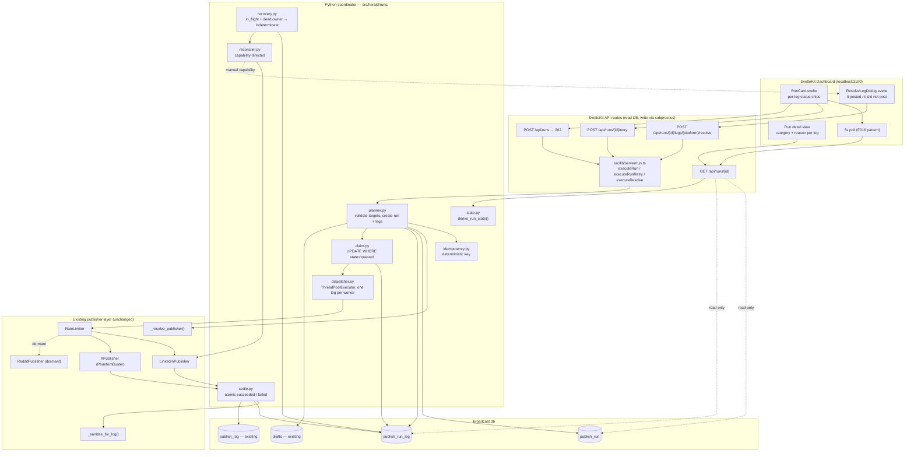
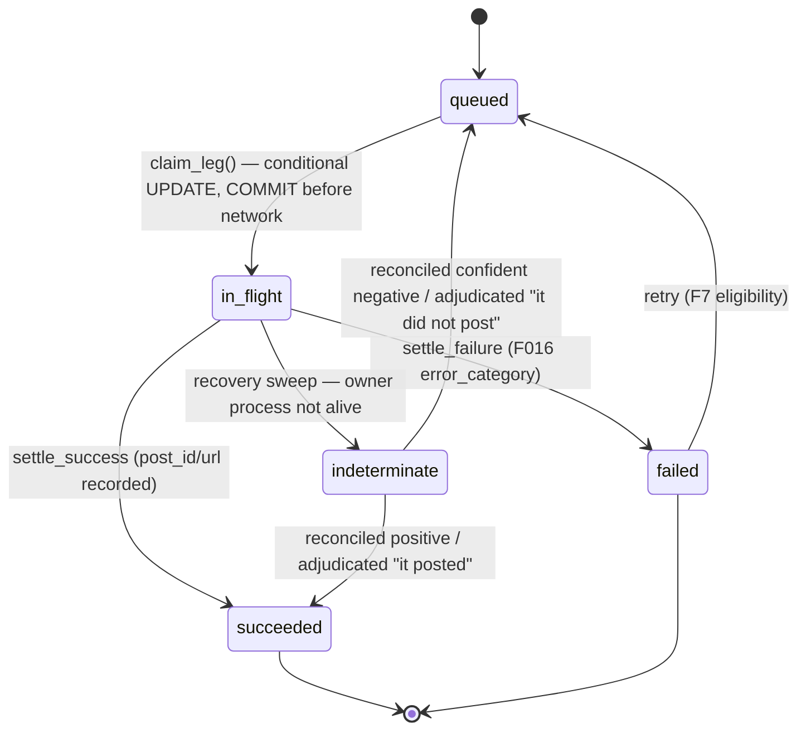
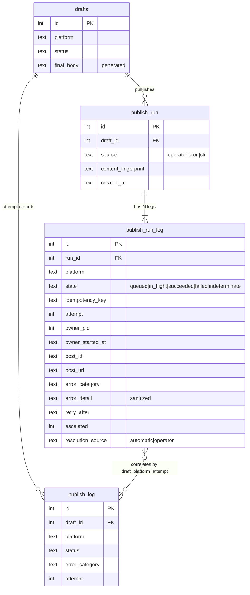

# TRD: Coordinated Multi-Platform Publish

**Version**: 1.0.0
**Status**: Draft
**Created**: 2026-08-15
**Last Updated**: 2026-08-15
**Author**: @technical-architect
**Source PRD**: `docs/modernization/runs/case3-herald/old/PRD.md`
**Task ID Prefix**: RUN

---

## Changelog

| Version | Date | Changes | Author |
|---------|------|---------|--------|
| 1.0.0 | 2026-08-15 | Initial TRD creation | @technical-architect |

---

## 1. Overview

### 1.1 Technical Summary

This TRD introduces a **run coordinator** into Herald's existing Python publisher layer and a
**run surface** into the existing SvelteKit dashboard. The design adds two additive SQLite
tables (`publish_run`, `publish_run_leg`) and one new Python module tree
(`src/herald/runs/`), and reuses every existing publishing primitive unchanged:
`_resolve_publisher()`, `RateLimiter`, `retry_publish()`'s error taxonomy,
`_sanitize_for_log()`, and `publish_log`.

Four architectural decisions carry the design:

1. **DB write ownership stays in Python.** `src/lib/server/post.ts` already documents the
   rule — *"The Python CLI owns all DB writes... This wrapper is intentionally read-only."*
   The coordinator runs in the Python layer, invoked by SvelteKit through the existing
   `spawn`/`execFile` subprocess pattern. SvelteKit reads run/leg state directly from SQLite
   (via `better-sqlite3`) but never writes it. This eliminates the multi-writer question in
   PRD R5 by construction rather than by locking.
2. **Run state is a pure function of leg states, computed on read.** No `publish_run.state`
   column exists to drift (PRD AC-F1.3, R6). A single `derive_run_state()` function is
   implemented once in Python and mirrored in TypeScript, with a shared fixture table
   asserting the two implementations agree — the same three-file discipline the project
   already applies to `VALID_TRANSITIONS` (`src/lib/db.ts`, `src/lib/server/db.ts`,
   `src/db/broadcast_db.py`).
3. **The claim is a conditional UPDATE that commits before the network call.** SQLite's
   `UPDATE ... WHERE state = 'queued'` with `cursor.rowcount` checked, followed by
   `conn.commit()`, gives exactly-once dispatch without any lock manager. Zero rows changed
   means another path already claimed the leg; that dispatch aborts silently.
4. **`indeterminate` is a distinct CHECK-constrained state value**, not a flag on `failed`
   (PRD AC-F4.7). Nothing that reads `failed` can accidentally pick it up, and nothing that
   retries can reach it — retry eligibility is a whitelist (`state = 'failed'`), never a
   blacklist.

The `drafts` table, its status machine, and `partial_posted`'s F014 thread meaning are left
completely untouched (PRD AC-F1.7, R7). A run correlates to a draft by foreign key; it does
not extend the draft's own status vocabulary.

### 1.2 Key Technical Decisions

| Decision | Choice | Rationale | Alternatives Considered |
|----------|--------|-----------|------------------------|
| Coordinator location | Python (`src/herald/runs/`), invoked via subprocess from SvelteKit | Preserves the documented single-writer rule in `post.ts`; publishers, `RateLimiter`, and error taxonomy already live in Python | Coordinator in SvelteKit calling publishers over a new IPC contract — rejected: duplicates the publisher layer and creates the two-writer contention of R5 |
| Run state storage | Derived on read, never persisted | AC-F1.3 forbids a contradicting write; removes an entire class of drift bug (R6) | Persisted `state` column with triggers — rejected: triggers are invisible to the test suite and the PRD explicitly forbids independent writes |
| Exactly-once mechanism | Conditional `UPDATE ... WHERE state='queued'` + `rowcount` check + `commit()` before dispatch | Single-process SQLite gives statement-level atomicity; no lock table needed (NG9 permits the single-process assumption) | Advisory lock table; `BEGIN IMMEDIATE` around the whole dispatch — rejected: holding a write transaction across a network call is exactly what causes SQLite contention |
| Crash detection | Owner PID + boot-relative process-liveness probe recorded on claim | AC-F4.6 forbids elapsed-time inference; PID + start-time check distinguishes a live 90-second PhantomBuster call from a dead process | Timeout/watchdog sweep like F016's 180 s draft watchdog — rejected outright by AC-F4.6; that watchdog stays scoped to `drafts`, unchanged |
| Idempotency key | `sha256(run_id \|\| ':' \|\| platform \|\| ':' \|\| sha256(final_body))`, hex, stored on the leg at creation | Deterministic and restart-stable (AC-F2.1) using only stdlib `hashlib`; resolves PRD Appendix C Q4 | Reuse `draft_fingerprints.fingerprint` (v2 TF-IDF) — rejected: v2 fingerprints are similarity vectors, deliberately *not* exact-match stable; `compute_fingerprint_v1()`'s SHA-256 of body is the right ancestor and is what the inner hash reproduces |
| Reconciliation capability | Module-level constant `RECONCILIATION_CAPABILITY` on each publisher module, read through a registry accessor that raises on absence | AC-F5.1 forbids a default; a missing declaration must fail loudly at registry load, not silently pick `manual` | Protocol method with a default implementation — rejected: a default *is* an assumption |
| Leg concurrency | `concurrent.futures.ThreadPoolExecutor`, one worker per leg, each with its own `sqlite3` connection | AC-F3.3 requires sibling isolation; publisher calls are I/O-bound so threads suffice and stay stdlib-only | `asyncio` — rejected: publishers are synchronous `urllib` code; `multiprocessing` — rejected: complicates crash-owner PID semantics |
| API shape | `POST /api/runs` returns `202` + run id; dashboard polls `GET /api/runs/[id]` at 5 s | Mirrors the F016 202/polling architecture the dashboard already implements | Server-sent events / websockets — rejected: no existing pattern, no benefit at a 3-posts-per-day cadence |
| Migration style | Additive `CREATE TABLE IF NOT EXISTS` in a new migration function, transaction-wrapped, `:memory:`-verified first | Matches the established `src/db/migrations.py` pattern; no existing table is rebuilt, so R11's blast radius stays near zero | Table-rebuild migration like F014's `publish_log` recreation — unnecessary here and far riskier |

### 1.3 Technology Stack

| Layer | Technology | Purpose | Notes |
|-------|------------|---------|-------|
| Dashboard UI | SvelteKit + Svelte 5 (runes) + Tailwind | Run card, run detail, adjudication prompt | Existing app at `localhost:3100`; components under `src/lib/components/` |
| Dashboard API | SvelteKit API routes (TypeScript, strict) | `/api/runs` family; read-only against run tables | `better-sqlite3` for reads only |
| Coordinator | Python 3.9+, stdlib only | Run planning, claim, dispatch, settle, sweep, reconcile | New package `src/herald/runs/`; no pip dependencies (constitution) |
| Concurrency | `concurrent.futures.ThreadPoolExecutor` | Per-leg isolation | Stdlib; one connection per worker thread |
| Publishers | Existing `herald.publishers.*` | Outbound delivery | Reused unchanged; interface not modified |
| Database | SQLite (`broadcast.db`) | `publish_run`, `publish_run_leg` (new); `publish_log`, `drafts` (unchanged) | Raw SQL, no ORM |
| CLI | Python `argparse` (`broadcast run ...`) | Headless parity path | stdlib only; `--json` contract consistent with `cmd_post` TR15 |
| Tests | pytest, vitest, Playwright | Unit / integration / E2E | Coverage targets 80% unit, 70% integration |

### 1.4 Integration Points

| System | Type | Direction | Notes |
|--------|------|-----------|-------|
| `broadcast.db` | SQLite read/write | Both | Two new tables; Python writes, TypeScript reads |
| `publish_log` | SQLite write | Out | Unchanged schema; legs correlate by `(draft_id, platform, attempt)` and a new `run_leg_id` correlation captured in `publish_run_leg`, not in `publish_log` |
| `drafts` | SQLite read | In | Run reads `final_body`; single-platform path's own writes preserved (G8) |
| `_resolve_publisher()` | Python internal | — | Reused unchanged; its `ValueError` for unknown/deferred platforms is the runtime gate for NG1/NG4 |
| `RateLimiter` | Python internal | — | Reused unchanged; `check(platform, 'post')` called per leg |
| `_sanitize_for_log()` | Python internal | — | Applied to every leg error detail before persistence |
| LinkedIn Posts API | HTTPS | Out | Publish (existing) + read of recent member posts (new, reconciliation) |
| PhantomBuster API | HTTPS | Out | X publishing (existing); declared `manual` reconciliation |
| Reddit OAuth2 API | HTTPS | Out (dormant) | Declared `automatic`; blocked by `_resolve_publisher()` in live mode (NG4) |
| SvelteKit → Python | Subprocess | Out | New `src/lib/server/run.ts` wrapper mirroring `post.ts`'s `executePost` |
| `src/hooks.server.ts` | SvelteKit init hook | — | Recovery sweep invoked alongside the existing F016 `sweepZombiePublishing()` |

---

## 2. System Architecture

### 2.1 Architecture Overview



### 2.2 Component Architecture

#### 2.2.1 `src/herald/runs/planner.py`

**Responsibility**: Turn one operator intention into one `publish_run` row and N
`publish_run_leg` rows inside a single committed transaction. Validates every target
platform through `_resolve_publisher()` *before* opening the transaction, so a rejected
platform produces zero rows.
**Interfaces**: `create_run(db, draft_id, platforms, source) -> RunView`;
`plan_retry(db, run_id) -> list[LegRef]`
**Dependencies**: `idempotency.py`, `herald.publishers._resolve_publisher`, `broadcast.db`

#### 2.2.2 `src/herald/runs/idempotency.py`

**Responsibility**: Deterministic idempotency key and content fingerprint derivation.
Pure functions; no DB, no clock, no randomness — this is what makes AC-F2.1 testable.
**Interfaces**: `content_fingerprint(final_body) -> str`;
`idempotency_key(run_id, platform, final_body) -> str`
**Dependencies**: `hashlib` only

#### 2.2.3 `src/herald/runs/claim.py`

**Responsibility**: The exactly-once gate. Executes
`UPDATE publish_run_leg SET state='in_flight', owner_pid=?, owner_started_at=?,
claimed_at=? WHERE id=? AND state='queued'`, commits, and returns `True` only when
`rowcount == 1`. Nothing else in the system may write `state='in_flight'`.
**Interfaces**: `claim_leg(conn, leg_id) -> bool`
**Dependencies**: `sqlite3`, `os.getpid()`, process start-time probe

#### 2.2.4 `src/herald/runs/dispatcher.py`

**Responsibility**: Per-leg execution with sibling isolation. Submits one task per eligible
leg to a `ThreadPoolExecutor`; each task opens its own connection, performs its own
`RateLimiter.check()`, claims, invokes the publisher, and settles. A leg's throttle, slowness,
or exception never touches a sibling's task.
**Interfaces**: `dispatch_run(db_path, run_id, leg_ids) -> DispatchReport`
**Dependencies**: `claim.py`, `settle.py`, `RateLimiter`, `_resolve_publisher()`

#### 2.2.5 `src/herald/runs/settle.py`

**Responsibility**: The single atomic write that moves a leg out of `in_flight` to
`succeeded` or `failed`, records `post_id` / `post_url` / `error_category` /
`error_detail` (sanitized), clears the owner PID, increments `attempt`, and writes the
correlated `publish_log` row — all in one transaction.
**Interfaces**: `settle_success(conn, leg_id, result)`; `settle_failure(conn, leg_id, result)`
**Dependencies**: `_sanitize_for_log()`, `publish_log` writer

#### 2.2.6 `src/herald/runs/recovery.py`

**Responsibility**: The startup sweep. Selects legs in `in_flight`, tests whether
`owner_pid` names a live process whose start time matches `owner_started_at`, and moves the
orphans — and only the orphans — to `indeterminate`. Never inspects elapsed time.
**Interfaces**: `sweep_orphaned_legs(conn) -> int`; `_owner_alive(pid, started_at) -> bool`
**Dependencies**: `sqlite3`, `os.kill(pid, 0)`, `ps -o lstart= -p <pid>` (stdlib `subprocess`)

#### 2.2.7 `src/herald/runs/reconciler.py`

**Responsibility**: Resolve `indeterminate` legs. Reads the publisher's declared
`RECONCILIATION_CAPABILITY`; for `automatic`, queries the platform for a post matching the
leg's content fingerprint inside the run window and settles or requeues; for `manual` — or
for any inconclusive automatic result — marks the leg `escalated=1` and leaves it
`indeterminate` for operator adjudication. Publishes nothing on any branch, and asserts so.
**Interfaces**: `reconcile_leg(conn, leg_id) -> ReconcileOutcome`;
`adjudicate_leg(conn, leg_id, resolution, post_url=None) -> ReconcileOutcome`
**Dependencies**: publisher capability registry, `LinkedInPublisher.list_recent_posts()` (new)

#### 2.2.8 `src/herald/runs/state.py`

**Responsibility**: `derive_run_state(leg_states) -> str`. Total function over every
combination of leg states. Mirrored byte-for-behavior in `src/lib/server/runs.ts`, with one
shared fixture file asserting both agree.
**Interfaces**: `derive_run_state(list[str]) -> str`
**Dependencies**: none (pure)

#### 2.2.9 `src/lib/server/run.ts`

**Responsibility**: Subprocess wrapper. Mirrors `executePost()` in `post.ts` exactly:
`spawn('broadcast', ['run', ...,'--json'])`, 60-second timeout, never throws, returns a typed
result. Read-only with respect to the DB.
**Interfaces**: `executeRunCreate`, `executeRunRetry`, `executeLegResolve`
**Dependencies**: `child_process.spawn`, inherited `process.env` (carries `HERALD_PUBLISHER_STUB`)

#### 2.2.10 `src/lib/components/RunCard.svelte` / `RunLegChip.svelte` / `ResolveLegDialog.svelte`

**Responsibility**: Operator-facing surface. One labeled chip per leg, category rendered as
plain language, live-post links, retryable-at time, visually distinct `indeterminate`
treatment with the adjudication affordance. Polls at 5 s while the run is in progress,
reusing the F016 cadence.
**Dependencies**: `GET /api/runs/[id]`, existing Tailwind status-chip conventions

### 2.3 Data Flow

```mermaid
sequenceDiagram
    participant Op as Operator
    participant UI as RunCard (Svelte)
    participant API as /api/runs
    participant Wrap as run.ts (subprocess)
    participant Plan as planner.py
    participant Disp as dispatcher.py
    participant RL as RateLimiter
    participant Pub as Publisher
    participant DB as broadcast.db

    Op->>UI: select platforms, Publish Everywhere
    UI->>API: POST /api/runs {draft_id, platforms}
    API->>Wrap: executeRunCreate
    Wrap->>Plan: broadcast run create --json
    Plan->>Plan: validate targets via _resolve_publisher()
    Plan->>DB: BEGIN; INSERT publish_run + N legs (keys); COMMIT
    Plan-->>Wrap: {run_id}
    Wrap-->>API: run_id
    API-->>UI: 202 {run_id}
    Plan->>Disp: dispatch_run(run_id)

    par LinkedIn leg
        Disp->>RL: check('linkedin','post')
        RL-->>Disp: allowed
        Disp->>DB: UPDATE leg SET in_flight WHERE state='queued'; COMMIT
        Disp->>Pub: publish(draft)
        Pub-->>Disp: PublishResult(success, post_id, post_url)
        Disp->>DB: BEGIN; leg=succeeded + publish_log; COMMIT
    and X leg
        Disp->>RL: check('x','post')
        RL-->>Disp: denied (daily budget)
        Disp->>DB: BEGIN; leg=failed, category=daily_limit, retry_after; COMMIT
    end

    loop every 5 s while in progress
        UI->>API: GET /api/runs/[id]
        API->>DB: SELECT run + legs
        API->>API: derive_run_state(legStates)
        API-->>UI: {state:'partial', legs:[...]}
    end
    UI-->>Op: LinkedIn posted (link) / X daily limit, retry after 00:00 UTC
```

### 2.4 State Management

Leg state is the only persisted state machine introduced. Run state is derived.



**Invariants enforced in code and asserted in tests:**

- The only writer of `in_flight` is `claim.py`.
- The only writers of `succeeded` / `failed` are `settle.py` and `reconciler.py`.
- The only writer of `indeterminate` is `recovery.py`.
- Dispatch eligibility is a whitelist: `state = 'queued'`. `succeeded`, `in_flight`, and
  `indeterminate` are unreachable from any dispatch path because they are simply not on the
  list — not because they are excluded by a check that could be forgotten.

Dashboard client state reuses the existing store/poll conventions; no new global store is
introduced.

---

## 3. Technical Specifications

### 3.1 Schema: `publish_run` and `publish_run_leg`

**Purpose**: Durable representation of the run (intent) and its legs (delivery).

**Interface**:

```sql
CREATE TABLE IF NOT EXISTS publish_run (
    id            INTEGER PRIMARY KEY AUTOINCREMENT,
    draft_id      INTEGER NOT NULL REFERENCES drafts(id),
    source        TEXT    NOT NULL DEFAULT 'operator'
                      CHECK(source IN ('operator','cron','cli')),
    content_fingerprint TEXT NOT NULL,   -- sha256 of final_body at creation
    created_at    TEXT    NOT NULL,      -- UTC ISO-8601 YYYY-MM-DDTHH:MM:SS
    updated_at    TEXT
);

CREATE TABLE IF NOT EXISTS publish_run_leg (
    id                INTEGER PRIMARY KEY AUTOINCREMENT,
    run_id            INTEGER NOT NULL REFERENCES publish_run(id),
    platform          TEXT    NOT NULL
                          CHECK(platform IN ('linkedin','x','reddit')),
    state             TEXT    NOT NULL DEFAULT 'queued'
                          CHECK(state IN (
                              'queued','in_flight','succeeded',
                              'failed','indeterminate'
                          )),
    idempotency_key   TEXT    NOT NULL,
    attempt           INTEGER NOT NULL DEFAULT 0,
    owner_pid         INTEGER,           -- set on claim, cleared on settle
    owner_started_at  TEXT,              -- process start time, for liveness match
    claimed_at        TEXT,
    settled_at        TEXT,
    post_id           TEXT,
    post_url          TEXT,
    error_category    TEXT    CHECK(error_category IS NULL OR error_category IN (
                                  'rate_limited','auth_expired','network_error',
                                  'server_error','daily_limit','unknown'
                              )),
    error_detail      TEXT,              -- always via _sanitize_for_log()
    retry_after       TEXT,              -- reset boundary for rate_limited/daily_limit
    escalated         INTEGER NOT NULL DEFAULT 0,
    resolution_source TEXT    CHECK(resolution_source IS NULL OR resolution_source IN (
                                  'automatic','operator'
                              )),
    resolved_at       TEXT,
    created_at        TEXT    NOT NULL,
    UNIQUE(run_id, platform)
);

CREATE INDEX IF NOT EXISTS idx_run_leg_run     ON publish_run_leg(run_id);
CREATE INDEX IF NOT EXISTS idx_run_leg_state   ON publish_run_leg(state);
CREATE INDEX IF NOT EXISTS idx_run_draft       ON publish_run(draft_id);
```

**Behavior**:
- `UNIQUE(run_id, platform)` makes "one leg per platform per run" a schema fact, not a
  convention.
- `error_category` reuses the exact F016 CHECK vocabulary already on `drafts` and
  `publish_log` — no new taxonomy (G7).
- No `state` column exists on `publish_run` (AC-F1.3).

**Error Handling**:
- Migration failure at any statement: transaction rolls back, migration function raises, CLI
  exits non-zero, no partial schema (AC-T7).
- CHECK violation on an unexpected state value: `sqlite3.IntegrityError` propagates — a
  programming error must not be swallowed into `unknown`.

### 3.2 Idempotency key derivation

**Purpose**: Restart-stable identity for a leg's outbound intent; also the match key for
reconciliation. Resolves PRD Appendix C Q4.

**Interface**:

```python
def content_fingerprint(final_body: str) -> str:
    """SHA-256 hex of the draft's final_body, NFC-normalised, stripped."""

def idempotency_key(run_id: int, platform: str, final_body: str) -> str:
    """sha256(f"{run_id}:{platform}:{content_fingerprint(final_body)}") hex."""
```

**Behavior**:
- Pure. No clock, no PID, no random. Re-deriving after a restart yields the identical value
  (AC-F2.1).
- `content_fingerprint` deliberately reproduces `compute_fingerprint_v1()`'s SHA-256-of-body
  approach rather than the v2 TF-IDF fingerprint in `draft_fingerprints`, which is a
  similarity vector and is not exact-match stable.
- The key is written once at leg creation and never recomputed for a stored leg; the
  derivation function exists so tests can assert stability and so reconciliation can match
  content independently.

**Error Handling**:
- `final_body` empty/NULL: planner rejects run creation before any row is written, with an
  error naming the draft.

### 3.3 Claim (exactly-once dispatch gate)

**Purpose**: Guarantee one outbound call per leg per attempt (F2).

**Interface**:

```python
def claim_leg(conn: sqlite3.Connection, leg_id: int) -> bool:
    """Return True iff this caller won the claim. Commits before returning."""
```

**Behavior**:
1. `UPDATE publish_run_leg SET state='in_flight', owner_pid=?, owner_started_at=?,
   claimed_at=?, attempt = attempt + 1 WHERE id=? AND state='queued'`
2. `conn.commit()` — unconditionally, before returning.
3. Return `cursor.rowcount == 1`.

The commit happens **before** the publisher is invoked and before the function returns, so
there is no window in which the caller believes it holds a claim that is not durable
(AC-F2.2).

**Error Handling**:
- `rowcount == 0`: leg was not `queued` (already claimed, already succeeded, indeterminate).
  Caller aborts that dispatch silently — this is the normal outcome of a double retry, not an
  error (AC-F2.4, AC-F7.3).
- `sqlite3.OperationalError` (locked): retried up to 3 times with a short busy timeout; on
  continued failure the leg stays `queued` and the dispatch report records it as skipped. A
  failed claim can never produce an outbound call.

### 3.4 Dispatch and settle

**Purpose**: Deliver one leg, isolated from siblings, and record the outcome atomically.

**Interface**:

```python
@dataclass
class LegOutcome:
    leg_id: int
    platform: str
    state: str                 # succeeded | failed | skipped
    error_category: str | None
    retry_after: str | None

def dispatch_run(db_path: str, run_id: int, leg_ids: list[int]) -> list[LegOutcome]:
    """One worker thread per leg; each owns its own sqlite3 connection."""
```

**Behavior** (per worker, in order):
1. `RateLimiter(conn).check(platform, 'post')`. Denied → settle `failed` with
   `rate_limited` (window) or `daily_limit` (budget exhausted) plus `retry_after`; **no claim
   is taken and no publisher is constructed** (AC-F3.2, AC-F3.4).
2. `claim_leg()`. `False` → record `skipped`, stop.
3. `_resolve_publisher(platform, config)` then `publisher.publish(draft)`.
4. Settle in one transaction: leg row + correlated `publish_log` row + `owner_pid = NULL`.

**Error Handling**:
- Publisher raises: `classify_error()` produces the category; leg settles `failed`;
  `_sanitize_for_log()` scrubs the detail (AC-T4).
- Worker thread dies without settling: the leg stays `in_flight` with a stale owner PID and
  is caught by the next sweep — the same path as a process crash, by design.
- `RateLimiter` DB error: fails open per existing behavior; the leg proceeds (AC-F3.6).

### 3.5 Run-state derivation

**Purpose**: One total function, two implementations, provably identical.

**Interface**:

```python
def derive_run_state(leg_states: list[str]) -> str: ...
```

```typescript
export function deriveRunState(legStates: string[]): RunState;
```

**Behavior** (precedence order, first match wins):

| Order | Condition | Result |
|-------|-----------|--------|
| 1 | any leg `indeterminate` | `needs_attention` |
| 2 | any leg `queued` or `in_flight` — and at least one leg has been dispatched | `in_progress` |
| 3 | no leg dispatched (all `queued`, `attempt = 0`) | `pending` |
| 4 | all `succeeded` | `complete` |
| 5 | all terminal, ≥1 `succeeded`, ≥1 `failed` | `partial` |
| 6 | all terminal, none `succeeded` | `failed` |

`needs_attention` is checked first, which is precisely what makes it outrank everything else
(AC-F1.4). Both implementations are driven by a shared JSON fixture enumerating every
reachable multiset of leg states up to three legs; a divergence fails the test suite on both
sides.

**Error Handling**:
- Unknown leg state string: raises / throws. There is no permissive fallback — an unknown
  state means the CHECK constraint was bypassed, which is a bug worth stopping on.

### 3.6 Recovery sweep

**Purpose**: Turn orphaned `in_flight` legs into honest `indeterminate` legs (F4).

**Interface**:

```python
def sweep_orphaned_legs(conn: sqlite3.Connection) -> int:
    """Returns the number of legs moved to indeterminate."""
```

**Behavior**:
- Selects `state='in_flight'`.
- For each: alive iff `os.kill(owner_pid, 0)` succeeds **and** the process's start time
  matches the recorded `owner_started_at` (guards PID reuse across a reboot).
- Alive → left untouched. Not alive → `state='indeterminate'`, `escalated=0`,
  `settled_at` unchanged, sweep timestamp and last attempt context recorded.
- Elapsed time is never consulted (AC-F4.6) — asserted by a test that sweeps a leg claimed
  ten days ago by a still-live PID and expects it untouched.
- Invoked from three entry points: `hooks.server.ts` `init`, `broadcast run` CLI startup, and
  the `GET /api/runs/[id]` read path (cheap: the sweep is a no-op when no leg is `in_flight`).

**Error Handling**:
- `ps` unavailable or ambiguous → treated as **alive** (conservative; matches PRD R4
  contingency: an un-swept leg blocks a retry, a wrongly-swept one costs an adjudication;
  neither duplicates).
- Sweep exception → logged, non-fatal, server continues serving (same posture as the existing
  F016 startup sweep).

### 3.7 Reconciliation and adjudication

**Purpose**: Bounded resolution for every `indeterminate` leg (F5).

**Interface**:

```python
RECONCILIATION_CAPABILITY: str  # module constant on each publisher: 'automatic' | 'manual'

def capability_for(platform: str) -> str:
    """Raises ReconciliationCapabilityError if the publisher declares none."""

class ReconcileOutcome(Enum):
    SETTLED_SUCCEEDED = "settled_succeeded"
    RETURNED_TO_QUEUE = "returned_to_queue"
    ESCALATED         = "escalated"

def reconcile_leg(conn, leg_id) -> ReconcileOutcome: ...
def adjudicate_leg(conn, leg_id, resolution: str, post_url: str | None) -> ReconcileOutcome: ...
```

Declared capabilities: `linkedin` → `automatic`; `x` → `manual`; `reddit` → `automatic`
(dormant, NG4).

**Behavior**:
- `automatic`: `publisher.list_recent_posts(since=run.created_at)` → compare each candidate's
  body fingerprint to the leg's. Exactly one match → `SETTLED_SUCCEEDED`, adopting the
  discovered `post_id`/`post_url`, `resolution_source='automatic'`. Zero matches with a clean
  query → `RETURNED_TO_QUEUE`. Query error, ambiguity, or multiple candidates →
  `ESCALATED` (`escalated=1`, state stays `indeterminate`) — never "assume not posted"
  (AC-F5.5).
- `manual`: `ESCALATED` immediately, with platform link, content excerpt, and attempt
  timestamp surfaced through `GET /api/runs/[id]`.
- `adjudicate_leg`: validates the leg is genuinely `indeterminate` and the resolution is one
  of exactly two values; writes `resolution_source='operator'`, `resolved_at`, and either
  `succeeded` (optional operator URL) or `queued`. Idempotent — a second adjudication of a
  resolved leg returns the current state rather than re-resolving (AC-F5.8).
- **Every branch of this module is under a test asserting zero calls to `publisher.publish`**
  (AC-F5.9). The reconciler never constructs a publish payload at all.

**Error Handling**:
- Missing capability declaration → `ReconciliationCapabilityError` at registry load, before
  any leg is processed (AC-F5.1).
- LinkedIn read scope missing (PRD Q2 / R9) → the read raises `auth_expired`; the outcome is
  `ESCALATED`, degrading LinkedIn to the same operator path as X. No code path breaks.

### 3.8 HTTP API

**Purpose**: The dashboard's read/act surface.

**Interface**:

```typescript
// POST /api/runs
interface CreateRunRequest { draft_id: number; platforms: string[]; }
// 202 → { run_id: number }
// 400 → { error: string }            invalid id / empty platforms / unknown platform
// 404 → { error: string }            draft not found
// 409 → { error: string }            draft not in an approvable state

// GET /api/runs/[id]
interface RunResponse {
  run_id: number;
  draft_id: number;
  state: 'pending'|'in_progress'|'complete'|'partial'|'failed'|'needs_attention';
  created_at: string;
  legs: LegResponse[];
}
interface LegResponse {
  platform: string;
  state: 'queued'|'in_flight'|'succeeded'|'failed'|'indeterminate';
  attempt: number;
  post_url: string | null;
  post_id: string | null;
  error_category: string | null;
  error_reason: string | null;      // operator-facing language, sanitized
  retry_after: string | null;
  escalated: boolean;
  reconciliation_capability: 'automatic' | 'manual';
  resolution_source: 'automatic' | 'operator' | null;
}

// POST /api/runs/[id]/retry
// 200 → { run_id, dispatched: string[], skipped: {platform, reason}[] }

// POST /api/runs/[id]/legs/[platform]/resolve
interface ResolveRequest { resolution: 'posted' | 'not_posted'; post_url?: string; }
// 200 → LegResponse
// 409 → { error: 'leg is not indeterminate' }
// 400 → { error: 'invalid resolution' }
```

**Behavior**:
- All four routes accept an optional injected `db` parameter, matching the existing route
  convention that lets vitest supply an in-memory database.
- `GET` runs the sweep first, then reads, then derives — so a page load after a crash shows
  `needs_attention` immediately without waiting for a server restart.
- Writes go exclusively through `src/lib/server/run.ts` subprocess calls.

**Error Handling**:
- Subprocess non-zero / unparseable stdout → `502` with the sanitized error, mirroring
  `post.ts`'s crash handling.
- Subprocess timeout (60 s) → `502` with `timeout: true`; the leg remains `in_flight` and the
  sweep resolves it. This is exactly the crash case, and it is handled by the same machinery.

### 3.9 CLI surface

**Purpose**: Headless parity (F9).

**Interface**:

```
broadcast run create <draft_id> --platforms linkedin,x [--json]
broadcast run status <run_id> [--json]
broadcast run retry  <run_id> [--json]
broadcast run resolve <run_id> --platform x --resolution posted|not_posted [--post-url URL] [--json]
```

**Behavior**:
- Registered as a `run` subparser with its own sub-subparsers, matching the existing `cron`
  subcommand nesting in `cli.py`.
- `--json` emits a single object to stdout and exits 0 on both success and handled failure —
  the TR15 contract `cmd_post` already follows; callers detect failure from the payload.
- Every path honors `HERALD_PUBLISHER_STUB=1` because dispatch goes through
  `_resolve_publisher()`, which returns the in-process stub, and reconciliation checks the
  variable before any read call (AC-F9.5, AC-T5).

**Error Handling**:
- Unknown run id → exit 1 (human mode) / `{"error": ...}` + exit 0 (`--json` mode).
- Unknown platform → the `ValueError` from `_resolve_publisher()`, rendered with the platform
  name (AC-F1.6).

---

## 4. Master Task List

### 4.1 Task ID Convention

Task IDs follow the format: `[PREFIX]-[CATEGORY][SEQ]`

- **PREFIX**: `RUN` — unique within Herald's TRD corpus (existing prefixes include LIP, PEH,
  RDP, XPB, CRON, HIST, DD, PPM, MUX, NEXT, URLV; `RUN` is unused)
- **CATEGORY**: Single letter indicating task type
  - `P` = Plugin/Infrastructure setup
  - `F` = Frontend implementation
  - `B` = Backend implementation
  - `T` = Testing
  - `D` = Documentation
  - `I` = Integration
- **SEQ**: Three-digit sequence number (001, 002, etc.)

Examples:
- `RUN-B001` = Coordinated Publish TRD, Backend task 1
- `RUN-F001` = Coordinated Publish TRD, Frontend task 1
- `RUN-T001` = Coordinated Publish TRD, Test task 1

### 4.1.1 Live Verification Marker

Tasks that require live/running service verification carry a `[LIVE]` marker. Herald's
`constitution.md` sets `verification_level: live-required` project-wide, so `[LIVE]` here
marks the tasks whose verification specifically requires the dashboard running on
`localhost:3100` with `HERALD_PUBLISHER_STUB=1`. No task in this TRD may be verified against
a live social platform.

### 4.1.2 Skill Hints

Skills are drawn from the target agent's `skills:` frontmatter in
`.claude/agents/<agent>.md` and matched against each task's domain:

- `backend-implementer` declares `pytest`, `jest`, `developing-with-python`,
  `developing-with-typescript`, plus stack-specific skills not relevant here.
- `frontend-implementer` declares `jest`, `writing-playwright-tests`,
  `developing-with-typescript`, `styling-with-tailwind`, `frontend-design`.
- `verify-app` declares `pytest`, `jest`, `writing-playwright-tests`.

Python coordinator tasks match `developing-with-python` + `pytest`; SvelteKit API tasks match
`developing-with-typescript` + `jest` (the project runs vitest, whose API the `jest` skill
covers); Svelte UI tasks add `styling-with-tailwind` and `writing-playwright-tests`.

### 4.2 Phase 1: Schema and Pure Primitives

| Task ID | Description | Skills | Dependencies | Acceptance Criteria |
|---------|-------------|--------|--------------|---------------------|
| RUN-P001 | Add `publish_run` + `publish_run_leg` migration to `src/db/migrations.py` (§3.1 DDL), transaction-wrapped, idempotent, `:memory:`-verified before touching the real file, non-zero exit on any error | `developing-with-python`, `pytest` | None | AC-T7, AC-T8; migration applied twice is a no-op; no existing table rebuilt; CHECK includes `indeterminate` |
| RUN-P002 | Mirror the new tables + indexes into canonical `src/db/schema.sql` so fresh databases and test fixtures match migrated ones | `developing-with-python` | RUN-P001 | Fresh `schema.sql` DB and migrated DB produce identical `PRAGMA table_info` output for both tables |
| RUN-B001 | `src/herald/runs/idempotency.py` — `content_fingerprint()` and `idempotency_key()` (§3.2), pure, stdlib `hashlib` only | `developing-with-python`, `pytest` | None | AC-F2.1; identical output across processes; empty body rejected upstream |
| RUN-B002 | `src/herald/runs/state.py` — `derive_run_state()` (§3.5) plus the shared JSON fixture enumerating all leg-state multisets | `developing-with-python`, `pytest` | None | AC-F1.3, AC-F1.4; total over the fixture; unknown state raises |
| RUN-B003 | `deriveRunState()` in `src/lib/server/runs.ts`, driven by the same fixture as RUN-B002 | `developing-with-typescript`, `jest` | RUN-B002 | Both implementations agree on every fixture row; divergence fails both suites |
| RUN-P003 | Publisher reconciliation-capability registry: `RECONCILIATION_CAPABILITY` constant on `linkedin.py`, `x_publisher.py`, `reddit.py`, plus `capability_for()` raising on absence | `developing-with-python`, `pytest` | None | AC-F5.1; removing a declaration fails registry load, never defaults |
| RUN-B004 | Run/leg data access in `src/herald/runs/store.py` — insert run + N legs in one transaction, fetch run with legs, per-leg state writes | `developing-with-python`, `pytest` | RUN-P001, RUN-B001 | AC-F1.1; `UNIQUE(run_id, platform)` enforced; partial insert impossible |

### 4.3 Phase 2: Coordinator Core

| Task ID | Description | Skills | Dependencies | Acceptance Criteria |
|---------|-------------|--------|--------------|---------------------|
| RUN-B005 | `planner.py` — `create_run()`: validate every target through `_resolve_publisher()` before the transaction; reject unknown/deferred platforms with an actionable message | `developing-with-python`, `pytest` | RUN-B004, RUN-P003 | AC-F1.5, AC-F1.6; single-platform run is a one-leg run; zero rows written on rejection |
| RUN-B006 | `claim.py` — conditional `queued → in_flight` UPDATE with commit-before-return and `rowcount` gate (§3.3) | `developing-with-python`, `pytest` | RUN-B004 | AC-F2.2, AC-F2.4; concurrent claim attempts yield exactly one winner |
| RUN-B007 | `settle.py` — atomic success/failure settle writing leg + correlated `publish_log` row + owner clear, all detail through `_sanitize_for_log()` | `developing-with-python`, `pytest` | RUN-B006 | AC-F2.6, AC-F2.7, AC-T4; no partially-written leg observable |
| RUN-B008 | `dispatcher.py` — `ThreadPoolExecutor`, one worker + one connection per leg, rate-check → claim → publish → settle ordering (§3.4) | `developing-with-python`, `pytest` | RUN-B006, RUN-B007 | AC-F2.3; `succeeded` legs unreachable from dispatch (whitelist, not exclusion) |
| RUN-B009 | Per-leg `RateLimiter` integration: `rate_limited` vs `daily_limit` distinction, `retry_after` boundary, fail-open preserved | `developing-with-python`, `pytest` | RUN-B008 | AC-F3.1, AC-F3.2, AC-F3.4, AC-F3.6 |
| RUN-B010 | `recovery.py` — orphan sweep on process liveness (PID + start-time match), never elapsed time (§3.6) | `developing-with-python`, `pytest` | RUN-B006 | AC-F4.1, AC-F4.2, AC-F4.6, AC-F4.7 |
| RUN-B011 | `reconciler.py` — capability dispatch, escalation on inconclusive, durable resolution recording, zero-publish assertion (§3.7) | `developing-with-python`, `pytest` | RUN-B010, RUN-P003 | AC-F5.5, AC-F5.8, AC-F5.9 |
| RUN-B012 | `LinkedInPublisher.list_recent_posts(since)` read adapter + fingerprint matching for automatic reconciliation | `developing-with-python`, `pytest` | RUN-B011 | AC-F5.2, AC-F5.3, AC-F5.4; missing read scope degrades to escalation, not breakage (R9) |
| RUN-B013 | `adjudicate_leg()` — two-resolution operator adjudication, `indeterminate` precondition validated, idempotent | `developing-with-python`, `pytest` | RUN-B011 | AC-F5.7, AC-F5.8, AC-T6 |
| RUN-B014 | Retry engine — F7 eligibility whitelist (`failed` only), rate re-check, skip reporting, attempt counting, all-succeeded no-op | `developing-with-python`, `pytest` | RUN-B008, RUN-B009, RUN-B013 | AC-F7.1, AC-F7.2, AC-F7.4, AC-F7.5, AC-F7.6, AC-F4.3 |

### 4.4 Phase 3: API and CLI Surfaces

| Task ID | Description | Skills | Dependencies | Acceptance Criteria |
|---------|-------------|--------|--------------|---------------------|
| RUN-B015 | `broadcast run` subparser tree (create / status / retry / resolve) with the TR15 `--json` contract (§3.9) | `developing-with-python`, `pytest` | RUN-B005, RUN-B013, RUN-B014 | AC-F9.1, AC-F9.2, AC-F9.3, AC-F9.4, AC-F9.5 |
| RUN-B016 | `src/lib/server/run.ts` subprocess wrapper mirroring `executePost()` — 60 s timeout, never throws, typed result | `developing-with-typescript`, `jest` | RUN-B015 | Timeout and crash paths return typed failures; `HERALD_PUBLISHER_STUB` propagates via inherited env |
| RUN-B017 | `POST /api/runs` [LIVE] — 202 + run id, validation and status codes per §3.8 | `developing-with-typescript`, `jest` | RUN-B016 | 202 on success; 400/404/409 per contract; injected-`db` test hook present |
| RUN-B018 | `GET /api/runs/[id]` [LIVE] — sweep, read, derive; full leg detail incl. capability and escalation | `developing-with-typescript`, `jest` | RUN-B016, RUN-B003, RUN-B010 | AC-F1.2, AC-F1.4, AC-F4.4 |
| RUN-B019 | `POST /api/runs/[id]/retry` [LIVE] — dispatched/skipped report | `developing-with-typescript`, `jest` | RUN-B016, RUN-B014 | AC-F7.1, AC-F7.3 through the HTTP surface |
| RUN-B020 | `POST /api/runs/[id]/legs/[platform]/resolve` [LIVE] — two resolutions only, `indeterminate` precondition | `developing-with-typescript`, `jest` | RUN-B016, RUN-B013 | AC-F5.7, AC-T6; 409 when the leg is not `indeterminate` |
| RUN-B021 | Register the run sweep in `src/hooks.server.ts` `init` alongside the existing `sweepZombiePublishing()`, non-fatal on error | `developing-with-typescript`, `jest` | RUN-B010, RUN-B016 | AC-F4.1 at startup; existing F016 sweep behavior unchanged |

### 4.5 Phase 4: Dashboard

| Task ID | Description | Skills | Dependencies | Acceptance Criteria |
|---------|-------------|--------|--------------|---------------------|
| RUN-F001 | `RunLegChip.svelte` — one labeled chip per leg; text label always present alongside color; WCAG 2.1 AA contrast | `developing-with-typescript`, `styling-with-tailwind`, `frontend-design` | RUN-B018 | AC-F6.1, AC-T10 (no color-only status) |
| RUN-F002 | `RunCard.svelte` — run state, per-leg chips, failure category in plain language + sanitized reason, live-post links, retryable-at time | `developing-with-typescript`, `styling-with-tailwind` | RUN-F001 | AC-F6.2, AC-F6.3, AC-F6.4 |
| RUN-F003 | 5-second polling while the run is in progress, reusing the F016 cadence; polite live-region announcement of status changes | `developing-with-typescript`, `jest` | RUN-F002 | AC-F6.6, AC-T10 (announced, not silently swapped) |
| RUN-F004 | `ResolveLegDialog.svelte` — indeterminate legs visually distinct; platform link, content excerpt, attempt timestamp, exactly two resolutions; keyboard operable | `developing-with-typescript`, `styling-with-tailwind`, `frontend-design` | RUN-F002, RUN-B020 | AC-F5.6, AC-F6.5, AC-T10 |
| RUN-F005 | Multi-platform target selector + "Publish Everywhere" action on the draft view, posting to `/api/runs`; single-platform publish button left untouched | `developing-with-typescript`, `styling-with-tailwind` | RUN-B017 | G8 — existing single-platform control and its tests unchanged |
| RUN-F006 | Mobile viewport pass for run card, run detail, and resolve dialog (Tailscale phone access is a primary path) | `styling-with-tailwind`, `frontend-design` | RUN-F002, RUN-F004 | AC-F6.8 |
| RUN-F007 | Run rendering in the existing history view with per-leg outcomes and attempt history; operator-sourced adjudications marked distinctly | `developing-with-typescript`, `styling-with-tailwind` | RUN-F002 | AC-F8.1, AC-F8.2, AC-F8.3 |

### 4.6 Phase 5: Verification

| Task ID | Description | Skills | Dependencies | Acceptance Criteria |
|---------|-------------|--------|--------------|---------------------|
| RUN-T001 | Crash harness — `kill -9` at each of the four write boundaries; assert the Appendix B outcome table exactly | `pytest` | RUN-B010, RUN-B008 | AC-F4.5; no lost `succeeded`, no silent `failed` |
| RUN-T002 | Adversarial retry suite — 10 consecutive retries, retry during in-flight, retry after crash, retry against `indeterminate` from all three entry points | `pytest` | RUN-B014 | AC-F2.5, AC-F4.3, AC-F7.3; zero duplicate publish calls |
| RUN-T003 | Sibling-isolation timing test — one leg forced `rate_limited`/slow, assert sibling settle time stays within the single-publish envelope | `pytest` | RUN-B008, RUN-B009 | AC-F3.3, AC-F3.5, AC-T3 |
| RUN-T004 | Benchmarks — run creation < 100 ms, claim < 50 ms, run read < 100 ms, sweep < 500 ms at 1000 runs, reconciliation < 10 s per leg | `pytest`, `jest` | RUN-B018, RUN-B010 | AC-T1, AC-T2 |
| RUN-T005 | Playwright E2E [LIVE] — partial-failure walkthrough with zero log reads, indeterminate adjudication, mobile viewport, keyboard traversal | `writing-playwright-tests` | RUN-F004, RUN-F006 | AC-F6.5, AC-F6.7, AC-F6.8, AC-T10 |
| RUN-T006 | Stub-mode assertion suite — zero outbound HTTP on create, dispatch, retry, recovery, and reconciliation paths | `pytest`, `jest` | RUN-B011, RUN-B015 | AC-T5, AC-F5.9 |
| RUN-T007 | Regression run [LIVE] — full existing pytest + vitest + Playwright suites unchanged; `partial_posted` dedup behavior unaffected | `pytest`, `jest`, `writing-playwright-tests` | All Phase 3–4 tasks | AC-T9, AC-F1.7, G8 |
| RUN-T008 | Coverage gate — unit ≥ 80%, integration ≥ 70% on all new modules | `pytest`, `jest` | RUN-T001 … RUN-T007 | AC-T11 |
| RUN-D001 | Document the run model, leg lifecycle, crash-boundary contract, and CLI commands in `CLAUDE.md` + `docs/` | `developing-with-python` | RUN-T007 | Operator can resolve an indeterminate leg from documentation alone |

### 4.7 Phase 6: P2 Deferred (implement only after Phase 5 is green)

| Task ID | Description | Skills | Dependencies | Acceptance Criteria |
|---------|-------------|--------|--------------|---------------------|
| RUN-B022 | Bounded auto-retry for `network_error` / `server_error` legs only, reusing F016 backoff; bound recorded on the leg | `developing-with-python`, `pytest` | RUN-B014, RUN-T002 | AC-F10.1, AC-F10.2, AC-F10.3 |
| RUN-F008 | Auto-retry bound displayed in the run view | `developing-with-typescript`, `styling-with-tailwind` | RUN-B022, RUN-F002 | AC-F10.4 |
| RUN-F009 | Per-run metrics rollup from existing F019 columns; legs lacking metrics excluded rather than zeroed | `developing-with-typescript`, `jest` | RUN-F002 | AC-F11.1, AC-F11.2 |

---

## 5. Execution Plan

### 5.1 Phase Overview

| Phase | Focus | Prerequisites | Parallelizable Sessions |
|-------|-------|---------------|------------------------|
| 1 | Schema + pure primitives | None | 1A, 1B, 1C run in parallel |
| 2 | Coordinator core (Python) | Phase 1 complete | 2A, 2B can overlap after RUN-B006 lands |
| 3 | API + CLI surfaces | RUN-B015 for the wrapper; §3.8 contract for the routes | 3A, 3B parallel after the CLI `--json` contract is fixed |
| 4 | Dashboard | `GET /api/runs/[id]` contract from 3B (contract, not full completion) | 4A, 4B parallel |
| 5 | Verification | Phases 2–4 complete | 5A, 5B, 5C parallel |
| 6 | P2 deferred | Phase 5 green | 6A only |

### 5.2 Session Details

#### Phase 1: Schema and Primitives

**Session 1A: Schema and store**
- Tasks: RUN-P001, RUN-P002, RUN-B004
- Agent: @backend-implementer
- Can parallelize with: 1B, 1C

**Session 1B: Pure functions**
- Tasks: RUN-B001, RUN-B002, RUN-B003
- Agent: @backend-implementer
- Can parallelize with: 1A, 1C (no DB dependency — these are pure modules)

**Session 1C: Capability registry**
- Tasks: RUN-P003
- Agent: @backend-implementer
- Can parallelize with: 1A, 1B

#### Phase 2: Coordinator Core

**Session 2A: Dispatch spine**
- Tasks: RUN-B005, RUN-B006, RUN-B007, RUN-B008, RUN-B009
- Agent: @backend-implementer
- Blocked by: Session 1A, 1B

**Session 2B: Recovery and reconciliation**
- Tasks: RUN-B010, RUN-B011, RUN-B012, RUN-B013
- Agent: @backend-implementer
- Blocked by: RUN-B006 (claim semantics only, not all of 2A)
- Can parallelize with: 2A after RUN-B006 lands

**Session 2C: Retry engine**
- Tasks: RUN-B014
- Agent: @backend-implementer
- Blocked by: 2A and 2B (retry eligibility spans both dispatch and reconciliation)

#### Phase 3: Surfaces

**Session 3A: CLI**
- Tasks: RUN-B015
- Agent: @backend-implementer
- Blocked by: Session 2C

**Session 3B: HTTP routes**
- Tasks: RUN-B016, RUN-B017, RUN-B018, RUN-B019, RUN-B020, RUN-B021
- Agent: @backend-implementer
- Blocked by: CLI `--json` contract from 3A (contract only, not full completion)
- Can parallelize with: 3A after the contract is fixed

#### Phase 4: Dashboard

**Session 4A: Run views**
- Tasks: RUN-F001, RUN-F002, RUN-F003, RUN-F005
- Agent: @frontend-implementer
- Blocked by: `GET /api/runs/[id]` response contract from 3B (contract only)

**Session 4B: Adjudication, mobile, history**
- Tasks: RUN-F004, RUN-F006, RUN-F007
- Agent: @frontend-implementer
- Blocked by: RUN-F002
- Can parallelize with: 4A after RUN-F002

#### Phase 5: Verification

**Session 5A: Correctness harnesses**
- Tasks: RUN-T001, RUN-T002, RUN-T003, RUN-T006
- Agent: @verify-app
- Blocked by: Phase 2

**Session 5B: Performance and E2E**
- Tasks: RUN-T004, RUN-T005
- Agent: @verify-app
- Blocked by: Phase 3, Phase 4
- Can parallelize with: 5A

**Session 5C: Regression, coverage, docs**
- Tasks: RUN-T007, RUN-T008, RUN-D001
- Agent: @verify-app
- Blocked by: 5A, 5B

#### Phase 6: Deferred

**Session 6A: P2 features**
- Tasks: RUN-B022, RUN-F008, RUN-F009
- Agent: @backend-implementer then @frontend-implementer
- Blocked by: Session 5C

### 5.3 Parallelization Map

```mermaid
gantt
    title Execution Plan (No time scale - dependency order only)
    dateFormat X
    axisFormat %s

    section Phase 1
    Session 1A Schema and store      : p1a, 0, 1
    Session 1B Pure functions        : p1b, 0, 1
    Session 1C Capability registry   : p1c, 0, 1

    section Phase 2
    Session 2A Dispatch spine        : p2a, after p1a p1b, 1
    Session 2B Recovery and reconcile: p2b, after p1a p1c, 1
    Session 2C Retry engine          : p2c, after p2a p2b, 1

    section Phase 3
    Session 3A CLI                   : p3a, after p2c, 1
    Session 3B HTTP routes           : p3b, after p3a, 1

    section Phase 4
    Session 4A Run views             : p4a, after p3b, 1
    Session 4B Adjudication and mobile: p4b, after p4a, 1

    section Phase 5
    Session 5A Correctness harnesses : p5a, after p2c, 1
    Session 5B Performance and E2E   : p5b, after p4b, 1
    Session 5C Regression and docs   : p5c, after p5a p5b, 1

    section Phase 6
    Session 6A P2 deferred           : p6a, after p5c, 1
```



### 5.4 Critical Path

RUN-P001 → RUN-B004 → RUN-B006 → RUN-B008 → RUN-B014 → RUN-B015 → RUN-B016 → RUN-B018 →
RUN-F002 → RUN-F004 → RUN-T005 → RUN-T007 → RUN-T008.

The gate is the claim (`RUN-B006`): dispatch, recovery, retry, and every verification harness
depend on its semantics. Sessions 1B and 1C sit entirely off the critical path and should be
started first so they are never the thing anyone is waiting on. Session 2B branches off
`RUN-B006` rather than the full dispatch spine, which is the single largest parallelization
win in the plan.

### 5.5 Offload Recommendations

| Task | Recommended Agent | Rationale |
|------|-------------------|-----------|
| RUN-T001 | @verify-app | The `kill -9` harness is verification infrastructure, not feature code; it must be written by someone reading the contract rather than the implementation |
| RUN-T005 | @verify-app | Playwright E2E against a live dashboard is `verify-app`'s declared competence (`writing-playwright-tests`) and requires the live-required environment setup |
| RUN-B012 | @backend-implementer | The LinkedIn read adapter touches live-API surface area; keep it with the agent that owns the publisher layer rather than splitting it into the reconciler task |
| RUN-F006 | @frontend-implementer | Mobile pass benefits from the `frontend-design` skill and the existing `MobileEditorShell` precedent |

---

## 6. Quality Requirements

### 6.1 Testing Requirements

| Type | Coverage Target | Scope |
|------|-----------------|-------|
| Unit Tests | ≥80% | All new Python modules (`src/herald/runs/*`), `runs.ts`, all four API routes |
| Integration Tests | ≥70% | Dispatch → settle → retry → sweep → reconcile flows against a temp SQLite file |
| E2E Tests | Critical paths | Partial-failure walkthrough, indeterminate adjudication, mobile viewport, keyboard traversal |

Herald's `constitution.md` sets 80% unit / 70% integration; the PRD's AC-T11 restates the
same numbers, so the project floor governs. TDD is mandatory (AC-T12): a failing test precedes
every new production module, verified by commit-history review.

### 6.2 Code Quality Standards

- TypeScript strict mode; no `any` in the run modules or route handlers
- Python 3.9+ with type hints on every public function in `src/herald/runs/`
- **Python stdlib only** in all coordinator and CLI code — no pip dependencies
  (`constitution.md`); `ThreadPoolExecutor` and `hashlib` are stdlib and satisfy this
- Raw SQL for all schema and queries; no ORM
- Every new API route accepts an optional injected `db` parameter, matching the existing route
  convention that keeps vitest off the filesystem
- The three-file state-mirroring discipline already applied to `VALID_TRANSITIONS` is applied
  to `derive_run_state()`: change one, change the other, and the shared fixture proves it

### 6.3 Security Requirements

- [ ] No credentials in code or config; macOS Keychain (or documented env fallback) remains
      the only source
- [ ] Every leg `error_detail` passes through `_sanitize_for_log()` before persistence — a
      unit test enumerates every new write path (AC-T4)
- [ ] Reconciliation reuses the existing credential path; no new secret is introduced
- [ ] `HERALD_PUBLISHER_STUB=1` honored on create, dispatch, retry, recovery, and
      reconciliation; asserted by zero-outbound-HTTP tests (AC-T5)
- [ ] No new externally reachable surface; the dashboard stays behind its existing local
      bearer token
- [ ] The resolve endpoint validates that the leg is genuinely `indeterminate` and accepts
      exactly two resolution values (AC-T6)
- [ ] Operator-supplied `post_url` on adjudication is validated as a URL and stored as data,
      never interpolated into a query or a shell command

### 6.4 Performance Requirements

| Metric | Target | Measurement Method |
|--------|--------|-------------------|
| Run creation (committed, before first dispatch) | < 100 ms | Timed transaction against seeded `broadcast.db` |
| Leg claim (`queued → in_flight`, committed) | < 50 ms | Timed conditional UPDATE |
| Run state read (`GET /api/runs/[id]`) | < 100 ms | Timed endpoint against seeded DB |
| Startup recovery sweep | < 500 ms at 1000 runs | Timed sweep on seeded DB |
| Sibling isolation under a throttled leg | Sibling settle within single-publish envelope | Timed integration test, one leg forced `rate_limited` |
| Dashboard freshness while in progress | ≤ 5 s | Existing F016 polling cadence |
| Automatic reconciliation per leg | < 10 s, non-blocking to siblings | Timed reconciler against stubbed publisher |

---

## 7. Risk Assessment

### 7.1 Risks Imported from PRD

| PRD Risk ID | Risk | Technical Mitigation |
|-------------|------|---------------------|
| R1 | Publish lands remotely but the settle write never happens | Write-ahead claim commits before the network call (§3.3); orphan sweep produces `indeterminate` (§3.6); reconciler resolves or escalates (§3.7); no path auto-retries an unknown — enforced by the dispatch whitelist, not by an exclusion check |
| R2 | X reconciliation impossible via PhantomBuster | `RECONCILIATION_CAPABILITY = 'manual'` declared on `x_publisher.py` (RUN-P003); the adjudication dialog is a first-class component (RUN-F004), not an error screen |
| R3 | Operator adjudicates wrongly | Dialog shows content excerpt, attempt timestamp, and a direct platform link (AC-F5.6); no default-through — both resolutions are explicit buttons; `resolution_source='operator'` recorded for diagnosis (RUN-F007) |
| R4 | Sweep misclassifies a live publish as orphaned | Liveness keyed on PID + process start time, never elapsed time (§3.6); ambiguous `ps` output is treated as alive; a swept leg is `indeterminate`, which is not retry-eligible, so a misclassification costs an adjudication and cannot duplicate |
| R5 | SQLite write contention between SvelteKit and the Python coordinator | Writes stay exclusively in Python (§1.1 decision 1); routes read only; claim/settle are short single-statement transactions; no transaction is held across a network call |
| R6 | Run and leg state drift | Run state is never stored (§3.5); one derivation function, two implementations, one shared fixture asserting agreement (RUN-B002/RUN-B003) |
| R7 | Overloading `partial_posted` | No `drafts` status is added, removed, or reinterpreted; run partial-ness lives entirely in derived run state; RUN-T007 regresses `dedup.py` behavior explicitly |
| R8 | Reddit ambiguity | Reddit is a designed-for leg type gated by `_resolve_publisher()`, which already refuses it in live mode; capability declared `automatic` for the day it is re-enabled; no activation work in this TRD (NG4) |
| R9 | LinkedIn reconciliation read scope missing | Capability is declared, not probed; a scope failure surfaces as `auth_expired` on the read and yields `ESCALATED`, degrading LinkedIn to X's path with no broken code path (RUN-B012) |
| R10 | Scope creep into content generation | NG2/NG3 reproduced verbatim in §8; a leg publishes `final_body` as-is and the planner has no per-platform content parameter to misuse |
| R11 | Migration damages an existing `broadcast.db` | Additive `CREATE TABLE IF NOT EXISTS` only; no existing table rebuilt; transaction-wrapped, `:memory:`-verified, non-zero exit on error (RUN-P001) |
| R12 | A real post during testing | `HERALD_PUBLISHER_STUB=1` on every new path; RUN-T006 asserts zero outbound HTTP; the reconciler additionally asserts zero `publish()` calls on every branch |

### 7.2 Technical Risks

| ID | Risk | Likelihood | Impact | Mitigation |
|----|------|------------|--------|------------|
| TR1 | Thread-per-leg dispatch introduces SQLite locking between sibling workers, so "isolation" produces contention instead | Medium | High | One connection per worker; no transaction held across a publisher call; `busy_timeout` set on coordinator connections; RUN-T003 measures sibling settle time and fails on regression |
| TR2 | Process-liveness detection via `ps` behaves differently across macOS sleep/wake, making `owner_started_at` matching unreliable | Medium | Medium | Ambiguity resolves to "alive" (conservative); RUN-T001 covers the reboot case where PIDs are reused; R4 contingency applies unchanged |
| TR3 | The two `derive_run_state()` implementations drift as states are added later | Medium | Medium | Single shared JSON fixture consumed by both suites; adding a state without updating the fixture fails both sides |
| TR4 | LinkedIn's recent-posts read returns a shape that cannot be fingerprint-matched (truncated body, reformatted whitespace) | Medium | Medium | Fingerprint comparison normalises whitespace/NFC before hashing; a non-exact candidate is *ambiguous*, which escalates rather than guessing (AC-F5.5) |
| TR5 | The `GET`-path sweep makes run reads slower than the 100 ms budget on a large DB | Low | Medium | The sweep short-circuits when no leg is `in_flight` (indexed on `state`); RUN-T004 benchmarks the read with the sweep in place, not without it |
| TR6 | 60-second subprocess timeout in `run.ts` fires while a slow PhantomBuster leg is genuinely running, and the route reports failure for a run that later succeeds | Medium | Low | The route's failure is a *reporting* outcome only; the leg stays `in_flight` and the sweep/reconciler own the real resolution — this is the crash path, already covered |

### 7.3 Implementation Risks

| ID | Risk | Likelihood | Impact | Mitigation |
|----|------|------------|--------|------------|
| IR1 | An implementer adds an "if not succeeded" exclusion check somewhere instead of using the `queued` whitelist, reintroducing the double-post class of bug | Medium | High | §2.4 states the whitelist invariant explicitly; RUN-T002 exercises retry against every non-`queued` state from all three entry points; code review flags any state check written as a negation |
| IR2 | A new `drafts` status or a `VALID_TRANSITIONS` edit is introduced "for convenience" while wiring the dashboard | Medium | High | AC-F1.7 and NG-scope; RUN-T007 regresses the existing status machine and `dedup.py`; no task in this TRD authorises a `drafts` schema change |
| IR3 | Phase 4 begins before the `GET /api/runs/[id]` response shape is stable, forcing UI rework | Medium | Medium | §3.8 fixes the response interface as a contract; Session 4A is blocked on the contract, not on 3B's completion |
| IR4 | Coverage gate is met by testing the happy path while crash and reconciliation branches stay thin | Medium | High | RUN-T001/T002/T006 are separate tasks with named branch obligations, gated before RUN-T008 rather than folded into it |
| IR5 | A pip dependency is introduced into the coordinator (e.g. for retries or scheduling) | Low | High | `constitution.md` forbids it; RUN-B008 explicitly names `ThreadPoolExecutor`; review checks imports in `src/herald/runs/` |

### 7.4 Contingency Plans

**TR1 Contingency**: If sibling contention appears despite per-worker connections, enable WAL
mode plus a short `busy_timeout` on coordinator connections (PRD R5 contingency). If that is
insufficient, serialise only the *settle* writes behind a single-writer queue while leaving
publisher calls parallel — isolation of latency is the requirement (AC-F3.3), not parallel
commits.

**TR2 Contingency**: If PID+start-time liveness proves unreliable across sleep/wake, the sweep
becomes strictly more conservative: leave the leg `in_flight` and surface it in the run view
as "still running, unverified". An un-swept leg blocks a retry; a wrongly-swept one costs an
adjudication. Neither duplicates.

**TR4 / R9 Contingency**: Demote the affected publisher's declared capability to `manual`.
Legs route to operator adjudication — a convenience degradation, not a correctness one. The
guarantee that matters (never auto-retry an unknown) is untouched.

**R11 Contingency**: Restore from the pre-migration backup taken under the advisory. Because
the migration is purely additive and rebuilds nothing, a failure should leave the existing
schema and the single-platform publish path fully functional.

---

## 8. Non-Goals (Scope Boundaries)

The following are **explicitly out of scope** per the PRD. Implementation agents
MUST reject requests that fall into these categories.

| PRD ID | Non-Goal | Rationale |
|--------|----------|-----------|
| NG1 | Adding a new publishing platform (Mastodon, Bluesky, Threads, Substack, or any other) | "Work with the publishers that already exist." The run/leg model is platform-agnostic, but no new publisher module is written, registered, or tested under this TRD |
| NG2 | Changing how content is drafted, generated, edited, or voice-validated | This is about delivery only. The draft engine, LLM prompts, `voice-profile.md`, and edit view are untouched. A leg publishes `final_body` as-is |
| NG3 | Per-platform content variation within a run | That is content generation, excluded by NG2. If platform-specific copy is wanted, the operator creates separate drafts as today |
| NG4 | Reactivating the Reddit publisher | `TRD-publisher-rearchitecture.md` deliberately deactivated Reddit; `_resolve_publisher()` refuses it in live mode. Reddit is designed for as a leg type behind the same registry, so reactivation is configuration, not rework |
| NG5 | Scheduling, queueing, or delaying a run to a future time | Run creation is operator-triggered and immediate. Scheduled publishing belongs to the F020 cron work |
| NG6 | Automatic deletion or rollback of a post that landed when siblings fail | Deleting a live post is destructive, platform-specific, and not always possible. Partial success stays partial |
| NG7 | Auto-retrying an `indeterminate` leg on any schedule, under any condition, including under cron | This is the exact mechanism that produces public duplicates. No timeout, no backoff, no "probably fine" heuristic |
| NG8 | Cross-platform atomicity ("all or nothing" publish) | Social platforms offer no distributed transaction; atomicity would require the rollback NG6 excludes |
| NG9 | Multi-user, concurrency, or locking beyond a single Herald process | Per `constitution.md`: single-user, no multi-tenancy. Guards assume one Herald process against one SQLite file |
| NG10 | Changing per-platform rate limits or the `RateLimiter` fail-open policy | Existing limits and fail-open behavior are inherited unchanged; this work coordinates around them |
| NG11 | Backfilling historical single-platform publishes into synthetic runs | No operator value; historical `publish_log` rows remain the record for pre-existing posts |

---

## Appendices

### Appendix A: File Structure

```
herald/
├── src/
│   ├── db/
│   │   ├── migrations.py            # + apply_run_tables_migration()
│   │   └── schema.sql               # + publish_run, publish_run_leg, indexes
│   ├── herald/
│   │   ├── cli.py                   # + `run` subparser tree
│   │   ├── publishers/
│   │   │   ├── linkedin.py          # + RECONCILIATION_CAPABILITY, list_recent_posts()
│   │   │   ├── x_publisher.py       # + RECONCILIATION_CAPABILITY = 'manual'
│   │   │   └── reddit.py            # + RECONCILIATION_CAPABILITY (dormant)
│   │   └── runs/                    # NEW package
│   │       ├── __init__.py
│   │       ├── idempotency.py
│   │       ├── state.py
│   │       ├── store.py
│   │       ├── planner.py
│   │       ├── claim.py
│   │       ├── dispatcher.py
│   │       ├── settle.py
│   │       ├── recovery.py
│   │       ├── reconciler.py
│   │       └── capability.py
│   ├── lib/
│   │   ├── components/
│   │   │   ├── RunCard.svelte
│   │   │   ├── RunLegChip.svelte
│   │   │   └── ResolveLegDialog.svelte
│   │   └── server/
│   │       ├── run.ts               # subprocess wrapper (mirrors post.ts)
│   │       └── runs.ts              # deriveRunState + read queries
│   ├── hooks.server.ts              # + run sweep alongside sweepZombiePublishing()
│   └── routes/api/runs/
│       ├── +server.ts               # POST /api/runs
│       └── [id]/
│           ├── +server.ts           # GET /api/runs/[id]
│           ├── retry/+server.ts
│           └── legs/[platform]/resolve/+server.ts
└── tests/
    ├── test_runs_*.py               # pytest: unit + integration + crash harness
    └── e2e/runs.spec.ts             # Playwright
```

### Appendix B: Database Schema



### Appendix C: Crash-Boundary Contract

The contract RUN-T001 verifies, imported from PRD Appendix B and mapped to this design:

| Kill point | Persisted leg state | Recovery action | Final state |
|------------|---------------------|-----------------|-------------|
| Before `claim_leg()` commits | `queued` | None — never dispatched | `queued`, retry-eligible |
| After claim commits, before `publisher.publish()` | `in_flight`, owner PID dead | `recovery.sweep` → `indeterminate` → reconcile | `succeeded` or `queued` |
| During `publisher.publish()` | `in_flight`, owner PID dead | `recovery.sweep` → `indeterminate` → reconcile | `succeeded` or `queued` |
| After call returns, before settle commits | `in_flight`, owner PID dead | `recovery.sweep` → `indeterminate` → reconcile | `succeeded` or `queued` |
| After settle commits | `succeeded` or `failed` | None — terminal, untouched by sweep | Unchanged |

Rows 2–4 are indistinguishable from persisted state alone. That indistinguishability is why
`indeterminate` is a state rather than a variant of `failed`.

### Appendix D: Glossary

| Term | Definition |
|------|------------|
| **Run** | One operator intention to publish one draft to N platforms; `publish_run` row |
| **Leg** | One platform's delivery within a run; `publish_run_leg` row |
| **Claim** | The conditional `queued → in_flight` UPDATE that commits before the outbound call |
| **Settle** | The atomic write moving a leg to `succeeded` or `failed` after the call returns |
| **Indeterminate** | A leg whose remote outcome is genuinely unknown because its owning process died between claim and settle. Never auto-retried |
| **Reconciliation** | Determining an indeterminate leg's true outcome — automatically by querying the platform, or manually by asking the operator |
| **Adjudication** | The operator's explicit resolution: *it posted* or *it did not post* |
| **Reconciliation capability** | A publisher-declared module constant, `automatic` or `manual` |
| **Idempotency key** | `sha256(run_id:platform:sha256(final_body))`, stored per leg, restart-stable |
| **Owner PID / owner_started_at** | The claiming process's identity, used for liveness detection in the sweep — never elapsed time |
| **`partial_posted`** | A pre-existing **draft** status (F014, X thread semantics), deliberately not reused for run-level partial outcomes |
