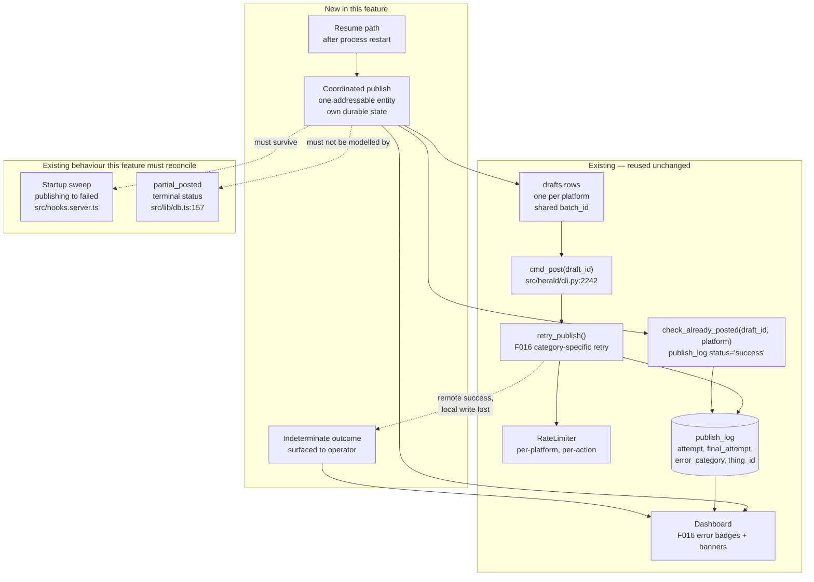
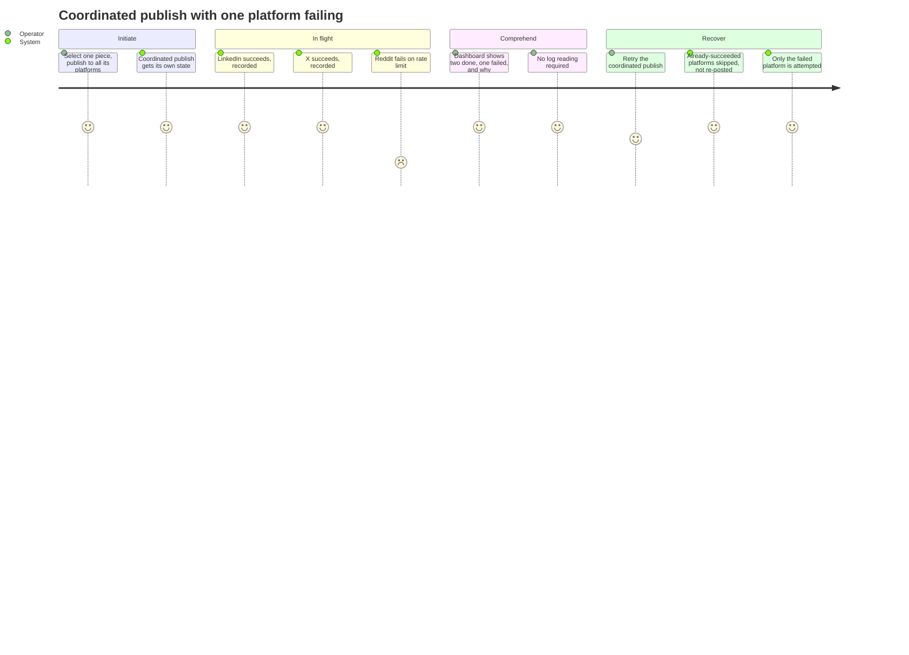

# PRD: Coordinated Multi-Platform Publish

**Version**: 1.0.0
**Status**: Draft
**Created**: 2026-08-15
**Last Updated**: 2026-08-15
**Author**: @product-manager
**Stakeholders**: James Simmons (sole operator, sole developer — per `.claude/rules/constitution.md`, "James is the sole developer and decision-maker")

---

## Changelog

| Version | Date | Changes | Author |
|---------|------|---------|--------|
| 1.0.0 | 2026-08-15 | Initial PRD from feature request "coordinated multi-platform publish" | @product-manager |

---

## 1. Product Summary

### 1.1 Problem Statement

From the source request, verbatim:

> Today a draft is published to one platform at a time. I want to publish the same piece to
> several platforms as one action — LinkedIn, X, Reddit — and have the result be
> comprehensible when it doesn't fully succeed.

> The failure that motivates this: I publish to three platforms, two succeed, one fails on a
> rate limit. Right now I have no single place that tells me what the state of that piece is,
> and retrying is a manual decision per platform with no memory of what already went out.

The codebase confirms the mechanism behind this. Three facts, each verified:

1. **A draft is single-platform by construction.** `drafts.platform` is `TEXT NOT NULL CHECK(platform IN ('linkedin','x','reddit'))` (`src/db/schema.sql`). One row, one platform.
2. **The grouping the operator wants already exists — but only as a label.** `batch_id` is documented in `src/herald/engine/models.py:69` as "Groups all platform variants of one source item." It is consumed only for *display* ordering (`src/lib/queueUtils.ts`, `src/lib/queue.ts`, `src/herald/cli.py:848-912`). It carries no state, no status, and nothing addresses it as a unit.
3. **Publishing is per-draft.** `cmd_post(args.id, ...)` (`src/herald/cli.py:2242`) takes one draft id and drives one publisher. Publishing "one piece" to three platforms is three independent invocations against three sibling rows.

So the operator's "one piece across three platforms" is already a real, named thing in the data model — and the publish path is the one place that does not know about it.

### 1.2 Proposed Solution

Promote the existing per-source grouping from a display label to an addressable entity with its
own durable state, and make the publish path operate on that entity rather than on one draft at
a time. Concretely, the feature must supply the five behaviours the source names: a single
addressable publish with its own state; an unconditional guarantee against double-posting to a
platform that already succeeded; partial success rendered in the dashboard; independent
per-platform rate limiting; and survival of a mid-publish process restart.

Substantial parts of the per-platform machinery already exist and are **not** rebuilt here.
F016 (`docs/PRD/f016-publisher-error-handling-rate-limiting.md`) already delivers per-attempt
`publish_log` rows, a six-category error taxonomy, category-specific retry, the `publishing`
transient status, the 202/polling async architecture, and per-platform dashboard error badges
and re-auth banners. `check_already_posted(draft_id, platform)`
(`src/db/broadcast_db.py:896`) already queries `publish_log` for a `status = 'success'` row —
the per-platform success ledger the source's requirement 2 needs already exists at the
single-draft level.

What this feature adds is the layer above: the coordinating entity, and the correctness
properties that only make sense once several platforms are in flight under one action.

### 1.3 Value Proposition

The source states the cost of the current design directly: "I have no single place that tells me
what the state of that piece is, and retrying is a manual decision per platform with no memory of
what already went out." Herald's operator reviews and publishes inside a short morning window
(F016 persona: "should not need to [read logs] for routine issues"; F018 refers to "his limited
10-minute morning review window"). A partial failure that requires reconstructing state from
`publish_log` by hand is the specific thing that does not fit that window.

### 1.4 Solution Architecture

The relationship between the new coordinating entity and the existing per-platform machinery is
not obvious from prose, so:

---

## 2. User Analysis

### 2.1 Target Users

| User Type | Description | Primary Need |
|-----------|-------------|--------------|
| Sole operator | James Simmons. Herald is explicitly "a single-user content drafting and publishing system for James Simmons" (`.claude/rules/constitution.md`) | Publish one piece to several platforms as one action, and understand the result when it does not fully succeed |

There is exactly one user type. The constitution states "No multi-tenancy, no team features" and
"single-user constraints"; inventing a second persona would misrepresent the product.

### 2.2 User Personas

**Persona: James Simmons**

- **Role**: Sole operator and sole developer of Herald (constitution: "James is the sole developer and decision-maker")
- **Goals**: Publish the same piece to LinkedIn, X and Reddit as one action; have the outcome be comprehensible when it partially fails (source)
- **Pain Points**: "No single place that tells me what the state of that piece is"; "retrying is a manual decision per platform with no memory of what already went out" (source, verbatim)
- **Technical Proficiency**: High — F016 records "can re-authenticate via Keychain, read logs, but should not need to for routine issues"

### 2.3 User Journey

The motivating flow spans the operator, the dashboard, a subprocess and three external platforms,
and its interesting part is what happens *after* a partial failure — so a diagram earns its place.

---

## 3. Goals and Non-Goals

### 3.1 Goals

Each goal restates one numbered requirement from the source. Success metrics are stated as
observable conditions rather than figures, because the source gave no figures and this PRD does
not invent any.

| ID | Goal | Success Metric | Priority |
|----|------|----------------|----------|
| G1 | A multi-platform publish is one addressable thing with its own state, not three unrelated publish attempts (source req 1) | A single identifier resolves to the publish's own state; per-platform outcomes hang off it | P0 |
| G2 | Never double-post to a platform that already succeeded, no matter how many times a retry is triggered (source req 2) | Repeated retries of a coordinated publish produce no second successful `publish_log` row for an already-succeeded platform | P0 |
| G3 | Partial success is visible in the dashboard — which platforms are done, which failed, and why — without reading logs (source req 3) | For a mixed-outcome publish, the dashboard names each platform, its outcome, and the failure reason for failures | P0 |
| G4 | Each platform's rate limiting is respected independently; one throttled platform does not block or delay the others (source req 4) | A platform failing or being throttled does not change the outcome or the completion of the other platforms in the same publish | P0 |
| G5 | A coordinated publish interrupted by a process restart is resumable and does not lose what already succeeded (source req 5) | After a restart mid-publish, the publish's state is recoverable and already-succeeded platforms remain recorded as succeeded | P0 |
| G6 | When remote success and local record diverge, the state is presented honestly rather than guessed (source: "what the honest fallback is when you can't") | An outcome that cannot be determined is shown as undetermined and never silently reported as success or failure | P0 |

### 3.2 Non-Goals (Explicit Scope Exclusions)

| ID | Non-Goal | Rationale |
|----|----------|-----------|
| NG1 | Adding a new platform | Source, verbatim: "Adding a new platform. Work with the publishers that already exist." |
| NG2 | Changing how content is generated or edited | Source, verbatim: "Changing how content is generated or edited. This is about delivery only." |
| NG3 | Reactivating Reddit publishing | Reddit publishing is deferred in live mode today: `_resolve_publisher()` raises `ValueError("Reddit publishing is currently deferred. Reddit drafts cannot be published.")` (`src/herald/publishers/__init__.py:76-80`), a decision recorded in `docs/TRD/TRD-publisher-rearchitecture.md` §1.2 and §8, which states "Reactivation would require a separate TRD." The source names Reddit; this PRD keeps the coordinated publish platform-agnostic so Reddit works the day it is reactivated, but does not reactivate it. See Open Question Q2 and Decision D1. |
| NG4 | Publishing without explicit operator approval | Constitution: "Nothing posts without explicit human approval." F020 restates it as a core design principle. A coordinated publish is still one operator-initiated action. |
| NG5 | Cross-platform rate limit aggregation or a shared budget across platforms | Already decided against in F016's non-goals: "Cross-platform rate limit aggregation — Each platform managed independently." Source req 4 asks for the same independence. |
| NG6 | Changing F016's retry counts, backoff, error taxonomy, or watchdog threshold | Those values were settled by F016 (network_error 3x at 2s/4s/8s; server_error 1x at 2s; six categories; 180s watchdog) and this feature has produced no evidence to revisit them. Reusing them unchanged is the point of building above F016 rather than beside it. |
| NG7 | Automatically re-posting to resolve an outcome that cannot be determined | Auto-retry into an undetermined state is precisely the double-post that G2 forbids. G6 requires it be surfaced instead. See Decision D3. |
| NG8 | Changing the `HERALD_PUBLISHER_STUB=1` contract | Constitution calls it "non-negotiable"; stack.md repeats it. New code obeys it; it is not redesigned. |
| NG9 | Re-litigating the 202/polling async architecture | F016 settled this after an explicit product-research / tech-feasibility / devils-advocate disagreement (F016 Appendix A, Disagreement 1). This feature builds on it. |

---

## 4. Feature Requirements

### 4.1 P0 — Core Features (Must Have)

#### F1: Coordinated publish as a first-class, addressable entity

**Priority**: P0
**Source**: Source requirement 1 — "It MUST treat a multi-platform publish as one addressable thing with its own state, not three unrelated publish attempts."

**Description**: A coordinated publish is created as one entity with its own durable state and its
own identity. The per-platform drafts that make it up are its members. The entity's state is
derived from and separable from the member states — a publish can be *in progress* while some
members are done and others are not.

**User Stories**:
- As the operator, I want to publish one piece to several platforms as one action, so that I have one thing to look at afterwards rather than three.

**Acceptance Criteria**:
- [ ] AC-F1.1: One operator action initiates publishing of one piece to more than one platform.
- [ ] AC-F1.2: The coordinated publish has a single identifier that resolves to its own state, independent of any one member draft's status.
- [ ] AC-F1.3: Each member of a coordinated publish records which platform it targets and its own per-platform outcome.
- [ ] AC-F1.4: A coordinated publish whose members have mixed outcomes is representable — it is not forced into a single member-level status.

**Dependencies**: Existing `batch_id` grouping (`src/herald/engine/models.py:69`) — see Open Question Q3 on whether the coordinated publish is the existing batch or a fresh selection.

---

#### F2: Unconditional per-platform double-post guard

**Priority**: P0
**Source**: Source requirement 2 — "It MUST never double-post to a platform that already succeeded, no matter how many times a retry is triggered."

**Description**: Before attempting any platform within a coordinated publish, the system consults
the recorded success ledger for that platform and skips it if a success is already recorded. The
mechanism exists: `check_already_posted(draft_id, platform)` returns the `publish_log` row where
`status = 'success'` for that draft and platform (`src/db/broadcast_db.py:896-926`). Two things
must change for the source's "no matter how many times" to hold.

First, the guard must cover retries of the *coordinated* publish, not just repeat invocations of
a single draft. Second, the guard is currently bypassable: `cmd_post` skips the check when
`--force` is passed (`src/herald/cli.py:2490`), and F016 documents a comparable escape hatch for
daily limits (`--force-daily-limit`). The source's requirement is absolute — "no matter how many
times a retry is triggered" — so no retry path within a coordinated publish may bypass the guard.

**User Stories**:
- As the operator, I want to hit retry on a partially-failed publish without thinking about it, so that I never have to remember which platforms already went out.

**Acceptance Criteria**:
- [ ] AC-F2.1: Before attempting a platform within a coordinated publish, the recorded success ledger for that platform is consulted.
- [ ] AC-F2.2: A platform with a recorded success is skipped, and no publish attempt is made to it.
- [ ] AC-F2.3: Repeated retries of the same coordinated publish, any number of times, produce no second successful `publish_log` row for an already-succeeded platform.
- [ ] AC-F2.4: No retry path reachable from a coordinated publish bypasses AC-F2.1, including any force-style override.
- [ ] AC-F2.5: A skipped platform is reported as already-published, distinguishably from newly-published and from failed.

**Dependencies**: F1; existing `check_already_posted`; F016's `publish_log` success rows.

---

#### F3: Durable state and resume across process restart

**Priority**: P0
**Source**: Source requirement 5 — "It MUST survive the process restarting mid-publish: a coordinated publish interrupted halfway is resumable and does not lose what already succeeded."

**Description**: The coordinated publish's state and its per-platform outcomes are durable, so a
restart mid-publish leaves a recoverable record rather than an ambiguous one. Two existing
behaviours point the other way and must be reconciled rather than ignored:

- **The startup sweep converts in-flight publishes to failures.** `src/hooks.server.ts` "Resets any drafts stuck in 'publishing' to 'failed' so they can be retried," with `error_detail='server_restart'` — the behaviour F016 specified as AC-39. For a single draft that is a reasonable zombie-cleanup. For a coordinated publish it discards exactly the in-flight state requirement 5 says must survive, and re-labels an undetermined outcome as a determined failure.
- **`partial_posted` is terminal.** It exists in the `drafts.status` CHECK (`src/db/schema.sql`) and is used for X thread partial posting, but `VALID_TRANSITIONS` gives it no outbound edges — `partial_posted: new Set()` in both `src/lib/db.ts:157` and `src/lib/server/db.ts:285`, asserted by a test titled "partial_posted is terminal (no further transitions)" (`src/lib/__tests__/db.test.ts:745`). A coordinated publish that partially succeeded must remain resumable, so its partial state cannot be this status as it stands.

**User Stories**:
- As the operator, I want a publish interrupted by a restart to be recoverable, so that the platforms that already went out stay recorded and I only have to deal with the rest.

**Acceptance Criteria**:
- [ ] AC-F3.1: A platform's success is durably recorded at the point it is known, not only at the end of the coordinated publish.
- [ ] AC-F3.2: After a process restart mid-publish, the coordinated publish's state is recoverable and identifies which platforms had already succeeded.
- [ ] AC-F3.3: A restart does not cause an already-succeeded platform to be attempted again (this is AC-F2.3 under the restart path specifically).
- [ ] AC-F3.4: The startup sweep does not convert an interrupted coordinated publish into a state that loses its per-platform outcomes.
- [ ] AC-F3.5: A coordinated publish in a partially-succeeded state can still transition — it is not terminal.
- [ ] AC-F3.6: An interrupted publish is resumable by the operator, and resuming attempts only platforms with no recorded success.

**Dependencies**: F1, F2; reconciliation with `src/hooks.server.ts` startup sweep and F016 AC-39.

---

#### F4: Partial success visible in the dashboard

**Priority**: P0
**Source**: Source requirement 3 — "It MUST make partial success visible in the dashboard — which platforms are done, which failed, and why — without the operator having to read logs."

**Description**: One dashboard surface shows, for a coordinated publish, every platform it
targeted, that platform's outcome, and for failures the reason. F016 already renders per-platform
failure reasons via colour-coded error badges keyed to its six error categories and a re-auth
banner (F016 F16.7, AC-41/AC-42); this feature composes those existing per-platform signals into
one view for the publish as a whole rather than inventing a second error vocabulary.

**User Stories**:
- As the operator, I want one place that tells me the state of the piece, so that I do not have to reconstruct it from `publish_log`.

**Acceptance Criteria**:
- [ ] AC-F4.1: One dashboard surface shows all platforms targeted by a coordinated publish.
- [ ] AC-F4.2: Each platform shows its outcome: succeeded, failed, skipped-as-already-published, not yet attempted, or undetermined (per F6).
- [ ] AC-F4.3: Each failed platform shows why it failed, expressed in F016's existing error categories.
- [ ] AC-F4.4: The information required to answer "which are done, which failed, and why" is available without opening `publish_log` or any log file.
- [ ] AC-F4.5: The mixed-outcome case renders correctly on mobile — F016 AC-44 already requires error states and banners to render at ≤390px, and Herald is reached from mobile over Tailscale (stack.md).

**Dependencies**: F1; F016's error badges and `/api/publisher-status`.

---

#### F5: Independent per-platform progression

**Priority**: P0
**Source**: Source requirement 4 — "It MUST respect each platform's own rate limiting independently, so one throttled platform does not block or delay the others."

**Description**: Rate limiting stays per-platform, as it already is: `RateLimiter` enforces
per-platform, per-action daily limits from `publish_log` (`src/herald/publishers/rate_limiter.py`),
and F016 enforces a per-platform `daily_count`/`daily_limit` atomically against the `platforms`
table. This feature adds one property on top: within a coordinated publish, a platform that is
throttled, slow, or failing must not determine the outcome or the completion of the others.

**User Stories**:
- As the operator, I want a throttled platform to hold up only itself, so that the rest of the piece still goes out.

**Acceptance Criteria**:
- [ ] AC-F5.1: A platform being rate-limited within a coordinated publish does not prevent the other platforms from being attempted.
- [ ] AC-F5.2: A platform being rate-limited does not change the recorded outcome of any other platform in the same publish.
- [ ] AC-F5.3: Rate-limit accounting remains per-platform; no shared or aggregated budget is introduced (NG5).
- [ ] AC-F5.4: A platform failing terminally within a coordinated publish does not abort attempts to platforms not yet attempted.

**Dependencies**: Existing `RateLimiter`; F016 F16.3 and F16.5.

---

#### F6: Undetermined outcomes are surfaced, never guessed

**Priority**: P0
**Source**: Source, "The hard part", verbatim: "a publish that succeeded remotely but crashed before recording locally looks identical to one that never went out. I don't know how you tell those apart for these platforms, or what the honest fallback is when you can't." Requirement derived from source requirements 2 and 3 taken together — see rationale below.

**Description**: The source poses the crash-window problem and explicitly does not answer it. This
PRD does not invent an answer either. What it does fix is the *fallback*, because the fallback is
forced by requirements already stated: an outcome that cannot be determined cannot be auto-retried
(requirement 2 forbids a possible double-post) and cannot be silently reported either way
(requirement 3 requires the operator can see what the state is). The only remaining option is to
represent it as undetermined and let the operator decide.

This is not new ground for Herald. F016 accepted precisely this risk and named a successor to
close it: "Post-publish duplicate detection via feed verification — Deferred to F017" and
"Full prevention requires F017." **That successor does not exist.** `F017` in
`docs/plans/herald/plan.md:50` and `docs/design/herald/features.md:234` is "Source URL
Validation" — an unrelated feature, since renumbered to F030
(`docs/PRD/f030-source-url-validation.md`). No feed-verification feature was ever scheduled. The
mitigation F016 leaned on has been vacant since F016 shipped, which is a substantive reason this
feature cannot simply inherit F016's "risk accepted".

**User Stories**:
- As the operator, I want a publish whose outcome cannot be determined to say so, so that I decide whether to re-post rather than the system guessing and possibly double-posting.

**Acceptance Criteria**:
- [ ] AC-F6.1: A per-platform outcome that cannot be determined is recorded as undetermined — a state distinct from both succeeded and failed.
- [ ] AC-F6.2: An undetermined outcome is never automatically converted to success or to failure without evidence.
- [ ] AC-F6.3: An undetermined platform is never automatically re-attempted (NG7).
- [ ] AC-F6.4: An undetermined outcome is shown to the operator on the F4 surface, identifying the platform and stating that the outcome is unknown.
- [ ] AC-F6.5: The operator can resolve an undetermined outcome explicitly — recording it as published or as not published — and that resolution feeds the F2 guard.

**Dependencies**: F1, F2, F4; Open Question Q1 (per-platform reconciliation spike) determines whether F7 can reduce how often this state is reached.

---

### 4.2 P1 — Enhanced Features (Should Have)

#### F7: Per-platform reconciliation of undetermined outcomes

**Priority**: P1
**Source**: Source, "The hard part": "I don't know how you tell those apart for these platforms". F016's stated intent to close this via "post-publish feed verification", which was never scheduled (see F6).

**Description**: Where a platform offers a way to determine after the fact whether a post actually
landed, use it to resolve an undetermined outcome automatically, reducing how often F6's manual
resolution is needed. Whether any of Herald's current platforms offers this is **not yet known**
and is the subject of Open Question Q1. This is P1 rather than P0 precisely because its
feasibility is unestablished: F6 gives a correct, honest system without it.

**User Stories**:
- As the operator, I want the system to check whether a post actually landed when it can, so that I am asked to adjudicate less often.

**Acceptance Criteria**:
- [ ] AC-F7.1: For each platform where reconciliation is determined to be feasible (Q1), an undetermined outcome can be resolved against the platform rather than by the operator.
- [ ] AC-F7.2: A reconciliation result updates the F2 success ledger, so a reconciled success is thereafter skipped by the double-post guard.
- [ ] AC-F7.3: For platforms where reconciliation is determined to be infeasible, the F6 manual path remains the outcome and the infeasibility is recorded in the TRD.

**Dependencies**: F6; Open Question Q1.

---

## 5. Non-Functional Requirements

| ID | Requirement | Source |
|----|-------------|--------|
| NFR-1 | All publisher calls made by this feature respect `HERALD_PUBLISHER_STUB=1`, making no real HTTP calls when it is set | `.claude/rules/constitution.md`: "Tests and verification ALWAYS run in stub mode. This is non-negotiable." Repeated in `stack.md` and `CLAUDE.md` |
| NFR-2 | New code follows TDD — no production code before a failing test exists for it | `.claude/rules/constitution.md`, "Development Methodology: TDD" — listed as applying to publisher modules, CLI commands, dashboard API routes, and database CRUD, all of which this feature touches |
| NFR-3 | Unit test coverage ≥ 80%, integration ≥ 70% | `.claude/rules/constitution.md`, "Coverage Targets". These are the project's stated gates, not figures derived for this feature |
| NFR-4 | Verification runs against a live dashboard instance with publishers stubbed | `.claude/rules/constitution.md`, "Verification Level: live-required" |
| NFR-5 | Every `publish_log` row this feature writes has `error_detail` and `request_data` sanitized before INSERT | F016 AC-26 and F16.6 — this feature writes into the same table and the requirement is already established for all INSERTs |
| NFR-6 | No credentials in code; credentials via Keychain or `get_api_key()` | `.claude/rules/constitution.md`, "No credentials in code — macOS Keychain only" |
| NFR-7 | Any change to draft status transitions is applied to all three `VALID_TRANSITIONS` tables in the same commit and verified by the existing cross-language test | F016 AC-33/AC-34 and F016's risk register, which rates drift across the three files High likelihood / High impact. F3 requires transition changes, so this constraint is live |

No latency, throughput, or availability requirement is listed, because the source states none and
none was measured. F016's existing figures (180s watchdog, 5s dashboard polling, retry backoff)
continue to apply as-is under NG6; they are not restated here as requirements of this feature.

---

## 6. Acceptance Criteria Summary

### Feature Acceptance Criteria

| ID | Feature | Criterion | Verification Method |
|----|---------|-----------|---------------------|
| AC-F1.1 | F1 | One operator action publishes one piece to more than one platform | E2E (Playwright, stub mode) |
| AC-F1.2 | F1 | A single identifier resolves to the coordinated publish's own state | Unit + integration |
| AC-F1.3 | F1 | Each member records its platform and its own outcome | Unit |
| AC-F1.4 | F1 | Mixed member outcomes are representable | Unit |
| AC-F2.1 | F2 | Success ledger consulted before attempting a platform | Unit |
| AC-F2.2 | F2 | Platform with recorded success is skipped, no attempt made | Unit |
| AC-F2.3 | F2 | Repeated retries produce no second success row for an already-succeeded platform | Integration (repeat-retry test) |
| AC-F2.4 | F2 | No reachable retry path bypasses the guard, including force-style overrides | Unit + code-path review |
| AC-F2.5 | F2 | Skipped-as-already-published is distinguishable from published and failed | Unit + E2E |
| AC-F3.1 | F3 | Per-platform success durably recorded at the point it is known | Integration |
| AC-F3.2 | F3 | State recoverable after restart, identifying already-succeeded platforms | Integration (kill/restart test) |
| AC-F3.3 | F3 | Restart does not cause re-attempt of an already-succeeded platform | Integration |
| AC-F3.4 | F3 | Startup sweep does not lose per-platform outcomes of an interrupted publish | Integration |
| AC-F3.5 | F3 | Partially-succeeded coordinated publish is not terminal | Unit (transition table) |
| AC-F3.6 | F3 | Resume attempts only platforms with no recorded success | Integration |
| AC-F4.1 | F4 | One surface shows all targeted platforms | E2E |
| AC-F4.2 | F4 | Each platform shows outcome incl. skipped / not-attempted / undetermined | E2E |
| AC-F4.3 | F4 | Failures show reason in F016 error categories | E2E |
| AC-F4.4 | F4 | No log reading required to answer done/failed/why | Manual |
| AC-F4.5 | F4 | Mixed-outcome view renders at ≤390px | E2E (mobile viewport) |
| AC-F5.1 | F5 | Rate-limited platform does not prevent others being attempted | Integration (publisher mocked to return a `rate_limited` `PublishResult`, as in `tests/unit/test_cmd_post.py::test_rate_limited_error_sets_error_category`) |
| AC-F5.2 | F5 | Rate-limited platform does not change others' recorded outcomes | Integration |
| AC-F5.3 | F5 | Rate-limit accounting remains per-platform | Unit |
| AC-F5.4 | F5 | Terminal failure of one platform does not abort not-yet-attempted platforms | Integration |
| AC-F6.1 | F6 | Undetermined outcome recorded as distinct from succeeded and failed | Unit |
| AC-F6.2 | F6 | Undetermined never auto-converted to success or failure | Unit |
| AC-F6.3 | F6 | Undetermined never auto-re-attempted | Unit |
| AC-F6.4 | F6 | Undetermined shown to operator with platform named | E2E |
| AC-F6.5 | F6 | Operator resolution recorded and feeds the F2 guard | Integration |
| AC-F7.1 | F7 | Reconciliation resolves undetermined outcomes where feasible | Integration (per feasible platform) |
| AC-F7.2 | F7 | Reconciled success updates the F2 ledger | Integration |
| AC-F7.3 | F7 | Infeasible platforms fall back to F6 and infeasibility is recorded | Manual (TRD review) |

### Non-Functional Acceptance Criteria

| ID | Requirement | Criterion | Verification Method |
|----|-------------|-----------|---------------------|
| AC-N1 | NFR-1 | With `HERALD_PUBLISHER_STUB=1`, no real HTTP call is made by any path this feature adds | Unit |
| AC-N2 | NFR-2 | Each new behaviour has a test that failed before its implementation | Manual (commit history / review) |
| AC-N3 | NFR-3 | Unit coverage ≥ 80%, integration ≥ 70% | pytest-cov / vitest coverage |
| AC-N4 | NFR-4 | Verification runs against the live dashboard with publishers stubbed | Live verification (`verify-app`) |
| AC-N5 | NFR-5 | Every `publish_log` INSERT added by this feature passes through sanitization | Unit |
| AC-N6 | NFR-6 | No credential literal in added code; credentials resolved via `get_api_key()` | Unit + review |
| AC-N7 | NFR-7 | All three `VALID_TRANSITIONS` tables agree after this feature's changes | Existing cross-language test (F016 AC-34) |

---

## 7. Risk Assessment

| ID | Risk | Likelihood | Impact | Mitigation Strategy |
|----|------|------------|--------|---------------------|
| R1 | Remote success with lost local record is indistinguishable from never-sent, so the F2 guard has a window in which it cannot protect | High | High | This is the source's own stated hard part and is not solved by durability alone. F6 makes the window visible rather than silently wrong; F7 narrows it where a platform permits. Q1 must be answered before the TRD commits to a mechanism. |
| R2 | The startup sweep (`src/hooks.server.ts`, F016 AC-39) converts an interrupted coordinated publish to `failed`, destroying the in-flight state requirement 5 says must survive | High | High | AC-F3.4 makes this a blocking criterion. The sweep's zombie-cleanup purpose for single drafts is legitimate and must be preserved for them — the TRD must reconcile the two rather than delete the sweep. |
| R3 | `partial_posted` is terminal in both `VALID_TRANSITIONS` tables and is asserted terminal by an existing test, so a partially-succeeded coordinated publish modelled with it cannot be resumed | High | High | AC-F3.5. Decision D4 records that the coordinated publish's partial state must not reuse the terminal status as it stands. Changing it would invalidate an existing test asserting terminality for the X-thread case, so the TRD must separate the two concepts. |
| R4 | The `--force` path bypasses `check_already_posted` (`src/herald/cli.py:2490`), and F016 documents a comparable `--force-daily-limit` escape hatch; either reachable from a coordinated retry would violate the source's absolute "no matter how many times" | Medium | High | AC-F2.4 requires no reachable coordinated-publish retry path bypasses the guard. Whether the CLI overrides remain available for single-draft use is a separate question the TRD should state explicitly. |
| R5 | Adding coordinated-publish states re-incurs F016's highest-rated risk: drift across the three `VALID_TRANSITIONS` tables (`broadcast_db.py`, `src/lib/db.ts`, `src/lib/server/db.ts`), which F016 rated High/High | High | High | NFR-7 and AC-N7: reuse F016's existing cross-language equality test (AC-34); all three files change in one commit. |
| R6 | F016's stated mitigation for the phantom-post risk was deferral to "F017 (feed verification)", and no such feature exists — `F017` is Source URL Validation. Inheriting F016's "risk accepted" would inherit a mitigation that was never built | Certain | Medium | Established by inspection of `docs/plans/herald/plan.md:50` and `docs/design/herald/features.md:234`. F6 replaces the vacant deferral with a behaviour that exists in this feature's own scope. |
| R7 | The source names Reddit as one of the three platforms, but Reddit publishing raises in live mode today | Certain | Medium | NG3 + Open Question Q2. Building the coordinated publish platform-agnostically means a Reddit reactivation needs no rework here, but the operator should confirm the expectation before implementation rather than discover it at first live run. |

### Contingency Plans

**R1 Contingency**: If Q1 establishes that no current platform supports reliable read-back, F7 is
dropped and F6 becomes the permanent answer — every ambiguous outcome is adjudicated by the
operator. This is a smaller product than hoped but is honest and satisfies requirements 2, 3 and 5
as written. It must be stated plainly in the TRD rather than left as a gap.

**R2 Contingency**: If reconciling the startup sweep with resumability proves larger than expected,
the interim behaviour must still preserve per-platform outcomes — losing which platforms succeeded
is a requirement-5 violation, whereas requiring an explicit operator resume is not.

**R3 Contingency**: If separating the coordinated publish's partial state from `partial_posted`
proves invasive, the fallback is to leave `partial_posted` untouched for the X-thread case and
carry coordinated-publish state on the coordinating entity only. Weakening the existing terminality
assertion is not an acceptable fallback — an existing test depends on it.

---

## 8. Decisions and Rejected Alternatives

| Proposal / Challenge | Verdict | Rationale | Revisit when |
|----------------------|---------|-----------|--------------|
| D1: Reactivate Reddit publishing so the feature covers all three platforms the source names | Rejected | `_resolve_publisher()` raises for Reddit in live mode by an already-taken decision (`TRD-publisher-rearchitecture` §1.2), which states reactivation "would require a separate TRD". The source also says "Work with the publishers that already exist." | A Reddit reactivation TRD lands, or the operator answers Q2 saying Reddit must be live for this feature to be useful |
| D2: Give the coordinated publish a shared rate-limit budget across platforms so it can pace itself as a unit | Rejected | Contradicts source requirement 4 ("respect each platform's own rate limiting independently") and F016's existing non-goal "Cross-platform rate limit aggregation — Each platform managed independently" | Evidence appears that platforms share an upstream limit that genuinely couples them — e.g. `TRD-publisher-rearchitecture` §7.1 flags "PhantomBuster rate limiting (API-level, not per-phantom)", which would couple any two platforms both routed through PhantomBuster |
| D3: On an undetermined outcome, retry automatically and deduplicate afterwards | Rejected | An automatic retry into an undetermined state is exactly the double-post source requirement 2 forbids absolutely. Deduplicating afterwards is not available: the after-the-fact check is F7, whose feasibility is unknown (Q1) | Q1 establishes reliable per-platform read-back, making "check then retry" a determinate operation rather than a gamble |
| D4: Model the coordinated publish's partial state with the existing `partial_posted` status | Rejected | `partial_posted` has no outbound transitions in either `VALID_TRANSITIONS` table and an existing test asserts it is terminal (`src/lib/__tests__/db.test.ts:745`). Requirement 5 demands the partial state stay resumable | The X-thread partial-posting case is itself made resumable, at which point the two concepts may converge |
| D5: Build post-publish feed verification now, as F016 intended for "F017" | Rejected as a P0 | Its feasibility per platform is unknown (Q1) and requirements 2, 3 and 5 are satisfiable without it via F6. Making an unscoped investigation a P0 blocker would stall the whole feature | Q1 returns a positive feasibility answer for at least one platform — F7 then becomes buildable and is already scoped as P1 |
| D6: Make the coordinated publish synchronous, avoiding the async state machine entirely | Rejected | F016 settled the 202/polling architecture after an explicit three-way disagreement (F016 Appendix A, Disagreement 1), specifically because the Python subprocess cannot stream results through SvelteKit's request lifecycle. That reasoning applies more strongly with several platforms in flight | Never for this feature; reopening it means reopening F016's architecture decision |
| D7: Rebuild retry, error classification and rate limiting inside the coordinated layer | Rejected | F016 already provides all three per-platform, and F5/F2 need only compose them. Duplicating them creates a second error vocabulary competing with the badges the dashboard already renders | F016's per-platform behaviour is found to be structurally unable to express a per-member outcome — which the TRD should check before assuming reuse |

### Confirmed grounding — do not re-litigate

Verbatim from the source request:

- "Adding a new platform. Work with the publishers that already exist."
- "Changing how content is generated or edited. This is about delivery only."
- "Requirement 2 and requirement 5 together are the difficulty, and I don't have an answer."
- "Use what is already decided."

From `.claude/rules/constitution.md`:

- "Nothing posts without explicit human approval."
- "Tests and verification ALWAYS run in stub mode. This is non-negotiable."

---

## 9. Beliefs and Open Questions

### 9.1 Beliefs — not fact

| ID | Claim | What would settle it |
|----|-------|----------------------|
| B1 | **Belief, not fact**: no platform Herald currently publishes to accepts a client-supplied idempotency key, so exactly-once cannot be pushed to the platform. F016 asserted this ("Idempotency keys not supported by Apify actors"), but the publish backends have since changed — LinkedIn moved to the official OAuth2 Posts API and X to PhantomBuster (`TRD-publisher-rearchitecture` §1.1), so F016's statement no longer covers the code that runs | Read the LinkedIn Posts API reference for an idempotency or deduplication header, and the PhantomBuster launch payload for a client-supplied request key. Part of Q1 |
| B2 | **Belief, not fact**: the publisher rearchitecture is fully in effect. `src/herald/publishers/phantombuster.py` exists and the Reddit live-mode guard is present, which is consistent with it — but `TRD-publisher-rearchitecture` is still marked **Status: Draft** | Check that TRD's task completion state, or run the suite and confirm no Apify code path remains |
| B3 | **Belief, not fact**: the members of a coordinated publish are the sibling drafts sharing a `batch_id`. `models.py:69` describes `batch_id` as grouping "all platform variants of one source item", which fits — but the operator may intend an ad-hoc selection instead | Q3 |
| B4 | **Belief, not fact**: no operator-facing surface today shows batch-level publish state. `batch_id` appears in `queueUtils.ts` and `queue.ts` for display grouping and in `cli.py` for a batch separator line, all of which look presentational | Review the queue and history views for any batch-level status rendering |

### 9.2 Open Questions

| ID | Question | Status | Why it matters |
|----|----------|--------|----------------|
| Q1 | For each live platform, is there a reliable way to determine after the fact whether a post actually landed — and if not, is that infeasibility permanent or just unbuilt? | Open — needs a spike before the TRD commits to a mechanism | Determines whether F7 is buildable at all, and therefore how often F6's manual adjudication is the operator's reality. Also settles B1 |
| Q2 | The source names Reddit, but Reddit publishing raises in live mode by a prior decision. Should this feature target the platforms that are live today, or is Reddit reactivation a prerequisite? | Open — operator decision | Changes the scope of the whole feature and whether NG3 stands. Recorded rather than assumed, because dropping a platform the source named would be a silent rescope |
| Q3 | Is a coordinated publish the existing `batch_id` group, or a selection the operator makes at publish time? | Open — operator decision | Determines whether F1 promotes an existing grouping or introduces a new one, and whether pieces drafted separately can be published together |

---

## Appendices

### Appendix A: Glossary

| Term | Definition |
|------|------------|
| Coordinated publish | One operator action publishing one piece to several platforms, with its own state — the entity this PRD introduces (F1) |
| Member | One platform's participation in a coordinated publish; today, one `drafts` row (`drafts.platform` is single-valued) |
| Success ledger | The existing record of what actually went out: `publish_log` rows with `status = 'success'`, read via `check_already_posted(draft_id, platform)` |
| Undetermined outcome | A per-platform outcome that can be neither confirmed nor denied — the crash-window case the source names as the hard part (F6) |
| Partial success | A coordinated publish where some members succeeded and others did not — the motivating scenario in the source |

### Appendix B: Related Documents

Herald corpus consulted (all under `/Users/james/dev/herald`):

- `docs/PRD/f016-publisher-error-handling-rate-limiting.md` — error taxonomy, retry, rate limiting, `publishing` status, 202/polling, watchdog. Reused, not rebuilt (NG6)
- `docs/TRD/TRD-publisher-rearchitecture.md` — LinkedIn OAuth2 Posts API, X via PhantomBuster, Reddit deactivation (D1)
- `docs/PRD/f018-duplicate-detection.md` — semantic similarity between *drafts* at generation time. Reviewed and found not to address double-*posting*; cited only for the operator's review-window constraint
- `docs/PRD/f030-source-url-validation.md` — the feature actually occupying the F017 slot referenced by F016's deferral (R6)
- `docs/PRD/f020-daily-automation-cron.md` — confirms automation drafts but never publishes ("Will not auto-publish"), so NG4 is unaffected by cron
- `docs/plans/herald/plan.md` — feature numbering, used to establish that no feed-verification feature was scheduled
- `.claude/rules/constitution.md`, `.claude/rules/stack.md` — NFR-1 through NFR-6

Code consulted:

- `src/db/schema.sql` — `drafts.platform`, `drafts.status`, `publish_log`, `platforms`
- `src/db/broadcast_db.py:896` — `check_already_posted()`
- `src/herald/cli.py:2242`, `:2490` — `cmd_post()` and the `--force` dedup bypass
- `src/herald/publishers/__init__.py:76-80` — Reddit live-mode guard
- `src/herald/publishers/rate_limiter.py` — per-platform, per-action limits
- `src/herald/engine/models.py:69` — `batch_id` semantics
- `src/hooks.server.ts` — startup sweep of `publishing` drafts
- `src/lib/db.ts:157`, `src/lib/server/db.ts:285`, `src/lib/__tests__/db.test.ts:745` — `partial_posted` terminality
