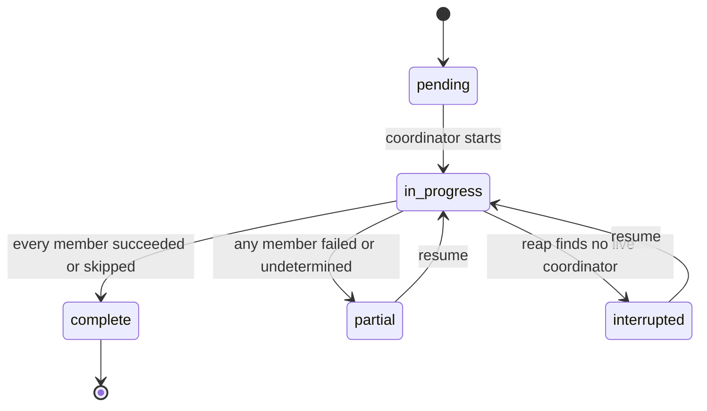

# TRD: Coordinated Multi-Platform Publish

**Version**: 1.0.0
**Status**: Draft
**Created**: 2026-08-15
**Last Updated**: 2026-08-15
**Author**: @technical-architect
**Source PRD**: `docs/modernization/runs/case3-herald/v3/PRD.md`, relative to the *authoring*
repository `/Users/james/dev/fortium/ensemble-vnext` (Coordinated Multi-Platform Publish, v1.0.0)
**Target repository**: `/Users/james/dev/herald` — every source path, test path, and
`.claude/rules/*` citation below resolves against this repository, not the authoring one
**Task ID Prefix**: `CMP`

---

## Changelog

| Version | Date | Changes | Author |
|---------|------|---------|--------|
| 1.0.0 | 2026-08-15 | Initial TRD creation from PRD v1.0.0 | @technical-architect |

---

## 1. Overview

### 1.1 Technical Summary

The PRD's five behaviours all reduce to one structural gap: publishing is addressed
per-draft, and the grouping the operator thinks in (`drafts.batch_id`) carries no state.
This TRD introduces two tables — `publish_runs` and `publish_run_members` — that make the
coordinated publish an addressable entity with durable per-platform outcomes, and a Python
coordinator that dispatches members through the **existing** single-draft publish path
(`cmd_post` → `retry_publish`) rather than beside it.

Four grounding facts from the Herald codebase shape the design:

1. **`retry_publish` writes its `publish_log` attempt row *before* calling the publisher**
   (`src/herald/publishers/base.py:618-627`, `status='failed'`, `final_attempt=0`). A
   process that dies mid-call therefore leaves a durable, distinguishable signature: an
   attempt row with `final_attempt=0` and no `success` row. That signature is what the
   undetermined classifier (F6) keys on. Without it, F6 would have no mechanism at all.
2. **The Python CLI already owns all publish-path DB writes.**
   `src/lib/server/post.ts:9-11` states it explicitly: *"The Python CLI owns all DB writes
   (draft status, publish_log insert). This wrapper is intentionally read-only with respect
   to those tables."* Keeping run/member writes on the same side of that boundary is what
   makes NFR-5 (sanitization) satisfiable by reuse rather than by a second implementation.
3. **`sweepZombiePublishing()` is an unconditional blanket UPDATE**
   (`src/lib/server/db.ts:1044-1054`): `UPDATE drafts SET status='failed',
   error_detail='server_restart' WHERE status='publishing'`. It is not aware of any
   grouping. Narrowing it is the minimum change that satisfies AC-F3.4 without deleting the
   single-draft zombie cleanup it exists for.
4. **`partial_posted` is terminal in every map that defines it** (`src/db/broadcast_db.py:185`,
   `src/lib/db.ts:157`, `src/lib/server/db.ts:285`) and an existing test asserts it
   (`src/lib/__tests__/db.test.ts:745`). Confirmed by inspection — the PRD's D4 stands.

Two claims the PRD makes about existing behaviour did **not** survive inspection and are
recorded here rather than inherited (see §7.2, TR1 and TR2):

- The "existing cross-language test" that NFR-7/AC-N7 rely on
  (`tests/integration/test_valid_transitions_consistency.py`) is **not an equality test** —
  it checks that the string `'publishing'` appears in each TypeScript file. A real,
  currently-undetected divergence exists today: `posting` maps to
  `{posted, failed, partial_posted}` in Python and `{posted, failed, approved}` in
  `src/lib/db.ts`.
- **F016's per-platform error badges do not exist in the codebase.** No Svelte component
  references `error_category` except `ReAuthBanner.svelte`, and that only in a comment.
  AC-F4.3 therefore requires new UI, not composition of an existing vocabulary. The error
  *categories* themselves are real (`src/herald/publishers/base.py:63-79`) and are reused
  unchanged.

### 1.2 Key Technical Decisions

| ID | Decision | Choice | Serves Objective | Rationale | Alternatives Considered |
|----|----------|--------|------------------|-----------|------------------------|
| D1 | Coordinating entity | Two new tables, `publish_runs` (the addressable publish) and `publish_run_members` (one row per platform), rather than new columns on `drafts` | AC-F1.2, AC-F1.3, AC-F1.4 | AC-F1.2 requires an identifier resolving to state *independent of any member draft's status*. A column on `drafts` cannot be independent of `drafts`. A member table is also where mixed outcomes (AC-F1.4) become representable without touching `drafts.status`. | (a) Extra `drafts` columns — cannot express run-level state, rejected. (b) Reuse `batch_id` alone as the key with no row — no place to store run state; `batch_id` is `TEXT` with no uniqueness or index and is consumed only for display (`src/lib/queueUtils.ts:119`, `src/lib/queue.ts:111`). **Revisit** if a second grouping concept appears that also needs run state, at which point the run should key on something more general than a batch. |
| D2 | Membership definition (resolves PRD Q3) | A run's members are the **`approved` drafts sharing one `batch_id`**, snapshotted into `publish_run_members` at creation time | AC-F1.1, AC-F1.3 | PRD §1.2 states the intent directly: *"Promote the existing per-source grouping from a display label to an addressable entity."* `batch_id` is documented as grouping "all platform variants of one source item" (`src/herald/engine/models.py:69`), which is exactly one piece across platforms. Snapshotting at creation means later edits to the batch cannot silently change what a run promised to publish. | Ad-hoc operator multi-select at publish time (PRD Q3's other branch) — larger UI surface and no existing grouping to lean on. **Revisit** when the operator asks to publish pieces drafted separately as one action; the member table already supports it, only the creation endpoint would change. |
| D3 | Who writes run state | The **Python CLI is the sole writer** of `publish_runs`, `publish_run_members` and `publish_log` for this feature. TypeScript reads them and never writes them. | AC-N7, NFR-5, NFR-7, R5 | R5 (rated High/High in the PRD) is drift across three copies of a state map. A second entity with a second state map replicated into TypeScript would re-incur it in full. One writer, one language, no second map. It also makes NFR-5 satisfied by reuse: `_sanitize_for_log` (`src/herald/publishers/base.py:102`) already guards every Python `publish_log` write, whereas the TypeScript `logPublish` (`src/lib/server/db.ts:1270`) sanitizes nothing and does not even write the `error_category`/`attempt`/`final_attempt`/`success` columns the classifier reads. Follows the boundary already stated in `src/lib/server/post.ts:9-11`. | Mirror a `RUN_TRANSITIONS` map into TS as `VALID_TRANSITIONS` is mirrored — rejected as re-incurring R5 by construction. **Revisit** if a run-state write is ever needed on a request path where spawning a subprocess is unacceptable. |
| D4 | Startup reconciliation | TS `init` hook (`src/hooks.server.ts`) spawns `broadcast publish-run reap` and narrows `sweepZombiePublishing()` to exclude drafts that are members of a **non-`complete`** run | AC-F3.2, AC-F3.4, AC-F6.1 | The sweep's blanket UPDATE is exactly the behaviour R2 names. Narrowing preserves its zombie-cleanup purpose for single drafts (F016 AC-39) while leaving coordinated members' per-platform outcomes intact. Classification stays in Python per D3, invoked through the same spawn pattern already used at `src/routes/api/carousel/[draft_id]/regenerate/+server.ts:50`. | (a) Delete the sweep — rejected; R2 says its single-draft purpose is legitimate. (b) Let the sweep relabel coordinated members in TS — rejected under D3. **Revisit** if coordinated runs ever become the only publish path, at which point the sweep can be replaced by reap outright. |
| D5 | Coordinator liveness | The coordinator runs as a **non-detached child** of the dashboard process, spawned per run; a dashboard restart therefore guarantees no coordinator is alive when `reap` runs at `init` | AC-F3.2, AC-F3.4 | Makes "is this run still running?" answerable without a pid table, a heartbeat column, or a timer. Matches the existing `executePost()` spawn (`src/lib/server/post.ts:117`), which is also non-detached. | (a) Detached coordinator with `coordinator_pid` + heartbeat — adds a liveness protocol and pid-reuse ambiguity for no stated objective. (b) Long-lived daemon — contradicts the single-user local-process design in `stack.md`. **Revisit** if runs are ever initiated from `cron`/`launchd`, where no dashboard process owns them. |
| D6 | Member dispatch order | **Sequential, continue-on-failure**, one member at a time through `cmd_post` | AC-F5.1, AC-F5.4 | The ACs require that a throttled or failed member does not *prevent*, *abort*, or *change the outcome of* the others — all of which sequential continue-on-failure satisfies. Concurrency would require per-thread SQLite connections (`BroadcastDB` holds one `sqlite3` connection, `src/db/broadcast_db.py:210`) for no objective anyone stated, and rate-limit rejection in Herald is a fail-fast check rather than a wait (`RETRYABLE` covers only `network_error` and `server_error`, `src/herald/publishers/base.py:82`). | Concurrent dispatch via `concurrent.futures` (stdlib, so constitution-compatible) — **revisit** if a member's wall-clock latency becomes an operator complaint, or if per-member DB connections are introduced for another reason. |
| D7 | Double-post guard placement | Two layers: the coordinator consults `check_already_posted` before dispatching a member (producing the `skipped_already_published` outcome), and `cmd_post`'s dedup check is hoisted **out of** its `--force` conditional whenever `--coordinated-run` is present | AC-F2.1, AC-F2.2, AC-F2.4, AC-F2.5 | AC-F2.4 is absolute — no *reachable* path may bypass the guard. The bypass exists today at `src/herald/cli.py:2489-2491` (`if not getattr(args, "force", False)`). The coordinator layer is what makes AC-F2.5 possible (a skip is an outcome, not an error); the `cmd_post` layer is what makes AC-F2.4 true even if a future caller reaches `cmd_post` some other way. | Remove `--force` entirely — rejected: it is a documented single-draft CLI affordance and the PRD (R4) asks only that it be unreachable *from a coordinated retry*. **Explicit answer to R4's open question: `--force` and `--force-daily-limit` remain available for single-draft CLI use, unchanged, and are rejected with a user error when `--coordinated-run` is passed.** **Revisit** if a coordinated force-republish is ever wanted. |
| D8 | Undetermined detection | A member is classified `undetermined` when its run was interrupted, its latest `publish_log` row for `(draft_id, platform)` has `final_attempt=0`, and `check_already_posted` returns no row. A member with no attempt row at all is classified `not_attempted`. | AC-F6.1, AC-F3.2, AC-F3.6 | This is the only distinction the existing data actually supports, and it exists only because `retry_publish` writes the attempt row before the publisher call (`src/herald/publishers/base.py:618-627`). It answers the PRD's hard part honestly: *an attempt was started and its outcome was never recorded* — which is precisely "cannot be determined", not "failed". | Treat every interrupted member as failed (today's sweep behaviour) — rejected by AC-F6.2. Treat every interrupted member as undetermined — rejected: it would send the operator to adjudicate members that were never dispatched. **Revisit** when CMP-P002 (Q1) reports, since a positive read-back result turns some undetermined members into determinable ones. |
| D9 | Draft status under a coordinated run | `drafts.status` is left in `publishing` for in-flight and undetermined members; the member row carries the outcome. Exactly one new transition is added: **`publishing → approved`**, needed so a resumed or operator-rejected member can be re-dispatched through `cmd_post` (which requires `approved`, `src/herald/cli.py:2448`). | AC-F1.2, AC-F3.5, AC-F3.6, AC-F6.2, NFR-7 | AC-F1.2 explicitly blesses run state being independent of member draft status, so the coordinated publish's partial state never needs a `drafts.status` value — which is what keeps D4/R3 (`partial_posted` terminality) untouched. Marking an undetermined member `failed` would violate AC-F6.2; leaving it `publishing` with the narrowed sweep (D4) is honest and costs one transition edge. | (a) A new `drafts.status` value for undetermined — ripples into the schema CHECK, all three transition maps, and every status-rendering component, for state the member table already holds. (b) `forceDraftStatus()` for resume, avoiding the transition change — rejected: it bypasses transition validation, which is the drift-detection surface NFR-7 depends on. **Revisit** if the X-thread `partial_posted` case is itself made resumable (PRD D4's own revisit condition), at which point the two concepts may converge. |
| D10 | Operator resolution of an undetermined outcome | `broadcast publish-run resolve --member <id> --as published\|not-published`. `published` writes a real `publish_log` success row (marked `resolved_by='operator'` on the member) and transitions the draft `publishing → posted`; `not-published` sets the member `not_attempted` and the draft `publishing → approved`. | AC-F6.5, AC-F2.1 | AC-F6.5 requires the resolution to *feed the F2 guard*, and the F2 guard is `check_already_posted`, which reads `publish_log` `status='success'` rows (`src/db/broadcast_db.py:921-925`). Writing that row is the only way the requirement is satisfiable. | Record the attestation only on the member row — rejected: `check_already_posted` would not see it, so AC-F6.5 would fail. **Revisit** if the guard is ever generalised to read the member table directly. |
| D11 | Dashboard surface | One `PublishRunPanel` component rendering the run and one row per member, fed by `GET /api/publish-runs/[id]`, polled while the run is non-terminal | AC-F4.1, AC-F4.2, AC-F4.3, AC-F4.4, AC-F6.4 | AC-F4.1 asks for *one* surface listing all targeted platforms; the member rows are that list by construction. Polling reuses the shape and cadence F016 already established at `src/routes/api/drafts/[id]/status/+server.ts` — NG6 keeps those values as-is, so nothing new is chosen here. | Per-draft cards only (today's `BatchGroup` + `DraftCard`) — rejected: AC-F4.4 requires the done/failed/why answer without reconstructing it, which is exactly what per-card rendering forces. **Revisit** never for this feature; the panel is the objective. |
| D12 | Error-category presentation | A new shared category→label/colour map used by `PublishRunPanel`, sourced from the six existing constants in `src/herald/publishers/base.py:63-79` | AC-F4.3 | The PRD assumed F016 badges existed to compose; they do not (§1.1, TR2). Building the map once, shared, is what prevents the "second error vocabulary" PRD D7 warns about — the vocabulary is F016's, only its rendering is new. | Inline the labels in the panel — rejected: guarantees divergence the first time another surface needs them. **Revisit** if a design system component library is introduced. |
| D13 | F7 sequencing | CMP-P002 is a **read-only feasibility spike** producing a recorded finding; CMP-B011 (reconciliation) is conditional on a positive finding for at least one platform | AC-F7.1, AC-F7.3 | AC-F7.3 requires infeasibility be *recorded in the TRD*, which cannot be done before the spike runs — so the spike is scheduled and §3.5 states what is currently established and what is not. PRD D5 already rejected building this as a P0. | Build reconciliation speculatively — rejected by PRD D5 and by AC-F7.3, which presumes a finding exists first. **Revisit**: CMP-P002's output *is* the revisit. |

### 1.3 Technology Stack

Unchanged from `stack.md`. No new dependency is introduced.

| Layer | Technology | Purpose | Notes |
|-------|------------|---------|-------|
| Coordinator, CLI | Python 3.9+, stdlib only | `broadcast publish-run {start,resume,reap,resolve}`; sole writer of run/member/`publish_log` rows (D3) | Constitution: *"Python stdlib only for CLI components — no pip dependencies"* |
| Data | SQLite (`broadcast.db`), raw SQL | `publish_runs`, `publish_run_members`; migration via `src/db/migrations.py` + `src/db/schema.sql` | Constitution: *"all migrations via explicit SQL, no ORM for schema changes"* |
| API | SvelteKit server routes, `better-sqlite3` | Read run state; spawn coordinator subprocesses | Read-only w.r.t. the new tables (D3) |
| UI | Svelte 5 (runes), Tailwind | `PublishRunPanel`, batch publish action | Existing `BatchGroup.svelte` is the insertion point for the batch-level action |
| Tests | pytest, vitest, Playwright | Per `stack.md` testing table | `HERALD_PUBLISHER_STUB=1` throughout (NFR-1) |

### 1.4 Integration Points

| System | Type | Direction | Notes |
|--------|------|-----------|-------|
| `cmd_post` / `retry_publish` | In-process Python call chain | Out | Reused unchanged except for the dedup-guard hoist (D7). PRD NG6 forbids changing retry counts, backoff, taxonomy or watchdog. |
| `publish_log` | SQLite table | Both | The success ledger the F2 guard reads and the attempt trail the F6 classifier reads |
| `check_already_posted` | Python function (`src/db/broadcast_db.py:896`) | Out | Reused as-is; the guard is not reimplemented |
| Startup sweep (`src/hooks.server.ts` → `sweepZombiePublishing`) | TS function | Both | Narrowed by D4 |
| `RateLimiter` / `platforms.daily_count` | Python + SQLite | Out | Untouched; per-platform accounting stays where it is (AC-F5.3, NG5) |
| LinkedIn Posts API / PhantomBuster | HTTPS | Out | Only via existing publishers; stubbed under `HERALD_PUBLISHER_STUB=1` |

---

## 2. System Architecture

### 2.1 Architecture Overview

```mermaid
graph TB
    subgraph UI["Dashboard (SvelteKit) — read-only w.r.t. run tables"]
        BG["BatchGroup.svelte<br/>+ Publish all action"]
        PANEL["PublishRunPanel.svelte<br/>member rows + category labels"]
        API["/api/publish-runs<br/>create · get · resume · resolve"]
        INIT["hooks.server.ts init<br/>reap + narrowed sweep"]
    end

    subgraph PY["Python CLI — sole writer (D3)"]
        COORD["broadcast publish-run start/resume"]
        REAP["broadcast publish-run reap"]
        RESOLVE["broadcast publish-run resolve"]
        REPO["run/member repository<br/>broadcast_db.py"]
    end

    subgraph EX["Existing — reused unchanged"]
        CMDPOST["cmd_post(draft_id)"]
        RETRY["retry_publish()"]
        GUARD["check_already_posted()"]
        RL["RateLimiter / platforms.daily_count"]
    end

    subgraph DB[("broadcast.db")]
        RUNS["publish_runs"]
        MEMBERS["publish_run_members"]
        LOG["publish_log"]
        DRAFTS["drafts"]
    end

    BG --> API
    PANEL --> API
    API -->|spawn| COORD
    API -->|spawn| RESOLVE
    INIT -->|spawn| REAP
    INIT -->|narrowed UPDATE| DRAFTS
    API -.->|read| RUNS
    API -.->|read| MEMBERS

    COORD --> REPO
    REAP --> REPO
    RESOLVE --> REPO
    REPO --> RUNS
    REPO --> MEMBERS

    COORD --> GUARD
    COORD --> CMDPOST
    CMDPOST --> RETRY
    RETRY --> RL
    RETRY --> LOG
    GUARD --> LOG
    RETRY --> DRAFTS
```

### 2.2 Component Architecture

#### 2.2.1 Run repository (`src/db/broadcast_db.py`)

**Responsibility**: CRUD and state derivation for `publish_runs` / `publish_run_members`;
the only module that writes them.
**Interfaces**: `create_run_from_batch`, `get_run`, `list_run_members`, `set_member_outcome`,
`derive_run_state`, `list_open_runs`, `list_coordinated_member_draft_ids`.
**Dependencies**: existing `BroadcastDB` connection, `check_already_posted`.

#### 2.2.2 Coordinator (`src/herald/publish_run.py`, driven by `broadcast publish-run`)

**Responsibility**: dispatch members sequentially (D6), consult the ledger before each
dispatch (D7), record each outcome as it is known (AC-F3.1), never abort the loop on a
member failure (AC-F5.4).
**Interfaces**: `start(run_id)`, `resume(run_id)`, `reap()`, `resolve(member_id, verdict)`.
**Dependencies**: run repository, `cmd_post`, `check_already_posted`.

#### 2.2.3 Startup reconciliation (`src/hooks.server.ts`, `src/lib/server/db.ts`)

**Responsibility**: at `init`, spawn `reap` and run the narrowed zombie sweep.
**Interfaces**: `sweepZombiePublishing()` gains an exclusion subquery; `init()` gains the spawn.
**Dependencies**: `broadcast` on PATH (already assumed by `src/lib/server/post.ts:117`).

#### 2.2.4 `PublishRunPanel.svelte` + category label map

**Responsibility**: render the run and one row per member — platform, outcome, and for
failures the F016 category label; render at ≤390px.
**Interfaces**: props `{ runId }`; polls `GET /api/publish-runs/[id]`.
**Dependencies**: the new run endpoint; the shared category map (D12).

### 2.3 Data Flow — coordinated publish interrupted by a restart

```mermaid
sequenceDiagram
    participant Op as Operator
    participant UI as Dashboard
    participant API as /api/publish-runs
    participant C as Coordinator (Python child)
    participant DB as broadcast.db
    participant P as Platform

    Op->>UI: Publish all (batch)
    UI->>API: POST /api/publish-runs {batch_id}
    API->>DB: create run + members (not_attempted)
    API->>C: spawn broadcast publish-run start
    API-->>UI: 202 {run_id}

    C->>DB: check_already_posted(linkedin)
    C->>P: cmd_post → retry_publish
    P-->>C: success
    C->>DB: publish_log success; member linkedin = succeeded

    C->>DB: member x = in_flight
    C->>P: cmd_post → retry_publish (attempt row written first)
    Note over C,DB: dashboard restarts — child dies mid-call

    Op->>UI: reopen dashboard
    UI->>C: init spawns broadcast publish-run reap
    C->>DB: run = interrupted
    C->>DB: x has final_attempt=0, no success row → undetermined
    C->>DB: reddit never dispatched → not_attempted
    UI->>API: GET /api/publish-runs/{id}
    API-->>UI: linkedin succeeded · x undetermined · reddit not_attempted
    Op->>UI: Resume
    UI->>API: POST /api/publish-runs/{id}/resume
    API->>C: spawn broadcast publish-run resume
    C->>DB: linkedin skipped (ledger) · x left undetermined (AC-F6.3) · reddit dispatched
```

### 2.4 State Management

Run state is **derived** from member outcomes on every write, so the two can never
disagree:



`complete` is the only terminal run state. `partial` and `interrupted` both have outbound
edges — that is AC-F3.5, and it is why the coordinated publish's partial state is not
`drafts.partial_posted` (D9, PRD D4).

Member outcomes: `not_attempted` → `in_flight` → one of `succeeded`, `failed`,
`skipped_already_published`, `undetermined`. `undetermined` transitions only on operator
resolution (D10) or reconciliation (D13/F7) — never automatically (AC-F6.2, AC-F6.3).

---

## 3. Technical Specifications

### 3.1 Schema additions

```sql
CREATE TABLE IF NOT EXISTS publish_runs (
    id          INTEGER PRIMARY KEY AUTOINCREMENT,
    batch_id    TEXT,
    state       TEXT NOT NULL DEFAULT 'pending'
                    CHECK(state IN ('pending','in_progress','complete',
                                    'partial','interrupted')),
    created_at  TEXT NOT NULL,
    started_at  TEXT,
    settled_at  TEXT
);

CREATE TABLE IF NOT EXISTS publish_run_members (
    id             INTEGER PRIMARY KEY AUTOINCREMENT,
    run_id         INTEGER NOT NULL REFERENCES publish_runs(id),
    draft_id       INTEGER NOT NULL REFERENCES drafts(id),
    platform       TEXT    NOT NULL,
    outcome        TEXT    NOT NULL DEFAULT 'not_attempted'
                       CHECK(outcome IN ('not_attempted','in_flight','succeeded',
                                         'failed','skipped_already_published',
                                         'undetermined')),
    error_category TEXT    CHECK(error_category IS NULL OR error_category IN (
                               'rate_limited','auth_expired','network_error',
                               'server_error','daily_limit','unknown')),
    error_detail   TEXT,
    publish_log_id INTEGER REFERENCES publish_log(id),
    resolved_by    TEXT    CHECK(resolved_by IS NULL OR resolved_by IN
                               ('operator','reconciliation')),
    attempted_at   TEXT,
    updated_at     TEXT    NOT NULL,
    UNIQUE(run_id, draft_id)
);

CREATE INDEX IF NOT EXISTS idx_run_members_run   ON publish_run_members(run_id);
CREATE INDEX IF NOT EXISTS idx_run_members_draft ON publish_run_members(draft_id);
CREATE INDEX IF NOT EXISTS idx_publish_runs_state ON publish_runs(state);
```

The member `outcome` vocabulary is exactly AC-F4.2's list plus `in_flight`, which exists
so the reap classifier (D8) can tell "dispatched, outcome unknown" from "never dispatched".

**Error handling**: the migration is idempotent (`CREATE TABLE IF NOT EXISTS`) and follows
the `src/db/migrations.py` convention of guarding with `PRAGMA table_info` before any
`ALTER`. No `ALTER` is required — both tables are new.

### 3.2 Coordinator CLI

```
broadcast publish-run start   --run <id> [--json]
broadcast publish-run resume  --run <id> [--json]
broadcast publish-run reap    [--json]
broadcast publish-run resolve --member <id> --as published|not-published [--json]
```

**Behaviour (`start` / `resume`)**:
- Set run `in_progress`; for each member with outcome `not_attempted`, in a fixed order:
  1. `check_already_posted(draft_id, platform)` → row present ⇒ member
     `skipped_already_published`, **no publish attempt is made**, continue.
  2. Member → `in_flight`; if `drafts.status = 'publishing'`, transition it back to
     `approved` first (D9) so `cmd_post` accepts it.
  3. Invoke `cmd_post` with `--coordinated-run <run_id> --json`.
  4. Record the member outcome from the returned payload; `success` ⇒ `succeeded`,
     otherwise `failed` with `error_category` carried through verbatim from F016's taxonomy.
  5. Continue to the next member regardless of the outcome (AC-F5.4).
- Members already `succeeded`, `skipped_already_published` or `undetermined` are never
  re-dispatched (AC-F2.3, AC-F6.3).
- Re-derive and persist run state after every member write (AC-F3.1 — outcomes are durable
  at the point they are known, not at the end).

**Behaviour (`reap`)**: for every run in `pending` or `in_progress`, set it `interrupted`
and classify each `in_flight` member per D8. Safe to run when no run is open (no-op).

**Behaviour (`resolve`)**: per D10.

**Error handling**:
- `--coordinated-run` present together with `--force` or `--force-daily-limit` ⇒ user error,
  exit non-zero, no attempt (AC-F2.4).
- Publisher resolution failure (including the live-mode Reddit guard,
  `src/herald/publishers/__init__.py:76-80`) ⇒ member `failed`, `error_category='unknown'`,
  `error_detail` naming the deferral; the loop continues (AC-F5.4, NG3).
- A member whose draft is no longer `approved`/`publishing` (dismissed in another tab) ⇒
  member `failed`, `error_detail='draft_state_changed'`; mirrors the same guard
  `retry_publish` already applies at `src/herald/publishers/base.py:629-638`.

### 3.3 API contracts

```typescript
// POST /api/publish-runs  →  202
interface CreateRunRequest  { batch_id: string; }
interface CreateRunResponse { run_id: number; members: number; }

// GET /api/publish-runs/[id]  →  200
interface RunMemberView {
  member_id: number;
  draft_id: number;
  platform: 'linkedin' | 'x' | 'reddit';
  outcome: 'not_attempted' | 'in_flight' | 'succeeded'
         | 'failed' | 'skipped_already_published' | 'undetermined';
  error_category: 'rate_limited' | 'auth_expired' | 'network_error'
                | 'server_error' | 'daily_limit' | 'unknown' | null;
  error_detail: string | null;
  resolved_by: 'operator' | 'reconciliation' | null;
}
interface RunView {
  run_id: number;
  batch_id: string | null;
  state: 'pending' | 'in_progress' | 'complete' | 'partial' | 'interrupted';
  members: RunMemberView[];
  resumable: boolean;   // state is 'partial' | 'interrupted'
}

// POST /api/publish-runs/[id]/resume  →  202 { run_id }
// POST /api/publish-runs/[id]/members/[memberId]/resolve  →  200 RunView
interface ResolveRequest { as: 'published' | 'not-published'; }
```

`RunView` answers "which are done, which failed, and why" in one response — that is
AC-F4.4's mechanism.

**Error handling**: `400` invalid id / unknown verdict; `404` unknown run or member; `409`
resume on a run that is not resumable, or resolve on a member that is not `undetermined`;
`502` when the spawned coordinator cannot be started. Route-level validation reuses
`resolveId` (`src/lib/server/routeHelpers.ts`), as every existing draft route does.

### 3.4 Dashboard

`PublishRunPanel.svelte` renders one row per member: platform badge (reusing
`DraftCard`'s existing `platformBadgeStyleMap`), outcome chip, and for `failed` the
category label from the D12 map. `undetermined` rows carry the two resolution actions
(AC-F6.5). The panel polls `GET /api/publish-runs/[id]` while `state` is `pending` or
`in_progress`, using the same cadence and shape F016 established for
`/api/drafts/[id]/status` — NG6 keeps those values, so no new figure is chosen here.
`BatchGroup.svelte` gains a batch-level **Publish all** action beside its existing
**Dismiss All** control, which is already the batch-scoped action pattern in that component.

### 3.5 F7 reconciliation — what is established and what is not

AC-F7.3 requires infeasibility be recorded here. **It cannot be recorded yet**: PRD Q1 is
open and CMP-P002 is the spike that answers it. What inspection of the current publishers
establishes, as spike input rather than as a finding:

- **LinkedIn** publishes to `https://api.linkedin.com/rest/posts`
  (`src/herald/publishers/linkedin.py:69`). The publisher makes no read call against posts
  today; the only LinkedIn GET in the module is `/v2/userinfo` (`:72`). Whether the Posts
  API exposes a retrievable identifier or a dedupe header is an API-reference question, and
  it is also what settles PRD belief B1.
- **X** publishes via PhantomBuster (`src/herald/publishers/phantombuster.py`), which
  already exposes `fetch_output(phantom_id)` (`:245`) separately from `launch_and_wait`
  (`:282`). A launch handle recorded before the call would therefore be readable after a
  crash — but nothing records one today, and whether the fetched output reliably reports
  whether the post landed is unverified.
- **Reddit** is deferred in live mode (NG3); no reconciliation is in scope for it.

If CMP-P002 returns negative for both live platforms, **F7 is dropped and F6 is the
permanent answer** — every ambiguous outcome is adjudicated by the operator (PRD R1
contingency, stated here as the PRD requires rather than left as a gap).

---

## 4. Master Task List

### 4.1 Task ID Convention

`CMP-[CATEGORY][SEQ]` — `P` infrastructure/spike, `B` backend, `F` frontend, `T` testing.
`[LIVE]` marks tasks requiring verification against the running dashboard; the project
default is `verification_level: live-required` (`constitution.md`), so `[LIVE]` here marks
tasks whose acceptance is *only* observable against a running instance.

### 4.2 Phase 1: Foundation

| Task ID | Description | Serves | Skills | Dependencies | Acceptance Criteria |
|---------|-------------|--------|--------|--------------|---------------------|
| CMP-P001 | Add `publish_runs` + `publish_run_members` to `src/db/schema.sql` and an idempotent migration in `src/db/migrations.py` | D1, AC-F1.2, AC-F1.3 | `developing-with-python`, `pytest` | None | Both tables created on a fresh DB and on an existing DB; re-running the migration is a no-op; CHECK constraints reject unknown `state`/`outcome` values |
| CMP-B001 | Add `publishing → approved` to all three `VALID_TRANSITIONS` maps (`src/db/broadcast_db.py`, `src/lib/db.ts`, `src/lib/server/db.ts`) in one commit, and reconcile the pre-existing `posting` divergence to the union `{posted, failed, partial_posted, approved}` | D9, NFR-7, AC-N7 | `developing-with-python`, `developing-with-typescript` | None | All three maps are set-equal; existing `partial_posted`-terminality test (`src/lib/__tests__/db.test.ts:745`) still passes unchanged |
| CMP-T001 | Rewrite `tests/integration/test_valid_transitions_consistency.py` so it parses the two TypeScript maps and asserts **set equality** with the Python map, replacing the current substring checks | AC-N7, NFR-7 | `developing-with-python`, `pytest` | CMP-B001 | The test fails when any single edge is removed from any one of the three files; passes on the reconciled maps |
| CMP-B002 | Hoist `cmd_post`'s dedup check out of its `--force` conditional; add `--coordinated-run <id>`; reject `--force` / `--force-daily-limit` when it is present | D7, AC-F2.1, AC-F2.4 | `developing-with-python`, `pytest` | None | With `--coordinated-run`, an already-succeeded draft is refused regardless of `--force`; without it, single-draft `--force` behaviour is byte-identical to today |
| CMP-P002 | Spike (read-only, no production code): determine per live platform whether a post's landing can be determined after the fact; record the finding, and settle PRD belief B1 | AC-F7.1, AC-F7.3, D13 | `developing-with-python` | None | A written finding per live platform — feasible / infeasible / infeasible-but-unbuilt — with the evidence cited; recorded in this TRD §3.5 by amendment |

### 4.3 Phase 2: Coordinator (Python)

| Task ID | Description | Serves | Skills | Dependencies | Acceptance Criteria |
|---------|-------------|--------|--------|--------------|---------------------|
| CMP-B003 | Run/member repository in `src/db/broadcast_db.py`: create-from-batch (snapshot approved members), member outcome writes, run-state derivation, open-run and member-draft-id queries | D1, D2, D3, AC-F1.1, AC-F1.3, AC-F1.4 | `developing-with-python`, `pytest` | CMP-P001 | A run created from a `batch_id` has one member per approved draft with its platform; run state derives per §2.4; mixed member outcomes produce `partial` |
| CMP-B004 | `broadcast publish-run start` — sequential dispatch with ledger pre-check, per-member outcome persisted as it is known, continue-on-failure | D6, D7, AC-F2.1, AC-F2.2, AC-F2.5, AC-F3.1, AC-F5.1, AC-F5.2, AC-F5.4 | `developing-with-python`, `pytest` | CMP-B002, CMP-B003 | A member with a recorded success is `skipped_already_published` with no attempt; a rate-limited or terminally failed member leaves later members attempted and earlier members' outcomes unchanged |
| CMP-B005 | `broadcast publish-run reap` — mark open runs `interrupted`; classify `in_flight` members `undetermined` vs `not_attempted` per D8 | D8, AC-F3.2, AC-F6.1, AC-F6.2 | `developing-with-python`, `pytest` | CMP-B003 | A member with an attempt row at `final_attempt=0` and no success row becomes `undetermined`; a member with no attempt row becomes `not_attempted`; a succeeded member is untouched |
| CMP-B006 | `broadcast publish-run resume` — re-dispatch only members with no recorded success, skipping `undetermined` | AC-F3.3, AC-F3.6, AC-F6.3, AC-F3.5 | `developing-with-python`, `pytest` | CMP-B004, CMP-B005 | Resume attempts exactly the `not_attempted` members; `succeeded`/`skipped`/`undetermined` members produce no publish call; a `partial` run resumes (is not terminal) |
| CMP-B007 | `broadcast publish-run resolve --member --as published\|not-published` per D10 | D10, AC-F6.5 | `developing-with-python`, `pytest` | CMP-B003 | `published` writes a `publish_log` success row that `check_already_posted` subsequently returns, sets `resolved_by='operator'`, and transitions the draft to `posted`; `not-published` returns the member to `not_attempted` and the draft to `approved` |
| CMP-B008 | Narrow `sweepZombiePublishing()` to exclude drafts that are members of a non-`complete` run; spawn `broadcast publish-run reap` from the `init` hook | D4, AC-F3.4, AC-F3.2 | `developing-with-typescript` | CMP-B005 | After a restart mid-run, member outcomes and the run's identity survive; a non-coordinated `publishing` draft is still swept to `failed` with `error_detail='server_restart'` |

### 4.4 Phase 3: API and Dashboard

| Task ID | Description | Serves | Skills | Dependencies | Acceptance Criteria |
|---------|-------------|--------|--------|--------------|---------------------|
| CMP-B009 | `POST /api/publish-runs` (create + spawn coordinator, 202) and `GET /api/publish-runs/[id]` returning `RunView` | D11, AC-F1.1, AC-F1.2, AC-F4.1, AC-F4.2, AC-F4.4 | `developing-with-typescript` | CMP-B004 | One POST publishes a multi-platform piece; the GET resolves the run id to run state plus every targeted platform and its outcome; neither route writes the run tables |
| CMP-B010 | `POST /api/publish-runs/[id]/resume` and `POST /api/publish-runs/[id]/members/[memberId]/resolve` | AC-F3.6, AC-F6.5 | `developing-with-typescript` | CMP-B006, CMP-B007 | Resume on a non-resumable run returns 409; resolve on a member that is not `undetermined` returns 409 |
| CMP-F001 | Shared error-category → label map (D12) sourced from the six F016 constants | D12, AC-F4.3 | `developing-with-typescript` | None | Every one of the six categories has a label; an unrecognised value falls back to the `unknown` label rather than rendering raw |
| CMP-F002 | `PublishRunPanel.svelte` — member rows with platform, outcome, failure reason, undetermined resolution actions; renders at ≤390px | D11, AC-F4.1, AC-F4.2, AC-F4.3, AC-F4.5, AC-F6.4 | `developing-with-typescript`, `frontend-design` | CMP-B009, CMP-F001 | Mixed-outcome run renders each platform and its outcome, names the failing platform's category, names an undetermined platform explicitly, and does not overflow at 390px |
| CMP-F003 | `BatchGroup.svelte` **Publish all** action wired to `POST /api/publish-runs`, with the panel polled while the run is non-terminal | AC-F1.1, AC-F4.1 | `developing-with-typescript` | CMP-B009, CMP-F002 | One click publishes the batch's approved drafts and reveals the panel; polling stops when the run reaches a non-`in_progress` state |

### 4.5 Phase 4: Verification

| Task ID | Description | Serves | Skills | Dependencies | Acceptance Criteria |
|---------|-------------|--------|--------|--------------|---------------------|
| CMP-T002 | Unit tests: guard consultation, skip outcome, force rejection, undetermined classification, no auto-conversion / no auto-retry, per-platform rate-limit accounting unchanged | AC-F2.1, AC-F2.2, AC-F2.4, AC-F2.5, AC-F5.3, AC-F6.1, AC-F6.2, AC-F6.3, AC-N1, AC-N3, AC-N5, AC-N6 | `developing-with-python`, `pytest` | CMP-B004, CMP-B005, CMP-B007 | Unit coverage of new Python modules ≥ 80% (constitution floor); no test makes a real HTTP call with `HERALD_PUBLISHER_STUB=1` set |
| CMP-T003 | Integration tests: repeat-retry produces no second success row; kill/restart mid-run recovers state and re-attempts nothing already succeeded; rate-limited member does not change or block others; operator resolution feeds the guard | AC-F2.3, AC-F3.1, AC-F3.2, AC-F3.3, AC-F3.4, AC-F3.6, AC-F5.1, AC-F5.2, AC-F5.4, AC-F6.5, AC-N3 | `developing-with-python`, `pytest` | CMP-B006, CMP-B008 | Integration coverage ≥ 70% (constitution floor); the rate-limit test mocks the publisher to return a `rate_limited` `PublishResult`, following `tests/unit/test_cmd_post.py::test_rate_limited_error_sets_error_category` |
| CMP-T004 | `[LIVE]` Playwright E2E in stub mode: one action publishes to multiple platforms; mixed-outcome panel shows outcome and reason per platform; undetermined named; ≤390px viewport | AC-F1.1, AC-F2.5, AC-F4.1, AC-F4.2, AC-F4.3, AC-F4.5, AC-F6.4, AC-N4 | `developing-with-typescript` | CMP-F003 | Passes against the running dashboard with publishers stubbed; no real post is made |
| CMP-T005 | Manual verification that the done/failed/why question is answerable from the panel alone, and record the F7 feasibility finding as required by AC-F7.3 | AC-F4.4, AC-F7.3, AC-N2 | | CMP-F002, CMP-P002 | Written confirmation that no `publish_log` or log-file inspection was needed; §3.5 amended with CMP-P002's finding |
| CMP-B011 | **Conditional on CMP-P002 returning feasible for at least one live platform**: reconcile an `undetermined` member against the platform and update the ledger on a reconciled success | AC-F7.1, AC-F7.2, D13 | `developing-with-python`, `pytest` | CMP-P002, CMP-B007 | A reconciled success writes a `publish_log` success row that `check_already_posted` returns, and sets `resolved_by='reconciliation'`; not built if CMP-P002 returns infeasible for all live platforms |

---

## 5. Execution Plan

### 5.1 Phase Overview

| Phase | Focus | Prerequisites | Parallelizable Sessions |
|-------|-------|---------------|------------------------|
| 1 | Foundation — schema, transitions, guard, spike | None | 1A, 1B, 1C all independent |
| 2 | Python coordinator | CMP-P001, CMP-B002 | 2A sequential internally; CMP-B008 (2B) after CMP-B005 |
| 3 | API + dashboard | CMP-B004 (contract), CMP-B006/B007 for the write routes | 3A and 3B parallel after the API contract in §3.3 is fixed |
| 4 | Verification | Phases 2–3 | 4A (Python tests) and 4B (E2E) parallel |

### 5.2 Session Details

#### Phase 1: Foundation

**Session 1A: Data and transitions** — CMP-P001, CMP-B001, CMP-T001 · @backend-implementer ·
parallel with 1B, 1C.

**Session 1B: Guard hoist** — CMP-B002 · @backend-implementer · parallel with 1A, 1C.

**Session 1C: Feasibility spike** — CMP-P002 · @backend-implementer · read-only; parallel
with everything; its result only gates CMP-B011.

#### Phase 2: Coordinator

**Session 2A: Run repository and CLI** — CMP-B003, CMP-B004, CMP-B005, CMP-B006, CMP-B007 ·
@backend-implementer · blocked by 1A, 1B.

**Session 2B: Startup reconciliation** — CMP-B008 · @backend-implementer · blocked by
CMP-B005.

#### Phase 3: API and Dashboard

**Session 3A: API routes** — CMP-B009, CMP-B010 · @backend-implementer · blocked by 2A.

**Session 3B: Dashboard** — CMP-F001, CMP-F002, CMP-F003 · @frontend-implementer · blocked
by the §3.3 contract only (not by 3A completion); CMP-F001 has no dependency at all and can
start immediately.

#### Phase 4: Verification

**Session 4A: Python tests** — CMP-T002, CMP-T003 · @verify-app · blocked by 2A, 2B.

**Session 4B: E2E and manual** — CMP-T004, CMP-T005 · @verify-app · blocked by 3B.

**Session 4C (conditional)**: CMP-B011 · @backend-implementer · only if CMP-P002 is positive.

### 5.3 Parallelization Map

```mermaid
gantt
    title Execution Plan (no time scale — dependency order only)
    dateFormat X
    axisFormat %s

    section Phase 1
    1A Data and transitions : p1a, 0, 1
    1B Guard hoist          : p1b, 0, 1
    1C Feasibility spike    : p1c, 0, 1

    section Phase 2
    2A Coordinator          : p2a, after p1a p1b, 1
    2B Startup reconcile    : p2b, after p2a, 1

    section Phase 3
    3A API routes           : p3a, after p2a, 1
    3B Dashboard            : p3b, after p2a, 1

    section Phase 4
    4A Python tests         : p4a, after p2b, 1
    4B E2E and manual       : p4b, after p3a p3b, 1
    4C Reconciliation       : p4c, after p1c p2a, 1
```



### 5.4 Critical Path

CMP-P001 → CMP-B003 → CMP-B004 → CMP-B005 → CMP-B008 → CMP-T003.

The dashboard branch (CMP-B009 → CMP-F002 → CMP-F003 → CMP-T004) is shorter and joins at
verification. CMP-P002 is off the critical path by construction (D13) — that is the point of
scheduling it as a spike rather than a blocker.

---

## 6. Quality Requirements

### 6.1 Testing Requirements

| Type | Coverage Target | Source | Scope |
|------|-----------------|--------|-------|
| Unit tests | 80% minimum | `constitution.md` → Quality Gates → Coverage Targets (restated as PRD NFR-3 / AC-N3; verified by CMP-T002 and CMP-T003) | New Python modules (`publish_run.py`, run repository additions) and new TypeScript units |
| Integration tests | 70% minimum | `constitution.md` → Quality Gates → Coverage Targets (restated as PRD NFR-3 / AC-N3; verified by CMP-T002 and CMP-T003) | Coordinator ↔ `cmd_post` ↔ `publish_log` paths, restart recovery, startup sweep narrowing |

No target exceeds the constitution floor, so no exceedance justification is required.

Additional testing objectives, all PRD-sourced:

| ID | Objective | Source |
|----|-----------|--------|
| NFR-2 / AC-N2 | New code follows TDD — no production code before a failing test exists for it | `constitution.md`, "Development Methodology: TDD"; PRD NFR-2 |
| NFR-4 / AC-N4 | Verification runs against a live dashboard instance with publishers stubbed | `constitution.md`, "Verification Level: live-required"; PRD NFR-4 |
| AC-F7.3 | Where reconciliation is infeasible, the F6 manual path remains the outcome and the infeasibility is recorded in this TRD | PRD AC-F7.3 |

### 6.2 Code Quality Standards

| Standard | Source |
|----------|--------|
| Python stdlib only for CLI components — no pip dependencies | `constitution.md`, Code Conventions |
| TypeScript strict mode | `constitution.md`, Code Conventions |
| SQLite migrations via explicit SQL, no ORM | `constitution.md`, Code Conventions |
| NFR-7 / AC-N7: any change to draft status transitions is applied to all three `VALID_TRANSITIONS` tables in the same commit and verified by the cross-language test | PRD NFR-7 (see TR1 — the test as it stands cannot verify this, which is why CMP-T001 exists) |

### 6.3 Security Requirements

| ID | Objective | Source |
|----|-----------|--------|
| NFR-1 / AC-N1 | All publisher calls made by this feature respect `HERALD_PUBLISHER_STUB=1`, making no real HTTP call when it is set | `constitution.md`, Publisher Safety Rule ("non-negotiable"); PRD NFR-1 |
| NFR-5 / AC-N5 | Every `publish_log` row this feature writes has `error_detail` and `request_data` sanitized before INSERT | PRD NFR-5 (F016 AC-26 / F16.6) — satisfied by reuse of `_sanitize_for_log`, which D3 makes the only reachable path |
| NFR-6 / AC-N6 | No credentials in code; credentials via Keychain / `get_api_key()` | `constitution.md`, "No credentials in code — macOS Keychain only"; PRD NFR-6 |

### 6.4 Performance Requirements

None. The PRD states none and none was measured; F016's existing figures (watchdog, poll
cadence, retry backoff) continue to apply unchanged under NG6 and are not restated as
requirements of this feature.

---

## 7. Risk Assessment

### 7.1 Risks Imported from PRD

| PRD Risk ID | Risk | Technical Mitigation |
|-------------|------|---------------------|
| R1 | Remote success with a lost local record is indistinguishable from never-sent, so the F2 guard has a window it cannot protect | D8 makes the window *visible* using the attempt row `retry_publish` already writes before the call — the classifier does not guess. D13/CMP-P002 investigates narrowing it. If the spike is negative, F6 is the permanent answer (§3.5), stated rather than left as a gap. |
| R2 | The startup sweep converts an interrupted coordinated publish to `failed`, destroying the state requirement 5 says must survive | D4 / CMP-B008: the sweep is narrowed by an exclusion subquery rather than deleted, so the single-draft zombie cleanup (F016 AC-39) is preserved verbatim for non-coordinated drafts. |
| R3 | `partial_posted` is terminal and asserted terminal by an existing test, so a partially-succeeded run modelled with it could not resume | D9: coordinated partial state lives on `publish_runs.state` (`partial`, with outbound edges), never on `drafts.status`. `partial_posted` and its test are untouched. |
| R4 | `--force` / `--force-daily-limit` bypass the guard and would violate the absolute "no matter how many times" if reachable from a coordinated retry | D7 / CMP-B002: the dedup check is unconditional under `--coordinated-run`, and the flags are rejected outright there. **Explicitly stated as the PRD asks: both flags remain available and unchanged for single-draft CLI use.** |
| R5 | New states re-incur drift across the three `VALID_TRANSITIONS` tables | D3 keeps run/member state in one language with no TS mirror. The one unavoidable `drafts` transition change (D9) is a single edge, applied in one commit (CMP-B001) and verified by CMP-T001. |
| R6 | F016's mitigation for the phantom-post risk deferred to an "F017 (feed verification)" that does not exist | Confirmed by inspection of the PRD's cited files. F6 (CMP-B005/B007) replaces the vacant deferral with behaviour inside this feature's scope; F7 is scheduled explicitly rather than assumed. |
| R7 | The source names Reddit, but Reddit publishing raises in live mode | NG3 stands. §3.2 specifies the live-mode Reddit guard producing a member `failed` outcome with the deferral named in `error_detail`, so a Reddit member degrades legibly instead of aborting the run. Nothing in the coordinator is platform-specific, so reactivation needs no rework here. |

### 7.2 Technical Risks

| ID | Risk | Likelihood | Impact | Mitigation |
|----|------|------------|--------|------------|
| TR1 | NFR-7/AC-N7 name an "existing cross-language test" that does not test what they require. `tests/integration/test_valid_transitions_consistency.py` performs regex/substring checks for the literal `'publishing'` per file. A real divergence is live and undetected today: `posting` is `{posted, failed, partial_posted}` in `src/db/broadcast_db.py:181` and `{posted, failed, approved}` in `src/lib/db.ts:152`. Relying on it would let CMP-B001's change drift immediately. | Certain (present state) | High | CMP-T001 replaces the substring checks with set equality parsed from all three sources; CMP-B001 reconciles the existing divergence to the union in the same phase. |
| TR2 | PRD F4 assumes F016's per-platform error badges exist to compose. They do not: no Svelte component references `error_category` outside a comment in `ReAuthBanner.svelte`. Planning AC-F4.3 as composition would under-scope it. | Certain (present state) | Medium | CMP-F001 builds the category→label map explicitly, sourced from the six existing Python constants so the *vocabulary* is still F016's (PRD D7's concern is about a second vocabulary, not about new rendering). |
| TR3 | The operator-attestation `publish_log` success row (D10) is read by `/api/publisher-status`, whose `auth_ok` derivation keys on the latest row per platform (`src/routes/api/publisher-status/+server.ts:96`). An attested success will therefore clear a standing re-auth banner for that platform. | Medium | Low | `resolved_by='operator'` on the member row keeps the provenance distinguishable. Accepted rather than mitigated: suppressing the row would break AC-F6.5, which requires the resolution to feed the guard. |
| TR4 | D5's liveness invariant (a coordinator is always a child of the dashboard) does not hold if the coordinator is killed *without* a dashboard restart — the run then sits `in_progress` until the next `init`. | Low | Medium | `reap` is idempotent and safe to invoke at any time, so a manual `broadcast publish-run reap` resolves it. No timer or heartbeat is introduced, because no objective asks for automatic detection within a session. |

### 7.3 Contingency Plans

**R1 Contingency**: if CMP-P002 returns infeasible for every live platform, CMP-B011 is not
built, F7 is dropped, and §3.5 records the infeasibility as AC-F7.3 requires. F6 alone still
satisfies source requirements 2, 3 and 5.

**R2 Contingency**: if narrowing the sweep proves larger than expected, the interim behaviour
must still preserve per-platform outcomes — the member table is written by the coordinator
independently of `drafts.status`, so even an unmodified sweep cannot erase which platforms
succeeded. Requiring an explicit operator resume is acceptable; losing member outcomes is not.

**TR1 Contingency**: if parsing the TypeScript maps from Python proves brittle, the fallback
is a small generated fixture — a build step that emits each map as JSON, compared in one
test — rather than reverting to substring checks, which is the failure mode being fixed.

---

## 8. Non-Goals (Scope Boundaries)

Imported verbatim in substance from PRD §3.2. Implementation agents MUST reject requests
falling into these categories.

| PRD ID | Non-Goal | Rationale |
|--------|----------|-----------|
| NG1 | Adding a new platform | Source: "Work with the publishers that already exist." |
| NG2 | Changing how content is generated or edited | Source: "This is about delivery only." |
| NG3 | Reactivating Reddit publishing | Deferred by a prior decision (`src/herald/publishers/__init__.py:76-80`; `TRD-publisher-rearchitecture` §1.2/§8, "Reactivation would require a separate TRD"). The coordinator is platform-agnostic so reactivation needs no rework here. |
| NG4 | Publishing without explicit operator approval | Constitution: "Nothing posts without explicit human approval." A coordinated publish is still one operator-initiated action. |
| NG5 | Cross-platform rate-limit aggregation or a shared budget | Already decided against in F016; source requirement 4 asks for the same independence. |
| NG6 | Changing F016's retry counts, backoff, error taxonomy, or watchdog threshold | Settled by F016; this feature builds above it, not beside it. |
| NG7 | Automatically re-posting to resolve an undetermined outcome | Auto-retry into an undetermined state is the double-post G2 forbids. |
| NG8 | Changing the `HERALD_PUBLISHER_STUB=1` contract | Constitution calls it non-negotiable. New code obeys it. |
| NG9 | Re-litigating the 202/polling async architecture | F016 settled it. This feature's coordinator uses the same spawn-and-poll shape. |

Additionally, and stated so it is not a silent omission: **PRD Q3 is answered by D2** (the
run is the existing `batch_id` group, snapshotted at creation) and **PRD Q2 is answered by
NG3 plus §3.2's Reddit degradation path** (the feature targets the platforms live today;
Reddit members degrade to a legible `failed` outcome rather than blocking the run). Both are
decisions taken to keep the plan buildable, and both carry revisit conditions in §1.2.

---

## 9. Task Grounding

All paths are relative to the target repository `/Users/james/dev/herald`. Line numbers were
read from the working tree on 2026-08-15.

**Three facts every task in this TRD depends on, established by reading the code:**

1. **`src/db/schema.sql` is not the runtime shape of `publish_log`.** Both runtimes execute
   `schema.sql` at connection time (`src/db/broadcast_db.py:243-245`,
   `src/lib/server/db.ts:118-119`) and then Python applies a migration chain
   (`broadcast_db.py:260-266`). On a *fresh* database, F014's `_migrate_publish_log`
   (`src/db/migrations.py:267-316`) still fires — its guard checks for a `tweet_id` column
   (`migrations.py:192-199`) that `schema.sql` does not declare — and rebuilds `publish_log`
   from the fixed DDL at `migrations.py:45-67`, carrying forward only
   `_PUBLISH_LOG_LEGACY_COLS` (`migrations.py:30-42`). `success` (declared at
   `schema.sql:137`) is dropped and never re-added; `attempt`, `error_category`,
   `final_attempt`, `error_detail` are re-added by F016 (`migrations.py:1176-1199`) with
   `final_attempt DEFAULT 1` against `schema.sql:136`'s `DEFAULT 0`. `drafts`, by contrast,
   is *not* rebuilt on a fresh DB — every recreate guard (`migrations.py:174-189`, `:827-838`,
   F016 step 6) is already satisfied by `schema.sql`.
2. **The live single-draft publish path is `src/routes/api/drafts/[id]/post/+server.ts`**, which
   spawns `broadcast post <id> --json --yes` at `:151-160` and then writes `updateDraftStatus`
   **and** `logPublish` from TypeScript inside a transaction at `:215-241`.
   `src/lib/server/post.ts`'s `executePost()` — the source of the "Python CLI owns all DB
   writes" quote in §1.1 — has **no production caller**; the only references are in
   `src/lib/__tests__/f015-foundations.test.ts`.
3. **`_sanitize_for_log` is not a property of `log_publish`.** `BroadcastDB.log_publish`
   (`src/db/broadcast_db.py:612-649`) validates keys against `_ALLOWED_PUBLISH_LOG_COLUMNS`
   (`:141-159`) — which contains neither `request_data` nor `success` — and applies no
   scrubbing. `_sanitize_for_log` (`src/herald/publishers/base.py:102`) is applied by
   `retry_publish` at one call site (`base.py:671`) and only to `error_detail`.

---

### CMP-P001 — schema + migration

- **Touches:** `src/db/schema.sql`, `src/db/migrations.py`, `src/db/broadcast_db.py:260-266`
  (migration registration order), `tests/unit/test_f015_migrations.py` (nearest existing
  migration-test home)
- **Reuse:** the two existing idempotence idioms — `PRAGMA table_info` via `_table_columns`
  (`migrations.py:160-171`) and the `sqlite_master` DDL-string guard
  (`migrations.py:679-694`). Do not add a TypeScript DDL path: `getDb()`
  (`src/lib/server/db.ts:101-119`) executes the same `schema.sql`, so both runtimes create the
  tables.
- **Replaces:** nothing.
- **Follow:** `schema.sql`'s `CREATE TABLE IF NOT EXISTS` + trailing `CREATE INDEX IF NOT
  EXISTS` block layout (`schema.sql:116-139`, `:187-212`).
- **Careful:** a `publish_log_id INTEGER REFERENCES publish_log(id)` clause created by
  `schema.sql` does **not** survive first connection to a fresh DB. Both runtimes set
  `PRAGMA foreign_keys=ON` (`broadcast_db.py:240`, `server/db.ts:116`), and with foreign keys
  enabled SQLite rewrites `REFERENCES` clauses in other tables when a table is renamed — so
  `ALTER TABLE publish_log RENAME TO publish_log_backup_f014` (`migrations.py:288`) repoints
  `publish_run_members` at the backup, and `DROP TABLE publish_log_backup_f014`
  (`migrations.py:311`) then orphans it. Either drop the FK clause and keep `publish_log_id`
  an unconstrained INTEGER, or create the tables from a Python migration that runs *after*
  `apply_f014_migration`. `draft_id REFERENCES drafts(id)` is safe (fact 1).
- **Careful:** always write `final_attempt` explicitly — its column default differs between a
  fresh DB (`schema.sql:136` = 0) and a migrated one (`migrations.py:1191` = 1).

### CMP-B001 — `publishing → approved` in all three maps

- **Touches:** `src/db/broadcast_db.py:176-187`, `src/lib/db.ts:150-160`,
  `src/lib/server/db.ts:278-288`, `tests/unit/test_broadcast_db.py:986-991`,
  `tests/integration/test_valid_transitions_consistency.py:66,71,189`
- **Reuse:** the maps are already the single enforcement point —
  `update_draft_status` (`broadcast_db.py:484-490`), `updateDraftStatus`
  (`src/lib/db.ts:537`, `src/lib/server/db.ts:612`). Add edges; touch no call site.
- **Replaces:** `tests/unit/test_broadcast_db.py::test_publishing_has_exactly_two_targets`
  (`:986-991`) asserts `VALID_TRANSITIONS["publishing"] == {"posted","failed"}` and becomes
  false the moment this task lands. **Update or delete it in the same commit** — CMP-T001
  rewrites only the integration file. `test_valid_transitions_consistency.py:66,71,189` fall
  to CMP-T001.
- **Follow:** `posting: {'posted','failed','approved'}` already encodes exactly this
  recovery edge in both TS files, with the rationale comment at `src/lib/db.ts:144-149` /
  `src/lib/server/db.ts:272-277`. Extend that comment rather than writing a new one.
- **Careful:** the pre-existing divergence §1.1 describes is in **both** TS files, not one —
  `posting` is `{posted, failed, partial_posted}` at `broadcast_db.py:181` and
  `{posted, failed, approved}` at `src/lib/db.ts:153` *and* `src/lib/server/db.ts:281`.
  Reconciling to the union means editing three files for `posting` as well as for `publishing`.
- **Careful:** `forceDraftStatus` (`src/lib/server/db.ts:1017-1032`) writes `drafts.status`
  with a raw UPDATE and never consults the map. Adding an edge constrains nothing on that path.

### CMP-T001 — rewrite the cross-language transition test

- **Touches:** `tests/integration/test_valid_transitions_consistency.py` (whole file)
- **Reuse:** `_REPO_ROOT` resolution at `:16`; the parametrised `ts_file_content` fixture
  shape at `:112-125`.
- **Replaces:** `TestTypeScriptTransitionsConsistency` (`:103-160`) and
  `TestCrossLayerConsistency` (`:163-201`) are the substring checks being fixed — **delete
  them**, do not add set-equality tests beside them. `TestPythonValidTransitions` (`:19-100`)
  duplicates `tests/unit/test_broadcast_db.py:729-991`; pick one home and say which.
- **Follow:** both TS maps are `new Set([...])` object literals in identical formatting
  (`src/lib/db.ts:150-160`, `src/lib/server/db.ts:278-288`), which is what makes parsing
  tractable.
- **Careful:** the file currently imports as `from db.broadcast_db import ...` (`:24`) while
  `tests/unit/test_broadcast_db.py:16` uses `from src.db.broadcast_db import ...` — both work
  under the repo's `conftest.py`; keep whichever the file already uses.

### CMP-B002 — hoist the dedup guard, add `--coordinated-run`

- **Touches:** `src/herald/cli.py:2490-2500` (the guard), `src/herald/cli.py:1933-1988`
  (the `post` subparser), `tests/unit/test_cmd_post.py`
- **Reuse:** `db.check_already_posted` (`src/db/broadcast_db.py:896-926`) — the guard itself
  is not reimplemented; `_positive_int` (already the `type=` for the `id` positional at
  `cli.py:1945`) for the new `--coordinated-run` argument.
- **Replaces:** nothing. `--force` (`cli.py:1970-1978`) and `--force-daily-limit`
  (`:1979-1988`) stay registered and unchanged (D7).
- **Follow:** the failure-payload shape emitted by the other guards —
  `{success, stub, post_url, post_id, error, rate_limited, draft_id, platform,
  error_category, attempts, timestamp}` (`cli.py:2435-2447`, `:2461-2476`).
- **Careful:** **the dedup branch has no `json_mode` arm.** `cli.py:2492-2500` prints to
  stderr and returns `EXIT_USER_ERROR` with nothing on stdout — as do the media guard
  (`:2506-2514`), platform-not-found (`:2522-2528`), publisher-resolution failure
  (`:2578-2587`) and set-status failure (`:2590-2599`). The coordinator (CMP-B004) reads
  stdout; under `--coordinated-run` these branches must emit the JSON payload or a member
  outcome cannot be recorded.
- **Careful:** `cmd_post`'s JSON `error_category` is not the six-value F016 taxonomy — it also
  emits `system_error` (`:2308`, `:2390`, `:2418`), `not_found` (`:2333`, `:2444`) and
  `wrong_state` (`:2473`). Anything written into `publish_run_members.error_category` must be
  mapped, not copied.
- **Careful:** the dedup guard sits *after* the `status != 'approved'` guard (`:2455`), so a
  member still in `publishing` is rejected before dedup is ever consulted.

### CMP-P002 — F7 feasibility spike (read-only)

- **Touches:** no production code. The finding lands in this file's §3.5.
- **Reuse:** `PhantomBusterClient.fetch_output` (`src/herald/publishers/phantombuster.py:245`)
  already exists separately from `launch_and_wait` (`:282`) — the spike is about whether its
  output is *decisive*, not about building a fetch path. LinkedIn's module knows exactly two
  endpoints: `_POSTS_URL` (`src/herald/publishers/linkedin.py:69`) and `_USERINFO_URL` (`:72`).
- **Replaces:** nothing.
- **Careful:** `fetch_output` short-circuits under stub mode to `{"status":"finished",
  "output":{}}` (`phantombuster.py:269-274`), so a stub-mode probe answers nothing. The
  Publisher Safety Rule (`.claude/rules/constitution.md:68-75`, "non-negotiable") forbids real
  posting during verification, so the spike is an API-reference exercise plus read-only calls —
  it may not create a post in order to look for it.

### CMP-B003 — run/member repository

- **Touches:** `src/db/broadcast_db.py` (new methods, and a new column allowlist if the
  dict-insert idiom is used), `tests/unit/test_broadcast_db.py`
- **Reuse:** `BroadcastDB._conn`, `self._now()`, `_row_to_dict` / `_rows_to_dicts`; the
  allowlist-plus-dynamic-INSERT idiom of `log_publish` (`:612-649`) and `insert_engagement`
  (`:525-560`); `check_already_posted` (`:896-926`) for the read shape.
- **Replaces:** nothing.
- **Follow:** every public method in this module returns plain dicts, never `sqlite3.Row`
  (`_row_to_dict` usage throughout) — the CLI and the API layer both depend on that.
- **Careful:** the member snapshot must filter `status='approved'` explicitly.  `batch_id` has
  **no index** — `schema.sql:187-212` and `:233-234` list every index in the file and none
  covers it.
- **Careful:** `BroadcastDB` holds exactly one connection, opened with
  `check_same_thread=False` (`:230-232`) under WAL and a 5 s busy timeout (`:236-238`). That is
  what makes D6's sequential dispatch safe and concurrent dispatch not.

### CMP-B004 — `broadcast publish-run start`

- **Touches:** new `src/herald/publish_run.py`, `src/herald/cli.py` (new subparser + dispatch),
  `tests/unit/` (new)
- **Reuse:** `cmd_post` (`src/herald/cli.py:2242`) end to end — the media guard, the daily-limit
  guard (`:2519-2573`), the `approved → publishing` claim (`:2592`), `retry_publish`
  (`src/herald/publishers/base.py:541`) and `increment_platform_count` (`:2606-2613`) are all
  reused, not reimplemented. `check_already_posted` for the pre-dispatch ledger check.
- **Replaces:** nothing.
- **Follow:** the `subparsers.add_parser` + `args` namespace dispatch pattern
  (`cli.py:1933-1988`) and the TR15 "JSON on stdout, exit 0 in `--json` mode" contract
  (`cli.py:2660-2662`).
- **Careful:** `cmd_post` opens and closes its **own** `BroadcastDB` (`:2375`, `:2615`). The
  coordinator's connection is a second one; WAL + `busy_timeout=5000` is what makes that work,
  and it is why the coordinator must not hold a write transaction open across a dispatch.
- **Careful:** in stub mode `retry_publish` writes a `status='success'` row and posts the draft
  without calling any publisher (`base.py:595-613`), so a second dispatch of the same member
  hits `check_already_posted` naturally — the skip path is testable with no mocking.
- **Careful:** `cmd_post` requires `approved` (`:2455`); that requirement is the whole reason
  D9 adds the `publishing → approved` edge.

### CMP-B005 — `broadcast publish-run reap`

- **Touches:** `src/herald/publish_run.py`, `src/herald/cli.py`, `tests/unit/`
- **Reuse:** the interrupted-attempt signature is already written for you at
  `src/herald/publishers/base.py:620-627` (`status='failed'`, `attempt=n`, `final_attempt=0`,
  written *before* `publisher.publish`) — do not add a second in-flight marker to `publish_log`.
- **Replaces:** nothing.
- **Follow:** `_update_last_publish_log`'s "latest row" query —
  `WHERE draft_id=? AND platform=? ORDER BY id DESC LIMIT 1` (`base.py:731-736`). Classify on
  the latest row by `id DESC`, not by `created_at` (which has second granularity) and not on
  any matching row.
- **Careful:** `final_attempt=0` rows are also left behind by every *intermediate* retry — the
  row is only updated to `final_attempt=1` at `base.py:646` (success) or `:667` (terminal
  failure) — and by the mid-loop abort at `base.py:629-638`, which `break`s without updating
  the row it just wrote. All three are "an attempt was started"; only the crash case is
  undetermined, and the distinguishing evidence is that the process is gone.
- **Careful:** treat a NULL/absent `final_attempt` as unknown, not as 0 (fact 1).

### CMP-B006 — `broadcast publish-run resume`

- **Touches:** `src/herald/publish_run.py`, `src/herald/cli.py`, `tests/unit/`
- **Reuse:** the CMP-B004 dispatch loop — resume is the same loop over a different member
  filter, not a second implementation.
- **Replaces:** nothing.
- **Careful:** `check_already_posted` returns the **first** matching success row
  (`LIMIT 1`, no `ORDER BY` — `broadcast_db.py:920-925`); it reports presence, never
  recency. Never derive "which attempt succeeded" from it.
- **Careful:** a member left `undetermined` keeps its draft in `publishing`, so nothing in the
  resume path may call `update_draft_status(..., 'failed')` on it — that is AC-F6.2, and the
  transition is legal (`broadcast_db.py:180`), so only the code prevents it.

### CMP-B007 — `broadcast publish-run resolve`

- **Touches:** `src/herald/publish_run.py`, `src/herald/cli.py`, `tests/unit/`
- **Reuse:** `db.log_publish` (`broadcast_db.py:612-649`) and `check_already_posted`
  (`:896-926`) — the attestation row must go through the same writer the guard reads.
- **Replaces:** nothing.
- **Follow:** the success-row column set `retry_publish` writes in stub mode
  (`base.py:603-611`): `draft_id, platform, action='post', status='success', attempt,
  final_attempt, response_data`.
- **Careful:** `log_publish` **sanitizes nothing** and its allowlist (`:141-159`) rejects
  `request_data` and `success` outright — passing either raises `ValueError: Unknown
  publish_log columns`. NFR-5/AC-N5 is therefore not satisfied by reuse on this path: call
  `_sanitize_for_log` (`base.py:102`) explicitly on any free text before `log_publish`, and
  drop `request_data` from the plan (the column is not writable from Python, and F014's
  rebuild does not carry `success` at all).
- **Careful:** `publishing → posted` is already legal (`broadcast_db.py:180`); `publishing →
  approved` is the edge CMP-B001 adds, so this task is blocked on it in practice even though
  the task table lists only CMP-B003.
- **Careful:** the attestation row is read by `/api/publisher-status`
  (`src/routes/api/publisher-status/+server.ts:77`, `:96`) — that is TR3, accepted, not a bug.

### CMP-B008 — narrow the sweep, spawn `reap` at init

- **Touches:** `src/lib/server/db.ts:1044-1054`, `src/hooks.server.ts:20-33`,
  `src/lib/server/__tests__/db.test.ts:268-330`, `src/lib/__tests__/hooks.server.test.ts`
- **Reuse:** the spawn shape at
  `src/routes/api/carousel/[draft_id]/regenerate/+server.ts:42-72` (bare `'broadcast'` on
  PATH, `stdio` piped, timer + `child.kill`, promise that resolves rather than rejects).
  `getDb()` already executes `schema.sql` (`server/db.ts:118-119`), so the run tables exist on
  the TypeScript side without any extra DDL.
- **Replaces:** the unconditional predicate `WHERE status = 'publishing'`
  (`src/lib/server/db.ts:1051-1053`) — it does not survive this task. The existing test
  `'sweeps multiple publishing drafts in one call'` (`server/__tests__/db.test.ts:302-...`)
  asserts the blanket behaviour and must gain a coordinated-member exclusion case.
- **Follow:** `init()`'s existing try/catch-and-continue posture (`hooks.server.ts:21-32`).
- **Careful:** **the sweep is not the only blanket zombie killer.**
  `src/routes/api/drafts/[id]/status/+server.ts:65-84` forces any draft in `publishing` whose
  latest `publish_log` row is older than `WATCHDOG_SECONDS = 180` (`:29`) to `failed` via
  `forceDraftStatus(id, 'failed', 'subprocess_timeout', 'unknown')`, which bypasses
  `VALID_TRANSITIONS` entirely (`server/db.ts:1004-1032`). Narrowing only
  `sweepZombiePublishing` leaves D9's "the member stays in `publishing`" invariant exposed to
  it. Today nothing polls that GET — the only reference to the URL is a `PATCH` from
  `XPartialPostedUI.svelte:107` — but CMP-F002/F003 add polling to the same view.
- **Careful:** `init()` swallows all errors (`hooks.server.ts:28-32`), so a failed `reap`
  spawn is silent. Log it explicitly.

### CMP-B009 — `POST /api/publish-runs`, `GET /api/publish-runs/[id]`

- **Touches:** new `src/routes/api/publish-runs/+server.ts`,
  `src/routes/api/publish-runs/[id]/+server.ts`, `__tests__/` siblings
- **Reuse:** `resolveId` (`src/lib/server/routeHelpers.ts:26-37`) for every `[id]`; `getDb()`
  (`src/lib/server/db.ts:101`); the injected-`db`-default-parameter test seam every route
  uses (`src/routes/api/drafts/[id]/status/+server.ts:46-49`).
- **Replaces:** nothing.
- **Follow:** the 202-and-spawn shape at
  `src/routes/api/carousel/[draft_id]/regenerate/+server.ts:42-75`.
- **Careful:** do **not** model these routes on `src/lib/server/post.ts` — `executePost()` has
  no production caller (fact 2), so `post.ts:117` is not a live pattern. The live route,
  `src/routes/api/drafts/[id]/post/+server.ts`, writes `updateDraftStatus` + `logPublish` from
  TypeScript (`:215-241`), which is exactly what D3 forbids for run state; and it calls
  `updateDraftStatus(id,'posted')` on a draft the CLI has already moved to `posted`, which
  `VALID_TRANSITIONS` rejects as terminal. Copy its `execFile`/spawn plumbing at most, never
  its write block.
- **Careful:** `src/routes/api/drafts/[id]/publish/+server.ts` is a third, unreferenced publish
  route that shells to `python -m herald.publishers.linkedin --publish` (`:61-63`) — that
  module has no `__main__` block, so the route cannot publish. Do not treat it as precedent.

### CMP-B010 — resume + resolve routes

- **Touches:** new `src/routes/api/publish-runs/[id]/resume/+server.ts`,
  `src/routes/api/publish-runs/[id]/members/[memberId]/resolve/+server.ts`, `__tests__/`
- **Reuse:** `resolveId` for both `[id]` and `[memberId]`; the 409-on-invalid-transition
  mapping already used at `src/routes/api/drafts/[id]/post/+server.ts:245-249`
  (`message.startsWith('Invalid status transition:')` → 409).
- **Replaces:** nothing.
- **Careful:** these routes spawn Python and must not write the run tables themselves (D3);
  the 409 conditions in §3.3 are therefore decided from a *read* of the run/member row before
  spawning.

### CMP-F001 — shared error-category label map

- **Touches:** new `src/lib/errorCategories.ts` (or equivalent under `src/lib/`), new
  `src/lib/__tests__/` sibling
- **Reuse:** the six constants at `src/herald/publishers/base.py:63-79` as the vocabulary —
  the same six values are already duplicated as CHECK lists at `src/db/schema.sql:73-76` and
  `:130-133`. Source the labels from that list, do not invent a seventh.
- **Replaces:** nothing. TR2 is confirmed: the only `error_category` mention in any `.svelte`
  file in the repository is a comment at `src/lib/components/ReAuthBanner.svelte:4`.
- **Follow:** the flat `Record<string, string>` + `?? fallback` idiom at
  `src/lib/components/HistoryCard.svelte:67-73`.
- **Careful:** the fallback is load-bearing, not defensive — `cmd_post` emits `system_error`,
  `not_found` and `wrong_state` as `error_category` values (`cli.py:2308`, `:2333`, `:2473`),
  and `/api/drafts/[id]/status` emits `'unknown'` for watchdog kills (`status/+server.ts:78`).

### CMP-F002 — `PublishRunPanel.svelte`

- **Touches:** new `src/lib/components/PublishRunPanel.svelte`, new
  `src/lib/__tests__/PublishRunPanel.test.ts`
- **Reuse:** `platformBadgeStyleMap` — it lives at
  `src/lib/components/HistoryCard.svelte:67-73`, **not** in `DraftCard.svelte` as §3.4 states.
  Svelte 5 runes usage (`$props`, `$state`, `$derived`) as in
  `src/lib/components/BatchGroup.svelte:22-44`.
- **Replaces:** nothing.
- **Follow:** the component test pattern at `src/lib/__tests__/BatchGroup.test.ts:1-15`
  (`@vitest-environment jsdom`, `@testing-library/svelte`, `jest-axe`), and the
  `data-testid` + `aria-label` conventions in `BatchGroup.svelte:97-140`.
- **Careful:** **there is no existing poll cadence to inherit.** The "polled every 5 s by
  DraftCard" claim is a doc comment at
  `src/routes/api/drafts/[id]/status/+server.ts:4`; no component implements it — the only
  fetch of that URL in the codebase is a `PATCH` at `XPartialPostedUI.svelte:107`. §3.4's
  "NG6 keeps those values as-is" has no value to keep; pick an interval and record it.
- **Careful:** polling must stop on terminal state, and the panel must not poll
  `/api/drafts/[id]/status` for member drafts — that endpoint mutates (`forceDraftStatus` at
  `:74`) and would convert an `undetermined` member's draft to `failed` after 180 s.

### CMP-F003 — `Publish all` on `BatchGroup.svelte`

- **Touches:** `src/lib/components/BatchGroup.svelte` (Props `:26-35`, header actions
  `:122-140`), `src/routes/+page.svelte:446-455`, `src/lib/__tests__/BatchGroup.test.ts`
- **Reuse:** the `ondismissall` prop → `handleDismissAllClick` → confirm → callback chain
  (`BatchGroup.svelte:30`, `:44-58`, `:122-140`) is the exact template for `onpublishall`;
  `activeDrafts` (`:39`).
- **Replaces:** nothing.
- **Follow:** `src/routes/+page.svelte:446-455` is the **only** call site of `BatchGroup` — the
  new prop is wired there beside `ondismissall={handleDismissAll}`.
- **Careful:** the Dismiss All control only renders when `activeDrafts.length > 1`
  (`BatchGroup.svelte:123`); a single-draft batch would have no publish affordance under the
  same gate. And `activeDrafts` filters on `staleness !== 'expired'` (`:39`), *not* on
  `status === 'approved'` — the button's visible draft set is not the run's member set, which
  D2 defines as the approved drafts of the batch. Send the `batch_id`, not a list of ids.

### CMP-T002 — unit tests

- **Touches:** new `tests/unit/test_publish_run.py`, `tests/unit/test_cmd_post.py`
- **Reuse:** the `monkeypatch.setenv("HERALD_PUBLISHER_STUB", "1")` + in-memory `BroadcastDB`
  fixtures at `tests/unit/test_cmd_post.py:42-60`; `tests/unit/test_publisher_db_helpers.py:79-157`
  already covers `check_already_posted`'s own semantics — test the coordinator's *use* of it,
  not the function.
- **Replaces:** nothing.
- **Follow:** `tests/unit/test_cmd_post.py:711` (`test_rate_limited_error_sets_error_category`)
  for the publisher-returns-a-category pattern.
- **Careful:** `_resolve_publisher` raises `ValueError` for Reddit only in **live** mode
  (`src/herald/publishers/__init__.py:74-80`); under `HERALD_PUBLISHER_STUB=1` a Reddit member
  succeeds. The §3.2 Reddit-degradation path cannot be exercised in stub mode — assert it by
  injecting the raise, not by unsetting the stub flag (which the Publisher Safety Rule forbids).

### CMP-T003 — integration tests

- **Touches:** new `tests/integration/test_publish_run_pipeline.py`
- **Reuse:** `tests/integration/test_f016_publisher_pipeline.py` and
  `tests/integration/test_cli_publisher.py` are the nearest existing pipelines; `conftest.py`
  in `tests/integration/` supplies the shared fixtures.
- **Replaces:** nothing.
- **Careful:** the restart-recovery test must simulate the crash by leaving a
  `final_attempt=0` row and *not* running the rest of `retry_publish` — in stub mode
  `retry_publish` never writes such a row (it writes `final_attempt=1` at `base.py:603-611`),
  so the fixture has to write the interrupted row directly.
- **Careful:** the sweep-narrowing half of AC-F3.4 is TypeScript
  (`src/lib/server/db.ts:1044`) and is not reachable from pytest; that half belongs in
  `src/lib/server/__tests__/db.test.ts` alongside the existing sweep tests (`:268-330`).

### CMP-T004 — `[LIVE]` Playwright E2E

- **Touches:** new `tests/e2e/cmp-publish-run.spec.ts`
- **Reuse:** `playwright.config.ts:28` sets `testDir: 'tests/e2e'`; `tests/e2e/global-setup.ts`
  and the existing publisher specs `f013-linkedin-publisher.spec.ts`,
  `f015-reddit-publisher.spec.ts`, `mpc-t011-approve-and-post.spec.ts` establish the
  seed-DB-then-drive-the-dashboard pattern under `HERALD_PUBLISHER_STUB=1`.
- **Replaces:** nothing.
- **Careful:** `f012-mobile-ux.spec.ts` already establishes the small-viewport project
  configuration — reuse it for the ≤390px assertion rather than resizing inline.

### CMP-T005 — manual verification + record the F7 finding

- **Touches:** `docs/modernization/runs/case3-herald/v3/TRD.md` §3.5 (this file) only.
- **Replaces:** nothing. Genuinely non-code work — no repository grounding applies beyond
  §3.5 being the amendment target named by AC-F7.3.

### CMP-B011 — reconciliation (conditional)

- **Touches:** `src/herald/publish_run.py`, `src/herald/cli.py`, `tests/unit/`
- **Reuse:** whichever read path CMP-P002 proves out —
  `PhantomBusterClient.fetch_output` (`phantombuster.py:245`) for X, a LinkedIn read against
  `_POSTS_URL` (`linkedin.py:69`) if one exists; and CMP-B007's ledger-write path, which is the
  same write with `resolved_by='reconciliation'`.
- **Replaces:** nothing.
- **Careful:** the same `log_publish` constraints apply as CMP-B007 (no sanitization, no
  `request_data`, no `success`). A reconciled success must go through `log_publish` or
  `check_already_posted` will not see it.
- **Careful:** nothing currently records a PhantomBuster launch handle — `launch_and_wait`
  (`phantombuster.py:282`) consumes it internally — so a reconciliation for X implies a change
  inside the X publish path, which NG6 constrains.

---

## Appendices

### Appendix A: Glossary

| Term | Definition |
|------|------------|
| Run | One coordinated publish — a `publish_runs` row; the addressable entity F1 introduces |
| Member | One platform's participation in a run — a `publish_run_members` row, pointing at one `drafts` row |
| Success ledger | `publish_log` rows with `status='success'`, read via `check_already_posted(draft_id, platform)` |
| Undetermined | A member whose attempt was started and whose outcome was never recorded (D8) |
| Reap | The idempotent classification pass that converts interrupted in-flight members into `undetermined` or `not_attempted` |
