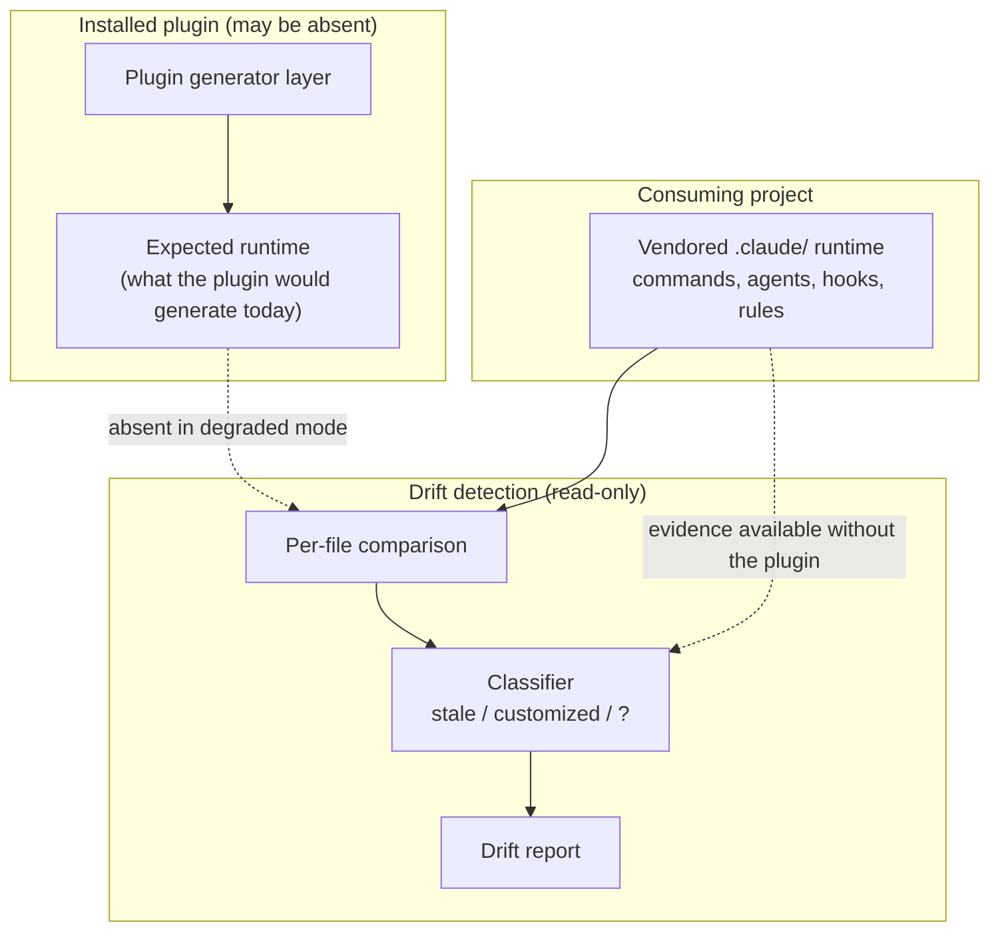

# PRD: Runtime Drift Detection

**Version**: 1.2.0
**Status**: Draft
**Created**: 2026-08-15
**Last Updated**: 2026-08-15
**Author**: @product-manager
**Stakeholders**: Ensemble vNext maintainer (source author); developers on projects scaffolded from the Ensemble plugin

---

## Changelog

| Version | Date | Changes | Author |
|---------|------|---------|--------|
| 1.0.0 | 2026-08-15 | Initial PRD creation from `docs/modernization/runs/ab-test/spec.md` | @product-manager |
| 1.2.0 | 2026-08-15 | `/audit-prd`. Four findings applied, all against `.claude/commands/rebase-project.md`, which 1.1.0 cited three times but never read for capability: `--dry-run` already ships F1's read-only per-file drift report (§1.1, §1.2 coverage table, F1 "Already built"); a presence-based stale-vs-customized classifier already ships, so F2 is not a clean slate (F2 "Not a clean slate"); R6 widened from one hook to a systemic no-deliberateness-check defect affecting `/rebase-project`'s default path too, likelihood Medium→High; §8 multi-runtime citation corrected from `docs/TRD/runtime-refresh.md` (no such content) to `docs/modernization/2026-08-improvement-plan.md` L1069–L1072. Could Not Verify rewritten to carry post-audit state | @audit-prd |
| 1.1.0 | 2026-08-15 | `/refine-prd --auto`. Phase 0: OQ-4, OQ-5, OQ-7 answered from code and folded in; OQ-9 resolved as a stated default; OQ-1 given a default with the vehicle left to the owner; OQ-2, OQ-3, OQ-6, OQ-8 held open as owner-only. Phase 1: NG3 narrowed to what the source excludes; AC-F2.4 relabelled domain-derived; R4 downgraded and R5 rewritten against code; R6 added from a code finding; §1.1 corrected against `.claude/hooks/runtime-refresh.sh`; Could Not Verify rewritten | @product-manager |

---

## 1. Product Summary

### 1.1 Problem Statement

A project scaffolded from the Ensemble plugin carries a vendored `.claude/` runtime —
commands, agents, hooks, rules. Over time that copy diverges from what the plugin would
generate today. The source names two causes of divergence that require **opposite**
responses:

- **Stale** — the plugin moved on and the project didn't. The project should refresh.
- **Customized** — someone edited the vendored copy deliberately, for that project.
  Refreshing over it destroys real work.

Today nothing tells you which you have. Per the source: `generate-hooks-artifacts.sh
--check` compares only the plugin's own template against the manifest; it never looks at a
consuming project's `.claude/`. Two consequences follow, both stated in the source:

1. A project can sit on a two-release-old runtime indefinitely with no signal.
2. A refresh can silently overwrite a deliberate local change.

**Correction from code (added 1.1.0).** The source's two consequences do not have equal
standing once the shipped runtime is read, and the difference changes what this feature is
for:

- Consequence 2 is **confirmed, and it is automated**. `.claude/hooks/runtime-refresh.sh`
  is a registered, shippable `SessionStart` hook (`packages/core/hooks/hooks.manifest.json`,
  `SessionStart / runtime-refresh.sh / command / shippable:true`). When the installed
  plugin's version exceeds the project's vendored `ensemble.version` and its four guards
  pass, it runs `scaffold-project.sh --refresh`, which replaces every component already
  present under `.claude/` by unconditional `cp`
  (`packages/core/scripts/scaffold-project.sh`, e.g. the agent loop at ~L164 and the
  contract/workflow/hook loops that follow). **No step in that path inspects the vendored
  file for local modification** — grepped for `customiz`/`diff`/`checksum`/`sha` across
  both files; nothing. So the overwrite the source fears is not a hypothetical operator
  error, it is the default behavior of a hook that runs on session start.
- Consequence 1 is **narrower than stated**. Because that same hook auto-refreshes, a
  project only sits stale when one of its guards trips: no installed plugin, the project is
  the plugin's own source checkout, `.trd-state/*/implement.json` has an `in_progress`
  task, or the version comparison is equal/older/unparseable (including a runtime with no
  `ensemble.version` stamp at all — the pre-stamp legacy case, which is F4's population).

- The source's *"nothing tells you which you have"* is **too strong**, and this changes what
  F1 is. `/rebase-project --dry-run` already ships a read-only, per-file drift report across
  every component kind — agents, skills, commands, hooks, settings, rules
  (`.claude/commands/rebase-project.md`: Flag Behavior Summary L949 gives `--dry-run` →
  "Report only" for all six columns; Step 1.5 L163–165 "Continue to generate full diff
  report / Do NOT apply any changes"; Step 2.1 L180–195 categorizes agents by "byte-level
  diff of the full file"). What it does *not* do is the second question: its `Custom`
  category is **presence-based**, not content-based (see F2). So requirement 1 is
  substantially already built; requirement 2 is the genuinely new work.

This does not weaken the request; it sharpens it. The population that needs drift detection
most is exactly the population the auto-refresh cannot help — and for everyone else, the
refresh is the thing destroying customizations. See R6.

### 1.2 Proposed Solution

An on-demand, read-only capability that answers one question about a scaffolded project:
**"what has drifted, and which kind is it?"**

It enumerates the vendored runtime file by file, compares each file against what the
currently installed plugin would generate, and attaches a verdict to every file that
differs. It changes nothing. It produces a usable answer when no plugin is installed, and
on runtimes scaffolded before this feature existed.

**Existing baseline — do not build F1 from scratch (added 1.2.0).** `/rebase-project
--dry-run` already performs the enumeration-and-compare half of this, read-only. Its Step 2
diff walks each component category, compares vendored against plugin by full-file content
diff, and emits per-category `add / update / unchanged / stale-removed / custom` counts; its
`--dry-run` branch skips the apply step entirely (L451: "skip Step 4"). Any TRD built from
this PRD must start by evaluating whether F1 is a *reuse or extraction* of that existing
report path rather than a new implementation. What is genuinely missing from it, and what
this feature is actually for:

| Requirement | Covered by `--dry-run` today? |
|---|---|
| F1 per-file differs / does-not-differ | **Substantially yes** — content diff per component kind |
| F1 report names non-byte-comparable kinds (AC-F1.4) | No — `settings.json` is merged and skills recomputed, but the report does not flag them as not-comparable |
| F2 stale vs. customized verdict | **No** — its `Custom` label is presence-only (see F2) |
| F3 useful answer with no plugin installed | No — Step 0 aborts when the installation is absent |
| NFR-1 changes nothing | Yes, under `--dry-run` (not under the default) |

**The classification mechanism is deliberately not specified here.** The source states
plainly: *"How to tell them apart is the hard part and I don't have an answer — that's
what I want designed."* That design belongs to the TRD. This PRD fixes what the answer
must contain and how it must behave, not how it is derived.

### 1.3 Value Proposition

- A maintainer can tell, per file, whether a project is behind or has been intentionally
  changed — the precondition for deciding whether to refresh at all.
- The two silent failures named in the source (indefinite staleness with no signal;
  refresh destroying a deliberate edit) become visible before either has consequences.
- Reporting-only means the capability is safe to run on any project at any time, which is
  what makes it usable as a routine question rather than a risky operation.

### 1.4 Key Differentiators

Distinguishing *stale* from *customized* is the differentiator and the hard part. A plain
diff answers "does this file differ" — which is requirement 1 alone. The source explicitly
asks for the second question on top of it, and explicitly does not know the answer.

### 1.5 Solution Architecture

The dashed edges carry requirement 4: when no plugin is installed, the "expected runtime"
input is unavailable and the capability must still produce a useful answer from what
remains.

---

## 2. User Analysis

### 2.1 Target Users

| User Type | Description | Primary Need |
|-----------|-------------|--------------|
| Project maintainer | Owns a project scaffolded from the Ensemble plugin, including projects scaffolded before this feature existed | Know whether their vendored runtime is behind, and whether refreshing would destroy local work |
| Framework maintainer | Owns the Ensemble plugin; the source author | Know the drift state of consuming projects before shipping or recommending a refresh |

### 2.2 User Personas

**Persona: Project maintainer**
- **Role**: Developer working in a project whose `.claude/` runtime was vendored at scaffold time
- **Goals**: Ask a project what has drifted and get an answer they can act on themselves —
  the source is explicit that acting is their decision: *"I'll decide what to do with the report."*
- **Pain Points** (all stated in the source): nothing tells them which kind of drift they
  have; the project can sit on a two-release-old runtime indefinitely with no signal; a
  refresh can silently overwrite a deliberate local change
- **Technical Proficiency**: High — they edited the vendored runtime on purpose

**Persona: Framework maintainer**
- **Role**: Owner of the Ensemble plugin and its generator layer
- **Goals**: Establish drift state across projects without cooperation from how those
  projects were originally scaffolded
- **Pain Points**: the existing `--check` path compares the plugin against its own
  manifest and never looks at a consuming project's `.claude/`
- **Technical Proficiency**: High

### 2.3 User Journey

Omitted. The flow is a single on-demand invocation producing a single report — a journey
diagram would restate the prose without adding information.

---

## 3. Goals and Non-Goals

### 3.1 Goals

| ID | Goal | Success Metric | Priority |
|----|------|----------------|----------|
| G1 | Report per-file whether the vendored copy differs from what the installed plugin would generate | Every file in the vendored runtime scope appears in the report with a differs / does-not-differ result; no file is silently omitted | P0 |
| G2 | Distinguish stale-and-should-refresh from deliberately-customized | Every differing file carries a verdict; where evidence is insufficient the verdict says so rather than guessing (see OQ-2) | P0 |
| G3 | Change nothing | A run leaves the working tree and git state byte-identical (see NFR-1) | P0 |
| G4 | Produce a useful answer with no plugin installed | A run with no plugin present exits with a report that states which questions it could and could not answer, rather than failing (see OQ-3) | P0 |
| G5 | Work on a runtime scaffolded before this feature existed | A project whose `.claude/` predates this feature produces a report under the same rules, with no scaffold-time cooperation required | P0 |

### 3.2 Non-Goals (Explicit Scope Exclusions)

| ID | Non-Goal | Rationale |
|----|----------|-----------|
| NG1 | Automatically fixing, refreshing, reverting, or merging drift | Source, "Not doing": *"Automatically fixing drift. I'll decide what to do with the report."* |
| NG2 | Any change to how the runtime is version-controlled | Source, "Not doing". Also collides with the constitution's Architecture Invariant that the vendored runtime is committed to git — changing that requires user approval under Approval Requirements |
| NG3 | Performing or initiating a fix from within the report — no interactive "apply?" affordance, no invocation of a refresh path | **Narrowed in 1.1.0.** The source excludes *doing* the fix (*"I'll decide what to do with the report"*); it does not exclude the report mentioning that a fix exists. The earlier form also forbade suggesting or naming a remediation, which traces to nothing in the source and would have barred an ordinary sentence like "this file is stale relative to plugin 4.1.15" |
| NG4 | Running automatically — on `SessionStart`, on a schedule, or as a side effect of any other command | **Provisional, contingent on OQ-6 — not a source exclusion.** The source asks for *"a way to ask a project"*; absence of a request for ambient reporting is not a prohibition. Held as a scope guard because `SessionStart` is already occupied by `runtime-refresh.sh` (manifest, `SessionStart / runtime-refresh.sh / shippable:true`), so adding ambient drift reporting there is a change to an existing shipped mechanism rather than a new slot. If the author wants a passive signal (OQ-6), this non-goal is the thing to drop |
| NG5 | Detecting drift outside the vendored `.claude/` runtime (application source, project config, docs) | Source scope is the vendored runtime: *"commands, agents, hooks, rules"* |
| NG6 | Deciding which of the two drift kinds is "correct" or ranking projects by health | Source asks what drifted and which kind; not for a judgment about it |

---

## 4. Feature Requirements

### 4.1 P0 - Core Features (Must Have)

#### F1: Per-file drift report

**Priority**: P0
**Source**: Requirement 1 — *"It MUST report, per file, whether the vendored copy differs
from what the currently installed plugin would generate."*

**Description**: Enumerate the vendored `.claude/` runtime and report, for each file,
whether it differs from what the currently installed plugin would generate today.

**User Stories**:
- As a project maintainer, I want a per-file list of what differs so that I can see the
  scope of drift without diffing the runtime by hand.

**Acceptance Criteria**:
- [ ] AC-F1.1: The report has one entry per file in the vendored runtime scope; no file in
  scope is omitted from the report.
- [ ] AC-F1.2: Each entry states whether that file differs from what the currently
  installed plugin would generate.
- [ ] AC-F1.3: A file that exists on only one side (vendored-only, or plugin-would-generate
  but absent from the vendored copy) still receives an entry and a stated verdict rather
  than being skipped. *(Domain-derived from AC-F1.1: "per file" is unsatisfiable if
  one-sided files have no row. OQ-4 resolved — see below.)*
- [ ] AC-F1.4: The report states which runtime component kinds it covered, and names the
  three kinds that are **not byte-comparable** (below) as such rather than reporting them
  clean. *(OQ-5 resolved — see below.)*

**Resolved: what "what the plugin would generate today" means, per component kind (OQ-5).**
Read from `packages/core/scripts/scaffold-project.sh`. Scaffolding is a **file copy**, not a
per-project generation, for every kind below — so the expected content of a vendored file is
literally the corresponding file in the installed plugin directory:

| Vendored path | Plugin source | Byte-comparable? |
|---|---|---|
| `.claude/agents/*.md` | `$PLUGIN_DIR/agents/` (`cp`) | Yes |
| `.claude/commands/*.md` | `$PLUGIN_DIR/commands/` (`cp`) | Yes |
| `.claude/contracts/*.md` | `$PLUGIN_DIR/contracts/` (`cp`) | Yes |
| `.claude/workflows/*.js` | `$PLUGIN_DIR/workflows/` (`cp`) | Yes |
| `.claude/hooks/*`, `hooks/prompts/*`, `hooks/lib/*` | manifest-declared `shippable` set (`cp -L`) | Yes |
| `.claude/rules/async-discipline.md`, `autonomy.md`, `command-status.md` | `templates/claude-directory/rules/` — the only three framework-shipped rules (`ls` of that directory) | Yes |
| `.claude/rules/constitution.md`, `stack.md`, `process.md` | **Project-authored** at `/init-project` time; `refresh_rules()` deliberately touches only files present in the framework rules template dir | **No** — divergence here is not drift |
| `.claude/settings.json` | Template plus a **merge** (`stamp_ensemble_version()` merges into the `ensemble` key; permissions, env and hook registrations are user-owned and never touched) | **No** — whole-file comparison would report every project as drifted |
| `.claude/skills/` | Curated per project from the skill library; affinity map re-derived from the selection | **No** — the vendored set is intentionally a subset |

This resolves R4's tension as well: for the byte-comparable kinds no generator has to run at
all. `generate-hooks-artifacts.sh` is a **build-time** generator over the monorepo checkout
(its own header, L14–L25) and is not part of the scaffold path.

**Resolved: one-sided files (OQ-4).** The scaffold semantics give both cases a factual
reading, though naming the verdict stays a TRD decision. `--refresh` "replace[s] only
components already present under the target's `.claude/` … Never" adds or removes
(`scaffold-project.sh` L16–L18); adding is `/rebase-project`'s job. Therefore
*plugin-only* (exists in the plugin, absent from the project) means the component was never
vendored — a project scaffolded before that component existed will **never** acquire it by
refresh, only by rebase. *Vendored-only* means either a local addition or a component the
plugin has since deleted, and those two are not distinguishable from the plugin side alone.
Neither case maps onto stale-vs-customized, which is why AC-F1.3 requires an entry with a
stated verdict rather than forcing one of the two labels.

**Already built — evaluate before implementing (added 1.2.0).** `/rebase-project --dry-run`
already emits a read-only per-file content diff across all six component kinds; see §1.2's
coverage table for exactly which of F1's criteria it does and does not meet. F1 as written
still stands as a requirement — AC-F1.3 (one-sided files get a stated verdict, not just a
`New`/`Custom` bucket) and AC-F1.4 (naming the non-comparable kinds) are not met by it, and
it aborts with no plugin installed (F3) — but F1 is now an **extension or extraction of an
existing report path, not greenfield**. A TRD that re-implements per-file comparison from
scratch without first reading `rebase-project.md` Step 2 is duplicating shipped work.

**Dependencies**: None outstanding. R4 is downgraded on the evidence above.

---

#### F2: Drift classification — stale vs. customized

**Priority**: P0
**Source**: Requirement 2 — *"It MUST distinguish stale-and-should-refresh from
deliberately-customized. How to tell them apart is the hard part and I don't have an answer
— that's what I want designed."*

**Description**: Every file reported as differing carries a verdict identifying which kind
of drift it is. **The mechanism for reaching that verdict is explicitly delegated to
design (the TRD); this PRD constrains only the answer's shape and honesty** — but the
design space is not empty, and the existing answer below is the baseline any proposal must
beat.

**Not a clean slate — an incumbent classifier already ships (added 1.2.0).** The source
says the author has no answer; the codebase has a crude one, in production.
`/rebase-project` classifies every runtime file today (`rebase-project.md` L17, restated
L40–41 and in the per-category tables at L180–195, L532, L561):

| Condition | `/rebase-project`'s verdict | Action |
|---|---|---|
| In both, content differs | **stale** (implicitly) | REPLACED, backup taken |
| In vendored, absent from plugin | **`Custom`** — "preserved as a user customization" | Preserved, reported only |
| In both, content identical | unchanged | none |

**The defect is precise and worth stating, because it is exactly the gap F2 must close:
this classifier keys on _presence_, not _content_.** A file the plugin ships and the user
then edited deliberately is, to `/rebase-project`, indistinguishable from a file that is
merely stale — both are "in both, content differs", both get replaced. Its `Custom` label
only ever catches files the plugin never shipped at all, which is the easy case and not
the case requirement 2 is about. So the honest framing is not *"no answer exists"* but
*"the shipped answer is presence-based and therefore misses the entire hard case."*

A TRD must (a) cite this incumbent, (b) state whether F2 replaces it, feeds it, or runs
beside it, and (c) justify any proposed mechanism as better than presence-only.

**User Stories**:
- As a project maintainer, I want each differing file labelled stale or customized so that
  I know whether refreshing that file recovers an update or destroys my work.

**Acceptance Criteria**:
- [ ] AC-F2.1: Every file reported as differing carries a drift-kind verdict.
- [ ] AC-F2.2: The verdict vocabulary includes an explicit not-determined outcome, and a
  file whose evidence does not support a confident verdict receives it rather than being
  forced into stale or customized. *(Source: requirement 2 states the author has no answer
  for the hard case; a binary-only vocabulary would require the implementation to invent
  one. See OQ-2.)*
- [ ] AC-F2.3: Each verdict is accompanied by the evidence it was based on, so a reader can
  disagree with a verdict without re-deriving it. *(Source: requirement 2's difficulty is
  stated by the author; R1 is the failure this criterion mitigates.)*
- [ ] AC-F2.4: The report does not claim a confidence level or probability it cannot
  substantiate. *(**Domain-derived**, not sourced — the source neither asks for nor forbids
  a score. It follows from requirement 2's own statement that the author has no answer: a
  number attached to an unsolved classification is uncalibrated by construction. See OQ-2
  and the rejected alternative in §8.)*

**Evidence already available to a classifier (added 1.1.0).** Recorded because it bears on
whether AC-F2.2's not-determined verdict is the common case or the rare one; the mechanism
remains a TRD deliverable.

- `.claude/settings.json` carries `ensemble.version` and `refreshed_at`, stamped on initial
  scaffold and on every successful `--refresh` (`stamp_ensemble_version()`,
  `scaffold-project.sh`); `/rebase-project` additionally writes `rebased_at` and
  `previous_version`. This repo's own vendored copy reads `"version": "4.1.15"`. That is a
  real, already-shipped provenance record — it dates the vendored copy without requiring
  anything new. It is absent on runtimes scaffolded before stamping existed (F4).
- The plugin's shipped files are byte-comparable per the F1 table, so "differs" is exact for
  those kinds.
- Git history of `.claude/` remains a candidate signal — see the Belief, not fact note.

**Dependencies**: F1. Interacts with F4 — legacy runtimes have the least evidence (R2).

---

#### F3: Useful answer with no plugin installed

**Priority**: P0
**Source**: Requirement 4 — *"It MUST still produce a useful answer when no plugin is
installed at all."*

**Description**: When no Ensemble plugin is installed, the capability still runs and still
produces a report. What "useful" means in this mode is not defined by the source — see
OQ-3 for the assumption taken.

**User Stories**:
- As a project maintainer on a machine with no plugin installed, I want the drift question
  to still return something usable rather than an error.

**Acceptance Criteria**:
- [ ] AC-F3.1: A run in a project with no installed plugin completes and emits a report
  rather than failing or emitting nothing.
- [ ] AC-F3.2: The report states unambiguously that no plugin was available, and therefore
  which of F1/F2's questions were not answered by comparison.
- [ ] AC-F3.3: No entry in a no-plugin report asserts a comparison against the plugin that
  did not happen. *(Guards R3.)*

**What remains readable with no plugin (added 1.1.0, partial input to OQ-3).** The degraded
mode is not empty: the vendored tree itself, its git history, and
`.claude/settings.json`'s `ensemble.version` / `refreshed_at` / `rebased_at` /
`previous_version` are all local and readable with no plugin present. What is unavailable is
the other side of every comparison. **This does not define "useful" — OQ-3 stays open;** it
only records what a definition would have to work with.

**Dependencies**: None beyond F1's report format.

---

#### F4: Works on pre-existing vendored runtimes

**Priority**: P0
**Source**: Requirement 5 — *"It MUST work on a project whose runtime was scaffolded before
this feature existed — no cooperation from the past."*

**Description**: The capability must not depend on any marker, manifest, checksum, or
provenance record that only a future scaffolder would have written. It must work from
evidence available in a project as it stands today.

**User Stories**:
- As a framework maintainer, I want to run drift detection on projects scaffolded months
  ago so that the feature is useful on the projects that are actually stale.

**Acceptance Criteria**:
- [ ] AC-F4.1: A project whose `.claude/` was scaffolded before this feature existed
  produces a report under the same rules as any other project.
- [ ] AC-F4.2: No requirement of F1–F3 is satisfied only when a scaffold-time artifact
  introduced by this feature is present.
- [ ] AC-F4.3: Where a provenance artifact would improve classification, its absence
  degrades the verdict (per AC-F2.2) rather than failing the run. *(OQ-7 resolved — see
  below.)*

**Resolved: provenance artifacts (OQ-7).** The question was whether this feature may
introduce a provenance record for future scaffolds. It is partly moot and the pattern is
already established in code: `ensemble.version` and `refreshed_at` are stamped into
`.claude/settings.json` on scaffold and on every `--refresh`
(`stamp_ensemble_version()`, `scaffold-project.sh`), and `/rebase-project` adds `rebased_at`
and `previous_version`. So a provenance record that improves-when-present and is
absent-on-older-projects already exists and is already relied on — `runtime-refresh.sh`'s
guard 4 reads exactly this field and exits silently when it is missing or unparseable.
Introducing further such artifacts is consistent with requirement 5 **provided AC-F4.2
holds**: no F1–F3 requirement may be satisfied only when the artifact is present. The
pre-stamp population is precisely F4's, and it is the population R2 is about.

**Dependencies**: F2 — this is where AC-F2.2's not-determined verdict is most likely to be
exercised (R2).

### 4.2 P1 - Enhanced Features (Should Have)

None. All five requirements in the source are stated as MUST; nothing in the source is
positioned as a should-have, and nothing has been added.

### 4.3 P2 - Future Features (Nice to Have)

None.

---

## 5. Non-Functional Requirements

| ID | Requirement | Source |
|----|-------------|--------|
| NFR-1 | The capability must not change anything. Reporting only — no writes to the vendored runtime, no writes to project state, no git mutation | Source requirement 3, verbatim: *"It MUST NOT change anything. Reporting only."* |
| NFR-2 | Deterministic components (shell scripts, `lib/`, generator paths) are unit-tested; shell components use BATS, JavaScript components use Jest | `.claude/rules/constitution.md` Principle 4 as amended ("command-type hooks, `lib/`, and the generator … remain deterministic and unit-tested"); `.claude/rules/stack.md` test framework table |
| NFR-3 | Unit test coverage ≥ 60%; integration coverage ≥ 50% where integration tests apply | `.claude/rules/constitution.md` Quality Gates. **Not a figure invented here** — it is the project's standing gate |
| NFR-4 | If delivered as a workflow command, it emits the standard `[STATUS: …]` and terminal `═══ COMMAND COMPLETE ═══` / `═══ COMMAND STUCK ═══` banners | `.claude/rules/command-status.md`; constitution Prohibited Pattern 7 ("No silent completion"). Conditional on the delivery vehicle — see OQ-1 |
| NFR-5 | If any part is delivered as a hook, it must not block | `.claude/rules/constitution.md` Prohibited Pattern 4 ("No blocking hooks"). Conditional — NG4 makes hook delivery unlikely; the row exists so the constraint is not lost if design goes that way |

No latency, runtime-duration, throughput, or availability requirement appears here. None
was stated in the source and none was measured. See OQ-8.

---

## 6. Acceptance Criteria Summary

### Feature Acceptance Criteria

| ID | Feature | Criterion | Verification Method |
|----|---------|-----------|---------------------|
| AC-F1.1 | F1 | One entry per in-scope vendored file; none omitted | Unit test against a fixture runtime |
| AC-F1.2 | F1 | Each entry states differs / does-not-differ vs. plugin-generated | Unit test against a fixture runtime |
| AC-F1.3 | F1 | One-sided files (vendored-only, plugin-only) receive an entry and a verdict | Unit test with a fixture containing both one-sided cases |
| AC-F1.4 | F1 | Report states which component kinds were covered, and names the three not-byte-comparable kinds as such | Unit test on report output, with a fixture containing `settings.json`, a project-authored rule, and a curated skills dir |
| AC-F2.1 | F2 | Every differing file carries a drift-kind verdict | Unit test against a fixture runtime |
| AC-F2.2 | F2 | Not-determined is an available verdict and is used when evidence is insufficient | Unit test with a deliberately ambiguous fixture |
| AC-F2.3 | F2 | Each verdict is accompanied by its supporting evidence | Unit test on report output |
| AC-F2.4 | F2 | No unsubstantiated confidence score is emitted | Unit test on report output |
| AC-F3.1 | F3 | No-plugin run completes and emits a report | Integration test with plugin absent |
| AC-F3.2 | F3 | Report states no plugin was available and which questions went unanswered | Integration test with plugin absent |
| AC-F3.3 | F3 | No entry asserts a comparison that did not happen | Integration test with plugin absent |
| AC-F4.1 | F4 | Legacy-scaffolded project produces a report under the same rules | Integration test against a fixture runtime with no post-feature artifacts |
| AC-F4.2 | F4 | No F1–F3 requirement depends on a new scaffold-time artifact | Integration test against a fixture runtime with no post-feature artifacts |
| AC-F4.3 | F4 | Absence of a new provenance artifact degrades the verdict, not the run | Integration test against a fixture runtime with no post-feature artifacts |

### Non-Functional Acceptance Criteria

| ID | Requirement | Criterion | Verification Method |
|----|-------------|-----------|---------------------|
| AC-N1 | NFR-1 | A full run leaves the working tree and git state byte-identical | Integration test: hash the tree and capture `git status` before and after; assert both unchanged |
| AC-N2 | NFR-2 | Deterministic components have unit tests in the project's frameworks | Test-suite presence check (BATS / Jest) |
| AC-N3 | NFR-3 | Unit ≥ 60%, integration ≥ 50% where applicable | Coverage report |
| AC-N4 | NFR-4 | Status banners emitted, terminal banner is the last line | Manual / session-log review (per constitution Testing Philosophy 2) |
| AC-N5 | NFR-5 | No hook component blocks | Unit test on hook return value, if any hook component exists |

---

## 7. Risk Assessment

| ID | Risk | Likelihood | Impact | Mitigation Strategy |
|----|------|------------|--------|---------------------|
| R1 | Misclassification in either direction. A wrong *customized* verdict hides staleness indefinitely; a wrong *stale* verdict invites a refresh that destroys real work — the exact failure the source says is happening today | High | High | AC-F2.2 (not-determined is a first-class verdict) and AC-F2.3 (evidence shown with every verdict), so a wrong verdict is contestable by the reader rather than authoritative |
| R2 | Legacy projects (F4) carry the least classification evidence, and are exactly the projects most likely to be stale — the feature is weakest where it is most needed | High | Medium | Degrade to not-determined per AC-F2.2 rather than guessing; make the evidence gap visible in the report (AC-F2.3) |
| R3 | A no-plugin report (F3) reads as authoritative while no comparison ever happened, and a reader concludes "no drift" | Medium | High | AC-F3.2 and AC-F3.3 require the report to state the mode and refuse to assert uncompared results |
| R4 | Resolving "what the plugin would generate today" may require running the plugin's generator, and a generator's normal job is to write files — putting F1 in direct tension with NFR-1 | **Low** (was Medium; downgraded 1.1.0) | High | Largely dissolved by evidence: scaffolding is `cp` from the plugin directory for every byte-comparable kind (F1 table), so the expected content is a file to read, not output to produce. `generate-hooks-artifacts.sh` is build-time over the monorepo (its header, L14–L25), not scaffold-time. AC-N1 still tests the invariant empirically |
| R5 | Three component kinds are **not** byte-comparable — `settings.json` (merged, user-owned keys), the project-authored rules (`constitution.md`, `stack.md`, `process.md`), and the curated `skills/` set. A comparison that treats them like the rest reports every project as massively drifted, and a comparison that drops them silently under-covers | **High** (was Medium; the mechanism is now known, not hypothesised) | High | AC-F1.4 requires the report to name these three as not-comparable rather than reporting them clean or omitting them |
| R6 | **No write path in the framework checks whether a content diff was deliberate — this is systemic, not one hook's bug (widened 1.2.0).** Two independent paths overwrite on content-differs-from-plugin with no customization check: (a) `runtime-refresh.sh` auto-refreshes on `SessionStart`, calling `scaffold-project.sh --refresh`, which `cp`s over every component already present **and takes no backup** (grepped: no `backup` in either file); (b) `/rebase-project`'s **default, no-flag** behavior replaces every differing file (`rebase-project.md` L17, L948) — user-invoked, and the tool a maintainer would most likely reach for to answer this very question. Its `Custom` preservation is presence-only, so it does not catch an edited plugin-shipped file either (see F2). A customization can therefore be destroyed before its owner ever runs drift detection, by an automatic hook *or* by the drift tool itself | **High** (was Medium; two paths, one of them user-invoked) | High | Out of scope to fix (NG1), but in scope to surface: the report should make a destroyed-customization case recoverable by showing evidence (AC-F2.3). **Mitigations differ sharply between the two paths and this is the finding to give the author**: `/rebase-project` always writes a timestamped backup and offers `--preserve-all`; the `SessionStart` path has neither. This raises the urgency of F2's classifier — it is the missing check both paths need |

### Contingency Plans

**R1 Contingency**: If classification proves unreliable in practice, fall back to shipping
F1 (per-file difference) plus raw evidence with no verdict at all — a report that says
"these 12 files differ, here is what is known about each" still closes the "no signal"
half of the problem, and does not create the false-confidence failure. This is a reduction
in value, not a violation: requirement 2 would be unmet and must be reopened with the
author rather than papered over.

**R3 Contingency**: If a no-plugin report cannot be made honestly useful, state that as a
finding and return to requirement 4 for a definition of "useful" (OQ-3) rather than
shipping a report that implies comparison.

**R4 Contingency**: If no read-only path to the expected runtime exists, the tension
between requirement 1 and requirement 3 is a genuine conflict in the source and must go
back to the author. NFR-1 is verbatim and is not the side to bend.

---

## 8. Decisions and Rejected Alternatives

| Proposal / Challenge | Verdict | Rationale | Revisit when |
|----------------------|---------|-----------|--------------|
| Have the capability fix drift it detects (refresh stale files, leave customized ones) | Rejected | Source, "Not doing": *"Automatically fixing drift. I'll decide what to do with the report."* | The author asks for it — plausibly after classification has a track record (see R1 contingency). Not before |
| Change how the vendored runtime is version-controlled to make drift easier to detect (e.g. a separate branch, a lockfile-style manifest, untracking `.claude/`) | Rejected | Source, "Not doing". Independently blocked by the constitution's Architecture Invariant that the runtime is committed to git, which requires user approval to change | Only via an explicit constitution amendment with user approval. Not resolvable inside this feature |
| Require a scaffold-time provenance record (checksum manifest written at vendor time) as the classification mechanism | Rejected as the *primary* mechanism | Requirement 5 forbids depending on cooperation from the past; a mechanism that only works for future projects fails on exactly the stale projects that motivated the request | Available as a *supplementary* signal that improves confidence when present, provided AC-F4.3 holds. See OQ-7 |
| Wire drift detection into `SessionStart` so it reports automatically | Rejected (NG4), provisionally | The source asks for a way to *ask*. Automatic invocation is unrequested scope, and `runtime-refresh.sh` already owns the SessionStart slot for a different purpose — **verified in code** this pass (manifest registration plus the hook itself), where 1.0.0 had it only from the corpus | The author asks for ambient reporting. Would need to be reconciled with the existing SessionStart design rather than added beside it |
| Add multi-runtime adapters (Codex, OpenCode, pi) so drift detection generalises beyond the vendored `.claude/` runtime | Rejected | Already rejected in the corpus — **citation corrected in 1.2.0**: the decision is in `docs/modernization/2026-08-improvement-plan.md` L1069–L1072 (*"You've chosen Claude Code… The vendored single runtime is the right call for a hook-heavy framework"*), **not** in `docs/TRD/runtime-refresh.md`, which 1.1.0 cited and which contains no such decision (grepped for Codex / OpenCode / multi-runtime / adapter: no hits). Not re-litigated here | The framework itself adopts a second runtime target |
| Emit a numeric confidence score per verdict | Rejected | Nothing in the source supports a calibration for such a number, and an uncalibrated score is read as calibrated. AC-F2.4 forbids it | A measured calibration exists — e.g. a labelled corpus of known-stale and known-customized files, in the style of the discipline-hook acceptance corpus |

### Confirmed grounding — do not re-litigate

- *"It MUST NOT change anything. Reporting only."*
- *"Automatically fixing drift. I'll decide what to do with the report."*
- *"Any change to how the runtime is version-controlled."* (listed under "Not doing")
- *"How to tell them apart is the hard part and I don't have an answer — that's what I want
  designed."* — the mechanism is a TRD deliverable, not a PRD gap.
- *"no cooperation from the past"* — requirement 5 is a hard constraint on any proposed
  classification mechanism.

---

## Open Questions

**Still open — these need the owner.** A confident answer here would read as settled and
stop anyone re-opening it, which is worse than the question.

| ID | Question | What I assumed | Why it matters | If I'm wrong |
|----|----------|----------------|----------------|--------------|
| OQ-2 | Requirement 2 asks for a binary distinction, but the author states they have no answer for the hard case. Is a third *not-determined* verdict acceptable, or must every differing file be forced into one of the two? | A not-determined verdict is required (AC-F2.2). Forcing a binary would make the implementation invent the answer the author says they don't have | This is the difference between an honest report and a confidently wrong one — R1 is the whole risk of the feature | If a strict binary is genuinely required, F2's acceptance criteria change materially and R1's likelihood rises |
| OQ-3 | What does "a useful answer" mean when no plugin is installed (requirement 4)? The source does not define it | The report still enumerates the runtime and states which questions could not be answered by comparison; it does not fabricate a comparison | Without a definition, "useful" could mean anything from a bare inventory to full classification from local evidence alone. §4.1 F3 now records what is *readable* in that mode, which bounds the answer without choosing it | F3's acceptance criteria are under- or over-specified; the degraded mode ships either too thin or with invented capability |
| OQ-6 | NG4 holds that invocation is on-demand only. Is that right, or does the author want a passive signal? Sharper now than in 1.0.0: `SessionStart` already runs `runtime-refresh.sh`, which *acts* silently rather than *reporting*, so "add a signal" means changing an existing shipped mechanism, not filling an empty slot | On-demand only. The request is phrased as wanting *a way to ask*, and NG4 is explicitly provisional on this answer | The problem statement's *"indefinitely with no signal"* could be read as asking for the signal to be pushed. A passive signal is also the only thing that would warn *before* an auto-refresh overwrites a customization (R6) | A real need for ambient notification goes unmet, and the half of the problem the auto-refresh cannot reach stays invisible |
| OQ-8 | Is there any runtime-duration or scale requirement? None is stated, and none was measured for this feature. The only measured budget in the corpus belongs to a different component — `runtime-refresh.sh`'s SessionStart short-circuit, cited in `docs/TRD/runtime-refresh.md §6` — and applies to this feature only if it is hook-delivered, which NG4 currently excludes | None. No performance requirement is recorded in §5 and no figure was invented | A scan of a whole vendored runtime has a cost; if it must be fast enough to run routinely, that is a real constraint that is currently unwritten | A real constraint surfaces late, after a design that cannot meet it |

### Resolved this pass (1.1.0)

| ID | Verdict | Resolution and evidence |
|----|---------|--------------------------|
| OQ-1 | **Default, vehicle still the owner's call** | No source statement. The repo convention for a read-only inspection of project state is a script with a human default and a `--json` flag — `dispatch-ledger.js` (`--open [--session <id>] [--json]`, L17/L109) — and the drift-check precedent is a script flag, `generate-hooks-artifacts.sh --check`. Recorded as the convention, **not** as a finding; NFR-4 stays conditional so the command-status contract binds if the owner picks a slash command instead |
| OQ-4 | **Answered** | `scaffold-project.sh` L16–L18: `--refresh` "replace[s] only components already present … Never" adds or removes; adding is `/rebase-project`'s. Folded into F1 — plugin-only means never-vendored-and-refresh-will-never-add-it; vendored-only is a local addition or a plugin deletion, not distinguishable from the plugin side. Naming the verdict remains a TRD decision |
| OQ-5 | **Answered** | `scaffold-project.sh` copy functions plus `ls packages/core/templates/claude-directory/rules/`. Six kinds are byte-comparable `cp` copies; three (`settings.json`, project-authored rules, curated skills) are not. Full table folded into F1; R5 rewritten against it |
| OQ-7 | **Answered** | `stamp_ensemble_version()` in `scaffold-project.sh` already writes `ensemble.version` / `refreshed_at` on scaffold and every refresh, and `runtime-refresh.sh` guard 4 already consumes it. The improve-when-present, absent-on-old-projects pattern is established, not new. Folded into F4/AC-F4.3 |
| OQ-9 | **Default — recorded, not required** | Nothing in the source asks for machine consumption, so it stays out of the requirements. The repo convention if one is wanted is a `--json` flag beside human output (`dispatch-ledger.js` L109). Stated so a TRD adding it is making a cheap, precedented choice rather than an unsourced requirement |

---

## Could Not Verify

Rewritten by the 1.2.0 audit. This section is the document's verification state: a reader
can see what has been checked, what was checked and found wrong, what nobody has checked,
and what cannot be checked — without running anything.

**Verified in 1.1.0 (by reading the files named):**

| Claim | Evidence |
|-------|----------|
| `generate-hooks-artifacts.sh --check` never inspects a consuming project's `.claude/` | Its four targets are all `$REPO_ROOT`-relative (L53–L67): the manifest, the template `settings.json`, `init-project.md` (core + vendored), `rebase-project.md` (core + vendored), plus `packages/full/commands/plugin-only/`. Its own header calls it a build-time generator over the monorepo checkout (L14–L25). The source's claim holds |
| "What the plugin would generate today" is computable for agents, commands, contracts, workflows, hooks and framework rules — not only hooks | `scaffold-project.sh` copy functions; all `cp`/`cp -L` from `$PLUGIN_DIR`. See the F1 table. R5 was rewritten as a result: the real risk is the three kinds that are *not* comparable, which 1.0.0 had not identified |
| Resolving the expected runtime needs no generator run (R4) | Follows from the above — the expected content of a byte-comparable vendored file is a file in the plugin directory |
| SessionStart refresh and the monotonic version gate are shipped behavior, not just corpus intent | `packages/core/hooks/hooks.manifest.json` registers `SessionStart / runtime-refresh.sh / command / shippable:true`; `.claude/hooks/runtime-refresh.sh` implements the four guards, guard 4 being `semver(plugin) > semver(vendored ensemble.version)` |
| `hooks.manifest.json` is the single declaration of the shippable hook set | `scaffold-project.sh`'s `manifest_shippable_hooks()` / `manifest_shippable_prompts()` drive hook copying from it, with an explicit comment forbidding a hardcoded list (~L629–L640) |
| A version stamp exists in vendored `settings.json` | `stamp_ensemble_version()`; this repo's `.claude/settings.json` reads `ensemble.version: "4.1.15"` |

**Verified by the 1.2.0 audit (2026-08-15) — no longer unverified:**

| Claim | Evidence |
|-------|----------|
| A read-only per-file drift report already ships | `.claude/commands/rebase-project.md`: `--dry-run` declared L6/L13, Step 1.5 L163–165 ("Do NOT apply any changes"), Step 3 branch L451 ("skip Step 4"), Flag Behavior Summary L949 ("Report only" across all six component columns). Folded into §1.1, §1.2 and F1 |
| That report compares by content, not timestamp | Step 2.1 L180–195: "Categorize via content comparison (byte-level diff of the full file)", with `New / Updated / Unchanged / Custom` categories. Same pattern restated for skills (L532) and hooks (L561) |
| A stale-vs-customized classifier already ships, and is presence-based | `rebase-project.md` L17 (restated L40–41): differs-from-plugin ⇒ replaced; absent-from-plugin ⇒ "preserved as a user customization". Folded into F2 as the incumbent to beat |
| `/rebase-project`'s **default** path overwrites content-differing files with no deliberateness check | L17 + Flag Behavior Summary L948 (default row: "Update on content-diff" for agents/skills, "Replace" for commands/hooks). `grep -i customiz` across the whole command spec returns only presence-based uses. Folded into R6 |
| The `--refresh` path takes no backup, unlike `/rebase-project` | `grep -i backup` across `.claude/hooks/runtime-refresh.sh` and `packages/core/scripts/scaffold-project.sh` returns nothing; `/rebase-project` backs up at L17. The asymmetry is now stated in R6's mitigation column |

**Checked and found FALSE — these became findings, not entries:**

| 1.1.0 claim | What checking it showed |
|-------------|--------------------------|
| Multi-runtime rejection is sourced to `docs/TRD/runtime-refresh.md` | **False citation.** `grep -iE 'codex\|opencode\|multi-runtime\|adapter'` over that file returns no hits. The decision is in `docs/modernization/2026-08-improvement-plan.md` L1069–L1072. §8 corrected |
| *"Today nothing tells you which you have"* (inherited from the source, restated in §1.1) | **Overstated.** `--dry-run` tells you *what* differs, per file, today. Only the *which-kind* half is genuinely missing. §1.1 corrected |
| F2's mechanism is an empty design space | **False.** A presence-based classifier is in production (above). §4.1 F2 now carries it as the incumbent baseline |

**Still unverified — NOT checked by this audit, and why:**

| Claim | Why out of scope for this pass | How to check it |
|-------|-------------------------------|-----------------|
| The F1 comparability table is complete — no seventh vendored component kind that neither `scaffold-project.sh` nor `/rebase-project` accounts for | Requires executing a live scaffold and diffing the result. This audit read source files only; it did not run the scaffolder or create a fixture project | Scaffold a throwaway project, diff its `.claude/` against the plugin directory, enumerate anything unaccounted for on either side |
| Git history of `.claude/` distinguishes customization from staleness | Requires a project with a *known* deliberate edit and a *known* stale file to test against — no such labelled corpus exists yet. This is the Belief-not-fact note below, and the 1.2.0 evidence makes it weaker, not stronger: `/rebase-project`'s default path now also produces local commits over plugin-shipped files | Build the labelled corpus first, then test whether history alone separates the two classes |
| Whether `/rebase-project`'s report path is *reusable* by this feature, or only *precedent* for it | Established that the capability exists (above); did **not** assess whether it is extractable — the command is a 42KB LLM prompt, not a library, so "reuse" may mean re-specification rather than a code path | A TRD-level read of whether Step 2's diff logic can be factored out of the command prompt into something invocable read-only |

**Unresolvable — no source supplied:**

| Claim | Status |
|-------|--------|
| OQ-2, OQ-3, OQ-6, OQ-8 | Owner-only questions. No document in the corpus answers them and no code can — they are requests for the author's intent, not facts about the system. They stay open by design, not by audit failure |

**Belief, not fact**: that git history of the vendored `.claude/` is a usable classification
signal (a locally-authored commit touching a runtime file suggests customization; an
untouched file suggests staleness). This is plausible and would satisfy requirement 5,
since the constitution's Architecture Invariant states the runtime is committed to git —
but I did not test it, and scaffold-time and refresh-time commits would both appear as
local commits. That caveat is now stronger than in 1.0.0, not weaker: `runtime-refresh.sh`
rewrites vendored files automatically on `SessionStart`, so the commit that follows is
authored locally by whoever happened to be in the session and looks exactly like a
deliberate edit. What would settle it: examine the commit history of `.claude/` in a project
known to have both a deliberate local edit and an un-refreshed stale file, and check
whether the two are distinguishable from history alone.
