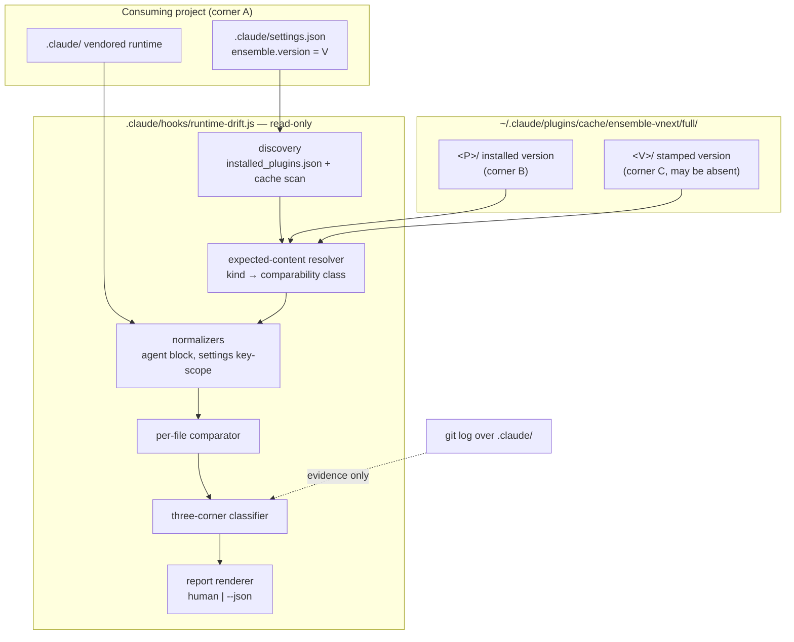

# TRD: Runtime Drift Detection

**Version**: 1.1.1
**Status**: Draft
**Created**: 2026-08-15
**Last Updated**: 2026-08-15
**Author**: @technical-architect
**Source PRD**: `docs/modernization/runs/profile/ensemble/PRD.md` (v1.2.0)
**Task ID Prefix**: DRIFT

---

## Changelog

| Version | Date | Changes | Author |
|---------|------|---------|--------|
| 1.1.1 | 2026-08-15 | `/audit-trd`. Verified against the PRD and this TRD's own ID graph; no code probe re-run. **One design defect fixed**: DRIFT-B007's AC required the coverage statement to name "the `key-scoped` row and all four `not-comparable` rows" — §3.1 has **three** not-comparable rows, and the miscount absorbed the `normalized` agents row, so a test built literally from that AC would have hunted a row that does not exist while never requiring the agents class to be named. **One omission closed**: §6.1 stated both halves of NFR-3/AC-N3 and then resolved only the ≥60% unit half; the ≥50% integration floor now has a named mechanism (`NODE_V8_COVERAGE` + `c8` over the BATS-spawned node process, `kcov` ruled out with reasons) and an explicit `INTEGRATION COVERAGE UNMEASURED` fallback, wired into DRIFT-T002's AC. **Four acceptance criteria given real anchors** where citations had been asserted against sections that do not contain them: AC-F3.3 (now on DRIFT-B004 and DRIFT-T002, previously in prose only and traced to no task), AC-F4.1 (§3.3's error handling — the legacy path is *not* §3.4's no-plugin mode), AC-F4.2 and AC-F4.3 (D6's rationale and `Serves`, which is where they are actually discharged; §3.5 is about writes and says so now). **Provenance corrected**: AC-F2.4 is labelled domain-derived in the PRD and is now labelled so here; NFR-1's source line named. **Three `Serves` columns reconciled** with claims the body already made: DRIFT-P001 (+AC-N5, TR6), DRIFT-B002 (+R4), and TR1's mitigation now names DRIFT-B005 as TR2/TR3/TR5/TR6 already name theirs. Nothing deleted, no severity lowered, no requirement dropped. Could Not Verify rewritten to separate what the code pass verified from what the citation pass verified, with two new open items | @technical-architect |
| 1.1.0 | 2026-08-15 | `/refine-trd --auto`. **Phase 0**: Verdict column added to Open Questions. OQ-2 answered at TRD scope (PRD AC-F2.2 is binding; the owner-level question stays open in the PRD); OQ-10 split — mechanism answered in code, remedy owner-only; OQ-11 recorded as a default with the cache observation and no retention policy found; OQ-3, OQ-6, OQ-8, OQ-12 held **owner-only** and left open. **Phase 1**: seven of the eight grounding-stage findings confirmed against the code and applied, one partly refuted. Nothing removed — no unsourced objective was found, no severity exceeded a `constitution.md` floor, and no PRD requirement was omitted. Changed: **D6a** gained a refresh-path carve-out excluding `.claude/settings.json` (`refresh_project()` never calls `copy_template`, so the sound-inference argument does not reach it and D6a returned `customized` where the truth is `stale`); **D5** re-rooted on the scaffolder's `TEMPLATES_DIR` rather than `$PLUGIN/templates/`; **§3.1** made two-layout at every resolution point, `CLAUDE.md` split into its own row, contracts/workflows absence recorded; **§3.3** pseudocode gained the carve-out; **§2.2.2** gained the missing-directory degradation contract; **TR3**'s mitigation corrected — importing the injection markers has no mechanism, replaced by a build-time pin in a widened DRIFT-T003; **TR5** (contracts/workflows absent from the installed plugin — mass `vendored-only`) and **TR6** (P001's dangling-symlink delivery break) added; **DRIFT-P001** now lands the file with the manifest entry and asserts `test -e`; **DRIFT-T001**'s invocation `--roots`-scoped against 205 worktree test copies and its coverage floor tied to an explicit `--coverage` run since no `coverageThreshold` exists; **§1.3** corrected to the versions that actually resolve (jest 29.7.0, bats ^1.13.0). Refuted: the claim that the P001 breakage aborts every `SessionStart` refresh — the refresh branch's never-create guard means only scaffolds and `--force` runs were at risk | @technical-architect |
| 1.0.0 | 2026-08-15 | Initial TRD creation from PRD v1.2.0 | @technical-architect |

---

## 1. Overview

### 1.1 Technical Summary

A read-only Node.js inspector, vendored into the project as `.claude/hooks/runtime-drift.js`,
that enumerates the vendored `.claude/` runtime, resolves what the installed plugin would
generate for each file, and attaches a verdict and its evidence to every entry.

Two findings from reading the code shape the whole design, and both correct the PRD:

1. **A vendored agent file is not a copy of the plugin's agent file.** `inject_agent_skills()`
   (`packages/core/scripts/scaffold-project.sh:824–998`) rewrites every agent listed in
   `skill-affinity.json` after copying it — stripping and rewriting the `skills:` frontmatter
   key and appending a delimited `ENSEMBLE:SKILLS:BEGIN … END` body block derived from the
   project's `selected-skills.txt`. It runs on initial scaffold **and** on every `--refresh`
   (`scaffold-project.sh:1210–1211`). The PRD's F1 table marks agents byte-comparable; they
   are not. A naive comparator reports every agent in every scaffolded project as drifted —
   the exact R5 failure the PRD identified for three other kinds, on a fourth kind it missed.
   D3/D4 handle it by normalization.

2. **The plugin cache retains historical versions in version-named directories.** Observed on
   this machine: `~/.claude/plugins/cache/ensemble-vnext/full/` contains `3.3.10, 4.0.0,
   4.1.0, 4.1.5, 4.1.11, 4.1.12, 4.1.14`. Combined with `ensemble.version` — already stamped
   into every scaffolded `settings.json` since before this feature existed
   (`stamp_ensemble_version()`, `scaffold-project.sh:1012`) — this yields a **three-corner
   comparison** that answers the question the PRD's source says it has no answer for. See D6.

The three-corner classifier is the substance of this TRD. Everything else is plumbing around
it: an expected-content resolver that knows how each component kind is delivered, a
normalization layer for the two kinds that are transformed rather than copied, and a report
that says what it could not compare instead of reporting it clean.

### 1.2 Key Technical Decisions

| ID | Decision | Choice | Serves Objective | Rationale | Alternatives Considered |
|----|----------|--------|------------------|-----------|------------------------|
| D1 | Delivery vehicle | A vendored, non-event script `.claude/hooks/runtime-drift.js`, declared in `hooks.manifest.json` with `"event": null, "registration": "model-invoked", "shippable": true` — the existing `notify-complete.sh` slot. Invoked `node .claude/hooks/runtime-drift.js [--project DIR] [--plugin-dir DIR] [--json]` | AC-F3.1 | AC-F3.1 requires a run to complete **with no plugin installed**. `packages/core/scripts/` is never vendored — nothing under `scripts/` is copied by any path in `scaffold-project.sh`; `runtime-refresh.sh` reaches `scaffold-project.sh` at `$PLUGIN_INSTALL_PATH/scripts/`. A plugin-resident tool therefore does not exist to be run in the mode F3 is entirely about. The manifest's null-event slot is the only shipped mechanism that vendors an executable non-hook file | **(a) Plugin-only script under `packages/core/scripts/`** — rejected: fails AC-F3.1 by construction, per rationale. Revisit if a project-level "vendored scripts" delivery slot is ever added. **(b) `.claude/workflows/*.js`** — rejected: those are agent-orchestration modules exporting `meta`/phases, not CLIs, and `packages/full/workflows/` currently ships only 2 of the 4 that exist in `packages/core/workflows/`, so that path has an open delivery gap of its own. Revisit if workflows become a general executor slot. **(c) An LLM slash command in the shape of `/rebase-project --dry-run`** — rejected: NFR-2 requires deterministic unit tests, and a 1030-line prompt is neither deterministic nor unit-testable. Revisit never; this is what D2 exists to avoid |
| D2 | Implementation language | Node.js 18+, Jest tests, co-located `runtime-drift.test.js` | NFR-2 | `stack.md` lists Node 18+ for hook development and Jest ^29 for JS unit tests; `dispatch-ledger.js` is the direct precedent — a read-only inspector shipped in `.claude/hooks/` with a `--open [--json]` CLI mode. The work is JSON key-scoped diffing and frontmatter-aware text normalization, which bash does poorly | **Bash + embedded python3**, as `scaffold-project.sh` and `runtime-refresh.sh` do — rejected: BATS assertions over structured report output are markedly weaker than Jest's, and the normalization in D4/D5 is string/JSON manipulation. Revisit if Node stops being a required runtime dependency (it is currently listed as one in `stack.md`) |
| D3 | Comparison model | Four comparability classes per component kind: **byte**, **normalized**, **key-scoped**, **not-comparable**. The resolver owns the kind→class table; the comparator only consumes it | AC-F1.2, AC-F1.4 | The PRD's three-way "comparable / not-comparable" split does not survive contact with `inject_agent_skills()` (agents are transformed, not copied) or with `settings.json` (partly generator-owned, partly user-owned). Making comparability a property of the kind, resolved in one table, is what stops each of those becoming a special case scattered through the comparator | **A single byte comparison with an exclusion list** — rejected: it can only ever say "skip", which forces `settings.json` and agents out of the report entirely and under-covers exactly as R5 predicts. Revisit if the scaffolder ever becomes a pure copy for every kind |
| D4 | Agent comparison | **Normalized**: strip the `ENSEMBLE:SKILLS:BEGIN … END` body block and the `skills:` frontmatter key from **both** sides before comparing; report the stripped region as generated-and-not-compared | AC-F1.2, AC-F1.4 | The injection is deterministic and explicitly delimited by markers the injector itself writes (`scaffold-project.sh:851–852`), so it is removable without guessing. Stripping both sides compares the part the plugin actually authored | **(a) Re-run the injection to compute expected content** — rejected: needs the project's `selected-skills.txt` *and* the plugin's `skill-affinity.json`, so it is unavailable in the no-plugin mode (AC-F3.1), and re-running a writer to derive a read-only expectation re-opens the PRD's R4 tension. Revisit if the injection ever becomes non-deterministic. **(b) Declare agents not-comparable** — rejected: agents are the largest vendored kind; dropping them guts F1 |
| D5 | `settings.json` comparison | **Key-scoped**: compare only the generator-owned `hooks` key against the scaffolder's template `settings.json`'s `hooks` key. Declare `env`, `permissions`, `$schema` and `ensemble` project-owned and not-comparable, and name them as such. **The template is resolved through `TEMPLATES_DIR` (`<scaffold-project.sh>/../templates`), not `$PLUGIN/templates/` — the two coincide only through the `packages/full/templates -> ../core/templates` symlink** (`scaffold-project.sh:29–30`, `copy_template()` at `:121–138`); the resolver must try `$PLUGIN/templates/claude-directory/settings.json` then `$PLUGIN/../core/templates/claude-directory/settings.json`, and name which one it used in the evidence row. **`settings.json` is additionally excluded from D6a — see D6a's carve-out** | AC-F1.4 | `stamp_ensemble_version()` merges into `ensemble` and touches nothing else; the template's `hooks` block is generator-managed (`generate-hooks-artifacts.sh` rewrites it from the manifest). So exactly one key has a plugin-side expectation. Whole-file comparison reports every project as drifted — R5 | **Declare the whole file not-comparable**, as the PRD's table does — rejected: it discards the one key that genuinely can drift, and a stale `hooks` block is the highest-consequence drift in the runtime (4.1.12 shipped a stale hooks block that silently dropped three model-judged hooks; see `generate-hooks-artifacts.sh:60–68`). Revisit if the template's `hooks` key stops being generator-owned |
| D6 | Classification mechanism | **Three-corner comparison.** For each file: A = vendored content; B = expected content from the *installed* plugin version P; C = expected content from the *stamped* version V, read from `~/.claude/plugins/cache/<plugin>/full/<V>/` when that directory exists. `A==C && A!=B` → **stale**. `A!=C && A!=B` → **customized**. C unavailable → fall back to D6a, else **undetermined** | AC-F2.1, AC-F2.2, AC-F2.3, **AC-F4.2, AC-F4.3** | **AC-F4.2 and AC-F4.3 are discharged here, and nowhere else in §3** — corner C is the plugin manager's own cache plus a stamp that predates this feature, so no F1–F3 requirement is satisfied only when a new scaffold-time artifact is present (AC-F4.2, `PRD.md:411`), and when the corner is missing the verdict degrades to `undetermined` while the run completes (AC-F4.3, `PRD.md:413`). The checksum manifest §7.3 holds in reserve is the *supplementary* artifact AC-F4.3 contemplates; it is not part of this design. This is the mechanism the source asks to be designed. It beats the incumbent presence-only classifier (`rebase-project.md:180–195`) on precisely the case the incumbent misses — a plugin-shipped file the user edited — because it asks "is this file what version V shipped?" rather than "does the plugin ship this file at all". It needs **no cooperation from the past**: `ensemble.version` has been stamped since before this feature, and the cache is the plugin manager's own artifact | **(a) Presence-based (the incumbent)** — rejected as insufficient: by its own construction it cannot see an edited plugin-shipped file. **(b) Git history of `.claude/`** — rejected as a *determinant*, retained as evidence (D7): a `--refresh` the user then commits is authored locally and looks exactly like a deliberate edit; the PRD records this as "Belief, not fact" and it remains unproven. **(c) A scaffold-time checksum manifest** — rejected by requirement 5 as the primary mechanism; would work only on future projects. Revisit if the plugin cache stops retaining historical versions (TR1), which would make (c) the only remaining path |
| D6a | Fallback when the stamped version is not cached | If `A != B` and `V == P` (stamp equals installed plugin version), verdict is **customized** — **except for any path `refresh_project()` does not copy, which is excluded from D6a and falls through to `undetermined`. Today that exclusion set is exactly `.claude/settings.json`** | AC-F2.1, AC-F2.2 | Sound without C **only for the paths a refresh actually rewrites**: `stamp_ensemble_version()` runs **last** in `refresh_project()` (call at `scaffold-project.sh:1225`, deliberately ordered so a half-applied refresh does not look complete) and the script runs under `set -euo pipefail`, so a partial refresh leaves the *old* version stamped. A stamp equal to the installed version therefore means every copy step completed — and no refresh gap can account for a content difference in a copied file. **The carve-out is not a caution, it is a defect found in the code**: `refresh_project()`'s call list is `copy_commands, copy_workflows, copy_contracts, copy_agents, copy_hooks, copy_skills, inject_agent_skills, refresh_rules, stamp_ensemble_version` (`:1186–1226`) — it never calls `copy_template`, and `scaffold_project()`'s `copy_template "claude-directory/settings.json"` writes only when the file is absent or `--force` is set (`:126–134`, `:1301`). So `--refresh` advances `ensemble.version` while leaving the `hooks` block at whatever version originally scaffolded it. Applying D6a there returns **`customized`** when the truth is **`stale`** — R1's dangerous direction, systematically, on the file D5 calls the highest-consequence in the runtime. The exclusion set is derived from `refresh_project()`'s call list, not hardcoded; DRIFT-B005 states it as a named constant with that citation | **(a) Treat every C-unavailable case as undetermined** — rejected: it would discard a sound inference for the copied kinds and push the common "fully refreshed, then edited" case into the undetermined bucket. **(b) Apply D6a uniformly (the 1.0.0 design)** — rejected on the evidence above: it is wrong, not merely imprecise, for `settings.json`. Revisit if the stamp becomes writable by anything other than the scaffolder, or if `refresh_project()` starts calling `copy_template` — in which case the exclusion set shrinks to empty and D6a becomes uniform for real |
| D7 | Git evidence | Collected and reported as evidence; **never sufficient on its own to determine a verdict** | AC-F2.3, AC-F2.4 | The PRD's Belief-not-fact note is unresolved and the 1.2.0 audit made it weaker, not stronger: `runtime-refresh.sh` rewrites vendored files automatically on `SessionStart`, so the following commit is locally authored and indistinguishable from a human edit. Reporting it as evidence satisfies AC-F2.3; promoting it to a verdict would be the uncalibrated inference AC-F2.4 forbids | **Weight git signals into the verdict** — rejected: that is a confidence score by another name. Revisit when a labelled corpus of known-stale and known-customized files exists, in the style of the discipline-hook acceptance corpus (the PRD's own stated revisit condition for scoring) |
| D8 | Plugin discovery | Reimplemented in JS, mirroring `check_plugin_and_version()`'s selection rules (`~/.claude/plugins/installed_plugins.json`, key `full@ensemble-vnext`, first entry whose `installPath` exists on disk); overridable by `--plugin-dir`. A parity test pins the selection rule against the bash implementation | AC-F3.2, D1 | The bash function cannot be called from Node, and the drift tool needs a *superset* of it anyway — it must also enumerate sibling version directories in the cache for D6's corner C, which `runtime-refresh.sh` never does. `--plugin-dir` mirrors `scaffold-project.sh`'s own flag | **Shell out to `runtime-refresh.sh`** — rejected: that hook's only mode is "refresh if newer", which writes. Invoking it from a read-only tool inverts NFR-1. Revisit if discovery is ever factored into a language-neutral helper |
| D9 | Machine-readable output | `--json` flag alongside the default human report | AC-F1.1–F1.4, AC-F2.1–F2.4 | Eight of the PRD's acceptance criteria name "unit test on report output" as their verification method. Asserting those against rendered prose is brittle; asserting them against a structured record is exact. Precedent for the flag shape is `dispatch-ledger.js --open [--json]` | **Human output only** — rejected: it makes NFR-3's coverage gate expensive to reach for the criteria that matter most. Revisit never; the flag is load-bearing for the test suite, not a convenience |

### 1.3 Technology Stack

| Layer | Technology | Purpose | Notes |
|-------|------------|---------|-------|
| Inspector | Node.js 18+ | Enumeration, comparison, classification, reporting | `stack.md` "Hook development"; no runtime dependencies beyond the standard library |
| Unit tests | Jest ^29.7.0 | Per-module tests against fixture runtimes | `stack.md`; root devDependency is `^29.7.0` and `npx jest --version` resolves **29.7.0**, which is what actually runs. `packages/core/hooks/package.json` separately declares `jest ^30.2.0` — **unused, and the source of the `jest-haste-map` naming collision**; do not add a nested jest config for this feature. Tests are co-located `*.test.js`, discovered by the root config |
| Integration tests | BATS ^1.13.0 | No-plugin mode, legacy-runtime mode, read-only invariant | Root devDependency is `bats ^1.13.0`; `stack.md` states `1.9+`, which `^1.13.0` satisfies — the 1.0.0 figure `^1.9.0` restated the floor as if it were the installed version. Co-located `*.test.sh`, matching `runtime-refresh.test.sh` |
| Delivery | `hooks.manifest.json` + `scaffold-project.sh` | Vendoring the script into `.claude/hooks/` | Existing manifest-driven delivery (RUNTIME-D007) |

### 1.4 Integration Points

| System | Type | Direction | Notes |
|--------|------|-----------|-------|
| `~/.claude/plugins/installed_plugins.json` | File read | In | Plugin discovery and installed version (D8) |
| `~/.claude/plugins/cache/<plugin>/full/<version>/` | Directory read | In | Corner B (installed version) and corner C (stamped version) (D6) |
| `<project>/.claude/settings.json` | File read | In | `ensemble.version` for corner C; `hooks` key for D5 |
| `<project>/.claude/**` | File read | In | Corner A |
| `git log` / `git blame` over `.claude/` | Subprocess read | In | Evidence only (D7); absent git degrades the evidence, not the run |
| `hooks.manifest.json` | File read | In | The shippable hook set — the expected inventory for `.claude/hooks/` |
| stdout | Text / JSON | Out | The only output. No other write path exists (NFR-1) |

---

## 2. System Architecture

### 2.1 Architecture Overview



### 2.2 Component Architecture

#### 2.2.1 Discovery

**Responsibility**: Resolve the installed plugin root and version, and the cache directory for
the project's stamped version.
**Interfaces**: `discover({ projectRoot, pluginDirOverride }) → { installed: {path, version} | null, stamped: {path, version} | null, notes: string[] }`
**Dependencies**: `~/.claude/plugins/installed_plugins.json`, the cache directory layout, the
project's `settings.json`.
**Degradation**: every field is independently nullable. No plugin installed → `installed: null`
and a note; stamped version not in cache → `stamped: null` and a note. Neither is an error.

#### 2.2.2 Expected-content resolver

**Responsibility**: For a given plugin root, produce the expected inventory and, per file, the
expected content plus its comparability class.
**Interfaces**: `expectedRuntime(pluginRoot) → Map<relPath, { class, content? , kind }>`
**Dependencies**: the plugin root's `agents/`, `commands/core/`, `contracts/`, `workflows/`,
`hooks/` (+ `lib/`, `prompts/`), `skills-lib/`, `templates/claude-directory/`, and
`hooks/hooks.manifest.json` for the shippable hook set — **each resolved through the
two-candidate order §3.1 states, cache layout then monorepo layout**, with the winning candidate
recorded as evidence.
**Degradation**: a directory absent under *both* candidates is not an error. Every vendored file
of that kind then classifies `vendored-only`, and the evidence row must say *"the plugin root has
no `<dir>/` directory under either layout"* rather than *"the plugin does not ship this file"* —
the two are different facts and only the first is true. See TR5.
**Note**: this is a pure read. It never invokes `scaffold-project.sh` or
`generate-hooks-artifacts.sh` — the first writes, the second is a build-time generator over
the monorepo checkout and is not on the scaffold path at all.

#### 2.2.3 Comparator

**Responsibility**: Walk the union of the vendored inventory and the expected inventory; emit
one record per path, including one-sided paths.
**Interfaces**: `compare(vendored, expected) → Entry[]`
**Dependencies**: normalizers.

#### 2.2.4 Classifier

**Responsibility**: Attach a verdict and its evidence list to every entry.
**Interfaces**: `classify(entry, corners, gitEvidence) → { verdict, evidence[] }`
**Dependencies**: D6 / D6a rules; git evidence is advisory (D7).

#### 2.2.5 Report renderer

**Responsibility**: Render entries plus a coverage statement naming every kind and its
comparability class.
**Interfaces**: `render(entries, coverage, mode) → string`

### 2.3 Data Flow

```mermaid
sequenceDiagram
    participant U as Maintainer
    participant T as runtime-drift.js
    participant FS as Project .claude/
    participant PC as Plugin cache

    U->>T: node .claude/hooks/runtime-drift.js [--json]
    T->>FS: read settings.json → ensemble.version = V
    T->>PC: read installed_plugins.json → installed version P, path
    alt plugin present
        T->>PC: read <P>/ → corner B
        opt <V>/ present in cache
            T->>PC: read <V>/ → corner C
        end
    else no plugin
        Note over T: corners B and C unavailable;<br/>every comparison-dependent question<br/>reported as not answered (AC-F3.2)
    end
    T->>FS: enumerate vendored runtime → corner A
    T->>T: normalize (agents, settings.json)
    T->>T: compare A:B, A:C
    T->>T: classify + attach evidence
    T-->>U: report on stdout only
```

### 2.4 State Management

None. The tool holds no state between runs and writes none. This is NFR-1 expressed as an
architectural property rather than a discipline: the process opens files for reading and
writes to stdout; no code path constructs a writable file handle.

---

## 3. Technical Specifications

### 3.1 Component kinds and comparability

**Purpose**: The single table D3 refers to. It is derived from `scaffold-project.sh`, not from
the PRD's table, which the agent finding corrects.

**Every plugin source below is resolved TWO-LAYOUT, not one.** `scaffold-project.sh` tries a
cache-layout candidate and then a monorepo-layout candidate at every resolution point —
`copy_commands()` `:294–299`, `copy_contracts()` `:199–201`, `copy_workflows()` `:234–242`,
`copy_hooks()` switching its whole source layout (and its `lib/` and `prompts/` roots) on
`[[ -d "$PLUGIN_DIR/hooks" ]]` at `:656–663`, and `find_plugin_json()`'s three-candidate order at
`:374–385`. The `Plugin source` column names the cache-layout candidate for brevity; the resolver
MUST implement both, in the scaffolder's order, and record which candidate it used as evidence. A
resolver that reads only the first candidate produces a **wrong** expected inventory in the
monorepo layout — which is the layout every unit-test fixture is built in.

| Vendored path | Plugin source (cache layout; see two-layout note above) | Class | Basis |
|---|---|---|---|
| `.claude/agents/*.md` | `$PLUGIN/agents/` | **normalized** | `copy_agents()` copies, then `inject_agent_skills()` rewrites `skills:` and appends the `ENSEMBLE:SKILLS` block (`scaffold-project.sh:824–998`, invoked at `:1210` on refresh) |
| `.claude/commands/*.md` | `$PLUGIN/commands/core/` | **byte** | `copy_commands()` `cp`. `init-project.md` and `rebase-project.md` are excluded from vendoring (`:309–312`) — a project carrying them is `vendored-only`, with that exclusion as the evidence |
| `.claude/contracts/*.md` | `$PLUGIN/contracts/` | **byte** | `copy_contracts()` `cp`. **The installed plugin may ship no `contracts/` at all** — 4.1.14 does not (`ls` of the cache root returns no such directory), while `packages/full/contracts/` holds 2 files. See TR5 |
| `.claude/workflows/*.js` | `$PLUGIN/workflows/` | **byte** | `copy_workflows()` `cp`. **Same absence as contracts**: 4.1.14 ships no `workflows/`; `packages/full/workflows/` ships 2 of the 4 in `packages/core/workflows/`. See TR5 |
| `.claude/hooks/*` | manifest `shippable` set, `$PLUGIN/hooks/` | **byte** | `copy_hooks()` `cp -L`, inventory from `manifest_shippable_hooks()` |
| `.claude/hooks/prompts/*.md` | `$PLUGIN/hooks/prompts/` | **byte** | `copy_hook_prompts()` `cp -L`, inventory from `manifest_shippable_prompts()` |
| `.claude/hooks/lib/*.js` | `$PLUGIN/hooks/lib/` | **byte** | `copy_hook_libs()` `cp -L` |
| `.claude/skills/<name>/**` | `$PLUGIN/skills-lib/<name>/` | **byte** (per file) | `copy_skills()` under refresh does `rm -rf` + `cp -r` per present skill (`:756–765`). Per-file content is exact; only the *set* is curated, which is a one-sided-entry question (AC-F1.3), not a comparability question |
| `.claude/rules/async-discipline.md`, `autonomy.md`, `command-status.md` | scaffolder `TEMPLATES_DIR`, i.e. `$PLUGIN/templates/claude-directory/rules/` **or** `$PLUGIN/../core/templates/claude-directory/rules/` | **byte** | `refresh_rules()` reads `$TEMPLATES_DIR/claude-directory/rules`, where `TEMPLATES_DIR="${SCRIPT_DIR}/../templates"` — rooted on the **script**, not on `--plugin-dir` (`:29–30`, `:1093`). The two coincide today only via the `packages/full/templates -> ../core/templates` symlink. The framework-shipped set is exactly the contents of that directory |
| `.claude/rules/constitution.md`, `stack.md`, `process.md` | — | **not-comparable** | Project-authored; `refresh_rules()` refuses them by name (`:1112`, `:1120–1126`) **and** structurally (they are never in the template dir) |
| `.claude/settings.json` | scaffolder `TEMPLATES_DIR` (same two-candidate resolution as the rules row) | **key-scoped** (`hooks` only) | D5. **Excluded from D6a** — `refresh_project()` never calls `copy_template`, so a refresh never rewrites this file; see D6a's carve-out |
| `CLAUDE.md` | template-seeded, never refreshed | **not-comparable** | `copy_template "CLAUDE.md.template"` writes it once at scaffold (`:1300`) and no refresh path touches it; it is project-owned thereafter. A plugin-side expectation exists but is meaningless after the first edit |
| `.trd-state/**`, `.claude/selected-skills.txt`, `.claude/lib/` | — | **not-comparable** | Project state or project-authored; created once at scaffold, never refreshed |

**Behavior**:
- Every kind above appears in the report's coverage statement with its class (AC-F1.4).
- A **not-comparable** file still receives an entry and the verdict `not-compared`, never
  `unchanged` (AC-F1.4 forbids reporting them clean).

### 3.2 Verdict vocabulary

**Purpose**: Fix the answer's shape, per AC-F2.1 / AC-F2.2 / AC-F1.3.

```typescript
type Verdict =
  | 'unchanged'      // comparable, and A matches B after normalization
  | 'stale'          // A == C and A != B: the difference is the plugin's own change V→P
  | 'customized'     // A != C (or D6a's V == P): no plugin version shipped this content
  | 'undetermined'   // comparable and differing, but no corner supports a verdict
  | 'vendored-only'  // present in the project, absent from the plugin's expected inventory
  | 'plugin-only'    // present in the expected inventory, absent from the project
  | 'not-compared';  // comparability class is not-comparable, or the corner was unavailable

interface Entry {
  path: string;            // project-relative
  kind: string;            // agents | commands | hooks | skills | rules | settings | ...
  comparability: 'byte' | 'normalized' | 'key-scoped' | 'not-comparable';
  differs: boolean | null; // null when no comparison was performed
  verdict: Verdict;
  evidence: Evidence[];    // never empty
}

interface Evidence {
  kind: 'content' | 'version' | 'cache' | 'git' | 'delivery' | 'normalization';
  statement: string;       // human-readable, self-contained
}
```

**Behavior**:
- **Every in-scope vendored file receives exactly one `Entry`, whatever happens to it
  (AC-F1.1, `PRD.md:231`).** This is the general rule; the Error-handling cases below are
  the special case that would otherwise tempt an omission, not the extent of the rule. A
  file that is comparable, readable and identical still gets a row.
- `evidence` is never empty, for any verdict, including `unchanged` (AC-F2.3).
- No field carries a numeric confidence, probability, or score (AC-F2.4 — which the PRD
  labels **domain-derived, not sourced**, `PRD.md:337–341`: the source neither asks for a
  score nor forbids one, and the criterion is inferred from requirement 2's own statement
  that the author has no answer. It is honored here as binding, but a reader tracing it to
  the source will find reasoning, not a stakeholder sentence). The report renderer has no
  code path that emits one.
- `differs` is `null` — not `false` — wherever no comparison happened (AC-F3.3;
  implemented by DRIFT-B004, whose acceptance criterion asserts it).

**Error handling**:
- Unreadable file on either side: entry emitted with `verdict: 'not-compared'` and an evidence
  row naming the read failure. Never omitted (AC-F1.1).
- Malformed `settings.json` on either side: `not-compared` for that file, with the parse error
  as evidence; the rest of the run is unaffected.
- Absent git or a non-git project: git evidence rows are simply absent (D7 makes them
  advisory), and a coverage note records it.

### 3.3 The three-corner classifier

**Purpose**: D6, stated precisely enough to implement and to test.

```
given  A = vendored content (normalized per 3.1)
       B = expected content at installed plugin version P   (null if no plugin)
       C = expected content at stamped version V            (null if V absent from cache)

if comparability == not-comparable            -> not-compared
if A present, B absent from inventory          -> vendored-only
if A absent, B present in inventory            -> plugin-only
if B == null                                   -> not-compared        (AC-F3.3)
if A == B                                      -> unchanged
                       // A != B from here on
if C != null and A == C                        -> stale
if C != null and A != C                        -> customized
if C == null and V == P and path is refreshed  -> customized          (D6a)
otherwise                                      -> undetermined
```

where `path is refreshed` means the path's kind is copied by `refresh_project()`'s call list
(`copy_commands, copy_workflows, copy_contracts, copy_agents, copy_hooks, copy_skills,
inject_agent_skills, refresh_rules` — `scaffold-project.sh:1186–1226`). **`.claude/settings.json`
is not, because `refresh_project()` never calls `copy_template`**, so D6a's soundness argument
does not reach it and it falls to `undetermined` with that reason as its evidence. This is the
D6a carve-out; it is derived from that call list rather than hardcoded, so adding `copy_template`
to the refresh path automatically shrinks the exclusion set.

**Behavior**:
- Every branch attaches its own evidence: the corner used, the versions involved, and — when
  `C == null` — the reason (no stamp / version not present in the local cache), and — when D6a
  was skipped — the fact that the path is not on the refresh path.
- `undetermined` is the honest terminal state, not a failure. It is the expected verdict for a
  pre-stamp legacy runtime whose plugin history has been pruned from the cache (R2).

**Error handling**:
- `ensemble.version` unparseable **or absent entirely — the pre-stamp legacy population
  (AC-F4.1, `PRD.md:409`)**: treated as absent; `C == null`, D6a cannot fire, verdict
  falls to `undetermined` with the missing-or-unparseable stamp as evidence. This is the
  *same* rule path as every other project, which is precisely what AC-F4.1 asks for — there
  is no separate legacy mode, and §3.4 (No-plugin mode) is a different condition that must
  not be read as this one. DRIFT-T002(b) is the test.
- Cache directory present but incomplete for version V (e.g. missing `agents/`): the affected
  paths get `C == null` individually; the run does not abort.

### 3.4 No-plugin mode

**Purpose**: AC-F3.1 / F3.2 / F3.3, and the bound on OQ-3's open definition of "useful".

**Behavior**:
- The run completes and emits a full report. Exit status 0.
- Every entry has `differs: null` and `verdict: 'not-compared'`, except one-sided verdicts that
  are decidable without the plugin — which is none, since the expected inventory is the plugin.
- The report header states, in one sentence, that no plugin was found, and lists which
  questions went unanswered: per-file difference (AC-F1.2) and drift kind (AC-F2.1).
- What the report **does** still carry, all local and readable: the full vendored inventory
  with kind and comparability class; `ensemble.version`, `refreshed_at`, `rebased_at`,
  `previous_version` if present; and git evidence rows (D7) for files with local commit
  history. This is the assumption taken against OQ-3 and it is deliberately conservative — an
  inventory plus provenance, not a classification derived from local evidence alone.

**Error handling**: no plugin is not an error condition. `installed_plugins.json` missing,
unparseable, lacking a `full@ensemble-vnext` entry, or naming an `installPath` that does not
exist on disk are all the same state, and each produces its own evidence row.

### 3.5 Read-only guarantee

**Purpose**: NFR-1 / AC-N1 — defined at `PRD.md:447` (§5 Non-Functional Requirements,
quoting source requirement 3 verbatim) with its acceptance criterion at `PRD.md:483`.
**This section is about writes only.** It says nothing about scaffold-time artifacts or
provenance; those are AC-F4.2 / AC-F4.3 and their home is D6 and DRIFT-T002.

**Behavior**: the process performs no filesystem write of any kind. Git evidence is gathered
with read-only plumbing (`git log --format=... -- <path>`); no `git` invocation that mutates
the index, the working tree, or refs appears anywhere in the tool.

**Error handling**: a git invocation that fails for any reason yields no evidence rows and a
coverage note. It is never retried with a different command.

---

## 4. Master Task List

### 4.1 Task ID Convention

Task IDs follow the format `DRIFT-[CATEGORY][SEQ]`, where CATEGORY is `P` (infrastructure /
delivery), `B` (backend/implementation), `T` (testing), `D` (documentation).

**No task carries a `[LIVE]` marker.** The constitution's `verification_level` is `unit-only`,
and nothing in this feature has a running service to verify against — the integration tests
operate on fixture directory trees, not on a live process.

### 4.2 Phase 1: Delivery slot and resolution primitives

| Task ID | Description | Serves | Skills | Dependencies | Acceptance Criteria |
|---------|-------------|--------|--------|--------------|---------------------|
| DRIFT-P001 | **Create `packages/core/hooks/runtime-drift.js` — at minimum an executable stub — in the SAME commit as** the `runtime-drift.js` entry in `packages/core/hooks/hooks.manifest.json` (`"event": null, "matcher": null, "order": null, "timeout": null, "registration": "model-invoked", "shippable": true`, plus a description); then re-run `generate-hooks-artifacts.sh` and commit the regenerated consumers. The file-first ordering is load-bearing, not tidiness — see the AC | D1, AC-N5, TR6 | | None | `generate-hooks-artifacts.sh --check` exits 0; the generated `settings.json` `hooks` block is unchanged (null-event entries are skipped at `generate-hooks-artifacts.sh:156–157`); `manifest_shippable_hooks` lists the new file; **and `test -e packages/full/hooks/runtime-drift.js` succeeds** — `--check` alone does NOT establish this, see below |
| DRIFT-B001 | Implement plugin discovery: read `installed_plugins.json`, select the `full@ensemble-vnext` entry whose `installPath` exists, read the project's `ensemble.version`, and enumerate sibling version directories under the cache root to locate the stamped version. Honor `--plugin-dir`. Every absence is a nullable field plus a note, never a throw | D8, AC-F3.2 | `jest` | DRIFT-P001 | Returns `{installed, stamped, notes}`; each of {no manifest, unparseable manifest, no matching entry, installPath absent, no stamp, stamp not in cache} yields a distinct note and a null field |
| DRIFT-B002 | Implement the expected-content resolver: for a plugin root, build the expected inventory and comparability class per §3.1, including the manifest-driven hook/prompt/lib sets and the `commands/core` exclusion of `init-project.md` / `rebase-project.md`. **Resolve every source through §3.1's two-candidate order (cache layout, then monorepo layout), including the `TEMPLATES_DIR` rooting for rules and `settings.json`** | D3, AC-F1.2, R4 | `jest` | DRIFT-B001 | Given a plugin-root fixture, returns one entry per expected path with the class from §3.1; performs no write; never invokes `scaffold-project.sh` or `generate-hooks-artifacts.sh`; **a cache-layout fixture and a monorepo-layout fixture of the same content yield identical expected inventories, and each entry names the candidate it resolved through; a fixture with no `contracts/` under either candidate produces the TR5 evidence wording, not "the plugin does not ship this file"** |
| DRIFT-B003 | Implement the two normalizers: agent `skills:`-key and `ENSEMBLE:SKILLS` block stripping (both sides), and `settings.json` key-scoping to `hooks` | D4, D5 | `jest` | DRIFT-B002 | An agent file with an injected block compares equal to its un-injected plugin source; a `settings.json` differing only in `env`/`permissions`/`ensemble` compares equal; the stripped/ignored regions appear as `normalization` evidence |

### 4.3 Phase 2: Comparison, classification, reporting

| Task ID | Description | Serves | Skills | Dependencies | Acceptance Criteria |
|---------|-------------|--------|--------|--------------|---------------------|
| DRIFT-B004 | Implement the comparator: walk the union of vendored and expected inventories, emit one `Entry` per path including both one-sided cases, and set `differs` to `null` wherever no comparison was performed | AC-F1.1, AC-F1.2, AC-F1.3, AC-F3.3 | `jest` | DRIFT-B003 | No in-scope vendored file is absent from the output; a vendored-only and a plugin-only fixture file each produce an entry with a stated verdict; `differs` is never `false` for an uncompared entry |
| DRIFT-B005 | Implement the three-corner classifier and evidence records exactly as §3.3, including the D6a fallback **and its refresh-path carve-out, expressed as a named constant derived from `refresh_project()`'s call list with that citation in a comment** | AC-F2.1, AC-F2.2, AC-F2.3, AC-F2.4, D6, D6a | `jest` | DRIFT-B004 | Each of the branches in §3.3 is reachable and produces its stated verdict; a deliberately ambiguous fixture (differs, no cached V, V < P) yields `undetermined`; **a `settings.json` fixture with `A != B`, `C == null`, `V == P` yields `undetermined` (NOT `customized`) and its evidence names the missing `copy_template` call; the same fixture shape on an agent path yields `customized`**; grep of the renderer and classifier finds no percentage, probability or score field |
| DRIFT-B006 | Implement git evidence collection as advisory-only rows, using read-only `git log` plumbing; absent or failing git degrades to no rows plus a coverage note | D7, AC-F2.3 | `jest` | DRIFT-B005 | Git evidence never changes a verdict — asserted by running the classifier with and without evidence over the same fixture and comparing verdicts; a non-git fixture completes with a coverage note |
| DRIFT-B007 | Implement the report renderer: human default and `--json`; a coverage statement naming every kind from §3.1 with its class; a no-plugin header stating the mode and which questions went unanswered | AC-F1.4, AC-F3.2, D9 | `jest` | DRIFT-B005 | The coverage statement names **every §3.1 row whose class is not `byte`** — i.e. the one `normalized` row (agents), the one `key-scoped` row (`settings.json`), and all **three** `not-comparable` rows (`constitution.md`/`stack.md`/`process.md`; `CLAUDE.md`; `.trd-state/**` + `selected-skills.txt` + `.claude/lib/`), five rows in total out of thirteen — counted against §3.1, and not the same set the PRD names. **PRD AC-F1.4 (`PRD.md:239–241`) asks for "the three kinds that are not byte-comparable" and means its own three (`PRD.md:248–256`): project rules, `settings.json`, `skills/`.** This TRD's table differs deliberately — §1.1 moves agents into `normalized`, D5 moves `settings.json` into `key-scoped`, §3.1 rules `skills/` byte-comparable per file with set membership handled as AC-F1.3 — so the coverage statement is satisfied against **this** table and must additionally state the `skills/` reclassification, or a reader holding the PRD reads its absence as an omission; no not-comparable file is rendered as `unchanged`; the no-plugin header names AC-F1.2 and AC-F2.1 as unanswered; `--json` output parses and round-trips the `Entry` shape |

### 4.4 Phase 3: Verification and documentation

| Task ID | Description | Serves | Skills | Dependencies | Acceptance Criteria |
|---------|-------------|--------|--------|--------------|---------------------|
| DRIFT-T001 | Jest unit suite over fixture runtimes covering every §3.1 kind, every §3.3 branch, and the one-sided cases | NFR-2, NFR-3, AC-N2, AC-N3 | `jest` | DRIFT-B007 | **`npx jest --roots packages/core/hooks --coverage --collectCoverageFrom='packages/core/hooks/runtime-drift.js'` passes and reports statement coverage ≥ 60%.** The `--roots` scoping is required, not stylistic: a bare path argument is a regex over full paths and `.claude/worktrees/` holds four whole repository copies that jest already discovers (`--listTests` returns 224 files, 205 of them under `worktrees/`, against 19 real ones, and emits a `jest-haste-map` naming collision on the duplicated `packages/core/hooks/package.json`) — an unscoped run can be green in a worktree copy that lacks the source under test. The coverage figure must be asserted from this invocation's own output: the root jest config has `testPathIgnorePatterns`/`modulePathIgnorePatterns` only and **no `coverageThreshold`**, so nothing enforces the floor automatically. Do not add a root `coverageThreshold` under this task — that changes the gate for every existing suite and is out of scope |
| DRIFT-T002 | BATS integration suite: (a) no-plugin run completes and emits a report; (b) legacy runtime with no `ensemble.version` completes under the same rules; (c) read-only invariant — hash the fixture tree and capture `git status` before and after, assert both unchanged | AC-F3.1, AC-F3.3, AC-F4.1, AC-F4.2, AC-F4.3, NFR-1, AC-N1, **NFR-3 / AC-N3 (integration half)** | | DRIFT-B007 | `npx bats packages/core/hooks/runtime-drift.test.sh` passes; (c) asserts a byte-identical tree hash and an identical `git status --porcelain`; **(a) additionally asserts that no entry in the no-plugin report carries `differs: true`/`false` or a verdict implying a comparison (AC-F3.3, whose PRD verification method is an integration test with the plugin absent); and the suite runs under `NODE_V8_COVERAGE` and reports statement coverage of `runtime-drift.js` ≥ 50% via `npx c8 report`, or emits `INTEGRATION COVERAGE UNMEASURED` with the enumerated scenario argument — see §6.1. Adding `c8` to the root devDependencies is part of this task** |
| DRIFT-T003 | **Source-pinning parity tests**, two of them. **(a) Discovery parity**: assert the JS entry-selection rule matches `check_plugin_and_version()` (`runtime-refresh.sh:246–304`) against a shared fixture `installed_plugins.json` containing multiple scoped entries, one with a non-existent `installPath`. **(b) Injection-marker pin**: assert the normalizer's `BEGIN`/`END` constants are byte-equal to the literals in `scaffold-project.sh:851–852`, read out of that file by the test at run time | TR2, TR3, D8, D4 | `jest` | DRIFT-B001 (part a), DRIFT-B003 (part b) | Both implementations select the same entry for the shared fixture; **the marker pin fails if either literal in `scaffold-project.sh` changes — including the em dash in `BEGIN`, which is an em dash and not a hyphen**; each test names its bash source and line range so a future edit to either side surfaces here. **(b) runs in the monorepo, where the bash source is present; it is a build-time pin on a runtime constant, not a runtime import** — see TR3 |
| DRIFT-D001 | Document the tool: a row in `CLAUDE.md`'s hook/script reference naming the null-event delivery slot, the invocation, and the three-corner mechanism in two sentences | constitution.md Quality Gates ("Documentation updated") | | DRIFT-B007 | `CLAUDE.md` names the invocation and states that the tool writes nothing; no claim in the added text is unverified against the shipped code |

---

## 5. Execution Plan

### 5.1 Phase Overview

| Phase | Focus | Prerequisites | Parallelizable Sessions |
|-------|-------|---------------|------------------------|
| 1 | Delivery slot and resolution primitives | None | 1A only — DRIFT-P001 → B001 → B002 → B003 is a strict chain. **P001 must land the `runtime-drift.js` file itself, not only the manifest entry** — the manifest-before-file ordering breaks every fresh scaffold; see TR6 |
| 2 | Comparison, classification, reporting | Phase 1 complete | 2A (B004→B005) then 2B (B006) and 2C (B007) in parallel after B005 |
| 3 | Verification and documentation | Phase 2 complete | 3A, 3B, 3C, 3D all parallel; 3C (DRIFT-T003) can start as soon as B001 lands |

### 5.2 Session Details

#### Phase 1: Foundation

**Session 1A: Delivery and resolution**
- Tasks: DRIFT-P001, DRIFT-B001, DRIFT-B002, DRIFT-B003
- Agent: @backend-implementer
- Parallelizes with: nothing — each task consumes the previous one's interface

#### Phase 2: Core

**Session 2A: Compare and classify**
- Tasks: DRIFT-B004, DRIFT-B005
- Agent: @backend-implementer
- Blocked by: Session 1A

**Session 2B: Git evidence**
- Tasks: DRIFT-B006
- Agent: @backend-implementer
- Blocked by: DRIFT-B005 (needs the `Evidence` shape only)
- Can parallelize with: Session 2C

**Session 2C: Report renderer**
- Tasks: DRIFT-B007
- Agent: @backend-implementer
- Blocked by: DRIFT-B005 (needs the `Entry` shape only)
- Can parallelize with: Session 2B

#### Phase 3: Verification

**Session 3A: Unit suite** — DRIFT-T001, @verify-app, blocked by 2C
**Session 3B: Integration suite** — DRIFT-T002, @verify-app, blocked by 2C, parallel with 3A
**Session 3C: Source-pinning parity** — DRIFT-T003, @verify-app. Part (a) (discovery parity) is
blocked by DRIFT-B001 only and may run concurrently with all of Phase 2; part (b) (injection-marker
pin) is blocked by DRIFT-B003, so the session completes at the end of Phase 1 rather than after
B001
**Session 3D: Documentation** — DRIFT-D001, @backend-implementer, blocked by 2C, parallel with
3A/3B

### 5.3 Parallelization Map

```mermaid
gantt
    title Execution Plan (no time scale — dependency order only)
    dateFormat X
    axisFormat %s

    section Phase 1
    1A Delivery + resolution : p1a, 0, 1

    section Phase 2
    2A Compare + classify : p2a, after p1a, 1
    2B Git evidence : p2b, after p2a, 1
    2C Report renderer : p2c, after p2a, 1

    section Phase 3
    3C Discovery parity : p3c, after p1a, 1
    3A Unit suite : p3a, after p2c, 1
    3B Integration suite : p3b, after p2c, 1
    3D Documentation : p3d, after p2c, 1
```



### 5.4 Critical Path

DRIFT-P001 → DRIFT-B001 → DRIFT-B002 → DRIFT-B003 → DRIFT-B004 → DRIFT-B005 → DRIFT-B007 →
DRIFT-T001 / DRIFT-T002.

DRIFT-B006 (git evidence) and DRIFT-T003 (parity) are off the critical path by construction —
D7 makes git evidence non-determinative, so nothing downstream waits on it.

---

## 6. Quality Requirements

### 6.1 Testing Requirements

| Type | Coverage Target | Source | Scope |
|------|-----------------|--------|-------|
| Unit Tests | ≥ 60% | `constitution.md` Quality Gates, restated as PRD NFR-3 | Every module of `runtime-drift.js` (discovery, resolver, normalizers, comparator, classifier, renderer) |
| Integration Tests | ≥ 50% | `constitution.md` Quality Gates, restated as PRD NFR-3 | No-plugin mode, legacy-runtime mode, and the read-only invariant, over fixture trees |

Neither figure exceeds the constitution's floor, so neither needs a severity justification.

**Nothing in the repository currently computes either figure.** The root `package.json` jest block
carries `testPathIgnorePatterns` and `modulePathIgnorePatterns` only — there is no
`coverageThreshold` anywhere outside archived eval fixtures. The ≥ 60% floor is therefore asserted
by DRIFT-T001's explicit `--coverage --collectCoverageFrom` invocation, not by a config gate, and
that invocation must be `--roots`-scoped for the reason DRIFT-T001 states. Adding a root
`coverageThreshold` would impose the gate on 19 existing suites that were never measured against
it; that is a separate decision and is deliberately not taken here.

**The ≥ 50% integration figure needs its own mechanism, and 1.1.0 did not give it one.**
Stating both figures and then resolving only the unit half left AC-N3 (`PRD.md:485`, whose
verification method is "Coverage report" for *both* numbers) half-unaddressed. Resolved here,
deterministically, rather than left implied:

- **BATS produces no coverage of its own, and `kcov` does not apply.** `kcov` is this project's
  designated Bash coverage tool (`docs/TRD/testing-phase.md:55`, `docs/PRD/testing-phase.md:841`),
  but it instruments *shell*; the code under test in DRIFT-T002 is `runtime-drift.js`, a Node
  process the BATS suite spawns. Instrumenting the `.test.sh` harness would measure the harness.
- **Mechanism: `NODE_V8_COVERAGE`.** DRIFT-T002 runs its BATS suite with
  `NODE_V8_COVERAGE=<dir>` exported, which makes every spawned `node` write V8 coverage for
  `runtime-drift.js` without any change to the tool, and reports the statement percentage with
  `npx c8 report --reporter=text` over that directory. `c8` is added as a root devDependency by
  DRIFT-T002 — test-only, no runtime dependency, and no change to any existing suite's gate.
- **Fallback, if the runner cannot produce the number**: emit a literal
  `INTEGRATION COVERAGE UNMEASURED` line plus the enumerated scenario-and-AC argument (which of
  §3.4, the legacy path, and AC-N1 each test covers). **No percentage is ever reported that no
  tool produced** — an asserted-but-unmeasured 50% is the failure this paragraph exists to
  prevent.

Test frameworks are fixed by `stack.md` and PRD NFR-2: Jest ^29 for the JS modules, BATS for the
shell-level integration tests. Both are co-located with the source, matching
`runtime-refresh.test.sh` and `dispatch-ledger.test.js`.

### 6.2 Code Quality Standards

`constitution.md` Principle 4 as amended: command-type hooks, `lib/`, and the generator remain
deterministic and unit-tested. `runtime-drift.js` is deterministic code and is held to that
standard — the classifier's output for a given fixture is fixed, and DRIFT-T001 asserts it
branch by branch.

### 6.3 Security Requirements

`domain-derived` — the tool reads user-controlled paths from `installed_plugins.json` and from
a project's `settings.json`, and joins them into filesystem reads. `manifest_shippable_hooks()`
validates exactly this class of input at its single read point
(`scaffold-project.sh:402–418`, rejecting `/`, `\`, and `..` in a manifest `file` field)
precisely because a manifest entry reaching a path-join is an escape. The same reasoning
applies here: **every path resolved from a manifest, a settings file, or a CLI flag must be
normalized and confirmed to fall inside its declared root before it is opened.** Reasoning for
labelling this domain-derived rather than sourced: the PRD raises no security requirement, but
the tool is a path-joiner over external input, and the codebase already treats that shape as
requiring validation.

### 6.4 Performance Requirements

None. No latency, duration, throughput or availability requirement is stated in the PRD, the
constitution, or `stack.md`, and none was measured for this feature. The one measured budget in
the corpus — `runtime-refresh.sh`'s <100 ms SessionStart short-circuit
(`docs/TRD/runtime-refresh.md §6`) — belongs to a hook on the session-start path and does not
apply to an on-demand tool that NG4 keeps off that path. See OQ-8.

### 6.5 Requirements whose condition is not met

PRD NFR-4 and NFR-5 are both conditional, and D1 does not meet either condition. Recording
this explicitly rather than dropping it:

| PRD ID | Condition | Status under D1 |
|--------|-----------|-----------------|
| NFR-4 / AC-N4 | "If delivered as a workflow command" — status banners | **Not binding.** D1 delivers a script invoked directly, not a slash command. Adding a command wrapper solely to make the banner contract apply would be delivery machinery serving no objective, and is deliberately omitted |
| NFR-5 / AC-N5 | "If any part is delivered as a hook" — must not block | **Satisfied vacuously, and structurally.** The manifest entry has `"event": null`; `generate-hooks-artifacts.sh` skips null-event entries when writing the settings `hooks` block (`:156–157`), so no event registration exists that could block. DRIFT-P001's acceptance criterion asserts the generated block is unchanged, which is the test of this |

---

## 7. Risk Assessment

### 7.1 Risks Imported from PRD

| PRD Risk ID | Risk | Technical Mitigation |
|-------------|------|---------------------|
| R1 | Misclassification in either direction | D6's three-corner test is a content-equality question with a definite answer, not a heuristic — when corner C is available the verdict is derived, not guessed. Where C is unavailable, D6a fires only on a strictly sound inference, and everything else lands in `undetermined`. Every verdict ships its evidence (AC-F2.3), so a reader can overturn one without re-deriving it |
| R2 | Legacy projects carry the least evidence and are the most likely to be stale | Explicitly accepted, not mitigated away: a pre-stamp runtime has no V, so C is unavailable and D6a cannot fire — those files are `undetermined` with the missing stamp named as evidence. DRIFT-T002(b) tests exactly this population. This is the feature being honestly weakest where it is most needed, which is preferable to being confidently wrong there |
| R3 | A no-plugin report reads as authoritative | §3.4: `differs` is `null` rather than `false`, the verdict is `not-compared`, and the header names the unanswered questions. DRIFT-B007's acceptance criterion asserts all three |
| R4 | Resolving the expected runtime might require running a generator, colliding with NFR-1 | Dissolved by DRIFT-B002's construction: the resolver is a pure read of the plugin directory and never invokes `scaffold-project.sh` or `generate-hooks-artifacts.sh`. AC-N1 (DRIFT-T002c) tests the invariant empirically rather than trusting the construction |
| R5 | Non-byte-comparable kinds are reported clean or silently dropped | D3's four-class model plus §3.1's table, with AC-F1.4 enforced in DRIFT-B007. **This TRD widens R5**: agents are a fourth affected kind the PRD's table marks comparable (see §1.1), and they are the largest kind in the runtime |
| R6 | No write path checks whether a content diff was deliberate | Out of scope to fix (NG1). In scope to surface: this TRD's classifier is the check both write paths lack, and D6 is stated precisely enough to be adopted by either later. Nothing in this TRD invokes or modifies either path |

### 7.2 Technical Risks

| ID | Risk | Likelihood | Impact | Mitigation |
|----|------|------------|--------|------------|
| TR1 | The plugin cache prunes historical version directories, removing corner C. D6 then degrades to D6a plus `undetermined` for every project whose stamp is older than the installed version — which is the entire stale population, i.e. the feature's whole point | Medium | High | Not preventable from inside this feature; the cache is the plugin manager's artifact. Made *visible* instead: the absence of `<V>/` is an explicit evidence row on every affected entry, so a degraded report is legible as degraded rather than as "nothing determinable". **Owned by DRIFT-B005** — §3.3's "when `C == null`, attach the reason (no stamp / version not present in the local cache)" is that evidence row, and DRIFT-B005's acceptance criterion exercises the branch. Named here because TR2/TR3/TR5/TR6 all name their mitigating task and this row previously left the reader to infer it. Contingency below |
| TR2 | Plugin-discovery logic is now implemented twice — bash in `runtime-refresh.sh:246–304`, JS in DRIFT-B001 — and they can diverge silently. The failure is asymmetric: the hook would refresh from one install while the report describes another | Medium | Medium | DRIFT-T003 pins the entry-selection rule against a shared fixture and names the bash source and line range, so an edit to either side fails a test rather than drifting quietly |
| TR3 | D4's agent normalization depends on the literal marker strings in `scaffold-project.sh:851–852` and on the `skills:` frontmatter key name. If the injector's markers change, every agent in every project silently reports as `customized` — a mass false positive of exactly R1's dangerous kind | Medium | High | **Corrected in 1.1.0: importing the markers has no mechanism and never did.** They are python string literals inside a heredoc in a bash script that is not vendored into projects, so a vendored `.claude/hooks/runtime-drift.js` has no import path to them under any delivery layout — the 1.0.0 mitigation's "where the delivery layout allows it" hedge describes an empty set. The normalizer therefore **re-declares** them, and the divergence risk is carried by a **build-time pin** instead: DRIFT-T003(b) reads the two literals out of `scaffold-project.sh` at test time and asserts byte-equality with the JS constants, so an edit to the injector fails a test in the monorepo rather than degrading silently in the field. DRIFT-T001 additionally includes a fixture built from a real injected agent. Contingency below, now genuinely a last resort rather than the default outcome |
| TR5 | *(new, 1.1.0)* The installed plugin ships **no `contracts/` and no `workflows/` directory at all** — verified against 4.1.14 in the local cache, while `packages/full/` has both. Against the currently installed version, every vendored contract and every vendored workflow classifies `vendored-only`. §3.3 is behaving exactly as specified, but on real data it is a mass false positive that trains the reader to discount one-sided verdicts | High (observed, not predicted) | Medium | Not fixable from inside this feature — the plugin's shipped contents are the plugin's business, and NG-scope forbids changing delivery. Made legible instead: §2.2.2 requires the evidence row to say *"the plugin root has no `contracts/` directory under either layout"* rather than *"the plugin does not ship this file"*, and DRIFT-B002's acceptance criterion asserts that wording against a fixture. The distinction is the whole mitigation: a reader who knows the directory is absent will not read 2 rows as 2 drifted files |
| TR6 | *(new, 1.1.0)* DRIFT-P001 as originally written was satisfiable while the delivery was broken, and the breakage was not local to this feature. `generate-hooks-artifacts.sh` creates the `packages/full/hooks/` symlink with `rm -f "$dst"; ln -s "$target" "$dst"` and **no target-existence check** (`:420–421`), and `--check`'s first test short-circuits on `[[ -L "$dst" ]] && readlink == target` (`:405–407`), which passes on a **dangling** link. `manifest_shippable_hooks()` then emits the entry, `copy_hooks()` admits it via `[[ -f "$src" \|\| -L "$src" ]]` (true for a dangling link) and runs `cp -L` (`:692`), which fails under `set -euo pipefail` (`:26`) | Was High; **closed by the P001 fix** | High | DRIFT-P001 now creates `packages/core/hooks/runtime-drift.js` in the same commit as the manifest entry, and its acceptance criterion adds `test -e packages/full/hooks/runtime-drift.js` because `--check` demonstrably does not establish it. **Scope correction against the original finding**: the abort hits every fresh `scaffold_project()` run (`:692` is unconditional there) but **not** `--refresh` — the refresh branch guards `cp -L` behind `[[ -f "$dest/$hook" ]]` (`:676–684`) and a hook absent from the target is skipped by the never-create rule. So `SessionStart` refreshes were never at risk; scaffolds and `--force` runs were |
| TR4 | A legacy project cannot run the tool: `--refresh` never adds an absent component (`scaffold-project.sh:16–18`), so `runtime-drift.js` only reaches an existing project via `/rebase-project`. The population F4 targets is the population least likely to have the tool | High | Medium | Accepted and documented rather than engineered around. The tool takes `--project DIR`, so a maintainer with any plugin installed can run the plugin's copy against a project that lacks it. The residual case — no plugin installed *and* the tool not vendored — has no in-scope remedy; see OQ-10 |

### 7.3 Contingency Plans

**TR1 Contingency**: if cache pruning proves common enough that corner C is usually absent, the
supplementary provenance record the PRD already permits (a per-file checksum written at
scaffold/refresh time, improve-when-present, gated by AC-F4.3) becomes the natural successor —
it is the PRD's own rejected-as-primary alternative, and TR1 materializing is the condition
under which that rejection should be revisited. It must remain supplementary: a checksum
manifest cannot become the primary mechanism without failing requirement 5.

**TR3 Contingency**: if the markers cannot be imported across the delivery boundary, the
normalizer falls back to declaring agents **not-comparable** rather than comparing them with a
stale marker. A kind reported as not-compared is a known gap; a kind reported as uniformly
customized is a false alarm that trains readers to ignore the report.

---

## 8. Non-Goals (Scope Boundaries)

The following are **explicitly out of scope** per the PRD. Implementation agents MUST reject
requests that fall into these categories.

| PRD ID | Non-Goal | Rationale |
|--------|----------|-----------|
| NG1 | Automatically fixing, refreshing, reverting, or merging drift | Source, "Not doing": *"Automatically fixing drift. I'll decide what to do with the report."* |
| NG2 | Any change to how the runtime is version-controlled | Source, "Not doing"; also collides with the constitution's Architecture Invariant that the vendored runtime is committed to git, which requires user approval to change |
| NG3 | Performing or initiating a fix from within the report — no interactive "apply?" affordance, no invocation of a refresh path | The source excludes *doing* the fix, not naming that one exists. A verdict line may state "stale relative to plugin 4.1.15"; it may not offer to act |
| NG4 | Running automatically — on `SessionStart`, on a schedule, or as a side effect of any other command | Provisional, contingent on OQ-6. `SessionStart` is already occupied by `runtime-refresh.sh`, so ambient reporting there is a change to a shipped mechanism, not a new slot. **D1's manifest entry is `"event": null` precisely to honor this**: the delivery slot vendors the file without registering it on any event |
| NG5 | Detecting drift outside the vendored `.claude/` runtime (application source, project config, docs) | Source scope is the vendored runtime: *"commands, agents, hooks, rules"* |
| NG6 | Deciding which of the two drift kinds is "correct", or ranking projects by health | The source asks what drifted and which kind, not for a judgment about it |

Additionally out of scope, from this TRD's own decisions and recorded so the omission is not
silent: a slash-command wrapper (see §6.5 — it would exist only to make NFR-4's banner contract
apply, serving no objective), and any change to `/rebase-project` or `runtime-refresh.sh`
(R6 is surfaced, not fixed).

---

## 9. Task Grounding

Every factual claim below carries a provenance mark: **[read]** = the file was opened and the
claim seen in it; **[ran]** = a command was executed and the result observed; **[inferred]** =
reasoned from something read, not confirmed directly. Unmarked claims do not exist here — if a
line has no mark it is a mistake, treat it as unverified.

**Repository-wide starting fact.** `grep -rn "runtime-drift" .` outside this run's own directory
returns only unrelated hits in `docs/modernization/runs/ab-test/` (a parallel A/B artifact set for
the same feature, naming a different design: `packages/core/scripts/check-runtime-drift.sh`).
**No `runtime-drift.js`, no test file, and no manifest entry exists anywhere in the tree** [ran].
DRIFT-B001 through DRIFT-B007 are therefore genuinely greenfield *code*; their grounding value is
almost entirely in `Reuse`, `Follow` and `Careful`, not in `Replaces`. Nothing in this TRD
supersedes an existing implementation, so **`Replaces` is legitimately empty for eleven of the
twelve tasks** — that is a finding, not padding avoidance.

### DRIFT-P001

- **Touches:** `packages/core/hooks/hooks.manifest.json` (add one entry). Re-running
  `packages/core/scripts/generate-hooks-artifacts.sh` then rewrites six generated consumers, all
  of which must be committed: `packages/core/templates/claude-directory/settings.json`,
  `packages/core/commands/init-project.md`, `.claude/commands/init-project.md`,
  `packages/core/commands/rebase-project.md`, `.claude/commands/rebase-project.md`, and
  `packages/full/commands/plugin-only/` (real copies, not symlinks) [read:
  `generate-hooks-artifacts.sh:53-80`]. It also creates the symlink
  `packages/full/hooks/runtime-drift.js -> ../../core/hooks/runtime-drift.js` [read:
  `generate-hooks-artifacts.sh:396-421`].
- **Reuse:** the `notify-complete.sh` manifest entry is the exact shape to copy — it already
  carries `{"file": "notify-complete.sh", "event": null, "matcher": null, "order": null,
  "timeout": null, "registration": "model-invoked", "shippable": true, "description": "…"}` [ran:
  JSON dump of `hooks.manifest.json`]. **Corrected in 1.1.0: the entry has no `hookType` key at
  all** — 1.0.0's grounding block quoted `"hookType": null`, which is not in the file. Omit the key,
  as `notify-complete.sh` does; `manifest_shippable_hooks()` tests `h.get("hookType") == "prompt"`,
  so absent and null behave identically, but the exemplar should be quoted accurately since this
  block instructs the implementer to copy it. Do not invent a new schema key; `registration` and
  the all-null event quartet already exist and are already honored.
- **Replaces:** nothing. This is an additive manifest entry [inferred from the grep above].
- **Follow:** the manifest's `$comment` block is the schema documentation — it explicitly names
  `registration: 'model-invoked'` as a supported value and `notify-complete.sh` as its exemplar
  [read: `hooks.manifest.json` `$comment`].
- **Careful — the TRD's acceptance criterion for this task is satisfiable while the delivery is
  broken.** The `packages/full/hooks/` symlink loop does `rm -f "$dst"; ln -s "$target" "$dst"`
  with **no existence check on the link target** [read: `generate-hooks-artifacts.sh:420-421`],
  and in `--check` mode the very first test is `[[ -L "$dst" ]] && [[ readlink == target ]] →
  continue` [read: `:405-407`], which passes on a **dangling** link. Since DRIFT-P001 is ordered
  *before* DRIFT-B001 in §5.4's critical path, running it as written creates a dangling symlink
  and `--check` exits 0 — the stated AC — with nothing behind it. Worse, `manifest_shippable_hooks()`
  will then emit `runtime-drift.js` into the copy list [read: `scaffold-project.sh:439-464`] and
  `copy_hooks()` reaches it via `[[ -f "$src" || -L "$src" ]]` — true for a dangling link — then
  runs `cp -L` on it [read: `scaffold-project.sh:674, 692`]. Under `set -euo pipefail`
  [read: `scaffold-project.sh:26`] that `cp` failure aborts **every fresh scaffold and every
  `--force` run** in the window between P001 and B001 landing. **Scope corrected in 1.1.0: NOT
  every `SessionStart` refresh.** The refresh branch guards its `cp -L` behind
  `if [[ -f "$dest/$hook" ]]` [read: `scaffold-project.sh:676-684`], and a hook absent from the
  target is skipped by the never-create rule — so a refresh never reaches the dangling link.
  Scaffolds do, unconditionally. **DRIFT-P001 now creates
  `packages/core/hooks/runtime-drift.js` (at minimum a stub) in the same commit as the manifest
  entry, and its AC adds `test -e packages/full/hooks/runtime-drift.js`** — `--check` alone
  demonstrably does not establish it. Tracked as TR6.
- **Careful:** `generate-hooks-artifacts.sh --check` does exist and is the right gate [read:
  `:27-28, 40-51`]. The null-event skip the TRD cites is real and at the exact cited lines:
  `if h.get("event") is None: continue  # model-invoked / not event-registered (e.g.
  notify-complete.sh)` [read: `generate-hooks-artifacts.sh:156-157`]. §6.5's claim that NFR-5 is
  satisfied structurally is correct.

### DRIFT-B001

- **Touches:** new `packages/core/hooks/runtime-drift.js`; new
  `packages/core/hooks/runtime-drift.test.js`; the generated symlink
  `packages/full/hooks/runtime-drift.js` (created by DRIFT-P001, not by hand).
- **Reuse:** `resolveProjectRoot()` from `packages/core/hooks/lib/resolve-project-root.js` —
  `dispatch-ledger.js:40` already imports it exactly this way (`require('./lib/resolve-project-root')`)
  [read: `dispatch-ledger.js:40-41`]. Do **not** reimplement the walk-up-to-`.claude/` logic for
  `--project`'s default. It is already vendored into projects at `.claude/hooks/lib/` [ran:
  `git ls-files .claude/hooks` lists `.claude/hooks/lib/resolve-project-root.js`], so the require
  resolves in both the monorepo and a scaffolded project.
- **Replaces:** nothing.
- **Follow:** `check_plugin_and_version()`'s embedded python selector is the rule to mirror:
  function opens at `runtime-refresh.sh:232`; the python heredoc is `:246-304` (the TRD's cited
  range is the heredoc, and it is accurate — `grep -n '^PY$'` puts the terminator at 304) [ran].
  The selection rule inside it is: `data["plugins"]["full@ensemble-vnext"]` must be a **non-empty
  list**; iterate and take the **first** entry that is a dict whose `installPath` exists as a
  directory; if `version` or `installPath` is falsy, treat as ABSENT [read: `runtime-refresh.sh:255-278`].
- **Follow:** `dispatch-ledger.js`'s CLI shape for `--json`: `argv.includes('--json')` inside a
  named report function, `module.exports` at the bottom so tests import rather than shell out
  [read: `dispatch-ledger.js:106-136, 157`].
- **Careful — the live data disagrees with the TRD's happy path on this very machine.**
  `installed_plugins.json` is `{"version": 2, "plugins": {...}}` and the ensemble entry resolves to
  `installPath: ~/.claude/plugins/cache/ensemble-vnext/full/4.1.14`, `version: "4.1.14"` [ran].
  The cache holds `3.3.10, 4.0.0, 4.1.0, 4.1.5, 4.1.11, 4.1.12, 4.1.14` [ran] — §1.1's list is
  correct. But this repo's `.claude/settings.json` stamps `ensemble.version = "4.1.15"` [ran],
  which is **not in the cache**. So on the tool's own development repo, corner C is null and D6a's
  `V == P` test is false (4.1.15 ≠ 4.1.14) → every differing file lands in `undetermined`. Build
  the fixture corpus accordingly; do not assume corner C is normally available.
- **Careful:** the cache's per-version directory is the same layout as `installPath` (both are
  `.../full/<version>/`), so corner C needs no different resolver than corner B [ran: `ls` of
  `3.3.10/` and `4.1.14/` — both contain `agents commands hooks lib scripts skills-lib templates`].
  `3.3.10` additionally has `skills/`, `4.1.14` does not — the resolver must tolerate the
  `skills-lib/` → `skills/` fallback `copy_skills()` already encodes [read: `scaffold-project.sh:733-737`].

### DRIFT-B002

- **Touches:** `packages/core/hooks/runtime-drift.js`, `packages/core/hooks/runtime-drift.test.js`.
- **Reuse:** do not reimplement the shippable-hook selection rules from scratch — port
  `manifest_shippable_hooks()`'s three behaviors verbatim: (1) skip `shippable != true`, (2) skip
  `hookType == "prompt"` because its `file` is an **identifier, not a path** and no such file
  exists on disk, (3) **dedupe by `file`** because `dispatch-ledger.js` has two manifest entries
  (SubagentStart + SubagentStop) and an undeduped inventory double-counts it [read:
  `scaffold-project.sh:439-464`; confirmed by the manifest dump showing two `dispatch-ledger.js`
  rows — ran]. Prompt files come from the separate `manifest_shippable_prompts()` set
  [read: `scaffold-project.sh:479-506`].
- **Reuse:** the security validation shape §6.3 asks for already exists and should be mirrored, not
  redesigned: reject `/`, `\`, `..` and any non-basename in a manifest `file`/`promptFile`; require
  a `source` to be relative, `..`-free, and normalize under `packages/` [read:
  `scaffold-project.sh:411-431`].
- **Replaces:** nothing.
- **Follow:** `find_plugin_json()`'s three-candidate search order — `$PLUGIN/<subdir>/<file>`, then
  `$PLUGIN/../core/<subdir>/<file>`, then script-relative [read: `scaffold-project.sh:374-385`].
- **Careful — §3.1's plugin-source column is single-layout and the scaffolder is two-layout.**
  `copy_commands()` resolves `$PLUGIN/commands/core` **or** `$PLUGIN/../core/commands`
  [read: `:294-299`]; `copy_contracts()` resolves `$PLUGIN/contracts` **or** `$PLUGIN/../core/contracts`
  [read: `:199-201`]; `copy_workflows()` resolves `$PLUGIN/workflows` **or** `$PLUGIN/../core/workflows`
  [read: `:234-242`]; `copy_hooks()` switches its whole source layout on `[[ -d "$PLUGIN_DIR/hooks" ]]`
  and derives `libs_src`/`prompts_src` differently in each branch [read: `:656-663`]. A resolver
  that reads only the first candidate produces a **wrong** expected inventory in the monorepo
  layout, which is the layout every unit test fixture will be built in.
- **Careful — the installed plugin ships no `contracts/` and no `workflows/`.**
  `ls ~/.claude/plugins/cache/ensemble-vnext/full/4.1.14/` returns "No such file or directory" for
  both [ran], while `packages/full/` has them (`contracts/` with 2 files, `workflows/` with 2 of
  the 4 in `packages/core/workflows/`) [ran]. Against the currently installed version, every
  vendored contract and workflow file will classify `vendored-only`. That is §3.3 behaving as
  specified, but it is a mass false-positive on real data — build a fixture for it and make sure
  the evidence row says "the plugin root has no `contracts/` directory", not "the plugin does not
  ship this file".
- **Careful — the rules row's plugin source is not `$PLUGIN`-rooted.** `refresh_rules()` reads
  `$TEMPLATES_DIR/claude-directory/rules` where `TEMPLATES_DIR="${SCRIPT_DIR}/../templates"` —
  relative to the **script**, not to `--plugin-dir` [read: `scaffold-project.sh:29-30, 1093`].
  `copy_template()` (which writes `.claude/settings.json`) has the same rooting [read: `:121-138`].
  Today the two coincide because `packages/full/templates -> ../core/templates` is a symlink [ran:
  `ls -la packages/full/`], but a resolver that hardcodes `$PLUGIN/templates/...` is relying on
  that symlink, not on the scaffolder's actual behavior. Note it in the evidence.
- **Careful:** the `commands/core` exclusion §3.1 cites is real and at the cited lines —
  `exclude_commands=("init-project.md" "rebase-project.md")` [read: `scaffold-project.sh:309-312`].
  The installed cache confirms both files are present in `commands/core/` and must therefore be
  actively excluded rather than absent [ran: `ls .../4.1.14/commands/core/` lists 17 files
  including both].

### DRIFT-B003

- **Touches:** `packages/core/hooks/runtime-drift.js`, `packages/core/hooks/runtime-drift.test.js`.
- **Reuse:** nothing reusable exists in JS. The injector is a python heredoc **inside** the bash
  script, and its only exports are stdout text [read: `scaffold-project.sh:845-997`].
- **Replaces:** nothing.
- **Follow:** `strip_body_block()` is the exact regex to mirror —
  `re.escape(BEGIN) + r".*?" + re.escape(END) + r"\n?"` with `re.DOTALL`, non-greedy [read:
  `scaffold-project.sh:885-891`]. And `strip_skills()` is line-oriented, not YAML-aware: it drops
  a line matching `^skills:` and every following line matching `^\s+-\s`, operating only on
  `lines[1:close]` where `close` is the second `---` [read: `scaffold-project.sh:936-946, 963-969`].
  Reimplement that behavior, not "parse the frontmatter as YAML" — a YAML-aware stripper will
  disagree with the injector on malformed frontmatter.
- **Careful — the marker strings are `BEGIN`/`END` python literals at `scaffold-project.sh:851-852`,
  and TR3's mitigation ("the normalizer imports the marker strings") has no mechanism.** They live
  in a heredoc in a bash file that is not vendored into projects, so a vendored
  `.claude/hooks/runtime-drift.js` can only re-declare them or regex-scrape the bash source out of
  `$PLUGIN/scripts/scaffold-project.sh`. The exact literals are:
  `<!-- ENSEMBLE:SKILLS:BEGIN — generated by scaffold-project.sh; edits are overwritten -->` and
  `<!-- ENSEMBLE:SKILLS:END -->` — note the **em dash**, not a hyphen [read: `:851-852`].
- **Careful — the injection also rewrites the body's trailing whitespace, which byte-comparison
  will see.** `inject_agent_skills()` writes `body.rstrip("\n") + "\n\n" + block + "\n"` [read:
  `scaffold-project.sh:977-979`], so stripping only the delimited block leaves a trailing-newline
  difference against the plugin source. Normalize trailing whitespace on both sides or every agent
  reports as differing for a reason the evidence row cannot explain.
- **Careful — this repo cannot supply the fixture TR3's mitigation asks for.** All 13 files in
  `.claude/agents/` are byte-identical to `packages/full/agents/` and **none** contains
  `ENSEMBLE:SKILLS:BEGIN` [ran: `cmp` over all 13, plus `grep -l` returning 0 of 13]. This
  confirms the TRD's own first Could Not Verify row and closes it in the negative: the fixture must
  be **generated** by running `scaffold-project.sh` against a throwaway directory with a
  `selected-skills.txt`, not copied from this repo. `.claude/selected-skills.txt` (246 bytes) and
  `packages/core/agents/skill-affinity.json` (5261 bytes, symlinked into `packages/full/agents/`)
  both exist and are the two inputs that run needs [ran].
- **Careful — the settings key-scope side of this task is currently a no-op on real data, which
  hides bugs.** `.claude/settings.json`'s `hooks` key is presently **equal** to the template's
  [ran: python `a == b` → True], and both files carry the same five top-level keys
  (`$schema, env, permissions, hooks, ensemble`) [ran]. The `ensemble` key differs only by the
  `version` field that `stamp_ensemble_version()` adds [ran: template `ensemble` has 7 dir keys
  and no `version`; the repo's has the same 7 plus `version: "4.1.15"`]. Build a fixture where the
  `hooks` key genuinely differs; the live repo will not exercise the comparison.

### DRIFT-B004

- **Touches:** `packages/core/hooks/runtime-drift.js`, `packages/core/hooks/runtime-drift.test.js`.
- **Reuse:** nothing — the union-walk is new [inferred: no comparator exists in the tree per the
  repository-wide grep above].
- **Replaces:** nothing.
- **Follow:** `/rebase-project`'s four-way categorization is the vocabulary this comparator is
  widening, and it is prose, not code — "New / Updated / Unchanged / Custom" via "byte-level diff
  of the full file" [read: `packages/core/commands/rebase-project.md:177-200`; the file is 1030
  lines, matching D1's claim — ran]. Its `Custom` row maps to this TRD's `vendored-only`, and its
  `Updated` row is what D6 splits into `stale` vs `customized`.
- **Careful:** because `inject_agent_skills()` rewrites every vendored agent, `/rebase-project`'s
  byte-level agent diff reports **every** agent as `Updated` in every scaffolded project [read:
  `rebase-project.md:179-183` states the rule; `scaffold-project.sh:977-981` is the rewrite]. This
  is corroboration for §1.1's finding, and it is the concrete failure DRIFT-B003's normalizer
  exists to avoid repeating.
- **Careful:** `copy_skills()` under `--refresh` iterates the **destination** directories, not the
  selection file, and does `rm -rf` + `cp -r` per skill [read: `scaffold-project.sh:754-765`]. So
  the vendored skill *set* is authoritative and the plugin's `skills-lib/` set is not — a
  `plugin-only` verdict for an unselected skill would be wrong. §3.1's note is right; make sure the
  comparator's union walk is scoped to the vendored set for the skills kind specifically.

### DRIFT-B005

- **Touches:** `packages/core/hooks/runtime-drift.js`, `packages/core/hooks/runtime-drift.test.js`.
- **Reuse:** nothing.
- **Replaces:** nothing in code. It is intended to *supersede* the presence-based reasoning in
  `rebase-project.md:177-200`, but this TRD explicitly does not touch that file (§8, OQ-12), so
  nothing becomes unreachable and nothing should be deleted [read: TRD §8 and `rebase-project.md`].
- **Follow:** `stamp_ensemble_version()`'s merge-never-replace discipline is the model for how the
  classifier should treat `ensemble` — it writes only `version` and `refreshed_at` and
  `setdefault`s `agents_dir`, leaving `skills_dir/rules_dir/state_dir/docs_dir/prd_dir/trd_dir`
  and `/rebase-project`'s `rebased_at`/`previous_version` untouched [read: `scaffold-project.sh:1047-1056`].
- **Careful — D6a's soundness argument does not hold for `.claude/settings.json`, the one file D5
  goes out of its way to make comparable.** D6a reasons that "a stamp equal to the installed
  version means every copy completed", citing the fact that `stamp_ensemble_version()` runs last
  under `set -euo pipefail`. That is true of the files `refresh_project()` copies. But
  `refresh_project()`'s call list is `copy_commands, copy_workflows, copy_contracts, copy_agents,
  copy_hooks, copy_skills, inject_agent_skills, refresh_rules, stamp_ensemble_version` — it
  **never calls `copy_template`**, and `scaffold_project()`'s `copy_template ".claude/settings.json"`
  only writes when the file is absent or `--force` is set [read: `scaffold-project.sh:1186-1226`
  and `:126-134, 1301`]. So `--refresh` advances `ensemble.version` while leaving the `hooks`
  block at whatever version originally scaffolded it. In any project refreshed past its scaffold
  version, A ≠ C(V) and A ≠ B(P) → the classifier returns **`customized`** for `settings.json`
  when the true state is `stale`. That is R1's dangerous direction, systematic, and on the highest-
  consequence file in the runtime by D5's own argument.
- **Careful:** `refresh_rules()` refuses `constitution.md`, `stack.md`, `process.md` by name
  [read: `scaffold-project.sh:1112, 1120-1127`] **and** structurally (they are never in the
  template dir — the dir holds exactly `async-discipline.md`, `autonomy.md`, `command-status.md`
  plus `.gitkeep`) [ran]. All three framework rules in this repo are byte-identical to the template
  [ran: `cmp` on each]. §3.1's rules rows are correct as written.

### DRIFT-B006

- **Touches:** `packages/core/hooks/runtime-drift.js`, `packages/core/hooks/runtime-drift.test.js`.
- **Reuse:** nothing. No existing hook or script in `packages/core/hooks/` shells out to git
  [inferred from the hook file listing — the only git consumer in the framework is
  `notify-complete.sh`'s `git branch --show-current` for `NOTIFY_BRANCH`, read at
  `notify-complete.sh` header block].
- **Replaces:** nothing.
- **Follow:** `notify-complete.sh`'s degradation contract — "discovery failures (no git / no jq /
  not in tmux) fall back to empty strings rather than blocking" [read:
  `.claude/rules/command-status.md`, Path B]. D7's advisory-only stance is the same shape.
- **Careful:** `.claude/` **is** git-tracked in this repo (72 files) [ran: `git ls-files .claude | wc -l`],
  so a git-evidence fixture is available here — but it is available *because* this is the plugin's
  own checkout, which `runtime-refresh.sh` guard 2 (`is_self_repo()`, `runtime-refresh.sh:358`)
  excludes from refresh entirely [read]. The commit history of `.claude/` here is authored by hand,
  not by a refresh, so it is the *opposite* of the population D7's caveat is about. Build the
  non-git and the refresh-then-commit fixtures explicitly.

### DRIFT-B007

- **Touches:** `packages/core/hooks/runtime-drift.js`, `packages/core/hooks/runtime-drift.test.js`.
- **Reuse:** `reportOpen()` in `dispatch-ledger.js` is the precedent for the exact CLI shape D9
  names — `argv.indexOf('--session')`, `argv.includes('--json')`, the report function returning a
  **string** rather than printing, and `module.exports = { main, reportOpen }` so tests import it
  [read: `dispatch-ledger.js:106-136, 157`]. Copy that structure; do not build a renderer that
  writes to stdout internally, or DRIFT-T001 has to capture stdout to assert anything.
- **Replaces:** nothing.
- **Follow:** the `process.argv.includes('--open')` dispatch at `dispatch-ledger.js:135-136` is the
  same "one file, hook mode and CLI mode" pattern — except `runtime-drift.js` has **no** hook mode
  (`event: null`), so its `main` is unconditional.
- **Careful:** `dispatch-ledger.js:136` calls `reportOpen(process.argv.slice(2))` while the
  signature is `reportOpen(argv, cwd)` [read] — the second parameter is silently undefined. Copy
  the structure, not that bug.

### DRIFT-T001

- **Touches:** `packages/core/hooks/runtime-drift.test.js`, plus a fixture tree (no location is
  named in the TRD; `packages/core/hooks/__fixtures__/` or `test/fixtures/` are the two shapes
  already in the repo).
- **Reuse:** `packages/core/hooks/dispatch-ledger.test.js` and `status.test.js` are the co-located
  precedents and both are discovered by the root config [ran: `npx jest --listTests` lists both at
  their real paths]. `mock-fs ^5.2.0` is already a root devDependency [ran: root `package.json`].
- **Replaces:** nothing.
- **Follow:** root jest config is minimal — `testPathIgnorePatterns` covers only `node_modules`
  and two eval directories; there is no `testMatch`, `roots`, or coverage threshold [ran].
  §6.1's "≥ 60% statement coverage" has **no config to enforce it**; it must be asserted by
  running `jest --coverage` manually or by adding `coverageThreshold`, which no existing test does.
- **Careful — the AC's invocation as written runs the test five times against four stale copies.**
  `npx jest packages/core/hooks/runtime-drift.test.js` is a **regex over full paths**, and
  `.claude/worktrees/` contains four complete repository copies that jest already discovers:
  `--listTests` returns `.claude/worktrees/agent-{aaf2c61…,a416419…,ab1642d…,abc87ac…}/packages/core/hooks/*.test.js`
  alongside the real ones, and emits `jest-haste-map: Haste module naming collision: hooks` for the
  duplicated `packages/core/hooks/package.json` [ran]. Either anchor the pattern
  (`npx jest --testPathPattern='^(?!.*worktrees).*runtime-drift'` or `--roots packages/core/hooks`)
  or accept that a green run may be green in a worktree copy that lacks the source under test.
- **Careful:** `packages/core/hooks/package.json` declares `jest ^30.2.0` as a devDependency while
  the root declares `^29.7.0` and `npx jest --version` resolves to **29.7.0** [ran]. §1.3's
  "Jest ^29.7.0" matches what actually runs; the nested `^30.2.0` is unused and is the source of
  the haste-map warning. Do not add a nested jest config for this task.

### DRIFT-T002

- **Touches:** new `packages/core/hooks/runtime-drift.test.sh`.
- **Reuse:** `packages/core/hooks/runtime-refresh.test.sh` and `notify.test.sh` are the two
  co-located BATS precedents in the same directory [ran: `ls packages/core/hooks/`]. `bats ^1.13.0`
  is a root devDependency [ran] — note this is **1.13**, not the `^1.9.0` §1.3 and `stack.md` state.
- **Replaces:** nothing.
- **Follow:** `runtime-refresh.test.sh`'s fixture-tree approach, per §6.1's own instruction.
- **Careful — the read-only invariant test (c) is the one assertion that must not be built from
  the tool's own construction.** §2.4 and R4 both argue read-only-ness from "no code path
  constructs a writable file handle". The empirical assertion the AC asks for (tree hash +
  `git status --porcelain` before/after) is the only thing that catches a `git` subprocess that
  writes — and DRIFT-B006 introduces exactly one subprocess surface. Note that `git log` on a repo
  with a stale index **can** write `.git/index` in some configurations, so hash the working tree
  and `.git/` separately or the invariant test will be flaky for a reason unrelated to the tool.
  [inferred — I did not reproduce this; treat as a hypothesis to test, not a fact.]

### DRIFT-T003

- **Touches:** `packages/core/hooks/runtime-drift.test.js` (or a sibling parity test file), plus a
  shared `installed_plugins.json` fixture.
- **Reuse:** the bash side is not callable from Node, so the parity test must either shell out to
  `bash -c 'source runtime-refresh.sh; check_plugin_and_version ...'` or extract the python heredoc.
  Note `runtime-refresh.sh` has **no** `BASH_SOURCE == $0` sourcing guard of the kind
  `scaffold-project.sh:1417` has [read: `scaffold-project.sh:1416-1423`; `runtime-refresh.sh`'s
  `main()` is at `:538`] — check whether sourcing it executes `main` before designing the test
  around sourcing.
- **Replaces:** nothing.
- **Follow:** the citation in the test should be `runtime-refresh.sh:232` (function) and `:246-304`
  (the python selector) — both verified [ran: `grep -n`]. The TRD's `:246-304` is correct.
- **Careful:** the fixture must include the real-world shapes present in the live file: a
  `"version": 2` envelope, entries with `scope: "user"` vs `scope: "project"` (the live file has a
  `vercel@claude-plugins-official` entry with `scope: "project"` and a `projectPath`), and a
  `version: "unknown"` string that the semver regex `^(\d+)\.(\d+)\.(\d+)` will not parse
  [ran: live `installed_plugins.json`; read: `runtime-refresh.sh:291-293`]. The bash side treats an
  unparseable version as SHORT_CIRCUIT, not as an error — the JS side must match.

### DRIFT-D001

- **Touches:** `CLAUDE.md`.
- **Reuse:** `CLAUDE.md`'s existing "Hooks Reference" section already has the two shapes to follow —
  a prose subsection per hook family and an env-var table [read: `CLAUDE.md`, "Discipline Hooks"
  and "Notify Hook (Stop)"]. There is no "hook/script reference" *table* of the kind DRIFT-D001's
  description names; the section is prose with tables inside it.
- **Replaces:** nothing.
- **Careful:** `CLAUDE.md` is governed as the **fast** layer and is updated by `/update-project`
  or `/cleanup-project` [read: `.claude/rules/constitution.md`, Governance Split]. Editing it
  directly in an implementation task is permitted ("No Approval Needed: creating files in
  `.claude/` and `docs/`") but is outside the documented update path — say so in the commit.
- **Careful:** `notify-complete.sh` is documented in `.claude/rules/command-status.md` (Path B),
  not in `CLAUDE.md`, despite occupying the same null-event manifest slot [read]. If the two
  model-invoked scripts should be documented together, that is `command-status.md`, not
  `CLAUDE.md` — the task as written will split them.

---

## Open Questions

Carried forward from the PRD and unresolved by this design, plus the ones this design created.
The **Verdict** column was added by the 1.1.0 `/refine-trd --auto` pass: `answered` = evidence
settles it, cited; `default` = no evidence but one choice is conventional here; `owner-only` =
genuinely needs the owner and **stays open**. Four of seven are owner-only, and that is the correct
outcome — a confident answer to a scope or intent question reads as settled and stops anyone
re-opening it.

| ID | Verdict | Question | What I assumed | Why it matters | If I'm wrong |
|----|---------|----------|----------------|----------------|--------------|
| OQ-2 | **answered (at TRD scope); upstream question stays open in the PRD** | Is a third *not-determined* verdict acceptable, or must every differing file be forced into stale-or-customized? | Not-determined is required. §3.2 makes it a first-class verdict and §3.3 routes to it whenever no corner supports a decision. **The TRD cannot decide otherwise**: PRD v1.2.0 AC-F2.2 (`PRD.md:329–333`) already states it as a binding acceptance criterion — *"The verdict vocabulary includes an explicit not-determined outcome … rather than being forced into stale or customized"*. The residual question is whether the **owner** accepts AC-F2.2, which is a PRD-level question and remains open there | A forced binary would make the classifier invent the answer the source says it does not have — R1 is the whole risk of the feature | F2's criteria change materially, and the change lands in the PRD first; D6 would need a tiebreak rule it has no evidence to justify, and R1's likelihood rises |
| OQ-3 | **owner-only** | What does "a useful answer" mean with no plugin installed? | §3.4: full inventory, comparability classes, provenance fields, git evidence rows — and an explicit statement of what went unanswered. Deliberately no classification derived from local evidence alone. No document in the corpus defines "useful" and no code can — it is a request for the author's intent | Without a definition, the degraded mode ships either too thin or with invented capability | The no-plugin mode is under- or over-specified. Over-specifying is the worse direction and §3.4 leans conservative on purpose |
| OQ-6 | **owner-only** | On-demand only, or does the author want a passive signal? | On-demand only. NG4 holds; D1's `"event": null` slot is what enforces it. NG4 is itself marked provisional-on-this-answer in the PRD, so nothing in the corpus settles it | A passive signal is the only thing that would warn *before* an auto-refresh overwrites a customization (R6) | The half of the problem the auto-refresh cannot reach stays invisible. Reversing this is a manifest edit plus a hook entry, not a redesign — the tool's read-only core is unaffected |
| OQ-8 | **owner-only** | Is there a runtime-duration or scale requirement? | None. §6.4 is empty and no figure was invented. Bounding evidence added this pass, which narrows the concern without answering it: a run reads at most three trees, and the largest — the installed plugin at 4.1.14 — is a directory of the same order as the project's own `.claude/`. Whether a *requirement* exists is the author's to state, not something measurement can establish | If it must be fast enough to run routinely, that is a real constraint currently unwritten — and D6 doubles the read volume by design (two corners, not one) | A real constraint surfaces after a design that reads three trees per run |
| OQ-10 | **mechanism answered; remedy owner-only** | How does the tool reach a legacy project — the exact population F4 targets — given `--refresh` never adds an absent component? | The mechanism half is now confirmed in code, not assumed: `copy_hooks()`'s refresh branch copies only `if [[ -f "$dest/$hook" ]]` (`scaffold-project.sh:676–684`), so a refresh provably never delivers this tool to a project that lacks it; `/rebase-project` is the only additive path; and `--project DIR` lets a maintainer with any installed plugin run its copy against any project. **What stays owner-only is the remedy** for the residual case (no plugin installed *and* the tool never vendored) — building a standalone distribution is a scope and priority call | TR4. F4's population is disproportionately the one that will not have the tool | The feature is undeliverable to the projects it was built for, and the answer is probably a standalone distribution (npx, a copied single file) that this TRD does not design |
| OQ-11 | **default** | Is retention of historical versions in `~/.claude/plugins/cache/<plugin>/full/<version>/` a guarantee, or an artifact of this machine? | Retention is available-when-present, never assumed — the conservative choice, and the only one that keeps the design correct under either answer. D6 already treats a missing `<V>/` as an ordinary degraded path with its own evidence row. Confirmed this pass that seven version directories are retained here (`3.3.10, 4.0.0, 4.1.0, 4.1.5, 4.1.11, 4.1.12, 4.1.14`) and that no retention policy is documented anywhere reachable. **This is an external fact about the plugin manager, not the owner's judgment** — it stays in Could Not Verify rather than becoming owner-only | It is the sole input to corner C, and therefore to the only mechanism that separates stale from customized in the common case | TR1 materializes as the normal case rather than a risk, and the checksum-manifest successor in TR1's contingency becomes the real design |
| OQ-12 | **owner-only** | Should `/rebase-project` and `runtime-refresh.sh` adopt this classifier as the deliberateness check R6 says both lack? | Out of scope. NG1 forbids this feature acting; nothing here touches either path. Whether to open a follow-on is a scope and risk-appetite decision with two defensible readings | R6 is rated High/High in the PRD and this TRD produces exactly the missing check. Leaving them unwired means customizations keep being destroyed by the default path while a tool that could have flagged it sits beside them | A follow-on feature is the right vehicle, but the gap stays open until someone asks for it |

---

## Could Not Verify

**Scope of the two passes that produced this section.** The 1.1.0 refine pass verified this
TRD against the **code** (`scaffold-project.sh`, `generate-hooks-artifacts.sh`,
`runtime-refresh.sh`, the plugin cache, the jest/bats setup). The 1.1.1 audit pass verified it
against the **PRD and its own ID graph** — every `AC-*` / `NFR-*` / `R*` / `TR*` / `D*`
reference resolving to a real definition, and every §3.1 table claim counted rather than
recalled. The audit pass ran no new code probes, so nothing in the 1.1.0 table below was
re-derived and nothing that needs a scaffold, a clean machine, or a second plugin install
moved.

**Verified by the 1.1.1 audit pass (2026-08-15) — no longer open.** Each was read in the
named source, not recalled:

| Claim | Evidence |
|-------|----------|
| Every PRD acceptance criterion this TRD cites exists at the cited ID | `AC-F1.1` `PRD.md:231`; `AC-F1.4` `:239–241`; `AC-F2.4` `:337–341`; `AC-F3.1–F3.3` `:376–381`; `AC-F4.1–F4.3` `:409–413`; `NFR-1` `:447`; `NFR-2` `:448`; `NFR-3` `:449`; `AC-N1–N5` `:483–487`. No cited ID failed to resolve |
| `AC-F2.4` is **domain-derived, not sourced**, in the PRD's own words | `PRD.md:337–341` labels it so explicitly. §3.2 now carries that label rather than presenting it as an ordinary sourced criterion |
| `NFR-1`'s home is the PRD's §5 Non-Functional Requirements table, not §2.2 (User Personas) | `PRD.md:447`, quoting source requirement 3 verbatim; acceptance criterion `AC-N1` at `:483`. §3.5 now cites both lines |
| `AC-N2` is a test-suite **presence** check and `AC-N3` is the **coverage** pair; they are not interchangeable | `PRD.md:484` (`Test-suite presence check (BATS / Jest)`) and `:485` (`Unit ≥ 60%, integration ≥ 50% where applicable \| Coverage report`). DRIFT-T001's `Serves` uses both correctly |
| §3.1 has **thirteen** rows: 1 `normalized`, 8 `byte`, 1 `key-scoped`, **3** `not-comparable` | Counted directly against the table. DRIFT-B007's AC said "all four not-comparable rows", which miscounted and silently dropped the `normalized` agents row from the set the coverage statement must name; corrected in this pass |
| The PRD's own non-byte-comparable set is *different* from this TRD's, not a subset | `PRD.md:248–256` names project rules, `settings.json`, `skills/`. This TRD moves agents in (§1.1), `settings.json` to `key-scoped` (D5) and `skills/` out (§3.1). The divergence is deliberate and is now stated in DRIFT-B007's AC |
| `kcov` is the project's designated Bash coverage tool, and it does not fit this feature | `docs/TRD/testing-phase.md:55`, `docs/PRD/testing-phase.md:841`. The code under test here is Node, spawned by BATS — `kcov` would measure the harness. §6.1 now says so instead of leaving the 50% floor unaddressed |
| No coverage gate exists in the repo today for either figure | Root `package.json` declares `bats ^1.13.0` and `jest ^29.7.0`, a jest block with `testPathIgnorePatterns`/`modulePathIgnorePatterns` only, and no `coverageThreshold`; `grep` for `kcov`/`bashcov` finds no wiring, only the two designation lines above |

**Verified by the 1.1.0 refine pass (2026-08-15) — no longer open.** Each was run, not read:

| Claim | Evidence |
|-------|----------|
| `--check` passes on a dangling `packages/full/hooks/` symlink, and `copy_hooks()` then aborts a scaffold on it | `generate-hooks-artifacts.sh:405–407` short-circuits on `[[ -L "$dst" ]] && readlink == target`; `:420–421` is `rm -f; ln -s` with no target test; `scaffold-project.sh:692` runs `cp -L` unconditionally on the scaffold path under `set -euo pipefail` (`:26`). **Refresh is not affected** — `:676–684` guards its `cp -L` behind `[[ -f "$dest/$hook" ]]`. Now TR6 |
| `refresh_project()` never calls `copy_template` | Its call list at `:1186–1226` is `copy_commands, copy_workflows, copy_contracts, copy_agents, copy_hooks, copy_skills, inject_agent_skills, refresh_rules, stamp_ensemble_version`. `copy_template` appears only in `scaffold_project()` (`:1300–1301`) and writes only when absent or `--force` (`:126–134`). Now D6a's carve-out |
| The scaffolder is two-layout at every source resolution point | `:294–299` (commands), `:199–201` (contracts), `:234–242` (workflows), `:656–663` (hooks + libs + prompts), `:374–385` (`find_plugin_json`). Now §3.1's two-layout note |
| The installed plugin ships no `contracts/` and no `workflows/` | `ls ~/.claude/plugins/cache/ensemble-vnext/full/4.1.14/` returns `agents CLAUDE.md commands hooks lib scripts skills-lib templates` — neither directory present. Now TR5 |
| The injection markers cannot be imported by a vendored hook | They are python literals in a heredoc at `scaffold-project.sh:851–852`; the file is not vendored into projects and exposes nothing but stdout. Now TR3's correction plus DRIFT-T003(b) |
| Jest discovers the `.claude/worktrees/` copies, and no `coverageThreshold` exists | `npx jest --listTests` returns 224 paths, 205 under `worktrees/`, 19 real. Root `package.json` jest block has `testPathIgnorePatterns` / `modulePathIgnorePatterns` only. Now DRIFT-T001's AC and §6.1 |
| `refresh_rules()` reads `$TEMPLATES_DIR`, not a `$PLUGIN`-rooted path | `TEMPLATES_DIR="${SCRIPT_DIR}/../templates"` at `:29–30`, consumed at `:1093`; `copy_template()` has the same rooting at `:121–138`. Now D5 and §3.1's rules/settings rows |
| The jest version disagreement is real and 29.7.0 is what runs | Root devDependency `^29.7.0`; `packages/core/hooks/package.json` devDependency `^30.2.0`; `npx jest --version` → `29.7.0`. Now §1.3 |

**Still open — and why each survived this audit.** The 1.1.1 pass checked citations and the
ID graph; it ran no scaffold, installed no plugin, and executed no test. Every row below needs
one of those three, which is why none of them moved:

| Claim | How I'd check it |
|-------|------------------|
| **(new, 1.1.1)** `NODE_V8_COVERAGE` actually yields a usable statement figure for `runtime-drift.js` when the process is spawned by BATS, and `npx c8 report` reads that directory without `c8` being present as a dependency today. §6.1's new integration-coverage mechanism is reasoned from Node's documented behavior, **not demonstrated on this machine** — no such suite exists yet to run it against. If it does not work, DRIFT-T002's stated fallback (`INTEGRATION COVERAGE UNMEASURED` plus the enumerated scenario argument) is the outcome, and that is the honest failure, not a re-asserted 50% | Once DRIFT-T002 exists: `NODE_V8_COVERAGE=/tmp/cov npx bats packages/core/hooks/runtime-drift.test.sh && npx c8 report --temp-directory=/tmp/cov`. Before that: a two-line throwaway BATS file spawning `node -e` proves the plumbing without waiting for the feature |
| **(new, 1.1.1)** Whether the provenance **index** that this audit's findings were raised against still carries the fabricated citations. The findings compared this TRD to an index that is not part of this document and that the audit could not open — e.g. "AC-F3.3 traces via DRIFT-B005's AC", which is false against `§4.3`. The fix applied here was to give each of AC-F3.3, AC-F4.1, AC-F4.2 and AC-F4.3 a real anchor in this TRD so the correct citation now exists; **the index itself was not edited and may still disagree** | Open the index artifact and re-derive its `serves`/`source` fields from this TRD's §1.2 `Serves Objective` column, §3 section bodies, and §4's `Serves` columns — those three are the only authoritative sources, and where they disagree with each other the §4 column wins for tasks and §1.2 wins for decisions |
| A **scaffolded** project's agent files actually carry the `ENSEMBLE:SKILLS` block. I verified the code path end to end (`inject_agent_skills()` runs for every agent present in `skill-affinity.json`, on scaffold and on refresh, and always appends the body block) but did not observe a scaffolded project's agent file. This repo's own `.claude/agents/technical-architect.md` is byte-identical to `packages/full/agents/technical-architect.md` — consistent with it being the plugin's own source checkout, which `runtime-refresh.sh` guard 2 excludes from refresh — so it is not a counter-example, but it is also not the confirmation D4 wants | Scaffold a throwaway project with `--plugin-dir` and a `selected-skills.txt`, then grep its `.claude/agents/*.md` for `ENSEMBLE:SKILLS:BEGIN` |
| Cache retention of historical versions is durable rather than incidental. Observed seven version directories under `~/.claude/plugins/cache/ensemble-vnext/full/` on this machine; found no documentation of a retention policy | Install several plugin versions in sequence on a clean machine and observe whether older directories survive; or find the plugin manager's retention rule |
| `ensemble.refreshed_at` is reliably present when `ensemble.version` is. This repo's `.claude/settings.json` carries `version: "4.1.15"` with **no** `refreshed_at`, although `stamp_ensemble_version()` writes both — so at least one path sets the version without the stamp function | Trace how this repo's `ensemble.version` was set; check a freshly scaffolded project for both fields |
| The comparability table in §3.1 is complete — no vendored component kind that neither `scaffold-project.sh` nor `/rebase-project` accounts for. I derived it from `scaffold_project()`'s and `refresh_project()`'s call lists, which is the authoritative construction path, but did not run a scaffold and diff the result. **Narrowed but not closed by the 1.1.1 audit**: the table's *internal* consistency is now verified (13 rows, class distribution counted, and DRIFT-B007's AC corrected to match), so a miscount can no longer be mistaken for a missing kind — but completeness against a real scaffold is still unchecked, and counting rows cannot establish it | Scaffold a throwaway project, enumerate its `.claude/` tree, and subtract the §3.1 table; anything left over is a missing kind |
| `/rebase-project`'s Step 2 diff is **not** extractable as a reusable code path — the PRD left this open. I read the command: it is a 1030-line LLM prompt whose "byte-level diff" is prose instructing the model, with no invocable function anywhere. I therefore treated it as precedent and as the incumbent classifier to beat, not as code to reuse. What I did not check is whether any *other* consumer already parses its report output and would break if this TRD's report diverged in shape | Grep the command and workflow layers for anything consuming a rebase report; there is no library boundary to test, so this is a callers-of question, not a factoring question |

