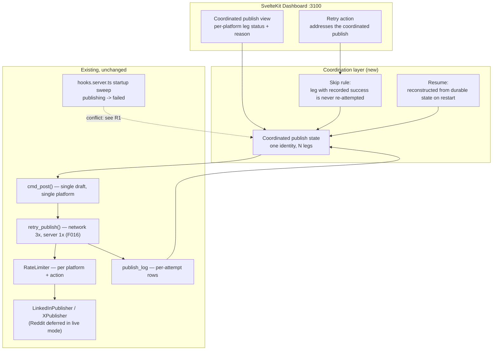
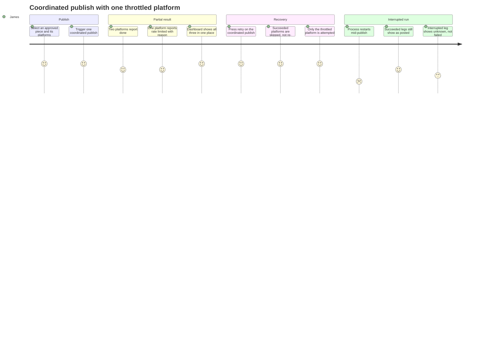

# PRD: Coordinated Multi-Platform Publish (F021)

**Version**: 1.2.0
**Status**: Draft
**Created**: 2026-08-15
**Last Updated**: 2026-08-15
**Author**: @product-manager
**Stakeholders**: James Simmons (sole operator, sole reviewer — `herald/.claude/rules/constitution.md`)

**Source**: `docs/modernization/runs/case3-herald/SPEC.md` — "Feature request: coordinated multi-platform publish"
**Target project**: Herald, `/Users/james/dev/herald`

---

## Changelog

| Version | Date | Changes | Author |
|---------|------|---------|--------|
| 1.0.0 | 2026-08-15 | Initial PRD creation from SPEC.md, grounded against Herald's corpus and code | @product-manager |
| 1.1.0 | 2026-08-15 | `/refine-prd --auto` pass. Answered OQ-6, OQ-7, OQ-9 from code and source; corrected OQ-3's and OQ-10's premises against code; left OQ-1, OQ-2, OQ-4, OQ-5, OQ-8 open as owner-only. Added AC-F5.6 (poll watchdog is a second manufacturer of the ambiguity), §10.1 (corpus/code disagreements found). Corrected the "90s PhantomBuster budget" figure to 120s. Rewrote R1, R5, R7 against verified code. Resolved four Could Not Verify rows. **No requirement was removed** — the challenge pass found no unsourced requirement. | @product-manager |
| 1.2.0 | 2026-08-15 | `/audit-prd` pass. Fixed the AC-26 citation in AC-F7.2 and NFR-5: `sanitize_error_detail()` is a design-doc sample that was never implemented — added §10.1 D7 naming the two narrower functions that ship and the third INSERT path that sanitizes nothing. Scope-corrected the §10.2 trust-ledger row that verified F016 citations against the document but never against the code, which is how D7 survived. Confirmed the F1–F6 already-exists/does-not-exist claims by independent re-grep. Rewrote §10 for post-audit state: one row resolved into new §10.3, three kept with out-of-scope reasons, one unresolvable row added. **No requirement was removed.** | @audit-prd |

---

## 1. Product Summary

### 1.1 Problem Statement

Stated by the requester, verbatim:

> Today a draft is published to one platform at a time. I want to publish the same piece to
> several platforms as one action — LinkedIn, X, Reddit — and have the result be
> comprehensible when it doesn't fully succeed.

> The failure that motivates this: I publish to three platforms, two succeed, one fails on a
> rate limit. Right now I have no single place that tells me what the state of that piece is,
> and retrying is a manual decision per platform with no memory of what already went out.

The code matches that description. `cmd_post()` in `src/herald/cli.py` takes a single draft
id and publishes it to that draft's one platform (`drafts.platform` is a single-valued column
with a `CHECK(platform IN ('linkedin','x','reddit'))` in `src/db/schema.sql`). Nothing above
the individual draft holds state for "this piece, across platforms".

Two existing behaviours make the partial-failure case worse rather than neutral:

- **The startup sweep converts interrupted publishes into retry candidates.**
  `src/hooks.server.ts` calls `sweepZombiePublishing()` on server init, which resets every
  draft stuck in `publishing` to `failed` with `error_detail='server_restart'`. Its own
  comment states the intent: *"Resets any drafts stuck in 'publishing' to 'failed' so they
  can be retried."* A publish interrupted by a restart is therefore presented as failed and
  retryable, whether or not it actually reached the platform.
- **The prevention this was meant to depend on was never specified.** The F016 PRD accepts
  the phantom-duplicate risk explicitly and defers the fix four times to "F017 (feed
  verification)" (`docs/PRD/f016-publisher-error-handling-rate-limiting.md` lines 179, 218;
  `docs/TRD/TRD-f016-publisher-error-handling.md` line 758;
  `docs/TRD/TRD-publisher-error-handling-rate-limiting.md` line 727). No such feature exists.
  F017 in `docs/design/herald/features.md` is *Source URL Validation*, delivered as
  `docs/PRD/f030-source-url-validation.md`. The deferral target is a dangling reference.

### 1.2 Proposed Solution

A coordination layer above the existing publishers that:

1. gives a multi-platform publish one identity and one state (source requirement 1),
2. records per-platform success durably and treats that record as the authority on what may
   be attempted again (source requirement 2),
3. renders the per-platform outcome — done, failed, why — in the dashboard (source
   requirement 3),
4. runs each platform's leg against that platform's own limits, without one leg's throttling
   determining another leg's outcome (source requirement 4),
5. survives a process restart with succeeded legs intact and the remainder resumable
   (source requirement 5).

The publishers themselves are untouched. `docs/TRD/TRD-publisher-rearchitecture.md` §1.1
established that the `Publisher` protocol (`publish()` / `engage()`) is the stable seam and
that backend swaps happen beneath it; this feature sits above that seam for the same reason.

### 1.3 Value Proposition

The requester's stated cost is decision cost, not throughput: *"retrying is a manual decision
per platform with no memory of what already went out."* The value delivered is a single place
that answers "what is the state of this piece" and a retry that is safe to press without the
operator reconstructing history from `publish_log`.

### 1.4 Key Differentiator — what this feature does NOT claim

This PRD does not claim exactly-once delivery. The requester states the reason plainly and
this document does not paper over it (see §7 OQ-2 and §8 R1):

> durability and "exactly once" are not the same thing — a publish that succeeded remotely
> but crashed before recording locally looks identical to one that never went out.

What is committed here is the half that is achievable from local state: **a platform whose
success was recorded is never attempted again.** The crash-window case is represented as
unknown rather than resolved by guessing.

### 1.5 Solution Architecture

**v1.1.0 caveat on the "Existing, unchanged" subgraph.** `retry_publish()`, `RateLimiter`,
the publishers, `publish_log` and the startup sweep were all verified present and behaving as
drawn. The **dashboard's** async publish path was not: F016's 202/polling architecture is
specified in the corpus but not built, and `DraftCard` does not poll. A coordinated-publish
view needing live per-leg progress builds that layer rather than extending it. See §10.1 D1 —
this is the largest scope implication found in this pass and belongs in the TRD explicitly.

---

## 2. User Analysis

### 2.1 Target Users

| User Type | Description | Primary Need |
|-----------|-------------|--------------|
| Sole operator | James Simmons — the only user of Herald (`constitution.md`: *"single-user content drafting and publishing system for James Simmons"*, *"No multi-tenancy, no team features"*) | One place that states what happened to a piece across platforms, and a retry he can press without reasoning about what already went out |

There is exactly one user type. `constitution.md` forecloses the others.

### 2.2 User Personas

**Persona: James Simmons**
- **Role**: Sole operator, sole reviewer, sole developer (`constitution.md`, "Approval Requirements": *"James is the sole developer and decision-maker"*)
- **Goals**: Publish a piece to several platforms as one action; understand a partial result without opening logs (source requirements 1 and 3)
- **Pain Points**: Stated in the source — no single place showing the state of a piece; retry is a per-platform manual decision with no memory of prior success
- **Technical Proficiency**: High. The F016 PRD records him as able to *"re-authenticate via Keychain, read logs, but should not need to for routine issues"* — and the source requirement 3 makes "without reading logs" explicit for this case

### 2.3 User Journey

---

## 3. Goals and Non-Goals

### 3.1 Goals

Success metrics below are stated as observable properties. No latency, throughput or coverage
figure appears that was not already named in Herald's own governance files.

| ID | Goal | Success Metric | Priority | Source |
|----|------|----------------|----------|--------|
| G1 | A multi-platform publish is one addressable thing with its own state | The state of every platform leg is retrievable from one coordinated-publish identifier, without joining `publish_log` by hand | P0 | Source requirement 1 |
| G2 | Never double-post to a platform that already succeeded | For any coordinated publish, at most one `publish_log` row with `status='success'` exists per (coordinated publish, platform), across any number of retries | P0 | Source requirement 2 |
| G3 | Partial success is comprehensible in the dashboard | For a coordinated publish with at least one succeeded and one failed leg, the dashboard shows each platform's outcome and failure reason without the operator opening `publish_log` | P0 | Source requirement 3 |
| G4 | Platforms are throttled independently | A leg classified `rate_limited` does not change the outcome of, or gate the execution of, any other leg | P0 | Source requirement 4 |
| G5 | An interrupted coordinated publish is resumable and loses nothing already succeeded | After the process is killed mid-publish and restarted, legs that had recorded success remain `posted`, and the coordinated publish can be resumed | P0 | Source requirement 5 |
| G6 | Ambiguity is represented rather than guessed | A leg interrupted before its remote outcome was recorded is distinguishable from a leg confirmed failed | P0 | Derived from source requirement 2 read against the source's "hard part" section — see §7 OQ-2 |

### 3.2 Non-Goals (Explicit Scope Exclusions)

| ID | Non-Goal | Rationale |
|----|----------|-----------|
| NG1 | Adding a new platform | Source, verbatim: *"Adding a new platform. Work with the publishers that already exist."* |
| NG2 | Changing how content is generated or edited | Source, verbatim: *"Changing how content is generated or edited. This is about delivery only."* |
| NG3 | Reactivating Reddit publishing | The source names Reddit as one of the three targets. Herald's code refuses it: `src/herald/publishers/__init__.py` raises `ValueError("Reddit publishing is currently deferred. Reddit drafts cannot be published.")` in live mode, per the decision in `docs/TRD/TRD-publisher-rearchitecture.md` §1.2 and §3.5. This PRD does not reverse that decision. **Reddit is not dropped from scope** — the coordinator must remain platform-agnostic (F1, AC-F1.4) so Reddit becomes a live leg the moment it is reactivated. See §7.1 OQ-1; this is the single largest unresolved conflict between the source and the corpus. v1.1.0 note: the deferral is only half-built — Reddit drafts are still *generated* (`pipeline.py` `_get_platforms()` still defaults to `"linkedin,x,reddit"`) and `RedditAuthBanner` is still rendered on the dashboard (`src/routes/+page.svelte` line 340). Only publishing refuses. |
| NG4 | Cross-platform rate-limit aggregation | Already rejected in `docs/PRD/f016-publisher-error-handling-rate-limiting.md` §4 Non-Goals (*"Each platform managed independently"*), and source requirement 4 restates the same stance. Not re-opened here. |
| NG5 | Automatic retry of `rate_limited` legs | Rejected in F016 §4 Non-Goals: *"Rate limits can last hours; retrying immediately wastes attempts and worsens limits."* A coordinated publish inherits this: a throttled leg fails fast and waits for an operator-triggered retry. |
| NG6 | Changing the per-attempt retry policy | F016 fixes network_error at 3x (2s/4s/8s) and server_error at 1x (2s), and names user-configurable retry parameters a non-goal. This feature coordinates legs; it does not alter what happens inside one leg. |
| NG7 | Automatic token refresh / re-authentication | F016 §4 Non-Goals: *"storing refresh tokens in code violates the Keychain-only rule."* An `auth_expired` leg surfaces as a failed leg with its existing banner. |
| NG8 | WebSocket / SSE push for coordinated publish progress | F016 §4 Non-Goals: *"5s polling is sufficient for a single-user local system."* Not re-opened. See §9 for the revisit condition. v1.1.0: that decision is recorded but **not implemented** — the dashboard does no polling at all today (§10.1 D1). The non-goal still holds as a decision; it just does not describe current behaviour. |
| NG9 | Post-hoc reconciliation of pre-existing `publish_log` history | This feature governs coordinated publishes it creates. Backfilling coordinated identity onto historical single-platform publishes is not in scope; the same stance the rearchitecture TRD took on Apify-era log rows (*"No backfill or rewrite"*). |
| NG10 | Choosing the exactly-once mechanism | Deliberate. The source says *"I don't have an answer"* and asks what the honest fallback is. This PRD commits to representing the ambiguity (G6/F6) and leaves the resolution mechanism open — see §7 OQ-2 and §9. Writing a mechanism here would be an invention consuming implementation work nobody chose. |

---

## 4. Feature Requirements

### 4.1 P0 — Core Features (Must Have)

#### F1: Coordinated publish as an addressable entity

**Priority**: P0
**Source**: Source requirement 1 — *"It MUST treat a multi-platform publish as one addressable thing with its own state, not three unrelated publish attempts."*

**Description**: One publish action across N platforms creates one entity with its own
lifecycle state, holding N platform legs. Every leg's outcome is reachable from the entity's
identifier.

**User Stories**:
- As the operator, I want to publish a piece to several platforms as one action, so that I do not have to track three separate publishes myself.
- As the operator, I want one identifier for that publish, so that "what is the state of this piece" has one answer.

**Acceptance Criteria**:
- [ ] AC-F1.1: A coordinated publish over N platforms creates one entity with a stable identifier and N legs, one per platform.
- [ ] AC-F1.2: The entity has its own state, distinct from the state of any individual leg, and reaches a terminal state when no leg is still in flight.
- [ ] AC-F1.3: Given the entity identifier, every leg's platform, outcome and failure reason is retrievable in one query — no manual correlation across `publish_log` rows.
- [ ] AC-F1.4: The set of platforms in a coordinated publish is data, not hardcoded. A platform that is disabled or deferred (NG3) is representable as a leg without the coordinator special-casing it by name.
- [ ] AC-F1.5: The coordinated publish identity is distinct from the existing `drafts.batch_id` grouping, which already means "drafts from one Scout run" in the queue view (`src/lib/queue.ts`, `src/lib/queueUtils.ts`; `src/lib/server/db.ts` filters `substr(batch_id, 1, 10)` as a report date).

**Dependencies**: existing `drafts`, `publish_log` and `platforms` tables (`src/db/schema.sql`).

---

#### F2: Recorded success is authoritative and never re-attempted

**Priority**: P0
**Source**: Source requirement 2 — *"It MUST never double-post to a platform that already succeeded, no matter how many times a retry is triggered."*

**Description**: Before any leg is attempted, the durable record is consulted. A leg whose
success was recorded is skipped — not re-attempted, not re-sent, not "retried defensively".
This holds for the second retry and the twentieth.

**User Stories**:
- As the operator, I want to press retry without first working out what already went out, so that recovery is one decision instead of three.

**Acceptance Criteria**:
- [ ] AC-F2.1: Retrying a coordinated publish attempts only legs that do not have a recorded success. Succeeded legs produce zero publisher calls.
- [ ] AC-F2.2: Retrying a coordinated publish whose legs have all succeeded performs no publisher calls at all and is not an error.
- [ ] AC-F2.3: Repeated retries (three or more, in sequence) leave at most one `publish_log` row with `status='success'` per (coordinated publish, platform).
- [ ] AC-F2.4: The skip decision reads durable state, not in-process memory, so it survives the coordinator process being replaced between retries.
- [ ] AC-F2.5: A leg whose remote outcome is unknown (F6) is **not** treated as "not succeeded" for the purpose of AC-F2.1 — it is not auto-attempted. See §7 OQ-2 for what remains undecided about how such a leg is resolved.

**Dependencies**: F1 (the entity that retry addresses), F6 (the unknown state that AC-F2.5 defers to).

---

#### F3: Partial success visible in the dashboard

**Priority**: P0
**Source**: Source requirement 3 — *"It MUST make partial success visible in the dashboard — which platforms are done, which failed, and why — without the operator having to read logs."*

**Description**: The dashboard shows, for one coordinated publish, each platform's outcome and
— for failures — the reason, in the operator's own view rather than in `publish_log`.

**User Stories**:
- As the operator, I want to see two green and one rate-limited in one place, so that I know the state of the piece without opening a database.

**Acceptance Criteria**:
- [ ] AC-F3.1: A coordinated publish with mixed outcomes renders every leg with its platform and outcome in a single dashboard view.
- [ ] AC-F3.2: Each failed leg shows a human-readable reason derived from the existing `error_category` taxonomy (`rate_limited`, `auth_expired`, `network_error`, `server_error`, `daily_limit`, `unknown` — `src/db/schema.sql`, `publish_log.error_category` CHECK).
- [ ] AC-F3.3: Reaching the information in AC-F3.1 and AC-F3.2 requires no CLI use and no reading of `publish_log`.
- [ ] AC-F3.4: A leg in the unknown state (F6) is visually distinguishable from a leg that failed, and the display says what is unknown about it.
- [ ] AC-F3.5: The view renders correctly at mobile width. F016 AC-44 fixed Herald's mobile bar at ≤390px for error states and banners, and `stack.md` records mobile access over Tailscale as a supported path; this feature inherits that bar rather than setting a new one.

**Dependencies**: F1; existing per-platform error badges and re-auth banner from F016 §F16.7.

---

#### F4: Independent per-platform rate limiting

**Priority**: P0
**Source**: Source requirement 4 — *"It MUST respect each platform's own rate limiting independently, so one throttled platform does not block or delay the others."*

**Description**: Each leg is checked against, and constrained by, only its own platform's
limits. One platform being throttled does not gate, serialise behind, or fail another leg.

**User Stories**:
- As the operator, I want a throttled LinkedIn to leave X and Reddit alone, so that one platform's limits do not cost me the others.

**Acceptance Criteria**:
- [ ] AC-F4.1: A leg's rate-limit check consults only its own platform, using the existing `RateLimiter` (`src/herald/publishers/rate_limiter.py`, which keys on platform + action and queries `publish_log`).
- [ ] AC-F4.2: A leg classified `rate_limited` does not change the outcome of any other leg in the same coordinated publish.
- [ ] AC-F4.3: No leg's execution is gated on another leg's completion. A throttled or slow leg does not sit in front of a healthy one.
- [ ] AC-F4.4: A leg blocked by the per-platform daily limit (`platforms.daily_count >= platforms.daily_limit`, enforced atomically per F016 AC-20) fails only that leg.
- [ ] AC-F4.5: No aggregate, cross-platform limit is introduced (NG4).

**Note on severity**: "does not block or delay the others" is expressed above as an ordering
and independence property. It is deliberately **not** expressed as a wall-clock bound — the
source states no time budget and inventing one would create a threshold nobody asked to meet.
See §7 OQ-5.

**Dependencies**: existing `RateLimiter`; F016 daily-limit enforcement.

---

#### F5: Survives a mid-publish restart

**Priority**: P0
**Source**: Source requirement 5 — *"It MUST survive the process restarting mid-publish: a coordinated publish interrupted halfway is resumable and does not lose what already succeeded."*

**Description**: Coordinated publish state is durable. After a restart, succeeded legs are
still succeeded, and the coordinated publish can be resumed rather than restarted.

**User Stories**:
- As the operator, I want a restart mid-publish to cost me the remaining legs at worst, so that a crash does not erase what already went out.

**Acceptance Criteria**:
- [ ] AC-F5.1: Coordinated publish state and per-leg outcomes are written durably as they occur, not held only in the publishing process.
- [ ] AC-F5.2: After the process is killed mid-publish and restarted, every leg with recorded success still reads as succeeded.
- [ ] AC-F5.3: After such a restart, the coordinated publish is resumable: unattempted legs can still be attempted, and F2's skip rule still holds.
- [ ] AC-F5.4: The existing startup sweep must not convert an interrupted leg into a plain `failed` that invites a blind retry. `src/hooks.server.ts` currently calls `sweepZombiePublishing()`, resetting **all** `publishing` drafts to `failed` with `error_detail='server_restart'` — the code comment states the purpose as *"so they can be retried."* For a coordinated leg, that behaviour must be reconciled with F6 rather than inherited unchanged. See §8 R1.
- [ ] AC-F5.5: State is held locally. `constitution.md` ("Single-User Constraints"): *"All data stays local — no cloud storage of drafts, media, or credentials."*
- [ ] AC-F5.6: The **poll watchdog** must not convert an in-flight leg into a plain `failed` either. `src/routes/api/drafts/[id]/status/+server.ts` forces any draft whose latest `publish_log` row is older than `WATCHDOG_SECONDS = 180` to `failed` with `error_detail='subprocess_timeout'`, `error_category='unknown'` — a second, independent producer of exactly the ambiguity F6 exists to represent. AC-F5.4 names only the startup sweep; both paths need the same reconciliation. (Added v1.1.0 from code; see §10.1.)

**Dependencies**: F1, F6; existing `hooks.server.ts` sweep and the F016 180s poll watchdog.

---

#### F6: An unknown remote outcome is represented as unknown

**Priority**: P0
**Source**: Derived — source requirement 2 (*"MUST never double-post … no matter how many times a retry is triggered"*) read together with the source's own "hard part": *"a publish that succeeded remotely but crashed before recording locally looks identical to one that never went out. I don't know how you tell those apart for these platforms, or what the honest fallback is when you can't."*

**Description**: A leg interrupted between "sent to the platform" and "success recorded" is
in a third state — not succeeded, not known-failed. It is recorded as such. It is not
auto-retried, because auto-retrying a possibly-succeeded leg is exactly the double-post that
requirement 2 forbids absolutely.

**This feature defines the state and its handling. It does not define how the state is
resolved** — see NG10 and §7 OQ-2.

**User Stories**:
- As the operator, I want the system to tell me it does not know, rather than guess wrong in either direction, so that I can decide with the real information.

**Acceptance Criteria**:
- [ ] AC-F6.1: A leg interrupted after dispatch and before its outcome was recorded is durably marked as unknown-outcome, distinct from both `posted` and `failed`.
- [ ] AC-F6.2: An unknown-outcome leg is never automatically retried.
- [ ] AC-F6.3: An unknown-outcome leg does not silently block the coordinated publish from reaching a terminal state; the entity can be closed out with that leg unresolved (see §7 OQ-8 for the assumption behind "closed out").
- [ ] AC-F6.4: The dashboard states what is unknown and what the operator's options are (AC-F3.4).

**Dependencies**: F1, F2, F5.

### 4.2 P1 — Enhanced Features (Should Have)

#### F7: Reason detail carried through to the leg display

**Priority**: P1
**Source**: Source requirement 3's *"and why"*, at a level of detail the source does not specify.

**Description**: Beyond the category, the leg display surfaces the sanitized detail already
captured per attempt (`publish_log.error_detail`, and the attempt count), so "why" answers a
follow-up question without a log read.

**Acceptance Criteria**:
- [ ] AC-F7.1: A failed leg can show the sanitized `error_detail` from its latest `publish_log` row and its attempt count, consistent with F016 §F16.7 (*"Attempt count shown: 'Failed — 3 attempts'"*).
- [ ] AC-F7.2: Anything surfaced has passed a sanitization path. **There is no single such path today** — F016 AC-26 specifies `sanitize_error_detail()` on `error_detail` *and* `request_data` before every `publish_log` INSERT, but no function of that name exists in Herald's `src/` (it appears only as a design-doc code sample at `docs/PRD/f016-publisher-error-handling-rate-limiting.md:401`). What ships is two narrower, non-overlapping functions covering one field each, plus at least one INSERT path with no sanitization at all — see §10.1 D7. This feature must therefore either route its surfaced detail through a sanitizer it can name, or close the gap; it cannot inherit one.

**Dependencies**: F3.

### 4.3 P2 — Future Features

None. Nothing in the source is deferred to a later release; everything it asks for is P0 or
P1 above, or explicitly listed in §3.2.

---

## 5. Non-Functional Requirements

Every row below traces to a named constraint in Herald's `constitution.md`, `stack.md`, or a
prior PRD/TRD decision. No latency, uptime, or throughput figure appears, because none was
stated by the requester or measured here.

| ID | Requirement | Source |
|----|-------------|--------|
| NFR-1 | Unit coverage ≥ 80%, integration coverage ≥ 70% | `herald/.claude/rules/constitution.md`, "Quality Gates → Coverage Targets" |
| NFR-2 | `HERALD_PUBLISHER_STUB=1` is respected in all publisher code paths this feature touches; tests and verification never make real posts | `constitution.md`, "Publisher Safety Rule": *"Tests and verification ALWAYS run in stub mode. This is non-negotiable."* |
| NFR-3 | Verification runs against a live dashboard on localhost:3100 with publishers stubbed | `constitution.md`, "Verification Level: live-required" |
| NFR-4 | No new pip dependencies for CLI/publisher components — Python stdlib only | `constitution.md`, "Code Conventions"; `stack.md`, "Draft Engine & CLI" |
| NFR-5 | No credentials in code (Keychain/env only); sanitization applied before every `publish_log` INSERT this feature adds or touches, to `error_detail` and `request_data` | `constitution.md`, "Code Conventions"; F016 AC-26 / AC-47 — **stated as a requirement, not an inherited guarantee**: AC-26's `sanitize_error_detail()` was never implemented; see §10.1 D7 for what actually covers each field |
| NFR-6 | All coordinated-publish state stays local in `broadcast.db`; no cloud storage | `constitution.md`, "Single-User Constraints"; `stack.md`, "Database" |
| NFR-7 | Schema changes are explicit SQL migrations, no ORM | `constitution.md`, "Code Conventions"; `stack.md`, "Database" |
| NFR-8 | New code is written test-first (RED → GREEN → REFACTOR) | `constitution.md`, "Development Methodology: TDD" — *"No production code is written before a failing test exists for it."* |
| NFR-9 | If `drafts.status` or its transition rules change, all three `VALID_TRANSITIONS` maps stay in sync and a cross-language test asserts it | F016 AC-33/AC-34 and its risk row *"VALID_TRANSITIONS drift across 3 files — High/High"*; the three maps are in `src/db/broadcast_db.py`, `src/lib/db.ts`, `src/lib/server/db.ts` |

---

## 6. Acceptance Criteria Summary

### Feature Acceptance Criteria

| ID | Feature | Criterion | Verification Method |
|----|---------|-----------|---------------------|
| AC-F1.1 | F1 | N-platform publish creates one entity with N legs | Unit (pytest / vitest) |
| AC-F1.2 | F1 | Entity has its own state; terminal when no leg in flight | Unit |
| AC-F1.3 | F1 | All leg outcomes retrievable from the entity identifier | Unit + Playwright (live server) |
| AC-F1.4 | F1 | Platform set is data; disabled/deferred platform representable without name special-casing | Unit |
| AC-F1.5 | F1 | Coordinated identity distinct from `batch_id` grouping | Unit |
| AC-F2.1 | F2 | Retry attempts only non-succeeded legs; zero publisher calls for succeeded ones | Unit, stub mode |
| AC-F2.2 | F2 | Retry of a fully succeeded publish makes no publisher calls and is not an error | Unit, stub mode |
| AC-F2.3 | F2 | Three or more sequential retries leave ≤1 `success` row per (publish, platform) | Integration (pytest, in-memory SQLite) |
| AC-F2.4 | F2 | Skip decision survives process replacement between retries | Integration |
| AC-F2.5 | F2 | Unknown-outcome leg is not auto-attempted by retry | Unit |
| AC-F3.1 | F3 | Mixed-outcome publish renders every leg in one view | Playwright (live server) |
| AC-F3.2 | F3 | Failed legs show reason from the existing `error_category` taxonomy | Playwright |
| AC-F3.3 | F3 | No CLI or `publish_log` read needed to reach AC-F3.1/3.2 | Manual (live-required verification) |
| AC-F3.4 | F3 | Unknown-outcome leg visually distinct from failed, and says what is unknown | Playwright |
| AC-F3.5 | F3 | Renders correctly at ≤390px width | Playwright (mobile viewport) |
| AC-F4.1 | F4 | Leg rate-limit check consults only its own platform | Unit |
| AC-F4.2 | F4 | `rate_limited` leg does not change other legs' outcomes | Integration, stub mode with `HERALD_STUB_ERROR` |
| AC-F4.3 | F4 | No leg gated on another leg's completion | Integration |
| AC-F4.4 | F4 | Daily-limit block fails only that leg | Integration |
| AC-F4.5 | F4 | No aggregate cross-platform limit introduced | Unit (absence assertion) |
| AC-F5.1 | F5 | Leg outcomes written durably as they occur | Integration |
| AC-F5.2 | F5 | Succeeded legs survive kill + restart | Integration (kill mid-run) |
| AC-F5.3 | F5 | Coordinated publish resumable after restart; skip rule still holds | Integration |
| AC-F5.4 | F5 | Startup sweep does not convert an interrupted leg into a blind-retry `failed` | Integration + Playwright |
| AC-F5.5 | F5 | State stays local in `broadcast.db` | Unit |
| AC-F5.6 | F5 | Poll watchdog does not convert an in-flight leg into a blind-retry `failed` | Integration |
| AC-F6.1 | F6 | Interrupted-after-dispatch leg durably marked unknown-outcome | Integration |
| AC-F6.2 | F6 | Unknown-outcome leg never automatically retried | Unit |
| AC-F6.3 | F6 | Entity can reach terminal state with an unresolved leg | Unit |
| AC-F6.4 | F6 | Dashboard states what is unknown and the operator's options | Playwright |
| AC-F7.1 | F7 | Failed leg can show sanitized detail and attempt count | Playwright |
| AC-F7.2 | F7 | Surfaced detail has passed sanitization | Unit |

### Non-Functional Acceptance Criteria

One row per §5 entry. No requirement is introduced here.

| ID | Requirement | Criterion | Verification Method |
|----|-------------|-----------|---------------------|
| AC-N1 | NFR-1 | Unit ≥80%, integration ≥70% on changed code | `pytest --cov` / `vitest --coverage` |
| AC-N2 | NFR-2 | No real HTTP to any platform under `HERALD_PUBLISHER_STUB=1` | Unit + verification protocol |
| AC-N3 | NFR-3 | Verification exercises the running dashboard at localhost:3100 | Live verification (verify-app) |
| AC-N4 | NFR-4 | No new pip dependency added for CLI/publisher code | Manual / dependency diff |
| AC-N5 | NFR-5 | No credential material reaches `publish_log` or logs | Unit (sanitization test, per F016 AC-47) |
| AC-N6 | NFR-6 | All new state persisted in `broadcast.db` only | Unit |
| AC-N7 | NFR-7 | Schema change ships as explicit SQL, idempotent | Unit (migration test) |
| AC-N8 | NFR-8 | Failing test precedes implementation for each task | Manual (commit order review) |
| AC-N9 | NFR-9 | Three `VALID_TRANSITIONS` maps identical if touched | Cross-language test (F016 AC-34) |

---

## 7. Open Questions

Consumed by `/refine-prd`. Each row is a decision the source did not settle, with what this
document assumed in order to be finishable.

The `/refine-prd --auto` pass of v1.1.0 worked this list against Herald's code. Three
questions are now settled (§7.2). Five remain open and are marked **owner-only** — they turn
on business priority, scope trade-off or risk appetite, and no amount of reading settles them
(§7.1). Two had their premises corrected without being answered.

### 7.1 Still open — owner-only

These lead the readout. None is answerable by reading Herald.

| ID | Question | What I assumed | Why it matters | If I'm wrong |
|----|----------|----------------|----------------|--------------|
| OQ-1 | The source names **Reddit** as one of three targets. Herald's code refuses Reddit in live mode (`src/herald/publishers/__init__.py`) per a decision recorded in `TRD-publisher-rearchitecture.md` §1.2/§3.5. Is Reddit in scope as a live leg? | That the deferral stands (NG3), and that the coordinator is platform-agnostic so Reddit becomes a leg the moment it is reactivated. The motivating scenario is therefore LinkedIn + X in live mode, three platforms only in stub mode. | The source's whole example is *"I publish to three platforms, two succeed, one fails."* If Reddit is meant to be live, this feature has an unstated prerequisite (Reddit reactivation) that is a separate TRD. | Either a demo of the stated scenario cannot run live, or Reddit publishing gets reactivated implicitly — reversing a recorded decision without one being taken. |
| OQ-2 | **The hard part.** How is an unknown-outcome leg resolved? The source: *"I don't know how you tell those apart for these platforms, or what the honest fallback is when you can't."* | Nothing. F6 defines the state and forbids auto-retry (AC-F6.2); NG10 keeps the resolution mechanism out of scope. The known candidates are: (a) platform read-back to check whether the post exists, (b) operator confirmation in the dashboard, (c) an idempotency key at the platform API. | It is the requirement the requester explicitly flagged as unanswered. Writing a mechanism here would commit implementation work to a design nobody chose. | The feature ships with a state the operator can see but not clear, and resolution becomes a follow-on. That is the cost of not guessing — and it is smaller than the cost of guessing wrong toward auto-retry. |
| OQ-4 | Candidate (a) — read-back — for which platforms is it available? F019 records LinkedIn metrics as *"P1 — Apify scraping is unreliable"* (`docs/PRD/f019-post-performance-metrics.md` line 34, verbatim); the publisher rearchitecture later moved LinkedIn posting to the official Posts API. Herald's PhantomBuster client polls `fetch-output?id={phantom_id}` by **agent** id and never uses `container_id` for correlation (`src/herald/publishers/phantombuster.py`). | That read-back availability is unknown for both live platforms and must be established before OQ-2 can be answered. | Determines whether (a) is viable at all, and therefore whether (b) — operator confirmation — is the only honest fallback. | The chosen mechanism turns out to be unimplementable on one or both platforms. |
| OQ-5 | Requirement 4 says a throttled platform must not *"block or delay"* the others. Is there a wall-clock expectation behind "delay"? | That it is an ordering/independence property, not a latency budget (F4, AC-F4.3). No time figure invented. | A latency number here would become a threshold to prove, consuming a task. | A real responsiveness expectation exists and is discovered late. |
| OQ-8 | What does "closed out" mean for a coordinated publish with an unresolved leg (AC-F6.3)? Can the operator abandon a leg? | That the entity can reach a terminal state with a leg left unpublished, so that partial success is not permanently "in progress". The mechanics of abandoning are unspecified. | Requirement 1 gives the entity its own state; a state that can never terminate is a defect of that design. | Coordinated publishes accumulate in a non-terminal state and the dashboard fills with them. |

**OQ-1 — new evidence, does not close it.** The Reddit deferral is only *partially* implemented,
which sharpens the question rather than answering it:

- `src/routes/drafts/new/+page.svelte` contains no Reddit reference — `TRD-publisher-rearchitecture.md`
  task PUB-F001 was done.
- `src/routes/+page.svelte` line 340 still renders `<RedditAuthBanner />`, and line 92 still
  binds the Reddit daily-cap flag from `RedditRateLimitPanel` — **PUB-F002 was not done.**
- `_get_platforms()` in `src/herald/engine/pipeline.py` line 148 still defaults to
  `"linkedin,x,reddit"` and filters nothing — **PUB-B012 was not done.**

So Herald still *generates* Reddit drafts and still shows Reddit chrome on the dashboard; it
only refuses to *publish* them. Whether that half-state is the intended end state, or drift,
is the owner's call.

**OQ-2, OQ-5, OQ-8 — no new evidence.** Nothing in Herald's code or corpus bears on them.
OQ-2 in particular is the question the source itself declines to answer; a confident answer
here would be an invention.

**OQ-4 — one partial lead, not an answer.** `LinkedInPublisher._resolve_share_urn()`
(`src/herald/publishers/linkedin.py` lines 90, 990, 1097) already calls the Apify LinkedIn
Post Scraper actor `Wpp1BZ6yGWjySadk3` and reads `shareUrn` from its output — so a
LinkedIn post-scraping path exists, is wired to credentials (`HERALD_APIFY_KEY`), and works.
But it scrapes **a post whose URL you already have**, to resolve a reshare parent. It does not
list a member's recent posts, which is what read-back for OQ-2 would need. It is a lead worth
following, not a mechanism that exists. Settling OQ-4 still requires reading the LinkedIn
Posts API reference and the PhantomBuster API reference — external documents, not Herald.

### 7.2 Settled in v1.1.0

| ID | Verdict | Resolution |
|----|---------|------------|
| OQ-6 | **answered** | Confirmed from code: Herald has no cross-platform piece identifier. `drafts.platform` is a single-valued `CHECK(platform IN ('linkedin','x','reddit'))` (`src/db/schema.sql` line 30); `batch_id` is date-encoded and filtered as a report date (`src/lib/server/db.ts` line 543, `substr(batch_id, 1, 10)`) and groups the queue by Scout run (`src/lib/queueUtils.ts` lines 94–133); `source_ref` is set per draft from the Scout item and is used for duplicate rejection, not cross-platform grouping (`src/herald/engine/pipeline.py` lines 819–839). The only other draft-to-draft links are `similar_to_draft_id` and `reused_from_id` — dedup and reuse pointers, not identity. The PRD's assumption stands: **a coordinated publish is an explicit selection of already-approved drafts, grouped at publish time.** No alternative is available without changing draft generation, which NG2 forbids verbatim. |
| OQ-7 | **answered** | From the source: requirement 3 names the dashboard and nothing in the source asks for a CLI surface. Adding one as a *requirement* would be unsourced. The PRD's dashboard-first assumption stands. The implementation fact behind the question is confirmed: `src/routes/api/drafts/[id]/post/+server.ts` line 42 `execFile`s `broadcast post <id> --json` as a subprocess, so the CLI is on the critical path regardless — a TRD concern, not a product requirement. |
| OQ-9 | **answered** | Confirmed: `docs/design/herald/features.md` runs F001–F020 and stops at *"F020 — Daily Automation Cron"*; its F017 entry is *"Source URL Validation"*, delivered as `docs/PRD/f030-source-url-validation.md`. **F021 is unclaimed.** Use it. |

### 7.3 Premises corrected, questions still open

| ID | Question | Correction applied in v1.1.0 |
|----|----------|------------------------------|
| OQ-3 | Is candidate (c) — idempotency keys — still foreclosed? F016 rejected duplicate prevention in the retry chain with the rationale *"Idempotency keys not supported by Apify actors"* (`docs/PRD/f016-publisher-error-handling-rate-limiting.md` line 180, verbatim). | **The staleness is confirmed, the availability is not.** Verified in code: LinkedIn posting is the official OAuth2 Posts API (`src/herald/publishers/linkedin.py` line 1, `POST /rest/posts`, returning `share_urn`) and X posting is PhantomBuster (`src/herald/publishers/x_publisher.py` line 4). Neither *posts* via an Apify actor, so F016's stated rationale no longer describes either live platform. Herald still uses Apify — but only for the LinkedIn reshare-URN scrape (§7.1, OQ-4), never for posting. Whether the LinkedIn Posts API or PhantomBuster supports an idempotency key is an external-documentation question and remains open. |
| OQ-10 | Does the F016 180s poll watchdog need adjusting for a coordinated publish? | **Not answerable without a measurement nobody has taken** — unchanged, and deliberately not proposed. But three of the question's premises were wrong and are corrected below. |

**OQ-10 — corrected premises.** The v1.0.0 framing implied the watchdog is a budget on total
publish duration that N legs could exhaust. It is not:

1. **The 180s clock measures the age of the latest `publish_log` row for that draft, not
   elapsed publish time.** `src/routes/api/drafts/[id]/status/+server.ts` lines 29, 70–72:
   `logAgeSeconds = (Date.now() - new Date(latestLog.created_at + 'Z').getTime()) / 1000`,
   compared against `WATCHDOG_SECONDS = 180`. `retry_publish()` writes a `publish_log` row per
   attempt, so **every attempt resets the clock**. Legs do not stack toward a shared budget; the
   real exposure is narrower and more specific — *a leg that sits in `publishing` for 180s
   without writing a `publish_log` row*, which is exactly what a queued-but-not-started leg
   would look like if legs were serialised.
2. **The figure "PhantomBuster's 90s poll budget" is wrong.** `_DEFAULT_TIMEOUT_SECONDS = 120`
   in `src/herald/publishers/phantombuster.py` line 83, and every call site in
   `x_publisher.py` (lines 253, 359, 484) and `linkedin.py` (lines 566, 614) uses the default —
   no site passes an override. The 90s figure comes from `TRD-publisher-rearchitecture.md`
   line 204 (`_MAX_POLL_SECONDS = 90`), which the implementation did not follow. The code wins:
   **120s**, with a 3s poll interval.
3. **The watchdog is dormant for dashboard-initiated publishes.** It fires only when a client
   issues `GET /api/drafts/[id]/status`, and nothing does. `DraftCard.svelte` contains no
   polling — its only timer is a 2s clipboard-state reset (line 252). The single consumer of
   that route anywhere in `src/` is `XPartialPostedUI.svelte` line 107, which issues a
   **PATCH**, not the GET poll. See §10.1 for the wider finding this is part of.

A threshold change would need a measured worst-case coordinated-publish duration against the
current backends. No such measurement exists in the corpus or the repository, so none is
proposed here. What v1.1.0 does instead is make the watchdog's actual behaviour a stated
constraint (AC-F5.6) rather than an assumed backdrop.

---

## 8. Risk Assessment

| ID | Risk | Likelihood | Impact | Mitigation Strategy |
|----|------|------------|--------|---------------------|
| R1 | **Two** existing mechanisms manufacture the exact ambiguity this feature must handle, and neither consults the remote outcome. (a) `src/hooks.server.ts` → `sweepZombiePublishing()` resets **every** `publishing` draft to `failed` on server init, commented *"so they can be retried"*. Verified in `src/lib/server/db.ts` lines 1044–1054: the SQL is `UPDATE drafts SET status='failed', error_detail='server_restart' WHERE status='publishing'` — **no age predicate at all**, contrary to F016's own design (`docs/PRD/f016-publisher-error-handling-rate-limiting.md` line 292 specified `updated_at < now - 180s` with `error_detail='Watchdog: stale publishing state on startup'`). The as-built sweep is therefore *broader* than designed: it also catches a publish that started moments before the restart. (b) The poll watchdog in `src/routes/api/drafts/[id]/status/+server.ts` forces `failed` / `subprocess_timeout` / `error_category='unknown'` on the same basis. A restart or a stalled poll during a live publish presents a possibly-succeeded leg as a failed one, and invites the retry that double-posts. | High | High | AC-F5.4 (sweep) and AC-F5.6 (watchdog) require reconciling **both** with the unknown-outcome state (F6) rather than inheriting either. Do not weaken them — a zombie that never clears is the failure they were built for; give them a third destination. |
| R2 | The mitigation F016 relied on does not exist. F016 accepted the phantom-duplicate risk explicitly (*"Automatic retries have no duplicate protection … Risk accepted"*) and deferred prevention to "F017 (feed verification)" four times across its PRD and both TRDs. F017 in `features.md` is Source URL Validation, shipped as `f030`. There is no feed-verification design to build on. | Certain (verified) | High | Treat OQ-2 as genuinely open work, not as retrieval of an existing plan. Do not let a TRD cite F017 as prior art. |
| R3 | X's outcome may be unknowable locally after a crash. `PhantomBusterClient.launch_and_wait()` captures `containerId` but polls `fetch-output?id={phantom_id}` — by agent, not container (`src/herald/publishers/phantombuster.py`). A later poll returns that agent's current output with no correlation to the interrupted run. | Medium | High | Establish OQ-4 before choosing an OQ-2 mechanism. If container-scoped fetch is unavailable, read-back is not viable for X and (b) operator confirmation may be the only honest fallback. |
| R4 | LinkedIn read-back may be equally unavailable. F019 shipped LinkedIn metrics as P1 because *"Apify scraping is unreliable"*; whether the official Posts API (now the LinkedIn backend) exposes a read of recent member posts is not established anywhere in the corpus. | Medium | High | OQ-4. Settle by reading the LinkedIn Posts API docs and probing with a real token before committing to read-back. |
| R5 | Touching `drafts.status` drifts the three `VALID_TRANSITIONS` maps. F016 rated this High/High and added a cross-language test (AC-34) precisely because the maps live in three files across two languages. A new unknown-outcome state, if modelled as a draft status, walks straight into it. **The drift is not hypothetical — it is present today.** The two TypeScript maps (`src/lib/db.ts` line 150, `src/lib/server/db.ts` line 278) are byte-identical to each other, but the Python map (`src/db/broadcast_db.py` line 176) disagrees on the `posting` row: Python has `{"posted","failed","partial_posted"}`, TypeScript has `['posted','failed','approved']`. Whatever F016 AC-34's cross-language test asserts, it is not catching this. Separately, F016 AC-33 required a `failed→publishing` edge; **no** map has one — all three have `failed→approved`. | **Certain (verified present)** — and rises further if `drafts.status` is extended | High | NFR-9 / AC-N9, and confirm AC-34's test actually runs and compares all three maps before relying on it. Alternatively, model the coordinated entity and its legs outside `drafts.status` — a TRD-level choice, flagged here because the blast radius is a product-visible regression and the guardrail is already demonstrably leaking. |
| R6 | The motivating scenario cannot be run live. The source's example is three platforms; Reddit refuses in live mode (NG3, OQ-1). Verification runs stubbed (NFR-2/NFR-3), so tests will pass on three legs while live operation has two. | High | Medium | Make AC-F1.4 (platform set is data) load-bearing, and state the live platform set explicitly in the TRD so the gap is visible rather than discovered in operation. |
| R7 | A healthy coordinated publish is swept mid-flight by the 180s poll watchdog — R1's failure caused by this feature rather than survived by it. **Reframed in v1.1.0 against the code** (§7.3, OQ-10): the watchdog measures the age of the leg's latest `publish_log` row, not total elapsed duration, and `retry_publish()` writes a row per attempt — so total coordinated duration is *not* the exposure. The exposure is narrower: a leg sitting in `publishing` for 180s **without writing a `publish_log` row**, which is what a queued-but-not-started leg looks like under serialisation. Note also that the watchdog is currently unreachable from the dashboard (nothing polls `GET /api/drafts/[id]/status`), so building the coordinated view may *activate* a dormant hazard. | Low as built; Medium if the coordinated view introduces polling **and** legs are serialised | High | OQ-10 — no threshold change is proposed, because none can be justified without a measurement. F4's no-gating rule (AC-F4.3) is the structural defence: a leg that never waits its turn never goes 180s without logging. If implementation does serialise legs, either write a `publish_log` row on leg entry or revisit the threshold **with a measurement, not a guess**. |

### Contingency Plans

**R1 Contingency**: If reconciling the sweep with F6 proves too invasive for the release,
the fallback is to leave the sweep's behaviour intact but stop the dashboard from offering a
one-press retry on a leg swept with `error_detail='server_restart'` — the operator must
resolve it explicitly. This preserves requirement 2's absolute reading at the cost of manual
effort, which is the trade the source's own framing prefers ("honest fallback").

**R2 Contingency**: If OQ-2 cannot be resolved within this feature, ship F1–F5 and F6's
representation of the unknown state, and carry resolution as a named follow-on. What must
**not** happen is F6 being dropped as "unimplementable" — the unknown state is what keeps
requirement 2 honest even with no resolution mechanism.

**R5 Contingency**: If the unknown-outcome state cannot be added to `drafts.status` without
drift risk, model it on the coordinated leg instead and leave `drafts.status` alone.

---

## 9. Decisions and Rejected Alternatives

| Proposal / Challenge | Verdict | Rationale | Revisit when |
|----------------------|---------|-----------|--------------|
| Specify the exactly-once mechanism in this PRD | Rejected | The source states it has no answer and asks for one. A mechanism written here would be executed, not examined (NG10). | OQ-4 is answered — i.e. once read-back availability for LinkedIn and X is established, or an idempotency key is confirmed supported (OQ-3). |
| Reuse `drafts.batch_id` as the coordinated-publish identity | Rejected | `batch_id` already means "drafts from one Scout run" and is date-encoded — `src/lib/server/db.ts` filters `substr(batch_id, 1, 10)` as a report date, and `queue.ts` groups the queue by it. Overloading it would conflate a day's drafts with one piece's publish. | Never, while `batch_id` retains its Scout-run meaning. If queue grouping is ever re-modelled, revisit together. |
| Aggregate rate limits across platforms | Rejected (inherited from F016 §4) | *"Each platform managed independently."* Source requirement 4 restates the same stance. | A platform imposes an account-wide limit that spans the actions Herald performs, making per-platform accounting wrong rather than merely separate. |
| Automatically retry `rate_limited` legs | Rejected (inherited from F016 §4) | *"Rate limits can last hours; retrying immediately wastes attempts and worsens limits."* | A platform returns a reliable `Retry-After` that can be scheduled rather than slept through — F016 already captures `Retry-After` for display (AC-15), so the input exists. |
| WebSocket / SSE push for coordinated progress | Rejected (inherited from F016 §4) | *"5s polling is sufficient for a single-user local system."* | Coordinated publishes routinely outlive F016's 240s client polling timeout, making polling lossy rather than merely chatty. |
| Idempotency keys at the platform API | Rejected in F016 — **rationale confirmed stale (v1.1.0, from code)** | F016's stated reason was *"Idempotency keys not supported by Apify actors"* (F016 PRD line 180). Verified against the code, not just the corpus: LinkedIn posts via the official OAuth2 Posts API (`linkedin.py`, `POST /rest/posts` → `share_urn`) and X posts via PhantomBuster (`x_publisher.py`). **Neither live platform posts through an Apify actor**, so the stated reason no longer describes either. (Apify survives in `linkedin.py` only for the reshare-URN scrape — never for posting.) The rejection stands solely because the replacement backends' support is unverified. | Immediately — this is OQ-3, and its revisit condition is met. Verify support in the LinkedIn Posts API and PhantomBuster references before treating it as unavailable. |
| Reactivate Reddit publishing to satisfy the source's three-platform example | Rejected (NG3) | Reddit deferral is a recorded decision with code enforcing it (`publishers/__init__.py`); reversing it is a separate TRD, not a side effect of this feature. | A compliant Reddit publish path is chosen and a TRD authorises reactivation. Until then the coordinator carries Reddit as a representable-but-inactive leg (AC-F1.4). |
| Auto-retry an unknown-outcome leg because "most of the time it failed" | Rejected | Requirement 2 is absolute: *"MUST never double-post … no matter how many times a retry is triggered."* A probabilistic retry violates it by design. | Never, unless the double-post becomes cheaply reversible (e.g. reliable programmatic delete on both platforms), which would change the cost calculus entirely. |
| Express requirement 4 as a latency budget | Rejected | The source states no time figure. A number written here becomes a threshold to prove (OQ-5). | A responsiveness expectation is stated by the operator or measured in operation. |

### Confirmed grounding — do not re-litigate

Verbatim from the source:

- *"Adding a new platform. Work with the publishers that already exist."*
- *"Changing how content is generated or edited. This is about delivery only."*
- *"Requirement 2 and requirement 5 together are the difficulty, and I don't have an answer."*
- *"durability and 'exactly once' are not the same thing — a publish that succeeded remotely but crashed before recording locally looks identical to one that never went out."*
- *"Use what is already decided."* (of Herald's existing corpus on publishers, rate limiting, queueing and automation)

---

## 10. Could Not Verify

Verification state of this document as of the `/audit-prd` pass, 2026-08-15. Rows leave this
section by being checked, not by being restated: what the v1.1.0 pass resolved is in §10.1 or
§10.2, what the audit resolved is in §10.3, and what remains below is genuinely unchecked.

**Still unverified — needs a source this audit did not have.**

| Claim | Why it is still open | How to close it |
|-------|----------------------|-----------------|
| The PhantomBuster API offers no container-scoped output fetch (R3 rests on Herald's client polling by `phantom_id`, which was read; the API's own capability was not) | **Out of scope for the audit** — the audit's sources were the source package, the Herald corpus and the Herald codebase. This claim is about a third-party API's surface, which none of the three describe. | Read PhantomBuster's API docs for `fetch-output` / container endpoints, or probe with a real key. |
| The LinkedIn Posts API offers no read of recently-created member posts (R4, OQ-4) | **Out of scope for the audit**, same reason — a claim about LinkedIn's API, not about Herald. | Read LinkedIn's Posts API reference for the `w_member_social` scope; probe with a live token. Note: Herald already scrapes a *known* LinkedIn post URL via Apify actor `Wpp1BZ6yGWjySadk3` for reshare-URN resolution (§7.1) — a different capability from listing recent posts, and it does not settle this. |
| `RateLimiter`'s defaults (post: 3/day) are what actually governs a live publish, versus `platforms.daily_limit` and the `[limits]` section of `broadcast.conf` described in F016 §F16.5 | **Not checked by this audit** — the audit checked the two findings it was given (the AC-26 citation, and the F1–F6 provenance claims) and did not trace `cmd_post`'s limit resolution. Statically readable, so this is a gap in coverage, not an unreachable claim. | Trace which of the three sources `cmd_post` actually consults (`_DEFAULT_LIMITS` in `rate_limiter.py`, `platforms.daily_limit` in the schema, `broadcast.conf [limits]`). **Belief, not fact**: they are intended to be the same limit expressed three ways. |
| Whether the sanitization gap in §10.1 D7 has already leaked credentials into an existing `broadcast.db` | **Unresolvable from source** — this is a question about data in a live database, not about code. The audit established the code path; whether it has been exercised with credential-bearing error text is a runtime fact. | Query the live `publish_log` for `error_detail` matching the `_CREDENTIAL_PATTERNS` in `base.py`, and for rows written through `BroadcastDB.log_publish()`. |

### 10.1 Corpus/code disagreements found in the v1.1.0 pass

Where a Herald design document and Herald's code disagree, the code is recorded as fact and
the disagreement is listed here. A TRD built on the document rather than the code would
inherit each of these as a false premise.

| # | Document says | Code does | Consequence for this feature |
|---|---------------|-----------|------------------------------|
| D1 | F016 §F16.8 specifies a **202 Accepted / 5s polling async architecture** (`TRD-f016-publisher-error-handling.md` line 29: *"an async `202 Accepted` handoff replacing the synchronous `/publish` endpoint"*). | **Not built.** `src/routes/api/drafts/[id]/post/+server.ts` `await`s `execFile('broadcast post <id> --json')` and returns 200 or 502 — no 202 anywhere in `src/routes` or `src/lib`. `claimDraftForPublishing()` (`src/lib/server/db.ts` line 996), the function that would set `publishing` from the dashboard, has **no non-test caller**. `DraftCard.svelte` does not poll; the only consumer of `[id]/status` in `src/` is `XPartialPostedUI.svelte` line 107, and it issues a PATCH, not the GET poll. Drafts reach `publishing` only through the Python CLI (`src/herald/cli.py` line 2593). | Largest single finding of this pass. The PRD's §1.5 diagram and NG8's *"5s polling is sufficient"* both describe a mechanism the dashboard does not currently use. A coordinated-publish view that needs live per-leg progress is **building** the polling layer, not extending one — a materially larger scope than v1.0.0 implied, and it should be stated as such in the TRD. It also means R7's hazard is currently dormant rather than active. |
| D2 | F016 PRD line 292: the startup sweep targets `publishing` drafts where `updated_at < now - 180s`, with `error_detail = 'Watchdog: stale publishing state on startup'`. | `sweepZombiePublishing()` (`src/lib/server/db.ts` lines 1044–1054) has **no age predicate** — `WHERE status = 'publishing'`, full stop — and writes `error_detail = 'server_restart'`. | The as-built sweep is broader than designed and catches publishes that began seconds before the restart. R1 is correspondingly worse than F016's own risk table assumed. AC-F5.4 must be written against the code, not against F016 line 292. |
| D3 | F016 AC-33 requires the three `VALID_TRANSITIONS` maps to carry `failed→publishing`. | No map has it. All three carry `failed→approved` (`src/lib/db.ts` 155, `src/lib/server/db.ts` 283, `src/db/broadcast_db.py` 182). | Retry of a failed leg goes through `approved`, not directly to `publishing`. Any coordinated-retry design that assumes a direct `failed→publishing` edge is designing against a document, not the schema. |
| D4 | F016 AC-34 asserts a cross-language test proves all three maps identical. | The maps are **not** identical. Python's `posting` row is `{"posted","failed","partial_posted"}`; both TypeScript maps have `['posted','failed','approved']`. | The drift guardrail NFR-9/AC-N9 relies on is already leaking. See R5 — verify the test before trusting it. |
| D5 | `TRD-publisher-rearchitecture.md` line 204 sets PhantomBuster's poll ceiling at `_MAX_POLL_SECONDS = 90`, and its risk table (line 583) reasons from a *"90-second poll timeout"*. | `_DEFAULT_TIMEOUT_SECONDS = 120` (`phantombuster.py` line 83), 3s interval, and **no call site overrides it** (`x_publisher.py` 253/359/484, `linkedin.py` 566/614). | v1.0.0's OQ-10 cited the 90s figure. Corrected to 120s (§7.3). Any latency reasoning about an X leg must start from 120s. |
| D6 | `TRD-publisher-rearchitecture.md` §3.5 removes Reddit from the UI (PUB-F001, PUB-F002) and from the generation pipeline (PUB-B012). | PUB-F001 done (`drafts/new/+page.svelte` has no Reddit). **PUB-F002 not done** — `<RedditAuthBanner />` still renders at `src/routes/+page.svelte` line 340. **PUB-B012 not done** — `_get_platforms()` (`pipeline.py` line 148) still defaults to `"linkedin,x,reddit"` and filters nothing. | Sharpens OQ-1 and R6: Reddit drafts are still generated and Reddit chrome still appears; only publishing refuses. |
| D7 | F016 AC-26 (line 481) and its §F16 diagram (line 51) specify one gate: *"`sanitize_error_detail()` … Applied to ALL publish_log INSERTs (error_detail AND request_data)"*, with the implementation given at line 401. | **No function named `sanitize_error_detail` exists** — zero hits across `src/` and `tests/`; it lives only in that design doc. Two different, narrower functions ship instead, each covering one field and neither covering the other: `_sanitize_for_log()` (`src/herald/publishers/base.py` 102–122 — strips Bearer/token/client_secret/`apify_api_`, caps at 2000 chars) is called at **exactly one site**, `base.py:671`, and only on `error_detail`; `redact_token()` (`src/herald/publishers/publish_log.py` 42–58 — strips only `token=<value>`) is applied by `PublishLogRecorder` to `request_data` at `publish_log.py:116,156` and never to `error_detail` (`_insert_log`, lines 228–270, binds `error` straight into the INSERT). A third path sanitizes nothing: `BroadcastDB.log_publish()` (`src/db/broadcast_db.py` 612–649) builds a dynamic INSERT from a caller-supplied dict, and `base.py:603,620` use it directly. | Directly hits AC-F7.2 and NFR-5, both of which cited AC-26 as an inherited guarantee — corrected above. Anything this feature surfaces from `error_detail` is covered only if it arrived via `base.py:671`; `linkedin.py:337,355` routes error text through `PublishLogRecorder`, which does not sanitize that field. A coordinated-publish view that renders per-leg detail is widening the blast radius of an existing gap, so closing it is in scope, not assumable. |

### 10.2 Verified in the v1.1.0 pass — previously unverified, now fact

| Claim | Verified against |
|-------|------------------|
| `drafts.post_id` / `post_url` are populated on successful publish for both live platforms, and are therefore available as evidence of a completed leg | LinkedIn: `linkedin.py` lines 1253–1254 (`post_id=share_urn`, `post_url=...`). X: `x_publisher.py` lines 298–299 (`post_url=tweet_url`, `post_id=tweet_id`). Both flow into `publish_log` via `base.py` lines 650–651. Caveat: `update_publish_log_status()` (`base.py` lines 330–332) stores `post_url` **into the `post_id` column** — an alias quirk worth knowing before treating the two columns as distinct. |
| `partial_posted` is set only for X thread partial publication and is terminal | Set at `x_publisher.py` line 503 (`UPDATE drafts SET status='partial_posted'`), guarded by *"only set partial_posted when at least one tweet"* (line 497). Terminal — empty outbound set in all three `VALID_TRANSITIONS` maps. Treated as an active status by `engine/dedup.py` line 48. |
| The retry policy this feature inherits is exactly as F016 describes | `RETRYABLE = {network_error: 3, server_error: 1}` (`base.py` lines 82–85); `_BACKOFF_SECONDS = [2.0, 4.0, 8.0]` (line 538). NG6 is accurate. |
| `RateLimiter` keys on platform + action and queries `publish_log` (AC-F4.1) | `rate_limiter.py` lines 33–50, 129–167. |
| Every F016 acceptance-criterion citation in this PRD quotes the F016 document accurately. **Scope correction (audit pass):** this row checked quotes against the *document only*. It did not check whether the quoted criterion was ever implemented, which is how the AC-26 citation survived into AC-F7.2 and NFR-5 describing a `sanitize_error_detail()` gate that does not exist (§10.1 D7). A verbatim match to F016 is evidence about F016, not about Herald's code. | AC-15 (line 455), AC-20 (470), AC-26 (481 — quote accurate, **implementation absent**), AC-33 (493), AC-34 (494), AC-44 *"≤390px"* (509), AC-47 (517), the *"VALID_TRANSITIONS drift across 3 files — High/High"* risk row (530), the *"Risk accepted"* phantom-duplicate row (528), the four F017 deferrals (179, 180, 218), and all four Non-Goal quotes (172, 173, 175, 176) — all verbatim matches in `docs/PRD/f016-publisher-error-handling-rate-limiting.md`. §F16.7's *"Attempt count shown: 'Failed — 3 attempts'"* is at line 280. |
| Every NFR in §5 traces to the constraint it cites | `herald/.claude/rules/constitution.md` — 80%/70% coverage, *"Tests and verification ALWAYS run in stub mode. This is non-negotiable."*, `verification_level: live-required` + localhost:3100, *"Python stdlib only for CLI components — no pip dependencies"*, *"No credentials in code — macOS Keychain only"*, *"All data stays local"*, *"SQLite — all migrations via explicit SQL, no ORM"*, and the TDD section's *"No production code is written before a failing test exists for it."* `stack.md` confirms mobile access over Tailscale. All eight verbatim. |

### 10.3 Resolved by the `/audit-prd` pass (2026-08-15) — checked, no longer unverified

| Former claim | Outcome | Evidence |
|--------------|---------|----------|
| No coordinated-publish or multi-platform-batch concept already exists elsewhere in Herald | **Confirmed true.** Removed from the unverified list above. | Independent re-grep: `coordinated` returns zero hits across `src/` and `tests/`. `drafts.batch_id` (`src/lib/queue.ts` 35–136, `src/lib/server/db.ts` 375/387) is confirmed to be the pre-existing Scout-run grouping, which AC-F1.5 already distinguishes from the proposed coordinated-publish identity. The already-exists / does-not-exist claims behind F1, F2, F5 and F6 hold against the code as read independently. The residual caveat is unchanged and irreducible: a term no pass has thought of could still exist. |
| That AC-F7.2 and NFR-5 could inherit F016 AC-26's sanitization gate | **Found false** — became D7 in §10.1; both requirements were rewritten, and the §10.2 trust-ledger row that missed it was scope-corrected. Recorded here so the correction is not mistaken for an open question. | `sanitize_error_detail` has zero hits in `src/` and `tests/`; see §10.1 D7 for the two functions that ship instead and the third INSERT path that sanitizes nothing. |

---

## Appendices

### Appendix A: Glossary

| Term | Definition |
|------|------------|
| Coordinated publish | One publish action spanning several platforms, with its own identity and state (F1). The "one addressable thing" of source requirement 1. |
| Leg | One platform's portion of a coordinated publish. |
| Unknown outcome | A leg dispatched to a platform whose result was never recorded locally — neither confirmed posted nor confirmed failed (F6). |
| Phantom post | A post that reached the platform while the local record says it did not. F016's term for the risk it accepted. |

### Appendix B: Related Documents

Herald corpus (paths relative to `/Users/james/dev/herald`):

- `docs/PRD/f016-publisher-error-handling-rate-limiting.md` — error taxonomy, retry policy, watchdog, the accepted phantom-post risk
- `docs/TRD/TRD-f016-publisher-error-handling.md`, `docs/TRD/TRD-publisher-error-handling-rate-limiting.md` — the same, at TRD level
- `docs/TRD/TRD-publisher-rearchitecture.md` — LinkedIn → official OAuth2 Posts API, X → PhantomBuster, Reddit deferred
- `docs/PRD/f019-post-performance-metrics.md` — platform read-back paths and their reliability
- `docs/PRD/f018-duplicate-detection.md` — content-level dedup (distinct from delivery-level duplication; not a substitute)
- `.claude/rules/constitution.md`, `.claude/rules/stack.md`, `.claude/rules/process.md` — the constraints in §5

Code read while grounding this PRD:

- `src/db/schema.sql` — `drafts`, `publish_log`, `platforms` tables
- `src/hooks.server.ts` — startup sweep (R1)
- `src/herald/publishers/__init__.py` — Reddit live-mode refusal (NG3)
- `src/herald/publishers/rate_limiter.py` — per-platform limiter (F4)
- `src/herald/publishers/phantombuster.py` — launch/poll correlation (R3)
- `src/herald/cli.py` — `cmd_post()` single-draft flow
- `src/lib/queue.ts`, `src/lib/queueUtils.ts`, `src/lib/server/db.ts` — `batch_id` semantics (AC-F1.5)
