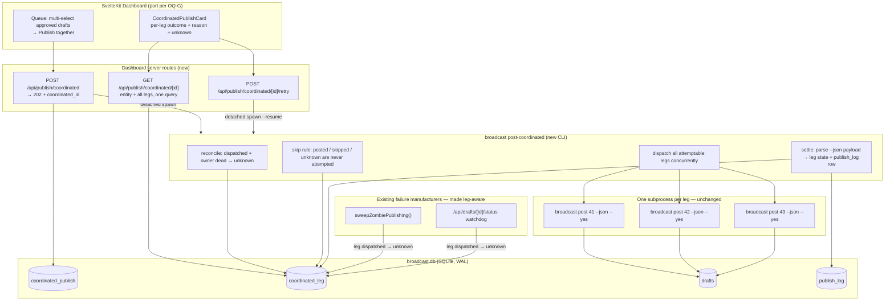
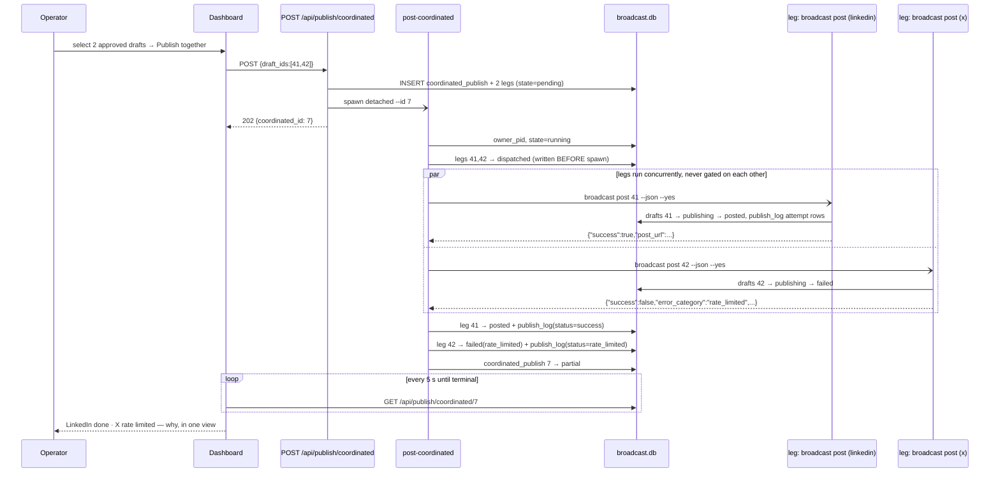
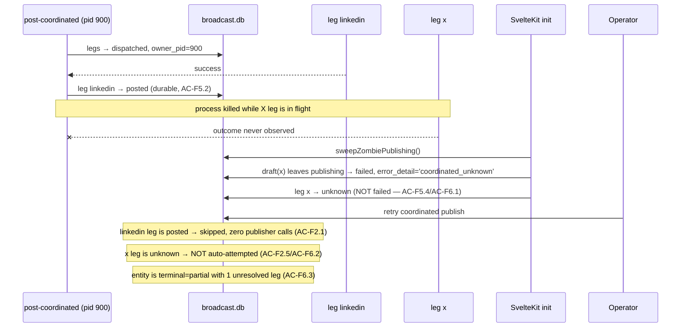
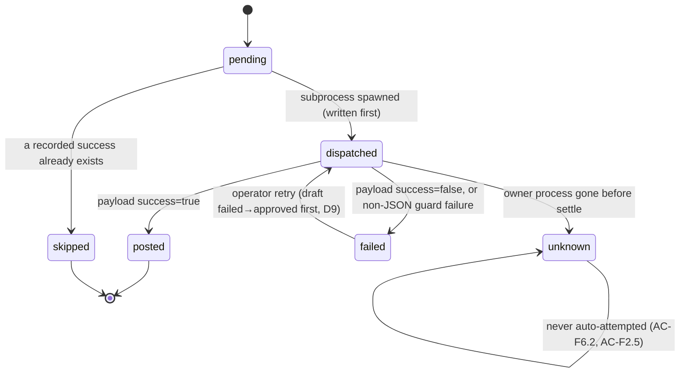

# TRD: Coordinated Multi-Platform Publish (F021)

**Version**: 1.1.0
**Status**: Draft
**Created**: 2026-08-15
**Last Updated**: 2026-08-15
**Author**: @technical-architect
**Source PRD**: `docs/modernization/runs/profile/herald/PRD.md` (v1.2.0, post-`/audit-prd`)
**Target project**: Herald, `/Users/james/dev/herald`
**Task ID Prefix**: `CPUB`

---

## Changelog

| Version | Date | Changes | Author |
|---------|------|---------|--------|
| 1.0.0 | 2026-08-15 | Initial TRD from PRD v1.2.0, grounded against Herald's code at `/Users/james/dev/herald` | @technical-architect |
| 1.1.0 | 2026-08-15 | `/refine-trd --auto`. **Phase 0** — every Open Question given a verdict; 8 left open as owner-only (OQ-1/2/3/4/5/8/10/A, plus new OQ-G), 4 answered from code (OQ-B/E/F, and OQ-C **struck** as already settled by PRD OQ-6), 1 default (OQ-D). OQ-10 added — it was cited in §3.6 but omitted from the table. **Phase 1** — no unsourced objective found and none removed; coverage floors (80/70) match `constitution.md` exactly and nothing exceeds them; §6.4 remains empty and no latency/throughput/uptime figure exists anywhere; every PRD AC-F\*/AC-N\* verified present. **Findings folded in from the grounding pass, each re-verified against Herald's code first:** §1.1 point 2 corrected (the existing post route gates its CLI spawn behind `if (!isStub)` and is *not* reusable as-is); D3's citation corrected while its conclusion stands (`linkedin.py:337,355` are dead under `cmd_post` — the justification is the *absence* of a correct row, not an unsanitized one); D12 rewritten around **three** exit shapes, not two (wrong-state and not-found do emit JSON at `EXIT_OK`; the daily-limit guard emits JSON *and* exits non-zero); **new D13** supplying the missing payload→column `error_category` mapping rule; §7.3's R1/TR1 contingency trigger corrected (`platforms.daily_count` is not derived from `publish_log`; the real exposure is `RateLimiter._query_count()` on the engagement/X paths); CPUB-T001's acceptance rescoped so it does not fail against a correct stub-mode implementation; CPUB-T004 narrowed to the TypeScript maps (Python is already equality-guarded); CPUB-B006/B011 acceptance tightened. **New conflict raised:** OQ-G — `constitution.md:51` says port 3100, the checkout serves 3200 and pins 3101; neither adopted, CPUB-T007 now derives the port from `playwright.config.ts` | `/refine-trd --auto` |

---

## 1. Overview

### 1.1 Technical Summary

A **coordination layer above `cmd_post`**, not inside it. Two new tables in `broadcast.db`
(`coordinated_publish`, `coordinated_leg`) hold the entity and its per-platform legs. A new
CLI subcommand `broadcast post-coordinated` owns execution: it dispatches **one
`broadcast post <draft-id> --json --yes` subprocess per leg, concurrently**, writes each
leg's state durably before and after dispatch, and never re-attempts a leg whose success is
already recorded. The dashboard gains a 202-handoff route, a poll route, and a
coordinated-publish view.

Three things drove the shape, and all three came from reading Herald rather than from the
corpus:

1. **`publish_log` cannot be the authority on "already succeeded" in live mode.**
   `retry_publish()` inserts each attempt row with `status='failed'` (`base.py:620-627`) and
   `_update_last_publish_log()` — the only updater on the success path (`base.py:646`) —
   sets `final_attempt`, `error_category` and `error_detail` and **never `status`**
   (`base.py:748-760`). `publish_log.success` is not in `_ALLOWED_PUBLISH_LOG_COLUMNS`
   (`broadcast_db.py:141-159`), so Python cannot write it either. A live publish therefore
   leaves zero rows with `status='success'`. The leg row is the authority (D2); the
   coordinator additionally writes the leg's own terminal `publish_log` row so the PRD's
   `publish_log`-worded criterion (AC-F2.3) is a real assertion rather than a vacuous one (D3).
2. **Per-leg process isolation is cheap, but the existing seam is not reusable as-is.** The
   dashboard shells out to `broadcast post <id> --json --yes`
   (`src/routes/api/drafts/[id]/post/+server.ts:150-165`) — **only in live mode**: the whole
   `execFileAsync` block sits inside `if (!isStub) { … }` (`post/+server.ts:140-190`), so
   under `HERALD_PUBLISHER_STUB=1` that route never spawns the CLI at all and takes an
   in-route logging path instead. What this TRD reuses is the *argv and env shape* of that
   call, not its control flow: the coordinated path spawns the CLI **unconditionally** and
   lets `cmd_post` take its own stub branch. `--dry-run` is not a substitute — `cmd_post`'s
   dry-run branch returns a synthetic success before any DB write (`cli.py:2287-2365`).
   Process-per-leg still makes AC-F4.2 and AC-F4.3 structural — separate processes, separate
   SQLite connections, no shared in-process state, nothing to serialise (D4) — but the stub
   divergence is a build instruction, not an inheritance (CPUB-B011).
3. **`drafts.status` must not be touched.** PRD R5 is verified present: the Python and
   TypeScript `VALID_TRANSITIONS` maps disagree today on the `posting` row
   (`broadcast_db.py:181` `{"posted","failed","partial_posted"}` vs `src/lib/db.ts:153`
   `['posted','failed','approved']`), and the cross-language test
   (`tests/integration/test_valid_transitions_consistency.py`) asserts key presence, not
   map equality — so the guardrail does not catch it. The unknown-outcome state lives only
   on `coordinated_leg.state` (D5), which is the contingency the PRD itself names.

### 1.2 Key Technical Decisions

| ID | Decision | Choice | Serves Objective | Rationale | Alternatives Considered |
|----|----------|--------|------------------|-----------|-------------------------|
| D1 | Coordinated identity | Two new tables in `broadcast.db`: `coordinated_publish` (entity + state) and `coordinated_leg` (one row per platform, `UNIQUE(coordinated_id, platform)`) | AC-F1.1, AC-F1.2, AC-F1.3, AC-F1.5, AC-F5.5, NFR-6 | One identifier, one entity state, N legs, all leg outcomes in one query by `coordinated_id`. `UNIQUE(coordinated_id, platform)` makes AC-F2.3's "per (coordinated publish, platform)" a schema invariant rather than a code convention. | (a) Overload `drafts.batch_id` — rejected by the PRD §9 (it means "one Scout run" and is filtered as a report date at `src/lib/server/db.ts:543`). (b) A single `drafts.coordinated_id` column with no entity row — gives grouping but no entity state, failing AC-F1.2. **Revisit** if queue grouping is ever re-modelled and `batch_id` loses its Scout-run meaning. |
| D2 | Authority on "recorded success" | `coordinated_leg.state = 'posted'` is the skip authority, read from the DB immediately before each dispatch | AC-F2.1, AC-F2.4, G2 | Verified: `retry_publish()` writes no `status='success'` row in live mode (§1.1), so `check_already_posted()` (`broadcast_db.py:896`) — the existing dedup guard, which queries exactly that — returns `None` after a real live post. Building the skip rule on it would be building on a blind check. | (a) Fix `_update_last_publish_log()` to set `status='success'` — rejected: PRD §1.5 declares `retry_publish()` unchanged, and the defect's blast radius is every single-platform publish, which is out of this feature's scope (see OQ-A). (b) Infer from `drafts.status='posted'` — rejected: a draft can reach `posted` outside a coordinated publish, so it is not evidence about *this* publish. **Revisit** if (a) is fixed under its own TRD; the leg row then becomes a cache rather than the sole authority. |
| D3 | `publish_log` writing | The coordinator writes **one terminal `publish_log` row per settled leg** (`status` = `success`/`failed`/`rate_limited`), sanitized, and stores its id on `coordinated_leg.publish_log_id` | AC-F2.3, AC-F3.2, AC-F7.1, AC-F7.2, NFR-5 | Makes AC-F2.3 verifiable as literally worded; makes AC-F7.1's "sanitized `error_detail` from its latest `publish_log` row" a row this feature wrote and sanitized. **Citation corrected (v1.1.0):** the earlier justification cited `linkedin.py:337,355`'s unsanitized `PublishLogRecorder` writes, but those lines are **dead under `cmd_post`** — `_resolve_publisher_with_stub` constructs `LinkedInPublisher(access_token, person_id, phantombuster_client)` with no `db` (`publishers/__init__.py:110-123`), and `LinkedInPublisher.__init__` leaves `_log_recorder = None` unless `db` is passed (`linkedin.py:265-281`). The real justification is *absence*, not contamination: on the live `cmd_post` path there is **no** correct terminal row to read at all (§1.1 point 1), so the coordinator must write one. The conclusion is unchanged and strengthened. Side effect, stated deliberately: `check_already_posted()` becomes correct for coordinated legs, where it is currently blind in live mode. | (a) Write nothing and read `retry_publish`'s rows — rejected: those rows say `failed` even on success. (b) Write a row per *attempt* — rejected: duplicates what `retry_publish` already writes and would inflate `RateLimiter._query_count()` for the paths that do consult it (see §7.3). **Revisit** if D2's alternative (a) lands and `retry_publish`'s own row becomes correct. |
| D4 | Leg execution model | One `subprocess.Popen(["broadcast","post",<draft_id>,"--json","--yes"])` per leg, all spawned before any is awaited | AC-F4.2, AC-F4.3, AC-F5.1 | Separate OS processes with separate SQLite connections: no leg can gate, serialise behind, or corrupt another. Reuses `cmd_post()` verbatim — its dedup guard, media guard, per-platform daily-limit guard, `retry_publish` and publisher resolution are all inherited unchanged. Also removes PRD R7's exposure by construction: nothing is queued, so no leg sits in `publishing` without writing a `publish_log` row. | (a) Threads inside one Python process — rejected: `BroadcastDB` holds one `sqlite3` connection (`broadcast_db.py:230`) and `retry_publish` writes through it; sharing it across threads is a correctness hazard for no gain. (b) Orchestrate from the SvelteKit server — rejected: F5's resume needs an owner that is re-invocable without a browser, and it would put publish orchestration on the side of the seam `TRD-publisher-rearchitecture.md` §1.1 kept it off. **Revisit** if leg count ever exceeds a handful and process-per-leg becomes wasteful. |
| D5 | Unknown-outcome representation | A sixth `coordinated_leg.state` value, `unknown`. `drafts.status`, its CHECK constraint, and all three `VALID_TRANSITIONS` maps are left untouched | AC-F6.1, AC-F6.2, AC-F6.3, NFR-9, mitigates R5 | This is the PRD's own R5 contingency. The drift R5 warns about is verified present *today* (§1.1), so adding a status is adding a state to a map set that is already inconsistent and whose guard test does not compare maps. | (a) `drafts.status = 'unknown'` — rejected as above; also requires the drafts-table recreation dance in `_add_publishing_status()` (`migrations.py:1240`). (b) Reuse `partial_posted` — rejected: it is set only by the X thread publisher (`x_publisher.py:503`) and is terminal in all three maps; overloading it would corrupt `engine/dedup.py:48`'s reading of active statuses. **Revisit** if a TRD ever reconciles the three maps and adds an equality test. |
| D6 | Crash detection | `coordinated_publish.owner_pid` + `owner_host`; on resume or dashboard startup, a leg in `dispatched` whose owner process is not alive becomes `unknown` — never `failed` | AC-F5.2, AC-F5.3, AC-F6.1, AC-F5.4 | Minimal, stdlib (`os.kill(pid, 0)`), no heartbeat and no timer. A leg is only reconciled when the thing that could still settle it is provably gone. | (a) A heartbeat column with a staleness threshold — rejected: it needs a threshold nobody has stated, which would be an invented objective (see OQ-5). (b) "Any `dispatched` leg at coordinator start is unknown" — rejected: wrong if two coordinated publishes overlap. **Revisit** if PID reuse is ever observed to cause a false-live reading (see Could Not Verify). |
| D7 | Schema delivery | `CREATE TABLE IF NOT EXISTS` DDL added to `src/db/schema.sql` only. No new function in `src/db/migrations.py` | NFR-7, AC-N7 | Verified both runtimes exec `schema.sql` idempotently on every connection: Python at `BroadcastDB.__init__` (`broadcast_db.py:193-196`), TypeScript at `getDb()` (`src/lib/server/db.ts:117-118`). New *tables* therefore need no ALTER path and no migration function — the migration machinery in `migrations.py` exists for altering tables that already have rows, which does not apply here. | (a) An `apply_f021_migration()` alongside the F014–F016 functions — rejected: it would be delivery machinery serving nothing, since `IF NOT EXISTS` already covers both fresh and existing databases. **Revisit** the moment this feature needs to alter an existing table. |
| D8 | Dashboard handoff | `POST /api/publish/coordinated` spawns the coordinator **detached** (`spawn(..., {detached:true, stdio:'ignore'}).unref()`) and returns **202** with the coordinated id; the view polls `GET /api/publish/coordinated/[id]` every 5 s until the entity is terminal | AC-F1.3, AC-F3.1, AC-F5.1 | PRD §10.1 D1: F016's 202/polling architecture is specified in the corpus and **not built** — `claimDraftForPublishing()` has no non-test caller, `DraftCard.svelte` does not poll, and `/api/drafts/[id]/post` awaits `execFile` synchronously. Coordinated legs can outlive a synchronous request (PhantomBuster's poll ceiling alone is 120 s, `phantombuster.py:83`), so the handoff is required here, scoped to coordinated publishes. The 5 s interval is F016's recorded decision, quoted in NG8, and already documented on `/api/drafts/[id]/status`. | (a) Await the coordinator synchronously — rejected: gives no per-leg progress for AC-F3.1 and re-creates the long-request problem. (b) SSE/WebSocket — rejected by NG8. **Revisit** per NG8's own condition: if coordinated publishes routinely outlive the client's polling window, making polling lossy rather than merely chatty. |
| D9 | Retry path through the status graph | Before re-dispatching a `failed` leg, the coordinator transitions the draft `failed` → `approved`, then lets `cmd_post` claim it | AC-F2.1, NFR-9 | Verified: no map has a `failed → publishing` edge — all three have `failed → approved` (`broadcast_db.py:182`, `src/lib/db.ts:155`, `src/lib/server/db.ts:283`), contradicting F016 AC-33 (PRD §10.1 D3). Using the edge that exists keeps D5's "touch nothing" promise. | (a) Add the `failed → publishing` edge — rejected: that is a change to all three maps, i.e. exactly R5. (b) `forceDraftStatus()` — rejected: it bypasses the transition graph, and using it for a routine path (rather than the spawn-failure/watchdog paths it documents) would hide real invalid transitions. **Revisit** if a TRD reconciles the maps and implements AC-33. |
| D10 | Sweep and watchdog reconciliation | Both `sweepZombiePublishing()` and the `/api/drafts/[id]/status` watchdog gain a leg-aware branch: for a draft that is a `dispatched` coordinated leg, set the **leg** to `unknown` and write the draft's `error_detail='coordinated_unknown'`, `error_category='unknown'`. The draft still leaves `publishing` (the zombie is still cleared); the coordinated view and the retry path read the leg | AC-F5.4, AC-F5.6, AC-F6.1, mitigates R1 | The PRD is explicit that both mechanisms must be *given a third destination*, not weakened — a zombie that never clears is the failure they exist for. Marking the leg is that third destination. Verified the sweep's SQL has no age predicate at all (`src/lib/server/db.ts:1044-1054`), so it catches publishes that began moments before the restart. | (a) Exclude coordinated legs from the sweep entirely — rejected: leaves a genuinely dead leg stuck in `publishing` forever, which is the exact failure F016 built the sweep for. (b) Add the age predicate F016 designed — rejected: out of scope, and a coordinated leg's correct destination is `unknown` at *any* age. **Revisit** if a TRD ever fixes the sweep's missing age predicate (PRD §10.1 D2). |
| D11 | Retry-affordance suppression | For a draft whose coordinated leg is `unknown`, the ordinary single-draft post action is disabled and replaced by the coordinated view's explicit-resolution affordance | AC-F5.4, AC-F6.2, AC-F6.4 | Without this, D10 leaves the draft reading `failed` in the ordinary queue, where one press re-posts a possibly-succeeded leg — the double-post requirement 2 forbids absolutely. This is the PRD's stated R1 contingency. | (a) Rely on the coordinated view alone — rejected: the queue view still renders the draft and still offers the action. **Revisit** never, while a leg can be `unknown`. |
| D12 | Error classification from the CLI | **Payload first, exit code never.** If stdout parses as JSON, the payload decides the leg outcome *regardless of the exit code*. Only when stdout has no parseable JSON does the coordinator fall back to `failed` with the sanitized stderr tail | AC-F3.2, AC-F7.2, AC-F1.4 | **Corrected in v1.1.0 — `cmd_post` has three exit shapes, not two.** (i) *JSON + `EXIT_OK`*: the normal success/failure payload (`cli.py:2622-2672`, the `TR15` comment), and also **not-found** (`cli.py:2429-2452`) and **wrong-state** (`cli.py:2465-2492`), which both print full JSON and return `EXIT_OK` — the previous draft wrongly filed these as stderr-only. (ii) *JSON + non-zero exit*: the **daily-limit** guard prints a JSON object to stdout **and** returns `EXIT_USER_ERROR` (`cli.py:2547-2570`) — a shape the old two-shape table had no row for, and the reason the exit code cannot gate parsing. (iii) *stderr only, non-zero exit, no JSON*: dedup guard (`:2492-2503`), media guard (`:2505-2516`), platform-not-found (`:2521-2529`), publisher-init failure (`:2570-2579` — how a live Reddit leg fails, `publishers/__init__.py:76-80`), and `update_draft_status` failure (`:2585-2595`). This is also what makes AC-F1.4 work without name special-casing: a Reddit leg is just a leg whose publisher refuses. | (a) Trust the exit code — rejected, it is 0 on publish failure *and* non-zero on a fully-classified daily-limit result. (b) Special-case Reddit in the coordinator — rejected, violates AC-F1.4. **Revisit** if `cmd_post` is ever made to emit JSON on all exit paths. |
| D13 | Payload `error_category` → column mapping | The coordinator maps an unrecognised payload `error_category` to `'unknown'` and preserves the original token verbatim at the head of `error_detail` | AC-F3.2, AC-F7.1, CPUB-B006 | **New in v1.1.0.** `coordinated_leg.error_category`'s CHECK copies `publish_log`'s six-value taxonomy (`schema.sql:126-130`), but `cmd_post --json` emits three values outside it: `not_found` (`cli.py:2333`, `:2444`), `wrong_state` (`cli.py:2473`) and `system_error` (`cli.py:2308`, `:2390`, `:2418`). A literal payload-to-column copy is rejected by SQLite, so a mapping rule is not optional — the previous draft specified none. Mapping to `'unknown'` keeps §3.1's schema-level taxonomy guarantee intact; preserving the token in `error_detail` keeps the reason readable for AC-F3.2. | (a) Widen the CHECK to nine values — rejected: it breaks the "mirrors the existing taxonomy exactly" property §3.1 relies on, and `not_found`/`wrong_state` are coordinator-detectable states rather than publish outcomes. (b) Drop the CHECK — rejected: it is what makes AC-F3.2 structural. **Revisit** if `publish_log.error_category`'s own CHECK is ever widened; the two must stay identical. |

**Note on inherited provenance.** The design corpus indexed for this run is
**ensemble-vnext's** (`docs/TRD/ensemble-vnext.md`, `runtime-refresh.md`,
`discipline-judgment.md`, …). None of its decisions bear on Herald: different product,
different runtime, different stack. What was inherited from it is *convention only* — the
`[PREFIX]-[CATEGORY][SEQ]` task-ID form, the decision-table shape, and the `[LIVE]` marker.
The design corpus that actually constrains this TRD is **Herald's**, and the PRD has already
reconciled it against Herald's code in its §10.1; every decision above that cites a corpus
document cites it through a verified code reading, never through the document alone. This is
a deliberate departure recorded here rather than left implicit.

### 1.3 Technology Stack

| Layer | Technology | Purpose | Notes |
|-------|------------|---------|-------|
| Coordinator | Python 3.9+, stdlib only (`subprocess`, `sqlite3`, `os`, `json`) | `broadcast post-coordinated` — dispatch, leg state, resume, reconciliation | NFR-4: no new pip dependency. `subprocess` and `sqlite3` are stdlib |
| Data | SQLite (`broadcast.db`), WAL, `busy_timeout=5000` | Coordinated publish + leg state | NFR-6/NFR-7. Both runtimes already set WAL + 5 s busy timeout (`broadcast_db.py:236-238`, `src/lib/server/db.ts:107-110`) |
| Dashboard server | SvelteKit 2 + `better-sqlite3` | 202 handoff, poll endpoint, retry endpoint, sweep/watchdog reconciliation | Existing stack |
| Dashboard UI | Svelte 5 + Tailwind | Coordinated publish view, multi-select publish action | Existing stack |
| Tests (Python) | pytest | Unit + integration for coordinator, schema, skip rule, restart | `tests/unit/`, `tests/integration/` |
| Tests (TS) | vitest | Unit for routes, sweep/watchdog, read layer | `src/lib/__tests__/`, `src/routes/__tests__/` |
| Tests (E2E) | Playwright | Live dashboard verification | `tests/e2e/`. NFR-3 says localhost:3100; **the checkout disagrees** — see OQ-G. The spec takes its port from `playwright.config.ts`'s `E2E_PORT`, never a literal |

Nothing new is introduced. Every row is a technology Herald already runs.

### 1.4 Integration Points

| System | Type | Direction | Notes |
|--------|------|-----------|-------|
| `broadcast post <id> --json --yes` (`cli.py:2242` `cmd_post`) | Subprocess, JSON on stdout | Out | The per-leg execution unit. Unchanged. Payload is the source of truth for the leg outcome (D12) |
| `retry_publish()` (`base.py:541`) | In-process, inside each leg subprocess | — | Unchanged. NG6: per-attempt retry policy is not altered |
| `RateLimiter` (`rate_limiter.py`) / `platforms.daily_limit` | SQLite read | In | Consulted by `cmd_post` inside each leg. The coordinator adds no rate-limit check of its own (see OQ-B). **AC-F4.4's inherited "enforced atomically per F016 AC-20" is false of the path this feature reuses** (verified, audit v1.2.0): `cmd_post` reads `platform_row["daily_count"]` at `cli.py:2540` and compares at `:2545` — read-then-check — then advances with `db.increment_platform_count()` at `:2609`. `BroadcastDB.atomic_increment_daily_count()` (`broadcast_db.py:1033`) exists but has **no caller in `src/`**, only in `tests/unit/test_broadcast_db.py`. AC-F4.4's requirement (a daily-limit block fails only its own leg) still holds and is what CPUB-T003 tests; only the atomicity clause is inherited-and-untrue, and nothing in this design depends on it — coordinated legs are one per platform (`UNIQUE(coordinated_id, platform)`, D1) and cannot race each other for the same counter |
| `publish_log` | SQLite write | Out | One terminal row per settled leg, written by the coordinator (D3) |
| `sweepZombiePublishing()` (`src/lib/server/db.ts:1044`) | SQLite write, on SvelteKit `init` | Both | Gains a leg-aware branch (D10) |
| `GET /api/drafts/[id]/status` watchdog | HTTP + SQLite write | Both | Gains the same leg-aware branch (D10) |
| `_sanitize_for_log()` (`base.py:102`) | In-process | — | The named sanitizer for everything this feature surfaces (AC-F7.2, NFR-5 / AC-N5). Scope of NFR-5 here is `error_detail` only: `publish_log.request_data` has no Python write path (`_ALLOWED_PUBLISH_LOG_COLUMNS` omits it, `broadcast_db.py:141-159`) and is written solely from TypeScript (`src/lib/db.ts:758`, `src/lib/server/db.ts:1279`), neither of which this feature touches — see §6.3 |

---

## 2. System Architecture

### 2.1 Architecture Overview



### 2.2 Component Architecture

#### 2.2.1 `coordinated_publish` / `coordinated_leg` (schema)

**Responsibility**: Durable identity and state for the entity and each platform leg. The
single source of truth for the skip rule and for what the dashboard renders.
**Interfaces**: SQL. Read by both runtimes.
**Dependencies**: `drafts`, `publish_log` (foreign keys).

#### 2.2.2 `broadcast post-coordinated` (Python CLI)

**Responsibility**: Create-or-resume a coordinated publish; reconcile stale legs; apply the
skip rule; dispatch attemptable legs concurrently; settle each leg from its subprocess's
JSON payload; recompute the entity's state.
**Interfaces**: CLI args + `--json` result on stdout; `coordinated_*` tables; `publish_log`.
**Dependencies**: `BroadcastDB`, `_sanitize_for_log()`, the `broadcast post` subcommand.
**Explicitly not a dependency**: the publishers, `retry_publish`, `RateLimiter` — all
reached only through the leg subprocess.

#### 2.2.3 Coordinated read layer (TypeScript)

**Responsibility**: One query returning the entity and all its legs (AC-F1.3), plus the
leg-aware branch used by the sweep and the watchdog.
**Interfaces**: functions exported from `src/lib/server/db.ts`.
**Dependencies**: `better-sqlite3`, the two new tables.

#### 2.2.4 Coordinated publish routes

**Responsibility**: 202 handoff on create and on retry; poll payload; nothing else. No
publish logic lives here.
**Dependencies**: the read layer; `child_process.spawn`.

#### 2.2.5 `CoordinatedPublishCard.svelte`

**Responsibility**: Render every leg with platform, outcome and reason; render `unknown`
visibly distinct from `failed` with a statement of what is unknown and what the operator can
do; poll while the entity is non-terminal; offer retry.
**Dependencies**: the poll route. Reuses the existing per-platform error vocabulary and the
re-auth banner from F016 §F16.7.

### 2.3 Data Flow — happy path with one throttled leg



### 2.4 Data Flow — restart mid-publish



### 2.5 State Management

**Leg state machine** (`coordinated_leg.state`):



**Entity state** (`coordinated_publish.state`), recomputed after every leg settle:

| Condition | State | Terminal |
|---|---|---|
| any leg `pending` or `dispatched` | `running` | no |
| every leg `posted` or `skipped` | `complete` | yes |
| ≥1 `posted` and ≥1 not | `partial` | yes |
| no leg `posted` | `failed` | yes |

An `unknown` leg never prevents a terminal state (AC-F6.3); the entity carries an
`unresolved_legs` count derived from the leg rows so the view can say so.

---

## 3. Technical Specifications

### 3.1 Schema

**Purpose**: Durable coordinated identity and leg state, local to `broadcast.db`.

Appended to `src/db/schema.sql`, executed idempotently by both runtimes (D7):

```sql
CREATE TABLE IF NOT EXISTS coordinated_publish (
    id            INTEGER PRIMARY KEY AUTOINCREMENT,
    state         TEXT    NOT NULL DEFAULT 'pending'
                      CHECK(state IN ('pending','running','complete','partial','failed')),
    owner_pid     INTEGER,
    owner_host    TEXT,
    created_at    TEXT    NOT NULL,
    updated_at    TEXT,
    completed_at  TEXT
);

CREATE TABLE IF NOT EXISTS coordinated_leg (
    id              INTEGER PRIMARY KEY AUTOINCREMENT,
    coordinated_id  INTEGER NOT NULL REFERENCES coordinated_publish(id),
    draft_id        INTEGER NOT NULL REFERENCES drafts(id),
    platform        TEXT    NOT NULL,
    state           TEXT    NOT NULL DEFAULT 'pending'
                        CHECK(state IN ('pending','dispatched','posted',
                                        'failed','unknown','skipped')),
    error_category  TEXT    CHECK(error_category IS NULL OR error_category IN (
                                'rate_limited','auth_expired','network_error',
                                'server_error','daily_limit','unknown')),
    error_detail    TEXT,
    attempts        INTEGER NOT NULL DEFAULT 0,
    post_url        TEXT,
    post_id         TEXT,
    publish_log_id  INTEGER REFERENCES publish_log(id),
    dispatched_at   TEXT,
    settled_at      TEXT,
    UNIQUE(coordinated_id, platform)
);

CREATE INDEX IF NOT EXISTS idx_coordinated_leg_publish ON coordinated_leg(coordinated_id);
CREATE INDEX IF NOT EXISTS idx_coordinated_leg_draft   ON coordinated_leg(draft_id);
CREATE INDEX IF NOT EXISTS idx_coordinated_leg_state   ON coordinated_leg(state);
```

**Behavior**:
- `error_category` mirrors the existing `publish_log.error_category` taxonomy exactly
  (`schema.sql:126-130`), so AC-F3.2's "derived from the existing taxonomy" is a schema-level
  guarantee. **It is therefore narrower than what `cmd_post --json` emits** — `not_found`,
  `wrong_state` and `system_error` all appear in the payload and none is in this list. D13's
  mapping rule is what stands between the payload and this column; a literal copy is rejected
  by SQLite.
- `UNIQUE(coordinated_id, platform)` is what makes AC-F2.3 structural.
- `platform` is a plain column with no CHECK — AC-F1.4: the platform set is data. A deferred
  platform is representable without the coordinator naming it.

**Error Handling**:
- Duplicate leg insert (same platform twice in one selection): rejected by the UNIQUE
  constraint; the create route returns 400 with the offending platform named.
- FK to a non-existent draft: rejected by `PRAGMA foreign_keys=ON`, already set by both
  runtimes.

### 3.2 `broadcast post-coordinated`

**Purpose**: Own the lifecycle of one coordinated publish.

**Interface**:

```
broadcast post-coordinated --drafts <id,id,...> [--json]     # create and run
broadcast post-coordinated --id <coordinated_id> [--json]    # run / resume an existing one
```

Result payload on stdout under `--json`:

```typescript
interface CoordinatedResult {
  coordinated_id: number;
  state: 'complete' | 'partial' | 'failed' | 'running';
  legs: Array<{
    draft_id: number;
    platform: string;
    state: 'pending' | 'dispatched' | 'posted' | 'failed' | 'unknown' | 'skipped';
    error_category: string | null;
    error_detail: string | null;   // sanitized via _sanitize_for_log()
    attempts: number;
    post_url: string | null;
  }>;
  unresolved_legs: number;         // count of state === 'unknown'
}
```

**Behavior**, in order:

1. **Reconcile** (D6). For every leg of this publish in `dispatched`, if
   `coordinated_publish.owner_pid` is set and that process is not alive, set the leg to
   `unknown`, `settled_at = now`. Never to `failed`.
2. **Claim.** Write `owner_pid`, `owner_host`, `state='running'`.
3. **Select attemptable legs.** A leg is attemptable iff its state, **re-read from the
   database at this moment** (AC-F2.4), is `pending` or `failed`. `posted`, `skipped` and
   `unknown` are never attemptable (AC-F2.1, AC-F2.5, AC-F6.2).
4. **Second guard.** For each attemptable leg, if `check_already_posted(draft_id, platform)`
   returns a row, set the leg to `skipped` and do not dispatch. (Belt-and-braces on top of
   D2; it is the existing guard and it is correct whenever a success row exists.)
5. **Empty set → success.** If no leg is attemptable, recompute the entity state, emit the
   payload, exit 0. Zero publisher calls, not an error (AC-F2.2).
6. **Prepare each attemptable leg.** If the draft is in `failed`, transition it to `approved`
   via `BroadcastDB.update_draft_status` (D9). Write leg `state='dispatched'`,
   `dispatched_at=now`, `attempts = attempts + 1` — **before** the subprocess is spawned, so
   the crash window is always represented (AC-F5.1).
7. **Dispatch all legs, then await all.** `subprocess.Popen` for every leg first; only then
   collect. No leg's spawn waits on another leg's completion (AC-F4.3).
8. **Settle each leg** from its payload (D12), writing the terminal `publish_log` row (D3)
   and then the leg row, sanitizing `error_detail` through `_sanitize_for_log()` and mapping
   the payload's `error_category` through D13 before it reaches the column.
9. **Recompute entity state** per §2.5 and set `completed_at` when terminal.

**Error Handling**:

The table is keyed on **whether stdout parsed**, never on the exit code (D12).

| Case | Leg outcome | Rationale |
|---|---|---|
| Payload `success:true` (exit 0) | `posted`, `publish_log.status='success'`, `post_url`/`post_id` captured | The outcome was observed |
| Payload `success:false` with an in-taxonomy `error_category` — `rate_limited`, `auth_expired`, `network_error`, `server_error`, `daily_limit`, `unknown` (exit 0) | `failed` with that category; `publish_log.status` = `rate_limited` when the category is `rate_limited`, else `failed` | `cmd_post` exits 0 in `--json` mode on publish failure; the payload is the signal (D12) |
| Payload `success:false` with an **out-of-taxonomy** `error_category` — `not_found` (`cli.py:2333`, `:2444`), `wrong_state` (`:2473`), `system_error` (`:2308`, `:2390`, `:2418`). All three exit `EXIT_OK` | `failed`, `error_category='unknown'` per D13, original token preserved at the head of `error_detail` | The CHECK constraint admits six values; these three are not among them. A literal copy raises `IntegrityError` |
| Payload present **with a non-zero exit** — the daily-limit guard prints JSON to stdout and returns `EXIT_USER_ERROR` (`cli.py:2547-2570`) | `failed`, `error_category='daily_limit'` — classified from the payload exactly as if it had exited 0 | The third exit shape. Its payload is also **reduced** — only `success`, `draft_id`, `platform`, `error_category`, `attempts`, `timestamp`; no `stub`, `post_url`, `post_id`, `error` or `rate_limited`. The parser must treat every key but `success` as optional |
| Non-zero exit, **no** parseable JSON — dedup guard (`:2492-2503`), media guard (`:2505-2516`), platform-not-found (`:2521-2529`), publisher-init failure incl. a live Reddit leg (`:2570-2579`), `update_draft_status` failure (`:2585-2595`) | `failed`, `error_category='unknown'`, `error_detail` = sanitized tail of stderr | These are the only genuinely JSON-less paths. Note that **wrong-state and not-found are NOT among them** — both emit full JSON (corrected in v1.1.0) |
| `Popen` raises before the child exists | leg returns to `pending` (never dispatched, nothing could have been sent) | Nothing reached a platform |
| Child killed / coordinator dies after spawn | leg stays `dispatched`; becomes `unknown` at the next reconcile | The remote outcome is genuinely unobserved (AC-F6.1) |
| A leg's `broadcast post` writes a `SQLITE_BUSY` failure | that leg fails on its own terms; other legs are unaffected | Separate processes, separate connections (D4); WAL + `busy_timeout=5000` already configured |

**What this command deliberately does not do**: it performs no rate-limit check, no dedup
content check, no media check and no publisher resolution. Every one of those already runs
inside `cmd_post`, per platform, and re-implementing any of them would both duplicate logic
and risk introducing the cross-platform aggregation NG4 forbids (AC-F4.5).

### 3.3 Coordinated read layer (TypeScript)

**Purpose**: AC-F1.3 in one query, and the leg-aware branch D10 needs.

```typescript
export interface CoordinatedLegRow {
  draft_id: number;
  platform: string;
  state: 'pending' | 'dispatched' | 'posted' | 'failed' | 'unknown' | 'skipped';
  error_category: string | null;
  error_detail: string | null;
  attempts: number;
  post_url: string | null;
}

export interface CoordinatedPublishRow {
  id: number;
  state: 'pending' | 'running' | 'complete' | 'partial' | 'failed';
  unresolved_legs: number;
  legs: CoordinatedLegRow[];
}

/** AC-F1.3 — every leg's platform, outcome and reason from the entity id alone. */
export function getCoordinatedPublish(
  id: number, db?: Database.Database
): CoordinatedPublishRow | null;

/** Create the entity and its legs from a draft selection. Throws on duplicate platform. */
export function createCoordinatedPublish(
  draftIds: number[], db?: Database.Database
): number;

/**
 * D10 — used by both the startup sweep and the poll watchdog.
 * For a draft that is a `dispatched` coordinated leg: set the leg to `unknown`
 * and return true. Returns false when the draft is not such a leg.
 */
export function reconcileCoordinatedLeg(
  draftId: number, db?: Database.Database
): boolean;
```

**Behavior**: `getCoordinatedPublish` issues one statement per table (entity, legs) inside a
single call; no caller ever correlates `publish_log` rows by hand (AC-F1.3).

**Error Handling**: unknown id → `null` → route returns 404. Missing tables (a database
predating this feature and opened without executing `schema.sql`) → the call throws;
`getDb()` execs `schema.sql` on every connection, so this is unreachable in practice and is
asserted by a test rather than defended in code.

### 3.4 Dashboard routes

**Purpose**: The 202 handoff (D8) and the poll payload.

```
POST /api/publish/coordinated
  body  { draft_ids: number[] }
  202   { coordinated_id: number }
  400   { error: 'draft_ids required' | 'duplicate platform: x' | 'draft N is not approved' }
  500   { error: 'internal server error' }

GET /api/publish/coordinated/[id]
  200   CoordinatedPublishRow
  400   { error: 'invalid id' }
  404   { error: 'Coordinated publish N not found' }

POST /api/publish/coordinated/[id]/retry
  202   { coordinated_id: number }
  404   { error: 'Coordinated publish N not found' }
```

**Behavior**:
- Create validates every draft is `approved` and that no platform appears twice, inserts the
  entity and legs in one transaction, then spawns the coordinator detached and returns 202
  **without awaiting it**.
- Retry spawns `post-coordinated --id <id>` detached. It never filters legs itself — the skip
  rule lives in one place, the coordinator (§3.2 steps 3–5).
- **In `HERALD_PUBLISHER_STUB=1` the spawn still happens.** The leg subprocesses take
  `cmd_post`'s own stub path, which is what makes the whole flow testable without real posts
  (NFR-2). This is a deliberate departure from
  `src/routes/api/drafts/[id]/post/+server.ts`, which gates its entire `execFileAsync` block
  behind `if (!isStub)` (`:140-190`) and therefore never spawns the CLI in stub mode. Copying
  that route's stub handling would silently defeat every stub-mode test of this feature —
  CPUB-B011 must not inherit it. The spawn must also inherit the parent environment
  unscrubbed: `HERALD_PUBLISHER_STUB` and `HERALD_DB_PATH` reach the leg only that way
  (`publishers/__init__.py:82`, `base.py:601`, `src/lib/server/db.ts:65-66`).

**Error Handling**: a failed spawn returns 500 and leaves the entity in `pending`, which the
next retry picks up — no leg was dispatched, so nothing can have been sent.

### 3.5 `CoordinatedPublishCard.svelte`

**Purpose**: AC-F3.1–F3.5, AC-F6.4, AC-F7.1.

**Behavior**:
- One row per leg: platform, outcome, and for a failure the human-readable reason mapped from
  `error_category` plus the sanitized `error_detail` and attempt count.
- `unknown` renders with its own treatment — not the failure treatment — and states what is
  unknown ("this leg was sent but the result was never recorded; it may or may not have
  posted") and what the operator can do. It offers no one-press retry.
- Polls `GET /api/publish/coordinated/[id]` every 5 s while the entity state is `pending` or
  `running`; stops on any terminal state. No client-side deadline is introduced.
- Retry button is present when at least one leg is `failed`; absent when the only
  non-`posted` legs are `unknown`.

**Error Handling**: a poll that fails leaves the last-known render in place and retries on the
next tick; a 404 stops polling and shows the entity as unavailable.

### 3.6 Sweep and watchdog reconciliation

**Purpose**: AC-F5.4 and AC-F5.6 — give both existing "failure manufacturers" a third
destination (D10).

**Behavior**:
- `sweepZombiePublishing()`: before the existing `UPDATE`, collect the ids of `publishing`
  drafts that are `dispatched` coordinated legs. For those, call `reconcileCoordinatedLeg()`
  and write `error_detail='coordinated_unknown'`, `error_category='unknown'` instead of
  `error_detail='server_restart'`. All other `publishing` drafts are swept exactly as today.
- `/api/drafts/[id]/status`: when the 180 s watchdog fires for a draft that is a `dispatched`
  coordinated leg, call `reconcileCoordinatedLeg()` and use `'coordinated_unknown'` as the
  `error_detail` passed to `forceDraftStatus`. The 180 s threshold is **not changed** — no
  measurement exists to justify a different number (PRD OQ-10).
- `DraftCard`: a draft carrying `error_detail='coordinated_unknown'` renders as unresolved and
  its post action is disabled (D11).

**Error Handling**: `reconcileCoordinatedLeg()` returning `false` (not a coordinated leg) is
the normal single-platform case and takes the existing path unchanged.

---

## 4. Master Task List

### 4.1 Task ID Convention

`CPUB-[CATEGORY][SEQ]` — `P` infrastructure/schema, `B` backend, `F` frontend, `T` testing,
`I` integration. `[LIVE]` marks tasks whose verification requires the running dashboard with
`HERALD_PUBLISHER_STUB=1` (NFR-2, NFR-3) on **the dashboard's configured dev port** — which
in this checkout is not 3100 (OQ-G).

### 4.2 Phase 1: Durable state

| Task ID | Description | Serves | Skills | Dependencies | Acceptance Criteria |
|---------|-------------|--------|--------|--------------|---------------------|
| CPUB-P001 | Append `coordinated_publish` + `coordinated_leg` DDL and three indexes to `src/db/schema.sql` (§3.1). No migration function (D7) | D1, D7, NFR-7, AC-N7 | | None | Both runtimes create the tables on a fresh **and** an existing database by executing `schema.sql` alone; re-execution is a no-op; `UNIQUE(coordinated_id, platform)` and both CHECK constraints are enforced |
| CPUB-B001 | `BroadcastDB` methods: create entity + legs, read entity with legs, update leg state/outcome, recompute entity state per §2.5 | D1, AC-F1.1, AC-F1.2, AC-F5.1, AC-F5.5 | `developing-with-python` | CPUB-P001 | An N-platform selection yields one entity and N legs; entity state follows §2.5 exactly including the `unknown`-does-not-block rule; all writes land in `broadcast.db` and nowhere else |
| CPUB-B002 | TypeScript read/create/reconcile layer in `src/lib/server/db.ts` per §3.3 | AC-F1.3, D10 | `developing-with-typescript` | CPUB-P001 | `getCoordinatedPublish(id)` returns platform, outcome and reason for every leg with no caller-side correlation of `publish_log`; `reconcileCoordinatedLeg` flips only `dispatched` legs and only to `unknown` |

### 4.3 Phase 2: Coordinator

| Task ID | Description | Serves | Skills | Dependencies | Acceptance Criteria |
|---------|-------------|--------|--------|--------------|---------------------|
| CPUB-B003 | `post-coordinated` subcommand: argparse wiring, create-or-resume, entity claim (`owner_pid`/`owner_host`), `--json` payload per §3.2 | D4, AC-F1.1, AC-F1.3 | `developing-with-python` | CPUB-B001 | `--drafts` creates and runs; `--id` resumes; the payload shape matches §3.2 |
| CPUB-B004 | Skip rule (§3.2 steps 3–5): attemptable set read from the DB at dispatch time; `posted`/`skipped`/`unknown` never attempted; empty set exits 0 with zero publisher calls | AC-F2.1, AC-F2.2, AC-F2.4, AC-F2.5, D2 | `developing-with-python` | CPUB-B003 | Succeeded legs produce zero `Popen` calls; a fully succeeded publish retried is a no-op success; the decision is unaffected by anything held in process memory |
| CPUB-B005 | Concurrent dispatch (§3.2 steps 6–7): leg marked `dispatched` and `attempts` incremented **before** spawn; `failed`→`approved` draft transition (D9); all legs spawned before any is awaited | D4, D9, AC-F4.3, AC-F5.1 | `developing-with-python` | CPUB-B004 | No leg's spawn is ordered after another leg's completion; the `dispatched` row is committed before the child exists; no `VALID_TRANSITIONS` map is modified |
| CPUB-B006 | Leg settle (§3.2 step 8) and the three-shape error-classification table in §3.2: parse decided by stdout not exit code, D13 category mapping, non-JSON fallback, sanitized `error_detail` via `_sanitize_for_log()` | D12, D13, AC-F3.2, AC-F7.1, AC-F7.2, NFR-5 | `developing-with-python` | CPUB-B005 | All five rows of §3.2's table exercised, including the daily-limit JSON-with-non-zero-exit shape and its reduced key set; `not_found`/`wrong_state`/`system_error` payloads settle to `error_category='unknown'` with the token preserved in `error_detail` and **no `IntegrityError`**; a live Reddit leg fails as an ordinary leg with a readable reason and no name special-casing; every string written to `coordinated_leg.error_detail` has passed `_sanitize_for_log()` |
| CPUB-B007 | Terminal `publish_log` row per settled leg with correct `status`, id stored on `coordinated_leg.publish_log_id` | D3, AC-F2.3, AC-F7.1 | `developing-with-python` | CPUB-B006 | Exactly one row per settled leg; `status='success'` only for `posted`; the row is the leg's latest `publish_log` row |
| CPUB-B008 | Reconcile pass (§3.2 step 1, D6): `dispatched` legs of a publish whose `owner_pid` is not alive become `unknown`, never `failed` | AC-F5.2, AC-F5.3, AC-F6.1, AC-F6.2 | `developing-with-python` | CPUB-B003 | After a kill, succeeded legs still read `posted`, the interrupted leg reads `unknown`, and resume attempts neither |

### 4.4 Phase 3: Reconciling the two existing failure manufacturers

| Task ID | Description | Serves | Skills | Dependencies | Acceptance Criteria |
|---------|-------------|--------|--------|--------------|---------------------|
| CPUB-B009 | Make `sweepZombiePublishing()` leg-aware (§3.6): coordinated legs get `unknown` + `error_detail='coordinated_unknown'`; all other drafts swept exactly as today | AC-F5.4, D10, R1 | `developing-with-typescript` | CPUB-B002 | A restart during a coordinated publish leaves the leg `unknown` and the draft marked `coordinated_unknown`; a non-coordinated zombie is still swept to `failed`/`server_restart` |
| CPUB-B010 | Make the `/api/drafts/[id]/status` 180 s watchdog leg-aware (§3.6). Threshold unchanged | AC-F5.6, D10, R1, R7 | `developing-with-typescript` | CPUB-B002 | The watchdog forces a coordinated leg to `unknown`, not to a blind-retry `failed`; `WATCHDOG_SECONDS` is still 180 |

### 4.5 Phase 4: API and UI

| Task ID | Description | Serves | Skills | Dependencies | Acceptance Criteria |
|---------|-------------|--------|--------|--------------|---------------------|
| CPUB-B011 | [LIVE] `POST /api/publish/coordinated` — validate, insert entity + legs in one transaction, detached spawn, 202 (§3.4). **Spawn unconditionally, including under `HERALD_PUBLISHER_STUB=1`** — do not copy `drafts/[id]/post/+server.ts`'s `if (!isStub)` gate (`:140-190`), which would make the coordinator never run in exactly the mode every test uses; and do not scrub the child environment | D8, AC-F1.1, NFR-2 | `developing-with-typescript` | CPUB-B002, CPUB-B003 (CLI contract only) | Returns 202 with the id without awaiting the coordinator; duplicate platform is a 400 naming the platform; **with `HERALD_PUBLISHER_STUB=1` set, the coordinator process is observably spawned and `HERALD_PUBLISHER_STUB` + `HERALD_DB_PATH` are both present in its environment** |
| CPUB-B012 | [LIVE] `GET /api/publish/coordinated/[id]` — entity + legs payload | AC-F1.3, AC-F3.1 | `developing-with-typescript` | CPUB-B002 | One request answers "what is the state of this piece" for every leg |
| CPUB-B013 | [LIVE] `POST /api/publish/coordinated/[id]/retry` — detached resume spawn, no leg filtering in the route | AC-F2.1, AC-F2.2 | `developing-with-typescript` | CPUB-B011, CPUB-B004 | Retry of a fully succeeded publish returns 202 and results in zero publisher calls |
| CPUB-F001 | Queue multi-select of approved drafts + "Publish together" action calling the create route | AC-F1.1 | `developing-with-typescript` | CPUB-B011 | An operator selects N approved drafts and triggers one coordinated publish; selection is a plain draft selection with no platform hardcoding |
| CPUB-F002 | `CoordinatedPublishCard.svelte` per §3.5: per-leg outcome + reason + attempt count, `unknown` visually distinct with its explanation, 5 s poll until terminal, retry affordance | AC-F3.1, AC-F3.2, AC-F3.4, AC-F6.4, AC-F7.1, D8 | `developing-with-typescript` | CPUB-B012 | A mixed-outcome publish shows every leg with its outcome and reason in one view, reachable without the CLI or `publish_log` |
| CPUB-F003 | Coordinated view renders correctly at ≤390 px | AC-F3.5 | `developing-with-typescript` | CPUB-F002 | No horizontal overflow, no truncated reason, at the 390 px bar F016 AC-44 fixed |
| CPUB-F004 | `DraftCard`: disable the single-draft post action for a draft whose coordinated leg is `unknown` (`error_detail='coordinated_unknown'`), pointing the operator at the coordinated view | D11, AC-F5.4, AC-F6.2 | `developing-with-typescript` | CPUB-B009, CPUB-F002 | An unknown leg cannot be re-posted with one press from anywhere in the dashboard |

### 4.6 Phase 5: Verification

| Task ID | Description | Serves | Skills | Dependencies | Acceptance Criteria |
|---------|-------------|--------|--------|--------------|---------------------|
| CPUB-T001 | Integration (pytest, stub mode): three or more sequential retries of a mixed-outcome publish | AC-F2.3, AC-F2.1, AC-F2.2 | `pytest` | CPUB-B007 | **≤1 `publish_log` row written *by this feature*** — i.e. rows reachable via `coordinated_leg.publish_log_id` — with `status='success'` per (coordinated publish, platform) after 3+ retries; succeeded legs produce zero subprocess spawns. **Scoping restated in v1.1.0:** an unscoped row count fails against a correct implementation. The constitution mandates that all tests run stubbed, and `retry_publish`'s stub branch writes its own `status='success'` row (`base.py:601-616`) *in addition to* CPUB-B007's terminal row, so one successful stub leg legitimately produces two. AC-F2.3's intent — this feature never records a second success for a leg it already succeeded — is what the scoped count measures |
| CPUB-T002 | Integration: kill the coordinator mid-publish, restart, resume | AC-F5.1, AC-F5.2, AC-F5.3, AC-F6.1, AC-F6.2 | `pytest` | CPUB-B008, CPUB-B009 | Succeeded legs still `posted`; the interrupted leg is `unknown` not `failed`; resume attempts neither and the skip rule still holds |
| CPUB-T003 | Integration: leg isolation — one leg forced `rate_limited`, one forced `daily_limit`, one healthy. **Fault injection is by DB fixture** (seed `publish_log` rows and `platforms.daily_count`), not by an env var: the PRD's `HERALD_STUB_ERROR` does not exist in Herald (verified, zero hits in `src/` and `tests/`) | AC-F4.2, AC-F4.3, AC-F4.4 | `pytest` | CPUB-B005 | The healthy leg's outcome is unchanged by either; no leg's dispatch is ordered after another's completion; the daily-limit block fails only its own leg |
| CPUB-T004 | Unit: absence and identity assertions — no aggregate cross-platform limit; platform set is data; coordinated identity distinct from `batch_id`; state written only to `broadcast.db`; no new pip dependency; all three `VALID_TRANSITIONS` maps byte-unchanged | AC-F4.5, AC-F1.4, AC-F1.5, AC-F5.5, AC-N4, AC-N9, NFR-9, D5 | `pytest` | CPUB-B006 | Each assertion fails if the corresponding property is violated; the `VALID_TRANSITIONS` check compares against the maps as they exist before this feature. **Scope narrowed in v1.1.0:** the Python map is *already* byte-guarded — `test_valid_transitions_consistency.py::TestPythonValidTransitions::test_full_valid_transitions_shape:52-72` asserts every key by equality, including `VALID_TRANSITIONS["posting"] == {"posted","failed","partial_posted"}`. Only the two TypeScript maps are checked by regex text-presence (`TestTypeScriptTransitionsConsistency`), so the **new** equality assertion is load-bearing solely for `src/lib/db.ts` and `src/lib/server/db.ts`. Do not duplicate the existing Python assertion; extend the TS side |
| CPUB-T005 | Unit: sanitization — credential-bearing error text from every leg-failure shape in §3.2's table reaches neither `coordinated_leg.error_detail` nor the leg's `publish_log` row | AC-F7.2, AC-N5, NFR-5 | `pytest` | CPUB-B006, CPUB-B007 | No `_CREDENTIAL_PATTERNS` match survives into either destination |
| CPUB-T006 | Unit (vitest): sweep and watchdog leg-awareness, including the non-coordinated regression path | AC-F5.4, AC-F5.6 | `developing-with-typescript` | CPUB-B009, CPUB-B010 | Coordinated legs go to `unknown`; non-coordinated zombies still go to `failed`/`server_restart`; `WATCHDOG_SECONDS` unchanged |
| CPUB-T007 | [LIVE] Playwright against the port `playwright.config.ts` configures (`E2E_PORT` — **not** a hardcoded 3100; OQ-G) with `HERALD_PUBLISHER_STUB=1`: mixed-outcome view, reasons, unknown-vs-failed distinction, mobile ≤390 px, and no `publish_log`/CLI access needed to read any of it | AC-F3.1, AC-F3.2, AC-F3.3, AC-F3.4, AC-F3.5, AC-F6.4, AC-F7.1, AC-N2, AC-N3 | | CPUB-F003, CPUB-F004 | Every stated criterion observed in the running dashboard with no real API call made |

---

## 5. Execution Plan

### 5.1 Phase Overview

| Phase | Focus | Prerequisites | Parallelizable Sessions |
|-------|-------|---------------|-------------------------|
| 1 | Durable state | None | 1A then 1B, 1C in parallel |
| 2 | Coordinator | Phase 1 (CPUB-B001) | 2A sequential internally; parallel with Phase 3 |
| 3 | Sweep/watchdog reconciliation | Phase 1 (CPUB-B002) | 3A; parallel with Phase 2 |
| 4 | API and UI | CPUB-B002 + the CPUB-B003 CLI contract | 4A and 4B in parallel after the contract |
| 5 | Verification | Phases 2–4 | 5A (Python) and 5B (TS/E2E) in parallel |

### 5.2 Session Details

#### Phase 1: Durable state

**Session 1A: Schema**
- Tasks: CPUB-P001
- Agent: @backend-implementer

**Session 1B: Python data access**
- Tasks: CPUB-B001
- Agent: @backend-implementer
- Blocked by: 1A
- Can parallelize with: 1C

**Session 1C: TypeScript data access**
- Tasks: CPUB-B002
- Agent: @backend-implementer
- Blocked by: 1A
- Can parallelize with: 1B

#### Phase 2: Coordinator

**Session 2A: `post-coordinated`**
- Tasks: CPUB-B003, CPUB-B004, CPUB-B005, CPUB-B006, CPUB-B007, CPUB-B008
- Agent: @backend-implementer
- Blocked by: 1B
- Can parallelize with: Session 3A

#### Phase 3: Reconciliation

**Session 3A: Sweep and watchdog**
- Tasks: CPUB-B009, CPUB-B010
- Agent: @backend-implementer
- Blocked by: 1C
- Can parallelize with: Session 2A

#### Phase 4: API and UI

**Session 4A: Routes**
- Tasks: CPUB-B011, CPUB-B012, CPUB-B013
- Agent: @backend-implementer
- Blocked by: 1C, and the CPUB-B003 CLI contract (argument shape and JSON payload) — not the
  coordinator's full completion

**Session 4B: Dashboard**
- Tasks: CPUB-F001, CPUB-F002, CPUB-F003, CPUB-F004
- Agent: @frontend-implementer
- Blocked by: the CPUB-B012 payload contract; CPUB-F004 additionally by CPUB-B009
- Can parallelize with: 4A after the payload contract is fixed

#### Phase 5: Verification

**Session 5A: Python verification**
- Tasks: CPUB-T001, CPUB-T002, CPUB-T003, CPUB-T004, CPUB-T005
- Agent: @verify-app
- Blocked by: Sessions 2A, 3A

**Session 5B: TypeScript and live verification**
- Tasks: CPUB-T006, CPUB-T007
- Agent: @verify-app
- Blocked by: Sessions 3A, 4A, 4B
- Can parallelize with: 5A

### 5.3 Parallelization Map

```mermaid
gantt
    title Execution Plan (no time scale — dependency order only)
    dateFormat X
    axisFormat %s

    section Phase 1
    1A Schema            : p1a, 0, 1
    1B Python data       : p1b, after p1a, 1
    1C TypeScript data   : p1c, after p1a, 1

    section Phase 2
    2A Coordinator       : p2a, after p1b, 1

    section Phase 3
    3A Sweep + watchdog  : p3a, after p1c, 1

    section Phase 4
    4A Routes            : p4a, after p1c, 1
    4B Dashboard         : p4b, after p4a, 1

    section Phase 5
    5A Python verify     : p5a, after p2a p3a, 1
    5B TS + live verify   : p5b, after p3a p4b, 1
```



### 5.4 Critical Path

`CPUB-P001 → CPUB-B001 → CPUB-B003 → CPUB-B004 → CPUB-B005 → CPUB-B006 → CPUB-B007 →
CPUB-T001`.

The dashboard chain (`CPUB-B002 → CPUB-B011/B012 → CPUB-F002 → CPUB-F003/F004 → CPUB-T007`)
is the second-longest and is fully parallel with the coordinator chain once the `--json`
payload shape in §3.2 is fixed. Fixing that shape early (part of CPUB-B003) is what unblocks
the parallelism; treat it as a contract, not an implementation detail.

### 5.5 Offload Recommendations

| Task | Recommended Agent | Rationale |
|------|-------------------|-----------|
| CPUB-T007 | @verify-app | `verification_level: live-required`; needs the dashboard running with publishers stubbed, on the port `playwright.config.ts` starts it on (OQ-G) |
| CPUB-F002, CPUB-F003 | @frontend-implementer | Svelte component work and the ≤390 px bar |

---

## 6. Quality Requirements

### 6.1 Testing Requirements

| Type | Coverage Target | Source | Scope |
|------|-----------------|--------|-------|
| Unit Tests | 80% minimum | `/Users/james/dev/herald/.claude/rules/constitution.md`, "Quality Gates → Coverage Targets", via PRD NFR-1 / AC-N1 | Code changed or added by this TRD |
| Integration Tests | 70% minimum | Same | Code changed or added by this TRD |

These are the target project's floors, used as stated. Nothing here exceeds them, so no
severity justification is required.

Additional testing objectives, all PRD-sourced:

| ID | Objective | Source |
|----|-----------|--------|
| NFR-2 / AC-N2 | `HERALD_PUBLISHER_STUB=1` is respected in every publisher code path this feature touches; tests and verification never make real posts | `constitution.md` "Publisher Safety Rule" — *"Tests and verification ALWAYS run in stub mode. This is non-negotiable."* |
| NFR-3 / AC-N3 | Verification runs against the live dashboard with publishers stubbed. **Port: unresolved — see OQ-G.** `constitution.md:51` says *"Dashboard serves and renders correctly on localhost:3100"*, but this checkout serves on **3200** (`package.json:7`, `vite.config.ts:12`) and its Playwright harness pins **3101** (`playwright.config.ts:12`). Neither number is adopted here; CPUB-T007 derives the port from `playwright.config.ts` so the spec is correct under either resolution | `constitution.md` "Verification Level: live-required" (the level is sourced; the port literal is not) |
| NFR-8 / AC-N8 | Every task is written test-first (RED → GREEN → REFACTOR) | `constitution.md` "Development Methodology: TDD" — *"No production code is written before a failing test exists for it."* |

### 6.2 Code Quality Standards

| ID | Objective | Source |
|----|-----------|--------|
| NFR-4 / AC-N4 | No new pip dependency for CLI/publisher components — Python stdlib only | `constitution.md` "Code Conventions"; `stack.md` "Draft Engine & CLI" |
| NFR-7 / AC-N7 | Schema changes ship as explicit, idempotent SQL; no ORM | `constitution.md` "Code Conventions"; `stack.md` "Database" |
| NFR-9 / AC-N9 | If `drafts.status` or its transition rules change, all three `VALID_TRANSITIONS` maps stay in sync and a cross-language test asserts it | PRD NFR-9, from F016 AC-33/AC-34. **D5 makes the antecedent false** — this TRD changes none of them — so CPUB-T004 discharges it as an unchanged-maps assertion |

TypeScript strict mode and Python type hints are Herald-wide conventions from
`constitution.md` "Code Conventions" and apply here as they do everywhere.

### 6.3 Security Requirements

| ID | Objective | Source |
|----|-----------|--------|
| NFR-5 / AC-N5 | No credentials in code (Keychain/env only); sanitization applied before every `publish_log` INSERT this feature adds or touches, to `error_detail` **and, where a write path exists, `request_data`** | PRD NFR-5. Explicitly **not** an inherited guarantee: F016 AC-26's `sanitize_error_detail()` was never implemented (PRD §10.1 D7). This TRD names its sanitizer: `_sanitize_for_log()` at `base.py:102`, applied by CPUB-B006 and CPUB-B007 to everything the coordinator writes. **Narrowed by this document's own grounding (audit v1.2.0):** the `request_data` half has no target here. Every `publish_log` INSERT this feature adds goes through `BroadcastDB.log_publish()`, whose `_ALLOWED_PUBLISH_LOG_COLUMNS` (`broadcast_db.py:141-159`) contains no `request_data` key and raises `ValueError` on one (§9, CPUB-B001). The column is written only from TypeScript (`src/lib/db.ts:758`, `src/lib/server/db.ts:1279`), and this feature adds no write there. So AC-N5 is verifiable as `error_detail` sanitization only (CPUB-T005); the `request_data` clause is carried forward from PRD NFR-5 as inapplicable rather than unmet, and becomes live again only if a Python `request_data` write path is ever added |
| NFR-6 / AC-N6 | All coordinated-publish state stays local in `broadcast.db`; no cloud storage | PRD NFR-6, from `constitution.md` "Single-User Constraints" |

This feature adds no new credential handling, no new external egress, and no new
authentication surface; the two rows above are the whole of its security scope.

### 6.4 Performance Requirements

None. The PRD states no latency, throughput or uptime figure, the source states no time
budget, and no measurement exists to cite. Requirement 4's *"does not block or delay the
others"* is carried as an ordering and independence property (AC-F4.3, verified by
CPUB-T003), deliberately not as a wall-clock bound — see PRD OQ-5 and OQ-A/OQ-E below.

---

## 7. Risk Assessment

### 7.1 Risks Imported from PRD

| PRD Risk ID | Risk | Technical Mitigation |
|-------------|------|----------------------|
| R1 | Two existing mechanisms (startup sweep, poll watchdog) manufacture the exact ambiguity this feature must handle, neither consults the remote outcome, and the sweep has no age predicate at all | D10: both gain a leg-aware branch giving coordinated legs a third destination (`unknown`) instead of `failed`. Neither is weakened — non-coordinated zombies are still swept, asserted by CPUB-T006. D11 closes the residual hole where the ordinary queue would still offer a one-press retry. CPUB-B009, CPUB-B010, CPUB-F004 |
| R2 | The mitigation F016 relied on (F017 feed verification) does not exist; there is no prior art to build on | This TRD cites no F017 and designs no resolution mechanism. F6's state is implemented (CPUB-B008); its *resolution* is carried as OQ-2, unresolved, exactly as NG10 requires |
| R3 | X's outcome may be unknowable locally after a crash (PhantomBuster polls by agent, not container) | Not resolved here and not papered over: an interrupted X leg becomes `unknown` and stays `unknown` until an operator resolves it. This is the honest fallback the source asked for |
| R4 | LinkedIn read-back may be equally unavailable | Same. No read-back is designed or assumed |
| R5 | Touching `drafts.status` drifts the three `VALID_TRANSITIONS` maps — and the drift is present today | D5 + D9: `drafts.status`, its CHECK, and all three maps are untouched; the unknown state lives on `coordinated_leg`, and retry uses the `failed → approved` edge that actually exists. CPUB-T004 asserts the maps are unchanged |
| R6 | The motivating three-platform scenario cannot run live (Reddit refuses) | AC-F1.4 is load-bearing by construction (D12): the coordinator never names a platform. **Live platform set: LinkedIn and X. Stub platform set: LinkedIn, X and Reddit.** Stated here so the gap is visible rather than discovered in operation |
| R7 | A healthy coordinated publish is swept mid-flight by the 180 s watchdog — the exposure being a leg sitting in `publishing` for 180 s without writing a `publish_log` row, which is what a *queued* leg looks like | D4 removes the exposure structurally: legs are never queued, so no leg waits its turn. The threshold is not changed, because no measurement justifies a different number. CPUB-B010 + CPUB-T003 |

### 7.2 Technical Risks

| ID | Risk | Likelihood | Impact | Mitigation |
|----|------|------------|--------|------------|
| TR1 | **`publish_log` says `failed` even for a successful live publish.** Verified: `retry_publish()` inserts each attempt with `status='failed'` and `_update_last_publish_log()` never writes `status`; `publish_log.success` is not writable from Python. Any design inferring "already succeeded" from `publish_log` — including the existing `check_already_posted()` guard and `RateLimiter._query_count()` — is blind in live mode | Certain (verified present) | High | D2 makes the leg row the authority; D3 makes the coordinator write a correct terminal row, which incidentally makes both existing consumers correct *for coordinated legs*. The wider single-platform defect is out of scope and recorded as OQ-A |
| TR2 | N concurrent leg subprocesses are N concurrent SQLite writers on one file | Medium | Medium | WAL and `busy_timeout=5000` are already configured by both runtimes; N is bounded by the platform count (3); every coordinator write is a single short statement. CPUB-T003 exercises the concurrent case. If contention appears, the fix is to serialise the *coordinator's* writes, never the legs — serialising legs would reintroduce R7 |
| TR3 | `cmd_post` returns no JSON on several guard paths (publisher-init — which is how a live Reddit leg fails — missing media, dedup, wrong state), so the coordinator cannot classify them from the payload | High | Medium | D12's explicit two-shape handling plus the stderr fallback, exercised in CPUB-B006's acceptance |
| TR4 | The retry path depends on the `failed → approved` edge existing in the Python map. If a future change reconciles the maps toward F016 AC-33 (`failed → publishing`), D9's step could break silently | Low | Medium | CPUB-T004 asserts the maps are unchanged by this feature; the dependency is stated in D9 so a future reconciliation TRD sees it |
| TR5 | A detached spawn from the SvelteKit **dev** server may be killed with its parent on hot reload, leaving legs `dispatched` | Medium | Low | The reconcile pass converts them to `unknown` rather than losing them, which is the correct outcome; and this is a dev-mode artefact, not a production path. Noted rather than engineered around |

### 7.3 Contingency Plans

**R1 / TR1 contingency**: if D3's terminal `publish_log` row proves to interact badly with
rate-limit accounting, drop the `status='success'` row and keep the leg row as the sole
authority. AC-F2.3 then becomes verifiable only against `coordinated_leg`, which must be
stated as a scope reduction rather than absorbed silently — it changes what the criterion
measures.

**Trigger corrected in v1.1.0.** The earlier wording named "double-counting against
`platforms.daily_count`", which **cannot happen by that mechanism**: `platforms.daily_count`
is not derived from `publish_log` at all. `cmd_post`'s guard reads the column directly
(`cli.py:2519-2547`) and the count is advanced only by `db.increment_platform_count(platform)`
on success (`cli.py:2600-2609`). D3 writes to `publish_log` and never to `platforms`, so the
guard `cmd_post` actually runs is untouched. The real exposure is narrower and lies elsewhere:
`RateLimiter._query_count()` (`rate_limiter.py:195-210`) *does* count today's
`status='success'` rows in `publish_log`, and D3's row adds one. `cmd_post` never constructs a
`RateLimiter` (zero references in `src/herald/cli.py`), so no publish path sees the shift —
but the engagement paths and the X publisher, which are constructed with a `db`, do. **The
watched signal is therefore an engagement or X-publisher rate-limit count reading high by one
per coordinated leg, not a daily-limit block on a publish.** See OQ-B.

**R5 contingency**: already taken. D5 *is* the PRD's stated contingency; there is no second
fallback, because the alternative it protects against is the failure itself.

**TR2 contingency**: if concurrent writers cause observable `SQLITE_BUSY` failures, batch the
coordinator's own leg writes behind a single short transaction per settle. Do **not**
serialise leg dispatch.

---

## 8. Non-Goals (Scope Boundaries)

Copied from PRD §3.2. Implementation agents MUST reject requests falling into these.

| PRD ID | Non-Goal | Rationale |
|--------|----------|-----------|
| NG1 | Adding a new platform | Source, verbatim: *"Adding a new platform. Work with the publishers that already exist."* |
| NG2 | Changing how content is generated or edited | Source, verbatim: *"Changing how content is generated or edited. This is about delivery only."* |
| NG3 | Reactivating Reddit publishing | A recorded decision with code enforcing it (`publishers/__init__.py:76-80`, live mode only). Reddit is **not dropped from scope**: it remains a representable leg (AC-F1.4), so it becomes live the moment the deferral is reversed by its own TRD |
| NG4 | Cross-platform rate-limit aggregation | Already rejected in F016 §4 (*"Each platform managed independently"*); source requirement 4 restates it. CPUB-T004 asserts none is introduced |
| NG5 | Automatic retry of `rate_limited` legs | F016 §4: *"Rate limits can last hours; retrying immediately wastes attempts and worsens limits."* A throttled leg fails fast and waits for an operator-triggered retry |
| NG6 | Changing the per-attempt retry policy | F016 fixes `network_error` at 3× (2/4/8 s) and `server_error` at 1× (2 s). This feature coordinates legs; `retry_publish()` is called unchanged inside each leg |
| NG7 | Automatic token refresh / re-authentication | F016 §4: storing refresh tokens violates the Keychain-only rule. An `auth_expired` leg surfaces as a failed leg with its existing banner |
| NG8 | WebSocket / SSE push for coordinated progress | F016 §4: *"5s polling is sufficient for a single-user local system."* D8 implements polling at that interval |
| NG9 | Post-hoc reconciliation of pre-existing `publish_log` history | This feature governs coordinated publishes it creates. No backfill of coordinated identity onto historical single-platform publishes |
| NG10 | Choosing the exactly-once mechanism | Deliberate. F6's state is implemented and auto-retry is forbidden; how an `unknown` leg is *resolved* is left open (OQ-2). Writing a mechanism here would commit implementation work to a design nobody chose |

---

## 9. Task Grounding

Written by the grounding pass after reading Herald at `/Users/james/dev/herald`. Every factual
claim below carries `[read]` (file opened, text seen), `[ran]` (command executed, result
observed) or `[inferred]` (reasoned from something read, not confirmed directly). **All paths
are relative to `/Users/james/dev/herald`.**

Two repository-wide facts every task depends on, stated once:

- **The coordinated feature is entirely greenfield in Herald.** `grep -rn "coordinated" src
  tests` over `.ts`/`.py`/`.svelte`/`.sql` returns zero hits `[ran]`. No task below has a
  predecessor to delete; the `Replaces` lines are correspondingly thin and that is the honest
  result, not a gap.
- **Nothing this TRD adds replaces anything that exists.** The one adjacent thing worth
  knowing about: `src/routes/api/drafts/[id]/publish/+server.ts` is a second, older,
  LinkedIn-only publish route that shells `python -m herald.publishers.linkedin` and is
  unrelated to `cmd_post` `[read]`. This feature does **not** supersede it, and it must not
  be deleted as part of this work.

### CPUB-P001 — schema DDL

- **Touches:** `src/db/schema.sql` `[read]` (243 lines; the file ends at :239-243 with
  `INSERT OR IGNORE INTO platforms (...) VALUES ('linkedin'...)`, so appended DDL must go
  before or after that block — `executescript` runs the whole file either way).
- **Reuse:** the `error_category` CHECK list at `schema.sql:126-130`
  (`'rate_limited','auth_expired','network_error','server_error','daily_limit','unknown'`)
  `[read]`. §3.1 copies it exactly; copy it from there rather than retyping. Same list also
  appears on `drafts.error_category` at `schema.sql:71-74` `[read]`.
- **Replaces:** nothing `[ran]` — greenfield, per the note above.
- **Follow:** every table in `schema.sql` uses `CREATE TABLE IF NOT EXISTS` and every index
  `CREATE INDEX IF NOT EXISTS` `[read]`. Both runtimes execute the whole file idempotently:
  Python at `BroadcastDB.__init__` → `self._conn.executescript(ddl)` (`broadcast_db.py:243-245`)
  `[read]`; TypeScript at `getDb()` → `db.exec(schema)` (`src/lib/server/db.ts:117-118`) `[read]`.
  D7 is confirmed on both sides.
- **Careful:**
  - **`schema.sql` is not the only DDL path on the TS side.** `getDb()` follows `db.exec(schema)`
    with idempotent `ALTER TABLE` loops (`src/lib/server/db.ts:120-175`) that add columns
    `schema.sql` cannot express with `IF NOT EXISTS` `[read]`. Evidence it is load-bearing:
    `publish_log` in `schema.sql:114-134` has **no** `dead_links_acknowledged` /
    `dead_links_snapshot` columns, yet `logPublish()` inserts both
    (`src/lib/server/db.ts:1277-1285`) `[read]`. New *tables* need no ALTER path; a future
    *column* on them would.
  - `getDb()` caches on `globalThis.__herald_db` (`src/lib/server/db.ts:102`) `[read]` —
    §3.3's "execs `schema.sql` on every connection" is true per **connection**, once per
    process, not per call.
  - `PRAGMA foreign_keys=ON` is set by both runtimes (`broadcast_db.py:241`,
    `src/lib/server/db.ts:116`) `[read]`, so the FKs to `drafts(id)` and `publish_log(id)`
    are enforced, not decorative.
  - `drafts.platform` carries `CHECK(platform IN ('linkedin','x','reddit'))`
    (`schema.sql:30-31`) `[read]`. Leaving `coordinated_leg.platform` unconstrained does not
    make the platform set open — the leg's draft still cannot hold any other platform. AC-F1.4
    holds at the coordinator level, not at the database level.
  - Tests build their databases by re-reading `schema.sql` directly
    (`src/lib/server/__tests__/db.test.ts:33-40`; `tests/integration/conftest.py`'s
    `_SCHEMA_PATH`) `[read]`, so new tables reach the test suites with no fixture change.

### CPUB-B001 — Python data access

- **Touches:** `src/db/broadcast_db.py` (1126 lines) `[read]`; new tests alongside
  `tests/unit/test_broadcast_db.py` `[read]`.
- **Reuse:**
  - `BroadcastDB._conn` — one `sqlite3.Connection` created in `__init__`
    (`broadcast_db.py:230-235`, `check_same_thread=False`) `[read]`. Do not open a second
    connection; add methods on the class.
  - `self._now()` and `self._row_to_dict()` are the existing timestamp and row-mapping
    helpers used by every other method (e.g. `log_publish` at `broadcast_db.py:634`,
    `check_already_posted` at `:926`) `[read]`.
  - `log_publish()` (`broadcast_db.py:612-649`) `[read]` — the only sanctioned `publish_log`
    INSERT from Python. It validates keys against `_ALLOWED_PUBLISH_LOG_COLUMNS` and raises
    `ValueError` on anything else.
- **Replaces:** nothing `[ran]`.
- **Follow:** the write pattern used throughout — `self._conn.execute(...)` then
  `self._conn.commit()`, returning `cur.lastrowid` for inserts (`log_publish`,
  `broadcast_db.py:638-649`) `[read]`. Docstring style is Google-format with an `Examples::`
  block on every public method `[read]`.
- **Careful:**
  - `_ALLOWED_PUBLISH_LOG_COLUMNS` (`broadcast_db.py:141-159`) contains `status`,
    `error_category`, `error_detail`, `attempt`, `final_attempt` — but **not** `success` and
    **not** `request_data` `[read]`. D3's terminal row is writable; NFR-5's mention of
    sanitizing `request_data` has no Python write path to apply to.
  - `VALID_TRANSITIONS` lives in this file at `broadcast_db.py:176-187` `[read]`. CPUB-T004
    asserts it is unchanged — do not touch it while adding methods here.
  - `update_draft_status()` (`broadcast_db.py:441-...`) raises `ValueError` on an illegal
    transition and is the only Python status writer `[read]`.

### CPUB-B002 — TypeScript read/create/reconcile layer

- **Touches:** `src/lib/server/db.ts` (1459 lines) `[read]`; tests alongside
  `src/lib/server/__tests__/db.test.ts` `[read]`.
- **Reuse:**
  - `getDb()` and the `db?: Database.Database` optional-injection parameter that **every**
    exported function in this file takes (`getDraft:405`, `sweepZombiePublishing:1044`,
    `logPublish:1270`) `[read]`. `getCoordinatedPublish`, `createCoordinatedPublish` and
    `reconcileCoordinatedLeg` in §3.3 already match this shape — keep it, the whole test
    suite depends on it.
  - `now()` — the module's UTC timestamp helper, used by `forceDraftStatus:1031` and
    `sweepZombiePublishing:1052` `[read]`.
  - `conn.transaction(() => {...})()` — better-sqlite3's transaction wrapper, used at
    `src/routes/api/drafts/[id]/post/+server.ts:211-238` `[read]`. §3.4's "one transaction"
    for entity + legs should use it.
- **Replaces:** nothing `[ran]`.
- **Follow:** the export style at `src/lib/server/db.ts:1044-1076` — small named exports,
  a JSDoc block naming the caller, `conn.prepare(...).run()/.get()` `[read]`.
- **Careful:**
  - `logPublish()` (`src/lib/server/db.ts:1270-1298`) inserts a **fixed 11-column list** that
    does **not** include `error_category`, `error_detail`, `attempt` or `final_attempt`
    `[read]`. The TS layer cannot write D3's terminal row; that write belongs to Python
    (CPUB-B007). Do not extend `logPublish` for this feature.
  - There are **two** `VALID_TRANSITIONS` maps in TypeScript, not one:
    `src/lib/db.ts:150-159` and `src/lib/server/db.ts:278-287` `[read]`. They are identical
    to each other and both differ from Python on the `posting` row (TS `approved`, Python
    `partial_posted`) — §1.1's drift claim verified at exactly those lines `[read]`.

### CPUB-B003 — `post-coordinated` subcommand

- **Touches:** `src/herald/cli.py` (3558 lines) `[read]` — argparse registration near the
  other `subparsers.add_parser(...)` calls (`post` is registered at `cli.py:1933-1990`), and
  dispatch in the `if args.command == "post": return cmd_post(...)` chain at
  `cli.py:2200-2210` `[read]`. New tests alongside `tests/unit/test_cmd_post.py` `[read]`.
- **Reuse:**
  - `BroadcastDB` and `_sanitize_for_log` — do not write raw SQL or a new scrubber.
  - The `config` / `db_path` parameter triple every `cmd_*` takes
    (`def cmd_post(args, config, db_path)`, `cli.py:2242-2246`) `[read]`.
  - `_positive_int` — the existing argparse type validator used for `post`'s `id`
    (`cli.py:1944-1948`) `[read]`.
- **Replaces:** nothing `[ran]`.
- **Follow:** `cmd_post`'s own shape — resolve `json_mode` once at the top
  (`cli.py:2283`), print a single JSON object to stdout under `--json`, and return an exit
  code from `herald.cli_output` (`EXIT_OK`, `EXIT_USER_ERROR`, `EXIT_SYSTEM_ERROR`)
  `[read]`.
- **Careful:**
  - The CLI is installed as a console-script entry point: `pyproject.toml:11-12`,
    `broadcast = "herald.cli:main"` `[read]`. `subprocess.Popen(["broadcast", ...])` therefore
    depends on `broadcast` being on the coordinator's `PATH` — and the coordinator is itself
    spawned detached from the SvelteKit server. `tests/integration/conftest.py` prepends
    `.venv/bin` to `PATH` precisely because this is not guaranteed `[read]`.
  - `cmd_post` has **no interactive prompt** — `grep -n "input(" src/herald/cli.py` returns
    zero hits `[ran]`, and `--yes` is documented "Skip interactive confirmation prompt"
    (`cli.py:1958-1963`) with no consumer. Passing `--yes` is harmless and matches what the
    dashboard already does (`src/routes/api/drafts/[id]/post/+server.ts:154`) `[read]`.

### CPUB-B004 — skip rule

- **Touches:** the new coordinator module (see CPUB-B003); `src/db/broadcast_db.py` only if
  a read helper is missing.
- **Reuse:** `check_already_posted(draft_id, platform)` (`broadcast_db.py:896-926`) `[read]`
  for §3.2's step-4 second guard — its SQL is
  `SELECT id, created_at FROM publish_log WHERE draft_id = ? AND platform = ? AND status =
  'success' LIMIT 1` `[read]`. Do not reimplement it.
- **Replaces:** nothing `[ran]`.
- **Follow:** —
- **Careful:**
  - D2's premise is **verified for the live path**: `retry_publish()`'s live loop inserts each
    attempt with `status='failed'` (`base.py:620-627`), and `_update_last_publish_log()` sets
    only `final_attempt`, `error_category`, `error_detail` — never `status`
    (`base.py:748-760`) `[read]`. The publisher-side recorders that *do* write
    `status='success'` are unreachable from `cmd_post`: `_resolve_publisher()` constructs
    `LinkedInPublisher(access_token, person_id, phantombuster_client)` with **no `db`**
    (`publishers/__init__.py:110-123`), and `LinkedInPublisher.__init__` leaves
    `_log_recorder = None` unless `db` is passed (`linkedin.py:271-281`) `[read]`; `XPublisher.publish(draft,
    conn=None)` skips all `publish_log` writes when `conn is None`
    (`x_publisher.py:174, 245, 260, 273`) and `retry_publish` calls `publisher.publish(draft)`
    with one argument (`base.py:~666`) `[read]`. So the live path really does leave zero
    `status='success'` rows.
  - **In stub mode the premise inverts.** `retry_publish`'s stub branch writes
    `status='success'` *and* calls `update_draft_status(draft_id, 'posted')`
    (`base.py:601-616`) `[read]`. Since the constitution mandates that all tests run stubbed
    (`.claude/rules/constitution.md`, "Publisher Safety Rule") `[read]`, every test of this
    skip rule will see `check_already_posted()` return a row for a succeeded leg. That makes
    step 4 fire in tests and never in live — plan the tests knowing the two modes differ.
  - `cmd_post` runs the **same** dedup guard itself (`cli.py:2492-2503`) and on a hit prints
    to stderr and returns `EXIT_USER_ERROR` with **no JSON** `[read]`. Step 4 must win the
    race or the leg lands in D12's non-JSON fallback and reads `failed` instead of `skipped`.

### CPUB-B005 — concurrent dispatch

- **Touches:** the new coordinator module.
- **Reuse:** `BroadcastDB.update_draft_status()` (`broadcast_db.py:441`) for D9's
  `failed → approved` step `[read]`; `VALID_TRANSITIONS["failed"] == {"approved"}`
  (`broadcast_db.py:182`) confirms the edge exists `[read]`. All three maps agree on it
  (`src/lib/db.ts:155`, `src/lib/server/db.ts:282`) `[read]`.
- **Replaces:** nothing `[ran]`.
- **Follow:** the existing dashboard→CLI seam,
  `execFileAsync('broadcast', ['post', String(id), '--json', '--yes'], {timeout: 120_000,
  env: {...process.env}})` at `src/routes/api/drafts/[id]/post/+server.ts:150-165` `[read]` —
  same argv, but `Popen` instead of an awaited `execFile`, and all spawns before any wait.
- **Careful:**
  - **Stub mode reaches the leg only through the environment.** `cmd_post`'s `--dry-run`
    branch (`cli.py:2287-2365`) short-circuits before **any** DB write and returns a synthetic
    success `[read]` — it is *not* the stub path this feature wants. The real stub path is
    ambient: `_resolve_publisher_with_stub` and `retry_publish` both read
    `os.getenv("HERALD_PUBLISHER_STUB")` (`publishers/__init__.py:82`, `base.py:601`)
    `[read]`. So the leg `Popen` must inherit the environment (default for `Popen`)
    `[inferred]` and the detached SvelteKit spawn must not scrub it.
  - `cmd_post` requires `draft["status"] == "approved"` at the moment it reads the draft
    (`cli.py:2465`) `[read]`; it then claims it via `update_draft_status(id, 'publishing')`
    (`cli.py:2588`) `[read]`. Nothing between the coordinator's D9 transition and that read
    holds a claim `[inferred]`.
  - `attempts` incremented before spawn is a *coordinator* counter; `publish_log.attempt` is
    a separate per-attempt counter written by `retry_publish` (`base.py:620-627`) `[read]`.
    Do not conflate them.

### CPUB-B006 — leg settle and error classification

- **Touches:** the new coordinator module.
- **Reuse:** `_sanitize_for_log()` (`base.py:102-124`) `[read]` — it substitutes the six
  `_CREDENTIAL_PATTERNS` (`base.py:92-99`: `Bearer \S+`, `Authorization: \S+`,
  `"token": "..."`, `"client_secret": "..."`, `[?&]token=...`, `apify_api_[A-Za-z0-9]+`) and
  truncates to 2000 chars `[read]`. Import it; do not write a second scrubber. Note there is
  a *different*, weaker one — `redact_token()` in `publishers/publish_log.py:42-62`, which
  only handles `token=` `[read]` — do not use it.
- **Replaces:** nothing `[ran]`.
- **Follow:** the error-category constants in `base.py:64-79` (`RATE_LIMITED`, `AUTH_EXPIRED`,
  `NETWORK_ERROR`, `SERVER_ERROR`, `DAILY_LIMIT`, `UNKNOWN`) `[read]` — reference the
  constants, not string literals.
- **Careful:**
  - **`cmd_post --json` emits `error_category` values outside the six-value taxonomy.**
    Verified: `"error_category": "not_found"` (`cli.py:2437`, `:2446` in the dry-run block),
    `"wrong_state"` (`cli.py:2477`), `"system_error"` (`cli.py:2390`, `:2415`) `[read]`. None
    of the three is in `coordinated_leg.error_category`'s CHECK list in §3.1. A literal
    payload-to-column copy will be rejected by SQLite. Map unknown categories to `'unknown'`
    and keep the original text in `error_detail`.
  - **§3.2's error table mis-classifies two paths.** `wrong state` and `not found` DO emit
    JSON in `--json` mode and return `EXIT_OK`, not a bare stderr non-zero exit
    (`cli.py:2429-2452` and `:2465-2492`) `[read]`. Genuinely JSON-less paths are: dedup guard
    (`cli.py:2492-2503`), media guard (`:2505-2516`), platform-not-found (`:2521-2529`),
    publisher-init failure (`:2570-2579`), and the `update_draft_status` failure
    (`:2585-2595`) `[read]`. The **daily-limit** guard is a third shape the table does not
    have: it prints JSON to stdout **and** returns `EXIT_USER_ERROR` (`cli.py:2547-2570`)
    `[read]` — non-zero exit *with* a parseable payload.
  - The success/failure payload keys are fixed at `cli.py:2622-2672`: `success`, `stub`,
    `post_url`, `post_id`, `error`, `rate_limited`, `draft_id`, `platform`, `error_category`,
    `attempts`, `timestamp` `[read]`. `--json` failure returns `EXIT_OK` — the `TR15` comment
    at `cli.py:2666-2668` states this explicitly `[read]`, confirming D12.
  - A live Reddit leg fails at `publishers/__init__.py:76-80` — `raise ValueError("Reddit
    publishing is currently deferred...")` when `HERALD_PUBLISHER_STUB != "1"` `[read]` —
    which surfaces through `cmd_post`'s publisher-init `except` as stderr-only
    `EXIT_SYSTEM_ERROR` (`cli.py:2570-2579`) `[read]`. AC-F1.4's "no name special-casing"
    holds.

### CPUB-B007 — terminal `publish_log` row

- **Touches:** the new coordinator module; `src/db/broadcast_db.py` if a helper is added.
- **Reuse:** `BroadcastDB.log_publish()` (`broadcast_db.py:612-649`) `[read]`.
- **Replaces:** nothing `[ran]`.
- **Follow:** `retry_publish`'s own call shape (`base.py:618-628`) — a dict with
  `draft_id`, `platform`, `action:"post"`, `status`, `attempt`, `final_attempt` `[read]`.
- **Careful:**
  - `publish_log.status` has `CHECK(status IN ('success','failed','rate_limited','stub'))`
    (`schema.sql:120-121`) `[read]`. D3's three values are all legal; `'skipped'` (which
    `update_publish_log_status`'s docstring mentions at `base.py:302-303`) is **not** `[read]`
    — a `skipped` leg must not get a `publish_log` row with that status.
  - `success` is a real column (`schema.sql:132`) but is **not** in
    `_ALLOWED_PUBLISH_LOG_COLUMNS` (`broadcast_db.py:141-159`) `[read]`, so Python cannot set
    it — §1.1's claim verified.
  - **In stub mode a succeeded leg already has a `status='success'` row** written by
    `retry_publish` (`base.py:608-616`) `[read]`. This row plus D3's row is two, which
    directly affects CPUB-T001's stated acceptance — see that block.
  - `RateLimiter._query_count()` (`rate_limiter.py:195-210`) counts today's `success` rows in
    `publish_log` `[read]`, but **`cmd_post` never constructs a `RateLimiter`** — its guard
    reads `platforms.daily_count` against `broadcast.conf [rate_limits]` or
    `platforms.daily_limit` (`cli.py:2529-2547`) and increments via
    `db.increment_platform_count(platform)` on success (`cli.py:2600-2609`) `[read]`. D3's
    row therefore cannot double-count against `platforms.daily_count`; it can only shift
    `RateLimiter`, which governs engagements and the X publisher (OQ-B).

### CPUB-B008 — reconcile pass

- **Touches:** the new coordinator module.
- **Reuse:** stdlib `os.kill(pid, 0)`; nothing existing to reuse — `grep -rn "os.kill"
  src` returns no liveness-probe precedent `[inferred from the greenfield grep]`.
- **Replaces:** nothing `[ran]`.
- **Follow:** —
- **Careful:** the reconcile pass and `sweepZombiePublishing()` can both fire on the same
  leg. The sweep has **no age predicate** — its statement is
  `UPDATE drafts SET status='failed', error_detail='server_restart', updated_at=? WHERE
  status='publishing'` (`src/lib/server/db.ts:1044-1054`) `[read]`, run from
  `hooks.server.ts`'s `init()` (`src/hooks.server.ts:20-33`) `[read]`. §1.1's claim about the
  missing age predicate is verified. Both paths must land on `unknown`, never `failed`, and
  must be idempotent against each other `[inferred]`.

### CPUB-B009 — leg-aware `sweepZombiePublishing()`

- **Touches:** `src/lib/server/db.ts:1044-1054` `[read]`;
  `src/lib/server/__tests__/db.test.ts` (already has a `sweepZombiePublishing()` suite —
  see the header comment at `db.test.ts:1-13`) `[read]`.
- **Reuse:** `forceDraftStatus(id, status, errorDetail, errorCategory, db)`
  (`src/lib/server/db.ts:1017-1032`) `[read]` — it already writes both `error_detail` and
  `error_category` in one statement, which is exactly what §3.6 asks for. The existing sweep
  statement writes **only** `status` and `error_detail`, never `error_category` `[read]`.
- **Replaces:** nothing is made unreachable. The existing single-statement bulk `UPDATE`
  stays as the path for non-coordinated drafts (`db.ts:1046-1052`) `[read]`; do not delete it.
- **Follow:** `claimDraftForPublishing()` (`src/lib/server/db.ts:991-1003`) `[read]` for the
  conditional-UPDATE-and-check-`result.changes` idiom, if the leg branch needs one.
- **Careful:**
  - `sweepZombiePublishing()` returns `result.changes` and `hooks.server.ts` logs it
    (`src/hooks.server.ts:22-28`) `[read]`. Splitting the statement in two must keep the
    return a single total, or the startup log lies.
  - `claimDraftForPublishing()` has **no non-test caller** — `grep -rn
    "claimDraftForPublishing" src tests` hits only its definition at
    `src/lib/server/db.ts:991`, `src/lib/server/__tests__/db.test.ts`, and
    `src/routes/api/drafts/[id]/status/__tests__/server.test.ts` `[ran]`. PRD §10.1 D1's claim
    is verified; do not assume it runs in production.
  - `hooks.server.ts`'s `init()` swallows all errors as non-fatal
    (`src/hooks.server.ts:29-32`) `[read]` — a throw in the new leg branch will be silent.

### CPUB-B010 — leg-aware watchdog

- **Touches:** `src/routes/api/drafts/[id]/status/+server.ts` `[read]`;
  `src/routes/api/drafts/[id]/status/__tests__/server.test.ts` `[read]`.
- **Reuse:** `forceDraftStatus`, `getLatestPublishLog` (`src/lib/server/db.ts:1065-1076`),
  `countPublishAttempts` (`:1084-...`) — all three already imported by the route `[read]`.
- **Replaces:** nothing.
- **Follow:** the existing watchdog branch itself:
  `forceDraftStatus(id, 'failed', 'subprocess_timeout', 'unknown', db)` `[read]`. The
  coordinated branch differs only in the `error_detail` string (`'coordinated_unknown'`) and
  in also calling `reconcileCoordinatedLeg()`.
- **Careful:**
  - `WATCHDOG_SECONDS = 180` is a module constant in the route file `[read]`; CPUB-T006
    asserts it unchanged.
  - **The watchdog only fires when `latestLog` exists** — the age test is
    `if (latestLog) { const logAgeSeconds = (Date.now() - new Date(latestLog.created_at +
    'Z').getTime())/1000; if (logAgeSeconds > WATCHDOG_SECONDS) {...} }` `[read]`. A leg
    killed before `retry_publish` writes its first attempt row has no log row and is
    invisible to the watchdog; only the sweep and CPUB-B008 reach it `[inferred]`.
  - The `'Z'` suffix concatenation is deliberate (SQLite stores tz-less UTC) and is commented
    in place `[read]` — preserve it in any new time comparison.

### CPUB-B011 / CPUB-B012 / CPUB-B013 — coordinated routes

- **Touches:** new `src/routes/api/publish/coordinated/+server.ts`,
  `src/routes/api/publish/coordinated/[id]/+server.ts`,
  `src/routes/api/publish/coordinated/[id]/retry/+server.ts`; tests under a sibling
  `__tests__/` directory, matching every existing route `[read]`.
- **Reuse:**
  - `resolveId(params.id)` from `$lib/server/routeHelpers.js` — the id-validation helper every
    route uses, returning `null` for a bad id (`src/routes/api/drafts/[id]/post/+server.ts:78-81`)
    `[read]`. §3.4's `400 { error: 'invalid id' }` is that helper's existing contract.
  - The injected-db handler signature
    `export const POST: RequestHandler = async ({params, request}, db = getDb()) => {...}`
    (`src/routes/api/drafts/[id]/post/+server.ts:70-74`) `[read]` — every route test depends on it.
  - `json()` from `@sveltejs/kit` for all responses `[read]`.
- **Replaces:** nothing `[ran]`. Note explicitly: **`src/routes/api/drafts/[id]/post/+server.ts`
  is NOT superseded** — it remains the single-draft path.
- **Follow:** `src/routes/api/drafts/[id]/post/+server.ts` for the CLI-invocation seam
  `[read]`, with two deliberate departures: (1) `spawn(..., {detached:true, stdio:'ignore'}).unref()`
  instead of `await execFileAsync` — Herald has **no existing detached-spawn precedent**; both
  CLI seams (`post/+server.ts:150-165` and `publish/+server.ts:57-92`) await `execFile` `[read]`;
  (2) 202 instead of 200.
- **Careful:**
  - **The existing post route short-circuits entirely in stub mode** — `if (!isStub) { ...
    execFileAsync ... }` (`src/routes/api/drafts/[id]/post/+server.ts:140-190`) `[read]`. It
    never spawns the CLI when `HERALD_PUBLISHER_STUB=1`. §3.4 requires the *opposite* for the
    coordinated route (spawn always, let `cmd_post` take its stub path). Copying the existing
    route's stub handling would silently defeat every stub-mode test of this feature.
  - `HERALD_DB_PATH` overrides the database path on the TS side
    (`src/lib/server/db.ts:65-66`) `[read]`, and `playwright.config.ts:19-22` sets both it and
    `HERALD_PUBLISHER_STUB=1` on the dev server `[read]`. The detached coordinator must
    inherit both or it will write to the production `broadcast.db`
    (`~/.openclaw/workspace-scout/broadcast.db`, `broadcast_db.py:162-164`) `[read]`.
  - `updateDraftStatus` will throw `Invalid status transition: ...` and the existing route
    maps that message prefix to 409 (`post/+server.ts:240-243`) `[read]` — reuse the same
    mapping if the create route validates by attempting a transition.

### CPUB-F001 — queue multi-select

- **Touches:** `src/routes/+page.svelte` `[read]` — it imports `BatchGroup` (:4) and
  `DraftCard` (:5) and renders `<BatchGroup>` at :447 and `<DraftCard>` at :465.
- **Reuse:** `src/lib/components/BatchGroup.svelte` is the existing grouping container
  `[read]`; `src/lib/queue.ts` / `src/lib/queueUtils.ts` hold the queue helpers `[read]`.
- **Replaces:** nothing `[ran]`.
- **Follow:** the optimistic-action pattern already in `+page.svelte` — the approve+post
  handler at :141 and the dismiss handler at :166 both fire the API in the background after
  an optimistic UI update `[read]`.
- **Careful:** there is no existing multi-select or checkbox affordance in `+page.svelte`
  (`grep -n "selected\|checkbox"` over it returns nothing) `[ran]` — this is genuinely new UI,
  not an extension of one.

### CPUB-F002 / CPUB-F003 — `CoordinatedPublishCard.svelte`

- **Touches:** new `src/lib/components/CoordinatedPublishCard.svelte`; tests under
  `src/lib/components/__tests__/` (which already holds `DraftCard.post.test.ts`,
  `ReAuthBanner.test.ts`, …) `[read]`.
- **Reuse:** `src/lib/components/ReAuthBanner.svelte` — §2.2.5's "re-auth banner from F016
  §F16.7" exists at that path `[read]`. Also present and relevant to per-platform error
  vocabulary: `XAuthFailureBanner.svelte`, `RateLimitDisplay.svelte`,
  `XRateLimitDisplay.svelte`, `RedditRateLimitPanel.svelte` `[read]`.
- **Replaces:** nothing `[ran]`.
- **Follow:** `DraftCard.svelte`'s 5 s poll of `/api/drafts/[id]/status` is the existing
  polling precedent — the route's own header documents "Polled every 5 s by DraftCard while a
  draft is in 'publishing' status" (`src/routes/api/drafts/[id]/status/+server.ts:1-8`)
  `[read]`. Also follow its Tailwind + `data-testid` conventions
  (`DraftCard.svelte:838` uses `data-testid="post-error"`) `[read]`.
- **Careful:** Svelte 5 runes are in use across the codebase (`reducedMotion.svelte.ts`
  exists as a `.svelte.ts` rune module) `[read]` — match the surrounding components' idiom
  rather than Svelte 4 syntax `[inferred]`.

### CPUB-F004 — suppress the single-draft post action

- **Touches:** `src/lib/components/DraftCard.svelte` `[read]`;
  `src/lib/components/__tests__/DraftCard.post.test.ts` `[read]`.
- **Reuse:** the existing disabled-button machinery — `validationState` "drives all
  button-disabled/panel-visibility logic" (comment at `DraftCard.svelte:171`), the
  `disabled={approving}` approve button at :734, and the `disabled={validationState !==
  'idle'}` publish button at :777 `[read]`. Add a state, do not add a parallel mechanism.
- **Replaces:** nothing `[ran]`.
- **Follow:** the `postError` alert block at `DraftCard.svelte:838` for the "point the
  operator at the coordinated view" message `[read]`.
- **Careful:**
  - `DraftCard` triggers the post through `fetch('/api/drafts/${draft.id}/post')` in **three
    places** — :278 (approve+post), :312 (first request), :353 (acknowledged retry) `[read]`.
    Disabling one button is not enough; all three entry points must be gated for a draft whose
    leg is `unknown`.
  - `DraftCard` does not currently read `error_detail` at all
    (`grep -n "error_detail" DraftCard.svelte` → no hits) `[ran]`, and there is no `Draft`
    interface in `src/lib/types/` — the type lives in `src/lib/server/db.ts` `[read]`. The
    `error_detail='coordinated_unknown'` signal must be plumbed into whatever draft payload
    the queue page loads.

### CPUB-T001 / CPUB-T002 / CPUB-T003 / CPUB-T004 / CPUB-T005 — Python verification

- **Touches:** new files under `tests/integration/` (T001–T003) and `tests/unit/`
  (T004–T005) `[read]`.
- **Reuse:**
  - `tests/integration/conftest.py` — it already builds a fully isolated environment
    (`HERALD_HOME`, `BROADCAST_CONFIG`, `HERALD_PUBLISHER_STUB=1` always set, `.venv/bin`
    prepended to `PATH`, `_SCHEMA_PATH` pointing at `src/db/schema.sql`) `[read]`. This is the
    fixture CPUB-T002's kill-and-resume test needs; do not build a new one.
  - `tests/integration/test_f016_publisher_pipeline.py` and
    `tests/integration/test_cli_publisher.py` are the nearest existing CLI-publish integration
    tests `[read]`.
  - `_CREDENTIAL_PATTERNS` (`base.py:92-99`) for CPUB-T005's credential fixtures `[read]`.
  - `tests/integration/test_valid_transitions_consistency.py` for CPUB-T004's maps assertion
    `[read]`.
- **Replaces:** nothing `[ran]`.
- **Follow:** `tests/unit/test_cmd_post.py` for `cmd_post`-level unit style `[read]`;
  `tests/unit/test_broadcast_db.py` for DB-level style `[read]`.
- **Careful:**
  - **CPUB-T001's acceptance as written will fail on a correct implementation.** Tests run
    stubbed (constitution, "Publisher Safety Rule": *"Tests and verification ALWAYS run in
    stub mode. This is non-negotiable."*) `[read]`, and `retry_publish`'s stub branch writes
    its own `status='success'` row (`base.py:608-616`) `[read]` in addition to CPUB-B007's
    terminal row. A successful stub leg yields **two** `status='success'` rows, not ≤1. Scope
    the assertion to rows this feature wrote (e.g. by `coordinated_leg.publish_log_id`) or
    restate the criterion.
  - **CPUB-T004's "the guard test does not compare maps" premise is only half true.**
    `test_valid_transitions_consistency.py::TestPythonValidTransitions::test_full_valid_transitions_shape`
    asserts the **complete** Python map by equality, including
    `VALID_TRANSITIONS["posting"] == {"posted","failed","partial_posted"}` `[read]`. Only the
    two TypeScript maps are checked by regex text-presence
    (`TestTypeScriptTransitionsConsistency`) `[read]`. So Python is already byte-guarded; the
    new assertion is only load-bearing for the TS side.
  - **CPUB-T003's fault injection**: `grep -rn "HERALD_STUB_ERROR" src tests` returns zero
    hits `[ran]` — the TRD's own resolution is confirmed. For a `daily_limit` fault, seed
    `platforms.daily_count >= platforms.daily_limit`; `cmd_post` reads it at
    `cli.py:2529-2547` and prints JSON **and** returns `EXIT_USER_ERROR` `[read]`. For
    `rate_limited`, note that `cmd_post` never consults `RateLimiter` (see CPUB-B007's
    Careful) — the only stubbed way to produce a `rate_limited` payload is a publisher that
    returns one, which the stub publisher (`publishers/__init__.py:85-100`) does not do
    `[read]`.

### CPUB-T006 — vitest sweep and watchdog

- **Touches:** `src/lib/server/__tests__/db.test.ts` (sweep) and
  `src/routes/api/drafts/[id]/status/__tests__/server.test.ts` (watchdog) `[read]`.
- **Reuse:** `createTestDb()` in `src/lib/server/__tests__/db.test.ts:33-40` — in-memory
  better-sqlite3 with `journal_mode=WAL`, `busy_timeout=5000`, `foreign_keys=ON`, schema read
  from `src/db/schema.sql` `[read]`. The watchdog test file already imports
  `claimDraftForPublishing` and drives the publishing state (`server.test.ts:19, 153-251`)
  `[read]`.
- **Replaces:** nothing `[ran]`. The existing `sweepZombiePublishing()` non-coordinated
  assertions in `db.test.ts` must **stay** — CPUB-T006's own acceptance requires the
  regression path.
- **Follow:** `describe`/`it` + `beforeEach` with a fresh in-memory db per test `[read]`.
- **Careful:** `npm test` maps to `vitest run` (`package.json:10`) `[read]`.

### CPUB-T007 — Playwright live verification

- **Touches:** new `tests/e2e/*.spec.ts` `[read]`.
- **Reuse:** `playwright.config.ts`'s existing webServer block — it already sets
  `HERALD_PUBLISHER_STUB: '1'` and a dedicated `HERALD_DB_PATH`
  (`join(tmpdir(), 'herald-e2e-test.db')`), with `workers: 1` to avoid SQLite contention
  `[read]`. `tests/fixtures/seed.ts` is the shared seeding fixture `[read]`.
- **Replaces:** nothing `[ran]`.
- **Follow:** `tests/e2e/f013-linkedin-publisher.spec.ts` and
  `tests/e2e/publisher-error.spec.ts` — the nearest existing publish-flow specs `[read]`.
  `tests/e2e/f012-mobile-ux.spec.ts` is the precedent for the ≤390 px viewport bar `[read]`.
- **Careful:** **the port in this checkout is not 3100.** `package.json:7` is
  `vite dev --port 3200`, `vite.config.ts:12` sets `port: 3200`, and `playwright.config.ts:12`
  pins `const E2E_PORT = 3101` with the comment *"Use port 3101 for the F016 worktree to
  avoid conflicts with other Herald worktree sessions that run on 3100"* `[read]`. Herald's
  own `.claude/rules/constitution.md:51` nonetheless says *"Dashboard serves and renders
  correctly on localhost:3100"* `[read]` — so the PRD's citation was accurate and **the
  governance document is stale relative to the code**, or the checkout carries worktree-local
  overrides. **Resolved in v1.1.0 by adopting neither number**: CPUB-T007 takes its port from
  `playwright.config.ts`'s `E2E_PORT`, and the conflict is raised as OQ-G for the owner.

---

## Open Questions

Consumed by `/refine-trd`. Rows OQ-1 through OQ-10 are the PRD's own unresolved questions,
restated with what **this TRD** assumed in order to be buildable; rows OQ-A onward are new,
raised by reading Herald's code.

**Verdicts applied by `/refine-trd --auto` (v1.1.0).** Each row carries **answered** (evidence
settles it — file and line cited), **default** (no evidence; one choice is conventional and is
named as a default), or **owner-only** (genuinely requires the owner — left open). The
owner-only rows lead. One row (OQ-C) was struck: the source had already settled it.

### Still open — owner-only

| ID | Question | What this TRD assumed | Why it matters | If I'm wrong |
|----|----------|----------------|----------------|--------------|
| OQ-1 | Is Reddit in scope as a live leg? | The deferral stands (NG3). The coordinator names no platform (D12), so Reddit is a leg whose publisher refuses in live mode and works in stub mode. Live set is LinkedIn + X; stub set is all three (R6). *The code half is verified — `publishers/__init__.py:76-80` raises unless `HERALD_PUBLISHER_STUB=1`. The scope half is a product decision no code can settle.* | The source's whole example is three platforms | The motivating scenario cannot be demonstrated live, or Reddit gets reactivated implicitly — reversing a recorded decision as a side effect |
| OQ-2 | How is an `unknown` leg *resolved*? | Nothing. The state is implemented, auto-retry is forbidden, and the dashboard says what is unknown. No resolution mechanism is designed (NG10) | The requirement the requester explicitly flagged as unanswered | The feature ships with a state the operator can see but not clear. Smaller cost than guessing toward auto-retry |
| OQ-3 | Are idempotency keys available on the LinkedIn Posts API or PhantomBuster? | Not assumed either way; nothing in this design depends on one. *Unanswerable from the repository — it is an external-vendor documentation question.* | An idempotency key would collapse OQ-2 | A cheaper exactly-once mechanism was available and was not used |
| OQ-4 | Is platform read-back available for LinkedIn or X? | Not assumed. No read-back is designed. *Same: external vendor documentation, not in this repo.* | Determines whether operator confirmation is the only honest fallback | OQ-2's resolution is easier than assumed |
| OQ-5 | Is there a wall-clock expectation behind requirement 4's *"delay"*? | That it is an ordering/independence property. No time figure appears anywhere in this TRD; §6.4 is empty. *Only the requester knows whether a responsiveness expectation was meant; inventing one is the exact failure this pass exists to prevent.* | A latency number would become a threshold to prove, consuming a task | A real responsiveness expectation exists and is discovered late |
| OQ-8 | What does "closed out" mean for a publish with an unresolved leg? | The entity reaches a terminal state (`partial`) with `unresolved_legs > 0`. There is no abandon action — the leg stays `unknown` and visible | A state that can never terminate is a defect of requirement 1's design | Unknown legs accumulate with no way to clear them, and the operator wants one |
| OQ-10 | Does the F016 180 s poll watchdog threshold need adjusting for a coordinated publish? | Unchanged at 180 s (§3.6, CPUB-B010). *Carried forward from PRD §7.3 explicitly rather than silently: no measurement exists, and proposing a different number would be an invented objective. Added to this table in v1.1.0 — the previous draft cited it in §3.6 but omitted it here.* | A wrong threshold either sweeps healthy legs or leaves dead ones | Either a coordinated leg is force-failed mid-flight, or a dead one lingers longer than the operator expects |
| OQ-A | `retry_publish()` never writes `publish_log.status='success'` on the live path. AC-F2.3 is therefore *vacuously* satisfiable, and the existing `check_already_posted()` dedup guard is blind for every live single-platform publish. Should this TRD fix it? | **No.** D3 has the coordinator write its own correct terminal row, so AC-F2.3 is meaningful for coordinated publishes, and `retry_publish()` stays unchanged per PRD §1.5. The single-platform defect is left as-is. *Evidence strengthened in v1.1.0: the live loop writes `status='failed'` per attempt (`base.py:620-627`), `_update_last_publish_log()` never writes `status` (`base.py:748-760`), and the publisher-side recorders that would write `success` are unreachable — `_resolve_publisher_with_stub` passes no `db`, leaving `_log_recorder = None` (`publishers/__init__.py:110-123`, `linkedin.py:265-281`). Whether to fix it is a scope call.* | It is a live correctness bug in a mechanism the PRD assumes is sound, and it is larger than this feature | Herald keeps a silent double-post exposure on ordinary publishes that this feature does not close, and someone later reads AC-F2.3 as proof it was closed |
| OQ-G | **New in v1.1.0.** Which dashboard port is canonical? `constitution.md:51` states *"Dashboard serves and renders correctly on localhost:3100"*, but the checkout serves on **3200** (`package.json:7`, `vite.config.ts:12`) and pins **3101** for E2E (`playwright.config.ts:12`, commented *"for the F016 worktree to avoid conflicts with other Herald worktree sessions that run on 3100"*). The governance document is stale relative to the code, or the checkout carries worktree-local overrides that were never meant to be canonical | **Neither number adopted.** CPUB-T007 reads the port from `playwright.config.ts`'s `E2E_PORT`, so the spec is correct under either resolution and contains no literal. NFR-3's "localhost:3100" is flagged, not silently rewritten — the PRD sourced it to `constitution.md`, and this TRD cannot overrule a governance document by observing a checkout | AC-N3 is a verification objective whose literal target does not exist in this checkout. Adopting 3200 would silently overrule governance; adopting 3100 would produce a spec that cannot connect | A verifier points at a dead port and reports a false failure, or `constitution.md` stays stale and the next feature repeats this |

### Answered from evidence

| ID | Verdict | Resolution |
|----|---------|------------|
| OQ-B | **answered** (factual half) | Confirmed: `grep -n "RateLimiter" src/herald/cli.py` returns **zero hits** — `cmd_post` never constructs one. Its guard reads `platform_row["daily_count"]` against `broadcast.conf [rate_limits]` or `platforms.daily_limit` (`cli.py:2519-2547`) and advances the count via `db.increment_platform_count(platform)` on success (`cli.py:2600-2609`). `RateLimiter._query_count()` (`rate_limiter.py:195-210`) counts `publish_log` and governs engagements and the X publisher, both constructed with a `db`. **AC-F4.1's literal wording names a component the publish path does not call.** The TRD's reading stands — AC-F4.1's intent (a leg consults only its own platform) is satisfied by the daily-limit guard, and the coordinator adds no check of its own — but a verifier must test `platforms.daily_count`, not `RateLimiter`. Whether AC-F4.1 should be *reworded* in the PRD is the owner's call and is not done here |
| OQ-E | **answered** (the bound) / **default** (the choice) | The bound is a schema fact, not an assumption: `drafts.platform` carries `CHECK(platform IN ('linkedin','x','reddit'))` (`src/db/schema.sql:30-31`), and `UNIQUE(coordinated_id, platform)` (§3.1) makes one leg per platform the maximum. **N ≤ 3 is enforced by the database.** No cap is therefore added — a cap on a value the schema already bounds at 3 would be delivery machinery serving no objective |
| OQ-F | **answered** | Herald has its own corpus at `/Users/james/dev/herald/docs/` — `PRD/`, `TRD/`, `design/`, `specs/`, `plans/`. The ensemble-vnext corpus indexed for this run is unrelated and only conventions transferred (task-ID form, decision-table shape, `[LIVE]` marker), as §1.2's note already records. The binding provenance is Herald's own corpus reconciled against Herald's code in PRD §10.1 |
| OQ-C | **struck — the source already settled it** | The PRD answered this at its own OQ-6 (PRD §7.2, marked **answered**): Herald has no cross-platform piece identifier — `drafts.platform` is single-valued (`schema.sql:30`), `batch_id` is a date-encoded Scout-run grouping filtered as a report date (`src/lib/server/db.ts:543`), `source_ref` is per-draft dedup. An explicit multi-select of approved drafts at publish time (CPUB-F001) is the only option that does not change draft generation, which NG2 forbids verbatim. Raising it again as open contradicted the source; removed per the refine contract |

### Defaults applied — no evidence, one conventional choice

| ID | Verdict | Resolution |
|----|---------|------------|
| OQ-D | **default** | No auto-resume at dashboard startup; startup only *reconciles* (`dispatched` → `unknown`, D10), and resuming requires an explicit operator retry. Nothing in Herald settles this — there is no existing auto-resume precedent to follow. It is called a default rather than an answer, but it is a strongly constrained one: an automatic resume racing reconciliation could re-attempt a possibly-succeeded leg, which requirement 2 forbids absolutely. Reversing it would need that race closed first |

---

## Could Not Verify

Claims made from inference rather than from reading or running.

| Claim | How I'd check it |
|-------|------------------|
| A detached `spawn(..., {detached:true, stdio:'ignore'}).unref()` from SvelteKit survives the request's lifetime in Herald's `vite dev` server (TR5 assumes it may not in dev; D8 assumes it does in production) | Run the create route against a running dashboard and confirm the coordinator completes after the response is sent, in both `vite dev` and `vite preview` |
| `os.kill(pid, 0)` liveness (D6) is adequate against PID reuse on macOS for a single-user local system | Reason about the window, or add `owner_started_at` and compare against the process's start time via `ps -o lstart` |
| `better-sqlite3` executing the new `CREATE TABLE ... REFERENCES publish_log(id)` DDL succeeds with `foreign_keys=ON` against an existing production `broadcast.db` (D7 assumes `schema.sql` execution covers both runtimes; I read that both exec it, not that these specific statements pass there) | Run `getDb()` against a copy of the production database and assert both tables exist |
| `cmd_post`'s daily-limit guard is read-then-check rather than atomic, so AC-F4.4's citation of "enforced atomically per F016 AC-20" describes `atomic_increment_daily_count()` rather than the guard `cmd_post` actually runs | Trace `cli.py:2516-2547` against `broadcast_db.atomic_increment_daily_count`; it does not affect this design because coordinated legs are one per platform and cannot race each other |
| The PhantomBuster API offers no container-scoped output fetch (PRD R3) | Inherited unresolved from the PRD — read PhantomBuster's `fetch-output`/container API docs, or probe with a real key |
| The LinkedIn Posts API offers no read of recently-created member posts (PRD R4/OQ-4) | Inherited unresolved from the PRD — read LinkedIn's Posts API reference for the `w_member_social` scope; probe with a live token |
| *(resolved while drafting — recorded so it is not re-raised)* `HERALD_STUB_ERROR`, named as the fault-injection mechanism in the PRD's verification column for AC-F4.2, **does not exist**: zero hits across `src/` and `tests/`. CPUB-T003's acceptance therefore names DB-seeded fixtures instead | Re-grep `HERALD_STUB_ERROR`; if a fault-injection hook is later added, CPUB-T003 may use it |
