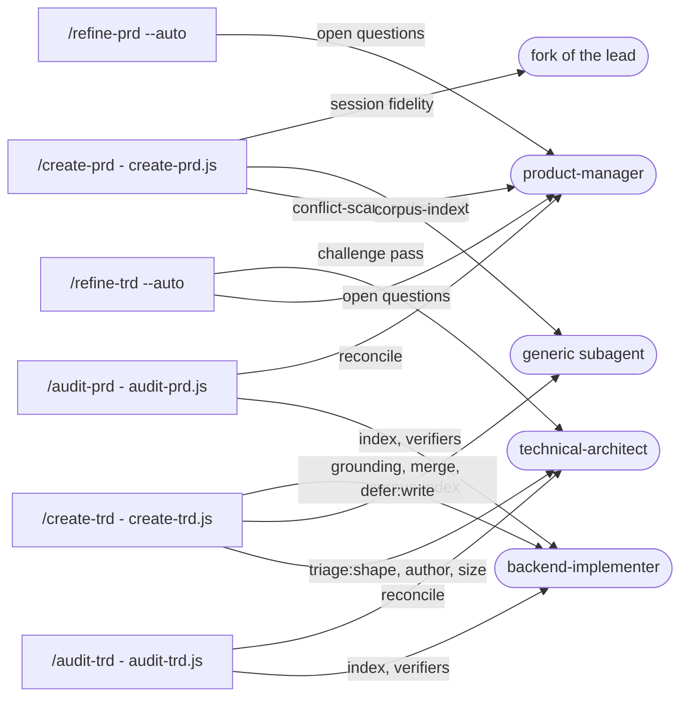
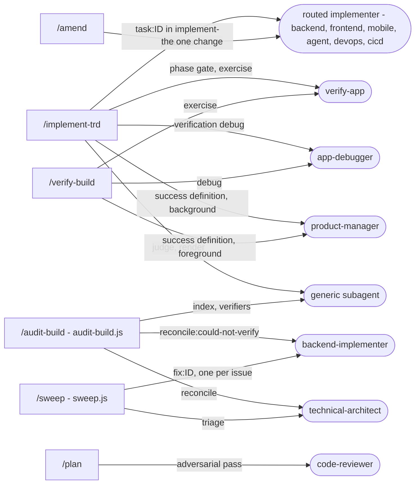
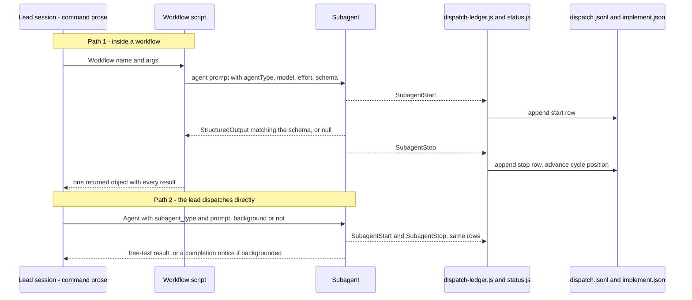

# Subagents

Ensemble ships 13 subagents. Each is a Markdown prompt with YAML frontmatter
(`packages/full/agents/<name>.md`), copied into a project's `.claude/agents/` by
`scaffold-project.sh`. Commands decide **when** an agent runs and what it is given; the agent
decides **how** to do the work. For why the work is split this way, see
[CONCEPTS](../guides/CONCEPTS.md) "4. You direct; specialists with fresh context do the work".
For where each command sits in the overall process, see [README.md](README.md).

## What gets copied, and what changes on the way

The vendored copy in `.claude/agents/` differs from the plugin source in exactly one way:
`scaffold-project.sh` adds a `skills:` list and a generated `## Project Skills` section
(between `ENSEMBLE:SKILLS:BEGIN` / `END` markers). The list is the agent's candidate pool in
`packages/full/agents/skill-affinity.json`, intersected with the skills this project selected
(`.claude/selected-skills.txt`). The shipped source files must never carry `skills:`
themselves, because the right list differs per project. Edits inside the markers are
overwritten on the next refresh.

## The 13 agents

`model` and `effort` are the agent's frontmatter defaults. A workflow can override either per
call (noted in the dispatch table below). Every agent declares `background: true`.

| Agent | Model / effort | What it does |
|---|---|---|
| **product-manager** | opus / high | Writes and corrects PRDs; derives the success definition — the list of checkable criteria that verification tests against — from a PRD or a TRD's reproduction section. |
| **technical-architect** | opus / xhigh | Writes TRDs: architecture, task breakdown, execution plan. Also judges audit findings (reconcile) and sorts `/sweep` lists. |
| **spec-planner** | opus / high | Execution planning: dependencies, parallel tracks, critical path. **Nothing dispatches it today** — task ordering is computed by code (`lib/task-graph.js`). |
| **backend-implementer** | sonnet / medium | APIs, data, services, integrations. Also the **default**: any task no rule routes elsewhere, and most read-and-report stages inside workflows. |
| **frontend-implementer** | sonnet / medium | UI, components, client logic, accessibility. |
| **mobile-implementer** | sonnet / medium | Flutter and React Native. |
| **agent-implementer** | sonnet / medium | Work where the deliverable is AI behaviour: prompts, retrieval, agent loops, evals. Must check the provider's live docs before naming any model. |
| **devops-engineer** | sonnet / medium | Infrastructure as code, Kubernetes, cloud accounts, observability. |
| **cicd-specialist** | sonnet / medium | Pipeline files (`.github/workflows/*.yml` and equivalents), release automation. |
| **verify-app** | sonnet / medium | Runs checks and reports. Two jobs: the phase gate in `/implement-trd`, and exercising the running software against criteria in the verification loop. |
| **app-debugger** | opus / high | Root-cause debugging. The verification loop's fixer: given the criteria the judge found unmet, it fixes them in place, one at a time, and reports a missing feature as unbuilt rather than building it. |
| **code-reviewer** | opus / high | Security and quality review. Dispatched only by `/plan`'s adversarial pass. The end-of-run review in `/implement-trd` uses the built-in `/code-review` skill instead. |
| **code-simplifier** | opus / medium | Post-verification refactoring. **Nothing dispatches it today** — its phase-gate stage was removed 2026-08-18 (`implement-phase.js`, comment at "REMOVED 2026-08-18"). |

Two dispatch targets are not on the roster:

- **The generic workflow subagent.** An `agent()` call with no `agentType` runs this. It has
  no agent prompt of its own and, unless the call sets `model`, it inherits the lead session's
  model — so in an Opus-led session it runs on Opus. That is why every implementation dispatch
  sets `agentType` explicitly (see "Routing" below).
- **A fork** of the lead session (`Agent({ subagent_type: "fork" })`), which inherits the
  whole conversation. Used once: `/create-prd`'s session-fidelity check, which compares the
  PRD against what you said in the session (`create-prd.md` "Final step: session fidelity").

---

## Who dispatches which agent

### Writing and checking PRDs and TRDs

### Building, verifying and the shorter paths

`/plan` also reaches every agent of `/create-trd`, `/audit-trd` and `/create-prd` by starting
those workflows on its medium and PRD routes, and `/plan --implement`, `/audit-build` and
`/verify-build --fix` reach everything `/implement-trd` does by chaining it. `/close-feature`,
`/augment-trd-figma` and the maintenance commands dispatch no agents.

### The full dispatch table

Kind: **code** means a workflow script makes the call with fixed options; **model** means the
lead session makes it by following the command's prose.

| Agent | Dispatched by | Step | Overrides on the call | Kind |
|---|---|---|---|---|
| product-manager | `/create-prd` | `create-prd.js` stages `conflict-scan`, `author:product-manager`, `drift` | drift: effort low | code |
| product-manager | `/audit-prd` | `audit-prd.js` stage `reconcile` — accepts or rejects each finding | effort high | code |
| product-manager | `/implement-trd` | `implement-trd.md` §3.6 — derive the success definition, **background** | — | model |
| product-manager | `/verify-build` | `verify-build.md` §3a — same derive, **foreground**, only if no definition exists | — | model |
| product-manager | `/refine-prd`, `/refine-trd` `--auto` | "Phase 0: Answer the open questions" | — | model |
| technical-architect | `/create-trd` | `create-trd.js` `triage:shape`, `author:technical-architect`, `size` | triage: haiku, low; author: effort high (down from xhigh); size: low | code |
| technical-architect | `/audit-trd`, `/audit-build` | `audit-trd.js` / `audit-build.js` stage `reconcile` | effort high | code |
| technical-architect | `/sweep` | `sweep.js` stage `triage` | effort low | code |
| technical-architect | `/refine-trd --auto` | "Phase 1: Challenge pass" | — | model |
| backend-implementer | `/implement-trd` | `implement-phase.js` `task:<id>` when routing picks it or nothing else applies | — | code |
| backend-implementer | `/audit-prd`, `/audit-trd` | `index` (haiku, low); `verify:<key>` verifiers (sonnet, except `/audit-prd`'s conformance check and `/audit-trd`'s deterministic check, on haiku); `reconcile:could-not-verify` (low) | as listed | code |
| backend-implementer | `/audit-build` | `audit-build.js` `reconcile:could-not-verify` | effort low | code |
| backend-implementer | `/create-trd` | `create-trd.js` `ground:brownfield` (fanned out as `ground:brownfield:N` on large TRDs), `ground:merge`, `defer:write` | ground: high; merge, defer: low | code |
| backend-implementer | `/sweep` | `sweep.js` `fix:<id>`, one per issue | effort medium | code |
| frontend-, mobile-, agent-implementer, devops-engineer, cicd-specialist | `/implement-trd` | `implement-phase.js` `task:<id>`, as routed | — | code |
| one implementer | `/amend` | `amend.md` "Step 4: Do it" — backend-, frontend-, mobile- or agent-implementer, chosen by `lib/agent-routing.js`'s table | — | model |
| verify-app | `/implement-trd` | `implement-phase.js` stage `gate:verify-app`, once per phase group | — | code |
| verify-app | `/implement-trd`, `/verify-build` | `verify-functional.js` stage `exercise`, one per slice of criteria | — | code |
| app-debugger | `/implement-trd`, `/verify-build` | `verify-functional.js` stage `debug`, only when the judge asks for remediation | — | code |
| code-reviewer | `/plan` (small, medium) | `plan.md` "Step 6: Adversarial pass" — findings only, no edits | — | model |
| generic subagent | `/create-prd`, `/create-trd` | `corpus-index` | haiku, low | code |
| generic subagent | `/audit-build` | `index` (haiku, low), `verify:<key>` verifiers (sonnet; deterministic on haiku) | as listed | code |
| generic subagent | `/implement-trd`, `/verify-build` | `verify-functional.js` stages `judge` and `render` | session model | code |

---

## How dispatch works

There are two ways an agent gets started, and they behave differently.

### Path 1: `agent()` inside a workflow (most dispatches)

1. The command resolves every input and calls `Workflow({ name, args })` once. The script
   reads no files and runs no shell (`implement-phase.js` header; `create-trd.md` "The
   workflow does not own every stage"). **code**
2. The script calls `agent(prompt, { label, phase, agentType, model, effort, schema })`. The
   label (`task:AUTH-B003`, `gate:verify-app`, `reconcile`) is what shows in progress output.
   **code**
3. `schema` forces the agent to return a structured object. If the agent dies or ends with no
   valid return, `agent()` yields `null`, and the script records it as an explicit failure
   rather than skipping it — `implement-phase.js` distinguishes a missing record, a null
   return, a non-success status and a never-dispatched task. **code**
4. Independent calls run together through `parallel()`; the script awaits each wave before the
   next (`implement-phase.js` "dispatch each eligibility wave"; `verify-functional.js`
   `dispatchSlice`, batched at `MAX_PARALLEL_SLICES`). **code**
5. The script returns one object; the lead attests what it claims against disk. **code** +
   **model**

### Path 2: the lead's own `Agent` call

Used where a command needs the result in the conversation, or needs something a workflow
cannot give: `/implement-trd`'s and `/verify-build`'s success-definition derive,
`/amend`'s single implementer, `/plan`'s adversarial review, the `--auto` modes of the refine
commands, and `/create-prd`'s fork. No schema is enforced, so there is no automatic
null-means-failed check; the lead reads the result itself. **model**

**Background versus foreground.** `/implement-trd` §3.6 passes `run_in_background: true` for
the derive pass so the phase loop can start while the definition is written; the harness
re-invokes the lead when it finishes. `/verify-build` §3a has nothing else to do, so its
prose calls for waiting on the same dispatch in the foreground. Workflow `agent()` calls are
awaited by the script in both cases; the lead is blocked on the `Workflow` call, not on the
individual agents.

### Routing: which implementer gets a task

Code, not prose, since 2026-08-28. `trd-parser.js` sets `task.agentType` at parse time by
calling `resolveAgentType()` in `lib/agent-routing.js`:

1. The TRD's own `Agent: @name` line in the Execution Plan's session details wins.
2. Else the first keyword row that matches the task description, checked in this order:
   agent-implementer (llm, rag, prompt, embedding, …), cicd-specialist (pipeline, github
   actions, ci/cd), devops-engineer (infra, deploy, docker, k8s, …), mobile-implementer,
   frontend-implementer, backend-implementer.
3. Else `backend-implementer`.

`implement-phase.js` applies the same default again (`rec.agentType || 'backend-implementer'`)
so no task ever reaches the generic subagent. The reason is cost, stated in both files: an
unset type silently runs implementation on the session's model, roughly five times the price
of the Sonnet implementer.

### The nesting rule

From `.claude/rules/constitution.md` Principle 1 (revised 2026-08-16):

- **Subagents may start subagents.** The built-in `/code-review` was measured fanning out to
  six child agents, and verifier waves and phase workflows are agents starting agents. Nested
  agents share the same pool of 20 concurrent slots.
- **Forbidden: an agent starting another of its own type with the same task.** This was the
  one measured failure — `backend-implementer` three levels deep on an identical task, about
  567,000 tokens for one unit of work. The frontmatter comments of backend-, frontend-,
  mobile- and agent-implementer and app-debugger repeat the rule.
- **An implementer that finds work outside its task reports it rather than delegating it**,
  because the command owns the task list and cannot act on a decision hidden in a nested call.
- **The command owns the task list.** Subagents never call `TaskCreate`/`TaskUpdate`;
  background subagents do not have those tools, and their removal raises no error.

### The dispatch ledger

`dispatch-ledger.js` runs on both `SubagentStart` and `SubagentStop`
(`packages/core/hooks/hooks.manifest.json`, 5 s timeout each) and appends one row per event to
`.trd-state/<feature>/dispatch.jsonl`, or `.trd-state/_dispatch.jsonl` when no feature is in
flight. It exists so an orchestrator can recover what it dispatched after its context was
compacted.

| Fact | Consequence |
|---|---|
| Rows are keyed on `agent_id`. | Correlate by `agent_id` only; `prompt_id` changes during one agent's life. |
| `agent_type` carries the dispatch **name** when one was given, otherwise the agent type — except inside a workflow, where every agent was measured arriving as `workflow-subagent`. | `--open` prints the workflow label (`task:AUTH-B003`) when the payload carried one, otherwise `type=`; a named agent shows its name there, not its type. |
| State is the last event per `agent_id`: `start` means running, `stop` means finished. | Nothing writes `blocked` rows any more; there is no SubagentStop judge. |

To see what is still running: `node .claude/hooks/dispatch-ledger.js --open`
(`--json`, `--session <id>`). `status.js`, on `SubagentStop` just before the ledger, advances
each in-progress task's position in `implement.json` as a safety net under the command's own
writes. Neither hook can block anything. Both are covered in [hooks.md](hooks.md).
