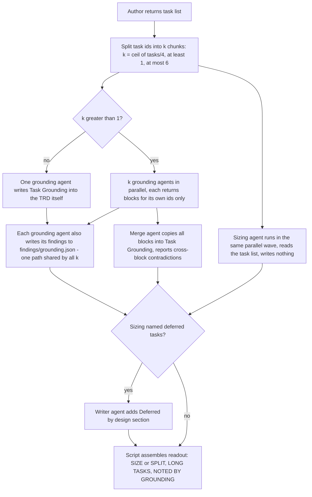
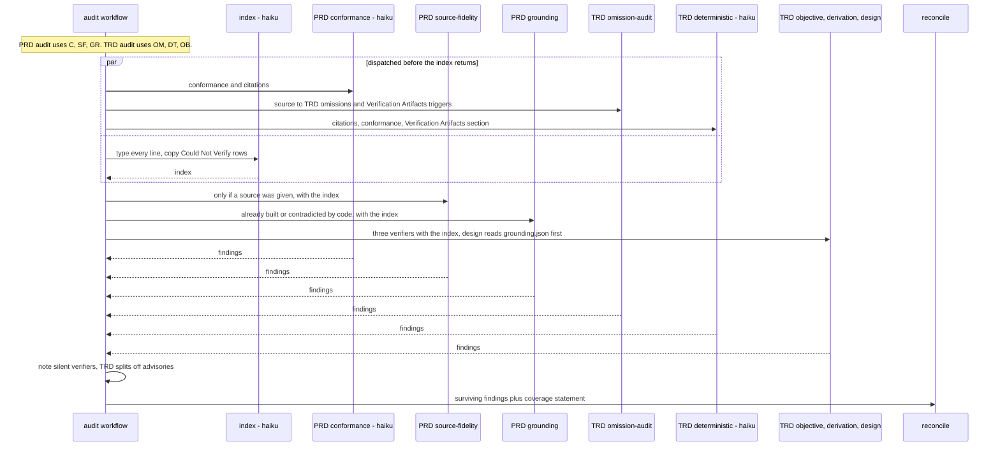
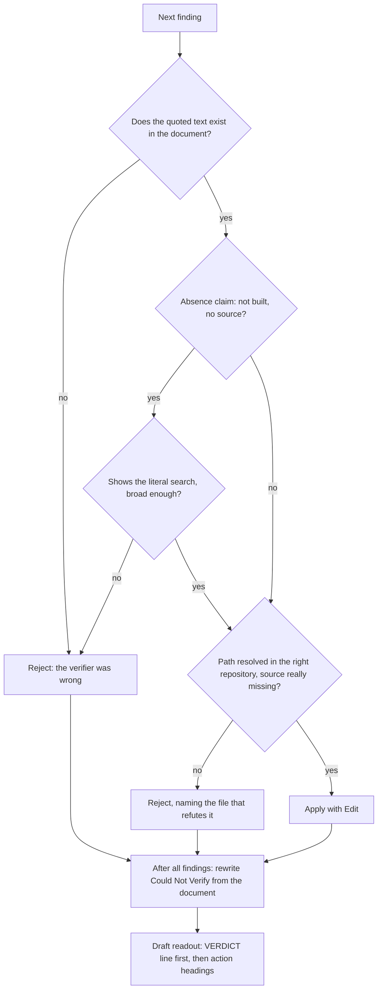

# Authoring reference: the PRD and TRD commands

What happens, step by step, when you run the document commands: `/create-prd`, `/refine-prd`,
`/audit-prd`, `/create-trd`, `/refine-trd`, `/audit-trd`, and `/augment-trd-figma`. For
*which* command to run and *why*, read [PROCESS](../guides/PROCESS.md) §2 and
[CONCEPTS](../guides/CONCEPTS.md). This page covers the mechanics only.

**Simple top-level flow of each command:** [PROCESS §2, "The core flow"](../guides/PROCESS.md#2-the-core-flow).
The diagrams here only zoom in on actors, stages and files that overview leaves out.

Related pages: [README](README.md) (overall map), [implement-trd](implement-trd.md) (what
consumes the TRD), [verification](verification.md), [hooks](hooks.md),
[other-commands](other-commands.md), [agents](agents.md) (the subagent definitions named below).

## How to read this page

Every step is marked with who decides it:

| Kind | Meaning |
|---|---|
| **code** | A workflow script (`packages/core/workflows/*.js`) or a lib decides it deterministically: ordering, fan-out, which branch runs, how the readout is assembled |
| **model** | An agent's judgement: the lead session reading command prose, or a subagent dispatched by a workflow |
| **you** | The owner decides |

"Lead" means the main Claude Code session that received the slash command and reads its
command file. "Workflow" means the saved script the lead invokes with the `Workflow` tool.
Workflow scripts cannot touch the filesystem; only the agents they dispatch can read or write
files. Each workflow agent is dispatched with a JSON schema, so its return is structured
data, not prose.

Every section below cites where the step lives, as `file` plus a section heading, a variable
or a line number.

## The shared pattern

Each document gets three commands, and each command has one job:

| Command | Job | Hands off through |
|---|---|---|
| `create-*` | Writes the document. Does **not** verify it | `## Open Questions` (decided without you) and `## Could Not Verify` (asserted, not checked) |
| `refine-*` | Gets your judgement in: answers `## Open Questions`, runs a challenge pass that can delete | Changelog entries in the document |
| `audit-*` | Verifies the document against its source and the code, applies what survives, rewrites `## Could Not Verify` | A `VERDICT:` line and the rewritten section |

The rule every audit and grounding agent carries: **design documents state intent, code
states fact.** An agent may cite a PRD or TRD as the source of a decision, never as evidence
that something is built (`CORPUS_RULE` in `create-trd.js`, `audit-prd.js`, `audit-trd.js`).

### Files these commands read and write

| File | Written by | Read by |
|---|---|---|
| `docs/PRD/<feature>.md` | `/create-prd` author, `/refine-prd`, `/audit-prd` reconcile | `/create-trd`, `/audit-prd` |
| `docs/PRD/<feature>.brief.md` | `/create-prd` lead, only when the requirements came from the conversation | `/create-prd` workflow agents; `/audit-prd --source` when no other source exists |
| `docs/TRD/<feature>.md` | `/create-trd` author, grounding and merge agents; `/refine-trd`; `/audit-trd` reconcile; `/augment-trd-figma` | `/implement-trd`, `/audit-trd`, `/audit-build` |
| `.trd-state/<feature>/findings/grounding.json` | `/create-trd` grounding agents (`create-trd.js` `groundPrompt`) | `/audit-trd` design-audit verifier (`GROUNDING_FINDINGS_PATH`) |
| `.trd-state/<feature>/artifacts.json` | Lead of `/create-prd`, `/refine-prd` (key `prd`) and `/create-trd`, `/refine-trd` (key `trd`) | Same commands, to republish to the same link |
| `.trd-state/current.json` | `/create-prd` (`prd`, status `prd-created`), `/create-trd` (`trd`, status `trd-created`) | Every command here when no path argument is given |
| `.claude/contracts/prd-authoring.md`, `trd-authoring.md` | Nobody at runtime (shipped) | The authoring and grounding agents, instead of the full command file |

The audits publish no artifact and write no report file: their result is the edited document
plus the readout. The per-verifier `.trd-state/<feature>/findings/<verifier>.json` files exist
only on the **fallback path**, when the `Workflow` tool is unavailable and the lead runs the
stages by hand (`create-prd.md` "Verifier return contract — FALLBACK PATH ONLY").

---

## `/create-prd`

Source: [`create-prd.md`](../../packages/core/commands/create-prd.md),
[`create-prd.js`](../../packages/core/workflows/create-prd.js).

| # | Step | Who | Kind | Where |
|---|---|---|---|---|
| 1 | Resolve the source: a repo file (read it), an external issue (fetch body and comment thread through an MCP server or skill; ask for the text if none reaches it), or the conversation itself | Lead | model | `create-prd.md` "0. Resolve the source" |
| 2 | Build the source package. A source document is passed **verbatim**. Requirements settled only in conversation get a brief with three sections: Settled (with where each was settled), Superseded, Raised-not-adopted. Later statements win. Both a document and a conversation: the document verbatim plus a brief covering only the in-session change | Lead | model | `create-prd.md` "1. Build the source package", "1a" |
| 3 | Call the workflow. It refuses to start without `prd` and one of `source` or `brief` | Lead, then script | code | `create-prd.js` lines 50–51 |
| 4 | **Corpus**: one cheap agent (haiku, low effort, no agent type set) greps `docs/PRD/` and `docs/TRD/` of the target project for related documents; returns up to 40, with decisions and rejected alternatives | Workflow → indexer | model | `create-prd.js` `phase('Corpus')` |
| 5 | **Conflicts**: runs only when the corpus is non-empty. A product-manager lists where the source gives a *different answer to the same question* than a documented decision, and whether that decision was ever implemented (an `implement.json` exists) | Workflow → product-manager | model | `create-prd.js` `conflicts` |
| 6 | **Author**: one product-manager (opus, high effort, both from its own frontmatter) in a fresh context reads `.claude/contracts/prd-authoring.md`, the source package, the corpus index and the conflicts, and writes the PRD with the Write tool. Returns every requirement with its source and a `supersedes` list | Workflow → product-manager | model | `create-prd.js` `authored` |
| 7 | **Drift**, last and alone: a product-manager (low effort) compares the PRD with the request verbatim. Does the PRD ask for things the request did not? Would the requester recognise it? | Workflow → product-manager | model | `create-prd.js` `drift` |
| 8 | Assemble the readout: requirement count, a `SCOPE` line (matches the request, or `SCOPE GREW BEYOND THE REQUEST` with the extra requirements), an `OVERRIDES` list of documented decisions the PRD superseded, a warning if the conflict scan found same-question conflicts but the PRD recorded no supersession, and `NOT YET VERIFIED. Run /audit-prd <prd> --source <baseline> [--project <dir>]` | Workflow | code | `create-prd.js` `return` block |
| 9 | **Session fidelity**, only when there was no source document: a fork of the lead session (it holds the conversation) reports anything the PRD contradicts, weakens or omits. The lead fixes the PRD and notes the pass in its header | Lead → fork | model | `create-prd.md` "Final step: session fidelity" |
| 10 | Update `current.json`, publish the PRD as an artifact (unless `ensemble.publishArtifacts: false`), store the link under `prd` in `artifacts.json` | Lead | model | `create-prd.md` "State Update", "Artifact link" |
| 11 | Print the readout and the `COMMAND COMPLETE` banner | Lead | model | `create-prd.md` "Readout" |

Notes:

- The fork runs in the lead, not the workflow, because workflow agents never saw the
  conversation. It is skipped when a source document exists, because `/audit-prd`'s
  source-fidelity verifier checks against a file more completely.
- With no argument at all, the lead first interviews you for the description (`create-prd.md`
  "User Input"). That is the only point where this command asks you anything.
- `project` scopes every path to another repository. Without it, when you design for repo B
  from repo A, the corpus index and every code lookup search repo A.

---

## `/create-trd`

Source: [`create-trd.md`](../../packages/core/commands/create-trd.md),
[`create-trd.js`](../../packages/core/workflows/create-trd.js),
[`task-graph.js`](../../packages/core/lib/task-graph.js),
[`trd-parser.js`](../../packages/core/lib/trd-parser.js).

The diagram below covers what happens after the architect has written the TRD (steps 5–9
in the table).

| # | Step | Who | Kind | Where |
|---|---|---|---|---|
| 1 | Resolve the PRD from the argument or `current.json`. If requirements were settled in this conversation, pass the transcript path too. The script fails without `prd` or `transcript` | Lead, then script | model, code | `create-trd.md` "User Input", "Execution: the workflow is the orchestrator"; `create-trd.js` lines 65–70 |
| 2 | **Triage**: a technical-architect on haiku decides whether the source is one coupled change or a list of unrelated items. The test is coupling, not size, and it defaults to one change when unsure. A list stops the run with no TRD and points at `/sweep` | Workflow → architect | model decides, code stops | `create-trd.js` `phase('Triage')` |
| 3 | **Corpus**: same cheap index as `/create-prd`, looking for Key Technical Decisions tables and supersession banners | Workflow → indexer | model | `create-trd.js` `phase('Corpus')` |
| 4 | **Author**: one technical-architect at `effort: 'high'` (its own frontmatter says `xhigh`; the workflow overrides it here only) reads `.claude/contracts/trd-authoring.md` and writes the TRD. Objectives must trace to a source, every decision and task names what it serves, and the Task Grounding section is left out | Workflow → technical-architect | model | `create-trd.js` `authored` |
| 5 | Partition tasks for grounding: `k = min(6, max(1, ceil(tasks / 4)))` agents, tasks split evenly. With one chunk, no merge step runs | Workflow | code | `create-trd.js` `groundChunks`, `GROUND_CHUNK_SIZE`, `GROUND_MAX_AGENTS` |
| 6 | **Ground**, in parallel: each backend-implementer (sonnet from its frontmatter, high effort set here) sees the whole task roster but grounds only its own IDs. Per task it writes `Touches` (mandatory), `Reuse`, `Replaces`, `Follow`, `Careful`, marking every claim `[read]`, `[ran]` or `[inferred]`. It also reports findings: buildability, consistency, missing grounding, and dependency edges it cannot justify. Findings go to `.trd-state/<feature>/findings/grounding.json` and back in the return. Every agent is told to write that same path, so when grounding fans out the file holds whichever agent wrote last; the readout uses the returns, which are complete | Workflow → backend-implementer ×k | model | `create-trd.js` `groundPrompt`, `GROUND_OPTS` |
| 7 | **Size**, in the same parallel wave: a technical-architect (low effort) judges whether the plan is still what was asked for, whether one unattended run can finish it, how many deploy cycles it implies, which tasks cannot complete in a normal run, and which single tasks are really several. It proposes a split when needed. It never writes to the TRD | Workflow → architect | model | `create-trd.js` `SIZING` |
| 8 | **Merge**, only when grounding fanned out: one backend-implementer copies every block into `## Task Grounding` in task order and reports contradictions between blocks (one reuses what another replaces, two claim one new module, two share a file without saying so) | Workflow → backend-implementer | model | `create-trd.js` `if (FANNED_OUT)` |
| 9 | **Deferred by design**, only when sizing named any: one writer agent adds that table after the Master Task List, so `/implement-trd` reports those tasks instead of running them | Workflow → backend-implementer | model | `create-trd.js` `deferred` |
| 10 | Assemble the readout: task and objective counts, grounded count, `SIZE` or `SPLIT THIS BEFORE IMPLEMENTING`, deferred tasks, `LONG TASKS`, `NOTED BY GROUNDING — not applied`, and `NOT YET VERIFIED. Run /audit-trd <trd> --source <prd>` | Workflow | code | `create-trd.js` `sizeLines`, `gfLines`, `NEXT` |
| 11 | **Wave profile**: the lead runs `parseTrd`, `buildGraph` and `renderWaveProfile` with `node -e`. The output line is `waves: <profile> — N tasks in W wave(s), avg X wide, S single-task`. Below 2 wide it adds `narrow — driven by` the dominant edge kind (declared dependencies or shared files), the critical path as a task-ID chain, and, for shared files, the files that serialize the most tasks | Lead → libs | code | `create-trd.md` "Wave profile"; `task-graph.js` `renderWaveProfile()` |
| 12 | Update `current.json`, publish the TRD (key `trd`), print the readout and banner. The readout marks each unjustified dependency edge as on or off the critical path | Lead | model | `create-trd.md` "Readout", "Artifact link" |

Notes:

- Grounding findings are **reported, not applied**. The agent that wrote the grounding blocks
  does not also edit the design on the strength of its own findings; `/audit-trd` applies
  them.
- The wave profile runs in the lead because workflow scripts cannot `require` a lib. It is
  printed here, at design time, because width is fixed by how tasks were cut and which files
  they touch. [implement-trd](implement-trd.md) covers how the same graph drives dispatch.
- Sizing and triage report and propose. Neither refuses work or asks you anything.

---

## `/refine-prd` and `/refine-trd`

Source: [`refine-prd.md`](../../packages/core/commands/refine-prd.md),
[`refine-trd.md`](../../packages/core/commands/refine-trd.md). There is no workflow script;
every step is the lead following command prose, so every step is **model** unless marked.

| # | Step | Interactive (default) | `--auto` | Where |
|---|---|---|---|---|
| 1 | Resolve the document | Argument, else `current.json` (`prd` or `trd`) | Same | "Usage" |
| 2 | Answer `## Open Questions` | **You**, one `AskUserQuestion` per question, with the author's assumption offered as an option, highest-consequence first. `/refine-trd` also batches related questions and strikes any the TRD or its changelog already settles | One product-manager subagent answers each with a verdict: **answered** (cites evidence), **default** (conventional choice, said to be a default), **OWNER-CALL** (yours to make, decided anyway, with the reasoning and a marker recorded in the document) | "Phase 0" |
| 3 | Challenge pass | Runs | Runs in a **second** agent, separate from step 2. `/refine-trd` names it technical-architect; `/refine-prd` does not name a type | "Phase 1" |
| 4 | Apply findings | **You** choose, from findings grouped by action | Unsourced requirements removed and listed. TRD: unsourced strictness lowered to the `constitution.md` floor, buildability failures reported with evidence. Contradictions go under `STUCK` in the readout for you to resolve | "Phase 2" |
| 5 | Write the document | In place, version incremented, changelog entry | Same | "Phase 3" |
| 6 | Readout | `REMOVED`, `ADD BACK`, `STUCK`, `ADDED THIS PASS` (TRD adds `LOWERED…`, `CANNOT BE BUILT…`) | Same, but it **leads with every OWNER-CALL decision** | "Readout" |
| 7 | Publish and store the link (`prd` or `trd` in `artifacts.json`) | Same | Same | "Artifact link" |

The challenge pass is what lets refine **delete**: a requirement that traces to nothing is
removed. "I think REQ-4 is unnecessary" is forbidden; "REQ-4 traces to nothing in the source"
is allowed. Interactive mode is exempt from the no-questions rule in
`.claude/rules/autonomy.md` because asking is its purpose; `--auto` asks nothing.

Refine does not touch `## Could Not Verify`. Only an audit rewrites that section.

---

## `/audit-prd` and `/audit-trd`

Source: [`audit-prd.md`](../../packages/core/commands/audit-prd.md),
[`audit-prd.js`](../../packages/core/workflows/audit-prd.js),
[`audit-trd.md`](../../packages/core/commands/audit-trd.md),
[`audit-trd.js`](../../packages/core/workflows/audit-trd.js).

Both audits run one shape: index the document, fan out read-only verifiers, then one
reconcile agent applies or rejects. They re-derive everything from the document itself, so
they work on a document this pipeline never wrote.

The two diagrams below show which verifiers run and when, then how reconcile treats each
finding.

| # | Step | Who | Kind | Where |
|---|---|---|---|---|
| 1 | Resolve the document (argument, else `current.json`), the source (`--source`) and the target repository (`--project`) | Lead | model | "User Input", "Execution" |
| 2 | Dispatch the verifiers that need no index **before** the index runs, to save wall time | Workflow | code | `INDEX_FREE_VERIFIERS`, `indexFreeWavesPromise` |
| 3 | **Index**: a backend-implementer on haiku types every line (PRD: requirement or decision; TRD: objective, decision or task, plus each task's `Touches` files) and copies the `Could Not Verify` and `Open Questions` rows | Workflow → indexer | model | `phase('Index')` |
| 4 | **Verify**: the index-bound verifiers run in parallel. Every verifier prompt carries the same rules: quote the document, not the index; resolve paths in the target project; code is fact; findings must be checkable ("findable only"); zero findings is fine | Workflow → verifiers | model | `dispatchVerifier()`, `GROUNDING_RULE`, `FINDABLE_ONLY` |
| 5 | Count which verifiers returned nothing and state it to the reconcile agent as coverage, since a dead verifier otherwise looks like a clean one | Workflow | code | `deadKeys`, `COVERAGE` |
| 6 | TRD only: findings with action `advisory` are split off. They never reach the reconcile agent, never count as findings, never change the verdict, and are appended as `NO ACTION` lines | Workflow | code | `audit-trd.js` `advisories` |
| 7a | **Zero findings**: a backend-implementer (low effort) only rewrites `## Could Not Verify`. The verdict is computed in code: a silent verifier or no source gives `proceed with these caveats: …`, otherwise `safe to proceed` | Workflow → backend-implementer, then code | model, code | `if (findings.length === 0)` |
| 7b | **Findings**: the reconcile agent applies each surviving finding with Edit, rejects the rest naming the refuting file, rewrites `## Could Not Verify`, and drafts the readout. PRD: product-manager. TRD: technical-architect. Both at high effort | Workflow → reconcile | model | `readout = await agent(…)` |
| 8 | Print the readout and banner. No artifact is published | Lead | model | "Readout", "Output discipline" |

### The verifiers

| Audit | Verifier | Started | Model, effort | Checks |
|---|---|---|---|---|
| PRD | `conformance` | before index | haiku, low | Anything outside `stack.md` or against `constitution.md`; every cited ID resolves |
| PRD | `source-fidelity` | after index | sonnet, high | Source → PRD: missing requirements, decisions, **rejections**. PRD → source: requirements and thresholds that trace to nothing. **Skipped entirely when no `--source` is given** |
| PRD | `grounding` | after index | sonnet, high | Is any requirement already built (names file and line)? Does the PRD assert something the code contradicts? |
| TRD | `omission-audit` | before index | sonnet, high | Every source objective appears or is under Non-Goals. For each `check` skill in `framework-skills.txt` whose trigger the source meets, the `## Verification Artifacts` section selects it or states why not. Runs even with no source and reports that as its one finding |
| TRD | `deterministic` | before index | haiku, low | Citations resolve; conformance to `stack.md` and `constitution.md`; the Verification Artifacts section exists, names real skills, gives reasons on `Omitted:` lines, and its input paths exist |
| TRD | `objective-audit` | after index | sonnet, high | Provenance of each objective, and whether its **strictness** is sourced; a figure above a constitution floor must say why |
| TRD | `derivation-audit` | after index | sonnet, high | Every task and piece of delivery machinery names what it serves; files named by two or more tasks (they will serialize); tasks with empty `Touches` that land nothing |
| TRD | `design-audit` | after index | sonnet, high | Buildability, consistency, stale claims. **Reads `findings/grounding.json` first** and reuses its buildability and dependency findings instead of re-deriving them |

All verifiers dispatch as `backend-implementer` with the model overridden as shown
(`dispatchVerifier()`, `VERIFIER_MODEL = 'sonnet'`).

### How reconcile applies or rejects

The reconcile agent is told (`CNV` and the reconcile prompt, both files):

- **A finding that does not match the document means the verifier was wrong.** The index is an
  in-memory script variable, never a file, so no "other artifact" can carry the error.
- **Reject** a finding where the verifier missed a source that exists or searched the wrong
  repository. Re-resolve a disputed path before accepting or rejecting.
- **Absence claims must show the search.** "Not implemented" or "no source" without the literal
  commands and output is rejected as a hypothesis, and so is one too narrow to be conclusive.
  Absence drives deletion, so a wrong one destroys work.
- **Rewrite `## Could Not Verify`**, reading it from the document, not from the index (the index
  has returned empty for a section with four rows). Claims checked and confirmed come out; claims
  found false become findings; claims not checked stay with a reason; anything unresolved (a
  silent verifier, no source) goes in. Add the section if missing.

### The verdict line

The readout's first line after the `AUDIT:` / `SOURCE:` header is one of exactly three forms,
with every caveat named, never just counted:

| Verdict | When | Decided by |
|---|---|---|
| `do not proceed until <blocker>` | PRD: a `PICK ONE` or surviving `ALREADY BUILT` finding. TRD: a `REDESIGNED`, `CANNOT BE BUILT` or `PICK ONE` finding leaves the TRD unsafe to implement from | reconcile agent (model) |
| `proceed with these caveats: <named>` | Anything under `CAVEAT` or `CONFIRM THESE ARE WANTED`, or an unresolved Could Not Verify row. **Always** at best this when no source was supplied: `no source supplied — fidelity and omission unchecked` | model on the findings path; code on the zero-findings path |
| `safe to proceed` | None of the above | model on the findings path; code on the zero-findings path |

Readout headings name the action the audit took, omitting empty ones: `DELETED`,
`LOWERED TO THE CONSTITUTION FLOOR`, `ADDED BACK`, (PRD) `ALREADY BUILT`, (TRD) `REDESIGNED`
and `CANNOT BE BUILT`, `PICK ONE`, `CONFIRM THESE ARE WANTED`, `FIXED THE CITATION`,
`CORRECTED A STALE CLAIM`, `CAVEAT`, `NO ACTION`.

### Differences between the two audits

| | `/audit-prd` | `/audit-trd` |
|---|---|---|
| Verifiers | 3 | 5 |
| No `--source` | `source-fidelity` is not dispatched; coverage says so | `omission-audit` still runs and reports the missing source |
| Reuses create-time work | No | `design-audit` reads `.trd-state/<feature>/findings/grounding.json`, where `<feature>` is the TRD's file name |
| Advisories | None | Split off in code, shown as `NO ACTION` |
| Reconcile agent | product-manager (opus per its frontmatter) | technical-architect (opus) |
| Session fidelity | Not run here. A fork from a fresh audit session would hold no design conversation and would always pass (`audit-prd.md` "Session fidelity is `/create-prd`'s job") | Not applicable |

---

## `/augment-trd-figma`

Source: [`augment-trd-figma.md`](../../packages/core/commands/augment-trd-figma.md). No
workflow script: the lead does every step, because subagents have no Figma MCP access.

| # | Step | Kind | Where |
|---|---|---|---|
| 1 | Parse the Figma URL; `get_metadata` on the container node; catalogue every 1920×1080 frame as a screen, then show you the inventory and ask which screens to include | model, **you** | "Step 1" |
| 2 | Break each screen into components with `get_metadata`; note components shared across screens | model | "Step 2" |
| 3 | `get_design_context` per unique component for dimensions, colours, type, spacing, borders, icons | model | "Step 3" |
| 4 | Download screen and component baseline PNGs at 2×, design-context JSON and embedded images through the Figma REST API, batched to stay under its rate limit (about 30 requests a minute) | model | "Step 4" |
| 5 | Extract real text into `tests/visual/design-context/fixtures.json` | model | "Step 5" |
| 6 | Add a Visual Design Context section to the TRD, after Quality Requirements | model | "Step 6" |
| 7 | Add `VIS-F…` tasks to the Master Task List (Playwright config, harnesses, pixel-diff iteration) | model | "Step 7" |
| 8 | Commit the assets and TRD change, then report counts | model | "Step 8" |

It needs the Figma MCP server, a Figma personal access token, and `@playwright/test` in the
project. For how design comparison runs at verification time, see
[verification](verification.md).

---

## Where the command prose and the scripts disagree

The scripts are what runs. Where a command file says otherwise, trust the script:

- **Grounding is parallel, not single.** `create-trd.md` "Workflow" (line 817) and
  "Verification is a separate command" (line 864) say grounding runs as one sequential agent.
  `create-trd.js` has partitioned it across up to 6 agents since 2026-09-21 (comment at
  line 441).
- **Triage is missing from the command prose.** `create-trd.md` "Workflow" lists no Triage
  stage; `create-trd.js` runs one first and can end the run with no TRD.
- **`--auto` verdict names.** `create-prd.md` line 479 and `create-trd.md` line 1061 call the third
  verdict `owner-only`; the refine commands define it as `OWNER-CALL`.
- **`/augment-trd-figma` asks mid-run.** Its "Step 1" shows you the screen inventory and asks
  "Proceed with all 12? Or specify which to include", while the same file's
  "Autonomous-execution discipline" section forbids pausing to confirm.
- **`REJECTED THESE FINDINGS` heading.** Both audit command files list it in the readout format;
  neither workflow's reconcile prompt includes it, so rejections appear wherever the agent puts
  them.
