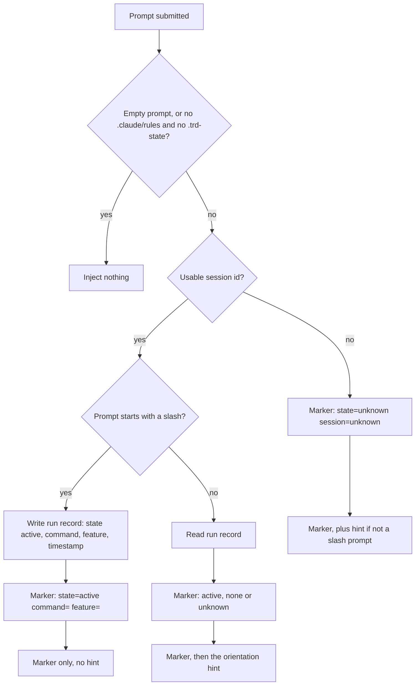
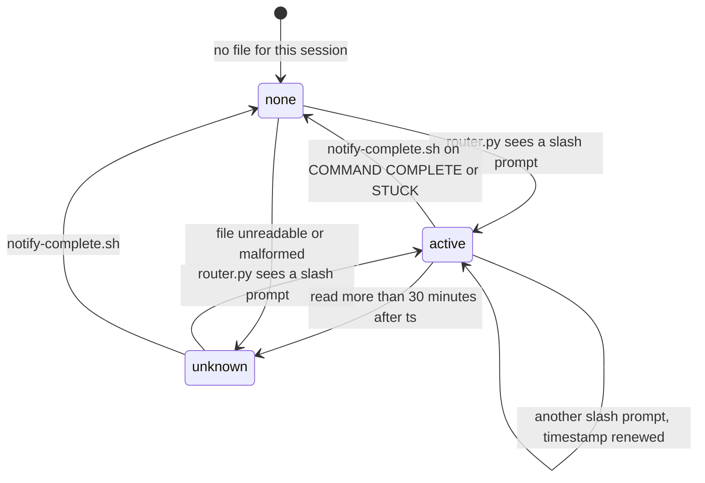
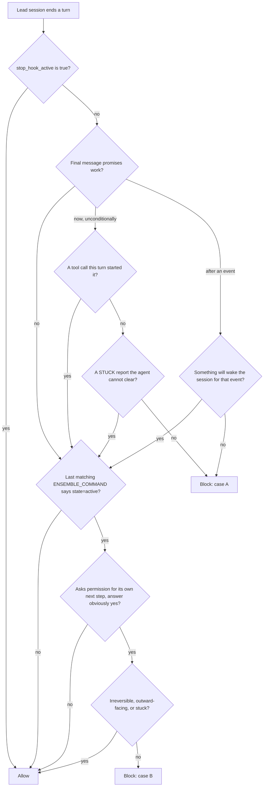

# Hooks reference

Every hook the framework installs into a project, what fires it, what it reads and writes, what
it puts into the model's context, and whether it can stop anything. For *why* hooks exist at
all, read [CONCEPTS §9, "Hooks reinforce and guard the process"](../guides/CONCEPTS.md). This
page is the mechanism.

**Legend for the Kind column in the tables below:**
*code* — a script decides it deterministically, the same way every time.
*model* — a model's judgement decides it.
*you* — the owner decides it (an env var you set, a command you run).

Nine of the ten hooks are *code*. One, the Stop discipline judge, is *model*. None of the
*code* hooks can block anything: every event hook exits 0 on every path, including its own
errors. The tenth *code* entry, `notify-complete.sh`, is not an event hook at all (§7), so its
exit code reaches only the command that ran it.

---

## 1. Where the hook set is declared

There is one declaration, and three things are generated from it.

| Step | What happens | Kind | Where it lives |
|---|---|---|---|
| 1 | Every hook is an entry in the manifest: event, matcher, order, timeout, `hookType` (command or prompt), and for the prompt hook a `promptFile` and `model` | *code* | `packages/core/hooks/hooks.manifest.json` |
| 2 | The Stop judge's prompt is built from a hand-written source: one scope line is prepended, a closing banner and the JSON answer contract are appended | *code* | `packages/core/hooks/prompts/build-judge-prompts.js` `buildStopDisciplinePrompt()`; source `discipline-stop.source.md`, output `discipline-stop.prompt.md` |
| 3 | The generator rewrites the `"hooks"` key of three `settings.json` files, inlining the built prompt text into the prompt hook's `"prompt"` field | *code* | `packages/core/scripts/generate-hooks-artifacts.sh` `build_hooks_block()`; targets are the template `packages/core/templates/claude-directory/settings.json`, this repo's `.claude/settings.json`, and `packages/full/.claude/settings.json` |
| 4 | The same generator rewrites the hook tables in `init-project.md` and `rebase-project.md`, and keeps `packages/full/hooks/` symlinks in step with the shippable entries | *code* | same script, sections "2/3" and "packages/full/hooks/ symlinks" |
| 5 | `/init-project` and `--refresh` copy the hooks into a project's `.claude/hooks/` and the settings block into its `.claude/settings.json` | *code* | `packages/core/scripts/scaffold-project.sh` |

Every command hook runs as
`bash -c 'cd "${CLAUDE_PROJECT_DIR:-$(git rev-parse --show-toplevel 2>/dev/null || pwd)}" && .claude/hooks/<file>'`
(`generate-hooks-artifacts.sh`, `CD_WRAPPER`), so it always starts at the project root.
Inside, the Node hooks re-resolve the root with `lib/resolve-project-root.js`: `$CLAUDE_PROJECT_DIR`
if it is a directory, otherwise the nearest ancestor holding `.claude/`, `.trd-state/` or `.git/`.

**The plugin itself registers no hooks.** `packages/full/hooks/hooks.json` is `{"hooks": {}}`.
Hooks run from the project's vendored `.claude/settings.json`, which is why a project that was
never scaffolded gets none of them.

`settings.json` also carries one setting the Stop judge depends on:
`env.CLAUDE_CODE_STOP_HOOK_BLOCK_CAP = "1"` (template line 5). `scaffold-project.sh` adds it on
refresh only when it is absent (`env.setdefault(...)`, line 1299), so a value you set yourself
survives. What it does is in §6.4.

---

## 2. Every hook at a glance

| Hook | Event (order) | Type | Timeout | Can block? | Reads | Writes | Puts into model context |
|---|---|---|---|---|---|---|---|
| `router.py` | UserPromptSubmit (1) | command | 10 s | no | the prompt, `cwd`, `session_id`; `.trd-state/_command-runs/<session>.json`; `current.json`; `<feature>/closed.json` and `implement.json` | `_command-runs/<session>.json` = `active`, only on a slash-command prompt | the `ENSEMBLE_COMMAND` marker line (the run-state signal the Stop judge reads) on every qualifying prompt; on non-slash prompts only, the orientation hint, plus the in-flight addendum when a feature is unfinished. All three are described in §5 |
| `formatter.sh` | PostToolUse on `Edit\|Write\|MultiEdit` (1) | command | 30 s | no | the hook payload | the edited file, reformatted in place | nothing |
| `dispatch-ledger.js` | SubagentStart (1) | command | 5 s | no | `current.json` | a `start` row in `.trd-state/<feature>/dispatch.jsonl` | nothing |
| `status.js` | SubagentStop (1) | command | 5 s | no | every `.trd-state/*/implement.json` | those files: `session_id` cleared, `cycle_position` advanced one step | nothing |
| `dispatch-ledger.js` | SubagentStop (3) | command | 5 s | no | `current.json` | a `stop` row in `dispatch.jsonl` | nothing |
| `discipline-stop` | Stop (1) | **prompt**, `claude-sonnet-5` | 60 s | **yes** | the Stop payload and the conversation, including every `ENSEMBLE_COMMAND` line | nothing | on a block, the reason, which the session must answer |
| `notify.sh` | Stop (4) | command | 60 s (your command: 30 s) | no | `$NOTIFY_ON_STOP`, the payload | whatever your command does | nothing |
| `session-context.js` | SessionStart (1) | command | 5 s | no | `current.json`, the state file it names, `<feature>/closed.json` | `export CLAUDE_SESSION_ID=…` into `$CLAUDE_ENV_FILE` | the in-flight feature brief |
| `runtime-refresh.sh` | SessionStart (2) | command | 10 s | no | `~/.claude/plugins/installed_plugins.json`, `ensemble.version` in `.claude/settings.json`, every `implement.json` | the vendored `.claude/` components, through `scaffold-project.sh --refresh` | one line: refreshed, deferred, or failed |
| `precompact.js` | PreCompact (1) | command | 5 s | no | `current.json`, `implement.json` | appends a checkpoint to `.trd-state/<feature>/session-log.md` | nothing (PreCompact accepts no context) |
| `notify-complete.sh` | none: a command runs it | script | none | no | `$CLAUDE_SESSION_ID`, `current.json`, git, tmux | `_command-runs/<session>.json` = `none`; then runs `$NOTIFY_ON_COMPLETE` | nothing |

The order numbers have gaps (Stop has 1 and 4) because retired hooks left them. **Order is the
order the entries are written in `settings.json`, not a promise that one finishes before the
next starts.** Claude Code runs the hooks matched on one event in parallel, so nothing here
should rely on it; see the note at the end on `dispatch-ledger.js`.

Every hook but the judge has a kill switch you can set (*you*): `ROUTER_DISABLE`,
`FORMATTER_HOOK_DISABLE`, `ENSEMBLE_DISPATCH_LEDGER_DISABLE`, `STATUS_HOOK_DISABLE`,
`NOTIFY_HOOK_DISABLE`, `ENSEMBLE_SESSION_CONTEXT_DISABLE`, `ENSEMBLE_RUNTIME_REFRESH_DISABLE`,
`ENSEMBLE_PRECOMPACT_DISABLE`, each `=1`. The judge has none: a prompt hook runs inside the
platform with no environment of ours (`.claude/rules/async-discipline.md`, "Override").

---

## 3. One session, start to finish

The diagram of which hook fires at which moment in a session is in
[CONCEPTS §9, "Hooks reinforce and guard the process"](../guides/CONCEPTS.md#9-hooks-reinforce-and-guard-the-process).
The two tables below walk the same moments in words, with the file behind each step.

### 3.1 Opening a session and starting a command

Steps 1–2 and step 3 are two SessionStart hooks; Claude Code starts them in parallel, so
neither waits for the other.

| # | Step | Kind | Where |
|---|---|---|---|
| 1 | `session-context.js` writes `export CLAUDE_SESSION_ID=<id>` into `$CLAUDE_ENV_FILE`, first and unconditionally, so every later Bash call in the session can see the id. `notify-complete.sh` needs it (§7) | *code* | `session-context.js` `main()`, first `try` block |
| 2 | If `.trd-state/current.json` exists, it prints the PRD, TRD and branch, then either a `Closed:` line (the feature has a close record) or a task tally from `implement.json`: done/total, failed, the in-progress task and its stage, the phase cursor, the last checkpoint commit | *code* | `closedFeatureLine()`, `summarizeImplementState()`, `lastCheckpointSummary()` |
| 3 | `runtime-refresh.sh` decides whether to update the project's vendored `.claude/` (§4) | *code* | `runtime-refresh.sh` `main()` |
| 4 | Your prompt reaches `router.py`. A slash command opens a run record and gets only the marker; any other prompt gets the marker plus the orientation hint (§5) | *code* | `router.py` `main()`, `resolve_marker_fields()` |

### 3.2 During the command, and its last turn

| # | Step | Kind | Where |
|---|---|---|---|
| 1 | Each `Edit`, `Write` or `MultiEdit` fires `formatter.sh`, which picks a formatter by file extension (Prettier, ruff, gofmt, rustfmt, shfmt and others) if one is installed. See the known issue at the end | *code* | `formatter.sh` `get_formatter_command()`, `parse_file_path()` |
| 2 | Each subagent's start and stop are appended to the dispatch ledger (§8) | *code* | `dispatch-ledger.js` `main()` |
| 3 | Each subagent stop also runs `status.js` (§9) | *code* | `status.js` `main()` |
| 4 | Before the platform compacts the conversation, `precompact.js` appends a checkpoint (§10) | *code* | `precompact.js` `main()` |
| 5 | On its final turn, a workflow command runs `.claude/hooks/notify-complete.sh "<cmd>" "<complete\|stuck>" "
"` itself; it is not an event hook. That closes the run record (§7) | *model* follows the command's prose; the script is *code* | `.claude/rules/command-status.md` "Path B"; 19 command files call it |
| 6 | Every turn end fires Stop: the judge (§6), then `notify.sh` (§7) | *model* / *code* | manifest entries `discipline-stop.js`, `notify.sh` |

---

## 4. Runtime refresh (SessionStart, order 2)

A project's `.claude/` is a copy of the plugin made at `/init-project` time. This hook keeps it
current without ever adding or removing components; that stays `/rebase-project`'s job.

| Check, in the order evaluated | What stops the refresh | Result | Where |
|---|---|---|---|
| Plugin installed | no `full@ensemble-vnext` entry in `installed_plugins.json`, or no entry whose install path exists | silent | `check_plugin_and_version()` |
| Version | the plugin's version is not strictly newer than `ensemble.version` in `.claude/settings.json` (equal, older, unparseable, or `ensemble.version` missing) | silent | same function |
| Self-repo | the project *is* the plugin's source checkout | silent | `is_self_repo()` |
| Work in flight | any `.trd-state/*/implement.json` has an `in_progress` task whose timestamp (`started_at`, or `last_advanced` when `started_at` is absent) is within 30 minutes. A task with no parseable timestamp counts as in flight | one line: "refresh deferred — task X is in_progress" | `find_in_flight_task()` |

When all four pass it runs `scaffold-project.sh --refresh` from the installed plugin (silently
skipping the refresh if the plugin has no such script) and reports
what changed, e.g. "ENSEMBLE runtime refreshed 4.9.0 → 4.10.1 — 3 commands, 1 hook updated",
followed by **"Changes take effect in the NEXT session"**: Claude Code loads `.claude/` before
SessionStart hooks run. A failing scaffold produces a one-line "refresh unavailable… run
/rebase-project" notice.

The version check is what stops two teammates on different plugin versions from overwriting
each other's committed files back and forth: a refresh only ever moves forward.

---

## 5. The router: orientation hint and command marker (UserPromptSubmit)

`router.py` does two independent things on each prompt, and emits both through
`hookSpecificOutput.additionalContext`.

| # | Step | Kind | Where |
|---|---|---|---|
| 1 | Nothing at all is injected for an empty prompt or a project with neither `.claude/rules/` nor `.trd-state/` | *code* | `is_empty_prompt()`, `is_scaffolded()` |
| 2 | The session id must match `^[A-Za-z0-9_.-]+$` before it becomes part of a file path; otherwise the marker says `unknown` and nothing is written | *code* | `sanitize_session_id()` |
| 3 | A prompt starting with `/` writes `.trd-state/_command-runs/<session>.json` = `{"state":"active","command":"/x","feature":"…","ts":"…"}` atomically (temp file and rename). `feature` is the TRD file name from `current.json`. If the write fails, the marker says `state=unknown` | *code* | `resolve_marker_fields()`, `write_command_run_state()`, `derive_feature()` |
| 4 | Any other prompt reads that file back (§5.1) | *code* | `read_command_run_state()` |
| 5 | The marker is one line: `ENSEMBLE_COMMAND state=<active\|none\|unknown> session=<id>`, plus `command=` and `feature=` only when active. A value containing whitespace or `=` is dropped, so a crafted TRD file name cannot forge a second `state=` field | *code* | `build_marker()`, `is_safe_marker_value()` |
| 6 | On a non-slash prompt the orientation hint follows the marker. On a slash prompt it is left out, because the command carries its own instructions | *code* | `should_skip()` |

**The orientation hint** (`FRAMEWORK_HINT`) is a fixed text of seven bullets: FLOW (which
command fits: `/plan`, `/sweep`, `/amend`, or the full pipeline through `/audit-build`, which closes the feature when it passes),
SKILLS + SUBAGENTS, GOVERNANCE, SAY IT PLAINLY, PROPORTION, CLOSE THE TURN, DECIDE, DON'T DEFER.
It names choices, not agents: the old keyword routing that recommended specific agents misfired
and was removed (module docstring).

**The in-flight addendum** (`IN_FLIGHT_HINT`) is appended when a feature is still unfinished,
and steers an issue found in that feature's path towards `/amend` rather than a new `/plan`.
"Unfinished" is decided by `feature_in_flight()` from disk: the feature named in `current.json`
counts as finished if it has a `closed.json`, if its TRD path is under `docs/TRD/completed/`,
or if every task in its `implement.json` is `success`. A feature with no `implement.json` yet
(still being written up) counts as in flight.

### 5.1 The run-state record

This file is the only thing that tells the Stop judge "a workflow command is running right now".
`current.json` cannot: it keeps pointing at a feature long after its commands finish.

| Transition | Who | Kind | Where |
|---|---|---|---|
| `active` is written | `router.py`, on any prompt starting with `/`, ensemble command or not | *code* | `resolve_marker_fields()` |
| `none` is written | `notify-complete.sh`, when the command runs it on its final turn | *code*, triggered by *model* following the command | `notify-complete.sh` `close_command_run_state()` |
| `active` reads as `unknown` | `router.py`, when the record's `ts` is more than 1,800 s (30 minutes) old, in the future by more than that, or missing | *code* | `ACTIVE_RUN_CEILING_SECONDS`, `_active_is_stale()` |
| a missing file reads as `none`; an unreadable one as `unknown` | `router.py` | *code* | `read_command_run_state()` |

`unknown` is computed when the file is read; the file itself still says `active`. The ceiling
exists because a non-ensemble slash command (`/code-review`, `/loop`) opens a record that
nothing ever closes. Its cost: 30 minutes into any long command, such as most `/implement-trd`
runs, case B of the judge (the check for mid-command pauses) switches off (see §6.3).

---

## 6. The Stop judge: `discipline-stop`

One prompt-type hook, run by the platform's own model evaluator on `claude-sonnet-5`, every time
the lead session ends a turn. There is no judge on SubagentStop (removed 2026-08-28). Its rules
come from `.claude/rules/async-discipline.md` (case A) and `.claude/rules/autonomy.md` (case B);
the text the model actually sees is `packages/core/hooks/prompts/discipline-stop.source.md`,
about 4 KB.

### 6.1 How the platform asks the question

A prompt-type Stop hook is not given its prompt as free-standing instructions. Claude Code sends
the recent conversation, then asks "has the following stopping condition been satisfied?" with
the prompt as `Condition: <prompt>`, under a system prompt that says to answer
`{"ok": false, "reason": "insufficient evidence in transcript"}` whenever evidence is unclear.
So by default, unclear means **block**. (Read from the Claude Code 2.1.283 binary, not from its
docs; reproduced in `test/discipline-corpus/replay/score.py`, `SYSTEM_STOP_CONDITION` and
`STOP_QUESTION`.)

The prompt is written for that frame. It opens by scoping itself to cases A and B and nothing
else, such as a `/goal` condition (the line `build-judge-prompts.js` prepends, `STOP_OPEN_LINE`).
It states the condition as "the agent may stop unless… case A or case B", says that finding no
violation *is* the evidence, and ends by asking for exactly
`{"ok": true, "reason": "no case A or B"}` or `{"ok": false, "reason": "…"}` (`STOP_CLOSE_BANNER`).
The payload (including `last_assistant_message`, `stop_hook_active`, `background_tasks`,
`session_crons`, `session_id`) is substituted at `$ARGUMENTS` under `## Payload`.

### 6.2 The decision

| # | Rule | Kind | Where in `discipline-stop.source.md` |
|---|---|---|---|
| 1 | `stop_hook_active: true` (this turn follows a block from this hook) means allow | *model* | "Deciding" |
| 2 | **Case A, "now".** A promise to do something with no condition ("I'm running the tests", "next: run the tests") must have been started by a tool call since your last message. A task already running before this turn does not count. Stopping a running command partway and naming the agent's own next step is such a promise, even if it points at a resume command; a STUCK report is the exception | *model* | "Case A", "Now." |
| 3 | **Case A, "after an event".** A promise to act or be woken once something happens is kept if something will bring the session back: any `session_crons` entry, a live `background_tasks` entry, or something the conversation shows was started and has not finished (`Monitor`, a `run_in_background` shell job, a background agent or skill). It must plausibly be what the message waits on. An event you cause (your reply, an approval) also counts | *model* | "Case A", "After an event." |
| 4 | Not case A: reporting what was done or failed, saying what *you* could run next, a plan put to you, discussing the rule itself | *model* | "Case A", last paragraph |
| 5 | **Case B** applies only if the last `ENSEMBLE_COMMAND` line whose `session=` matches the payload's `session_id` says `state=active` | *model* reading *code*'s marker | "Case B", first line |
| 6 | Then block a message that stops to ask permission for the running command's own next step when the answer is obviously yes ("Should I continue to phase 2?", "Say the word and I'll…") | *model* | "Case B" |
| 7 | Never case B: naming or recommending your next command, offering a choice between next commands, declining something with a reason, asking before anything irreversible, destructive, outward-facing or touching production, reporting being stuck | *model* | "Case B", "Never case B" |
| 8 | Unsure means allow. So does a case where the remedy would be to do what the message declined or asked approval for | *model* | "Deciding" |

A block reason is written to the agent in the second person, names the case, quotes the
offending fragment, and says what to do instead: for A, do the work now or dispatch it for real
(`Agent({run_in_background: true})` or `ScheduleWakeup`), or, if the promise was a slash
command, drop the claim; for B, delete the question and end on the decision. Every reason ends
with two fixed lines, one of which lets the agent answer "My answer stands — <why>" if the block
was wrong. The CLI shows a block as `Stop hook error: [<prompt>]: <reason>`; that label is an
upstream display issue (anthropics/claude-code#62139), not a failure.

### 6.3 When case B applies

Case B only ever fires while a command is known to be running, which means an `active` record
younger than 30 minutes (§5.1). Everywhere else (ordinary conversation, `state=none`,
`state=unknown`, no marker at all) only case A is judged. This direction was chosen on
2026-09-24 after the opposite default was measured blocking about one stop in five, almost all of
them correct turns (`.claude/rules/autonomy.md`, "Enforcement" item 2).

### 6.4 How far a block can go: the block cap

The prompt tells the judge to allow on `stop_hook_active`, but the judge has been measured
ignoring that. The actual bound is the platform's: `CLAUDE_CODE_STOP_HOOK_BLOCK_CAP = "1"` in
`settings.json` `env` (platform default 8), so the session gets at most one corrective turn in a
row, whatever the judge decides. A judge call that errors or times out (60 s) resolves to allow.
Source for both: `.claude/rules/async-discipline.md`, "How the guard works".

### 6.5 Changing it

Edit `discipline-stop.source.md` (*you*), run `node packages/core/hooks/prompts/build-judge-prompts.js`,
then `packages/core/scripts/generate-hooks-artifacts.sh`, and re-score with
`test/discipline-corpus/replay/score.py` and `report.py` before shipping. A test in
`build-judge-prompts.test.js` fails the build if the prompt passes 6,000 characters, on purpose:
the previous prompt grew to 14.9 KB one correction at a time until the judge stopped following
it.

---

## 7. `notify-complete.sh` versus `notify.sh`

| | `notify-complete.sh` | `notify.sh` |
|---|---|---|
| Fired by | the command itself, one Bash call on its final turn | the Stop event, every turn end |
| How often | once per command run | every stop, including dispatch and wake-up turns |
| Your command | `$NOTIFY_ON_COMPLETE` | `$NOTIFY_ON_STOP` |
| Variables it gets | `NOTIFY_CMD`, `_STATUS`, `_SUMMARY`, `_PROJECT`, `_CWD`, `_BRANCH`, `_FEATURE`, `_SESSION_ID`, `_TMUX_SESSION`, `_TMUX_PANE` | `NOTIFY_SESSION_ID`, `NOTIFY_CWD`, `NOTIFY_TRANSCRIPT_PATH` |
| Side effect of its own | **writes the run record `{"state":"none"}` before it looks at `$NOTIFY_ON_COMPLETE`, so it closes the run even with no notification set.** Called with fewer than three arguments it exits 64 and writes nothing | none |
| Timeout, failure | no timeout; exits with your command's exit code | your command is killed at 30 s; on failure it tries `openclaw gateway wake`; always exits 0 with `{"continue": true}` |
| Where | `notify-complete.sh` `close_command_run_state()` | `notify.sh`, `COMMAND_TIMEOUT`, `FALLBACK_COMMAND` |

The first is what closes the run record, so it matters even if you never set a notification.
It relies on `$CLAUDE_SESSION_ID`, which only exists because `session-context.js` exported it at
session start. Without it (`unknown`, or an id failing the safety pattern) the close is skipped
and the `active` record lapses on its own after 30 minutes. It writes relative to `$PWD`, the
Bash tool's working directory, while `router.py` writes relative to the hook's `cwd`; the two
agree as long as the command's Bash calls run from the project root. How to wire up either
notification: `.claude/rules/command-status.md`, "Notification on completion".

---

## 8. The dispatch ledger (SubagentStart and SubagentStop)

Written so that an orchestrator whose memory of what it dispatched has been compacted away can
still list what is running.

| # | Step | Kind | Where |
|---|---|---|---|
| 1 | The ledger is `.trd-state/<feature>/dispatch.jsonl` when `current.json` names a TRD, otherwise `.trd-state/_dispatch.jsonl`. A TRD name containing a path separator or `..` falls back to the shared file | *code* | `lib/dispatch-ledger.js` `ledgerPath()` |
| 2 | A payload with no `agent_id` is skipped; that id is the only key. The agent's name, when one was given, arrives as `agent_type` | *code* | `dispatch-ledger.js` `main()` |
| 3 | Each row: `ts`, `event` (`start` or `stop`), `agent_id`, `agent_type`, `session_id`, `prompt_id`, a `label` if the payload carries one, up to 12 unrecognised scalar fields under `extra` (each cut to 200 characters), and on stop the agent's transcript path | *code* | same, `KNOWN`, `MAX_EXTRA_KEYS` |
| 4 | `last_assistant_message` is never recorded. The ledger is committed to git, and a subagent's closing words may quote anything | *code* | same, comment above `KNOWN` |
| 5 | Past 1 MB the file is renamed to `.1` and a new one started | *code* | `rotateIfLarge()`, `MAX_LEDGER_BYTES` |
| 6 | `node .claude/hooks/dispatch-ledger.js --open [--session <id>] [--json]` lists agents whose last row is not `stop`, oldest first, with how long each has run, and prints the `SendMessage` line to nudge one | *code*, run by the *model* on a wake-up | `reportOpen()`, `openAgents()` |

A hook cannot schedule the wake-up that makes this useful: hooks have no tool access, and
SubagentStart accepts only command hooks. The lead must call `ScheduleWakeup` itself
(`.claude/rules/async-discipline.md`, "Orchestration pattern: the scheduled nudge").

---

## 9. `status.js` (SubagentStop)

A safety net for `implement.json`, not the authoritative writer. `/implement-trd` sets each task
to `in_progress` at the `implement` stage and saves *before* dispatching
(`implement-trd.md` §4.1, "Mark phase tasks in progress"); this hook nudges the durable record forward so it keeps
moving if the session dies.

| # | Step | Kind | Where |
|---|---|---|---|
| 1 | Walk up from the project root to find `.trd-state/`, then collect **every** `.trd-state/*/implement.json`, not only the current feature's | *code* | `findTrdStateDir()`, `findImplementFiles()` |
| 2 | If a file has a `session_id`, clear it and stamp `last_session_completed` | *code* | `clearSessionId()` |
| 3 | For each `in_progress` task, advance `cycle_position` one step along `implement → checks → debug → complete`, unless the task is mid-retry (`retry_count > 0` or a `current_problem`) and not already at `debug`. An unrecognised stage appends to the file's `warnings` array instead of throwing (persisted only if another task in the same file moved) | *code* | `advanceCyclePosition()`; `packages/core/lib/implement-state.js` `advance()`, `CYCLE_ORDER` |
| 4 | Save atomically through `implement-state.save()`, with a per-writer temp file, because this hook and the command write the same file concurrently | *code* | `implement-state.js` `save()` |

It cannot tell which subagent belongs to which task, so in a parallel wave every `in_progress`
task moves one step per subagent stop. The command's own writes take precedence.

---

## 10. `precompact.js` (PreCompact)

Compaction summarises the conversation, and the reasons behind in-flight decisions go with it.
Before that happens this hook appends a `## Compaction checkpoint — <time>` section to
`.trd-state/<feature>/session-log.md` (or `.trd-state/_session-log.md` with no TRD): the
trigger, PRD and TRD paths, phase, strategy, branch, in-flight tasks with their stage and current
problem, tasks being retried, the last five completed, the transcript path, and an empty
"Decisions & rationale (model: fill on resume)" prompt. It needs `current.json`; without it the
hook does nothing. It injects nothing, because PreCompact accepts no model context: the
instruction to re-read `session-log.md` after compaction lives in `implement-trd.md` instead.
Where: `precompact.js` `summarizeImplement()`, `formatCheckpoint()`, `main()`.

---

## 11. Files the hooks touch

| File | Written by | Read by |
|---|---|---|
| `.trd-state/current.json` | commands (`/create-prd`, `/create-trd`, `/close-feature`…), never a hook | `session-context.js`, `router.py`, `dispatch-ledger.js`, `precompact.js`, `notify-complete.sh` |
| `.trd-state/_command-runs/<session>.json` (gitignored) | `router.py` (`active`), `notify-complete.sh` (`none`) | `router.py` |
| `.trd-state/<feature>/implement.json` | `/implement-trd`; `status.js` as a safety net | `session-context.js`, `status.js`, `precompact.js`, `runtime-refresh.sh`, `router.py` |
| `.trd-state/<feature>/closed.json` | `/close-feature`, or `/audit-build` when its audit passes | `session-context.js`, `router.py` |
| `.trd-state/<feature>/dispatch.jsonl` | `dispatch-ledger.js` | `dispatch-ledger.js --open`, `run-profile.js` |
| `.trd-state/<feature>/session-log.md` | `precompact.js` | the lead session after compaction |
| `$CLAUDE_ENV_FILE` | `session-context.js` | every Bash call in the session, hence `notify-complete.sh` |

Related pages: [implement-trd.md](implement-trd.md) for how `implement.json` and the ledger are
used during a run, [other-commands.md](other-commands.md) for `/close-feature` and
`/rebase-project`, [README.md](README.md) for the index.

---

## Known issues found while writing this page

- **`formatter.sh` never formats the edited file when Claude Code runs it.** The first lookup
  in `parse_file_path()` (`formatter.sh:189`) tries `.tool_result.file_path`, `.file_path`,
  `.toolResult.file_path` and `.result.file_path`. Claude Code's PostToolUse payload has none
  of these: the edited path is at `tool_input.file_path` (and `tool_response.filePath`). So it
  falls through to the catch-all at line 192, which takes the first string anywhere in the
  payload that looks like an absolute path with an extension. `transcript_path` (a `.jsonl`)
  comes before `tool_input` in the payload, so it wins. Reproduced 2026-09-28 on a scratch
  copy with a payload in that order: the hook extracted the transcript path, answered
  `no_formatter` ("No formatter configured for .jsonl files"; `file_not_found` if the
  transcript does not exist), and left the badly formatted `.js` file untouched. The same
  payload with `transcript_path` removed formatted the `.js` file with Prettier. The effect is
  that the hook is a silent no-op, not that it damages the transcript.
- **`dispatch-ledger.js`'s manifest entry says it "runs after status.js".** Claude Code runs the
  hooks matched on one event in parallel, so that ordering is not guaranteed. Nothing currently
  depends on it.
- **`packages/core/hooks/hooks.json` is a leftover.** It registers `status.js`, `formatter.sh`
  and `notify.sh` through `${CLAUDE_PLUGIN_ROOT}`; nothing ships or reads it
  (`packages/full/hooks/hooks.json` is empty).
