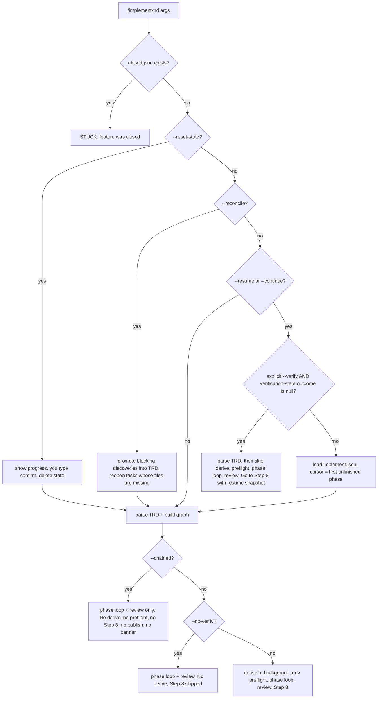
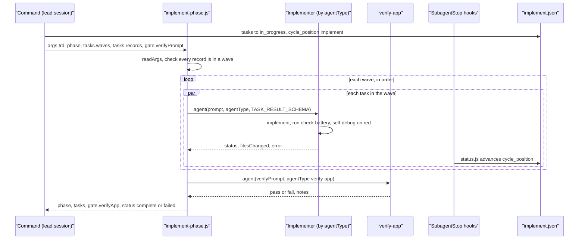

# `/implement-trd`: what happens when it runs

This page traces one `/implement-trd` run from start to finish. It covers every step, the order
they run in, who performs each one, and what each reads and writes. It does not explain why
you would run the command or when; [PROCESS.md](../guides/PROCESS.md) covers that. The
verification loop at the end of the run has its own page, [verification.md](verification.md),
and this page only summarises it.

**Sources.** Everything below is taken from these files. Where a step is named (for example
§4.4), it is a heading in the command file.

| File | What it is |
|---|---|
| [`packages/core/commands/implement-trd.md`](../../packages/core/commands/implement-trd.md) | The command: a prompt that the lead session (your Claude Code session) follows |
| [`packages/core/workflows/implement-phase.js`](../../packages/core/workflows/implement-phase.js) | The workflow script that runs a single phase. It is dispatched once for each phase group (adjacent phases that share no dependency or file, merged into one call; §4 below) |
| [`packages/core/lib/trd-parser.js`](../../packages/core/lib/trd-parser.js) | `parseTrd()` reads the TRD into tasks, grounding, open questions and deferred tasks |
| [`packages/core/lib/agent-routing.js`](../../packages/core/lib/agent-routing.js) | `resolveAgentType()` decides which implementer gets each task. `parseTrd()` calls it |
| [`packages/core/lib/task-graph.js`](../../packages/core/lib/task-graph.js) | `buildGraph()`, `phaseGroups()` and `renderWaveProfile()` decide what runs in parallel |
| [`packages/core/lib/implement-state.js`](../../packages/core/lib/implement-state.js) | `load`, `save`, `recordResult`, `checkpoint` and `reconcile` manage `implement.json` |
| [`packages/core/lib/discovered.js`](../../packages/core/lib/discovered.js) | `record`, `render` and `promoteToTrd` manage the log of problems found outside a task's scope |

**Who decides each step.** The framework is built on one split: code decides the shape of the
work, a model fills it in, and you decide what matters. The tables below mark every step with
one of three kinds:

| Mark | Meaning |
|---|---|
| **code** | Decided deterministically by a script, a library function, or a fixed rule the command copies without judging |
| **model** | Decided by an agent's judgement. That agent is the lead session or a subagent, and the table names which |
| **you** | Only you can decide it. The run either stops for you or never gets there without you |

---

## 1. The whole run at a glance

The top-level flow is drawn in
[PROCESS.md](../guides/PROCESS.md#implement-trd--build-it): preflight, then the phases, then
the review, then verification, then the readout. This table lists the same stages, with the
file and section where each one is defined.

| # | Step | Kind | Where it lives |
|---|---|---|---|
| 1 | Pick the TRD, refuse if the feature is closed, switch to the branch, write the feature pointer, take the lock | code (a fixed priority order the lead follows); a fresh lock left by another session asks **you** wait, force or abort | `implement-trd.md` §1.2, §1.3, §1.3a, §1.5 |
| 2 | Handle `--reset-state`, `--reconcile` or `--resume` | code; `--reset-state` also needs **you** | §2.1, §2.1a, §2.2 |
| 3 | Parse the TRD and build the task graph | code | §3.1, `trd-parser.js` `parseTrd()`, `task-graph.js` `buildGraph()` |
| 4 | Assemble one prompt per task | model (the lead fills in a fixed template) | §3.5, `packages/core/contracts/task-delegation.md` |
| 5 | Start the success-definition derive pass in the background: an agent that writes, from the PRD alone, the checklist verification will later judge the software against | model (`product-manager`) | §3.6 |
| 6 | Check that each environment in `verification.md` can be reached | model (lead); one batched question to **you** if a credential or approval is missing | §3.6a |
| 7 | Phase loop: dispatch, gate, record, test battery, checkpoint, commit | code (workflow, libs) + model (implementers, `verify-app`) | §4–§5, `implement-phase.js` |
| 8 | Review the whole branch once, applying fixes | model (built-in `code-review` skill) | §7.2 |
| 9 | Functional verification: does the software do what the PRD asked? | code (loop) + model (agents inside it) | §8, see [verification.md](verification.md) |
| 10 | Write the readout, publish the report link, send notifications | model (lead) | §9, §9.0a, §9.1, "Output discipline" |

---

## 2. Entry paths: what each flag changes

| Flag | What it changes | Where |
|---|---|---|
| *(none)* | A full run: derive in the background, environment preflight, every phase, review, verification, readout | Execution Model |
| `--resume` / `--continue` | Loads `implement.json` and checks that the checkpoint commit exists (if it is missing it offers pull, ignore or reset). Starts at the first phase that has an unfinished task. Tasks already marked `success` are left out of the dispatch. There is no resume point smaller than a task: a task interrupted partway through is run again from the start | §2.2 |
| `--reconcile` | Doesn't trust earlier success claims. First it promotes blocking discoveries into the TRD as new tasks. Then `reconcile()` reopens two kinds of task: those marked success where **none** of the files they claimed exist, and those left `in_progress` with `cycle_position: complete` by a killed run. After that it runs as a normal run, so tasks added to the TRD since the last run are picked up | §2.1a, `implement-state.js` `reconcile()`, `discovered.js` `promoteToTrd()` |
| `--include-deferred` | Dispatches tasks the TRD lists as deferred by design instead of setting them aside | §4.1a |
| `--resume --verify` (both typed) | Applies only when `verification-state.json` has `outcome: null`, which means a verification loop was interrupted. The run then goes straight to Step 8 and picks up after the last completed iteration. Any non-null outcome counts as finished and is never re-entered | §3.6 step 0, §8.2 |
| `--verify` alone | Changes nothing, because verification runs by default | User Input |
| `--no-verify` | No derive agent, no `success-definition.md`, and Step 8 is skipped. The readout says nobody checked the software against the PRD | §3.6, §8, §9 |
| `--chained` | Used by `/verify-build --fix` and by `/audit-build`'s own fix run (the audit's chained run, which `audit-rounds.js` allows at most two re-audits after, so three audits per feature at most), which pass it through `Skill({skill: "implement-trd", args: "<trd> --reconcile --chained"})`. It skips the derive pass, the environment preflight, Step 8, publishing, the banner and notifications. The run ends with one line, `[STATUS: /implement-trd] RETURN → …`, so the calling command's banner is the run's only one. Under `/audit-build` the fix run is chained inside the audit's own run, and it fixes test-only gaps in the same pass without causing another audit; only a true product defect triggers a re-audit, and test findings matter only when they mask a defect (then they are reported as that defect). Requirements with no covering task are never handed to it (they stop for design). A re-audit checks the previous round's defects plus the changed files only, never a fresh sample, and reuses the previous requirement list when the TRD's Objectives and Master Task List are unchanged. At the re-audit cap with defects open, the feature stays open and closing is your call (`/close-feature`). A wake-up for an audit that already ran does nothing; the full rules are in [other-commands.md](other-commands.md). Phase gates, commits and the review still run | §3.7 |
| `--reset-state` | Shows the current progress and requires you to type `confirm`, then deletes the state file | §2.1 |

The closed-feature check comes **before** every flag. It runs before the branch switch, before
`current.json` is written, and before `--reset-state` deletes anything. A resumed run cannot
reopen a feature by accident. To reopen one, you delete `closed.json` (§1.2).

---

## 3. Preflight (Step 1)

| Step | What happens | Kind | Reads / writes |
|---|---|---|---|
| Coverage floors (§1.1) | Reads the unit and integration floors from the constitution's `## Quality Gates`. If it cannot read them, it reports `coverage floor unreadable — not enforced` and never substitutes a default | model (reads a fixed section) | reads `.claude/rules/constitution.md` |
| Choose the TRD (§1.2) | Takes the first of these that matches: (1) a path given as an argument. (2) A slug derived from the branch name (`<issue-id>-<session>` or `feature/<trd-name>/<session>`), matched against `docs/TRD/*.md` and `.trd-state/*/`. (3) The only `implement.json` that has unfinished tasks and no `closed.json`. (4) Otherwise STUCK, listing the candidates | code (fixed order) | reads the git branch, `docs/TRD/`, `.trd-state/` |
| Closed-feature guard (§1.2) | If `.trd-state/<feature>/closed.json` exists, the run stops with `COMMAND STUCK` and names the date. Under `--chained` it returns `RETURN → STUCK` instead | code | reads `closed.json` (written by `/close-feature`, see [other-commands.md](other-commands.md)) |
| Branch (§1.3) | Switches to the feature branch, creating it if needed. If the tree is dirty, suggests `git stash` | code | git |
| Feature pointer (§1.3a) | Writes `{prd, trd, status, branch}` and keeps any key it cannot work out. Three things read it: the dispatch ledger, `notify-complete.sh` and the SessionStart banner (see [hooks.md](hooks.md)) | code | writes `.trd-state/current.json` |
| Strategy (§1.4) | Chooses a strategy in this order: argument, then TRD, then constitution, then keywords, then the default `tdd`. The values are `tdd`, `characterization`, `test-after`, `bug-fix`, `refactor` and `flexible`. Under `tdd` the implementer writes the failing test and the fix in the same task | code | reads the TRD |
| Lock (§1.5) | If `implement.lock` is less than 30 minutes old, it warns and offers wait, force or abort. It writes the lock with the session id | model; the offer goes to **you** | `.trd-state/<feature>/implement.lock` |
| Non-goals and risks (§1.6) | Takes TRD §8 (non-goals) as hard limits on scope and TRD §7 (risks) as the list checked when a task gets stuck | model | reads the TRD |

---

## 4. Parse, graph, and prompts (Step 3)

The lead runs one `node -e` call (§3.1) that returns a single object:

- **From `parseTrd()`:** `tasks[]`, `phases`, `grounding` (per task: the files it touches, what
  to reuse, what it replaces, what to follow, what to be careful of), `couldNotVerify[]`,
  `openQuestions[]`, `deferred[]`, `decision` and `warnings[]`. Each task already carries an
  `agentType`. `parseTrd()` sets it through `agent-routing.js` `resolveAgentType()` in this
  order: the `Agent:` line in the TRD's Execution Plan, then a keyword match on the
  description, then `backend-implementer`. It is never left unset, because an unset type would
  run implementation on the session's model, which is roughly 5× the price.
- **From `buildGraph()`:** `edges`, `waves`, `criticalPath`, `cycles` and `partition`. An edge
  comes from one of two sources:
  - a declared dependency;
  - a **file conflict**: two tasks whose `Touches` lists share a file. The task with the
    lexically smaller ID goes first, so the same TRD always produces the same waves, unless a
    declared dependency between the same two tasks runs the other way, in which case the
    conflict edge follows the declaration (`buildGraph()` step 2).

  A **wave** is a set of tasks whose blockers are all in earlier waves, so everything in one
  wave can run at once. Tasks caught in a cycle, and everything downstream of them, appear in
  no wave; that is why a cycle is fatal.
- **From `phaseGroups()`:** adjacent phases with no edge of either kind between them, for
  example `[[1,2],[3],[4,5]]`. Each group is dispatched as **one** workflow call, with one
  gate, one commit and one banner (`PHASE 1-2/5`).
- **From `renderWaveProfile()`:** a single line giving each wave's width, the average width,
  and, when the plan is nearly serial, what causes it. This line goes into the first
  DISPATCHED banner so you can see a plan that is too serial before any time has been spent.

| Step | What happens | Kind | Where |
|---|---|---|---|
| Fatal checks | Zero tasks parsed → STUCK (check that the Master Task List is a table). A dependency cycle → STUCK, naming every task in the cycle | code | §3.1 Error Handling |
| Non-fatal warnings | Malformed rows, unknown dependency IDs and missing grounding are printed in the DISPATCHED banner | code | §3.1 |
| Owner-only open questions | Every question marked owner-only that touches a phase's tasks is printed in that phase's banner **and** written into the task's prompt, with the assumption the run proceeds on. It is never asked | model (matches the question to its tasks) | §3.2 |
| Skills | Uses the TRD's `Skills` column, or else the agent's frontmatter `skills:`. Only skills the agent itself declares are kept | code | §3.4 |
| Prompt assembly | Fills the placeholders in `task-delegation.md`: grounding, unverified claims, open question, the TRD's `## Decision` (added to **every** task), non-goals, acceptance criteria, UI context. It then appends `<check_battery>` (tests to run on changed files, plus "debug it yourself before reporting failure") and `<discovered>` (how to record something that is not this task's work) | model (fills a fixed template) | §3.5 |
| Deferred tasks | Tasks the TRD lists under `Deferred by design` get `task.deferred = true`. They are left out of the waves, recorded as `deferred`, and named in the PHASE banner and in the readout's STATE, unless `--include-deferred` is set | code | §4.1a, `trd-parser.js` `parseDeferred()` |

---

## 5. Two things that start before the first phase

**The success-definition derive pass (§3.6).** Verification needs a list of criteria that
were written **without** reading the plan. Otherwise the plan would pass its own test by
construction. The lead does three things:

1. It finds a source, taking the first that exists: the TRD's `**Source PRD**:` header; the
   `prd` in `current.json`; the text of one of the TRD's own sections, `## Reproduction`,
   `## Intended Change` or `## Behaviour Preserved`. If there is no source, it records
   `not run: no success definition derivable`.
2. It records `functional_verification` (`prd_resolved`, `prd_path`, `source_kind`) on the
   state object in memory and saves it with `implement-state.save()`. Step 8 needs this after
   hundreds of tool calls, possibly after the conversation has been compacted.
3. It dispatches `Agent({subagent_type: "product-manager", run_in_background: true})`. The
   agent receives the verification contract, the source, and the output path
   `.trd-state/<feature>/success-definition.md`. **It gets no TRD path, no excerpt from the
   TRD, and no task list.** The lead does not wait for it.

**Environment preflight (§3.6a).** This checks whether the environments are usable before any
time is spent building against them.

1. `functional-verification.js check-verification-unfilled` reports whether
   `verification.md` is still the unmodified template, or is missing sections.
2. Each environment declared in `verification.md` §1 is marked `usable`, `unusable`, or needs
   something from you (an expired credential, a deploy approval). All of the environments that
   need you go into **one** batched question. If you don't answer, the stated default applies:
   `needs-owner-declined`.
3. The result is saved as `functional_verification.environments`. At this point it covers
   environments only. Criteria don't exist yet, so assigning each one to an environment and a
   lane waits until §8.1a.

---

## 6. The phase loop (Steps 4–5)

### 6.1 Inside one phase: `implement-phase.js`

| # | Step | Kind | Where |
|---|---|---|---|
| 1 | *Lead:* marks each task in the group that is not `success` as `in_progress` / `implement` and saves **before** it dispatches | code | §4.1 |
| 2 | *Lead:* keeps only this group's unfinished tasks in `graph.waves`, drops waves that end up empty, and makes the one `Workflow` call | code | §4.2 |
| 3 | *Workflow:* validates the arguments. A task with a record but in no wave causes a **throw**, because it would silently never run. An empty wave list returns `complete` with `skipped: true`, which is what a resume sees when every task is already done | code | `implement-phase.js` top-level checks (lines 72–129) |
| 4 | Runs the waves one after another. Tasks inside a wave run in parallel with `parallel()`. A wave starts only after the previous one has finished | code | `implement-phase.js` "1. DISPATCH" loop |
| 5 | Each task goes to `agent(rec.prompt, {agentType})`. If `agentType` is missing it falls back to `backend-implementer`. The agent must return `{status, filesChanged, error?}` | model (the implementer) | `implement-phase.js` `TASK_RESULT_SCHEMA` |
| 6 | Checks and self-debug happen **inside** the implementer's own task. It runs the `<check_battery>` and fixes red results itself. No separate debugging agent is started | model | §3.5 `<check_battery>` |
| 7 | Four outcomes count as a task failure: no record, the agent returned nothing, a non-success status, or the task was never dispatched. Each is recorded and never thrown | code | `implement-phase.js` wave-outcome loop, `taskList` |
| 8 | Gate: one `verify-app` agent runs the suite against files changed since the last checkpoint (or since `git merge-base main HEAD`), checks every acceptance criterion in the phase, and returns `pass` or `fail`. It runs even when tasks failed. If it returns nothing, the gate counts as `fail` | model | §4.3 `verifyPrompt`, `implement-phase.js` "2. GATE" |
| 9 | `status` is `complete` only if every task succeeded **and** `verify-app` passed | code | `implement-phase.js` RETURN |

The gate no longer runs `code-simplifier` (removed 2026-08-18) or a per-phase review (removed
2026-08-28). The `gate.simplify` and `gate.review` fields still appear in the return value, but
they are always `skipped` or empty.

**Hooks during a phase** (details in [hooks.md](hooks.md)):

- `dispatch-ledger.js` writes a start row and a stop row for every subagent to
  `.trd-state/<feature>/dispatch.jsonl`.
- `status.js` (SubagentStop) moves every `in_progress` task forward one step
  (`implement → checks → debug → complete`). This is a best-effort marker, not the record of
  what happened.
- `precompact.js` appends the in-flight context to `session-log.md` if the conversation is
  compacted.

### 6.2 After the workflow returns: the command's side

| # | Step | Kind | Where |
|---|---|---|---|
| 1 | For each task, `recordResult(state, id, {status, filesChanged, filesDeleted, error})`. **Attestation:** a success claim is changed to `failed` when *none* of the claimed files exist, or, for a deletion task, when none of the deleted files are gone | code | §4.4, `implement-state.js` `recordResult()` |
| 2 | Branches on the status that `recordResult` **wrote**, not on the status the workflow returned. The two differ exactly when attestation catches a false success | code | §4.4 |
| 3 | Runs the project's own full test battery. It resolves the command from `stack.md`/`constitution.md`, then the `package.json` scripts `smoke`, `test:ci`, `test`, then `pytest`/`go test`/`cargo test`/`rspec`/`mvn test`. If none is found the battery is **skipped**, and the banner says so. A skipped battery does not fail the phase | code (fixed order) | §4.4 |
| 4 | **Failure** (a task failed, verify-app failed, or the battery was red): if every failed task has `retry_count < 3`, the **whole group** is dispatched again, including tasks that succeeded. Otherwise the run is STUCK (§10.1) and says whether the failure matches a documented risk | code | §4.4, §10.1 |
| 5 | **Success:** `checkpoint(state, N, {commit, review})`, advance `phase_cursor`, save | code | §5.1 |
| 6 | `git add -A`, then `git commit -m "chore(phase N): checkpoint (...)"`, then `git push -u origin <branch>` | code | §5.2 |
| 7 | Prints the `PHASE N/M COMPLETE` banner, then `discovered.render()` for that phase (it prints nothing if nothing was recorded). Discoveries don't pause the run and are never acted on automatically | code | §5.3 |
| 8 | Goes straight on to the next group. Nothing in the loop asks you anything | code | §5.3, §10 |

When the tasks in a group are dispatched as a **group** (§4.0), it is still one call over
waves that were computed for the whole TRD. So every dependency and every shared-file ordering
is honoured. The one unsafe design, running two phase workflows at the same time, never
happens.

---

## 7. End-of-run review (Step 7)

`Skill({ skill: "code-review", args: "high --fix {branch_base}...HEAD" })`, run once over the
whole branch diff. **model.** The built-in reviewer forks its own background agents and applies
what it finds to the working tree. The lead reports only that the review was dispatched and
does not claim it will report back later. There is no per-phase review and no three-lens
hardening pass. Both were removed on 2026-08-28; the reasoning is in §7.1.

---

## 8. Functional verification (Step 8), in summary

Step 8 makes a single workflow call. It does not run a loop itself. The steps run in this
order: §8.1 (or §8.2 when resuming), then §8.1b, then §8.1a, then §8.3, then §8.4.

| Step | What happens | Kind |
|---|---|---|
| §8.1 | Reads `functional_verification` from `implement.json`. There are three outcomes. **No source** gives `not run: no success definition derivable`. **A source but no file** means the derive agent died, and gives `not run: no definition produced`. **The file exists** means its table is parsed into `criteria`, and zero rows is a legitimate result. Both `not run` reports are written by `functional-verification.js render-report`, never by hand | code |
| §8.2 | Resume only, in place of §8.1: parses the definition the same way, runs §8.1b, then drops resumed verdicts for criteria that no longer exist or that carry one of your comments, and builds `resume: {iteration, criteria, gapsClosed}`. If the environment preflight (§3.6a) never ran on this path, it runs it now | code |
| §8.1b | Adds one criterion per screen, journey or data view for each check the TRD's `## Verification Artifacts` section selects (`check` rows in `framework-skills.txt`). It also reads your comments from the published check pages | model |
| §8.1a | Assigns each criterion to an environment and a lane (a group of criteria that share one limited resource, run at most N at a time). Lanes come from `verification.md` §1a: a count above 1 is a pool, a count of 1 is a queue, and a count of 0 means not verifiable. It also sets `refreshCommand`/`fullRunCommand` (from §2) and `coverageFloor` (from §5a) | model (fixed rules) |
| §8.3 | `Workflow({name: "verify-functional", args: {...}})`. `since` = the later of HEAD's commit time and the loop start | code |
| §8.4 | Carries `outcome`, `reportPath`, `criteria`, `coverage`, `finalRun` and `pages` into the readout | code |

While the loop runs, the lead **must not** fix gaps itself or offer to fix them (§8.5). The
loop's own debug stage owns fixes. The inside of the loop (Exercise, Judge and Debug; the
evidence gate; and the stop rules `satisfied`, `stalled`, `stuck`, `unbuilt` and
`insufficient-coverage`) is covered in [verification.md](verification.md).

---

## 9. Completion (Step 9)

| Step | What happens | Kind | Where |
|---|---|---|---|
| Readout | Four sections: **STATE** (tasks built and not built, each with the reason; tests; the verdict as a sentence; coverage floor; one line per check; a diagnosis by cause when the outcome is not `satisfied`), **DECISIONS** (including tasks `--reconcile` reopened), **ISSUES** (each says who acts), **NEXT** (one command: `/refine-verification` then `/verify-build` after a failed verification, or else `/audit-build`, or `gh pr create`) | model | §9 |
| Publish | Unless `ensemble.publishArtifacts: false`, `--no-verify` or `--chained`, publishes `verification-report.md` and each check page (`<pagesDir>/<skill>/index.html`) as artifacts. The URLs are stored in `.trd-state/<feature>/artifacts.json` so the same links update in place next time. If publishing fails, the readout says so in one line and the run carries on | model | §9.0a |
| Pull request | `/implement-trd` itself opens no pull request. `ensemble.openPullRequest` (`auto` or `never`; the shipped default is `never`, this repo sets `auto`) decides whether the closing commands do: with `auto`, a passing `/audit-build` that closes the feature opens one, and so does `/close-feature` on a feature branch. When a PR is already open it is updated instead; a closed one is ignored. A skip (setting is `never`, on the default branch, `gh` missing) or a failure is one line in the readout and never blocks. Merging is always yours | model | `/audit-build`, `/close-feature` |
| Banner | `═══ COMMAND COMPLETE: /implement-trd ═══` plus a one-line summary, as the **last** line. Nothing may follow it | model | §9.1 |
| Notify | `PushNotification` and `.claude/hooks/notify-complete.sh "implement-trd" "complete" "
"`, on the final turn only. STUCK sends both with the reason | model | "Output discipline" 5–6 |

When the lead is re-entered in a later turn, it starts with a `RESUMED` line and runs
`node .claude/hooks/dispatch-ledger.js --open` before deciding anything. It does not rely on
its memory of what it dispatched ("Output discipline" 2).

---

## 10. When the run stops for you

| Condition | What you see | Where |
|---|---|---|
| Feature closed | `COMMAND STUCK`: delete `closed.json` to reopen | §1.2 |
| TRD cannot be resolved | `COMMAND STUCK` listing the candidate TRDs | §1.2 |
| TRD parses to zero tasks | STUCK: check that the Master Task List is a table | §3.1, Error Handling |
| A dependency cycle | `IMPLEMENTATION PAUSED` box, with the stage shown as "graph cycle" and every task in the cycle named | §3.1, §10.1 |
| A task fails 3 times | `IMPLEMENTATION PAUSED` with options fix, skip, retry, abort, and contingency if the TRD documents one | §10.1 |
| Another session's lock is under 30 minutes old | Options wait, force or abort | §1.5 |
| `--resume` finds the checkpoint commit missing | Options pull, ignore or reset | §2.2 |
| The state file fails validation | Git-history reconstruction is attempted, then options accept, checkpoint or fresh | §2.3, §2.4 |
| `git push` fails | Retried 3 times with backoff, then the run pauses | Error Handling |
| An environment needs a credential or approval | One batched question before the phase loop | §3.6a |
| `--reset-state` | A progress summary, then a request to type `confirm` | §2.1 |
| Workflow has not returned after 30 minutes | Options wait, restart or skip | "Task Timeout" |

Under `--chained`, the closed-feature stop and retry exhaustion never wait for you: each
returns `[STATUS: /implement-trd] RETURN → STUCK: <reason>`, and `/verify-build` ends the run
(§1.2, §3.7, §10.1). The environment question never fires, because the preflight is skipped.
The command text does not say how the other stops above behave under `--chained`.

---

## 11. Files the run reads and writes

| Path | Written by | Read by |
|---|---|---|
| `.trd-state/current.json` | §1.3a | ledger, `notify-complete.sh`, SessionStart context |
| `.trd-state/<feature>/implement.json` | `implement-state.save()` (§3.6, §4.1, §4.4, §5.1); `status.js` hook | every resume, `/audit-build`, `/close-feature` |
| `.trd-state/<feature>/implement.lock` | §1.5 | §1.5 |
| `.trd-state/<feature>/discovered.jsonl` (via `ledgerPath()`) | implementers through `discovered.record()` | §5.3 `render()`, §2.1a `promoteToTrd()` |
| `.trd-state/<feature>/dispatch.jsonl` | `dispatch-ledger.js` hook | RESUMED turns (`--open`) |
| `.trd-state/<feature>/session-log.md` | `precompact.js` hook | the lead after compaction |
| `.trd-state/<feature>/success-definition.md` | `product-manager` (§3.6); check rows added at §8.1b | §8.1 |
| `.trd-state/<feature>/verification-state.json`, `verification-report.md` | the Judge agent inside `verify-functional` (on the two `not run` exits, the lead via `render-report`) | §3.6 step 0, §8.2, `/verify-build` |
| `.trd-state/<feature>/evidence/`, `verification-artifacts/` | the Exercise (`verify-app`) and Render agents inside `verify-functional` | the Judge; §9.0a publishes the check pages |
| `.trd-state/<feature>/artifacts.json` | §9.0a | §8.1b (comments), later publishes |
| git: one `chore(phase N)` commit per phase group, pushed | §5.2 | `--resume` (§2.2), state repair (§2.4) |

---

## 12. Where the command text and the code disagree

These disagreements were found while writing this page. The code is what actually runs.

- **`filesDeleted` cannot reach the command.** The command's §4.4 says the workflow returns
  `filesDeleted`, and that a deletion task needs it to avoid failing attestation. But
  `implement-phase.js` `TASK_RESULT_SCHEMA` sets `additionalProperties: false` and has no
  `filesDeleted` field, and the task list it builds copies only `status`, `filesChanged` and
  `error`. A task whose only work was deleting files will therefore fail attestation.
- **Implementer routing is now code, not prose.** §3.3 describes a three-step rule that the
  lead applies. In fact `parseTrd()` already sets `task.agentType` through `agent-routing.js`,
  and the keyword table in code differs from the one in §3.3: a different order (checks
  `agent-implementer` first) and different keywords.
- **The phase gate's review fields are always empty.** §5.3 says to print
  `gate.review.summary`. `implement-phase.js` hard-codes it to `[]`, because the review was
  removed.
- **The workflow's description overstates its gate.** `implement-phase.js` `meta.whenToUse`
  says it gates "with verify-app and the deterministic battery". The battery is run by the
  command (§4.4), not by the workflow.
- **The checkpoint needs a commit that does not exist yet.** §5.1 calls
  `checkpoint(state, N, {commit: $COMMIT_SHA, …})` and saves, and only then does §5.2 run
  `git commit`. Read literally, the SHA recorded is the previous commit. The lead has to reorder
  the two steps, or record the new SHA afterwards, to get it right.
- **The lock exists only in prose.** No script writes or reads `implement.lock`. §1.5 depends
  on the lead model to handle it.
