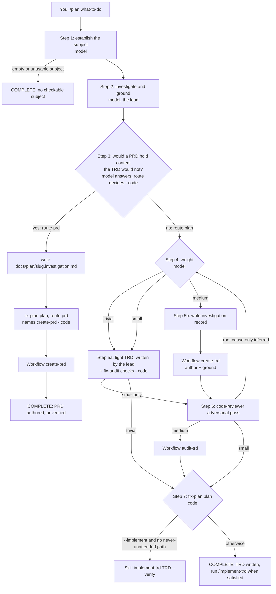
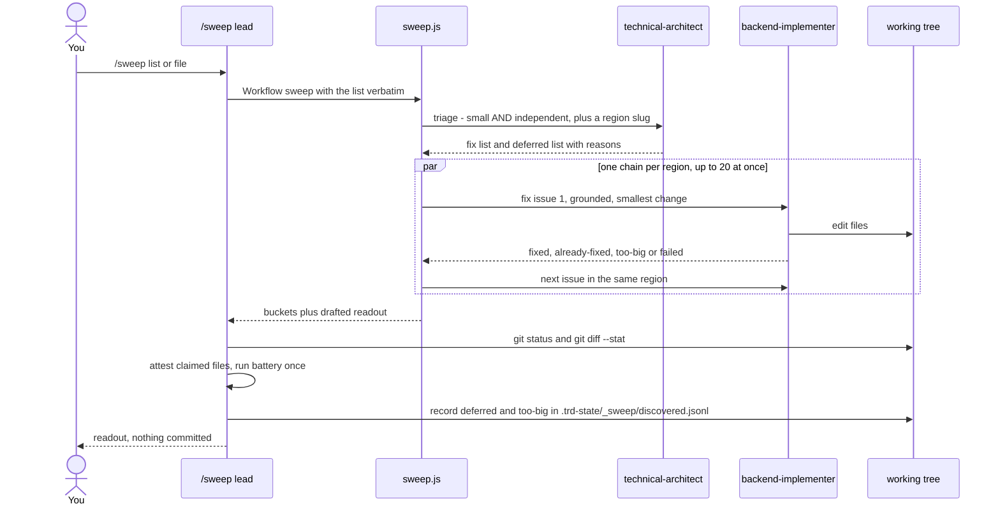
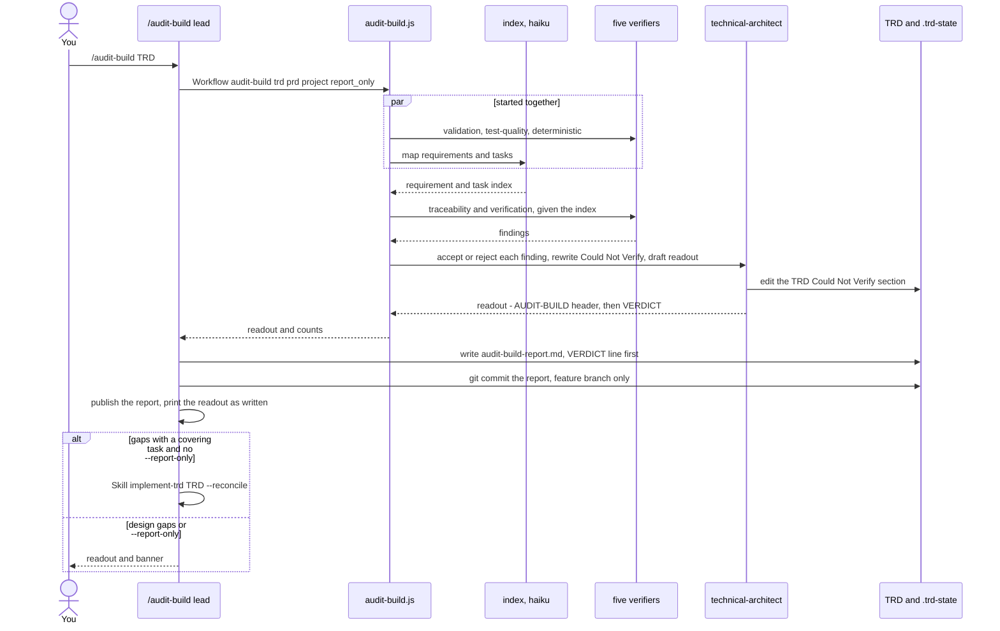

# Reference: the other commands

What happens inside `/plan`, `/sweep`, `/amend`, `/audit-build` and `/close-feature`, step by
step, and briefly inside the maintenance commands. For *when* to reach for each one, see
[`docs/guides/PROCESS.md`](../guides/PROCESS.md) §1 and §4; this page does not repeat it.

Every step says who does it and where it lives, so any box can be checked against the source:

| Mark | Meaning |
|---|---|
| **code** | decided deterministically — a script or lib, or a fixed rule the lead applies with no judgement (a file exists or not, a branch matches or not) |
| **model** | an agent's judgement — the lead session running the command, or a subagent |
| **you** | the owner decides |

"The lead" means the Claude Code session that is running the slash command. A "workflow" is a
script under `packages/core/workflows/` that the lead starts with one `Workflow(...)` call; it
dispatches its own subagents and returns a result, and its intermediate output never enters the
lead's context. Command files live in `packages/core/commands/`, libs in `packages/core/lib/`
(vendored into a project as `.claude/lib/`).

Related pages: [README](README.md) · [implement-trd](implement-trd.md) ·
[authoring](authoring.md) · [verification](verification.md) · [hooks](hooks.md) ·
[agents](agents.md).

**Top-level flow of each command:** see the diagrams in
[`docs/guides/PROCESS.md`](../guides/PROCESS.md). This page does not redraw them. The diagrams
kept here go one level deeper: `/plan`'s routing across weights, and which subagents `/sweep`
and `/audit-build` dispatch, in what order.

---

## `/plan` — size the work, write a TRD to match, stop

Source: `commands/plan.md`; libs `plan-weight.js` (`route()`, `stages()`, `verification()`),
`fix-plan.js` (`plan()`), `fix-sizing.js` (`matchNeverUnattended()`), `fix-audit.js`
(`audit()`), `trd-parser.js`.

Two independent axes describe the work. **Kind** is what sort of change it is — `defect` (the
reproduction must stop reproducing), `change` (a stated outcome must hold), `refactor`
(behaviour must be unchanged). **Weight** is how much verification it earns — `trivial`,
`small` or `medium`. Kind changes what the TRD must contain; weight changes which stages run.
Neither decides whether building starts: only `--implement` does.



| # | Step | Kind | Where | What it does |
|---|---|---|---|---|
| 1 | Establish the subject | model | `plan.md` Step 1 | Strips `--implement` from the argument. A bare `/plan` reads the conversation and prints `SPECCING: <one line>`, then proceeds. Asks only if the conversation holds more than one candidate subject, or none stated in checkable terms. |
| 1.1 | Pre-triage | model | Step 1.1 | Rejects only an empty or unstated subject — never on size. |
| 2 | Investigate | model | Step 2a–2d | Defect: reproduce, find the mechanism, mark the root cause `[ran]` or `[inferred]`. Change: confirm current behaviour. Refactor: find and run the covering tests before touching anything; no tests means `covered: false`, not an abort. |
| 2e | Ground | model | Step 2e | For every file the fix touches: what it does now, what to reuse, what this replaces, conventions, hazards. Each claim marked `[ran]` / `[read]` / `[inferred]`. |
| 2f | Absorb blockers | model | Step 2f | A defect the requested work cannot succeed without becomes a task. Each candidate gets one line in the TRD's `## Decision`: `absorbed … [BLOCKS]` or `not absorbed … <why>`. An audit finding that changes *how* the fix is written is a correction, not extra scope. |
| 3 | Exit test | model → code | Step 3; `plan-weight.js` `route()` | The lead writes one sentence answering "would a PRD hold anything the TRD would not — personas, user value, trade-offs about what to build?" `route({prdWouldHaveContent})` takes that one boolean and nothing else (no task or file count), returning `'prd'` or `'plan'`. |
| 3a | Route `prd` exit | model + code | Step 3 "Route: `'prd'`"; `fix-plan.js` `plan()` | Writes `docs/plan/<slug>.investigation.md` first, then asks `plan({route:'prd'})`, which names `create-prd` as the next step. The lead runs `Workflow(create-prd)` (not the `/create-prd` command, which is manual-only), skips the session-fidelity pass because the record is a source file, and emits `/plan`'s own banner: PRD authored, **unverified**, NEXT `/audit-prd`. |
| 4 | Decide the weight | model | Step 4 | A judgement, not a formula, and no `--weight` flag. `stages({kind, weight})` then returns the stage list (table below). |
| 5a | Light TRD | model + code | Step 5a, 5a.1; `fix-audit.js` `audit()` | The lead writes `docs/TRD/<slug>.md` itself: Objectives, the kind's section (`## Reproduction` / `## Intended Change` / `## Behaviour Preserved`), `## Decision`, Non-Goals, Verification Artifacts, Open Questions, Master Task List (`FIX-001`…), Task Grounding, Could Not Verify. No phases. Then `audit()` checks it parses the way `/implement-trd` will read it: grounding has a `Touches` field, cited paths exist, each task serves a stated objective, the Verification Artifacts section is well formed. |
| 5b | Phased TRD | model | Step 5b | Writes `docs/plan/<slug>.investigation.md`, then `Workflow(create-trd)` with that file as its source — the `technical-architect` authors and the workflow grounds (see [authoring](authoring.md)). |
| 6 | Adversarial pass | model | Step 6 | One `code-reviewer` subagent judges five things: root cause vs symptom, regressions in each caller, a simpler fix, conflict with local convention, whether the declared kind matches the diff. Reports only. Runs once; it may send the weight back up, never down. |
| 5b cont. | Audit | model | Step 5b "Verify" | `Workflow(audit-trd)` against the investigation record (see [authoring](authoring.md)). |
| 7 | Implement or stop | code | Step 7; `fix-sizing.js` `matchNeverUnattended()`, `fix-plan.js` `plan()` | Touched files are matched against the owner's never-unattended paths in `verification.md`. `plan()` returns whether to write `current.json`, whether to chain, and the banner. Work begins only when `--implement` was passed **and** no never-unattended path matched. A touched path listed in `verification.md` §5b stops `--implement` — checked by `check-never-unattended <trd> <verification.md>` (`functional-verification.js`), which also stops the chain on an unreadable §5b list rather than treating it as empty. |

### What each weight runs

From `plan-weight.js` `stages()`. The lists are strict supersets of each other.

| Weight | Stages | TRD | Who writes it |
|---|---|---|---|
| `trivial` | investigate, author-trd, implement | light | the lead |
| `small` | + adversarial | light | the lead |
| `medium` | + ground, audit | phased | `create-trd` workflow, then `audit-trd` workflow |

`verification({kind, weight})` adds the kind-specific rules: a defect must state its root cause
with its marker; a change must not carry a "before" run (there is nothing to preserve); a
refactor needs before-run, after-run and public-surface check **only at `medium`** — at
`trivial`/`small` its "behaviour unchanged" claim has nothing behind it, an accepted risk.
At `medium` with kind `change` and open questions left after the audit, NEXT names
`/refine-trd` — named, never invoked.

### What gets written

| File | When | Written by |
|---|---|---|
| `docs/plan/<slug>.investigation.md` | route `prd`, and every `medium` | the lead, before any workflow call, so a crash cannot lose the investigation |
| `docs/TRD/<slug>.md` | every route `plan` run | the lead (light) or `create-trd` (phased) |
| `docs/PRD/<slug>.md` | route `prd` | `create-prd` workflow |
| `.trd-state/current.json` | only when work begins (`plan()` `writePointer`) | the lead |
| artifact link in `.trd-state/<slug>/artifacts.json` key `trd` | publishing on | the lead |

### The `--implement` chain

On a chained run the lead prints `plan()`'s `handoffLine`, calls
`Skill({skill: "implement-trd", args: "docs/TRD/<slug>.md --verify"})`, and emits **no** banner
or completion notify of its own: `/implement-trd` ends the run with its banner (see
[implement-trd](implement-trd.md)). Every non-chained path ends with
`═══ COMMAND COMPLETE: /plan ═══` and one `notify-complete.sh` call.

---

## `/sweep` — many small unrelated fixes, in parallel

Source: `commands/sweep.md`; workflow `workflows/sweep.js`; lib `discovered.js` `record()`.
For a list of issues from walking an app. The test for fitting here is coupling, not size.



| # | Step | Kind | Where | What it does |
|---|---|---|---|---|
| 1 | Resolve the list | model | `sweep.md` Step 1 | A readable file path is the list; anything else is the list, verbatim. The owner's words are not paraphrased. |
| 2 | Triage | model | `sweep.js` phase `Triage` | One `technical-architect` at low effort sorts each issue: small (one or two files, no schema, no API contract) **and** independent → `fix` with a region slug; anything else, or anything unclear → `deferred` with a reason. It reads no code. |
| 3 | Group by region | code | `sweep.js` phase `Fix` | Issues with the same region go into one chain, run one after another, because two agents editing one file lose each other's work. Regions run in parallel, batched at 20 (`MAX_PARALLEL_REGIONS`, the platform's subagent pool). |
| 4 | Fix | model | `sweep.js` `fixPrompt` | One `backend-implementer` per issue (always this type, whatever the area): ground first, smallest change, run the narrowest check, list every changed file. May return `too-big` — it has read the code, triage had not — or `already-fixed` with evidence. |
| 5 | Account for every issue | code | `sweep.js` after `parallel()` | Every triaged issue must land in exactly one bucket, or the workflow throws. The issue id comes from the dispatch, never from the agent's reply. |
| 6 | Attest against disk | code + model | `sweep.md` Step 3 | The lead runs `git status --porcelain` / `git diff --stat`. An issue whose claimed files are all untouched is reported **failed**, whatever the agent said. Then the project's check battery runs once for the whole batch. |
| 7 | Record what was not done | code | `sweep.md` Step 4; `discovered.js` `record()` | Each deferred or too-big item is appended to `.trd-state/_sweep/discovered.jsonl` so it survives the session. |
| 8 | Readout | model | `sweep.md` Readout | Fixed / already fine / too big / failed, in the reporter's words. **Nothing is committed** — the owner splits the batch into commits. |

---

## `/amend` — one change to the feature in flight

Source: `commands/amend.md`; libs `agent-routing.js`, `discovered.js`, `implement-state.js`
(`load()`, `save()`, `recordResult()`). It acts — there is no plan-then-stop mode.
Top-level flow: [PROCESS.md](../guides/PROCESS.md).

| # | Step | Kind | Where | What it does |
|---|---|---|---|---|
| 0 | Feature in flight | code | `amend.md` "What this is for" | Nothing in `.trd-state/current.json` → nothing to amend; stop and point at `/plan`. |
| 0a | Closed-feature guard | code | "Closed-feature guard" | `<feature>` is the TRD basename. If `.trd-state/<feature>/closed.json` exists: `COMMAND STUCK`, write nothing. Reopening means deleting that file. |
| 1 | Is this one task? | model | Step 1 | Not one task if it needs an unmade product decision, needs ordering between parts, needs more than one implementer specialism, or is several changes. File count is deliberately not a signal. If not one task: stop, say which signal fired. |
| 2 | Ground it | model | Step 2 | What the touched files do, what this replaces, local conventions; claims marked `[ran]`/`[read]`/`[inferred]`. |
| 3 | Record before doing | model + code | Step 3 | Writes one Master Task List row `AMEND-<nnn>` into the TRD **before** the change, so a crash leaves a record `--reconcile` will pick up; appends a discovery with `blocksFeature: true`. |
| 4 | Do it | model | Step 4 | Dispatches one implementer with an explicit `agentType` chosen by `agent-routing.js` — never unset, which would run the generic subagent on the session model. |
| 5 | Verify and attest | code | Step 5; `implement-state.js` `recordResult()` | Runs the check battery, then records the result in `implement.json` (seeding the file or task entry if missing). `recordResult()` marks a success claim `failed` if its files do not exist; deleted files go in `filesDeleted`. The lead reads the status back and believes it over its own report. |

It never chains and never grows: extra scope found mid-flight becomes a discovery record and a
stop (`amend.md` "What this command must not do").

---

## `/audit-build` — check the delivered code against the TRD and PRD

Source: `commands/audit-build.md`; workflow `workflows/audit-build.js`. Model-invocation is
disabled (`disable-model-invocation: true`): it runs only when you type it.

It answers three questions — does the code match the TRD's tasks (verification), the PRD's
requirements (validation), and does every requirement have both an implementation **and** a
test that proves it (traceability, the headline). Code with no proving test is a gap, not a
pass.



| # | Step | Kind | Where | What it does |
|---|---|---|---|---|
| 1 | Resolve inputs | code | `audit-build.md` "User Input" | TRD from the argument or `current.trd`; PRD from `--prd` or `current.prd`. No TRD anywhere (closing a feature nulls `current.json`) → `COMMAND STUCK`, workflow not called. Parses `--report-only`. |
| 2 | Index | model | `audit-build.js` phase `Index` | A Haiku agent maps every task (id, description, Touches) and every requirement (id, statement, which tasks serve it), plus Could Not Verify and Open Questions rows. A map, not a review. |
| 3 | Verify | model | phase `Verify`; `INDEX_FREE_VERIFIERS`, `INDEX_BOUND_VERIFIERS` | Five verifiers in parallel (table below). The three that need no index start alongside the Index stage. |
| 4 | Guard an empty index | code | `EMPTY_REQS`, `EMPTY_TASKS` | Zero requirements or zero tasks indexed is never reported as clean — the readout and Could Not Verify say traceability was unchecked. |
| 5 | Reconcile | model | phase `Reconcile` | A `technical-architect` (Opus, high effort — the one deliberately expensive judgement) re-opens each disputed file, accepts or rejects each finding naming the refuting file, and rejects absence claims that do not show the search that was run. Rewrites the TRD's `## Could Not Verify` section. Drafts the readout: an `AUDIT-BUILD:`/`PRD:` header, then the VERDICT line. With zero findings a `backend-implementer` does only the Could Not Verify rewrite and the workflow's own code builds the readout and VERDICT (*code*); an empty index forces `do not proceed`. No stage writes application code or tests. |
| 6 | Write the report | code | "Writing the audit report" | Right after the workflow returns, before any chain, `--report-only` runs included: `.trd-state/<feature>/audit-build-report.md`, overwritten each run. **First line: the VERDICT line**, then date, `- Audited commit:` (`git rev-parse --short HEAD`), paths and counts, then the readout verbatim. The terminal prints the same text character for character; a close record copies the VERDICT and audited commit. |
| 7 | Close the feature if the audit passes | code | "Close the feature when the audit passes" | Verdict `safe to proceed` or `proceed with these caveats`, nothing chained, not `--report-only` → `/close-feature`'s close step with `closedBy: "audit"` and the audit's verdict, report path and audited commit. Otherwise the feature stays open and STATE says so. |
| 7a | Commit | code | "Commit, so it travels with the branch" | On any branch but the default one, commits the report and any close record together (`git commit -- <paths>`) so they travel with the PR. The audited commit in the header is the one *before* this commit, which touches no TRD file and so never makes the audit look stale. On the default branch it does not commit; NEXT tells you to. A failed write or commit is one STATE line, never STUCK. |
| 8 | Publish | code | same section | `Artifact(...)` of the report, URL stored in `.trd-state/<feature>/artifacts.json` key `audit-build-report`. Off or failed → STATE names the local path. |
| 9 | Chain or stop | model | "But it DOES close the loop" | A gap whose task exists in the TRD but was not built → `Skill implement-trd <trd> --reconcile` (re-opens work only claimed done; `--resume` would skip it). A requirement no task covers is a design decision → recorded, reported, not chained. `--report-only` suppresses the chain and the readout says "not handed off on this run". |
| 8a | Open the pull request | code | "Open the pull request" | Only when the audit closed the feature, the run is not `--report-only` and the commit succeeded, and `ensemble.openPullRequest` is `auto` (shipped default `never`; this repo sets `auto`): `node .claude/lib/pull-request.js ensure` opens the PR, or updates it if one is already open (a closed one is ignored). It skips with a one-line reason (setting `never`, default branch, detached HEAD, `gh` missing) or fails with one line; neither blocks. It never merges: NEXT is `gh pr merge <number> --merge` for you to run after review. |

### The five verifiers

| Verifier | Model, effort | Needs the index | Checks |
|---|---|---|---|
| `traceability-audit` | Sonnet, high | yes | Per requirement: implemented **and** a test asserting its outcome → pass; code but no proving test → gap; nothing in the tree → gap; does something else → mismatch. Greps the tree; never trusts document mentions. |
| `verification-audit` | Sonnet, high | yes | Opens each task's touched files and confirms the described work is there. `implement.json` and commit messages are claims, not evidence. |
| `validation-audit` | Sonnet, high | no | Checks the delivered system against the PRD directly. No PRD → one finding saying so. |
| `test-quality-audit` | Sonnet, medium | no | Samples the tests traceability relies on: specific outcome, or just "did not throw"? Mocking the thing under test? Happy path only? |
| `deterministic` | Haiku, low | no | Citations resolve; nothing contradicts `stack.md` or `constitution.md`. |

### The verdict

Exactly one of three forms, with each caveat or blocker named inline:

```
VERDICT: safe to proceed — every requirement is implemented and tested
VERDICT: proceed with these caveats: <named>
VERDICT: do not proceed until <named>
```

On the first two (with nothing chained) the audit has closed the feature, and NEXT is to open
or update the PR; on the third, NEXT is the reconcile or design work.

### Rounds: when it audits again, and when it stops

`audit-rounds.js` (`lib/audit-rounds.js`) decides what happens after each audit, as code with
tests rather than the lead's reading of the findings. It keeps a ledger, one line per audit, in
`.trd-state/<feature>/audit-rounds.jsonl`.

- **Only a true product defect earns another audit.** A requirement that is unbuilt, or code
  that does something other than the requirement says, is a defect. Re-audits are capped at
  two, so a feature gets at most three audits, counted since it was last closed. After the cap
  the feature closes anyway, and the readout says the defect fixes were not re-audited.
- **Test-only gaps never cause another audit.** Code that exists but has no proving test is
  fixed in the same pass, and the feature then closes.
- **A requirement no task covers stops for design.** It is reported, not chained, and the
  feature stays open.
- **The fix runs inside the audit.** The audit records each coverable finding, then runs
  `/implement-trd <trd> --reconcile --chained` itself. The fix run ends with one RETURN line
  instead of its own banner, so the audit's banner is the only one in the run. Anything the fix
  run did not build is listed as a caveat.
- **A re-audit starts from the last one.** When the TRD file is unchanged it reuses the
  previous requirement list (saved as `audit-index.json`) and checks the files changed since the
  audited commit, plus the open items, first.
- **A stale wake-up does nothing.** A fallback wake-up for an audit that already ran at this
  commit prints one line and stops: no workflow, no report, no banner.

---

## `/close-feature` — close a feature on your say-so

Source: `commands/close-feature.md`. One of the two ways a feature closes; the other is a
passing `/audit-build` (step 7 above), which performs the same close step. Closing is
bookkeeping: it judges nothing and checks nothing beyond finding the feature.
Top-level flow: [PROCESS.md](../guides/PROCESS.md).

| # | Step | Kind | Where | What it does |
|---|---|---|---|---|
| 0 | Parse | code | "User Input" | First existing `.md` argument is the TRD, else `current.json`'s `trd`; none → STUCK. Any quoted text is the note, kept verbatim. |
| 1 | Already closed? | code | "Already closed" | `closed.json` exists → COMPLETE, says when and by whom, changes nothing. |
| 2 | Write the record | code | "The close step" 1 | `.trd-state/<feature>/closed.json`, then a `JSON.parse` check; a broken file is rewritten once. |
| 3 | Clear the pointer | code | "The close step" 2 | If `current.json`'s `trd` names this feature, its four fields are set to null; the file is kept (`validate-init.sh` needs it). |
| 4 | Remove the run lock | code | "The close step" 3 | Deletes `.trd-state/<feature>/implement.lock` if present. |
| 5 | Commit | code | "The close step" 4 | On any branch but the default (from `git symbolic-ref refs/remotes/origin/HEAD`, else `main`), commits `closed.json` alone. On the default branch, NEXT gives you the command. |

`implement.json`, the TRD and the reports are left exactly as they are.

After a successful close commit on a feature branch, it also opens the pull request when `ensemble.openPullRequest` is `auto` (values `auto` or `never`; shipped default `never`, this repo `auto`), using the same script as `/audit-build` step 8a: an already-open PR is updated, a skip or failure is one STATE line and never blocks, and the "already closed" path opens nothing. Merging stays yours.

### `closed.json` fields

| Field | Meaning |
|---|---|
| `feature`, `trd`, `closedAt` | identity and when |
| `closedBy` | `owner` (this command) or `audit` (a passing `/audit-build`) |
| `note` | your note, verbatim, or null |
| `audit` | `{verdict, report, auditedCommit}` for an audit close; null for an owner close |

No script validates this shape. **Presence of the file is the signal**; the fields are for
display.

### What changes downstream once it exists

| Reader | Behaviour | Where |
|---|---|---|
| SessionStart banner | `Closed: <date> by owner: <note>` or `Closed: <date> by audit — <verdict>` instead of the implementation tally; an unparseable record still counts as closed | `hooks/session-context.js` `closedFeatureLine()` |
| Router's in-flight hint | Stops steering turns toward `/amend` for this feature, even in a checkout whose `current.json` still points at it | `router.py`, checked before `current.json` |
| `/implement-trd` (every mode) | STUCK "was closed on <date>" | `implement-trd.md` "Closed-feature guard" |
| `/amend` | STUCK before writing anything | `amend.md` "Closed-feature guard" |
| `/audit-build` with no argument | STUCK, because `current.json` names no TRD | `audit-build.md` "User Input" |

Reopening a feature is deleting `closed.json`.

---

## Maintenance commands

| Command | What happens | Kind of each step | Source |
|---|---|---|---|
| `/update-project` | Reads the session and `CLAUDE.md`; **writes learnings into `CLAUDE.md` directly** (the fast layer). Proposes `constitution.md` and `stack.md` changes and applies them only on your confirmation (the slow layer); an approved stack change also checks for matching skills to add. | model; you for governance files | `commands/update-project.md` Steps 1–5 |
| `/cleanup-project` | Copies `CLAUDE.md` to `.claude/backups/CLAUDE.md.backup.<timestamp>`, finds stale, superseded and duplicate entries. `--dry-run` previews only; default asks you before applying; `--auto` applies only the conservative removals. | model; you in the default mode | `commands/cleanup-project.md` Steps 1–7 |
| `/rebase-project` | Plugin-only. Refuses to run on uncommitted changes under `.claude/` or outside a git repo (`--force` overrides) — git is the backup, no copies are written. Compares the vendored version with the plugin's, prints a preview of the diff and proceeds without asking (Step 3), then overwrites every framework file whose content differs (agents, skills, commands, hooks, workflows, libs, contracts, framework rules), adds new ones, removes stale framework commands and hooks, never touches your governance files or files you created, merges new `settings.json` defaults. `--dry-run` stops after the preview. Ends with a rebase report. | fixed rules run by the model; you via `--force` | `commands/rebase-project.md` "Recovery is git", Steps 1–5 |
| `/init-project` | Plugin-only. Detects an existing `.claude/`, analyses the project, asks configuration questions, then runs `scripts/scaffold-project.sh --plugin-dir <plugin> .` to copy commands, hooks, agents, libs and workflows; generates `constitution.md`, `stack.md`, `process.md`; selects skills (`--copy-skills`); writes `settings.json` and `.trd-state/current.json`; updates `.gitignore` and `CLAUDE.md`; Step 13 checks every required file exists. All 14 steps must complete. | model + code; you at Step 2 | `commands/init-project.md` Steps 0–14; `scripts/scaffold-project.sh` |
| `/fold-prompt` | Analyses the project and its docs, then tightens `CLAUDE.md` and aligns other documentation for context retention. Prose-only; no script. | model | `commands/fold-prompt.md` Phases 1–3 |

Between rebases, the `runtime-refresh.sh` SessionStart hook runs
`scaffold-project.sh --refresh` when the installed plugin is newer than the vendored copy. It
only replaces components already present — never adds or removes; that stays
`/rebase-project`'s job. See [hooks](hooks.md).
