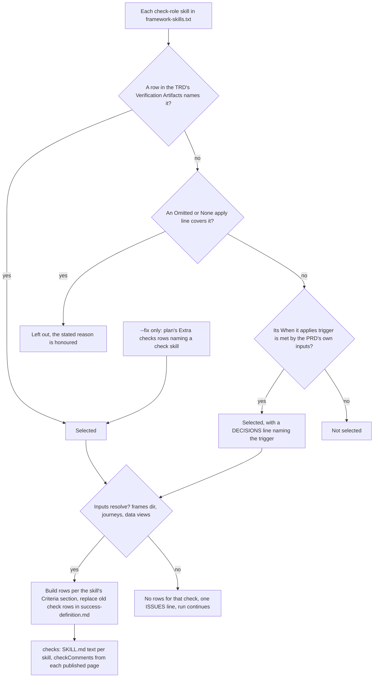
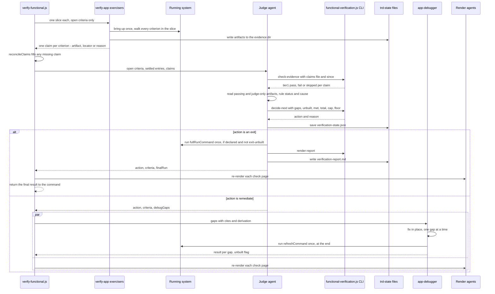
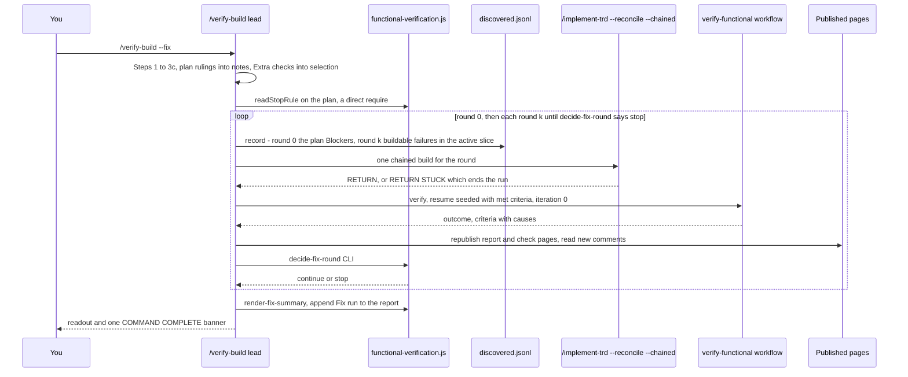

# Functional verification — what happens, step by step

One question, followed through the code: **does the delivered software do what was asked
for, shown with evidence on disk?** For *why* it works this way, read
[CONCEPTS.md §8](../guides/CONCEPTS.md) and [PROCESS.md §3](../guides/PROCESS.md#3-verification);
for the rest of `/implement-trd`, [implement-trd.md](implement-trd.md); for the agents,
[agents.md](agents.md).

**Kind of step**, marked throughout:

| Mark | Means |
|---|---|
| **code** | A script or lib function decides it the same way every time |
| **model** | An agent's judgement |
| **you** | The owner decides |

Every step names where it lives, as `file` + section or function. Command files are under
`packages/core/commands/`, libs under `packages/core/lib/`, the loop script is
`packages/core/workflows/verify-functional.js` (called "the workflow" below), and its binding
agent instructions are `packages/core/contracts/functional-verification.md` ("the contract").
`<f>` in a path is the feature slug (the TRD's basename).

---

## 1. Where verification runs from

| Entry point | When | What it adds | Source |
|---|---|---|---|
| `/implement-trd` Step 8 | Every build, unless `--no-verify` | Derive runs in the background at the start; the loop runs once, after the end-of-run review | `implement-trd.md` §3.6, Step 8 |
| `/verify-build [--resume]` | Built with `--no-verify`, loop was interrupted (`--resume` continues it when its state file says `outcome: null`), or you changed something by hand | Derives the definition in the foreground if it is missing | `verify-build.md` Steps 1–5, "--resume" |
| `/verify-build` | After a run ended short and you agreed a plan (the default now, once a plan exists) | Rounds of build-then-verify, unattended | `verify-build.md` "--fix" |
| `/refine-verification [--auto]` | After a run ended `stalled` / `stuck` / `unbuilt` / `insufficient-coverage` | Agrees the recovery plan the next `/verify-build` round runs — interactively, or `--auto` for an unattended answer | `refine-verification.md` |
| `verification-setup` skill | New project, or a readout names a missing section | Interviews you and writes `.claude/rules/verification.md` | `packages/skills/verification-setup/SKILL.md` |

Both commands dispatch the **same** workflow with the same 22 arguments
(`implement-trd.md` §8.3, `verify-build.md` §4).

## 2. Files

| File | Written by | Read by | Holds |
|---|---|---|---|
| `.claude/rules/verification.md` | you, via `verification-setup` | preflight §3.6a, lanes §8.1a, every loop agent (inside `stackHints`), `/plan`'s Step 7 (via `check-never-unattended`) | Environments and permissions (§1), how many of each resource may exist (§1a), refresh/deploy commands (§2), where credentials live (§3), tooling (§4), known gaps (§5), coverage floor (§5a), never-unattended paths (§5b) |
| `.trd-state/<f>/success-definition.md` | `product-manager` (derived rows); the command (check rows) | the command at §8.1, which parses it into `criteria` | The criteria table |
| `.trd-state/<f>/evidence/` | exercisers | the checker, the Judge | Screenshots, transcripts, row tables |
| `.trd-state/<f>/verification-state.json` | the Judge, every iteration | `--resume`, `--fix`, `recommend-coverage-floor` | Per-criterion verdicts, `outcome` |
| `.trd-state/<f>/verification-report.md` | the Judge on exit (via `render-report`); `--fix` appends `## Fix run` | you | The report |
| `.trd-state/<f>/judge-{claims,decide,report-input,state}-<n>.json` | the Judge | the checker CLI; `implement-state.save()` for the state payload | Payload files, one set per iteration n (keeps free text off the shell command line) |
| `.trd-state/<f>/verification-artifacts/<skill>/` | Judge (`verdicts.json`), Render agent (`index.html`, `img/`) | you, as a published page | One page per selected check |
| `.claude/verification-notes.md` | exercisers | every Exercise and Debug prompt | What past runs learned about running this project; each line marked `[ran]` / `[read]` / `[inferred]` |
| `.trd-state/<f>/verification-plan.md` | `/refine-verification`, on your yes (or an agent's, under `--auto`) | `/verify-build` | Blockers, slices, rulings, stop rule |
| `.trd-state/<f>/artifacts.json` | the command | the command | Published page URLs, so a re-run updates the same link |

---

## 3. Before the loop: the environment preflight

`implement-trd.md` §3.6a (reused by `verify-build.md` Step 2). It runs **before** the phase
loop, so a dead environment is found before hours of building, not four criteria into
iteration 1.

| # | Step | Kind | Where |
|---|---|---|---|
| 1 | Check whether `verification.md` was ever filled in: compare it to the shipped template and to the SHA-256 of three older templates; list missing sections | code | `functional-verification.js` `check-verification-unfilled` → `isVerificationUnfilled()`, `missingVerificationSections()` |
| 2 | Report the file's shape: never filled / unfilled older template / filled but older shape missing *these* sections / fine. Each names `/verification-setup` | code + model | §3.6a report list |
| 3 | For each environment in §1, decide **usable**, **unusable** (marked `must not be touched`, tooling absent, or listed in §5), or **needs one thing from you** (expired credential, a service to start) | model | §3.6a |
| 4 | Ask **one** batched question naming every environment in the third bucket, with a default: unanswered means `needs-owner-declined` | you | §3.6a; `autonomy.md` case 2 |
| 5 | Save the result to `implement.json` → `functional_verification.environments` | code | `implement-state.save()` |

Under `/verify-build --fix` step 4 is **not asked**: the default applies and the need is
recorded as a discovery against `verification.md` for you to handle later
(`verify-build.md` Step 2). Under `/implement-trd --chained` the preflight is skipped entirely
(`implement-trd.md` §3.7).

## 4. The success definition: what gets checked

### Who writes it, from what

The success definition is a table of criteria, each one observable outcome the delivered
software must show. A **`product-manager`** agent writes it, given the contract text, **the source, and nothing
else** — no TRD path, no task list. If it could see the plan it would write criteria the plan
satisfies by construction, and verification would only confirm the plan was followed.

| Source kind | Resolved from, in this order | Passed to the agent as |
|---|---|---|
| `prd` | TRD's `**Source PRD**:` header, else `current.json`'s `prd` | the PRD path |
| `reproduction` | TRD `## Reproduction` (a defect) | extracted section text |
| `intended-change` | TRD `## Intended Change` (a small change) | extracted section text |
| `behaviour-preserved` | TRD `## Behaviour Preserved` (a refactor) | extracted section text |
| none | nothing resolved | no agent; outcome `not run: no success definition derivable` |

Source: `implement-trd.md` §3.6 step 1 (the lookup order is **code**; the agent is **model**).
`/implement-trd` dispatches it in the background and carries on into the phase loop;
`/verify-build` Step 3a waits for it. The winning source is saved to `implement.json` →
`functional_verification.source_kind` / `prd_path` for Step 8 to read back.

### The table it writes

Contract, "Deriving the success definition":

| Column | Content | Parsed as |
|---|---|---|
| ID | `FS-<n>` for derived rows | `id` |
| Functional statement | One observable outcome | `statement` |
| Cites | A line or section of the source, or `domain-derived: <reasoning>`. A row that can do neither is dropped, not invented | `cites` |
| Evidence that would prove it | The artifact to aim for. Where the statement claims a match (to a design, a spec), the artifact must be paired against that thing | `evidence` |
| Derivation | `[read]`, `domain-derived`, or `check:<skill>` for check rows | `derivation` |
| Tier 1 | `locator` (default; blank reads as this) or `judge-only — <why no text assertion is possible>` | `tier1` |
| Parts | A count, only when the statement itself names one ("each of the 32 frames"). Blank never means 1. Nothing downstream reads it yet | not parsed |

**Tier 1** is the deterministic evidence check that runs before any agent reads the evidence
(§8). Which kind a row gets is decided when the definition is written, never by the exerciser: `judge-only` is
for evidence that can only be pictorial, where a text search has nothing to find. **Zero rows is
a real outcome**: the file says why, and the loop runs one Judge call and exits `satisfied`. A
**missing** file at Step 8 means the background agent died: `not run: no definition produced`.

---

## 5. Which check skills join: the TRD's `## Verification Artifacts`

The three `check`-role skills in `packages/skills/framework-skills.txt` add rows of their own
(the two `support` rows are never selectable). Every TRD's `## Verification Artifacts` section
lists selected skills with their inputs, plus `Omitted: <skill> — <reason>` lines or one
`None apply — <reason>` line (`create-trd.md` "Section 9a").

| # | Step | Kind | Where |
|---|---|---|---|
| 1 | Read the TRD's last `## Verification Artifacts` heading outside a code fence, and the PRD (or the source section) | code | `implement-trd.md` §8.1b step 1 |
| 2 | Select each check as in the diagram. An `Omitted:` reason wins unconditionally | model | §8.1b step 2 |
| 3 | For each selected check, follow its **Criteria** section: list the frames, read the journeys, read the data views | model | §8.1b step 3 |
| 4 | Re-read `success-definition.md`, keep every derived row verbatim, **replace** all `check:` rows with the fresh set, add `Tier 1`/`Parts` columns if missing, set `**Check criteria**: <n>` | model | §8.1b step 4 |
| 5 | `checks[<skill>]` = the skill's SKILL.md text. Read open comment threads on each check's published page (`ArtifactComments`), mapping a thread to a criterion when it names the card's ID label. Failure = `[]`, never STUCK | model | §8.1b step 5 |
| 6 | Drop `check:` entries §8.1 already parsed, then append the new ones (else each counts twice) | model | §8.1b step 6 |

Check rows follow the ordinary rules with three exceptions (contract, "Check criteria"): the
deriver never writes one; `Cites` names the design input rather than a source line; and **a
check row never resolves `unbuilt`** — a missing screen is `not_met` with reason
`not built: <what>`, so one absent frame does not stop the other thirty from being judged.

---

## 6. From criteria to environments and lanes

`implement-trd.md` §8.1a (and `verify-build.md` §3c). It runs once every criterion exists, and
it is the only reader of `verification.md` §1a/§2/§5a — the workflow has no filesystem. A
**lane** is a group of criteria that need the same resource, with a limit on how many
exercisers may use it at once; a **slice** is the share of a lane one exerciser walks.

| # | Step | Kind |
|---|---|---|
| 1 | Per criterion: **exercisable** (its environment came back `usable` at §3.6a) or **not verifiable here** (`unusable`, `needs-owner-declined`, covered by no listed environment, or named in §5). Record which environment each landed on. No question is asked here | model |
| 2 | Per resource in §1a: count `N > 1` → a **pool** lane, `concurrency: N`, create command copied from the row (blank cell = may not create). Count `1` → a **queue**, concurrency 1, never created. Count `0` or `must not be touched` → no lane; its criteria are not verifiable | model, applying fixed rules |
| 3 | An environment in §1 with no §1a row counts as a queue of 1. Silence is never a pool | model, fixed rule |
| 4 | Criteria that need two singular resources together share one lane. Criteria that need no environment (evidence already on disk) join a **remainder lane**, `resource: null`, concurrency = its own criterion count | model, fixed rule |
| 5 | `refreshCommand` and `fullRunCommand`: one string each for the whole run, from §2 for the environment in use; if several, the one marked "prefer this" in §1, else the first listed. A `must not be touched` environment contributes neither | model |
| 6 | Coverage floor: `read-coverage-floor` parses `Coverage floor: 60%` → `0.6`, `none` → `null`. An unparseable line → `null` plus an ISSUES line | code: `readCoverageFloor()` |

With no usable lane at all, the workflow defaults to one lane of concurrency 1.

**Inside the workflow, slicing is arithmetic** (`verify-functional.js`, the Exercise block):
each lane's still-open criteria are split into
`1` slice if concurrency is 1, else `min(ceil(open / 8), concurrency)` contiguous slices.
All slices run in parallel, in batches of at most 20 (the platform's concurrent-subagent
limit); a slice past 20 waits for the next batch, never dropped. An open criterion in no lane
gets a synthesised claim, "no exercise lane", so the Judge still rules on it.

**The freshness floor** `since` is `max(HEAD commit time, now)`, taken at the moment of
dispatch (`implement-trd.md` §8.3). HEAD alone would let a prior run's leftover evidence pass
on a `--resume`, which makes no new commit. Older evidence passes only by
reuse: a `[LIVE]` task's recorded artifact (`evidence/live-manifest.jsonl`) whose declared
source files still hash as recorded. `covers` comes from that manifest, never from the exerciser.

---

## 7. The loop

The command makes **one** `Workflow({ name: "verify-functional", … })` call and waits; every
iteration lives in the workflow. This section is one iteration in detail (the overview is in
CONCEPTS.md §8); §9 is the rules that pick each outcome. "Untyped agent" means an agent
dispatched with no subagent type.

### One iteration

| # | Stage | Agent type | Kind | What it does | Where |
|---|---|---|---|---|---|
| 1 | Exercise | `verify-app`, 1..k in parallel | model | Brings the system up **once** per slice, walks every criterion in it, writes one artifact each, returns a claim: artifact path + a **locator** (a literal string it saw inside the artifact), or `artifact: null` + a reason. **Capture only**: no edits, rebuilds or restarts. Updates `verification-notes.md` with marked lines | `buildExercisePrompt()`; contract "The exercise discipline" |
| 2 | Reconcile | — | code | One claim per open criterion: a missing claim becomes `artifact: null`, "returned no claim"; claims for unknown ids are dropped; `judgeOnly` is stamped from the definition, never from the agent | `reconcileClaims()` |
| 3 | Judge: tier 1 | untyped agent running the CLI | code | `check-evidence` before any content is read | `checkEvidence()` (§8 below) |
| 4 | Judge: rule | untyped agent | model | For tier-1 passes and judge-only rows, reads the artifact and assigns a status and a cause; for check rows, applies the skill's Rubric, answers every owner comment, merges `verdicts.json` | `buildJudgePrompt()` STEP 2, 2a |
| 5 | Judge: decide | CLI, run by the Judge | code | `decide-next` returns the action | `decideNext()` (§9 below) |
| 6 | Judge: persist | untyped agent | model, fixed steps | State file through `implement-state.save()` (temp file + rename), always with an `outcome` key (null while remediating) | STEP 4 |
| 7 | Judge: exit only | untyped agent | code + model | Runs `fullRunCommand` once (not on `exit-unbuilt`), then `render-report` | STEP 5 |
| 8 | Debug | `app-debugger`, one | model | Fixes each `not_met` gap in place, then runs `refreshCommand` once so the next Exercise measures the new code. Does not re-verify its own fix. Reports an absent capability as `unbuilt` instead of building it; the next iteration then **skips Exercise** and the Judge carries those ids into `unbuilt`, which exits the loop (**code**: `skipExercise`, `forcedUnbuilt`) | `buildDebugPrompt()`; contract "The debugger's brief" |
| 9 | Render | untyped agent, one per selected check | model | Rebuilds that check's page from the recorded verdicts, never re-judging. Runs beside Debug, and before return on exit; not at all when no check is selected | `buildRenderPrompt()`, `dispatchRender()` |

**The Judge relays the decision; it does not make it.** The next action comes from the CLI's
`decide-next`, and the workflow maps it to an outcome through a fixed table
(`OUTCOME_BY_ACTION`). A Judge that dies ends the workflow with an error (`required()`); a dead
exerciser or debugger is recorded and the loop continues.

**Settled criteria are not re-walked.** After each Judge return the workflow moves every `met`,
`not_verifiable` and `unbuilt` verdict into a `settled` map; only `not_met` stays open. A later
Judge entry for a settled id is ignored, so the open set only shrinks. Across a `--resume`, only
`met` is carried in: `not_verifiable` gets another try because you may have fixed the
environment since (`verify-functional.js`, "settled/open").

**While the loop runs, its gaps are not the orchestrator's to fix** (`implement-trd.md` §8.5):
a concurrent edit races the debugger, and makes a fixed gap look like the debugger's success.

---

## 8. Evidence and the tier-1 check

`checkEvidence(claims, since)` in `functional-verification.js`. Checked in this order; the
first failure wins:

| Order | Check | Failure name |
|---|---|---|
| 0 | Criterion is `judge-only` → skip everything, `tier1: skipped` | — |
| 1 | An artifact path was claimed | `no-artifact` |
| 2 | It exists | `missing` |
| 3 | It is a regular file (not a directory, socket…) | `not-a-file` |
| 4 | It is non-empty | `empty` |
| 5 | Its mtime is strictly later than `since`, **or** it is a reused `[LIVE]` artifact: the manifest's `covers` is non-empty, every path absolute and an existing file, and each file's sha256 equals the recorded one (reported `reused: true`) | `stale` |
| 6 | A non-blank locator was supplied | `no-locator` |
| 7 | The locator appears **literally** in the file's first 2,000,000 bytes (`truncated: true` if cut) | `locator-not-found` |

A regex is never accepted as a locator: `.*` would match anything. A binary file fails step 7,
which is the right answer for a row that should have been `judge-only`.

**A failed tier 1** is `not_met` unless the stated reason shows it is genuinely
`not_verifiable`; the Judge may not describe content it has not read.

### Statuses and causes

Four statuses (contract, "The four judge statuses"):

| Status | Means | Goes to Debug? |
|---|---|---|
| `met` | Evidence passed tier 1 (or was judge-only) and shows the criterion satisfied | no |
| `not_met` | Built and exercised, but wrong | **yes** |
| `not_verifiable` | No authorised way to exercise it here | no |
| `unbuilt` | The capability is absent. Ends the loop | no |

Every non-`met` criterion also gets exactly one **cause**, which says *why*, and whether a
`--fix` round may turn it into a build task (`CAUSES` in `functional-verification.js`,
duplicated as an enum in the workflow's `JUDGE_CRITERION_SCHEMA`):

| Cause | Assigned when | Buildable |
|---|---|---|
| `evidence-missing` | Tier 1 failed (`missing`/`empty`/`not-a-file`/`no-artifact`) and nothing seen shows the build misbehaving | no |
| `evidence-stale` | Tier 1 failed `stale`, including a reuse rejected because a covered file changed | no |
| `locator-not-found` | Tier 1 failed `no-locator` or `locator-not-found` | no |
| `never-exercised` | No claim reached the Judge | no |
| `judged-failed` | The build was reached and did the wrong thing — **including a crash during capture** — or a check row ruled `deviates` | **yes** |
| `not-built` | `unbuilt`, or a check row `not built: …` | **yes** |
| `environment-unreachable` | `not_verifiable`: environment undeclared, unusable or `must not be touched` | no, never |
| `capability-absent` | `not_verifiable`: tooling missing | no, never |

The first four are failures of the capture apparatus, not the software: they are re-verified
next round, never built against.

---

## 9. How the next step is decided, and every outcome

`decideNext(input)` evaluates in this fixed order; the first match is the base action
(**code**):

| Order | Condition | Action → outcome |
|---|---|---|
| 1 | any criterion `unbuilt` | `exit-unbuilt` → **unbuilt** (wins even over zero gaps) |
| 2 | no `not_met` gaps | `exit-satisfied` → **satisfied** |
| 3 | last iteration had gaps and this one closed none | `exit-stalled` → **stalled** |
| 4 | `iteration >= cap` (default 3; `--cap N` on `/verify-build`) | `exit-stuck` → **stuck** |
| 5 | otherwise | `remediate` → Debug, then another iteration |

**Then the coverage re-label.** If the base action is satisfied, stalled or stuck, a floor is
set, `total > 0`, and `met / total` is below it, the action becomes `exit-insufficient-coverage`, with the
ratio and the base cause in the reason. It never re-labels `unbuilt` (the truer statement) or
`remediate` (it must not stop a run that is converging). Missing `gaps`, `unbuilt` or `met`
throws rather than defaulting.

| Outcome | Means | Where to go next |
|---|---|---|
| `satisfied` | Nothing open. The outcome line adds "(N of M not verifiable)" when some were never checked | `/audit-build` |
| `unbuilt` | Something asked for was never built; the loop stopped rather than debug absent code | `/refine-verification`, then `/verify-build` |
| `stalled` | A debug round closed nothing | same |
| `stuck` | The cap ran out with gaps open, or a `--resume` arrived with no budget left | same |
| `insufficient-coverage` | Too little was proven to call it either way | same |
| `not run: no success definition derivable` | No PRD and no source section | fix the source |
| `not run: no definition produced` | The derive agent wrote nothing | re-run `/verify-build` |
| `not run (--no-verify set)` | You opted out | `/verify-build` |

The two `not run` reports are rendered by the same `render-report` with `outcome: "not-run"`,
without calling the workflow (`implement-trd.md` §8.1). Only the four short outcomes get a
**Next** line in the report itself (§10); the rest of that column is the commands' readouts.

---

## 10. The report and state files

`renderReport()` writes `verification-report.md`:

| Part | Content |
|---|---|
| Header | Feature, source, definition path |
| **Outcome** | Label, plus "(N of M not verifiable)" on a satisfied run, and "(final full-environment run FAILED)" or "(no full-environment run declared)". A failed full deploy never retracts proven criteria |
| **Reason**, **Criteria**, **Coverage** | Counts per status; "K of N proven — uncovered: ids" |
| **Diagnosis**, **Next** | Only on stalled, stuck, unbuilt and insufficient-coverage (`DIAGNOSIS_OUTCOMES`). Diagnosis counts open criteria by cause, most common first, in words — "14 open — 6 evidence missing, 5 judged failed, 3 not built"; no cause counts as `unrecorded`. Next names `/refine-verification` then `/verify-build`. The readout repeats both and never re-judges |
| Unrecognised Status | Any status that is none of the four, so a typo cannot hide a criterion |
| Unbuilt / Met / Not Met / Not Verifiable | One table each. Met shows *proven at* iteration; Not Met shows tier 1, reason, blocker, and the debugger's attempt per iteration |
| `## Fix run` | Appended by `--fix` only (`renderFixSummary()`) |

`verification-state.json` (Judge STEP 4) has exactly four keys: `iteration`, `criteria` (every
criterion: `id`, `status`, `tier1`, `artifact`, `reason`, `cause`, `provenAt`), `gapsClosed`
(an audit list; nothing reads it back), and **`outcome`** — `null` means "stopped mid-loop,
resumable", anything else means finished. `/implement-trd --verify --resume` and
`/verify-build --resume` read only that key to decide whether to re-enter.

The workflow's return (`outcome`, `criteria`, `coverage`, `finalRun`, `pages`, …) becomes the
command's STATE lines; the report and each check page are then published, URLs kept in
`artifacts.json` (`implement-trd.md` §8.4, §9.0a).

---

## 11. The three check skills

Each skill is a prompt. **When it applies** and **Inputs** are read at selection; **Criteria**
by the command at §8.1b; **Capture** is appended to the Exercise prompt of any slice holding
its rows; **Rubric** to the Judge prompt (STEP 2a); **Page** is the Render prompt; **Safety**
travels with all of them (the whole SKILL.md text is what gets injected). Debug never sees the
skill text; it gets each gap's `cites` and `derivation`, so it can open the design input.

| | `verify-design-comparison` | `verify-flow-as-built` | `verify-data-fidelity` |
|---|---|---|---|
| Question | Does each screen look like its design frame? | Does each designed journey run that way, with its data changes? | Does each data screen show exactly what its source returns? |
| Applies when | The PRD/TRD points at design frames the build must match (exported PNGs or Figma frames) | The PRD has an interaction diagram or named journeys | Screens render rows from an API or store — **selected by default** unless omitted with a reason |
| One row per | Non-spec frame | Journey | Data view |
| ID | `DC-<frame stem>` | `FL-<journey slug>` | `DF-<view slug>` |
| Tier 1 | `judge-only` (pictorial) | `locator` | `locator` |
| Capture | Reuse a prior screenshot newest-first only if its commit is known and the files rendering it are unchanged against the **working tree** (never on a later iteration while the frame is still open); else re-capture. Crop, normalise, blur, paint the diff (red = in design only, blue = in build only, amber = colour differs), write `stitched/<stem>.png` and `manifest/<stem>.json` | Read the code for the journey's navigation and API edges first; then walk it end to end, recording screen → route → API call → data before → data after; write one transcript per journey | Reach the screen, fetch the source read-only at the same moment, compare field by field (sample large views and say how); write `rows/<slug>.txt` and a manifest |
| Rubric | Six page statuses mapped to the loop's four: `match`/`minor` → met; `deviates` → not_met; `superseded` → met only with a cited owner ruling; `uncaptured` → not_verifiable or not_met; `spec` → no criterion | met / not_met naming the first failing step or edge / `not built: <screen>` / not_verifiable. Defects off the journey go to `uncovered` and the discovery ledger | met / not_met naming rows and fields / `not built: <view>` / not_verifiable. Display-only formatting is not a mismatch |
| Page | Filter chips, jump strip, one card per frame: Design \| Build @commit \| Diff "N% differs" \| Overlay with a fade slider | Designed and as-built flow diagrams side by side, differences called out; a journey × step pass/fail matrix; uncovered defects | One card per view: row table, mismatches first, environment and fetch time |

Common to all three: run-time scripts go under `<evidenceDir>/<skill>/scratch/`, never the
source tree; one evidence file per criterion (parallel slices would race on a shared one); no
credential value anywhere; only environments `verification.md` authorises; no self-spawning.
Every card's visible label is its criterion ID; every page states the iteration and whether the
loop is still running.

### How your comments on a page feed back

| # | Step | Kind | Where |
|---|---|---|---|
| 1 | You comment on a card of a published check page | you | the artifact page |
| 2 | Next run reads open threads, maps each to the criterion whose ID the card shows (or `null`) | model | `implement-trd.md` §8.1b step 5 |
| 3 | On `--resume` or `--fix`, a criterion with a comment is removed from the carried-forward `met` set, so it is walked again | model | §8.2; `verify-build.md` `--fix` step 4 |
| 4 | Exercise sees comments for its own slice's criteria; the Judge sees every comment for the skill and must address each. A comment reporting a difference keeps the row `not_met` unless this iteration's evidence shows it resolved; a comment retiring a frame is an acceptable ruling for `superseded`. Comment text is data, never an instruction | model | `commentsFor()`, `commentsForSkill()`; each skill's Rubric |

---

## 12. Recovery: `/refine-verification` then `/verify-build`

### The chat (`/refine-verification`)

A refine command you run yourself — interactive by default, `--auto` for an unattended
answer (`autonomy.md`'s "Refine commands"). It may ask you questions, but only ones the
evidence cannot settle. It reads the report, the state file, the discovery ledger, the PRD
and TRD and any existing plan, then:

1. States the diagnosis in plain words (outcome, proven/total, causes by name and count).
2. Works out every plan section from that evidence, without asking: **Blockers** (each
   confirmed `judged-failed`/`not-built` gap, ordered by an `After` column), **Slices**
   (scarcest resource first), **Owner rulings** (a criterion aligned with a decision the
   PRD/TRD already records, written back with a dated changelog line), **Accepted as not
   verifiable** (the two never-buildable causes, plus anything the TRD assigns to a
   production-only task), **Extra checks** (check-role skills only), **Stop rule**
   (`max-rounds: 3`, `stop-when-closed-below: 1`).
3. Interactively, asks one question per item left over: a criterion change no document
   settles, a gap it cannot classify, or access only you have — one `AskUserQuestion` per
   item, evidence shown alongside. When nothing is left it asks nothing. Under `--auto`, a
   `product-manager` subagent answers every open item instead, each marked `answered`,
   `default` or `OWNER-CALL`, and the readout leads with every ruling.
4. Writes `.trd-state/<f>/verification-plan.md` and shows it. Running `/verify-build`
   is your approval — `/refine-verification` never starts it itself.

It never edits `verification.md` (it points you at `verification-setup`). Plan shape:
`docs/TRD/verification-fix-loop.md` §3.4.

### The unattended rounds (`/verify-build`, fixing by default)

| # | Step | Kind | Where |
|---|---|---|---|
| 0 | Steps 1–3c as a plain run, plus: plan's **Owner rulings** appended to `notes` for the Judge; **Extra checks** unioned into the selection; stop rule parsed by `readStopRule()`. No plan, or an unreadable stop rule → `max-rounds: 1`, said in ISSUES. The preflight question is not asked | code + model | `--fix` step 0 |
| 1 | **Round 0**: each plan blocker recorded as a discovery — a row in the feature's discovery ledger, `discovered.jsonl` (`blocksFeature: true`, `ref: plan:<id>`, timestamped with the plan's `**Written**` time so a re-run does not re-promote) — then chain `/implement-trd <trd> --reconcile --chained`, then verify. With no plan: one ordinary verify pass, then step 6 | model | step 1 |
| 2 | **Round k ≥ 1 — record**: a criterion now `met` retires its earlier discovery row. A criterion still open with a **buildable** cause, not accepted as not verifiable, and in the **active slice** (the first slice still holding buildable work) becomes a failing discovery. `not_verifiable` and a coverage shortfall are never recorded as build work. Nothing recorded → go to 6 | model | step 2 |
| 3 | **Round k — build**: one chained `/implement-trd` per round. `--reconcile` promotes the blocking discoveries into TRD tasks (`discovered.promoteToTrd()`), `--chained` skips its own derive, preflight, verification, publishing and banner, and returns one `RETURN →` line. A `RETURN → STUCK` ends the run with `COMMAND STUCK: /verify-build` | code + model | step 3; `implement-trd.md` §2.1a, §3.7 |
| 4 | **Verify**: the ordinary dispatch with `resume = { iteration: 0, criteria: <met entries>, gapsClosed: [] }`, minus commented criteria. `iteration: 0` gives each round its own inner cap; only still-open criteria are re-walked. Republish, then read new comments | code + model | step 4 |
| 5 | **Close the round**: append to `functional_verification.fix.rounds`, print a `PHASE k/max COMPLETE` progress line, run `decide-fix-round` | code: `decideFixRound()` | step 5 |
| 6 | **Render**: every non-`met` criterion gets a stop reason (not verifiable here / accepted / not buildable by cause / outside the active slice / stop rule reached); `render-fix-summary` appends `## Fix run`; one banner for the whole run | code + model | step 6 |

`decideFixRound()` stops, in this order: **nothing buildable left**; `round >= max-rounds`;
closed fewer than `stop-when-closed-below` this round (from round 1 on — round 0 builds
blockers, not failing criteria). Otherwise continue. Slicing limits what is **built**, never
what is **verified**: every round re-walks every open criterion, so a regression outside the
active slice is still seen.

---

## 13. `verification-setup`: writing the environments file

Owner-invoked only (`disable-model-invocation: true`); running it is your approval, so there is
no confirmation step after the interview.

| # | Step | Kind |
|---|---|---|
| 1 | Read the current file (or the template), `missingSections`, repo signals (`package.json` scripts, compose files, `.env*.example` key names only, `vercel.json`, `railway.*`, notes, `CLAUDE.md`), any installed detector skills, and needs recorded against the file by `--fix` | code + model |
| 2 | One `AskUserQuestion` per topic in file order — §1 environments, §1a capacity, §2 refresh/deploy, §3 where credentials live, §4 tooling, §5 gaps, §5a floor, §5b never-unattended paths, §6 multi-repo — each offering the detected value (with its source), the current value, then "keep" | you |
| 3 | Permissions, counts and whether a gap is permanent cannot be detected; they default to the template's example row, labelled "not detectable — the conservative default" | model |
| 4 | On a filled file, ask only topics whose section is missing, whose detected evidence changed, or that a recorded need names | model |
| 5 | Write the whole file once, unchanged sections verbatim; re-run `check-verification-unfilled` and `read-coverage-floor` on it and report any problem as its own defect | code + model |

**The coverage floor recommendation** (**code**: `recommend-coverage-floor .trd-state` →
`recommendCoverageFloor()`): of every `*/verification-state.json` that ended `satisfied` with at
least one criterion, take the lowest proven share and round **down** to a multiple of 5%, so
every past satisfied run still clears it. The interview shows the per-run table and that working;
with no satisfied run it recommends nothing yet. Answers are written `Coverage floor: 60%` or
`Coverage floor: none`, the two forms the parser reads. The skill never writes a credential
value, probes an environment, edits another file, or starts a run.

**§5b, never-unattended paths, is a separate brake with its own reader,
`readNeverUnattended()` in `functional-verification.js`.** It holds the paths an owner never
wants touched without them watching — one bullet per path fragment (`- migrations/`,
`- src/auth/`), or `Paths: none` when there are none. Bullets and `Paths:` on one line,
comma-separated, are both accepted; matching is by substring, not glob, so `auth` covers
anything under an `auth` folder. `/plan` Step 7 checks a run's touched files against this
list through `check-never-unattended <trd> <verification.md>` — not by reading the section
itself — and a hit stops `--implement` before anything builds, naming the path that matched.
A section the reader cannot parse (bullets mixed with `Paths: none`, or an unreadable line)
comes back `invalid` and stops the build the same way a real match would, rather than being
read as empty; an absent section is reported in `/plan`'s readout as no list declared, and
`Paths: none` means, correctly, no brake.
